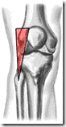
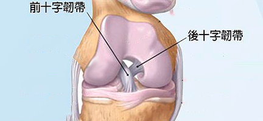
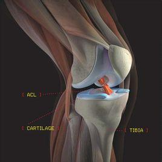
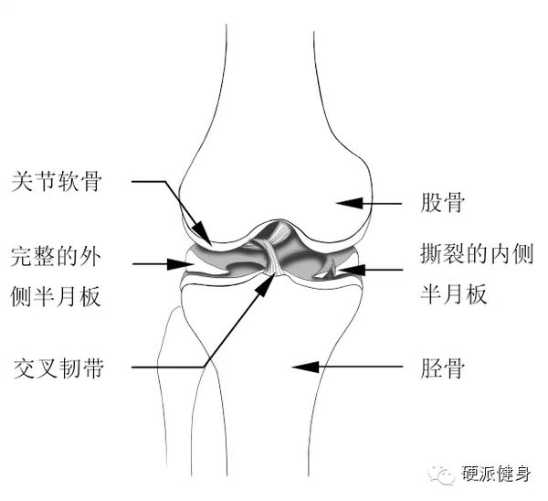
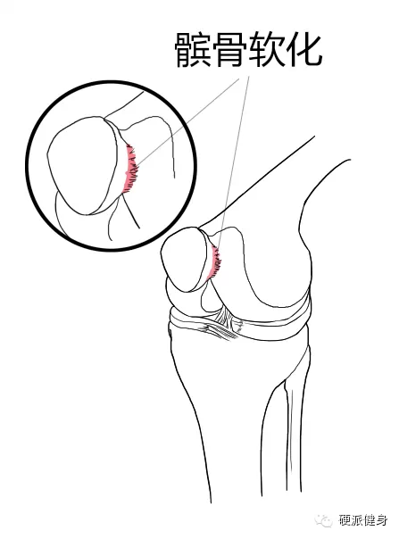

# 膝盖治疗保养手册

<!-- MarkdownTOC -->

- 膝盖过劳损伤
    - 膝盖外侧
    - 膝盖周围
    - 膝盖上方
    - 膝盖骨下方
    - 膝盖骨上方或上胫骨内侧
    - 如何处理
    - 力量练习帮助你肌肉重新平衡
        - 半蹲墙根
        - 单腿下蹲
        - 侧卧
        - 部下蹲
- 韧带损伤
- 软骨损伤
- 膝盖操

<!-- /MarkdownTOC -->

## 膝盖过劳损伤

膝盖过劳损伤：这些损伤的特征是膝关节前方或侧面感到疼痛，一般而言是膝盖缓慢的被损伤，而和特定的伤害如扭伤或跌伤无关。

有许多种膝盖过度损伤

1. 前膝盖疼（又叫髌股关节疼）
2. 髌腱炎
3. 髂胫束症候群（跑步膝）
4. 四头肌腱炎
5. 滑囊炎

你疼痛的部位是哪里？可能的原因和治疗方法

### 膝盖外侧

髂胫带疼

治疗方法：

1. 臀部下蹲
2. 侧卧
3. 双手双膝拉伸
4. 交叉腿
5. 拉伸后腿腱
6. 拉伸小腿

### 膝盖周围

前膝盖疼

治疗方法：

1. 单腿下蹲或臀部下蹲
2. 半蹲墙根或压腿
3. 侧卧
4. 拉伸后腿腱
5. 拉伸小腿
6. 鹤立
7. 下跪拉伸

### 膝盖上方

四头肌腱炎

治疗方法：

1. 鹤立
2. 拉伸后腿腱
3. 拉伸小腿
4. 下跪拉伸

### 膝盖骨下方

髌腱炎

治疗方法：

1. 鹤立
2. 拉伸后腿腱
3. 拉伸小腿

### 膝盖骨上方或上胫骨内侧

滑囊炎

治疗方法：

1. 鹤立
2. 拉伸后腿腱
3. 打坐
4. 拉伸小腿

### 如何处理

+ 休息——停止所有导致疼痛的运动，尤其是跑步、跳远、上下楼梯
+ 冰敷——每天两三次，将装有碎冰的塑料袋放在膝盖上15分钟
+ 服用阿斯匹林或布洛芬——为了减轻炎症每天服用3次，每次650mg阿司匹林或400mg布洛芬，服用1-2周，注意服药期间如果出现胃疼或血便，即刻停止服药
+ 力量练习——大腿或臀部力量不足是前膝盖疼和髂胫带征群的主要原因

### 力量练习帮助你肌肉重新平衡

#### 半蹲墙根

+ 背部靠墙，双脚位于身前18-24英寸处（45-60cm）
+ 慢慢的弯曲膝盖至小于90度角
+ 保持膝盖不超过你的脚趾
+ 保持一段时间后伸直膝盖
+ 为了锻炼大腿内侧，可以在膝盖之间夹一个球

#### 单腿下蹲

+ 把伤腿放在台阶上
+ 慢慢弯曲膝盖至另外一条腿碰到地面
+ 慢慢伸直膝盖

#### 侧卧

+ 双脚并拢，膝盖弯曲90度，侧卧
+ 将上面一条腿的膝盖缓慢向上举起，直到膝盖分离一掌宽
+ 保持一段时间，缓慢放下
+ 注意脚不要动，也不要把臀部翻倒平躺

####臀部下蹲

+ 靠墙用没有伤的腿站着
+ 收臀提臀
+ 保持臀部收缩到极限
+ 慢慢弯曲伤的膝盖至45度
+ 保持一段时间，慢慢伸直膝盖

---

## 韧带损伤

韧带是强韧、能够弯曲的肌纤维组织束，用以将关节周围的骨头连接在一起。你可以把它想象成一小捆交叉在一起的、细小的、充满弹性的橡皮筋，平时我们走路、跑步之类都靠它来控制，然而一旦太突然、或者太强烈的运动导致关节处的骨头被牵拉得太过分离，韧带的纤维就会被撕裂。

一般的韧带损伤会引起肿胀、疼痛和肌肉痉挛，听上去跟肌肉拉伤比较像，但实际上两者还是有区别的，首先，肌肉是有弹性的组织，普通的拉伤只是肌纤维的断裂，如果不是特别严重是很容易恢复的。而韧带拉伤则是骨头和骨头之间的连接出了问题，主观感受上会有一种不稳定的感觉，就像是搭积木一样，完全分离成两个不同的部位。

ACL撕裂损伤

在平时的训练、运动中，ACL（膝关节前交叉韧带）损伤，是非常高发的一类伤病。在职业体育中，尤其是在足球、篮球、武术摔跤等运动项目中高发。前交叉韧带的作用是防止胫骨前移，所以如果交叉韧带受伤，很容易造成后续的关节软骨、半月板、或者其他相关部位受伤。

## 软骨损伤

软骨损伤一般在膝关节中最常遇到的有两种，一种是髌骨软化，一种是半月板撕裂。我们先说说半月板。

膝关节内含有弯曲的垫子一样的软骨盘，一般我们称之为“半月板”，形态撑“C”字形，是由坚韧的纤维软骨构成——这么说可能你们觉得太抽象，但你们回忆一下啃鸡腿的时候就知道了，在靠近骨头的地方有一小块嚼起来又有弹性又脆的骨头

膝关节的内侧和外侧都有半月板，半月板有稳定膝关节的作用，站立时有助于锁定关节，并在骨头与骨头之间起到了垫子的作用。

我不知道你们小时候有没有上过用冰棍堆一个房子出来的手工课，那时候万能胶之类的东西还不是到处都买得到，所以我们都用嚼过的泡泡糖连接两根棍子，摆出各种各样的形状。软骨盘对骨骼的作用跟那个时候的口香糖也差不多，同时起到缓冲和定型的作用。

正常的半月板

当小腿遭到扭转等，半月板会被撕裂

而当膝关节快速的扭转时，半月板就会被强大的压力损害……最后，轻则导致半月板破损发炎，重则直接导致半月板撕裂。

髌骨也是相似的，髌骨俗称膝盖骨，你伸手下去摸摸，就是膝盖上那块儿凸出来的。髌骨一开始的作用是保护膝关节，避免大腿骨的过度摩擦，也可以维持膝关节在弯曲时候的稳定。

## 膝盖操

+ 为了伸展你的小腿肌和脚跟腱，你可以站在离墙或者树三英尺远的地方，你的两只脚并直站着，身体向前弯曲，直到你的腿稍微感到不好受时为止，坚持十秒钟，然后放松，这样反复做五六次。如果你患有膝关节软骨软化病（下一章要谈到的一种膝关节病）的话，你做这种体操可能是很痛苦的。在这种情况下，你可以作一个有益的改变。你平躺在地板上，在患病的膝盖下面放几个枕头，在这只脚上加上重量，然后把腿伸直。用这种方法，可以大大减轻对膝关节的压力。
+ 为了伸展你的腘旁腱——大腿背面的肌肉，两条腿站直，然后把一只脚放在齐腰高的桌上，如果你够不着这个高度，就放在低一点的东西上，你的头向膝盖处弯曲，直到你感到腿的肌肉拉得很紧时停下来，坚持十秒钟。如果你喜欢的话，用手握住腿或者脚来稳定你自己的身体，然后放松。每条腿反复操练五六次。（理疗专家特德•科贝特说，他认为下面这种锻炼方法比较有效：先屈膝，弯曲身体，手触地，然后用你十个手指支撑在地上，把身体向上推，直到你感到你的腘旁腱拉得很紧时停下来，坚持几秒钟后，双手离地，慢慢地、一个脊椎骨一个脊椎骨地使身体直起来，直到你站直为止。用这种方法反复做五六次。）
+ 为了伸展后背的下半部及腘旁腱，仰卧在地上，两臂伸直、分放在身体两侧、膝关节伸直，两腿抬到你的头上面，尽量把它们放低，如果可能，让两只脚接触到你背后的地面上，坚持十秒钟，然后放松，反复做五六次。
+ 为了加强你的胫肌，你坐在桌子边上，在脚的下半部，紧挨着脚趾的部位，挂上五磅重的东西。（放有石头的空油漆罐非常好。）然后慢慢抬起你的脚趾，坚持几秒钟，反复这样做，直到你感到累为止。
+ 为了增强你的四头肌，你再次坐到桌上，把重量拴在一只脚的脚趾上。然而这一次是伸直你的膝关节把重量抬起来，停留几秒钟，然后放下，每条腿反复做五六次。
+ 最后，为了加强你的腹肌（与很有劲的背部肌相对的肌肉），按前面所述，屈膝仰卧起坐，做二十次左右。你的两只手紧抱着你的头（这是最难做的姿势），或者伸到你的头顶上（这是最容易做的姿势）。然而，不管用哪种姿势来做，都应该在开始做仰卧起坐时先收下巴，把身体从地面卷起，以便最大限度地利用腹肌。
+ 跑步者需要有充足的睡眠。要是你睡眠不足，很快就会越来越感到疲劳，使你无精打彩，缺乏热情和容易感冒。
+ 不要发胖。有两条理由说明尽可能瘦一点好，第一，你身体瘦一点的话，你会跑得更好一些。休重越轻，你跑得就越快。第二，你身体越轻，身体的软骨、关节和肌肉就越不觉得劳累。
+ 要避免发生皴裂。在跑步之前，将这些部位涂上适量的凡士林，这样做一般都能预防皴裂，用胶布贴在你的乳头上——特别是在进行象马拉松那样的长跑以前，因为这个部位要经受磨擦——可以预防出现痛苦的磨擦。
+ 要防止冻伤。
