# 推荐系统实践

<!-- MarkdownTOC -->

- 推荐系统评测
    - 离线实验
    - 评测指标
    - 评测维度
- 利用用户行为数据
    - 基于用户的协同过滤算法
    - 基于物品的协同过滤算法
    - UserCF 和 ItemCF 优缺点对比
- 隐语义模型
- 基于图的模型
- 冷启动问题
- 利用用户标签数据
    - 一个最简单的算法
    - 改进：TF-IDF
    - 改进：数据稀疏性
    - 改进：标签清理
    - 基于图的推荐算法
    - 推荐标签
- 利用上下文信息
    - 物品的生存周期和系统的时效性
    - 推荐系统的实时性
    - 时间上下文推荐算法
    - 地点上下文信息
- 利用社交网络数据
- 推荐系统实例
    - 外围架构
    - 推荐系统架构
    - 推荐引擎的架构
        - 生成用户特征向量
        - 特征-物品相关推荐
        - 过滤模块
        - 排名模块
- 评分预测
- 十条经验和教训

<!-- /MarkdownTOC -->

---

推荐算法的本质是通过一定的方式将用户和物品联系起来，而不同的推荐系统利用了不同的方式。

几乎所有的推荐系统应用都是由前台的展示页面、后台的日志系统以及推荐算法系统 3 部分构成的。

亚马逊推荐列表的组成部分：

+ 推荐结果的标题、缩略图以及其他内容属性
+ 推荐结果的平均分
+ 推荐理由

基于物品的推荐系统还是比较流行的(Amazon, Netflix)

Pandora 背后的音乐推荐算法主要来自于一个叫做**音乐基因工程**的项目。

音乐推荐的特点：

+ 物品空间大(相对于书和电影而言)
+ 消费每首歌代价很小
+ 物品种类丰富
+ 听一首歌耗时很少
+ 物品重用率很高
+ 用户充满激情
+ 上下文相关(和心情，场景有关)
+ 次序很重要
+ 很多播放列表资源
+ 不需要用户全神贯注
+ 高度社会化

## 推荐系统评测

三个参与方：用户、物品提供者和提供推荐系统的网站，一个好的推荐系统是能够令三方共赢的系统。

### 离线实验

1. 通过日志系统获得用户行为数据，并按照一定格式生成一个标准的数据集
2. 将数据集按照一定的规则分成训练集和测试集
3. 在训练集上训练用户兴趣模型，在测试集上进行预测
4. 通过事先定义的离线指标评测算法在测试集上的预测结果

### 评测指标

**用户满意度**

调查问卷，推荐结果的直接反馈按钮(豆瓣电台)

**预测准确度**

可以通过离线实验计算，分为不同的研究方向

1. **评分预测**。一般通过`均方根误差(RMSE)`和`平均绝对误差(MAE)`计算。Netflix 认为 RMSE 加大了对预测不准的用户物品评分的惩罚(平方)，因而对系统的评测更加苛刻。研究表明，如果评分系统是基于整数建立的(即用户给的评分都是整数)，那么对预测结果取整会降低 MAE 的误差
2. **TopN 预测**。一般通过`准确率(precision)/召回率(recall)`度量。主要目的应该是找到用户最有可能感兴趣的电影，而不是预测用户看了电影会给多少分，所以 TopN 更符合实际的应用需求。
3. **覆盖率(coverage)**。对物品长尾的发掘能力。有两个著名的指标可以用来定义覆盖率：`信息熵`和`基尼系数(Gini Index)`。推荐系统的初衷是消除马太效应，但是现在的主流推荐算法是具有马太效应的。
4. **多样性**。描述了推荐列表中物品两两之间的不相似性。
5. **新颖性**。给用户推荐那些他们以前没有听说过的物品。最简单的方法是利用推荐结果的平均流行度。困难的是如何在不牺牲精度的情况下提高多样性和新颖性。
6. **惊喜度(serendipity)**。Guy Shani "Evaluatin Recommendation Systems" 如果推荐结果和用户的兴趣不相似，但却让用户觉得满意，那么就可以说推荐结果的惊喜度很高，而推荐的新颖性仅仅取决于用户是否听过这个推荐结果。Yuan Cao Zhang "Auralist:introducing serendipity into music recommendation", Tomoko Murakami "Metrics for evaluating the serendipity of recommendation lists"
7. **信任度**。只能通过问卷调查的方式。提高信任度主要有两种方法。首先增加透明度(transparency), Henriette Cramer "The effects of transparency on trust in and aceeptance of a content-based art recommender"，也就是提供推荐解释，了解推荐系统运行的机制。关于推荐系统信任度的研究主要集中在评论网站 Epinion 的推荐系统(Paolo Massa "Trust-aware recommender systems")
8. **实时性**。第一是满足用户新的行为变化，第二是将新加入系统的物品推荐给用户
9. **健壮性**。抗击作弊的能力(Neil Hurley "Tutorial on Robustness of Recommender System")。
10. **商业目标**。

### 评测维度

+ 用户维度：主要包括用户的人口统计学信息、活跃度以及是不是新用户
+ 物品维度：包括物品的属性信息、流行度、平均分以及是不是新加入的物品等
+ 时间维度：包括季节，是工作日还是周末，是白天还是晚上

## 利用用户行为数据

用户行为：显性反馈行为(explicit feedback)和隐性反馈行为(implicit feedback)

很多数据分布都满足一种称为 Power Law 的分布(长尾分布)，Zipf 定律

### 基于用户的协同过滤算法

主要包括两个步骤：

1. 找到和目标用户兴趣相似的用户集合
2. 找到这个集合中的用户喜欢的，且目标用户没有听说过的物品推荐给目标用户

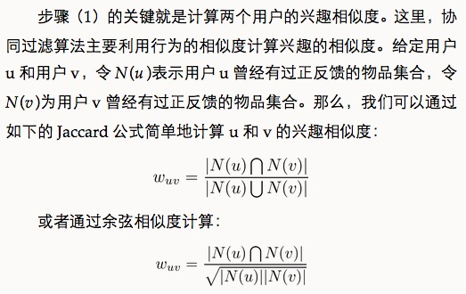

实践过程中用倒排表是比较快捷的方法。

一些注意事项：

1. 对于超级热门的书籍，并不能认为两个用户都买过就是兴趣相似。
2. 两个用户对冷门物品采取过同样的行为更能说明他们兴趣的相似度。(John S. Breese "Empirical Analysis of Predictive Algorithms for Collaborative Filtering")

对于热度较高的物品需要一定的惩罚，一般是用 log

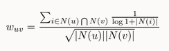

### 基于物品的协同过滤算法

业界基本使用这个(Linden Greg "Amazon.com Recommendations: Item-to-Item Collaborative Filtering")

并不利用物品的内容属性计算物品之间的相似度，主要通过分析用户的行为记录物品之间的相似度。该算法认为，物品 A 和物品 B 具有很大的相似度是因为喜欢物品 A 的用户大都也喜欢物品 B。

主要包括两个步骤：

1. 计算物品之间的相似度
2. 根据物品的相似度和用户的历史行为给用户生成推荐列表

但是如果其中一个物品很热门，那么得到的相似系数就会很大，所以分母需要开根号惩罚一下。

用户活跃度问题，John S. Breese "Empirical Analysis of Predicitve Algorithms for Collaborative Filtering" 提出了一个称为 IUF(Inverse User Frequence)的参数，活跃用户对物品相似度的贡献应该小于不活跃的用户

物品相似度的归一化，Karypis 在研究中发现如果将相似度矩阵按最大值归一化(George Karypis "Evaluation of Item-based Top-N Recommendation Algorithms")

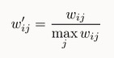

### UserCF 和 ItemCF 优缺点对比

x | UserCF | ItemCF
---|---|---
性能 | 适用于用户较少的场合，如果用户很多，计算用户相似度矩阵代价很大 | 适用于物品数明显小于用户数的场合，如果物品很多，计算物品相似度矩阵代价很大
领域 | 时效性较强，用户个性化兴趣不太明显的领域 | 长尾物品丰富，用户个性化需求强烈的领域
实时性 | 用户有新行为，不一定造成推荐结果立即变化 | 用户有新行为，一定会导致推荐结果的实时变化
冷启动 | 在新用户对很少的物品产生行为后，不能立即对他进行个性化推荐，因为用户相似度表是每隔一段时间离线计算的 | 新用户只要对一个物品产生行为，就可以给他推荐和该物品相关的其他物品
x | 新物品上线后一段时间，一旦有用户对物品产生行为，就可以将新物品推荐给和对它产生行为的用户兴趣相似的其他用户 | 但没有办法在不离线更新物品相似度表的情况下将新物品推荐给用户
推荐理由 | 很难提供令用户信服的推荐解释 | 利用用户的历史行为给用户做推荐解释，可以令用户比较信服

**哈利波特问题**

对于太热门的物品分子仍然会非常接近热门书籍的热度，可以采用下面的方法

## 隐语义模型

相关名词：LFM(latnet factor model), LSI, pLSA, LDA, Topic Model。这些技术和方法本质上是相通的，其中很多方法都可以用于个性化推荐系统。

核心思想是通过隐含特征(latent factor)联系用户兴趣和物品，采取基于用户行为统计的自动聚类。

找寻负样本时需要遵循以下原则：

+ 对每个用户，要保证正负样本的平衡(数目相似)
+ 对每个用户采样负样本时，要选取那些很热门，用户却没有行为的物品

一般认为，很热门而用户却没有行为更加代表用户对这个物品不感兴趣。因为对于冷门的物品，用户可能是压根没在网站中发现这个物品，所以谈不上是否感兴趣。

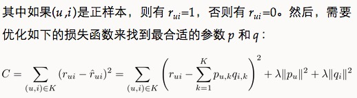

LFM 模型在实际使用中有一个困难，就是很难实现实时的推荐。经典的 LFM 模型每次训练时都需要扫描所有的用户行为记录，这样才能计算出用户隐类向量( p~u )和物品隐类向量( q~i )

LFM 是一种基于机器学习的方法，具有比较好的理论基础。这个方法和基于邻域的方法(比如 UserCF, ItemCF)相比，各有优缺点。

+ **理论基础** LFM具有比较好的理论基础，它是一种学习方法，通过优化一个设定的指标建立最优的模型。基于邻域的方法更多的是一种基于统计的方法，并没有学习过程。
+ **离线计算的空间复杂度** 基于邻域的方法需要维护一张离线的相关表。在离线计算相关表的过程中，如果用户/物品数很多，将会占据很大的内存。假设有 M 个用户和 N 个物品，在计算相关表的过程中，我们可能会获得一张比较稠密的临时相关表（尽管最终我们对每个物品只保留 K 个最相关的物品，但在中间计算过程中稠密的相关表是不可避免的），那么假设是用户相关表，则需要`O(M*M)`的空间，而对于物品相关表，则需要`O(N*N)`的空间。而LFM在建模过程中，如果是F个隐类，那么它需要的存储空间是`O(F*(M+N))`，这在M和N很大时可以很好地节省离线计算的内存。在Netflix Prize中，因为用户数很庞大（40多万），很少有人使用UserCF算法（据说需要30 GB左右的内存），而LFM由于大量节省了训练过程中的内存（只需要4 GB），从而成为Netflix Prize中最流行的算法。
+ **离线计算的时间复杂度**　假设有 M 个用户、N 个物品、K条用户对物品的行为记录。那么，UserCF 计算用户相关表的时间复杂度是`O(N*(K/N)^2)`，而ItemCF计算物品相关表的时间复杂度是`O(M*(K/M)^2)`。而对于LFM，如果用F个隐类，迭代S次，那么它的计算复杂度是`O(K*F*S)`。那么，如果`K/N > F*S`，则代表UserCF的时间复杂度低于LFM，如果 `K/M>F*S`，则说明 ItemCF 的时间复杂度低于 LFM。在一般情况下，LFM 的时间复杂度要稍微高于 UserCF 和 ItemCF，这主要是因为该算法需要多次迭代。但总体上，这两种算法在时间复杂度上没有质的差别。
+ **在线实时推荐**　UserCF 和 ItemCF 在线服务算法需要将相关表缓存在内存中，然后可以在线进行实时的预测。以 ItemCF 算法为例，一旦用户喜欢了新的物品，就可以通过查询内存中的相关表将和该物品相似的其他物品推荐给用户。因此，一旦用户有了新的行为，而且该行为被实时地记录到后台的数据库系统中，他的推荐列表就会发生变化。而从 LFM 的预测公式可以看到，LFM 在给用户生成推荐列表时，需要计算用户对所有物品的兴趣权重，然后排名，返回权重最大的 N 个物品。那么，在物品数很多时，这一过程的时间复杂度非常高，可达`O(M*N*F)`。因此，LFM 不太适合用于物品数非常庞大的系统，如果要用，我们也需要一个比较快的算法给用户先计算一个比较小的候选列表，然后再用 LFM 重新排名。另一方面，LFM 在生成一个用户推荐列表时速度太慢，因此不能在线实时计算，而需要离线将所有用户的推荐结果事先计算好存储在数据库中。因此，LFM不能进行在线实时推荐，也就是说，当用户有了新的行为后，他的推荐列表不会发生变化。
+ **推荐解释**　ItemCF 算法支持很好的推荐解释，它可以利用用户的历史行为解释推荐结果。但 LFM 无法提供这样的解释，它计算出的隐类虽然在语义上确实代表了一类兴趣和物品，却很难用自然语言描述并生成解释展现给用户。

## 基于图的模型

用户行为很容易用二分图表示，因此很多图的算法都可以用到推荐系统中。

基于图的模型（graph-based model）是推荐系统中的重要内容。其实，很多研究人员把基于邻域的模型也称为基于图的模型，因为可以把基于邻域的模型看做基于图的模型的简单形式。

令G(V,E)表示用户物品二分图，其中V=V~U ∪ V~I 由用户顶点集合 V~U 和物品顶点集合 V~I 组成。对于数据集中每一个二元组(u, i)，图中都有一套对应的边e(v~u ,v~i )，其中 v~u ∈ V~U 是用户 u 对应的顶点，v~i ∈ V~I 是物品 i 对应的顶点。下图是一个简单的用户物品二分图模型，其中圆形节点代表用户，方形节点代表物品，圆形节点和方形节点之间的边代表用户对物品的行为。比如图中用户节点A和物品节点a、b、d相连，说明用户A对物品a、b、d产生过行为。

度量图中两个顶点之间相关性的方法很多，但一般来说图中顶点的相关性主要取决于下面3个因素：

+ 两个顶点之间的路径数；
+ 两个顶点之间路径的长度；
+ 两个顶点之间的路径经过的顶点。

而相关性高的一对顶点一般具有如下特征：

+ 两个顶点之间有很多路径相连；
+ 连接两个顶点之间的路径长度都比较短；
+ 连接两个顶点之间的路径不会经过出度比较大的顶点。

Fouss Francois "Random-Walk Computation of Similarities between Nodes of a Graph with Application to Collaborative Recommendation"

介绍一种基于随机游走的PersonalRank算法(Taher "Topic-Sensitive PageRank")

假设要给用户 u 进行个性化推荐，可以从用户 u 对应的节点 v~u 开始在用户物品二分图上进行随机游走。游走到任何一个节点时，首先按照概率 α 决定是继续游走，还是停止这次游走并从 v 节点开始重新游走。如果决定继续游走，那么就从当前节点指向的节点中按照均匀分布随机选择一个节点作为游走下次经过的节点。这样，经过很多次随机游走后，每个物品节点被访问到的概率会收敛到一个数。最终的推荐列表中物品的权重就是物品节点的访问概率。

但是计算量较大，有两种解决办法：减少迭代次数或者是从矩阵论出发重新设计算法，暂略

## 冷启动问题

冷启动问题（cold start）主要分3类。

+ **用户冷启动**　用户冷启动主要解决如何给新用户做个性化推荐的问题。当新用户到来时，我们没有他的行为数据，所以也无法根据他的历史行为预测其兴趣，从而无法借此给他做个性化推荐。
+ **物品冷启动**　物品冷启动主要解决如何将新的物品推荐给可能对它感兴趣的用户这一问题。
+ **系统冷启动**　系统冷启动主要解决如何在一个新开发的网站上（还没有用户，也没有用户行为，只有一些物品的信息）设计个性化推荐系统，从而在网站刚发布时就让用户体验到个性化推荐服务这一问题。

对于这3种不同的冷启动问题，有不同的解决方案。一般来说，可以参考如下解决方案。

+ **提供非个性化的推荐**　非个性化推荐的最简单例子就是热门排行榜，我们可以给用户推荐热门排行榜，然后等到用户数据收集到一定的时候，再切换为个性化推荐。
+ 利用用户注册时提供的年龄、性别等数据做粗粒度的个性化。
+ 利用用户的社交网络账号登录（需要用户授权），导入用户在社交网站上的好友信息，然后给用户推荐其好友喜欢的物品。
+ 要求用户在登录时对一些物品进行反馈，收集用户对这些物品的兴趣信息，然后给用户推荐那些和这些物品相似的物品。
+ 对于新加入的物品，可以利用内容信息，将它们推荐给喜欢过和它们相似的物品的用户。
+ 在系统冷启动时，可以引入专家的知识，通过一定的高效方式迅速建立起物品的相关度表。

能够用来启动用户兴趣的物品需要具有以下特点：

+ **比较热门**　如果要让用户对一个物品进行反馈，前提是用户知道这个物品是什么东西。以电影为例，如果一开始让用户进行反馈的电影都很冷门，而用户不知道这些电影的情节和内容，也就无法对它们做出准确的反馈。
+ **具有代表性和区分性**　启动用户兴趣的物品不能是大众化或老少咸宜的，因为这样的物品对用户的兴趣没有区分性。还以电影为例，用一部票房很高且广受欢迎的电影做启动物品，可以想象的到的是几乎所有用户都会喜欢这部电影，因而无法区分用户个性化的兴趣。
+ **启动物品集合需要有多样性**　在冷启动时，我们不知道用户的兴趣，而用户兴趣的可能性非常多，为了匹配多样的兴趣，我们需要提供具有很高覆盖率的启动物品集合，这些物品能覆盖几乎所有主流的用户兴趣。

Nadav Golbandi在论文中探讨了选择启动物品的问题，提出可以用一个决策树解决这个问题(“Adaptive Bootstrapping of Recommender Systems Using Decision Trees”)

Nadav Golbandi 的算法首先会从所有用户中找到具有最高区分度的物品 i，然后将用户分成 3 类。然后在每类用户中再找到最具区分度的物品，然后将每一类用户又各自分为 3 类，也就是将总用户分成9类，然后这样继续下去，最终可以通过对一系列物品的看法将用户进行分类。而在冷启动时，我们从根节点开始询问用户对该节点物品的看法，然后根据用户的选择将用户放到不同的分枝，直到进入最后的叶子节点，此时我们就已经对用户的兴趣有了比较清楚的了解，从而可以开始对用户进行比较准确地个性化推荐。

通过一个简单的例子解释Nadav Golbandi的算法。如图所示，假设通过分析用户数据，我们发现《变形金刚》最有区分度。而在喜欢《变形金刚》的用户中《钢铁侠》最有区分度，不知道《变形金刚》的用户中《阿甘正传》最有区分度，不喜欢《变形金刚》的用户中《泰坦尼克号》最有区分度。进一步分析，我们发现不喜欢《变形金刚》但喜欢《泰坦尼克号》的用户中，《人鬼情未了》最有区分度。那么，假设来了一个新用户，系统会首先询问他对《变形金刚》的看法，如果他说不喜欢，我们就会问他对《泰坦尼克》号的看法，如果他说喜欢，我们就会问他对《人鬼情未了》的看法，如果这个时候用户停止了反馈，我们也大概能知道该用户可能对爱情片比较感兴趣，对科幻片兴趣不大。

一般来说，物品的内容可以通过向量空间模型(Vector Space Model)表示，该模型会将物品表示成一个关键词向量。如果物品的内容是一些诸如导演、演员等实体的话，可以直接将这些实体作为关键词。但如果内容是文本的形式，则需要引入一些理解自然语言的技术抽取关键词。

向量空间模型在内容数据丰富时可以获得比较好的效果。以文本为例，如果是计算长文本的相似度，用向量空间模型利用关键词计算相似度已经可以获得很高的精确度。

如何建立文章、话题和关键词的关系是话题模型（topic model）研究的重点。代表性的话题模型有LDA。

任何模型都有一个假设，LDA 作为一种生成模型，对一篇文档产生的过程进行了建模。话题模型的基本思想是，一个人在写一篇文档的时候，会首先想这篇文章要讨论哪些话题，然后思考这些话题应该用什么词描述，从而最终用词写成一篇文章。因此，文章和词之间是通过话题联系的。LDA 中有 3 种元素，即**文档**、**话题**和**词语**。每一篇文档都会表现为词的集合，这称为**词袋模型(bag of words)**。每个词在一篇文章中属于一个话题。令D为文档集合，`D[i]`是第 i 篇文档。`w[i][j]`是第 i 篇文档中的第 j 个词。`z[i][j]`是第 i 篇文档中第 j 个词属于的话题。

LDA 的计算过程包括初始化和迭代两部分。首先要对 z 进行初始化，而初始化的方法很简单，假设一共有 K 个话题，那么对第 i 篇文章中的第 j 个词，可以随机给它赋予一个话题。同时，用 NWZ(w,z)记录词 w 被赋予话题 z 的次数，NZD(z,d)记录文档 d 中被赋予话题 z 的词的个数。LDA可以很好地将词组合成不同的话题。

在使用 LDA 计算物品的内容相似度时，我们可以先计算出物品在话题上的分布，然后利用两个物品的话题分布计算物品的相似度。比如，如果两个物品的话题分布相似，则认为两个物品具有较高的相似度，反之则认为两个物品的相似度较低。计算分布的相似度可以利用 KL 散度

## 利用用户标签数据

标签系统的最大优势在于可以发挥群体的智能，获得对物品内容信息比较准确的关键词描述，而准确的内容信息是提升个性化推荐系统性能的重要资源。

打标签作为一种重要的用户行为，蕴含了很多用户兴趣信息，因此深入研究和利用用户打标签的行为可以很好地指导我们改进个性化推荐系统的推荐质量。同时，标签的表示形式非常简单，便于很多算法处理。标签系统中的推荐问题主要有以下两个。

+ 如何利用用户打标签的行为为其推荐物品（基于标签的推荐）？
+ 如何在用户给物品打标签时为其推荐适合该物品的标签（标签推荐）？

一个用户标签行为的数据集一般由一个三元组的集合表示，其中记录(u, i, b)表示用户 u 给物品 i 打上了标签 b。当然，用户的真实标签行为数据远远比三元组表示的要复杂，比如用户打标签的时间、用户的属性数据、物品的属性数据等。但是本章为了集中讨论标签数据，只考虑上面定义的三元组形式的数据，即用户的每一次打标签行为都用一个三元组（用户、物品、标签）表示。

### 一个最简单的算法

拿到了用户标签行为数据，相信大家都可以想到一个最简单的个性化推荐算法。这个算法的描述如下所示。

+ 统计每个用户最常用的标签。
+ 对于每个标签，统计被打过这个标签次数最多的物品。
+ 对于一个用户，首先找到他常用的标签，然后找到具有这些标签的最热门物品推荐给这个用户。

对于上面的算法，用户u对物品i的兴趣公式如下：

这里，B(u)是用户 u 打过的标签集合，B(i)是物品i被打过的标签集合，n~u，b 是用户 u 打过标签 b 的次数，n~b，i 是物品 i 被打过标签 b 的次数。

### 改进：TF-IDF

前面这个公式倾向于给热门标签对应的热门物品很大的权重，因此会造成推荐热门的物品给用户，从而降低推荐结果的新颖性。另外，这个公式利用用户的标签向量对用户兴趣建模，其中每个标签都是用户使用过的标签，而标签的权重是用户使用该标签的次数。这种建模方法的缺点是给热门标签过大的权重，从而不能反应用户个性化的兴趣。这里我们可以借鉴TF-IDF的思想，对这一公式进行改进：

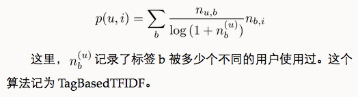

同理，我们也可以借鉴TF-IDF的思想对热门物品进行惩罚，从而得到如下公式：

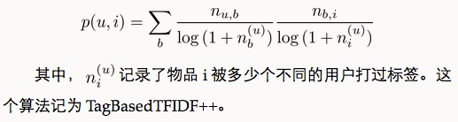

和TagBasedTFIDF算法相比，除了多样性有所下降，其他指标都有明显提高。这一结果表明，适当惩罚热门标签和热门物品，在增进推荐结果个性化的同时并不会降低推荐结果的离线精度。

### 改进：数据稀疏性

在前面的算法中，用户兴趣和物品的联系是通过B(u)∩B(i)中的标签建立的。但是，对于新用户或者新物品，这个集合（B(u)∩B(i)）中的标签数量会很少。为了提高推荐的准确率，我们可能要对标签集合做扩展，比如若用户曾经用过“推荐系统”这个标签，我们可以将这个标签的相似标签也加入到用户标签集合中，比如“个性化”、“协同过滤”等标签。

进行标签扩展有很多方法，其中常用的有话题模型(topic model)，不过这里遵循简单的原则介绍一种基于邻域的方法。

标签扩展的本质是对每个标签找到和它相似的标签，也就是计算标签之间的相似度。最简单的相似度可以是同义词。如果有一个同义词词典，就可以根据这个词典进行标签扩展。如果没有这个词典，我们可以从数据中统计出标签的相似度。

如果认为同一个物品上的不同标签具有某种相似度，那么当两个标签同时出现在很多物品的标签集合中时，我们就可以认为这两个标签具有较大的相似度。对于标签b，令N(b)为有标签b的物品的集合，n~b，i 为给物品 i 打上标签 b 的用户数，我们可以通过如下余弦相似度公式计算标签 b 和标签 b' 的相似度：

进行标签扩展确实能够提高基于标签的物品推荐的准确率和召回率，但可能会稍微降低推荐结果的覆盖率和新颖度。

### 改进：标签清理

不是所有标签都能反应用户的兴趣。同时，标签系统里经常出现词形不同、词义相同的标签。

标签清理的另一个重要意义在于将标签作为推荐解释。如果我们要把标签呈现给用户，将其作为给用户推荐某一个物品的解释，对标签的质量要求就很高。首先，这些标签不能包含没有意义的停止词或者表示情绪的词，其次这些推荐解释里不能包含很多意义相同的词语。

一般来说有如下标签清理方法：

+ 去除词频很高的停止词；
+ 去除因词根不同造成的同义词，比如recommender system和recommendation system；
+ 去除因分隔符造成的同义词，比如collaborative_filtering和collaborative-filtering。

为了控制标签的质量，很多网站也采用了让用户进行反馈的思想，即让用户告诉系统某个标签是否合适。关于这方面的研究可以参考Grou-pLens的Shilad Wieland Sen同学的博士论文(Nurturing Tagging Communities)

### 基于图的推荐算法

首先，我们需要将用户打标签的行为表示到一张图上。我们知道，图是由顶点、边和边上的权重组成的。而在用户标签数据集上，有 3 种不同的元素，即用户、物品和标签。因此，我们需要定义 3 种不同的顶点，即用户顶点、物品顶点和标签顶点。然后，如果我们得到一个表示用户 u 给物品 i 打了标签 b 的用户标签行为(u,i,b)，那么最自然的想法就是在图中增加 3 条边，首先需要在用户 u 对应的顶点v(u)和物品 i 对应的顶点v(i)之间增加一条边(如果这两个顶点已经有边相连，那么就应该将边的权重加1)，同理，在v(u)和v(b)之间需要增加一条边，v(i)和v(b)之间也需要边相连接。

在定义出用户—物品—标签图后，我们可以用 PersonalRank 算法计算所有物品节点相对于当前用户节点在图上的相关性，然后按照相关性从大到小的排序，给用户推荐排名最高的 N 个物品。

基于标签的推荐其最大好处是可以利用标签做推荐解释，这方面的代表性应用是豆瓣的个性化推荐系统。

豆瓣使用标签云组织推荐结果页面有很多好处，首先是提高了推荐结果的多样性。我们知道，一个用户的兴趣在长时间内是很广泛的，但在某一天却比较具体。因此，我们如果想在某一天击中用户当天的兴趣，是非常困难的。而豆瓣通过标签云，展示了用户的所有兴趣，然后让用户自己根据他今天的兴趣选择相关的标签，得到推荐结果，从而极大地提高了推荐结果的多样性，使得推荐结果更容易满足用户多样的兴趣。同时，标签云也提供了推荐解释功能。用户通过这个界面可以知道豆瓣给自己推荐的每一本书都是基于它认为自己对某个标签感兴趣。而对于每个标签，用户总能通过回忆自己之前的行为知道自己是否真的对这个标签感兴趣。我们知道，要让用户直观上感觉推荐结果有道理是很困难的，而豆瓣将推荐结果的可解释性拆分成了两部分，首先让用户觉得标签云是有道理的，然后让用户觉得从某个标签推荐出某本书也是有道理的。因为生成让用户觉得有道理的标签云比生成让用户觉得有道理的推荐图书更加简单，标签和书的关系就更容易让用户觉得有道理，从而让用户最终觉得推荐出来的书也是很有道理的。

同时，标签云也提供了推荐解释功能。用户通过这个界面可以知道豆瓣给自己推荐的每一本书都是基于它认为自己对某个标签感兴趣。而对于每个标签，用户总能通过回忆自己之前的行为知道自己是否真的对这个标签感兴趣。

我们知道，要让用户直观上感觉推荐结果有道理是很困难的，而豆瓣将推荐结果的可解释性拆分成了两部分，首先让用户觉得标签云是有道理的，然后让用户觉得从某个标签推荐出某本书也是有道理的。因为生成让用户觉得有道理的标签云比生成让用户觉得有道理的推荐图书更加简单，标签和书的关系就更容易让用户觉得有道理，从而让用户最终觉得推荐出来的书也是很有道理的。

Jesse Vig对基于标签的解释进行了深入研究(Tagsplanations: Explaining Recommendations Using Tags)。

Jesse Vig 将用户和物品之间的关系变成了用户对标签的兴趣(tag preference)和标签与物品的相关度(tag relevance)，然后作者用同一种推荐算法给用户推荐物品，但设计了4种标签解释的展示界面。

+ **RelSort**　对推荐物品做解释时使用的是用户以前使用过且物品上有的标签，给出了用户对标签的兴趣和标签与物品的相关度，但标签按照和物品的相关度排序。
+ **PrefSort**　对推荐物品做解释时使用的是用户以前使用过且物品上有的标签，给出了用户对标签的兴趣和标签与物品的相关度，但标签按照用户的兴趣程度排序。
+ **RelOnly**　对推荐物品做解释时使用的是用户以前使用过且物品上有的标签，给出了标签与物品的相关度，且标签按照和物品的相关度排序。
+ **PrefOnly**　对推荐物品做解释时使用的是用户以前使用过且物品上有的标签，给出了用户对标签的兴趣程度，且标签按照用户的兴趣程度排序。

作者询问了用户对4种不同推荐解释界面的总体满意度，结果显示PrefOnly > RelSort > PrefSort > RelOnly。

+ 用户对标签的兴趣对帮助用户理解为什么给他推荐某个物品更有帮助
+ 用户对标签的兴趣和物品标签的相关度对于帮助用户判定自己是否喜欢被推荐物品具有同样的作用
+ 物品标签相关度对于帮助用户判定被推荐物品是否符合他当前的兴趣更有帮助
+ 客观事实类标签相比主观感受类标签对用户更有作用

### 推荐标签

+ **方便用户输入标签**　让用户从键盘输入标签无疑会增加用户打标签的难度，这样很多用户不愿意给物品打标签，因此我们需要一个辅助工具来减小用户打标签的难度，从而提高用户打标签的参与度。
+ **提高标签质量**　同一个语义不同的用户可能用不同的词语来表示。这些同义词会使标签的词表变得很庞大，而且会使计算相似度不太准确。而使用推荐标签时，我们可以对词表进行选择，首先保证词表不出现太多的同义词，同时保证出现的词都是一些比较热门的、有代表性的词。

用户 u 给物品 i 打标签时，我们有很多方法可以给用户推荐和物品 i 相关的标签。比较简单的方法有 4 种。

+ 第 0 种方法就是给用户 u 推荐整个系统里最热门的标签(这里将这个算法称为PopularTags)。
+ 第 1 种方法就是给用户 u 推荐物品 i 上最热门的标签(这里将这个算法称为ItemPopularTags)。
+ 第 2 种方法是给用户 u 推荐他自己经常使用的标签(这里将这个算法称为UserPopularTags)。
+ 第 3 种算法是前面两种的融合(这里记为HybridPopu-larTags)，该方法通过一个系数将上面的推荐结果线性加权，然后生成最终的推荐结果。
    + 具体实现时，两个列表线性相加时都将两个列表按最大值做了归一化，这样的好处是便于控制两个列表对最终结果的影响，而不至于因为物品非常热门而淹没用户对推荐结果的影响，或者因为用户非常活跃而淹没物品对推荐结果的影响。

离线测试标准

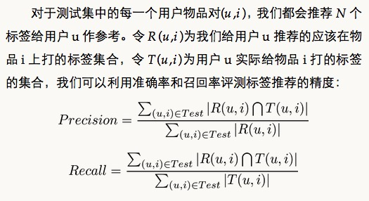

## 利用上下文信息

关于上下文推荐的研究，可以参考 Alexander Tuzhilin 教授的一篇综述 Context Aware RecommenderSystems。

时间信息对用户兴趣的影响表现在以下几个方面：

+ **用户兴趣是变化的**　我们这里提到的用户兴趣变化是因为用户自身原因发生的变化。比如随着年龄的增长，用户小时候喜欢看动画片，长大了喜欢看文艺片。如果我们要准确预测用户现在的兴趣，就应该关注用户最近的行为，因为用户最近的行为最能体现他现在的兴趣。当然，考虑用户最近的兴趣只能针对渐变的用户兴趣，而对突变的用户兴趣很难起作用，比如用户突然中奖了。
+ **物品也是有生命周期的**　一部电影刚上映的时候可能被很多人关注，但是经久不衰的电影是很少的，很多电影上映后不久就被人们淡忘了。此外，物品也可能受新闻事件的影响，比如一部已经被淡忘的电影会因为突然被某个新闻事件涉及而重新热门起来。因此，当我们决定在某个时刻给某个用户推荐某个物品时，需要考虑该物品在该时刻是否已经过时了。
+ **季节效应**　季节效应主要反映了时间本身对用户兴趣的影响。比如人们夏天吃冰淇淋，冬天吃火锅，夏天穿T恤，冬天穿棉衣。当然，我们也不排除有特别癖好的人存在，但大部分用户都是遵循这个规律的。除此之外，节日也是一种季节效应：每年的圣诞节，人们都要去购物；每年的奥斯卡颁奖礼，人们都要关注电影。

### 物品的生存周期和系统的时效性

不同类型网站的物品具有不同的生命周期，比如新闻的生命周期很短，而电影的生命周期很长。我们可以用如下指标度量网站中物品的生命周期。

+ **物品平均在线天数**　如果一个物品在某天被至少一个用户产生过行为，就定义该物品在这一天在线。因此，我们可以通过物品的平均在线天数度量一类物品的生存周期。考虑到物品的平均在线天数和物品的流行度应该成正比，因此给定一个数据集，我们首先将物品按照流行度分成20份，然后计算每一类物品的平均在线天数。
+ **相隔T天系统物品流行度向量的平均相似度**　取系统中相邻T天的两天，分别计算这两天的物品流行度，从而得到两个流行度向量。然后，计算这两个向量的余弦相似度，如果相似度大，说明系统的物品在相隔T天的时间内没有发生大的变化，从而说明系统的时效性不强，物品的平均在线时间较长。相反，如果相似度很小，说明系统中的物品在相隔T天的时间内发生了很大变化，从而说明系统的时效性很强，物品的平均在线时间很短。

### 推荐系统的实时性

用户兴趣是不断变化的，其变化体现在用户不断增加的新行为中。一个实时的推荐系统需要能够实时响应用户新的行为，让推荐列表不断变化，从而满足用户不断变化的兴趣。

实现推荐系统的实时性除了对用户行为的存取有实时性要求，还要求推荐算法本身具有实时性，而推荐算法本身的实时性意味着:

+ 实时推荐系统不能每天都给所有用户离线计算推荐结果，然后在线展示昨天计算出来的结果。所以，要求在每个用户访问推荐系统时，都根据用户这个时间点前的行为实时计算推荐列表。
+ 推荐算法需要平衡考虑用户的近期行为和长期行为，即要让推荐列表反应出用户近期行为所体现的兴趣变化，又不能让推荐列表完全受用户近期行为的影响，要保证推荐列表对用户兴趣预测的延续性。

推荐系统每天推荐结果的变化程度被定义为推荐系统的时间多样性。时间多样性高的推荐系统中用户会经常看到不同的推荐结果。

提高推荐结果的时间多样性需要分两步解决：首先，需要保证推荐系统能够在用户有了新的行为后及时调整推荐结果，使推荐结果满足用户最近的兴趣；其次，需要保证推荐系统在用户没有新的行为时也能够经常变化一下结果，具有一定的时间多样性。

对于第一步，又可以分成两种情况进行分析。第一是从推荐系统的实时性角度分析。有些推荐系统会每天离线生成针对所有用户的推荐结果，然后在线直接将这些结果展示给用户。这种类型的系统显然无法做到在用户有了新行为后及时调整推荐结果。第二，即使是实时推荐系统，由于使用的算法不同，也具有不同的时间多样性。

对于不同算法的时间多样性，Neal Lathia博士在 Evaluating Collaborative Filtering Over Time 中进行了深入探讨

那么，如果用户没有行为，如何保证给用户的推荐结果具有一定的时间多样性呢？一般的思路有以下几种。

+ 在生成推荐结果时加入一定的随机性。比如从推荐列表前20个结果中随机挑选10个结果展示给用户，或者按照推荐物品的权重采样10个结果展示给用户。
+ 记录用户每天看到的推荐结果，然后在每天给用户进行推荐时，对他前几天看到过很多次的推荐结果进行适当地降权。
+ 每天给用户使用不同的推荐算法。可以设计很多推荐算法，比如协同过滤算法、内容过滤算法等，然后在每天用户访问推荐系统时随机挑选一种算法给他进行推荐。

当然，时间多样性也不是绝对的。推荐系统需要首先保证推荐的精度，在此基础上适当地考虑时间多样性。在实际应用中需要通过多次的实验才能知道什么程度的时间多样性对系统是最好的。

### 时间上下文推荐算法

**最近最热门**

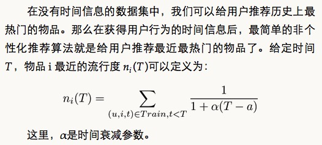

**时间上下文相关的 ItemCF 算法**

基于物品（item-based）的个性化推荐算法是商用推荐系统中应用最广泛的，从前面几章的讨论可以看到，该算法由两个核心部分构成：

+ 利用用户行为离线计算物品之间的相似度；
+ 根据用户的历史行为和物品相似度矩阵，给用户做在线个性化推荐。

时间信息在上面两个核心部分中都有重要的应用，这体现在两种时间效应上。

+ **物品相似度**　用户在相隔很短的时间内喜欢的物品具有更高相似度。以电影推荐为例，用户今天看的电影和用户昨天看的电影其相似度在统计意义上应该大于用户今天看的电影和用户一年前看的电影的相似度。
+ **在线推荐**　用户近期行为相比用户很久之前的行为，更能体现用户现在的兴趣。因此在预测用户现在的兴趣时，应该加重用户近期行为的权重，优先给用户推荐那些和他近期喜欢的物品相似的物品。

基于物品的协同过滤算法，它通过如下公式计算物品的相似度

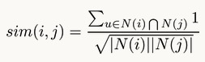

而在给用户u做推荐时，用户u对物品i的兴趣p(u,i)通过如下公式计算

在得到时间信息（用户对物品产生行为的时间）后，我们可以通过如下公式改进相似度计算

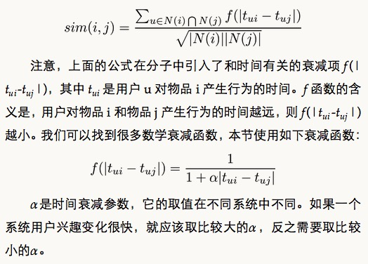

除了考虑时间信息对相关表的影响，我们也应该考虑时间信息对预测公式的影响。一般来说，用户现在的行为应该和用户最近的行为关系更大。因此，我们可以通过如下方式修正预测公式

**时间上下文相关的 UserCF 算法**

和 ItemCF 算法一样，UserCF 算法同样可以利用时间信息提高预测的准确率。首先，回顾一下前面关于 UserCF 算法的基本思想：给用户推荐和他兴趣相似的其他用户喜欢的物品。从这个基本思想出发，我们可以在以下两个方面利用时间信息改进 UserCF 算法。

+ **用户兴趣相似度**　两个用户兴趣相似是因为他们喜欢相同的物品，或者对相同的物品产生过行为。但是，如果两个用户同时喜欢相同的物品，那么这两个用户应该有更大的兴趣相似度。
+ **相似兴趣用户的最近行为**　在找到和当前用户 u 兴趣相似的一组用户后，这组用户最近的兴趣显然相比这组用户很久之前的兴趣更加接近用户 u 今天的兴趣。也就是说，我们应该给用户推荐和他兴趣相似的用户最近喜欢的物品。

UserCF通过如下公式计算用户u和用户v的兴趣相似度：

上面公式的分子对于用户 u 和用户 v 共同喜欢的物品 i 增加了一个时间衰减因子。用户 u 和用户 v 对物品 i 产生行为的时间越远，那么这两个用户的兴趣相似度就会越小。

在得到用户相似度后，UserCF通过如下公式预测用户对物品的兴趣：

如果考虑和用户u兴趣相似用户的最近兴趣，我们可以设计如下公式：

### 地点上下文信息

除了时间，地点作为一种重要的空间特征，也是一种重要的上下文信息。不同地区的用户兴趣有所不同，用户到了不同的地方，兴趣也会有所不同。

## 利用社交网络数据

**获取社交网络数据的途径**

+ 电子邮件
+ 用户注册信息
+ 用户的位置数据
+ 论坛和讨论组
+ 即时聊天工具
+ 社交网站(Facebook, Twitter)

以Facebook为代表的社交网络称为**社交图谱(social graph)**，而以Twitter为代表的社交网络称为**兴趣图谱(interest graph)**。

社交网络定义了用户之间的联系，因此可以用图定义社交网络。我们用图G(V,E,w)定义一个社交网络，其中V是顶点集合，每个顶点代表一个用户，E是边集合，如果用户va和vb有社交网络关系，那么就有一条边e(va,vb)连接这两个用户，而w(va,vb)定义了边的权重。业界有两种著名的社交网络。一种以Facebook为代表，它的朋友关系是需要双向确认的，因此在这种社交网络上可以用无向边连接有社交网络关系的用户。另一种以Twitter为代表，它的朋友关系是单向的，因此可以用有向边代表这种社交网络上的用户关系。

此外，对图G中的用户顶点u，定义out(u)为顶点u指向的顶点集合(如果套用微博中的术语，out(u)就是用户u关注的用户集合)，定义in(u)为指向顶点u的顶点集合(也就是关注用户u的用户集合)。那么，在Facebook这种无向社交网络中显然有out(u)=in(u)。

一般来说，有 3 种不同的社交网络数据。

+ **双向确认的社交网络数据**　在以 Facebook 和人人网为代表的社交网络中，用户 A 和 B 之间形成好友关系需要通过双方的确认。因此，这种社交网络一般可以通过无向图表示。
+ **单向关注的社交网络数据**　在以 Twitter 和新浪微博为代表的社交网络中，用户 A 可以关注用户 B 而不需要得到用户 B 的允许，因此这种社交网络中的用户关系是单向的，可以通过有向图表示。
+ **基于社区的社交网络数据**　还有一种社交网络数据，用户之间并没有明确的关系，但是这种数据包含了用户属于不同社区的数据。比如豆瓣小组，属于同一个小组可能代表了用户兴趣的相似性。或者在论文数据集中，同一篇文章的不同作者也存在着一定的社交关系。或者是在同一家公司工作的人，或是同一个学校毕业的人等。

社会化推荐之所以受到很多网站的重视，是缘于如下优点：

+ **好友推荐可以增加推荐的信任度**　好友往往是用户最信任的。用户往往不一定信任计算机的智能，但会信任好朋友的推荐。同样是给用户推荐《天龙八部》，前面提到的基于物品的协同过滤算法会说是因为用户之前看过《射雕英雄传》，而好友推荐会说是因为用户有 8 个好友都非常喜欢《天龙八部》。对比这两种解释，第二种解释一般能让用户更加心动，从而购买或者观看《天龙八部》。
+ **社交网络可以解决冷启动问题**　当一个新用户通过微博或者 Facebook 账号登录网站时，我们可以从社交网站中获取用户的好友列表，然后给用户推荐好友在网站上喜欢的物品。从而我们可以在没有用户行为记录时就给用户提供较高质量的推荐结果，部分解决了推荐系统的冷启动问题。

如果将Twitter的架构搬到社会化推荐系统中，我们就可以按照如下方式设计系统：

+ 首先，为每个用户维护一个消息队列，用于存储他的推荐列表；
+ 当一个用户喜欢一个物品时，就将（物品ID、用户ID和时间）这条记录写入关注该用户的推荐列表消息队列中；
+ 当用户访问推荐系统时，读出他的推荐列表消息队列，对于这个消息队列中的每个物品，重新计算该物品的权重。计算权重时需要考虑物品在队列中出现的次数，物品对应的用户和当前用户的熟悉程度、物品的时间戳。同时，计算出每个物品被哪些好友喜欢过，用这些好友作为物品的推荐解释。

关于社会化推荐系统的离线评测可以参考Georg Groh和Christian Ehmig的工作成果(Recommendations in Taste Related Domains: Collaborative Filtering vs. Social Filtering)。不过社会化推荐系统的效果往往很难通过离线实验评测，因为社会化推荐的优势不在于增加预测准确度，而是在于通过用户的好友增加用户对推荐结果的信任度，从而让用户单击那些很冷门的推荐结果。此外，很多社交网站（特别是基于社交图谱的社交网站）中具有好友关系的用户并不一定有相似的兴趣。因此，利用好友关系有时并不能增加离线评测的准确率和召回率。因此，很多研究人员利用用户调查和在线实验的方式评测社会化推荐系统。

社交网络研究中有两个最著名的问题。第一个是如何度量人的重要性，也就是社交网络顶点的中心度(centrality)，第二个问题是如何度量社交网络中人和人之间的关系，也就是链接预测。这两个问题的研究都有着深刻的实际意义，因此得到了业界和学术界的广泛关注。对这两个问题感兴趣的读者可以参考社交网络分析方面的书<Social Network Analysis: Methods and Applications> <Social Network Analysis: A Handbook>

对于基于社交网络的推荐算法，因为数据集的限制，最早的研究都是基于Epinion的用户信任网络的。Ma Hao 在 Epinion 数据集上提出了很多基于矩阵分解的社会化推荐算法用来解决评分预测问题(SoRec: Social Recommendation Using Probabilistic Matrix Factorization)，其主要思想是在矩阵分解模型中加入正则化项，让具有社交关系的用户的隐语义向量具有比较高的相似度。

## 推荐系统实例

### 外围架构

推荐系统要发挥强大的作用，除了推荐系统本身，主要还依赖于两个条件——界面展示和用户行为数据。不过，如果我们看看目前流行的推荐系统界面，可以看到这些界面都有一些共性。

+ 通过一定方式展示物品，主要包括物品的标题、缩略图和介绍等。
+ 很多推荐界面都提供了推荐理由，理由可以增加用户对推荐结果的信任度。
+ 推荐界面还需要提供一些按钮让用户对推荐结果进行反馈，这样才能让推荐算法不断改善用户的个性化推荐体验。

**数据收集和存储**

个性化推荐算法依赖于用户行为数据，而在任何一个网站中都存在着各种各样的用户行为数据。那么如何存取这些数据就是推荐系统需要解决的首要问题。

一般来说，需要实时存取的数据存储在数据库和缓存中，而大规模的非实时地存取数据存储在分布式文件系统（如HDFS）中。

数据能否实时存取在推荐系统中非常重要，因为推荐系统的实时性主要依赖于能否实时拿到用户的新行为。只有快速拿到大量用户的新行为，推荐系统才能够实时地适应用户当前的需求，给用户进行实时推荐。

### 推荐系统架构

推荐系统需要由多个推荐引擎组成，每个推荐引擎负责一类特征和一种任务，而推荐系统的任务只是将推荐引擎的结果按照一定权重或者优先级合并、排序然后返回

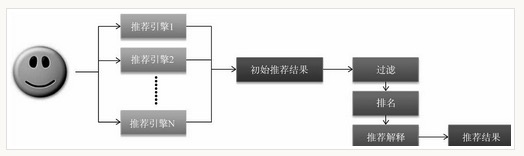

这样做还有两个好处。

+ 可以方便地增加/删除引擎，控制不同引擎对推荐结果的影响。对于绝大多数需求，只需要通过不同的引擎组合实现。
+ 可以实现推荐引擎级别的用户反馈。每一个推荐引擎其实代表了一种推荐策略，而不同的用户可能喜欢不同的推荐策略。有些用户可能喜欢利用他的年龄性别作出的推荐，有些用户可能比较喜欢看到新加入的和他兴趣相关的视频，有些用户喜欢比较新颖的推荐，有些用户喜欢专注于一个邻域的推荐，有些用户喜欢多样的推荐。我们可以将每一种策略都设计成一个推荐引擎，然后通过分析用户对推荐结果的反馈了解用户比较喜欢哪些引擎推荐出来的结果，从而对不同的用户给出不同的引擎组合权重。

### 推荐引擎的架构

部分 A 负责从数据库或者缓存中拿到用户行为数据，通过分析不同行为，生成当前用户的特征向量。不过如果是使用非行为特征，就不需要使用行为提取和分析模块了。该模块的输出是用户特征向量。

部分 B 负责将用户的特征向量通过特征-物品相关矩阵转化为初始推荐物品列表。

部分 C 负责对初始的推荐列表进行过滤、排名等处理，从而生成最终的推荐结果。

#### 生成用户特征向量

一般来说，用户的特征包括两种，一种是用户的注册信息中可以提取出来的，主要包括用户的人口统计学特征。对于使用这种特征的推荐引擎，如果内存够，可以将存储这些特征的信息直接缓存在内存中，在推荐时直接拿到用户的特征数据并生成特征向量。除了这种特征，另一种特征主要是从用户的行为中计算出来的，本节着重讨论如何生成特征。

一个特征向量由特征以及特征的权重组成，在利用用户行为计算特征向量时需要考虑以下因素。

+ **用户行为的种类**　在一个网站中，用户可以对物品产生很多不同种类的行为。用户可以浏览物品、单击物品的链接、收藏物品、给物品打分、购买物品、评论物品、给物品打上不同的标签、和好友分享物品、搜索不同的关键词等。这些行为都会对物品特征的权重产生影响，但不同行为的影响不同，大多时候很难确定什么行为更加重要，一般的标准就是用户付出代价越大的行为权重越高。
+ **用户行为产生的时间**　一般来说，用户近期的行为比较重要，而用户很久之前的行为相对比较次要。因此，如果用户最近购买过某一个物品，那么这个物品对应的特征将会具有比较高的权重。
+ **用户行为的次数**　有时用户对一个物品会产生很多次行为。比如用户会听一首歌很多次，看一部电视剧的很多集等。因此用户对同一个物品的同一种行为发生的次数也反映了用户对物品的兴趣，行为次数多的物品对应的特征权重越高。
+ **物品的热门程度**　如果用户对一个很热门的物品产生了行为，往往不能代表用户的个性，因为用户可能是在跟风，可能对该物品并没有太大兴趣，特别是在用户对一个热门物品产生了偶尔几次不重要的行为（比如浏览行为）时，就更说明用户对这个物品可能没有什么兴趣，可能只是因为这个物品的链接到处都是，很容易点到而已。反之，如果用户对一个不热门的物品产生了行为，就说明了用户的个性需求。因此，推荐引擎在生成用户特征时会加重不热门物品对应的特征的权重。

#### 特征-物品相关推荐

从上面的架构图可以看到，特征—物品相关推荐模块还可以接受一个候选物品集合。候选物品集合的目的是保证推荐结果只包含候选物品集合中的物品。它的应用场合一般是产品需求希望将某些类型的电视剧推荐给用户。比如有些产品要求给用户推荐最近一周加入的新物品，那么候选物品集合就包括最近一周新加的物品。

也许有读者会奇怪，为什么不在过滤模块中将候选集合外的电视剧过滤掉，而要在相关推荐模块中处理候选物品列表？这里举一个简单的例子说明原因。首先，一般来说对于协同过滤算法计算出的相关表，每个物品都会倾向于和比较热门的物品具有较高的相似度。那么假设用户购买过物品A，候选列表中包含了物品B，A和B相关，但A比B热门。那么，一般情况下，B在A的相关物品列表中会排在靠后的位置(假设排在第10名)，而A在B的相关物品列表中会排在靠前的位置(假设排在第1名)。那么，如果推荐算法是给用户推荐和A最相关的5部电视剧，那么B就不会出现在用户的推荐列表中。但是，如果算法在给定候选列表时会用一种不同的方式进行推荐，比如如果用户看过和B最相关的5部电视剧中的某一部，就将B推荐给用户，那么这种情况下B就出现在推荐列表中了。

除此之外，还需要给用户返回物品推荐列表中每个推荐结果的解释列表，表明这个物品是因为哪些特征推荐出来的。

#### 过滤模块

在得到初步的推荐列表后，还不能把这个列表展现给用户，首先需要按照产品需求对结果进行过滤，过滤掉那些不符合要求的物品。一般来说，过滤模块会过滤掉以下物品。

+ **用户已经产生过行为物品**　因为推荐系统的目的是帮助用户发现物品，因此没必要给用户推荐他已经知道的物品，这样可以保证推荐结果的新颖性。
+ **候选物品以外的物品**　候选物品集合一般有两个来源，一个是产品需求。比如在首页可能要求将新加入的物品推荐给用户，因此需要在过滤模块中过滤掉不满足这一条件的物品。另一个来源是用户自己的选择，比如用户选择了某一个价格区间，只希望看到这个价格区间内的物品，那么过滤模块需要过滤掉不满足用户需求的物品。
+ **某些质量很差的物品**　为了提高用户的体验，推荐系统需要给用户推荐质量好的物品，那么对于一些绝大多数用户评论都很差的物品，推荐系统需要过滤掉。这种过滤一般以用户的历史评分为依据，比如过滤掉平均分在2分以下的物品。

#### 排名模块

经过过滤后的推荐结果直接展示给用户一般也没有问题，但如果对它们进行一些排名，则可以更好地提升用户满意度，一般排名模块需要包括很多不同的子模块，下面将对不同的模块分别加以介绍。

**新颖性**

新颖性排名模块的目的是给用户尽量推荐他们不知道的、长尾中的物品。虽然前面的过滤模块已经过滤掉了用户曾经有过行为的物品，保证了一定程度的新颖性，但是用户在当前网站对某个物品没有行为并不代表用户不知道这个物品，比如用户可能已经在别的途径知道这个物品了。

要准确了解用户是否已经知道某个物品是非常困难的，因此我们只能通过某种近似的方式知道，比如对推荐结果中热门的物品进行降权，比如使用如下公式：

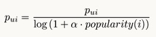

不过，要实现推荐结果的新颖性，仅仅在最后对热门物品进行降权是不够的，而应在推荐引擎的各个部分考虑新颖性问题。

本章提到的推荐系统架构主要是基于物品的推荐算法的，因此可以回顾一下基于物品的推荐算法的基本公式

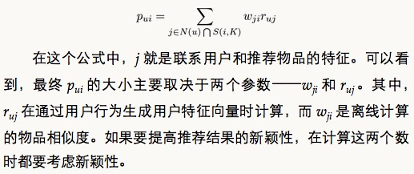

如果用户喜欢一个热门的物品，ItemCF算法也很难给他推荐一个冷门的物品。因此可以做如下的设计。首先，考虑到推荐系统是为了给用户介绍他们不熟悉的物品，那么可以假设如果用户知道了物品j，对物品j产生过行为，那么和j相似的且比j热门的物品用户应该也有比较大的概率知道，因此可以降低这种物品的权重，比如：

此外，也可以引入内容相似度矩阵，因为内容相似度矩阵中和每个物品相似的物品都不是很热门，所以引入内容相似度矩阵也能够提高最终推荐结果的新颖度。利用上面几种考虑新颖性的方法，我们可以通过控制参数α控制最终推荐结果的新颖度。

**多样性**

多样性也是推荐系统的重要指标之一。增加多样性可以让推荐结果覆盖尽可能多的用户兴趣。当然，这里需要指出的是提高多样性并不是时时刻刻都很好。比如在个性化网络电台中，因为用户某一固定时刻的兴趣是固定的，所以不希望听到不同曲风的歌曲，尽管这些曲风可能都是用户之前表示喜欢的。不过，本节主要讨论如果要提高多样性，应该怎么提高。

第一种提高多样性的方法是将推荐结果按照某种物品的内容属性分成几类，然后在每个类中都选择该类中排名最高的物品组合成最终的推荐列表。比如，如果是电影，可以按照电影的类别（爱情片、动作片、科幻片等）对推荐结果中的电影分类，然后每种类别都选出几部电影组成最终的推荐结果。

这种方法的好处是比较简单直观，但这种方法也有严重的缺点。首先，选择什么样的内容属性进行分类对结果的影响很大。其次，就算选择了某种类别，但物品是否属于某个类别是编辑确定的，并不一定能够得到用户的公认。比如成龙的电影，有人认为是功夫片，有人认为是喜剧片，不同人看法不一。

因此，第二种提高推荐结果多样性的方法是控制不同推荐结果的推荐理由出现的次数。本章提出的推荐系统对于每个推荐出来的物品都有一个推荐理由，这个推荐理由一般是产生推荐结果的重要特征。那么，要提高推荐结果的多样性，就需要让推荐结果尽量来自不同的特征，具有不同的推荐理由，而不是所有的推荐结果都对应一个理由。

**时间多样性**

时间多样性主要是为了保证用户不要每天来推荐系统都看到同样的推荐结果。首先要保证推荐系统的实时性，在用户有新行为时实时调整推荐结果以满足用户最近的需求。这一点，在本章的推荐系统设计中已经考虑到了。如果用户有实时行为发生，那么行为提取和分析模块就能实时拿到行为数据并转化为新的特征，然后经过特征-物品相关模块转换成和新特征最相关的物品，因而推荐列表中就立即反应了用户最新行为的影响。提高推荐结果多样性的第二个方面是要在用户没有新的行为时，也要保证推荐结果每天都有变化。要实现这一点，只能通过如下方式。

+ 记录用户每次登陆推荐系统看到的推荐结果。
+ 将这些结果发回日志系统。这种数据不需要实时存储，只要能保证小于一天的延时就足够了。
+ 在用户登录时拿到用户昨天及之前看过的推荐结果列表，从当前推荐结果中将用户已经看到的推荐结果降权。

**用户反馈**

排名模块最重要的部分就是用户反馈模块。用户反馈模块主要通过分析用户之前和推荐结果的交互日志，预测用户会对什么样的推荐结果比较感兴趣。

如果推荐系统的目标是提高用户对推荐结果的点击率，那么可以利用点击模型（click model）预测用户是否会点击推荐结果。点击模型在很多领域得到了广泛应用，比如搜索结果的点击预测、搜索广告的点击预测、上下文广告的点击预测。点击预测的主要问题是预测用户看到某个推荐结果时是否会点击。那么要进行点击率预测，首先需要提取特征。在推荐系统的点击率预测中可以用如下特征预测用户u会不会点击物品i：

+ 用户u相关的特征，比如年龄、性别、活跃程度、之前有没有点击行为；
+ 物品i相关的特征，比如流行度，平均分，内容属性；
+ 物品i在推荐列表中的位置。用户的点击和用户界面的设计有很高的相关性，因此物品i在推荐列表中的位置对预测用户是否点击很重要；
+ 用户之前是否点击过和推荐物品i具有同样推荐解释的其他推荐结果；
+ 用户之前是否点击过和推荐物品i来自同样推荐引擎的其他推荐结果。

MyMedia是一个比较著名的开源推荐系统架构。它是由欧洲研究人员开发的一个推荐系统开源框架。该框架同时支持评分预测和TopN推荐，全面支持各种数据和各种算法，对该项目感兴趣的用户可以访问该项目的网站http://www.mymediapro-ject.org/default.aspx。

本章提出的推荐系统架构基本上是从基于物品的推荐算法衍生出来的，因此本章的架构并不适合用来解决社会化推荐问题。如果要了解社会化推荐方面的架构，可以参考Twitter公开的一些文档。

## 评分预测

这一部分因为涉及不多，暂时略过

## 十条经验和教训

1. 确定你真的需要推荐系统。推荐系统只有在用户遇到信息过载时才必要。如果你的网站物品不太多，或者用户兴趣都比较单一，那么也许并不需要推荐系统。所以不要纠结于推荐系统这个词，不要为了做推荐系统而做推荐系统，而是应该从用户的角度出发，设计出能够真正帮助用户发现内容的系统，无论这个系统算法是否复杂，只要能够真正帮助用户，就是一个好的系统。
2. 确定商业目标和用户满意度之间的关系。对用户好的推荐系统不代表商业上有用的推荐系统，因此要首先确定用户满意的推荐系统和商业上需求的差距。一般来说，有些时候用户满意和商业需求并不吻合。但是一般情况下，用户满意度总是符合企业的长期利益，因此这一条的主要观点是要平衡企业的长期利益和短期利益之间的关系。
3. 选择合适的开发人员。一般来说，如果是一家大公司，应该雇用自己的开发人员来专门进行推荐系统的开发。
4. 忘记冷启动的问题。不断地创新，互联网上有任何你想要的数据。只要用户喜欢你的产品，他们就会不断贡献新的数据。
5. 平衡数据和算法之间的关系。使用正确的用户数据对推荐系统至关重要。对用户行为数据的深刻理解是设计好推荐系统的必要条件，因此分析数据是设计系统中最重要的部分。数据分析决定了如何设计模型，而算法只是决定了最终如何优化模型。
6. 找到相关的物品很容易，但是何时以何种方式将它们展现给用户是很困难的。不要为了推荐而推荐。
7. 不要浪费时间计算相似兴趣的用户，可以直接利用社会网络数据。
8. 需要不断地提升算法的扩展性。
9. 选择合适的用户反馈方式。
10. 设计合理的评测系统，时刻关注推荐系统各方面的性能。
