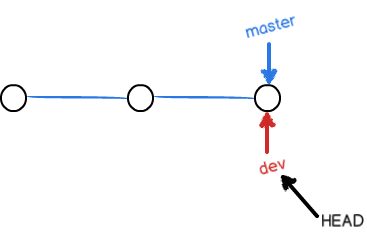
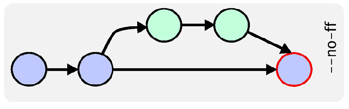

## Git主要优势及安装

git，一个非常强大的版本管理工具。Github则是一个基于Git的日益流行的开源项目托管库。Git与svn的最大区别是，它的使用流程不需要联机，可以先将对代码的修改，评论，保存在本机。等上网之后，再实时推送过去。同时它创建分支与合并分支更容易，推送速度也更快，配合Github提交需求也更容易。

### 版本库

一个 Git 版本库包括一个 .git 目录和其工作目录。

.git 目录包含所有的配置、日志、分支信息、头指针等详细列表

### Git全局设置

下载并安装Git

    git config --global user.name "Your Name"
    git config --global user.email youremail@email.com

#### 检出仓库

执行如下命令以创建一个本地仓库的克隆版本：

    git clone /path/to/repository

如果是远端服务器上的仓库，你的命令会是这个样子：

    git clone username@host:/path/to/repository

#### 将Git项目与Github建立联系

    mkdir yourgithubproject
    cd yourgithubproject
    git init
    touch README
    git add README
    git commit -m 'first commit'
    git remote add origin git@github.com:yourgithubname/yourgithubproject.git
    git push origin master

#### 导入现有的Git仓库

    cd existing_git_repo
    git remote add origin git@github.com:yourgithubname/yourgithubproject.git
    git push origin master

#### 工作流

你的本地仓库由 git 维护的三棵“树”组成。第一个是你的 工作目录，它持有实际文件；第二个是 暂存区（Index），它像个缓存区域，临时保存你的改动；最后是 HEAD，它指向你最后一次提交的结果。

#### 添加和提交

你可以提出更改（把它们添加到暂存区），使用如下命令：

    git add <filename>
    git add *

这是 git 基本工作流程的第一步；使用如下命令以实际提交改动：

    git commit -m "代码提交信息"

现在，你的改动已经提交到了 HEAD，但是还没到你的远端仓库。

#### 推送改动

你的改动现在已经在本地仓库的 HEAD 中了。执行如下命令以将这些改动提交到远端仓库：

    git push origin master

可以把 master 换成你想要推送的任何分支。

如果你还没有克隆现有仓库，并欲将你的仓库连接到某个远程服务器，你可以使用如下命令添加：

    git remote add origin <server>

如此你就能够将你的改动推送到所添加的服务器上去了。

#### 分支

分支是用来将特性开发绝缘开来的。在你创建仓库的时候，master 是“默认的”分支。在其他分支上进行开发，完成后再将它们合并到主分支上。

创建一个叫做“feature_x”的分支，并切换过去：

    git checkout -b feature_x

切换回主分支：

    git checkout master

再把新建的分支删掉：

    git branch -d feature_x

除非你将分支推送到远端仓库，不然该分支就是 不为他人所见的：

    git push origin <branch>

#### 更新与合并

要更新你的本地仓库至最新改动，执行：

    git pull

以在你的工作目录中 获取（fetch） 并 合并（merge） 远端的改动。

要合并其他分支到你的当前分支（例如 master），执行：

    git merge <branch>

在这两种情况下，git 都会尝试去自动合并改动。遗憾的是，这可能并非每次都成功，并可能出现冲突（conflicts）。 这时候就需要你修改这些文件来手动合并这些冲突（conflicts）。改完之后，你需要执行如下命令以将它们标记为合并成功：

    git add <filename>

在合并改动之前，你可以使用如下命令预览差异：

    git diff <source_branch> <target_branch>

#### 标签

为软件发布创建标签是推荐的。这个概念早已存在，在 SVN 中也有。你可以执行如下命令创建一个叫做 1.0.0 的标签：

    git tag 1.0.0 1b2e1d63ff

1b2e1d63ff 是你想要标记的提交 ID 的前 10 位字符。可以使用下列命令获取提交 ID：

    git log

你也可以使用少一点的提交 ID 前几位，只要它的指向具有唯一性。

#### 替换本地改动

假如你操作失误（当然，这最好永远不要发生），你可以使用如下命令替换掉本地改动：

    git checkout -- <filename>

此命令会使用 HEAD 中的最新内容替换掉你的工作目录中的文件。已添加到暂存区的改动以及新文件都不会受到影响。

假如你想丢弃你在本地的所有改动与提交，可以到服务器上获取最新的版本历史，并将你本地主分支指向它：

    git fetch origin
    git reset --hard origin/master

#### git最主要的命令

    git --help

The most commonly used git commands are:

    add        Add file contents to the index
    bisect     Find by binary search the change that introduced a bug
    branch     List, create, or delete branches
    checkout   Checkout a branch or paths to the working tree
    clone      Clone a repository into a new directory
    commit     Record changes to the repository
    diff       Show changes between commits, commit and working tree, etc
    fetch      Download objects and refs from another repository
    grep       Print lines matching a pattern
    init       Create an empty git repository or reinitialize an existing one
    log        Show commit logs
    merge      Join two or more development histories together
    mv         Move or rename a file, a directory, or a symlink
    pull       Fetch from and merge with another repository or a local branch
    push       Update remote refs along with associated objects
    rebase     Forward-port local commits to the updated upstream head
    reset      Reset current HEAD to the specified state
    rm         Remove files from the working tree and from the index
    show       Show various types of objects
    status     Show the working tree status
    tag        Create, list, delete or verify a tag object signed with GPG

#### 实用小贴士

内建的图形化 git：

    gitk

彩色的 git 输出：

    git config color.ui true

显示历史记录时，每个提交的信息只显示一行：

    git config format.pretty oneline

交互式添加文件到暂存区：

    git add -i

下面解释不是完全严谨，请结合上图来理解下面四个概念。
**工作区（working dicrectory）**：包含.git目录的父目录一般就是工作区，就是我们的工程目录。新创建的文件都处于工作区，此时还没有加入到后面要解释的的暂缓区。

**版本库（Repository）**：.git目录就是版本库，版本管理的相关文件都在此目录下。

**暂缓区（stage）**：对于曾经加入了版本控制的文件作了修改后，执行`git add `后的文件就进入暂缓区。

**分支**：git初始会默认创建一个master分支，执行`git commit`后，暂缓区的文件就到了分支里面。

如下有一个readme.rst文件是已经加入了版本库的，现在对内容进行修改后，查看下状态

    E:\Users\liuzhijun\workspace\blog>git status

    # On branch master
    # Your branch is ahead of 'origin/master' by 4 commits.
    #   (use "git push" to publish your local commits)
    #
    # Changes not staged for commit:
    #   (use "git add <file>..." to update what will be committed)
    #   (use "git checkout -- <file>..." to discard changes in working d
    #
    #       modified:   README.rst
    #
    no changes added to commit (use "git add" and/or "git commit -a")

git提示README.rst已经修改了，但还不是暂缓区的文件（not staged），待commit。接着还告诉你可以进行怎么的操作，`checkout`指撤销本次修改，注意后面有`--`，如果不带这个字符，checkout又是另外一层意思了。

####退回到指定版本
退回到指定版本使用命令`git reset --hard <version>`， HEAD始终指向当前版本，HEAD^^表示上一个版本。如果想退回到上一个版本就可以使用：

    git reset --hard HEAD^^
如果想退回到指定的某个版本呢？可以使用`git log`查看获取commit 版本号：

    commit 33b351ae746edaf3fd5a56a0318235096b6ed1ce
    Author: liuzhijun <lzjun567@gmail.com>
    Date:   Sat Mar 15 11:43:56 2014 +0800
        commit many files

    commit 86eefaaea5251fa5707ecd02009c893c098ab6cd
    Author: liuzhijun <lzjun567@gmai..com>
    Date:   Thu Mar 14 03:20:27 2013 +0800

        add author myself

commit 后面的那串就是版本号， 一般只要选择前面几位就可以了。git会自动去查找。

    git reset --hard 86eefa
执行上面的命令就是退回到指定的版本，如果现在我又反悔了，想恢复到最近的那个版本怎么办？只要你还记得这个最近的版本号的话直接执行如上的命令就好了，但是谁会去记这个号啊？那么还有一个办法是使用`git reflog`查看，这个指令记录了每次的操作。

    E:\Users\liuzhijun\workspace\blog>git reflog
    a11c917 HEAD@{0}: reset: moving to a11c
            HEAD@{1}: reset: moving to HEAD^
            HEAD@{2}: reset: moving to a11c917430050a94549e48d205ef01cacc82c1cf
            HEAD@{3}: reset: moving to HEAD^

上面的allc...就是我最近的一次修改。

####修改（change）
这里的**修改**不是动词，而是名词，只要文件发生了变化就表示修改，包括对文件内容的更改或者新创建的一个文件或者删除一个文件都叫一个修改。 git跟踪（track）的就是修改，而不是文件本身。

####撤销（checkout）
撤销是指文件修改后，还没有添加到暂缓区（还没有执行git add）过程中的修改撤销掉，如果已经添加到了暂缓区，但是还没有commit到分支中去，又做了修改后又想撤销，那么这里的撤销就是撤销到暂缓区的状态。比如现在对文件添加内容"add some to file":

    E:\Users\liuzhijun\workspace\blog>git status
    # On branch master
    # Your branch is ahead of 'origin/master' by 4 commits.
    #   (use "git push" to publish your local commits)
    #
    # Changes not staged for commit:
    #   (use "git add <file>..." to update what will be committed)
    #   (use "git checkout -- <file>..." to discard changes in working directory)
    #
    #       modified:   README.rst

然后把它添加到暂缓区：

    git add README.rst

再添加内容 "add some again to file"，撤销后，你会发现第一次添加的内容保留了，第二次添加的内容撤销了。

    E:\Users\liuzhijun\workspace\blog>git checkout -- README.rst

    E:\Users\liuzhijun\workspace\blog>git status
    # On branch master
    # Your branch is ahead of 'origin/master' by 4 commits.
    #   (use "git push" to publish your local commits)
    #
    # Changes to be committed:
    #   (use "git reset HEAD <file>..." to unstage)
    #
    #       modified:   README.rst

####分支管理
开发一个新功能时，可能需要几周的时间才能完成，那么可以创建一个分支，在分支上做开发，而不影响主分支的功能。
**创建分支**：

    git branch dev
    git checkout dev
或者合并成一条命令：

    git checkout -b dev
创建dev分支切换后，HEAD指针就从原来的master转移指向dev分支，`git branch`可以查看有哪些分支，并且当前是在哪个分支上。

    E:\Users\liuzhijun\workspace\blog>git branch
    * dev
      master
星号就代表当前的所在的分支。

**切换分支**：

    git checkout master

**合并分支**：
切换分支后，dev分支上做的修改在master分支看不到，如果dev分支的功能开发完成后，就可以考虑合并分支了，合并后还可以删除dev分支，因为此时dev分支对于我们来说没有多大意义了。

    git merge dev
合并分支就是把master执行dev分支，接着还可以删除分支

    git branch -d dev

git鼓励大家使用分支，因此大家记得多用啊，只有多用才是熟练掌握。

####冲突
如果不同的人对同一个文件的同一个地方做了修改，那么提交后就会遇到冲突，或者在不同的分支上修改了同一个文件的同一个地方也会出现冲突，当出现冲突了，就必须手动把有冲突的地方修改后再提交才能解决冲突。

创建分支dev，然后添加内容"add new branch dev"，commit后切换到master分支，在同一行添加内容"may be here is conflict"，commit后合并。

    git checkout -b dev
    git add README.rst
    git commit -m "add new branch"
    git checkout master
    git add README.rst
    git commit -m "add new line"
    git merge dev

    #出现错误
    Auto-merging README.rst
    CONFLICT (content): Merge conflict in README.rst
    Automatic merge failed; fix conflicts and then commit the result.

README.rst内容出现了如下情况：

    <<<<<<< HEAD
    may be here is conflict
    =======
    add new branch dev
    >>>>>>> dev

\<<<<<<< 到=======\表示当前分支的内容， >>>>>表示dev里面的内容。手动修改里面的内容后再提交。那么master就是最新的文件了。当然dev还是停留在上次commit的状态。此时你可能会想，我想在dev分支上与master保持同样的最新状态，那么你可以这样：

    git checkout dev
    git rebase master

相当于快速的把dev分支指向master。

####分支策略
开发过程中，都应该按照以下方式来管理分支。
**主分支**：代码库应该有且只有一个主分支master，master分支的代码是稳定的，仅用于正式版本发布使用。

**开发分支**：日常开发工作应该在开发分支dev上完成，待某个时间dev分支的功能完善了就可以考虑merge到master分支上去。

**自己的分支**：每个人在dev分支上建立自己的分支。
默认情况下，git合并使用"fast forward”模式，相当于直接把master分支指向dev分支。删除分支后，分支信息也随即丢失。

在合并的时候附上参数 `--no-ff`就可以禁用fast-forward合并模式。这样在master上能生成一个新的节点，意味着master保留的分支信息，而这种合并方式我们希望采用的。

    git merge --no-ff dev

