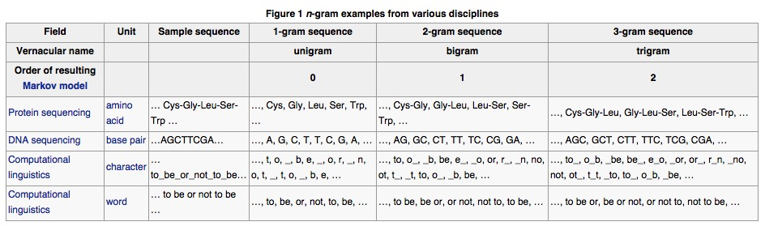

# Miniproject 3 - 3 Tasks

## Report

expected speedup

observed speedup

analysis

## Task 1: Compute N-gram Counts(Extend functionality)

GOAL: Implement a version of the N-gramCount that counts all n-grams over the test data up to length N.

## Task 2: Compute Hashtag Similarity(Extend functionality)

GOAL: Extend functionality of HashtagSim to compute similariteis between any pair of hashtags that share at least 1 common word.

## Task 3: Compute Hashtag Similarity(Code optimization)

GOAL: Your extended HashtagSim program(Task 2) must finish within 90 minutes on a cluster of 5 medium instances(c1.medium) on Amazon EMR

## Testing

n-gram

    ant
    hadoop jar 18645-proj3-0.1-latest.jar -program ngramcount -input data/tweets10m/tweets10m.txt -output data/ngram10m -n 3

    hadoop jar 18645-proj3-0.1-latest.jar -program hashtagsim -input data/tweets1m/tweets1m.txt -output data/hashtag1m -tmpdir tmp

    hadoop jar 18645-proj3-0.1-latest.jar -program hashtagsim -input data/tweets1k/tweets1k.txt -output data/hashtag1k -tmpdir tmp

    hadoop jar 18645-proj3-0.1-latest.jar -program hashtagsim -input data/tweets10k/tweets10k.txt -output data/hashtag10k -tmpdir tmp

don't need to test on emr

aws emr create-cluster --name "Test cluster ngramcount" --ami-version 2.4.11 --log-uri s3://dawang.log-uri.ngramcount --enable-debugging --instance-groups InstanceGroupType=MASTER,InstanceCount=1,InstanceType=c1.medium InstanceGroupType=CORE,InstanceCount=4,InstanceType=c1.medium --steps Type=CUSTOM_JAR,Jar=s3://dawang.fastcode/18645-proj3-0.1-latest.jar,Args=["-input","s3://dawang.tweets10m/tweets10m.txt","-output","s3://dawang.output/ngram10m","-program","ngramcount","-n","3"] --auto-terminate

aws emr create-cluster --name "cluster hashtagsim -dawang -p3" --ami-version 2.4.11 --log-uri s3://dawang.log-uri.hashtagsim --enable-debugging --instance-groups InstanceGroupType=MASTER,InstanceCount=1,InstanceType=c1.medium InstanceGroupType=CORE,InstanceCount=4,InstanceType=c1.medium --steps Type=CUSTOM_JAR,Jar=s3://dawang.fastcode/18645-proj3-0.1-latest.jar,Args=["-input","s3://dawang.tweets1m/tweets1m.txt","-output","s3://dawang.output/hashtag1m-p3","-program","hashtagsim","-tmpdir","tmp"] --auto-terminate

aws emr create-cluster --name "cluster hashtagsim -dawang -p2 50000" --ami-version 2.4.11 --log-uri s3://dawang.log-uri.hashtagsim --enable-debugging --instance-groups InstanceGroupType=MASTER,InstanceCount=1,InstanceType=c1.medium InstanceGroupType=CORE,InstanceCount=4,InstanceType=c1.medium --steps Type=CUSTOM_JAR,Jar=s3://dawang.fastcode/18645-proj3-0.1-latest-2.jar,Args=["-input","s3://dawang.tweets1m/tweets1m.txt","-output","s3://dawang.output/hashtag1m-p3.2.50000","-program","hashtagsim","-tmpdir","tmp2"] --auto-terminate

aws emr create-cluster --name "cluster hashtagsim -dawang -p3 50000" --ami-version 2.4.11 --log-uri s3://dawang.log-uri.hashtagsim --enable-debugging --instance-groups InstanceGroupType=MASTER,InstanceCount=1,InstanceType=c1.medium InstanceGroupType=CORE,InstanceCount=4,InstanceType=c1.medium --steps Type=CUSTOM_JAR,Jar=s3://dawang.fastcode/18645-proj3-0.1-latest-3.jar,Args=["-input","s3://dawang.tweets1m/tweets1m.txt","-output","s3://dawang.output/hashtag1m-p3.3.50000","-program","hashtagsim","-tmpdir","tmp3"] --auto-terminate

aws emr create-cluster --name "cluster hashtagsim -dawang -p4 500" --ami-version 2.4.11 --log-uri s3://dawang.log-uri.hashtagsim --enable-debugging --instance-groups InstanceGroupType=MASTER,InstanceCount=1,InstanceType=c1.medium InstanceGroupType=CORE,InstanceCount=4,InstanceType=c1.medium --steps Type=CUSTOM_JAR,Jar=s3://dawang.fastcode/18645-proj3-0.1-latest-sw500.jar,Args=["-input","s3://dawang.tweets1m/tweets1m.txt","-output","s3://dawang.output/hashtag1m-p3.4.500","-program","hashtagsim","-tmpdir","tmp4"] --auto-terminate

aws emr create-cluster --name "cluster hashtagsim -dawang -p5 1000" --ami-version 2.4.11 --log-uri s3://dawang.log-uri.hashtagsim --enable-debugging --instance-groups InstanceGroupType=MASTER,InstanceCount=1,InstanceType=c1.medium InstanceGroupType=CORE,InstanceCount=4,InstanceType=c1.medium --steps Type=CUSTOM_JAR,Jar=s3://dawang.fastcode/18645-proj3-0.1-latest-4.jar,Args=["-input","s3://dawang.tweets1m/tweets1m.txt","-output","s3://dawang.output/hashtag1m-p3.5.1000","-program","hashtagsim","-tmpdir","tmp5"] --auto-terminate

 "ClusterId": "j-37G25YG1V3HH1"

# Check cluster status from command line
aws emr describe-cluster --cluster-id $CID
aws emr describe-cluster --cluster-id j-3SNCE9K14PV5W

## Modify

Task1: Modify -> Mapper/Driver -> run

Task2: Modify -> Driver/Similarity -> run

## N-gram

In the fields of computational linguistics and probability, an n-gram is a contiguous sequence of n items from a given sequence of text or speech. The items can be phonemes, syllables, letters, words or base pairs according to the application. The n-grams typically are collected from a text or speech corpus.

An n-gram of size 1 is referred to as a "unigram"; size 2 is a "bigram" (or, less commonly, a "digram"); size 3 is a "trigram". Larger sizes are sometimes referred to by the value of n, e.g., "four-gram", "five-gram", and so on.

In this NgramCount application, given an input corpus, we’re interested in the count of all the n-grams.

## HashtagSim

From slides <Finding Contextually Similar Hashtags in Twitter Wordnet>

+ Every hashtag appears in some context
+ Use the co-occurring words as feature vector of hashtags
+ Use inner product to calculate similarity

Implementation

+ Count Words: Linear
+ Sort Words: O(nlogn)
+ Get Top-occuring Words: Constant
+ Get Feature Vector: Linear
+ Get Individual Similarity O(n^2)
+ Compute Total Similarity O(n^2)

Optimizations

+ Pairwise similarity - Inveerse Word Count Vector
    + Remove redundant calculation
    + Easier to be implemented as MapReduce job
+ Remove 500 top occurring words {today, via, twitter, ...}
+ Remove stop words {it, the, is, to, you, I, ok, not, or, ...}
+ Remove low co-occurrences 相关联的词太少就直接去掉，比方说一共就出现了一两次的那种
+ Restrict features to 100 co-occurred words 一个词对应只选择出现次数最多的十个feature

---

!! [倒排索引可以救中国](http://en.wikipedia.org/wiki/Inverted_index)

This program analyzes the similarities between hashtags, which are used primarily in Twitter.com to label the tweets. A hashtag is denoted by a ‘#’ followed by a word. For example, a recent tweet from Barack Obama reads: “The excuses not to #ActOnClimate need to end”. In this tweet, “#ActOnClimate” is a hashtag.

Hashtags are used to categorize tweets, promote events, etc. In our program, we try to identify how similar the hashtags are. We’re using the words that co-occurred with a hashtag as its features. For example, given a tweet “#a b c”, word “b” and “c” will have both co-occurred with hashtag “#a” in the tweet for once. Given the following corpus:

    #a b c
    #a b #b
    #b #c d e
    #c e f

The co-occurrence counts for each hashtag, or put in another way, the features for the hashtags, will look like the following:

    #a b:2;c:1;
    #b b:1;d:1;e:1;
    #c d:1;e:2;f:1;

Note that here we are treating hashtag “#b” and word “b” differently. Also, we’re using both the co-occurred words and the co-occurrence counts to represent a hashtag.

After calculating the feature vector for the hashtags, we can compute the similarity between hashtag pairs, using inner product of the feature vectors. The inner product of two feature vectors is calculated by picking all the common words and summing up the products of the co-occurrence value.

Taken the above result as example, the inner product between “#a” and “#b” will be 2, since they have only 1 shared word, “b”, and the product is 2*1. The inner product between “#b” and “#c” will be 3, which is result of 1*1 + 1*2. The bigger the inner product is, the more similar the two hashtags are in the given corpus.
