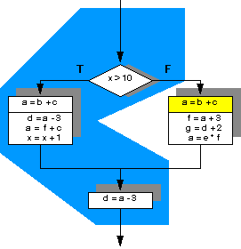
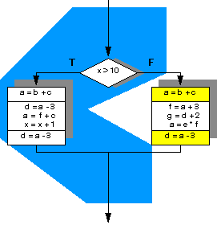

# FCA Midterm Preparation

## Topics from the Reviewing Class

Similar to Homework. Won't be that time-comsuming. Combine with Projects. Projects, homeworks, readings

Trace scheduling

- Solution for project 1&2, homework 1&2 next Wed.
- related to gem5. Implementing, how gem5 works
- gshare, yags
- tomasulo - change some parameters
- Require reading for lectures

### gem5 Issue

gem5 is a modular discrete event driven computer system simulator platform. That means that:

1. gem5's components can be rearranged, parameterized, extended or replaced easily to suit your needs.
2. It simulates the passing of time as a series of discrete events.
3. Its intended use is to simulate one or more computer systems in various ways.
4. It's more than just a simulator; it's a simulator platform that lets you use as many of its premade components as you want to build up your own simulation system.

gem5 is written primarily in C++ and python and most components are provided under a BSD style license. It can simulate a complete system with devices and an operating system in full system mode (FS mode), or user space only programs where system services are provided directly by the simulator in syscall emulation mode (SE mode). There are varying levels of support for executing Alpha, ARM, MIPS, Power, SPARC, and 64 bit x86 binaries on CPU models including two simple single CPI models, an out of order model, and an in order pipelined model. A memory system can be flexibly built out of caches and interconnects. Recently the Ruby simulator has been integrated with gem5 to provide even better, more flexible memory system modeling.

### Trace Scheduling

Use static branch prediction (or profiling) to create larger basic blocks by selecting instructions from the most likely flow of control. This is called a trace.

## Topics from Homework 1&2

- RAW
- VLIW
- Branch Prediction!!
- Two-Level Adaptive Branch Predictor
- Local Branch History
- Out-of-order processor
- Calculation of CPI
- Program Data Dependence Analysis
- Dataflow limit
- Pipelined Processor Performance
- Cache block size
- Path History
- RAS
- Register names reusing
- Register Renaming
- Tomasulo's Algorithm
- Caches(I-cache, D-cache, TLB)
- Memory Dataflow
- Cache Performance Analysis

## From Slides

### Block Write Strategies

- write-through: every write to L1 -> write to L2. Update both upper and lower levels. Simplifies replacement, but may require write buffer
- write-back: mark the block as dirty, when the block gets replaced from L1, write it to L2. Update upper level only. Update lower level when block is replaced. Need to keep more state.

Writethough simplifies coherency protocols in a multiprocessor system as the L2 always has a current copy of data.

### Types of Cache Misses

- **Compulsory misses**: happens the first time a memory word is accessed - the misses for an infinite cache
- **Capacity misses**: happens because the program touched many other words before re-touching the same word - the misses for a fully-associative cache
- **Conflict misses**: happens because two words map to the same location in the cache - the misses generted while moving from a fully-associative to a direct-mapped cache

### Address Translation

The virtual and physical memoery are broken up into pages.

**Virtual Address = virtual page number + page offset**

The virtual page number will be translated to physical page number and

**Physical Address = physical page number + page offset**

The two page offset of the formula are the same.

A virtual memory page can be placed anywhere in physical memory(fully-associative). A page table(indexed by virual page number) is used for translating virtual to physical page number. The page table is itself in memory.

### TLB

Since the number of pages is very high, the page table capacity is too large to fit on chip. A translation lookaside buffer(TLB) caches the virtual to physical page number translation for recent accesses.

A TLB miss requires us to access the page table, which may not even be found in the cache - two expensive memory look-ups to access one word of data!

A large page size can increase the coverage of the TLB and reduce the capacity of the page table, but also increases memory wastage.

### Cache Address Components

- Index i: Selects the set Si (The cache is divided into multiple set, for 2-way it means each set has two cache line)
- Tag: Used to find the memory block you're looking for, by comparing with the n blcoks in the selected set S
- Block Offset: Address of desired data within the block

### Cache Performance Example

Given: I-cache miss rate 2%, D-cache miss rate 4%, Miss penalty = 100 cycles, Base CPI(Ideal CPI) = 2, Load & stores are 36% of instructions

	Miss cycles per instruction
	I-cache: 0.02 * 100 = 2
	D-cache: 0.36 * 0.04 * 100 = 1.44
	Actural CPI = 2 + 2 + 1.44 = 5.44
	Ideal CPU is 5.44/2 = 2.72 times faster

### Average Access Time

Hit time is also imporatant for performance.

Average memory access time(AMAT) = Hit time + Miss rate * Miss Penalty

Example: CPU with 1ns clock, hit time = 1 cycle, miss penalty = 20 cycles, I-cache miss rate = 5%

AMAT = 1 + 0.05 * 20 = 2ns, 2 cycles per instruction

### 4 Questions for Memory Hierarchy

**Q1: Where can a block be placed?**

Scheme | # of sets | Blocks per set
:--: | :--: | :--:
Direct mapped | # of blocks | 1
Set Associative | # of blocks/Associativity | 2-8
Fully Associative | 1 | # of blocks

**Q2: How to find a block?**

Scheme | Location method | Comparisons required
:--: | :--: | :--:
Direct mapped | index | 1
Set Associative | Index set, search among elements | Degree of associativity
Fully Associative | Search all cache entries | Size of the cache
Fully Associative | Separate lookup table | 0

**Q3: Which block should be replaced on a cache miss？**

Scheme | Which block to replace | replace scheme
:--: | :--: | :--:
Direct mapped | Only one | none
Set Associative | # of blocks in a set | LRU, random
Fully Associative | All blocks | LRU, random

**Q4: What happends on a write?**

Write back: Allocate

Write through: Allocate, nonallocate
