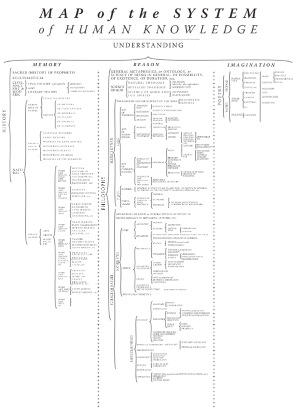

# 上帝怎么说话？-大话知识图谱

<!-- MarkdownTOC -->

- 前言
- 狄德罗和达朗贝尔之树
- 知识如何表示
- 所谓本体(Ontology)
    - 哲学意义
    - 计算机领域
- 知识图谱
    - 传统思路
    - 新思路
    - 构建与验证
- 未来展望
    - 个人化

<!-- /MarkdownTOC -->

---

## 前言

最近一段时间都在做知识图谱相关的研究开发，总算在这几天有了比较大的突破，本来凌乱不堪的思路也终于理清了。我在学习和探索过程中，发现相关的中文资料，尤其是入门资料非常少。就我个人来说，对于目前该领域的情况，觉得遗憾但是可以理解。首先这并不算是一个热门的方向，其次知识图谱的构建需要大量非计算机专业的知识(尤其是哲学)，再者这项工作量的门槛很高，更多是大型互联网公司在做(谷歌、百度等)，并成为搜索引擎的一个基础组件，诸多原因组合起来，造成了现在雷声大雨点小，有意义的进展并不多。

不过一直以来浮躁就是社会的通病，大部分人肯定还是看哪里有利可图就往哪里跑的，这也正常。引用一位校友的微博：“一个项目做了三年，因为确实很有用所有没丢掉。结果次次投都被拒。但一些一开始看上去不错的idea实际试下来发现挺没用所以三天rush出个半成品出来，投出去大家都叫好。做学术不浮躁挺难。”足以窥见象牙塔中的“大势所趋”。那些需要长时间投入的基础研究，尤其是中文的，在这个功利性极强的时代，或者说国度，只有那么少部分人在拼命努力，不过我愿意成为他们中的一部分。

所以想在这里，用尽可能少的专业术语，尽可能向大家介绍介绍知识图谱的来龙去脉。万事开头难，希望我的一些些努力能够让所谓入门更加轻松一点，这样更多人的才会参与进来。之所以用“上帝怎么说话”这个题目，是向《上帝掷骰子吗-量子物理史话》这本科普书致敬，我知道自己对于这个领域知识的掌握仍然非常有限，希望这个错漏百出的所谓“大话”成为引出玉的砖，我厚颜无耻却是诚心诚意地抛了出去。为了叙述的生动易懂，可能会使用大量的比喻，这不可避免地会带来语义的模糊(肯定不如数学公式以及形式化语言描述得清晰)，但是我的重点是想从更高的哲学角度来自顶向下来给对这个领域感兴趣的同学介绍一下我的理解，就不要吹毛求疵，以领会精神为主，也欢迎大家向我拍砖和我讨论，毕竟理越辩越明。

当然了，毕竟这是一个很大的课题，或者说，其实各方面都没有一个固定的标准，为了介绍得清晰和尽可能全面，各种流派都会提及(当然肯定也有我看文献不仔细而漏掉的)，也会东拉西扯一堆与狭义的该领域不相关的知识(比方说历史和哲学)。这么一来，篇幅就会比较长，所以我会尽可能把逻辑写得清楚一些，让想要看下去的同学能够轻松一点。不过这毕竟是我第一次写这种比较通俗的科普文章，肯定有各种各样的不足(需要专业一点的话还是要去找中英文的综述)，好了废话不多说，我们这就开始。

---

## 狄德罗和达朗贝尔之树

先来看看这张学术界称为狄德罗和达朗贝尔之树(the tree of Diderot and d'Alembert)或具象人类知识系统(Figurative system of human knowledge)的图。

有什么想法吗？这幅十八世纪总结出来的知识地图，尽管已经古老过时，但是却代表着逐渐觉醒的人类对于知识的无尽追求。关于知识的知识本身就已经足够迷人，人类对于知识体系的整理，始终未曾停歇。从永乐大典到四库全书再到各式各样的百科全书，作为编纂者，有一个问题是必须要回答的：如何整理和组织。

> 狄德罗和达朗贝尔将整个人类的知识树的根归于理解(Understanding)。理解下面分了三大分支——记忆(Memory)，理智(Reason)，想象(Imagination)。这三大块对应的，是三个大的科目——历史(History)，哲学(Philosophy)，诗歌(Poetry)

虽然明显能看出这种分类的不合理，但是不得不说这种组织形式，简洁优雅，很美。可是当工业革命带来的爆发式增长之后，想要画出这样一幅图，已经变得不大可能了。尤其是互联网的出现，几乎每个人都可以成为知识的贡献者。少部分未曾死心的百科编纂者折腾出来了各式各样的众包百科。传统的书本式百科无法容纳日益爆炸的知识，新的技术催生了新的百科，却也带来了新的问题。

---

## 知识如何表示

诚然，互联网百科可以跟上知识爆炸的速度(虽然脚步可能慢一点)，可是人们开始不满足于只用人脑存储和理解知识，我们想让电脑也能理解这个世界。可是电脑的世界是二进制的，当然我们设计了各式各样的编程语言数据结构，但并没有触及到根本，这个根本的问题在于：知识要如何表示。

仔细想这个问题，就会发现细思恐极。在考虑如何表示之前，需要确定的是，知识到底能不能表示(这里的表示均指形式化表示)。这不由得让我想到了另一个很经典的问题：意识是什么。或者再换个说法：思考是什么。

好吧，这种问题不是我这种愚钝的人可以参透的，还是交给哲学家们(又或者是神学家们)吧。为了能继续写下去，只能姑且认为，知识是可以形式化表示出来的。

既然可以表示出来，有不少前辈已经做了不少研究，比方说下面的-概念三角形

也就是说，某个概念，对应着一个现实生活中的物体(可以是具体的也可以是抽象的)，同时为了表示这个概念，有一个特定的名称(不同语言不同学科可能具体的名称不同，但是代表着同一个概念)，人们在对应理解时实际上会跳过这个原始的概念，而直接把名称映射到具体的物体上。

这里需要注意，我们需要形式化表示的，恰恰就是这个原始的概念。而因为这个原始的概念更多像是存在于混沌之中，认识和理解已经不易，更不要说表示出来了。可是我们的哲学家依旧捣鼓出了花——所谓“本体”。

---

## 所谓本体(Ontology)

本体最初源于哲学，但是随着计算机科学的发展，延伸出了不同的意义。Ontology 是希腊语单词 ον(存有)和 λόγος(逻辑，科学、研究、理论)的组合。但是因为其根本问题始终未有定论(下面会详细叙述)，计算机科学家(和说得多做得少的哲学家不同)开始按照自己的理解(尤其是二十世纪70年代的一波人工智能热潮)，试图用计算机模型(computational models)来描述本体，继而可以进行特定类型的自动化推理(automated reasoning)。

如果上面的内容看起来还是有些玄，那么记住这个简单版本就好：哲学家在搭空中楼阁，到底能不能接地不知道；计算机科学家借助哲学本体论的灵感开始尝试用计算机可以理解的语言去表示知识。

### 哲学意义

本体论是形而上学的一个基本分支，主要探讨存在本身，即一切现实事物的基本特征。一个比较精确的定义大概是: Ontology is the philosophical study of the natrue of being, becoming, existence or reality, as well as the basic categories of being and their relations.

本体论的根本问题是：“存在的最初分类是什么？”不同流派的哲学家对这个问题有不同的解释。这个问题使得在神学、图书馆学和人工智能的研究方面都需要运用本体论的知识，而且反映到宇宙学、道德和审美观念上。

通俗地讲，“存在”即是事物固有的属性集合，人们可能用不同的词汇、不同的语句、甚至是不同的语言来描述同一事物，但该事物不会因为人们的不同描述而改变。信息工程中，经常研究词汇之间的相关性，就是要找出人们对同一事物的不同描述，或者从含有相关词汇的语句中，找出他们共同描述的事物。

### 计算机领域

计算机领域的本体定义比较公认的是由 Gruber 在 1993 年给出的: An ontology is a formal, explicit specification of a shared concoptualization.

这里的 Conceptualization, Explicit, Formal 和 Shared 都有其特定的意义。借用维基上的描述：本体是指一种“形式化的，对于共享概念体系的明确而又详细的说明”。本体提供的是一种共享词表，也就是特定领域之中那些存在着的对象类型或概念及其属性和相互关系；或者说，本体就是一种特殊类型的术语集，具有结构化的特点，且更加适合于在计算机系统之中使用；又或者说，本体实际上就是对特定领域之中某套概念及其相互之间关系的形式化表达(formal representation)。

为了描述本体，许多相关的描述语言被开发了出来，例如 RDF, DAML+OIL, OWL 等。具体的描述方法虽然各有各的不同，但是核心基本上和上面提到的概念三角形类似：抽象概念(以及对应的实例)、关系和属性。

举个例子，为了把一句话转化成某种统一描述的知识结构，三元组是比较常见的做法。对于“中国的首都是北京”这个事实，就可以转化成为{中国, 首都, 北京}这样一个结构，其中第一项和第三项是抽象概念的实例(比方说中国和北京都是地方这个抽象概念的具体例子)，然后第二项是它们俩之间的关系。

习惯了这种表达，我们就可以推广了，比方说{苹果, CEO, 库克}, {《设计心理学》, 作者, Donald Arthur Norman}等等等等。

于是我们通过这种方式，就把对于客观世界的字符串描述，转化成了结构化的语义描述，只要符合同一个规则，计算机就能够理解其意义，甚至进行低阶推理(比方说 A 是 B 的父亲，B 是 C 的父亲，自动推理出 A 是 C 的爷爷)。对于高阶推理(例如周杰伦的老婆的老公的第五张专辑的最受欢迎的一首歌是什么)这样的问题，因为诸多环节的技术限制，暂时没有比较好的办法，所以我们暂时放到一边。

总的来说，我们只要知道，本体论引申出来的相关计算机科学和实践，可以作为知识图谱表示的概念模型和逻辑基础，至少我们找到了一种看起来还不错的方式，来描述知识本身。

---

## 知识图谱

知识图谱本质上是一种语义网络。其结点代表实体(entity)或者概念(concept)，边代表实体/概念之间的各种语义关系。

理论基础当然是本体论，这里指的是共享概念和的规范，涉及**概念**、**关系**和**公理**三个要素。而知识图谱(或者知识库)可以看做是服从于 ontology 控制的知识单元的载体，即Ontology 是蛋糕的模具，Knowledge Base 是蛋糕。

具体的描述方法上一节介绍了一些，这里只给出几个关键字，供有兴趣的同学继续探索：Ontology, Taxonomy, Folksonomy。

### 传统思路

传统知识图谱的思路很明确，就是利用人工编写的方式，试图用复杂规则对世界进行建模和描述。这种想法其实和当初人工智能第一波黄金时代(同样是二十世纪70年代)有着莫大的关系。

如果想要快速了解人工智能的历史，维基百科中[人工智能史](http://zh.wikipedia.org/zh-cn/%E4%BA%BA%E5%B7%A5%E6%99%BA%E8%83%BD%E5%8F%B2)条目是非常好的材料。我之所以对知识图谱着迷，很大程度上是因为我对人工智能着迷。

那时候提出了一个对于自然语言和形式化推理非常重要的概念，就是语义网(semantic net)，应用语义网的人工智能应用很多，最为成功(也是最有争议)的一个则是 Roger Schank的 “概念关联（Conceptual Dependency）”

请注意，这个概念关联的思路，对于改革开放后才逐步展开计算机学科研究的中国来说，产生了深远的影响。以这种思路为基础，我们继承并发展出了适合中文的，更加复杂庞大的，但是在我看来几乎无法大规模应用的传统知识图谱。这之中有两个非常有代表性的工作：知网(HowNet)[董振东 和 董强, 1999]和概念层次网络(HNC)[黄曾阳, 1997]。

这里主要通过知网为例子，让大家感受一下传统思路的基本想法，以及为什么无法适应时代的发展(大规模的研究在2000年之后已经停止，基本上就是对于原来设计的复杂系统的进一步拓展与微调)。

一句话总结：受传统东亚哲学倾向及思维方式影响，试图用完备且复杂的符号体系来建模和表示知识与世界的尝试，在中小规模系统上，辅以大量的人力物力，是可以取得比较好的效果的，但是庞大的符号理论基础本身是传统思路的优势(结合人的智慧)，同时也是其问题所在，使其无法灵活变化，需要不断修修补补，跟不上时代的脚步。

为什么这里提到的是东亚哲学？先扯点题外话，从日式角色扮演类游戏中就可以看出端倪。不得不承认，我们倾向且擅长于——为了复杂而复杂，还有一个好听的名字——细腻。小岛秀夫作为一代鬼才，以冷战为背景构造出的合金装备世界，既细腻又庞大，这里有很重要的一个思路在里面，就是通过游戏过程，逐渐让玩家意识到设定的合理性(哪怕有些一开始明显觉得不合理的设定)。那么问题就来了，真正的粉丝会为了挖掘真实玩上三四十个小时，可是对于普通人呢？这份庞大和细腻，就成为了负担。一个不会做减法和抽象的模式，注定只能成为少部分人的玩具。

知网的建设就明显能看出这种倾向：整个系统首先应该由知识工程师来搭建框架，然后慢慢延伸发展。这样看来，是不是很像传统的百科全书的编撰？这样的好处显而易见，对于人类的理解非常友好，但是为了适应这个大千世界，诸多条条框框开始加入进来，整个描述法也越来越庞大。

从知网的哲学(来源于作者主页及论文介绍)中，就能看出其野心：世界上一切事物都在特定的时间和空间内不停地运动和变化。这种变化由其属性值的改变来体现。而部件和属性则是知网中不同事物连接和描述的基本方式。一个物体既可以是整体，也可以是部件，一个属性既可以是普通，又可以是关键，取决于具体描述的关系和事物本身。

肯定很多同学已经被绕晕了，不要紧，我们换一个具体的子集来看看，就拿事物之间的关系为例，知网描述了以下关系：

1. 上下位关系 (由概念的主要特征体现，请参看《知网管理工具》)
2. 同义关系（可通过《同义、反义以及对义组的形成》获得）
3. 反义关系（可通过《同义、反义以及对义组的形成》获得）
4. 对义关系（可通过《同义、反义以及对义组的形成》获得）
5. 部件-整体关系（由在整体前标注 % 体现，如"心"，"CPU"等）
6. 属性-宿主关系（由在宿主前标注 & 体现，如"颜色"，"速度"等）
7. 材料-成品关系（由在成品前标注 ? 体现，如"布"，"面粉"等）
8. 施事/经验者/关系主体-事件关系（由在事件前标注 * 体现，如"医生"，"雇主"等）
9. 受事/内容/领属物等-事件关系（由在事件前标注 $ 体现，如"患者"，"雇员"等）
10. 工具-事件关系（由在事件前标注 * 体现，如"手表"，"计算机"等）
11. 场所-事件关系（由在事件前标注 @ 体现，如"银行"，"医院"等）
12. 时间-事件关系（由在事件前标注 @ 体现，如"假日"，"孕期"等）
13. 值-属性关系（直接标注无须借助标识符，如"蓝"，"慢"等）
14. 实体-值关系（直接标注无须借助标识符，如"矮子"，"傻瓜"等）
15. 事件-角色关系（由加角色名体现，如"购物"，"盗墓"等）
16. 相关关系（由在相关概念前标注 # 体现，如"谷物"，"煤田"等）

在关系的基础上，知网提出了一个叫义原的概念，大体上说，义原是最基本的、不易于再分割的意义的最小单位。可是在意义本身就无法定义的情况下，做出这样的假设是不负责任的。虽然作者从1988年开始到1999年发表其工作，11 年的时间仍然不足以验证其合理性。所以关于这个问题不再讨论，还是回过头来看看上面的 16 种关系。

第一眼看到这个关系的归纳，我就觉得不科学，世界变化这么快，假如又多了几种关系，恐怕用于标注的符号都不够用了；而且这种人为制定的关系，必然受限于制定者本身的能力，如果不是全知全能，那必然是以偏概全的。

回想一下，究竟什么情况下可以用有限表示无限？我的第一反应就是直线/曲线/平面的参数方程，用这种高度抽象化的表达模型，才可以在尽可能简洁的前提下，表示清楚无限这个概念。知网的哲学有这个倾向，但是知网的实践走得是另一条路子。

从更广阔的思路来看，自然界的进化，绝不是在诸多繁密的约束下形成的，而是在简单规则的作用下，通过个体间的相互影响，利用出生与死亡作为变量控制，来逐渐迭代进化的。所以我相信，越是复杂系统，越是需要基于足够简单的概念，这样才能更加适应变化。

另外一种称为概念层次网络(HNC)的思路，同样有上述问题，这里不在赘述。总而言之：传统思路不科学，正式因为他们在科学的基础上，构造了太多的复杂。

### 新思路

随着 Web 2.0 的兴起，协同知识库以其明显的效率和不太差的准确率，迅速成为了知识新的组织形式。由于 Web 的去中心化结构，这些知识以分散、异构、自治的形式存在，而不是一个统一、一致的知识整体。我们有各种百科、豆瓣、大众点评、淘宝、丁香园(以上均没有给我广告费)，它们分散、异构、冗余、有噪音、不确定、非完备。但是他们简单易懂，人人都可以参与，即使一开始错漏百出，随着集体智慧的叠加，最终可以达到比较准确的状态，只是需要一点时间。

更重要的是，它们的设计思路是简单清晰，基本上服从于也仅服从于本体论的基本理念：知识图谱本质上是一种语义网络。其结点代表实体(entity)或者概念(concept)，边代表实体/概念之间的各种语义关系。

而这种理念是可以通过简单的三元组(或者四元组)来描述清楚的。国外从很早就开始相关领域的积累，无论是人工构建(ResearchCyc, WordNet)，还是基于维基百科(DBPedia, YAGO, Freebase, WikiTaxonomy, BabelNet)，亦或者开放知识抽取(KnowItAll, NELL, Probase)，都是以这种设计哲学来进行构建的。

比较通用的描述方法称为 RDF(Resource Description Framework)，大概的描述如下：

+ **资源 Resource**
    + 使用 **URI** 唯一标示一个资源
    + 一个资源通常标示一个事物(Thing)
+ **属性 Property**
    + 一种特殊类型的资源，用以描述资源与资源间的关系
+ **语句 Statement**
    + 由 3 种资源组成的三元组(Triple)
    + 主语 rdf:subject，谓语 rdf:predicate 以及宾语 rdf:object

非常简单易懂对吧，可以不负责任的预测一下，今后如果出现比较靠谱的知识图谱，一定是基于这种松散结构以及简单约束的。在这样的条件下(目前学术界公认的模式)，要怎么去构建一个知识图谱呢？

### 构建与验证

第一个策略就是融合，充分利用现有知识库，融合这些分散、冗余和异构的知识，作为构建中文知识图谱的出发点。既然是融合，就有两个关键问题需要解决，一个是等同性(Equality)判断，即给定不同数据源中的实体，判断其是否指向同一个真实世界实体；另一个是每个知识源使用不同的分类体系和属性体系，要如何统一为一个全局的体系。

基于等同性判断，我们可以连接不同知识源中的等同知识，从而将多个分散的知识源连接成为一个整体(linked data)。具体的方法有很多(基于实体、基于篇章主题、协同推导等等)，说到底就是判断不同地方的两条记录，说得是不是同一个事儿，如果是，那么好我们来合体，具体怎么合，具体情况具体分析。

不同知识源的描述不同，一个统一的 schema 并不容易得出，因为不同体系的属性并不是简单的一对一关系，融合时需要利用多种类别的信息(语义、值分布、联合分布等等)。目前来说比较靠谱的方案大概是这样的：

1. 建立一个全局的 Schema
2. 利用一个集合的 Base learners，将不同知识源中的 schema 与全局 Schema 进行映射
3. 使用 Meta-Leaner 来综合利用 Base learner 的分类结果并利用属性的联合分布信息，从而得到最终的 Schema mapping 全局结果

至于知识验证，总体上来说可以看做是知识融合的最后一步，毕竟需要判断新知识是否正确，与已有知识是否一致。有以下几个条件和准则是必须要满足，且可以作为判断依据的：

+ 权威度：权威度高的信息源更有可能出现正确的答案
+ 冗余度：正确的答案更有可能出现
+ 多样性：正确的答案会以不同的方式表达
+ 一致性：正确的答案应当与其他知识相容无冲突

具体的做法就回归到了概率问题，马尔科夫逻辑网络和基于 MLN 的知识验证是比较常用的方法，这里同样不详细说了。

---

## 未来展望

目前来看，知识图谱更多作为比较底层的逻辑服务，结合不同的技术，可以发挥不同的作用。比方说对于搜索引擎来说，最常见的就是搭配上自然语言处理，直接理解并回答用户的查询(搜索中国的首都，直接返回北京)。又或者应用到自动客服系统上，回答用户最普遍的问题(淘宝上大家肯定接触过)。

这些应用中，知识图谱的作用往往隐藏在幕后，并且其体量也是庞大的。有没有可能让知识图谱从幕后走到台前，并且不那么庞大，可以根据不同人的喜好进行学习和自定义呢？这就是我想要探索的思路了。

### 个人化

目前在设计和开发的应用，是一个基于知识图谱的个人信息管理工具。需要强调的是，这里的知识图谱，和前文提及的有一些不同，因为定位于个人信息管理，不可能也不需要进行如此庞大的数据分析收集。

这里知识图谱可以看做是树和森林(数据结构)的组合：根节点为总分类，下属各个学科，领域，然后不同的学科领域再往下细分，像树一样。在前几层(也就是比较广义的学科时)树是不允许交叉的。而进入比较细分的领域(也就是各种学科的技术开始交叉，有交叉学科的层级)不同领域的内容可以开始交叉，这时候表示的数据结构也要开始变化，需要弱化层级，加强联系。

像生活大爆炸里的多维象棋一样，整个知识图谱是一个多维的表示，不同层级有不同层级的基本逻辑。比方说在比较抽象的层级，这里的学科不能交叉，也有一定的差异，比方说语文数学英语之类的。在下面相对具体的层级，比方说机器学习这一层，其实可以应用到更多不同的细分领域，就可以开始互相交叉了。也就是说越具体，数据结构越复杂。

信息的组织一定要有一个轴，这个轴是什么，怎么去展示，很重要。现在我的做法是用ssco作为轴，加上text classification作为资料补充，以这个轴来做基于图的推荐。这里特别的地方，一个是小规模，一个是个人化。这意味着使用时需要加入自己的标注，始终觉得semi-supervised的方法才是最可行的。当然，学术界和工业界都还没有做好的东西，我不会涉及，只在一个小的子集进行尝试。

在进行信息的推荐和整理时，就可以根据知识图谱，进行同层和跨层的检索。用户的笔记，也就是在完善整个知识图谱，这个完善的过程，一部分自动，一部分是手动(因为更加准确，相当于训练边的强度)，用户可以看到自己的知识架构的茁壮程度，也可以基于此给出具体的可操作的建议。有新的内容加入时，也可以自动分类到不同的层级领域类别，进行统一的管理。

好了不多说了我去标数据了，写篇文章还真是元气大伤，如果能坚持看到这里，一定是真爱，赌五毛。
