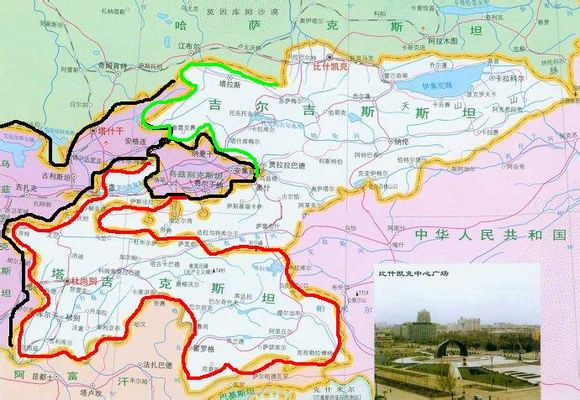

# 神遗弃的世界——中亚篇

## 中亚印象

这篇文的标题被起名为《神遗弃的世界》原因很简单，想必大部分人对中国的西部的邻居几乎都不了解。中国人对外界的认识往往是由强到弱，而印度则刚好相反。

在东方，我们的邻居，朝鲜，韩国，日本。南部的越南，老挝，缅甸。北部的俄罗斯、蒙古……甚至连隔海相望的菲律宾，马来西亚我们都是耳熟能详。

但是大部分对地理并不敏感的人，一说起我们的西方……就是一片浆糊。我们的印象里大致就等于……那地方好像就是一大堆斯坦们呆着的地方，他们的国家是什么样子……不知道，他们在做什么……不知道，他们的世界是什么样的……不知道，他们的生活和我们有什么不同……不知道，连他们的历史是什么……也不知道，他们对我们有什么影响，也不知道。

其实并非是中国人不知道，全民政治大国俄罗斯（俄罗斯是全球民众政治参与度最高的国家，男人的话题永远是三句离不开政治话题，女人也会讨论普京和姐夫）战斗的毛子们对中亚的印象都基本等于……大致是和阿富汗差不多的国家吧……俄罗斯人甚至对和他们接壤的大国哈萨克斯坦是麻东西都不感冒。

而在欧美人的世界里，中亚几乎已经被开除了球籍嘛……并且西方更狠毒……民众不知道中亚是什么就算了……连新闻媒体对中亚的任何事情都不会有一丝丝的兴趣。所以对于西方国家来说（主要是英美法德等国）中亚对于普通人来说就是一块绝对空白的地方。如果说他们觉得中国是神秘的，非洲是探险的，那么中亚对于他们来说……连神秘感都不具备。完全没有任何存在感的地方……

当然，有很多朋友可能会说……普通民众对中亚没兴趣有啥关系？这个问题可很严重的，因为普通民众对国家的关注度是会影响到两个地区的贸易，信息互换，国家开发等等领域……你这么试想，如果有个人给你说了一个你根本不知道的国家，然后告诉你他们做了什么事……你会有任何一毛钱的兴趣？如果没有兴趣，你就不会对他们产生任何主动式的联系，自然也就不会有贸易产生。如果一个国家失去一个地区的贸易，或者失去了交流。对于大国来说，则是丢失了一个经济增长点，而对于小国家来说……要发展国家，那就是白日做梦。

这个世界最痛苦的不是被全球所有国家敌视，也不是被所有国家孤立，最痛苦的莫过于……全世界国家的任何人都对你没有兴趣。……毫无存在感才是最大的痛苦有木有？

就如同你从女神身边走过，摆出了一个非常潇洒帅气的姿势，眼神的电力几乎都可以电死一头母牛，但是女神特码的无视你了，你如空气一般……她甚至连睫毛都没动一下，那才特码的是最悲剧的。

而中亚就是这样……他们用尽办法折腾，可是……没人对他们有任何兴趣。悲哉……所以中亚各国哪怕是挑断了脚高呼：“大家看我，大家看我”结果……众神连眼斜都不眼斜一下，何其的悲剧啊！！！！

当然，这里的小伙伴不乏对地理非常有兴趣，对地缘政治很有研究的大才子。所以也不缺乏对中亚还算是能说个一二三四伙计们。

但是大部分处于这种程度了解的小伙伴们，对中亚的印象应该类似于……新疆，或者阿富汗~总之就是一群欢乐而安宁的绿叔叔们活动的地方。没有中东地区那些绿叔叔那么疯狂，也没有东南亚绿叔叔那样呆萌，总之这里的一切都如同肃穆而坚毅的山石雕像一般，毫无表情。

也许能说点比如哈萨克斯坦的一些事，比如苏联四大工业区之一的阿拉木图地区。比如说一点乌兹别克斯坦的郁闷事。但是更多的……恐怕了解也比较少。毕竟关于中亚，信息量太少太少了。

当然，我也仅仅是对中亚有一点点的了解而已，和他们的商人们有一些浅薄的接触，领略过他们的风光，所以也算稍稍知道一点点他们的生活，他们的无奈，他们的现状。这里仅以我浅薄的认识，以说中亚这个被所有人都忘记了的地方。如有偏颇之处，诸君指教才是。

那么我们稍微梳洗一下，中亚在哪里。

中亚概念因为各大国在二战后为了建立各自的地缘政治优势，和国际影响力与话语权。所以中亚概念一直都分三方说法。

1. 在诚实可靠的苏联标准中：中亚指土库曼斯坦，乌兹别克斯坦两国，任何人敢说哈萨克和土库曼属于中亚，诚实可靠的老毛子一定会和你拼命。

2. 在人畜无害的中国标准中（所谓泛指）：说的是乌兹别克斯坦，土库曼斯坦，加北方的哈萨克斯坦，东部的吉尔吉斯坦和塔吉克斯坦，也就是我们常说的中亚五斯坦。谁敢说新疆，青海，内蒙，蒙古属于中亚……人畜无害的中国，估计会立即开启战斗模式（2005年之后一直开启战斗模式）

3. 在喜爱和平的美国标准中（我X，呸呸呸，是联合国标准，是联合国），中亚说的是TG五斯坦标准+新疆地区、内蒙地区、蒙古国+阿富汗北部+巴基斯坦北部以及西藏和青海地区。

三个标准和均和本国地缘政治有关，所以中亚这个概念至今是都按照自己的说法说。中国认为，中国960万平公里+丢失部分，全部特码的算东亚（只有远东部分承认为东北亚地区），而俄罗斯至今死磕认为，中亚只有土库曼和乌兹别克，谁敢说哈萨克是中亚，毛子就会（我的AK去哪里了）。

当然，全世界受承认最多的部分是美国当年挤兑中苏而提出的中亚概念，还弄了个高大上的名头——联合国教科文组织认定的中亚，高级的简直是丧心病狂！一上联合国教科文组织大法，立即就高大上了有木有？于是在”联合国标准下”，直接把毛子中国给圈进去了，【这也是大突厥主义的根本所在】（标注重点）这是用地理概念团结人文概念，然后再用人文概念和历史传承挂上钩，然后再祭出皿煮大法！站在山口高呼一声：“枪在手，跟我走，杀毛子，干兔子，弄伊朗！“

大中亚概念中，跳的最欢乐的各位小伙伴一定会认为是美帝。其实……大中亚概念跳的最凶的居然是特码的土耳其和印度这两个屌丝。

他们在地理书中直接把中亚各国画了庞大的圈圈……而土耳其也是个奇葩的历史发明家之国，其水平不亚于东亚的韩国人。

这个两个做好使不留名的活布什，为中亚地区发明了一整套的历史根据，画了一大堆的历史地图，用各种手段论证了中亚是同属一脉，不断的鼓吹大中亚地区是同文地区。并且不断的鼓吹夸大历史上印度对中亚的攻击，伊朗对中亚的侵略，以及中国这个“最不要碧脸”的国家对中亚的武装旅游行为（汉唐时期）表示森森的谴责。

并且，土鸡为首的逗比，把这些发明的历史统统发到国际互联网上……而中亚五国基本是没有什么互联网封锁的，然后……各种良心段子都出来了，各种要团结，各种传承都出来了。历史发明家有木有？你敢说你不怕？

所以你们可别以为仅仅是韩国、越南有这种被历史发明家毒害，患有精神分裂并伴随严重的领地欲的患者。中亚各国也一样有这种患者。当然韩国的工商业相对发达一点，所以成功吸引了东亚地区的仇恨。而中亚五国……貌似没人屌他们。

无奈的患者们只能狠狠的摔一下鼠标……

然后作诗一首：“天助贼尔不助我，拔剑四顾泪涟涟，他日若是走好运，一桶山河玩儿命去.......”

无奈的是……他们的北面是虽死而未僵的俄罗斯，东部是正在崛起的巨型国家中国……中俄淡淡一笑，少年……图样森破……于是根据“爱好和平的美帝”指出，中俄在黑屋子里祭出了上合组织联盟大法。

于是键盘侠们——瞬间蛋碎一地

看着中俄庞大地身影……无奈的只能放下键盘搬砖去……

但我们不得不说一个事实就是……所有民族都是天生的患有自大症，并且大多数的民族这种病几乎不能医之。所以中亚各国的教科书中，至今大篇幅的引用或者直接使用苏联、土耳其、印度的资料来写教科书。

所以中亚各国的心态非常奇怪，并且各国的历史书拿到一起的话……版图全部是重叠的，并且对某些历史上出现过的民族均持有不同的看法。

我记得有人说过这样一句话：”如欲亡一国，必先毁其史“我无才德，但也愿意为这句话写下后面的一句：”若欲控天下，必创英雄为世人所夺“

所以，当代中国人往往都很关注世界的新闻话语权在谁手里，但是新闻话语权掌握在谁的手里，仅仅能改变一件在历史这条长河中的尘埃一般的小事而已。

但是如果我们谁能掌握史学的话语权，那么他改变的将是世界！因为知识的源头将掌握的人死死的抓住。很多人看历史，仅仅觉得是了解过去。

但请听我一言，历史是一根绳子，谁控制了绳头部分……你只需轻轻的一摇晃，哪怕是一点点……那么绳子的尾部就会剧烈的摇动起来。因为任何国家当下的一切，都被绳头所控制着！

任何民族都需要传承，任何的民族都需要找到让自己立足天地之间的理由。而能给你这一切的唯一方法，就是历史。

所以，西方国家抓住了历史的话语权。他们用极其妖娆的手腕，把罗马军队是一个浪漫的英雄之师，于是所有人都相信，但实际上罗马军队屠城掠地可是一点都不手软的，在这样野人般的部队面前……有毛的浪漫，所过之处无非是鲜血浸泡着苍老的大地而已。

英国人抓住了历史的话语权，所以……他们让全世界都相信了有亚瑟王这个人，而实际上亚瑟王仅仅是一个传说，甚至没有出现在任何正经的史料中。但是……读英国史的时候，英国人会告诉你亚瑟王仅仅是个传说？

当中亚的历史被苏联，土耳其，印度抓住之后……整个中亚就因为绳子定律而开始疯狂的摆动起来。于是便成了个庙小妖风大，堂窄神佛多的一个地方。各路神仙都在中亚卖萌卖屁股，但因为现实的原因，又没种敢跨过中俄这两个巨物设置出的红线。（亦如我不敢跨越吧主们设置的红线一样）

所以在有限的空间里的舞蹈往往是最好看的，犹如飞燕合德能在掌帕中舞蹈，刹是好看。

## 地理

网友们大多数人对中亚的概念应该是来自于中国历史，因为中国的诗歌对中亚的描述，几乎都是茫茫大漠风尘的感觉，让我们觉得……西出玉门关外就是茫茫沙海。

一句”一片孤城万仞山”一句“春风不渡雁门关”，又一句：“关山正飞雪。 烽戍断无烟”

在大文豪们的手中，几笔就勾勒出了那茫茫大漠，春风也不渡的地方是为荒漠，大雪飘扬在荒漠中的孤城上，马背上的剑客，附于马身，往塞外而去。

又加上，如电影《新龙门客栈》等一系列的电影，在金庸和古龙两位旷世奇侠的笔下，沙漠、剑客、荒无人烟、雪山、奔马成了西域世界永恒的话题，并且成了我们这一代人对中亚的所有印象。

我们踮起脚尖，试图望穿那茫茫大漠背后有什么，但思维定式让我们觉得……中亚的沙漠甚至比撒哈拉的沙漠还要巨大，大的让我们无法跨越。

但殊不知，曾经的汉唐骁骑，曾经的满清铁骑纵横在中亚的世界，王的旗帜在这些地方奔行着，战马在中亚优美的牧场上嘶鸣着，天山而下的冰川风在他们的刀剑上凝结成一粒粒的冰珠。这些骁勇的战将，护卫着背后那个强大的帝国。

但是，中亚到底是什么样子的？

咳咳咳咳……我特码居然文艺青年了一把，我自己都不习惯了，哈哈哈哈哈。但描述大漠必须严肃不是么？

中亚到底是啥地方？首先中亚确实是有沙漠的，而且沙漠的面积还非常的大，在土库曼斯坦和乌兹别克斯坦一线，大部分国土都是沙漠。

但是新疆出去后到达哈萨克斯坦，那边却是非常广阔的草原，山川……并且土地虽说不如内地那般肥沃，但可耕地数量也是丧心病狂的多。所以，在哈萨克的大地上是非常适合唱一首歌的：“套马滴汉子，你威武雄壮……后面忘词了，我去）

但是草原，如天山般美妙的山川并不是中亚的全部。中亚的吉尔吉斯和塔吉克斯坦两国，则大部分国土都是山区，因为维度的原因，所以这两国的山区……有点类似黄土高坡的赶脚，因为维度，再加上特定海拔区~形成了极其美妙的风景，低海拔部分则是鸟语花香，中海拔部分则是干旱河谷，高海拔部分则是在雪山下的草甸。

所以，吉尔吉斯和塔吉克斯两国的风情很好看~

## 中亚历史

因为中亚历史部分可能会得罪不少的国内同胞，所以尽量不写。

中亚说的好听一些，自古就是文化交融之地，民族交融之地，有丰富的文化和历史，中亚的历史几乎和全球一流强国皆有关系。如历史上鼎盛的波斯王朝，如东方的汉唐帝国，如北方的沙俄帝国，如横扫万里的蒙古人，如打不绝的突厥，牛逼哄哄的匈奴人。几乎所有的国家都和这个地方息息相关。

中亚是群雄逐鹿的天下，自古的四战之地……所以，无论是东西南北四方任何一个地方崛起，都会对中亚用兵。如伊朗高原的波斯人一旦崛起就一定会吞并中亚，如东方的汉人一旦崛起，鼎盛王朝就会突进中亚，如果南部的印度有一点点机会，就一定会攻入中亚。而北方的游牧民族，如蒙古人，突厥人，匈奴人均是崛起后一定会吞并中亚，而在西北部的俄罗斯……他们甚至一度吞并整个中亚。

中亚的历史非常的久远，根据有文献记载可以追叙到大致数千年。毕竟这个贴文并非是历史帖，所以这一节大致介绍一下中亚的主要历史走向吧。

中亚在最初进入中国人的视角时，是在汉朝时期~

汉朝朝廷台新闻联播：

> 我大汉朝廷外交部大使，张赛同志于138年访问了西域国家大月氏。大月氏国王亲切友好的接见了张赛同志，双方就汉月两国的发展给予了高度的肯定，大月氏表示，张赛同志访问西域各国对中西世界的发展有积极向上的作用。

> 在会谈中，张赛同志表示，汉朝会坚持一个大月氏原则为核心，并进一步的商讨了关于双方共同维护丝绸之路这个具有战略意义的贸易通道。并且两国表示，匈奴自古就是大月氏和汉朝的敌人，两国应该团结一致，共度难关……张赛表示了大月氏对共同打击抢劫犯匈奴人的目标进行了充分的肯定和赞扬，并高度和高调的评价了两国关系上了一个新的台阶。

> 会议结束后，大月氏热情的邀请张赛同志吃烤羊肉串，喝马奶，两国人民在友好的欢快的氛围中完成了这次伟大的会谈

大月氏天真的以为拉到了强援，汉朝从蒙古一线进攻匈奴……于是匈奴打不过了，汉军简直就是咬住就不松口……要找匈奴人决战！

匈奴人天真的以为，抢点东西而已，不至于汉朝这么拼命……再说了，大汉天子和匈奴可汗还是亲家呢！结果汉朝派出霍去病等将领……问候了匈奴家数次后，匈奴表示……特码的汉军太热情了，完全不顾人受得了受不了。

于是匈奴人往西部迁移，在迁移的过程中灭掉了正在发展中的大月氏。并且顺手杀了乌孙全家，灭的康居人只能往今天的吉尔吉斯坦一线的山区里去逃命。

当年的汉朝军队，简直是不能惹的主……一路追着打，一直打到西域才肯罢手。而匈奴则继续西迁……到底是被汉军直接灭族，还是真的是欧洲之鞭阿提拉的祖宗，这个因为史学争议过大……我就不胡说八道了。

但是嘛……近几年，匈牙利人表示……根据他们的历史最新证据表明，匈牙利人就是匈奴的后裔！！！这个历史学新闻一放出来，匈牙利人的自信心和优越感瞬间爆喷，井喷之……

各种自豪感都出来了，于是今天很多匈牙利人都相信历史发明家的说法，于是他们是这样的

匈牙利人：你说中国？老子的祖先当年打的他们修长城防御我们，要是没有我们伟大的匈奴人，中国哪里来的长城。

我相信，仅这一个例子……大家应该就知道历史的绳子定理对现代国家人群的影响力了！

此时因为汉朝这个超级帝国进入垂暮之年，标志着汉朝因为内乱原因，退出了中亚的历史舞台。

汉朝退出时，盘踞在中亚哈萨克斯坦的匈奴人据说是西迁了。于是贵霜帝国开始崛起，贵霜帝国崛起后盘踞在今天乌兹别克至印度北部一线的一个幅员辽阔的大帝国。但是因为北部匈奴人的西迁，导致北部（今天乌兹别克西部）的花剌子莫地区开始脱离贵霜的控制。

并且花剌子莫地区出现了一个强大的民族嚈哒人，这个强大的民族很快就占据了整个中亚地区，并且将贵霜帝国的势力范围驱逐出去。

因为嚈哒人真是生在了一个最好的时代，因为匈奴不战而西迁（或者被灭了），汉朝因为衰落而退出中亚，于是嚈哒人唯一的对手是那当时陷入衰退的贵霜帝国。

所以嚈哒人这个族属来源不明，史料记载有限的帝国，居然成了后来中亚各个民族追述历史根源都会追到的一个民族。

因为嚈哒当时真的是雄霸天下的节奏，因为伊朗高原的波斯那唯一的强敌……正遭遇罗马军团的洗礼，双方激战在今天的耶路撒冷一线。所以嚈哒在中亚各国的历史中，均给予了高大上的评价。

但是嚈哒人的运气很快就会用光……因为罗马因为北方蛮族的袭击，开始把力量更优先用于对北方的战争上，在中东地区仅保留能和萨珊对抗的兵力。当时的罗马过于能打……所以萨珊波斯干不过硬的，就去打软的……

于是波斯军团出现在伊朗高原的地平线上，于是……一点寒芒先到，随之枪出如龙~一个QE连套……把没有花钱买坦克装备的嚈哒人瞬间被打空血……于是机智的嚈哒人准备进草丛……结果萨珊波斯军团早在草丛里插了眼，于是……一个大招过去，再连一套QE……嚈哒人卒！

而当时的中国却已经进入了隋唐时代，北方柔然已经被消灭了。诺大的草原没了主人，于是在今天蒙古国境内的一个小部落逐渐的崛起……他们是突厥人！

唐朝宿命中的敌人——突厥！

## 古代战争

请大家理解历史的时候，永远不要用现代视角和道德观念去看待古代军队所做的事情，因为如果用千年后的标准去评价古代军队的行为，那么我们将无法理解古代那些帝国的所产生的影响。并且会对现代社会的各种问题产生巨大的谬误。

所谓失之毫厘谬以千里，大概就是这个意思吧。

首先，古代军队是基本没有节操的。任何国家的军队都是这样，并且特别是如匈奴人，突厥为代表的游牧民族对军队的节操基本处于开放方式，并且丢节操是这支军队的灵魂之一。

所以，古代军队所过之处，不屠城的就已经是道德非常高尚的了。而抢劫，强暴，强征民力，劫掠私产，坑杀降兵等行为，都属于很正常的事情。至少在当时的人看来，那点事儿根本就不是事儿。

所以中亚这片土地，在嚈哒人这个中亚最后的本地守护者倒下后，中亚就进入了完全混乱的屠杀之地。你方唱罢我登场，之后几乎所有从蒙古崛起的草原民族都会用铁蹄和战刀把中亚全部犁一次。

所以中亚的很大程度上是受到了那些侵略者的影响，这种影响甚至影响到了他们的文化，习俗，文字，历史，军事等等。

整个中亚在短则几十年，长则百年就可能会被异族们虐一次。

而被屠久了之后，人不会反抗，而是会维护屠杀者，包括心理学中都有这样的案例，如著名的：斯德哥尔摩症候群。这种问题是持久的，并且非常非常的奇怪，但是他真的是事实，受害者会拼命的维护绑架自己的人，奴役自己的人（是不是和今天的日本人有点一样呢？你们看看日本人对美国的态度，呵呵）

### 突厥

突厥崛起后，和大唐掐架~的同时，积极要求进步……顺着蒙古高原一路杀入了今天的哈萨克斯坦至乌兹别克斯坦一线。最终建立起了一个强大的突厥汗国！一个由很多部落组成的突厥联盟！

于是突厥一直和大唐掐架，但是因为政治结构本身过于初级，内部最终分裂为西突厥和东突厥。突厥分裂后实力大减，东突厥被唐朝军队一鼓作气歼灭~

而西突厥部分则多坚持了几十年的时间，但是唐军和汉军一样啊……惹不得啊~唐军西出玉门关，一路追杀过去，根本没给突厥人任何一点喘息的机会。于是突厥被唐朝军队歼灭

在突厥的南部地区……一个庞大的身影，和唐朝几乎等量级的选手崛起在了南部，中亚人民可能永远不会忘记这个身影......——阿拉伯帝国。

唐朝歼灭突厥后，开始盘踞在中亚地区。并且带入了唐朝的思想和并且双方交换信仰，但是唐朝当时已经控制住了中亚大部地区，伟大诗人李白就出生在中亚的大地上，安西四镇中的碎叶城，即今天吉尔吉斯坦境内的托克马克市。

而阿拉伯帝国于唐朝的一战中，唐朝方战败，具体的我就不说了，因为史料记载差异过大~《唐史》《阿拉伯帝国史》英国版的《剑桥中国史》，土耳其逗比的《中亚历史》等对这场战役的描述均不同。但是我们只需要知道结果就是了……

唐朝和阿拉伯帝国的这场战争，唐朝军队失败！这场也许在当时阿拉伯帝国和唐朝双方都不在意的一场战争，永远的改变了中亚地区的文化和信仰。也导致自汉丢失的西域，在唐朝收复后……又一次失去。并且唐朝失去西域后，一直到元朝时期才重新夺回。

但是，这场战争永远的伤害了中亚各族人民……阿拉伯帝国的铁蹄和战刀永久的改变了所有的一切，受难的并不是大唐的子民，受难的是哈萨克人，乌兹别克人，塔吉克人，土库曼人，吉尔吉斯坦人~

失去了一切，并且在阿拉伯帝国的进入后，之后的历史脉络……就彻底被打乱了！

某一个国家的历史，或某一个地区的历史，只要弱小那么……其实都是一幕幕的惨剧不断的重演，一次次的杀戮不断的重复。谁也不是好东西，但谁也不想杀人……为了自己民族的存活和生存空间……古代战争本身就是这样。

无数的民族陨落在了历史的长河中……我们不能说那是悲剧。就如同我们在东亚大地上，无论战争多么残酷，至少每出现一个强大帝国的时候，我们就可以过一段幸福的和平岁月。

但是中亚这种地方，没有根基的大帝国不断的出现，不断的消失，……注定是被人碾来碾去。对于这些地方的人来说……生活无非就是……吃饭，睡觉，工作，战争，死亡。永远都是这五个名词为自己生活的全部。

所以，我们应该庆幸我们生活在一个强大的国家里。因为我们有和平的基石

前面说到了中亚历史走入进了大致在中国的宋元时期。

蒙古人在南下失利时，当时蒙古的大汉成吉思汗战死在对西夏的征战中（当然《蒙古史》说他是病死的，这个我们就不去争论谁是谁非了，反正他挂了就是了），之后蒙古在进行灭金夏的过程中，开始对南宋动武。但问题是当时的南宋非常的硬，倒不是说南宋多强大……而是整个宋朝几乎从开国到灭，几乎全程被迫保持对外战争。所以当时的蒙古很善战，但是南宋也不是啥孬货。

蒙古战略往南延伸受挫后，就如同一个人当痞子……比较凶残的不好整，那就去找软柿子捏（似曾相识啊）。于是蒙古西征军西进灭了突厥系西辽，之后对花刺子模用兵，导致花刺子模北部的中亚部分全部落入了蒙古军手中。而当蒙古几乎快把花刺子莫打灭后，获得了大量的兵员用于战争。于是蒙古的重心向东转移，开始灭金国。根据蒙古人的性格……他们是很担心敌人会反扑，所以西征军留下了一部分，继续进攻花刺子模。

这个时间差中，中亚的最后一个国家，也就是今天在哈萨克斯坦的大汗国，克普恰克汗国多维持了一些时间。但是很不幸的是……中亚最后一个国家，在金国和花刺子模被灭后。

蒙古几乎就是在一瞬间灭掉了克普恰克汗国。

大家注意哟，中亚的现代文化和人种和4次大规模征战是很有关联的，这4次几乎形成了现代中亚文化和习俗，所以稍微了解一些中亚历史有助于我们了解为什么他们现在是那样。

    第一次为：汉唐进攻中亚，中亚有了汉文化
    第二次为：阿拉伯帝国攻灭中亚，导致中亚有了穆斯林文化
    第三次为：蒙古进攻中亚后，中亚有了蒙古突厥系的文化（和古代突厥完全无关）
    第四次为：沙俄在近代进攻了中亚，并且吞并整个中亚，导致斯拉夫文化进入中亚

中亚的文化和习俗，包括民族性格和这四次大规模的进攻都有密切的关系。因为前面说过，古代战争可不会讲什么人权，考虑什么舆论。任何和进攻方有悖的任何人和文化都会被消灭，只可能留下自己能容忍的部分。

所以，中亚人有周礼中的一些规矩，一般体现在丧葬嫁娶，大型的祭祀类的东西上，当然汉文化影响的最深的部分就是逻辑道德上中亚大致是和东方差不多了，有点类似于吐蕃和唐和亲后，文成公主带汉文化进藏，形成了现代藏文化的核心部分。当然，中亚并非一次……所以复杂一些

第二次的阿拉伯帝国进攻，导致整个中亚由汉唐留下的大部分佛教徒被杀害，比如阿富汗北部，今天的塔吉克斯坦，吉尔吉斯坦，哈萨克东部……曾经都是汉文化区域，不是说李白都是出生在中亚么？在安西都护府被灭后，强势的阿拉伯帝国几乎把整个文化都洗了一遍。

但是伊斯兰文化改变的是中亚的宗教信仰，当时的中亚人类似于中原大地的回族人。文化上是汉文化，宗教上是伊斯兰，所以差异只在宗教，并不是很大。

但当蒙古进攻后，大家都知道蒙古有多凶残……蒙古把花刺子模几乎杀的人畜不留的程度，也极大的震慑住了北方的克普恰克汗国。蒙古的本身起源于蒙古高原，而这一片高原的前身是辽，突厥占据的地方，所以突厥系文化对蒙古的影响也是很深的。蒙古的进攻导致中亚人的逻辑上依然保持和我们一致，但习俗上开始靠近突厥系蒙古（后来有一次专门的词形容中亚，就是……突厥化蒙古，也就是中亚化蒙古人）

这个时候的中亚人变成了，汉文化逻辑，伊斯兰的宗教和世界观，蒙古突厥系的习俗形成的混合型中亚文化。

但是……到了近代史部分，我相信大家可能了解的比较多。

元灭了之后，中亚很长时间都保持同样的状态，因为蒙古四大汗国统治了太长的时间，几乎固化了现代中亚的大部分文化。蒙古四大汗国的，伊尔汗国占据了中亚南部，察合台占据中东部分，金帐占据了北部。到了明朝时期……最著名的突厥化蒙古汗国——帖木儿汗国的崛起，依然是保持同样的文化习俗，因为帖木儿汗国认为自己是伊尔汗国和察合台汗国的继承人，并且因为东方明朝的崛起导致元朝灭亡，帖木儿大帝居然把复兴蒙古为自任……不断的惹金帐，西打拜占庭，联络北元……（特注：帖木儿为突厥化蒙古人）

也就是说，到了明朝时期中亚依然是那样子……但北元政权灭亡后，瓦刺崛起后和帖木儿汗国被伊朗的萨非波斯占据了高原后。导致中亚形成了权利真空期

这也是如今的哈萨克斯坦人和乌兹别克人最骄傲的时刻，他们独立了，他们在中部建立了布哈拉汗国，但是哈萨克斯坦境内完全变成了无政府主义者纵横的地方……哈萨克人说他们那时候建立了一个什么什么汗国，那是胡扯……根据中国和俄罗斯以及伊朗的记载，当时的哈萨克斯坦就是混战之地。分为大玉兹，中玉兹和小玉兹三部。

当时俄罗斯东征准备搞定西伯利亚汗国，所以小玉兹部落们颤颤巍巍，当然人口最多的大玉兹部分靠近今天的新疆和蒙古一线，接壤瓦刺~所以……咳咳，给瓦刺养马的节奏（出自《明史》）

当然之后的瓦刺伴随着明朝灭了，东方的满清崛起，蒙古高原西部的瓦刺变成了准格尔部。满清后来一统蒙古诸部后，其实准格尔应该算是满清的盟友或下属国（要不就不会说准格尔叛乱了，如果是国家和国家应该是对准格尔战争，而不是准格尔叛乱）当时满清灭明朝，准格尔就毫不客气的……一点面子都不给，直接一脚踹死了大玉兹诸部，导致哈萨克大玉兹全境归了准格尔。

康熙年间，满清平灭准格尔……之后代表着中原王朝再一次进入中亚，占领了哈萨克斯坦的东方部分，大致就是今天的哈拉木图一线。

就这一段悲催的历史，大家可以看一部哈萨克拍摄的爱国电影《一千无谓勇士》讲述的就是混沌状态的哈萨克斯坦诸头领们各自为战，准格尔奴役哈萨克斯坦，最后英雄的哈萨克人民占了起来……最后被准格尔无情的给打跪了。那电影拍的挺不错，建议大家观看~比看文章更能了解哈萨克的那个时期。

满清时期，哈萨克一直都是那样子。直到牛逼XX的沙俄从北方杀了出来，中亚的悲剧就来了……因为之前总结过；中亚是一个四战之地，东南西北四个地方都是强国，任何一方的强国崛起都必定会夺去中亚。

所以……他们的任何自治或任何性质的所谓独立，其实都不长久。沙俄如狂风扫落叶一般，一路攻占中亚，先拿了哈萨克部落占据的高加索地区，然后夺了哈萨克小玉兹，之后吞并中玉兹，威逼当时的希瓦（今乌兹别克）和布哈拉汗国（今吉尔吉斯坦地区）以及大玉兹（今哈萨克大玉兹）

当时满清已经悲剧了，因为已经十九世纪了……于是满清被迫签署了不平等条约，以葱岭为界，数次割让土地……导致大玉兹至唐努乌梁海一线全部被割让，形成今天的国界线。

如果按照美帝标准的中亚，我们还占据新疆和青海及内蒙。但是按中国标准，中国已丢失全部中亚土地，从此时开始退出中亚地区。

当然我们说的是中亚……就不扯中国和俄罗斯的那些事儿了

之后，整个中亚在俄英的条约下……两国以强行分裂伊朗，以阿富汗、西藏为界。英占中东至印度一线，俄罗斯占中亚和新疆地区。

悲剧的中亚，全部落入沙俄手中。之后的苏联时代来临……整个中亚悲剧了，当然……苏联的占领也不能说是悲剧……总之任何事情都是这样，就如同蒙古进中亚，有好处也有坏处。也如同苏联进中亚，好坏都有。

苏联分裂后，形成了如今的中亚五国~几个悲催的一流的国家

我相信你们了解了他们的历史后，应该清楚中亚国家的人是啥心态……

说句实在话，就我对他们的了解……我很丧心病狂的说一句……他们有点和韩国人一样

有时候我们不能过于计较，就如同韩国、中亚五国、蒙古等地的一些学者，真正看了周围所有国家记载的史料和事实后……大多都是自卑的。但也不乏个别人士自卑中疯狂了说出一些丧心病狂的话……比如我看过一篇哈萨克人据说是教授写的文章……说他们灭准格尔第一功劳（康熙捂胸），驱满清出中亚他们很牛逼（叶儿羌笑而不语）大战沙俄四百回合（沙皇大帝表示），反抗苏联牛逼的横着走（斯大林同志）

这就是小国心态……我很多时候同情他们，但很多时候又会被他们给弄的很无语……

总之，这种文化和心态导致他们的自卑其实也是一种悲剧。当我们真的能读懂并理解这些自古就是战乱之地的人民，我们应该对他们报以同情之心。

任何人群天生都不应该被杀戮，被掠夺，被强占。但是现实告诉我们，所谓的人类的道德又是多么的脆弱。

神也许遗弃了中亚……万幸的是，我们并没有忘记中亚

我们并非汉唐帝国，如今的中国……就是自信的中国！

我很真诚的说一句……如果众神遗弃了中亚，当中亚人民在恐惧中战栗不安，当中亚人民在寒风中瑟瑟发抖时，请永远记得……在遥远的东方，你们还有一个可以信任的兄弟——中国！

## 看不懂的中亚人

曾经在中亚数个地方呆过一些日子，所以对中亚各族人民的那种奇怪的心态琢磨不透。也许这是大多数弱小的第三世界国家国民的通病吧！

这里我用一些小故事来说这些奇怪的心态，也许有助于大家有兴趣阅读。

### 看不懂的哈萨克人

曾经在阿拉木图时，经常会遇到来自新疆的哈萨克人，当然他们也许已经不是我们的同胞了，因为毕竟别人已经放弃了中国国籍，成为一名光荣的哈萨克人，回到了他们梦寐以求的故土。

但是这种心态真的让人琢磨不透，当时因做一些贸易生意，所以认识了在阿拉木图做批发的A君。他的前半生在中国的喀什，喀什是中亚地区的贸易中心，大部分对哈萨克贸易，吉尔吉斯坦等地的贸易都是从喀什出去。十年前，他开始饶有兴致的了解自己民族的历史后，开始出现对故土无比的向往。

这种心态很正常，毕竟他是一名哈族。但当梦想实现后，他的心态就变得非常非常奇怪。

中亚五国均是弱国，其实一个国家的强弱不仅仅是看人口，军事能力，还有一个更重要的指标就是对国家对物价的调控能力。中亚五国的贸易因为地理原因，所以他们的贸易大多都是和中国贸易。而中国因为工业进展速度太过于快速，所以贸易量几乎占到了绝对水平线上。

所以比如像哈萨克斯坦等国家，对自己的物价基本是没有什么掌控力的。掌控能力会涉及到国家的实力，比如强大的国家可以决定一项进口商品在本国的市场价格是为高还是低，可以进行调控。但是弱小的国家对价格调控力只有一个办法……就是增加关税，也就是说他们所表现的价格调控仅仅是涨价。但他们永远不能降低商品价格。

所以，如哈萨克斯坦这类国家，人均GDP大致是中国的两倍，但是在那个本国几乎已经不能生产大多数的工业品和农作物时。其实那日子过的也是紧巴巴的，除阿拉木图一类的人口集中地外的人群，因为物流压力等原因，生活成本更加的高昂。

所以，移民过去……当然也可以说是回国的A君。在中国已经习惯了大工业国家的便利。当到了哈萨克之后，就变得怪怪的。

比如，当他和我们聊天的时候，他会对自己的国家和民族有极高的认同感和荣誉感。但是当他和他的族人聊天的时候，他又对自己是海龟的那种身份显示的极其的与众不同。处处表现的似乎是要高普通哈萨克人一等的感觉。

当然，当地的商人和雇员们，对他有种类似于鲁迅看孔乙己一般的心态。

这种复杂的心态，并非出现在类似于A君这样追逐故土的人身上。

比如B君，他是正宗哈萨克人，他骄傲的认为自己是突厥后裔！并且不止一次的和我们谈起他祖上曾经多么牛逼……和他一起聊天非常的轻松，因为他的段子永远都是非常搞笑的，万变不离其宗就是……他们曾经非常非常牛逼，只是我们这些歪果仁不知道罢了。

但是，在他有如此高的民族荣誉感和国家认同感的同时，他又对遥远西方的莫斯科有浓厚的兴趣。最后一次遇到B君是在喀什遇到。他信誓旦旦的说，再挣几年钱，他就要移民俄罗斯了！

我对此表示不解，所以嘴欠说了一句……俄罗斯移民好像不好办吧。他信誓旦旦的说，他祖父曾经就被调到了莫斯科工作，有莫斯科的户籍~所以他回俄罗斯会比其他的哈族要容易的多

后来B君如愿以偿的去了莫斯科，当然要获得国籍也许还要一些日子，但是……这时的他已经成为他的朋友眼里较为牛逼的人了。

中国去哈萨克的人，几年后就想回到中国，因为丢失了国籍哪怕是野着也很想继续在中国。而出去了的哈族人，则对自己的国家戳之以鼻。

至少我几乎没看到过世界其他地区有什么国家的情况类似于中亚五国。

说他们自卑，他们总会拿出“祖上阔过”这把大刀，说他们自大吧，其实他们很多时候又非常的自卑。

说他们没有梦想吧……做梦都在幻想有朝一日一统山河，说他们有梦想吧，他们又在拼命的逃离他们认为已经让他们绝望的祖国。

我曾经试图去总结他们的心态，试图找一个解释，但是一直都没成功过，直到后来遇到了一个人，算是给我解开了这个“千古谜题”

## 弱国的悲哀

我一直去试图了解这些国家民众为什么会有这样奇怪的心态，后来在东北佳木斯市去的时候，遇到一个俄国毛子，他的父亲是中国人，母亲是毛子~居住在海参崴那边。

他说其实那种心态很容易理解~

当一个人贫穷的时候，他的自尊心会膨胀到极点。原因就是他不希望被别人知道自己的贫穷，所以一切善意对于他们来说可能都是侮辱，如同今天的俄罗斯。

听了他这话之后，我突然想起自己小的时候。

小时候家里穷，所以经常断粮。但是父亲从不会去找任何人借一分钱，因为他怕别人认为我家连粮都吃不起了。于是宁可吃喂猪的玉米糊糊，也不去借一分钱！

我相信岁数大一些的吧友，可能父母都对我们说过一样的话：”我们穷也要穷的有骨气，不能被人看不起“

这句话几乎是贯穿我整个童年，乃至青春期，并且至今都影响着自己的一句话。但是我的侄儿那一辈，没钱了找别人借个千儿八百的简直是无所谓的节奏。原因是内心的强大远比行为强大更加重要。

所以，这种骨气是一种气节。但我们要知道这种气节是一定来自于国家的贫弱和发展的不均衡带来的，所以中亚国家的国力单薄，财政赤字，人群的收入不平衡等等的原因造成了整个国家的人都有了一种气节。

而这种复杂的心态并非是金钱可以弥补的，如同韩国人……他们的经济情况至少在纸面上是优于中国的，但是韩国人又为何有和中亚五国一样的心态呢？

还是那句话……国家弱小啊。当国家弱小到别人伸出一个手指头都可以灭了你的时候，当国家弱小到无法和大国平等对话的时候，整个国家都会陷入一种奇怪的思维。

没有任何人看不起他们，但是首先他们自己就认为别人在歧视他们。就如同乌兹别克斯坦那边，有时候也会粮食短缺，美国人送粮食过去我们且不论美国人要干嘛，送粮的本质是对的。但是乌兹别克人一样的很难受的，因为他们觉得那是施舍，觉得是一种侮辱，迫于现实而拿下，心里也是受煎熬的。

所以在这种被现实摧残之下形成的独特气节，只能由历史来填补，用先祖的荣誉，祖先的光荣来填补。一个国家的国民如果缺乏自信心，这真的是很可怕的事情。

而曾经的中亚五国在苏维埃这个超级国家的带领下，还算过的比较的阔绰。因为哈萨克斯坦的旧都阿拉木图，至中部城市卡拉干达地区，曾经是苏联的四大工业区之一，并且阿拉木图曾经有宇航中心，核武库，以及和周边地区配套的成体系大工业。所以当年在大国的庇护下过的还算可以。

但是当苏联解体之后，中亚五国曾经也讨论过如何保留工业体系的问题，但是……也许因为自私吧，大家都认为这是在帮哈萨克斯坦续命，于是最终作罢。哈萨克只能放弃工业体系，因为北部的俄罗斯拥有更健全的体系和更多的资源，不需要哈萨克的工业为俄罗斯做所谓的输血（俄罗斯自己都保不住工业体系）

而在中亚的东部则是中国这个全世界唯一一个拥有联合国列出的所有工业目录的超级工业国。他们的南部，伊朗一直都在自强不息，自从伊朗的大阿亚图拉，霍梅尼同志带领了伊朗获得真正的独立后，伊朗为了安全一直在拼命的发展自己。而西方，则是苏联当年的另一个工业体系国家……苟延残喘的乌克兰。

所以，他们陷入了一种困境。于是随着时间推移，巨大的工厂开始变成死亡的工业城，那些高耸入云的烟囱成为一个时代的记忆罢了，似乎已经变成凝固的回忆。

当工业崩溃后，中亚五国的化工业崩溃了~如一记重斧砸在了农牧业的头上，无数的技工们被迫离开了他们的工厂。于是崩溃开始了……一发不可收拾。工商业，农牧业持续的下滑，因为当年的叶利钦自顾不暇所以几乎对他们没啥关照。于是教育、文化等也开始出现下滑。

【人最痛苦的不是非洲国家那种从未得到，最痛苦的是中亚五国这种曾经已经拥有的国家】。这种情况有点类似于一个百万富翁突然一夜之间倒了下去，他是无论如何都还是会把自己百万富翁的这个B格一直揣着的。

毕竟中亚国家的，国力弱小并且实际问题无法解决，囊中羞涩还是让人尴尬的，如果是一个人可能会沉寂在酒精中，然后回忆自己祖上阔过，自己也曾经比邻居过的好。这个国家唯一能做的可能就是……群体性的混乱，都不知道自己在干嘛，要干什么！

当寡头的入侵变的更加疯狂的时候，那日子就不靠谱了，因为曾经的苏维埃成员国都有一种通病就是……解体病，具体表现为：寡头霸占大规模的国企，物价持续性的走高，并且通货膨胀一直高居不下，国内资本不断外流等情况。

于是乎，“王家有财一千万，邻居九个穷光蛋，若是平均大法上，各个都是王百万”的情况在解体国家简直是司空见惯。亦如阿拉木图，撒马尔罕，杜尚别等“城市”中，也能经常看到那些超级土豪看着超级牛逼的座驾飞驰而过，也能见到一些衣衫搂烂在绝望中的普通人。

虽说这种情况所有国家都有，是个人类社会就存在。但是解体病的国家里，那种财富断层的鸿沟，是我们这种生活在中国的人，无法理解的。有点类似于……我们和李嘉诚的那种鸿沟吧！

当然，活人不能被尿憋死，总是有办法的！而且苏联分裂后出现的那些政治家们，不得不说一个个都特码的是人精，好的没学会，坏的门门精！

他们快速的放弃了工业国身份后，转入了人类社会中风险性最低的社会结构“农牧结构”，所以大多数的中亚国民们，其收入增长和跌幅都是非常的小，反正就是……饿不死你，要发财几乎不可能的那种状态。在这种状态下，人会趋于安稳……或者说是看不到什么发展的希望，索性破罐子破摔的心态。

而大土豪们则充当了国家发展动力机器的角色，疯狂的挖掘资源卖给中国。疯狂的掠夺自然资源！并转移国内财富到国外去……

原因很简单，当社会的生产体系下降一个等级后带来的后果一定是消费结构直接崩塌。简单的说就是，这些国家的土豪有钱都没地方花！

至少你在那些城市里，如何让自己愉悦的消费是一个比较严肃的问题。所以在消费市场结构坍塌后，资源产生的利润是直接流入了俄罗斯，土耳其，中国、美国、英国等地。而不是回流到本国市场充当发展生力军，人民自然也就无法分享到发展红利。

于是社会会进一步的倒退和两极化对立更加的严重，并且因为贫困导致城市人口找不到宣泄口时，民族问题和政治话题似乎是宣泄这些不良情绪的主要载体。于是……这些地方的人，会莫名其妙的出现族群对抗一类的事情。起因也奇葩，对持时更加的奇葩。

并且一旦涉及到政治问题，他们就会把所有的过错全部归咎于中俄这两个国家，如今在中亚五国最流行而且大家都认同的话题就是：俄罗斯压榨了他们，分家时不公平！还有一个就是中国把他们当做了商品倾销地。

所以，仇视俄国和仇视中国的情绪在中亚五国的中产阶级中尤为普遍。但是他们的所有收益又是因为和中俄贸易产生的……

我相信，说了这么多，你们应该能明白他们是处于一种什么样的状态、心态，这里我用小人之心妄自说一句，他们的社会都在发出一种声音：”错的不是我们，错的是世界“

他们把所有的失败，所有的一切，归咎于那已经早已死去的苏联。把所有的过错归咎于他的所有的邻居、如乌克兰、俄罗斯、中国、伊朗、阿富汗等等......

我有时候很脑残的有一个设想就是把川剧《点灯》翻译成中亚各国语言，也许能点醒他们~也许真的应该看看，问题是不是出在自己的放任自流之上。

中亚各国人民的复杂心态，其实我个人是非常能理解他们那种心态的，毕竟这种状态下的生活确实是让人非常蛋疼的。

试想一下，如果您的生活几乎没有任何希望可以改变他，日子就是枯如干蜡一般无味，全世界大多的工业产品本国不能生产，物质生活非常悲剧，加上因为物质的萧条带来的文化产业也进一步的萧条，如果你是一个有文化的“精英”你去书店甚至只能购买那些苏俄时期，甚至更不老的所谓名著的时候，精神生活想必也是非常的空虚。所以这种状态下的日子，说实话……不是我们这种生活在工业规模庞大，物产丰富，经济流通速度快的国度里的国民能去想象的。亦如美国人无法去想象一个蒙古人的生活是一个道理。

我们生活中所有的理所应当，在中亚，……你懂的。

当然，也有那些大土豪和高收入阶级，他们的日子过的非常的愉快并且秒杀我等几百条街，但是……那仅仅是极少部分人的生活。我们看一个国家和地区的经济状态，我们只能看大部分人的生活，我们不能看最穷的那部分，也不能看最富裕的寡头那一部分。对吧？

中亚人民在这种不平衡的经济体系里期待公平，可现实生活永远都不是电影

## 中亚各国人民的生活

这里我分开介绍各国的情况吧

### 哈萨克斯坦

哈萨克斯坦是传说中中亚五国最富裕的国家，人均GDP大致在一万二三的样子。有一定的工业基础，并且大家看地图的时候能得知，哈萨克拥有极大规模的牧场，主要是靠在东部地区，靠近乌拉尔地区的农场规模也比较大。所以，从经济数据上，哈萨克斯坦简直就是非常非常舒服的地方，但是事实是这样吗？

在我到哈萨克之前，我也认为哈萨克斯坦的生活水平应该靠近上海和江苏的水平。生活应该非常的靠谱

但是嘛……咳咳

哈萨克斯坦的人口主要集中区，曾经的首都也是哈萨克最大的工业区和贸易区，阿拉木图。

阿拉木图在五年前，房价已飙升到了三十万坚戈一平米的价格，大致相当于人民币一万多一平米的房价。而在市中心新修建的好房子，大致已飙到三十五万到四十万坚戈一平米。所以，这个价格对于哈萨克人民来说还是比较蛋疼的，并且税务也相对较重。并且因为统计方式的差异，实际人均GDP（注意是平均）大致在六千左右徘徊。

一个哈萨克 白领一年的收入大致在130万坚戈左右，但是……大部分的收入（城市里的）都是八十万坚戈上下。即为一个月大致在七万到八万坚戈的样子。折合人民币大约两千七八到三千块的工资。也就是五百美元到六百之间的是绝对主力军。

但是因为工商业相对不发达，所以务工机会并不多，找一个工作还是比较困难的。

也许你会觉得，这日子好像也不错啊……相当于人民币一个月收入三四千，房价一万多……和我们有毛的区别。

咳咳……如果你知道物价的话……你就知道什么是森森的蛋疼了。

哈萨克斯坦的主要食物依然是土豆，小麦等为主，并且土豆是主力军！一公斤土豆的价格是一百三十坚戈，大约相当于人民币两元三四一斤的土豆。

要知道土豆这种主食，和大米不一样，不管饱的。所以贫困人群吃土豆的话，一天要吃大概三斤左右。也就是一天主食需要七八元的样子。相当于我们吃大米（按今天的物价算，就是吃三斤大米的物价水平）

然后主要的蔬菜部分，比如

+ 大白菜……一斤150坚戈，并且不议价。相当于人民币5元一斤的白菜。
+ 一斤苹果的价格是三百坚戈，不议价。一斤就是10元钱，你吃得起？
+ 一斤梨子的价格，380坚戈~相当于12元人民币一斤，你吃不吃得起？

注意，我这里说的都是市斤，不是公斤。并且，你的收入是人民币三四千的样子，你敢不敢吃？

而且我们日常中经常吃的新鲜水果……那就比较丧心病狂了

+ 比如一斤葡萄的价格是四百五坚戈，（相当于人民币15元）
+ 一斤菠萝的价格是七百坚戈（相当于人民币23元一斤）

而且通货膨胀率哈萨克是一直无法控制的，平均每年的实际通胀率大致在15%左右疯狂的乱彪，当然厚颜无耻的官方那一票人号称通胀率很低……哈萨克人只要有机会和中国人贸易的，手里一般都留美元和人民币，因为俄罗斯卢布和哈萨克坚戈的通胀水平……太尼玛的丧心病狂了。

并且，中亚地区国家的腐败简直已经到了丧心病狂的程度。这种腐败是举国的官僚抱团腐败，行政不作为经济下滑，导致贸易逆差过大怎么办？简单……一道命令下去就是哈萨克坚戈直接以25%的水平贬值。而人民的工资是没有增长的，等同于直接降工资四分之一，牛不牛？

15%的实际通货膨胀加上连年的货币贬值，这日子真特码没法过……但是，你不过也得过……谁让你生在了哈萨克斯坦呢？

并且阿拉木图作为曾经世界上都能叫板的工业区，如今却连菜刀都需要从中国进口了……一个曾经能制造宇宙飞船，能制造飞机坦克的国家，连菜刀都不生产了……一把菜刀，价格1200坚戈（相当于人民币40元）。就是中国菜市场里八元一把的那种不锈钢菜刀，用个几个月就报废的那种破烂货。

各位扪心自问，这种日子，谁受得了？

而教育部分，那就真的丧心病狂了……因为苏联解体之后的私有化后，书本的价格简直是丧心病狂的恶毒，说了都特码的是泪。

所以，哈萨克人的日子过的真心不是紧巴巴那么简单了。哈萨克人受蒙古突厥的印象重，所以大家族生活也比较多，家里四五个人工作，两三个小孩加两三个老人是常有的。当然年轻人（70后80后们）也开始单过，那日子就没法过了……

但是在阿拉木图的土豪也是非常多的，他们过着穿金戴银的日子，开着几十万人民币甚至数百万的豪华汽车，住着庞大的别墅，周末都是去巴黎旅行的牛逼人也不是一个两个。

他们国家的财政主要收入依然是来自于资源开采，比如油气开采，铜铁矿开采等……富了不少的投机者和官僚系统里的大舅子小姨妈们……但是，普通哈萨克人的日子，谁特码关心他们咋过日子呢？

哈萨克斯坦号称的是欧亚大陆桥中最富裕的国家，所以他们的民族自豪感是嗖嗖的高，但是自卑感也是非常的重。

因为大玉兹（地理概念）的哈萨克人大多和新疆的哈萨克族人有亲属关系或宗族关系，所以有时候会串门到中国来，他们一过来就是新疆伊犁地区，而亲戚们会带他们去乌鲁木齐啊，喀什这些地方去购物，见见世面。要知道阿拉木图虽然很大，但是和乌鲁木齐比……实在太小了，和喀什这种自古就是中亚贸易中心的地方比也太过于丧心病狂了点。

并且哈萨克人在中国经历了亲戚们已经习以为常的生活后，会感到森森的不爽感。因为伊犁地区，喀什这些地方大多还是过的比哈萨克好的多就是了，并且基建水平是秒杀他们的。比如我们生活中，家里来了客人，请他们吃一顿大餐，放一些瓜果点心，糖果随便吃那是规矩。给远方的亲戚们买一些礼物也是非常正常的。但是这些东西在阿拉木图都是过节时才会购买的东西，而我们已经习以为常了。

而另一部分哈族，他们的亲戚在哈萨克斯坦的阿亚谷兹这些地方，于是穿越国门后……国内哈族就住在石油之城克拉玛依……这酸爽，你懂的......

人都是有自尊的，所以哈萨卡那边的穷亲戚们大多都会往死的装B，总之就是各种秀优越。而国内的哈族大多又挣钱忙，没时间去哈萨克。所以形成了一种极其奇怪的状态……

哈萨克人羡慕中国的生活，而国内的哈族也羡慕他们的生活。总之这种现象太过于奇葩

而哈萨克这个国家也比较奇葩，他们是上合组织成员，算是战略同盟成员。但是他们居然要做贸易保护，所以中国的工业品，农产品等生活必须物资，在塔城、伊犁等地的关口是一个价，过去立即就开始凶残的往上升。

有个哈萨克的商人，会一口流利的汉语（曾经在北京留学）他政治上非常激进，他认为：“中亚五国和中国应该组建贸易共同体，这样哈萨克，乌兹别克，土库曼等国家的老百姓生产的东西可以快速的流通到中国去，而他们需要的农产品和工业品可以快速的流入到中亚五国。并且各国因为是贸易共同体，所以应该进一步的做货币一体化（类似欧元），他说有了中国这个大型经济体做货币支撑就不会有如此严重的通货膨胀。”

我问道：“我们都知道，贸易共同体需要相互之间差异不大才可以，如果一旦贸易共同体做成了。中亚五国本来就已经脆弱不堪的工商业岂不是会被冲击？甚至成为中国产品的倾销地？”

他答：“这个你担心过多了，现在我们已经是产品倾销地了。工业在苏联解体后，就保不住了全散架了。如果我们组建贸易共同体，那我们的产品也可以更多的往中国销售。这本身就是有利的，现在的情况却是我们成了中国的倾销地，而我们的产品要卖给你们却有高昂的出口税，导致我们的产品在中国没有竞争力。”

最后他居然来一句……那些政客就是在剥夺我们这些普通人的利益，为了他们的利益不顾人民的死活。

我也就只有呵呵的笑了，因为……他说的不是没有道理，但是我相信哈萨克的政治家们也有自己的想法。虽然他们已经沦为了中俄的附庸体，经济上严重依赖中国，安全上严重依赖俄国，但是……我相信哈萨克人还是会努力的保证自己的独立性吧。

既然这一节是说他们的生活，作为一个吃货……说实话，我很喜欢哈萨克人的食物，简直是人间美味

最喜欢的莫过于他们的熏马肠，那味道……简直是人间美味，一口下去香味四溢，吃的快了些，似乎要把舌头都给吞下去的节奏。也喜欢他们做的羊肉，那味道……简直是绝美！

说了那么多关于经济的话题，我们说一下轻松的……他们的日常生活吧。

哈萨克人很喜欢三三两两的聚会，聚在一起玩乐。歪果仁们喜欢他们的风情娱乐地，大多都是一些哈萨克风情的歌舞地，因为去一趟国外，毕竟还是要看一些当地的歌舞，吃一些美食。但是我等屌丝是绝对不敢去那些宰客地的，因为……我听一朋友说，他们去一个类似于民俗歌舞剧场的地方，一个果盘六千坚戈，一盘羊肉串一万一千坚戈，简直丧心病狂。

所以，更愿意去街边的一些小地方玩儿。贴近哈萨克人的生活嘛。而这些喜欢玩乐的哈萨克人大多都是一些还没有结婚的年轻人，他们很有自娱自乐精神，总之和他们的朋友聚在一起的时候，似乎没有一点的忧虑一般。

因为他们是产油国，所以养车的成本比较低。在阿拉木图，汽车的数量也是比较可观的。但大多数都是购买一些翻新的二手车，而喜欢时尚的则更乐意使用比如我也很喜欢的街车，在10年之后哈萨克还兴起过一段越野摩托的风。他们 到了地方后，把车停放好之后，然后三三五五的坐在商贩们在街边做的一些小隔间里。然后掏出我没见过的神器！

一个小音响，下面自带一个小插口，可以直接插在手机的MP3插口上，然后就变成了一个小音响。他们会随着音乐跳舞，要不就会唱着他们民族的歌谣，各种欢乐。有时候还会拉着歪果仁和他们一起欢乐欢乐。

哈萨克人的豪爽和单纯也让人挺放得开！

在阿拉木图，我甚至听到……神曲——月亮之上！哎哟我了个去，凤凰传奇居然冲出国门，冲到了哈萨克斯坦.......

年轻人们的生活和我们基本完全不一样

在中国，年轻人的生活大多都是上班，回家上网，要不就是几个朋友出去嗨，出去聚会等。哈萨克上网太过于传奇，倒不是他们没网络，而是太贵了点……酒店里开网时，那价格……还说了，反正你一听就会吓尿的节奏。我以为酒店黑，后来才知道他们的基建太差，所以网费贵的丧心病狂。年轻人们的日常生活，基本和我们最单纯的父辈们的娱乐生活差不多，各种嗨皮，集体娱乐非常多。

### 乌兹别克斯坦

乌兹别克斯坦是中亚人口最多的国家，接近三千万人。国内有一百多个民族……（丧心病狂），但是乌兹别克斯坦同时也是最穷B的国家。人口对乌兹别克的压力是非常大的，要知道乌兹别克虽然看起来还挺大的，其实这个国家大部分人口都集中在东部靠近山区的地方，而他的中西部地区沙漠和戈壁较多，所以人口也相对的密集一些。

值得一说的是，穷B的国家往往都有自律精神和奋发图强的动力，他的隔壁那败家子国家，哈萨克斯坦……当年苏联在阿拉木图建设了一系列的重工业，但这群败家子把所有的重型工业都败光了。但是乌兹别克这个穷B却保留了一些重工业。

更加丧心病狂的是，乌兹别克这个国家，至今依然能自产汽车，并且出口到他隔壁那个败家子邻居那边。我记得去年的时候，乌兹别克一年能生产大约三十万辆汽车。也许对于中国人来说，三十万的产量过于渣渣了，因为我们一年产量是两千万辆。但是乌兹别克已经是中亚五国里，唯一还能生产重型装备的国家了。

可能是因为贫穷的原因吧，当你在哈萨克斯坦的时候，整个国家给你的感觉就是，表面上富裕实际上过的跟叫花子是没啥差距的，有点类似于兜里只有10块钱，死活要抽五十块一包香烟装格调的那种小年轻给你的感觉。而一转身到了乌兹别克后，这个国家则给人一种窒息的贫困感和如大石之下的绿草表现出的旺盛生命力。

因为穷，所以吃饱肚子这件事情是比较重要的。在脱离了苏联之后……穷的没办法，国内人口也比较多，所以吃饱肚子这件事情几乎关系到政权的稳定性。这一点和中国建国时期是差不多的。所以，乌兹别克在买不起粮食的情况下，唯一的办法就是在任何可以种植的地方，种上粮食。

要知道，乌兹别克斯坦地处于中亚，国土的中西部地区全特码的是沙漠。但是人饿急眼了，就知道该肿么办了~他们在任何有水源的地方种植，开垦土地，种植……并且精耕程度仅低于中国，日本，泰国，越南这一类自古精耕的国家，农业发达的丧心病狂。

就这个描述，对于无法出去看看的朋友，你们可以打开谷歌地图，用卫星模式，看一个乌兹别克斯坦的小镇，在沙漠里的扎拉夫尚就明白怎么回事了……扎拉夫尚的东西面各有一个小池塘，东部的那水源仅900米的长度，西部的更小，有一点点的水源。于是……他们就开垦出了种植棉花等作物的农场…

人口压力太大，所以必须得用尽办法的养活自己的人口。但就是这样，他们依然无法养活自己的人口，因为毕竟这个地方的降雨量过低，不适合需要很多水分的小麦等作物的生长，唯一的办法就是种植棉花一类，需要水分量没有小麦和玉米高的经济作物，用棉花出口到其他国家去，然后用棉花换取粮食。

当年乌兹别克斯坦几乎供应整个苏联大部分的棉花，并且供应整个中亚地区的大部分瓜果蔬菜。是地地道道的农业国。

之所以用大致和哈萨克斯坦相同的篇幅写乌兹别克斯坦，只想告诉大家粮食安全的重要性！如果我们陷入和乌兹别克斯坦一样的境地，那么我们将毫无选择的权利。

乌兹别克斯坦因为地理原因，缺乏种植小麦的土地，所以国内的粮食一直无法自给。在独立之后，棉花出口到各国，而粮食当时只能找乌克兰购买，因为毕竟大家都是独联体成员，经济贸易上要方便一些。

但是在乌克兰民主之后，乌克兰的粮食产量开始坐过山车，出口重挫。乌兹别克斯坦的重要粮食进口国突然不能大规模出口后……乌兹别克周围的国家，哈萨克需要进口，再远一些的俄罗斯……哎……算了，不提也罢。南方的土库曼，阿富汗均不能粮食出口。而中国一样不能进行粮食出口……

所以，乌兹别克斯坦要活命的话，选择只有两个……一个是印度，一个是美国。印度因为一直都在往中亚地区伸手，所以本着远交近攻的原则，乌兹别克选择了和美国合作。美国卖粮食给他们，而他们则需要在政治上靠近美国

这根本就没得选……如果敢走错一步，那明天就断了你的粮，那就果断是要悲剧的。所以为了降低被他国控制的风险，唯一的办法是尽量的提高土地利用率，维持粮食自给率。

但是小麦等作物耗水量过大，而他的邻居全部都缺水。如何利用水资源这个问题上……乌兹别克斯坦一直和邻居不对付。而东部的邻居塔吉克斯坦占据高海拔地区，所以大部分的水源全部是从塔吉克斯坦流入乌兹别克斯坦，联合国所说的水源共同利用说……貌似屁用没有，因为乌兹别克的最重要的一个地区——费尔干纳盆地，被吉尔吉斯坦和塔吉克斯坦包围着。

这张地图你们应该一眼就能看清楚费尔干纳盆地有多凶险！

北部的河流和南部河流全部掌握在吉尔吉斯坦和塔吉克斯坦的手里，并且吉尔吉斯坦和塔吉克斯坦均认为这个地方不属于乌兹别克斯坦，而乌兹别克斯坦认为当年的国界不合理，认为塔吉克需要退出费尔干纳盆地的北部地区，重新划定边界。总之，这个地区就是中亚所有的问题所在……

### 费尔干纳盆地问题

请一定要记住费尔干纳这四个字，因为中亚所有的对抗和不安全因素全部来自于这个地方，因为这个地区一旦开片（而且是早晚的事情），会直接卷入哈萨克斯坦，吉尔吉斯坦，塔吉克斯坦，乌兹别克斯坦四个国家对打。并且会直接把中国，俄罗斯，美国三方卷入的一个地方。

所以特别开一节说这个地区。

乌兹别克人居住在这里，当初分国界的时候就是个脑残行为，当然更多的是历史遗留问题苏俄未解决不说，还故意用了一些手段，设置出了这个地区，用于控制几个国家。

历史原因姑且不表，冲突的根本是费尔干纳盆地是一片肥沃的丧心病狂的地方。地面上可以种植小麦，瓜果等耗水量大的主食，土地非常的好。四个国家任何一个国家拿到了这片地方，基本可以解决至少四百万人的粮食问题，或者解决一千万人口的蔬菜瓜果问题。

当然，更诱惑人的是……费尔干纳盆地地下已探明的部分已经有50个左右的油气田，并且都是近地的油田。著名的奇米翁油田就位于这里，并且之后发现了乔尔油田，涅夫捷阿巴德油气田和安集延油田等……并且有因为他的东部就是青藏高原，所以因为印度洋板块和欧亚板块的碰撞，这个地方的油田压力较大，也就是说……石油水自动喷出来，只要你挖开就喷，并且储量巨大。

就这么个风水宝地，乌兹别克斯坦占人利（自古住在这里），而吉尔吉斯坦和塔吉克斯坦则占地利，哈萨克占拳头大就是真理这个道理。

所以，四个国家的大部分兵力均部署在这个地方。并且，吉尔吉斯坦和塔吉克斯坦是举国兵力全部部署在这里。乌兹别克斯坦至少一半的兵力部署在这里，哈萨克三分之一的兵力和一半的重装备部署在费尔干纳盆地的谷口外，一旦哈萨卡斯坦冲击费尔干纳盆地，封谷口，仅五十公里距离就可以封住这个地区。

而因为地缘政治的问题以及利益问题，他们背后的力量也在站队。
关于费尔干纳盆地对决的力量和大佬属性

1：哈萨克斯坦。因为资源巨大并且国土众多，哈萨克斯坦占据了中亚通道。所以是俄罗斯南下的重要路径，所以俄罗斯就费尔干纳问题上，很大程度是无条件的支持哈萨克斯坦的主张。所以也导致了乌兹别克斯坦和俄罗斯的关系较为紧张。

并且因为哈萨克斯坦占据中亚通道，如果中国要往西部建设铁路打开欧亚通道的话，就需要支持哈萨克斯坦的需求。哪怕需求是不合理的，也必须支持哈萨克的主张，但是中国并不直接支持，但……私底下的活动是少不了的。哈萨卡手里同时攥着中俄两张王牌。

2：吉尔吉斯坦。吉尔吉斯坦因为哈萨克的原因，无法争取到俄罗斯的支持，所以无条件的靠近中国，并争取美国的支持。吉尔吉斯坦是力量最弱的一方。

3：塔吉克斯斯坦。塔吉克斯斯坦争取中国的支持算是最狠毒的一个，因为乌美战略关系协议签署后，塔吉克斯坦就迫不及待的抛去争取中国，甚至不惜将未定的国界直接让出了1158平方公里给中国，而这个地方是中国最需要的地方……因为地下有铀矿石。中国很大程度上也默许并支持塔吉克斯坦，但态度根本不明确。

4：乌兹别克斯坦。当中国这个奸诈的家伙不肯表态的时候，而俄罗斯又表态支持哈萨克的时候，乌兹别克斯坦唯一的选择就是……和美国合作。因为美国也急需一个打入中亚的楔子，堵死俄罗斯南下和中国西进的道路，那乌兹别克斯坦是不二的选择，如果能利用费尔干纳盆地引发战争，并帮助乌兹别克斯坦夺去甚至进一步夺取土地，那么就能一石三鸟。上可遏制俄罗斯南下，东可遏制中国西进，南则挟乌兹别克以令土库曼，直接压住伊朗。所以，因为战略问题，并且吃准了乌兹别克没得选择，所以美国在和乌兹别克的外交中，有时候弄的乌兹别克斯坦不惜和美国翻脸的程度。

并且，美国在发起了阿富汗的战争后一度将对乌兹别克斯坦修建军事基地的事不断的提上议程，并且达成了美国可以使用部分物乌兹别克斯坦军事设施的协议。美国称之为战略级的同盟关系。

这就是费尔干纳盆地的态势！并且，欧盟也不断的试图参与这些事情，而伊朗方也在参合这个地区的事务。

当然，日本和韩国人在他爹美国的带领下，早在上个世纪就进入了乌兹别克斯坦，比如韩国大宇集团就一手帮助物乌兹别克斯坦恢复了重装备生产能力，并且三菱工业等也在这里搞一些事情。

所以，费尔干纳盆地就是中亚地区的催命索，也是一个巨大的火药桶。所有人眼睛都是红的，贪婪的……乌兹别克斯坦能做的就是祈祷这一天来的越晚越好

因为战争一旦爆发，在没有美国的帮助下，整个战争都会爆发在乌兹别克人居住的家乡，从费尔干纳盆地到首都塔什干，将全部成为战场。

可以预见的是……如果战争一旦爆发

乌兹别克斯坦将出现超过五百万以上的难民潮，并且恐怖袭击会遍布整个中亚地区（这个恐怖袭击可不是乌兹别克人去做，而是希望把水搅浑的伊朗、土耳其、阿富汗三方为主，欧盟是一定脱不了关系的），并且战争的强度可能会超过接近越南战争和朝鲜战争的烈度。

并且直接参战军队会超过五十万规模，对于乌兹别克斯坦几乎是关乎命运的战争（所以乌兹别克军力最高），而塔吉克和吉尔吉斯很有可能会利用地区冲突而附近居民均攻击他们。并且佯动的哈萨克则有可能进行十万以上的战争动员。一旦打起来，以中亚五国的战争水平……很有可能出现二战时期的伤亡水平，可能会出现十几万，甚至数十万的伤亡。

而值得庆幸的是，上合组织的根本目的是打通地区贸易并挤出西方势力。乌兹别克斯坦于2001年加入了上合，有了和中俄集团沟通的渠道。但是……美国在没有完全退出中东和中亚事务之前，费尔干纳盆地的冲突爆发的潜在因素永远都在，只要由土耳其倡导的大突厥主义存在，那么费尔干纳盆地的随时可能会引爆。也就是因为这个原因，上海合作组织以打击恐怖势力为主要任务，阻止大突厥主义出现在中亚地区。

因为大突厥问题（包括东突厥问题）暴力恐怖问题并非是中国的问题，整个中亚地区的稳定均来自于费尔干纳盆地问题，这里是所有问题的核心。包括中国的新疆恐暴问题，均和此地有联系。

只要费尔干纳这里擦出一点点的火花……版图也许就会重划一次，最希望浑水摸鱼的往往是这群不要脸的货色！

### 恐怖极端主义与中国人民好朋友”布什“

在2005年的时候，费尔干纳盆地爆发了一次巨大的危机。

危机的原因非常简单，我记得是在2000年之后，美国和乌兹别克斯坦签署了《美乌战略合作关系》的协议书，并且允许美帝使用乌兹别克的军事设施（前面有说道过哟），之后乌兹别克斯坦在美军进入之后，深深的感觉到了什么是引狼入室。

又加上另一个原因，就是上海合作组织提出了关于费尔干纳问题的解决办法若干。至少这是一个和平趋向，中亚不再有战争的一个方式。因为背后站着中俄两国做这个地区的解决，相信结果会相对的稳定。结果非常简单，中国希望打造欧亚大陆桥的方式直接连通中亚五国，并且准备用不少的银子来做这件事情。那么费尔干纳就能各取所需，乌兹别克开采石油，而吉尔吉斯坦和塔吉克斯坦可以收取一定的过境费，并且大陆桥一旦建通，那么乌兹别克更多的地区也可以受益。

那么，如果有一种方式可以解决屌费尔干纳问题……那乌兹别克为什么要同意美国修建军事基地？所以乌兹别克在2005年的时候，美国在阿富汗的战争有点推不动为借口，希望乌兹别克给美帝开放一个地区用于修建军事基地。

如果这个军事基地修建成功，那在表面上塔利班会两面受敌。乌兹别克斯坦在考虑了费尔干纳问题和乌兹别克于阿富汗关系后，拒绝了美国的要求。原因很简单……美帝再牛逼也是北美洲的，要知道费尔干纳地区问题可是挂在眼睛前面的，阿富汗就在菊花处顶着的。如果乌兹别克斯坦一旦再得罪一个阿富汗塔利班……那压力自己去想……

美帝被拒绝后不久，上合组织在乌兹别克斯坦的首都召开了关于预防中亚恐怖问题的会议。

而美国则是已经连遮羞布都不要了

这件事情过了没多久一伙莫名其妙的人跑到了费尔干纳盆地的东部地区，这个地方叫做安吉延~

于是引爆了近代中亚中最让人惊悚的的事件（有兴趣的可以搜索安吉延事件）在毫无征兆的情况下，一些极端主义分子打着各种旗号，突然攻击乌兹别克斯坦的警察，军队……夺去武器装备。

在警察和军队毫无反应的情况下，武器弹药被夺走后。这些极端主义分子居然攻打了安集延市的监狱，开始大规模的释放那些罪犯，并且煽动安集延市的乌兹别克人闹事，要求乌兹别克总统下台。（现代版的进攻巴士底狱）

于是乌兹别克总理按照标准流程处理这件事情，试图尽量的控制流血伤亡事件的出现，但是暴徒们攻击维持治安的乌兹别克警察，军队……最终导致乌兹别克被迫封锁安集延市。

然后美国开始出来装大尾巴狼，说乌兹别克斯坦违反“人权”要求联合国进乌兹别克斯坦调查他们侵犯人权的事情。并且要求乌兹别克斯坦立即就此事作出解释

特码了个B的，乌兹别克斯坦还特码的要你美国解释这事儿呢！下贱也不至于到这种地步，于是乌兹别克斯坦的反应非常简单……美国军队立即从乌兹别克斯坦滚出去。

导致自《美乌战略协定》后，美国和乌兹别克斯坦第一次撕破脸。并且美帝各种耍流氓，要求乌兹别克斯坦无条件的服从联合国人权组织的入境调查。说实话，我在安集延事件时听说美帝来这么一说……真想问候他祖宗十八代。

不得不说小布什真特码的是共产党员……一次让中亚五国看清楚了美国的嘴脸。

但是天不遂人愿，美帝希望引爆安集延事件导致中亚混乱，结果是……吉尔吉斯坦和塔吉克斯坦以及哈萨克斯坦……因为上合协定的原因，直接四国联手扑灭了这次事件。并且之后上合组织军演开始，坦克，装甲车大军横扫中亚四国，中俄的快速反应力量直接插入到关卡地区开始扫灭这些杂碎。并且这个事情一直持续到了今天（大家经常看到的上合军演和多方协作行动，应该有记忆吧）

我们换来了中亚的和平，但是我们也得罪了大突厥主义，至此~新疆落入了大突厥主义的袭击目标，俄罗斯也落入了袭击目标范围内。此后，中国、俄罗斯两国成为靶标，至于是谁在支持，谁都知道！

美国这个搅屎棍，真特码的丧心病狂……掐断了乌兹别克的美日韩等国家的外资之后，欧美和印度跟进。至少在2006年的时候，乌兹别克斯坦的日子还是过的比较吃紧的。之后又掐断了乌兹别克斯坦的粮食供应……试图让乌兹别克斯坦就范。

并且在安集延事件爆发后，美国居然开始和吉尔吉斯坦，哈萨克斯坦，塔吉克斯坦以及土库曼斯坦四国频繁来往。甚至公开指责乌兹别克斯坦！

我只能说一句……低智商的小布什，想整爆费尔干纳，结果让中亚四国都看清楚了他的嘴脸。但是土库曼斯坦这个国家……呵呵就是了，总有一天他会吃到美利坚民主大拳头的滋味。

而哈萨克，吉尔吉斯，塔吉克没尿美国之后。美国又一次彰显了自己的无耻……跑过去试图重建美乌关系~

至今奥巴马还在为小布什擦屁股……美国最近二十年一次次展现出政治家的智商下限到底有多低！

也就是因为乌兹别克斯坦的原因，阿富汗的战事，捶地狂笑吧！哈哈哈哈哈

### 题外话：安集延事件后

就安集延事件，美国可是丧心病狂的黑了一把乌兹别克斯坦。总之和新疆事件黑中国简直特码了个B的是一样一样的，西方媒体再一次彰显出了自己的无耻！集体攻击乌兹别克斯坦没有人权，不闵煮，没有自由的空气，人都是吃独裁粮，人民受到了压迫，宗教不自由……（要知道曾经物乌兹别克和美国合作的时候，美国可是说他是皿煮急先锋，各种表扬，呵呵呵呵呵）

不就是关于费尔干纳地区问题，上合在乌兹别克斯坦开会解决解决问题嘛。美帝就能丧心病狂的要求乌兹别克斯坦立即跪下叫他爷爷……我不得不说小布什这个狗B简直是有点搞笑了，乌兹别克斯坦也是一个人口接近三千万的国家，人家也是有尊严的，凭什么要割让土地给你美国人当军事基地？并不是每个国家都是韩国那种无下限的垃圾。

人家拒绝了，就敢立即找事情，搞恐怖主义。有的美分说这事儿就不是美帝授意的

天底下要有这么巧的事情，我吃我自己的袜子。上合开会解决极端组织问题，解决费尔干纳问题，然后美帝立即就要求乌兹别克斯坦站队，乌兹别克斯坦一拒绝，立即就出事。一出事了美帝立即就开始指责乌兹别克。并且试图煽动和乌兹别克斯坦的三个”敌对国“压迫乌兹别克斯坦。

这事儿要他大爷的是巧合，有谁愿意和我一起吃自己的袜子？

## 上海合作组织与中亚

这个世界永远免不了一些逗比一样的东西一直在这个世界上扮演小丑的角色，他们发明历史，发明段子，煽动他国人群，制造民族纠纷，扩大地区争议，对经济贸易指手画脚。

于是，曾经和平安宁了半个世纪的中亚五国居然开始有一群群的小B崽子开始蠢蠢欲动。土耳其、美国、印度等为首的国家，他们是处于战略考虑也罢，是出于国家发展问题考虑也罢。我只想说，跳动一个地区混乱的狗贼们，早晚要把自己给埋葬了。

我相信美国商人整天挂在嘴边的那句出自圣经的话：“善使刀剑者，必死于刀剑之下”

### 欲亡一国，先亡其史

曾经的中亚是苏联的加盟国的时候，在苏维埃的庇护下，整个中亚地区不管是过的什么生活，首先他们的生活还是安宁的。在苏联解体的前夕，土耳其人为了扩大自己的影响力，重拾国家的辉煌和荣光！在1985年前后时，土耳其历史学家们开始为即将脱落苏维埃的中亚五国准备历史教材。

我们都知道，苏联解体之后，苏联历史体系几乎全面崩塌。最悲惨的莫过于连俄罗斯这个苏联的核心联邦，都已守不住苏维埃历史学家们的成果，或污蔑，或诋毁，各种质疑和怀疑的声音出现在整个苏维埃的大地上。诸如苏联飞行员格罗莫夫，苏联女英雄卓娅、舒拉、苏联的著名英雄狙击手瓦西里.扎伊采夫等等开始不同程度的被诋毁，污蔑。

当一个国家无法守卫自己的英雄时，他的历史就必然会被篡改，当历史被篡改后，整个国家的人民就会陷入自卑，当人民陷入自卑时需要慰藉时，就一定会有人为你说甜言蜜语。

所以，苏联当时在文化领域中已经无法坚守时，一大票历史发明家蹦了出来，包括苏维埃自己的历史良心学家们，当然他们的主要动力还是拼命的黑自己的国家，诋毁如卓娅一类的英雄人物。

但是，在土耳其，印度等地历史学家，却在紧锣密鼓的为即将分裂的苏联成员国编造和制造历史书籍，并且包括为他们重新划归民族属性。在土耳其以MuazzezHilmiyeCig教授、易卜拉欣等等的历史学的教授们的合理鼓吹下诸如《伊斯兰史》《全球通史》《中亚史》《中亚近现代史》《蒙古史》等，开始不断的出炉。

而这些史料的本身是不具备任何可考据性的，因为土耳其并不允许自己的国家对学生们开放85—95年期间出版的这些针对中亚、东欧国家的历史书籍。说个不好听的话……土耳其自己是不相信这些历史的。

但是，不出西方国家的所料，苏联分裂后，无论是东欧国家还是中亚国家，他们几乎都抛弃了曾经的历史。年轻人们打破了所谓的壁垒后，到了围墙外……他们看到了很多很多的真相。

诸如中亚突厥说，中亚柔然说，中亚伊斯兰说，等等各种各样的良心段子层出不穷，一致于当时的中亚国家的历史学教授们气的吐血。

因为苏联解体后，需要自己编著新的国家历史时，按照道理！我们应该选择的首选应该是本国历史史料，然后是合理客观的外国史料作为印证，主脉络必须跟随本国历史脉络前行才可以。

可是啊……当年的混乱，也许60年代出生的老一辈们有印象，几乎整个世界都在否定苏维埃的所有一切。个别国家如波兰、白俄罗斯、格鲁吉亚、乌克兰等国家，几乎乱的不能看的地步，中亚五国则在那时候被所有人都抛弃了，莫斯科不再关心他们，西方国家好像对他们兴趣也不大。但是中亚五国的积极分子们，主动开始更改史料，并且四处传播各类的并不利于国家和民族的事情。

而悲哀的是，土耳其史料曾经一度进入中亚五国的教科书中，印度史料一度进入他们脑海里。但万幸的是，中亚五国的领导人们很快就反应过来了，开始重新修订历史教科书。如哈萨克斯坦、乌兹别克等国家，均在2000年之前就完成了新历史教材的修订工作。

但是……毒药已经散步在了中亚的土地上，至今都散发着一股股的恶臭，并且刺激着一帮2B祸害自己的国家。

其实这些事情，如今也发生在我们的周围。什么日本人给我们编造了，崖山之后无中华，个别不要脸的人给我们编造了满蒙是我们的敌人，等等等等的……你是否很眼熟？当然，诋毁黄继光、邱少云、雷锋、王进喜的人是不是一票票的呢？并且，诋毁岳飞、卫青、霍去病、戚继光等等历史英雄人物的人是否也是一堆一堆的呢？

我们不需要去臆测是谁谁谁在为我们发明历史，我们也不需要去猜测谁在篡改我们的国家观。

我只想提醒大家一句，历史很重要，非常非常重要，任何国家自己的历史都应该是——自家史书为主+别家的史书为佐（辅都不能）。

中亚五国在苏维埃解体后的五六年时间里，流入了大量的良心段子。并且，土耳其人等为首的狗逼为他们发明了很多有意思的东西，如前文说的大突厥论一类至今让中亚五国不得安宁的东西。

实际上在中亚五国中，对大突厥主义赞成的人群，主力军还是十五岁到三十五岁这个区间段的。在苏维埃时代生活的人群，反而并不支持他们是出自突厥这个理论，因为任何民族都有自己的脊梁，为什么要去认那些曾经辉煌的民族为自己的出处？

但是，现代社会嘛，老一辈无法约束年轻人的思想在各国几乎都是一样一样的。年轻人们（诸如某人）开始各种翻阅史料，发现自己的祖宗非常的辉煌，非常的牛掰，对中亚各国目前的状态那是各种不满意。

当这种思想开始发酵的时候，美国人支持的如S维会，D突厥，HUT（伊斯兰解放D），兄弟会组织等……开始从宗教、历史、文化等薄弱处入手，鼓吹大突厥主义，伊斯兰主义等等各种理论。并且他们放言，要推翻中亚国家的政权，重建属于中亚的国家。

当然这些个逗比鼓吹的段子永远是那一套，什么建立D突厥国啊，建立什么伊斯兰国啊，什么中亚皿煮国啊……

只要您喜欢，什么菜品都有，无论您追求祖宗的光荣又或者是追求纯洁的信仰，哪怕你是个无神论者……人家不给你准备了皿煮大餐嘛。客官？你还需要点什么？随便说.......

关于美国、土耳其等国支持中亚恐怖组织的事情，已经是人尽皆知了，如果有人说美国很高尚……不会支持，那我也只能一笑而过。

这些恐怖组织在境外势力的支持下，在中亚地区越来越猖狂。并且，他们提出的中亚概念并非是中亚五国概念，或者是苏联的中亚概念，而是美国的泛中亚概念！我在开篇时介绍过哟，这里就不说了。

并且因为有境外势力的支持，中亚五国弄的是真心受不了了。哈萨克斯坦打击那些人，他们就跑到吉尔吉斯坦去，吉尔吉斯坦打击，就去塔吉克斯……塔吉克斯也打击……他们就来中国新疆.....去俄罗斯……

这种流窜式的行为，让我们真的很无奈好吧……并且因为中、俄、中亚五国的政治考量吧，曾经一直没有建立过如“犯罪引渡”“共同打击”等流域，以控制这些试图颠覆中、俄、塔、乌、吉、土、哈的恐怖暴力集团。

当我们已经被摧残的死去活来的时候……万幸……我们终于组建了“上海合作组织”（此处应该有掌声）

## 上合组织在中亚——箭在弦上，请勿作死

上海合作组织的在光荣的2001年6月宣布成立，在西方人的眼里，特别是某个自认为是西方国家的土耳其眼里，那简直是如刺在狗眼，如钉在菊花——不除不快，个别逗比土耳其政客甚至在北约组织成员国会议中表示：“上海合作组织的成立，是新华约的成立，是共产主义世界的复辟，是对西方自由世界的挑战，是对北约进行的挑战，是试图颠覆亚洲平衡的行为”

直接就给中俄两国戴上了“新华约“”新共产“”挑战者“”北约大对手“”颠覆者“五顶大帽子。

当时中国距离我们拿到世界贸易组织门票仅不到五个月时间，就关于上合组织的成立，多个国家就中国成立上海合作组织之事刁难中国。但是此时中国人民的好盆友“小布什”在2001年1月宣誓就任美国总统，并且对美国商贸集团，财阀们许下承诺一定会让美国分享（掠夺）中国这个必定会崛起的发展中大国的发展红利。当选后不到一个月就对中国访问……捶地（美国现在应该很后悔）

所以，在中国人民好盆友——圣乔治.布什及财阀集团们影响下的美国的支持下，中国算是勉强的通过了全球主要发达国家（北约集团）的认同，当然中国的外交部和商务部，甚至连农业部那些奋斗在崛起之路第一线的人，为这事儿也是费尽了一切的心思。

大家聊的好好的，总有个别国家的大使，部长们会拿上合说事儿，弄的我们也是精疲力尽。但是……这个世界真的他大爷的就是在演电影啊……

北约组织中，影响力最弱的土耳其决定单枪匹马战中国！原因很简单，中俄建立了上海合作组织之后，中俄对中亚的和平安定会起到决定性的作用……那请问各位同学，土耳其的大突厥斯坦主义及其他们支持的逗比们……应该怎么办？请问，土耳其的撅起“大战略”被中俄两国坏分子给破坏了，土耳其又该怎么办？

因为北约组织的领头人，美帝的大当家小布什立功心切，决定上台之后为美国人民来一个漂亮的大事情。所以……北约组织国家失去龙头的支持，但是也默许土耳其的行动。

土耳其这个不做死就不会死的国家……终于干了一件让华夏民族可能会记住他百年的缺德事儿

### 辽宁号航母事件

当年上海合作组织成立之前的几个月，香港爱国商人们以公司的名义在乌克兰购买了中国的第一艘航母，辽宁号航母的前身——瓦良格号航母。中国在2001年6月成立上海合作组织后，香港和乌克兰达成协议，并且在2000年就开始做对瓦良格航母的引渡工作。土耳其在上海合作组织成立之前，上蹿下跳试图劝说中亚各国不要上了中国人的当……另一手则是，以瓦良格号是无动力船舶为借口，对香港创律公司提出了一系列苛刻的条件，不允许瓦良格通过伊斯坦布尔海峡！

中国当时并非是以国家名义购买，所以土耳其这个行为是逼迫中国以政府的方式和土耳其谈判。中国人能做啥？只能忍着……

土耳其扣留中国瓦良格号，总计——【十六个月】

香港创律公司在保证了所有的事项后，土耳其依然不允许通过。中国被迫，被土耳其逼着进行“国家担保”于是，土耳其在知道阻拦可能无果后，依然对中国进行了“中土二十条“问题进行谈判。最终的结果是土耳其讹诈中国10亿美元担保，并且直接讹诈一千万美元担保费。也许现在对中国来说一千万美元不算什么……但是在中国正要加入世界贸易组织的临门一脚时，正需要钱的时候，在最缺乏外汇的时刻……土耳其讹诈了我们！

我只想说，土耳其好样的！新华社就瓦良格归国的事情，当时一言不发，原因没别的……因为名义上瓦良格是香港创律公司拿回来的。中国无奈忍着，直到瓦良格改装开始后……中国媒体就土耳其扣留，讹诈中国的事情进行了铺天盖地的报道。

我相信，这点小事儿不会影响中国和土耳其的正常关系和未来的发展，但是……我坚信，所有中国人，只要对国际局势和军事有一点点兴趣的人，永远永远都会记住土耳其人当年对我们进行的羞辱！

网友问答：土耳其这样上蹿下跳图个啥？

曾经有一位叫”苏菲索亚“的哲人说过——最痛苦不是贫穷，最大的痛苦是曾经拥有，可后来失去了，一个人失去一切并不痛苦，当没有希望再拥有那才是最痛苦的事情。

奥斯曼土耳其，曾经一个牛逼强大的帝国。曾经也一度成为一方霸主，所以至今土耳其人和土耳其粉们都喜欢吹嘘……我大奥斯曼独战欧洲，脚踹中东，耳光抽的俄罗斯啪啪啪......这种行为名曰：我祖上阔过！

但是如今的土耳其，依然不容小觑

土耳其代表息怒啊

土耳其自认为：土耳其是伊斯兰世界里的第一强国，土耳其是伊斯兰世界的希望，土耳其是中东的救星，土耳其是大突厥主义的领导者，土耳其认为自己是欧亚纽带国，并且……土耳其认为自己是北约中重要的组成部分。

土耳其上蹿下跳不为别的……因为这些原因，所以他自认为自己是一方大国拥有区域制衡权，无奈的是中东和中亚各国，以及穆斯林世界好像都不待见土耳其。（忍住不笑），当然土耳其一直是自我感觉良好的国家，因为人家祖上阔过，你怕不怕？

上海合作组织在2001年成立后，虽说西方国家恶心了我们中国不少的事情。但是不管怎么说，中亚总算有了区域协同组织，这标志着中亚的长久和平和未来可能会出现的不安定因素得到了抑制。

但是一切都如同漫画书，也如同好莱坞的剧本。当上合组织成立后，中立国土库曼没参与，但是也成为了协助国。中亚国家乌兹别克斯坦虽是参与国，但心一直都是犹豫的。

倒不是说乌兹别克斯坦不识时务，原因是费尔干纳盆地问题上，中亚各国并未达成一致。所以乌兹别克斯坦甚至一度认为，这是中国势力入侵中亚的标志性事件。

乌兹别克斯坦的误解，也让乌兹别克斯坦做了一个让他后悔终生的决定。乌兹别克斯坦在启动时就一直有些抗拒上合组织，所以他为了保险起见，在加入上合的同时，而美国人也在这个时候张开了他那微暖的怀抱，美国认为乌兹别克斯坦是一个皿煮国家，皿煮阵营应该联合在一起，美国有责任和义务保护皿煮国家不受毒菜国家的侵害，所以美乌两国在上合组织成立后不久，两国签署《乌美战略伙伴和合作宣言》

协议中，乌兹别克斯坦继续对美国开放领空，支援美国对阿富汗战争，并且为美国提供铁尔梅兹空军基地、玛纳斯军事基地等一系列的军事基地。

同时美国也对乌兹别克进行援助，比如资金援助、军事设备援助、人员培训等……当然美国也附赠皿煮大法一本给乌兹别克人，附赠给乌兹别克反政府组织数个。

上合组织在成立后，开始了多国协同打击犯罪等活动，一直搞的如火如荼。当然，故事总会发生转折。在2003年时，上合组织国家开始出现莫名其妙的逗比。仅俄罗斯一国，02年到03年大型恐怖袭击事件发生十起！

那各位要说了，那乌兹别克肯定不仅仅是因为前文说到的05年美国阴了乌兹别克，首先应该是乌兹别克一定态度发生了转移，所以美国才会做出那样愚蠢的决定，以至于把乌兹别克开除出了“皿煮国家行列”的逗货行为。

原因是之后上合组织的成立肯定不是为了装B的，需要解决实际的问题，中国也就摆开了说……大家都是穷B，别一天没事儿相互挤兑，有钱一起赚。当然了，费尔干纳的冲突这些问题，没必要剑张弩拔的对持，大家都是自己人有事儿摆开说。

这是费尔干纳问题在苏联解体后，第一次所有背景国家（除美，土鸡等国）外全部参与会谈的一次标志性事件。中国提出的中亚经济发展，有钱大家一起赚，有难大家一起扛的态度也得到了中亚各国的认同。

于是，乌兹别克斯坦的态度开始发生剧烈转变。

所有键盘侠们都在向往战争，但是要知道现实中任何一个国家都向往和平。乌兹别克也不例外啊，因为美国所有的一切都态度都是一句潜台词：“乌兹别克啊，你别怕~和他们对着干就是了，我支持你”其实这种话非常无耻，一旦打起来了……感情死的不是你美帝的人啊？费尔干纳地区有多少乌兹别克人会因为战火而丧命？

而中俄为首的上合组织能提出一个合理的和平的解决方案，哪怕吃点亏……总不至于弄的乌兹别克人家破人亡。再说了经济合作一体化，也能让乌兹别克这个双重内陆国获得发展的生机。人家凭什么不干？

之后美乌关系一直重启，会谈。但是……乌兹别克去意已绝。于是美国暴走，土耳其配合，祭出皿煮大法和大突厥大法以及伊斯兰大法……三个绝招。引爆了安延集事件！

我们总说三国时期的刘备仁义，及时别人背叛了他，他也能和别人冰释前嫌。

乌兹别克的犹豫和脚踏两条船，我们应该理解……因为国家存亡不能开玩笑，一个政府的责任是保卫自己的国民不受战火和恐怖的袭击。所以他做的一切都是应该的……

什么是大国？大国就是当和你站在一起的小国受到欺辱甚至是被威胁的时候……你应该站出来仗义执言，甚至拔刀相助。

安延集事件爆发后……乌兹别克毫不犹豫的要求美国在限定的时间里滚蛋，美国直接开除了乌兹别克“皿煮国家”的身份，并且用一切可以泼脏水的行为泼乌兹别克，并且公开表示乌兹别克的恐暴分子是皿煮人士。

并且，安延集事件在5月爆发后，随后美国以塔利班反攻势头凶猛，攻陷了巴阿边境多个城镇为由。放话要继续对阿富汗增兵，所谓项庄舞剑志在沛公！司马昭之心路人皆知！

美国不断的谴责乌兹别克斯坦，并且西方国家当时跟进速度也比较凶猛，黑乌兹别克斯坦的各国媒体已经是多如厕所里的蛆虫一般，并且他们大多都支持乌兹别克的恐怖暴力分子，说他们是皿煮人士，稍微隐晦点的如法国则说他们是抗议人士。

换句话说，美国的意图很明显也很粗暴。如果乌兹别克在这个时候站队错误，那么美国可能会武装干涉乌兹别克的“皿煮大业”

说句实在话……乌兹别克虽小，也是一个数千万人口的国家。人家也是有国家尊严的，所以美国在用武力，国际孤立等行为逼迫乌兹别克时，乌国并没有退缩。也就导致了美国在在次年开始启动增兵计划，并且美国也确实有增兵的迹象。

这个时候的乌兹别克斯坦……是不是很陷入了危难？

美乌谈判破裂后，乌兹别克斯坦一直有恐怖暴力袭击事件不断的发生。时间很快就到了第二年，美国开始启动增兵阿富汗计划。中国快速做出反应，在2006年9月，启动"协作－2006"中塔联合反恐军演“

总计出动兵力万余人，并且【注意】这是中国军队【第一次】成建制、携带武器装备赴境外与外军举行的联合演习。

演戏的地点在……塔吉克斯坦的哈特隆州。给大家看一下地图，让大家知道这个地方在哪里。

2006年的军演，我们用实际行动证明了，上合组织的决心是会打击任何胆敢破坏中亚稳定的任何恐怖势力。无论他们是小股势力，还是比如某大国那样世界极强的军事武装。我们可以光明正大的说我们是为了和平，当然我们更可以光明正大的说，我们就是为了上合组织的经济，我们甚至可以无耻的对着某些大国说；我们就是贪图中亚的资源，你特码来咬上合啊？

我们对资源的需求很迫切，但是中亚国家对发展的需求一样的迫切。中国在非洲、南美、东南亚、南亚、等地的经贸合作证明了中国并非是一个只懂得掠夺资源的国家，我们会带动别的国家一起发展和进步，用实际行动来推动我们的伙伴的友谊，我们不需要向西方的野蛮人证明我们有道德，有素质，有长远的眼光。因为，很实际的说一句就是；吃糠吃肉，只有自己人知道！我们和伙伴吃肉了还是吃糠了，好像轮不到某些国家指手画脚。

前面有网友质疑说2005年中塔军演的人数，这里我给大家说一句，中塔2006军演协防乌兹别克国内稳定时，去乌兹别克演习的两国参演性质部队，对外公布为：中方一个加强连150人，塔吉克方三百余人。并且此次演习公开部分为汇报性质演习，所以中塔的表情为（你有卫星，有侦察设备，你知道就行）。

演习地点就在美军当年驻扎的地点一百余公里外，距离阿富汗边境地区不到仅一个山头，直线距离25公里的地方。也就是说，整个演习美军均可以看到并且侦察到。并且那次演习的火箭弹落点是在塔吉克和阿富汗的边境，喷赤河边15KM国境内的一个山坳里。演习一昼夜，火箭弹是晚上射击……喷赤河边驻扎的阿富汗伪政府部队，以及美国为首的联合国部队均可以看到火箭弹爆炸后映红的天空。

这里再给一张演习地点的地形图，以方便各位看到……

说看不清的各位网友，这下能看清了吧……

## 最后一根羊毛何时落下——中亚国家稳定性一谈

很多人都觉得中亚和中东国家都不稳定，这个印象到是有几分真。但是虽说小国家容易受到外部势力的挤压而导致政权不稳定及引发社会动荡，但是也没有传说中的那么严重。

哈萨克斯坦，乌兹别克等人口较多的国家，国内民族极其众多，比如乌兹别克斯坦，国内就有129个民族并且在增加中……（别奇怪）国外的情况很奇葩的。

而以乌兹别克为例，其实乌兹别克的民族应该能压缩到二十个以内。很多小民族其实和主体民族的区别几乎没有，但是当年为了所谓的团结各民族的那怪心理，在苏联的倡导下划分出了一百余个民族，独立后又新增几个民族。比如俄罗斯联邦，也在苏维埃当年的错误民族划分中，被划分出了176个民族。

当年的苏维埃提倡的是尊重所有民族的权利，并且这种行为也是有政治目的的。用于论证社会主义阵营是多民族，多国家构成的团结世界。这种奇怪的心理为中亚国家带来了沉重的政治运行成本的同时，至今也为祸俄罗斯。

民族划分的越多，则国家的离心力就会越强。这种用行政权利故意划分出来的社群，民族团体会因为人类心理的天然族群认同感而抱团。当一个仅三千万人口的国家出现一百余个团体时，本身就已经很不稳定，如果再加入宗教、意识形态、地区矛盾等因素后，引发的后果就是非常严重的。

也许有同学会说，那为什么原苏维埃分裂出来的国家不重新划分民族？当民族属性已经被划分后，再重新划分会遭遇强烈的反弹，并且引起巨大的国际舆论，会被国际社会认为是主体民族吞并少数民族的行为，会让国家陷入被动的同时，也祸水引入家中。如苏维埃政府在早期错误的划分了民族后，想再收回就已经晚了……到六七十年代的时候，苏维埃政府一直倡导全苏联的国民为“苏维埃人”试图淡化民族天然分离，结果是……失败了。

我这里嘴欠的说一句，如同国内的少数几个民族，在数百年前就和主体民族一样了，但因为当年因为信仰问题划分了单独的民族后，如今如果再要合并，那就会引起强烈的反弹是一个道理。中国的主体民族占绝对大多数，所以稳定性很好。

但是如中亚国家，因为划分的太多，所以导致地方化主义比较严重，并且小群体要权的行为日益增长。当某些大国为中亚人民拿出了皿煮大法的时候，当某些逗比国家拿出了宗教和血统论的时候，就会加剧本来就存在的问题。

任何国家都是这样，苍蝇不叮无缝的蛋。当有一丝丝的破绽时，就会有成群的苍蝇来鼓动，煽动这些事情。并且会利用前文中提到的小民族的自卑感，国家中得不到应有的发言权，利益分配，还有苏维埃倒下后存在的后遗症等，会组成并发症。于是……会非常容易被利用。

如哈萨克为例，在苏联解体的时候，哈萨克斯坦的主要民族为哈萨克人，他们占39.7%，俄罗斯人在当年建设哈萨克斯坦的时候进入哈萨克，他们的数量为37.9%，而乌克兰人和德意志人占11.2%左右。哈萨克的主体民族，哈萨克人仅比俄罗斯族高2个百分点的比例。

所以也导致了独立后纳扎尔巴耶夫处理国家问题的时候，处处都要考虑民族问题。因为当时的哈萨克，俄罗斯从事哈萨克的大部分经济活动，并且大多都是城市人口，控制着工业。如我们前面提到的阿拉木图为例，俄罗斯人在解体时占整个阿拉木图市人口的70%左右，而哈萨克人则大多都是农牧民……

当国家发展到90年代中后期时，哈萨克的衰落几乎是跳楼的速度在下降，工业的衰落和农业的衰落，几乎无法留住信仰基督教（东正）的俄罗斯人和乌克兰及德意志人。在九十年代时，纳扎尔巴耶夫死都不肯松关于给予俄罗斯人，乌克兰人、德意志人双重国籍身份，一度引发了俄罗斯族的强烈抗议。

哈萨克也被迫对俄罗斯族让步，原因很简单……因为要求拥有双重国籍，并且进一步开放俄罗斯和哈萨克斯坦边贸的俄罗斯族、乌克兰人、德意志民族总占比已经超过了哈萨克人。

那么……分离运动在九十年代开始就已经是可以看出端倪的事实。

哈萨克的治理政策很明显是成功的，在哈萨克的“超级总统”连任四届的纳扎尔巴耶夫的处理下，算是勉强的阻止了哈萨克国内在90年代出现的分离运动。并且不得不放宽哈萨克斯坦的政策，甚至放弃了一部分的尊严。其实纳扎尔巴耶夫的治政手段非常高超，他认为在哈族和俄族的问题上，只需要抓住大的民族不发生对抗行为，就可以团结大族一致维持哈萨克斯坦的稳定性。大不乱，则小不乱，至少这个政策虽然出了一些小的问题，但是大方向上并没有出错。

虽说哈萨克斯坦做出了一些让步，但是也导致了哈萨克工业、农业等的进一步萎缩，因为哈萨克斯坦在允许了俄哈两国关于俄罗斯族返国的问题后，哈萨克的俄罗斯精英，诸如工程师，教授，高级技工，熟练工人等都出现大规模的外流。前面说过，俄罗斯族在城市人口的占比是绝对占比，而城市人口又大多都是国家高精尖技术人才的聚集地。

俄罗斯陷入了人口危机后，进一步的号召在国外的俄罗斯族回国。所以在2000年之后，俄罗斯族的占比一直下滑，这种下滑对于哈萨克来说是非常坏的一种事情。因为什么公知，皿煮人士走了那是善莫大焉，但是工程师，技工这些国家顶梁柱走了点……那真的是特码的肾都是疼的。

到2012年，哈族的占比提升到了65%左右，俄罗斯族从90年代的37%下滑到22%，并且在持续性的下滑中……

而纳扎尔巴耶夫总统唯一能做的就是让哈萨克人来顶替那些流失的工程师们，但有一个问题就是……高级工程师的培育是需要一个非常庞大的教育体系来培养。而哈萨克斯坦的人口根本不足以支撑起如此庞大的高等教育体系，所以哈萨克工业的萎缩几乎无法阻止。纳扎尔巴耶夫总统在他的著作《哈萨克斯坦战略发展》（一共两册，30和50）中提到，哈萨克需要建设国际级的大学，大致需要在2050年左右完成，并且要求哈萨克的大学国际认证标准提高到3成，而他们的总量……哎。也就是说，在总统大人的眼里……未来三十年可能哈萨克都无法恢复工业。

专门说哈萨克，是因为哈萨克是中亚处理民族对抗导致衰落最成功的一个国家。但是可能都会让你们看的蛋疼，但是我们并非是要去介绍他们的教育，民族问题等……而是这些问题会导致的后果，并且说一下这些持续发展的情况可能会出现什么问题。

当主体民族处于对抗状态时，如哈萨克出现了工业萎缩的情况。而工业是拖动国家的根基，是国家的命脉所在，当失去了产品生产力后， 整个国家都会陷入被掠夺的境地。

比如乌兹别克为例，主体族群选择了一个方向，而少数族群无法分享发展红利时，就一定会陷入恶性循环，并且会导致严重的阶级固话。

以哈萨克为例，政府为了稳定俄罗斯族而采取了让步策略，那么之后的能源政策拉拢了哈俄两族的代表人物后，就一定会导致寡头化和少数族裔无法分享成果。并且会进一步的扩大贫富差距。

如哈萨克族人，他们7成以上住在农村，到2014年后稍微好转一些。但是哈萨克族人的大部分人是无法享受能源红利的，并且诸如哈萨克境内的其余一百余个少数族裔，几乎都在过农牧生活，所以……这个政策导致的是对俄罗斯、乌克兰、德意志三个族裔的偏移。（因为他们教育水平高，又都居住在城市，所以能第一时间分享发展红利）

这个结果就是，寡头主义浓厚的同时，优势性民族获得利益的速度会加快，并且会随着时间推移进一步的拉大贫富差异。

所以，中亚国家的民族平等政策并非是正义，而是在拉大他们的贫富差异

以上图为例，俄罗斯族裔作为优势民族，并且又具备分离主义的民族。本身就个头大，具备强大的竞争力，如图里的蓝色高个子，哈萨克族虽说人口多，但是竞争力低下，靠着一千余万的人口作为仅剩的优势，如咖啡色衣服的中等个子。而少数族裔则为个子最小的那个。

而中亚国家在哈萨克的政治模式下，几乎都采取了平等策略。那么，恐怖的温床就一定会在个子最小的那个人身上引起共鸣……

因为平等不是正义，当小个子根本无法分享发展红利，生活陷入绝望的时候，那么他就一定会非常容易被煽动起来。

并且，如图里的小个子，处于左图位置时。他一定会被土耳其鼓吹的大突厥主义所诱惑（历史荣誉缺乏感），也一定会被大中亚主义所蛊惑（人口劣势导致的自卑感），并且一定会被极端宗教思想所诱惑（极度渴望社会正义性）

所以，中亚五国的恐怖暴力根源，会来自于个子最小的和中等个子里。

这种情况出现在哈萨克，乌兹别克，土库曼，吉尔吉斯，塔吉克五个国家，并且一直在扩大化。

## 极端的土壤

我们永远不会同情那些极端恐怖主义在中亚干的缺德事，写此章节也并非是给谁洗地，请注意个别喷子佩戴自己的智商。

孙子曰：知己知彼百战不殆，我们需要去了解那些可能会危害国内安全，影响中亚地区稳定的事件到底是如何来的，如果我们不知道，我们就一定会被人牵着鼻子走。

因为我以前在一篇《论政权合法性及存续关系》的贴文中写道过一段话，来阐述为什么如果不了解暴力的真相就永远打不绝的恐暴势力：

“民变贼，贼而引贼，官剿贼而贼如洪，贼杀官，则贼杀贼，则国破亦”这句话的意思就是说，平民变成了贼寇，于是贼寇就会为了活命而去把其他民众变成贼寇，官兵剿贼则会弄出更多的贼寇，而官兵一旦败退则是贼和贼之间的斗争和互斗，最终国家就灭亡了。

因为中亚国家的政策是平等政策，而非中国政府趋向于正义性的政策，所以恐怖的土壤是必定会落在那些弱势的族群身上。

如我们的家长常说：“人活一世，不可能没个磕磕碰碰”在社会趋向于正义性的时候，哪怕遭遇了不公平，也不会把人给逼死是事实。但是一个社会如果倡导的是平等性，那人一旦遇到事了，可能就会被逼的走投无路。所以如中亚的土库曼，乌兹别克，塔吉克等国均很大程度上受哈萨克的执政影响而趋向于平等性。

结果如前面所说，生活在农村地区的弱势人口是无法和城市强势人口竞争的，特别是能源型立国的哈萨克，财富导向会更加的明显，会呈现封闭化发展。所以当那些人口只能通过国家行政策略来分享红利的时候，本身就是优势民族对少数族裔的一种施舍。

因为无论你做什么，少数族裔都是有怨气的。我举个例子，比如哈萨克倡导平等性，但是也不能到处撒盐吧？假设哈萨克政府带头投资了如A地区，那么A地区的少数族裔会说：“现在终于想起我们了”而B地区的少数族裔会说：“我们果然是被遗弃的人”

因为他们无法主动参与，相信大家明白了吧。这样的社会一旦遭遇风险，诸如生病、天灾、等等的人力不可抗因素后，社会就会散发一种很可怕的窒息氛围，那种绝望感会一直伴随他们。这里需要说明的是，执政能力还算相对靠谱的哈萨克，不是不管他们，而是……无论你如何做，他们都有气。

所以这些人内心本身就有一种对优势民族的敌对感，对自身有自卑感，对国家认同有缺乏，并且教育低下，无法主动参与社会分工，他们内心本身就是一种频率。

当大突厥主义，伊斯兰极端主义等进入这些地区（甚至有些时候是主动引进的）后，会和当地的劣质人口产生强烈的共鸣。

因为大突厥主义可以补偿他们的人口和历史缺乏感，宗教极端能给他们一种渴望很久的社会正义的憧憬。

所以，我们很多时候都会想；如ISIS，D突，伊革等等的极端恐怖组织，倡导的是社会不平等，为什么追随者众多？比如ISIS的领导者还自立哈里发（皇帝）追随者如云，难道他们就那么希望被统治？

对于大部分的人来说，特别是处于弱势的民族和人口来说，被统治与否不重要，平等与否也不重要，他们更渴望的是社会的正义性。用极端集权，甚至是独裁，甚至是政教合一，用个人意志来弥补人口，民族，族群，阶级的差异性。

我相信说到这里大家应该知道他们为什么会跟着跑了吧。知道为什么他们很多人明知道就是在作死，但他们还是要去作死的原因了吧？

然后回到我刚才引用自己的另一篇文章的话，如果我们不了解事情到底出在哪里了。一味的剿灭，只会造成地区进一步的动荡，动荡后会产生更多的劣势人口，于是会越滚越大。美国在阿富汗剿塔利班，塔利班被击溃后不但没死，居然在复活……美国人估计开战前没想过。打伊拉克，一味的狂攻猛杀，杀死平民无数，击毙恐怖分子无数，但是结果是……伊拉克各地的恐怖势力越来越多，并且如ISIS居然越滚越大。

这就是“民变贼，贼而引贼，官剿贼而贼如洪。贼杀官，则贼杀贼，则国破亦”后面的一段话是说，恐怖势力一旦获得了优势，攻破了统治政权（假设乌兹别克事件真的让那帮人得逞的话），是不会有稳定的，因为贼还会杀贼，他们还会内讧。会让国家陷入长久的战乱，最后……这个国家如果人口多，大不了国破人亡，还能恢复。如果是低于五千万人口的国家出这样的事情……这个国家的民族基本可以宣布退出历史舞台了……国破亦！

## 极端的树苗在成长

其实在前文极端的土壤中，本想用更大的篇幅来阐述为什么会有人要走极端，宁可放弃“安稳”的生活也要去作死。但看了大家的回复，好像很多人都喜欢挪揄到国内的问题上来，所以决定进一步的缩小篇幅，只阐述重点问题即可。

在哈萨克斯坦，两大主体民族的优势不尽相同，主要民族哈萨克族的优势是来自于他们的人口，而第二民族俄罗斯族（加德意志和乌克兰）则更多的是人口素质优势带来的行业垄断性优势。而其余的一百余个民族，总占比仅20%的人口左右。

因为平等的原因导致了他们无法分享社会发展红利，因为我们实在没法让一个小学文化的人去当石油勘探工程师对吧？所以劣势群体在压抑氛围下，一直都会处于一种半反抗状态。甚至阻碍国家的发展，这种心态类似于一个村子。

比如一个村子里有一个大家族占据大部分的人口，那么推选村长的时候就必然是这户人家的人对吧？于是人口处于劣势的人，无论村长做了什么，他都是不爽的，他不但不爽还会和村长对着干。哪怕村长提出……咱给全村修一个水泥路吧，这事儿对所有人都是有好处的对吧？但是人口劣势的家族一定会反对，劣势人群看问题绝对不是优势人群看问题那样看的

他们看问题的方式为：水泥路修好了，路上跑的还不是村长家的那一票人，老子又买不起车，凭什么要支持他？谁不准他修水泥路还会贪污钱呢，现在要老子出工出力？没门儿，要老子把门口的鸡圈让给村里修路，没门！滚特码的……

用这一段比喻来阐述优势人群和劣势人群，相信作为主体优势的各位网友应该非常明白这些事情了吧？特别如果您曾经在农村生活过的话，你一定会明白是什么地方出了问题。

我们依然用这个村子做例子……难道因为劣势人群无法分享水泥路修好之后的大部分利益，我们就不去修了吗？就不发展了吗？肯定不是的，因为就以美国人的皿煮论来说，那也必须少数服从多数，所以无论任何地方只要优势人口支持，那么这条路就一定会修。（当然HK,TW,菲律宾等民粹流行区除外）。

这条路一旦开工，无论村长说什么今后可以降低污染，可以让大家过的舒服一类的话都无效。总之人家就是要反对，但是大部分人支持，所以村长一定会用一切办法推进这个工程。在这个过程中，哪怕村里给王二家花了八十元搭建的鸡圈赔了一千块，王二也是不爽的。并且离公路稍远的那些人口劣势家族成员，利益完全没有受伤，他的感情也是受伤害的。

所以，这条路村长的治政水平高则最多大家有怨气。如果治理水平低下，则有可能发生对抗行为。甚至是激烈的冲突。（在农村的网友们有印象吧，说的就是你们村的事儿）

这种对抗，放大到一个民族，一个国家的时候。那么就是比如乌兹别克斯坦，比如吉尔吉斯斯坦，比如塔吉克斯坦，比如哈萨克斯坦等国家……就会形成某些村落，城镇甚至是处于脱离国家控制的状态，他们不闹事，也不配合国家的一切行动，甚至在这种状态下，那些劣势民族会抵制教育！你没有看错，他们甚至会抵制教育。

在这样的社会氛围下，仇视主体民族就是必然，并且一旦有一点点火星激起了这个本来就在怨气中的村落或城镇，甚至是一个地区，那就会引发漫天的大火，甚至烧毁一个国家。因为平等并不是公正啊。

相信用这个例子，各位网友一定会明白为什么比如乌兹别克斯坦某些地区的家长居然会支持儿子去干恐怖暴力的行动，甚至死了儿子让自己的二儿子继续上……明白了吧？

他们渴望的东西，明白是什么了吗？

当这些劣势非主流的民族开始抵制教育的时候，他们就一定会选择能表达和诠释自己利益的声音来教育自己的下一代。这些思想可能是大突厥主义，可能是大中亚主义，当然更能落地的是让极端主义的阿訇来对他们进行极端伊斯兰教法教育他们。

这里需要阐述一下什么是伊斯兰，为什么他们伊斯兰在战争、贫困、社会差异化大、非公正社会里会丧心病狂的流行。

（PS：我对伊斯兰有一些了解，但了解不深。这里仅表达自己的看法和认识）

伊斯兰首先阐述的是社会的公正性，其次才是社会的平等性。伊斯兰认为整个世界的所有人，无论你做了什么，在审判日来临的时候，每个人都需要接受真主公正的审判。因为《古兰经》中有这个定义，所以教徒是一定会信任阿訇和执教者会因为畏惧末日而公正的处理乡里间的事情。并且伊斯兰的教义说每一个穆斯林在真主面前都是平等的，无论你贫富与否在万能的真主面前，都是一样的，所以穆斯林之间往往是以兄弟相称。

当社会不稳定，贫困加剧，社会差异化过大，并且非公正事件越来越多的时候，劣势人群、民族一旦开始绝望，对未来的生活充满灰暗的时候，他们会抵制教育。抵制教育的原因可能是因为贫困，也可能是极端自尊（认为优势民族用教育吞并他们）。一旦出现这些事情，穆斯林的极端主义者就会进入，替代教育。

穆斯林的本质并非是坏的，但是极端思想为了满足人群的诉求，会加强对公正、平等的认识，甚至认为应该用现世现报的方式来修正社会的不公平。而且在极端主义者眼里，他们已经放弃了自我反省原则，认为错的是世界，错的永远不是他们，错的是优势民族，错的不是他们这些“可怜”的劣势民族。于是……极端土壤里的种子就开始发芽，生长，甚至曲解教义，强迫族人加入穆斯林极端主义，强迫非穆斯林群体加入极端组织。并且围攻那些正常的穆斯林，用教义的方式去逼迫那些正常的穆斯林。在某些地区，极端主义者甚至会刺杀，杀害那些和平主义的穆斯林学者，甚至敢挑战穆斯林的权威。

因为这种组织结构，本身是一种欺骗性质构建起来的。因为社会的趋于正义或者社会趋于公平，是需要考量社会的实际需求和国家政体的实际情况来决定的。这不是拍大腿可以决定的，一个村落中一个错误的决定可能会引发两个家族的对抗，何况是一个国家？这些极端组织提出的公平、正义、和平、富足、平等其本质就是错误的。因为绝对公平会带来公权力集中到少数人的手里，形成独裁（所以极端组织有自封的苏丹，哈里发），绝对的正义一定会带来绝对的错误，绝对的和平一定会压制人民的声音，财富绝对倾向人群一定会带来国弱的情况，并且会进一步加剧财富朝少数人手里聚集。绝对的平等一定会带来绝对的民粹。亦如绝对的自由一定会侵犯他人的自由。

但是这种劣势人群的共鸣一旦聚集后，就会如同你家客厅里打滚的熊孩子一样要玩具一样，撒泼打滚哭闹，甚至摔东西……总之不达目的绝不罢休。也会如熊孩子一样，不考虑后果的去进行一切可能达成目的行动……并且他们会天真的以为，他们的劣势其实是优势……因为他们有一颗丑小鸭的心。就如同看这个文章的你在初中的时候自认为自己与众不同是一样的心态。

如法国的著名心理学家，作家，古斯塔夫·勒庞在《乌合之众》一书中阐述的一样，当人群为了一个目的而聚集到一起的时候，一旦混合到一起……表达方式就一定会出错，就一定会被利用。

这也是为什么什么一切邪教都喜欢号召大家进行秘密集会的原因，人群一旦因为某个目的而聚集，智商就开始剧烈的下降。而公开的集会如穆斯林礼拜，如佛教徒进香油，如基督徒们去教堂听福音，都不会出事。原因就是……这个人群是否带有了目的，是否会有人会利用无知的人群。

那么我们应该如何去处理？好像我们在前面的章节中也提到了这个，本想快速的去说，但我觉得至少应该让大家知道中亚为什么会出现祸乱四方的恐怖暴力人群，所以用了三个篇幅……抱歉了。

## 上合在行动——我们到底是什么？

上合组织成员国的发起国，中亚四国（哈，吉，塔，乌）和中俄。治政水平最高的是中国和哈萨克，反恐经验最好的是俄，乌两国，民族问题最严重的是吉，塔两国。

这个组合几乎能认识所有的问题，我们能看到的问题，他们都能看到。西方人恶意的踹测上海合作组织就是一个新版本的华约，一个军事武装集团借用反恐怖为名而成立。

当我们看了上面的章节后，各位还会认为这仅仅是一个反恐怖的组织吗？不是……

我们认识了问题的本质后，我们还能仅仅是治标不治本吗？在上合组织成立后，签署了关于打击恐怖主义、分裂主义和宗教激进主义公约》后，上合组织更深入的探讨了这些问题的本质来源。

于是在次年开始商讨关于如何控制上合组织国家中某些地区存在的差异性问题及解决办法，会议结束之后……高大上的宣布了关于上合组织成员国进一步进行经济合作的协作，并且在贸易投资、海关、金融、税收、交通、能源、农业、科技、电信、环保、卫生、教育等领域里加强合作。

中国作为全球MAX级的选手，在过去的几十年里成功的消除了全球最多的贫困人口，并且在东西部经济差异问题上处理的也是极佳。所以在中亚治本问题上，中国是有绝对发言权的，因为说那么多指标的办法有屁用……如果不治本，恐暴组织是根本消除不了的。

其本质是因为贫困导致的自卑，自卑导致的群体性自负被利用而出现的这些事情。所以，我们的首要目标依然是解决中亚的贫困化问题以及国家发展不均衡的问题，以及处理如乌兹别克，哈萨克两国的极其严重的地区差异化。

如果我们不解决问题，仅仅是派出反恐部队不断的扫……那么就会陷入官杀贼，而贼不休的境地。所以，用，毛主席的话说就是：”透过表象看本质“处理本质问题才是核心。所以网络上的人，总是动不动就杀杀杀是不行的，当然那些公知圣母认为应该宽容也是不对的。

治本也要治标，两头都必须往死的弄。中亚各国的经济才能恢复并进一步的发展，袭扰上合国家的那些问题才能彻底的解决。

当然，治标的问题上各位都在看新闻……上合组织联合行动，反恐怖军演，各国司法协同等等……大家都在做。

所以大家都非常熟悉的我们就不去说了，我们接下来说治本的问题。

治本也是最近几年经常上新闻头条的事情哟……比如恢复丝绸之路，运河计划，铁路计划，资源互换，全是超级项目……接下来说治本吧。

## 辉煌之路——垂死和绝望的山羊，会勇如猛虎

前文说到我们应该如何去治本，并且解决一切问题。但是中亚的发展本身就是一个大格局，美国人一直认为中亚是欧亚大陆的心脏。

美国人在地缘政治上的造诣，远远不如英国人。原因很简单，美国人根据历史得出结论：中亚混乱则环绕在中亚东西南北四个方向均无大国，并且东方的中国会是混乱的，南方的印度是疲惫的，北方的俄罗斯则处于衰弱中，西方的阿拉伯世界一定处于混乱状态。当然，如果各位有兴趣去看中亚史的话，乍一看好像还真是那么回事。但是这种分析本身就是本末倒置，属于颠倒因果的思维。并非是说美国的政治家愚蠢，而是他们的现行利益和中东挂钩，中东的控制权取决于两伊，杀死伊朗需要阿富汗，而干死阿富汗必须获得中亚支持。

布什政府的失败原因，至今美国政府也没看到他们总结过一次，哪怕一次也好。中亚并不能牵动或者控制东西南北四个方向，四个方向无大国的时候，中亚权利真空出来后，一定会混战，混战时期一定会消耗周边大国的能量，所以也会导致进一步的加速大国的衰亡（如苏维埃，萨珊波斯等）。这个前提是中亚权利出现真空，有一个控制中亚的大国退出了中亚，才会导致这样的情况出现。

而一旦中亚周围无论四个方向，只要有两个大型国家存在，那么对中亚国家用兵等同于进坟场一般。现代战争的联控更加紧密，阿富汗的生死取决于中亚，美国进攻阿富汗的时候（阿富汗北部昆都士地区属中亚），试图逼迫乌兹别克，本身就是一种火中取栗的行为。失败就已经是必然，美军在阿富汗的战败，在乌兹别克人让美国滚蛋的时候就已经注定。

而如今，美国撤离阿富汗已是必然。美国失去阿富汗后，巴基斯坦一定会因为美国将其如抹布一样的丢弃而快速和中国升温。一旦失去南亚大门，和伊朗高原大门。伊朗就会是一个铁桶，当然不排除某个美国总统脑子抽筋了从伊拉克去进攻伊朗（从这里进攻成功的人千年来仅有少数几个成功，如亚历山大大帝）。

所以，未来的中亚一定是和平的中亚。一定会越来越好是必然，只要中国和俄罗斯任何一方在和美国竞争的过程中不会倒下，中亚就一定会稳定下去，并且发展起来。

就这个认识，中亚国家是看的非常透彻的，所以上合组织的门外有一票人拿着站票站在外面，希望中俄能打开大门让他们进来，这些国家有……高原狮子伊朗、我不评论的巴基斯坦、万年挨打货的阿富汗、M78星云的蒙古和……未来的世界强国——印度。对你没有看错，印度也想加入。

中亚的的天空，自2005年布什作了一把大死之后，如拨云见日，整个中亚国家未来五十年的路径瞬间就清晰了起来。所以，请让我们由衷的对：

“中国人民的老朋友” “资深地下党” “俄罗斯勋章” “费尔干纳和平勋章”的获得者——布什同志表示最高等级的由衷致谢。感谢布什这个脑残的一次昏招，让中亚的未来在如此的清晰和明了！其实我很想建议居住在费尔干纳地区的乌兹别克人，在20年后给布什做一个大铜像，由衷的感谢一下这家伙。

当中亚的天空晴朗之后，其实现在发生的所有事情，比如袭击乌兹别克的恐怖事件，在新疆骚乱的那些狗逼，在去俄罗斯搞袭击的逗比，以及在塔吉克，吉尔吉斯等地到处搞破坏的人……已经是秋后的蚂蚱，他们已经蹦跶不了多少天的。

我相信我一个白皮朋友的话：“垂死和绝望的山羊，会勇如猛虎”我想补充一句就是……“脖子下已经有一个血洞在喷血了，蹦跶的越凶，死的越快”

中国和中亚各国的关系越来越紧密，也让中亚的前途越来越清晰。所以从05年后，中亚各国迎来了第一次快速发展期，资本吸收能力和基建速度也开始加快速度。中国和俄国的在合作问题上，至今都有点不对路，当然不是方向不对路，而是方式不对路。这个暂且不表

中亚的发展也着实让人眼红，很简单的一个例子我相信大家就能明白如今中亚周边国家的心态。当年的美国扶持西德，苏联扶持东德，柏林墙的东西两面完全是不同的发展程度。当你远远能望到别人家的日子的时候，说实话真的不是滋味。

比如在喷赤河，南岸是阿富汗~北岸是塔吉克和乌兹别克，北岸如今在稳步的发展的同时，社会和阿富汗社会比起来，那简直就是天堂级的。请问，如果你作为一个阿富汗人，你心里作何感受？

我永远坚信一句话，人在做天也许没看，但是周围的人群是一定在盯着看的。

上合组织在经济和反恐怖上的成功，和处理极端宗教问题上基本处于世界一流水平。所以也引的各国愿意和中俄一起发展。当然，有一个除外……这个国家就是土耳其，土耳其直接都是上合组织的对话伙伴。说个不好听的话，土耳其能成为对话伙伴的最重要原因就是，中俄并不想和土耳其撕破脸。

各国的执政理念不同导致了各国的行政方式不同，也就导致了对外交流上会有不同的行动。土耳其认为，上合组织的两位老大找他商量中亚问题，那是因为他有本事，证明了土耳其的力量是强大的。但是我不知道土耳其的专家们是否真的研究过中国外交。

中国是一个典型的是非分明的国家，比如中国对日本的合作。一直处于政冷经热的状态，政治上中日两国几乎随时都处于对抗状态，甚至有时候剑张弩拔的要打起来的样子。但是经济交流却从未停止不说，每年都在递增，东亚问题无论谁去参合，都无法改变中日韩三国经济合作越来越紧密的事实。

上海合作组织中，中国在处理就中亚国家有意见，或者有谋图的国家时。除美国和乌克兰直接被拒绝外，其他国家都处于有话好好说，中国的强大很大程度上是因为TG当年提出的一个基本准绳，这句话大家都应该听说说过：团结一切可能团结的同志，争取一切可以争取到的伙伴。如果能化敌为友，TG甚至可以和自己敌对的政党共同执政，允许他们进入国家内部的政治协商会议。

对外上，中亚的稳定性对于俄罗斯和中国都举足轻重，所以我们知道孰轻孰重。虽说土耳其一直在作死，一直在打滚，但是我们从未放弃过和土耳其的合作，从中土经贸合作到中土的军事上的合作，甚至到中国和土耳其进行基建项目的合作。但是土耳其一直都处于一种敌对的状态。

土耳其这个国家非常的奇怪，他们估计有自虐倾向。近代土耳其一直都选错边，站错队，他就没有一次是正确过的。因为不断的失败，导致希腊把国界都画到他家门口了，可他依然不会觉悟。我曾经认真的去翻阅过关于土耳其的资料，甚至查阅土耳其部级以上所有人的资料，试图了解这个国家到底哪里出了问题。以至于……会这么傻。

中亚问题上，上合组织看起来国家多，实则是中俄联合维护中亚。中亚这个地区到底属于俄罗斯还是中国，这个对于中俄来说不重要，中俄在意的是……只要不是除了中俄的一切人就可以了。所以任何试图去挑战上合组织的本质就是去挑战一个垂死的毛熊，和一个正在高速发展的大国。美国在阿富汗的失败，已经论证了在地缘不支持的情况下挑战中俄是属于作死行为……

但是土耳其说的好听点倒是挺有武松的精神，明知山有虎偏向虎山行，说的不好听就是属于飞蛾扑火，明知作死，依然义无反顾。

那么各位可能会问，为什么我们一定要给土耳其脸面？让他参与上合组织，成为对话伙伴？原因很简单，中亚无论是中俄谁控制，中亚只不过是图谋世界的一个起点而已。

现在俄罗斯方和哈萨克提出的：“中亚运河计划”试图修建一条运河，直接连通黑海，里海，连接至咸海，到巴尔喀什湖，最终连通到阿拉湖，这个计划于2007年由哈萨克总统纳扎尔巴耶夫提出，得到了俄罗斯的支持，一期预算为五十亿美元，需要多国协同“

而第二个计划，则是中国提出的欧亚大陆桥计划，（中国至欧洲南北双线铁路）中非铁路计划（穿越整个中亚，中东，进阿拉伯半岛，入北非，链接至苏丹进南非州的铁路）

以及最近热议的中国和中亚国家到土耳其首都伊斯坦布尔的高铁计划。

无论是俄国的运河计划，还是中国的铁路计划……都在论证一个主题就是……中亚这个地方，谁特码敢动一下，谁特码就会死~

如前面所说，各国执政的理念决定了最终的行动不一。所以中国一直都在争取土耳其（如前两年为土耳其修建铁路，对土耳其销售军事设备等等），而俄罗斯则是一直用武力威胁和恐吓土耳其，普京的嘴脸一直黑着……感情随时会吃了土耳其似得。

但是……土耳其，作为注定要成为海贼王的男人，是不会被中国的糖衣炮弹引诱的，也不会被俄罗斯毛子的威胁所吓倒的……土耳其一定会最终打开小宇宙，成为主角！

但这一切，都只是臆想而已，真诚的愿土耳其看清形势，早日觉悟，不要再在错误的道路上越走越远。无论是挡了中国或毛子的路，土耳其那身板……一脚就会被踹的死。不作死就不会死，土耳其不知道这个道理。

土耳其不惧怕俄罗斯……因为他天真的以为他是北约成员国。他不惧怕中国是因为他一直在努力的加入欧盟。但是我很想对土耳其说一句中国的古话：爹有哥有，不如自己有啊。你爹有拳头，你哥有票子，可你特码有啥？

前面看到了很多吧友讨论土耳其，这一节我会进一步的说明为什么会出现“土鸡虐我们千万遍，我们待土耳其如初恋”的情况。

土耳其的地理位置非常重要，位于小亚细亚地区，地缘上刚好是位于欧洲和亚洲的连接处。并且刚好扼住东欧通往地中海的通道，并且也是阻挡穆斯林世界往欧洲扩张的关键通道。

有人质疑问：“为什么土耳其那么讨厌，我们不支持俄罗斯南下打击土耳其呢？”

原因非常简单，一个垂死的俄罗斯对所有流氓都是个好事情。如果我们因为感情因素而支持俄罗斯南下，一旦俄罗斯成功冲出黑海和高加索地区。那么整个中东都会是俄罗斯的势力范围，并且各位可以试想一下，一个控制了黑海，地中海，中东的俄罗斯……至少在地缘上，没有人可以和俄罗斯正面对抗了。

也就是因为这个原因，土耳其一直恶心美国，中国，欧洲~但是美欧为主的国家，当年为了阻挡苏联南下成功，不惜同意了土耳其这个家伙加入了北约。土耳其加入北约后，意味着认爹成功……牛逼的已经没法了，地球都容不下他了，所以土耳其当年也是反苏急先锋之一。因为北约压制了苏联的南下行动，苏联迫不得已只能从东线南下，结果遭遇中国的强烈抵抗，于是……苏联唯一的路就是从中亚出阿富汗进巴基斯坦南下。

而苏阿战争的后果就是，所有流氓联合起来，一起埋葬了苏维埃。

苏维埃非常强大，但是因为北约的原因所以强大的苏联也不能说打土耳其就打土耳其。至少当年强劲的苏联红海军在黑海地区和地中海地区横行，土耳其除了恶心苏联两把之外，也别无办法。

俄罗斯作为我们现目前阶段下的准盟友，但是我们如果把时间线往未来推移二十年的话，俄罗斯也许就会是我们的敌人。为了现目前的蝇头小利或是为了一时之快而去支持俄罗斯南下，后果就是我们今后可能会失去非洲地区。至少中国修建中非铁路时需要获得俄罗斯的首肯。

所以就土耳其问题上，中国是支持土耳其和北约方的。俄罗斯作为一个政治大国，他也明白中国为什么要这么做，对抗不意味着没有合作。

这个世界并非是小孩子过家家，如邓小平所说：“国家的发展不受领导人好恶而影响，不以领导人意志而转移”在全球争夺生存空间时，连国家领导人都不可能以他讨厌谁就和谁对着干，何况是我们呢？

就如同东亚问题上，中日韩的东亚经济圈是必定会形成的，这个是中日韩三国领导人都一致认同的，并且也明白的，这个不会因为你喜欢谁，不喜欢谁就不会推动。如同习大人，他的父亲是中国的老革命，并且是抗战中过来的人，习本人在青葱岁月时也是饱受日本侵略后遗症痛苦的人，中国领导人从个人感情上估计没一个对日本有好感，但是……他们依然会腆着脸说什么中日友好。因为国家意志不受个人意志所影响，试图对抗国家意志的后果就是被华夏民族这个大轮子碾成肉饼。

土耳其问题上也是这样，特别是中国外交部门的官员们，要拿几个对土耳其有好感的外交官，恐怕在中国外交部里是非常难找到的。亦如如今在网络上找印度粉很困难是一样的~

但是因为利益，因为发展，为了更大的空间必须制约俄罗斯南下。所以我们必须支持土耳其，并且腆着个B脸去和土耳其搞好关系。

也就是因为这个原因，中国甚至支援土耳其武器，弹药，粮食，资金等等，甚至在土耳其做援建性质的基建工程。

所以，这个章节我用的是——觉悟吧，土耳其。只有土耳其自己觉悟，我们才有办法……如果土耳其要作死到底，我们还真拿他一点办法没有……因为俄罗斯的原因，我们不能动武，甚至去支持土耳其的库尔德人，这就是灰暗的事实。

我们已抛弃了前嫌，但是土耳其何时能投入我们的怀抱？谁知道呢……

若土耳其不投入我们的怀抱，我们唯一的办法是……保证这个逗比不入欧盟或被俄罗斯吞并。这一切，都不是中美希望能看到的……

所以在乌兹别克问题上只差要掏烧火棍对打的中美，在这一刻又是好基友了……哎，这个世界就是这么的损三观。

## 土库曼斯坦的中立与无奈

相信大家在如此长的篇幅后，应该对中亚各国有了一些看法。但是我一直都没介绍土库曼斯坦，并且很多吧友们一直都问为何土库曼斯坦不加入上合组织呢？

这个历史比较长了，我这里用最简短的话说完为何土库曼今天的地位会是那么尴尬吧。

在十九世纪时，沙俄南下入侵了中亚地区，并且一路推进过关斩将，攻城略地。大家都知道沙俄是一直都非常的希望自己那的南部能够接入大洋。而当年的英国在嗅探到了沙俄南下的野心后，立即就给打了鸡血，于是开始着手北进的事项。

在中亚部分，英俄两国势力最终是在今天的阿富汗喷赤河一线碰撞，顺着喷赤河往西则就天然的形成了今天土库曼斯坦的北部边境。在中亚部分中，俄国和英国考虑自己的自身情况后，决定两国还是不干架为好，于是默认了阿富汗和土库曼为两国大国的缓冲地。而在东部地区，沙俄和英国的势力范围分界，熟悉近代史的朋友都知道，是今天新疆地区的若羌地区和西藏阿里地区作为势力分界线，并且试图制造叶儿羌地区作为缓冲区，也就是当年国内打的一片稀烂的时候，新疆军阀盛世才控制区作为缓冲地。

我们都知道一个事实就是，中立国家分为两种情况，一种是处于两个大势力对抗中间，双方势力默认的一个缓冲地可以为中立国家。另一种就类似于瑞士那样拥有自我保护能力并且制衡周围国家手段的中立国。

而中亚的土库曼斯坦，很明显是属于前者。

在苏维埃解体之后，整个中亚又一次被释放出来。当时的伊朗在阿亚图拉的带领下已经成为资深反霸权主义国家，而阿富汗的塔利班的前身是反苏维埃入侵的阿富汗游击队，受美国的扶持。于是在地缘上，伊朗成为阻挡美国为首的西方势力北进的一个绊脚石，而阿富汗在1995年后塔利班迅速膨胀美国至少在那个时候认为阿富汗亲美政权扶持成功。（谁知道仅仅一年之后，塔利班政权就开始考虑阿富汗的立国之本而反美呢？）

所以对抗成了犬齿交错的状态。这个时候，土库曼就成了首当其冲的一个悲剧，无论俄国和中国复兴后南下，或者是美国要拔掉伊朗继续北进，土库曼都必定遭遇战火之害。

在苏维埃倒下的日子里，中国能力弱小的几乎不能看，而俄罗斯正在叶利钦的手里间歇性发作羊癫疯。于是土库曼在这个时候机智的提出……我怕了你们，你们让我中立吧。

这个决定意味着如果阿富汗不倒入俄国阵营的话（当时没中国啥事儿），那么就等于西方势力直接往北推进一个层级。

于是在1995年，美国考虑到自己的情况后，在联合国大会上支持了土库曼斯坦永久中立的提议。随后180余个国家支持土库曼斯坦成为永久中立国。

也就是因为土库曼斯坦的永久中立直接切断了俄国势力从地面支援或协同伊朗的可能性，至今俄罗斯协同伊朗的唯一方式是通过里海。而俄罗斯南下从陆地支援伊朗的格鲁吉亚及阿塞拜疆，已成为天然缓冲。

所以，土库曼在这种情况下成为了中立国家。至少在阿富汗战火纷飞的岁月里，在美国威胁乌兹别克的时候，土库曼能享有一丝丝的和平。

但是这种和平本身是建立在大国对抗环境下产生的中立，所以本质上并不牢靠。而土库曼因为中立国的因素，至今也受到了一些制约，比如……土库曼境内目前也是中亚恐暴分子来源地之一，土库曼的本身也是受毒害非常严重，但是因为他中立……所以不能破了规矩。中立国家是无法参与国际军事协作组织的。土库曼唯一的办法就是……自己扛着。

土库曼当年就是苏维埃的边界区，所以就是在苏联鼎盛时期，土库曼也是一个以农牧为主的国家。至今土库曼依然是一个悲剧的农牧国。

其实土库曼很好的演绎了什么叫做祸兮福所倚，福兮祸所伏这句话。当年因祸而得中立之福，如今却因中立之福得恐暴之害，受大国集团的排斥之害。

中立需要资本……没有资本的中立其实是一种孤立~愿众神垂怜土库曼吧！

## 中亚的未来

中亚五国的未来，有前途光明的国家，如乌兹别克，塔吉克，吉尔吉斯，也有充满巨大不确定性的哈萨克。也有那被孤立的土库曼。

但是无论未来是好，是坏！这个世界都得往前走。

亦如有的网友说，也许今后会有斯坦联邦国，也有人说也许今后毛熊的复苏会重建苏维埃，也有人说中华的崛起必会恢复唐汉之姿再一次进入中亚，当然也有人说美国只是暂时衰落，中亚成为皿煮国家也不是不可能。

我要说的是，各种各样的分们考虑的所有问题，都是站在人为刀俎，斯坦们为鱼肉的想法上去考虑。但是历史的脉络也许让我们知道他们未来一百年乃至两百年有很高几率会发生的事情。但是，本着我也要当一把圣母党的精神（2333333）

衷心的愿中亚人民能够对自己做主自己的国家，做主自己的未来！也希望中亚在未来能够和平一些。

## 作者的话

今天刚刚上线，就看到好几个@我的人，说有个人来引战了。起名为《深说中亚五国》

敝人无才无德，所以只看在标题中起名为“浅说”，虽然也读过不少关于中亚历史的书籍，因为生意的原因也在中亚跑过不少日子。但是我所看到的都是比较肤浅的东西，所以远远不敢说自己真的了解中亚五国的所有一切，因为说实话……我在中国生活了这么多年，我是土生土长的中国人，我也不敢说了解自己的祖国，所以更不敢说真的了解中亚五国，所以才在标题中写到，仅仅是浅说而已，浅浅的论述一下，那个我严重的世界。仅此而已。

我文化并不高，知道我的吧友们还经常以此调侃我。所以不敢对任何人说教什么，因为任何事物都是一个立体，我们的眼睛往往只能看到他的一面，很多时候我们看不到另一面。所以，我不敢标榜自己有资格”深说“一个地区，包括我最熟悉而挚爱的中国。

我文笔不好，所以不敢说写了什么文章。写【非洲篇】那个贴文的时候，《安哥拉华报》《尼日利亚华商》《坦桑瞭望》”中国驻赞比亚参赞“等也给我发了邮件或私信，对我文字里出现的一些漏洞提出了一些建议，并且也有很多战斗在祖国最前线的人，亦如非洲经商的商人，从非洲归来华商，正在非洲的建筑师、工程师、施工人员、外派人员等都对我的那篇贴文做出了来自各行各业在非洲的实际信息以供参考和修正。

虽然我在非洲走过很多地方，但是依然会有漏洞出现。

中亚这个地方也一样，我了解的仅仅是我了解的，所以那个追了我几条街的人认为我很肤浅也实属正常。我也建议喜欢我笔下的中亚的朋友们，不要去攻击他。因为我永远深信，偏听则暗，兼听则明。也很希望有人愿意用五六万字的长篇来和我论述什么是中亚。

并且，熟悉中亚历史的人都知道，中亚这个四战之地的人实在是过的太过于悲惨。这种悲惨我们应该同情，而不是去嘲讽，因为毕竟我们国内也有中亚民族。所以也建议他家不要去戳别人的痛处，亦如我们华夏民族一样有无数的悲伤，对吗？

在可预见的未来里，中亚和中国的联系会越加的紧密已经是事实，中亚的发展需要依靠中国的拉动也是中亚各国领导人的共识。个别跳梁小丑鼓吹大突厥主义的时候，我也希望您能自重，要知道大突厥主义伤害的不仅仅是我新疆的各族同胞，也包括您自认为是祖国的乌兹别克斯坦。

极端民族主义对一个地区的伤害，我作为一个生活在高原的藏族，我感同身受。所以我也希望有的个别人在言论中，请不要把突厥主义一直挂在嘴边。

过去的一切，已是历史长河中的文字。我们需要放眼未来，团结中亚，团结中亚民族来拥抱属于中国，也属于中亚五国的未来。

我不愿和有的人有任何的争执，因为亚洲的崛起已是历史的必然，任何人去阻挡历史车轮的跳梁小丑，无论使用任何的谬论和华丽的文字去扭曲事实，都会被碾的粉碎。

最后，愿神庇佑着中亚各族人民！愿中亚和中国这对分开了千年的兄弟携手共进，拥抱属于我们自己的未来。
