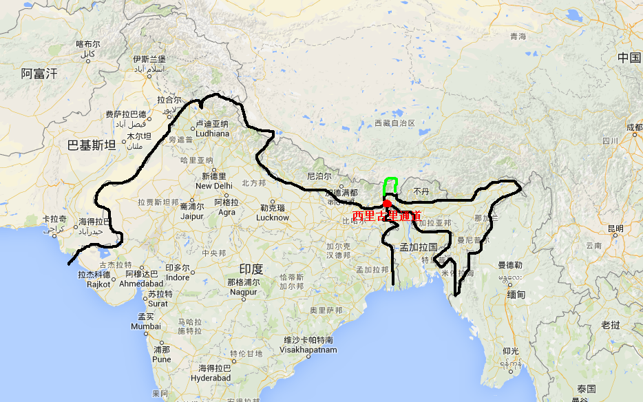
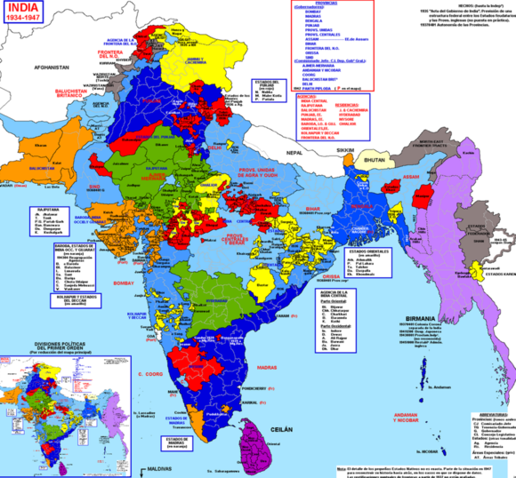

# 咖喱味的世界：南亚篇

南亚，一提起这个词可能大多数人想到应该是印度……南亚里唯一一个稍稍有一点点存在感的所谓大国，好吧……我带着一点点节操说……阿三确实是一个大国。

南亚那地方国内很多人都抱着一种非常羡慕的眼光看着南亚，原因无他……因为南亚地处于亚热带地区，全年三百六十五天无死角的无霜期。对于我们这些农耕文明的民族而言，这尼玛就是赤裸裸的勾引人犯罪。

但是很多人好像忘了一点……南亚虽说确实气候较好，没有霜期（除巴基斯坦，尼泊尔、不丹等有高海拔的地区外），但是南亚地区特别在恒河流域……下雨下的衣服都晒不干的程度。如孟加拉那些地方，刚好处于孟加拉湾旁边，阿三的著名“超级港口城市”加尔各答等地，均是全年天天下的程度。

阿三的天不是三岁的娃，说变就变，而是被打哭了的娃……一天到晚都在哭。淅淅沥沥的小雨下的哗啦啦，要不就是大雨下的哗啦啦，要不然就是印度洋的台风上岸的时候……哎哟尼玛，水气量极大的台风降雨……下的哗啦啦。反正就是往死的下。

下的阿三的裤裆里都是湿湿的……所以，阿三有个小传统就是，恒河流域的阿三和黑叔叔一样喜欢晒裤裆。而不丹等地的老百姓，因为海拔较高，藏族同胞也多……喜欢烤火……所以也比较喜欢烤裤裆。因为太湿了……

印度降雨量太大的主要原因，学过地理的同学都知道……那是因为喜马拉雅山脉挡住了来自印度洋的水气，并且高原的冷空气一旦和热带空气对冲的话，就淋三哥和三哥的小伙伴们。

但是印度的中部地区因为地理原因和气候影响，雨季和旱季分别较为明显，下雨的时候经常有水灾。不下雨的时候又干的要死。而在北部地区，也就是靠近巴基斯坦一线，气候也差不多。但在印度的北部地区，巴基斯坦的大部分地区。又是典型的大陆气候，冬天从帕米尔高原和青藏高原带来的冷空气……会经常性的冻死那些没有御寒准备的三哥们。所以很多时候电视里报道……阿三冬天被冻死了多少人，很多人都会表示……尼玛忽悠我的吧……南亚不是在热带吗？为毛会冻死人？

可事实就是这样啊.......所以，南亚并非是我们想象中的伊甸园，也并不是什么兔吧盛传的农业完美区，农业的基础条件就是气候稳定……而南亚的气候说实话，忒不稳了。

据说在三哥家里，民众最不相信的就是天气预报，因为印度的小气候太多了，天气预报根本无法准确的预测天气。以至于……个别邦甚至开会表示……干脆取消天气预报吧。为嘛？因为三哥表示……尼玛这么不靠谱的小气候，根本不好预测，弄的天气预报成了丧失媒体公信力的最大来源！！！！

好吧，依然按照浅说系列的规矩，说一下地理概念

【南亚地理概念】

南亚的地理概念依然和我们写过的中亚等地区一样，并不是以纯粹的地理概念来划分的。里面参杂了太多的地缘政治概念。但不像东北亚、中亚、东亚、中东等地区的划分。

因为南亚的主要标准就是两个标准

1：联合国标准。联合国标准是几个大流氓为阿三量身定制的一个标准，南亚包括巴基斯坦境内的印度河以东开始，到印度东北邦和缅甸分界的主要山脉，巴坎山脉止。北至喜马拉雅山脉，南至斯里兰卡。

这个南亚概念，也叫印度次大陆。是全世界所有学僧们学习地理知识的时候的必学知识……

2：印度标准（英标）。这个地理标准最早是英国人提出来的，但是后来英国人认同的是联合国标准。明显就不给英国的小儿子印度面子了……但是印度人至今死死的抓住英标南亚地理概念。

这个标准下就有点丧病了……东起缅甸，以禅邦高原为界，西抵伊朗高原下，西北处囊括阿富汗首都喀布尔。北至喜马拉雅山脉包囊帕米尔高原（葱岭），南到斯里兰卡。

这个地理概念，一直是阿三坚信的南亚……也是大印度主义的主要来源，因为曾经的英占区基本就是这样。三哥标准比较雄霸……

3：中国标准。中国标准下的南亚，仅和联合国标准多了一个西抵伊朗高原，出入并不是很大。

历史上，我们对南亚的认识是从贸易开始的。贸易的历史远远比宗教、政治更早更早，中国和印度的联络最初从贸易开始。早在吐蕃时代，吐蕃和印度的贸易就开始了，当时主要的贸易通道就是乃堆拉、樟木、达旺等贸易通道。

当年第一次去亚东县的时候，偶然的一次机会，去了乃堆拉.....后转辗到了锡金。这应该是我第一次对南亚国家的认识吧......

乃堆拉山口，海拔4730米高度。这里是中国和印度贸易的重要通道，古代贸易的时候往往是需要路过一下锡金这个国家。然后翻山过乃堆拉关口，进入中国。

茶马商帮们在下亚东古镇或直接在日喀则地区等待来自锡金、不丹、尼泊尔的商队到日喀则地区贸易。茶马的商队们把从内地带来的丝绸、瓷器等贵重物品贩卖后，空手回内地明显是不划算的。所以更愿意买一些不丹，锡金，尼泊尔带来的一些印度香料回到内地。这叫来回挣钱嘛……

古代的贸易带来的最重要影响就是不丹、锡金等国家在贸易上高度的依赖着中国。所以后来的锡金和不丹均在文化上高度、宗教等领域和中国西藏保持高度的一致。

好了，不扯远了......我们的南亚篇先从一个小故事开始吧。

中国人一直都让认为锡金是一个主权国家，至少大部分人都如此认为。而那次去锡金，办理护照的过程中，惊愕的发现，居然要去找印度使馆办理。其复杂程度就不多说了，印度一直拒绝我们去不丹、锡金等地，原因嘛大家都知道。

但是阿三的边境说实话，也就那样，以访亲为由锡金的公司担保才进了锡金。不得不说这是一个极蛋疼的事情。从中国亚东地区过去，当年还是土路，但现在已经是标准的柏油路面了，一直修到了乃堆拉山口止。

站在乃堆拉的关口上，真实的能感觉到中国和南亚的巨大经济差异。中国的公路，考虑到高寒地区的对公路的影响，铺设的方法和姿势完全不一样。

后来认识了天路公司的一个工程师后，才知道原来公路是会呼吸的。中国的公路考虑到夏冬两季的公路“呼吸”所以会先做一层由碎石子铺设而成的路，然后用压路机压紧，然后再在上面铺设水泥，等水泥凝固之后，水温层就做好了。然后最后一步是在水泥路面上铺设沥青，把硬性公路变成柔性公路。然后把路两侧的水沟和护路结构全部做好。这叫中国制造的公路……在亚东这样高寒的地方，这种公路至少不会出现冬夏两季交替出现的热胀冷缩而让公路开裂导致雪水渗进路面，让路全部开裂以至于最后变成破烂路。

但是锡金后来被阿三吞并了之后，乃堆拉对面的印度公路则是机智到……给跪的程度。印度人压路机都不上了，直接把路铺平，然后就直接特码的把沥青给倒上去了……然后用拖拉机那么大的小压路机凑合压一下……就算是柏油路面了……

我特码瞬间就被阿三的机智给打败了。

当我们在这样的公路上前进，一直前进到亚东之后，然后出了下亚东后开始进盘山公路，上乃堆拉山口。然后我们就会看纯柏油路面哟……

然后海拔剧烈上升，一路上去……然后我们就到了乃堆拉山口。

乃堆拉山口的气候简直是机智的说明了喜马拉雅山脉的牛逼性，中国境内是解放区的天……艳阳高照，各族人民齐唱巴扎黑。但是过去到锡金境……整个天空就灰暗了，狂暴的大雾+淅淅沥沥的冷雨。

但是作为一个奸商……表示看一个国家的最基本的判断就是看他们的路面，如果顺便用硬石头戳一下他们有水泥的部分，基本就可以知道他们的经济实力和水平如何。

然后我们跨越乃堆拉后……

三哥修的柏油路就是这样的……

瞬间就蛋疼了，你特码的以为这就完了？

你以为过去之后你都可以在这样的路上奔跑？你特码图样了……弱爆了……因为过去之后就可以两个弯道下去后……就是土路了！！

你绝对没有眼睛瞎，下去就是土路。因为中印关口管控的比较严，所以旅游的游客去乃堆拉的看印度那边的时候，印度为了防止丢面子……这种级别的泊油路是面子工程，做给中国境内的游客看的……

你以为毒菜国家才会搞几百公里甚至上千公里的面子工程？三哥秒秒钟教做人……皿煮国家只做三公里不到的面子工程！！！充分的说明了皿煮国家是节约钱的。

然后一路摇晃过去，空气里乃堆拉的冰川风开始变得柔和。大雾开始慢慢散开

一路的颠簸下去……到了锡金，开始认识一个南亚……

南亚篇，让我们从那个悲剧的锡金开始吧……

## 明目张胆的吞并案：锡金篇

虽说我说了不说古代史，但一个地区，一个民族，一个国家，历史的脉络本身就是他的一部分，所以我还是写一些，尽量简短，我保证！免得大家又说我老写历史贴。

锡金历史简述：

锡金的历史非常悠久，但是悠久不悠久就不说了......锡金在不丹和尼泊尔的中间，上下是中国和印度两国。而后来日喀则地区今仁布县的强钦寺，当时是后藏地区最大的宁玛派寺院之一。

当时西藏商团和锡金发生了一些矛盾后，锡金土著表示……不认账。后来锡金土人越过了乃堆拉进入亚东，后强钦寺宁玛派喇嘛带领藏人进锡金，表示……皮痒了必须聊聊。

于是在1642年蓬楚噶在宁玛派的带领下，进入锡金，推翻了勒卜察人的原始部落国家。建立起了一个由后藏宁玛派控制的一个王朝，史称：纳穆加尔王朝。蓬楚噶正式改名为：彭措南嘉措，为宁玛派法王。日后这股藏族人被称为菩提亚人。

自此，锡金成为清朝的藩属国，西藏的一部分。1788年因锡金因尼泊尔的入侵和与不丹发生了宗教冲突，锡金被攻占......法王查多南嘉措被迫逃往西藏，开始了锡金的八年抗战。之后清朝政府派兵支援锡金，将尼泊尔军队驱逐出亚东，并抢回锡金。

但好景不长，仅17年后。1805年，英国军队入侵锡金，锡金垂死挣扎无果后……最终，锡金被英国吞并。从此西藏的南部门户被开，这也是之后英军入侵西藏的主要跳板。

锡金被英国吞并后，一直都是英国东印度公司下的一个自治土邦。后二战后英国撤离印度，将锡金问题交予印度人来搞定.....锡金据理力争，认为自己并不是印度的一部分。但是英国最终依然将锡金交给了印度来解决，甘地等人认为，锡金本身就是印度的一个土邦，并且将锡金问题划入《印度政府法》中，表示锡金应该由印度来管辖统治。

锡金国王札西南嘉措（西方叫他塔希·纳姆伽尔国王）在据理力争无效后，试图求助于当时的西藏噶厦政权，但是西藏噶厦政权此时已完全被英国渗透控制。无奈的是……中国当时还在进行内战，求助于委员长貌似也不靠谱。

只能和英国人继续谈，1747年是英国离开印度的最后日子，也是印度建国的一年，最后蒙巴顿交出的方案让人极其蛋疼。让札西南嘉措考虑现实，认清楚形式，锡金问题日后再谈，但是锡金问题目前暂时将行政权和外交权交给印度来控制，《维持现状协定》被签署，之后……锡金被吞并沦为事实。

因为印度直接吞并了锡金的行政权，外交权，财政权三项大权。仅剩下国防和驻军两条即可吞并锡金……

锡金灭亡危在旦夕……最后的机会是在六十年代中印战争时期。但是锡金失去了机会，因为当时中国解放西藏不久，共产党自己都还没摸透西藏。并且当时印度甚至把手伸向了今天西藏的亚东县，要求派遣官员，索要行政权。

锡金在中印战争爆发后的五年间，不断的反抗印度……

因为英国机智的在1967年用模糊的态度承认了锡金的主权，而中国也承认了锡金的主权，当然美国立即就根据了锡金的主权问题，苏联二话不说……立即认同了锡金的主权。唯独法国人还在磨磨唧唧的……

次年甘托克爆发了大规模的抗印运动。但是……印度一不做二不休，干脆特码的派兵过去完事。但是……这件事情对南亚的影响不可谓不大。因为印度仅五年之后，就宣布了对锡金的军事管制。

虽说锡金曾经是藩属国（类似朝鲜和清朝关系），毕竟法理上不属于中国的一部分。干脆坑一把印度还是比较好的……除了法国外，四个常任理事国一起坑了印度一把。承认锡金主权......印度则干脆表示……不能忍，必须拿下锡金。

拿下锡金的最重要原因是因为……西里古里通道……印度仅二十公里的纵深，因为印巴分治后，印度东北邦的通道仅剩下二十六公里的宽度。所以只能吞并锡金增加通道宽度，防止有一天万一打仗了……中国控制了西里古里通道的话……会导致整个东北邦被割断。

但是印度吞锡金导致了……几乎所有邻国均对印度产生了严重的畏惧！特别是斯里兰卡、缅甸、尼泊尔、不丹等小国……不得不找大腿来求保护……印度的吃相实在是太难看了。

问：印度为什么要冒着巨大的风险吞并锡金？

这个问题是当初在甘托克的时候，问的一个朋友的问题。印度吞并锡金的最重要原因不仅仅是防止中国亚东境的军队封锁西里古里，最重要的原因是印度阿三当初在建国的时候颁布了一个重要的法令，叫《印度政府法》此协议其实就是个蒙巴顿当年拿来搅屎的一个方案，由甘地、尼赫鲁、真纳等人窜倒出来的一个搅屎协议。

印度当时的所有邦是根据英国殖民地特有的自治土邦的方式被英国所统治的，英国人是典型的只要利润不管人民的国家。他更愿意把实际的治权交给当地的势力，以降低殖民地的维持成本。所以比如在南非的奥兰治自由邦，德兰士瓦、祖鲁、开普敦等都是和印度一个模式，如南非德兰士瓦是由布尔人自治的一个准政府组织。但需要认同英国的保护国权利，以完成贸易权等实际的东西。

所以印度当时的情况也是一样的，整个印度被英国分成了无数个土邦。每个土邦都类似奥兰治那样的自治邦。所以当英国离开的时候，印度要统一在一起难度就比较大。唯一的办法就是利用甘地的声望号召土邦的山大王们坐在一起谈，大家谈了几个月之后，就整出了《印度政府法》这个法案的矛盾之处就在于……

以北方邦、中央邦为核心的尼赫鲁后来是不承认《印度政府法》这个法案的，在伊斯兰世界有巨大声望的真纳也不承认《印度政府法》，所以后来这个法案是被印度双雄，尼赫鲁和真纳给强推了的。

但是这法案是收拢离心主义较强的土邦的唯一约束性法案，也就是说印度如果要保证如曼尼普尔邦、恰蒂斯加尔邦、加尔克汉德邦、孟加拉邦……以及在南部地区的安德拉邦等等。情况极其复杂，原因是当年英国吞并印度的过程中，这些邦并不是莫卧尔王朝统治地区，他们都是类似于锡金这样的主权国家或类似部落联盟的一些松散初级政体。

所以阿三当年果断就玩儿了双重标准，在中央、北方、哈里亚纳等英国曾经彻底打垮了的政权地区进行政府改组，合拢为一个大邦以增加实力，就一定不能认当地土邦的权利。而在如锡金这样的地方，因为手伸不过去无法击垮当地土邦的国王、领主势力，就必须让他们认同《印度政府法案》完成印度的统一。

这是一个典型的双重标准，印度的巨头尼赫鲁、真纳等人不认的原因是他们要吞并自己强势的地区，击碎那些早就没了势力的土邦领主。而在势力范围外，则需要拉拢他们。

这是一个难题……所以干脆自己拿一个自己不认账的法案出来就是了。所以锡金就变成了典型性案例，如果锡金能脱离印度独立，那么……在东北邦的曼尼普尔，米佐拉姆邦、以及恰蒂斯加尔邦 、加尔克汉德邦、孟加拉邦等当地情况较复杂的地方，就一样可以独立。因为锡金会成其他类似锡金情况的那些邦的榜样。那就必须吞并了锡金.....使用军队进行压制，解散对方的政府，控制财政等等的方式来压下来。

所以，锡金问题....不仅仅是西里古里的问题。因为印巴分治前，锡金就已经难逃印度的魔手了。

但是锡金在印度七十年代完成吞并后，就成了国际强国敲诈印度的最佳理由的手段。如锡金现在的国王在纽约，王室成员有的在维也纳等地。因为在这些地方方便和大流氓沟通。

锡金在某种程度上成了印度的痛，是一个旧疮疤。是印度的JJ……谁都可以抓着扯两下，印度还不得不表示认真的对待对待。印度一直被俄罗斯、法国、美国、英国等国家敲诈的重要原因就是，一旦撕破脸支持锡金，如英国等具备天然历史优势的国家，就敢去支持一下曼尼普尔，干去支持一下孟加拉邦的一些土邦旧势力。

机智的三哥也有应对措施，干脆放权下去。所以印度的土邦势力在行政上的话语权是极大的，基本可以不尿中央政府的法令。这一直都是三哥心里的病。

这就是锡金被吞并的最重要两个原因....不得不说，锡金就是个悲剧啊....

图为英管期的印度版图，大家可以看一下我说的几个邦的情况……这也是现在印度主要势力分布的地区。在某种意义上说，这才是印度的行政区划图……势力太多了。

印度并没有发动如解放战争，美国南北战争一样的热战来击碎旧势力完成中央的集权控制。所以历史遗留问题非常的重。

而锡金，是南亚很多问题的案例哟……

## 印度篇

### 如何用最少的人统治最多的人？

锡金问题上，我们基本可以看出印度的国内政治脉络和印度各个土邦之间的关系。之所以先写锡金，就是为了防止大家进行硬着陆。无法理解印度的实际情况。

印度自称是一个世界，人种博物馆，并且有世界上最多的民族，也自称他们是语言的博物馆。现在全印度注册备案的语言一千六百余种，加上方言和并没有计入的语言，根据《剑桥印度近代史》的说法，语言应该在两千两百种左右。

印度真的就是一个世界，我们不能把印度当作一个国家来看。其实严格的来说，印度政府的作用真心和联合国差不多，每个土邦的自治权大到丧心病狂的狠。在印度东北部，中南部，孟加拉湾部分土邦的权利又被分层。为了便于大家理解这种模式，我用中国古代的结构来给大家描述一下吧。

在商周时期，中国是典型的封建奴隶制国家。天子分封诸侯，诸侯统治城邦，而城邦是世袭的贵族阶级，而在城邦下则是各个领主们的世界。天子的权利仅限于对分封诸侯的控制。这是英国进入印度之前莫卧尔王朝的结构。英国去了之后，印度自治后就进入了类似汉朝那样的中央集权制国家。

但是严格的来说才结构上依然没有成为现代结构国家，因为我们都知道在中国自秦汉开始至民国时期。中央的权利仅到县一级，个别地区（如西藏、内蒙）仅到地区一级。

这在中国史上叫著名的“皇权不下县，乡绅治四方”的结构。印度目前的政治结构就是这样，印度中央对各地的控制仅限于任命权到县一级，发达地区则对重要城镇有一定的影响力。所以在印度的县级以下单位，就是“地主”们的世界，他们可以践踏一切敢于挑战他们的势力。

这些“地主”同时具备立法权、执法权、行政权、财政管辖权，基本就等于是山大王一样的水平。并且印度的政治有一个极大的传统就是联姻制，当地主和地主的后代一旦联姻后，双方的利益就会高度一致化。

在东北邦和孟加拉湾沿岸地区，跨地区的大“地主”们不是一个两个，并且能形成极大的政治力量。以至于让国大党等在争取选票的时候，不得不找这些“地主”们商议关于选票事项。当然，这在印度就是公开的事情，甚至不能叫他秘密。党派为了获得地方的支持而和他们谈判，当然会维护这些“地主”们的利益。

所以，这是印度的一个基本的社会结构。印度中央→各邦议会→贵族（地主）→工商及自由农→贱民组成的一个递减式金字塔结构，越往上则人数越少，越往下则人口越多。

所以，当年的英国是如何统治印度的呢？甚至于印度无法发起有效的反殖民战争的最重要原因是什么呢？

### 低风险社会模式的核心构筑稳定统治模型

前面说，英国当年如何以仅仅九千余人的行政官员，配置69730人军事力量，就驾驭住了一个庞大的印度。如何完成这样的几乎不可能完成的任务呢？要知道当时的印度人口根据《印度近代史》的数据为三亿九千万左右的人口（估值），实际人口应该在四亿人左右。

也就是说英国仅九千人就驾驭了一个四亿的人口大国，如果不是发生在真实的历史中，我们可能会认为英国人一定都是伏地魔，不是会使用摄魂术的魔法师，如何以九千人控制四亿人？

如果这个问题我们得不到答案，那么之后说到的印度的所有事情，我们都将找不到答案。因为至少在中国模式下看印度，我们会一头雾水。

在社会学中有一个专用的名词叫“低风险社会模式”其中低风险社会模式的基本构筑的核心就是，低劳动产出、低人口流动、社会财富低增上或趋于恒定为基本基础。一个国家一旦陷入了这三个领域里，整个国家就会进入低风险社会模式中。因为一旦进入三底模式，其一一旦出现低劳动产出的时候，老百姓的本身是没有盈余的，不具备造反实力，其二一旦控制住了人口的流动，人群交流速度降低会有助于人口愚钝化，文化低增长。其三，社会财富增上速度变得极其低下或者根本不增长的时候，人对物质的欲望就会被限制到可控的范围内。

这种社会一般出现在古代的封建帝国时代或者出现在大集权的皇权时代里，社会会趋于无限稳定中，对于统治者来说，这就是几乎完美的低风险社会。

而印度在英国统治期间就完全符合以农业为基础的低风险社会。整个国家被人为的分割成了无数个土邦，每个土邦下由数个地主或数十个地主组成的基本统治结构。而真正实现对殖民地控制的就是那些地主就由刹帝利阶级和吠舍阶级组成的地主统治阶级。

所以，印度的统治并非是我们想象中的婆罗门阶级。刹帝利在莫卧尔王朝后期大多是武士出生，在印度的武士多指统治军队的长官们。所以他们拥有很强大的武力，在英国入侵后，最先遭殃的就是莫卧尔王朝的婆罗门，随后武士伴随英国人的入侵而从被统治者转化为统治者。

我举个简单的栗子来说明这个过程吧。英国人进攻王家屯村，王家屯村的王大爷以前是这个村里的地主，人家还是高贵的婆罗门。

英国人让王大爷跪下唱征服，王大爷不从……于是英国人拿出搬砖，一搬砖把王大爷给打躺。然后把搬砖交给了王大爷家的保安王大锤，许诺只要王大锤敢把王大爷的脑袋给砸碎了，那英国人就让王大锤成为新的王大爷。

王大爷已经没有抵抗的勇气和实力了，换做任何人，此时不下手更待何时？所以王大锤一搬砖打死王大爷，成为新的地主。王大锤的权利来源根基就成为英国人了，自然要听英国人的招呼。除非王大锤想当下一任王大爷，被打死在地上……

当然还有一种情况，就是王家屯的王大爷一看英国人掏出了家伙，就被吓尿了，表示臣服英国人。反正纳税的时候交给莫卧尔王朝是缴，交给英国人也是缴，反正也打不过……不如跟着英国人混算逑。

所以，英国人去了印度后并没有改变印度的社会结构。而是加深了中层对基层的控制力，比如在莫卧尔王朝的时候，民间的事务是由宗教、法律、民约三个构成，地主对贱民可以随意处罚，但是要杀死贱民还是需要上报给莫卧尔的统治者的。但是这无疑是需要很多的行政官僚的，英国人出不了这么多人，自然就干脆把执法权给了印度的地主们。

一旦地主掌握了执法权后果大家可以想象。当然英国人当初也想过推行英国的法律，但根本行不通，因为莫卧尔王朝及南部的土邦们用宗教和民约来调停纠纷，根本不吃法律那一套东西，在莫卧尔王朝时期，他们都更依赖乡约民俗。

所以英国人所幸一次干到位……根本就不管了，所以地主们在英国统治的后期，甚至可以不受宗教的约束。因为经济实力决定一切，如印度教主管宗教的婆罗门也是要吃饭的，谁手里有馒头谁就是大爷，这是低风险社会中的基本真理。所以，印度的地主们又掌握了立法权。

并且地皮大多是归他们管辖，是他们的私产。所以这些地主就天然的从上一任王大爷手里过继来了行政权。于是他们就成了无敌的统治工具，是完全听从英国人的统治工具们。并且为了保证自己的统治权，很多时候印度的地主是很愿意为英国人效劳的。

结果就形成土邦和土邦之间相互制约，王国和王国之间相互制约，地主和地主之间相互制约。但是大部分的人民……那根本就不在考虑范围之内。作为强盗头子的英国人，想的更多的还是……怎么如何恒定的把印度当成提款机，才是一个值得考虑的问题。

所以，英国人在这种结构下，统治印度长达三百年。三百余年的岁月可不是开玩笑的……一两代人就可以碾碎文化，三百年的黑暗期，基本可以把所有人反抗的一切欲望都碾碎。

那么，在印度造反有没有前途呢？至少在英国人统治时期，会不会有一点点前途？

我可以很负责的告诉你们，在任何国家造反都可能是有一定前途的。但是在印度造反基本等于死路一条.......在英国统治印度的那段岁月里。

地皮被英国人分成了无数个土邦，势力大的王国被拆成碎片分下去之后。各个土邦又形成天然的地主势力范围。

我很接地气的举个栗子；比如正在看文章的你是一个地主，而我准备造反了。这个县一共就三个地主，最大的地主是你父亲的哥哥，二号地主是你的老丈人，三号地主就是你自己。这个时候，我在你老丈人的地盘里造反了……整了几百人准备玩儿金田起义。那么你的第一反应是什么？

我想应该不是报警对吧？你第一反应一定是召集家丁们，然后火速通知你二大爷和自己汇合。然后组成一个几百人的队伍过去帮老丈人一把对吧？

因为有一个逻辑链在起作用……假设你袖手旁观的话，老丈人一旦被抢光了，这群“造反者”是不会停下脚步的，所以他们一定会来抢你二大爷。当他们抢光了你二大爷和老丈人之后，人数就肯定不是几百人那么简单了。并且，就算你很无敌……手下有上将“鱼竿大将”能一个打一百个，那又如何？就算你打赢了，你老丈人拖家带口来避难……无疑是会增加你的开支负担的，并且你二大爷万一也找你来避难……你总不能把人撵走对吧？撵走血亲在任何社会里都有道德压力的。

所以，答案很明显……你会第一时间去 参与救助行动。所以，所谓的“起义”估计就刚刚燃起来一个苗头就被灭了。

当然在印度的实际情况根本不可能发展到几百人之多，因为地主拥有执法权的情况下，一旦有人想搞东搞西，估计三五几个人还在家里商议如何干掉你的时候，你就早得到风声去灭了他全家了。然后弄死挂在村口上，杀鸡给猴看。当然了，顺便奖励个百十斤米，一只鸡给告密的贱民也是应该的。

所以，底层会无限度的趋于稳定。并且在某种意义上，你的辖区内的人就是你的资产。因为老百姓被你剥削光了之后，他们根本没盘缠去外地，一直被你压榨着。当然更大的原因，可能是怕你这个剥削者手里的大棒子吧。

所以，地盘，人口一旦被拆碎瓜分之后。那么真正要造反的人，根本就不可能有募兵的机会。

那么有人可能会问……那地主造反怎么办呢？现实中，那些如国王一般日子的地主们，可能会冒着杀脑袋的风险去造反？就如同开着直升机，玩儿着法拉利的土豪们，会去杀人吗？越有钱有势的人就越没造反的动力，这是必然的哟。

当然，就算他们造反……其他地主们可不一定会答应，因为地主里也有你手下那种扮演告密角色的贱民。所以一旦英国人得知你要造反，那就等于你公开了你准备踹飞所有人饭碗的行为。必定会被周围的地主给联合歼灭，因为跟着你混可能有更多的土地，更多的权利，但是和失败的风险比是起码五五开对吧。

但是跟着英国人混，那就可以代办大不列颠，英国女王的名义合理合法的分掉你的土地。咱摸着良心说……其他地主怕是会选择风险性更低的吧？所以，印度历史上发生过的那么两次大起义都迅速被压灭。不是没原因的……英国的大拳头+无数地主的支持。根本就干不过了。

印度不是中国.....因为如同时期的清朝，地主是没有募兵权的，也没有执法权的，更没有立法权，也就别谈行政权了。但是印度的地主有私兵，有执法权，有立法权，也有行政权。所以在那帮地主手下造反……基本等于找死。

### 造反是一门学问

前面说到了低风险性社会造成的对底层民众的制约，那么有心的读者一定会问一个比较尖锐的问题，如此高压力的社会下，那么总有人混不下去去当土匪对吧？既然地主们要的是跟着大旗帜走，那么总有落魄的贵族、统治者来造反对吧？

那印度到底是如何在这种高压下稳定的？

印度的国土面积大致在298万平方公里，取其整数三百万。大致为中国的三分之一，印度的主要人口都集中在北部地区。主要是在印度河流域和恒河流域里，都是大平原地区。而中部是高原（海拔较低）但是山地依然比较少，南部地区的山与其说是山，还不如说是丘陵。

整个印度就是这样的，所以在印度当土匪的话……难度也比较大，因为当土匪有一个逻辑就是……打一枪换一地。抢了就躲山里去，或者躲小岛上去。

如同中国著名土匪组织宋江团伙，不也是在水泊梁山上安家吗？周围是水泊，然后找一座山上去，方便跑路的同时，也能利用地理优势进行防守反击。当然还有比如造反的土匪瓦岗寨，造反的土匪方腊。大部分的土匪或者造反的人都必须有一个“军事基地”存在，不然一旦被围剿的时候，那就是真的要悲剧的。

而印度的地形决定了……土匪们在人口密集区几乎没有任何前途，因为都是平原和丘陵。在平原上造反的话，地主们是可以直接把丫的给围剿了的。印度土匪唯一的办法就是顺着路跑，刚刚要跑过界……另一个县的地主就拦截了，所以前途很悲惨。

那你也许会机智的说，北方不是有喜马拉雅山脉吗？世界第一山脉难道不够用？哎，你还真别说……真的没用的。

因为喜马拉雅山下有亚洲地区最著名的土匪……尼泊尔人。那才是真正的山大王好吧。如果土匪在印度抢劫，然后进尼泊尔去躲的话……那几乎等同于关公面前耍大刀，尼泊尔人抽出弯刀撵你丫三百条街不歇气信不？并且在锡金、不丹这两个地区，那也是不好惹的。虽说这两个没尼泊尔人那么凶残，但是……那也是业余和非业余之间的区别。

所以，在印度造反的土匪，唯一的可能性就是……去东北邦那边玩儿，打了之后就躲藏南山区，要不就躲缅甸山区去。

所以……自古以来，在印度当土匪基本就是，刚刚有几十个小兄弟准备打打游击战，吃着火锅儿唱着歌，走着走着突然特码就冲突来一大堆阿三，把几十个兄弟拖到路边给强暴了，奸完之后直接给挂在树上……暴尸三个月，以正视听。

所以，在印度从小组织干起的话……基本是没前途的，毫无前途可言。大平原上被人追的后果……懂的都懂，不懂的都是装不懂的。

### 如何有B格的在印度造反，是一门艺术

如在1853年时，欧洲爆发了著名的”克里米亚战争“英国也屁颠屁颠的跑去和俄国人掐架，调集了25万兵力和俄国毛子PK。

印度的王公们看英国人调集了那么多军队出去，尼玛……从1853年是这个表情画外音（英国女王板载，干死俄国毛子）1854年（女王好像没开挂？）1855年（毛子板载）1866年（你懂的）

然后印度的王公贵族们，决定乘英国虚要英国人的狗命。拉克希米.巴依，章西王国的女王，今天印度中部的一小国，率先干英国。当然爆发的理由很奇葩，说的是英国人让印度军团的士兵使用牛油润滑的子弹，得罪了印度教徒，换猪油润滑的又得罪了穆斯林的士兵。英国人一怒之下，全部抓去捡肥皂，引起印度士兵不满，造反了。但是，这场战争很快就被扩大，拉克希米·巴依，号章西女王！站在山头上讲到：“莫道石人一只眼，挑动黄河天下反”后又有人称，晚上有狐狸说人话，说：“天灭英，章西王”后大山崩裂，上书：

然后爆发了著名的印度大起义，在二十多岁的章西女王拉克希米 巴依的带领下，起义军一度拿下了印度当时的首都德里（旧德里哈），并且高姿态的攻入了英国总督府。德里总督府居然……打不下来，英国人居然在那破楼里坚持了几个月，起义军都打不下去。

当然这是后话，那么其他地主在干嘛呢？都是一种默许状态，允许起义军过境，反正就是不参加，但是也不反对的姿态。坐等他们掐架的结果，如果起义军打赢了英国人，那就乘着这个机会扩大一下势力。如果起义军打败了，就乘着”追击“造反者，顺便兼并一下自耕农和小地主的土地。

反正横竖都是赚，无所谓的。

英国人看事态不对，把兵力带回印度之后……大家都懂的，一瞬就打趴了起义军。地主们一拥而上，自耕农们支持造反，诛之，顺手拿了他的地。小地主据说支持了起义军，杀其全家，土地也顺便是他的了。

而英军到了之后，几招打趴起义军，地主们看姿势有点吓人，开始帮助英国人围堵起义军。大平原啊……尼玛到处都在堵，往天上跑

起义军领袖之一的拉克希米 巴依，号章西女王……被打死，信徒们去救女王陛下的时候，发现女王陛下已经被打死了……

所以，在印度起义的话……规规矩矩的起义，比如一路打过去，会遭到地主势力的疯狂反扑而失败，再说了也打不过地主家的私兵。那退求其次，和地主和谈，分赃……直接打英国人……英国人打不过的话，补刀的就是地主们。

所以，如何起义？起义就是个死……

因为历史已经证明了，那玩意儿真的会扑街……

### 时代的变革

印度的圣雄甘地曾经号召全国人民抵制欧洲的工业品，鼓励大家用印度本土的手工纺纱，大家应该对圣雄甘地用纺纱车还有印象吧。甘地活着的时候，一直都在印度这片黑暗的土地上吼叫，不要工业化。

甘地算是全球第一个提出“去工业化”概念的人，比起美国人，那不知道牛了多少倍，人家二战结束就开始干这事儿了。

很多时候吧友们都是资深的工业党人士，当然包括我本人也是坚定的工业党之一。因为我们的认知里，财富的基本元素就是商品啊，商品需要更强大的生产能力来带更多的物质财富，人民才能过上美好的生活嘛。

那么，印度的圣雄甘地为什么要抵制工业化呢？

甘地当初拉拢全国的土邦的时候，是维持一个印度，承诺给予大家高度自治为条件维持了印度不分裂的。也就是说甘地的政治力量是来源于维持大地主阶级利益为核心得到的全印度土邦的支持。

那么，对于土邦的地主们来说，工业化带来的后果就是——人口流动性增加。因为工业的本身会带来商品经济的高度繁荣而将人从土地上解放出来，参与更高效率的生产。

于是，工业发展的本身就给了无数印度人另一个选择——若是农村活不下去，去城里的工厂当苦工，也是一种选择。

我们首先要明白一点就是，权利的来源是来自驾驭人群，而非你获得了多少土地。土地的本身是用来制约人群的，我想这个简单的道理大家都明白。一旦失去人口，或不能控制人口后……那么对于地主来说，就有点蛋疼了，因为控制人口的成本会上升。

我们做一个场景，我相信大家应该明白为什么控制成本会上升了。

场景：

印度有一个土邦的地主叫大漠，他的控制土地十万亩地，控制人口两万人。那么日子一定是，贱民们为了生活就必须租大漠的土地，大漠想收多少收多少。因为租让权归属大漠所有，民众要获得承租权就需要让渡一定的公权力给大漠这个地主。

于是大漠就有了杀害贱民的权利，有执法权在手。执法权不仅仅是自上而下的授权，还有一个重要的授权渠道就是自下而上的授权。大家遇到点事情了，什么老婆偷人了，张二狗家的旺财咬死了李四家的小犊子一类的事情，大家都会找大漠来进行决断。

因为大漠手里有公权力，甚至掌握审判权，那么大漠就可以用公权力对所有人进行无节操的欺压，而普通印度阿三根本没任何能力对抗大漠。

原因不仅仅是大漠代表的是一个阶级而不是一个具体的人，而是大漠这个地主控制了人群的食物来源——土地。为了肚子，印度阿三不得不向大漠低头。

但是随着工业化时代的来临，贱民可以进入城市里，去资本家手里当一个黑工，一个月咋滴也能给个几十百把块，说不准资本家还能管一顿饭。

那日子不比在大漠手里当一个租地的农民强多了吗？至少，给大漠家当牲口不是唯一的选择了， 因为贱民还有另一个选择，去给资本家当牲口！

读文的你也许会吐槽了，你说个篮子啊……特码在地主家是牲口，进城了还是牲口，有毛区别？

哎，您还别说，真有区别的。因为地主和地主一般不会有竞争关系，但是资本家和地主是一定会存在竞争关系的。

因为在农业国家，几千年的时间里本身就形成了一个土地和人人口平衡的低风险社会。但是在这个社会里突然加上了另一个重要的吸收人口的组织——工厂。那么工厂和地主之间就会抢夺劳动力，一旦抢夺劳动力。那么赢家一定是先进代表者，工厂....

所以当第一个贱民离开大漠的时候，就会引发更多的人离开大漠。于是平衡就被打破了，土地曾经作为稀缺资源无数人排队租地，甚至当为了一口饭而当家奴，但是平衡破坏之后，土地增多而人口减少。土地就并不是稀缺资源了。大漠为了把地租出去，就不得不……选择降价租赁，甚至让自己的家奴们，农奴们给予他们自由，去当一个自耕农。所以，土地的总收益就会下降。

所以，甘地作为土邦地主推举出的领袖，就一定要给自己的授权来源说话——不能进行工业化。他就一定会用强大的人格感召力，号召印度人民抵制工业。

但是……问题来了啊，那么支持工业化的是哪些呢？

支持工业化的就是圣雄甘地的好战友——尼赫鲁为代表的资本阶级力量。

资本力量介入后，印度就会迎来变革。当然，我们的前提是一个正常国家的进程，一定是散乱资本走向有序化资本。如美国，德国，法国……全都是这样。

但是，印度人真的能解放吗？明显不能，因为印度从一开始就开了挂，他们是有序资本，是大资本竞争力出现了。

代表者就是以尼赫鲁家族为核心，围绕在尼赫鲁家族周围的四大家族，分别是阿班尼家族、米塔尔家族、博拉家族、塔塔家族为代表的四大家族。加上尼赫鲁家族就是五大家族。五大家族旗下队友十余个土邦家族。于是就形成了一个极其庞大的资本垄断集团。成为了一个可以和旧势力对抗的一个超级资本集团。

那么作为资本者，他们更希望的是工业化、城市化、人口高流动性。这样才符合资本家的利益，因为工业化、城市化这一切都是为资本运作周期服务，国家效率越高则资本的运转周期就越短，运转周期越短则获利越多。这是一个基本的逻辑。

所以，圣雄甘地的处境就比较艰难了。因为一方面是他的权利来源，印度的土邦地主们的利益他必须维持，一方面必须团结以尼赫鲁为核心的资本阶级力量。另一方面，必须说服真纳为首中间派。

有句话说……老大和老二竞争，老三没了……

印度同样发生这样的事情，甘地和尼赫鲁背后的力量竞争，结果真纳给整没了。当老三很悲催啊……比如世界第三越南（笑）

我们还是接着说造反.......后面详细说印度分裂时期的事情。

历史告诉我们，尼赫鲁那奸诈的家伙，成功歼灭了北方邦地主，歼灭了如今中央邦的地主，形成了以北方邦和中央邦为核心的印度。并且试图吞并旁遮普导致真纳反水，也就导致了印巴分治。

但是嘛，虽说印度因为甘地的原因，工业化进程非常缓慢，但是事实是尼赫鲁为核心的资本家们获得了胜利。在后来的日子里，土邦和资本集团的对抗，一直都在上演着。

但是我们回到正题，那么印度人可否从尼赫鲁改革中获得解放呢？

明显想多了……北方邦和中央邦形成了新的大城市，如新德里为例。并且在西海岸部分划了一块中央管辖邦（类似直辖市）的孟买地区。于是城市化多少还是抬头了。

无数的贱民们涌入城市，试图找点工作，再也不用被大漠那狗杂碎一般的地主给欺负了。至少他们还有一个印度梦嘛，印度鼓吹的是只要努力，皿煮的印度就给所有人平等的机会。

但是在大资本力量面前……所有机会都是鬼扯的。那么，印度如果走城市革命路线能否成功呢？学学列宁他们对吧

很明显，不可能……因为贱民们要求的真的太过于简单，城市管理难度骤降啊。沙俄时代的农奴虽然很低贱，一天也要吃两顿饭的。可印度的贱民成本低一倍……他们一天只吃一顿饭。生活要求的并不多，革命对于印度来说，最大的阻力并不是以资本为核心的印度政府。而是……贱民。

对，你没有看错，印度革命最大的阻力就是贱民。因为贱民为了一口饭，可以以极低廉的工资去充当资本集团的狗腿子，比如当保安，当警察，总之……价格很便宜。至少印度贱民穿上了保安制服，警察制服后，他们就扮演了高于一般贱民的角色。所以城市稳定性是来源于贱民制约了贱民……

资本家们也许并不会往死的毒打贱民，但是见面毒打贱民……那是真的往死的打。印度城市里获得了一点点权利的贱民们碰到老板，长官的时候各种孝顺，但是他们欺负贱民的时候，可是往死了的欺负。

举个栗子吧……日本占领了朝鲜半岛，于是征兆亡国徒棒子来当皇协军。那些棒子当了皇军之后……可比真皇军心更黑啊，欺负人比日本人更凶。比如日本人占领了印度尼西亚后，印尼的皇协军可比日本人更能欺负人啊。

所以……印度的获得执法权的贱民，往往比真正的统治阶级心更加歹毒。如果列宁生在印度……可能起事的第一天，就会被贱民们给打死！

## 等待更新
