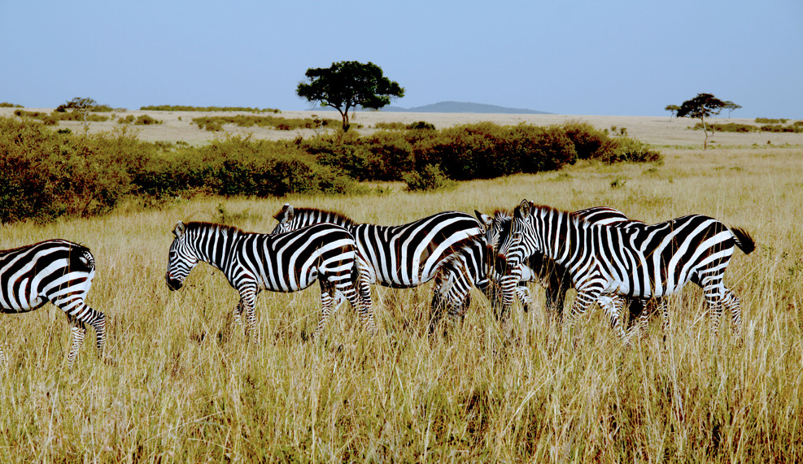
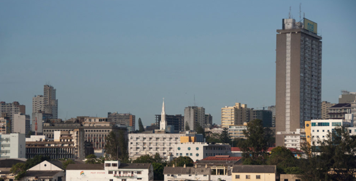

# 非洲篇——非洲人到底如何存活下来的

我们大多数人对非洲都存在很多的认识错误，因为我们的国家几乎对非洲是处于不介绍的状态。所以大多数的同胞对非洲的认识，主要是来源于英国BBC电视台制作的各类非洲纪录片。而我不得不说的是，这一类的节目几乎都在介绍非洲的动物，要不就是那些非洲土地上的“非主流”民族们。

因为一家电视台的节目，要获得收视率，订阅就必须给他们的国民展现出一个全新的视角。新鲜感是非常重要的，美国人和英国人为主的西方世界，更希望看到一份稀奇的新鲜感。

所以大多数人对非洲的印象应该是这样的

又或者是这样的非洲

当然，我们吧友们或者是其他论坛对新闻有兴趣的，或者是对非洲社会结构、文化、政治有兴趣的朋友们，对非洲的印象应该是这样的

又或者脑补出一幅“黑叔叔”拿着AK，56一类的廉价红色武器，满世界乱开枪的世界。大多数人对非洲的印象，如前面所说，一个是取决于纪录片，一个则就是来源于各类新闻。

要知道这个世界，你不搞出点奇葩的新闻或者血腥的战争，五大流氓的世界里……第三世界国家的人除非是拿着武器对打了，要不就是饿死一大片人了，不然是不会有任何兴趣的。所以我们队非洲的认识就会出现偏差。

## 吃饭是个重要事

那么有吧友要问了，你BB了那么多，你特码倒是说说什么是非洲呢？

这个问题不是很好回答，我只能从每一个角度来给大家说明什么是非洲，或者尝试从每一个具体的问题上去分析。

我就大多数人对非洲的印象开始说起吧。

1：非洲地处非常干旱，所以农业不发达，导致非洲经常出现饥荒

有这个概念的吧友应该是绝大多数人，首先非洲除了北方相当于一个中国面积的撒哈拉大沙漠外，撒哈拉以南的世界可不是什么绝对干旱的地方。

撒哈拉以南从西部国家塞拉内尔到东海岸的厄立特里亚（电影大独裁者的原型国）划出一条直线，以南地区地处于热带。一直往南，大家点开地图到安哥拉至莫桑比克一线，这里是非洲的精华区域，非洲大多数人口也集中在这些地区。

这里分雨季和旱季，因为是热带所以没什么很分明的四季。对于当地的非洲人来说，比如人口最多的尼日利亚大多数人，一年这个单位可不是365天，而是一个雨季为一年，一个旱季为一年。也就是说，人家一年是分成两年过的。

这部分的非洲，也是最容易闹饥荒的地方。也是最容易出现战争的地方，当然也是非洲迈入现代化中最重要的力量。

非洲只要气候是稳定的情况下，几乎是不可能出现任何形式的饥荒。

我给大家举个例子吧~比如非洲西海岸，也就是著名的象牙海岸一线有个小国，叫喀麦隆（如果是球迷可能更熟悉，因为这个国家足球很强大），他们的环境好到什么程度呢？大部分的农作物都可以一次种植，终生受益。

比如很多灌木类的植物或者我们认知中的一年生农作物，在非洲的大地上都会变成多年生植物。因为一年四季的气温都很不错，并且在喀麦隆这一线雨水也比较充沛，所以植物会无休止的生长。

中建公司去那边开展工作，带了些黄瓜过去……种在基地的周围，院子里。黄瓜长的跟冬瓜一样，种下去特码的收获几年，完全就是一直在出产食物的节奏。

并且非洲的土壤，除了靠近撒哈拉和南非一线的土地，土壤都不错。是标准的沃土~虽说没有世界三大黑土地那么厚的肥沃土地，但是非洲的土壤绝对优于我们的华北平原和四川盆地，以及印度平原的土壤。

原因就是，人家的气候好啊。一年从头至尾都可以种植的。非洲的旱季不是BBC纪录片里那种把土地都晒裂的旱季，他们的旱季类似于我们的秋天，少雨气候温和，雨季就类似于扬州梅雨，天天下了一两次雨。

所以，这里的土地很容易收获粮食和庄稼。非洲当地人种植土地……一般是由妇女种植，比如喀麦隆的妇女，睡到自然醒之后，带上种子……然后拿一个尖嘴锄，挖个坑丢种子下去就可以了。

什么？你说翻地？对不起，非洲的土地不需要翻耕，土壤不翻耕都很松软。然后她们可以在一周内把种子丢在地里，然后就天天晒太阳，男就天天晒屌玩儿。然后周围的树林里，路边到处都是食物，各类的浆果，果实~

食物非常的充沛，也就导致了非洲人没有忧患意识。

比如中国人最纳闷的一点（当然也是欧洲人也非常纳闷的一点）为什么非洲黑人根本不大规模的储藏食物？

非洲黑人也非常的纳闷这一点，为什么黄猴子和白皮猪老喜欢堆积食物？树林子里不是到处都是吃的吗？为什么要吃不新鲜的东西？

所以，我们和他们的世界是不在一个平行世界的。因为我们有冬天，所以需要准备至少五个月的粮食（冬天三个月和入春两个月没食物），所以我们的祖先永远都在为如何囤积食物而做斗争。

但是非洲人根本不需要，因为他们旱季有各类成熟的坚果吃，雨季食物多的丧心病狂。比如有在尼日利亚，食物多到仅靠植物果实就可以吃的膘肥体壮，当地黑人甚至没欲望去追一头野兽哪来烧烤。

所以，就是因为这种大自然造成的差异。到了近代后，非洲就开始悲剧了

悲剧的源泉是人口的大爆炸，非洲迎来了人口大爆炸时期后问题就比较尖锐了。因为人口少的时候，就算有时候雨季迟到了，人口少还可以游荡游荡，去其他地盘找吃的。人口一旦多了，地皮就被分了……于是一旦雨季推迟，旱季延长。那就可能会出现饥荒

非洲的农作物收益非常好，但是非洲人是没有储存食物的习惯的……所以饥荒一旦到来，就会饿死人。

我记得有个关于非洲的人类社会学文章中提到；哈撒拉以南的非洲，雨季推迟一个月，非洲就会开始出现饥荒，推迟一个半月每多一天就会多饿死十万人。

## 非洲经济落后，非洲民不聊生？

恩，就这个问题好像大多数的网友都是这个认知。总的来说是比较靠谱的，但是民不聊生是谈不上的。

非洲的一产（特指农业等产业）非常畸形，原因前面说过，非洲人没有种植欲望，所以无法完全的进入农业文明。而非洲进入了农业文明的国家，在非洲都是一小霸王，杰出代表就是比如坦桑尼亚等国家，他们都是已经进入了农业文明的国家。

但是，悲剧的是如同刚果这些自然资源，气候都得天独厚的地方，真的是个悲剧，至今都处于半农耕状态或者是一种说不清楚是什么情况的状态。

大多数人，会种一小块地，是非常狂野的非洲式种植（前面说过，就是随便乱丢种子，个别懒汉甚至连坑都懒得刨了，直接扔野地里完事儿），然后在树林里，乡间搜集各类可以吃的东西为主。并且因为现在全球文明一体化，全世界有的物产非洲几乎都有了，所以比如木薯一类的高产作物，比如马铃薯一类的……他们是非常喜欢种植的，因为……几年前种植几颗，几年后就是一大片木薯和土豆……都特码不用你去移栽什么的。

所以，在刚果这些地方，路边的某个你认为的“野地”可能是当地人的农田，你以为是某片杂草丛生，野鸡乱跑的荒山，可能是人家赖以生存的粮食地。

粗野式的种植，非常的悲剧，但就是这种方式的种植。凭借非洲得天独厚的自然环境和老天赋予的气候，人家居然有不错的收获。

所以，当地人给世界展示的姿势就是……没事儿晒屌玩儿，有事翻屌玩儿。总之在非洲大陆，那些所谓的强国中，一旦你接触到最底层，仿佛感觉他们都没事情做一样。

因为他们完全木有危机感。

这也就导致了另一个问题，没有危机感所以他们没有储蓄的习惯，因为千百年都是晒屌玩儿，所以他们公认的劳模，在黄白种人看来，简直是特码的懒汉，活着都浪费空气的那种懒汉。

比如做工，非洲人一般要求当日结算工资。做一天耍一天算勤快，做一天耍三天属于正常，做一天耍未知天数那才是懒惰。

你敢让他们一周工作六天，那就是要了亲命~你敢一个月结算一次工资，那简直就是……神迹一般的存在。

不是他们懒惰，而是他们真的没危机感啊。火烧到眉毛了都不会着急的……就是非洲人

并且因为他们的工业水平较低，因为各种原因缺乏壮劳动力去地里干活。所以土地板化较为严重，所以非洲人会丢弃大片大片的土地。

并且非常热衷于砍伐森林，因为森林被砍伐之后可以露出非常好的腐殖质用于播种。并且土地是非常松软的（适合用棍子戳）但是因为他们缺乏工业导致农业发展简直就是丧心病狂的浪费土地

因为没有水利灌溉系统，加上到了雨季降雨量巨大（刚果，尼日利亚一线平均降雨量大致在一千六上下，和泰国相当），于是土地内涝的情况非常严重，并且雨水太多没有排水系统所以水土流失也很严重。

他们刚弄出来的好土地，最多撑两个雨季就报废，因为所有的腐殖质都被冲走了！但是就这样，他们的土地依然比我们的要好得多。但非洲的叔叔们因为没有化肥，并且不会育肥，

但是这一切是难不倒非洲黑叔叔的，撂下不种不就完美解决了？

你有没有被非洲黑叔叔的聪明才智所折服呢？

当然也有勤奋一些的黑叔叔，他们在那些流失严重的地方，种木瓜一类的经济作物。或者种植一些乔木类的作物。

但非洲是一个生物天堂，植物病虫害也多的丧心病狂，比如非洲有一种我叫不出来名字的大天牛，有半个手掌大，黑乎乎的。他的幼虫会吃木瓜这些经济作物的树干。

他们又缺乏化工业，农药进口报批太过丧心病狂，加上关税和商人的利润……于是大多数黑叔叔是不用农药的（纯天然哟）于是……种树对于非洲黑叔叔来说就是赌运气

有时候大片的橡胶树，可可，木瓜一类的各种树木……几个月就死光。但是黑叔叔们不悲伤的，他们会认为土地被诅咒了……所以换一个地方继续搞即可！

有没有被他们的机智所折服呢？

说到了这里，各位吧友可能眉头都紧锁了起来。

你说了这么多，好像也没改变我们的认识啊……非洲还真是操蛋的地方，非洲人真特码的扯淡。

其实我本着良心说一句，什么样的地方养育什么样子的人……中国人去了非洲，也会慢慢的懒惰下来。因为物产太过于丰富了，而且因为二三产不发达，所以……也没啥追求。

比如某杰出农民企业家，在坦桑尼亚准备发展一把。结果爱上了坦桑尼亚，十年后……他变成了坦桑尼亚黑人一样的货。

地嘛……一年种一季就是了，反正收成很好。储存个鸡毛……有几百斤粮食堆着，有万把块傍身就够了。天天没事儿就是……看电视的节奏，和一群黑叔叔坐在他家里，傻逼一样的看电视剧，电影，收看各类节目……要不就是和黑叔叔一起在大树下面晒屌玩儿。

老婆们都吹牛打屁，男人晒屌讨论女人，小娃满世界乱跑。

不是人改变了自然，而是自然在改变人啊。

各位试想，如果你衣食无忧，几乎什么都有了~要啥有啥了，你还会那么勤劳？如果你在非洲，可能你和他们也是一样一样的。

但是，我们不由得会说一句……这样的社会是很脆弱的，因为毫无抵抗风险的能力。但这样的社会也是富裕而快乐的社会，因为没有危机感，大多数时候都是嗨皮的日子。

也许就应了中国那句古话，有所得必定有所失

## 为什么非洲会性病流行？

这个问题，您总结了前面的非洲实际情况，您自然会得出答案的。

中国有句老话“饱暖思淫欲”

吃不饱穿不暖，是没有动力去到处瞎搞的。而非洲的自然资源非常的丰富，在没有气候大变化的时候，非洲人一个个都是吃的膘肥体壮的形态。

整天没事儿干，晒屌的时候男人们讨论的话题其实全球都一样，某村的某女如何风骚啊，某街的某店员好看啊。反正都是这些奇葩话题。

所以黑人男性是非常的好色的，好色冠军强国，尼日利亚，肯尼亚两国，简直就是钻到生殖器里的级别，然后就是象牙海岸的一票小国。比如喀麦隆，他们的生活就是……吃饭、睡觉、晒屌、搞女人/男人。比如科特迪瓦，那就是一个字……搞！

他们喜欢喝当地的一种果酒，紫色的，有淡淡的酒味。也喝浓度高的酒类。酒吧里那就是……哎哟我去的节奏，黑妹子们没节操，全世界男人好像有节操的几乎不存在（除了高寒带的男人，比如爱斯基摩人，掏JJ都要冻断的日子，好像对性的追求确实没那么强烈）。

所以，他们拿到工钱后，第一件事情就是……穿上干净的衬衣，T恤~把自己心爱的中国产拖鞋穿着，穿一条漂亮的牛仔裤，头发用剪刀修建好（大部分黑人都是小卷发，所以要修建）。然后英俊潇洒的出去搞去了……

就是因为这样的生活基本状态，导致了非洲的性病泛滥到连黑叔叔家的山羊都可能有艾滋（玩笑哈）

因为他们连农业文明都有点无法迈入，所以文化普遍性的低，他们无法认识到什么是疾病。所以……你根本没法给他们科普，干快乐的事情是会送命的。你也无法解释

和他们解释的难度不亚于……你和一个小学生去解释高等数学，如同你无法和一个中二少年阐述马列思想一个道理。

所以，非洲各国只能傻兮兮的看着，几乎没有任何方法阻止国民瞎JB乱搞

## 为何大殖民时代欧洲人不大规模移民非洲？

当年法兰西人、葡萄牙人、英格兰人……以及一大票欧洲人可都是瞄准了非洲的啊。非洲这么得天独厚的自然条件，为何欧洲人不大规模移民呢？

为什么他们选择了北美和南美，而不是非洲呢？

原因嘛……很简单，疾病流行！

非洲的自然条件养育的不仅仅是动植物，还有茫茫多的病毒，病菌们也在非洲大地上快乐的繁衍着。可以说黑叔叔们都已经基本上百毒不侵的水平

但是……白皮猪们一到了非洲，一个蚊子就能叮死一个英国人，很有可能一只嗡嗡就能消灭掉一个葡萄牙人，当然一条蚂蝗有可能就杀死了一个法国人。

所以，当年的医疗技术太过于落后，西方世界几乎是无法抵御非洲那些奇葩的病。所以……无奈啊，看着茫茫多的良田，就如同狮子抓住了一只迷路中的小刺猬，捉急……但是没法下口

所以，非洲到了近代，欧洲人都无法真正的殖民非洲的土地，有的只是名义上的殖民而已。英国人和法国人干脆另辟蹊径，我不能呆在非洲还不能把黑人带到我能呆着的地方？于是大规模的黑奴贸易开始了，给整到温带去……地方嘛就是北温带的美利坚和南温带的巴西这些地方。要不就是地中海气候的地方去

白皮们当医学进化到可以基本抵御非洲流行病的时候……历史已经到了二十世纪中叶，此时再搞大殖民时代那一套已经行不通了。

所以，法兰西们，各种牙们只能是拍断大腿叹息了。

而二十一世纪，医疗更加发达了……可白人在“现代殖民战争”中，又需要面对一产、二产科技树开挂的中国人。所以，非洲注定和白皮无缘

所以非洲法国人有一句坊间流行语：“我们开拓非洲，引领了时代，确为中国佬做了嫁衣”，恩，大致就是这么个意思

（PS：我想还是不改我的口头语了，比如“黄猴子”白皮猪“”黑叔叔“一类的词，都有贬义也就不存在歧视了谁谁谁，我相信也不会得罪人的）

## 非洲人生存技巧之——打仗

非洲人打仗的传统可是历史悠久的，但是嘛……战争水平就是搞笑的，这个吧友都是知道的。

但是，非洲人的战争是一个和亚洲世界以及欧洲世界完全无法理解的一种模式。主要的诱因前面说过，当然他们也进行别的战争。

这个是比较奇葩的。比如科特迪瓦到马里一线曾经还是比较牛逼的，他们有一个古老的帝国叫桑海帝国。进行牛逼哄哄的商业贸易，让埃及人都眼红的黄金拿着，买一根油条就用一个金砖砸死你的节奏。他们能那么雄霸，是因为曾经他们都比较好斗。

后来殖民者来了之后，总督大人决定好好发展一下这里的香料贸易什么的，还有贵金属等。那时代的白皮是没节操的，但是迫于当地人好斗，所以还是不愿意和大部落发生冲突的。

但是……殖民者不能理解的是，那群土著会莫名其妙的打起来，双方动辄几千号人拿着弓箭对射，射个两天，然后回家。

这特码的是怎么回事？

很简单，因为物产比较丰富，大型部落除了疾病外几乎没有生存压力了，又特码的没文化，都是文盲，根本读不懂《潘金莲大战孙悟空》《奥特玛嫖莎士比亚》这一类的世界名著陶冶情操，所以用水浒里的话说就是……这日子都特码淡出鸟味了，必须下山痛快痛快。

而且因为没有奥运会一类的运动，所以……大型部落之间，每一年双方都会固定上演战争，古时候是用弓箭，梭镖，长矛对打。

但那不是真打，就是闲的扯淡找点事情做，所以……打一天也死不了几个人，完全是在做游戏的节奏。这种传统一直保持了几千年，闲的没事就干来玩儿一下~

但是到了近代，假戏真做了的节奏。

大部落之间对抗，但是有新武器了，用步枪打……哎哟尼玛，不知道哪个不长眼的孙子干死了张三家的大侄儿，哎哟我曹，对面一梭子打死了二狗子家的崽子。于是双方就变成了假戏真做，但是战争的本质没有发生根本性的改变。

所以经常是双方拿着各类武器对打，打尼玛的几十万发子弹，死尼玛的几个人，甚至一个人不死……打完收工，老大谈判，把酒言欢，明年接着打。

这种牛逼的传统，比如南非的国中国莱索托，比如纳米比亚，比如大刚果歼星帝国，等很多国家的部落都保持这种奇怪的所谓传统……

所以，非洲人对战争的认识我们无法理解的，因为我们见过几个月前双方剑张弩拔要灭对方全家的两个村子对持，几个月后两个村子又在一起晒屌……反正我们不懂。

普通人的这种战争认识程度导致了军队根本没办法进行死磕战争，弄的军阀和帝国统治者们很蛋疼。经常出现什么法国基佬七八个人对战黑叔叔数千军队的情况……什么英国佬两个班组就打垮对方几千人的情况。

所以大部分非洲外的世界报道非洲的军事行动……都是刚报到就没下文，因为我们不懂这群逗货的世界。

他们的战争，只有一种战争是认真的……人口膨胀到本地真的无法活命了，需要扩张的时候……于是会进行灭族战争！

比如……杰出的胡图人和图西人进行的灭族战争，制造了现代社会中惨剧一般的大屠杀~

所以就有了这样的对话

    某中国商贩：“听说最近大黑皮和小黑皮两个村子打起来了，尼玛好吓人”
    黑大妈：“没事儿，过几天就好了”
    中国商贩问一边叉开裤裆晒屌的条子：“你们当警察的也不管管？”
    警察：“没事儿，过几天就好了”
    中国人惊讶的问：“万一打死人了咋办？”
    警察：“嗯，这个嘛，他们的事情自己解决”
    中国人：“…………………………”

N年后

    新来的中国屌丝：“老大啊，我听说大黑皮要灭了小黑皮，据说他们全村都在磨刀”
    老屌丝：“傻逼玩意儿，没见过世面，滚滚滚，好好拖你的地”
    新来的：“哎哟我操，我们会不会不安全啊”
    老屌丝：“再说；老子抽死你，滚一边蹲着”

## 非洲的教育问题

所有强国都明白【要想发展先读书，要想富裕先修路，想娶老婆养母猪】这个基本的科学道理和社会实践真理！

但是，在广博的非洲……文化教育是一种神话。为何？

且听我娓娓道来

非洲人首先的问题是，他们甚至不知道地球是圆的，他们认为地球一块大大的漫无边际的平地，也有部族认为世界就是汪洋中的一小坨陆地。总之……大部分的非洲人是无法理解这个世界的。

比如刚果内陆的部族，他们甚至没见过一个白皮和一个黄猴子，他们根本不知道这个世界有个强大的国家美利坚，也不知道有个强国叫中国，更不知道有一大票欧洲佬。

他们的世界，仅限于他们部族活动的范围内和部族接触的人和具体的事情。

现代社会毕竟在发展，非洲也在进行城市化，出现城镇。所以，当你们嘲笑三哥和棒子的时候，其实非洲人更搞笑，比如坦桑尼亚土人，甚至认为坦桑尼亚的一个小城塔波拉是世界的中心，是最伟大的城市……

认知导致了他们几乎没有任何兴趣读书。

读书干嘛？你说国家可以强大？你说一大堆国家，他们根本就是听神话的节奏。

那我们说具体的问题，比如医学……好吧，这个问题还是别说，他们有巫医，说学会医学可以救人是挑战巫医权威，咱不说。

那我们说可以发展现代化农业，让大家不会再挨饿？对不起……他会告诉你，他现在就没挨饿，林子里要啥有啥，地里木薯都是十几斤一个的，对这个没兴趣。

你说可以造步枪？对不起，没兴趣，林子里砍一根好点的硬木就可以去换一把56，还送六百发子弹，你特码说学造步枪要十几年的教育？玩儿犊子去，十几年人家都砍无数的树，换无数的枪了。

你说可以看文学？学会用电脑什么的？对不起……人家没兴趣，还是讨论如何搞女人比较有兴趣。

而非洲大部分国家的精英阶级又是……极端自卑的，学习欧美文化，或者最近几年掀起的学习中国文化……接触了世界又特码的绝望。因为世界各国几乎都把非洲当垃圾，歧视黑鬼简直是家常便饭。自卑的丧心病狂，自然……他们想的是有朝一日去美利坚啊，广州啊，巴黎啊什么的……可没想过发展家乡。

因为他们有一种森森的绝望感

而比如比较进步的国家，教育水平相对好的……比如尼日利亚，坦桑尼亚，莫桑比克这些小强……其教育水平……捂脸吧，基本处于小学水平线都还不及格的程度。

各位去想想我们自己，我们有五千年的灿烂文化为基础的情况下，推行九年义务教育都特码用了强制手段才搞定。

对于那些历史仅限于知道祖父是个猎户，文化仅知道泡妞的民族……要推行教育的难度，基本等于让冈比亚成为世界第一强国！

因为这会涉及到另一个问题，非洲大部分国家的组织程度和行政能力……一旦你有所了解后，我们也就知道，教育是痴人说梦。

所以也插一句题外话……那些穿越小说动不动就是开挂教育……要知道教育是需要一个长期的过程，你认为再简单不过的道理，对于有的人群来说就是天方夜谭，不是别人笨，我们就聪明了，而是大家的生活状态不一样。

## 非洲的社会状态是神马样子的？

前面说了很多，几乎都是在说非洲的基础社会状态，但是非洲是人类最奇葩的一个地方。我以非洲小老虎，莫桑比克举例吧！

如莫桑比克同时存在……原始部落级社会结构，农业社会结构，游牧社会结构，工业社会结构……

比如中国这样，仅仅是农业社会结构往工业城市化结构转进的国家，几乎不能理解这种奇葩的国度。

至少西方国家和东亚国家是无法理解的，因为结构太过于奇葩了。

但是，我可以负责任的给告诉大家一句就是……非洲要破开看的，比如坦桑尼亚的达雷斯萨拉姆，是发展中城市，准现代化城市

这就是达雷斯萨拉姆港的城市状态

我们一看坦桑尼亚的水准，几乎可以判断这是一个标准高速发展的发展中国家对吧。

但是，这些国家都没有后劲，原因上面说了太多，大家都明白。

因为这种级别的还是挺多的（这特码还是好的了哟，进入农业文明的地区状态）

所以，我们无法说非洲落后，也无法说非洲先进。非洲就是非洲，一个神奇而奇葩的地方

## 教育低下的非洲人聪明吗？

楼上无数的吧友看了前面的文后，都涌现出了无数的优越感，甚至有人说黑叔叔在现代商业中会不会被骗……。

我不得不说一句，你们的优越感其实不靠谱的，你们的担心多余了。

非洲人，可以说简直特码的就是人精一般的东西。比如象牙海岸那一票小国家的黑人，表达能力之夸张，手脚并用的节奏，并且很多黑人都有一些语言天赋。虽然他们没有文化，但是你们担心的其实正好相反。

你们应该担心的是，世界各地的商人到了贼窝里会不会被他们骗了。其实黑白黄人种的智商平均智商差异比较大，主要原因是教育导致的平均智商差异化。比如东亚人的人均智商基本的在一百一左右（在中国，低于100会表现出迟钝，语言不流畅，无逻辑思维），而北美人群的智商大致在九十左右，而欧洲人群是一百上下。非洲大部分地区的平均智商是八十左右。

注意用词哟，平均智商。

也就是说，非洲的年轻人，商人特码人精也是遍地走的。比如尼日利亚的黑人，简直就是骗子专业户，满嘴跑火车不说，而且逻辑能力非常好，可以把一个骗术说的非常的圆润。

大家永远要记住……真正能骗人的家伙不是聪明的那些骗子，而是蠢萌蠢萌的骗子——比如明朝时期的魏忠贤这种骗子。

这种骗子在说谎的时候他是连自己一起骗的，所以谎言那叫做一个真，真的他自己都信，你还能不信？

在非洲各国，奇葩事情非常的多，黑人骗子从贸易诈骗到金融诈骗，到劳务诈骗到各种诈骗。你根本是无语的节奏，但是非洲各国的官僚政治比较严重（虽然表面上是民主国家），所以，要不被骗需要和官员打好关系。不然被骗，被讹诈的事情是经常会发生的。

你还能说他们愚蠢么？在非洲做生意，和黑人打交道需要非常谨慎。比如尼日利亚人，肯尼亚人，尼日尔人，中非人中的一小撮人……简直就是诈骗专业户。比如赞比亚人，安哥拉人的一小撮黑叔叔简直就是劳务欺诈的专业户。

你还会认为他们愚蠢？

因为他们教育落后，所以没有任何商业上的契约精神，说的话就全是放屁一般。如果说白人政客十句话里只有一句是真的，那黑人精英里，一百句话里，只有一句是真的。而且这句话就是“你请我吃饭吧”

他们会用各种手段让你信任他，然后辜负自己的承诺。

各种牛逼无敌屌炸天的骗术，多的丧心病狂。什么非洲酋长的儿子要继承几个亿美元的家业，什么某部落公主流落到了雅温得寻求帮助，什么某王子陛下需要赞助反攻家乡重新复国，还有黑色的沙特王子流落非洲……还有什么要建厂的，什么要搞雨林开发的，什么当地牛逼的部落主廉价租赁土地的……

骗的黄猴子和白皮猪满地滚的节奏……

当我们觉得黑人智商低的时候，其实黑人也觉得我们也特蠢……

所以，世界任何事情都只是相对而言，没有什么绝对的。西方的白人和东方的黄种人也不是绝对精明，非洲的黑人也不是蠢货，任何事情都还是需要就事对事的说。

如果我们一味的认为黑叔叔不聪明，那就一定会吃亏的~

前文说到了尼日利亚等国的非洲黑叔叔们诈骗的事情。

也许会让有的人不高兴，这里我专门解释一下吧。

任何社会的进步都必须经过一些无节操的事情，不是每一个社会都是高大上的进步过来的。

举例说明吧；

比如在大航海时代的欧洲，商业文明开始觉醒的时候，荷兰人就是欧洲诈骗犯的代名词，他们做航运业，甚至敢把西班牙人的货物连货带人一起黑吃掉。

比如英国人，他们在崛起的时候，英国女王伊丽莎白甚至下令让英国人去抢劫！连荷兰人那样骗都省了，懒得费那个事，干脆抢劫完事儿。不断的骚扰西班牙的商船，整船整船的抢夺。这也导致了后来的英吉利海峡的战役，也就是无敌舰队的覆灭那一次战役。

当然，比如德国人，他们的大统一时代来的比较晚。工业革命已经开始了，德国人已经明显晚了一步，于是德国人不要脸的抄袭英国人，进行金融诈骗，进行贸易诈骗，用无数的手段和强国博弈。

比如美国人，曾经也一样抄袭欧洲，诈骗欧洲，金融史和贸易史中非常多的欺诈案例都是出自美国人。

这些都是不光彩的，不要脸的~但是这些推动了世界的契约发展，比如荷兰人诈骗推动了国际贸易法的出现，比如英国人的抢劫行为进一步的推动了海盗船可以被任何国家任何人在任何国际公海中消灭，进一步的推动了国际贸易的安全性。比如德国人抄袭英国人，进行金融诈骗，推动了国际金融法案的进步，并且也催生了多国协同等防治手段。

比如美国人抄袭欧洲，诈骗欧洲，各种不要脸，也就催生出了现代商业贸易体系。进一步的完善了必须银行的担保体系，比如承兑体系，比如信用证体系等等。

当然，我们的中国也并非是高大上的存在。

我们的历史比较悠久，但是我们在商周时期的贸易也不见得有多光彩。比如周晚期到了春秋战国时期（名义上还是周天子嘛），齐国的管仲是如何进行商业诈骗的？他们用各种手段诱惑大家去齐国贸易，一旦发生战争就进行收缴，弄的商贩欲哭无泪。但是这也推动了中国商业的诚信体系出现，上至国君，下至平民都明白了诚信的重要性。并且形成了一种文化和道德，被各个文化大家根治到了中国人的脑海里。在古代贸易中，不诚信行为在某些朝代甚至会被官府抓拿，问审。

到了近代，我们中国人的贸易遍布全球，在最近几年我们成为世界第一大贸易国。其实我们主要的贸易对象欧美占比仅在4成左右，而六成都是第三世界国家和一些小国。

对欧盟贸易占比我记得是2成，美国贸易是2成，东南亚占比比美国和欧洲还高，2成多，中东，南美等的占比也是很可观的。发展速度最快的是非洲的贸易总额。

那么我们到底在对东南亚弱国，中东，南美的那一票国家贸易中，我们是否也是有良心的？至少比美国人好？

好像我们也不是什么好东西

所以，撒哈拉以南的非洲国家，没有一个拥有工业化，如果我们把埃及、南非这两个去工业化国家考虑一下，也许可以把撒哈拉以南也去掉。整个非洲几乎已经没有工业化国家了。所以他们都是处在农业社会和部落社会构架，开始商业觉醒的国家。

要知道商业觉醒过程中，商人都处于摸索阶段，商业体系不完善也就会导致无数的奇葩出现。也许有吧友会问，现代商业体系不是很完善吗？照抄就是了呗？

但是不得不说，商业体系有一个关键词就是“在地化”也有人称之为“本土化”任何一个商业体系都是生长在属于他的那一片土地上，全世界没有任何两个一样的商业体系，就连加拿大和美国这样，差距几乎可以基本忽略的两个国家，商业体系都是完全不一样的。具体到连交割方式都不一样。两个不同体系的商业体系进行贸易，产生的方式也完全不一样。

比如东亚圈体系的重诚信，比如中国人和台湾人贸易（我们虽然是一个国家，但毕竟是两套体系），在大家熟络之后甚至可以一个电话就搞定一个大单子。比如日本人和韩国人贸易，双方如果交往比较深了，可以不用协议就做生意。这属于东亚才存在的人情商业~信得过的伙伴比合约更重要。

但是在欧美，就是爹和儿子做生意都必须要签署合同，约定。比如欧洲人做生意，他们甚至连一次小谈判都必须签署备忘录。（之所以有这个行为，那也是有历史原因的）

所以，非洲的商业体系在形成中，他们的国家众多，大家的想法也不一样，担心的方向也不一样，获利的渠道和思路也不尽相同。

但是人类文明的进程进一步的说明了殊途同归这个道理，相信非洲在不久的将来，商业贸易进一步的繁荣而催生了一个大市场，再催生现代工业的时候，他们的体系也会不断的完善

那些尼日利亚的无节操黑叔叔，也许会变成道德模范，那些肯尼亚的无节操黑叔叔也许会变成商业贸易的道德卫士。

这一切都是需要时间的，因为贸易从来都不是一个人的事情。力都是相对的，谁也不是傻子

非洲人可以无节操的骗人，但是被骗的是会长记性的，今后一定会更加的注意各种细节。所以这种行为本身就是在不断的规范非洲的商贸体系，难道不是吗？

我们在越来越关注非洲化商贸的细节的时候，黑叔叔的诈骗行为也会越来越困难，于是在不断的磨合中，我们彼此都会形成非洲化的一个独特框架下贸易，是约定成俗的一种方式。难道不是吗？

说非洲黑人的无节操，只是希望给大家说明非洲的商贸处于一种什么阶段罢了。

所以，很多时候非洲的发展是非常的蛋疼的。

各大国的方式都不尽相同.....所以这些弱国在面对大国用力量和智慧组成的组合拳下，几乎没有任何的招架之力。

再举个例子，关于为什么他们无法发展的原因。

某国准备在莫桑比克开设一家摩托车厂，并且和他们的从总统到地方全部谈了一遍。表示直接投资开厂子……

哎哟，尼玛……这种好事情可是几百年难得一遇啊，要知道缺乏工业的国家，谁愿意去做工业简直是大喜事啊。

于是莫桑比克上上下下都是喜大普奔的节奏，表示莫桑比克终于有拳头产品了。

因为摩托车会涉及到钢铁，发动机啊，轮轴啊，橡胶啊……总之很多。

然后，开建吧……

然后就有官员（厂址处的地方保护主义开始了）不需要暗示就跑去找国家，开始商量关于限制摩托车进口，提高进口关税的事情。

黑叔叔的逻辑也非常好，有说服力。

我们自己都有摩托车厂了，如果不增加关税那么日，欧，美的产品就会冲击本国那刚兴起的薄弱工业，如果摩托车厂完蛋了，那我们的强国之梦就是白日做梦。因为这是一个起点，起点必须做好。

然后各种李菊福，从就业到拉动国家产业链，到国家消费，到军事，到区域化竞争……全部说一次

这个提议绝对是正确的

于是提案是一定会被通过的，于是……相关产品的进口关税增加，但是因为刚刚起步，做的是拼装生意……所以某大国的某公司是有一定的特殊进口权的（免进口税，或者低进口税），然后当地就做拼装…包装成该国产品。

而实际上……这个国家的产业链不够啊，所以某国一定会以这个为借口而不断的拖延其他厂子的建设……

最终的实际效果就是……用法案的方式固定了某国产品在非洲弱国的垄断权！一家垄断性企业，大家都懂的……

所以，好心不一定就是好事情。

援助，援建，投资并非都是好事。要知道，这个世界是在博弈的，没人会莫名其妙的给任何人一个好处，一颗甜枣。

要具备吃了糖衣，吐出炮弹……需要若干年的修为。

而年轻的非洲政客们……比如尼日利亚，坦桑尼亚，莫桑比克，中非这些国家……有现代精神的政客，从政经历不超过十年，接触世界不到五年是普遍情况。如何去面对这些纷纷扰扰的世界？

## 非洲农业

非洲农业目前也就只有几个国家稍微好一些，以非洲人口最多的国家尼日利亚为例。国土面积为92万平方公里，大致等于四个山东省面积。可耕作农田占比大致为65%左右，也就是说尼日利亚的耕地量至少在六十万平方公里左右。除去城市，河流，道路等因素，按照我们中国人熟悉的理解，大致在6亿亩耕地左右。而我们中国一直在说……我们的可耕地红线则是18亿亩为红线，尼日利亚的耕地量，大致占据中国的三分之一的量。

并且，这还不算尼日利亚根据某些国家提出的保护雨林计划，保护热带草原计划导致的35%未开发土地。尼日利亚的全部国土均为优质耕地。

可是……尼日利亚占据世界最优质的耕地，但是他们的耕地粮食出产量，按照联合国的平均亩产计算，尼日利亚的耕地粮食出产量居然是世界最低，甚至比俄罗斯西伯利亚高寒带的农田出产量还低。

很多人就会觉得，这是不是尼日利亚干旱呢？这个猜测根本就不正确，尼日利亚的降雨量历年平均下来大致是在1600MM左右的降雨量，靠近刚果一带因为雨林充沛所以降雨量会更多。和单产大国泰国的降雨量是基本一致的，并且尼日利亚的维度和泰国的维度也是一致的。

我这里就先不举别的非洲国家的情况，先说尼日利亚农业。

尼日利亚的农业之所以非常的不靠谱，原因前面说过，尼日利亚地处于撒哈拉大沙漠以南的非洲雨林下，加上维度合适，所以物产极其丰富。

我有个朋友在尼日利亚做生意，尼日利亚的物产已经到什么地步了呐……光是黑叔叔们经常食用的各类说不出名字的水果就多达上百种之多，这些水果有富含油脂的，有富含各种维生素的，高淀粉的……各种各样都有。当旱季来临的时候，也正是雨林中坚果成熟的时候，这个维度的非洲旱季可不是纳米比亚那些国家的旱季，他们的旱季类似于我们的秋天，正是丰收的时候。

此时雨林里的坚果，黑叔叔经常食用的就多达七十余种。并且埋藏在地下的各类根瘤类食物（如木薯类的）可食用的多达十余种，并且产量极其高。

所以，尼日利亚人几乎不愿意去种地。因为雨林里，乡间的路边上，能吃的东西太多了。但是也有个问题，就是尼日利亚在近代社会人口爆炸后形成了无数的城市。而雨林里的产物和小麦，大米不一样，不适合长期储存，所以……尼日利亚的城市人口的食物就成了问题。

于是尼日利亚坐拥大致六亿亩耕地，居然会每年进口以百万吨计算的粮食来供应如拉各斯这类新兴的大型城市。

尼日利亚农业处于一种荒耕状态（也就是前文说过的，黑大妈们拿个木棍，随手把种子撒在地里，如果年份好，他们甚至当年都不收获。）大量的耕地被遗弃在那里。

原因很简单，尼日利亚的产业结构出现严重的问题，因为他们的国家有石油。所以城市发展的动力并非是一产提供的动力，而是石油业提供城市发展的血液、资金，所有的一切几乎都是围绕着尼日利亚的石油而开展的。

那有的吧友可能会说，这是尼日利亚人自己作死不种地导致国家无法发展的……

有句话说的好，强扭的瓜不甜，强上的妹子没**(眼斜），强迫农民种植几乎不可能，并且尼日利亚的政客们也知道一产中最重要的农业必须发展起来。但是……美国一直在对尼日利亚进行粮食倾销，所以尼日利亚人种出的粮食如果不达到进口量的十倍左右，几乎无法抵御美国对尼日利亚粮食价格进行的冲击。

所以，尼日利亚人非常的蛋疼。黑叔叔们种粮而没收入，还不如不种。尼日利亚和中国挂钩之后（他们的石油大多销往中国）所以，中国和尼日利亚合作之后，开启农业合作。

尼日利亚给出的条件简直就是在卖国的节奏，只要是企业租赁，一次性给60年——99年的租约。并且不收取任何一份租赁费用，只要求在租约到期之后所有的设备，房屋等全部收归尼日利亚所有，并且出产物在等价的情况下，需要优先供应尼日利亚即可。

但是这导致了尼日利亚当地部落、土著、地方豪强的不满，尼日利亚国力薄弱，所以无法组织大规模的警察和行政机构来保护外商的利益。所以法国人和英国人还有美国人，虽说去的早，离开的也早。尼日利亚个别地方政府，甚至允许外国企业自己组件武装保卫！！！

这在我们中国这样的国家简直不能想象，你卖了地就算了，居然还允许他国武装在自己的地盘上维持秩序，到底国家是谁的？

很简单，粮食安全对于尼日利亚来说已经迫在眉睫，因为西方国家就粮食问题已经收割过尼日利亚数次了。尼日利亚急需自保的话，就必须放弃一些所谓的尊严！

大家可以再上门的尼日利亚地形图中看出，尼日利亚基本全国都是平原的节奏，水网丰富也发达……物产也极其丰富，所以人口非常的多！

我们如果觉得我们作为吃货帝国的一员，能做出满汉全席，八大菜系摆几百道菜很牛逼的话……

其实人家非洲黑叔叔也能玩儿，可以摆几百种各类水果，坚果上桌……吃的其实也不比我们差

所以老话说的好啊，一方水土养育一方人

看世界也许我们应该用全球视野，而不是用中国视角去看待和试图去理解别的国家，别的人群的生活。我们觉得他们浪费食材，但是人家还觉得我们是因为食材匮乏所以才试图用烹饪去改变垃圾食材的可食用性呢（这个说法其实也是有道理的，亦如同太平洋小岛国上那些原住民，海里随便一捞，放锅里什么调料都不加，都可以做出一锅绝美的浓汤。

也如同黑叔叔，用一把木刀就可以在路边混饱自己的肚子~

这让我想起一句话……子非鱼，安知鱼之乐，我也接一句：子非黑叔叔，安之黑叔叔是否幸福

前面说了尼日利亚，其实和尼日利亚情况差不多的国家还有很多。

比如“乍得、喀麦隆、苏丹、科特迪瓦、埃塞俄比亚、坦桑尼亚、肯尼亚、，莫桑比克、象牙海岸的一票小国、赞比亚、乌干达等国。除了可耕量占比低于20%的国家，如纳米比亚、尼日尔、，毛利塔尼亚等，几乎所有国家都存在和尼日利亚一样的情况。

农业投入过低，并且工业水准低下的丧心病狂。

现代农业不仅仅是扔种子的问题，会涉及到系统的育种、农资产品、农机、农业化工四个主要的行业，以及会涉及上多达数十个的二级行业。

比如尼日利亚，农业用具几乎无法制造。因为他们没有优质钢铁厂出产的钢铁来制造锄头

没有化工厂，所以无法制造农药、化肥等产品

没有中国人都看不上的“农业大学”做支撑，所以农业高科人员几乎等于零的情况下，要开设育种公司为如此巨大的耕地量做育种几乎不可能

没有重工业作为支撑，无法制造农用车来运送农资，不能制造拖拉机，不能制造灌溉用管具

没有水泥工业，所以水渠几乎全部是泥渠，泥渠的劣势就是降雨大了可能会破堤坝，尼日利亚等国降雨量较大，一到雨季在排水不充分的情况下，几乎所有的农田都会被淹没。

他们没有轻工业，所以连喷农药的喷雾器都必须进口。

他们需要的不仅仅是农业，而是一整套的工业系统！但是无奈的是，非洲国家要发展工业，几乎不可能……因为世界两个开了挂的工业强国——中国&美国，占据世界工业产能的8成左右，几乎碾压着全世界的工业。高端工业批量制造被美国霸占了，中低端市场几乎没有任何国家可以在中国面前撑过一个回合。

所以，非洲国家的精英们都有一种深深的绝望……因为他们甚至无法发展农业。哪怕只老老实实的当一个农民……也不行啊……因为所有的一切他们都没有。

那有吧友可能会说，不是全球都在援助非洲吗？

可是，我们只看见了中国援助非洲什么体育馆，学校，什么商场。开设矿山挖掘资源。我们只看到美国在安哥拉开采石油，中石化和中石油盘踞南北苏丹和中非，中国金属盘踞在尼日利亚、坦桑尼亚，我们只看到法国工业盘踞在象牙海岸。

美国在援助什么动物保护区，雨林保护，给一些国家提供医疗援助。我们只看到法国在援助各类的医疗用品，武器弹药，英国人在援助茫茫多的普世价值，闵煮论。

五大流氓，何时在非洲援助过一座冶炼厂？一座化工厂？何时援助过一整套的重工厂？这些都关乎国本，我们就算不说……谁援助过哪怕一个塑胶厂？

木有……所有人都在疯狂的挖掘资源。并且按照自己的意图制造非洲的需求。

如英国人制造非洲的政治需求，而借贷无数的贷款挣钱。美法制造非洲的武器需求，而出口各类武器。中国制造非洲的工业需求而倾销非洲。英美联合制造非洲的粮食需求而倾销粮食。

总之，我们用无数的手段去制造需求。

所以，用尼日利亚前总统的话说：“非洲的强大和崛起，只能依靠非洲人的双手”也如坦桑尼亚总理所说：“非洲在绝望中期待着黎明，我们要做的不是等待，因为我们的黑暗是世界给予的，我们应该做的是对着光亮前进，哪怕步履蹒跚……永远不要等待”

这就是非洲的农业.......

前面给大家介绍了非洲农业的基本状态，我相信大家也应该明白为什么第三世界国家坐拥如此之多的良田却无法发展出现代农业的原因了。因为现代农业是和工业挂钩的，相互之间具有无法隔离的联系的一种关系，这种关系类似于艳丽的花朵和勤劳的蜜蜂之间的关系。花朵需要蜜蜂传粉才能繁衍，而蜜蜂需要吸食花蜜才能存活，相互依存。

所以，这里给大家介绍一下非洲工业的现状，我尽量谨慎的写，因为可能有的生意人会触及非洲的生意或者对非洲有兴趣，当然也有可能有有志青年愿意去这片广博的市场发展，我写的并不全面，因为毕竟涉及数十个国家，哪有万千之字就说的一干二净的道理。愿我浅薄的见闻给诸君丝丝认识，幸甚之至！

## 非洲工业篇

非洲曾经有两个工业强国，其中一个还是工业门类比较多的国家。一个是远在北非的埃及（从地缘政治上，埃及应属地中海国家，和非洲关系不大），一个则是最南端的南非。

而在上个世纪七十年代前后，以美英为首的国家，发起了一项著名的运动——全球一体化运动。这个词想必大家都非常非常的熟悉，构建一个地球村，全球性协作，各国分工。所以在美英的努力下，捧出洋洋巨著不计其数，深得全球政要，工商业界精英们的认同，虽说无法说服当时的经济学家和军事家们，但是浩浩荡荡的全球一体化在七十年代开始疯狂的运动。

这里有必要介绍一下全球一体化的基本核心，全球一体化可以用一句话说完，就是——各国分工合作，金融一体化，贸易自由化，政治透明化为核心的三化一作。在全球一体化中，美英率先拿自己开刀，当然他们吃的是肉嘛……美国担任的是全球分工中的金融核心，其美元作为世界经济流动的核心，以纽约为首美国东岸作为全球融资中心为目标，美国作为全球科技进步的核心。而英国作为欧洲金融核心，融资中心。以当时的情况看，英美简直是拿刀割自己的JJ的节奏。

他们率先开始进行了著名的去工业化运动，比如美国的匹兹堡钢铁开始往欧洲，南美等地转移（当然后来转移到中国了）。因为英美都干这种事情了，对于第三世界国家和新崛起国家的政客们来说……非常有说服力的。原因很简单，当时的第三世界国家；如尼日利亚，喀麦隆，坦桑尼亚等一大堆非洲国家，都是刚果独立不久的国家，甚至部分国家，如中非、刚果、乌干达等还处于一种极其混乱的政治模式中。第三世界国家中几乎没有全球化视野的政客存在，更谈不上政治家了。而新兴国家，如埃及、阿根廷、亚洲四小龙、等等一票新崛起国家里，所有执政党的执政经验是极其浅薄的，大部分国家的执政党执政经验均在二十年到三十年之间。几乎没有任何执政经验，并且没有全球化的视野。

所以，在浩浩荡荡的全球分工中。北非的埃及、希腊等国家成功的去工业化，发展农业、旅游业。而远在南段的当时发达国家，南非则一直坚挺着……直到害了南非，甚至是害了所有黑人崛起之路的那个人著名黑人出现之前一直都是工业门类较全，并且很多门类都是世界顶尖级的工业国。但是……南非宿命中的敌人——曼德拉来了，于是在上个世纪末页……非洲最后一个已经基本走入工业社会的国家，南非也工业中空化了，成功去工业化，导致了整个非洲几乎没有任何工业国家的存在。

因为非洲没有工业国家的存在，所以导致了非洲的农业真的全球一体化了，紧密的依靠并依赖工业国家。因为没有工业，所以在军事和政治上也几乎是干儿子一样的存在。不得不和欧美贸易。

那么，有人可能会问。去工业化的恶果难道当时的各国都不清楚吗？为什么要去做这样傻逼的事情？其实就全球一体化这个命题，诸君难道不知？至今还非常非常的有市场哟

因为人人都希望自己是世界体系中顶端位置的国家，我给大家描述一个场景吧，你做个选择题。

你愿意选哪种生活？

1：坐在干净而明亮的办公室中，用电脑处理完自己的所有工作，一周只工作不超过30个小时。一年度假不低于80日，月薪5万美元或者30万人民币。

家住在一个大湖泊的边上，住在一间豪华的别墅里，空气是甜滋滋的，城市就在森林里，蓝天白云，花木郁郁葱葱。河流干净的能看见水里游动的鱼儿，几乎没有任何环境噪音。

2：在工厂中工作，从事体力劳动，一周工作至少60个小时以上。一年休假只有不到20天时间，月薪仅仅五百美元或人民币三千元。家住在一个拥挤的城市里，空气污染很严重，一年都看不到太阳。花木虽然在种植，但已看不到翠绿的叶片，每一张叶片上都布满了粉尘，导致花草都是黑色的。河流因为工业排放，简直就是……五颜六色的，到处都是工厂开工的噪音，各类运输的大卡车疯狂的鸣笛。

你愿意选哪种生活？要知道，任何人都会选择第一种生活，所以去工业化是深得民心的一种行为。让那些繁重的体力劳动，让别的国家去干。我们搞搞旅游啊，搞搞文化啊，玩玩金融啊就把钱挣了……岂不美哉。

这几乎是当年所有去工业化国家给国民描述的未来。所有国家嘴里的——体力劳动让其他国家去做，但是谁特码知道这个其他到底是谁？

所以，在疯狂的去工业化运动中，受到波及的不仅仅是埃及和南非。还有当时工业已经开始起步的尼日利亚，东非大裂谷南段的赞比亚以及坦桑尼亚和莫桑比克。虽然他们当时内乱不止，但是当时还是有很多黑人精英划地而治，拼命的发展工业。

也许没有人会记得，当年的卢萨卡也是烟囱林立的，当年的马普托也是有工厂的，当年的马拉维也是能说的起话的。当年的阿布贾甚至抛出了他们要成为新的柏林的语调。

但是去工业化浪潮几乎席卷了整个非洲大陆，南非和埃及做出的行为让所有国家都犯了二逼症。结果导致了今天的两难境地。于是比如尼日利亚，非洲的大产油国，他们有油田，他们的经济增速在曾经全球第一的速度狂奔。但是没有后劲，因为卖石油产生的任何GDP都只是美国这个战车上的一枚棋子而已，美元的任何一次波动都会导致尼日利亚收入出现巨大的震荡，而每一次的震荡都会发生层级效应，于是每一次石油的跌涨，每一次美元的贬值，都会让尼日利亚这样的国家痛苦的欲哭无泪。

比如安哥拉，比如中非，比如莫桑比克，都属于资源性国家。有丰富的矿藏，但是……只是超级战车上的一个小卒而已。因为金融绑架，所以他们的工业运营上，最大的难题居然是负债成本。

比如安哥拉，开设一座金属矿业。负债成本居然占据所有成本之和。而这些负债成本全部来自于西方的金融贷款产生。一座铜矿，假设一吨100元（只是假设哈），开采成本，设备磨损，人力成本，物流成本，土地成本所有加在一起可能是三十元。但是贷款利息会高达50元。两者成本一相加就是80元。利润仅20元。如果国际成品市场上稍稍有一点点波动……就会资不抵债，导致矿业抵押给外国公司。

无数次例子证明了西方国家玩儿非洲国家的手法，几乎都是如出一辙。《非洲工业》中给出的数据，惊的尿裤子的节奏，几乎90%以上的非洲涉及开发类的工业公司（如石油，矿产）创办公司的并非是欧美中，居然90%都是非洲人开办。但是就是这90%的企业，几乎全部落入了以美国、英国、法国、中国为首的四大流氓手中。非洲不是非洲人的世界，而是美、英、法、中四国角逐的狩猎场。剩下的10%里，9成为外国企业创办（如苏丹中石油开办的企业，如中非中国金属开办的矿山等），每一百家企业里，仅不到1家属于非洲人！

在前面的章节，基本介绍了非洲国家的基本工业情况。

总结为；要啥没啥的节奏……所以，黑叔叔只能长叹一声：“富贵与我如浮云，闲来不如晒屌去！”

群雄逐鹿的非洲，发展也是非常不错的。并且四大流氓（五常除开俄罗斯即可）几乎都是用了所有的手段在非洲发展上。

虽说我们这些渣渣不会在意世界未来的发展方向，但是五大流氓都知道啊

美国市场已经达到饱和，欧洲市场已无增速。新兴市场中，外国企业很难涉及中国这个庞大的消费市场，而印度市场又属于开挂市场，不容易在印度和印度企业竞争。所以2040年以后的世界经济发展增速最快的市场，是肯定会在广博的非洲的。

非洲消费市场拥有比美国更快的流通速度（主要是黑叔叔不存钱，美国人都比黑叔叔能存钱），有比欧洲市场更好的包容性，并且绝对的自由化市场。所以各国必定会争夺非洲市场。

而争夺市场的前奏就是“工业在地化”，这里给大家解释一下什么是“工业在地化”，比如一个铁质汤勺，假设两家企业争夺市场。前一家是开采了本国的铁矿，由本国的钢铁公司加工成钢铁，再制造成汤勺，然后从港口送出，到达非洲市场。另一家公司则是开采非洲铁矿，在非洲加工成刚才，再制造成汤勺。

请问，两家公司谁会赢？只要智商正常的都会斩钉截铁的说后一家会赢，原因很简单……因为后一家企业充分利用了发展中国家的廉价人力，利用了发展中国家的税率优惠，利用了发展中国家的廉价矿产，并且剔除了航运成本。焉有不胜之理？

表现到市场上就会是前者的汤勺可能是10元一把，后者的可能是十元三把，买十赠一的节奏。

所以，工业在地化是企业竞争力中最关键的一环（所以通用汽车会“卖国”将底特律生产线搬到中国来）

那么有人会说，既然所有人都判断2040年后非洲会成为增速最快并且最稳健的市场，那么非洲各国在干嘛？学邓小平不行啊？抓住机会呗、。

您别说，非洲黑叔叔可不是都是晒大屌的货。他们中也有非常有见识的人，其中一个人就差点成功的节奏……这个人就是被法国人弄死了的卡扎菲。

利比亚远在北非，但毕竟是非洲的一份子。于是利比亚的卡扎菲联合非洲十余个国家，准备组建非洲发展银行和非洲央行，金融是先于工业行动的，因为金融业是工业的血液。

于是非洲国家精英们各种拥护，表示会坚决的围绕在以卡扎菲为领导的中央集体之下，坚决拥护非盟的正确决定，并且到会的尼日利亚代表指出：”卡扎菲同志的建议是符合历史发展规律的，是非洲人民奔向小康之路的唯一途径，也是非洲人民站起来的唯一科学指导思想“。在会期间，卡扎菲同志的发言深得非洲国家领导人的拥护，现场爆发了啪啪啪的声音。

卡扎菲组建非行，几乎同时得罪了四大流氓（俄罗斯在非洲利益少），按受伤害程度排序的话，如果非盟金融一体化成立，法国受损第一。原因是法属殖民地国家的银行几乎都是被法国控制，如象牙海岸一线的国家，几乎都是法国的傀儡。如果金融一旦脱离法国，工业就会脱离，于是基建和矿业开采就会脱离，最终导致法国无利可图。然后是美国人受损比较严重，之后就是英国人，最后才是中国。

所以，卡扎菲这个行动如果成功，今天的非洲应该工厂开始雨后春笋般的出现。但是……萨科齐直接奸了卡扎菲……PS（我个人是很怀疑卡扎菲是不是嗑药嗑多了，居然敢同时惹五大流氓）

所以，现如今的非洲……并不是非洲人的世界，倒是中国人在非洲的疯狂……用西方的话来说简直是三天三天都说不完。

非洲工业与非洲无关……一个关键环节脱离控制后，非洲各国只不过是四大流氓手中的玩物罢了。非洲的在四个巨大的阴影中……黎明在远方，崛起在未来……可未来是属于四大流氓中的其中一个……永远不属于非洲人！

当年还是非盟轮值主席的卡扎菲……他提议非洲货币一统化，非洲央行的建立，非洲开发央行的大规模注资，以及各国央行的资本储备扩充，包括非洲金融市场的稳定等等……他都考虑到了

但是卡扎菲不知道一点就是，他考虑的越多，就会越得罪大流氓……

在他担任了非盟轮值主席，召开了非洲金融会议后……卡扎菲就已经给自己宣判了死刑，他挑战了所有大流氓的底线。

大流氓也许可以容忍一个满世界闹事的卡扎菲，但是绝对不会容忍一个试图一统非洲的人！甚至可以容忍一个拥有核武的卡扎菲，也不能容忍手握非洲央行和非元（类似于欧元）的卡扎菲。可以容忍他满世界叫嚣，挑衅大流氓的权威，但是绝对不能容许他有一丝丝的妄想去挑战大流氓在非利益。

所以……他的死是必然，只需要找一个借口。所有流氓都会默许……干掉卡扎菲！

## 非洲政治

上一节说了非洲的工业，涉及了很多政治方面的东西，可能有的东西在现代媒体妓者的影响下，把大家的印象全带歪掉了。所以这一节我们说一下黑叔叔们欢乐的政治！

非洲的历史非常的悠久，但是非洲历史上的有成就的帝国并不多，除了埃塞俄比亚、曾经的苏丹帝国、桑海帝国外，非洲几乎没有拿得出手的历史。非洲的历史就是一段殖民史，从几千年前就开始了。

比如苏丹帝国，曾经几千年前，就悲剧了。埃及国王的统治者头衔为；“上下埃及的国王、后苏丹的统治者”上埃及说的是今天靠近埃塞俄比亚一线至尼罗河流域中段，下埃及则是出海口的平原部分，而后苏丹则就是历史上著名的产金帝国，苏丹帝国。比如桑海帝国，那就是个悲剧。

所以，因为这些原因，非洲几乎没有发展出什么属于自己本地的政治，更没有杰出的政治家。因为非洲的大国太过于稀少，所以非洲的文化几乎就是原始文化。任何东西加上原始二字，几乎就是三无产品，非洲很多国家无文字，无通行语言，无通行计量等等……

所以，大家了解非洲史的时候，其实只需要看最近几百年的即可，之前的都好悲剧的说。

为什么要了解他们的文化，历史？因为政治的土壤就是文化和历史……而非洲的政治始于第一次世界大战开始。

非洲国家的政治方面有几个派系，都是和曾经的宗主国有关……其一是共和系，其二是君主立宪系，其三是泛民主系。但是很不幸的是，三个都带有浓重的君主制思想。

非洲国家的独立史，哈撒拉以南部分，除埃塞俄比亚外几乎所有国家都是被奴役过的国家，独立狂潮出现在第二次世界大战结束后。主要以南部的南非为首的英系殖民地和象牙海岸的尼日利亚为首的法系殖民地为主，开始疯狂的独立。

全球政治几乎都是一样的，独立的过程中各个部落，人群，阶级的诉求不一样，所以处理不好就会出现混战。在独立狂潮过去后，非洲就开始了疯狂的内战之旅。

并且大部分非洲国家，基本结束内战是在90年代到2005年这十五年做到了基本结束内战的目的（原因大家猜)

并且因为这些种种的原因，加上前面说过的原因，导致了非洲政治是极其幼稚和短视的。

以我个人的见闻来看，非洲的政治几乎幼稚到什么地步呢……比如他们的一个总统，其治政水平就是我国一个镇长的水平，比较优秀杰出的也就是我们副县长或局长水平的逗货。

非洲的几个小强国，如坦桑尼亚、南非（伪金砖国）、尼日利亚等……其国家部长级的人，撑死就是副县长，总统撑死就一县长水平。

而往下的行省长官，水平烂的简直是丧心病狂，和国军长官是有一拼的。并且他们的基层长官（如郡县级首脑）其水平甚至不如政治大国中国\俄罗斯等全民政治国家中的一个键盘侠。

之所以造成这种奇葩的局面，原因就是当年独立过程中，这些文盲家族，部落们摘取了胜利的果实而形成了一个独特的政治集团，导致真正的黑人精英阶级是无法进入非洲黑人国家的。

他们的政治已烂到什么地步呢，比如科特迪亚曾经的一个总统，是美国黑人~回到科特迪瓦，几年就造反成功，并且当了总统。这种例子在非洲大地上已经不是新闻了。

美国人的政治水平，比如布什、奥巴马之流，说他有中国一市长的执政水平都算抬举他们。你们说他们那儿的美国黑人，一人间杂碎居然去非洲当了总统，水平如何……大家也就清楚了。

当然，不是为了黑他们而黑……因为毕竟很多时候我们不得不黑他们，因为非洲实在是没有拿得出手的手段来。

我举个例子吧！

安哥拉曾经是美国坚定的走狗，因为安哥拉拥有比较丰富的石油，所以美帝是各种哄着他的干儿子跟着他们干，因为几次政变后，安哥拉也发生了一些变化，加上2000年后美国的总统布什大人瞎来，导致美国全球战略部署中的经费缩水。所以非洲事务美帝走了重点化，也就是主要是和法国及英国对抗，在已经成熟的地区降低了经费。

所以安哥拉有好长一段时间都是美帝不尿的节奏。并且最大的机会出现了，因为中国工业在2000年之后开始疯狂的崛起，开始和美国的工业发生了剧烈的竞争。美国因为各种各样的原因，工业不断的萎缩，而安哥拉这个弱小的国家，不管爹爹是谁……生活中总是要穿衣吃饭的……所以，开始和中国贸易。

转换贸易对象是一个国家脱离另一个大国经济控制的一个方法之一，所以安哥拉的黑人政客非常的兴奋。因为安哥拉虽然有石油，但是区域发展并不均衡，所以安哥拉黑人政客认为他们现在应该和美帝尽量少的接触，并且能不买美国货就不买……

当时中国的幕僚（主要都是安哥拉的中国商团）建议他们，依然要购买美国的产品，也就是说安哥拉应该把增量部分由自己控制（也就是消费增长部分和中国贸易），但是尽量不要降低美国的贸易。这一招其实就是悄悄的进村，打枪的不要嘛……好简单的说

但是黑人政客是非常激进的，要么不做，要做就给做绝。因为他们不知道和平岁月里国际对抗的主力就是贸易而非军事，所以贸易要当成军事行动做的。当时他们脑子里很简单……一个汤勺，美帝的五美元一把，中修的五美元五把。特码的凭什么要和美帝贸易？于是在关税上采取了平等策略，导致美帝的产品开始出现严重的滞销。

并且他们进一步的开放了中国产品的名单，导致中国商品几乎是全面围剿美帝产品的节奏。对于美国来说，这有点不能忍啊……特码的，不是说好了安哥拉是自己的干儿子么？为什么干儿子不听话了？

倒是还好，安哥拉的贸易规模不是很大，美帝只是谈了几次关于贸易平衡和贸易平等等问题，也没把安哥拉咋滴。安哥拉就特码的打了鸡血，因为当时莫桑比克开始和中国接触，还有他们的邻居赞比亚……当他们得知了中国开出的矿产开发条件后，瞬间就觉得应该和中国合作。

于是安哥拉开始以美帝的贸易自由化为由，将石油，矿产逐步开始卖给中国……结果被美帝反击……安哥拉政客死伤一大片，并且美帝开始扶持反对势力。安哥拉各种受不鸟……并且美帝直接紧锁了安哥拉的贷款并且对到期贷款一丝一毫不让步为手段，逼迫安哥拉……也就是几招下来，安哥拉就受不了了，只能跪下的唱《征服》的节奏……

政治水平的低下，导致了非洲国家的经济格局几乎就是东印度洋……简直是无时无刻的大风暴。比如喀麦隆等……都是这样，根本不懂得什么是韬光养晦，循序渐进……他们是非常喜欢玩儿大新闻的，又是经常被按着艹。比如法兰西人，甚至不惜对非洲小国使用武力手段，直接暴打之……简直是惨剧。

比如英国人，动不动就扶持一大堆反对派出来

他们的政治脆弱的简直就是丧心病狂的程度，并且我可以负责任的说一句……大部分非洲国家的领导层，甚至不知道宪法为何物，根据我的统计，至少9个国家的宪法是直接抄袭四大流氓宪法。

比如南非的“政治家”曼德拉，其光辉事迹简直被四大流氓所歌颂的程度……亲手把南非这个发达国家给阉割了，变成了第三世界国家……真特码的搞笑

无言……

虽说曼德拉现在被全球媒体所歌颂，被歌颂的原因很简单……他亲手捏死了一个可以统领撒哈拉以南非洲的发达国家，成功的把南非从一个发达国家给按到了发展中国家。

曼德拉同志完成了一项伟业……就是五大流氓当年做梦都想灭掉南非，一直无法得偿所愿……但是天赐曼德拉，岂不笑开颜？

各位记得否？曼德拉开始活跃之后的岁月里，中国才开始在非洲南部狂飙，并且开始和安哥拉，莫桑比克等曾经不屌我们的国家建立了深厚的”友谊“

曼德拉……被歌颂是站在我们的角度，他是一个好共产党员，一个好工党，一个好共和党员，更是一个优秀的法兰西公民……更绝的是他还是一个好澳大利亚人！但如果站在非洲立场和南非立场……此人可以拉出去打一千发子弹！

永垂！曼德拉！

## 非洲人口为什么爆炸？

在古代的任何王朝，人口越多意味着国家越强，当然如果这个国家能养活那些新增加的人口，那几乎就是完美的盛世王朝了。

当然，到了现代依然有人说人口红利的事情。比如杰出的网络“反计生”派的人就认为，人口越多意味着国家越强大，其民族的延续就越持久。

当然，各说各有理，我不站在任何一方。

持有这种观点的，我们可以从非洲入手……让大家知道什么是有效人口增长。

我们都知道，非洲的人口最近二十年来简直就是在几何级的上升，黑叔叔提屌入道观——一生二，二生三，三生万物的节奏了。反正黑叔叔的节操低，所以他们生活中大部分的娱乐都是和黑妹子搞……如果要换一种娱乐……那去草地上搞，如果还要换……那就去树上搞！总之对于非洲黑人来说，万变不离其宗——搞之。

但是，非洲黑人的性的渴望其实没有温带人种那么强烈，他们是一种内心饥渴状态，但是身体不允许。也就是常说的心有余而力不足吧……如果温带人种不要节操了（比如巴基斯坦、阿富汗等伊斯兰国家，人口增长简直已经是丧心病狂了，美帝都杀不绝的程度了）那增长的速度应该是会超过黑人的。

但是，越文明的人种和国家，对下一代的要求会提升。

简单的说就是，文明国家的国民是要求后代比自己强，也就是说……非洲国家人口和中国人口的对比就是……非洲国家增长的是数量，而中国人口增加的是质量。中国这类文明国家，更需要的是后代有更好的素质，修养，精神，技能，文化等等……而非洲黑人因为前面说到的种种原因，他们的孩子几乎没有任何要求。

就因为这个简单的原因，对后代无要求……所以会毫无节制的生孩子。

前面也说到过非洲的疾病横行，比如文明国家几乎已经绝迹了的黑热病，疟疾等……在非洲大地上依然非常常见。

那么非洲黑人要做到人口剧烈增长，那就有一个问题摆出来了……非洲国家以如此低下的水平，如何控制婴儿的死亡率？

不是我阴谋论，且听我如何说吧

只要是哺乳动物，雌性是一定会关心自己的下一代，并不惜一切手段阻止自己的幼儿夭折。而社会性动物（如猴群，狮子等）雄性也会保护自己的下一代，尽量降低自己后代的死亡率。

并且，高等级的族群（如人类社会、猴群、象群、海豚群、鲸群、狼群、鬣狗群等）其他的族群成员是会关心并付出自己能付出的一切努力来保护族群的后代，哪怕幼儿的崽死掉了，也会有其他的族群成员来抚养这个孤儿。

而人类的天性中就有一颗“圣母心”

但是，这种圣母心一旦被政治家和商人利用之后，所产生的后果就是惨剧一样的后果。

任何一个个体，对社会的了解程度或对族群的了解程度上限量为1000左右。也就是说，全世界大部分人（至少90%以上人口），他们的世界就是自己这个几百人的小村子加上附近两个村子。

所以，任何一个社会的个体都无法了解整个族群的状态，而了解整个族群状态的人大多要么是专门在研究这些东西的专家，还有就是仅占人口总数千分之几的官僚，又或者……占比最大的商人。这些人因为利益的原因，所以会主动的去了解整个族群的状态……

但是，大部分人根本就不知道啊……

如同非洲大部分国家的大部分人，不能说他们蠢……而是他们和美国人，欧洲人一样……他们根本不知道自己的国家，自己的族群到底处于什么状态，当缺乏了咨询加上自己的文化水平低下导致智商低，缺乏逻辑能力和基本的分析能力后……几乎就是一种混沌状态

所以这些人是根本不知道自己的国家，能否养育这么多人，自己生了这么多孩子后，长大后他们到底干什么……一无所知。

基于全人类的原始迷信——“明天会更好”所以，管了他的，可劲儿生了吧，明天的事情都是明天说了算，几十年后的事……管他的，儿孙自有儿孙福~

所以，圣母心一旦加上了人的无知和混沌后，加上商人们进行操作……后果就是……

非洲国家的夭折率大致能占到30%以上，个别地区能达到6成~也就是说这些国家的母亲有3成的可能性是看不到孩子成年的那一天就会因为各种原因夭折，而比如夭折量最高的中非、尼日利亚等地……曾经最高峰值到6成……也就是说，一个母亲生七八个孩子……估计也就一两个能到成年。

这种孩子的夭折率，我们中国人也有经历啊……比如我们的祖辈(爷爷辈）几乎都是家有兄弟十余人，当然……活下来的也就三四人。

但是到了近代社会后，西方国家的商人们，利用人类普遍具有的圣母心……开始谋划一件事情……因为发达国家的婴儿出生率在七十年代开始就降低了，而中国一类的发展中国家大多都是自主开发药品……所以商人们瞄准了世界两大市场……非洲和印度。

因为在西方世界里，一些药品根本就已经卖不掉了，几乎没有增速了……那么唯一的办法就是……鼓动记者们去写稿子，总之能如何怎么煽情就怎么煽情……充分的调动人类对幼儿的保护欲，营造这种氛围数年后……开始鼓动大家关心小孩，关心第三世界国家的那些可怜母亲

为他们捐助，给他们买各类防治幼儿死亡的药品。也就是说……是这些商人，鼓动了无数的人，用同情心做了一件“慈善”的事情。然后各类慈善基金（富豪用于规避遗产税的组织）开始介入，大规模资金流入医药业。

然后发达国家国民消费这类药品， 好处太多了……

1. 商人们赚钱了！赚的盆满钵满！
2. 非洲、印度的幼儿死亡率大大降低，新生儿死亡率降低至千分之几的水平，非洲母亲高兴了。
3. 而基金会们通过这种所谓的捐助，规避了大规模的税款（就因为这个原因，所以西方国家的幼儿疫苗类，抗生类药物都非常贵）
4. 捐助的人群们满足了自己的”荣誉感“所以自我道德指数上升了，优越感搜搜的

看起来好像是都赢的节奏对吗？可这个世界根本就不是这样啊

幼儿死亡率降低后，非洲各国的人口量开始剧烈的增长起来……增长到丧心病狂的程度。如尼日利亚，也就最近二三十年时间，人口突破2亿大关！2000年至2013年这短短的十三年，尼日利亚人口增长，基本是一年七百万到八百万的速度在暴增。十三年时间增长出的人口大致已经到了七千万左右。

并且，根据我对尼日利亚的了解，尼日利亚靠近雨林一线的人口是不作统计的，因为行政能力过低，人口普查基本是估算……。根据我的猜测，尼日利亚真是人口应该至少有一千万的误差。也就是说，尼日利亚增长率接近一年一千万的速度在增长

如此爆增的国家不仅仅是尼日利亚，还有……一大票非洲国家。

而美国的世界策略是三大武器……大家都知道的~石油战略、美元战略、粮食战略。

当非洲国家的人口增长到这种程度，如果我们再打压一下他们的工业…导致农业无法发展，请问……非洲最需要什么？

对，是个人都知道……各国的粮食需求会变成最大需求。而美国是世界第一粮食出口国，所以粮食战略是被人为的创造了出来……

非洲国家被人口绑架了……

回这一节的开始……那么请问，为什么非洲人不能把人口转化为国家发展动力和社会红利呢？

因为一个很简单的道理……要把如此巨大的人口转变为红利，最基本的就是要让这些人工作。而现代社会能容纳如此巨大的人口的……只有一条路，就是工业。而且是最基础的部分，就是我们经常听到的密集型产业

当然也可以说成是血汗工厂……

但是要知道一个原则就是……血汗工厂也不是说开就开的啊，必须有教育基础~比如中国的人口就是同样的原因从5亿人口暴增到13亿人，增长了将近8亿人。那他们为什么不学中国？

中国是唯一一个，人口暴增的同时，教育程度也在几何级上升的国家！中国新增人口部分，也就是建国5亿人口除外后，新增的8亿人，受教育程度是不断的提高，文盲大致在15%以下，而后半段的6亿人口，大致在60年代暴增部分，受教育程度几乎已经达到了90%以上，70年代以后的受教育程度是93%以上，而80年代以后的受教育程度已经接近100%，失学儿童在总量面前几乎就是……屈指可数。

并且，中国的教育质量也在不断的提高……从建国时期的扫盲班（认识八百常用字）到小学文化普及，到初级教育普及（九年义务教育），到中高等教育（高中、大学和专科）到现在，中国大学生出产量已经是……一年数百万的水平。

我们可以说中国的大学生水平如何如何不行……但是，比如尼日利亚……

受教育程度仅不到20%，也就是说尼日利亚的绝对文盲（就是ABCD都不认识的部分）有80%左右，而尼日利亚增长的年轻人（也就是00后）约7000万人~这里仅仅只有一千万人有初级教育，也就是说……大致和我们建国时期扫盲班和夜校毕业水平那种文化水平。而绝对文盲大致到6000万左右……

而这六千万人，根据非洲国家的尿性……会在2015年开始生育，工作~请问，如何解决如此庞大的文盲？而事实是单薄的尼日利亚，已经无法承受二次爆炸了……如果他们的90后，00后依然（貌似是必然）和前辈一样，尼日利亚人口二次爆炸会在明年开始……并且持续20年！

当国土无法承载如此巨大的人群的时候，几乎就没有出路了。

回到前面的衔接处……也就是说，西方国家用慈善制造了人口，用人口制造了粮食需求绑架非洲国家，再用暴增的人口来宣扬普世价值，非洲混战一旦开始，就会有无数的武器需求。他们可以根本不用像中国人一样踏足他们眼里”肮脏的非洲“而控制住非洲所有国家，并且榨取整个非洲的利润。

根据非盟的《非盟白皮书》中介绍的基本情况，非洲人口可能会在未来二十年暴增到20亿人口~也就是说平均每年暴增以千万级为单位的水平一直狂飙。

而非洲的狂飙，会进一步的刺激世界粮食的价格~到时候粮食出口国，如美国……几乎可以控制全球所有粮食进口国。要知道……石油仅仅是控制一个国家的工业，而粮食……则是控制那些国家的性命。

也就是基于这个原因，未来是非常清晰的，粮食价格会因为人口的进一步暴增而需求量大增。除了美国外……乌克兰是全球粮食战略中最最最最重要的一环

所以乌克兰成了俄罗斯，欧盟，美国的角力场……谁都想控制，因为控制乌克兰就意味着控制了未来。乌克兰的地位在未来二十年后，其重要性几乎等同于今天的海湾国家！

非洲人口的剧烈增长……给非洲的不是人口红利，而是一片黑色阴霾盖住了非洲大地！

所以……这里给反计生主义者一句话……【人口红利是基于人口质量为前提】（给个框框标注重点），如果我们不能保证人口质量，那么增长的人口都属于社会的炸弹，会炸毁所有人的未来。

反之，如果我们能保证人口质量（比如保证新生儿都能受高等教育），那么人口就是越多越好！

请扪心自问……你自己能供养的起四个大学生吗？又或者你想要6个孩子……你如何供的起六个小孩一起受到高等教育？或者退一步说……受到中专或高中教育，能行么？

如果我们不能保证，那么国家就无法保证。既然无法保证，那还是循序渐进吧！

## 非洲的未来

我写了这么多，我相信大家对非洲还是有一定的认识了。那么这里我写一些我对非洲未来的见解吧，敝下愚钝，望诸君见谅，如有偏颇之处，请诸君指正才是。

现在的非洲如同在黑夜里前行的一个巨人，不知道黎明在何方。非洲这个巨人的眼睛里，曾经出现过无数的曙光……无奈都是萤火虫而已。

而今天的非洲，中国也许是他们的曙光，但是……也许中国也是一只狡诈的联盟狗，但是至少这是一种可论证的东西嘛。

中国在非洲的在地化，做的比美，法，英等一系列踏足过非洲的强国更好。并且，也只有中国能拖动整个非洲的发展，并在可预见的未来里，阻止整个非洲大混战的爆发。

但是，非洲国家要直接从部落阶段立国，直接跳入到工业化国家……才有那么一丝丝的可能性挽救非洲未来二十年可能会爆发的剧烈冲突……并且这一丝丝的可能性必须是中国给他们的。

当中国成为世界第一消费市场的时候，那么低端工业可能（注意，只是可能而已）会转移到其他国家去，而非洲国家的竞争者主要是印度、南美两个。但因为中国的政治经济模式不一样，所以转移方向是可控制的（美国是无法控制资本家们的资本流向，但是TG可以控制国企的动向，而国企可以带动资本家资金走向），所以中国有BUG，可以控制流向……那么非洲能否做好准备？

非洲各地情况：

东非部分现在准备的成熟度相对较高，大致等同于我们国家1930年左右的水平线上在，比如我们熟知的坦桑尼亚，肯尼亚这一票，其国家的教育水平和总体能力大致就是我们八十年前的状态（KMT时代），而西非部分，则相当于中国1870年左右的状态，改革主义者和保守主义者都处于极端状态的地区，比如西非洲部分的尼日利亚（举例最多的国家，谁让人家人口最多嘛），他们现在兴起了中国一百多年前的所谓”洋务运动“也就是学华治国策略，走中西兼修的策略，非常的激进。并且尼日利亚人对中国的态度……是非常有好感的，但是他们对所有强国都抱着有好感的态度。学习的欲望强烈

但是我们都知道……咱们的”洋务运动“最终以悲剧收场，那么西非国家的“华务运动”到底会是什么结果？现在没人说的清楚，但是几乎全球的商人都认为……西非的战争已经就在眼前了~如果西非混战爆发了……可以负责任的说，五大流氓组成的联合国将无法控制，西非的部落冲突，地区冲突和国家冲突，以及他们的民族对抗，一旦爆发……而联合国无法控制事态的话……可能死亡人数会突破第二次世界大战。（比如非洲地区爆发过的大屠杀，联合国是无作为的，导致被杀的人数……哎，有兴趣的去看看“卢旺达惨案”）也许西非洲可以在大战中……浴火重生，也可能就此完蛋。

南非洲部分，以南非这个曾经的发达国家卫龙头的较强地区……因为曼德拉的出现，这个国家已经失去了南非州火车头的作用，现在的南非州已经是中美天下，如安哥拉，博茨瓦纳等国家……弱小的已经是惨剧中的惨剧，因为地处于南温带，物产没有西非，中非等地好……所以……饥荒也是常有的事情。并且人口也在继续增长……南非州已废，除非英国这根搅屎棍从此放弃南非州利益，不然南非州永远都是这个样子……

然后中非洲部分现在几乎已经是中国的天下，但是法国势力和美国势力依然强大，对立思想也越来越浓厚。这里就是东西方世界，各自牵出自己的狗搏斗的斗兽场……中非洲的未来，几乎是一片漆黑。

而北非部分……说实话……埃及这个国家的人口合理数量是四千万到五千万水平，埃及在可预见的十年内，是一定会突破一亿大关的。埃及的人口已经多了一倍，而埃及又去工业化……导致无法吸收人口，国家对粮食的想需求量与日俱增……但是埃及拿不出办法……所以埃及要么发动大规模战争南侵，要么发展工业（但是埃及，呵呵就是了），要么就发动内战，总之要么获得土地，要么就消耗掉人口。这样埃及才有机会正常……北非双雄之利比亚，因为卡扎菲这个近百年少见的能拉动非盟的强人死后……利比亚的未来几乎没有了，他已经变成了法国的附属国……总之，欧盟好，利比亚坏，欧盟坏，利比亚更坏……

关于南非和埃及和利比亚后面专门提出一节来写

整个非洲，因为人口的暴增和他们的人口素质较低……（注：此处的素质低是说受教育程度低）

所以一定会形成类似于孟买、里约热内卢这样的贫民成群的大城市，因为人口素质低，所以没有储蓄习惯……必然会形成一个流动速度最快的消费市场。虽然没有总量优势，但是有流通优势……所以非洲在2020年后，会有一个全球发展速度最快的消费市场。快速消费品和电子类产品以及重工产品会在非洲纵横……而中国已经是非洲消费市场的无冕之王，只差最后一个明珠——军火销售。如果中国的军火销售一旦占据非洲龙头地位，那么非洲等同于是中国的殖民地！几乎控制一切！

因为至少现在非洲国家里，没有一个非洲国家可以供应整个非洲消费市场的需求……而能供应的国家，中、美、德、法四国里（英国无法供应哈，我没打错字），德国是个半残废，法国是被中美围剿的对象。中美竞争中……制造业竞争……美国那样的……中国敢说可以打……好吧，打两个。

所以，非洲国家在非洲的经济体系的消费市场中，占有率根据我最乐观的估算，应该不会超过20%，如果按照常规估算，应该不到15%（还得他们爆发大规模的抗议什么的，才能争取到）

所以……非洲不是一个觉醒的非洲狮，而是一头刚刚出生就夭折的巨狮，喜欢腐肉的商人们现在在非洲的上空盘旋着……等待着……

也许非洲是凤凰……会浴火重生……但是，时间永远都不在他们那一边了！

因为你如果仔细分析后……其实哪怕你不希望他们发生惨绝人寰的悲剧……都一定会发生。因为我们换位思考，站在非洲国家的角度上去思考……要脱离如此巨大的困难……说实话，就算是出个黑色毛泽东都不行，出个黑色秦始皇都不行……

也许曼德拉的话是对的“愿上帝垂怜非洲，非洲必得上帝的救助”

恩，非洲那情况……也只有上帝能搞定了

愿诸神与非洲同在……（假装画各种十字架）

## 列强瓜分下的非洲

非洲这个孕育出人类的地方，一片富饶的土地，在当前的社会条件下，被利润和矿产的吸引之下。非洲如同一头在海洋中受伤的猎物，流出殷红的鲜血，染红了一片片的海域。引来了无数鲨鱼的袭击……

要发展，谈何容易……这里我专门开始更新列强撕咬下的非洲，只是让大家知道……我们现在理所当然所拥有的一切来的有多么的不容易。因为曾经的我们在西方世界的眼里，就跟非洲一样一样的，一个国家和一个民族的崛起有多么的痛彻心扉。

也许我们不需要同情非洲任何国家，因为我们中华民族的内核部分也是一头凶残的野兽（不然如今的国土是天上来的？），但是作为一头猛兽，我们需要注意别人的状况，以不断的警示自己永远不要落到这种境地，当然更需要的是忆苦思甜，知革命前辈们奉献了一切才换回了我们有在世界舞台竞争的资本。

### 法国篇

法国曾经就一直雄霸非洲，在殖民非洲达到高潮的时候，法国那简直是丧心病狂的咬非洲。并且成功的控制了象牙海岸国家、撒哈拉地区除埃及、利比亚、摩洛哥地区外的所有地区、并且手一度伸到了乍得——刚果地区。雄霸半个非洲，那些年的高卢鸡简直是丧心病狂的嘚瑟，至少在非洲事务上……他已经高调的地球都容不下他了。

我们且不说谁谁谁祖上多牛逼，只说当下的法国在非洲

我们的印象里，法国遭遇了第二次世界大战之后就一蹶不振，好像变成了跳梁小丑一般。但是法国人用绳命给我们演绎了一把，什么是百足之虫死而不僵！

法国在第二次世界大战结束后，在美国的关键档口上质疑美帝的金本位制，也就是当时著名的”布雷顿森林体系“被打破的时候。

原因可不仅仅是五大流氓对殴那些事。因为非洲曾经的法国殖民地国家，因为第二次世界大战，在美国和苏联的倡导下”所谓人生而自由，民族平等“这些高大上的口号，活生生逼的高卢鸡和英国人不断的放弃殖民地。用美国人的话来说就是；都是神马年代了，还玩儿殖民……那是反人类。

当然，我们都知道美苏本质上就是要重新划世界势力范围。直接肢解旧大国的权利，因为美苏的时代已经来临。

但是世界太大，至少当时的美国和苏联都还来不及快速接手非洲。因为接手非洲可不是什么你拿个盆儿就去接了，关系处理你要去吧，什么部门的建立要搞吧？总之事儿忒多……

于是法国在越战时期提出这个事情是打了人家的 软肋，法国是已经先斩后奏了的……

因为法国蜀黍非常的心好……帮助曾经殖民的国家，比如什么乍得啊，喀麦隆等等的国家……帮他们设计货币，帮他们组建银行，帮他们做货币税，建设经济体系……

你有木有感到很感动的节奏？

但这一切是西非地区被法国控制的死死的原因之一……因为金融体系几乎全部被法国给搞定，并且他们所谓的央行是和巴黎的法国银行直接挂钩的

非洲黑叔叔这风格和委员长搞经济体系简直是有一拼的，在做货币发行的时候敢让外人插手，并且让外国银行拥有货币发行监管权，个别国家居然还让法国银行有货币发行权……

这简直是……何其的我X

但是到了近代，个别已经回过神的国家……就开始反攻倒算了，表示要和法国人大战三百回合，要收回国家主权，包括；货币、军事、港口、关税等等……

已经是现代了……也许大家以为大流氓不会耍流氓……事实是……法国真的耍流氓了……暴打小弟！你们猜这小弟是谁？

前面问了各位一个问题，法国到底对他哪些曾经的殖民地国家动过粗。我只说我印象中的，法国曾经因为马里问题（撒哈拉西部一个国家）直接出兵动武，把马里一顿暴打。法国也曾经突袭过科特迪瓦（就是战争之王里那黑人国家），并且法国参与和支持过贝宁、喀麦隆、赤道几内亚、加纳、加蓬、利比里亚、塞拉利昂等十余个国家的军事政变行动，用代理人试图武力推翻他国政权，并且法国人还干过最缺德的事，就是策划并袭击两个国家的总统，并且成功击杀！（虽然法国至今不承认）

并且法国扶持N多的什么革命阵线，民主军，什么救国阵线，什么自由联盟……只差来个妇联阵营了，全部是反对他国政权的武装反动分子。

可以说西非地区的不和平和内乱，高卢鸡他就是跳粪坑里淹死都洗不干净。

并且，前面说过，法国一直控制着他曾经那些殖民地的金融系统和贸易。

其实非洲现在只是看起来独立了，注意仅仅是看起来独立了。也就是扶持一大堆听话的孙儿上去当总统，然后法国间接控制。因为法国控制金融系统，并且掌握多个国家的铸币权，可以使用货币手段征税。所以这个所谓的独立，仅仅是皮囊独立了，灵魂和血肉都依然在法国的手里。

那我们也许会说，法国也太不皿煮了，咋和说好的高大上国家不一样……

事实上是其他国家也不是啥好东西，以美国为例，他不断的渗透并抢夺法国的地盘。比较著名的就是科特迪瓦，美国不断的支持科特迪瓦的游击队，皿煮队伍去反对法国支持的那一方。战争频繁爆发……并且，要记住大部分的非洲苏制轻武器，均是美帝销售出去的，美帝各种优惠政策给黑叔叔武器弹药，各种不要脸。

最不要脸的莫过于……美帝通过第三方购买中国的56一类的步枪卖给这些国家，造成中国在往这些地区倾销武器，制造不和平……

但更不要脸的一个出来了……北方重工为龙头的中国军火分子们……既然要冤枉老子，老子就直接卖！买三送一，还可以赊欠……

而法国控制区里，英国人则不断的如同街边卖狗屁膏药的老杂碎一般，到处售卖他的仔细包装好的皿煮理论，高举闵煮大法好！忽的黑叔叔一愣一愣的

要知道，你们在很讨厌非洲黑叔叔在广州的同时，人家英国可是很欢迎非洲黑人去英国留学。知道为啥不？原因很简单，能去留学的都是精英！能出国经商的都是强人。所以给这些黑人精英和商人们灌输了皿煮理论后，就等于控制住了他们，一旦回了非洲之后，这些一穷二白的家伙们要举事唯一能依靠的就是英国。

敢问各位……英国有此良招何愁大事不成焉？而美国则不断的渗透在英国的黑叔叔们，尽量的争取到美利坚去……美国甚至于敢给黑叔叔全额奖学金，给工资，管饭……让非洲精英黑人在英国留学完成后，去美国的高等院校进一步的受教育。甚至敢给那些非洲商人们国籍~

大家都在争夺这些精英黑人，也许在我们眼里……这些所谓的精英黑人只不过是下三滥的货。但是在他们的国家，他们几乎都是十里八村很有号召力的牛逼黑叔叔。不然就是当地极有影响力的家庭等……或者是心怀天下的黑人们。

这些黑人在走出法控区的时候，也许会因为国家的贫困而绝望，但是到了法国，到了英国，到了美国之后……在皿煮大法的洗礼下，他们会变得非常有战斗力和梦想……然后获得英国的资金，美国的皿煮款……回去造反去了。

所以，西非洲部分的战乱一直都扫不绝不是没道理的。

而法国，如同一个死死抓住糖果不松手的小男孩……明知自己的糖果要被夺走了，他也死都不会松手。如果你抢走了他的糖果，他一定会放声大哭。

比如在喀麦隆，法国的立足地之一~现在也是英国推销皿煮大法，美国推销贷款，武器，中国各种忽悠黑叔叔买东西的一个地方。法国在贸易和经验上争不过中国，在皿煮大法上实在没英国专业，武器贷款上……又惹不起美国。

中国人在喀麦隆，一个据点一个据点拔出法国的阵地（呸呸呸，是农场），法国人宁死不屈的精神我们不由得不佩服……处于守势还如此的坚强和乐观。

但是值得一说的是……法国人宁死不屈，法国敢死在非洲，那英美中三国敢把法国给埋了。

谁也不是好东西，好玩意儿~

### 英国篇

英国曾经很牛逼，几乎控制半个非洲的节奏……这个就不说了，具体的大家可以去看看大不列颠鼎盛期的地图就知道了。

但是嘛，英国经过了一战和二战之后……英国什么都收不住了，英国甚至连他一手缔造出来的南非也守不住了，二五仔莫桑比克也和他翻脸了……反正就是所有人都和英国翻脸了。

英国的策略很简单，既然上头的和老子关系不咋地，其一推出英联邦你怕不怕？其二掌握中层那些有野心的黑叔叔政治精英们，你怕不怕？其三推销皿煮大法你怕不怕？其四，组建非洲最流弊的特务（呸呸呸，是情报）组织，你怕不怕？其五；拉拢非洲各地的土豪酋长，给予资金和政治支持，你怕不怕？

英国在非洲，实控地位甚至不如法国了，但是英国人依然雄霸非洲，因为此五招一出……恩，英国自我感觉还是非常良好的。

英国通过这些手段，保持了大部分自己殖民地的基本控制或者说是至少利益均沾水平是没问题的。可英国国力衰弱，援助是给不起的（现在非洲还玩儿的起援助的只有中美），所以英国也很聪明……劳资放高利贷（呸呸呸，是贷款）

所以他自我赶脚还是比较良好的，加上英国人比较勤奋，别的国家是无利不起早，英国是有利就熬通宵的节奏

英国政客们勤快。关心非洲的发展，并且经常深入非洲农村和黑叔叔亲切的会谈，并且英国政治家们指出，非洲的未来是一片光明的，只要高举皿煮大法（呸呸呸，是大旗）非洲就一定会迎来光荣的明天，并且英国对南非的去工业化和正在进行的去金融行为表示了赞同，高度评价了南非的行为，并且鼓励非洲各国多向南非学习！非洲2B娃（呸呸呸，是英国留学精英）们表示高度的赞同，并表示一定要把造反（呸呸呸是革命）事业进行到底！

在会议中，英国把胸口拍的山响，肋骨都打的咔咔作响对非洲朋友们保证，英国永远都是他们的盟友和坚强的后盾！英国白条子可以随时开出，一律不兑现！欢迎大家作死！

英国现在就是个日落西山的嘴炮，但是英国的近两百年的国际视野和外交让英国依然手腕很硬。在你看来很扯淡的事情，但有的人就是会相信（我就不说某东方明珠里的那一帮逗比了，呸呸呸，咋说道这儿了），总之……英国是一个只会承诺，永远不兑现的国家。

如果小弟或者狗仔敢找英国的麻烦……要注意千万别去英国势力范围，不然明天就可以专机送往英国宫廷式豪华监狱，享受皿煮大法的好处，感受英国人那暖暖的怀抱……

（对于英国人，我实在客观不了，英国在非洲太恶心了）

### 美国篇

非洲力量的排序如果给个顺序的话，一定是美、法、英、中、德、意、西、葡、比~而前四强基本已经占据绝对的控制力，但在前四里，美国在非力量大致是法，英，中三国加在一起还要多一点的节奏。

美帝在非洲的策略做的还算比较好，因为美对非战略是美苏瓜分世界后的产物，占据天然的先手优势。所以美国在非洲的经济控制，比法国这个开银行的屌丝更猛。

比如在非洲十余个经济不稳定的国家里，美元是绝对的硬性流通货币，比那些国家的货币更加强势。非洲大部分国家都穷的丧心病狂，比如尼日利亚，安哥拉，中非，苏丹（南北）等等的产油国，所有的石油交易全部是由美元进行，并且石油交易后拿到了钱是需要购买很多东西的，比如尼日利亚需要的粮食。这些美元又会回流到美国去，因为美国有世界最大的期货交易市场，尼日利亚用这些钱去进行比如小麦期货的交易等等。

剩下的钱因为尼日利亚本国的经济不能承载如此多的美元，一旦石油利润回尼日利亚就一定会出现货币超发。所以尼日利亚只能把剩余美元投资出去……至少在2008年之前，美国依然是全球最安全的金融市场。哪怕就是2008年到今天，美国依然是全球总量最大的金融托管市场。所以这些国家剩余的资金是会遭受美帝的二次搜刮……也就是美元超发造成的货币贬值，以及通货膨胀等因素。所以这些钱在没有具体用处的时候是必须投资出去的……

于是剩下的钱几乎都投资到了美国的各个金融公司，银行推出的“理财产品”上，而美国拿到了非洲储户的钱后，以蛮治蛮。如尼日利亚今年情况较好，结余100亿美元，但是中非今年悲剧了，需要贷款……尼日利亚前脚把钱交给美帝的公司。美帝银行后脚就把钱放高利贷给中非……（呸呸呸是贷款）美帝在第三层上依然是坐在美国就挣钱，甚至于连人都不用到非洲。

这特码叫啥？这特码叫站着把钱挣了——让子弹飞麻大爷语。

于是非洲在收入上就已经被美国给搜刮了数次，而中，法，英只不过是在捡渣渣吃罢了。也许懂经济的吧友会说……这不就是美元霸权嘛~那非洲也许可以用别的货币结算啊……比如人民币本币结算

萌生出这个想法的国家不是一个两个了……比如北非的利比亚卡扎菲，就想到过放弃美元结算……然后把美帝得罪了，结局很可怜。比如索马里当年靠近埃塞俄比亚那边也发现了油田，想放弃美元结算……然后美帝祭出联合国十八路诸侯，以法兰西大将军为先锋……以人权、皿煮、海域等等十八条罪状宣判了索马里的死刑，于是……可怜的索马里也挨打了……话说被打的真的很惨啊

事后有人说，索马里就是因为当海盗，还无视人权，不皿煮，挑衅西方国家所以被打。索马里有那贼胆子挑战美元霸权？用美国的话来说就是：虽无显迹，意有之！不服吗？

美国因为占据了整个非洲金字塔的最上层，所以力量一直都非常的雄霸。开设矿产，挖石油……如安哥拉等国家，只要美帝来……就得摆出九九仪仗，鸣22炮以天子之利待之。

如果说不给英国好处可能会出现一大堆反对派，不给法国 人面子可能会挨揍……那不给美国人面子……那你的国家分分钟会完蛋。整个经济体系都会被推倒，国家就会陷入一片惨剧的境地，然后美帝的马仔们就会支持反对者，然后抓住总统拿去吊着打……动不动就祭出联合国大法，动不动就召十八路诸侯勤王

美帝是杀了人手上都不会沾血的，并且美帝更牛逼的地方在于……他们几乎包围整个非洲！

东边整个非洲海岸的秩序是由美帝的印度洋舰队负责的，而西部海岸则是美帝的大西洋舰队……中、法、英三国，谁敢在印度洋挑战美帝的印度洋舰队？英法两国谁敢在大西洋挑战美帝的大西洋舰队？

这就是一手有权，一手有枪！

所以，他大爷的就站着把钱挣咯！甚至不需要像法国人那样去打家劫舍，搜刮非洲，不需要像中国那样去当小商贩，也需要像英国那样去卖皿煮大法好！

### 中国篇

因为我们是中国人，所以对祖国的强大一直都是抱有激烈的渴望。甚至于我们有时候不惜脑补，意淫出一个强大的中国在非洲各种牛逼横着走。

但是……事实永远是惨烈的，真相永远都是让人蛋疼的。路漫漫其修远兮，吾辈心怀天下，需知忍，知德，知行其事。

前文中说过，我们看待世界各国的时候，请不要自动带入我们是哪个国家的人，这样就会有屁股~一旦有了屁股就是屁股决定了脑袋。看问题的方式一旦产生了偏差，那就是失之毫厘谬以千里~也许就和机会擦身而过

所以，如果我们希望在非洲挤走美、法、英。那么我们就一定要记住一点，就是任何时候我们都需要站在非洲的立场去看问题，倒不是说我们要装圣母党……而是知非洲之所欲！也就是老祖宗说的那句话，知己知彼百战不殆。

标题就是列强瓜分下的非洲，所以我们也是列强之一。如果我们不懂得被列强欺压的痛苦，那么我们必定会遭遇曾经列强瓜分我们中国的最终结局。

亦如当年列强瓜分东亚，当时日德争夺山东，苏俄抢劫东北，法国进逼南部，英国霸占港口，美国强占贸易……但是结局呢？他们激起了中国人的反抗，最终……在朝鲜战争的时候，这些列强被我们一顿暴打……当初争夺的一切还有任何意义吗？

当我们激起了一些国家的反抗，甚至是敌视的时候，所有的利益都不会稳固。早晚是会丢掉的。英美法永远不懂这个道理，吃过无数的亏……他们依然不会长记性。

所以……毛先生的对非策略是正确的，邓公的策略是完美的……多去想前辈们为什么要那么做。

---

正式开始

中国在非洲经营并且开始参与列强之间的争夺赛，是起于非洲独立浪潮期。因为第二次世界大战后，德属和亲德国家当时变得风雨飘摇。比如比较著名的两个国家，一个是坦桑尼亚，一个是安哥拉~当时坦桑尼亚革命党推翻了前政权，在1961年（坦桑尼亚建国前）就和坦噶尼喀建交，坦噶尼喀和桑给巴尔联合后，和桑给巴尔建交。坦桑尼亚为代表的国家是中国挺进非洲的标志性事件......

中国在和非洲国家建交后，当时的非洲属于屌丝国，甚至连国家都不算。他们在某种意义上，大部分的国家都属于部落联盟性质，还未脱离宗主国控制（大部分国家至今都不是）而中国返回联合国时，刚果（金）、摩洛哥，赞比亚，多哥，贝宁，津巴布韦，尼日利亚，加纳，安哥拉，刚果（布），南非，坦桑尼亚，乌干达，尼日利亚，肯尼亚等国是当时中国返回联合国的提案国家和支持国家。

所以，除刚果（布），摩洛哥，多哥，贝宁，津巴布韦，南非，乌干达等被宗主国捏的死死的国家之外。之后获得中国支持的主要国家就是，坦桑尼亚、尼日利亚（这两个国家至今对中国的好感度大致在80以上）【PS：全球对中国好感度最佳三国为：坦桑，尼日利亚，巴基斯坦三国】然后就是赞比亚，肯尼亚。这四个国家是中国进军非洲的基地之一，也是最早和中国贸易并且一直保持友好的国家。

但是无奈当初国力弱小，我们支持力度和美国和法国比，简直是弱爆了。中国在之后的岁月里，日子比较难过，所以赞比亚，肯尼亚两国之后关系也渐淡的多了。

当时中国的想法很简单（可以见《中国外交纪实》一书的记载）就是非洲那边，我们实在没辙了。只保持非洲东岸一个国家，这个国家就是坦桑尼亚，另一个就是保持非洲人口最多的国家关系，这个国家就是尼日利亚。所以，当年我们是穷B并且遭遇了美苏两国围堵的时候……那日子真心不好过。

当年我们和非洲的关系，除坦桑尼亚和尼日利亚外，其他国家更多的是国际政治上的相互支持，经贸来往几乎处于停滞状态。

但是祸兮福所倚，当年的穷……也给非洲各国留下了一个印象，就是……中国是一个人畜无害，随时愿意出来给他们说两句话的国家。哪怕和他们的小国没有经贸往来，没有利益关系，中国也愿意仗义执言两句。所以这也为之后的非洲贸易打开了通道。

并且，就因为这个原因……中国才能在新世纪之后因为人畜无害的形象获得非洲二十六个国家的支持，挤进非盟的核心，非洲开发银行。

所以，我们获得的东西，永远要记住是如何来的……我们从来不是靠拳头！

前面说的都是铺垫，当然有吧友指出坦桑尼亚曾经的葡萄牙的殖民地一说不对哟。坦桑尼亚之前是德国管辖区，在第一次世界大战爆发后，德国丢失了坦桑尼亚。英国强占了坦噶尼喀全境，标志着坦桑尼亚落入英国人的手里。第二次世界大战期间，坦噶尼喀的德属地以及亲德人群开始不断蚕食摇摇欲坠的英控坦桑尼亚，当时英国对坦桑尼亚的控制力已经很弱了。二战之后，亲德势力全面萎缩，英国退出坦桑尼亚。

所以，没有出错哟~只是交代的不清楚罢了。

---

中国在进入了八十年代后，对非的贸易都还没起步。但是因为邓公的改革开发，中国改革急先锋们——广东潮汕人，借着香港潮汕人在英国的关系等，开始接触非洲这片大地。并且之后温州、泉州等地的中国商人也是去非洲贸易的急先锋。早在中国国家进行对非贸易之前，这些商人就已经开始行动了。

这里不得不说一下，所谓的“洗脑”这个事情。中国当年大陆出去的商人们，几乎都是出生在毛时代或经历过文革的那一批人。所以他们对商业的看法和现在的中国商人，以及当时雄霸天下无双的美国商人，法国商人，德国商人都不一样……

这些老前辈（也就是我们的父辈）他们坚持，并坚定的认为我们的五常地位，非洲人是做了贡献的。因为在他们孩童时期，毛先生就一直不断的重复这个话：“非洲兄弟抬着我们进了联合国”所以，八十年代去非洲的中国商人，都是非常有节操的，甚至在尼日利亚和坦桑尼亚两国的一些商人，是带着一种去兄弟家里作客的态度去了非洲。

我想说的一句就是，无论这种洗脑后人如何评价。但至少我们看到了这一批商人给我们留下的资产！——信誉。

当他们去了之后，和尼日利亚和坦桑尼亚人贸易的过程中，绝对平等的看待黑人。注意哟……能平等对待非洲黑叔叔，并且用平等视角和他们贸易的。中国商人的全球所有国家商人中的第一个！

所以黑叔叔们也很感激中国人，并且那时候的中国人有一种不等不靠的精神。需要什么都是自己动手，别人有困难，会用尽一切办法帮忙，分文不取，并且有超越其他国家商人的道德水平。

如果一个国家的人被欺负了几百年，突然来了一些黄猴子……他们把你当人看，我相信是个人都会感动。这是利益无关，和金钱无关……这是拿钱都买不到的尊重！

亦如当年能平等看待我们的外国人，我们不是也对他们有非常好的好感吗？加拿大那个屌丝国，不就因为白求恩先生来中国，平等的看待每一个中国人，并且救助过我们无数的中国战士，让我们记住了他一辈子吗？也间接的让我们对白求恩的祖国，加拿大产生了好感？难道不是吗？至今中国游客去加拿大旅行，不都是希望去看看白求恩的故居吗？

所以，这些商人们在尼日利亚和坦桑尼亚做出的一切，几乎成就了中国对非贸易和大战略中的核心灵魂所在。如果说军队在某次战役中的行为让他们的部队有了军魂，那么这一批商人至少给中国的非洲大型贸易注入了商魂！因为中国商人的概念，是在那时候被确立下来的，至少黑叔叔们眼里是这么回事。

那时候的商人，比如坦桑尼亚的王建军先生，他在八十年代到的尼日利亚，把那些黑叔叔当成人。那时候是黑叔叔们，有的黑人也许那时候是屌丝。但是王建军先生当年和他们贸易，和他们谈判，和他们搞合作，甚至于分文不取的帮助他们。得到的结果是……尼日利亚近代（2000年后）的那一批精英黑人大多都受过他的恩惠，或者说是……他们是朋友。而这批精英黑人，如今要么是尼日利亚的土豪老板，要么就是尼日利亚政治力量钟的顶梁柱。

并且中国人当时在非洲秉承的一点就是邓公所说的那句名言：实事求是，抛开意识形态的实事求是。所以，中国人并不因为他们接受了英国的皿煮大法就敌视他们，也不会因为他们搞君主制就和他们敌对，总之……一颗诚心待人，则他人一定会诚心待我们。

我记得有这么句话……世界就是一面镜子，如果你对他哭，他就会哭，你笑他就会笑。如果我们抛弃那些成见，平等的如朋友一般对待非洲黑人……非洲一定会是中国人的天下！

也因为这一批老前辈所做的贡献，如今尼日利亚和坦桑尼亚两国的平民对中国的友好度大致在80个点位左右，高居全球前三强。

而到了中国全面进入非洲后……糟心的事情太多……我分下一个节继续更吧

### 贩卖尊严的中国人

西方各国欺负非洲不是一天两天了，特别是英国等国家开始做黑奴贸易之后，黑人几乎成了劣等人的代名词，垃圾的代名词。所以，西方的商人是不可能平等的对待黑人，在莫桑比克，甚至有美国商人叫黑人，尼格尔（会英语的同学知道啥意思）。

黑人国家的力量太弱，所以遭遇这些歧视，藐视能做什么？我也看见过白人在中国人开的餐厅里吃饭，却坚决不要黑人服务员给他端菜，原因是他是一名高贵的天主教徒，不能忍受那种不洁。于是中国的老板，屁颠屁颠的去端了一盘菜过去，给人赔礼道歉。白人立即高贵的藐视黑人一眼……

如果你是那个黑人，你会如何去想？而中国的那位年过六旬的老板，却过去安慰他的黑人雇工。那么黑人应该作何感受？

中国最早过去的那批商人，他们不贩卖货物……他们贩卖尊严！

如果说货物可以用金钱衡量，那么尊严就是无价的！我们永远不要试图去说什么黑人是否配拥有尊严，但至少第一批中国商人们的道德水平是足够的，给予了他们拥抱，能和他们一起坐在街边吃不知名的水果，有时候吃到味道比较怪的水果，做出夸张的表情，逗的黑叔叔们手舞足蹈。

要记住一点，雄霸天下永远不是让别人畏惧我们。因为畏惧会让别人远离我们，而我们给别人尊严，我们平等，则能争取到更多的生意。

再举个实际的例子，在喀麦隆~有个白人也卖摩托车，中国人也卖摩托车。但是中国人的生意永远比白人好？为什么？你以为是价格比白人低？

对不起，白人进的货也是中国来的，为了生存他的价格比中国商人的还低。但是黑人不去……原因只有一点，喀麦隆黑人在被西方国家摧残无数次之后，他们害怕白人。进了白人的店子里，在没有白人的允许下，他们甚至不敢摸一下摩托车。

而在中国人的商店里，那些黑人青年有时候看到一辆自己心仪的摩托车，兜里没钱……会隔三差五的来看看他梦里的摩托，会自己骑上去（虽然电瓶都没装，也打不了火）但他真的不怕中国人会斥责他们。就算店主说了点啥，黑人也会笑呵呵的离开，他不会害怕……因为中国人的斥责和白人的斥责是两种概念。

平等的和非平等的关系！

那白人得到了什么？西方白人得到的是他自以为是的高人一等。我们贩卖了尊严，和黑人一样……但是我们获得的是非洲那片广博的市场。

我很认真负责的说一句……法国人和美国人，现在就是非洲的孔乙己。那些法商和美商，兜里已经没钱了，但是他们永远在维持自己那份根本不值钱的尊严！

有何意义？

之所以用如此长的篇幅写下这些话，只是让大家便于理解接下来会写到的中国政府、商团组织在非洲的各种让西方以及中国人都不理解的行为。

### 那些被拜金主义的狗逼

在老一辈的商人们和毛周政府的影响下和努力下，中国在八十年代时在非洲的影响力与日增加，并且和黑叔叔们的关系也越来越好。当江李政府开始后，中国的国力开始与日俱增。产品出口也开始呈几何级的速度上升，于是……

第二批出去的是九十年代开始之后的国有企业们，因为中国的工业发展速度和城市化速度的压力，让中国不得不开始进行全球战略。因为……我们的力量单薄，所以在群雄逐鹿的中东，我们就是一个叫花子。为了安全，不得不和非洲，南美国家开始亲密接触。

当时出去的国有企业也是毛时代培养出来的，不得不说还是稍微有一些节操的。开始去恢复曾经援助过的东西，比如帮坦桑尼亚修筑铁路，帮助赞比亚做公路等……都是真真的良心价去给人做。

所以在九十年代的时候，国有巨头们受外交部门的约束，是很有节操的。但是第二批出去的华商们……大多要年轻一些了，他们激进，有热情，有冲劲的同时，也喜欢外界的一切。

不是我开地图炮，而是事实就是……当时这批中国商人，极其崇拜强权和强者。言必称美国，论必及皿煮，对犹太人崇拜的简直是丧心病狂。金钱至上论是这一批商人们所信奉的，并且这些人现在虽然已经开始走下坡路，但是……他们依然是各种丧心病狂的信白皮猪的思想，并且付诸实行。

不怪他们，因为毕竟他们也是时代的弄潮儿，冲锋在中华民族崛起的最前列的那群人。但是因为中国的国企在九十年代已经开进了非洲大约二十六个国家（非盟），并且外交部也比较给力，打通了很多通道。国家迫于国内的发展和就业压力，是非常欢迎商人去非洲贸易的。所谓众人拾柴火焰高嘛。

在九十年代的中国商人，毫无节操啊……特别到了中后期……过期的兽药都敢卖给黑叔叔当人药使用，饮料换个包装就是抗生素药……面粉兑阿莫西林已经是比较良心的了……总之黑的丧心病狂的狠。

并且，因为他们崇尚强权，所以和欧美商人走的非常近……不知不觉居然会有一种飘飘然的人种优越感，他们也开始和白人一样，各种尼格尔作为口头禅。

在那些无耻的岁月里，我们干过的缺德事情……不得不说深深的伤害了非洲人，也辜负了前辈们用血汗铸造起的中非友谊。

但是非洲黑叔叔们，特别是那些精英黑人们……会原谅我们做的缺德事，因为……他们认识王先生，认识张先生……认识最初的那一批中国人，所以会原谅！

有时候觉得太过于惭愧了，我们居然在消耗上一辈人积攒下的信誉……如果信誉消耗光了，我们的形象一旦变成了白人那种掠夺者……我们也就会失去非洲。

但还好……我们的骨头上至少还刻着仁义二字，还好……至少我们没把黑人当做不洁的异教徒，还好……至少我们还把黑人当做人！

还好……中国政府还不逗比。

可以说，九十年代到两千零五年这十五年的商人们做的一切，是我们在非洲的最大阻力。道德危机嘛。也还好，我们及时的改了回来……

愿中华子民皆为王者！心怀仁义而行天下！也愿中华的子民永远不会成为如某些西方国家那些商人一样的强盗和掠夺者！

### 有限规则下无限的中国

历史走的很快，但是每一步都是如此的深重。中国到了2000年后，一个中国腾飞的标志性事件出来了——中国加入世界贸易组织！获得了全场门票！

这标志着中国可以不用再像曾经一样，一个国家一个国家的去谈判，去贸易。而是拿到了世界贸易组织成员国所有国家的门票。

当然，这些成员国也包括广阔的非洲国家。

也许美国人应该去看看中国人的历史，他们总以为设置各种各样的条条框框就可以框住中国人。但是要知道中国人几乎个个都是政治高手，都能在有限的空间里将自己的利益最大化，甚至突破限制。

曾经的的封建时代，中国在皇权制约下，官员至百姓都能在有限规则里给你玩儿一朵花出来，美国人……图样了。

当年最大的拦路石被扫开之后，中国开始了爆发式的增长。

几乎和所有的非洲国家均有贸易关系，并且和所以（除冈比亚一类的逗比）的国家都处于几何级增长的方式在爆发着。

值得一说的是，在两千年后的中国三代商人们则比九十年代的要睿智的多了，他们有第一代人的积极开拓精神，也更懂得长远性经营。并且服从整体战略的需求。

中国人并不可怕，可怕的是在海外的那些关键领域的商人们能在一个文件下统一的作出同样的行为。举国犹如一人的中国才是可怕的。当国家意志力达到最高峰的时候，整个国家的贸易才会疯狂的推动~

如果各位有兴趣看看中华人民共和国商务部网站给出的对非贸易图表的话……会惊讶于中国的爆发式增长。从2001年开始，超过9成的国家都是逐年递增，表现在图标上则是如窜天猴一般。

中国如今是大部分非洲国家的最大贸易伙伴，如果把冈比亚这些鼻屎国去掉的话，我们是整个非洲最大的贸易伙伴。

中国制造席卷非洲的同时，在2005年开始，中国也开始反馈非洲。

知他所欲者，方可行德化！

我们知道非洲的那些国家缺什么，只要他们需要，我们可以给他们建设一切。我们和美国等国家的目的性是一致的，都在追求利润。

但是要记住一点，我们和白皮猪们唯一的区别在于……我们过程是绝对正义的。中国不会强迫任何国家做他不愿意做的事情！记住这一点非常重要

也许有的吧友会说，这也算区别？我可以肯定的回答你，这真的是致胜的王道之路。当别人不愿意而你强迫他人同意你的话，可能就会使用武力，制裁手段等逼迫他人同意，甚至践踏他国的主权，侮辱当地人的人格，践踏一个国家的尊严。

那么，这些东西会长久吗？就如同当年列强逼迫用大炮架在我们的脑门上逼迫我们签署那些不平等的条约，答应他们的条件。最终的结果我们都看见了……举国奋起反抗。结果……列强的所谓利益，又维持了多久？

上面的回复中，也有吧友说道：我们不应该只仁义，也应该霸道，不然他们不懂得尊重。这里我很友善的说一句，霸道只会让人口服心不服。当一个人心不服尚且可怕，当一个国家委曲求全而口服，那么日后的报复行动一定会猛烈的丧心病狂。

我这里就不说某些自以为是的华人（早在百年前就脱离了中国的那些人），以为霸道可以碾压一切，结果在近五十年间被屠了数次之多。

好了，这里我们就不再一直说关于对非态度问题了。我们说中国在非洲的行动和困境吧！

中国在两千年之后，历史给了我们好几个”关键人物“这些人有北非的卡扎菲，有南非的曼德拉，有中非的博巴萨，他们一次次的犯二，给中国打开了机遇之门。

在金融上，卡扎菲帮了忙，曼德拉出力不孝。在中非洲部分，因为博巴萨导致了法，美，英的乱斗，中国乘虚而入如今已经开始在中非地区立足。

并且，中国因为其开发和包容，也赢得了黑叔叔们的信任，开始涉及到基建，通信，军事，工业，矿产，贸易，金融等等的方面。

但是，庞大的中国依然是非洲竞争中力量最弱的一个，虽然总体实力已经非常强！但法美依然占据高端领域！

路还长……时间在我们这一边！

如今最大的困境，是我们已经开始触顶。但外交策略又不允许我们改变非洲国家，比如输出意识形态，甚至于培养中国帮黑人。所以，我们只能在有限的空间中做最大的发展。

西方白皮们，如今四处鼓吹中国威胁论，到处造谣说中国是新殖民主义的典型代表。就这个问题上，西方国家是非常一致的，他们如今在坦桑尼亚，尼日利亚，肯尼亚，莫桑比克，安哥拉等等的国家四处的做这些事情。

加上我们2005年之前的十五年的那一批商人，做了不少的缺德事。如今非洲也开始警惕我们，警惕中国人的不是高层的黑人精英和统治集团。而是那些刚开始觉醒并接触现代化的非洲黑人。这群人的智商和世界观是最容易被带歪的（如同我们八十年代时期十八九岁的那群人一样），他们不懂得什么是国家，不懂得什么是竞争，甚至不懂得什么是处世。他们只会打滚，只会撒泼，如同熊孩子一般你不满足他的要求他就一直在地上滚，混的尘土飞扬！！！！

如果我们仅仅是争取到了非洲统治阶级的支持远远不够，因为非洲国家的演化进程会一直推进，如果我们中的某些商人依然和二代商人那样，那么我们也许离败离非洲不远了！失去一个地区的支持，意味着我们自己在绝对优势市场中引入对手……这是不可取的！

### 在荆棘中进击的中国

中国在非洲的努力，受到了各方各界的阻力。几乎受到了内外夹击的程度。在国外，法国急先锋鼓吹并锻造出了中国新殖民主义，英国鼓吹出了中国经济侵略非洲，而某大国明显棋高一着，利用中国国内的同胞与生俱来的领地意识，反其道而行之，鼓吹非洲侵占中国说。

非洲的青年才俊们被英法忽悠，甚至认为中国到他们的国家是在掠夺本地人的工作机会，而非我们在创造工作岗位，拉动非洲经济。在中非、坦桑尼亚、乍得、尼日利亚等国均出现过非洲本地人在白皮猪的带领下，抗议中国“霸占”非洲的行为，并且要求中国的建筑公司同意给予一定比例的黑人工作岗位，并且要求黑人能够组织工会，并且可以随时罢工。

不得不说，我们的朋友，那些非洲国家。如坦桑尼亚，尼日利亚等国在出现这些事情后，他们往往会第一时间赶到，而当他们赶到后……面对的不是中非两国人民的问题，面对的将是白皮猪们架设着各种长枪短炮，在一片闪光灯和摄像机下处理这个所谓的“矛盾”，于是无论中非如何处理这些问题，都一定会被抹黑。而后一定会大肆的在非洲各国造谣说中国有多么无耻，如果无法造谣中国无耻……那么就造谣非洲的某个国家的政权在卖国，暗示人民推翻他们。

所以，长期以往下来，非洲各国的政客们毕竟还太过于年轻。面对西方成熟媒体编造的陷阱，是跳也不是，不跳也不是……比如尼日利亚，被逼急眼了……干脆开出特令，个别矿业甚至开出总统令，要求中方自行解决（潜台词就是随便你咋解决），而中国的第二代商人们因为脑子里有拜金主义……所以偶尔还会出现中方工人群殴黑叔叔的事情。

而在国内，鼓吹广州黑人的严重性的人也不是一个两个。完全漠视一个基本问题就是……广州是一个贸易港口，整个非洲的黑人第一次接触的中国商人，几乎都是广东潮汕一线的中国人。所以在他们的心里……要贸易就去广州，虽说现在也有部分去浙江一线贸易的，但主力军依然在广东。

广东的黑人是整个非洲的总和之多，一年的进出人次（个别圣母注意，是人次）仅五百万上下。于是有个别的媒体（某系的媒体，不说也懂）开始鼓吹黑人化非洲。

而事实是……中国在整个非洲的贸易和建设队伍是以百万为单位的（注意，这里说的是数量，不是人次），比如在赞比亚援建的中国工人，几乎都是赞比亚国家直接特批进入赞比亚，非洲国家的总统、外交部门可以为了某一个公司直接开特批。而中国的工人一般是数千，个别劳务公司甚至一次输入达万人级。而这些务工签证大多都在一年到三年左右，中国人向来谨慎，大多都签一年……理由是先过去做着试试看，挣钱就继续做，不挣钱就回家是大部分工人的普遍心态。

但是大部分的大型工程（如公路建设、通信、水利、铁路、矿场等等）工期往往都比较长，而去非洲中方给的中国工人工资又较高。所以工人们去了之后，带着忐忑和警惕而去，到了非洲之后……发现其实日子过的还挺不错，要啥有啥不说，工资也好。于是准备接着干……施工方求之不得啊……但是签证过期了

而我可以绝对用普遍性的话来说就是，非洲国家对中国非法滞留人员并不介意，他们是真心认为中国是去帮助他们的。所以整个非洲以百万级的人，一年千万人次为单位的中国人在非洲各国纵横。而这些人里，长期在非洲工作的人占大部分。他们的签证都是过期的，甚至个别人还是非法偷渡过去的......非洲国家的政治精英们知道自己穷，知道自己需要发展，所以大多数时候也就睁一只眼闭一只眼，倒是下面的黑叔叔执法人员有点不靠谱，但也不敢把中国人咋滴。所以很多中国的农场主在非洲甚至比执法人员还凶，各种不给人好脸色。

说这个，我只想说一个双向问题

贸易是双向的，并非是单方面的。中国人带着中国的货物去非洲各国贸易，那么非洲人就一定可以来中国参与贸易。如果个别人认为，只能是中国人单边贸易……那么对不起……我们可能会违反世界贸易的成文规则，可能会被国际贸易组织处罚。因为中美贸易一样是双边贸易……为什么到了非洲头上，很多人就要坚持大航海时代的土匪式的单边贸易？

还有就是两国国民的交流是双向的，中国人可以去非洲，那么非洲人就同样可以来中国。只要是合法的！

我这里说一个小故事：

中国在改革开放之前，邓小平同志准备和美国建交，提出第一步就是中美互换留学生，这就是国民的双向交流。美国毫不犹豫的就答应了第一批美国留学生赴美留学。同样美国的第一批留学生也奔赴中国留学，考察。

并且之后的贸易开始之后，中国商人可以带着货物去美国销售。同样美国的商人也可以带着美国产品来中国销售。具体的问题具体谈罢了（诸如关税，进关手续等等），但是贸易在原则为基础下，我们不可以单方面的凭自己的好恶来改变他。

那么，中美贸易的双边贸易你们能接受。美国人来中国参加工业博览会，你们一个个笑的皮开肉绽的。美国人来中国参加产品博览会，你们一个个笑的跟孙儿一样。那非洲人来参加工业博览会你们就说那是入侵？非洲人来参加产品博览会就是要在你这里生崽子？

美国留学生到中国，某些人恨不得给人跪下。而非洲留学生你们就厌恶了？

我只想说，个别人士……如果你们真的准备迎接中国成为世界第一强国的话，我们就必须具备王者之心！

如果我们驱逐广州黑人，请问会不会伤害非洲五十四个国家的感情？注意，会伤害五十四个国家。伤害十几亿非洲人的感情。

你也许会说……黑鬼的感情算个鸟！放心，你敢驱逐他们，他们就敢驱逐在非洲的中国人！广州五百万人次的黑人，常驻不过区区几万人而已。平均到非洲五十四国，每个国家贸易人次仅为10万人次，常驻数百人而已。

中国仅仅在尼日利亚，常驻的中国人（仅算合法部分，非法部分不算）的人大致在七万人上下，非法部分无法统计，但我们有一个基本比例就是1：4左右，也就是说滞留在尼日利亚的中国人有大致28万左右。尼日利亚在中国的黑人商人，学生，政客等仅千人而已。

你敢把尼日利亚那千把黑人撵走……尼日利亚就敢驱逐你几十万中国人滚回亚洲。

任何事情都是相互的，尊重是相互的，贸易是相互的，交流是相互的。不要做出一副撒泼的熊孩子一样，认为世界就应该按照你想象的方式去运转，如果不行……你就打滚，哭闹！

任何国家都有尊严，有他的人格，哪怕是一个仅仅十余万人的小国家……他也有自己的灵魂和人格。

记住一句话，敬人者人恒敬之！

### 我们在前进

中国目前和非洲除和台湾建交的几个逗比鼻屎国外，均有贸易关系和投资关系。

中国的投资部分，根据我得到的消息是未来十年中国会在非洲大致投资到3万亿以上。也就是说，未来的十年中国在非洲的疯狂，会让整个西方都吓尿。

在前年，法国鼓噪中国新殖民非洲中给出的数据为：中国从2001年到2011年十年间，中国仅在在自然资源、矿产、油井和其它项目上投资高达730亿美元。以1:7的汇率计算（十一年的平均值计）大致在5100亿人民币左右。

看得懂英文的同学可以看看这张图标，中国投资非洲的各个国家。

并且中国的贸易规模在非洲已经处于绝对领先地位的同时，贸易就会触顶并形成内部竞争。我举一个简单的例子啊，方便不懂贸易和市场的同学明白为什么会触顶。

举个梨子：

假设坦桑尼亚需求100个玻璃杯，我们在2010年对坦桑尼亚出口了40个，因为有60个的需求缺口，所以40个杯子会很快卖掉并且至少赚三倍利润（假设杯子为一元成本）。

而2011年因为大家都觉得坦桑尼亚杯子生意好做，于是第二年我们出口给坦桑尼亚90个杯子，因为需求缺口降低后，市场上可以选择的杯子增多，商人为了加快资金回流于是降低一部分售价。于是这90个杯子还有100的利润。

然后到了2012年，大家都觉得还是挣钱，比国内挣钱……于是大家这一年出口了200个杯子到坦桑尼亚。坦桑尼亚消费力增加速度较慢，仅增加到了110个。于是我们多出口了90个……大家都要吃饭啊，压货的痛苦只有做过生意的人才知道……所以大家都会降价，于是利润可能仅仅为40%.

特码的，天远地远的去做贸易……居然一个杯子挣四毛钱……搞鸡毛。于是大家都不做出口生意，于是国内的玻璃杯厂子就会受到影响，于是会裁员……于是你就失业了。

所以，我们必须投资非洲，虽然非洲基础很差，但是所有学过经济的同学都知道，其实最初的增加只要有外部资本进来的话， 总量越小则增幅速度越大，总量越大则增幅速度越小（就如同蒙古国的经济总量增速和美国比，你就知道为什么美国2%都要用吃奶的劲儿，而蒙古轻轻松松上15%的增速）

所以，我们需要不断的培育非洲市场，增加非洲人的务工机会，我们开矿，给他们增加国家税收，我们也低价拿走了矿产。非洲国家用税收来做市场配置，由他们投资给非洲商人，于是经济就在中国这样的巨头的带领下是会稳步前进的。

于是市场需求会变得越来越旺盛，也许用刚才的杯子举例的话，如果我们进一步的投资非洲。坦桑尼亚2014的杯子需求量可能会是200个~于是国内的玻璃厂就有订单了！并且因为中国矿业投资了非洲，所以运回来了大量的廉价矿石，于是玻璃厂的生产成本也会降低。

于是两边一算，我们国家的经济才会稳步的上升，社会的经济总量也会稳步上升，并且……大家伙兜里的钱也才会越来越多。

这就是中国政府一直在强调的……合作双赢原则。

单方面掠夺而不培育市场的行为，法国这个雷锋已经用活生生的例子给我们证明了……那是会完蛋的！

相信大家看了中国在非洲后……应该能基本明白为什么西方国家干不过我们了！

我们尊重他国，尊重他人，我们有勤劳的国民，勤劳的工人，我们全球反应速度最快的政府，有最灵活的经济体系，我们也有最勤劳的商人，我们每一个中国人，都胸怀天下，左持仁义，又提道德。以王者的姿态，俯览全球。那些什么只会掠夺的法国，只会推销皿煮大法和放高利贷的英国，只会用武力和美元的美国……在我们这样的国家面前，不过是一群小痞子而已。

痞子如何战胜王者？好像任何故事都告诉我们了这场对垒的结局

只要我们中国人不自己作死，我们就一定是金庸笔下的独孤九剑，傲视群雄，无一是对手！

前面说了很多，但是我们并没有真正的去介绍非洲的经济情况。总所周知，经济状况的好坏会直接影响国家面貌和普通人的生活，并改变当地的一些习俗和生存面貌。

敝人不才，经济学的东西仅仅是稍懂皮毛。本不愿在非洲篇中说关于经济的问题，但是如果不说这个话题，可能无法让大家真正的去了解非洲的人文和社会真实情况。所以这里就写一下非洲各国的经济状况，并且会单独列举一些我个人比较熟悉的一些地区的生活状况，并且可能会用一些接地气的故事来告诉大家真实的情况。

吧友们也有很多现在正在非洲经商和工作的，也谢谢你们给我提供了很多各地当下的情况，并感谢你们拍摄的照片和提供的一些资料。

值得一说的是，非洲大部分国家的发展速度现在比较快，所以日新月异的非洲几乎是一两年就会改变。可能我说的并不贴近此时此刻的当地情况，但请朋友们听我一言：偏听则暗，兼听则明。我也不是非洲问题的专家，看问题可能还稍微稚嫩了一些，写下此文仅仅为各位了解非洲这片辽阔的大地提供一个视角而已。

我文笔比较差，所以很多时候写的比较随意。也许有的人说我的文笔是幽默诙谐的，但也有吧友们私信我；说我这样也不正经。所以，我会尽量在接下来的文字里少用感情化和诸如“晒屌”一类的调侃用语。

## 非洲经济

这里我们就不去扯什么非洲经济总量的问题，我很认真的说一句就是，其实现在网络上列举的非洲经济总量是极不靠谱的。原因很简单，非洲各国的行政能力低下和各国的实际政治情况导致各国的统计数据和统计方式全不一样，个别国家并不公开和上报给世界银行等组织自己国家的经济数据。

因为这些现实存在的客观原因，可能我们在网络上看到的非洲经济数据并不准确。所以这里我会尽量的少使用公开数据。如果有兴趣的吧友们，可以去“世行”的官方网站查看各国的经济数据和增速等。

正文部分：

非洲的人口，2014的估算量大致应该是在10亿至12亿这个区间。为什么有这么大的误差，我在前面的非洲农业篇中提到过。尼日利亚这个非洲大国都无法彻底的统计自己的国民数量，那些行政能力更低的中非洲的部分国家则更是两眼一抹黑。而这些地区往往是非洲人口最多的地区。

11亿（取中）的非洲人，占世界人口的六分之一。但经济总量却仅在2万亿上下不等（世行数据为1.6万亿）和人口大致相当的印度差不多（印度为1.8万亿）。

并且值得一说的是，在可预测的的五年内，非洲的11亿人经济总量大致会达到3万亿以上。会直接把印度甩开，所以不是我在黑印度……其实印度在某种意义上连非洲黑人都不如。

根据中国商务部的数据；埃塞俄比亚、莫桑比克、坦桑尼亚、刚果（金）、加纳、赞比亚和尼日利亚共7个非洲国家可能会是未来五年全球十大增速最强劲的国家。并且非洲的经济总规模增速平均速度为6%的速度在高速增长。

印度一类在经济上靠近西方的“强国”的经济增长速度为4.5%上下徘徊。非洲国家对外开放程度远比印度要好的多（我这里就不说印度的五神龙模式开启的流氓行为了），所以资本流动速度非洲一直都强于印度，并且非洲吸收外资的能力也强于印度。

这里可以说一句就是，在2015年到2020年这可以预测的五年时间内，在没有大的动荡（人力不可抗拒因素）的话，中国和非洲是全球唯一超过6%速度狂奔的国家，并且可以确定的是非盟经济一体化会在未来的十年至十五年内启动，中国会扮演极其重要的角色。

而非洲的发展中，内核部分，拉动非洲经济狂奔的最重要因素之一就是与中国贸易的扩大化。我们可以在商务部给出的数据中看出，埃塞俄比亚、莫桑比克、坦桑尼亚、刚果（金）、加纳、赞比亚、尼日利亚这七个国家均是和中国深度发展国家。

我们不断的在给世界一个信号就是——跟着中国混，有肉吃，跟着白皮混，那就去享受皿煮大法好！

务实、客观这两个词将是未来世界的主旋律。

中国和非洲国家的贸易，自中国加入世界贸易组织和非洲国家全面贸易后，增长量至2013年已扩大到接近13倍规模，并且还在稳步的上升中。

从2005年开始，白皮猪的世界……经济发展我们只能用两个字表达一切“呵呵”。但是中国和非洲的贸易一直都保持高速度增长。

在2009年这个标志性的年份中，中国取代美国成为非洲最大的贸易伙伴。我们的贸易体系遍布整个非洲，涉及非洲的采矿业、农业、金融、批发零售（百货类）、制造业、建筑业、房地产等等……

到了2011年的时候，中国和非洲贸易量增长速度是平均每年19%的速度在超速增长。并且中国对非洲的进出口业迅猛发展的同时，中国对非洲的投资也在以逐年递增，个别国家是倍增的速度上升着。

这些我们看的打瞌睡的数据，也许索然无味，不做生意的同学可能还会打哈欠。但是这些数据都在表达一个声音就是——中国已经成为非洲发展的火车头的同时，中非关系已不仅仅是贸易关系！

非洲发展最快的国家，包括西方国家的忠实小弟们在转向发展后，均成为发展最快国家行列。于是法国人说中国在非洲做倾销，非洲是在用自己的矿产换取中国的廉价商品。中国的投资是对非洲的殖民。

但是中国却在2012年开始，和非洲的三十个国家签订了商品出口零关税，标志着非洲国家黑叔叔们60%的商品可以用零关税把自己的产品卖给中国人。而与此同时，中国并没有要求非洲国家对中国零关税，非洲人可以继续征收关税。

而美国人也在这个时候搞了一个什么环太平洋贸易组织，要求太平洋沿海国家贸易零关税。美国的行为和中国的行为区别在于，美国试图振兴工业而试图让弱小国家对美国出口到他国产品零关税，以达到零关税目的。美国这么做，就等于是在刮小弟们的骨头，但是……在2012年和2013年这一年间，中国有无数别有用心的人上上蹿下跳的为美国鼓掌。

而我们，只不过在默默的做那些真正为子孙后代考量的事情，为中国重新登上巅峰而行王道之事。

我这个人看经济问题可能和吧友们不一致，我更看中实体经济发展和经济规模的增长速度，并看中这个国家和其他国家的进出口货物是什么来判断这个一个地区的真正强国是哪些。

南非作为整个非洲GDP排名第一的国家，会在很短的时间内被非洲的尼日利亚取代已经是板上钉钉的事情了。并且非洲的莫桑比克和坦桑尼亚、赞比亚三强发展速度很快，并且三国区域同盟化正在启动，如果启动成功。莫桑比克和坦桑尼亚会成为非洲东岸最强经济体，并且发展速度和经济的健康程度可能会是整个非洲乃至于发展中国家中低于1万亿GDP国家中最健康的经济体。

而刚果（金）、喀麦隆、尼日利亚经济圈的形成可能会占据西岸经济中心。至此，则南北格局会在中国的印象下变成东西格局！

## 非洲主要国家的经济状态和国家面貌

相信大家在看前面非洲经济的时候会比较枯燥，说实话一大堆的数据看起来确实让人看起来提不起劲，但不说也不行是吧？

非洲各国在2005年之前是南北格局，也就是说南北两个部分经济状况和国家面貌非常的好，南部的南非曾经步入发达国家，而北非的埃及和利比亚也是北非的明珠。

而在2005年之后，非洲因为某些“伟人”的原因，所以非洲开始进入了东西经济格局。这个世界自从有了中国这个国家进入世界体系后，变化太快，快的让人无法接受。

正如英国牛津大学公开课《当代世界》中所说的一样：“这个世界变化快的已经让我们措手不及，我们甚至无法去理解这个新的世界”

其实不止是西方人还无法从世界格局的快速改变中缓过神来，就连我们中国人，身处于这个发展速度快的丧心病狂的国家的一份子，也无法反应过来。

如同我吧，大部分时间都在满世界的到处跑，很少有时间能静下来在某一个地方静静的住上几年。所以就连我那熟悉的故乡，我事业起步的城市——成都。发展的速度我都无法接受了。

仅离开一年，我就不认识了很多的中国城市，诸如我熟悉的成都，武汉，重庆，拉萨，乌鲁木齐，哈尔滨，上海，北京，常州，西安，昆明，济南……一离开一两年，再一次回到那儿……我居然会迷路，整个世界都会变得陌生。

而现在的非洲东西部分的发展速度也是快的让人惊叹，如同莫桑比克的马普托港，第一次去的时候到处都是泥巴路……黑叔叔们欢乐的推着轮胎在那儿玩儿（我实在无法理解二十多的黑叔叔推轮胎玩儿的举动）

那时候的印象是这样的

而莫桑比克在迅猛的发展着，如今的莫桑比克马普托已经开始快速的改变着，从一个超级农村开始转变为准现代化的城市。并且开始快速的转化为一个集商业贸易、金融、IT、旅游为一体的综合化城市。

曾经肮脏的沙滩，如今也开始逐步的变的干净了起来，曾经赤裸奔跑的黑叔叔，也开始彬彬有礼。曾经在街头看不到熟悉的面孔，如今在马普托的中国人也越来越多。

这种变化太快，包括莫桑比克人对外国人的态度也开始转变。曾经的莫桑比克黑人是自卑的，是仇恨的，他们看到黑人的时候往往都是保持距离的跟随，围观。看到黄皮肤的中国人的时候，也保持同样的态度。

但是随着经济的发展，他们如今也和我们在上海街头看到白皮猪一样……无所谓，已经习惯了。

这是一个国家对外经济转化的一个规律，亦如当年我在老家的时候如果看到一个外国人……家乡的小孩们成群结队的往往组成几十人的大军，围观白皮猪，那种新鲜感至今都还记得。而如今，白皮们到了我家乡……我们好像对他们基本不感冒了。

这说明这个国家的经贸已经开始走向世界，融入世界，参与多国协同，开始和一些大国保持紧密联系的象征。

并且莫桑比克人的日常生活也开始变的丰富起来，汽车数量也逐渐的增加之中，并且因为和中国贸易的规模越来愈大，所以莫桑比克人的生活也不再是曾经一个塑料桶都需要攒钱购买的国家。

如今经济发展的速度加快后，莫桑比克女性也开始打扮，并且靓丽的黑人也越来越多。随着经济发展速度的加快，黑叔叔那晒屌的思维也在慢慢的发生改变，他们也在开始盘算自己的未来。但是我们要记住一点就是，这些国家的总体水平，还稍微欠缺，所以我们不能拿他们和我们这个拥有几千年连续不断文明的国家对比。

所以黑叔叔们的道德水平也在不断的提高，至少对去马普托旅游的游客不会尾随了，对漂亮的中国妹妹们在马普托海滩狂奔时，也不会远远的跟着吹口哨了。（极个别无节操黑叔叔还是会，但数量已经很少了）

值得一说的是……我记得对马普托的印象，最早是2004年那一年，那时我还豆蔻之年，一伙计给我看马普托的毛泽东大道的照片……说实话，当时我对马普托的第一印象就是……那应该是某个落后的村子！而如今，毛泽东大道已经是标准柏油路铺设而过，路两边高层建筑也越来越多。

当然，这里也是最容易遇到中国人的地方。因为莫桑比克这个国家在首都繁华之地，用一个外国领袖的名字命名一条大道的名称来纪念中莫友谊，中国人一定是会去观摩一下的。

（图为毛泽东大道，出自网络。但值得一说的是，往东方向过去不远有一个四星级的大酒店，往西过去还有一个大的旅游酒店，设施设备都非常好……就是贵的丧心病狂）

曾经那破破烂烂的马普托港，如今也变成了吞吐量越来越大的集装箱港口，贸易的发展会极大的改观当地人的衣着面貌和道德水平和素质。

毕竟全世界的人都一样，只要穿的人模狗样了就会开始装有文化，而装有文化唯一的途径就是去读书，看名著。（这个描述绝对褒义哈）就如同中国人80年代后期的大老板们一样，金丝眼镜一带，西服一穿，再夹着一个牛皮小包或公文袋，立即就高大上了。外貌的改变会影响人的内心，所以会开始读点什么莎士比亚啊，读点什么雨果啊……研究研究易经佛学啊，用于充实自己的身份，以显得与众不同。

所以，如今经济发展速度越来越快的莫桑比克，走在前列的莫桑比克普通人也许十年前就是在港口附近滚轮胎玩儿的黑叔叔，如今却是拿着雨果著作手提着公文包去公司上班的一个黑人老板。

世界变化的就是这么快，我们中国人也许受到了我开篇时所说的情况，总是被西方国家拍摄的那些纪录片所影响，以为非洲就是大草原，狮子，长颈鹿到处跑的地方。

一个国家的自信心，有人说取决于文化，有的人说取决于悠久的历史，有的人说取决于军事，有的人说取决于兜里的银子。

我认识非常的浅薄，我只知道……当人能天天都穿干净雪白的衬衣，穿着擦的锃亮的皮鞋，精致的袖扣别在自己的虎口后的时候……这是自信的开始！

### 腐败非洲

非洲经济发展因为我见识浅薄，每个人的视角都不一样，可能是我的层次还不够吧。所以看问题不够全面，也被某一些大神不认同。所以接下来说一些非洲各国常有的事情，当然并且就这个“腐败非洲”这个话题尽量不涉及当事国。

非洲经济我们仅从宏观上看的话，那真心喜感，那简直是猪八戒做包子，蒸蒸日上的节奏，形势一片大好。但是我们从微观角度去看的话，可能肺都要气炸的同时还会觉得非洲各国（特别是某几个国家）绝望的让人已经窒息了，整个国家都笼罩在经济腐败和行政腐败之中。

如网友所调侃，我智商秉异，畜类拔萃是罕见的人才，小时候可能脑袋被门打过，所以认识和看法和主流观点不一样。在我认为，经济发展中必然会出现的腐败现象我们不能用腐败就把所有非洲国家给打死，至少腐败在不同的国家表现出不同的生存方式，经济腐败和政治腐败的方式是完全不一样的，这点是国内情况完全不一样，亦如美国的腐败和中国完全是两个次元的事情一样一样的。

这里我仅用实际遇到的案例来说吧，这样也能让大家读的心情愉悦一些。

非洲腐败到什么地步呢？

我记得NN年前，我第一次踏足非洲的时候，从中国乘坐阿联酋航空进入迪拜，话说那是各种爽朗（本人不吐槽印度航空的破事儿，只说爽的）因为我性格外向且对未知的事物有很大的兴趣，所以在转机的时候大家都在用最紧张的时间去四处瞎逛时，我蹲在那儿看中国和目的地国的友好传统，看看我们之间曾经的友谊，并且一直看资料，试图掌握和用最大可能去了解目的地国家的一切。

但是之后我们飞到了这个非洲国家之后，森森的绝望了……倒不是对非洲国家的基础建设绝望。而是进关时非洲安监敢明目张胆的勒索钱财。当时黑叔叔笑的那叫一个淫荡用比我还差的英语说到：“盲拧？盲拧？”拖着长长的非洲味口音，并且打量着你的钱包。哎哟我去……这明显是要吃人，作为妇联成员（呸呸呸是正义联盟）的一员，绝对不能对邪恶势力低头，遂用比黑叔叔更差的英语说到：“NO，我NO的盲拧，盲拧的没有，盲拧的要换福的”

当时我们那群人（其他人不认识）都刚下飞机，我琢磨，怎么滴丫？不给反正后面的人越来越多，你总不能一个劲儿的勒索我吧？难不成把所有人都堵住？

你不得不佩服黑叔叔在贪腐上的手段，特码的十秒钟之后，就被一黑大妈带到了一边，要检查护照，签证，防疫等等等等，只差把你内裤拉出来看看了。回头一看，我了个去……特码的，他们简直在打劫啊！除了白皮，什么日本鬼子，中国人，中东的……全部被瓜分了！你绝对没看错，一人安排一个黑叔叔或黑阿姨……检查之。你不服？不服就不让你走

最后墨迹了半天，只得掏出了了十块钱（美币），黑阿姨英语很好，看到钱之后，那家伙……一把把钱拿了，然后脸色骤变，一秒钟变周星驰招牌笑容……皮笑肉不笑！对你说道：“维尔康XXX，麦富润德（欢迎到我XX国，我的朋友）哎哟我去……这特码的也变的太快了，还来不及道谢……恩，大爷的……估计另一个黑叔叔搞不定那小日本，于是黑阿姨一秒钟变黑脸……过去检查去了……

这是明目张胆的贪污，后来我问过当地的中国人，为啥各国的游客，商人们被勒索了不投诉？答曰：只要是非知名企业，非知名国家，非知名人士到此地，必定会被勒索……除非你死活不给，准备当晚睡机场他们会放过你，不然他是一定会想方设法的勒索。如果你去投诉，对不起……没有投诉部门，找他们的上级？嘿嘿嘿嘿，他们的上级会用标准的土语对付你，不管你说啥，反正就是听不懂。然后让那群会英语勒索的家伙们来给你解释……所以很多人都是气的丧心病狂就离开机场”

这里有个小趣闻就是在另一个国家的机场时，一个法国小伙，简直人才。会德语，中文，英语~加他自己的母语就是四国语言。他第一次到非洲，被勒索……原因是他被当成了中东人，于是被两个黑大妈轮流检查，怀疑他衣服里有走私物品。那小伙居然大庭广众之下脱了个精光……我了个去……法国人的节操……简直哈哈哈哈哈，为了钱可以节操都不要。之后那法国人实在不给钱，都要脱裤子了……黑阿姨放他走了。

你们也许会说，为啥他们的上级部门不会管？这是非洲各国独创发明的创收办法，我可以负责任的说上到他们的总统，下到他们的居委会大妈，全特码知道他们机场在勒索人。但是所有人都默认……为啥？

因为大家都不容易嘛，领导们想多挣钱，那机智的丧心病狂。什么报空额上去，一个人的工资发给三个黑人用来节约成本……下面黑叔叔工资少，要创收……你以为他会默认？不……机智的黑叔叔还会对手下们说，咱要不六七开，四六开？如果不行，我们搞团队业绩！

你不服都不行，这事儿我还是听T国的一个在机场上班的黑叔叔说的~他在北京留过学，回国之后在先在机场上班，后去做报关工作。他汉语不利索，但是勉强能对答。问：“这钱虽小，也就十块二十块，但是这毕竟是各个国家的商客们到这里对这个国家的第一印象，为什么不管管？“他答：“我曾经也建议过他们管一下，后来就让我去报关了……”2333333

这些都是小事，不要在意那些细节。更丧心病狂的并不是这些对我们外国商客勒索点钱的事情

因为对他们了解越多才知道，腐败并非是一个政党的问题或者是某个总统的政策问题。而是腐败纵横是和人有关系。

如果说中国人为了便利，想方设法的去贿赂自己的老同学试图办成一件事情，而制造贪官。那中国人仅仅是在有事情要办的时候会主动的去贿赂，甚至逼迫那些刚进入行政管理系统的清白官员们下水。这是一种急功近利的表现，人人都想利用公权力为自己谋利，对吧？

但是非洲人民的急功近利的心，中国人已经不能用智商去理解了，当然……当你理解了他们的急功近利后，也就明白了非洲国家不是国家贪腐，而是整个人群在贪腐。

再说一个小故事说明吧，当年我的一个朋友……当时要运送一批货物到T市，那是个小城，至少在当时那片儿的贸易就他和另一个中国人在做。白皮们已经被挤走了~那天他从仓库装了一车货准备运到T城。结果当天下午说柜到港了，他当时人手不够……一个老黑叔叔，还是信基督教的一黑叔叔是他忠诚的司机和助手。

于是他让黑叔叔开车送货过去，交代了又交代。回来的时候说……BOSS，我过去到X地的时候遇到了一群黑叔叔他们把树木放在了路中间，要求收取过路费。问之……收了多少？

    黑叔叔答曰：400
    朋友：你为什么要给他们？
    黑叔叔答曰：他们要打我
    朋友：你的钱哪里来的？
    黑叔叔：我自己带着的钱
    朋友：你自己给的我不管

黑叔叔老泪纵横的说自己上有七十岁老母，下有三岁的娃，家里还有母猪要待产，房子又漏水了，家里没吃的了……一个快五十岁的黑叔叔只差要哭了

朋友心一软……给了他四百后，又给了他两百让他给家里买东西（目标国货币，不算多）

第二次，当时我也在……因为我在，所以他让我去帮忙处理事情，让那老黑叔叔给打下手。自己亲自带着四车货过去，果然遇到了那几个用木头拦路的黑叔叔……于是一打听之后……人家只收一百！就放走了，而且……去那边的货车不是太多，所以朋友问了那几个“劫匪”前天就是这个车，是个黑人开过来的，你们收了多少（丫的居然不信下属）

拦路收钱的黑叔叔答曰：他就给我们了一瓶可口可乐，他说他没钱

哎哟我操……啥劫匪……居然被一瓶可口可乐就给收买了。

朋友回来的时候，刚进院子就破口大骂，让那老黑人出来……老黑人出来之后开始死不承认，后来朋友直接动手，要拖着他去见那些”劫匪“谎称说那群劫匪现在已经被抓

黑叔叔当即吓尿，立即认错直接开哭……不得不得说黑人乐感就是好，哭都哭出了一股忧伤的蓝调节奏。朋友斥责道：”你为什么要谎报军情？“

黑叔叔说自己的小孩想学知识，没钱买书，朋友直接转身毅然决然的说：“你走吧……地球已经容不下你了”黑叔叔当即吓尿，各种认错。黑叔叔的老婆听到这事儿后，跑来求情……过来就直接跪了……

中国人最受不了就是别人下跪，觉得是践踏别人尊严。朋友一看黑叔叔老婆跪了……立即跑过去扶着黑阿姨的肩膀，大有爱卿折煞，快快请起的赶脚。

最后……加倍处罚原则，罚了黑叔叔八百。（200算给他的不罚款）结果后来就是……那黑叔叔从仓库拿走了四件洗衣粉跑了。

之后才知道……这黑叔叔在附近到处吹牛说自己是TY贸易公司的主管，结果一群黑阿姨给他行贿，被骗者七个……

前面讲了个小故事，值得一说的是后来那法国小伙子后来还成了好友，那家伙我也怀疑他是伊朗移民法国的家伙，因为很牛逼，所以也不好说他到底是不是法国籍中东人。

当年做贸易也不是很会，所以大多数时候都是摸索着走。后来我在国内做了很久，我的一个下属后来听说了非洲之后死活要去那边试试看。

那家伙的胆子野的简直是丧心病狂，他是一个四川人，主修音乐~当年做梦都想当明星，后来被现实华丽丽的打脸后在我这边上班。

人都喜欢吹牛逼，不会说那些坑爹事（就如同去美国定居了的那些人永远不会告诉你美帝那边的糟心事，不然如何在国内朋友面前保持优越感呢？）其实我们也一样，于是吹的丧心病狂……赶脚和马可波罗当年吹远东遍地是金子一样……非洲做生意简直就是去捡钱。

小陈听说之后，心里极痒。当时他已经26岁了，父母是成都一著名国企的职工，后下岗后挣了不少钱，于是给他在天府广场边的梨花街全款买了一套商品房，准备让他繁衍后代。

结果那家伙居然偷偷把房子卖掉，然后去办理护照，注射各类疫苗，还去美国领事馆申请签证等事。回家后拿着资料说他要去美国……于是其父大怒，极其不爽他。他母亲倒是很支持他去美利坚……毕竟美利坚对于当时的中国人来说，还是非常高大上的……于是他母亲到处吹嘘自己儿要去希望国了。

结果那家伙办理完所有的手续后，直接跑去找我的搭档老杨……说要去非洲。

老杨根本不敢答应啊，于是那家伙居然……胆子野到啥地步……拿出非洲地图，随便找了个国家，然后把接下来的签证等事情办理完之后……直接飞去非洲了！——名曰考察

值得一说的是……当时我们听到的消息是那国家还有武装冲突。吓的我们之后两年时间都有种杀了人的那种自责感，从此以后也就不敢吹牛逼了……因为他已经把我们给吓尿了。

【PS：极度不鼓励文中此人的做法，看文的小少年什么的不要去模仿啊。那边如果脱离商团组织或大型企业，出事的几率非常高。】

后来小陈带着他卖房子的钱，辗转非洲十四个国家，也算是环游非洲了一趟。然后到了莫桑比克找到老杨......拿出自己的笔记本，上面写着自己已经创造的机会……

什么去几内亚砍木头，去刚果做五金配件生意，什么跑去尼日利亚贩卖生活物资，去安哥拉做医院……当时的他应该是极度热血的。

后来我因为一些问题，转道去缅甸做小买卖。那家伙还专门来找过我，要求我入伙和他一起去刚果做五金配件生意……我果断华丽丽的拒绝了他，此为人生一痛。

好像写歪了……

好了，回归正题。因为我们做的都是轻工业类的，虽说老杨那边有时候还会被什么税务，警察各类黑叔叔给勒索，但是他们也知道我们都是死猪，完全不怕烫的。停业整顿什么的对我们这样到处是仓库，而且做批发的人来说，完全就不怵，有了销售网后……老杨给我吹牛逼说，就算管了门市，大不了不做零售。批发生意照做，坚决不给黑叔叔索大笔贿赂的机会。所以我们会固定被拔毛，但因为铁公鸡老杨的存在……拔那家伙的难度比较高，所以黑叔叔也只是偶尔去去。

后来小陈在刚果居然组织起了一个国际贩运组织（合法的哈，哈哈哈哈）他的合伙人有个台湾人，三个浙江人，还有个利比亚人和一个美国黑人。于是他们算是黄白黑三种都有了，利比亚人和美国人都挺佩服他的，所以一直都非常老实，大家合伙做。

后来我因为回国创业遭遇第一次惨败，正在考虑跳哪个楼的时候。他打电话过来告诉我，他们被黑叔叔给整了……

我当时心情郁闷，也不想多问他。小陈一开口就说了特码的半小时，完全不管我这个完全已经想死的人，哈哈哈哈。

小陈他们后来在刚果五金生意也仅仅是吊命，原因是中资公司太贼了……居然呛行！开矿的那些公司，机械设备多的丧心病狂，所以当时小陈他们是瞄准了那市场的。而且刚果金，喀麦隆等地也有各国的矿产公司，所以配件消耗也是比较大的。

那些外国公司一般都是在南非进口配件到目标国，小陈他们则直接到港，速度快，服务优不说……还价格合理。所以那些外国公司采购机械配件的时候，都愿意和他们合作，但高卢鸡们贼精，一般不愿意和他们签订长期的供销合同。后来中国的矿业公司过去之后，刚开始那些卡车，机械设备的配件还是很愿意找他们买的。

但毕竟比国内贵的多，人家做生意也要挣钱不是……但中国的矿业公司太那啥了，后来他们估计是觉得找他们不划算，反正自己也有固定合作的船务公司（要不矿石咋回国）所以还不如自己运算了，那些矿业公司一般都是涉及至少五六个国家的矿业开采。大不了自己设一个仓库，要啥自己配送……不就节约钱了？

于是小陈他们中国人的钱没法挣了，之后中国的矿业公司居然开始呛行……反正运一个轴承也是运，运十个也是运，反正都装柜就过来，多装一箱就是了呗。所以他们居然开始去找那些外国人的矿业公司，直接给那些外资矿业供应货物……

法国人一看，哟……还更便宜，于是买中资公司的产品。结果小陈他们连外国人的钱也没法挣了，只能挣当地黑叔叔的钱。而且当时刚果布那边的经济还不如今天，所以黑人市场的对大型机械的消费力很不可观，所以一直都在吊命。结果小陈去南非的时候，居然认识了加蓬那边一个大老板……

小陈别本事没有，就是吹牛逼的本事比尼日利亚黑人还牛逼。居然把黑叔叔老板给忽悠了，于是那加蓬黑叔叔说……要不我们一起去加蓬砍木头卖钱！把木头卖到中国去

两方一拍即合，于是他们跑到加蓬去做木料生意。加蓬的那黑叔叔据说当地很有关系，小陈还和我吹牛逼说那黑叔叔和几个国家的总统都认识……总之很牛逼就是了。那黑叔叔负责砍，他们负责贩运到中国

刚开始生意做的都还很顺利，而且小陈他们基本都很靠谱，后来那加蓬黑叔叔要去美利坚过日子去了（非洲商人都那样，挣到钱就去美国或法国）于是派了一个白人秘书过来，把砍伐丢给了他的侄儿。他侄儿各种言听计从，所以那两年基本就是他们几个在打理生意，从砍伐到贩运，一条龙做了。

一年多以后，可能是那老黑人去美国了，人走茶凉吧。小陈说当地政府索贿频率越来越高……最后居然扣下了他们的木料不说，还扣下了机械设备和卡车……

然后二话不说就丢了一个罚款，说要罚款八百万美元！你绝对没有眼瞎，黑叔叔敢对一个不大的伐木场罚款八百万美元！

小陈说当时他差点就晕了，赶忙给去了美国的加蓬黑叔叔联系，求救命。结果也是悲剧……没联系上，弄的加蓬黑叔叔的侄儿耗德和他到处跑……利比亚的那小伙人也精神，他是个穆斯林，所以在当地的穆斯林商人里还是有一点关系的，也开始跑……

结果找到开罚单的部门说，这事儿不归你们管……（准备翻法律了）黑叔叔眼睛都没抬一下，让他们准备罚金。值得一说的是……在非洲这些个国家，不要试图讲道理，不要试图说法律，不要试图说你和哪个当官的关系好，就是总统……也不行。唯一的途径是装孙子……

然后小陈他们都要给弄跪了，小陈说八百万……还他妈的美元，干脆把他抵押给黑叔叔算了。之后伐木场被封了四个月后……

你问这事儿咋解决？后来 老黑叔从美国度假归来，并且光荣的宣布……他也是美国人了之后。去处理罚款的事情，结果……结果是让人肾疼的罚款不变，8000，000美元~人家黑叔叔不好意思的说……开罚单的时候忘记写小数点了（加蓬，刚果一线的国家，美元标记的时候会加小数点并详细到后三位。

结果就是罚款八千美元……小陈气急败坏的说他找了几次，问对方为什么是八百万……对方眼皮都没抬，甚至看都不看一眼，表示……没有错误！

之后很久，小陈才从耗德（加蓬黑叔叔侄儿）那儿知道，原来老黑回去后给了那家伙两万，还送了一些东西。然后那孙子拿着处罚决定说了句……加个小数点就是了。

你有没有被黑叔叔的机智折服？

商业对于他们来说就是个玩笑，国家法律对于黑叔叔来说也是个玩笑，行政系统的严肃性就如同一出出的喜剧，总之……一切不靠谱的事情，都会在这里发生。全民腐败的地方……下到七八岁的小黑人都会拦截游客要钱，上到国家总统用职权做一些不靠谱的事情。并且国家经费的行政腐败……已经烂到了丧心病狂的地步。

联合国救助的药品，到港后……最多一周就出现在附近几个国家药店、医院的柜台上。

总之……不靠谱

## 其他一些讨论

1. 美国的资本是可以控制的。几百年的金融历史，全球性的金融危机也爆发了很多次了，美国在这方面具有很丰富的经验。当然我们国家也是能控制的，国企和私企在进出国外市场之前，都有中国政府的提前到访和商谈。美国已经没有在宣城自己是自由资本主义了，早在1929年金融爆发后，美国就学习了苏联的政府干预经济。所以美国的资本并非无法控制而是可以控制的。

2. 领地意识论，我认为领地意识是都有的，不光中国有，美国也有（看看华为等等企业进入美国市场多困难），欧洲也有，南美也有，当然非洲也是有的。领地意识可以是出于人类本能的一种意识，人类是具有动物属性和社会属性双重属性的动物。从社会来说领地意识放大也就是国家意识和社会意识，这个根本无需外国造谣和从众挑拨，自发的就可以有。殊不知就是在这种意识下，一些关键性领域才能发展壮大，如：能源，通讯，交通，金融，电子等等行业，直到现在Facebook都没能进入中国市场。在斯诺登事件爆发后，国家安全问题更加突出和严重，中国政府和一些关键性领域已经放弃使用美国科技企业的产品，使用国产。
“领地意识”不等于贸易壁垒也不等于闭关锁国，我认为要相对看待。完全的排斥外部，是不符合世界发展的趋势更趋势作对肯定是会被历史所抛弃的。但是在这个非凡复杂的世界特别是国际政治经济军事的较量和反复的博弈中，具有一定右倾的领地意识真的是那么难堪吗？

3. 兴王道的问题，我认为以往中国的王道还是具有一定的借鉴经验，但也就是借鉴了，古之王道儒家提出的一种治国理政的主张。以仁义治天下，在现在真的还能发挥古代的作用吗？众所周知，中国古代历史成就辉煌，在古代拥有发达的经济，强大的军事，强大的政治和文化影响力，是值得我们引以为骄傲的。但是不可否认中国的历史从来都伴随着北方游牧民族的入侵和与北方游牧民族的战争。特别近代100多年的历史，更是屈辱和耻辱的历史。中国现在所处得世界还有俄罗斯还有美国还有欧美，还有等待崛起的印度和南美，最近30年我国发展快速，国力蒸蒸日上，但是靠的不是的王道，而是实干。仁义治天下为核心的王道下，在现在如今这个国家利益至上的世界上，你的仁义别人就一定会买账吗？

4. 广黑问题，广州是一个外贸口岸完全赞成，广州不但有黑人还有很多东南亚人以及其他一些来自五湖四海的国家的人，毕竟是贸易口岸，恐怕广州的人以后将会长期跟很多外国人生活在同一个城市，广州外商云集从贸易角度来说是好事，证明了广州的影响力。但是从另外一个角度来说，广州外商云集也带来一系列社会问题，比较突出的有管理问题，治安问题，经济犯罪问题，社会容忍度问题，这是比较突出。在贸易国际化的同时，犯罪也在全球化，毒品走私，武器走私，人口贩卖等等。还有就是疾病的蔓延也跟随着贸易接踵而至。在赚取利润的同时，或许这也是印证那句话：打开窗户呼吸新鲜空气总会有蚊子苍蝇也会飞进来。
而且不考虑当地居民的感受也是不现实的，因为广州不但是广州人的广州也是中国人的广州。守中国的法制法规这个是前提，但是外商或者来华务工人员都出生在另外一个文化环境中，你贴里也说了非洲的一些土生土养的生活习惯和文化习俗。但是在中国非洲的那些生活习惯和文化习俗有多少能够被我们所认同？
广州黑人问题为什么突出？你可以说或许种族的观点根深蒂固，但是你有没有考虑过广州黑人自身的问题呢？广州当地的民风应该算是一座相对包容的城市，但是在广州，广州东南亚人问题，广州韩国人问题，广州白人问题都不突出，为什么而单单出了一个广州黑人问题？除开了文化冲突和生活冲突外，是否还有其他问题困扰着广州当地老百姓？在发展外贸的同时，这些突出的文化，生活，民族，种族问题，不是仅仅就靠外贸和政治就能解决的，而且广州人也需要时间来相对适应他们当前所处国际的环境。

5. 合作双赢其实这个话很经济但是也很政治，但是如果某一天合作双赢不了了怎么办？而且另外一个赢得对象是谁?以非洲国家目前虚弱的实力在世界强国的前面，有能力跟一些国家双赢吗？大量非洲公司被外国所控制，非洲的铁路公路基本都是外国所掌控，从你贴中我看到说连金融系统都被外国渗透和控制，所以在我看来非洲的双赢很难，因为没有谈判基础和谈判筹码，非洲当年政府我认为也代表不了真实非洲，目前非洲政府中或者非洲本土的一些人其实接受的是西方或者中国的教育，认同的是西方的文化或者我国的文化，这样的人能够代表非洲本地人？我真的很不乐观，而且非洲这个贫瘠的文化土壤能真的够诞生一位真正的政治精英和经济精英吗？我认为实在是太难了。非洲应该算是一个各种文化思想混杂的一个地方吧，基督，伊斯兰混杂着现代思想和原始部落，原始宗教思想。所以合作双赢，有时候在现实面前显得很“口号”。或许非洲赢得那一方，也只是非洲本土的既得利益阶层吧。

6. 信誉和信用很重要，但是产品更重要，苹果这家公司对中国消费者再不友好也有人买。而且买的人还很多。在目前激烈的国际竞争中，日本的经济的衰退就是给我们最好的一课。日本经济的衰退有其政治原因也有其经济要素。但是根本原因还是日本的竞争力下降，拿不出自己的产品，在销售一些初级产品中，如:纺织品，生活基本物品(牙刷，盘子，瓷器），基础机械中，确实信用很重要， 因为在这一领域中，我国和其他国家在同一起跑线甚至是优于他们，但是在另外领域中就不见得了，对非出口也主要由小商品和初级机械产品为主。国企领导的大型投资，是有政治前提参与的。所谓政治先行国企的行走在后。国企与我国政治需求是高度相向的，我国政府的口号是什么？中华民族伟大复兴！任何的事物都是在为这个目标而前进，小到个人大到国家都是这个目标，因为这个目标，所以国企私企的开发都是具有直接目的的。但是企业要与外国竞争需要的不但是低成本，而且还需要高竞争力。竞争力从何体现：低成本只是之一，产品才是核心。

另外国企的参与意味着国家力量介入一个地区。因为国企的性质完全不同于私企。国企不但有经济开发职能，而且还具有政治职能与军事生产的职能，国企服务于国家利益！

7. 我认为我们完全挤走欧美国家其实也不现实。无论现在还是未来，这个都很不实在。或许在某一个历史时期，非洲在政治上很亲中。但是欧美对非的影响不仅仅在于政治经济，更渗透进了一部分非洲人的文化和思想。而且多极化的世界构想也不支持中国完全排挤掉英法美等国家。

或许能够在经济竞争中压英美法一头。但是完全挤走，从现在的博弈和可以预测的未来10-20年的情况来看，挤走可能性很低。欧盟与美国，中国将会长期在非洲博弈是肯定的。

如今国家与国家之间的竞争，已经是国家整体与国家整体的竞争，金融政治军事经济都是一整套的相互配合的进行竞争，美国的金融与美国的政治，配合是相互配合的。

美国的资本全世界到处投资，并不代表他们是散乱的，他们是有一个核心的以及一整套完善的金融备案和法律体系以及经济政策等等。

另外我为什么反对王道，可能我理解不正确，有的吧友说我。我反对的理由无非就是：

1. 国际竞争压力大，外部因素纷繁复杂。在对面竞争中面对着方方面面的竞争，高端领域与韩国日本美国欧洲俄罗斯等国的竞争，中低端要与印度，南美等竞争，虽然目前还看不到印度与南美的竞争力，但是世界是动态发展的，印度南美很有实力。我国国际竞争压力太大。
2. 国际资本流通太快，我国已经成为了国际资本流通中的一员，以前我们是要投资，现在是要投资出去。投资能够带来就业，发展，迅速地发展其他国家的工商业等等等等。但是我们也只是国际资本中的一员，外国获得投资的渠道很多很广，有明面上的投资也有地下投资渠道等等。国际资本的流通性实在太快太快，如今资本和相当一部分中低端产业开始回流发达国家，国际资本也在积极寻找新的投资地，同志们，一旦跟不上潮流，失去也会和得到一样快。
3. 我个人的观点，国家与民族的利益始终至上，硬实力为主软实力为辅。没有强大的硬实力，软实力也失去其基础。王道儒学的存在在相对封闭的封建社会产生，中国这块土地在封建时期对外交流交往源远流长，但是交往不够深。王道也好霸道也罢，我始终认为可以借鉴，但是要谨慎使用。美国走的战略路线不能仅仅用霸道来说，我们从美国人的角度来看，美国也有自我的利益需求和他们自己的战略考虑。同理欧盟，日本，俄罗斯也是如此。
4. 我们在谈合作谈开发，这是极好的。但是我们也不能忽略的是国家的博弈是客观存在的，尤其是有能力主导世界发展的国家间的博弈更是明显的。零和游戏已经不在被大家认同，但是合作开发的过程中，都不会是55开，而更多的会体现为37开46开28开等等，多赢和少赢我们都可以说为共赢。
5. 我国依然是发展中国家，在很多领域我们和高达国家是同一起跑线，在有一些领域我们领先在一些领域我们要向别人学习。同一起跑线要看谁跑的快跑的距离长跑的远，总而言之还是竞争竞争。世界上不但有中国制造，也还有欧洲制造，美国制造，日本制造。在不久的不将来可以预见还有印度制造，巴西制造等等。
6. 我国走过的路，成功的地方会很快被其他国家广泛学习!!!如果想要继续领跑世界，傲立世界民族之林。就必须不断的进步和发展，

---

您的第一段：

1：美国的资本是可以控制的。

我完全赞同您的说法，因为无论是哪个流派的经济学者都会赞同你的这个看法。

我们都知道，资本是趋利避害的，都是追逐利益的，因为资本的这个天性，所以资本有了聚集效应。在有利可图时聚集在一起，形成强大的力量。所以美国不止您说的这个年份，美国资本在19世纪中后期时，摩根、高盛、洛克菲勒等大型财团的出现后，美国的资本聚集效应就已经爆发出了巨大的威力，并且这种举国之力也把美国这个蛮荒之地推向了世界第一工业强国的宝座的同时，在之后的岁月里，进一步把美国推到了世界的巅峰。

可能是我的论述不够清楚，美国资本可控是因为小资本家们会为了降低风险而跟随大财团资本行动。这也是资本的天性趋利避害，只有这样才可以极大的降低自己生意的风险性。

诸如对冲基金等基本都是利用这个基本的心理因素，说服大型财团作为龙头，调动无数的小资本团体性的活动，其总量可以高达数千亿，甚至数万亿的规模进行高效统一的金融活动。

但是，中美可控区别在于。资本的天性为趋利避害，在市场被重挫时所有人都会抛军弃将的撤退。如同在当年美国的金融资本沽空香港时候，中国为首的稳定派，以国家意志调动规模庞大的资本去维持香港的经济。而这种维持会让中国每一天都遭受巨大的经济损失，如果一旦失利可能会损失更多。而中国国家资本的坚守已经脱离了资本天性，他们在遭受损失的时候依然盯着目标。只因为国家给这些国有资本下令为政治考虑和更长远利益的考虑。所以中国资本的可控表现为，可以不计利润，只计战略成败，强守战略目标，以获得更大的利益。

这种行为规避了资本的趋利避害天性，规避了资本聚集效应后可能会产生的恐慌效应。并且这种极强的资本，会给中国一方的资本带来巨大的信任。要知道任何金融对抗，信任几乎是对抗的核心所在，因为对抗的天平往往掌握在市场上巨大的流动资本手中，那些由无数散户，小规模金融公司们的手里。谁能给他们更大的安全感，那么他们就跟随谁行动。

所以控制是论在逆风的时候如何打败并强顶住数倍于自己的对手，而不是打顺风仗。亦如从2005年开始（中国加入世贸后五年的杰出表现）美国资本表现出了他天然的劣势，美国资本为了追逐利益放弃了美国的国家利益，选择到欧盟和中国规避风险。而2005年时美国的次级危机已经开始崭露出崩溃的信号，此时的美国急需增强市场信心，留住大批资本继续投资美国本土市场以稳定国内。但是2008年，美国次级危机爆发，引发了全球金融危机。美国已困难到如此地步，美国资本抛弃了祖国。

这就是我说的可控和非可控区别，说的是逆风局势。

如同在非洲，中国总体上是处于守势的，因为美元霸权问题和法国金融，以及英国势力几乎都容不下中国。我们是依靠可控优势在非洲占据了一席之地！

---

2：您的第二段：“领地意识论，我认为领地意识是都有的，不光中国有，美国也有.........”

您这个说法我完全赞成，领地优势是天然性的。

---

3：您的第三段：“兴王道的问题，我认为以往中国的王道还是具有一定的借鉴经验，但也就是借鉴了”

关于王道问题，其实我说的并非是历史中我们已经形成了理论的王道。这个王道是说我们应该具备王者的心态。可能是我说的不够清楚，让你误解了——在此抱歉了

---

4：广黑问题

您的论述我非常的赞成，并且对您的认识只能鼓掌！您几乎把我想说而因为篇幅限制所没说的话全部说了，在此十分的感谢。

您说的非常正确，并且我也做一些补充。

世界变化的太快，快到我们都无法适应中国的巨变。而广州这个 城市，改革开放仅三十余年就要他去承担一个国际贸易都市的重任，其实无论在心理上也好，情感上也好，广州都没有做好准备。

国际级的港口，如阿姆斯特丹用了一百余年做准备，如纽约港用了接近一百八十年时间，如伦敦用了一百余年的时间去逐渐的改变，几乎全球著名港口大部分都用了一百五十年以上的时间成为贸易港，迎接天下宾客。

也许我们应该那些反黑的群体一些包容，因为我们仅仅给了广州三十年时间，如果从改革开放到加入世界贸易组织算的话，我们仅给了广州二十三年的时间，让他承担这样的重担！

剧烈的成长会带来巨大的痛苦，也许广州的同胞会有怨言。毕竟纽约、伦敦、阿姆斯特丹等等的港口用了一百余年的时间来慢慢的调和，用数代人来慢慢的去适应。而广州……一开始就承载了如此庞大的贸易量。

在此，对您致谢的同时。也对广州这座为共和国付出了一切的城市致敬，你们宽广的胸襟让我们的国家完成了别人一百五十年才能完成的事情，也感谢你们的胸怀，容纳了天下之宾。

历史往往就是弹指一挥间就会过去……我相信在数百年后，上海、广州、青岛、宁波、天津五大强港一定会载入华夏历史，我们的子子孙孙必定铭记当代的广州人，上海人，青岛人，宁波人，天津人是如何让我们的国家在荆棘之路上崛起，重新屹立在了世界的巅峰，傲视群雄！

---

5：合作双赢问题

这个问题我部分同意您的观点，但是世界史告诉我们……单方面的掠夺是需要强大的军事力量作为后盾。您说的合作破裂后（诸如别人的产业调整等等的情况）会出现的得不偿失是一定会出现的，这一点我非常赞成。

但是，单方面的掠夺如我刚刚所说，需要强大的军事力量和区域制衡能力，以及超强的政治渗透力作为支撑，彻底征服一个地区，才能勉强维系住他的掠夺。

如同历史上出现过的如金帐汗国用强大的军队奴役俄罗斯公国，如英国用强大战舰和近代化军队奴役印度，如西班牙用武力奴役菲律宾等，都是超过了百年时间的，个别案例甚至超过了两百年以上。

当我们掠夺的本质后，我们需要一耳光打醒自己。看看自己的家当到底有多少。我们的海军如今仅仅是近洋海军，举例蓝水海军还有无数的障碍要走。非洲问题，如果我们要制衡东西两岸，至少要具备和同时打败美国陆地和海洋两场战争，把美国海军力量从太平洋西岸，印度洋，大西洋西岸全部驱逐，我们才具备彻底制衡非洲的资格。

用我帖子里美国篇的话来说就是；手里有权也有枪，老子站着把钱给挣了。

但是我们现在不行，所以我们必须合作双赢。这里也对所有网友真诚的说一句，当你的刀子还没有磨快的时候，永远不要暴露你杀人的野心，永远不要轻叹掠夺他国，永远不要暴露我们对领土的渴望，对资源的渴望，对权利的渴望。我们应该做的是埋头苦干，好好的经营我们现在唯一的选择——合作双赢原则

在我们的剑未出鞘之前，永远都要坚持合作双赢原则。因为真正的高手，只有在最后一刻才会暴露自己的真实意图。所以，请各位网友……学好兔吧的网友的心态，我们永远都是人畜无害的样子出现在世人的面前，永远不要把你那狰狞的面孔暴露给任何人。

要知道，我华夏民族的土地从河南一隅扩展到今天，靠的是一次又一次的致命一击。远征匈奴前，文景不惜下嫁公主给匈奴，让自家儿女忍受别人的胯下之辱，才能有汉武大帝雷霆的一击。

---

最后，十分感谢您开贴回复，我也会把我们的问答帖到我那篇帖子里，让各个论坛的网友看看……如您这样的睿智者是如何言辞的！
