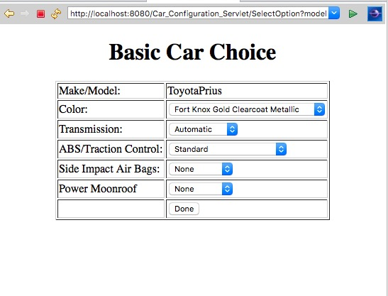

# Project1 Unit5 Results

andrew id: dawang

In order to save TA's time, I made this pdf to show the result directly using screenshots.

## Server

Run the server just like Unit4, all the outputs are in the test_output.txt in the server folder.

## Client

Run the client to upload several car models, all the outputs are in the test_output.txt in the servlet folder.

## Servlet

Run the SelectModel.java on the server.

and can select different models that are stored on the server

After clicking the Done button, it will jump to the configuration page:

and can select from different options from the server

Here is another example

Finally, we can see the page for the result of configuration

