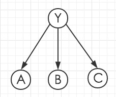
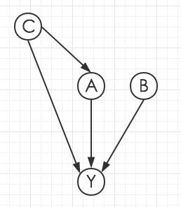

# Semi-Supervised Learning, Graphical Models

andrew id: dawang

## 3 Graphical Models Representation

### 3.1

$$P(Y,A,B,C)=P(Y)P(A|Y)P(B|Y)P(C|Y)$$

The corresponding Bayesian Network is

### 3.2

$$P(Y,A,B,C)=P(A\;|\;C)P(B)P(C)P(Y\;|\;A,B,C)$$

The corresponding Bayesian Network is

### 3.3

The variables we must consider when we try to classify the document: $B,C,E$

### 3.4

The factorization of the joint probability is

$$P(Y,B,C,E)=P(Y\;|\;E)P(E\;|\;B,C)P(B)P(C)$$

