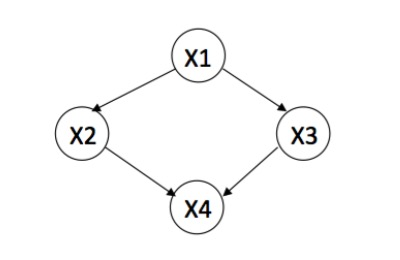
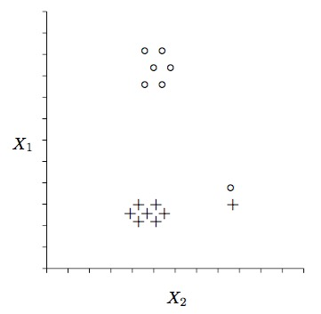
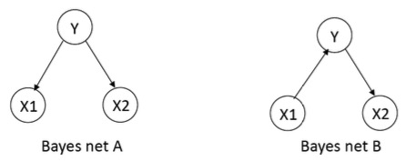

# Mid Review

## 要注意的内容

Control Model Complexity

+ Neural Nets
	+ change size of hidden layer. size decreases -> simple
+ K Nearest Neighbor
	+ k increases -> simple
+ SVM
	+ kernel function
+ Logistic regression
	+ regularization, $\lambda$ increases -> simple , bias increase, variance decrease
+ Decision Tree
	+ pruning, stop early -> simple

---

+ GNB train faster than Logistic Regression
+ Markov property: Current state is only dpend on last state
+ Bias depends on the model you use and not the number of training data
+ The training error of 1-NN classifier is 0

## 真题合集

+ 什么时候我们会想用 Decision Tree 而不是 Logistic Regression?
	+ If we want our learner to produce rules easily interpreted by humans
+ 什么时候我们会想用 Logistic Regression 而不是 Naive Bayes?
	+ If we know that the conditional independence assumptions made by Naive Bayes are not true for our problem, and we have lots of training data
+ 为什么在 Linear Regression 中我们选择让训练误差平方和最小的参数？
	+ Because this corresponds to MLE assuming that data is generated from a linear function plus Gaussian noise.

---

假设我们要训练一些分类器 $f:X\to Y$，这里 X 是特征向量 $X=<X_1,X_2,X_3>$，这下面哪种分类器包含足够的信息来计算 $P(X_1,X_2,X_3,Y)$?

+ Gaussian Naive Bayes
	+ Yes, we can estimate $P(X_1,X_2,X_3,Y)=P(Y)P(X_1|Y)P(X_2|Y)P(X_3|Y)$
+ Logistic Regression
	+ No, we cannot compute P(X)
+ Linear Regression
	+ No, we cannot compute P(X)

---

Conditional independence 的定义是随机变量 X 在当且仅当满足下面条件时给定 Z 与 Y 条件独立：

$$P(X\;|\;Y,Z)=P(X\;|\;Z)$$

试证明给定 $P(XY|Z)=P(X|Z)P(Y|Z)$，在给定 Z 时 X 与 Y 条件独立

证明如下

$$
Assume \; P(XY\;|\;Z)=P(X\;|\;Z)P(Y\;|\;Z) \\
P(XY\;|\;Z)=P(X\;|\;Y,Z)P(Y\;|\;Z) \;(by\;Chain\;Rule) \\
so \; P(X\;|\;Z)P(Y\;|\;Z)=P(X\;|\;Y,Z)P(Y\;|\;Z) \\
aka P(X\;|\;Z)=P(X\;|\;Y,Z)
$$

---

考虑下面的贝叶斯网络

+ 定义这个 $P(X1,X2,X3,X4)$ 贝叶斯网络需要多少参数
	+ 只需要考虑每个点的入度，设入度为 n，那么这个点需要的参数是 $2^n$ 个
	+ 所以 1 + 2 + 2 + 4 = 9
+ 用上面的贝叶斯网络重写 $P(X1=1,X2=0,X3=1,X4=0)$
	+ $P(X1=1,X2=0,X3=1,X4=0)=P(X1=1)P(X2=0\;|\;X1=1)P(X3=1\;|\;X1=1)P(X4=0\;|\;X2=0,X3=1)$
+ 列出计算 $P(X1=1,X4=0)$ 的公式
	+ P(X1=1)P(X2=1|X1=1)P(X3=1|X1=1)P(X4=0|X2=1,X3=1)+ P(X1=1)P(X2=1|X1=1)P(X3=0|X1=1)P(X4=0|X2=1,X3=0)+ P(X1=1)P(X2=0|X1=1)P(X3=1|X1=1)P(X4=0|X2=0,X3=1)+ P(X1=1)P(X2=0|X1=1)P(X3=0|X1=1)P(X4=0|X2=0,X3=0)

---

画一个两层决策树可以分类，但 LR 不能分类的数据集

XOR 就是一个例子，只要线性不可分即可

---

画一个 LR 可以分类但是两侧决策树不能分类的数据集

Since the decision tree must make splits that are aligned with the axes, a data set with several points that could be separated by a diagonal line works here.

---

画一个 Gaussian Naive Bayes 模型不能完美分类，但是 LR 可以的数据集

GNB will learn the means of the data, and regardless of the learned value of $\sigma$, the decision boundary will be a line that runs exactly between the midpoint of the two means, and is perpendicular to the line that connects the means. A sufficiently skewed data set that is linearly separable makes it so that LR will learn to separate the data sets, while the means learned by GNB will result in a line that does not.

---

考虑下面这个有三个布尔变量构成的贝叶斯网络

+ 分别写出对应两个贝叶斯网络的 $P(X1,X2,Y)$
	+ Bayes net A: $P(X1,X2,Y)=P(Y)P(X1\;|\;Y)P(X2\;|\;Y)$
	+ Bayes net B: $P(X1,X2,Y)=P(X1)P(Y\;|\;X1)P(X2\;|\;Y)$
+ 写出Bayes net A 对应的联合分布$P(X1,X2,Y)$，其中 X1=1，X2=1,Y=1的概率为 1，其他的都为 0
	+ P(Y=1) = 1, P(X1=1 | Y=1) = 1, P(X2=1 | Y=1) = 1
	+ The other two CPT entries do not matter since P(Y=0) = 0
+ 描述一个 Bayes Network A 无法表示的分布，给出你的解释
	+ P(X1=0,X2=0,Y=0) = 0
	+ P(X1=0,X2=0,Y=1) = 0
	+ P(X1=0,X2=1,Y=0) = 0
	+ P(X1=0,X2=1,Y=1) = 1
	+ P(X1=1,X2=0,Y=0) = 0
	+ P(X1=1,X2=0,Y=1) = 1
	+ P(X1=1,X2=1,Y=0) = 0
	+ P(X1=1,X2=1,Y=1) = 0
	+ X1 and X2 are not conditionally independent given Y, so Bayes network A cannot represent this distribution
+ Bayes Net A 和 Bayes Net B 表示不同的条件独立关系吗？
	+ 它们表示同样的条件独立关系: X1 is C.I. of X2 given Y 

考虑下面的两个贝叶斯网络，能否说这两个贝叶斯网络的 joint probability distribution $P(X1,X2,X3,Y)$ 是相同的？

不行。这两个网络有不同的 CI assumptions. 在 C 中， X1 is C.I. of X2 given Y，但是在 D 中, this is not true.

---

找出给定 Gaussian Naive Bayes 的决策边界

	x | y=0 ~ N(0,1)
	x | y=1 ~ N(2,1)
	P(y=1) = 0.5

上面模型的决策边界是线性的吗，也就是说，能不能用 $\omega_0+\omega_1x \ge 0$ 来表达决策边界。

答：决策边界是线性的。It classifies a point x as 1 if x >= 1, and 0 otherwise. Hence the coefficients are $\omega_0=-k,\;\omega_1=k$ for any k > 0

	x | y=0 ~ N(0,0.25)
	x | y=1 ~ N(0,1)
	P(y=1) = 0.5
	
上面模型的决策边界是线性的吗

答：决策边界不是线性的. The class distributions have differetn variances. Hence we will have a quadratic decision boudary

考虑 quadratic decision boundary，判断边界直接把图像画出来就非常清晰了

---

MLE 问题

You are given a dataset with N records in which the ith record has a real-valued input attribute $x_i$ and a real-valued output $y_i$, which is generated from a Gaussian distribution with mean $sin(\omega x_i)$, and variance 1.

$$P(y_i\;|\;\omega,x_i)=\frac{1}{\sqrt{2\pi}}exp\frac{-(y_i-sin(\omega x_i))^2}{2}$$

要求出参数 $\omega$ 的最大似然估计

Write down the expression for the data likelihood as a function of $\omega$ and the observed x and y values.

The conditional data likelihood is given by 

$$\frac{1}{(2\pi)^{N/2}}exp[\sum_{i=1}^N\frac{-(y_i-sin(\omega x_i))^2}{2}]$$

对上式的 $\omega$ 求偏导可得

$$\sum_ix_isin(\omega x_i)cos(\omega x_i)=\sum_ix_iy_icos(\omega x_i)$$

### 对错判断

> Assuming you are not concerned with the training time, when using an artificial neural network it is best to include enough hidden units so the training error can be reduced as much as possible. Explain in 1 sentence

False. Minimizing training error will not necessarily minimize true(future) error -- overfitting may set in

> A single perceptron can only compute linear variations of AND, OR and XOR. Explain in 1 sentence.

False. A single perceptron cannot compute an XOR.

> When the data is not completely linear separable, the linear SVM without slack variables returns w=0

False, there is no solution

> After training a SVM, we can discard all examples which are not support vectors and can still classify new examples

True. Only care about the boundary

### 问答题

> What it is possible to run a Gradient Descent algorithm, what is guaranteed by the algorithm and what is not guaranteed?

The algorithm is guaranteed to converge to a local minimum of the error function. It is not guaranteed to converge to a global minimum.

## Concept

+ Concept Space = All possible concepts
	+ $Size = 2^{Size\;of\;input\;space}$
+ Hard bias makes hypothesis space smaller than concept space

## Information Theory

+ Surprise of $I(x)=log_2(\frac{1}{P(x)})$
+ Entropy $H(X)=\sum_xP(x)\times I(x)$
+ Avg. Cond. $H(X\;|\;Y)=\sum_yP(y)\times H(X\;|\;Y=y)$
+ Mutual Information $I(X;Y)=H(X)-H(X\;|\;Y)$
+ Chain Rules:
	+ $I(Y;X1,X2)=I(Y;X1)+I(Y;X2\;|\;X1)$
	+ $H(X,Y)=H(X)+H(Y\;|\;X)$
	+ $P(x,y)=P(x)\times P(y\;|\;x)$

## Probability

+ $P(x,y)=P(x)P(y\;|\;x)$
+ $E[X]=\sum_xP(x)x$
+ $E_{sample}[X]=\frac{1}{N}\sum_{i=1}^Nx_i$
+ $Var(2X+3Y)=4\;Var(X)+9\;Var(Y)+12\;Cov(X,Y)$
+ Linear Correlation can be 0 even if MI > 0
+ Independence: $x\perp y \to p(x,y)=p(x)\;p(y)$
+ Node the same: $x\perp y \;|\;z \to p(x,y\;|\;z)=p(x\;|\;z)\;p(y\;|\;z)$

## Hypothesis Testing

+ How certain can we be that our sample error is close to the real error
+ Give an interval together with certain confidence: $<confidence, Mean \pm z\times Var.>$
+ Recipe:
	1. identify what to estimate (P)
	2. Define estimator (e.g. MLE)
	3. Determine mean and variance of estimator
	4. Determine bounds covering N% confidence	
## MLE and MAP

MLE: Known Likelihood function $P(X\;|\;\lambda)$

+ Find maximum via setting derivative wrt. $\lambda$ to 0
+ Steps:
	1. Remove terms in likelihood not depending on $\lambda$
	2. Take log to make math easier
	3. Take partial derivative wrt. $\lambda$
	4. Set to 0 and solve for $\lambda$

MAP: also use prior over $\lambda$: $P(\lambda)$ Prior pushes parameters into certain direction(s)

## Bayes Optimal Classifier

+ $argmax_y\sum_{h\in H}P(y|h)P(h|D)$
+ Smallest error among all classifiers that use this particular hpyothesis space H
+ Problem: Need to enumerate all hypothesis in H
+ Solution: Gibbs Algorithm, MAP
+ Bayes Rule: $P(y|D)=\frac{P(y)P(D|y)}{P(D)}$
+ Remaining Problem: Estimate $P(D|y)$ and $P(D)$

## Naive Bayes

+ Observation $P(D)$ not needed if we only want to argmax over the class
+ Idea fro $P(D|y)$: assume attributes condintionally independent
	+ $P(D|y)=P((x_1, x_2, x_3)\;|\;y)=P(x_1\;|\;y)P(x_2\;|\;y)P(x_3\;|\;y)$
	+ Now we can just count each feature
+ This is a **very Strong** assumption. Duplicate features get overweighted

## Graphical Models

+ Bayes Net(directed)
	+ Node independent of its non-descendants **conditioned** on its parents
	+ Direction represented belief about causality. Independence is undirected
+ Markov Random Field (undirected)
	+ Node independent of Non-neighbors **conditioned** on neighbors

## Hidden Markov Models

+ Remember $\alpha_1(j)=b_j(o_1)\pi_j$
+ Remember $\beta_T(i)=1.0$
+ Alpha and Beta defined to match $\alpha_t(i)\beta_t(i)=P(q_t=i,O\;|\;\lambda)$

State Name | t=1 | t=2 | T=t=3
:--: | :--: | :--: | :--:
Admits Guilt | $\alpha_1(A)\beta_1(A)$ | $\alpha_2(A)\beta_2(A)$ | $\alpha_T(A)\beta_T(A)$
Threatens | $\alpha_1(T)\beta_1(T)$ | $\alpha_2(T)\beta_2(T)$ | $\alpha_T(T)\beta_T(T)$
Other | $\alpha_1(O)\beta_1(O)$ | $\alpha_2(O)\beta_2(O)$ | $\alpha_T(O)\beta_T(O)$
Sum $\sum$ col | $P(O\;\vert \;\lambda)$ | $P(O\;\vert \;\lambda)$ | $P(O\;\vert \;\lambda)$

## Expectation Maximization

+ What to do when MLE does not work? EM
	+ E-step: based on current parameters assign(hidden) labels to training data
	+ M-step: based on labeling calculate better parameters 
+ Baum-Welch for training HMM unsupervised is an instance of EM
+ Kmeans clustering another instance

## Perceptron

+ Training Rule: $w_{new} = w_{old} + \eta(y-t)x$
+ Converges if Xs are linearly separable

## Neural Networks

+ What is the bias of neural networks?
+ Backpropagation finds only a local optimum
+ NN Design Questions
	+ How many layers? (Deep vs. shallow)
	+ How many hidden units? (vs. Overfitting)
	+ How connected? (Features...)
+ Problem of deep networks: Vanishing gradient
+ General Problem: Non-convexity

