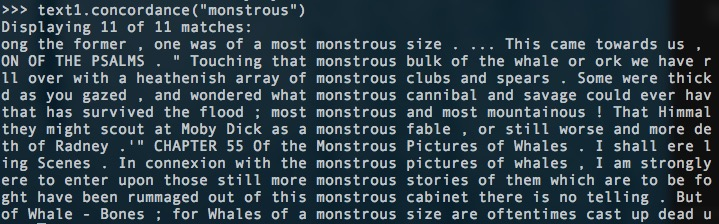

# Python 自然语言处理

学习如何处理大量非结构化文本的 Python 程序，学到分析书面文档内容和结构的主要算法。Python + NLTK。

<!-- MarkdownTOC -->

- NLTK 概览
- 第一章 语言处理与 Python
    - NTLK 入门
    - 1.1 语言计算：文本和单词
        - 搜索文本
        - 计数词汇
    - 1.2 近观 Python：将文本当作词链表
    - 1.3 计算语言：简单的统计
        - 频率分布
        - 细粒度的选择词
        - 词语搭配和双连词(bigrams)
    - 1.4 回到 Python：决策与控制
        - 对每个元素进行操作
    - 1.5 自动理解自然语言
    - 1.6 深入阅读
- 第二章：获得文本语聊和词汇资源
- 第三章：加工原料文本
    - 3.1 从网络和硬盘访问文本
    - 3.2 字符串：最底层的文本处理
    - 3.3 使用 Unicode 进行文字处理
    - 3.4 使用正则表达式检测词组搭配
    - 3.5 正则表达式的有益应用
        - 提取字符块
        - 查找词干
    - 3.6 规范化文本
    - 3.7 用正则表达式为文本分词
    - 3.8 分割
- 第四章：编写结构化程序
- 第五章：分类和标注词汇
- 第六章：学习分类文本
- 第七章：从文本提取信息

<!-- /MarkdownTOC -->

## NLTK 概览

语言处理任务 | NTLK 模块 | 功能描述
--- | --- | ---
获取和处理语料库 | nltk.corpus | 语料库和词典的标准化接口
字符串处理 | nltk.tokenize, nltk.stem | 分词，句子分解提取主干
搭配发现 | nltk.collocations | t-检验，卡方，点互信息 PMI
词性标识符 | nltk.tag | n-gram, backoff, Brill, HMM, TnT
分类 | nltk.classify, nltk.cluster | 决策树，最大熵，贝叶斯，EM，Kmeans
分块 | nltk.chunk | 正则表达式，n-gram，命名实体
解析 | nltk.parser | 图表，基于特征，一致性，概率，一来
语义解释 | nltk.sem, nltk.inference | λ演算，一阶逻辑，模型检验
指标评测 | nltk.metrics | 精度，召回率，协议系数
概率与估计 | nltk.probability | 频率分布，平滑概率分布
应用 | nltk.app, nltk.chat | 图形化的关键词排序，分析器，WordNet查看器，聊天机器人
语言学领域的工作 | nltk.toolbox | 处理 SIL 工具箱格式的数据

## 第一章 语言处理与 Python

#### NTLK 入门

先去[nltk](www.nltk.org)上下载安装 NTLK。然后安装所需要的数据

    >>> import nltk
    >>> nltk.download()

然后会出现下面的下载器，选择 `book` 进行下载。

下载完之后就可以使用了，具体示例如下

    >>> from nltk.book import *

需要引用时直接输入名字即可

### 1.1 语言计算：文本和单词

#### 搜索文本

词语索引视图显示一个指定单词在文本中每一次出现的情况，并连同一些上下文。利用 `concordance` 函数来完成这个操作，下面是几个示例：

**《白鲸记》中的 monstrous**

    >>> text1.concordance("monstrous")

**《理智与情感》中的 affection**

    >>> text2.concordance("affection")

我们不仅可以搜索指定词，还可以看到针对某个指定词，有哪些词出现在指定词的上下文中。利用 `similar` 函数可以找到某个指定单词的相关词：

    >>> text1.similar("monstrous")
    >>> text2.similar("monstrous")

通过比较同一个单词的相关词，我们可以看到这两本书的作家对于 monstrous 这个单词的使用有着非常不同的倾向。

我们还可以研究两个或两个以上的词的共同上下文，比如 monstrous 和 very，我们可以使用 `common_contexts` 函数来进行操作：

    >>> text2.common_contexts(["monstrous", "very"])
    a_pretty is_pretty a_lucky am_glad be_glad

我们还可以判断词在文本中的位置，并用离散图表示。每一个竖线代表一个单词，每一行代表整个文本，使用 `dispersion_plot` 函数来完成这个操作(需要安装matplotlib)：

    >>> text4.dispersion_plot(["citizens", "democracy", "freedom", "duties", "America"])

#### 计数词汇

使用函数 `len` 可以获取文本的长度：

    >>> len(text3)
    44764

也就是说 text3 有 44764 个词(标识符)。我们可以用 `set` 来获取 text3 的词汇表

    >>> sorted(set(text3))
    >>> len(set(text3))
    2789

也就是在这 44764 个标识符中，只有 2789 个不同的词汇。同样，可以利用 `count` 函数来找到一个次出现的次数：

    >>> text3.count("smote")
    5

### 1.2 近观 Python：将文本当作词链表

+ 链表 List: 方括号 ['Call', 'me', 'Da', '.']
+ 支持 `count`, `sorted` 以及链表相加操作(连接)
+ 追加一个元素用 `append`
+ 索引取出链表元素 `text4[911]`, 也可以找出第一次出现的索引 `text4.index('happy')`
+ 可以利用`切片`来获取子链表：`text5[16715:16735]`
+ 排序表中，大写字母出现在小写字母之前
+ 对于字符串来说，很多链表的方法都可以用，例如乘法和加法
+ 利用 `join` 函数来连接链表组成单个字符串 `''.join(['Monty','Python'])`
+ 利用 `split` 函数来把字符串分割成链表 `'Monty Python'.split()`

### 1.3 计算语言：简单的统计

可以应用到 wkk 中

#### 频率分布

如何能自动识别文本中最能体现文本主题和风格的词？统计每个词出现的次数是一个最容易想到的方法，也被称为**频率分布**，NLTK 内置了这个功能，使用 `FreqDist` 即可：

    >>> fdist1 = FreqDist(text1)

如果把前五十个的累计词频显示出来，可以看到这 50 个词占到这本书的将近一半

    >>> fdist1.plot(50, cumulative=True)

而我们也可以发现这些词除了 whale 之外其他基本都没啥意义。既然高频词汇对我们来说没有意义，那么那些只出现了一次的词(hapaxes)又如何呢？使用下面的命令来查看

    >>> fdist1.hapaxes()

一共有 9000 多个！低频词太多，看来高频词和低频词都没有帮助。

#### 细粒度的选择词

我们可以选择一些有特定特征和信息量的词，例如找出文本汇总长度超过15个字符的词，并且出现次数不能太少：

    >>> fdist5 = FreqDist(text5)
    >>> sorted([w for w in set(text5) if len(w) > 7 and fdist5[w] > 7])

#### 词语搭配和双连词(bigrams)

一个搭配是经常在一起出现的词，使用 `bigrams` 函数可以方便生成，例如：

    >>> bigrams(['more','is','said','than','done'])
    [('more','is'),('is','said'),('said','than'),('than','done')]

而如果想要找到频繁出现的双连词，`collocations()`函数可以做到：

    >>> text4.collocations()

NLTK 频率分布类中定义的函数

例子 | 描述
--- | ---
fdist = FreqDist(samples) | 创建包含给定样本的频率分布
fdist.inc(sample) | 增加样本
fdist['monstrous'] | 计数给定样本出现的次数
fdist.freq('monstrous') | 给定样本的频率
fdist.N() | 样本总数
fdist.keys() | 以频率递减顺序排序的样本链表
for sample in fdist: | 以频率递减的顺序遍历样本
fdist.max() | 数值最大的样本
fdist.tabulate() | 绘制频率分布表
fdist.plot() | 绘制频率分布图
fdist.plot(cumulative=True) | 绘制累积频率分布图
fdist1 < fdist2 | 测试样本在 fdist1 中出现的频率是否小于 fdist2

### 1.4 回到 Python：决策与控制

一些词比较运算符

函数 | 含义
s.startswith(t) | s 是否以 t 开头
s.endswith(t) | s 是否以 t 结尾
t in s | s 是否包含 t
s.islower() | 是否小写
s.isupper() | 是否大写
s.isalpha() | 是否字母
s.isalnum() | 是否数字字母
s.isdigit() | 是否数字
s.istitle() | 是否首字母大写

#### 对每个元素进行操作

    >>> [len(w) for w in text1]
    >>> [w.upper() for w in text1]

### 1.5 自动理解自然语言

语言理解是智能行为的重要组成部分

+ 词义消岐：特定上下文中的词被赋予的是哪个意思
+ 指代消解(anaphora resolution)：检测主语和动词的宾语
+ 语义角色标注(semantic role labeling)：确定名词短语如何与动词相关联
+ 自动生成语言
+ 机器翻译：语言理解的圣杯
+ 文本对齐
+ 人机对话系统：图灵测试 `nltk.chat.chatbots()`
+ 文本含义识别(Recognizing Textual Entailment, RTE)

### 1.6 深入阅读

+ <Handbook of Natural Language Processing, 2nd> Indurkhya, Nitin, Fred Damerau
+ ACL, The Association for Computational Linguistics
+ Blog: LanguageLog

## 第二章：获得文本语聊和词汇资源

有以下一些语料库

+ 古腾堡语料库 `nltk.corpus.gutenberg.fileids()` / `from nltk.corpus import gutenberg`
+ 网络和聊天文本 `from nltk.corpus import webtext`
+ 布朗语料库：包含500个不同来源的文本，按照文体分类
+ 路透社语料库：新闻文档，分为90个主题，按照训练和测试分为两组
+ 就职演说语料库
+ 标注文本语料库：词性标注、命名实体、句法结构、予以角色
+ 词汇列表语料库
+ 停用词语料库
+ 比较词表
+ WordNet：面向语义的英语词典，同义词集，反义词集、概念层级，上/下位词 `nltk.app.wordnet()`，组织成一个网络

## 第三章：加工原料文本

先导入几个东西

    >>> from __future__ import division
    >>> import nltk, re,

### 3.1 从网络和硬盘访问文本

编号2554的文本是《罪与罚》，利用如下方式访问：

    >>> from urllib import urlopen
    >>> url = "http://www.gutenberg.org/files/2554/2554.txt"
    >>> raw = urlopen(url).read()
    >>> type(raw)
    >>> len(raw)
    >>> raw [:75]

然后需要进行分词，生成一个词汇和标点符号的链表

    >>> tokens = nltk.word_tokenize(raw)
    >>> type(tokens)
    >>> tokens[:10]

从这个链表生成一个 NLTK 文本，就可以利用之前见过的处理了

    >>> text = nltk.Text(tokens)
    >>> type(text)
    >>> text[1020:1060]
    >>> text.collocations()

处理 HTML 内容可以使用 `nltk.clean_html(html)`，更多的处理可以使用 `Beautiful Soup 包`

处理 RSS 订阅，使用 `feedparser` 包

### 3.2 字符串：最底层的文本处理

具体略，参见 python 学习文档

字符串是不可变的，链表是可变的

### 3.3 使用 Unicode 进行文字处理

Unicode 支持超过一百万种字符。每个字符分配一个编号，称为编码点。在 Python 中，编码点写作 \uXXXX 的形式，其中 XXXX 是四位十六进制形式数。

`unicodedata` 模块可以检查 Unicode 字符的属性

具体就是转为 unicode 最后再转回来

### 3.4 使用正则表达式检测词组搭配

    >>> [w for w in wordlist if re.search('ed$', w)]
    >>> [w for w in wordlist if re.search('^..j..t..$', w)]
    >>> [w for w in wordlist if re.search('^[ghi][mno][jlk][def]$', w)]

+ 和 * 符号有时被称为 Kleene 闭包，或者闭包

### 3.5 正则表达式的有益应用

#### 提取字符块

    >>> word = 'supercalifragilisticexpialidocious'
    >>> re.findall(r'[aeiou]', word')
    >>> wsj = sorted(set(nltk.corpus.treebank.words()))
    >>> fd = nltk.FreqDist(vs for word in wsj for vs in re.findall(r'[aeiou]{2,}', word))
    >>> fd.items()

#### 查找词干

去掉像后缀的

    def stem(word):
        for suffix in ['ing','ly','ed','ious','ies','ive','es','s','ment']:
            if word.endswith(suffix):
                return word[:-len(suffix)]
    return word

### 3.6 规范化文本

+ 词干提取器：Porter 和 Lancaster
+ 词形归并：WordNet

### 3.7 用正则表达式为文本分词

利用正则表达式分词：`re.split(r'[ \t\n]+', raw)

### 3.8 分割

断句与分词

## 第四章：编写结构化程序

这一章是 python 教程

+ lambda 表达式
+ networkX (P165 画图，挺有用)

## 第五章：分类和标注词汇

将词汇按照它们的词性(parts-of-speech, POS)分类以及相应的标注它们的过程被称为词性标注(part-of-speech tagging, POS tagging)。词性也称为词类或者词汇范畴。用于特定任务的标记的集合被称为一个标记集。

这个暂且不管

## 第六章：学习分类文本

暂时用 Textrank 提取关键字，来进行分类。需要一些训练集

## 第七章：从文本提取信息

暂时用 Textrank 提取关键字
