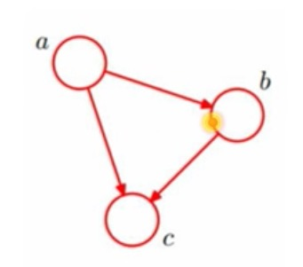
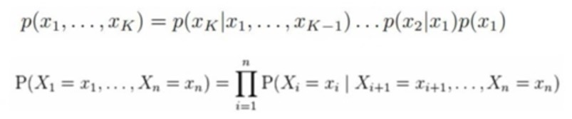
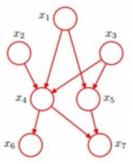
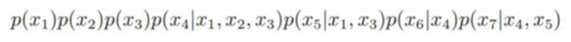
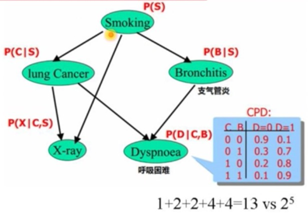
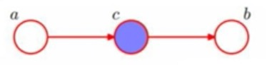
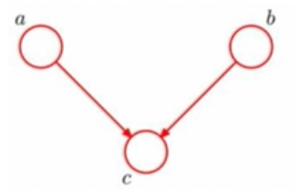
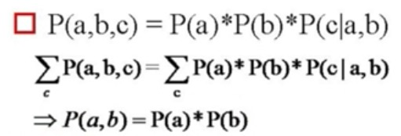
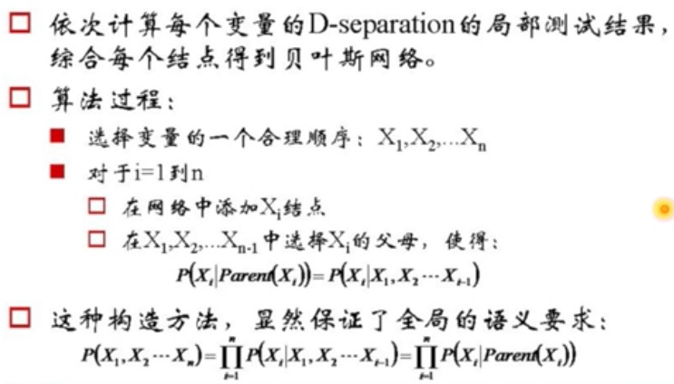
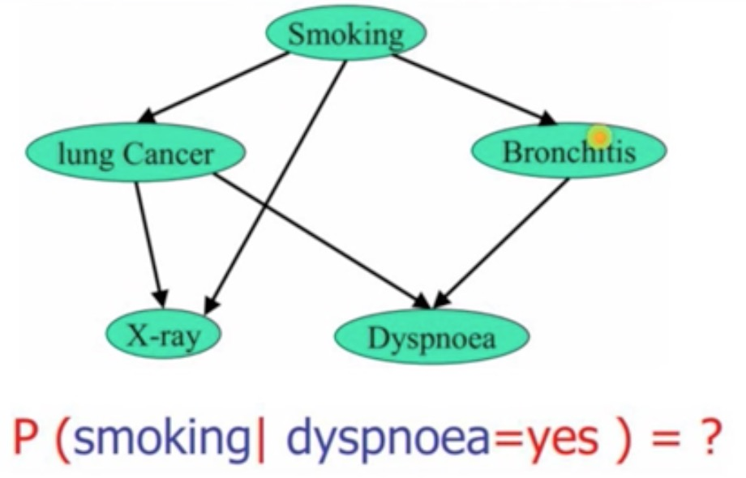

# 贝叶斯网络

## 一个简单的贝叶斯网络

abc 的联合概率：p(a,b,c)=p(c|a,b)p(b|a)p(a)

一个有向无环图，在某些更复杂的情况下，图是可以简化的

## 全连接贝叶斯网络

每一对结点之间都有边连接

## 一个『正常』的贝叶斯网络

+ 有些边缺失
+ 直观上：(只是一个感觉，后面会证明不对)
    + x1 和 x2 独立
    + x6 和 x7 在 x4 给定的条件下独立
+ x1,x2,...,x7 的联合分布

联合分布中，父亲会作为条件，写在后面，依次递推来写即可。

## 对一个实际贝叶斯网络的分析

这里 0 表示 没有，1 表示有，对于 P(D|C,B) 来说，我们实际上只需要四个参数，因为对于每个确定的 C,B 组合来说，D 为两点分布，一个参数即可。

如果没有贝叶斯网络，参数就会很多很多。

## 通过贝叶斯网络判定条件独立

+ P(a,b,c)=P(c)P(a|c)P(b|c)
+ 则: P(a,b|c)=P(a,b,c) / P(c)
+ 把 P(c) 移到等式左边，得到: P(a,b|c) = P(a|c)P(b|c)
+ 这也就满足条件独立的定义，即在 c 给定的条件下，a 和 b 被阻断，是独立的
+ 这种 tail-to-tail 的模式中，两个 tail 是条件独立的

对于上图的这种情况

+ P(a,b,c)=P(a)P(c|a)P(b|c)
+ 则:
+ P(a,b|c)=P(a,b,c) / P(c)   # 带入上式
+ = P(a)P(c|a)P(b|c) / P(c)  # P(a)P(c|a) = P(a,c)
+ = P(a,c)P(b|c) / P(c)
+ = P(a|c)P(b|c)
+ 在 c 给定的条件下，a 和 b 被阻断，是独立的
+ 这种 head-to-tail 的模式中，中间被隔断 head 和 tail 是条件独立的

上图的情况比较不一样

其中求和的意思就是对 c 做积分，那么积分完成后 c 就为总概率 1，就可以从式子中消去，也由此得到最终的结果。

也就是说，即使 c 是未知的，a 和 b 也是被阻断的，是独立的(head-to-head)，而且是严格独立的(无条件独立)

## 贝叶斯网络的构建

等式最后一步可以看做是一个简化参数的过程

**举个例子**

第一步，如果我们算出 P(J|M) = P(J)，那么说明 J 和 M 互相独立，也就是说在网络中没有连线。如果不相等，就要加上一个箭头

一个一个依次计算，如果相等则没有连线，如果不相等则有连线，以这幅图为例，最后所需要的参数为 `1+2+4+2+4=13`

这里选取节点的顺序与最终形成的网络结构也有关系。

## 贝叶斯网络的推导

假如我们发现一个人呼吸困难，那么他有多大的可能会抽烟呢？

条件概率可以改写成联合分布除以边缘分布，这里分母一般是固定的所以重点考察联合分布。

下一条式子是 d,b,x,c,s 所有变量的联合分布(求和的右边式子)。我们对 b,x,c 积分，并固定 d=1，就可以得到上面我们要求的联合分布 P(s,d=1)

