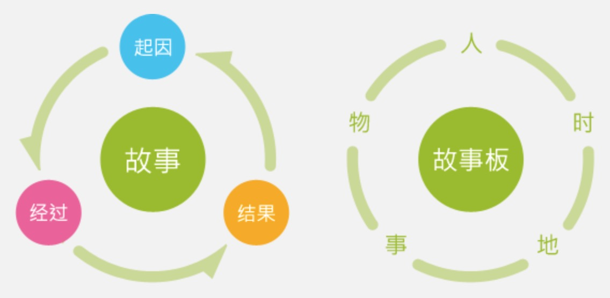
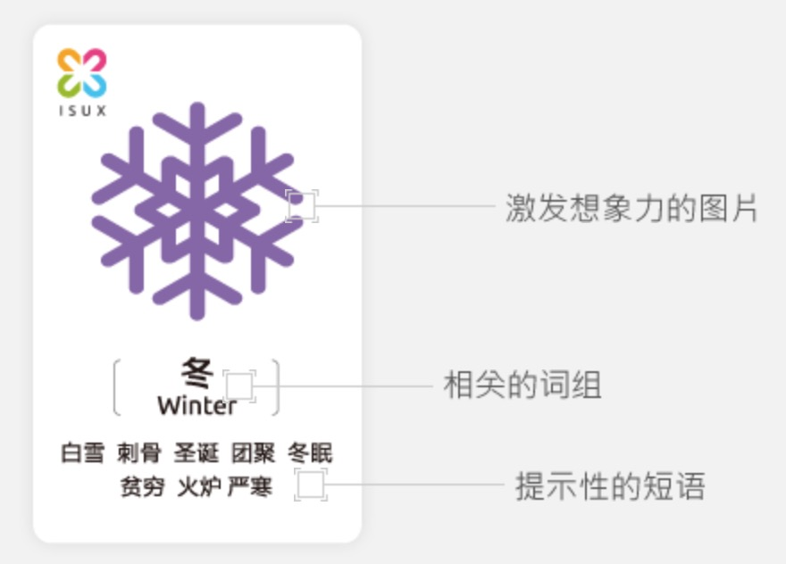

# 五维创意卡

制作故事板

+ 将故事拆分为起因、经过、结果
+ 将故事板拆分为人(Who)、物(What)、事(How)、地(Where)、时(When)五个要素

+ 利用五个纬度的随机组合，轻松编写出奇妙的故事场景
+ 在故事情节中寻找用户需求，产生新的创意
+ 多达 54 张卡片

维度卡

+ 精致的图片唤起思考
+ 清新的色调方便区分不同维度
+ 合理利用提示短语，让思维跳跃得更远

思维方式

+ 替换功能：用新行为代替旧行为完成目的
+ 组合功能：将两种国能组合，让其中一个功能更能满足用户的需要
+ 联想相关场景：将日常行为融入到设计中

## 如何使用

1. 确定头脑风暴主题
2. 参与者获取五类卡片各一张
3. 根据卡片构建场景
4. 通过替换、组合、联想等方式发现新的突破点
5. 交换卡片，产生更多创意
6. 与大家分享你的创意

## 人 [橙色] 13

+ 婴儿 Baby
	+ 奶嘴，定时喂食，希望，棉花糖，果冻，没有杀伤力
+ 女人 Woman
	+ 水，鸡汤，长发，裙子，高跟鞋，优雅，生理周期
+ 孕妇
+ 工人
+ 老人
+ 死者
+ 男人
+ 学生
+ 老师
+ 白领
+ 老板
+ 情侣
+ 朋友

## 物 [绿色] 16

+ 灯 Light
	+ 节能，诱饵，温暖，导航，爱迪生，明亮
+ 图片  Picture
	+ 合影，反复修改，相册，回忆，旅行，摄影师
+ 月亮 Moon
	+ 酒吧，猫头鹰，万家灯火，团聚，回忆
+ 八爪鱼
+ 仙人掌
+ 水
+ 手表
+ 衣服 Clothes
	+ 遮羞，兽皮，裁缝，植物，人靠衣装
+ 花
+ 音乐
+ 星星
+ 闪电
+ 电脑
+ 游戏机
+ 手机
+ 帐篷
+ 美食

## 事 [蓝色] 16

+ 录音 Record
	+ 事故，传递温暖，歌手，讲故事
+ 舞蹈 Dance
	+ 芭蕾，节奏，身体协调，柔美，彩带
+ 扭 Twist
	+ 蛇，变形
+ 运动 Sports
+ 测量 Measure
+ 睡觉
+ 分享
+ 愤怒
+ 沟通
+ 弹
+ 迷恋
+ 攀登 Climb
	+ 缺氧，西藏，大海，征服，坠落，一览无余
+ 赌博
+ 驾驶
+ 旅行
+ 吃饭
+ 学习

## 地 [红色] 14

+ 太空 Outer Space
	+ 星际大战，过期，补给站，宇航员，呼吸，秘密
+ 黑洞 Black Hole
	+ 穿越，吞噬，时间管理
+ 机场
+ 火车站
+ 学校 School
	+ 睡觉，手机，作弊，老师，打铃，传纸条
+ 非洲
+ 酒吧
+ 图书馆
+ 公园
+ 商店
+ 影院
+ 欧洲
+ KTV
+ 交通

## 时 [紫色] 12

+ 冬 Winter
	+ 白雪，刺骨，圣诞，团聚，冬眠，贫穷，火炉，严寒 
+ 秋
+ 夏
+ 春
+ 清晨 Morning
	+ 赖床，日出，开始，鸟鸣，公鸡，早操，露珠
+ 傍晚
+ 正午
+ 工业革命
+ 原始时期
+ 文艺复兴
+ 节假日
+ 工作日

