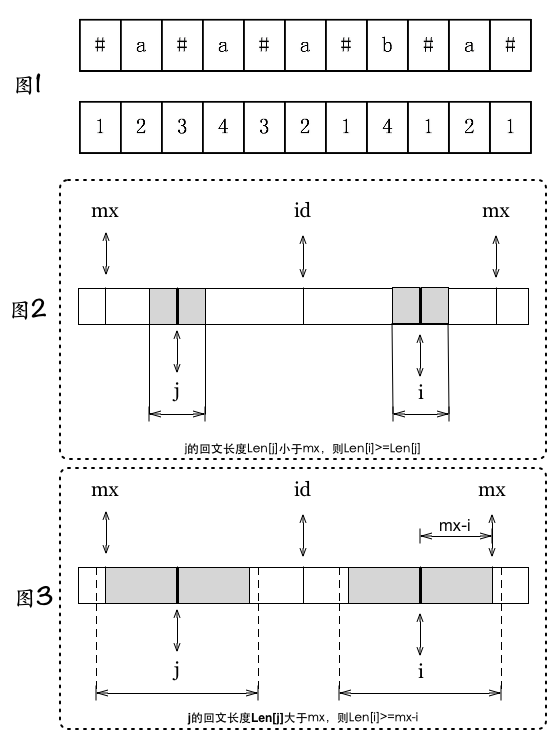

# 七月算法相关讲解

<!-- MarkdownTOC -->

- 面试指南
    - O(n) 时间能做什么
    - 各类算法的时间复杂度
- 动态规划
- BFS 和 DFS 优先搜索算法
- 常见字符串问题
    - 字符串循环右移
    - 最长回文子串
- 常见序列问题
    - K 序列合并
    - 序列和的前 N 小元素
    - 多序列第 K 个元素
    - 区间染色
    - 区间查询(难)
    - 模式匹配
    - 公共子串(难)
- 理解 KMP
- 最长公共子序列
- 求字符串的最长回文子串

<!-- /MarkdownTOC -->

## 面试指南

+ 基础知识(笔试)
    + 操作系统、数据库、网络
+ 算法
    + 贪心、分治、动态规划、回溯
    + dfs、bfs
    + 字符串处理
    + 线性表(链表、堆栈、队列)、树
    + 排列组合概率
    + 少见：线段树、网络流
+ 非编程问题
    + 迅速给出一个不很完美的解决方案
    + 和面试官交流

**别太钻研难题，做好『简单题』**

**别钻研太复杂的算法**

### O(n) 时间能做什么

+ 判断一个数组是否为 1~N 的一个排列（可以用 O(1) 空间）
+ 寻找 1~N 第一个不在数组内的数字（可以用 O(1) 空间）
+ 寻找众数，缺失的数字(xor, hash)
+ 字符串循环移位
+ KMP 串匹配
+ 最大直方图
+ 动规-最近 m 个数中最大的
+ 最长回文子串，以及回文串的个数
+ 框算法
+ 计数排序
+ 快排的 partition - 荷兰国旗问题，中位数问题
+ 建立堆（注意，这是 O(n) 的）
+ 和树相关的问题，二叉树最近公共祖先，树的遍历，树的高度
+ 2-sum（允许用 hash 的话，期望复杂度是 O(n)）
+ 完美洗牌
+ 最大连续乘积子数组
+ 杨氏矩阵查找
+ 出现超过一半的数字
+ Manacher

### 各类算法的时间复杂度

+ O(1)
    + 基本运算，寻址
    + Hash 表的期望复杂度
+ O(logn)
    + 二分查找
+ O(n)
    + 线性查找
    + 其他见上面
+ O(nlogn)
    + 归并排序
    + 快速排序的期望复杂度
    + 基于比较排序的算法下界
+ O(n^2)
    + 集合里枚举所有二元组
    + 朴素最近点对
+ O(n^3)
    + 集合里枚举三元组
    + Floyd 最短路径
    + 普通矩阵乘法
+ O(2^n)
    + 枚举全部的子集
+ O(n*2^n)
    + TSP 动态规划算法
+ O(n!)
    + 枚举全排列
+ O(n^n)
    + 枚举 [1...n] 的 n 维数组的全部元素

## 动态规划

动态规划一般只能应用于有最优子结构的问题，即局部最优解能决定全局最优解(有时候这个要求并不能完全满足，故需要引入一定的近似)。简单来说，问题能够分解成子问题来解决。

四个步骤

1. 描述最优解的结构
2. 递归定义最优解的值
3. 按自底向上的方式计算最优解的值
4. 由计算结果构造一个最优解

**最优子结构，重叠子问题**

比较经典的一个题目是最长公共子序列，这个在下面有一章具体讲解了

## BFS 和 DFS 优先搜索算法

**递归**

+ 解答树角度：在dfs遍历一棵解答树
+ 优点：结构简洁
+ 缺点：效率低，可能栈溢出

写一个递归函数的心得：

1. 出口条件，即递归“什么时候结束”，这个通常在递归函数的开始就写好；
2. 初始条件，也就是这个递归调用以什么样的初始条件开始；
3. 如何由”情况 n” 变化到”情况 n+1″, 也就是非出口情况，也就是一般情况——”正在”递归中的情况

递归的一般结构

    void f()
    {
         if(符合边界条件)
        {
           ///////
            return;
        }

         //某种形式的调用
         f();
    }

**回溯**

+ 回溯：递归的一种，或者说是通过递归这种代码结构来实现回溯这个目的。回溯法可以被认为是一个有过剪枝的DFS过程。
+ 解答树角度：带回溯的dfs遍历一棵解答树

回溯的一般结构：

    void dfs(int 当前状态)
    {
          if(当前状态为边界状态)
          {
            记录或输出
            return;
          }
          for(i=0;i<n;i++)      //横向遍历解答树所有子节点
          {
               //扩展出一个子状态。
               修改了全局变量
               if(子状态满足约束条件)
                {
                  dfs(子状态)
               }
                恢复全局变量//回溯部分
            }
    }

**队列**

队列

数据结构中的队列源于生活中的队列，是一种先进先出（FIFO, First-In-First-Out）的线性表。队列的操作包括：

+ 判断队列是否为空 O(1)
+ 访问队首元素而不出队O(1)
+ 新元素入队O(1)enqueue
    + 如果队列空间不够，会发生overflow
+ 旧元素出队O(1)dequeue
    + 如果队列已经为空，会发生underflow
+ 确定队列中元素的个数 STL和java中为O(1)
+ 清空队列 O(1)或O(n)，取决于实现

**BFS**

广度优先搜索 算法（Breadth-First-Search），又译作宽度优先搜索，或横向优先搜索，简称BFS，是一种图形搜索算法。简单的说，BFS是从根节点开始，沿着树的宽度遍历树的节点。如果所有节点均被访问，则算法中止。

BFS是一种先生成的节点先拓展的策略。即，从起点开始层层拓展，第一层是离起点距离为1的，第二层是离起点距离为2的……按层（距离）扩散，无回退。BFS有两个需要注意的地方： 节点判重 和 路径记录 。拓展节点是需要判重的，避免走入一个圈，只有第一次走过这个节点是有意义的；从哪条路到达这个节点，也是需要记录的，有的时候会需要路径的解。

BFS常常出现在带有“最少”、“最短”这样的场景，例如“最少多少步”、“最短是哪条边”。

基本框架如下：

+ 起点start入队
    + 记录步数d[start] = 0
    + pre[start] = NULL;
+ while(队列q非空){
    + 从q中出队一个点x
    + 对x做所有可能的扩展，得到很多点y
        + 对y进行判重，如果y是新的节点，则入队
        + 可以记录步数d[y] = d[x] + 1
        + 可以记录y的前一个节点pre[y] = x
+ }

**BFS实战**

Leetcode Word Ladder II 【126】和 Word Ladder 【127】就是两道典型的BFS，Word Ladder可以简述为：

给定字典，字典和一个起点单词，还有一个终点单词，每次只能变换一个字母，问从起点单词是否可以到达终点单词？最短多少步？

    例如:
    start = “hit”
    end = “cog”
    dict = [“hot”,”dot”,”dog”,”lot”,”log”]
    可以找到：”hit” -> “hot” -> “dot” -> “dog” -> “cog”,

【127】只返回长度，而【126】不但要返回长度，还要求返回这个解，即记录路径。

这题是隐式图，也就是说，在这里 节点 是单词，而 边 是修改一个字母形成的单词。这里要重点强调的是 判重 ，试想一下，单词PAT可以扩展出CAT和HAT；而扩展出的HAT又可以扩展出PAT和CAT，这样又会回到起点，所以需要判重！判重的做法就使用队列，如上面的BFS框架所示。

**DFS**

深度优先搜索算法（Depth-First-Search），是搜索算法的一种。是沿着树的深度遍历树的节点，尽可能深的搜索树的分支。当节点v的所在边都己被探寻过，搜索将 回溯 到发现节点v的那条边的起始节点。这一过程一直进行到已发现从源节点可达的所有节点为止。如果还存在未被发现的节点，则选择其中一个作为源节点并重复以上过程，整个进程反复进行直到所有节点都被访问为止。属于盲目搜索。

深度优先搜索是从起点尽可能深入地扩展，每次试图访问一个之前没访问过的点，需要注意的是，DFS有 回退 ——如果没有这样的点存在（即该节点所有的边已经都被访问过），回到上一个点。

DFS的注意点也是 节点判重 和 路径记录 。

关于堆栈的使用，需要说明两点：

1. 通常，我们可以使用递归——使用系统内部的堆栈；
2. 当递归层数很深的时候，系统堆栈可能不够用，就需要自己实现堆栈；

基本框架如下：

+ 起点start入堆栈
    + pre[start] = NULL;
+ while (堆栈s非空） {
    + 取s的栈顶元素x
        + 如果x还有没访问的邻居 (注意必须记录x访问了哪些邻居）
            + 访问该邻居y，把y入栈，并设置pre[y] = x
    + 否则对s做一次pop操作,弹出x
+ }

## 常见字符串问题

### 字符串循环右移

**方法一**

右移 x 位可以看成把前 x 位移动到后面的结果。

可以用一个数组保存前 x 位，然后把后面 n-x 位移动到前面，最后再把那 x 位放到后面

时间复杂度 O(n)，空间复杂度 O(n)

**方法二**

右移 x 位等价于右移 x%n 位

用三次翻转解决问题

+ 先翻转前面 x%n 位
+ 再翻转后面 n - x%n 位
+ 再把整个字符串翻转

时间复杂度 O(n)，空间复杂度 O(1)

### 最长回文子串

**暴力方法一**

+ 枚举起点 O(n)
+ 枚举中点 O(n)
+ 判断回文 O(n)
+ 总复杂度 O(n^3)

**暴力方法二**

+ 枚举中间点 O(n)，可能是两个字符，可能是一个字符
+ 不断延伸判断回文 O(n)
+ 总复杂度 O(n^2)

**Manacher 方法**

O(n)时间复杂度。奇数偶数统一处理，在每个字符前后都插入一个额外的标识符

+ 例如字符 aba 变为 #a#b#a#
+ 定义数组 p[i]，表示以 i 为中心 [i-x ... i+x] 是最长且回文的
+ #a#b#a#
+ 0103010
+ p[i] 其实表示了原串中以该字符为中心的最长回文子串的长度(#表示原串中两个字符之间的位置为中心)
+ 具体的算法单开一节来介绍

## 常见序列问题

技巧：二分、排序、暴力未尝不可、胆大心细

### K 序列合并

把 K 个有序数列合并成一个有序数列，元素共有 N 个。

**分析**

+ 每个数列的元素都从左到右移到新的数列中
+ 把每个数列的当前元素放入堆中，每次删除最小值并放入新数列中，然后加入此数列的下一个元素
+ 时间复杂度：O(NlogK)

### 序列和的前 N 小元素

+ 给出两个长度为 N 的有序数列 A 和 B，在 A 和 B 中各任取一个元素，可以得到 N^2 个和
+ 求这些和最小的 N 个

**分析**

可以把这些和看成 N 个有序数列：

    A[1]+B[1] <= A[1]+B[2] <= A[1]+B[3] <= ...
    A[2]+B[1] <= A[2]+B[2] <= A[2]+B[3] <= ...
    ...
    A[N]+B[1] <= A[N]+B[2] <= A[N]+B[3] <= ...

然后类似刚才的算法，每次 O(logN)，共取 N 次最小元素

时间复杂度：O(NlogN)

### 多序列第 K 个元素

+ 有 M 个有序数列，每个数列里有 N 个元素
+ 所有元素不超过 W
+ 求将 M*N 个元素排序后第 K 个元素的值

**分析**

二分元素大小 x

计算每个数列里比 x 小的元素个数 k' (二分查找)，共计 O(MlogN)

+ 如果 k' = k，输出 x
+ 如果 k' < k，x 增大
+ 如果 k' > k，x 减小

时间复杂度：O(MlogNlogW)

### 区间染色

+ 有 N 个闭区间[ai, bi]，每一段被涂成黑色
+ 求整个数轴被涂成几段黑色

**分析**

+ 按左端点从左到右排序
+ 从左到右扫描，若下一个区间的左端点分离，则区间数加一，否则扩展当前区间的右端点
+ 时间复杂度：O(NlogN)

### 区间查询(难)

+ 给 N 个数 A[1...N]
+ 设计在线算法，对于询问(i, j, k)，返回 A[i...j] 的元素排序后的第 K 个元素

**分析**

+ 简历线段树，每个线段保存该区间内元素排序好的数列
+ 查询处理：任意 [i, j] 可 分解为最多 2logN 个不重叠区间的并。只需二分 W，每次计算 2logN 个区间内一共有多少个数比 W 大，用 logW 次时间可求出第 K 个元素
+ 区间内的数已排序，用二分每个区间求比 W 大的数 logN
+ 累加所有 2logN 个区间比 W 大的数，共 log_2 N
+ 时间：O(logWlog_2 N)
+ 空间：O(NlogN)

### 模式匹配

+ 给定字符串 T，寻找串 P 是否在 T 中出现
+ T 称为母串，P 称为模板
+ 一般记 T 和 P 的长度为 N 和 M

**分析**

+ 依次判断  T 从第 i 个字符开始的长度为 M 的串是否和 P 相同
+ 判断字符串相同：O(N)
+ 枚举起点：O(N)
+ 最坏情况：O(N^2)

但是这里可以利用 KMP 算法来减少重复的匹配，KMP 算法具体再说

### 公共子串(难)

+ 有 N 个长度不超过 L 的单词
+ 求所有单词中最长的公共子串

**分析**

+ 枚举最短子串再用 KMP：O(NL^3)
+ 枚举所求串在最短子串中的开始位置，取其他串 KMP 结果(最远能匹配到的位置)的最小值为结束位置：O(NL^2)

## 理解 KMP

利用已经部分匹配的有效信息，不回溯，让模式串尽可能地移动到有效的位置。

**算法流程**

假设现在文本串 S 匹配到 i 位置，模式串 P 匹配到 j 位置

+ 如果 j=-1，或者当前字符串匹配成功(S[i]==P[j])，i++,j++，继续匹配下一个字符
+ 如果 j!=-1，且当前字符匹配失败(S[i]!=P[j])，则 i 不变，j=next[j]。此举意味着失配时，模式串 P 相对于文本串 S 向右移动了 j-next[j] 位

next 数组各值的含义：代表当前字符之前的字符串中，有多大长度的相同前缀后缀，例如如果 next[j]=k，代表 j 之前的字符串中有最大长度为 k 的相同前缀后缀。

这也意味着在某个字符失配时，该字符对应的 next 值会告诉下一步匹配中，模式串应该跳到哪个位置(next[j])。如果 next[j] 等于 0 或 -1，则跳到模式串的开头字符，若 next[j]=k 且 k>0，代表下次匹配跳到 j 之前的某个字符，而不是跳到开头，且具体跳过了 k 个字符。

于是现在的问题就变成，如何求出这个 next 数组。要求 next 数组，就是要不断寻找最长公共前缀后缀长度。对于 Pj = p0 p1 ... pj-1，寻找满足条件的最大的 k，使得 p0 p1 ... pk-1 = pj-k pj-k+1 ...pj-1.

**例子解释**

如果给定的模式串 P 是 ABCDABD，从左至右遍历整个模式串，其各个子串的前缀后缀分别如下

模式串的各个子串 | 前缀 | 后缀 | 最大公共元素长度
:---: | :---: | :---: | :---:
A | null | null | 0
AB | A | B | 0
ABC | A,AB | C,BC | 0
ABCD | A,AB,ABC | D,CD,BCD | 0
ABCDA | *A*,AB,ABC,ABCD | *A*,DA,CDA,BCDA | 1
ABCDAB | A,*AB*,ABC,ABCD,ABCDA | B,*AB*,DAB,CDAB,BCDAB | 2
ABCDABD | A,AB,ABC,ABCD,ABCDA,ABCDAB | D,BD,ABD,DABD,CDABD,BCDABD | 0

所以可以原字符串对应的各个前缀后缀的公共元素的最大长度：

字符 | A | B | C | D | A | B | D
:---: | :---: | :---: | :---: | :---: | :---: | :---: | :---:
长度 | 0 | 0 | 0 | 0 | 1 | 2 | 0

因为模式串中首尾可能会有重复的字符，故可得出下述结论：

**失配时，模式串向右移动的位数为：已匹配字符数 - 失配字符的上一位字符所对应的最大长度值**

如果给定的文本串是`BBC ABCDAB ABCDABCDABDE`，和模式串`ABCDABD`，现在要拿模式串去跟文本串匹配，如下：

    BBC ABCDAB ABCDABCDABDE
    |
    ABCDABD

因为模式串中的字符 A 跟文本串中的字符 B、B、C、空格 一开始就不匹配，所以暂时不需要用到结论，直到模式串中的字符 A 跟文本串的第 5 个字符 A 匹配成功：

    BBC ABCDAB ABCDABCDABDE
        |
        ABCDABD

继续往后匹配，当模式串最后一个字符 D 跟文本串匹配时失配，显而易见，模式串需要向右移动。但右移多少位呢？因为此时已经匹配的字符数为 6 个(ABCDAB)，然后根据最大长度表可得失配字符 D 的上一位字符 B 对应的长度值为 2，所以根据之前的结论，可知要向右移动 6-2=4 位。

    BBC ABCDAB ABCDABCDABDE
              |
        ABCDABD

模式串向右移动 4 位后，发现 C 处再度失配，因为此时已经匹配了 2 个字符(AB)，且上一位字符 B 对应的最大长度值为 0，所以向右移动 2-0 = 2 位

    BBC ABCDAB ABCDABCDABDE
              |
            ABCDABD

A 与空格失配，向右移动 1 位

    BBC ABCDAB ABCDABCDABDE
              |
              ABCDABD

继续比较，发现 D 与 C 失配，故向右移动的位数为：已匹配的字符数 6 减去上一位字符 B 对应的最大长度 2，即 6-2=4 位

    BBC ABCDAB ABCDABCDABDE
                     |
               ABCDABD

这之后会发现匹配成功，过程结束

    BBC ABCDAB ABCDABCDABDE
                         |
                   ABCDABD

当匹配到一个字符失配时，其实没必要考虑当前失配的字符，反而我们看的都是前一个字符的对应长度，所以把上面最大长度表右移一位，就是 next 数组，然后 next[0] = -1

字符 | A | B | C | D | A | B | D
:---: | :---: | :---: | :---: | :---: | :---: | :---: | :---:
长度 | 0 | 0 | 0 | 0 | 1 | 2 | 0
next | -1 | 0 | 0 | 0 | 0 | 1 | 2

所以结论变成：

**失配时，模式串向右移动的位数为：失配字符所在位置 - 失配字符对应的 next 值**

对于pattern的前j+1个序列字符:

+ 若pattern[k] == pattern[j],则next[j + 1 ] = next [j] + 1 = k + 1;
+ 若pattern[k] != pattern[j],如果此时pattern[ next[k] ] == pattern[j],则next[j + 1] = next[k] + 1,否则继续 递归重复此过程。 相当于在字符p[j+1]之前不存在长度为k+1的前缀"p0 p1, ..., pk-1 pk"跟后缀“pj-k pj-k+1, ..., pj-1 pj"相等,那么是否可能存在另一个值t+1 < k+1,使得长度更小的前缀 “p0 p1, ..., pt-1 pt” 等于长度 更小的后缀 “pj-t pj-t+1, ..., pj-1 pj” 呢?如果存在,那么这个t+1 便是next[ j+1]的值,此相当于利用next 数组 进行P串前缀跟P串后缀的匹配。

这个具体还需要详细理解

## 最长公共子序列

Longest Common Subsequence, LCS。

+ 13455 & 245576 -> 455
+ acdfg & akdfc -> adf

求两个序列中最长的公共子序列算法,广泛的应用 在图形相似处理、媒体流的相似比较、计算生物学 方面。生物学家常常利用该算法进行基因序列比对, 由此推测序列的结构、功能和演化过程。

LCS可以 述两段文字之间的“相似度”,即它们 的雷同程度,从而能够用来辨别抄袭。另一方面,对一段文字进行修改之后,计算改动前后文字的最长公共子序列,将除此子序列外的部分取出来,这种方法判断修改的部分,往往十分准确。

解法：

+ 穷举
+ 动态规划
+ Hirschberg/Nakatsu 算法

**动态规划**

设序列 X=<x1,x2,...,xm> 和 Y=<y1,y2,...,yn> 的一个最长公共子序列 Z =<z1,z2,...,zk>，则：

+ 若 xm=yn, 则 zk=xm=yn 且 Zk-1 是 Xm-1 和 Yn-1 的最长公共子序列
+ 若 xm 不等于 yn 且 zk 不等于 xm，则 Zk 是 Xm-1 和 Y 的最长公共子序列
+ 若 xm 不等于 yn 且 zk 不等于 ym，则 Zk 是 X 和 Yn-1 的最长公共子序列

算法中的数据结构

+ 使用二维数组 C[m,n]， X 长度为 m，Y 长度为 n
+ c[i,j]记录序列 Xi 和 Yj 的最长公共子序列的长度。其中 Xi=<x1,x2,..,xi>, Yj=<y1,y2,...,yj>。当 i=0 或 j=0 时，空序列是 Xi 和 Yj 的最长公共子序列，故 c[i,j] = 0

             / 0                       if i=0 or j=0
    c[i,j] = | c[i-1,j-1] + 1          if i,j>0 and xi = yj
             \ max(c[i,j-1], c[i-1,j]) if i,j>0 and xi 不等于 yj

**方向变量**

使用二维数据 B[m,n]，其中，b[i,j]标记 c[i,j] 的值是由哪一个子问题的解到达的。即 c[i,j] 是由 c[i-1,j-1]+1 或者 c[i-1,j] 或者 c[i,j-1] 的哪一个得到的。取值范围为 Left, Top, LeftTop 三种情况。

时间负责度是 O(mn)

## 求字符串的最长回文子串

这里主要介绍 Manacher 算法

第一步，扩展，在每个字符周围插入`#`，如： abbc -> #a#b#b#c#

第二步，数组 int P[size]

字符串 12212321 -> S[] = #1#2#2#1#2#3#2#1#

用一个数组 P[i] 来记录以字符 S[i] 为中心的最长回文子串向左/右扩张的长度(包括 S[i])

    S # 1 # 2 # 2 # 1 # 2 # 3 # 2 # 1 #
    P 1 2 1 2 5 2 1 4 1 2 1 6 1 2 1 2 1

P[i]-1 正好是原字符串中回文串的总长度

正常处理：现在对新的字符串T按照常规解法中的第二种解法，循环分析每个字符拥有的最大回文字符长度是多少？每次循环都要保存最大的回文长度（mx）和其对应的中心点的位置（id）

特殊处理：如果当前处理的字符T[i]距离T[id]的距离小于T[id]的回文字符串长度mx（这是目前为止最大的回文），按照对称来讲，就会有一个点j，它和i处于id点的两侧，并且互相对程。

通俗讲，就是说有可能 i 这个点不用按照第二步那样一个个遍历旁边的字符去求回文长度，它有可能直接用 j（已经算好了回文长度）的回文长度！！

这里只要理解了 mx 和 id 的意义，就可以瞬间明白

