# Python Algorithm

## Chapter 1 Introduction

> 1. Write down the problem.
> 2. Think real hard.
> 3. Write down the solution.
>
> —— “The Feynman Algorithm” as described by Murray Gell-Mann

### 关于这本书的目的

算法导论是一本经典的大而全的算法书籍，而本书Python Algorithms不是来取代而是来补充算法导论的，因为算法导论提供的是简易的伪代码和详细的证明，而本书主要从作者的教学过程中从更高地层次来讲解算法，并使用Python代码来实现。

### 这本书关于什么？

算法分析，算法设计的基本原则，如何使用Python实现基本的数据结构和算法

What the book is about:

+ Algorithm analysis, with a focus on asymptotic running time
+ Basic principles of algorithm design
+ How to represent well-known data structures in Python
+ How to implement well-known algorithms in Python

What the book covers only briefly or partially:

+ Algorithms that are directly available in Python, either as part of the language or via the standard library
+ Thorough and deep formalism (although the book has its share of proofs and proof-like explanations)

### 为什么我们需要学习算法呢？

学习了算法之后可以帮助我们更加高效地解决问题！

下面是一个简单的线性时间和平方时间的对比例子，后者的运行速度远远慢于后者，为什么呢？这与Python中内置的list的实现机制有关，在前面的数据结构篇中介绍过了，list是类似数组一样的动态表，而不是标准的数组形式，所以对于append操作是常数时间，而对于insert操作是线性时间的！

```python
from time import *
t0=time()
count=10**5
nums=[]
for i in range(count):
    nums.append(i)

nums.reverse()
t1 = time() - t0
print t1 #0.0240848064423
t0=time()
nums=[]
for i in range(count):
    nums.insert(0, i)

t2 = time() - t0
print t2 #3.68582415581
```

### 这本书完整的章节内容

除去平摊分析外，内容差不多和我本学期的算法课的内容一样

Chapter 1: Introduction. You’ve already gotten through most of this. It gives an overview of the book.

Chapter 2: The Basics. This covers the basic concepts and terminology, as well as some fundamental math. Among other things, you learn how to be sloppier with your formulas than ever before, and still get the right results, with asymptotic notation.

Chapter 3: Counting 101. More math—but it’s really fun math, I promise! There’s some basic combinatorics for analyzing the running time of algorithms, as well as a gentle introduction to recursion and recurrence relations.

Chapter 4: Induction and Recursion … and Reduction. The three terms in the title are crucial, and they are closely related. Here we work with induction and recursion, which are virtually mirror images of each other, both for designing new algorithms and for proving correctness. We also have a somewhat briefer look at the idea of reduction, which runs as a common thread through almost all algorithmic work.

Chapter 5: Traversal: A Skeleton Key to Algorithmics. Traversal can be understood using the ideas of induction and recursion, but it is in many ways a more concrete and specific technique. Several of the algorithms in this book are simply augmented traversals, so mastering traversal will give you a real jump start.

Chapter 6: Divide, Combine, and Conquer. When problems can be decomposed into independent subproblems, you can recursively solve these subproblems and usually get efficient, correct algorithms as a result. This principle has several applications, not all of which are entirely obvious, and it is a mental tool well worth acquiring.

Chapter 7: Greed is Good? Prove It! Greedy algorithms are usually easy to construct. One can even formulate a general scheme that most, if not all, greedy algorithms follow, yielding a plug-and-play solution. Not only are they easy to construct, but they are usually very efficient. The problem is, it can be hard to show that they are correct (and often they aren’t). This chapter deals with some well-known examples and some more general methods for constructing correctness proofs.

Chapter 8: Tangled Dependencies and Memoization. This chapter is about the design method (or, historically, the problem) called, somewhat confusingly, dynamic programming. It is an advanced technique that can be hard to master but that also yields some of the most enduring insights and elegant solutions in the field.

### 问题 1-2 比较两个字符串是否满足回文构词法

Find a way of checking whether two strings are anagrams of each other (such as “debit card” and “bad credit”). How well do you think your solution scales? Can you think of a naïve solution that will scale very poorly?

A simple and quite scalable solution would be to sort the characters in each string and compare the results. (In theory, counting the character frequencies, possibly using collections.Counter, would scale even better.) A really poor solution would be to compare all possible orderings of one string with the other. I can’t overstate how poor this solution is; in fact, algorithms don’t get much worse than this. Feel free to code it up, and see how large anagrams you can check. I bet you won’t get far.

## Chapter 2 The basics

> Tracey: I didn’t know you were out there.
> Zoe: Sort of the point. Stealth—you may have heard of it.
> Tracey: I don’t think they covered that in basic.
> —— From “The Message,” episode 14 of Firefly

本节主要介绍了三个内容：算法渐近运行时间的表示方法、六条算法性能评估的经验以及Python中树和图的实现方式。

### 计算模型

图灵机模型(Turing machine)： A Turing machine is a simple (abstract) device that can read from, write to, and move along an infinitely long strip of paper. The actual behavior of the machines varies. Each is a so-called finite state machine: it has a finite set of states (some of which indicate that it has finished), and every symbol it reads potentially triggers reading and/or writing and switching to a different state. You can think of this machinery as a set of rules. (“If I am in state 4 and see an X, I move one step to the left, write a Y, and switch to state 9.”)

RAM模型(random-access machine)：标准的单核计算机，它大致有下面三个性质

+ We don’t have access to any form of concurrent execution; the machine simply executes one instruction after the other.

计算机不能并发执行而只是按照指令顺序依次执行指令。

+ Standard, basic operations (such as arithmetic, comparisons, and memory access) all take constant (although possibly different) amounts of time. There are no more complicated basic operations (such as sorting).

基本的操作都是常数时间完成的，没有其他的复杂操作。

+ One computer word (the size of a value that we can work with in constant time) is not unlimited but is big enough to address all the memory locations used to represent our problem, plus an extra percentage for our variables.

计算机的字长足够大以使得它能够访问所有的内存地址。

算法的本质： An algorithm is a procedure, consisting of a finite set of steps (possibly including loops and conditionals) that solves a given problem in finite time.

the notion of running time complexity (as described in the next section) is based on knowing how big a problem instance is, and that size is simply the amount of memory needed to encode it.

[算法的运行时间是基于问题的大小，这个大小是指问题的输入占用的内存空间大小]

### 算法渐近运行时间

主要介绍了大O符号、大Ω符号以及大Θ符号，这部分内容网上很多资料，大家也都知道了，此处略过，可以参考[wikipedia_大O符号](http://en.wikipedia.org/wiki/Big_O_notation)

算法导论介绍到，对于三个符号可以做如下理解：O = ≤，Ω = ≥， Θ = =
运行时间的三种特殊的情况：最优情况，最差情况，平均情况

几种常见的运行时间以及算法实例 [点击这里可以参考下wiki中的时间复杂度](http://zh.wikipedia.org/zh-cn/时间复杂度)

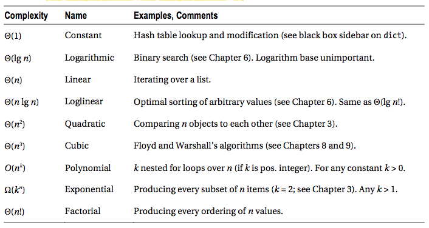


### 算法性能评估的经验

**Tip 1: If possible, don’t worry about it.**

如果暴力求解也还行就算了吧，别去担心了

**Tip 2: For timing things, use timeit.**

使用timeit模块对运行时间进行分析，在前面的数据结构篇中第三部分数据结构的list中已经介绍过了timeit模块，在使用的时候需要注意前面的运行不会影响后面的重复的运行(例如，分析排序算法运行时间，如果将前面已经排好序的序列传递给后面的重复运行是不行的)

```python
#timeit模块简单使用实例
timeit.timeit("x = sum(range(10))")
```

**Tip 3: To find bottlenecks, use a profiler.**

使用cProfile模块来获取更多的关于运行情况的内容，从而可以发现问题的瓶颈，如果系统没有cProfile模块，可以使用profile模块代替，关于这两者的更多内容可以查看[Python standard library-Python Profilers](https://docs.python.org/2/library/profile.html)

```python
#cProfile模块简单使用实例
import cProfile
import re
cProfile.run('re.compile("foo|bar")')

#运行结果：

         194 function calls (189 primitive calls) in 0.000 seconds

   Ordered by: standard name

   ncalls  tottime  percall  cumtime  percall filename:lineno(function)
        1    0.000    0.000    0.000    0.000 <string>:1(<module>)
        1    0.000    0.000    0.000    0.000 re.py:188(compile)
        1    0.000    0.000    0.000    0.000 re.py:226(_compile)
        1    0.000    0.000    0.000    0.000 sre_compile.py:178(_compile_charset)
        1    0.000    0.000    0.000    0.000 sre_compile.py:207(_optimize_charset)
...
```

**Tip 4: Plot your results.**

画出算法性能结果图，如下图所示，可以使用的模块有matplotlib

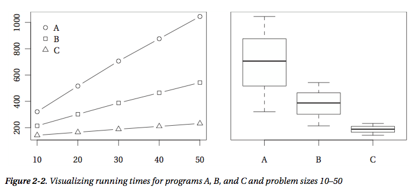

**Tip 5: Be careful when drawing conclusions based on timing comparisons.**

在对基于运行时间的比较而要下结论时需要小心

First, any differences you observe may be because of random variations.

首先，你观察到的差异可能是由于输入中的随机变化而引起的

Second, there are issues when comparing averages.

其次，比较算法的平均情况下的运行时间是存在问题的[这个我未理解，以下是作者的解释

At the very least, you should stick to comparing averages of actual timings. A common practice to get more meaningful numbers when performing timing experiments is to normalize the running time of each program, dividing it by the running time of some standard, simple algorithm. This can indeed be useful but can in some cases make your results less than meaningful. See the paper “How not to lie with statistics: The correct way to summarize benchmark results” by Fleming and Wallace for a few pointers. For some other perspectives, you could read Bast and Weber’s “Don’t compare averages,” or the more recent paper by Citron et al., “The harmonic or geometric mean: does it really matter?”

Third, your conclusions may not generalize.

最后，你下的结论不要太过于宽泛

**Tip 6: Be careful when drawing conclusions about asymptotics from experiments.**

在对从实验中得到关于渐近时间的信息下结论时需要小心，实验只是对于理论的一个支撑，可以通过实验来推翻一个渐近时间结果的假设，但是反过来一般不行 [以下是作者的解释]

If you want to say something conclusively about the asymptotic behavior of an algorithm, you need to analyze it, as described earlier in this chapter. Experiments can give you hints, but they are by their nature finite, and asymptotics deal with what happens for arbitrarily large data sizes. On the other hand, unless you’re working in theoretical computer science, the purpose of asymptotic analysis is to say something about the behavior of the algorithm when implemented and run on actual problem instances, meaning that experiments should be relevant.

### 在Python中实现树和图

Python中的dict和set

Python中很多地方都使用了hash策略，在前面的Python数据结构篇中的搜索部分已经介绍了hash的内容。Python提供了hash函数，例如hash("Hello, world!")得到-943387004357456228 (结果不一定相同)。Python中的dict和set都使用了hash机制，所以平均情况下它们获取元素都是常数时间的。

#### 图的表示

最常用的两种表示方式是邻接表和邻接矩阵 [假设要表示的图如下]

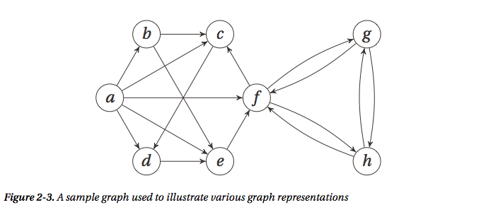

邻接表 Adjacency Lists：因为历史原因，邻接表往往都是指链表list，但实际上也可以是其他的，例如在python中也可以是set或者dict，不同的表示方式有各自的优缺点，它们判断节点的连接关系和节点的度的方式甚至两个操作的性能都不太一样。

**adjacency lists 表示形式**


```python
# A Straightforward Adjacency List Representation
a, b, c, d, e, f, g, h = range(8)
N = [
    [b, c, d, e, f],    # a
    [c, e],             # b
    [d],                # c
    [e],                # d
    [f],                # e
    [c, g, h],          # f
    [f, h],             # g
    [f, g]              # h
]

b in N[a] # Neighborhood membership -> True
len(N[f]) # Degree -> 3
```

**adjacency sets 表示形式**

```python
# A Straightforward Adjacency Set Representation
a, b, c, d, e, f, g, h = range(8)
N = [
    {b, c, d, e, f},    # a
    {c, e},             # b
    {d},                # c
    {e},                # d
    {f},                # e
    {c, g, h},          # f
    {f, h},             # g
    {f, g}              # h
]

b in N[a] # Neighborhood membership -> True
len(N[f]) # Degree -> 3
```

基本上和adjacency lists表示形式一样对吧？但是，对于list，判断一个元素是否存在是线性时间O(N(v))，而在set中是常数时间O(1)，所以对于稠密图使用adjacency sets要更加高效。

**adjacency dicts 表示形式**

```python
# A Straightforward Adjacency Dict Representation
a, b, c, d, e, f, g, h = range(8)
N = [
    {b:2, c:1, d:3, e:9, f:4},    # a
    {c:4, e:3},                   # b
    {d:8},                        # c
    {e:7},                        # d
    {f:5},                        # e
    {c:2, g:2, h:2},              # f
    {f:1, h:6},                   # g
    {f:9, g:8}                    # h
]

b in N[a] # Neighborhood membership -> True
len(N[f]) # Degree -> 3
N[a][b] # Edge weight for (a, b) -> 2
```

这种情况下如果边是带权值的都没有问题！

除了上面三种方式外，还可以改变外层数据结构，上面三个都是list，其实也可以使用dict，例如下面的代码，此时节点是用字母表示的。在实际应用中，要根据问题选择最合适的表示形式。

```pyrhon
N = {
    'a': set('bcdef'),
    'b': set('ce'),
    'c': set('d'),
    'd': set('e'),
    'e': set('f'),
    'f': set('cgh'),
    'g': set('fh'),
    'h': set('fg')
}
```

**邻接矩阵 Adjacency Matrix**

使用嵌套的list，用1和0表示点和点之间的连接关系，此时对于它们的连接性判断时间是常数，但是对于度的计算时间是线性的

```python
# An Adjacency Matrix, Implemented with Nested Lists
a, b, c, d, e, f, g, h = range(8)
N = [[0,1,1,1,1,1,0,0], # a
     [0,0,1,0,1,0,0,0], # b
     [0,0,0,1,0,0,0,0], # c
     [0,0,0,0,1,0,0,0], # d
     [0,0,0,0,0,1,0,0], # e
     [0,0,1,0,0,0,1,1], # f
     [0,0,0,0,0,1,0,1], # g
     [0,0,0,0,0,1,1,0]] # h

N[a][b] # Neighborhood membership -> 1
sum(N[f]) # Degree -> 3
```

如果边带有权值，也可以使用权值代替1，用inf代替0

```python
a, b, c, d, e, f, g, h = range(8)
_ = float('inf')

W = [[0,2,1,3,9,4,_,_], # a
     [_,0,4,_,3,_,_,_], # b
     [_,_,0,8,_,_,_,_], # c
     [_,_,_,0,7,_,_,_], # d
     [_,_,_,_,0,5,_,_], # e
     [_,_,2,_,_,0,2,2], # f
     [_,_,_,_,_,1,0,6], # g
     [_,_,_,_,_,9,8,0]] # h

W[a][b] < inf # Neighborhood membership
sum(1 for w in W[a] if w < inf) - 1  # Degree
```

NumPy：这里作者提到了一个最常用的数值计算模块NumPy，它包含了很多与多维数组计算有关的函数。我可能会在以后的机器学习中详细学习它的使用，到时候可能会写篇文章介绍它的使用

#### 树的表示

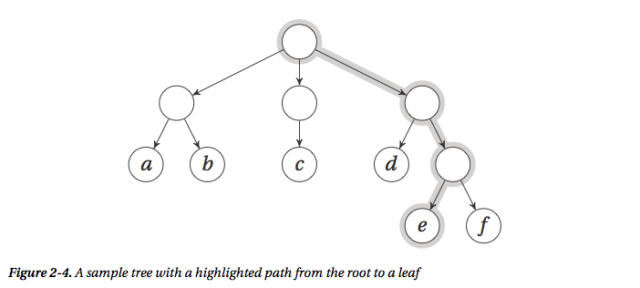

树是一种特殊的图，所以可以使用图的表示方法，但是因为树的特殊性，其实有其他更好的表示方法，最简单的就是直接用一个list即可，缺点也很明显，可读性太差了，相当不直观

```python
T = [["a", "b"], ["c"], ["d", ["e", "f"]]]
T[2][1][0]  # 'e'
```

很多时候我们都能够肯定树中节点的孩子节点个数最多有多少个(比如二叉树，三叉树等等)，所以比较方便的实现方式就是使用类class

```python
# A Binary Tree Class 二叉树实例
class Tree:
    def __init__(self, left, right):
        self.left = left
        self.right = right

t = Tree(Tree("a", "b"), Tree("c", "d"))
t.right.left  # 'c'
```

上面的实现方式的子节点都是孩子节点，但是还有一种很常用的树的表示方式，那就是“左孩子，右兄弟”表示形式，它就适用于孩子节点数目不确定的情况

```python
# 左孩子，右兄弟 表示方式
class Tree:
    def __init__(self, kids, next=None):
        self.kids = self.val = kids
        self.next = next
return Tree

t = Tree(Tree("a", Tree("b", Tree("c", Tree("d")))))
t.kids.next.next.val  # 'c'
```

[Bunch Pattern]：有意思的是，上面的实现方式使用了Python中一种常用的设计模式，叫做Bunch Pattern，貌似来自经典书籍Python Cookbook，原书介绍如下：

When prototyping (or even finalizing) data structures such as trees, it can be useful to have a flexible class that will allow you to specify arbitrary attributes in the constructor. In these cases, the “Bunch” pattern (named by Alex Martelli in the Python Cookbook) can come in handy. There are many ways of implementing it, but the gist of it is the following:

```python
class Bunch(dict):
    def __init__(self, *args, **kwds):
        super(Bunch, self).__init__(*args, **kwds)
        self.__dict__ = self
return Bunch
```

There are several useful aspects to this pattern. First, it lets you create and set arbitrary attributes by supplying them as command-line arguments:

```python
>>> x = Bunch(name="Jayne Cobb", position="Public Relations")
>>> x.name
'Jayne Cobb'
```

Second, by subclassing dict, you get lots of functionality for free, such as iterating over the keys/attributes or easily checking whether an attribute is present. Here’s an example:

```python
>>> T = Bunch
>>> t = T(left=T(left="a", right="b"), right=T(left="c"))
>>> t.left
{'right': 'b', 'left': 'a'}
>>> t.left.right
'b'
>>> t['left']['right']
'b'
>>> "left" in t.right
True
>>> "right" in t.right
False
```

This pattern isn’t useful only when building trees, of course. You could use it for any situation where you’d want a flexible object whose attributes you could set in the constructor.

#### 与图有关的python模块

+ NetworkX: http://networkx.lanl.gov
+ python-graph: http://code.google.com/p/python-graph
+ Graphine: http://gitorious.org/projects/graphine/pages/Home
+ Pygr: a graph database http://bioinfo.mbi.ucla.edu/pygr
+ Gato: a graph animation toolbox http://gato.sourceforge.net
+ PADS: a collection of graph algorithms http://www.ics.uci.edu/~eppstein/PADS

### Python编程中的一些细节

In general, the more important your program, the more you should mistrust such black boxes and seek to find out what’s going on under the cover.

作者在这里提到，如果你的程序越是重要的话，你就越是需要明白你所使用的数据结构的内部实现，甚至有些时候你要自己重新实现它。

#### Hidden Squares 隐藏的平方运行时间

有些情况下我们可能没有注意到我们的操作是非常不高效的，例如下面的代码，如果是判断某个元素是否在list中运行时间是线性的，如果是使用set，判断某个元素是否存在只需要常数时间，所以如果我们需要判断很多元素是否存在的话，使用set的性能会更加高效。

```python
from random import randrange
L = [randrange(10000) for i in range(1000)]
42 in L # False
S = set(L)
42 in S #False
```

#### The Trouble with Floats 精度带来的烦恼

现有的计算机系统都是不能精确表达小数的！[该部分内容可以阅读与计算机组成原理相关的书籍了解计算机的浮点数系统]在python中，浮点数可能带来很多的烦恼，例如，运行下面的实例，本应该是相等，但是却返回False。

	sum(0.1 for i in range(10)) == 1.0 # False

永远不要使用小数比较结果来作为两者相等的判断依据！你最多只能判断两个浮点数在有限位数上是相等的，也就是近似相等了。

```python
def almost_equal(x, y, places=7):
    return round(abs(x-y), places) == 0

almost_equal(sum(0.1 for i in range(10)), 1.0) # True
```

除此之外，可以使用一些有用的第三方模块，例如decimal，在需要处理金融数据的时候很有帮助

```python
from decimal import *
sum(Decimal("0.1") for i in range(10)) == Decimal("1.0")  # Ture
```

还有一个有用的Sage模块，如下所示，它可以进行数学的符号运算得到准确值，如果需要也可以得到近似的浮点数解。[Sage的官方网址](http://sagemath.org/)

```
sage: 3/5 * 11/7 + sqrt(5239)
13*sqrt(31) + 33/35
```

更多和Python中的浮点数有关的内容可以查看[Floating Point Arithmetic: Issues and Limitations](https://docs.python.org/2/tutorial/floatingpoint.html)

### 问题 2-12 图的表示

Consider the following graph representation: you use a dictionary and let each key be a pair (tuple) of two nodes, with the corresponding value set to the edge weight. For example W[u, v] = 42. What would be the advantages and disadvantages of this representation? Could you supplement it to mitigate the downsides?

The advantages and disadvantages depend on what you’re using it for. It works well for looking up edge weights efficiently but less well for iterating over the graph’s nodes or a node’s neighbors, for example. You could improve that part by using some extra structures (for example, a global list of nodes, if that’s what you need or a simple adjacency list structure, if that’s required).

## Chapter 3 Counting 101

> The greatest shortcoming of the human race is our inability to understand the exponential function.
> —— Dr. Albert A. Bartlett, World Population Balance Board of Advisors

原书主要介绍了一些基础数学，例如排列组合以及递归循环等，但是本节只重点介绍计算算法的运行时间的三种方法

因为本节内容都很简单，所以我只是浏览了一下，重要的只有计算算法的运行时间的三种方法：1.代换法； 2.递归树法； 3.主定理法。


### 代换法

代换法一般是先猜测解的形式，然后用数学归纳法来证明它

下面是算法导论中的一个求解例子

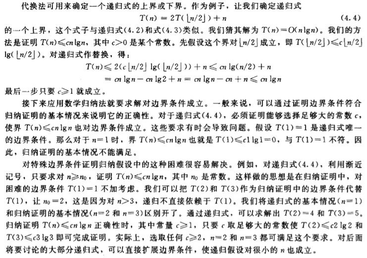

有意思的是，还有一类问题可以通过变量替换变成容易求解的形式

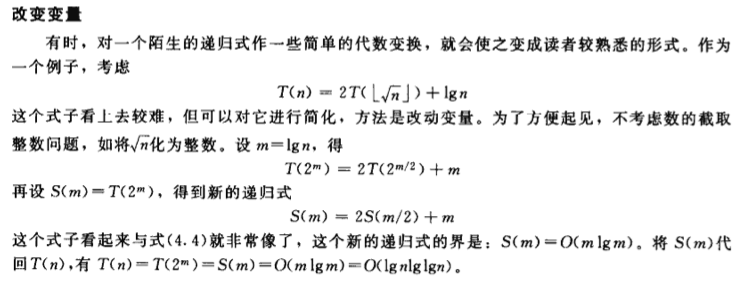

下面是常用的一些递归式以及它们对应的结果还有实际算法实例

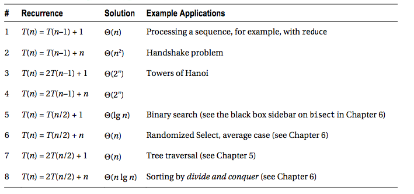

### 递归树法

这种方法就是通过画递归树，然后对每层进行求和，最后将每层的结果相加得到对总的算法运行时间的估计

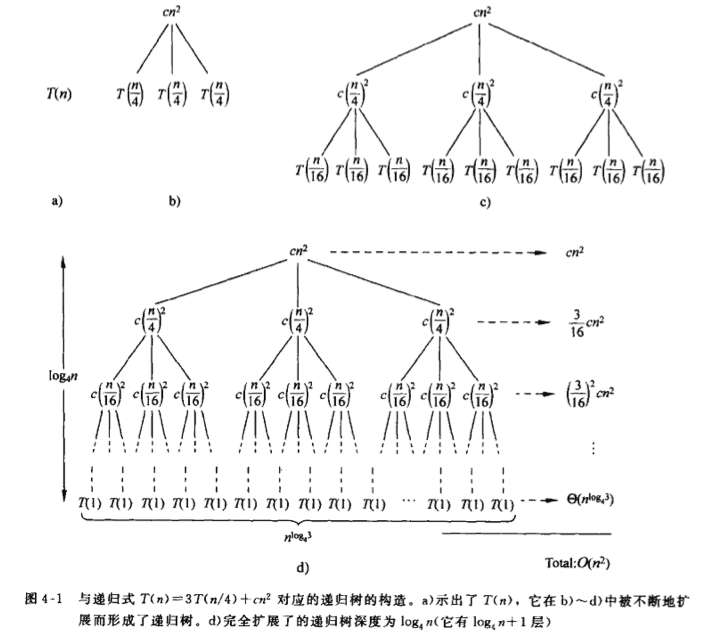

### 主定理法

这种方法大家最喜欢，给出了一种就像是公式一样的结论，虽然它没有覆盖所有的情况，而且证明非常复杂，但是很多情况下都是可以直接使用的，还有，需要注意主定理的不同情况下的条件，尤其是多项式大于和多项式小于！

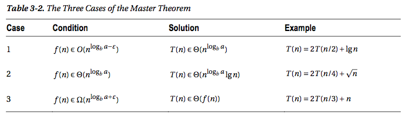

## Chapter 4 Induction and Recursion and Reduction

> You must never think of the whole street at once, understand? You must only concentrate on the next step, the next breath, the next stroke of the broom, and the next, and the next. Nothing else.
> ——Beppo Roadsweeper, in Momo by Michael Ende

注：本节中我给定下面三个重要词汇的中文翻译分别是：Induction(推导)、Recursion(递归)和Reduction(规约)

本节主要介绍算法设计的三个核心知识：Induction(推导)、Recursion(递归)和Reduction(规约)，这是原书的重点和难点部分

正如标题所示，本节主要介绍下面三部分内容：

+ Reduction means transforming one problem to another. We normally reduce an unknown problem to one we know how to solve. The reduction may involve transforming both the input (so it works with the new problem) and the output (so it’s valid for the original problem).

Reduction(规约)意味着对问题进行转换，例如将一个未知的问题转换成我们能够解决的问题，转换的过程可能涉及到对问题的输入输出的转换。[问题规约在证明一个问题是否是NP完全问题时经常用到，如果我们能够将一个问题规约成一个我们已知的NP完全问题的话，那么这个问题也是NP完全问题]

下面给幅图你就能够明白了，实际上很多时候我们遇到一个问题时都是找一个我们已知的类似的能够解决的问题，然后将这个我们新问题A规约到那个已知的问题B，中间经过一些输入输出的转换，我们就能够解决新问题A了。

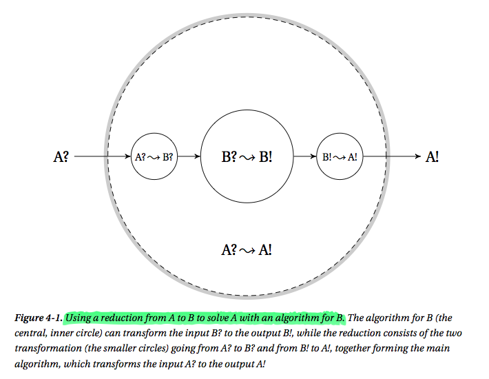

+ Induction (or, mathematical induction) is used to show that a statement is true for a large class of objects (often the natural numbers). We do this by first showing it to be true for a base case (such as the number 1) and then showing that it “carries over” from one object to the next (if it’s true for n –1, then it’s true for n).

Induction(推导)是一个数学意义上的推导，类似数学归纳法，主要是用来证明某个命题是正确的。首先我们证明对于基础情况(例如在k=1时)是正确的，然后证明该命题递推下去都是正确的(一般假设当k=n-1时是正确的，然后证明当k=n时也是正确的即可)

+ Recursion is what happens when a function calls itself. Here we need to make sure the function works correctly for a (nonrecursive) base case and that it combines results from the recursive calls into a valid solution.

Recursion(递归)经常发生于一个函数调用自身的情况。递归函数说起来简单，但是实现不太容易，我们要确保对于基础情况(不递归的情况)能够正常工作，此外，对于递归情况能够将递归调用的结果组合起来得到一个有效的结果。

以上三个核心有很多相似点，比如它们都专注于求出目标解的某一步，我们只需要仔细思考这一步，剩下的就能够自动完成了。如果我们更加仔细地去理解它们，我们会发现，Induction(推导)和Recursion(递归)其实彼此相互对应，也就是说一个Induction能够写出一个相应的Recursion，而一个Recursion也正好对应着一个Induction式子，也可以换个方式理解，Induction是从n-1到n的推导，而Recursion是从n到n-1的递归(下面有附图可以帮助理解)。此外，Induction和Recursion其实都是某种Reduction，即Induction和Recursion的本质就是对问题进行规约！为了能够对问题使用Induction或者说Recursion，Reduction一般是将一个问题变成另一个只是规模减小了的相同问题。

你也许会觉得奇怪，不对啊，刚才不是说Reduction是将一个问题规约成另一个问题吗？现在怎么又说成是将一个问题变成另一个只是规模减小了的相同问题了？其实，Reduction是有两种的，上面的两种都是Reduction！还记得前面介绍过的递归树吗？那其实就是将规模较大的问题转换成几个规模较小的问题，而且问题的形式并没有改变，这就是一种Reduction。你可以理解这种情况下Reduction是降维的含义，也就类似机器学习中的Dimension Reduction，对高维数据进行降维了，问题保持不变。

These are two major variations of reductions: reducing to a different problem and reducing to a shrunken version of the same.

再看下下面这幅图理解Induction和Recursion之间的关系

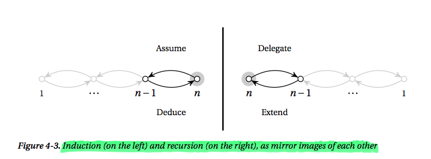

关于它们三个的关系的原文阐述：Induction and recursion are, in a sense, mirror images of one another, and both can be seen as examples of reduction. To use induction (or recursion), the reduction must (generally) be between instances of the same problem of different sizes.

看了原书你会觉得，作者介绍算法的方式很特别，作者有提到他的灵感来自哪里：In fact, much of the material was inspired by Udi Manber’s wonderful paper “Using induction to design algorithms” from 1988 and his book from the following year, Introduction to Algorithms: A Creative Approach.

也许你还感觉很晕，慢慢地看了后面的例子你就明白了。在介绍例子之前呢，先看下递归和迭代的异同，这个很重要，在后面介绍动态规划算法时我们还会反复提到它们的异同。

Induction is what you use to show that recursion is correct, and recursion is a very direct way of implementing most inductive algorithm ideas. However, rewriting the algorithm to be iterative can avoid the overhead and limitations of recursive functions in most (nonfunctional) programming languages.

有了Induction和Recursion，我们很容易就可以将一个inductive idea采用递归(recursion)的方式实现，根据我们的编程经验(事实也是如此)，任何一个递归方式的实现都可以改成非递归方式(即迭代方式)实现(反之亦然)，而且非递归方式要好些，为什么呢？因为非递归版本相对来讲运行速度更快，因为没有用栈去实现，也避免了栈溢出的情况，python中对栈深度是有限制的。

举个例子，下面是一段遍历序列的代码，如果大小设置为100没有问题，如果设置为1000就会报RuntimeError的错误，提示超出了最大的递归深度。

```python
def trav(seq, i=0):
    if i == len(seq): return
    #print seq[i]
    trav(seq, i + 1)

trav(range(1000)) # RuntimeError: maximum recursion depth exceeded
```

所以呢，很多时候虽然递归的思路更好想，代码也更好写，但是迭代的代码更加高效一些，在动态规划中还可以看到迭代版本还有其他的优点，当然，它还有些缺点，比如要考虑迭代的顺序

下面我们通过排序来梳理下我们前面介绍的三个核心内容

我们如何对排序问题进行reduce呢？很显然，有很多种方式，假如我们将原问题reduce成两个规模为原来一半的子问题，我们就得到了合并排序(这个我们以后还会详细介绍)；假如我们每次只是reduce一个元素，比如假设前n-1个元素都排好序了，那么我们只需要将第n个元素插入到前面的序列即可，这样我们就得到了插入排序；再比如，假设我们找到其中最大的元素然后将它让在位置n上，一直这么下去我们就得到了选择排序；继续思考下去，假设我们找到某个元素(比如第k大的元素)，然后将它放在位置k上，一直这么下去我们就得到了快速排序(这个我们以后还会详细介绍)。怎么样？我们前面学过的排序经过这么一些reduce基本上都很清晰了对吧？

下面通过代码来体会下插入排序和选择排序的两个不同版本

递归版本的插入排序

```python
def ins_sort_rec(seq, i):
    if i == 0: return  # Base case -- do nothing
    ins_sort_rec(seq, i - 1)  # Sort 0..i-1
    j = i  # Start "walking" down
    while j > 0 and seq[j - 1] > seq[j]:  # Look for OK spot
        seq[j - 1], seq[j] = seq[j], seq[j - 1]  # Keep moving seq[j] down
        j -= 1  # Decrement j

from random import randrange
seq = [randrange(1000) for i in range(100)]
ins_sort_rec(seq, len(seq)-1)
```

改成迭代版本的插入排序如下

```python
def ins_sort(seq):
    for i in range(1, len(seq)):  # 0..i-1 sorted so far
        j = i  # Start "walking" down
        while j > 0 and seq[j - 1] > seq[j]:  # Look for OK spot
            seq[j - 1], seq[j] = seq[j], seq[j - 1]  # Keep moving seq[j] down
            j -= 1  # Decrement j

seq2 = [randrange(1000) for i in range(100)]
ins_sort(seq2)
```

你会发现，两个版本差不多，但是递归版本中list的size不能太大，否则就会栈溢出，而迭代版本不会有问题，还有一个区别就是方法参数，一般来说递归版本的参数都会多些

递归版本和迭代版本的选择排序

```python
def sel_sort_rec(seq, i):
    if i == 0: return  # Base case -- do nothing
    max_j = i  # Idx. of largest value so far
    for j in range(i):  # Look for a larger value
        if seq[j] > seq[max_j]: max_j = j  # Found one? Update max_j
    seq[i], seq[max_j] = seq[max_j], seq[i]  # Switch largest into place
    sel_sort_rec(seq, i - 1)  # Sort 0..i-1

seq = [randrange(1000) for i in range(100)]
sel_sort_rec(seq, len(seq)-1)

def sel_sort(seq):
    for i in range(len(seq) - 1, 0, -1):  # n..i+1 sorted so far
        max_j = i  # Idx. of largest value so far
        for j in range(i):  # Look for a larger value
            if seq[j] > seq[max_j]: max_j = j  # Found one? Update max_j
        seq[i], seq[max_j] = seq[max_j], seq[i]  # Switch largest into place

seq2 = [randrange(1000) for i in range(100)]
sel_sort(seq2)
```

下面我们来看个例子，这是一个经典的“名人问题”，我们要从人群中找到那个名人，所有人都认识名人，而名人则任何人都不认识。

这个问题的一个变种就是从一系列有依赖关系的集合中找到那个依赖关系最开始的元素，比如多线程环境下的线程依赖问题，后面将要介绍的拓扑排序是解决这类问题更实际的解法。A more down-to-earth version of the same problem would be examining a set of dependencies and trying to find a place to start. For example, you might have threads in a multithreaded application waiting for each other, with even some cyclical dependencies (so-called deadlocks), and you’re looking for one thread that isn’t waiting for any of the others but that all of the others are dependent on.

在进一步分析之前我们可以发现，很显然，我们可以暴力求解下，G[u][v]为True表示 u 认识 v。

```python
def naive_celeb(G):
    n = len(G)
    for u in range(n):  # For every candidate...
        for v in range(n):  # For everyone else...
            if u == v: continue  # Same person? Skip.
            if G[u][v]: break  # Candidate knows other
            if not G[v][u]: break  # Other doesn't know candidate
        else:
            return u  # No breaks? Celebrity!
    return None  # Couldn't find anyone
```

用下面代码进行测试，得到正确结果57

```python
from random import *
n = 100
G = [[randrange(2) for i in range(n)] for i in range(n)]
c = 57 # For testing
for i in range(n):
    G[i][c] = True
    G[c][i] = False

print naive_celeb(G) #57
```

上面的暴力求解其实可以看做是一个reduce，每次reduce一个人，确定他是否是名人，显然这样做并不高效。那么，对于名人问题我们还可以怎么reduce呢？假设我们还是将规模为n的问题reduce成规模为n-1的问题，那么我们要找到一个非名人(u)，也就是找到一个人(u)，他要么认识其他某个人(v)，要么某个人(v)不认识他，也就是说，对于任何G[u][v]，如果G[u][v]为True，那么消去u；如果G[u][v]为False，那么消去v，这样就可以明显加快查找的速度！

基于上面的想法就有了下面的python实现，第二个for循环是用来验证我们得到的结果是否正确(因为如果我们保证有一个名人的话那么结果肯定正确，但是如果不能保证的话，那么结果就要进行验证)

```python
def celeb(G):
    n = len(G)
    u, v = 0, 1  # The first two
    for c in range(2, n + 1):  # Others to check
        if G[u][v]:
            u = c  # u knows v? Replace u
        else:
            v = c  # Otherwise, replace v
    if u == n:
        c = v  # u was replaced last; use v
    else:
        c = u  # Otherwise, u is a candidate
    for v in range(n):  # For everyone else...
        if c == v: continue  # Same person? Skip.
        if G[c][v]: break  # Candidate knows other
        if not G[v][c]: break  # Other doesn't know candidate
    else:
        return c  # No breaks? Celebrity!
    return None  # Couldn't find anyone
```

看起来还不错吧，我们将一个O(n2)的暴力解法变成了一个O(n)的快速解法。

看书看到这里时，我想起了另一个看起来很相似的问题，从n个元素中找出最大值和最小值。如果我们单独地来查找最大值和最小值，共需要(2n-2)次比较(也许你觉得还可以少几次，但都还是和2n差不多对吧)，但是，如果我们成对来处理，首先比较第一个元素和第二个元素，较大的那个作为当前最大值，较小的那个作为当前最小值(如果n是奇数的话，为了方便可以直接令第一个元素既是最大值又是最小值)，然后向后移动，每次取两个元素出来先比较，较小的那个去和当前最小值比较，较大的那个去和当前最大值比较，这样的策略至多需要 3⌊n/2⌋ 次比较。两个问题虽然完全没关系，但是解决方式总有那么点千丝万缕有木有？

接下来我们看另一个更加重要的例子，拓扑排序，这是图中很重要的一个算法，在后面介绍到图算法的时候我们还会提到拓扑排序的另一个解法，它的应用范围也非常广，除了前面的依赖关系例子外，还有一个最突出的例子就是类Linux系统中软件的安装，每当我们在终端安装一个软件或者库时，它会自动检测它所依赖的那些部件(components)是否安装了，如果没有那么就先安装那些依赖项。

下图是一个有向无环图(DAG)和它对应的拓扑排序结果

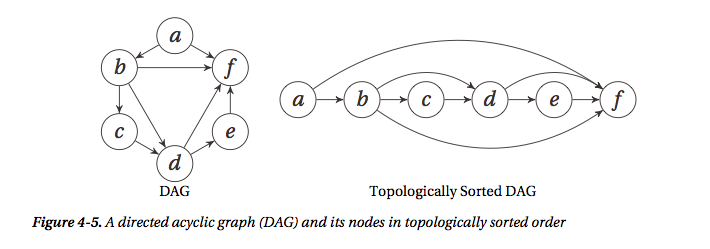

拓扑排序这个问题怎么进行reduce呢？和前面一样，我们最直接的想法可能还是reduce one element，即去掉一个节点，先解决剩下的(n-1)个节点的拓扑排序问题，然后将这个去掉的节点插入到合适的位置，这个想法的实现非常类似前面的插入排序，插入的这个节点(也就是前面去掉的节点)的位置是在前面所有对它有依赖的节点之后。

```python
def naive_topsort(G, S=None):
    if S is None: S = set(G)  # Default: All nodes
    if len(S) == 1: return list(S)  # Base case, single node
    v = S.pop()  # Reduction: Remove a node
    seq = naive_topsort(G, S)  # Recursion (assumption), n-1
    min_i = 0
    for i, u in enumerate(seq):
        if v in G[u]: min_i = i + 1  # After all dependencies
    seq.insert(min_i, v)
    return seq

G = {'a': set('bf'), 'b': set('cdf'),'c': set('d'), 'd': set('ef'), 'e': set('f'), 'f': set()}
print naive_topsort(G) # ['a', 'b', 'c', 'd', 'e', 'f']
```

上面这个算法是平方时间的，还有没有其他的reduction策略呢？前面的解法类似插入排序，既然又是reduce一个元素，很显然我们可以试试类似选择排序的策略，也就是说，我们找到一个节点，然后把它放在第一个位置上(后面有道练习题思考如果是放在最后一个位置上怎么办)，假设我们直接就是将这个节点去掉会怎样呢？如果剩下的图还是一个DAG的话我们就将原来的问题规约成了一个相似但是规模更小的问题对不对？但是问题是我们选择哪个节点会使得剩下的图还是一个DAG呢？很显然，如果一个节点的入度为0，也就是说没有任何其他的节点依赖于它，那么它肯定可以直接安全地删除掉对不对？！

基于上面的思路就有了下面的解法，每次从图中删除一个入度为0的节点

```python
def topsort(G):
    count = dict((u, 0) for u in G)  # The in-degree for each node
    for u in G:
        for v in G[u]:
            count[v] += 1  # Count every in-edge
    Q = [u for u in G if count[u] == 0]  # Valid initial nodes
    S = []  # The result
    while Q:  # While we have start nodes...
        u = Q.pop()  # Pick one
        S.append(u)  # Use it as first of the rest
        for v in G[u]:
            count[v] -= 1  # "Uncount" its out-edges
            if count[v] == 0:  # New valid start nodes?
                Q.append(v)  # Deal with them next
    return S
```

扩展知识：有意思的是，拓扑排序还和Python Method Resolution Order 有关，也就是用来确定某个方法是应该调用该实例的还是该实例的父类的还是继续往上调用祖先类的对应方法。对于单继承的语言这个很容易，顺着继承链一直往上找就行了，但是对于Python这类多重继承的语言则不简单，它需要更加复杂的策略，Python中使用了C3 Method Resolution Order

本章后面作者提到了一些其他的内容

(1) Strong Assumptions

主要对于Induction，为了更加准确方便地从n-1递推到n，常常需要对问题做很强的假设。

(2) Invariants and Correctness

循环不变式，这在算法导论上有详细介绍，循环不变式是用来证明某个算法是正确的一种方式，主要有下面三个步骤：

1. Use induction to show that it is, in fact, true after each iteration.
2.  Show that we’ll get the correct answer if the algorithm terminates.
3.  Show that the algorithm terminates.

(3) Relaxation and Gradual Improvement

松弛技术是指某个算法使得当前得到的解有进一步的提升，越来越接近最优解(准确解)，这个技术非常实用，每次松弛可以看作是向最终解前进了“一步”，我们的目标自然是希望松弛的次数越少越好，关键就是要确定松弛的顺序(好的松弛顺序可以让我们直接朝着最优解前进，缩短算法运行时间)，后面要介绍的图中的Bellman-Ford算法、Dijkstra算法以及DAG图上的最短路径问题都是如此。

(4) Reduction + Contraposition = Hardness Proof

规约是用于证明一个问题是否是一个很难的问题的好方式，假设我们能够将问题A规约至问题B，如果问题B很简单，那么问题A肯定也很简单。逆反一下我们就得到，如果问题A很难，那么问题B就也很难。比如，我们知道了哈密顿回路问题是NP完全问题，要证明哈密顿路径问题也是NP完全问题，就可以将哈密顿回路问题规约为哈密顿路径问题。

[这里作者并没有过多的提到问题A规约至问题B的复杂度，算法导论中有提到，作者可能隐藏了规约的复杂度不大的含义，比如说多项式时间内能够完成，也就是下面的fast readuction]

“fast + fast = fast.” 的含义是：fast readuction + fast solution to B = fast solution to A

两条重要的规约经验：

+ If you can (easily) reduce A to B, then B is at least as hard as A.
+ If you want to show that X is hard and you know that Y is hard, reduce Y to X.

(5) Problem Solving Advice

作者提供的解决一个问题的建议：

1.Make sure you really understand the problem.

搞明白你要解决的问题

What is the input? The output? What’s the precise relationship between the two? Try to represent the problem instances as familiar structures, such as sequences or graphs. A direct, brute-force solution can sometimes help clarify exactly what the problem is.

2.Look for a reduction.

寻找一个规约方式

Can you transform the input so it works as input for another problem that you can solve? Can you transform the resulting output so that you can use it? Can you reduce an instance if size n to an instance of size k < n and extend the recursive solution (inductive hypothesis) back to n?

3.Are there extra assumptions you can exploit?

还有其他的重要的假设条件吗，有时候我们如果只考虑该问题的特殊情况的话没准能够有所收获

Integers in a fixed value range can be sorted more efficiently than arbitrary values. Finding the shortest path in a DAG is easier than in an arbitrary graph, and using only non-negative edge weights is often easier than arbitrary edge weights.

### 问题 4-18 随机生成DAG图

Write a function for generating random DAGs. Write an automatic test that checks that topsort gives a valid orderings, using your DAG generator.

You could generate DAGs by, for example, randomly ordering the nodes, and add a random number of forward-pointing edges to each of them.

### 问题 4-19 修改拓扑排序

Redesign topsort so it selects the last node in each iteration, rather than the first.

This is quite similar to the original. You now have to maintain the out-degrees of the remaining nodes, and insert each node before the ones you have already found. (Remember not to insert anything in the beginning of a list, though; rather, append, and then reverse it at the end, to avoid a quadratic running time.)

[注意是使用append然后reverse，而不要使用insert]

## Chapter 5 Traversal

> You are in a narrow hallway. This continues for several metres and ends in a doorway. Halfway along the passage you can see an archway where some steps lead downwards. Will you go forwards to the door (turn to 5), or creep down the steps (turn to 344)?
> ——Steve Jackson, Citadel of Chaos

本节主要介绍图的遍历算法BFS和DFS，以及寻找图的(强)连通分量的算法

Traversal就是遍历，主要是对图的遍历，也就是遍历图中的每个节点。对一个节点的遍历有两个阶段，首先是发现(discover)，然后是访问(visit)。遍历的重要性自然不必说，图中有几个算法和遍历没有关系？！

算法导论对于发现和访问区别的非常明显，对图的算法讲解地特别好，在遍历节点的时候给节点标注它的发现节点时间d[v]和结束访问时间f[v]，然后由这些时间的一些规律得到了不少实用的定理，本节后面介绍了部分内容，感兴趣不妨阅读下算法导论原书

图的连通分量是图的一个最大子图，在这个子图中任何两个节点之间都是相互可达的(忽略边的方向)。我们本节的重点就是想想怎么找到一个图的连通分量呢？

一个很明显的想法是，我们从一个顶点出发，沿着边一直走，慢慢地扩大子图，直到子图不能再扩大了停止，我们就得到了一个连通分量对吧，我们怎么确定我们真的是找到了一个完整的连通分量呢？可以看下作者给出的解释，类似上节的Induction，我们思考从 i-1 到 i 的过程，只要我们保证增加了这个节点后子图仍然是连通的就对了。

Let’s look at the following related problem. Show that you can order the nodes in a connected graph, V1, V2, … Vn, so that for any i = 1…n, the subgraph over V1, … , Vi is connected. If we can show this and we can figure out how to do the ordering, we can go through all the nodes in a connected component and know when they’re all used up.

How do we do this? Thinking inductively, we need to get from i -1 to i. We know that the subgraph over the i -1 first nodes is connected. What next? Well, because there are paths between any pair of nodes, consider a node u in the first i -1 nodes and a node v in the remainder. On the path from u to v, consider the last node that is in the component we’ve built so far, as well as the first node outside it. Let’s call them x and y. Clearly there must be an edge between them, so adding y to the nodes of our growing component keeps it connected, and we’ve shown what we set out to show.

经过上面的一番思考，我们就知道了如何找连通分量：从一个顶点开始，沿着它的边找到其他的节点(或者说站在这个节点上看，看能够发现哪些节点)，然后就是不断地向已有的连通分量中添加节点，使得连通分量内部依然满足连通性质。如果我们按照上面的思路一直做下去，我们就得到了一棵树，一棵遍历树，它也是我们遍历的分量的一棵生成树。在具体实现这个算法时，我们要记录“边缘节点”，也就是那些和已得到的连通分量中的节点相连的节点，它们就像是一个个待办事项(to-do list)一样，而前面加入的节点就是标记为已完成的(checked off)待办事项。

这里作者举了一个很有意思的例子，一个角色扮演的游戏，如下图所示，我们可以将房间看作是节点，将房间的门看作是节点之间的边，走过的轨迹就是遍历树。这么看的话，房间就分成了三种：(1)我们已经经过的房间；(2)我们已经经过的房间附近的房间，也就是马上可以进入的房间；(3)“黑屋”，我们甚至都不知道它们是否存在，存在的话也不知道在哪里。

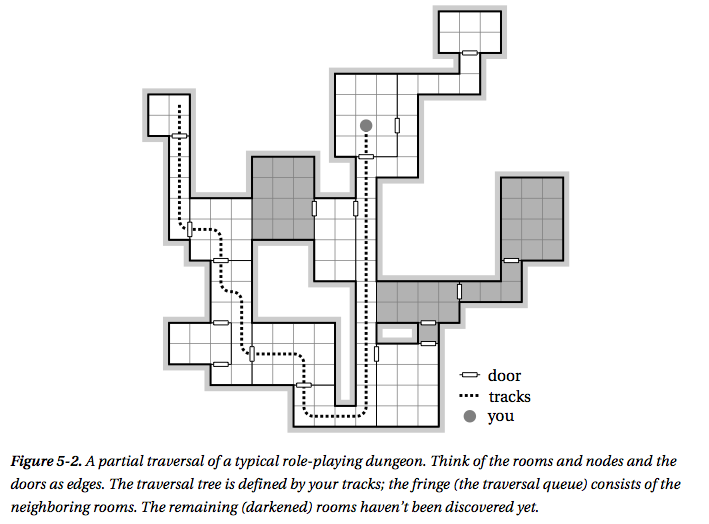

根据上面的分析可以写出下面的遍历函数walk，其中参数S暂时没有用，它在后面求强连通分量时需要，表示的是一个“禁区”(forbidden zone)，也就是不要去访问这些节点。

注意下面的difference函数的使用，参数可以是多个，也就是说调用后返回的集合中的元素在各个参数中都不存在，此外，参数也不一定是set，也可以是dict或者list，只要是可迭代的(iterables)即可。

```python
# Walking Through a Connected Component of a Graph Represented Using Adjacency Sets
def walk(G, s, S=set()):                        # Walk the graph from node s
    P, Q = dict(), set()                        # Predecessors + "to do" queue
    P[s] = None                                 # s has no predecessor
    Q.add(s)                                    # We plan on starting with s
    while Q:                                    # Still nodes to visit
        u = Q.pop()                             # Pick one, arbitrarily
        for v in G[u].difference(P, S):         # New nodes?
            Q.add(v)                            # We plan to visit them!
            P[v] = u                            # Remember where we came from
    return P                                    # The traversal tree
```

我们可以用下面代码来测试下，得到的结果没有问题

```python
def some_graph():
    a, b, c, d, e, f, g, h = range(8)
    N = [
        [b, c, d, e, f],    # a
        [c, e],             # b
        [d],                # c
        [e],                # d
        [f],                # e
        [c, g, h],          # f
        [f, h],             # g
        [f, g]              # h
    ]
    return N

G = some_graph()
for i in range(len(G)): G[i] = set(G[i])
print list(walk(G,0)) #[0, 1, 2, 3, 4, 5, 6, 7]
```

上面的walk函数只适用于无向图，而且只能找到一个从参数s出发的连通分量，要想得到全部的连通分量需要修改下

```python
def components(G):                              # The connected components
    comp = []
    seen = set()                                # Nodes we've already seen
    for u in G:                                 # Try every starting point
        if u in seen: continue                  # Seen? Ignore it
        C = walk(G, u)                          # Traverse component
        seen.update(C)                          # Add keys of C to seen
        comp.append(C)                          # Collect the components
    return comp
```

用下面的代码来测试下，得到的结果没有问题

```python
G = {
    0: set([1, 2]),
    1: set([0, 2]),
    2: set([0, 1]),
    3: set([4, 5]),
    4: set([3, 5]),
    5: set([3, 4])
    }

print [list(sorted(C)) for C in components(G)]  #[[0, 1, 2], [3, 4, 5]]
```

至此我们就完成了一个时间复杂度为Θ(E+V)的求无向图的连通分量的算法，因为每条边和每个顶点都要访问一次。[这个时间复杂度会经常看到，例如拓扑排序，强连通分量都是它

接下来作者作为扩展介绍了欧拉回路和哈密顿回路：前者是经过图中的所有边一次，然后回到起点；后者是经过图中的所有顶点一次，然后回到起点。网上资料甚多，感兴趣自行了解

下面我们看下迷宫问题，如下图所示，原始问题是一个人在公园中走路，结果走不出来了，即使是按照“左手准则”(也就是但凡遇到交叉口一直向左转)走下去，如果走着走着回到了原来的起点，那么就会陷入无限的循环中！有意思的是，左边的迷宫可以通过“左手准则”转换成右边的树型结构。

Here the “keep one hand on the wall” strategy will work nicely. One way of seeing why it works is to observe that the maze really has only one inner wall (or, to put it another way, if you put wallpaper inside it, you could use one continuous strip). Look at the outer square. As long as you’re not allowed to create cycles, any obstacles you draw have to be connected to the it in exactly one place, and this doesn’t create any problems for the left-hand rule. Following this traversal strategy, you’ll discover all nodes and walk every passage twice (once in either direction).

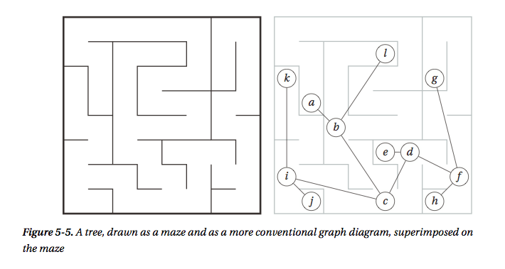

上面的迷宫实际上就是为了引出深度优先搜索(DFS)，每次到了一个交叉口的时候，可能我们可以向左走，也可以向右走，选择是有不少，但是我们要向一直走下去的话就只能选择其中的一个方向，如果我们发现这个方向走不出去的话，我们就回溯回来，选择一个刚才没选过的方向继续尝试下去。

基于上面的想法可以写出下面递归版本的DFS

```python
def rec_dfs(G, s, S=None):
    if S is None: S = set()                     # Initialize the history
    S.add(s)                                    # We've visited s
    for u in G[s]:                              # Explore neighbors
        if u in S: continue                     # Already visited: Skip
        rec_dfs(G, u, S)                        # New: Explore recursively
    return S # For testing

G = some_graph()
for i in range(len(G)): G[i] = set(G[i])
print list(rec_dfs(G, 0))   #[0, 1, 2, 3, 4, 5, 6, 7]
```

很自然的我们想到要将递归版本改成迭代版本的，下面的代码中使用了Python中的yield关键字，具体的用法可以[看下这里IBM Developer Works](http://www.ibm.com/developerworks/cn/opensource/os-cn-python-yield/index.html)

```python
def iter_dfs(G, s):
    S, Q = set(), []                            # Visited-set and queue
    Q.append(s)                                 # We plan on visiting s
    while Q:                                    # Planned nodes left?
        u = Q.pop()                             # Get one
        if u in S: continue                     # Already visited? Skip it
        S.add(u)                                # We've visited it now
        Q.extend(G[u])                          # Schedule all neighbors
        yield u                                 # Report u as visited

G = some_graph()
for i in range(len(G)): G[i] = set(G[i])
print list(iter_dfs(G, 0))  #[0, 5, 7, 6, 2, 3, 4, 1]
```

上面迭代版本经过一点点的修改可以得到更加通用的遍历函数

```python
def traverse(G, s, qtype=set):
    S, Q = set(), qtype()
    Q.add(s)
    while Q:
        u = Q.pop()
        if u in S: continue
        S.add(u)
        for v in G[u]:
            Q.add(v)
        yield u
```

函数traverse中的参数qtype表示队列类型，例如栈stack，下面的代码给出了如何自定义一个stack，以及测试traverse函数

```python
class stack(list):
    add = list.append

G = some_graph()
print list(traverse(G, 0, stack)) #[0, 5, 7, 6, 2, 3, 4, 1]
```

如果还不清楚的话可以看下算法导论中的这幅DFS示例图，节点的颜色后面有介绍

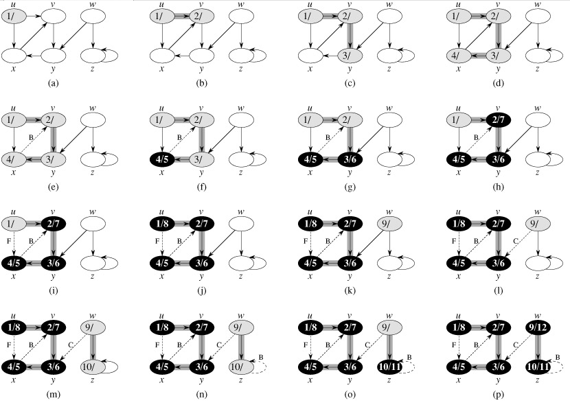

上图在DFS时给节点加上了时间戳，这有什么作用呢？

前面提到过，在遍历节点的时候如果给节点标注它的发现节点时间d[v]和结束访问时间f[v]的话，从这些时间我们就能够发现一些信息，比如下图，(a)是图的一个DFS遍历加上时间戳后的结果；(b)是如果给每个节点的d[v]到f[v]区间加上一个括号的话，可以看出在DFS遍历中(也就是后来的深度优先树/森林)中所有的节点 u 的后继节点 v 的区间都在节点 u 的区间内部，如果节点 v 不是节点 u 的后继，那么两个节点的区间不相交，这就是“括号定理”。

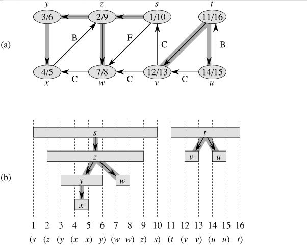

加上时间戳的DFS遍历还算比较好写对吧

```python
#Depth-First Search with Timestamps
def dfs(G, s, d, f, S=None, t=0):
    if S is None: S = set()                     # Initialize the history
    d[s] = t; t += 1                            # Set discover time
    S.add(s)                                    # We've visited s
    for u in G[s]:                              # Explore neighbors
        if u in S: continue                     # Already visited. Skip
        t = dfs(G, u, d, f, S, t)               # Recurse; update timestamp
    f[s] = t; t += 1                            # Set finish time
    return t                                    # Return timestamp
```

除了给节点加上时间戳之外，算法导论在介绍DFS的时候还给节点进行着色，在节点被发现之前是白色的，在发现之后先是灰色的，在结束访问之后才是黑色的，详细的流程可以参考上面给出的算法导论中的那幅DFS示例图。有了颜色有什么用呢？作用大着呢！根据节点的颜色，我们可以对边进行分类！大致可以分为下面四种：

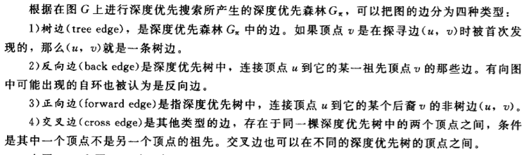

使用DFS对图进行遍历时，对于每条边(u,v)，当该边第一次被发现时，根据到达节点 v 的颜色来对边进行分类(正向边和交叉边不做细分)：

1. 白色表示该边是一条树边；
2. 灰色表示该边是一条反向边；
3. 黑色表示该边是一条正向边或者交叉边。

下图显示了上面介绍括号定理用时的那个图的深度优先树中的所有边的类型，灰色标记的边是深度优先树的树边


那对边进行分类有什么作用呢？作用多着呢！最常见的作用的是判断一个有向图是否存在环，如果对有向图进行DFS遍历发现了反向边，那么一定存在环，反之没有环。此外，对于无向图，如果对它进行DFS遍历，肯定不会出现正向边或者交叉边。

那对节点标注时间戳有什么用呢？其实，除了可以发现上面提到的那些很重要的性质之外，时间戳对于接下来要介绍的拓扑排序的另一种解法和强连通分量很重要！

我们先看下摘自算法导论的这幅拓扑排序示例图，这是某个教授早上起来后要做的事情，嘿嘿

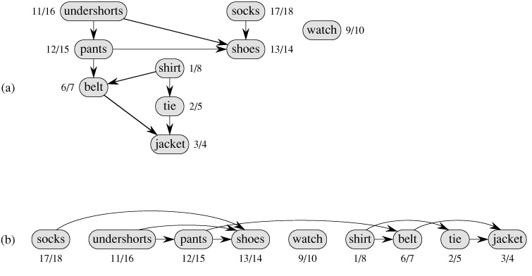

不难发现，最终得到的拓扑排序刚好是节点的完成时间f[v]降序排列的！结合前面的括号定理以及依赖关系不难理解，如果我们按照节点的f[v]降序排列，我们就得到了我们想要的拓扑排序了！这就是拓扑排序的另一个解法！[在算法导论中该解法是主要介绍的解法，而我们前面提到的那个解法是在算法导论的习题中出现的]

基于上面的想法就能够得到下面的实现代码，函数recurse是一个内部函数，这样它就可以访问到G和res等变量

```python
#Topological Sorting Based on Depth-First Search
def dfs_topsort(G):
    S, res = set(), []                          # History and result
    def recurse(u):                             # Traversal subroutine
        if u in S: return                       # Ignore visited nodes
        S.add(u)                                # Otherwise: Add to history
        for v in G[u]:
            recurse(v)                          # Recurse through neighbors
        res.append(u)                           # Finished with u: Append it
    for u in G:
        recurse(u)                              # Cover entire graph
    res.reverse()                               # It's all backward so far
    return res

G = {'a': set('bf'), 'b': set('cdf'), 'c': set('d'), 'd': set('ef'), 'e': set('f'), 'f': set()}
print dfs_topsort(G)
```

如果我们在遍历图时“一层一层”式地遍历，先发现的节点先访问，那么我们就得到了广度优先搜索(BFS)。下面是作者给出的一个有意思的区别BFS和DFS的例子，遍历过程就像我们上网一样，DFS是顺着网页上的链接一个个点下去，当访问完了这个网页时就点击Back回退到上一个网页继续访问。而BFS是先在后台打开当前网页上的所有链接，然后按照打开的顺序一个个访问，访问完了一个网页就把它的窗口关闭。

One way of visualizing BFS and DFS is as browsing the Web. DFS is what you get if you keep following links and then use the Back button once you’re done with a page. The backtracking is a bit like an “undo.” BFS is more like opening every link in a new window (or tab) behind those you already have and then closing the windows as you finish with each page.

BFS的代码很好实现，主要是使用队列

```python
#Breadth-First Search
from collections import deque

def bfs(G, s):
    P, Q = {s: None}, deque([s])                # Parents and FIFO queue
    while Q:
        u = Q.popleft()                         # Constant-time for deque
        for v in G[u]:
            if v in P: continue                 # Already has parent
            P[v] = u                            # Reached from u: u is parent
            Q.append(v)
    return P

G = some_graph()
print bfs(G, 0)
```

Python的list可以很好地充当stack，但是充当queue则性能很差，函数bfs中使用的是collections模块中的deque，即双端队列(double-ended queue)，它一般是使用链表来实现的，这个类有extend、append和pop等方法都是作用于队列右端的，而方法extendleft、appendleft和popleft等方法都是作用于队列左端的，它的内部实现是非常高效的。

Internally, the deque is implemented as a doubly linked list of blocks, each of which is an array of individual elements. Although asymptotically equivalent to using a linked list of individual elements, this reduces overhead and makes it more efficient in practice. For example, the expression d[k] would require traversing the first k elements of the deque d if it were a plain list. If each block contains b elements, you would only have to traverse k//b blocks.

最后我们看下强连通分量，前面的分量是不考虑边的方向的，如果我们考虑边的方向，而且得到的最大子图中，任何两个节点都能够沿着边可达，那么这就是一个强连通分量。

下图是算法导论中的示例图，(a)是对图进行DFS遍历带时间戳的结果；(b)是上图的的转置，也就是将上图中所有边的指向反转过来得到的图；(c)是最终得到的强连通分支图，每个节点内部显示了该分支内的节点。

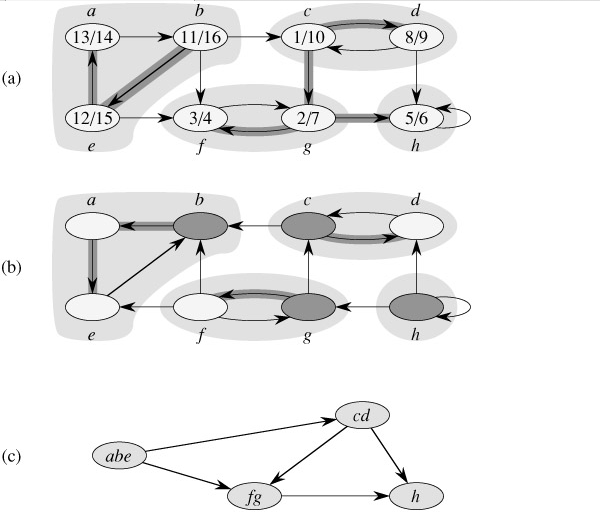

上面的示例图自然不太好明白到底怎么得到的，我们慢慢来分析三幅图

先看图(a)，每个灰色区域都是一个强连通分支，我们想想，如果强连通分支 X 内部有一条边指向另一个强连通分支 Y，那么强连通分支 Y 内部肯定不存在一条边指向另一个强连通分支 Y，否则它们能够整合在一起形成一个新的更大气的强连通分支！这也就是说强连通分支图肯定是一个有向无环图！我们从图(c)也可以看出来

再看看图(c)，强连通分支之间的指向，如果我们定义每个分支内的任何顶点的最晚的完成时间为对应分支的完成时间的话，那么分支abe的完成时间是16，分支cd是10，分支fg是7，分支h是6，不难发现，分支之间边的指向都是从完成时间大的指向完成时间小的，换句话说，总是由完成时间晚的强连通分支指向完成时间早的强连通分支！

最后再看看图(b)，该图是原图的转置，但是得到强连通分支是一样的(强连通分支图是会变的，刚好又是原来分支图的转置)，那为什么要将边反转呢？结合前面两个图的分析，既然强连通分支图是有向无环图，而且总是由完成时间晚的强连通分支指向完成时间早的强连通分支，如果我们将边反转，虽然我们得到的强连通分支不变，但是分支之间的指向变了，完成时间晚的就不再指向完成时间早的了！这样的话如果我们对它进行拓扑排序，即按照完成时间的降序再次进行DFS时，我们就能够得到一个个的强连通分支了对不对？因为每次得到的强连通分支都没有办法指向其他分支了，也就是确定了一个强连通分支之后就停止了。[试试画个图得到图(b)的强连通分支图的拓扑排序结果就明白了]

1. 对原图G运行DFS，得到每个节点的完成时间f[v]；
2. 得到原图的转置图GT；
3. 对GT运行DFS，主循环按照节点的f[v]降序进行访问；
4. 输出深度优先森林中的每棵树，也就是一个强连通分支。

根据上面的思路可以得到下面的强连通分支算法实现，其中的函数parse_graph是作者用来方便构造图的函数

```python
def tr(G):                                      # Transpose (rev. edges of) G
    GT = {}
    for u in G: GT[u] = set()                   # Get all the nodes in there
    for u in G:
        for v in G[u]:
            GT[v].add(u)                        # Add all reverse edges
    return GT

def scc(G):
    GT = tr(G)                                  # Get the transposed graph
    sccs, seen = [], set()
    for u in dfs_topsort(G):                    # DFS starting points
        if u in seen: continue                  # Ignore covered nodes
        C = walk(GT, u, seen)                   # Don't go "backward" (seen)
        seen.update(C)                          # We've now seen C
        sccs.append(C)                          # Another SCC found
    return sccs

from string import ascii_lowercase
def parse_graph(s):
    # print zip(ascii_lowercase, s.split("/"))
    # [('a', 'bc'), ('b', 'die'), ('c', 'd'), ('d', 'ah'), ('e', 'f'), ('f', 'g'), ('g', 'eh'), ('h', 'i'), ('i', 'h')]
    G = {}
    for u, line in zip(ascii_lowercase, s.split("/")):
        G[u] = set(line)
    return G

G = parse_graph('bc/die/d/ah/f/g/eh/i/h')
print list(map(list, scc(G)))
#[['a', 'c', 'b', 'd'], ['e', 'g', 'f'], ['i', 'h']]
```

最后作者提到了一点如何进行更加高效的搜索，也就是通过分支限界来实现对搜索树的剪枝，具体使用可以看下这个问题顶点覆盖问题Vertext Cover Problem

### 问题 5.17 强连通分支

In Kosaraju’s algorithm, we find starting nodes for the final traversal by descending finish times from an initial DFS, and we perform the traversal in the transposed graph (that is, with all edges reversed). Why couldn’t we just use ascending finish times in the original graph?

问题就是说，我们干嘛要对转置图按照完成时间降序遍历一次呢？干嘛不直接在原图上按照完成时间升序遍历一次呢？

Try finding a simple example where this would give the wrong answer. (You can do it with a really small graph.)

## Chapter 6 Divide and Combine and Conquer

Divide and rule, a sound motto; Unite and lead, a better one.
——Johann Wolfgang von Goethe, Gedichte

本节主要介绍分治法策略，提到了树形问题的平衡性以及基于分治策略的排序算法

本节的标题写全了就是：divide the problem instance, solve subproblems recursively, combine the results, and thereby conquer the problem

简言之就是将原问题划分成几个小问题，然后递归地解决这些小问题，最后综合它们的解得到问题的解。分治法的思想我想大家都已经很清楚了，所以我就不过多地介绍它了，下面摘录些原书中的重点内容。

### 平衡性是树形问题的关键

如果我们将子问题看做节点，将问题之间的依赖关系(dependencies or reductions)看做边，那么我们就得到了子问题图(subproblem graph )，最简单的子问题图就是树形结构问题，例如我们之前提到过的递归树的形式。也许子问题之间有依赖关系，但是对于每个子问题我们都是可以独立求解的，根据我们前面学的内容，只要我们能够找到合适的规约，我们就可以直接使用递归形式的算法将这个问题解决。[至于子问题间有重叠的话我们后面会详细介绍动态规划的方法来解决这类问题，这里我们不考虑]

前面我们学的内容已经完全足够我们理解分治法了，第3节的Divide-and-conquer recurrences，第4节的Strong induction，还有第5节的Recursive traversal

The recurrences tell you something about the performance involved, the induction gives you a tool for understanding how the algorithms work, and the recursive traversal (DFS in trees) is a raw skeleton for the algorithms.

但是，我们前面介绍Induction时总是从 n-1 到 n，这节我们要考虑平衡性，我们希望从 n/2 到 n，也就是说我们假设我们能够解决规模为原问题一半的子问题。

假设对于同一个问题，我们有下面两个解决方案，哪个方案更好些呢？

1. T(n)=T(n-1)+T(1)+n
2. T(n)=2T(n/2)+n

如果从时间复杂度来评价的话，前者是O(n^2 )的，而后者是O(nlgn)的，所以是后者更好些。下图以递归树的形式显示了两种方案的不同

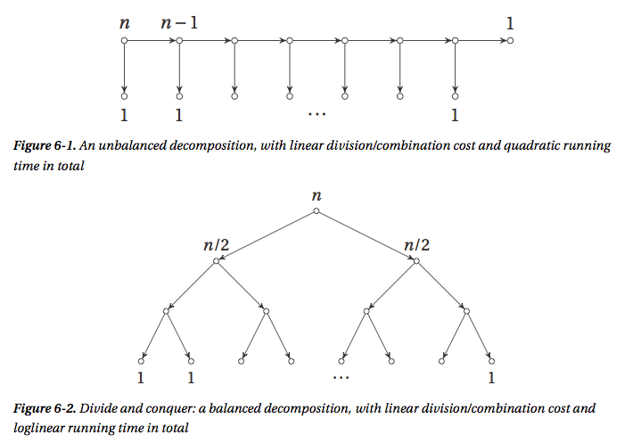

### 典型的分治法

下面是典型分治法的伪代码，很容易理解对吧

```python
# Pseudocode(ish)
def divide_and_conquer(S, divide, combine):
    if len(S) == 1: return S
    L, R = divide(S)
    A = divide_and_conquer(L, divide, combine)
    B = divide_and_conquer(R, divide, combine)
    return combine(A, B)
```

用图形来表示如下，上面部分是分(division)，下面部分是合(combination)

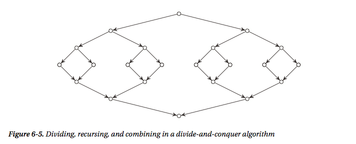

二分查找是最常用的采用分治策略的算法，我们经常使用的版本控制系统(evision control systems=RCSs)查找代码中发生某个变化是在哪个版本时采用的正是二分查找策略。

Python中bisect模块也正是利用了二分查找策略，其中方法bisect的作用是返回要找到元素的位置，bisect_left是其左边的那个位置，而bisect_right和bisect的作用是一样的，函数insort也是这样设计的。

```python
from bisect import bisect
a = [0, 2, 3, 5, 6, 7, 8, 8, 9]
print bisect(a, 5) #4
from bisect import bisect_left, bisect_right
print bisect_left(a, 5) #3
print bisect_right(a, 5) #4
```

二分查找策略很好，但是它有个前提，序列必须是有序的才可以这样做，为了高效地得到中间位置的元素，于是就有了二叉搜索树，这个我们在数据结构篇中已经详细介绍过了，下面给出一份完整的二叉搜索树的实现，不过多介绍了。

```python
class Node:
    lft = None
    rgt = None
    def __init__(self, key, val):
        self.key = key
        self.val = val

def insert(node, key, val):
    if node is None: return Node(key, val)      # Empty leaf: Add node here
    if node.key == key: node.val = val          # Found key: Replace val
    elif key < node.key:                        # Less than the key?
        node.lft = insert(node.lft, key, val)   # Go left
    else:                                       # Otherwise...
        node.rgt = insert(node.rgt, key, val)   # Go right
    return node

def search(node, key):
    if node is None: raise KeyError             # Empty leaf: It's not here
    if node.key == key: return node.val         # Found key: Return val
    elif key < node.key:                        # Less than the key?
        return search(node.lft, key)            # Go left
    else:                                       # Otherwise...
        return search(node.rgt, key)            # Go right

class Tree:                                     # Simple wrapper
    root = None
    def __setitem__(self, key, val):
        self.root = insert(self.root, key, val)
    def __getitem__(self, key):
        return search(self.root, key)
    def __contains__(self, key):
        try: search(self.root, key)
        except KeyError: return False
        return True
```

比较：二分法，二叉搜索树，字典

三者都是用来提高搜索效率的，但是各有区别。二分法只能作用于有序数组(例如排序后的Python的list)，但是有序数组较难维护，因为插入需要线性时间；二叉搜索树有些复杂，动态变化着，但是插入和删除效率高了些；字典的效率相比而言就比较好了，插入删除操作的平均时间都是常数的，只不过它还需要计算下hash值才能确定元素的位置。

### 顺序统计量

在算法导论中一组序列中的第 k 大的元素定义为顺序统计量

如果我们想要在线性时间内找到一组序列中的前 k 大的元素怎么做呢？很显然，如果这组序列中的数字范围比较大的话，我们就不能使用线性排序算法，而其他的基于比较的排序算法的最好的平均时间复杂度(O(nlgn))都超过了线性时间，怎么办呢？

扩展知识：在Python中如果需要求前 k 小或者前 k 大的元素，可以使用heapq模块中的nsmallest或者nlargest函数，如果 k 很小的话这种方式会好些，但是如果 k 很大的话，不如直接去调用sort函数

要想解决这个问题，我们还是要用分治法，采用类似快排中的partition将序列进行划分(divide)，也就是说找一个主元(pivot)，然后用主元作为基准将序列分成两部分，一部分小于主元，另一半大于主元，比较下主元最终的位置值和 k的大小关系，然后确定后面在哪个部分继续进行划分。如果这里不理解的话请移步阅读前面数据结构篇之排序中的快速排序

基于上面的想法就有了下面的实现，需要注意的是下面的partition函数不是就地划分的哟

```python
#A Straightforward Implementation of Partition and Select
def partition(seq):
    pi, seq = seq[0], seq[1:]                   # Pick and remove the pivot
    lo = [x for x in seq if x <= pi]            # All the small elements
    hi = [x for x in seq if x > pi]             # All the large ones
    return lo, pi, hi                           # pi is "in the right place"

def select(seq, k):
    lo, pi, hi = partition(seq)                 # [<= pi], pi, [> pi]
    m = len(lo)
    if m == k: return pi                        # We found the kth smallest
    elif m < k:                                 # Too far to the left
        return select(hi, k-m-1)                # Remember to adjust k
    else:                                       # Too far to the right
        return select(lo, k)                    # Just use original k here

seq = [3, 4, 1, 6, 3, 7, 9, 13, 93, 0, 100, 1, 2, 2, 3, 3, 2]
print partition(seq) #([1, 3, 0, 1, 2, 2, 3, 3, 2], 3, [4, 6, 7, 9, 13, 93, 100])
print select([5, 3, 2, 7, 1], 3) #5
print select([5, 3, 2, 7, 1], 4) #7
ans = [select(seq, k) for k in range(len(seq))]
seq.sort()
print ans == seq #True
```

细读上面的代码发现主元默认就是第一个元素，你也许会想这么选科学吗？事实证明这种随机选择的期望运行时间的确是线性的，但是如果每次都选择的不好，导致划分的时候每次都特别不平衡将会导致运行时间变成平方时间，那有没有什么选主元的办法能够保证算法的运行时间是线性的？的确有！但是比较麻烦，实际使用的并不多，感兴趣可以看下面的内容

It turns out guaranteeing that the pivot is even a small percentage into the sequence (that is, not at either end, or a constant number of steps from it) is enough for the running time to be linear. In 1973, a group of algorists (Blum, Floyd, Pratt, Rivest, and Tarjan) came up with a version of the algorithm that gives exactly this kind of guarantee.

The algorithm is a bit involved, but the core idea is simple enough: first divide the sequence into groups of five (or some other small constant). Find the median in each, using (for example) a simple sorting algorithm. So far, we’ve used only linear time. Now, find the median among these medians, using the linear selection algorithm recursively. (This will work, because the number of medians is smaller than the size of the original sequence—still a bit mind-bending.) The resulting value is a pivot that is guaranteed to be good enough to avoid the degenerate recursion—use it as a pivot in your selection.

In other words, the algorithm is used recursively in two ways: first, on the sequence of medians, to find a good pivot, and second, on the original sequence, using this pivot.

While the algorithm is important to know about for theoretical reasons (because it means selection can be done in guaranteed linear time), you’ll probably never actually use it in practice.

### 二分排序

前面我们介绍了二分查找，下面看看如何进行二分排序，这里不再详细介绍快排和合并排序的思想了，如果不理解的话请移步阅读前面数据结构篇之排序

利用前面的partition函数快排代码呼之欲出

```python
def quicksort(seq):
    if len(seq) <= 1: return seq                # Base case
    lo, pi, hi = partition(seq)                 # pi is in its place
    return quicksort(lo) + [pi] + quicksort(hi) # Sort lo and hi separately

seq = [7, 5, 0, 6, 3, 4, 1, 9, 8, 2]
print quicksort(seq) #[0, 1, 2, 3, 4, 5, 6, 7, 8, 9]
```

合并排序是更加典型的采用分治法策略来进行的排序，注意后半部分是比较谁大然后调用append函数，最后reverse一下，因为如果是比较谁小的话就要调用insert函数，它的效率不如append

```python
# Mergesort, repeated from Chapter 3 (with some modifications)
def mergesort(seq):
    mid = len(seq)//2                           # Midpoint for division
    lft, rgt = seq[:mid], seq[mid:]
    if len(lft) > 1: lft = mergesort(lft)       # Sort by halves
    if len(rgt) > 1: rgt = mergesort(rgt)
    res = []
    while lft and rgt:                          # Neither half is empty
        if lft[-1] >= rgt[-1]:                  # lft has greatest last value
            res.append(lft.pop())               # Append it
        else:                                   # rgt has greatest last value
            res.append(rgt.pop())               # Append it
    res.reverse()                               # Result is backward
    return (lft or rgt) + res                   # Also add the remainder
```

### 问题 6-2 三分查找

Binary search divides the sequence into two approximately equal parts in each recursive step. Consider ternary search, which divides the sequence into three parts. What would its asymptotic complexity be? What can you say about the number of comparisons in binary and ternary search?

题目就是说让我们分析下三分查找的时间复杂度，和二分查找进行下对比

The asymptotic running time would be the same. The number of comparison goes up, however. To see this, consider the recurrences B(n) = B(n/2) + 1 and T(n) = T(n/3) + 2 for binary and ternary search, respectively (with base cases B(1) = T(1) = 0 and B(2) = T(2) = 1). You can show (by induction) that B(n) < lg n + 1 < T(n).


## Chapter 7 Greedy

> It’s not a question of enough, pal.
> ——Gordon Gekko, Wall Street

本节主要通过几个例子来介绍贪心策略，主要包括背包问题、哈夫曼编码和最小生成树

贪心算法顾名思义就是每次都贪心地选择当前最好的那个(局部最优解)，不去考虑以后的情况，而且选择了就不能够“反悔”了，如果原问题满足贪心选择性质和最优子结构，那么最后得到的解就是最优解。贪心算法和其他的算法比较有明显的区别，动态规划每次都是综合所有子问题的解得到当前的最优解(全局最优解)，而不是贪心地选择；回溯法是尝试选择一条路，如果选择错了的话可以“反悔”，也就是回过头来重新选择其他的试试。

这个算法想必大家也都很熟悉了，我觉得贪心法总是比较容易想到，但是很难证明它是正确的，所有对于一类问题，条件稍有不同也许就不能使用贪心策略了。

### 匹配问题 matching problem (maximum-weight matching problem)

问题是这样的，有一群人打算一起跳探戈，跳之前要进行分组，一个男人和一个女人成为一组，而且任意一个异性组合都会一个相应的匹配值(compatibility)，目标是求使得匹配值之和达到最大的分组方式。

To be on the safe side, just let me emphasize that this greedy solution would not work in general, with an arbitrary set of weights. The distinct powers of two are key here.

一般情况下，如果匹配值是任意值的话，这个问题使用贪心法是不行的！但是如果匹配值都是2的整数幂的话，那么贪心法就能解决这个问题了

In this case (or the bipartite case, for that matter), greed won’t work in general. However, by some freak coincidence, all the compatibility numbers happen to be distinct powers of two. Now, what happens?

Let’s first consider what a greedy algorithm would look like here and then see why it yields an optimal result. We’ll be building a solution piece by piece—let the pieces be pairs and a partial solution be a set of pairs. Such a partial solution is valid only if no person in it participates in two (or more) of its pairs. The algorithm will then be roughly as follows:

1. List potential pairs, sorted by decreasing compatibility.
2. Pick the first unused pair from the list.
3. Is anyone in the pair already occupied? If so, discard it; otherwise, use it.
4. Are there any more pairs on the list? If so, go to 2.

As you’ll see later, this is rather similar to Kruskal’s algorithm for minimum spanning trees (although that works regardless of the edge weights). It also is a rather prototypical greedy algorithm. Its correctness is another matter. Using distinct powers of two is sort of cheating, because it would make virtually any greedy algorithm work; that is, you’d get an optimal result as long as you could get a valid solution at all. Even though it’s cheating (see Exercise 7-3), it illustrates the central idea here: making the greedy choice is safe. Using the most compatible of the remaining couples will always be at least as good as any other choice.

贪心解决的思路大致如下：首先列举出所有可能的组合，然后将它们按照匹配值进行降序排序，接着按顺序从中选择前面没有使用过而且人物没有在前面出现过的组合，遍历完整个序列就得到了匹配值之和最大的分组方式。

原书关于稳定婚姻的扩展知识 EAGER SUITORS AND STABLE MARRIAGES

There is, in fact, one classical matching problem that can be solved (sort of) greedily: the stable marriage problem. The idea is that each person in a group has preferences about whom he or she would like to marry. We’d like to see everyone married, and we’d like the marriages to be stable, meaning that there is no man who prefers a woman outside his marriage who also prefers him. (To keep things simple, we disregard same-sex marriages and polygamy here.)

There’s a simple algorithm for solving this problem, designed by David Gale and Lloyd Shapley. The formulation is quite gender-conservative but will certainly also work if the gender roles are reversed. The algorithm runs for a number of rounds, until there are no unengaged men left. Each round consists of two steps:

1. Each unengaged man proposes to his favorite of the women he has not yet asked.
2. Each woman is (provisionally) engaged to her favorite suitor and rejects the rest.

This can be viewed as greedy in that we consider only the available favorites (both of the men and women) right now. You might object that it’s only sort of greedy in that we don’t lock in and go straight for marriage; the women are allowed to break their engagement if a more interesting suitor comes along. Even so, once a man has been rejected, he has been rejected for good, which means that we’re guaranteed progress.

To show that this is an optimal and correct algorithm, we need to know that everyone gets married and that the marriages are stable. Once a woman is engaged, she stays engaged (although she may replace her fiancé). There is no way we can get stuck with an unmarried pair, because at some point the man would have proposed to the woman, and she would have (provisionally) accepted his proposal.

How do we know the marriages are stable? Let’s say Scarlett and Stuart are both married but not to each other. Is it possible they secretly prefer each other to their current spouses? No: if so, Stuart would already have proposed to her. If she accepted that proposal, she must later have found someone she liked better; if she rejected it, she would already have a preferable mate.

Although this problem may seem silly and trivial, it is not. For example, it is used for admission to some colleges and to allocate medical students to hospital jobs. There have, in fact, been written entire books (such as those by Donald Knuth and by Dan Gusfield and Robert W. Irwing) devoted to the problem and its variations.

### 背包问题

这个问题大家很熟悉了，而且该问题的变种很多，常见的有整数背包和部分背包问题。问题大致是这样的，假设现在我们要装一些物品到一个书包里，每样物品都有一定的重量w和价值v，但是呢，这个书包承重量有限，所以我们要进行决策，如何选择物品才能使得最终的价值最大呢？整数背包是说一个物品要么拿要么不拿，比如茶杯或者台灯等等，而部分背包问题是说一个物品你可以拿其中的一部分，比如一袋子苹果放不下可以只装半袋子苹果。[更加复杂的版本是说每个物品都有一定的体积，同时书包还有体积的限制等等]

很显然，部分背包问题是可以用贪心法来求解的，我们计算每个物品的单位重量的价值，然后将它们降序排序，接着开始拿物品，只要装得下全部的该类物品那么就全装进去，如果不能全部装下就装部分进去直到书包载重量满了为止，这种策略肯定是正确的。

但是，整数背包问题就不能用贪心策略了。整数背包问题还可以分成两种：一种是每类物品数量都是有限的(bounded)，比如只有3个茶杯和2个台灯；还有一种是数量无限的(unbounded)，也就是你想要多少有多少，这两种都不能使用贪心策略。0-1背包问题是典型的第一种整数背包问题，看下算法导论上的这个例子就明白了，在(b)中，虽然物品1单位重量的价值最大，但是任何包含物品1的选择都没有超过选择物品2和物品3得到的最优解220；而( c )中能达到最大的价值是240。

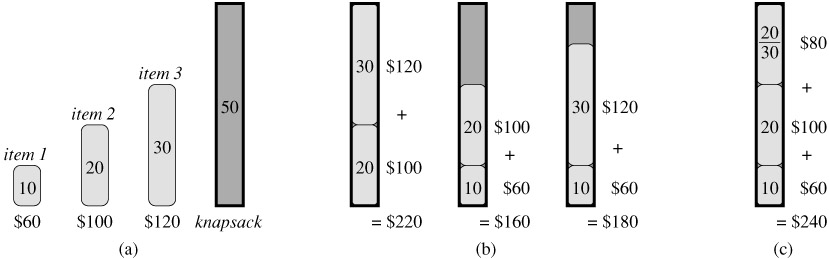

整数背包问题还没有能够在多项式时间内解决它的算法，下一节我们介绍的动态规划能够解决0-1背包问题，但是是一个伪多项式时间复杂度。[实际时间复杂度是O(nw)，n是物品数目，w是书包载重量，严格意义上说这不是一个多项式时间复杂度]

There are two important cases of the integer knapsack problem—the bounded and unbounded cases. The bounded case assumes we have a fixed number of objects in each category,4 and the unbounded case lets us use as many as we want. Sadly, greed won’t work in either case. In fact, these are both unsolved problems, in the sense that no polynomial algorithms are known to solve them. There is hope, however. As you’ll see in the next chapter, we can use dynamic programming to solve the problems in pseudopolynomial time, which may be good enough in many important cases. Also, for the unbounded case, it turns out that the greedy approach ain’t half bad! Or, rather, it’s at least half good, meaning that we’ll never get less than half the optimum value. And with a slight modification, you can get as good results for the bounded version, too. This concept of greedy approximation is discussed in more detail in Chapter 11.

### 哈夫曼编码

这个问题原始是用来实现一个可变长度的编码问题，但可以总结成这样一个问题，假设我们有很多的叶子节点，每个节点都有一个权值w(可以是任何有意义的数值，比如它出现的概率)，我们要用这些叶子节点构造一棵树，那么每个叶子节点就有一个深度d，我们的目标是使得所有叶子节点的权值与深度的乘积之和 $\Sigma w{i}d{i}$ 最小。

很自然的一个想法就是，对于权值大的叶子节点我们让它的深度小些(更加靠近根节点)，权值小的让它的深度相对大些，这样的话我们自然就会想着每次取当前权值最小的两个节点将它们组合出一个父节点，一直这样组合下去直到只有一个节点即根节点为止。如下图所示的示例

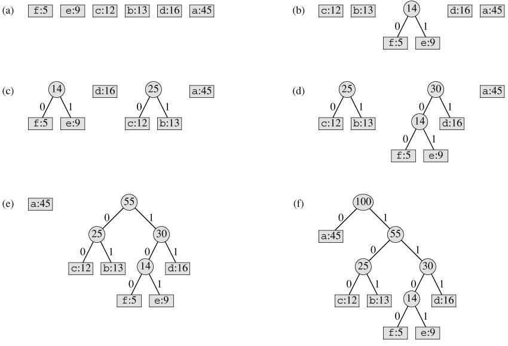

代码实现比较简单，使用了heapq模块，树结构是用list来保存的，有意思的是其中zip函数的使用，其中统计函数count作为zip函数的参数，详情见python docs

```python
from heapq import heapify, heappush, heappop
from itertools import count

def huffman(seq, frq):
    num = count()
    trees = list(zip(frq, num, seq))            # num ensures valid ordering
    heapify(trees)                              # A min-heap based on freq
    while len(trees) > 1:                       # Until all are combined
        fa, _, a = heappop(trees)               # Get the two smallest trees
        fb, _, b = heappop(trees)
        n = next(num)
        heappush(trees, (fa+fb, n, [a, b]))     # Combine and re-add them
    # print trees
    return trees[0][-1]

seq = "abcdefghi"
frq = [4, 5, 6, 9, 11, 12, 15, 16, 20]
print huffman(seq, frq)
# [['i', [['a', 'b'], 'e']], [['f', 'g'], [['c', 'd'], 'h']]]
```

现在我们考虑另外一个问题，合并文件问题，假设我们将大小为 m 和大小为 n 的两个文件合并在一起需要 m+n 的时间，现在给定一些文件，求一个最优的合并策略使得所需要的时间最小。

如果我们将上面哈夫曼树中的叶子节点看成是文件，两个文件合并得到的大文件就是树中的内部节点，假设每个节点上都有一个值表示该文件的大小，合并得到的大文件上的值是合并的两个文件的值之和，那我们的目标是就是使得内部节点的和最小的合并方案，因为叶子节点的大小是固定的，所以实际上也就是使得所有节点的和最小的合并方案！

consider how each leaf contributes to the sum over all nodes: the leaf weight occurs as a summand once in each of its ancestor nodes—which means that the sum is exactly the same! That is, sum(weight(node) for node in nodes) is exactly the same as sum(depth(leaf)*weight(leaf) for leaf in leaves).

细想也就有了一个叶子节点的所有祖先节点们都有一份该叶子节点的值包含在里面，也就是说所有叶子节点的深度与它的值的乘积之和就是所有节点的值之和！可以看下下面的示例图，最终我们知道哈夫曼树就是这个问题的解决方案。

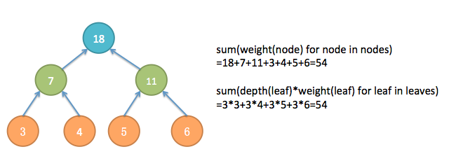

哈夫曼树问题的一个扩展就是最优二叉搜索树问题，后者可以用动态规划算法来求解，感兴趣的话可以阅读算法导论中动态规划部分内容

### 最小生成树

最小生成树是图中的重要算法，主要有两个大家耳熟能详的Kruskal和Prim算法，两个算法都是基于贪心策略，不过略有不同。

[如果对最小生成树问题的历史感兴趣的话作者推荐看这篇论文“On the History of the Minimum Spanning Tree Problem,” by Graham and Hell]

不了解Kruskal或者Prim算法的童鞋可以参考算法导论的示例图理解下面的内容

Kruskal算法


Prim 算法

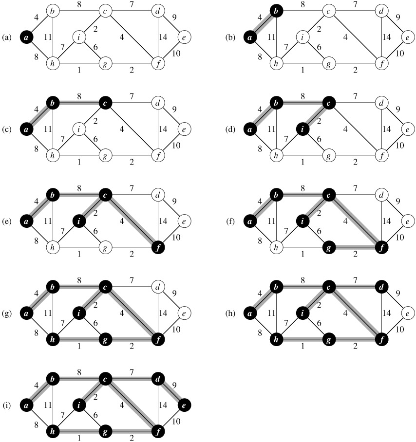

连通无向图G的生成树是指包含它所有顶点但是部分边的子图，假设每条边都有一个权值，那么权值之和最小的生成树就是最小生成树，它不一定是唯一的。如果图G是非连通的，那么它就没有生成树。

前面我们在介绍遍历的时候也得到过生成树，那里我们是一个顶点一个顶点进行遍历，下面我们通过每次添加一条边来得到最小生成树，而且每次我们贪心地选择剩下的边中权值最小的那条边，但是要保证不能形成环！

那怎么判断是否会出现环呢？

假设我们要考虑是否添加边(u,v)，一个最直接的想法就是遍历已生成的树，看是否能够从 u 到 v，如果能，那么就舍弃这条边继续考虑后面的边，否则就添加这条边。很显然，采用遍历的方式太费时了。

再假设我们用一个集合来保存我们已经生成的树中的节点，如果我们要考虑是否添加边(u,v)，那么我们就看下集合中这两个节点是否都存在，如果都存在的话说明这条边加进来的话会形成环。这么做可以在常数时间内确定是否会形成环，但是…它是错误的！除非我们每次添加一条边之后得到的局部解一直都只有一棵树才对，如果之前加入的节点 u 和节点 v 在不同的分支上的话，上面的判断不能确定添加这条边之后会形成环！[后面的Prim算法采用的策略就能保证局部解一直都是一棵树]

下面我们可以试着让每个加入的节点都知道自己处在哪个分支上，而且我们可以用分支中的某一个节点作为该分支的“代表”，该分支中的所有节点都指向这个“代表”，显然我们接下来会遇到分支合并的问题。如果两个分支因为某条边的加入而连通了，那么它们就要合并了，那怎么合并呢？我们让两个分支中的所有节点都指向同一个“代表”就行了，但是这是一个线性时间的操作，我们可以做得更快！假设我们改变下策略，让每个节点指向另一个节点(这个节点不一定是分支的“代表”)，如果我们顺着指向链一直找，就肯定能找到“代表”，因为“代表”是自己指向自己的。这样的话，如果两个分支要合并，只需要让其中的一个分支的“代表”指向另一个分支的“代表”就行啦！这就是一个常数时间的操作。

基于上面的思路我们就有了下面的实现

```python
#A Naïve Implementation of Kruskal’s Algorithm
def naive_find(C, u):                           # Find component rep.
    while C[u] != u:                            # Rep. would point to itself
        u = C[u]
    return u

def naive_union(C, u, v):
    u = naive_find(C, u)                        # Find both reps
    v = naive_find(C, v)
    C[u] = v                                    # Make one refer to the other

def naive_kruskal(G):
    E = [(G[u][v],u,v) for u in G for v in G[u]]
    T = set()                                   # Empty partial solution
    C = {u:u for u in G}                        # Component reps
    for _, u, v in sorted(E):                   # Edges, sorted by weight
        if naive_find(C, u) != naive_find(C, v):
            T.add((u, v))                       # Different reps? Use it!
            naive_union(C, u, v)                # Combine components
    return T

G = {
    0: {1:1, 2:3, 3:4},
    1: {2:5},
    2: {3:2},
    3: set()
    }
print list(naive_kruskal(G)) #[(0, 1), (2, 3), (0, 2)]
```

从上面的分析我们可以看到，虽然合并时修改指向的操作是常数时间的，但是通过指向链的方式找到“代表”所花的时间是线性的，而这里还可以做些改进。

首先，在合并(union)的时候我们让“小”分支指向“大”分支，这样平衡了之后平均查找时间肯定有所下降，那么怎么确定分支的“大小”呢？这个可以用平衡树的方式来思考，假设我们给每个节点都设置一个权重(rank or weight)，其实重要的还是“代表”的权重，如果要合并的两个分支的“代表”的权重相等的话，在将“小”分支指向“大”分支之后，还要将“大”分支的权重加1。

其次，在查找(find)的时候我们一边查找一边修正经过的点的指向，让它直接指向“代表”，这个怎么做到呢？使用递归就行了，因为递归在找到了之后会回溯，回溯的时候就可以设置其他节点的“代表”了，这个叫做path compression技术，是Kruskal算法常用的一个技巧。

基于上面的改进就有了下面优化的Kruskal算法

```python
#Kruskal’s Algorithm
def find(C, u):
    if C[u] != u:
        C[u] = find(C, C[u])                    # Path compression
    return C[u]

def union(C, R, u, v):
    u, v = find(C, u), find(C, v)
    if R[u] > R[v]:                             # Union by rank
        C[v] = u
    else:
        C[u] = v
    if R[u] == R[v]:                            # A tie: Move v up a level
        R[v] += 1

def kruskal(G):
    E = [(G[u][v],u,v) for u in G for v in G[u]]
    T = set()
    C, R = {u:u for u in G}, {u:0 for u in G}   # Comp. reps and ranks
    for _, u, v in sorted(E):
        if find(C, u) != find(C, v):
            T.add((u, v))
            union(C, R, u, v)
    return T

G = {
    0: {1:1, 2:3, 3:4},
    1: {2:5},
    2: {3:2},
    3: set()
    }
print list(kruskal(G)) #[(0, 1), (2, 3), (0, 2)]
```

接下来就是Prim算法了，它其实就是我们前面介绍的traversal算法中的一种，不同点是它对待办事项(to-do list，即前面提到的“边缘节点”，也就是我们已经包含的这些节点能够直接到达的那些节点)进行了一定的排序，我们在实现BFS时使用的是双端队列deque，此时我们只要把它改成一个优先队列(priority queue)就行了，这里选用heapq模块中的堆heap。

Prim算法不断地添加新的边(也可以说是一个新的顶点)，一旦我们加入了一条新的边，可能会导致某些原来的边缘节点到生成树的距离更加近了，所以我们要更新一下它们的距离值，然后重新调整下排序，那怎么修改距离值呢？我们可以先找到原来的那个节点，然后再修改它的距离值接着重新调整堆，但是这么做实在是太麻烦了！这里有一个巧妙的技巧就是直接向堆中插入新的距离值的节点！为什么可以呢？因为插入的新节点B的距离值比原来的节点A的距离值小，那么Prim算法添加顶点的时候肯定是先弹出堆中的节点B，后面如果弹出节点A的话，因为这个节点已经添加进入了，直接忽略就行了，也就是说我们这么做不仅很简单，而且并没有把原来的问题搞砸了。下面是作者给出的详细解释，总共三点，第三点是重复的添加不会影响算法的渐近时间复杂度

+ We’re using a priority queue, so if a node has been added multiple times, by the time we remove one of its entries, it will be the one with the lowest weight (at that time), which is the one we want.
+ We make sure we don’t add the same node to our traversal tree more than once. This can be ensured by a constant-time membership check. Therefore, all but one of the queue entries for any given node will be discarded.
+ The multiple additions won’t affect asymptotic running time

[重新添加一次权值减小了的节点就相当于是松弛(或者说是隐含了松弛操作在里面)，Re-adding a node with a lower weight is equivalent to a relaxation，这两种方式是可以相互交换的，后面图算法中作者在实现Dijkstra算法时使用的是relax，那其实我们还可以实现带relex的Prim和不带relax的Dijkstra]

根据上面的分析就有了下面的Prim算法实现

```python
from heapq import heappop, heappush

def prim(G, s):
    P, Q = {}, [(0, None, s)]
    while Q:
        _, p, u = heappop(Q)
        if u in P: continue
        P[u] = p
        for v, w in G[u].items():
            heappush(Q, (w, u, v)) #weight, predecessor node, node
    return P

G = {
    0: {1:1, 2:3, 3:4},
    1: {0:1, 2:5},
    2: {0:3, 1:5, 3:2},
    3: {2:2, 0:4}
    }
print prim(G, 0) # {0: None, 1: 0, 2: 0, 3: 2}
```

[扩展知识，另一个角度来看最小生成树 A SLIGHTLY DIFFERENT PERSPECTIVE]

In their historical overview of minimum spanning tree algorithms, Ronald L. Graham and Pavol Hell outline three algorithms that they consider especially important and that have played a central role in the history of the problem. The first two are the algorithms that are commonly attributed to Kruskal and Prim (although the second one was originally formulated by Vojtěch Jarník in 1930), while the third is the one initially described by Borůvka. Graham and Hell succinctly explain the algorithms as follows. A partial solution is a spanning forest, consisting of a set of fragments (components, trees). Initially, each node is a fragment. In each iteration, edges are added, joining fragments, until we have a spanning tree.

Algorithm 1: Add a shortest edge that joins two different fragments.

Algorithm 2: Add a shortest edge that joins the fragment containing the root to another fragment.

Algorithm 3: For every fragment, add the shortest edge that joins it to another fragment.

For algorithm 2, the root is chosen arbitrarily at the beginning. For algorithm 3, it is assumed that all edge weights are different to ensure that no cycles can occur. As you can see, all three algorithms are based on the same fundamental fact—that the shortest edge over a cut is safe. Also, in order to implement them efficiently, you need to be able to find shortest edges, detect whether two nodes belong to the same fragment, and so forth (as explained for algorithms 1 and 2 in the main text). Still, these brief explanations can be useful as a memory aid or to get the bird’s-eye perspective on what’s going on.

### Greed Works. But When?

还是老话题，贪心算法真的很好，有时候也比较容易想到，但是它什么时候是正确的呢？

针对这个问题，作者提出了些建议和方法[都比较难翻译和理解，感兴趣还是阅读原文较好]

(1) Keeping Up with the Best

This is what Kleinberg and Tardos (in Algorithm Design) call staying ahead. The idea is to show that as you build your solution, one step at a time, the greedy algorithm will always have gotten at least as far as a hypothetical optimal algorithm would have. Once you reach the finish line, you’ve shown that greed is optimal.

(2) No Worse Than Perfect

This is a technique I used in showing the greedy choice property for Huffman’s algorithm. It involves showing that you can transform a hypothetical optimal solution to the greedy one, without reducing the quality. Kleinberg and Tardos call this an exchange argument.

(3) Staying Safe

This is where we started: to make sure a greedy algorithm is correct, we must make sure each greedy step along the way is safe. One way of doing this is the two-part approach of showing (1) the greedy choice property, that is, that a greedy choice is compatible with optimality, and (2) optimal substructure, that is, that the remaining subproblem is a smaller instance that must also be solved optimally.

[扩展知识：算法导论中还介绍了贪心算法的内在原理，也就是拟阵，贪心算法一般都是求这个拟阵的最大独立子集，方法就是从一个空的独立子集开始，从一个已经经过排序的序列中依次取出一个元素，尝试添加到独立子集中，如果新元素加入之后的集合仍然是一个独立子集的话那就加入进去，这样就形成了一个更大的独立子集，待遍历完整个序列时我们就得到最大的独立子集。拟阵的内容比较难，感兴趣不妨阅读下算法导论然后证明一两道练习题挑战下，嘻嘻]

用Python代码来形容上面的过程就是

```python
#贪心算法的框架 [拟阵的思想]
def greedy(E, S, w):
    T = []                                      # Emtpy, partial solution
    for e in sorted(E, key=w):                  # Greedily consider elements
        TT = T + [e]                            # Tentative solution
        if TT in S: T = TT                      # Is it valid? Use it!
    return T
```

## Chapter 8 Dynamic Programming

> Twice, adv. Once too often.
> —— Ambrose Bierce, The Devil’s Dictionary

本节主要结合一些经典的动规问题介绍动态规划的备忘录法和迭代法这两种实现方式，并对这两种方式进行对比

大家都知道，动态规划算法一般都有下面两种实现方式，前者我称为递归版本，后者称为迭代版本，根据前面的知识可知，这两个版本是可以相互转换的

1. 直接自顶向下实现递归式，并将中间结果保存，这叫备忘录法；
2. 按照递归式自底向上地迭代，将结果保存在某个数据结构中求解。

编程有一个原则DRY=Don’t Repeat Yourself，就是说你的代码不要重复来重复去的，这个原则同样可以用于理解动态规划，动态规划除了满足最优子结构，它还存在子问题重叠的性质，我们不能重复地去解决这些子问题，所以我们将子问题的解保存起来，类似缓存机制，之后遇到这个子问题时直接取出子问题的解。

举个简单的例子，斐波那契数列中的元素的计算，很简单，我们写下如下的代码：

```python
def fib(i):
    if i<2: return 1
    return fib(i-1)+fib(i-2)
```

好，来测试下，运行fib(10)得到结果69，不错，速度也还行，换个大的数字，试试100，这时你会发现，这个程序执行不出结果了，为什么？递归太深了！要计算的子问题太多了！

所以，我们需要改进下，我们保存每次计算出来的子问题的解，用什么保存呢？用Python中的dict！那怎么实现保存子问题的解呢？用Python中的装饰器！

修改刚才的程序，得到如下代码，定义一个函数memo返回我们需要的装饰器，这里用cache保存子问题的解，key是方法的参数，也就是数字n，值就是fib(n)返回的解。

```python
from functools import wraps

def memo(func):
    cache={}
    @wraps(func)
    def wrap(*args):
        if args not in cache:
            cache[args]=func(*args)
        return cache[args]
    return wrap

@memo
def fib(i):
    if i<2: return 1
    return fib(i-1)+fib(i-2)
```

重新运行下fib(100)，你会发现这次很快就得到了结果573147844013817084101，这就是动态规划的威力，上面使用的是第一种带备忘录的递归实现方式。

带备忘录的递归方式的优点就是易于理解，易于实现，代码简洁干净，运行速度也不错，直接从需要求解的问题出发，而且只计算需要求解的子问题，没有多余的计算。但是，它也有自己的缺点，因为是递归形式，所以有限的栈深度是它的硬伤，有些问题难免会出现栈溢出了。

于是，迭代版本的实现方式就诞生了！

迭代实现方式有2个好处：

1. 运行速度快，因为没有用栈去实现，也避免了栈溢出的情况；
2. 迭代实现的话可以不使用dict来进行缓存，而是使用其他的特殊cache结构，例如多维数组等更为高效的数据结构。

那怎么把递归版本转变成迭代版本呢？

这就是递归实现和迭代实现的重要区别：递归实现不需要去考虑计算顺序，只要给出问题，然后自顶向下去解就行；而迭代实现需要考虑计算顺序，并且顺序很重要，算法在运行的过程中要保证当前要计算的问题中的子问题的解已经是求解好了的。

斐波那契数列的迭代版本很简单，就是按顺序来计算就行了，不解释，关键是你可以看到我们就用了3个简单变量就求解出来了，没有使用任何高级的数据结构，节省了大量的空间。

```python
def fib_iter(n):
    if n<2: return 1
    a,b=1,1
    while n>=2:
        c=a+b
        a=b
        b=c
        n=n-1
    return c
```

斐波那契数列的变种经常出现在上楼梯的走法问题中，每次只能走一个台阶或者两个台阶，广义上思考的话，动态规划也就是一个连续决策问题，到底当前这一步是选择它(走一步)还是不选择它(走两步)呢?

其他问题也可以很快地变相思考发现它们其实是一样的，例如求二项式系数C(n,k)，杨辉三角(求从源点到目标点有多少种走法)等等问题。

二项式系数C(n,k)表示从n个中选k个，假设我们现在处理n个中的第1个，考虑是否选择它。如果选择它的话，那么我们还需要从剩下的n-1个中选k-1个，即C(n-1,k-1)；如果不选择它的话，我们需要从剩下的n-1中选k个，即C(n-1,k)。所以，C(n,k)=C(n-1,k-1)+C(n-1,k)。

结合前面的装饰器，我们很快便可以实现求二项式系数的递归实现代码，其中的memo函数完全没变，只是在函数cnk前面添加了@memo而已，就这么简单！

```python
from functools import wraps

def memo(func):
    cache={}
    @wraps(func)
    def wrap(*args):
        if args not in cache:
            cache[args]=func(*args)
        return cache[args]
    return wrap

@memo
def cnk(n,k):
    if k==0: return 1 #the order of `if` should not change!!!
    if n==0: return 0
    return cnk(n-1,k)+cnk(n-1,k-1)
```

它的迭代版本也比较简单，这里使用了defaultdict，略高级的数据结构，和dict不同的是，当查找的key不存在对应的value时，会返回一个默认的值，这个很有用，下面的代码可以看到。
如果不了解defaultdict的话可以看下Python中的高级数据结构

```python
from collections import defaultdict

n,k=10,7
C=defaultdict(int)
for row in range(n+1):
    C[row,0]=1
    for col in range(1,k+1):
        C[row,col]=C[row-1,col-1]+C[row-1,col]

print(C[n,k]) #120
```

杨辉三角大家都熟悉，在国外这个叫Pascal Triangle，它和二项式系数特别相似，看下图，除了两边的数字之外，里面的任何一个数字都是由它上面相邻的两个元素相加得到，想想C(n,k)=C(n-1,k-1)+C(n-1,k)不也就是这个含义吗?

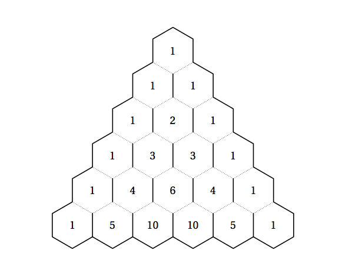

所以说，顺序对于迭代版本的动态规划实现很重要，下面举个实例，用动态规划解决有向无环图的单源最短路径问题。假设有如下图所示的图，当然，我们看到的是这个有向无环图经过了拓扑排序之后的结果，从a到f的最短路径用灰色标明了。

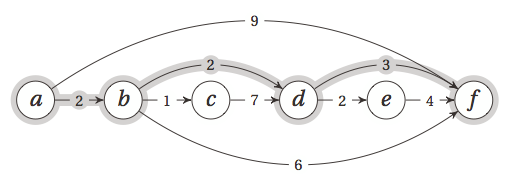

好，怎么实现呢?

我们有两种思考方式：

1.”去哪里?”：我们顺向思维，首先假设从a点出发到所有其他点的距离都是无穷大，然后，按照拓扑排序的顺序，从a点出发，接着更新a点能够到达的其他的点的距离，那么就是b点和f点，b点的距离变成2，f点的距离变成9。因为这个有向无环图是经过了拓扑排序的，所以按照拓扑顺序访问一遍所有的点(到了目标点就可以停止了)就能够得到a点到所有已访问到的点的最短距离，也就是说，当到达哪个点的时候，我们就找到了从a点到该点的最短距离，拓扑排序保证了后面的点不会指向前面的点，所以访问到后面的点时不可能再更新它前面的点的最短距离！(这里的更新也就是前面第4节介绍过的relaxtion)这种思维方式的代码实现就是迭代版本。

[这里涉及到了拓扑排序，前面第5节Traversal中介绍过了，这里为了方便没看前面的童鞋理解，W直接使用的是经过拓扑排序之后的结果。]

```python
def topsort(W):
    return W

def dag_sp(W, s, t):
    d = {u:float('inf') for u in W} #
    d[s] = 0
    for u in topsort(W):
        if u == t: break
        for v in W[u]:
            d[v] = min(d[v], d[u] + W[u][v])
    return d[t]

#邻接表
W={0:{1:2,5:9},1:{2:1,3:2,5:6},2:{3:7},3:{4:2,5:3},4:{5:4},5:{}}
s,t=0,5
print(dag_sp(W,s,t)) #7
```

用图来表示计算过程就是下面所示：

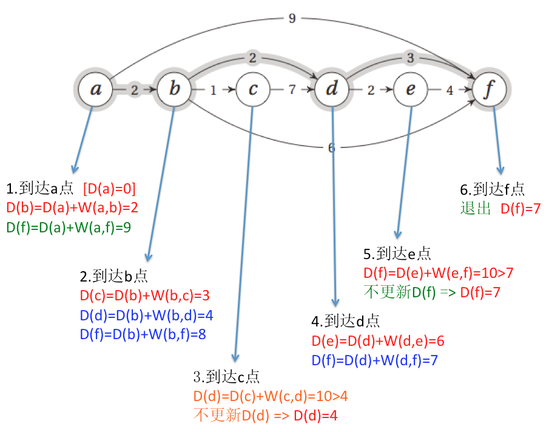

2.”从哪里来?”：我们逆向思维，目标是要到f，那从a点经过哪个点到f点会近些呢?只能是求解从a点出发能够到达的那些点哪个距离f点更近，这里a点能够到达b点和f点，f点到f点距离是0，但是a到f点的距离是9，可能不是最近的路，所以还要看b点到f点有多近，看b点到f点有多近就是求解从b点出发能够到达的那些点哪个距离f点更近，所以又绕回来了，也就是递归下去，直到我们能够回答从a点经过哪个点到f点会更近。这种思维方式的代码实现就是递归版本。

这种情况下，不需要输入是经过了拓扑排序的，所以你可以任意修改输入W中节点的顺序，结果都是一样的，而上面采用迭代实现方式必须要是拓扑排序了的，从中你就可以看出迭代版本和递归版本的区别了。

```python
from functools import wraps
def memo(func):
    cache={}
    @wraps(func)
    def wrap(*args):
        if args not in cache:
            cache[args]=func(*args)
            # print('cache {0} = {1}'.format(args[0],cache[args]))
        return cache[args]
    return wrap

def rec_dag_sp(W, s, t):
    @memo
    def d(u):
        if u == t: return 0
        return min(W[u][v]+d(v) for v in W[u])
    return d(s)

#邻接表
W={0:{1:2,5:9},1:{2:1,3:2,5:6},2:{3:7},3:{4:2,5:3},4:{5:4},5:{}}
s,t=0,5
print(rec_dag_sp(W,s,t)) #7
```

用图来表示计算过程就如下图所示：

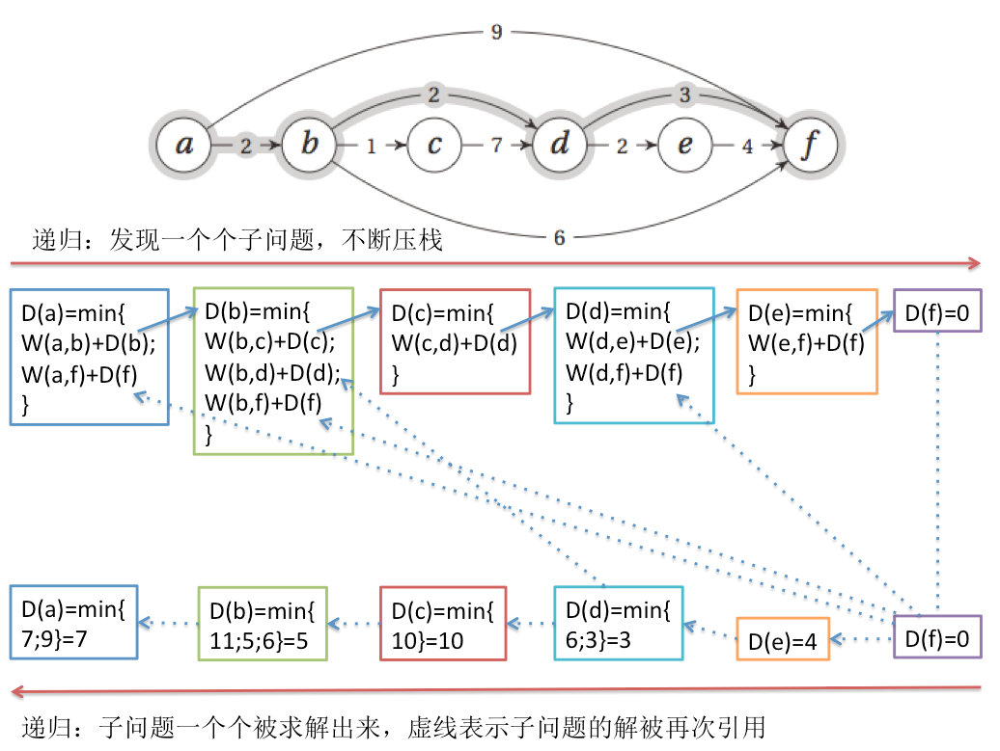

扩展内容：对DAG求单源最短路径的动态规划问题的总结，比较难理解，附上原文

Although the basic algorithm is the same, there are many ways of finding the shortest path in a DAG, and, by extension, solving most DP problems. You could do it recursively, with memoization, or you could do it iteratively, with relaxation. For the recursion, you could start at the first node, try various “next steps,” and then recurse on the remainder, or (if you graph representation permits) you could look at the last node and try “previous steps” and recurse on the initial part. The former is usually much more natural, while the latter corresponds more closely to what happens in the iterative version.

Now, if you use the iterative version, you also have two choices: you can relax the edges out of each node (in topologically sorted order), or you can relax all edges into each node. The latter more obviously yields a correct result but requires access to nodes by following edges backward. This isn’t as far-fetched as it seems when you’re working with an implicit DAG in some nongraph problem. (For example, in the longest increasing subsequence problem, discussed later in this chapter, looking at all backward “edges” can be a useful perspective.)

Outward relaxation, called reaching, is exactly equivalent when you relax all edges. As explained, once you get to a node, all its in-edges will have been relaxed anyway. However, with reaching, you can do something that’s hard in the recursive version (or relaxing in-edges): pruning. If, for example, you’re only interested in finding all nodes that are within a distance r, you can skip any node that has distance estimate greater than r. You will still need to visit every node, but you can potentially ignore lots of edges during the relaxation. This won’t affect the asymptotic running time, though (Exercise 8-6).

Note that finding the shortest paths in a DAG is surprisingly similar to, for example, finding the longest path, or even counting the number of paths between two nodes in a DAG. The latter problem is exactly what we did with Pascal’s triangle earlier; the exact same approach would work for an arbitrary graph. These things aren’t quite as easy for general graphs, though. Finding shortest paths in a general graph is a bit harder (in fact, Chapter 9 is devoted to this topic), while finding the longest path is an unsolved problem (see Chapter 11 for more on this).


OK，希望我把动态规划讲清楚了，总结下：动态规划其实就是一个连续决策的过程，每次决策我们可能有多种选择(二项式系数和0-1背包问题中我们只有两个选择，DAG图的单源最短路径中我们的选择要看点的出边或者入边，矩阵链乘问题中就是矩阵链可以分开的位置总数…)，我们每次选择最好的那个作为我们的决策。所以，动态规划的时间复杂度其实和这两者有关，也就是子问题的个数以及子问题的选择个数，一般情况下动态规划算法的时间复杂度就是两者的乘积。

动态规划有两种实现方式：一种是带备忘录的递归形式，这种方式直接从原问题出发，遇到子问题就去求解子问题并存储子问题的解，下次遇到的时候直接取出来，问题求解的过程看起来就像是先自顶向下地展开问题，然后自下而上的进行决策；另一个实现方式是迭代方式，这种方式需要考虑如何给定一个子问题的求解方式，使得后面求解规模较大的问题是需要求解的子问题都已经求解好了，它的缺点就是可能有些子问题不要算但是它还是算了，而递归实现方式只会计算它需要求解的子问题。

练习1：来试试写写最长公共子序列吧

练习2：算法导论问题 15-4: Planning a company party 计划一个公司聚会

Start example

Professor Stewart is consulting for the president of a corporation that is planning a company party. The company has a hierarchical structure; that is, the supervisor relation forms a tree rooted at the president. The personnel office has ranked each employee with a conviviality rating, which is a real number. In order to make the party fun for all attendees, the president does not want both an employee and his or her immediate supervisor to attend.

Professor Stewart is given the tree that describes the structure of the corporation, using the left-child, right-sibling representation described in Section 10.4. Each node of the tree holds, in addition to the pointers, the name of an employee and that employee’s conviviality ranking. Describe an algorithm to make up a guest list that maximizes the sum of the conviviality ratings of the guests. Analyze the running time of your algorithm.

原问题可以转换成：假设有一棵树，用左孩子右兄弟的表示方式表示，树的每个结点有个值，选了某个结点，就不能选择它的父结点，求整棵树选的节点值最大是多少。

假设如下：

dp[i][0]表示不选i结点时，i子树的最大价值

dp[i][1]表示选i结点时，i子树的最大价值

列出状态方程

dp[i][0] = sum(max(dp[u][0], dp[u][1]))  (如果不选i结点，u为结点i的儿子)

dp[i][1] = sum(dp[u][0]) + val[i]  (如果选i结点，val[i]表示i结点的价值)

最后就是求max(dp[root][0], dp[root][1])

## Chapter 9 Graphs

> The shortest distance between two points is under construction.
> ——Noelie Altito

本节主要介绍图算法中的各种最短路径算法，从不同的角度揭示它们的内核以及它们的异同

在前面的内容里我们已经介绍了图的表示方法(邻接矩阵和“各种”邻接表)、图的遍历(DFS和BFS)、图中的一些基本算法(基于DFS的拓扑排序和有向无环图的强连通分量、最小生成树的Prim和Kruskal算法等)，剩下的就是图算法中的各种最短路径算法，也就是本节的主要内容。

The shortest path problem comes in several varieties. For example, you can find shortest paths (just like any other kinds of paths) in both directed and undirected graphs. The most important distinctions, though, stem from your starting points and destinations. Do you want to find the shortest from one node to all others (single source)? From one node to another (single pair, one to one, point to point)? From all nodes to one (single destination)? From all nodes to all others (all pairs)? Two of these—single source and all pairs—are perhaps the most important. Although we have some tricks for the single pair problem (see “Meeting in the middle” and “Knowing where you’re going,” later), there are no guarantees that will let us solve that problem any faster than the general single source problem. The single destination problem is, of course, equivalent (just flip the edges for the directed case). The all pairs problem can be tackled by using each node as a single source (and we’ll look into that), but there are special-purpose algorithms for that problem as well.

最短路径问题有很多的变种，比如我们是处理有向图还是无向图上的最短路径问题呢？此外，各个问题之间最大的区别在于起点和终点。这个问题是从一个节点到所有其他节点的最短路径吗(单源最短路径)？还是从一个节点到另一个节点的最短路径(单对节点间最短路径)？还是从所有其他节点到某一个节点(多源最短路径)？还是求任何两个节点之间的最短路径(所有节点对最短路径)？

其中单源最短路径和所有节点对最短路径是最常见的问题类型，其他问题大致可以将其转化成这两类问题。虽然单对节点间最短路径问题有一些求解的技巧(“Meeting in the middle” and “Knowing where you’re going,”)，但是该问题并没有比单源最短路径问题的解法快到哪里去，所以单对节点间最短路径问题可以就用单源最短路径问题的算法去求解；而多源点单终点的最短路径问题可以将边反转过来看成是单源最短路径问题；至于所有节点对最短路径问题，可以对图中的每个节点使用单源最短路径来求解，但是对于这个问题还有一些特殊的更好的算法可以解决。

在开始介绍各种算法之前，作者给出了图中的几个重要结论或者性质，此处附上原文

assume that we start in node s and that we initialize D[s] to zero, while all other distance estimates are set to infinity. Let d(u,v) be the length of the shortest path from u to v.

+ d(s,v) <= d(s,u) + W[u,v]. This is an example of the triangle inequality.
+ d(s,v) <= D[v]. For v other than s, D[v] is initially infinite, and we reduce it only when we find actual shortcuts. We never “cheat,” so it remains an upper bound.
+ If there is no path to node v, then relaxing will never get D[v] below infinity. That’s because we’ll never find any shortcuts to improve D[v].
+ Assume a shortest path to v is formed by a path from s to u and an edge from u to v. Now, if D[u] is correct at any time before relaxing the edge from u to v, then D[v] is correct at all times afterward. The path defined by P[v] will also be correct.
+ Let [s, a, b, … , z, v] be a shortest path from s to v. Assume all the edges (s,a), (a,b), … , (z,v) in the path have been relaxed in order. Then D[v] and P[v] will be correct. It doesn’t matter if other relax operations have been performed in between.

最后这个是路径松弛性质，也就是后面的Bellman-Ford算法的核心

对于单对节点间最短路径问题，如果每条边的权值都一样(或者说边一样长)的话，使用前面的BFS就可以得到结果了(第5节遍历中介绍了)；如果图是有向无环图，那么我们还可以用前面动规中的DAG最短路径算法来求解(第8节动态规划中介绍了)，但是，现实中的图总是有环的，边的权值也总是不同，而且可能有负权值，所以我们还需要其他的算法！

首先我们来实现下之前学过的松弛技术relaxtion，代码中D保存各个节点到源点的距离值估计(上界值)，P保存节点的最短路径上的前驱节点，W保存边的权值，其中不存在的边的权值为inf。松弛就是说，假设节点 u 和节点 v 事先都有一个最短距离的估计(例如测试代码中的7和13)，如果现在要松弛边(u,v)，也就是对从节点 u 通过边(u,v)到达节点 v，将这条路径得到节点 v 的距离估计值(7+3=10)和原来的节点 v 的距离估计值(13)进行比较，如果前者更小的话，就表示我们可以放弃在这之前确定的从源点到节点 v 的最短路径，改成从源点到节点 u，然后节点 u 再到节点 v，这条路线距离会更短些，这也就是发生了一次松弛！(测试代码中10<13，所以要进行松弛，此时D[v]变成10，而它的前驱节点也变成了 u)

```python
#relaxtion
inf = float('inf')
def relax(W, u, v, D, P):
    d = D.get(u,inf) + W[u][v]                  # Possible shortcut estimate
    if d < D.get(v,inf):                        # Is it really a shortcut?
        D[v], P[v] = d, u                       # Update estimate and parent
        return True                             # There was a change!

#测试代码
u = 0; v = 1
D, W, P = {}, {u:{v:3}}, {}
D[u] = 7
D[v] = 13
print D[u] # 7
print D[v] # 13
print W[u][v] # 3
relax(W, u, v, D, P) # True
print D[v] # 10
D[v] = 8
relax(W, u, v, D, P)
print D[v] # 8
```

显然，如果你随机地对边进行松弛，那么与该边有关的节点的距离估计值就会慢慢地变得更加准确，这样的改进会在整个图中进行传播，如果一直这么松弛下去的话，最终整个图所有节点的距离值都不会发生变化的时候我们就得到了从源点到所有节点的最短路径值。

每次松弛可以看作是向最终解前进了“一步”，我们的目标自然是希望松弛的次数越少越好，关键就是要确定松弛的次数和松弛的顺序(好的松弛顺序可以让我们直接朝着最优解前进，缩短算法运行时间)，后面要介绍的图中的Bellman-Ford算法、Dijkstra算法以及DAG上的最短路径问题都是如此。

现在我们考虑一个问题，如果我们对图中的所有边都松弛一遍会怎样？可能部分顶点的距离估计值有所减小对吧，那如果再对图中的所有边都松弛一遍又会怎样呢？可能又有部分顶点的距离估计值有所减小对吧，那到底什么时候才会没有改进呢？到底什么时候可以停止了呢？

这个问题可以这么想，假设从源点 s 到节点 v 的最短路径是p=<v0, v1, v2, v3 ... vk>，此时v0=s, vk=v，那除了源点 s 之外，这条路径总共经过了其他 k 个顶点对吧，k 肯定小于 (V-1) 对吧，也就是说从节点 s 到节点 v 要经过一条最多只有(V-1)条边的路径，因为每遍松弛都是松弛所有边，那么肯定会松弛路径p 中的所有边，我们可以保险地认为第 i 次循环松弛了边，这样的话经过 k 次松弛遍历，我们肯定能够得到节点 v 的最短路径值，再根据这条路径最多只有(V-1)条边，也就说明了我们最多只要循环地对图中的所有边都松弛(V-1)遍就可以得到所有节点的最短路径值！上面的思路就是Bellman-Ford算法了，时间复杂度是$O(VE)$。

下面看下算法导论上的Bellman-Ford算法的示例图

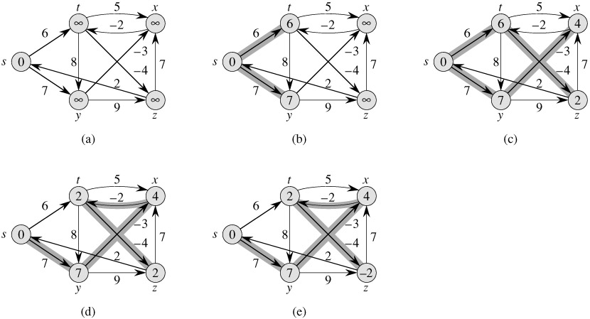

上图的解释，需要注意的是，如果边的松弛顺序不同，可能中间得到的结果不同，但是最后的结果都是一样的：The execution of the Bellman-Ford algorithm. The source is vertex s. The d values are shown within the vertices, and shaded edges indicate predecessor values: if edge (u, v) is shaded, then π[v] = u. In this particular example, each pass relaxes the edges in the order (t, x), (t, y), (t, z), (x, t), (y, x), (y, z), (z, x), (z, s), (s, t), (s, y). (a) The situation just before the first pass over the edges. (b)-(e) The situation after each successive pass over the edges. The d and π values in part (e) are the final values. The Bellman-Ford algorithm returns TRUE in this example.

上面的分析很好，但是我们漏考虑了一个关键问题，那就是如果图中存在负权回路的话不论我们松弛多少遍，图中有些节点的最短路径值都还是会减小，所以我们在 (V-1) 次松弛遍历之后再松弛遍历一次，如果还有节点的最短路径减小的话就说明图中存在负权回路！这就引出了Bellman-Ford算法的一个重要作用：判断图中是否存在负权回路。

```python
#Bellman-Ford算法
def bellman_ford(G, s):
    D, P = {s:0}, {}                            # Zero-dist to s; no parents
    for rnd in G:                               # n = len(G) rounds
        changed = False                         # No changes in round so far
        for u in G:                             # For every from-node...
            for v in G[u]:                      # ... and its to-nodes...
                if relax(G, u, v, D, P):        # Shortcut to v from u?
                    changed = True              # Yes! So something changed
        if not changed: break                   # No change in round: Done
    else:                                       # Not done before round n?
        raise ValueError('negative cycle')      # Negative cycle detected
    return D, P                                 # Otherwise: D and P correct

#测试代码
s, t, x, y, z = range(5)
W = {
    s: {t:6, y:7},
    t: {x:5, y:8, z:-4},
    x: {t:-2},
    y: {x:-3, z:9},
    z: {s:2, x:7}
    }
D, P = bellman_ford(W, s)
print [D[v] for v in [s, t, x, y, z]] # [0, 2, 4, 7, -2]
print s not in P # True
print [P[v] for v in [t, x, y, z]] == [x, y, s, t] # True
W[s][t] = -100
print bellman_ford(W, s)
# Traceback (most recent call last):
#         ...
# ValueError: negative cycle
```

前面我们在动态规划中介绍了一个DAG图中的最短路径算法，它的时间复杂度是O(V+E)的，下面我们用松弛的思路来快速回顾一下那个算法的迭代版本。因为它先对顶点进行了拓扑排序，所以它是一个典型的通过修改边松弛的顺序来提高算法运行速度的算法，也就是说，我们不是随机松弛，也不是所有边来松弛一遍，而是沿着拓扑排序得到的节点的顺序来进行松弛，怎么松弛呢？当我们到达一个节点时我们就松弛这个节点的出边，为什么这种方式能够奏效呢？

这里还是假设从源点 s 到节点 v 的最短路径是p=<v0, v1, v2, v3 ... vk>，此时v0=s, vk=v，如果我们到达了节点 v，那么说明源点 s 和节点 v 之间的那些点都已经经过了(节点是经过了拓扑排序的哟)，而且它们的边也都已经松弛过了，所以根据路径松弛性质可以知道当我们到达节点 v 时我们能够直接得到源点 s 到节点 v 的最短路径值。

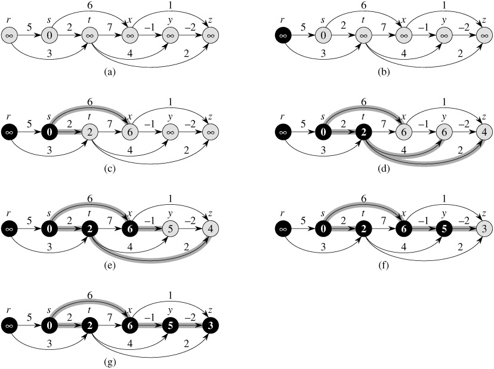

上图的解释：The execution of the algorithm for shortest paths in a directed acyclic graph. The vertices are topologically sorted from left to right. The source vertex is s. The d values are shown within the vertices, and shaded edges indicate the π values. (a) The situation before the first iteration of the for loop of lines 3-5. (b)-(g) The situation after each iteration of the for loop of lines 3-5. The newly blackened vertex in each iteration was used as u in that iteration. The values shown in part (g) are the final values.

接下来我们看下Dijkstra算法，它看起来非常像Prim算法，同样是基于贪心策略，每次贪心地选择松弛距离最近的“边缘节点”所在的那条边(另一个节点在已经包含的节点集合中)，那为什么这种方式也能奏效呢？因为算法导论给出了完整的证明，不信你去看看！呵呵，开玩笑的啦，如果光说有证明就用不着我来写文章咯，其实是因为Dijkstra算法隐藏了一个DAG最短路径算法，而DAG的最短路径问题我们上面已经介绍过了，仔细想也不难发现，它们的区别就是松弛的顺序不同，DAG最短路径算法是先进行拓扑排序然后松弛，而Dijkstra算法是每次直接贪心地选择一条边来松弛。那为什么Dijkstra算法隐藏了一个DAG？

这里我想了好久怎么解释，但是还是觉得原文实在太精彩，我想我这有限的水平很难讲明白，故这里附上原文，前面部分作者解释了为什么DAG最短路径算法中边松弛的顺序和拓扑排序有关，然后作者继续解释(Dijkstra算法中)下一个要加入(到已包含的节点集合)的节点必须有正确的距离估计值，最后作者解释了这个节点肯定是那个具有最小距离估计值的节点！一切顺风顺水，但是有一个重要前提条件，那就是边不能有负权值！

作者下面的解释中提到的图9-1

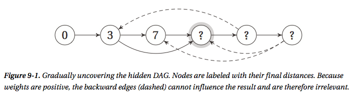

To get thing started, we can imagine that we already know the distances from the start node to each of the others. We don’t, of course, but this imaginary situation can help our reasoning. Imagine ordering the nodes, left to right, based on their distance. What happens? For the general case—not much. However, we’re assuming that we have no negative edge weights, and that makes all the difference.

Because all edges are positive, the only nodes that can contribute to a node’s solution will lie to its left in our hypothetical ordering. It will be impossible to locate a node to the right that will help us find a shortcut, because this node is further away, and could only give us a shortcut if it had a negative back edge. The positive back edges are completely useless to us, and aren’t part of the problem structure. What remains, then, is a DAG, and the topological ordering we’d like to use is exactly the hypothetical ordering we started with: nodes sorted by their actual distance. See Figure 9-1 for an illustration of this structure. (I’ll get back to the question marks in a minute.)

Predictably enough, we now hit the major gap in the solution: it’s totally circular. In uncovering the basic problem structure (decomposing into subproblems or finding the hidden DAG), we’ve assumed that we’ve already solved the problem. The reasoning has still been useful, though, because we now have something specific to look for. We want to find the ordering—and we can find it with our trusty workhorse, induction!

Consider, again, Figure 9-1. Assume that the highlighted node is the one we’re trying to identify in our inductive step (meaning that the earlier ones have been identified and already have correct distance estimates). Just like in the ordinary DAG shortest path problem, we’ll be relaxing all out-edges for each node, as soon as we’ve identified it and determined its correct distance. That means that we’ve relaxed the edges out of all earlier nodes. We haven’t relaxed the out-edges of later nodes, but as discussed, they can’t matter: the distance estimates of these later nodes are upper bounds, and the back-edges have positive weights, so there’s no way they can contribute to a shortcut.

This means (by the earlier relaxation properties or the discussion of the DAG shortest path algorithm in Chapter 8) that the next node must have a correct distance estimate. That is, the highlighted node in Figure 9-1 must by now have received its correct distance estimate, because we’ve relaxed all edges out of the first three nodes. This is very good news, and all that remains is to figure out which node it is. We still don’t really know what the ordering is, remember? We’re figuring out the topological sorting as we go along, step by step.

There is only one node that could possibly be the next one, of course:3 the one with the lowest distance estimate. We know it’s next in the sorted order, and we know it has a correct estimate; because these estimates are upper bounds, none of the later nodes could possibly have lower estimates. Cool, no? And now, by induction, we’ve solved the problem. We just relax all out-edges of the nodes of each node in distance order—which means always taking the one with the lowest estimate next.

下图是算法导论中Dijkstra算法的示例图，可以参考下


上图的解释：The execution of Dijkstra’s algorithm. The source s is the leftmost vertex. The shortest-path estimates are shown within the vertices, and shaded edges indicate predecessor values. Black vertices are in the set S, and white vertices are in the min-priority queue Q = V - S. (a) The situation just before the first iteration of the while loop of lines 4-8. The shaded vertex has the minimum d value and is chosen as vertex u in line 5. (b)-(f) The situation after each successive iteration of the while loop. The shaded vertex in each part is chosen as vertex u in line 5 of the next iteration. The d and π values shown in part (f) are the final values.

下面是Dijkstra算法的实现

```python
#Dijkstra算法
from heapq import heappush, heappop

def dijkstra(G, s):
    D, P, Q, S = {s:0}, {}, [(0,s)], set()      # Est., tree, queue, visited
    while Q:                                    # Still unprocessed nodes?
        _, u = heappop(Q)                       # Node with lowest estimate
        if u in S: continue                     # Already visited? Skip it
        S.add(u)                                # We've visited it now
        for v in G[u]:                          # Go through all its neighbors
            relax(G, u, v, D, P)                # Relax the out-edge
            heappush(Q, (D[v], v))              # Add to queue, w/est. as pri
    return D, P                                 # Final D and P returned

#测试代码
s, t, x, y, z = range(5)
W = {
    s: {t:10, y:5},
    t: {x:1, y:2},
    x: {z:4},
    y: {t:3, x:9, z:2},
    z: {x:6, s:7}
    }
D, P = dijkstra(W, s)
print [D[v] for v in [s, t, x, y, z]] # [0, 8, 9, 5, 7]
print s not in P # True
print [P[v] for v in [t, x, y, z]] == [y, t, s, y] # True
```

Dijkstra算法和Prim算法的实现很像，也和BFS算法实现很像，其实，如果我们把每条权值为 w 的边(u,v)想象成节点 u 和节点 v 中间有 (w-1) 个节点，且每条边都是权值为1的一条路径的话，BFS算法其实就和Dijkstra算法差不多了。 Dijkstra算法的时间复杂度和使用的优先队列有关，上面的实现用的是最小堆，所以时间复杂度是O(mlgn)，其中 m 是边数，n 是节点数。

下面我们来看看所有点对最短路径问题

对于所有点对最短路径问题，我们第一个想法肯定是对每个节点运行一遍Dijkstra算法就可以了嘛，但是，Dijkstra算法有个前提条件，所有边的权值都是正的，那些包含了负权边的图怎么办？那就想办法对图进行些预处理，使得所有边的权值都是正的就可以了，那怎么处理能够做到呢？此时可以看下前面的三角不等性质，内容如下：

d(s,v) <= d(s,u) + W[u,v]. This is an example of the triangle inequality.

令h(u)=d(s,u), h(v)=d(s,v)，假设我们给边(u,v)重新赋权w’(u, v) = w(u, v) + h(u) - h(v)，根据三角不等性质可知w’(u, v)肯定非负，这样新图的边就满足Dijkstra算法的前提条件，但是，我们怎么得到每个节点的最短路径值d(s,v)？

其实这个问题很好解决对吧，前面介绍的Bellman-Ford算法就干这行的，但是源点 s 是什么？这里的解决方案有点意思，我们可以向图中添加一个顶点 s，并且让它连接图中的所有其他节点，边的权值都是0，完了之后我们就可以在新图上从源点 s 开始运行Bellman-Ford算法，这样就得到了每个节点的最短路径值d(s,v)。但是，新的问题又来了，这么改了之后真的好吗？得到的最短路径对吗？

这里的解释更加有意思，想想任何一条从源点 s 到节点 v 的路径p=<s, v1, v2, v3 ... u, v>，假设我们把路径上的边权值都加起来的话，你会发现下面的有意思的现象(telescoping sums)：

```
sum=[w(s,v1)+h(s)-h(v1)]+[w(v1,v2)+h(v1)-h(v2)]+…+[w(u,v)+h(u)-h(v)]
=w(v1,v2)+w(v2,v3)+…+w(u,v)-h(v)
```

上面的式子说明，所有从源点 s 到节点 v 的路径都会减去h(v)，也就说明对于新图上的任何一条最短路径，它都是对应着原图的那条最短路径，只是路径的权值减去了h(v)，这也就说明采用上面的策略得到的最短路径没有问题。

现在我们捋一捋思路，我们首先要使用Bellman-Ford算法得到每个节点的最短路径值，然后利用这些值修改图中边的权值，最后我们对图中所有节点都运行一次Dijkstra算法就解决了所有节点对最短路径问题，但是如果原图本来边的权值就都是正的话就直接运行Dijkstra算法就行了。这就是Johnson算法，一个巧妙地利用Bellman-Ford和Dijkstra算法结合来解决所有节点对最短路径问题的算法。它特别适合用于稀疏图，算法的时间复杂度是O(mnlgn)，比后面要介绍的Floyd-Warshall算法要好些。

还有一点需要补充的是，在运行完了Dijkstra算法之后，如果我们要得到准确的最短路径的权值的话，我们还需要做一定的修改，从前面的式子可以看出，新图上节点 u 和节点 v 之间的最短路径 D’(u,v) 与原图上两个节点的最短路径 D(u,v) 有如下左式的关系，那么经过右式的简单计算就能得到原图的最短路径值

D’(u,v)=D(u,v)+h(u)-h(v) ==> D(u,v)=D’(u,v)-h(u)+h(v)

基于上面的思路，我们可以得到下面的Johnson算法实现

```python
#Johnson’s Algorithm
def johnson(G):                                 # All pairs shortest paths
    G = deepcopy(G)                             # Don't want to break original
    s = object()                                # Guaranteed unique node
    G[s] = {v:0 for v in G}                     # Edges from s have zero wgt
    h, _ = bellman_ford(G, s)                   # h[v]: Shortest dist from s
    del G[s]                                    # No more need for s
    for u in G:                                 # The weight from u...
        for v in G[u]:                          # ... to v...
            G[u][v] += h[u] - h[v]              # ... is adjusted (nonneg.)
    D, P = {}, {}                               # D[u][v] and P[u][v]
    for u in G:                                 # From every u...
        D[u], P[u] = dijkstra(G, u)             # ... find the shortest paths
        for v in G:                             # For each destination...
            D[u][v] += h[v] - h[u]              # ... readjust the distance
    return D, P                                 # These are two-dimensional

a, b, c, d, e = range(5)
W = {
    a: {c:1, d:7},
    b: {a:4},
    c: {b:-5, e:2},
    d: {c:6},
    e: {a:3, b:8, d:-4}
    }
D, P = johnson(W)
print [D[a][v] for v in [a, b, c, d, e]] # [0, -4, 1, -1, 3]
print [D[b][v] for v in [a, b, c, d, e]] # [4, 0, 5, 3, 7]
print [D[c][v] for v in [a, b, c, d, e]] # [-1, -5, 0, -2, 2]
print [D[d][v] for v in [a, b, c, d, e]] # [5, 1, 6, 0, 8]
print [D[e][v] for v in [a, b, c, d, e]] # [1, -3, 2, -4, 0]
```

下面我们看下Floyd-Warshall算法，这是一个基于动态规划的算法，时间复杂度是O(n3)，n是图中节点数

假设所有节点都有一个数字编号(从1开始)，我们要把原来的问题reduce成一个个子问题，子问题有三个参数：起点 u、终点 v、能经过的节点的最大编号k，也就是求从起点 u 到终点 v 只能够经过编号为(1,2,3,…,k)的节点的最短路径问题 (原文表述如下)

Let d(u, v, k) be the length of the shortest path that exists from node u to node v if you’re only allowed to use the k first nodes as intermediate nodes.

这个子问题怎么考虑呢？当然还是采用之前动态规划中常用的选择还是不选择这种策略，如果我们选择不经过节点 k 的话，那么问题变成了求从起点 u 到终点 v 只能够经过编号为(1,2,3,…,k-1)的节点的最短路径问题；如果我们选择经过节点 k 的话，那么问题变成求从起点 u 到终点 k 只能够经过编号为(1,2,3,…,k-1)的节点的最短路径问题与求从起点 k 到终点 v 只能够经过编号为(1,2,3,…,k-1)的节点的最短路径问题之和，如下图所示

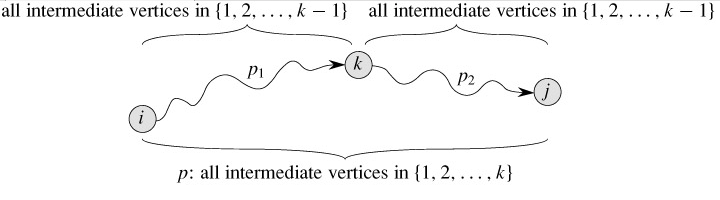

经过上面的分析，我们可以得到下面的结论

d(u,v,k) = min(d(u,v,k-1), d(u,k,k-1) + d(k,v,k-1))

根据这个式子我们很快可以得到下面的递归实现

```python
#递归版本的Floyd-Warshall算法
from functools import wraps

def memo(func):
    cache = {}                                  # Stored subproblem solutions
    @wraps(func)                                # Make wrap look like func
    def wrap(*args):                            # The memoized wrapper
        if args not in cache:                   # Not already computed?
            cache[args] = func(*args)           # Compute & cache the solution
        return cache[args]                      # Return the cached solution
    return wrap                                 # Return the wrapper

def rec_floyd_warshall(G):                                # All shortest paths
    @memo                                                 # Store subsolutions
    def d(u,v,k):                                         # u to v via 1..k
        if k==0: return G[u][v]                           # Assumes v in G[u]
        return min(d(u,v,k-1), d(u,k,k-1) + d(k,v,k-1))   # Use k or not?
    return {(u,v): d(u,v,len(G)) for u in G for v in G}   # D[u,v] = d(u,v,n)

#测试代码
a, b, c, d, e = range(1,6) # One-based
W = {
    a: {c:1, d:7},
    b: {a:4},
    c: {b:-5, e:2},
    d: {c:6},
    e: {a:3, b:8, d:-4}
    }
for u in W:
    for v in W:
        if u == v: W[u][v] = 0
        if v not in W[u]: W[u][v] = inf
D = rec_floyd_warshall(W)
print [D[a,v] for v in [a, b, c, d, e]] # [0, -4, 1, -1, 3]
print [D[b,v] for v in [a, b, c, d, e]] # [4, 0, 5, 3, 7]
print [D[c,v] for v in [a, b, c, d, e]] # [-1, -5, 0, -2, 2]
print [D[d,v] for v in [a, b, c, d, e]] # [5, 1, 6, 0, 8]
print [D[e,v] for v in [a, b, c, d, e]] # [1, -3, 2, -4, 0]
```

仔细看的话，不难发现这个解法和我们介绍动态规划时介绍的最长公共子序列的问题非常类似，如果还没有阅读的话不妨看下最长公共子序列问题的5种实现这篇文章，有了对最长公共子序列问题的理解，我们就很容易发现对于Floyd-Warshall算法我们也可以采用类似的方式来减小算法所需占用的空间，当然首先要将递归版本改成性能更好些的迭代版本。

Floyd-Warshall算法的递推公式

$$
d{ij}^{k}= \left{
\begin{array}{l l}
\omega{ij} & \quad \text{如果k=0}\
min(d{ij}^{k-1},d{ik}^{k-1}+d_{kj}^{k-1}) & \quad \text{如果k≥1}
\end{array} \right.
$$

从递推公式中可以看出，计算当前回合(k)只需要上一回合(k-1)得到的结果，所以，如果应用对于中间结果不需要的话，那么可以只使用2个nxn的矩阵，一个保存当前回合(k)的结果D(k)，另一个保存上一回合(k-1)的结果D(k-1)，待当前回合计算完了之后将其全部复制到D(k-1)中，这样就仅需要O(n2)的空间。

```python
#空间优化后的Floyd-Warshall算法
def floyd_warshall1(G):
    D = deepcopy(G)                             # No intermediates yet
    for k in G:                                 # Look for shortcuts with k
        for u in G:
            for v in G:
                D[u][v] = min(D[u][v], D[u][k] + D[k][v])
    return D

#测试代码
a, b, c, d, e = range(1,6) # One-based
W = {
    a: {c:1, d:7},
    b: {a:4},
    c: {b:-5, e:2},
    d: {c:6},
    e: {a:3, b:8, d:-4}
    }
for u in W:
    for v in W:
        if u == v: W[u][v] = 0
        if v not in W[u]: W[u][v] = inf
D = floyd_warshall1(W)
print [D[a][v] for v in [a, b, c, d, e]] # [0, -4, 1, -1, 3]
print [D[b][v] for v in [a, b, c, d, e]] # [4, 0, 5, 3, 7]
print [D[c][v] for v in [a, b, c, d, e]] # [-1, -5, 0, -2, 2]
print [D[d][v] for v in [a, b, c, d, e]] # [5, 1, 6, 0, 8]
print [D[e][v] for v in [a, b, c, d, e]] # [1, -3, 2, -4, 0]
```

当然啦，一般情况下求最短路径问题我们还需要知道最短路径是什么，这个时候我们只需要在进行选择的时候设置一个前驱节点就行了

```python
#最终版本的Floyd-Warshall算法
def floyd_warshall(G):
    D, P = deepcopy(G), {}
    for u in G:
        for v in G:
            if u == v or G[u][v] == inf:
                P[u,v] = None
            else:
                P[u,v] = u
    for k in G:
        for u in G:
            for v in G:
                shortcut = D[u][k] + D[k][v]
                if shortcut < D[u][v]:
                    D[u][v] = shortcut
                    P[u,v] = P[k,v]
    return D, P

#测试代码
a, b, c, d, e = range(5)
W = {
    a: {c:1, d:7},
    b: {a:4},
    c: {b:-5, e:2},
    d: {c:6},
    e: {a:3, b:8, d:-4}
    }
for u in W:
    for v in W:
        if u == v: W[u][v] = 0
        if v not in W[u]: W[u][v] = inf
D, P = floyd_warshall(W)
print [D[a][v] for v in [a, b, c, d, e]]#[0, -4, 1, -1, 3]
print [D[b][v] for v in [a, b, c, d, e]]#[4, 0, 5, 3, 7]
print [D[c][v] for v in [a, b, c, d, e]]#[-1, -5, 0, -2, 2]
print [D[d][v] for v in [a, b, c, d, e]]#[5, 1, 6, 0, 8]
print [D[e][v] for v in [a, b, c, d, e]]#[1, -3, 2, -4, 0]
print [P[a,v] for v in [a, b, c, d, e]]#[None, 2, 0, 4, 2]
print [P[b,v] for v in [a, b, c, d, e]]#[1, None, 0, 4, 2]
print [P[c,v] for v in [a, b, c, d, e]]#[1, 2, None, 4, 2]
print [P[d,v] for v in [a, b, c, d, e]]#[1, 2, 3, None, 2]
print [P[e,v] for v in [a, b, c, d, e]]#[1, 2, 3, 4, None]
```

算法导论在介绍所有节点对最短路径问题时先介绍了另一个基于动态规划的解法，但是那个算法时间复杂度较高，即使是使用了重复平方技术还是比较差，所以这里不介绍了，但是有意思的是书中将这个算法和矩阵乘法运算进行了对比，发现两者之间惊人的相似，其实同理，我们开始介绍的Bellman-Ford算法和矩阵与向量的乘法运算也有很多类似的地方，感兴趣可以自己探索下，也可以阅读算法导论了解下

本章节最后作者还提出了两个用来解最短路径问题的技巧：“Meeting in the middle” 和 “Knowing where you’re going,”，这部分的内容又都比较难翻译和理解，感兴趣还是阅读原文较好

(1)Meeting in the middle

简单来说就是双向进行，Dijkstra算法是从节点 u 出发去找到达节点 v 的最短路径，但是，如果两个节点同时进行呢，当它们找到相同的节点时就得到一条路径了，这种方式比一个方向查找的效率要高些，下图是一个图示


(2)Knowing where you’re going

这里作者介绍了大名鼎鼎的A*算法，实际上也就非常类似采用了分支限界策略的BFS算法(the best-first search used in the branch and bound strategy )。

By now you’ve seen that the basic idea of traversal is pretty versatile, and by simply using different queues, you get several useful algorithms. For example, for FIFO and LIFO queues, you get BFS and DFS, and with the appropriate priorities, you get the core of Prim’s and Dijkstra’s algorithms. The algorithm described in this section, called A*, extends Dijkstra’s, by tweaking the priority once again.

As mentioned earlier, the A algorithm uses an idea similar to Johnson’s algorithm, although for a different purpose. Johnson’s algorithm transforms all edge weights to ensure they’re positive, while ensuring that the shortest paths are still shortest. In A, we want to modify the edges in a similar fashion, but this time the goal isn’t to make the edges positive—we’re assuming they already are (as we’re building on Dijkstra’s algorithm). No, what we want is to guide the traversal in the right direction, by using information of where we’re going: we want to make edges moving away from our target node more expensive than those that take us closer to it.
