# Python 编程思想

这里主要是比较深入 python 机制的内容

## 浅谈 Python 的 with 语句

with 语句是从 Python 2.5 开始引入的一种与异常处理相关的功能（2.5 版本中要通过 `from __future__ import with_statement` 导入后才可以使用），从 2.6 版本开始缺省可用（参考 What's new in Python 2.6? 中 with 语句相关部分介绍）。with 语句适用于对资源进行访问的场合，确保不管使用过程中是否发生异常都会执行必要的“清理”操作，释放资源，比如文件使用后自动关闭、线程中锁的自动获取和释放等。

### 术语

要使用 with 语句，首先要明白上下文管理器这一概念。有了上下文管理器，with 语句才能工作。

下面是一组与上下文管理器和with 语句有关的概念。

上下文管理协议（Context Management Protocol）：包含方法 `__enter__()` 和 `__exit__()`，支持该协议的对象要实现这两个方法。

上下文管理器（Context Manager）：支持上下文管理协议的对象，这种对象实现了
`__enter__()` 和 `__exit__()` 方法。上下文管理器定义执行 with 语句时要建立的运行时上下文，负责执行 with 语句块上下文中的进入与退出操作。通常使用 with 语句调用上下文管理器，也可以通过直接调用其方法来使用。

运行时上下文（runtime context）：由上下文管理器创建，通过上下文管理器的 `__enter__()` 和 `__exit__()` 方法实现，`__enter__()` 方法在语句体执行之前进入运行时上下文，`__exit__()` 在语句体执行完后从运行时上下文退出。with 语句支持运行时上下文这一概念。

上下文表达式（Context Expression）：with 语句中跟在关键字 with 之后的表达式，该表达式要返回一个上下文管理器对象。

语句体（with-body）：with 语句包裹起来的代码块，在执行语句体之前会调用上下文管
理器的 `__enter__()` 方法，执行完语句体之后会执行 `__exit__()` 方法。

### 基本语法和工作原理

with 语句的语法格式如下：

```python
with context_expression [as target(s)]:
    with-body
```

这里 context_expression 要返回一个上下文管理器对象，该对象并不赋值给 as 子句中的 target(s) ，如果指定了 as 子句的话，会将上下文管理器的 `__enter__()` 方法的返回值赋值给 target(s)。target(s) 可以是单个变量，或者由“()”括起来的元组（不能是仅仅由“,”分隔的变量列表，必须加“()”）。

Python 对一些内建对象进行改进，加入了对上下文管理器的支持，可以用于 with 语句中，比如可以自动关闭文件、线程锁的自动获取和释放等。假设要对一个文件进行操作，使用 with 语句可以有如下代码：

```python
with open(r'somefileName') as somefile:
    for line in somefile:
        print line
        # ...more code
```

这里使用了 with 语句，不管在处理文件过程中是否发生异常，都能保证 with 语句执行完毕后已经关闭了打开的文件句柄。如果使用传统的 try/finally 范式，则要使用类似如下代码：

```python
somefile = open(r'somefileName')
try:
    for line in somefile:
        print line
        # ...more code
finally:
    somefile.close()
```

比较起来，使用 with 语句可以减少编码量。已经加入对上下文管理协议支持的还有模块 threading、decimal 等。

PEP 0343 对 with 语句的实现进行了描述。with 语句的执行过程类似如下代码块：

```python
context_manager = context_expression
exit = type(context_manager).__exit__  
value = type(context_manager).__enter__(context_manager)
exc = True   # True 表示正常执行，即便有异常也忽略；False 表示重新抛出异常，需要对异常进行处理
try:
    try:
        target = value  # 如果使用了 as 子句
        with-body     # 执行 with-body
    except:
        # 执行过程中有异常发生
        exc = False
        # 如果 __exit__ 返回 True，则异常被忽略；如果返回 False，则重新抛出异常
        # 由外层代码对异常进行处理
        if not exit(context_manager, *sys.exc_info()):
            raise
finally:
    # 正常退出，或者通过 statement-body 中的 break/continue/return 语句退出
    # 或者忽略异常退出
    if exc:
        exit(context_manager, None, None, None)
    # 缺省返回 None，None 在布尔上下文中看做是 False
```

1. 执行 context_expression，生成上下文管理器 context_manager
2. 调用上下文管理器的 `__enter__()` 方法；如果使用了 as 子句，则将 `__enter__()` 方法的返回值赋值给 as 子句中的 target(s)
3. 执行语句体 with-body
4. 不管是否执行过程中是否发生了异常，执行上下文管理器的 `__exit__()` 方法，`__exit__()` 方法负责执行“清理”工作，如释放资源等。如果执行过程中没有出现异常，或者语句体中执行了语句 break/continue/return，则以 None 作为参数调用 `__exit__(None, None, None)` ；如果执行过程中出现异常，则使用 sys.exc_info 得到的异常信息为参数调用 `__exit__(exc_type, exc_value, exc_traceback)`
5. 出现异常时，如果 `__exit__(type, value, traceback)` 返回 False，则会重新抛出异常，让with 之外的语句逻辑来处理异常，这也是通用做法；如果返回 True，则忽略异常，不再对异常进行处理

### 自定义上下文管理器

开发人员可以自定义支持上下文管理协议的类。自定义的上下文管理器要实现上下文管理协议所需要的 `__enter__()` 和 `__exit__()` 两个方法：

+ `context_manager.__enter__()` ：进入上下文管理器的运行时上下文，在语句体执行前调用。with 语句将该方法的返回值赋值给 as 子句中的 target，如果指定了 as 子句的话
+ `context_manager.__exit__(exc_type, exc_value, exc_traceback)` ：退出与上下文管理器相关的运行时上下文，返回一个布尔值表示是否对发生的异常进行处理。参数表示引起退出操作的异常，如果退出时没有发生异常，则3个参数都为None。如果发生异常，返回 True 表示不处理异常，否则会在退出该方法后重新抛出异常以由 with 语句之外的代码逻辑进行处理。如果该方法内部产生异常，则会取代由 statement-body 中语句产生的异常。要处理异常时，不要显示重新抛出异常，即不能重新抛出通过参数传递进来的异常，只需要将返回值设置为 False 就可以了。之后，上下文管理代码会检测是否 `__exit__()` 失败来处理异常

下面通过一个简单的示例来演示如何构建自定义的上下文管理器。注意，上下文管理器必须同时提供 `__enter__()` 和 `__exit__()` 方法的定义，缺少任何一个都会导致 AttributeError；with 语句会先检查是否提供了 `__exit__()` 方法，然后检查是否定义了 `__enter__()` 方法。

假设有一个资源 DummyResource，这种资源需要在访问前先分配，使用完后再释放掉；分配操作可以放到 `__enter__() `方法中，释放操作可以放到 `__exit__()` 方法中。简单起见，这里只通过打印语句来表明当前的操作，并没有实际的资源分配与释放。

```python
class DummyResource:
def __init__(self, tag):
        self.tag = tag
        print 'Resource [%s]' % tag
    def __enter__(self):
        print '[Enter %s]: Allocate resource.' % self.tag
        return self	  # 可以返回不同的对象
    def __exit__(self, exc_type, exc_value, exc_tb):
        print '[Exit %s]: Free resource.' % self.tag
        if exc_tb is None:
            print '[Exit %s]: Exited without exception.' % self.tag
        else:
            print '[Exit %s]: Exited with exception raised.' % self.tag
            return False   # 可以省略，缺省的None也是被看做是False
```

DummyResource 中的 `__enter__()` 返回的是自身的引用，这个引用可以赋值给 as 子句中的 target 变量；返回值的类型可以根据实际需要设置为不同的类型，不必是上下文管理器对象本身。

`__exit__()` 方法中对变量 exc_tb 进行检测，如果不为 None，表示发生了异常，返回 False 表示需要由外部代码逻辑对异常进行处理；注意到如果没有发生异常，缺省的返回值为 None，在布尔环境中也是被看做 False，但是由于没有异常发生，`__exit__()` 的三个参数都为 None，上下文管理代码可以检测这种情况，做正常处理。

下面在 with 语句中访问 DummyResource ：

```python
with DummyResource('Normal'):
    print '[with-body] Run without exceptions.'

with DummyResource('With-Exception'):
    print '[with-body] Run with exception.'
    raise Exception
    print '[with-body] Run with exception. Failed to finish statement-body!'
```

第1个 with 语句的执行结果如下：

```python
Resource [Normal]
[Enter Normal]: Allocate resource.
[with-body] Run without exceptions.
[Exit Normal]: Free resource.
[Exit Normal]: Exited without exception.
```

可以看到，正常执行时会先执行完语句体 with-body，然后执行 `__exit__()` 方法释放资源。

第2个 with 语句的执行结果如下：

```python
Resource [With-Exception]
[Enter With-Exception]: Allocate resource.
[with-body] Run with exception.
[Exit With-Exception]: Free resource.
[Exit With-Exception]: Exited with exception raised.

Traceback (most recent call last):
  File "G:/demo", line 20, in <module>
   raise Exception
Exception
```

可以看到，with-body 中发生异常时with-body 并没有执行完，但资源会保证被释放掉，同时产生的异常由 with 语句之外的代码逻辑来捕获处理。

可以自定义上下文管理器来对软件系统中的资源进行管理，比如数据库连接、共享资源的访问控制等。Python 在线文档 Writing Context Managers 提供了一个针对数据库连接进行管理的上下文管理器的简单范例。

### contextlib 模块

contextlib 模块提供了3个对象：装饰器 contextmanager、函数 nested 和上下文管理器 closing。使用这些对象，可以对已有的生成器函数或者对象进行包装，加入对上下文管理协议的支持，避免了专门编写上下文管理器来支持 with 语句。

#### 装饰器 contextmanager

contextmanager 用于对生成器函数进行装饰，生成器函数被装饰以后，返回的是一个上下文管理器，其 `__enter__()` 和 `__exit__()` 方法由 contextmanager 负责提供，而不再是之前的迭代子。被装饰的生成器函数只能产生一个值，否则会导致异常 RuntimeError；产生的值会赋值给 as 子句中的 target，如果使用了 as 子句的话。下面看一个简单的例子。

```python
from contextlib import contextmanager

@contextmanager
def demo():
    print '[Allocate resources]'
    print 'Code before yield-statement executes in __enter__'
    yield '*** contextmanager demo ***'
    print 'Code after yield-statement executes in __exit__'
    print '[Free resources]'

with demo() as value:
    print 'Assigned Value: %s' % value
```

结果输出如下：

```python
[Allocate resources]
Code before yield-statement executes in __enter__
Assigned Value: *** contextmanager demo ***
Code after yield-statement executes in __exit__
[Free resources]
```

可以看到，生成器函数中 yield 之前的语句在 `__enter__()` 方法中执行，yield 之后的语句在 `__exit__()` 中执行，而 yield 产生的值赋给了 as 子句中的 value 变量。

需要注意的是，contextmanager 只是省略了 `__enter__()` / `__exit__()` 的编写，但并不负责实现资源的“获取”和“清理”工作；“获取”操作需要定义在 yield 语句之前，“清理”操作需要定义 yield 语句之后，这样 with 语句在执行 `__enter__()` / `__exit__()` 方法时会执行这些语句以获取/释放资源，即生成器函数中需要实现必要的逻辑控制，包括资源访问出现错误时抛出适当的异常。

#### 函数 nested

nested 可以将多个上下文管理器组织在一起，避免使用嵌套 with 语句。

```python
with nested(A(), B(), C()) as (X, Y, Z):
     # with-body code here
```

类似于：

```python
with A() as X:
    with B() as Y:
        with C() as Z:
             # with-body code here
```

需要注意的是，发生异常后，如果某个上下文管理器的 `__exit__()` 方法对异常处理返回 False，则更外层的上下文管理器不会监测到异常。

#### 上下文管理器 closing

closing 的实现如下：

```python
class closing(object):
    # help doc here
    def __init__(self, thing):
        self.thing = thing
    def __enter__(self):
        return self.thing
    def __exit__(self, *exc_info):
        self.thing.close()
```

上下文管理器会将包装的对象赋值给 as 子句的 target 变量，同时保证打开的对象在 with-body 执行完后会关闭掉。closing 上下文管理器包装起来的对象必须提供 close() 方法的定义，否则执行时会报 AttributeError 错误。

```python
class ClosingDemo(object):
    def __init__(self):
        self.acquire()
    def acquire(self):
        print 'Acquire resources.'
    def free(self):
        print 'Clean up any resources acquired.'
    def close(self):
        self.free()

with closing(ClosingDemo()):
    print 'Using resources'
```

结果输出如下：

```python
Acquire resources.
Using resources
Clean up any resources acquired.
```
closing 适用于提供了 close() 实现的对象，比如网络连接、数据库连接等，也可以在自定义类时通过接口 close() 来执行所需要的资源“清理”工作。

## Python程序的执行原理

### 过程概述

Python先把代码(.py文件)编译成字节码，交给字节码虚拟机，然后虚拟机一条一条执行字节码指令，从而完成程序的执行。

### 字节码

字节码在Python虚拟机程序里对应的是PyCodeObject对象。

.pyc文件是字节码在磁盘上的表现形式。

### pyc文件

PyCodeObject对象的创建时机是模块加载的时候，即import。

Python test.py会对test.py进行编译成字节码并解释执行，但是不会生成test.pyc。

如果test.py加载了其他模块，如import util，Python会对util.py进行编译成字节码，生成util.pyc，然后对字节码解释执行。

如果想生成test.pyc，我们可以使用Python内置模块py_compile来编译。

加载模块时，如果同时存在.py和.pyc，Python会尝试使用.pyc，如果.pyc的编译时间早于.py的修改时间，则重新编译.py并更新.pyc。

### PyCodeObject

Python代码的编译结果就是PyCodeObject对象。

```python
typedef struct {
    PyObject_HEAD
    int co_argcount;        /* 位置参数个数 */
    int co_nlocals;         /* 局部变量个数 */
    int co_stacksize;       /* 栈大小 */
    int co_flags;   
    PyObject *co_code;      /* 字节码指令序列 */
    PyObject *co_consts;    /* 所有常量集合 */
    PyObject *co_names;     /* 所有符号名称集合 */
    PyObject *co_varnames;  /* 局部变量名称集合 */
    PyObject *co_freevars;  /* 闭包用的的变量名集合 */
    PyObject *co_cellvars;  /* 内部嵌套函数引用的变量名集合 */
    /* The rest doesn’t count for hash/cmp */
    PyObject *co_filename;  /* 代码所在文件名 */
    PyObject *co_name;      /* 模块名|函数名|类名 */
    int co_firstlineno;     /* 代码块在文件中的起始行号 */
    PyObject *co_lnotab;    /* 字节码指令和行号的对应关系 */
    void *co_zombieframe;   /* for optimization only (see frameobject.c) */
} PyCodeObject;
```

### pyc文件格式

加载模块时，模块对应的PyCodeObject对象被写入.pyc文件，格式如下：

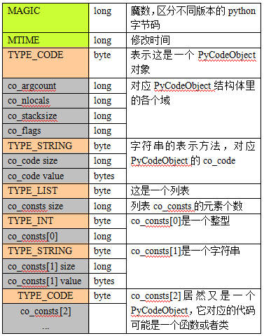

### 分析字节码

#### 解析PyCodeObject

Python提供了内置函数compile可以编译Python代码和查看PyCodeObject对象，如下：

```python
s = ”hello”

def func():
    print s

func()
```

在Python交互式shell里编译代码得到PyCodeObject对象:

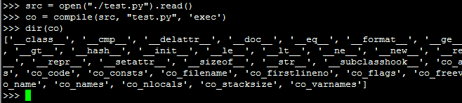

dir(co)已经列出co的各个域，想查看某个域直接在终端输出即可：

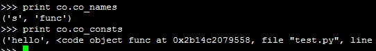

test.py的PyCodeObject

```
co.co_argcount    0
co.co_nlocals     0
co.co_names       (‘s’, ’func’)
co.co_varnames    (‘s’, ’func’)
co.co_consts      (‘hello’, <code object func at 0x2aaeeec57110, file ”test.py”, line 3>, None)
co.co_code        ’d\x00\x00Z\x00\x00d\x01\x00\x84\x00\x00Z\x01\x00e\x01\x00\x83\x00\x00\x01d\x02\x00S’
```

Python解释器会为函数也生成的字节码PyCodeObject对象，见上面的co_consts[1]

func的PyCodeObject

```
func.co_argcount   0
func.co_nlocals    0
func.co_names      (‘s’,)
func.co_varnames   ()
func.co_consts     (None,)
func.co_code       ‘t\x00\x00GHd\x00\x00S’
```

co_code是指令序列，是一串二进制流，它的格式和解析方法见6.2。

#### 解析指令序列

指令序列co_code的格式

```
opcode	oparg	opcode	opcode	oparg	…
1 byte	2 bytes	1 byte	1 byte	2 bytes
```

Python内置的dis模块可以解析co_code，如下图：

test.py的指令序列

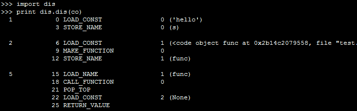

func函数的指令序列


第一列表示以下几个指令在py文件中的行号;

第二列是该指令在指令序列co_code里的偏移量;

第三列是指令opcode的名称，分为有操作数和无操作数两种，opcode在指令序列中是一个字节的整数;

第四列是操作数oparg，在指令序列中占两个字节，基本都是co_consts或者co_names的下标;

第五列带括号的是操作数说明。

### 执行字节码

Python虚拟机的原理就是模拟可执行程序再X86机器上的运行，X86的运行时栈帧如下图：

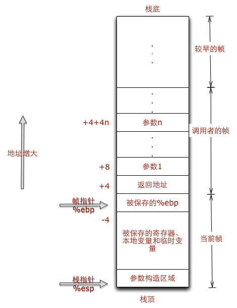

假如test.py用C语言来实现，会是下面这个样子：

```c
const char *s = “hello”;

void func() {
    printf(“%s\n”, s);
}

int main() {
    func();
    return 0;
}
```

Python虚拟机的原理就是模拟上述行为。当发生函数调用时，创建新的栈帧，对应Python的实现就是PyFrameObject对象。

#### PyFrameObject

```python
typedef struct _frame {
    PyObject_VAR_HEAD
    struct _frame *f_back;    /* 调用者的帧 */
    PyCodeObject *f_code;     /* 帧对应的字节码对象 */
    PyObject *f_builtins;     /* 内置名字空间 */
    PyObject *f_globals;      /* 全局名字空间 */
    PyObject *f_locals;       /* 本地名字空间 */
    PyObject **f_valuestack;  /* 运行时栈底 */
    PyObject **f_stacktop;    /* 运行时栈顶 */
    …….
}
```

那么对应Python的运行时栈就是这样子：

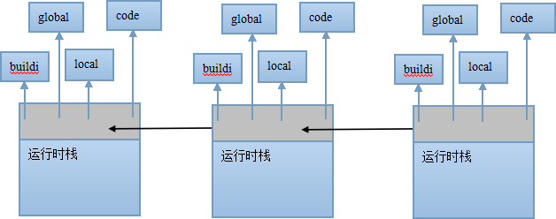

#### 执行指令

执行test.py的字节码时，会先创建一个栈帧，以下用f表示当前栈帧，执行过程注释如下：

test.py的符号名集合和常量集合

```
co.co_names   (‘s’, ’func’)
co.co_consts  (‘hello’, <code object func at 0x2aaeeec57110, file ”test.py”, line 3>, None)
```

test.py的指令序列

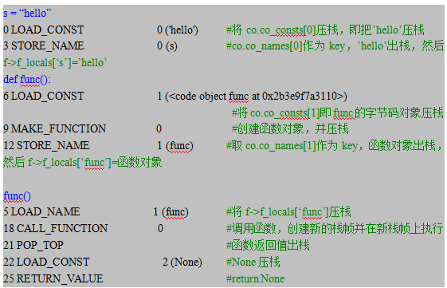

上面的CALL_FUNCTION指令执行时，会创建新的栈帧，并执行func的字节码指令，以下用f表示当前栈帧，func的字节码执行过程如下：

func函数的符号名集合和常量集合

```
func.co_names       (‘s’,)
func.co_consts      (None,)
```

func函数的指令序列

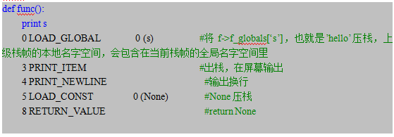

#### 查看栈帧

如果你想查看当前栈帧，Python提供了`sys._getframe()`方法可以获取当前栈帧，你只需要在代码里加入代码如下：

```python
def func():
    import sys
    frame = sys._getframe()
    print frame.f_locals
    print frame.f_globals
    print frame.f_back.f_locals
    #你可以打印frame的各个域
    print s
```

## Python 黑魔法

### Python 多继承

```python
In [1]: class A(object):
   ...:         def foo(self):
   ...:                 print("class A")
   ...:

In [2]: class B(object):
   ...:         def foo(self):
   ...:                 print("class B")
   ...:

In [3]: class C(A, B):
   ...:         pass
   ...:

In [4]: C().foo()
class A # 例子很好懂, C继承了A和B，从左到右,发现A有foo方法,返回了
```

看起来都是很简单, 有次序的从底向上,从前向后找,找到就返回. 再看例子:

```python
In [5]: class A(object):
   ...:        def foo(self):
   ...:               print("class A")
   ...:

In [6]: class B(A):
   ...:        pass
   ...:

In [7]: class C(A):
   ...:        def foo(self):
   ...:               print("class C")
   ...:

In [8]: class D(B,C):
   ...:        pass
   ...:

In [9]: D().foo()
class C # ? 按道理, 顺序是 D->B->A,为什么找到了C哪去了
```

这也就涉及了MRO(Method Resolution Order):

```python
In [10]: D.__mro__
Out[10]: (__main__.D, __main__.B, __main__.C, __main__.A, object)
```

简单的理解其实就是新式类是广度优先了， D->B, 但是发现C也是继承A，就先找C，最后再去找A

### 列表的+和+=, append和extend

```python
In [17]: print('ID:', id(a_list))
('ID:', 4481323592)

In [18]: a_list += [1]

In [19]: print('ID (+=):', id(a_list))
('ID (+=):', 4481323592) # 使用+= 还是在原来的列表上操作

In [20]: a_list = a_list + [2]

In [21]: print('ID (list = list + ...):', id(a_list))
('ID (list = list + ...):', 4481293056) # 简单的+其实已经改变了原有列表
In [28]: a_list = []

In [29]: id(a_list)
Out[29]: 4481326976

In [30]: a_list.append(1)

In [31]: id(a_list)
Out[31]: 4481326976 # append 是在原有列表添加

In [32]: a_list.extend([2])

In [33]: id(a_list)
Out[33]: 4481326976 # extend 也是在原有列表上添加
```

### datetime也有布尔值

```python
In [34]: import datetime

In [35]: print('"datetime.time(0,0,0)" (Midnight) ->', bool(datetime.time(0,0,0)))
('"datetime.time(0,0,0)" (Midnight) ->', False)

In [36]: print('"datetime.time(1,0,0)" (1 am) ->', bool(datetime.time(1,0,0)))
('"datetime.time(1,0,0)" (1 am) ->', True)
```

### ’==’ 和 is 的区别

我的理解是”is”是判断2个对象的身份, ==是判断2个对象的值

```python
In [37]: a = 1

In [38]: b = 1

In [39]: print('a is b', bool(a is b))
('a is b', True)

In [40]: c = 999

In [41]: d = 999

In [42]: print('c is d', bool(c is d))
('c is d', False) # 原因是python的内存管理,缓存了-5 - 256的对象

In [43]: print('256 is 257-1', 256 is 257-1)
('256 is 257-1', True)

In [44]: print('257 is 258-1', 257 is 258 - 1)
('257 is 258-1', False)

In [45]: print('-5 is -6+1', -5 is -6+1)
('-5 is -6+1', True)

In [46]: print('-7 is -6-1', -7 is -6-1)
('-7 is -6-1', False)
In [47]: a = 'hello world!'

In [48]: b = 'hello world!'

In [49]: print('a is b,', a is b)
('a is b,', False) # 很明显 他们没有被缓存,这是2个字段串的对象

In [50]: print('a == b,', a == b)
('a == b,', True) # 但他们的值相同
# But, 有个特例
In [51]: a = float('nan')

In [52]: print('a is a,', a is a)
('a is a,', True)

In [53]: print('a == a,', a == a)
('a == a,', False) # 亮瞎我眼睛了~
```

### bool其实是int的子类

```python
In [97]: isinstance(True, int)
Out[97]: True

In [98]: True + True
Out[98]: 2

In [99]: 3 * True + True
Out[99]: 4

In [100]: 3 * True - False
Out[100]: 3

In [104]: True << 10
Out[104]: 1024
```

### 元组是不是真的不可变?

```python
In [111]: tup = ([],)

In [112]: tup[0] += [1]
---------------------------------------------------------------------------
TypeError                                 Traceback (most recent call last)
<ipython-input-112-d4f292cf35de> in <module>()
----> 1 tup[0] += [1]

TypeError: 'tuple' object does not support item assignment

In [113]: tup
Out[113]: ([1],) # 我靠 又是亮瞎我眼睛,明明抛了异常 还能修改?

In [114]: tup = ([],)

In [115]: tup[0].extend([1])

In [116]: tup[0]
Out[116]: [1] # 好吧,我有点看明白了, 虽然我不能直接操作元组，但是不能阻止我操作元组中可变的子对象(list)
```

+= 是一个特例

```python
In [117]: my_tup = (1,)

In [118]: my_tup += (4,)

In [119]: my_tup = my_tup + (5,)

In [120]: my_tup
Out[120]: (1, 4, 5) # ? 嗯 不是不能操作元组嘛?

In [121]: my_tup = (1,)

In [122]: print(id(my_tup))
4481317904

In [123]: my_tup += (4,)

In [124]: print(id(my_tup))
4480606864 # 操作的不是原来的元组 所以可以

In [125]: my_tup = my_tup + (5,)

In [126]: print(id(my_tup))
4474234912
```

### 异常处理加 else

```python
In [150]: try:
   .....:     print('third element:', a_list[2])
   .....: except IndexError:
   .....:     print('raised IndexError')
   .....: else:
   .....:     print('no error in try-block') # 只有在try里面没有异常的时候才会执行else里面的表达式
   .....:
raised IndexError # 抛异常了 没完全完成
In [153]: i = 0

In [154]: while i < 2:
   .....:     print(i)
   .....:     i += 1
   .....: else:
   .....:     print('in else')
   .....:
0
1
in else # while也支持哦~
In [155]: i = 0

In [156]: while i < 2:
   .....:         print(i)
   .....:         i += 1
   .....:         break
   .....: else:
   .....:         print('completed while-loop')
   .....:
0 # 被break了 没有完全执行完 就不执行else里面的了
In [158]: for i in range(2):
   .....:         print(i)
   .....: else:
   .....:         print('completed for-loop')
   .....:
0
1
completed for-loop

In [159]: for i in range(2):
   .....:         print(i)
   .....:         break
   .....: else:
   .....:         print('completed for-loop')
   .....:
0 # 也是因为break了
```


## 深拷贝与浅拷贝

### 对象赋值

Python中，对象的赋值，拷贝（深/浅拷贝）之间是有差异的，如果使用的时候不注意，就可能产生意外的结果。

直接看一段代码

```python
will = ["Will", 28, ["Python", "C#", "JavaScript"]]
wilber = will
print id(will)
print will
print [id(ele) for ele in will]
print id(wilber)
print wilber
print [id(ele) for ele in wilber]

will[0] = "Wilber"
will[2].append("CSS")
print id(will)
print will
print [id(ele) for ele in will]
print id(wilber)
print wilber
print [id(ele) for ele in wilber]
```

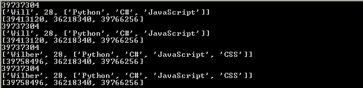

下面来分析一下这段代码：

+ 首先，创建了一个名为will的变量，这个变量指向一个list对象，从第一张图中可以看到所有对象的地址（每次运行，结果可能不同）
+ 然后，通过will变量对wilber变量进行赋值，那么wilber变量将指向will变量对应的对象（内存地址），也就是说"wilber is will"，"wilber[i] is will[i]"
+ 可以理解为，Python中，对象的赋值都是进行对象引用（内存地址）传递

第三张图中，由于will和wilber指向同一个对象，所以对will的任何修改都会体现在wilber上
这里需要注意的一点是，str是不可变类型，所以当修改的时候会替换旧的对象，产生一个新的地址39758496

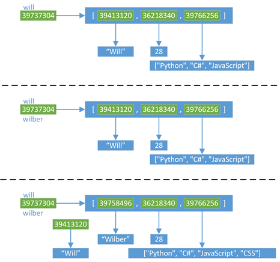

### 浅拷贝

下面就来看看浅拷贝的结果：

```python
import copy

will = ["Will", 28, ["Python", "C#", "JavaScript"]]
wilber = copy.copy(will)

print id(will)
print will
print [id(ele) for ele in will]
print id(wilber)
print wilber
print [id(ele) for ele in wilber]

will[0] = "Wilber"
will[2].append("CSS")
print id(will)
print will
print [id(ele) for ele in will]
print id(wilber)
print wilber
print [id(ele) for ele in wilber]
```

代码结果为：

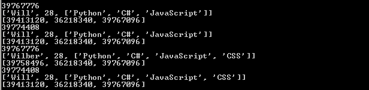

分析一下这段代码：

+ 首先，依然使用一个will变量，指向一个list类型的对象
+ 然后，通过copy模块里面的浅拷贝函数copy()，对will指向的对象进行浅拷贝，然后浅拷贝生成的新对象赋值给wilber变量
	+ 浅拷贝会创建一个新的对象，这个例子中"wilber is not will"
	+ 但是，对于对象中的元素，浅拷贝就只会使用原始元素的引用（内存地址），也就是说"wilber[i] is will[i]"
+ 当对will进行修改的时候
	+ 由于list的第一个元素是不可变类型，所以will对应的list的第一个元素会使用一个新的对象39758496
	+ 但是list的第三个元素是一个可变类型，修改操作不会产生新的对象，所以will的修改结果会相应的反应到wilber上

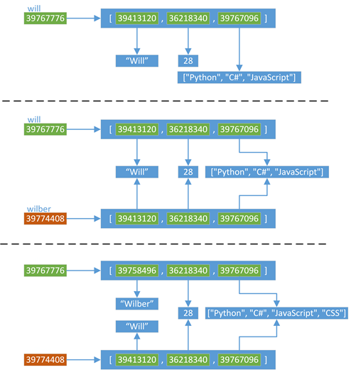

总结一下，当我们使用下面的操作的时候，会产生浅拷贝的效果：

+ 使用切片[:]操作
+ 使用工厂函数（如list/dir/set）
+ 使用copy模块中的copy()函数

### 深拷贝

最后来看看深拷贝：

```python
import copy

will = ["Will", 28, ["Python", "C#", "JavaScript"]]
wilber = copy.deepcopy(will)

print id(will)
print will
print [id(ele) for ele in will]
print id(wilber)
print wilber
print [id(ele) for ele in wilber]

will[0] = "Wilber"
will[2].append("CSS")
print id(will)
print will
print [id(ele) for ele in will]
print id(wilber)
print wilber
print [id(ele) for ele in wilber]
```

代码的结果为：

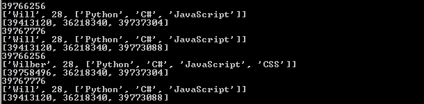

分析一下这段代码：

+ 首先，同样使用一个will变量，指向一个list类型的对象
+ 然后，通过copy模块里面的深拷贝函数deepcopy()，对will指向的对象进行深拷贝，然后深拷贝生成的新对象赋值给wilber变量
	+ 跟浅拷贝类似，深拷贝也会创建一个新的对象，这个例子中"wilber is not will"
	+ 但是，对于对象中的元素，深拷贝都会重新生成一份（有特殊情况，下面会说明），而不是简单的使用原始元素的引用（内存地址）
	+ 例子中will的第三个元素指向39737304，而wilber的第三个元素是一个全新的对象39773088，也就是说，"wilber[2] is not will[2]"
+ 当对will进行修改的时候
	+ 由于list的第一个元素是不可变类型，所以will对应的list的第一个元素会使用一个新的对象39758496
	+ 但是list的第三个元素是一个可变类型，修改操作不会产生新的对象，但是由于"wilber[2] is not will[2]"，所以will的修改不会影响wilber

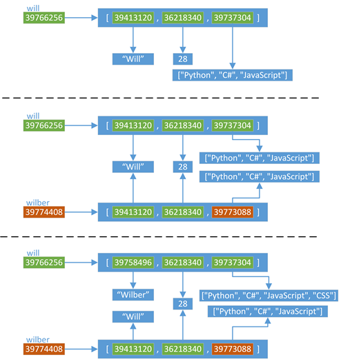

### 拷贝的特殊情况

其实，对于拷贝有一些特殊情况：

+ 对于非容器类型（如数字、字符串、和其他'原子'类型的对象）没有拷贝这一说
	+ 也就是说，对于这些类型，"obj is copy.copy(obj)" 、"obj is copy.deepcopy(obj)"
+ 如果元组变量只包含原子类型对象，则不能深拷贝，看下面的例子

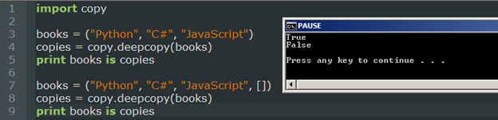

总结

本文介绍了对象的赋值和拷贝，以及它们之间的差异：

+ Python中对象的赋值都是进行对象引用（内存地址）传递
+ 使用copy.copy()，可以进行对象的浅拷贝，它复制了对象，但对于对象中的元素，依然使用原始的引用.
+ 如果需要复制一个容器对象，以及它里面的所有元素（包含元素的子元素），可以使用copy.deepcopy()进行深拷贝
+ 对于非容器类型（如数字、字符串、和其他'原子'类型的对象）没有被拷贝一说
+ 如果元组变量只包含原子类型对象，则不能深拷贝，看下面的例子

## Python 中 self 的含义

刚开始学习Python的类写法的时候觉得很是麻烦，为什么定义时需要而调用时又不需要，为什么不能内部简化从而减少我们敲击键盘的次数？

### self代表类的实例，而非类。

实例来说明

```python
class Test:
    def prt(self):
        print(self)
        print(self.__class__)

t = Test()
t.prt()
```

执行结果如下

```python
<__main__.Test object at 0x000000000284E080>
<class '__main__.Test'>
```

从上面的例子中可以很明显的看出，self代表的是类的实例。而self.class则指向类。

### self不必非写成self

有很多童鞋是先学习别的语言然后学习Python的，所以总觉得self怪怪的，想写成this，可以吗？

当然可以，还是把上面的代码改写一下。

```python
class Test:
    def prt(this):
        print(this)
        print(this.__class__)

t = Test()
t.prt()
```

改成this后，运行结果完全一样。

当然，最好还是尊重约定俗成的习惯，使用self。

### self可以不写吗

在Python的解释器内部，当我们调用t.prt()时，实际上Python解释成Test.prt(t)，也就是说把self替换成类的实例。

有兴趣的童鞋可以把上面的t.prt()一行改写一下，运行后的实际结果完全相同。

实际上已经部分说明了self在定义时不可以省略，如果非要试一下，那么请看下面：

```python
class Test:
    def prt():
        print(self)

t = Test()
t.prt()
```

运行时提醒错误如下：prt在定义时没有参数，但是我们运行时强行传了一个参数。
由于上面解释过了t.prt()等同于Test.prt(t)，所以程序提醒我们多传了一个参数t。

```
Traceback (most recent call last):
  File "h.py", line 6, in <module>
    t.prt()
TypeError: prt() takes 0 positional arguments but 1 was given
```

当然，如果我们的定义和调用时均不传类实例是可以的，这就是类方法。

```python
class Test:
    def prt():
        print(__class__)
Test.prt()
```

运行结果如下

	<class '__main__.Test'>

在继承时，传入的是哪个实例，就是那个传入的实例，而不是指定义了self的类的实例。
先看代码

```python
class Parent:
    def pprt(self):
        print(self)

class Child(Parent):
    def cprt(self):
        print(self)
c = Child()
c.cprt()
c.pprt()
p = Parent()
p.pprt()
```

运行结果如下

```
<__main__.Child object at 0x0000000002A47080>
<__main__.Child object at 0x0000000002A47080>
<__main__.Parent object at 0x0000000002A47240>
```

解释：

运行c.cprt()时应该没有理解问题，指的是Child类的实例。

但是在运行c.pprt()时，等同于Child.pprt(c)，所以self指的依然是Child类的实例，由于self中没有定义pprt()方法，所以沿着继承树往上找，发现在父类Parent中定义了pprt()方法，所以就会成功调用。

在描述符类中，self指的是描述符类的实例

不太容易理解，先看实例：

```python
class Desc:
    def __get__(self, ins, cls):
        print('self in Desc: %s ' % self )
        print(self, ins, cls)
class Test:
    x = Desc()
    def prt(self):
        print('self in Test: %s' % self)
t = Test()
t.prt()
t.x
```

运行结果如下：

```
self in Test: <__main__.Test object at 0x0000000002A570B8>
self in Desc: <__main__.Desc object at 0x000000000283E208>
<__main__.Desc object at 0x000000000283E208> <__main__.Test object at 0x0000000002A570B8> <class '__main__.Test'>
```

大部分童鞋开始有疑问了，为什么在Desc类中定义的self不是应该是调用它的实例t吗？怎么变成了Desc类的实例了呢？

注意：此处需要睁大眼睛看清楚了，这里调用的是t.x，也就是说是Test类的实例t的属性x，由于实例t中并没有定义属性x，所以找到了类属性x，而该属性是描述符属性，为Desc类的实例而已，所以此处并没有顶用Test的任何方法。

那么我们如果直接通过类来调用属性x也可以得到相同的结果。

下面是把t.x改为Test.x运行的结果。

```
self in Test: <__main__.Test object at 0x00000000022570B8>
self in Desc: <__main__.Desc object at 0x000000000223E208>
<__main__.Desc object at 0x000000000223E208> None <class '__main__.Test'>
```

题外话：由于在很多时候描述符类中仍然需要知道调用该描述符的实例是谁，所以在描述符类中存在第二个参数ins，用来表示调用它的类实例，所以t.x时可以看到第三行中的运行结果中第二项为<main.Test object at 0x0000000002A570B8>。而采用Test.x进行调用时，由于没有实例，所以返回None。

### 总结

+ self在定义时需要定义，但是在调用时会自动传入。
+ self的名字并不是规定死的，但是最好还是按照约定是用self
+ self总是指调用时的类的实例。

## Python 类库引入机制

首先，看一个简单的例子：

```python
"""
目录结构如下：
├── __init__.py
├── main.py
└── string.py
"""
# main.py 内容如下
import string
print string.a
# string.py 内容如下
a = 2
```

现在，考虑一下：

1. 当我们执行main.py的时候，会发生什么事情？
2. 在main.py文件执行到`import string`的时候，解释器导入的string类库是当前文件夹下的string.py还是系统标准库的string.py呢？
3. 如果明确的指明⾃己要引⼊的类库？

为了搞清楚上面的问题，我们需要了解关于Python类库引入的机制。

Python 提供了二种引入机制：

1. relative import
2. absolute import

### relative import

relative import 也叫作相对引入，在Python2.5及之前是默认的引入方法。它的使用方法如下：

```python
from .string import a
from ..string import a
from ...string import a
```

这种引入方式使用一个点号来标识引入类库的精确位置。与linux的相对路径表示相似，一个点表示当前目录，每多一个点号则代表向上一层目录。

```python
"""
├── __init__.py
├── foo.py
└── main.py
"""
# foo.py
a = 2
# main.py
print __name__
from .foo import a
print a
```

相对引入，那么我们需要知道相对什么来引入。相对引入使用被引入文件的`__name__`属性来决定该文件在整个包结构的位置。那么如果文件的`__name__`没有包含任何包的信息，例如`__name__`被设置为了`__main__`，则认为其为‘top level script'，而不管该文件的位置，这个时候相对引入就没有引入的参考物。如上面的程序所示，当我们执行`python main.py`时，Python解释器会抛出 ValueError: Attempted relative import in non-package的异常。

为了解决这个问题，[PEP 0366 -- Main module explicit relative imports](https://www.python.org/dev/peps/pep-0366/)提出了一个解决方案。允许用户使用`python -m ex2.main`的方式,来执行该文件。在这个方案下，引入了一个新的属性`__package__`。

```bash

╭─liuchang@localhost  ~/Codes/pycon
╰─$ cat ex2/main.py
print __name__
print __package__
from .foo import a
print a
╭─liuchang@localhost  ~/Codes/pycon
╰─$ python -m ex2.main
__main__
ex2
2
```

### absolute import

absolute import 也叫作完全引入，非常类似于Java的引入进制，在Python2.5被完全实现，但是是需要通过`from __future__ import absolute_import`来打开该引入进制。在Python2.6之后以及Python3，完全引用成为Python的默认的引入机制。它的使用方法如下：

```
from pkg import foo
from pkg.moduleA import foo
```

要注意的是，需要从包目录最顶层目录依次写下，而不能从中间开始。

在使用该引入方式时，我们碰到比较多的问题就是因为位置原因，Python找不到相应的库文件，抛出ImportError的异常。让我们看一个完全引用的例子:

```python
"""
ex3
├── __init__.py
├── foo.py
└── main.py
"""
# foo.py
a = 2

# main.py
print __name__
print __package__
from ex2.foo import a
print a
```

我们尝试着去运行main.py文件，Python解释器会抛出ImportError。那么我们如何解决这个问题呢？

```python
╰─$ python ex3/main.py
__main__
None
Traceback (most recent call last):
  File "ex3/main.py", line 3, in <module>
    from ex2.foo import a
ImportError: No module named ex2.foo
```

首先，我们也可以使用前文所述的module的方式去运行程序，通过-m参数来告诉解释器`__package__`属性。如下：

``` python
╭─liuchang@liuchangdeMacBook-Pro  ~/Codes/pycon
╰─$ python -m ex3.main                                                                             
__main__
ex3
2
```

另外，我们还有一个办法可以解决该问题，在描述之前，我们介绍一个关于Python的非常有用的小知识：**Python解释器会自动将当前工作目录添加到PYTHONPATH**。如下所示，可以看到我们打印出的`sys.path`已经包含了当前工作目录。

```python
╭─liuchang@liuchangdeMacBook-Pro  ~/Codes/pycon/ex4
╰─$ cat main.py
import sys
print sys.path
╭─liuchang@liuchangdeMacBook-Pro  ~/Codes/pycon/ex4
╰─$ python main.py
['/Users/liuchang/Codes/pycon/ex4', '/Library/Python/2.7/site-packages/pip-7.1.0-py2.7.egg', '/Library/Python/2.7/site-packages/mesos-_PACKAGE_VERSION_-py2.7.egg', '/System/Library/Frameworks/Python.framework/Versions/2.7/lib/python27.zip', '/System/Library/Frameworks/Python.framework/Versions/2.7/lib/python2.7', '/System/Library/Frameworks/Python.framework/Versions/2.7/lib/python2.7/plat-darwin', '/System/Library/Frameworks/Python.framework/Versions/2.7/lib/python2.7/plat-mac', '/System/Library/Frameworks/Python.framework/Versions/2.7/lib/python2.7/plat-mac/lib-scriptpackages', '/System/Library/Frameworks/Python.framework/Versions/2.7/Extras/lib/python', '/System/Library/Frameworks/Python.framework/Versions/2.7/lib/python2.7/lib-tk', '/System/Library/Frameworks/Python.framework/Versions/2.7/lib/python2.7/lib-old', '/System/Library/Frameworks/Python.framework/Versions/2.7/lib/python2.7/lib-dynload', '/Users/liuchang/Library/Python/2.7/lib/python/site-packages', '/usr/local/lib/python2.7/site-packages', '/System/Library/Frameworks/Python.framework/Versions/2.7/Extras/lib/python/PyObjC', '/Library/Python/2.7/site-packages']
```

了解了Python解释器的这个特性后，我们就可以解决完全引用的找不到类库的问题：执行的时候，让解释器自动的将类库的目录添加到PYTHONPATH中。

我们可以在顶层目录中添加一个run_ex3.py的文件，文件内容和运行结果如下，可以看到Python解释器正确的执行了ex3.main文件。

```python
╭─liuchang@liuchangdeMacBook-Pro  ~/Codes/pycon
╰─$ cat run_ex3.py
from ex3 import main
╭─liuchang@liuchangdeMacBook-Pro  ~/Codes/pycon
╰─$ python run_ex3.py
ex3.main
None
2
```

### 相对引用还是绝对引用？
上面介绍了Python的两种引用方式，都可以解决引入歧义的问题。那我们应该使用哪一种呢？

先说明一下Python的默认引用方式，在Python2.4及之前，Python只有相对引用这一种方式，在Python2.5中实现了绝对引用，但默认没有打开，需要用户自己指定使用该引用方式。在之后的版本和Python3版本，绝对引用已经成为默认的引用方式。

其次，二种引用方式各有利弊。绝对引用代码更加清晰明了，可以清楚的看到引入的包名和层次，但是，当包名修改的时候，我们需要手动修改所有的引用代码。相对引用则比较精简，不会被包名修改所影响，但是可读性较差，不如完全引用清晰。

最后，对于两种引用的方式选择，还是有争论的。在PEP8中，Python官方推荐的是绝对引用,详细理由可以参考[这儿](https://www.python.org/dev/peps/pep-0008/#imports)。

> Absolute imports are recommended, as they are usually more readable and tend to be better behaved (or at least give better error messages) if the import system is incorrectly configured (such as when a directory inside a package ends up on sys.path ):
```python
import mypkg.sibling
from mypkg import sibling
from mypkg.sibling import example
```

> However, explicit relative imports are an acceptable alternative to absolute imports, especially when dealing with complex package layouts where using absolute imports would be unnecessarily verbose:
```python
from . import sibling
from .sibling import example
```

> Standard library code should avoid complex package layouts and always use absolute imports.
> Implicit relative imports should never be used and have been removed in Python 3.

### 规范打包发布

为了别人使用自己代码的方便，应该尽量使用规范的包分发机制。为自己的Python包编写正确的setup.py文件，添加相应的README.md文件。对于提供一些可执行命令的包，则可以使用 console_entrypoint 的机制来提供。因为打包和分发不是本文重点，不再详细叙述，大家可以查看官方文档。

### 使用virtualenv管理包依赖

在使用Python的时候，尽量使用virtualenv来管理项目，所有的项目从编写到运行都在特定的virtualenv中。并且为自己的项目生成正确的依赖描述文件。

```bash
pip freeze > requirements.txt
```

关于virtualenv的用法，可以参考我之前的一篇文章[virtualenv教程](http://lcblog-wordpress.stor.sinaapp.com/uploads/2015/10/virtualenv教程.pdf)。

### Python import实现

Python 提供了 import 语句来实现类库的引用，下面我们详细介绍当执行了 import 语句的时候，内部究竟做了些什么事情。

当我们执行一行 `from package import module as mymodule`命令时，Python解释器会查找package这个包的module模块，并将该模块作为mymodule引入到当前的工作空间。所以import语句主要是做了二件事：

1. 查找相应的module
2. 加载module到local namespace

下面我们详细了解python是如何查找模块的。

#### 查找module的过程

在import的第一个阶段，主要是完成了查找要引入模块的功能，这个查找的过程如下：

1. 检查 sys.modules (保存了之前import的类库的缓存），如果module被找到，则⾛到第二步。
2. 检查 sys.meta\_path。meta\_path 是一个 list，⾥面保存着一些 finder 对象，如果找到该module的话，就会返回一个finder对象。
3. 检查⼀些隐式的finder对象，不同的python实现有不同的隐式finder，但是都会有 sys.path\_hooks, sys.path\_importer\_cache 以及sys.path。
4. 抛出 ImportError。

#### sys.modules

对于第一步中sys.modules，我们可以打开Python来实际的查看一下其内容：

>
```python
Python 2.7.10 (default, Aug 22 2015, 20:33:39)
[GCC 4.2.1 Compatible Apple LLVM 7.0.0 (clang-700.0.59.1)] on darwin
Type "help", "copyright", "credits" or "license" for more information.
>>> import sys
>>> sys.modules
{'copy_reg': <module 'copy_reg' from '/System/Library/Frameworks/Python.framework/Versions/2.7/lib/python2.7/copy_reg.pyc'>, 'sre_compile': <module 'sre_compile' from '/System/Library/Frameworks/Python.framework/Versions/2.7/lib/python2.7/sre_compile.pyc'>, '_sre': <module '_sre' (built-in)>, 'encodings': <module 'encodings' from '/System/Library/Frameworks/Python.framework/Versions/2.7/lib/python2.7/encodings/__init__.pyc'>, 'site': <module 'site' from '/System/Library/Frameworks/Python.framework/Versions/2.7/lib/python2.7/site.pyc'>, '__builtin__': <module '__builtin__' (built-in)>, 'sysconfig': <module 'sysconfig' from '/System/Library/Frameworks/Python.framework/Versions/2.7/lib/python2.7/sysconfig.pyc'>, 'encodings.encodings': None, '__main__': <module '__main__' (built-in)>, 'supervisor': <module 'supervisor' (built-in)>, 'abc': <module 'abc' from '/System/Library/Frameworks/Python.framework/Versions/2.7/lib/python2.7/abc.pyc'>, 'posixpath': <module 'posixpath' from '/System/Library/Frameworks/Python.framework/Versions/2.7/lib/python2.7/posixpath.pyc'>, '_weakrefset': <module '_weakrefset' from '/System/Library/Frameworks/Python.framework/Versions/2.7/lib/python2.7/_weakrefset.pyc'>, 'errno': <module 'errno' (built-in)>, 'encodings.codecs': None, 'sre_constants': <module 'sre_constants' from '/System/Library/Frameworks/Python.framework/Versions/2.7/lib/python2.7/sre_constants.pyc'>, 're': <module 're' from '/System/Library/Frameworks/Python.framework/Versions/2.7/lib/python2.7/re.pyc'>, '_abcoll': <module '_abcoll' from '/System/Library/Frameworks/Python.framework/Versions/2.7/lib/python2.7/_abcoll.pyc'>, 'types': <module 'types' from '/System/Library/Frameworks/Python.framework/Versions/2.7/lib/python2.7/types.pyc'>, '_codecs': <module '_codecs' (built-in)>, 'encodings.__builtin__': None, '_warnings': <module '_warnings' (built-in)>, 'genericpath': <module 'genericpath' from '/System/Library/Frameworks/Python.framework/Versions/2.7/lib/python2.7/genericpath.pyc'>, 'stat': <module 'stat' from '/System/Library/Frameworks/Python.framework/Versions/2.7/lib/python2.7/stat.pyc'>, 'zipimport': <module 'zipimport' (built-in)>, '_sysconfigdata': <module '_sysconfigdata' from '/System/Library/Frameworks/Python.framework/Versions/2.7/lib/python2.7/_sysconfigdata.pyc'>, 'mpl_toolkits': <module 'mpl_toolkits' (built-in)>, 'warnings': <module 'warnings' from '/System/Library/Frameworks/Python.framework/Versions/2.7/lib/python2.7/warnings.pyc'>, 'UserDict': <module 'UserDict' from '/System/Library/Frameworks/Python.framework/Versions/2.7/lib/python2.7/UserDict.pyc'>, 'encodings.utf_8': <module 'encodings.utf_8' from '/System/Library/Frameworks/Python.framework/Versions/2.7/lib/python2.7/encodings/utf_8.pyc'>, 'sys': <module 'sys' (built-in)>, '_osx_support': <module '_osx_support' from '/System/Library/Frameworks/Python.framework/Versions/2.7/lib/python2.7/_osx_support.pyc'>, 'codecs': <module 'codecs' from '/System/Library/Frameworks/Python.framework/Versions/2.7/lib/python2.7/codecs.pyc'>, 'readline': <module 'readline' from '/System/Library/Frameworks/Python.framework/Versions/2.7/lib/python2.7/lib-dynload/readline.so'>, 'os.path': <module 'posixpath' from '/System/Library/Frameworks/Python.framework/Versions/2.7/lib/python2.7/posixpath.pyc'>, '_locale': <module '_locale' from '/System/Library/Frameworks/Python.framework/Versions/2.7/lib/python2.7/lib-dynload/_locale.so'>, 'signal': <module 'signal' (built-in)>, 'traceback': <module 'traceback' from '/System/Library/Frameworks/Python.framework/Versions/2.7/lib/python2.7/traceback.pyc'>, 'linecache': <module 'linecache' from '/System/Library/Frameworks/Python.framework/Versions/2.7/lib/python2.7/linecache.pyc'>, 'posix': <module 'posix' (built-in)>, 'encodings.aliases': <module 'encodings.aliases' from '/System/Library/Frameworks/Python.framework/Versions/2.7/lib/python2.7/encodings/aliases.pyc'>, 'exceptions': <module 'exceptions' (built-in)>, 'sre_parse': <module 'sre_parse' from '/System/Library/Frameworks/Python.framework/Versions/2.7/lib/python2.7/sre_parse.pyc'>, 'os': <module 'os' from '/System/Library/Frameworks/Python.framework/Versions/2.7/lib/python2.7/os.pyc'>, '_weakref': <module '_weakref' (built-in)>}
>>> sys.modules['zlib'].__file__
'/System/Library/Frameworks/Python.framework/Versions/2.7/lib/python2.7/lib-dynload/zlib.so'
```
>

可以看到sys.modules已经保存了一些包的信息，由这些信息，我们就可以直接知道要查找的包的位置等信息。

#### finder、loader和importer

在上文中，我们提到了sys.meta_path中保证了一些finder对象。在python中，不仅定义了finder的概念，还定义了loader和importor的概念。

* finder的任务是决定自己是否根据名字找到相应的模块，在py2中，finder对象必须实现find\_module()方法，在py3中必须要实现find\_module()或者find_loader（)方法。如果finder可以查找到模块，则会返回一个loader对象(在py3.4中，修改为返回一个module specs)。
* loader则是负责加载模块，它必须实现一个load_module()的方法。
* importer 则指一个对象，实现了finder和loader的方法。因为Python是duck type，只要实现了方法，就可以认为是该类。

### sys.meta_path

在Python查找的时候，如果在sys.modules没有查找到，就会依次调用sys.meta\_path中的finder对象。默认的情况下，sys.meta\_path是一个空列表，并没有任何finder对象。

```bash
In [6]: sys.meta_path
Out[6]: []
```

我们可以向sys.meta_path中添加一些定义的finder，来实现对Python加载模块的修改。比如下例，我们实现了一个会将每次加载包的信息打印出来的finder。

```python
from __future__ import print_function
import sys

class Watcher(object):
    @classmethod
    def find_module(cls, name, path, target=None):
        print("Importing", name, path, target)
        return None

sys.meta_path.insert(0, Watcher)

import socket
```

当我们执行的时候，就可以看到系统加载socket包时所发生的事情。

>
```python
 ╭─liuchang@localhost  ~/Codes/pycon/ex5_meta_path
 ╰─$ python finder1.py
 Importing socket None None
 Importing _socket None None
 Importing functools None None
 Importing _functools None None
 Importing _ssl None None
 Importing cStringIO None None
```
>

#### sys.path hook

Python import的hook分为二类，一类是上一章节已经描述的meta hook，另一类是 path hook。

当处理sys.path（或者package.__path__)时，就会调用对应的一部分的 Pack hook。Path Hook是通过向sys.path_hooks 中添加一个importer生成器来注册的。


sys.path\_hooks 是由可被调用的对象组成，它会顺序的检查以决定他们是否可以处理给定的sys.path的一项。每个对象会使用sys.path项的路径来作为参数被调用。如果它不能处理该路径，就必须抛出ImportError，如果可以，则会返回一个importer对象。之后，不会再尝试其它的sys.path_hooks对象，即使前一个importer出错了。

详细可以参考[registering-hooks](https://www.python.org/dev/peps/pep-0302/#specification-part-2-registering-hooks)。

### python import hooks

在介绍完Python的引用机制与一些实现方法后，接下来我们介绍一些关于如何根据自己的需求来扩展Python的引用机制。

在开始详细介绍前，给大家展示一个实用性不高，但是很有意思的例子：**让Python在执行代码的时候自动安装缺失的类库**。我们会实现一个autoinstall的模块，只要import了该模块，就可以打开该功能。如下所示，我们尝试引入tornado库的时候，iPython会提示我们没有安装。然后，我们引入了autoinstall，再尝试引入tornado，iPython就会自动的安装tornado库。

```bash
In [1]: import tornado
---------------------------------------------------------------------------
ImportError                               Traceback (most recent call last)
<ipython-input-1-3eac10687b7e> in <module>()
----> 1 import tornado

ImportError: No module named tornado

In [2]: import autoinstall

In [3]: import tornado
Installing tornado

Collecting tornado
  Downloading tornado-4.2.1.tar.gz (434kB)
Collecting backports.ssl-match-hostname (from tornado)
  Downloading http://182.92.2.186:7002/packages/backports.ssl_match_hostname-3.4.0.2-py2-none-any.whl
Collecting certifi (from tornado)
  Downloading certifi-2015.9.6.2-py2.py3-none-any.whl (371kB)
Installing collected packages: backports.ssl-match-hostname, certifi, tornado
  Running setup.py install for tornado
Successfully installed backports.ssl-match-hostname-3.4.0.2 certifi-2015.9.6.2 tornado-4.2.1
```

这个功能的实现其实很简单，利用了sys.meta_path。autoinstall的全部代码如下：
```python
from __future__ import print_function
import sys
import subprocess


class AutoInstall(object):
    _loaded = set()

    @classmethod
    def find_module(cls, name, path, target=None):
        if path is None and name not in cls._loaded:
            cls._loaded.add(name)
            print("Installing", name)
            try:
                out = subprocess.check_output(['sudo', sys.executable, '-m', 'pip', 'install', name])
                print(out)
            except Exception as e:
                print("Failed" + e.message)
        return None

sys.meta_path.append(AutoInstall)
```
### import hook的重要性

我们为什么需要Python import的hook呢？使用import的hook可以让我们做到很多事情，比如说当我们的Python包存储在一个非标准的文件中，或者Python程序存储在网络数据库中，或者像py2exe一样将Python程序打包成了一个文件，我们需要一种方法来正确的解析它们。

其次，我们希望在Python加载类库的时候，可以额外的做一些事情，比如上传审计信息，比如延迟加载，比如自动解决上例的依赖未安装的问题。

所以，import系统的Hook技术是值的花时间学习的。

### 如何实现import hooks

Python提供了一些方法，让我们可以在代码中动态的调用import。主要有如下几种：

1. \_\_import\_\_ : Python的内置函数
2. imputil        : Python的import工具库，在py2.6被声明废弃，py3中彻底移除。
3. imp            : Python2 的一个import库，py3中移除
3. importlib      : Python3 中最新添加，backport到py2.7，但只有很小的子集（只有一个函数）。

Python2 所有关于import的库的列表参见[Importing Modules](https://docs.python.org/2/library/modules.html)。Python3 的可以参考[Importing Modules](https://docs.python.org/3/library/modules.html)
[PEP 0302 -- New Import Hooks](https://www.python.org/dev/peps/pep-0302) 提案详细的描述了importlib的目的、用法。

### 一些Hook示例

#### Lazy化库引入

使用Import Hook，我们可以达到Lazy Import的效果，当我们执行import的时候，实际上并没引入该库，只有真正的使用这个库的时候，才会将其引入到当前工作空间。

具体的代码可以参考[github](https://github.com/noahmorrison/limp)。

实现的效果如下：

```python
#!/usr/bin/python

import limp  # Lazy imports begin now

import json
import sys

print('json' in sys.modules)  # False
print(', '.join(json.loads('["Hello", "World!"]')))
print('json' in sys.modules)  # True
```

它的实现也很简单：

```python
import sys
import imp

_lazy_modules = {}

class LazyModule():
    def __init__(self, name):
        self.name = name

    def __getattr__(self, attr):
        path = _lazy_modules[self.name]
        f, pathname, desc = imp.find_module(self.name, path)

        lf = sys.meta_path.pop()
        imp.load_module(self.name, f, pathname, desc)
        sys.meta_path.append(lf)


        self.__dict__ = sys.modules[self.name].__dict__
        return self.__dict__[attr]

class LazyFinder(object):

    def find_module(self, name, path):
        _lazy_modules[name] = path
        return self

    def load_module(self, name):
        return LazyModule(name)

sys.meta_path.append(LazyFinder())
```

#### Flask 插件库统一入口

使用过Flask的同学都知道，Flask的对于插件提供了统一的入口。比如说我们安装了Flask\_API这个库，然后我们可以直接`import flask_api`来使用这个库，同时Flask还允许我们采用`import flask.ext.api`的方式来引用该库。

这里Flask就是使用了import 的hook，当引入flask.ext的包时，就自动的引用相应的库。Flask实现了一个叫ExtensionImporter的类，这个类实现了find\_module和load\_module代码实现如下[github](https://github.com/mitsuhiko/flask/blob/master/flask/exthook.py#L27)：

```python
class ExtensionImporter(object):
    """This importer redirects imports from this submodule to other locations.
    This makes it possible to transition from the old flaskext.name to the
    newer flask_name without people having a hard time.
    """

    def __init__(self, module_choices, wrapper_module):
        self.module_choices = module_choices
        self.wrapper_module = wrapper_module
        self.prefix = wrapper_module + '.'
        self.prefix_cutoff = wrapper_module.count('.') + 1

    def __eq__(self, other):
        return self.__class__.__module__ == other.__class__.__module__ and \
               self.__class__.__name__ == other.__class__.__name__ and \
               self.wrapper_module == other.wrapper_module and \
               self.module_choices == other.module_choices

    def __ne__(self, other):
        return not self.__eq__(other)

    def install(self):
        sys.meta_path[:] = [x for x in sys.meta_path if self != x] + [self]

    def find_module(self, fullname, path=None):
        if fullname.startswith(self.prefix):
            return self

    def load_module(self, fullname):
        if fullname in sys.modules:
            return sys.modules[fullname]
        modname = fullname.split('.', self.prefix_cutoff)[self.prefix_cutoff]
        for path in self.module_choices:
            realname = path % modname
            try:
                __import__(realname)
            except ImportError:
                exc_type, exc_value, tb = sys.exc_info()
                # since we only establish the entry in sys.modules at the
                # very this seems to be redundant, but if recursive imports
                # happen we will call into the move import a second time.
                # On the second invocation we still don't have an entry for
                # fullname in sys.modules, but we will end up with the same
                # fake module name and that import will succeed since this
                # one already has a temporary entry in the modules dict.
                # Since this one "succeeded" temporarily that second
                # invocation now will have created a fullname entry in
                # sys.modules which we have to kill.
                sys.modules.pop(fullname, None)

                # If it's an important traceback we reraise it, otherwise
                # we swallow it and try the next choice.  The skipped frame
                # is the one from __import__ above which we don't care about
                if self.is_important_traceback(realname, tb):
                    reraise(exc_type, exc_value, tb.tb_next)
                continue
            module = sys.modules[fullname] = sys.modules[realname]
            if '.' not in modname:
                setattr(sys.modules[self.wrapper_module], modname, module)
            return module
        raise ImportError('No module named %s' % fullname)
```

然后在Flask的ext目录下的\_\_init\_\_.py文件中，初始化了该Importer。

```python
def setup():
    from ..exthook import ExtensionImporter
    importer = ExtensionImporter(['flask_%s', 'flaskext.%s'], __name__)
    importer.install()  
```

## Python的内存管理

以Python语言为例子，说明一门动态类型的、面向对象的语言的内存管理方式。

### 对象的内存使用

赋值语句是语言最常见的功能了。但即使是最简单的赋值语句，也可以很有内涵。Python的赋值语句就很值得研究。

	a = 1

整数1为一个对象。而a是一个引用。利用赋值语句，引用a指向对象1。Python是动态类型的语言(参考动态类型)，对象与引用分离。Python像使用“筷子”那样，通过引用来接触和翻动真正的食物——对象。

#### 引用和对象

为了探索对象在内存的存储，我们可以求助于Python的内置函数id()。它用于返回对象的身份(identity)。其实，这里所谓的身份，就是该对象的内存地址。

	a = 1
	print(id(a))
	print(hex(id(a)))

在我的计算机上，它们返回的是:

	11246696
	’0xab9c68′

分别为内存地址的十进制和十六进制表示。

在Python中，整数和短小的字符，Python都会缓存这些对象，以便重复使用。当我们创建多个等于1的引用时，实际上是让所有这些引用指向同一个对象。

	a = 1
	b = 1
	print(id(a))
	print(id(b))

上面程序返回

	11246696
	11246696

可见a和b实际上是指向同一个对象的两个引用。

为了检验两个引用指向同一个对象，我们可以用is关键字。is用于判断两个引用所指的对象是否相同。

	# True
	a = 1
	b = 1
	print(a is b)

	# True
	a = "good"
	b = "good"
	print(a is b)

	# False
	a = "very good morning"
	b = "very good morning"
	print(a is b)

	# False
	a = []
	b = []
	print(a is b)

上面的注释为相应的运行结果。可以看到，由于Python缓存了整数和短字符串，因此每个对象只存有一份。比如，所有整数1的引用都指向同一对象。即使使用赋值语句，也只是创造了新的引用，而不是对象本身。长的字符串和其它对象可以有多个相同的对象，可以使用赋值语句创建出新的对象。

在Python中，每个对象都有存有指向该对象的引用总数，即引用计数(reference count)。

我们可以使用sys包中的getrefcount()，来查看某个对象的引用计数。需要注意的是，当使用某个引用作为参数，传递给getrefcount()时，参数实际上创建了一个临时的引用。因此，getrefcount()所得到的结果，会比期望的多1。

```python
from sys import getrefcount

a = [1, 2, 3]
print(getrefcount(a))

b = a
print(getrefcount(b))
```

由于上述原因，两个getrefcount将返回2和3，而不是期望的1和2。

#### 对象引用对象

Python的一个容器对象(container)，比如表、词典等，可以包含多个对象。实际上，容器对象中包含的并不是元素对象本身，是指向各个元素对象的引用。

我们也可以自定义一个对象，并引用其它对象:

```python
class from_obj(object):
    def __init__(self, to_obj):
        self.to_obj = to_obj

b = [1,2,3]
a = from_obj(b)
print(id(a.to_obj))
print(id(b))
```

可以看到，a引用了对象b。

对象引用对象，是Python最基本的构成方式。即使是a = 1这一赋值方式，实际上是让词典的一个键值”a”的元素引用整数对象1。该词典对象用于记录所有的全局引用。该词典引用了整数对象1。我们可以通过内置函数globals()来查看该词典。

当一个对象A被另一个对象B引用时，A的引用计数将增加1。

```python
from sys import getrefcount

a = [1, 2, 3]
print(getrefcount(a))

b = [a, a]
print(getrefcount(a))
```

由于对象b引用了两次a，a的引用计数增加了2。

容器对象的引用可能构成很复杂的拓扑结构。我们可以用objgraph包来绘制其引用关系，比如

```python
x = [1, 2, 3]
y = [x, dict(key1=x)]
z = [y, (x, y)]

import objgraph
objgraph.show_refs([z], filename='ref_topo.png')
```

objgraph是Python的一个第三方包。安装之前需要安装xdot。

```
sudo apt-get install xdot
sudo pip install objgraph
```

两个对象可能相互引用，从而构成所谓的引用环(reference cycle)。

```python
a = []
b = [a]
a.append(b)
```

即使是一个对象，只需要自己引用自己，也能构成引用环。

```python
a = []
a.append(a)
print(getrefcount(a))
```

引用环会给垃圾回收机制带来很大的麻烦，我将在后面详细叙述这一点。

#### 引用减少

某个对象的引用计数可能减少。比如，可以使用del关键字删除某个引用:

```python
from sys import getrefcount

a = [1, 2, 3]
b = a
print(getrefcount(b))

del a
print(getrefcount(b))
```

del也可以用于删除容器元素中的元素，比如:

```python
a = [1,2,3]
del a[0]
print(a)
```

如果某个引用指向对象A，当这个引用被重新定向到某个其他对象B时，对象A的引用计数减少:

```python
from sys import getrefcount

a = [1, 2, 3]
b = a
print(getrefcount(b))

a = 1
print(getrefcount(b))
```

### 垃圾回收

吃太多，总会变胖，Python也是这样。当Python中的对象越来越多，它们将占据越来越大的内存。不过你不用太担心Python的体形，它会乖巧的在适当的时候“减肥”，启动垃圾回收(garbage collection)，将没用的对象清除。在许多语言中都有垃圾回收机制，比如Java和Ruby。尽管最终目的都是塑造苗条的提醒，但不同语言的减肥方案有很大的差异。

从基本原理上，当Python的某个对象的引用计数降为0时，说明没有任何引用指向该对象，该对象就成为要被回收的垃圾了。比如某个新建对象，它被分配给某个引用，对象的引用计数变为1。如果引用被删除，对象的引用计数为0，那么该对象就可以被垃圾回收。比如下面的表:

```python
a = [1, 2, 3]
del a
```

del a后，已经没有任何引用指向之前建立的[1, 2, 3]这个表。用户不可能通过任何方式接触或者动用这个对象。这个对象如果继续待在内存里，就成了不健康的脂肪。当垃圾回收启动时，Python扫描到这个引用计数为0的对象，就将它所占据的内存清空。

然而，减肥是个昂贵而费力的事情。垃圾回收时，Python不能进行其它的任务。频繁的垃圾回收将大大降低Python的工作效率。如果内存中的对象不多，就没有必要总启动垃圾回收。所以，Python只会在特定条件下，自动启动垃圾回收。当Python运行时，会记录其中分配对象(object allocation)和取消分配对象(object deallocation)的次数。当两者的差值高于某个阈值时，垃圾回收才会启动。

我们可以通过gc模块的get_threshold()方法，查看该阈值:

```python
import gc
print(gc.get_threshold())
```

返回(700, 10, 10)，后面的两个10是与分代回收相关的阈值，后面可以看到。700即是垃圾回收启动的阈值。可以通过gc中的set_threshold()方法重新设置。

我们也可以手动启动垃圾回收，即使用gc.collect()。

#### 分代回收

Python同时采用了分代(generation)回收的策略。这一策略的基本假设是，存活时间越久的对象，越不可能在后面的程序中变成垃圾。我们的程序往往会产生大量的对象，许多对象很快产生和消失，但也有一些对象长期被使用。出于信任和效率，对于这样一些“长寿”对象，我们相信它们的用处，所以减少在垃圾回收中扫描它们的频率。

小家伙要多检查

Python将所有的对象分为0，1，2三代。所有的新建对象都是0代对象。当某一代对象经历过垃圾回收，依然存活，那么它就被归入下一代对象。垃圾回收启动时，一定会扫描所有的0代对象。如果0代经过一定次数垃圾回收，那么就启动对0代和1代的扫描清理。当1代也经历了一定次数的垃圾回收后，那么会启动对0，1，2，即对所有对象进行扫描。

这两个次数即上面get_threshold()返回的(700, 10, 10)返回的两个10。也就是说，每10次0代垃圾回收，会配合1次1代的垃圾回收；而每10次1代的垃圾回收，才会有1次的2代垃圾回收。

同样可以用set_threshold()来调整，比如对2代对象进行更频繁的扫描。

```python
import gc
gc.set_threshold(700, 10, 5)
```

#### 孤立的引用环

引用环的存在会给上面的垃圾回收机制带来很大的困难。这些引用环可能构成无法使用，但引用计数不为0的一些对象。

```python
a = []
b = [a]
a.append(b)

del a
del b
```

上面我们先创建了两个表对象，并引用对方，构成一个引用环。删除了a，b引用之后，这两个对象不可能再从程序中调用，就没有什么用处了。但是由于引用环的存在，这两个对象的引用计数都没有降到0，不会被垃圾回收。

为了回收这样的引用环，Python复制每个对象的引用计数，可以记为gc_ref。假设，每个对象i，该计数为gc_ref_i。Python会遍历所有的对象i。对于每个对象i引用的对象j，将相应的gc_ref_j减1。

在结束遍历后，gc_ref不为0的对象，和这些对象引用的对象，以及继续更下游引用的对象，需要被保留。而其它的对象则被垃圾回收。

### 总结

Python作为一种动态类型的语言，其对象和引用分离。这与曾经的面向过程语言有很大的区别。为了有效的释放内存，Python内置了垃圾回收的支持。Python采取了一种相对简单的垃圾回收机制，即引用计数，并因此需要解决孤立引用环的问题。Python与其它语言既有共通性，又有特别的地方。对该内存管理机制的理解，是提高Python性能的重要一步。
