# Linux 的概念与体系

## 0 Linux简介与厂商版本

### Linux简介

Linux可以有狭义和广义两种定义。狭义来说，Linux实际上指Linux kernel (内核)。内核负责管理硬件，并为上层应用提供接口。而广义来说，是指以Linux kernel为基础的，包括OS和各种应用在内的各个Linux版本(distribution)。尽管看起来版本眼花缭乱，但实际上，各个版本之间也只是大同小异，其差别往往体现在客户群、升级维护和界面等方面。

Linus Torvalds是Linux之父。他根据Minix系统的代码，参照UNIX系统的设计，写出了第一给Linux内核。Linus的创举在于将Linux内核的代码开源。后来，Linux内核和一套开源的应用软件GNU结合，共同采取开源协议，并迅速发展成熟。我们可以随意地使用和修改开源代码，但以此为基础开发的程序也要根据开源协议公开。Linux和GNU的开源性吸引了大批优秀的程序员参与到Linux相关的开发中。

从哲学和设计理念上，Linux与其他的UNIX版本相类似，并使用类似的接口。我们可以通过学习Linux的基本概念和机制来了解其它UNIX系统，比如Solaris, FreeBSD，还有基于FreeBSD的苹果公司的Mac OS。曾经Windows的兴起曾经让许多人认为UNIX将最终被Windows取代，但如今看到Linux和苹果产品的兴盛，我很感慨于UNIX体系的力量。

Linux的有如下比较重要的机制: 用于储存数据以及管理权限的文件系统，用于IO的文本操作API，用于管理操作的进程，用于实现多任务运行的多线程，以及进程间通信(我将信号和网络也都归入这一类中)。

特别推荐下面的一些文章，以便你对Linux有一个概观：

[大教堂和市集（The Cathedral and the Bazaar）](http://www.catb.org/~esr/writings/cathedral-bazaar/introduction/)，作者Eric Raymond

可以说是为Linux正名的一篇文章，深入分析Linux成功的原因。你也可以通过名字来搜索中文翻译版本。

该作者的[其他文章](http://www.catb.org/~esr/writings/)也非常值得一读。

UNIX传奇，来自酷壳，作者陈皓

+ 上篇：http://coolshell.cn/articles/2322.html
+ 下篇：http://coolshell.cn/articles/2324.html

(作者博客内容丰富，又容易读，非常值得订阅。)

### Linux的厂商版本

在Linux内核基础上，我们还有许多厂商版本。即使有了内核和GNU软件，Linux的安装和编译并不是简单的工作，Linux厂商就是瞄准了这个市场。这些厂商会在Linux内核的基础上，结合自己开发的软件，帮助用户安装和使用Linux，并提供技术支持。由于在服务器领域，Linux操作系统远远领先于Windows系统，而这些被政府部门、银行或者大学拥有的服务器往往承担很重要的信息处理和IO (input/outpt) 工作，所以尽管Linux开源，厂商还是可以根据其提供的商用软件和技术支持获得丰厚的利润。

(IBM是Linux设备最大的供应商，同时它的咨询业务很大一部份也来源于提供Linux相关的支持。我们所熟知的Android操作系统，也算是Google提供的一个厂商版本。)

我们这里主要介绍在PC上比较流行的Linux厂商版本:

**红帽系列**

+ Red Hat linux: 大名鼎鼎的红帽，现在已经完结。以此为基础有以下分支:
+ Red Hat Enterprise: (www.redhat.com) 这个是企业级的linux，主要面向服务器。作为商业版，有比较好的配套软件和技术支持。RH的教材也堪称经典。
+ Fedora: (http://fedoraproject.org) 由社区维护，去除了一些商业软件。红帽实际上赞助了这个项目，以便以此作为技术测试平台。
+ CentOS: (www.centos.org) 这个版本不来自红帽的公司，是收集红帽公开的源码组成的免费版本，由社区维护，和红帽完全兼容。版本号升级较慢，但有持续的技术支持，所以适合于不愿意频繁升级的情形，鸟哥中就推荐以CentOS来建站。
 
**SUSE系列**

+ SUSE Linux Enterprise: (www.suse.com) 和红帽商业版类似，是德国公司制作的，据说在欧洲比较流行，但我欧洲的朋友表示没怎么听说过。SUSE系列比较有特色的是YAST2，就是用来设置Linux的界面，对初级管理员比较方便。
+ openSUSE: (www.opensuse.org) SUSE的免费版本。以前SUSE不是很推这个免费版本，支持不好。现在似乎态度大大转变。就我个人的使用体验来说，还是觉得社区支持不足。

**Debian系列**

+ Debian: (www.debian.org) 完全免费，社区维护的Linux版本，有很大的用户群，所以遇到问题，基本都可以找到社区用户的支持。
+ Ubuntu: (www.ubuntu.com) 由一个基金提供支持的免费Linux版本。 继承自Debian。界面很友好。发邮件过去，还会送你免费安装CD (不知道现在还有没有)。现在的版本加载的东西有些多，速度有些慢。写《大教堂和市集》的Eric Raymond说它是最好的Linux。
+ Mint (http://www.linuxmint.com), 基于ubuntu。它提供了更加丰富的预装应用，以减少用户搜索并安装应用的麻烦。其使用的应用版本比较新，可能不是很稳定。

此外，还有如下一些版本：

+ Gentoo (www.gentoo.org) 基于源码的版本，提供给用户很大的自由度。为用户提供大量应用程序的源码，可以在用户的系统上重新编译建造。需要一定的系统配置的知识。
+ ArchLinux (www.archlinux.org)，推崇简洁，避免不必要和复杂的修改，是一个轻便灵活的版本。其配置文件有良好注释。
+ Mandriva (www.mandriva.com) 一个很方便用户使用的版本，其目标是使得新用户更容易使用linux。
+ Slackware (www.slackware.com) 稳定，基本。它的只包含稳定版本的应用程序。对于初级用户不是很友好。
+ TurboLinux (www.turbolinux.com) 在亚洲比较流行。商业版本，提供技术支持和咨询服务。

## 1 Linux开机启动

计算机开机是一个神秘的过程。我们只是按了开机键，就看到屏幕上的进度条或者一行行的输出，直到我们到达登录界面。然而，计算机开机又是个异常脆弱的过程，我们满心期望的登录界面可能并不会出现，而是一个命令行或者错误信息。了解计算机开机过程有助于我们修复开机可能出现的问题。

### 最初始阶段

当我们打开计算机电源，计算机会自动从主板的BIOS(Basic Input/Output System)读取其中所存储的程序。这一程序通常知道一些直接连接在主板上的硬件(硬盘，网络接口，键盘，串口，并口)。现在大部分的BIOS允许你从软盘、光盘或者硬盘中选择一个来启动计算机。

下一步，计算机将从你所选择的存储设备中读取起始的512 bytes(比如光盘一开是的512 bytes，如果我们从光盘启动的话)。这512 bytes叫做主引导记录MBR (master boot record)。MBR会告诉电脑从该设备的某一个分区(partition)来装载引导加载程序(boot loader)。Boot loader储存有操作系统(OS)的相关信息，比如操作系统名称，操作系统内核 (kernel)所在位置等。常用的boot loader有GRUB和LILO。

随后，boot loader会帮助我们加载kernel。kernel实际上是一个用来操作计算机的程序，它是计算机操作系统的内核，主要的任务是管理计算机的硬件资源，充当软件和硬件的接口。操作系统上的任何操作都要通过kernel传达给硬件。Windows和Linux各自有自己kernel。狭义的操作系统就是指kernel，广义的操作系统包括kernel以及kernel之上的各种应用。

（Linus Torvalds与其说是Linux之父，不如说是Linux kernel之父。他依然负责Linux kernel的开发和维护。至于Ubuntu, Red Hat, 它们都是基于相同的kernel之上，囊括了不同的应用和界面构成的一个更加完整的操作系统版本。)

实际上，我们可以在多个分区安装boot loader，每个boot loader对应不同的操作系统，在读取MBR的时候选择我们想要启动的boot loader。这就是多操作系统的原理。

小结：BIOS -> MBR -> boot loader -> kernel

### kernel

如果我们加载的是Linux kernel，Linux kernel开始工作。kernel会首先预留自己运行所需的内存空间，然后通过驱动程序(driver)检测计算机硬件。这样，操作系统就可以知道自己有哪些硬件可用。随后，kernel会启动一个init进程。它是Linux系统中的1号进程(Linux系统没有0号进程)。到此，kernel就完成了在计算机启动阶段的工作，交接给init来管理。

小结: kernel -> init process

### init process

(根据boot loader的选项，Linux此时可以进入单用户模式(single user mode)。在此模式下，初始脚本还没有开始执行，我们可以检测并修复计算机可能存在的错误)

随后，init会运行一系列的初始脚本(startup scripts)，这些脚本是Linux中常见的shell scripts。这些脚本执行如下功能：

设置计算机名称，时区，检测文件系统，挂载硬盘，清空临时文件，设置网络……

当这些初始脚本，操作系统已经完全准备好了，只是，还没有人可以登录！！！init会给出登录(login)对话框，或者是图形化的登录界面。

输入用户名(比如说vamei)和密码，DONE！

在此后的过程中，你将以用户(user)vamei的身份操作电脑。此外，根据你创建用户时的设定，Linux还会将你归到某个组(group)中，比如可以是stupid组，或者是vamei组。

所以你将是用户vamei， 同时是vamei组的组员。(注意，组vamei和用户vamei只是重名而已，就好想你可以叫Dell, 同时还是Dell公司的老板一样。你完全也可以是用户vamei，同时为stupid组的组员)

### 总结

BIOS -> MBR -> boot loader -> kernel -> init process -> login

用户，组。

## 2 Linux文件管理

对于计算机来说，所谓的数据就是0和1的序列。这样的一个序列可以存储在内存中，但内存中的数据会随着关机而消失。为了将数据长久保存，我们把数据存储在光盘或者硬盘中。根据我们的需要，我们通常会将数据分开保存到文件这样一个个的小单位中(所谓的小，是相对于所有的数据而言)。但如果数据只能组织为文件的话，而不能分类的话，文件还是会杂乱无章。每次我们搜索某一个文件，就要一个文件又一个文件地检查，太过麻烦。文件系统(file system)是就是文件在逻辑上组织形式，它以一种更加清晰的方式来存放各个文件。

### 路径与文件简介

文件被组织到文件系统(file system)中，通常会成为一个树状(tree)结构。Linux有一个根目录/, 也就是树状结构的最顶端。这个树的分叉的最末端都代表一个文件，而这个树的分叉处则是一个目录(directory, 相当于我们在windows界面中看到的文件夹)。在图1中看到的是整个的一个文件树。如果我们从该树中截取一部分，比如说从目录vamei开始往下，实际上也构成一个文件系统。

要找到一个文件，除了要知道该文件的文件名，还需要知道从树根到该文件的所有目录名。从根目录开始的所有途径的目录名和文件名构成一个路径(path)。比如说，我们在Linux中寻找一个文件file.txt，不仅要知道文件名(file.txt)，还要知道完整路径，也就是绝对路径(/home/vamei/doc/file.txt)。从根目录录/, 也就是树状结构的最顶端出发，经过目录home, vamei, doc，最终才看到文件file.txt。整个文件系统层层分级(hierarchy)，vamei是home的子目录，而home是vamei的父目录。

在Linux中，我们用ls命令来显示目录下的所有文件，比如 $ls /home/vamei/doc

### 目录

在Linux系统中，目录也是一种文件。所以/home/vamei是指向目录文件vamei的绝对路径。

这个文件中至少包含有以下条目:

```
.       指向当前目录
..      指向父目录
```

除此之外，目录文件中还包含有属于该目录的文件的文件名，比如vamei中就还要有如下条目，指向属于该目录的文件:

```
doc
movie
photo
```

Linux解释一个绝对路径的方式如下：先找到根目录文件，从该目录文件中读取home目录文件的位置，然后从home文件中读取vamei的位置……直到找到目录doc中的file.txt的位置。

由于目录文件中都有.和..的条目，我们可以在路径中加入.或者..来表示当前目录或者父目录，比如/home/vamei/doc/..与/home/vamei等同。

此外，Linux会在进程中，维护一个工作目录(present working directory)的变量。在shell中，你可以随时查询到到工作目录(在命令行输入`$pwd`)。这是为了省去每次都输入很长的绝对路径的麻烦。比如说我们将工作目录更改为/home/vamei (`$cd /home/vamei`)，那么此时我们再去找file.txt就可以省去/home/vamei/ (`$ls doc/file.txt`)，这样得到的路径叫相对路径(relative path)，上面的doc/file.txt就是这样一个相对路径。

当文件出现在一个目录文件中时，我们就把文件接入到文件系统中，我们称建立一个到文件的硬链接(hard link)。一个文件允许出现在多个目录中，这样，它就有多个硬链接。当硬链接的数目(link count)降为0时，文件会被Linux删除。所以很多时候，unlink与remove在Linux操作系统中是一个意思。由于软链接(soft link)的广泛使用(soft link不会影响link count，而且可以跨越文件系统)，现在较少手动建立硬连接。

### 文件操作

对于文件，我们可以读取(read)，写入(write)和运行(execute)。读取是从已经存在的文件中获得数据。写入是向新的文件或者旧的文件写入数据。如果文件储存的是可执行的二进制码，那么它可以被载入内存，作为一个程序运行。在Linux的文件系统中，如果某个用户想对某个文件执行某一种操作，那么该用户必须拥有对该文件进行这一操作的权限。文件权限的信息保存在文件信息(metadata)中, 见下一节。

### 文件附加信息 (metadata)

文件自身包含的只有数据。文件名实际上储存在目录文件。除了这些之外，还有操作系统维护的文件附加信息，比如文件类型，文件尺寸，文件权限，文件修改时间，文件读取时间等。可以用ls命令查询文件信息($ls -l file.txt)，得到如下结果：

```
-rw-r--r-- 1 vamei vamei 8445 Sep  8 07:33 file1.txt
```

各个部分的含义如下：

+ 我们先介绍最开始的-，它表示文件类型，说明file1.txt是常规文件(如果是目录文件，则应显示d)。
+ 随后有九个字符，为rw-r--r--，它们用于表示文件权限。这九个字符分为三组，rw-, r--, r--，分别对应拥有者(owner)，拥有组(owner group)和所有其他人(other)。回顾Linux开机启动，登录后，我会有一个用户身份和一个组身份, 相当于我的名片。第一组表示，如果我的名片上的用户身份证明我是该文件的拥有者，那么我就可以对该文件有读取(r)，写入(w)该文件的权限，但不拥有执行(-，如果拥有执行权限，则为x)该文件的权限。第二组表示，如果我的名片上的组身份证明我所在的组是该文件的拥有组的一员，那么我有从该文件读入的权限。第三组表示，如果我的名片显示我既不是拥有者，也不是拥有组的一员，那么我只有读入的权限。当我想要进行一个读取操作时，Linux会先看我是否是拥有者下文会进一步解释拥有者和拥有组。
+ 后面的1是硬连接(hard link)数目(link count)。
+ 之后的vamei表示用户vamei是文件的拥有者(owner)，文件的拥有者有权更改文件权限(比如改为rwxrwxrwx)。而后面的vamei文件的拥有组是组vamei。文件的拥有者和拥有组在文件创建时就附加在文件上(相当于给文件上锁，只有有合适名片的用户才能打开操作)。要注意，Linux有一个超级用户root (也叫做根用户)，该用户拥有所有的文件。
+ 随后的8445表示文件大小，单位为字节(byte)。
+ Sep 8 07:33表示文件的上一次写入的时间(modification time)。实际上在文件附加信息中还包含有文件的上一次读取时间(access time)，没有显示出来。
 
### 软链接 (soft link, or symbolic link)

如上讨论硬链接时说到的，软链接不会影响文件的link count。如果还记得windows系统的快捷方式的话，Linux的软链接(soft link，也叫做symbolic link)就是linux的快捷方式。软链接本质上是一个文件，它的文件类型是symbolic link。在这个文件中，包含有链接指向的文件的绝对路径。当你从这个文件读取数据时，linux会把你导向所指向的文件，然后从那个文件中读取（就好像你双击快捷方式的效果一样）。软链接可以方便的在任何地方建立，并指向任何一个绝对路径。

软链接本身也是一个文件，也可以执行文件所可以进行的操作。当我们对软链接操作时，要注意我们是对软链接本身操作，还是对软链接指向的目标操作。如果是后者，我们就说该操作跟随链接指引(follow the link)。

#### umask

当我们创建文件的时候，比如使用touch，它会尝试将新建文件创建为权限666，也就是rw-rw-rw-。但操作系统要参照权限mask来看是否真正将文件创建为666。权限mask表示操作系统不允许设置的权限位，比如说037(----wxrwx)的权限mask意味着不允许设置设置group的wx位和other的rwx位。如果是这个权限mask的话，最终的文件权限是rw-r----- (group的w位和other的rw位被mask)。

我们可以通过

	$umask 022

的方式改变权限mask。

### 总结

计算机本质上是对数据进行处理的工具，而文件是数据储存的逻辑载体，所以了解Linux文件系统很重要。对于文件系统的了解要结合Linux的其他方面(比如用户管理)进行有机的学习。

文件权限，拥有者，拥有组，超级用户root

硬链接，软链接，follow the link

## 3 Linux的架构

我以下图为基础，说明Linux的架构(architecture)。(该图参考《Advanced Programming in Unix Environment》)

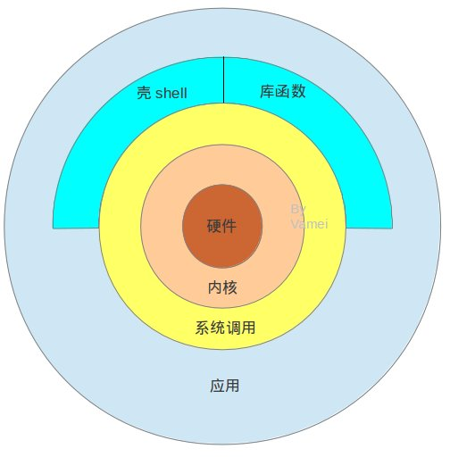

最内层是硬件，最外层是用户常用的应用，比如说firefox浏览器，evolution查看邮件，一个计算流体模型等等。硬件是物质基础，而应用提供服务。但在两者之间，还要经过一番周折。

还记得Linux启动。Linux首先启动内核 (kernel)，内核是一段计算机程序，这个程序直接管理管理硬件，包括CPU、内存空间、硬盘接口、网络接口等等。所有的计算机操作都要通过内核传递给硬件。

为了方便调用内核，Linux将内核的功能接口制作成系统调用(system call)。系统调用看起来就像C语言的函数。你可以在程序中直接调用。Linux系统有两百多个这样的系统调用。用户不需要了解内核的复杂结构，就可以使用内核。系统调用是操作系统的最小功能单位。一个操作系统，以及基于操作系统的应用，都不可能实现超越系统调用的功能。一个系统调用函数就像是汉字的一个笔画。任何一个汉字都要由基本的笔画（点、横、撇等等）构成。我不能臆造笔画。

在命令行中输入`$man 2 syscalls`可以查看所有的系统调用。你也可以通过`$man 2 read`来查看系统调用read()的说明。在这两个命令中的2都表示我们要在2类(系统调用类)中查询 (具体各个类是什么可以通过`$man man`看到)。

系统调用提供的功能非常基础，所以使用起来很麻烦。一个简单的给变量分配内存空间的操作，就需要动用多个系统调用。Linux定义一些库函数(library routine)来将系统调用组合成某些常用的功能。上面的分配内存的操作，可以定义成一个库函数(像malloc()这样的函数)。再比如说，在读取文件的时候，系统调用要求我们设置好所需要的缓冲。我可以使用Standard IO库中的读取函数。这个读取函数既负责设置缓冲，又负责使用读取的系统调用函数。使用库函数对于机器来说并没有效率上的优势，但可以把程序员从细节中解救出来。库函数就像是汉字的偏旁部首，它由笔画组成，但使用偏旁部首更容易组成字，比如"铁"。当然，你也完全可以不使用库函数，而直接调用系统函数，就像“人”字一样，不用偏旁部首。

(实际上，一个操作系统要称得上是UNIX系统，必须要拥有一些库函数，比如ISO C标准库，POSIX标准等。)

shell是一个特殊的应用。很多用户将它称为命令行。shell是一个命令解释器(interpreter)，当我们输入“ls -l”的时候，它将此字符串解释为

1. 在默认路径找到该文件(/bin/ls)，
2. 执行该文件，并附带参数"-l"。

我之前用>表示重新定向，用|表示管道，也是通过shell解释&或者|的含义。Shell接着通过系统调，用指挥内核，实现具体的重定向或者管道。在没有图形界面之前，shell充当了用户的界面，当用户要运行某些应用时，通过shell输入命令，来运行程序。shell是可编程的，它可以执行符合shell语法的文本。这样的文本叫做shell脚本(script)。可以在架构图中看到，shell下通系统调用，上通各种应用，同时还有许多自身的小工具可以使用。Shell脚本可以在寥寥数行中，实现复杂的功能。

UNIX的一条哲学是让每个程序尽量独立的做好一个小的功能。而shell充当了这些小功能之间的"胶水"，让不同程序能够以一个清晰的接口(文本流)协同工作，从而增强各个程序的功能。这也是Linux老鸟鼓励新手多用shell，少用图形化界面的原因之一。

(shell也有很多种，最常见的是bash, 另外还有sh, csh, tcsh, ksh。它们出现的年代不同，所支持的功能也有差异。)

一个shell对应一个终端 (terminal)。曾经来说，终端是一个硬件设备，用来输入并显示输出。如今，由于图形化界面的普及，终端往往就像上图一样，是一个图形化的窗口。你可以通过这个窗口输入或者输出文本。这个文本直接传递给shell进行分析解释，然后执行。

最后，我们进入一般的应用。应用是一个程序，它可以

1. 直接调用系统函数
2. 调用库函数
3. 运行shell脚本

这些应用可以由多种语言开发。最常见的是C语言。

### 总结 

Linux利用内核实现软硬件的对话。

通过系统调用的这个接口，Linux将上层的应用与下层的内核分离，隐藏了底层的复杂性，也提高了上层应用的可移植性。

库函数利用系统调用创造出模块化的功能，

Shell则提供了一个用户界面，并让我们可以利用shell的语法编写脚本，以整合程序。

## 4 Linux命令行与命令

Linux的命令是很重要的工具，也往往是初学者最大的瓶颈。有朋友用了很长时间的Linux图形界面，基本不使用命令行输入命令执行，所以装的Linux最终成了摆设。这里总结一些命令行下常使用的命令，希望能有用。

### 什么是命令

我们通常所说的Linux命令行是运行在终端(terminal)的shell (阅读Linux架构以了解什么是shell以及它在Linux系统中的位置)

所谓的命令，是我们在命令行输入的一串字符。shell负责理解并执行这些字符串。shell命令可以分为如下几类 1）可执行文件(executable file) 2）shell内建函数(built-in function) 3) 别名(alias)。可执行文件为经过编译的程序文件，我们输入这些文件的路径来让shell运行，比如`$/bin/ls`。有些可执行文件被放在特殊的目录(默认路径)下面，从而使得操作系统可以通过文件名找到，而不用总是输入该文件的绝对路径(absolute path)。比如说`$ls`(实际上，shell自动帮我们补齐ls的路径)。随后，这些可执行文件中包含的程序运行，并成为进程。shell的内建函数与上面类似，只是其对应的程序被保存在shell的内部。别名是指我们给以上两种命令起一个简称，以便减少输入的工作量。

我们可以通过type命令来了解命令的类型：

+ `$type ls`
+ `$type cd`

命令的构成

当我们在命令行输入命令的时候，往往由以下方式构成:

	$ls -l /home

整个一行命令由空格分为三个部分（注意, $是自动出现的提示符，有时还会在此之前出现计算机名）。第一个为命令的名字ls，这个命令ls的功能是列出目录中所有文件，第二个-l是关键字，它告诉ls要列出每个文件的详细信息，第三个/home为参数，表示我所要列出的目录是/home。实际上关键字是一种特殊的参数，大部分情况下用来开关程序的某些特殊功能 （用来选择做出的是拿铁咖啡还是黑咖啡）。而参数是用来传递给程序的一般的变量。ls经过处理之后，将在终端输出/home下面包含的各个文件名 (该文件系统见:http://www.cnblogs.com/vamei/archive/2012/09/09/2676792.html)：

	vamei another

关键字和参数可以不止有一个，比如:

```
$ls -l -a /home /bin
$ls -la /home /bin
(上面两个命令等价)
```

列出/home和/bin目录下的文件，-a表示列出全部文件(即使是隐藏文件也要列出)， -l表示列出每个文件的详细信息。

(如果命令没有被放在默认路径中，你也可以输入绝对路径来执行)

回忆Linux文件管理背景知识，我们知道，每个文件能否被执行要根据用户所拥有的权限。命令实际上是可执行文件，也是如此。系统相关的命令，或者某个命令中的定义的操作，往往会要求超级用户root的身份才能使用。如果你是用户vamei，那么你就无法使用这些命令。但以root的身份登录是个糟糕的想法。为了解决这一矛盾，你可以以vamei的身份登录，但在执行命令之前加上sudo， 以便临时以root的身份执行某条命令。比如`$sudo ls .`

对于大多数的shell来说，都有命令补齐的功能。当你在`$`的后面输入命令的一部分时，比如rmdir的rmd的时候，按Tab键，Linux会帮你打剩下的字符，补充成为rmdir。不止是命令，如果你输入的是文件名，Linux也可以帮你补齐。比如说, `$ls a.txt`。当你输入到`$ls a.t`的时候，按Tab键，Linux会帮你补齐该文件名，成为`$ls a.txt`。当然，这样做的前提是你输入到rmd的时候，默认路径下能和它相符的命令只有一个rmdir了。如果有多个相符的命令，连按两下Tab，Linux会显示所有的相符的命令。

### 多使用命令的好处

实际上，许多命令的功能都可以通过图形化界面来实现，学习这些命令的意义在哪里呢？

在UNIX发育的大部分历史上，用户都是通过shell来工作的。大部分命令都已经经过了几十年的发展和改良，功能强大，性能稳定。Linux继承自UNIX，自然也是如此。此外Linux的图形化界面并不好，并不是所有的命令都有对应的图形按钮。更别说在图形化界面崩溃的情况下，你就要靠shell输入命令来恢复计算机了。

命令本身是一个函数 (function)，是一个小的功能模块。当我们想要让计算机做很复杂的事情 (比如说: 在晚上12:00下载某个页面的所有链接，然后复制到移动硬盘)的时候，不断地去按各个图形化按钮并不是个很聪明的事情 (1. 要点很多下，2. 必须等到12:00)。我们通常是通过shell编程来实现这样一些复杂任务，这时，就可以把命令作为函数，嵌入到我们的shell程序中, 从而让不同命令协同工作 (比如使用date来查询时间，再根据时间来使用wget下载等等)。


### 如何了解一个陌生的命令？

有一些命令可以用来了解某个命令本身的情况，比如这个命令的绝对路径。

	$which ls

which 在默认路径中搜索命令，返回该命令的绝对路径。

	$whereis ls

whereis 在相对比较大的范围搜索命令，返回该命令的绝对路径。

	$whatis ls

whatis 用很简短的一句话来介绍命令。

	$man ls

man 查询简明的帮助手册。对于大部分的Linux自带的命令来说，当作者编写它的时候，都会带有一个帮助文档，告诉用户怎么使用这个命令。

(man可以说是我们了解Linux最好的百科全书，它不但可以告诉你Linux自带的命令的功能，还可以查询Linux的系统文件和系统调用。如果想要深入学习Linux，就必须要懂得如何用man来查询相关文档。)

	$info ls

info 查询更详细的帮助信息


此外，在shell中，你还可以用向上箭头来查看之前输入运行的命令。

你也可以用

	$history

来查询之前在命令行的操作。

当一个命令运行时，你中途想要停止它时，可以用Ctrl + c。如果你只是想暂时停止，使用Ctrl + z。具体机制与信号(signal)有关，我们将在以后介绍

### 总结

命令行: 使用shell解释输入的字符串，以运行程序

```
type
sudo
which, whereis, whatis, man, info
```

使用Tab自动补齐，向上箭头查询历史，history

	Ctrl + c, Ctrl + z

## 5 Linux文件管理相关命令

在了解了Linux文件管理背景知识之后， 我们可以学习一些命令来管理我们的文件。

### 文件操作相关

有一些命令可以帮助我们"修剪"之前看到的文件树。

	$touch a.txt

如果a.txt不存在，生成一个新的空文档a.txt。如果a.txt存在，那么只更改该文档的时间信息。(这个命令实际上用得并不广泛，但可以帮我们创建一个空文件来实验下面操作)

	$ls .

是list的简写，列出当前目录下的所有文件名

	$ls -l a.txt

列出文件的详细信息

	$cp a.txt b.txt 

cp是copy的简写，用来复制文件。在工作目录下，将a.txt复制到文件b.txt

	$cp a.txt ..

将a.txt复制到父目录的a.txt

	$mv a.txt c.txt

mv是move的简写，用来移动文件。将a.txt移动成为c.txt (相当于重命名rename)

	$mv c.txt /home/vamei

将c.txt移动到/home/vamei目录

	$rm a.txt

rm是remove的缩写，用于删除文件。删除a.txt

	$rm -r /home/vamei 

删除从/home/vamei向下的整个子文件系统。-r表示recursive， 是指重复删除的操作，/home/vamei文件夹为空，然后删除/home/vamei文件夹本身。

(程序员总是对这个命令很感兴趣,   `$rm -rf /`   它会删除整个文件树。f的目的是告诉rm放心干，不用再确认了…… 一般情况下，应该没有人会用这个命令。)

	$mkdir /home/vamei/good

创建一个新的目录

	$rmdir /home/vamei/good

删除一个空的目录

### 文件权限相关

	$chmod 755 a.txt

(你必须是文件a.txt的拥有者才能运行此命令。或者以$sudo chmod 755 a.txt的方式，以超级用户的身份运行该命令。)

change mode 改变a.txt的读、写以及执行权限。还记得每个文件都有九位的读写执行权限(参看 Linux文件管理背景知识)，分为三组，分别对应拥有者(owner)，拥有组(owner group)中的用户和所有其他用户(other)。在这里，我们也有三个数字，755，对应三个组。7被分配给拥有者，5被分配给拥有组，最后一个5分配给其它用户。Linux规定: 4为有读取的权利，2为有写入的权利，1为有执行的权利。我们看到的7实际上是4 + 2 + 1，表示拥有者有读、写、执行三项权利。(想想5 意味着什么)

这时，运行`$ls -l a.txt`, 你应该看到九位的权限变成了rwxr-xr-x。根据自己的需要，你可以用比如444, 744代替755，来让文件有不同的权限。

	$sudo chown root a.txt

change owner 改变文件的拥有者为root用户。这个命令需要有超级用户权限才能执行，所以我们在命令之前加上sudo。

	$sudo chgrp root a.txt

change group 改变文件的拥有组为root组

### Linux文件名通配表达式

(wild card, 也叫filename pattern matching)

之前所讲的命令，比如ls, mv, cp都可以接收多个参数，比如:

	$ls -l a.txt b.txt c.txt

就可以列出这三个文件的所有信息。

有时候，我们想列出工作目录下所有的以.txt结尾的文件的信息，可以用下面的方式:

	$ls -l *.txt

`*.txt`的写法就运用了Linux通配表达式。它与正则表达式相类似，但语法有所不同。


Filename Pattern Matching | 对应含义 
:--: | :--:
`*` | 任意多个任意字符
? | 任意一个字符
[kl] | 字符k或者字符l
[0-4] | 数字0到4字符中的一个
[b-e] | b到e字符中的一个
[^mnp] | 一个字符，这个字符不是m,n,p

Linux会找到符合表达式的文件名，然后用这些文件名作为参数传递给命令。注意，当使用rm的时候，要格外小心。下面两个命令，只相差一个空格，但效果大为不同:

```
$rm * .txt
$rm *.txt
```

第一个命令会删除当前目录下所有文件！

### 总结

touch, ls, mv, cp, rm, mkdir, rmdir

chmod, chown, chgrp

wild card

## 6 Linux文本流

### 文本流

文件用于数据的存储，相当于一个个存储数据的房子。我们之前说，所谓的数据是0或者1的序列，但严格来说，Linux以字节(byte)来作为数据的单位，也就是说这个序列每八位(bit)为一个单位(八位二进制对应的十进制范围为0到255)。使用ASCII编码，可以将这样一个字节转换成为字符。所以，在Linux中，我们所说的数据，完全可以用字符表达出来，也就是说文本(text)的形式。

实际上，如果以bit为单位处理字符的话，机器会更容易读懂和传输，效率会更高。但为什么Linux依然以字节为单位进行处理呢？原因在于，相对于以bit为单位处理数据，以byte为单位可以更容易将数据转化为字符。相对于枯燥的0和1，字符更容易被人读懂 (human readable)。然而，并不是所有的数据都是设计来让人读懂的，比如可执行文件包含的各种字符对于人来说并没有什么意义 (因为可执行文件是为了让机器读懂的)。但Linux依然以字节为单位处理所有文件，这是为了让所有文件能够共用一套接口 (virtual file system)，从而减少Linux设计的复杂度。

("everything is a file"是通常所流传的UNIX设计的哲学之一，但Linus对此作出纠正，改为"everything is a stream of bytes"。)

然而，数据不是在找到了自己的房子(file)之后就永远的定居下来。它往往要被读入到内存 (就像是到办公室上班)，或者被传送到外部设备(好像去酒店休假)，或者搬到别的房子中。在这样的搬迁过程中，数据像是一个个排着队走路的人流，我们叫它文本流(text stream，或者byte stream)。然而，计算机不同设备之间的连接方法差异很大，从内存到文件的连接像是爬山，从内存到外设像是游过一条河。为此，Linux还定义了流 (stream)，以此作为修建连接各处的公路的标准。Stream的好处在于，无论你是从内存到外设，还是从内存到文件，所有的公路都是相同的 (至于公路下面是石头还是土地，都可以不用操心)。

我们再回味一下“everything is a stream of bytes”这句话。信息包含在文本流中，不断在计算机的各个组件之间流动，不断地接受计算机的加工，最终成为用户所需要的某种服务。

#### 标准输入，标准输出，标准错误与重新定向

当Linux执行一个程序的时候，会自动打开三个流，标准输入(standard input)，标准输出(standard output)，标准错误(standard error)。比如说你打开命令行的时候，默认情况下，命令行的标准输入连接到键盘，标准输出和标准错误都连接到屏幕。对于一个程序来说，尽管它总会打开这三个流，但它会根据需要使用，并不是一定要使用。

想象一下敲击一个

	$ls

键盘敲击的文本流("ls\n"，\n是回车时输入的字符，表示换行)命令行 (命令行实际上也是一个程序)。命令行随后调用/bin/ls得到结果("a.txt")，最后这个输出的文本流("a.txt")流到屏幕，显示出来，比如说：

	a.txt

假设说我们不想让文本流流到屏幕，而是流到另一个文件，我们可以采用重新定向(redirect)的机制。

	$ls > a.txt

重新定向标准输出。这里的>就是提醒命令行，让它知道我现在想变换文本流的方向了，我们不让标准输出输出到屏幕，而是要到a.txt这个文件 (好像火车轨道换轨)。此时，计算机会新建一个a.txt的文件，并将命令行的标准输出指向这个文件。

有另一个符号:

	$ls >> a.txt

这里>>的作用也是重新定向标准输出。如果a.txt已经存在的话，ls产生的文本流会附加在a.txt的结尾，而不会像>那样每次都新建a.txt。

我们下面介绍命令echo：

	$echo IamVamei

echo的作用是将文本流导向标准输出。在这里，echo的作用就是将IamVamei输出到屏幕上。如果是

	$echo IamVamei > a.txt

a.txt中就会有IamVamei这个文本。

我们也可以用<符号来改变标准输入。比如cat命令，它可以从标准输入读入文本流，并输出到标准输出:

	$cat < a.txt

我们将cat标准输入指向a.txt，文本会从文件流到cat，然后再输出到屏幕上。当然，我们还可以同时重新定向标准输出:

	$cat < a.txt > b.txt

这样，a.txt的内容就复制到了b.txt中。

我们还可以使用>&来同时重新定向标准输出和标准错误。假设我们并没有一个目录void。那么

	$cd void > a.txt

会在屏幕上返回错误信息。因为此时标准错误依然指向屏幕。当我们使用:

	$cd void >& a.txt

错误信息被导向a.txt。

如果只想重新定向标准错误，可以使用2>:

	$cd void 2> a.txt > b.txt

标准错误对应的总是2号，所以有以上写法。标准错误输出到a.txt，标准输出输出到b.txt。

### 管道 (pipe)

理解了以上的内容之后，管道的概念就易如反掌。管道可以将一个命令的输出导向另一个命令的输入，从而让两个(或者更多命令)像流水线一样连续工作，不断地处理文本流。在命令行中，我们用|表示管道：

	$cat < a.txt | wc 

wc命令代表word count，用于统计文本中的行、词以及字符的总数。a.txt中的文本先流到cat，然后从cat的标准输出流到wc的标准输入，从而让wc知道自己要处理的是a.txt这个字符串。

Linux的各个命令实际上高度专业化，并尽量相互独立。每一个都只专注于一个小的功能。但通过pipe，我们可以将这些功能合在一起，实现一些复杂的目的。

### 总结

文本流，标准输入，标准输出，标准错误

cat, echo, wc

`>, >>, <, |`

## 7 Linux进程基础

计算机实际上可以做的事情实质上非常简单，比如计算两个数的和，再比如在内存中寻找到某个地址等等。这些最基础的计算机动作被称为指令 (instruction)。所谓的程序(program)，就是这样一系列指令的所构成的集合。通过程序，我们可以让计算机完成复杂的操作。程序大多数时候被存储为可执行的文件。这样一个可执行文件就像是一个菜谱，计算机可以按照菜谱作出可口的饭菜。

那么，程序和进程(process)的区别又是什么呢?

进程是程序的一个具体实现。只有食谱没什么用，我们总要按照食谱的指点真正一步步实行，才能做出菜肴。进程是执行程序的过程，类似于按照食谱，真正去做菜的过程。同一个程序可以执行多次，每次都可以在内存中开辟独立的空间来装载，从而产生多个进程。不同的进程还可以拥有各自独立的IO接口。

操作系统的一个重要功能就是为进程提供方便，比如说为进程分配内存空间，管理进程的相关信息等等，就好像是为我们准备好了一个精美的厨房。

### 看一眼进程

首先，我们可以使用`$ps`命令来查询正在运行的进程，比如`$ps -eo pid,comm,cmd`，下图为执行结果:

(-e表示列出全部进程，-o pid,comm,cmd表示我们需要PID，COMMAND，CMD信息)


每一行代表了一个进程。每一行又分为三列。第一列PID(process IDentity)是一个整数，每一个进程都有一个唯一的PID来代表自己的身份，进程也可以根据PID来识别其他的进程。第二列COMMAND是这个进程的简称。第三列CMD是进程所对应的程序以及运行时所带的参数。

(第三列有一些由中括号[]括起来的。它们是kernel的一部分功能，被打扮成进程的样子以方便操作系统管理。我们不必考虑它们。)

我们看第一行，PID为1，名字为init。这个进程是执行/bin/init这一文件(程序)生成的。当Linux启动的时候，init是系统创建的第一个进程，这一进程会一直存在，直到我们关闭计算机。这一进程有特殊的重要性，我们会不断提到它。

### 如何创建一个进程

实际上，当计算机开机的时候，内核(kernel)只建立了一个init进程。Linux kernel并不提供直接建立新进程的系统调用。剩下的所有进程都是init进程通过fork机制建立的。新的进程要通过老的进程复制自身得到，这就是fork。fork是一个系统调用。进程存活于内存中。每个进程都在内存中分配有属于自己的一片空间 (address space)。当进程fork的时候，Linux在内存中开辟出一片新的内存空间给新的进程，并将老的进程空间中的内容复制到新的空间中，此后两个进程同时运行。

老进程成为新进程的父进程(parent process)，而相应的，新进程就是老的进程的子进程(child process)。一个进程除了有一个PID之外，还会有一个PPID(parent PID)来存储的父进程PID。如果我们循着PPID不断向上追溯的话，总会发现其源头是init进程。所以说，所有的进程也构成一个以init为根的树状结构。

如下，我们查询当前shell下的进程：

```shell
root@vamei:~# ps -o pid,ppid,cmd
  PID  PPID CMD
16935  3101 sudo -i
16939 16935 -bash
23774 16939 ps -o pid,ppid,cmd
```

我们可以看到，第二个进程bash是第一个进程sudo的子进程，而第三个进程ps是第二个进程的子进程。

还可以用$pstree命令来显示整个进程树：

```shell
init─┬─NetworkManager─┬─dhclient
     │                └─2*[{NetworkManager}]
     ├─accounts-daemon───{accounts-daemon}
     ├─acpid
     ├─apache2─┬─apache2
     │         └─2*[apache2───26*[{apache2}]]
     ├─at-spi-bus-laun───2*[{at-spi-bus-laun}]
     ├─atd
     ├─avahi-daemon───avahi-daemon
     ├─bluetoothd
     ├─colord───2*[{colord}]
     ├─console-kit-dae───64*[{console-kit-dae}]
     ├─cron
     ├─cupsd───2*[dbus]
     ├─2*[dbus-daemon]
     ├─dbus-launch
     ├─dconf-service───2*[{dconf-service}]
     ├─dropbox───15*[{dropbox}]
     ├─firefox───27*[{firefox}]
     ├─gconfd-2
     ├─geoclue-master
     ├─6*[getty]
     ├─gnome-keyring-d───7*[{gnome-keyring-d}]
     ├─gnome-terminal─┬─bash
     │                ├─bash───pstree
     │                ├─gnome-pty-helpe
     │                ├─sh───R───{R}
     │                └─3*[{gnome-terminal}]
```

fork通常作为一个函数被调用。这个函数会有两次返回，将子进程的PID返回给父进程，0返回给子进程。实际上，子进程总可以查询自己的PPID来知道自己的父进程是谁，这样，一对父进程和子进程就可以随时查询对方。

通常在调用fork函数之后，程序会设计一个if选择结构。当PID等于0时，说明该进程为子进程，那么让它执行某些指令,比如说使用exec库函数(library function)读取另一个程序文件，并在当前的进程空间执行 (这实际上是我们使用fork的一大目的: 为某一程序创建进程)；而当PID为一个正整数时，说明为父进程，则执行另外一些指令。由此，就可以在子进程建立之后，让它执行与父进程不同的功能。

### 子进程的终结(termination)

当子进程终结时，它会通知父进程，并清空自己所占据的内存，并在kernel里留下自己的退出信息(exit code，如果顺利运行，为0；如果有错误或异常状况，为>0的整数)。在这个信息里，会解释该进程为什么退出。父进程在得知子进程终结时，有责任对该子进程使用wait系统调用。这个wait函数能从kernel中取出子进程的退出信息，并清空该信息在kernel中所占据的空间。但是，如果父进程早于子进程终结，子进程就会成为一个孤儿(orphand)进程。孤儿进程会被过继给init进程，init进程也就成了该进程的父进程。init进程负责该子进程终结时调用wait函数。

当然，一个糟糕的程序也完全可能造成子进程的退出信息滞留在kernel中的状况（父进程不对子进程调用wait函数），这样的情况下，子进程成为僵尸（zombie）进程。当大量僵尸进程积累时，内存空间会被挤占。


### 进程与线程(thread)

尽管在UNIX中，进程与线程是有联系但不同的两个东西，但在Linux中，线程只是一种特殊的进程。多个线程之间可以共享内存空间和IO接口。所以，进程是Linux程序的唯一的实现方式。

### 总结

程序，进程，PID，内存空间

子进程，父进程，PPID，fork， wait

## 8 Linux信号基础

Linux进程基础一文中已经提到，Linux以进程为单位来执行程序。我们可以将计算机看作一个大楼，内核(kernel)是大楼的管理员，进程是大楼的房客。每个进程拥有一个独立的房间(属于进程的内存空间)，而每个房间都是不允许该进程之外的人进入。这样，每个进程都只专注于自己干的事情，而不考虑其他进程，同时也不让别的进程看到自己的房间内部。这对于每个进程来说是一种保护机制。(想像一下几百个进程总是要干涉对方，那会有多么混乱，或者几百个进程相互偷窥……)

然而，在一些情况，我们需要打破封闭的房间，以便和进程交流信息。比如说，内核发现有一个进程在砸墙(硬件错误)，需要让进程意识到这样继续下去会毁了整个大楼。再比如说，我们想让多个进程之间合作。这样，我们就需要一定的通信方式。信号(signal)就是一种向进程传递信息的方式。我们可以将信号想象成大楼的管理员往房间的信箱里塞小纸条。随后进程取出小纸条，会根据纸条上的内容来采取一定的行动，比如灯坏了，提醒进程使用手电。(当然，也可以完全无视这张纸条，然而在失火这样紧急的状况下，无视信号不是个好的选择)。相对于其他的进程间通信方式(interprocess communication， 比如说pipe, shared memory)来说，信号所能传递的信息比较粗糙，只是一个整数。但正是由于传递的信息量少，信号也便于管理和使用。信号因此被经常地用于系统管理相关的任务，比如通知进程终结、中止或者恢复等等。

信号是由内核(kernel)管理的。信号的产生方式多种多样，它可以是内核自身产生的，比如出现硬件错误(比如出现分母为0的除法运算，或者出现segmentation fault)，内核需要通知某一进程；也可以是其它进程产生的，发送给内核，再由内核传递给目标进程。内核中针对每一个进程都有一个表存储相关信息(房间的信箱)。当内核需要将信号传递给某个进程时，就在该进程相对应的表中的适当位置写入信号(塞入纸条)，这样，就生成(generate)了信号。当该进程执行系统调用时，在系统调用完成后退出内核时，都会顺便查看信箱里的信息。如果有信号，进程会执行对应该信号的操作(signal action, 也叫做信号处理signal disposition)，此时叫做执行(deliver)信号。从信号的生成到信号的传递的时间，信号处于等待(pending)状态(纸条还没有被查看)。我们同样可以设计程序，让其生成的进程阻塞(block)某些信号，也就是让这些信号始终处于等待的状态，直到进程取消阻塞(unblock)或者无视信号。

### 常见信号

信号所传递的每一个整数都被赋予了特殊的意义，并有一个信号名对应该整数。常见的信号有SIGINT, SIGQUIT, SIGCONT, SIGTSTP, SIGALRM等。这些都是信号的名字。你可以通过

	$man 7 signal

来查阅更多的信号。

上面几个信号中，

+ `SIGINT`   当键盘按下CTRL+C从shell中发出信号，信号被传递给shell中前台运行的进程，对应该信号的默认操作是中断 (INTERRUPT) 该进程。
+ `SIGQUIT`  当键盘按下CTRL+\从shell中发出信号，信号被传递给shell中前台运行的进程，对应该信号的默认操作是退出 (QUIT) 该进程。
+ `SIGTSTP`  当键盘按下CTRL+Z从shell中发出信号，信号被传递给shell中前台运行的进程，对应该信号的默认操作是暂停 (STOP) 该进程。
+ `SIGCONT`  用于通知暂停的进程继续。
+ `SIGALRM`  起到定时器的作用，通常是程序在一定的时间之后才生成该信号。

### 在shell中使用信号

下面我们实际应用一下信号。我们在shell中运行ping：

	$ping localhost

此时我们可以通过CTRL+Z来将SIGTSTP传递给该进程。shell中显示：

	[1]+  Stopped                 ping localhost

我们使用`$ps`来查询ping进程的PID (PID是ping进程的房间号), 在我的机器中为27397

我们可以在shell中通过$kill命令来向某个进程发出信号:

	$kill -SIGCONT  27397

来传递SIGCONT信号给ping进程。

### 信号处理 (signal disposition)

在上面的例子中，所有的信号都采取了对应信号的默认操作。但这并不绝对。当进程决定执行信号的时候，有下面几种可能：

1. 无视(ignore)信号，信号被清除，进程本身不采取任何特殊的操作
2. 默认(default)操作。每个信号对应有一定的默认操作。比如上面SIGCONT用于继续进程。
3. 自定义操作。也叫做获取 (catch) 信号。执行进程中预设的对应于该信号的操作。

进程会采取哪种操作，要根据该进程的程序设计。特别是获取信号的情况，程序往往会设置一些比较长而复杂的操作(通常将这些操作放到一个函数中)。

信号常常被用于系统管理，所以它的内容相当庞杂。深入了解信号，需要一定的Linux环境编程知识。

### 总结

信号机制; generate, deliver, pending, blocking

signal action/dispositon; ignore, default action, catch signal

`$kill`

## 9 Linux进程关系

Linux的进程相互之间有一定的关系。比如说，在Linux进程基础中，我们看到，每个进程都有父进程，而所有的进程以init进程为根，形成一个树状结构。我们在这里讲解进程组和会话，以便以更加丰富的方式了管理进程。

### 进程组 (process group)

每个进程都会属于一个进程组(process group)，每个进程组中可以包含多个进程。进程组会有一个进程组领导进程 (process group leader)，领导进程的PID (PID见Linux进程基础)成为进程组的ID (process group ID, PGID)，以识别进程组。

	$ps -o pid,pgid,ppid,comm | cat
```
  PID  PGID  PPID COMMAND
17763 17763 17751 bash
18534 18534 17763 ps
18535 18534 17763 cat
```

PID为进程自身的ID，PGID为进程所在的进程组的ID， PPID为进程的父进程ID。从上面的结果，我们可以推测出如下关系：

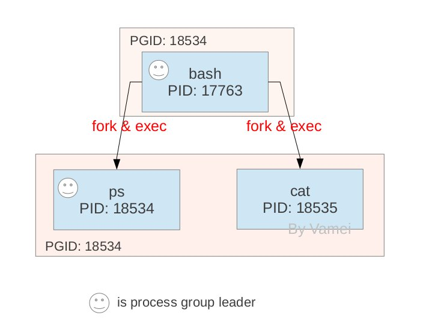

图中箭头表示父进程通过fork和exec机制产生子进程。ps和cat都是bash的子进程。进程组的领导进程的PID成为进程组ID。领导进程可以先终结。此时进程组依然存在，并持有相同的PGID，直到进程组中最后一个进程终结。

我们将一些进程归为进程组的一个重要原因是我们可以将信号发送给一个进程组。进程组中的所有进程都会收到该信号。我们会在下一部分深入讨论这一点。

### 会话 (session)

更进一步，在shell支持工作控制(job control)的前提下，多个进程组还可以构成一个会话 (session)。bash(Bourne-Again shell)支持工作控制，而sh(Bourne shell)并不支持。

会话是由其中的进程建立的，该进程叫做会话的领导进程(session leader)。会话领导进程的PID成为识别会话的SID(session ID)。会话中的每个进程组称为一个工作(job)。会话可以有一个进程组成为会话的前台工作(foreground)，而其他的进程组是后台工作(background)。每个会话可以连接一个控制终端(control terminal)。当控制终端有输入输出时，都传递给该会话的前台进程组。由终端产生的信号，比如CTRL+Z， CTRL+\，会传递到前台进程组。

会话的意义在于将多个工作囊括在一个终端，并取其中的一个工作作为前台，来直接接收该终端的输入输出以及终端信号。 其他工作在后台运行。

一个命令可以通过在末尾加上&方式让它在后台运行:

	$ping localhost > log &

此时终端显示:

	[1] 10141

括号中的1表示工作号，而10141为PGID

我们通过如下方式查询更加详细的信息:

	$ps -o pid,pgid,ppid,sid,tty,comm
	(tty表示控制终端）

信号可以通过kill

	$kill -SIGTERM -10141

或者

	$kill -SIGTERM %1

的方式来发送给工作组。上面的两个命令，一个是发送给PGID(通过在PGID前面加-来表示是一个PGID而不是PID)，一个是发送给工作1(%1)，两者等价。

一个工作可以通过$fg从后台工作变为前台工作:

	$cat > log &
	$fg %1

当我们运行第一个命令后，由于工作在后台，我们无法对命令进行输入，直到我们将工作带入前台，才能向cat命令输入。在输入完成后，按下CTRL+D来通知shell输入结束。

进程组(工作)的概念较为简单易懂。而会话主要是针对一个终端建立的。当我们打开多个终端窗口时，实际上就创建了多个终端会话。每个会话都会有自己的前台工作和后台工作。这样，我们就为进程增加了管理和运行的层次。在没有图形化界面的时代，会话允许用户通过shell进行多层次的进程发起和管理。比如说，我可以通过shell发起多个后台工作，而此时标准输入输出并不被占据，我依然可以继续其它的工作。如今，图形化界面可以帮助我们解决这一需求，但工作组和会话机制依然在Linux的许多地方应用。

### 总结

```
process group, pgid
session, sid, job, forground, background
fg, kill -pid, &, %
```

## 10 Linux用户

Linux的用户在登录(login)之后，就带有一个用户身份(user ID, UID)和一个组身份(group ID, GID)。在Linux文件管理背景知识中，我们又看到，每个文件又有九位的权限说明，用来指明该文件允许哪些用户执行哪些操作(读、写或者执行)。

### 进程权限

但是，在Linux中，用户的指令是在进程的范围内进行的。当我们向对某个文件进行操作的时候，我们需要在进程中运行一个程序，在进程中对文件打开，并进行读、写或者执行的操作。因此，我们需要将用户的权限传递给进程，以便进程真正去执行操作。例如我们有一个文件a.txt, 文件中为一个字符串:

	Hello world!

我以用户Vamei的身份登录，并在shell中运行如下命令：

	$cat a.txt

整个运行过程以及文件读取如下:

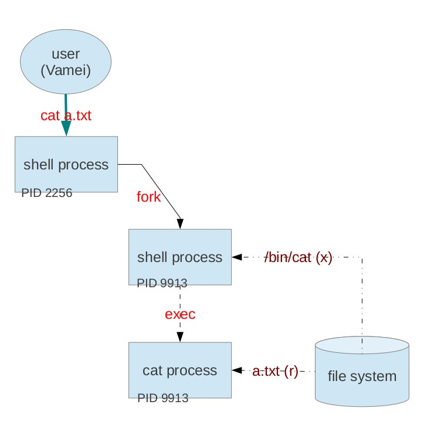

我们可以看到，整个过程中我们会有两个进程，一个是shell本身(2256)，一个是shell复制自身，再运行/bin/cat (9913)。图中的fork, exec, PID可参看Linux进程基础。第二个进程总共对文件系统进行了两次操作，一次是执行(x)文件/bin/cat，另外一次是读取(r)文件a.txt。使用`$ls -l` 查看这两个文件的权限:

	$ls -l /bin/cat
	-rwxr-xr-x 1 root root 46764 Apr  1  2012 /bin/cat

	$ls -l a.txt
	-rw-rw-r-- 1 Vamei Vamei 14 Oct  7 09:14 a.txt

从上面可以看到(参考Linux文件管理背景知识)，/bin/cat让所有用户都享有执行的权利，而Vamei作为a.txt的拥有者，对a.txt享有读取的权利。

让我们进入更多的细节 (The devil is in the details)。在进行这两次操作的时候，尽管用户Vamei拥有相应的权限，但我们发现，真正做工作的是进程9913。我们要让这个进程得到相应的权限。实际上，每个进程会维护有如下6个ID：

真实身份: real UID,       real GID

有效身份: effective UID,  effective GID

存储身份: saved UID,      saved GID

其中，真实身份是我们登录使用的身份，有效身份是当该进程真正去操作文件时所检查的身份，存储身份较为特殊，我们等一下再深入。当进程fork的时候，真实身份和有效身份都会复制给子进程。大部分情况下，真实身份和有效身份都相同。当Linux完成开机启动之后，init进程会执行一个login的子进程。我们将用户名和密码传递给login子进程。login在查询了/etc/passwd和/etc/shadow，并确定了其合法性之后，运行(利用exec)一个shell进程，shell进程真实身份被设置成为该用户的身份。由于此后fork此shell进程的子进程都会继承真实身份，所以该真实身份会持续下去，直到我们登出并以其他身份再次登录(当我们使用su成为root的时候，实际上就是以root身份再次登录，此后真实身份成为root)。

### 最小权限原则

每个进程为什么不简单地只维护真实身份，却选择费尽麻烦地去维护有效身份和存储身份呢？这牵涉到Linux的“最小特权”(least priviledge)的原则。Linux通常希望进程只拥有足够完成其工作的特权，而不希望赋予更多的特权给它。从设计上来说，最简单的是赋予每个进程以super user的特权，这样进程就可以想做什么做什么。然而，这对于系统来说是一个巨大的安全漏洞，特别是在多用户环境下，如果每个用户都享有无限制的特权，就很容易破坏其他用户的文件或者系统本身。“最小特权”就是收缩进程所享有的特权，以防进程滥用特权。

然而，进程的不同阶段可能需要不同的特权。比如一个进程最开始的有效身份是真实身份，但运行到中间的时候，需要以其他的用户身份读入某些配置文件，然后再进行其他的操作。为了防止其他的用户身份被滥用，我们需要在操作之前，让进程的有效身份变更回来成为真实身份。这样，进程需要在两个身份之间变化。

存储身份就是真实身份之外的另一个身份。当我们将一个程序文件执行成为进程的时候，该程序文件的拥有者(owner)和拥有组(owner group)可以被，存储成为进程的存储身份。在随后进程的运行过程中，进程就将可以选择将真实身份或者存储身份复制到有效身份，以拥有真实身份或者存储身份的权限。并不是所有的程序文件在执行的过程都设置存储身份的。需要这么做的程序文件会在其九位(bit)权限的执行位的x改为s。这时，这一位(bit)叫做set UID bit或者set GID bit。

	$ls -l /usr/bin/uuidd
	-rwsr-sr-x 1 libuuid libuuid 17976 Mar 30  2012 /usr/sbin/uuidd

当我以root(UID), root(GID)的真实身份运行这个程序的时候，由于拥有者(owner)有s位的设定，所以saved UID被设置成为libuuid，saved GID被设置成为libuuid。这样，uuidd的进程就可以在两个身份之间切换。

我们通常使用chmod来修改set-UID bit和set-GID bit:

	$chmod 4700 file

我们看到，这里的chmod后面不再只是三位的数字。最前面一位用于处理set-UID bit/set-GID bit，它可以被设置成为4/2/1以及或者上面数字的和。4表示为set UID bit, 2表示为set GID bit，1表示为sticky bit (暂时不介绍)。必须要先有x位的基础上，才能设置s位。

作为一个Linux用户来说，我们并不需要特别关心上面的机制。但是，当我们去编写一个Linux应用程序的时候，就要注意在程序中实现以上切换(有必要的前提下)，以便让我们的程序符合"最小权限"的原则，不给系统留下可能的安全隐患

## 11 Linux从程序到进程

计算机如何执行进程呢？这是计算机运行的核心问题。即使已经编写好程序，但程序是死的。只有活的进程才能产出。我们已经从Linux进程基础中了解了进程。现在我们看一下从程序到进程的漫漫征程。

### 一段程序

下面是一个简单的C程序，假设该程序已经编译好

```c
#include <stdio.h>

int glob=0;                                             /*global variable*/

void main(void) {
  int main1=5;                                          /*local variable of main()*/
  int main2;                                            /*local variable of main()*/
  main2 = inner(main1);                                 /* call inner() function */
  printf("From Main: glob: %d \n", glob);
  printf("From Main: main2: %d \n", main2);
}

int inner(int inner1) {                                 /*inner1 is an argument, also local to inner()*/
  int inner2=10;                                        /*local variable of inner()*/
  printf("From inner: glob: %d \n", glob);
  return(inner1+inner2);
}
```

(选取哪一个语言或者具体的语法并不是关键，大部分语言都可以写出类似上面的程序。在看Python教程的读者也可以利用Python的函数结构和print写一个类似的python程序。当然，还可以是C++，Java，Objective-C等等。选用C语言的原因是：它是为UNIX而生的语言。)

main()函数中调用了inner()函数。inner()中调用一次printf()以输出。最后，在main()中进行了两次printf()。

注意变量的作用范围。简单地说，变量可以分为全局变量和局部变量。在所有函数之外声明的变量为全局变量，比如glob，在任何时候都可以使用。在函数内定义的变量为局部变量，只能在该函数的作用域(range)内使用，比如说我们在inner()工作的时候不能使用main()函数中声明的main1变量，而在main()中我们无法使用inner()函数中声明的inner2变量。

不用太过在意这个程序的具体功能。要点是这个程序的运行过程。下图为该程序的运行过程，以及各个变量的作用范围：

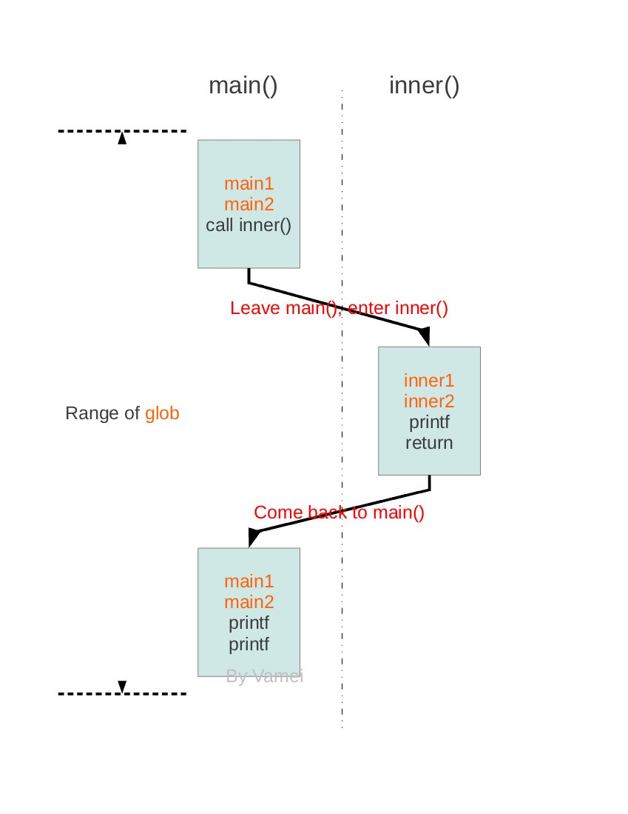

### 进程空间

为了进一步了解上面程序的运行，我们还需要知道，进程如何使用内存。当程序文件运行为进程时，进程在内存中获得空间。这个空间是进程自己的小屋子。

每个进程空间按照如下方式分为不同区域:

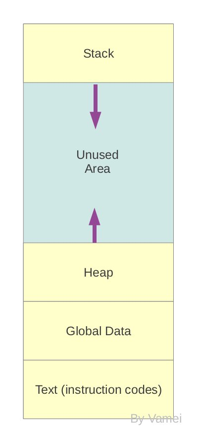

Text区域用来储存指令(instruction)，说明每一步的操作。Global Data用于存放全局变量，栈(Stack)用于存放局部变量，堆(heap)用于存放动态变量 (dynamic variable. 程序利用malloc系统调用，直接从内存中为dynamic variable开辟空间)。Text和Global data在进程一开始的时候就确定了，并在整个进程中保持固定大小。

栈(Stack)以帧(stack frame)为单位。当程序调用函数的时候，比如main()函数中调用inner()函数，stack会向下增长一帧。帧中存储该函数的参数和局部变量，以及该函数的返回地址(return address)。此时，计算机将控制权从main()转移到inner()，inner()函数处于激活(active)状态。位于栈最下方的帧，和全局变量一起，构成了当前的环境(context)。激活函数可以从环境中调用需要的变量。典型的编程语言都只允许你使用位于stack最下方的帧 ，而不允许你调用其它的帧 (这也符合stack结构“先进后出”的特征。但也有一些语言允许你调用栈的其它部分，相当于允许你在运行inner()函数的时候调用main()中声明的局部变量，比如Pascal)。当函数又进一步调用另一个函数的时候，一个新的帧会继续增加到栈的下方，控制权转移到新的函数中。当激活函数返回的时候，会从栈中弹出(pop，读取并从栈中删除)该帧，并根据帧中记录的返回地址，将控制权交给返回地址所指向的指令(比如从inner()函数中返回，继续执行main()中赋值给main2的操作)。

下图是栈在运行过程中的变化。箭头表示栈的增长方向。每个方块代表一帧。开始的时候我们有一个为main()服务的帧，随着调用inner()，我们为inner()增加一个帧。在inner()返回时，我们再次只有main()的帧，直到最后main()返回，其返回地址为空，所以进程结束。

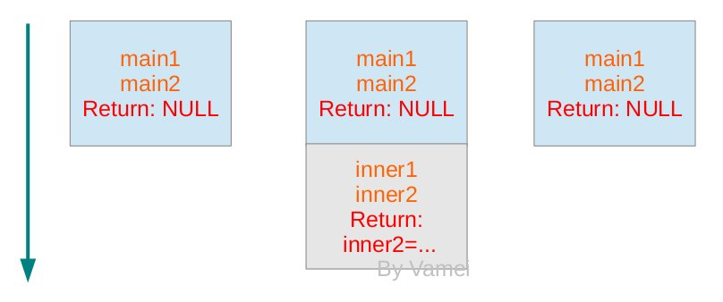

在进程运行的过程中，通过调用和返回函数，控制权不断在函数间转移。进程可以在调用函数的时候，原函数的帧中保存有在我们离开时的状态，并为新的函数开辟所需的帧空间。在调用函数返回时，该函数的帧所占据的空间随着帧的弹出而清空。进程再次回到原函数的帧中保存的状态，并根据返回地址所指向的指令继续执行。上面过程不断继续，栈不断增长或减小，直到main()返回的时候，栈完全清空，进程结束。

当程序中使用malloc的时候，堆(heap)会向上增长，其增长的部分就成为malloc从内存中分配的空间。malloc开辟的空间会一直存在，直到我们用free系统调用来释放，或者进程结束。一个经典的错误是内存泄漏(memory leakage), 就是指我们没有释放不再使用的堆空间，导致堆不断增长，而内存可用空间不断减少。

栈和堆的大小则会随着进程的运行增大或者变小。当栈和堆增长到两者相遇时候，也就是内存空间图中的蓝色区域(unused area)完全消失的时候，再无可用内存。进程会出现栈溢出(stack overflow)的错误，导致进程终止。在现代计算机中，内核一般会为进程分配足够多的蓝色区域，如果清理及时，栈溢出很容易避免。即便如此，内存负荷过大，依然可能出现栈溢出的情况。我们就需要增加物理内存了。

Stack overflow可以说是最出名的计算机错误了，所以才有IT网站(stackoverflow.com)以此为名。

### 进程附加信息

除了上面的信息之外，每个进程还要包括一些进程附加信息，包括PID，PPID，PGID(参考Linux进程基础以及Linux进程关系)等，用来说明进程的身份、进程关系以及其它统计信息。这些信息并不保存在进程的内存空间中。内核会为每个进程在内核自己的空间中分配一个变量(task_struct结构体)以保存上述信息。内核可以通过查看自己空间中的各个进程的附加信息就能知道进程的概况，而不用进入到进程自身的空间 (就好像我们可以通过门牌就可以知道房间的主人是谁一样，而不用打开房门)。每个进程的附加信息中有位置专门用于保存接收到的信号(正如我们在Linux信号基础中所说的“信箱”)。

### fork & exec

现在，我们可以更加深入地了解fork和exec(参考Linux进程基础)的机制了。当一个程序调用fork的时候，实际上就是将上面的内存空间，包括text, global data, heap和stack，又复制出来一个，构成一个新的进程，并在内核中为改进程创建新的附加信息 (比如新的PID，而PPID为原进程的PID)。此后，两个进程分别地继续运行下去。新的进程和原有进程有相同的运行状态(相同的变量值，相同的instructions...)。我们只能通过进程的附加信息来区分两者。

程序调用exec的时候，进程清空自身内存空间的text, global data, heap和stack，并根据新的程序文件重建text, global data, heap和stack (此时heap和stack大小都为0)，并开始运行。

(现代操作系统为了更有效率，改进了管理fork和exec的具体机制，但从逻辑上来说并没有差别。具体机制请参看Linux内核相关书籍)

这一篇写了整合了许多东西，所以有些长。这篇文章主要是概念性的，许多细节会根据语言和平台乃至于编译器的不同而有所变化，但大体上，以上的概念适用于所有的计算机进程(无论是Windows还是UNIX)。更加深入的内容，包括线程(thread)、进程间通信(IPC)等，都依赖于这里介绍的内容。

### 总结

函数，变量的作用范围，global/local/dynamic variables

```
global data, text,
stack, stack frame, return address, stack overflow
heap, malloc, free, memory leakage
进程附加信息, task_struct
fork & exec
```

## 12 Linux多线程与同步

典型的UNIX系统都支持一个进程创建多个线程(thread)。在Linux进程基础中提到，Linux以进程为单位组织操作，Linux中的线程也都基于进程。尽管实现方式有异于其它的UNIX系统，但Linux的多线程在逻辑和使用上与真正的多线程并没有差别。

### 多线程

我们先来看一下什么是多线程。在Linux从程序到进程中，我们看到了一个程序在内存中的表示。这个程序的整个运行过程中，只有一个控制权的存在。当函数被调用的时候，该函数获得控制权，成为激活(active)函数，然后运行该函数中的指令。与此同时，其它的函数处于离场状态，并不运行。如下图所示:


我们看到，各个方块之间由箭头连接。各个函数就像是连在一根线上一样，计算机像一条流水线一样执行各个函数中定义的操作。这样的一个程序叫做单线程程序。

多线程就是允许一个进程内存在多个控制权，以便让多个函数同时处于激活状态，从而让多个函数的操作同时运行。即使是单CPU的计算机，也可以通过不停地在不同线程的指令间切换，从而造成多线程同时运行的效果。如下图所示，就是一个多线程的流程:

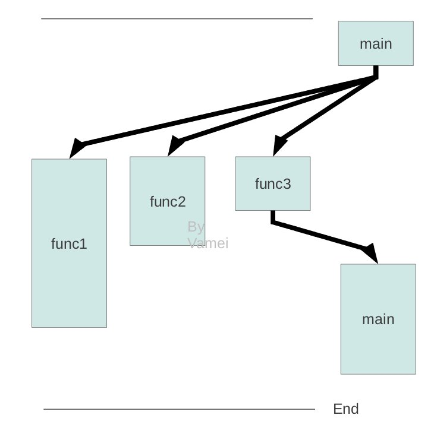

main()到func3()再到main()构成一个线程，此外func1()和func2()构成另外两个线程。操作系统一般都有一些系统调用来让你将一个函数运行成为一个新的线程。

回忆我们在Linux从程序到进程中提到的栈的功能和用途。一个栈，只有最下方的帧可被读写。相应的，也只有该帧对应的那个函数被激活，处于工作状态。为了实现多线程，我们必须绕开栈的限制。为此，创建一个新的线程时，我们为这个线程建一个新的栈。每个栈对应一个线程。当某个栈执行到全部弹出时，对应线程完成任务，并收工。所以，多线程的进程在内存中有多个栈。多个栈之间以一定的空白区域隔开，以备栈的增长。每个线程可调用自己栈最下方的帧中的参数和变量，并与其它线程共享内存中的Text，heap和global data区域。对应上面的例子，我们的进程空间中需要有3个栈。

(要注意的是，对于多线程来说，由于同一个进程空间中存在多个栈，任何一个空白区域被填满都会导致stack overflow的问题。)

### 并发

多线程相当于一个并发(concunrrency)系统。并发系统一般同时执行多个任务。如果多个任务可以共享资源，特别是同时写入某个变量的时候，就需要解决同步的问题。比如说，我们有一个多线程火车售票系统，用全局变量i存储剩余的票数。多个线程不断地卖票(i = i - 1)，直到剩余票数为0。所以每个都需要执行如下操作:

```c
/*mu is a global mutex*/

while (1) {                        /*infinite loop*/
    if (i != 0) i = i -1
    else {
      printf("no more tickets");
      exit();
    }
}
```

如果只有一个线程执行上面的程序的时候(相当于一个窗口售票)，则没有问题。但如果多个线程都执行上面的程序(相当于多个窗口售票), 我们就会出现问题。我们会看到，其根本原因在于同时发生的各个线程都可以对i读取和写入。

我们这里的if结构会给CPU两个指令, 一个是判断是否有剩余的票(i != 0), 一个是卖票 (i = i -1)。某个线程会先判断是否有票(比如说此时i为1)，但两个指令之间存在一个时间窗口，其它线程可能在此时间窗口内执行卖票操作(i = i -1)，导致该线程卖票的条件不再成立。但该线程由于已经执行过了判断指令，所以无从知道i发生了变化，所以继续执行卖票指令，以至于卖出不存在的票 (i成为负数)。对于一个真实的售票系统来说，这将成为一个严重的错误 (售出了过多的票，火车爆满)。

在并发情况下，指令执行的先后顺序由内核决定。同一个线程内部，指令按照先后顺序执行，但不同线程之间的指令很难说清除哪一个会先执行。如果运行的结果依赖于不同线程执行的先后的话，那么就会造成竞争条件(race condition)，在这样的状况下，计算机的结果很难预知。我们应该尽量避免竞争条件的形成。最常见的解决竞争条件的方法是将原先分离的两个指令构成不可分隔的一个原子操作(atomic operation)，而其它任务不能插入到原子操作中。

### 多线程同步

对于多线程程序来说，同步(synchronization)是指在一定的时间内只允许某一个线程访问某个资源 。而在此时间内，不允许其它的线程访问该资源。我们可以通过互斥锁(mutex)，条件变量(condition variable)和读写锁(reader-writer lock)来同步资源。

**1) 互斥锁**

互斥锁是一个特殊的变量，它有锁上(lock)和打开(unlock)两个状态。互斥锁一般被设置成全局变量。打开的互斥锁可以由某个线程获得。一旦获得，这个互斥锁会锁上，此后只有该线程有权打开。其它想要获得互斥锁的线程，会等待直到互斥锁再次打开的时候。我们可以将互斥锁想像成为一个只能容纳一个人的洗手间，当某个人进入洗手间的时候，可以从里面将洗手间锁上。其它人只能在互斥锁外面等待那个人出来，才能进去。在外面等候的人并没有排队，谁先看到洗手间空了，就可以首先冲进去。

上面的问题很容易使用互斥锁的问题解决，每个线程的程序可以改为:

```c
/*mu is a global mutex*/

while (1) {                /*infinite loop*/
  mutex_lock(mu);           /*aquire mutex and lock it, if cannot, wait until mutex is unblocked*/
  if (i != 0) i = i - 1;
  else {
    printf("no more tickets");
    exit();
  }
  mutex_unlock(mu);         /*release mutex, make it unblocked*/
}
```

第一个执行mutex_lock()的线程会先获得mu。其它想要获得mu的线程必须等待，直到第一个线程执行到mutex_unlock()释放mu，才可以获得mu，并继续执行线程。所以线程在mutex_lock()和mutex_unlock()之间的操作时，不会被其它线程影响，就构成了一个原子操作。

需要注意的时候，如果存在某个线程依然使用原先的程序 (即不尝试获得mu，而直接修改i)，互斥锁不能阻止该程序修改i，互斥锁就失去了保护资源的意义。所以，互斥锁机制需要程序员自己来写出完善的程序来实现互斥锁的功能。我们下面讲的其它机制也是如此。

**2) 条件变量**

条件变量是另一种常用的变量。它也常常被保存为全局变量，并和互斥锁合作。

假设这样一个状况: 有100个工人，每人负责装修一个房间。当有10个房间装修完成的时候，老板就通知相应的十个工人一起去喝啤酒。

我们如何实现呢？老板让工人在装修好房间之后，去检查已经装修好的房间数。但多线程条件下，会有竞争条件的危险。也就是说，其他工人有可能会在该工人装修好房子和检查之间完成工作。采用下面方式解决：

```c
/*mu: global mutex, cond: global codition variable, num: global int*/
mutex_lock(mu)

num = num + 1;                      /*worker build the room*/

if (num <= 10) {                     /*worker is within the first 10 to finish*/
    cond_wait(mu, cond);            /*wait*/
    printf("drink beer");
}
else if (num = 11) {                /*workder is the 11th to finish*/
  cond_broadcast(mu, cond);         /*inform the other 9 to wake up*/
}

mutex_unlock(mu);
```

上面使用了条件变量。条件变量除了要和互斥锁配合之外，还需要和另一个全局变量配合(这里的num, 也就是装修好的房间数)。这个全局变量用来构成各个条件。

具体思路如下。我们让工人在装修好房间(num = num + 1)之后，去检查已经装修好的房间数( num < 10 )。由于mu被锁上，所以不会有其他工人在此期间装修房间(改变num的值)。如果该工人是前十个完成的人，那么我们就调用cond_wait()函数。
cond_wait()做两件事情，一个是释放mu，从而让别的工人可以建房。另一个是等待，直到cond的通知。这样的话，符合条件的线程就开始等待。

当有通知(第十个房间已经修建好)到达的时候，condwait()会再次锁上mu。线程的恢复运行，执行下一句prinft("drink beer") (喝啤酒！)。从这里开始，直到mutex_unlock()，就构成了另一个互斥锁结构。

那么，前面十个调用cond_wait()的线程如何得到的通知呢？我们注意到elif if，即修建好第11个房间的人，负责调用cond_broadcast()。这个函数会给所有调用cond_wait()的线程放送通知，以便让那些线程恢复运行。

条件变量特别适用于多个线程等待某个条件的发生。如果不使用条件变量，那么每个线程就需要不断尝试获得互斥锁并检查条件是否发生，这样大大浪费了系统的资源。

**3) 读写锁**

读写锁与互斥锁非常相似。r、RW lock有三种状态: 共享读取锁(shared-read), 互斥写入锁(exclusive-write lock), 打开(unlock)。后两种状态与之前的互斥锁两种状态完全相同。

一个unlock的RW lock可以被某个线程获取R锁或者W锁。

如果被一个线程获得R锁，RW lock可以被其它线程继续获得R锁，而不必等待该线程释放R锁。但是，如果此时有其它线程想要获得W锁，它必须等到所有持有共享读取锁的线程释放掉各自的R锁。

如果一个锁被一个线程获得W锁，那么其它线程，无论是想要获取R锁还是W锁，都必须等待该线程释放W锁。

这样，多个线程就可以同时读取共享资源。而具有危险性的写入操作则得到了互斥锁的保护。

我们需要同步并发系统，这为程序员编程带来了难度。但是多线程系统可以很好的解决许多IO瓶颈的问题。比如我们监听网络端口。如果我们只有一个线程，那么我们必须监听，接收请求，处理，回复，再监听。如果我们使用多线程系统，则可以让多个线程监听。当我们的某个线程进行处理的时候，我们还可以有其他的线程继续监听，这样，就大大提高了系统的利用率。在数据越来越大，服务器读写操作越来越多的今天，这具有相当的意义。多线程还可以更有效地利用多CPU的环境。

(就像做饭一样，不断切换去处理不同的菜。)

本文中的程序采用伪C的写法。不同的语言有不同的函数名(比如mutex_lock)。这里关注的是逻辑上的概念，而不是具体的实现和语言规范。

### 总结

```
multiple threads, multiple stacks
race condition
mutex, condition variable, RW lock
```

## 13 Linux进程间通信 

我们在Linux信号基础中已经说明，信号可以看作一种粗糙的进程间通信(IPC, interprocess communication)的方式，用以向进程封闭的内存空间传递信息。为了让进程间传递更多的信息量，我们需要其他的进程间通信方式。这些进程间通信方式可以分为两种:

+ 管道(PIPE)机制。在Linux文本流中，我们提到可以使用管道将一个进程的输出和另一个进程的输入连接起来，从而利用文件操作API来管理进程间通信。在shell中，我们经常利用管道将多个进程连接在一起，从而让各个进程协作，实现复杂的功能。
+ 传统IPC (interprocess communication)。我们主要是指消息队列(message queue)，信号量(semaphore)，共享内存(shared memory)。这些IPC的特点是允许多进程之间共享资源，这与多线程共享heap和global data相类似。由于多进程任务具有并发性 (每个进程包含一个进程，多个进程的话就有多个线程)，所以在共享资源的时候也必须解决同步的问题 (参考Linux多线程与同步)。

### 管道与FIFO文件

一个原始的IPC方式是所有的进程通过一个文件交流。比如我在纸(文件)上写下我的名字和年纪。另一个人读这张纸，会知道我的名字和年纪。他也可以在同一张纸上写下他的信息，而当我读这张纸的话，同样也可以知道别人的信息。但是，由于硬盘读写比较慢，所以这个方式效率很低。那么，我们是否可以将这张纸放入内存中以提高读写速度呢？

在Linux文本流中，我们已经讲解了如何在shell中使用管道连接多个进程。同样，许多编程语言中，也有一些命令用以实现类似的机制，比如在Python子进程中使用Popen和PIPE，在C语言中也有popen库函数来实现管道 (shell中的管道就是根据此编写的)。管道是由内核管理的一个缓冲区(buffer)，相当于我们放入内存中的一个纸条。管道的一端连接一个进程的输出。这个进程会向管道中放入信息。管道的另一端连接一个进程的输入，这个进程取出被放入管道的信息。一个缓冲区不需要很大，它被设计成为环形的数据结构，以便管道可以被循环利用。当管道中没有信息的话，从管道中读取的进程会等待，直到另一端的进程放入信息。当管道被放满信息的时候，尝试放入信息的进程会等待，直到另一端的进程取出信息。当两个进程都终结的时候，管道也自动消失。


从原理上，管道利用fork机制建立(参考Linux进程基础和Linux从程序到进程），从而让两个进程可以连接到同一个PIPE上。最开始的时候，上面的两个箭头都连接在同一个进程Process 1上(连接在Process 1上的两个箭头)。当fork复制进程的时候，会将这两个连接也复制到新的进程(Process 2)。随后，每个进程关闭自己不需要的一个连接 (两个黑色的箭头被关闭; Process 1关闭从PIPE来的输入连接，Process 2关闭输出到PIPE的连接)，这样，剩下的红色连接就构成了如上图的PIPE。

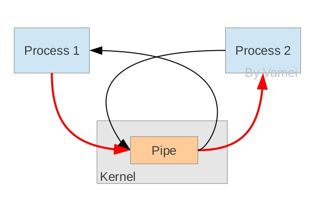

### 传统IPC

这几种传统IPC实际上有很悠久的历史，所以其实现方式也并不完善 (比如说我们需要某个进程负责删除建立的IPC)。一个共同的特征是它们并不使用文件操作的API。对于任何一种IPC来说，你都可以建立多个连接，并使用键值(key)作为识别的方式。我们可以在一个进程中中通过键值来使用的想要那一个连接 (比如多个消息队列，而我们选择使用其中的一个)。键值可以通过某种IPC方式在进程间传递(比如说我们上面说的PIPE，FIFO或者写入文件)，也可以在编程的时候内置于程序中。

在几个进程共享键值的情况下，这些传统IPC非常类似于多线程共享资源的方式(参看Linux多线程与同步):

+ semaphore与mutex类似，用于处理同步问题。我们说mutex像是一个只能容纳一个人的洗手间，那么semaphore就像是一个能容纳N个人的洗手间。其实从意义上来说，semaphore就是一个计数锁(我觉得将semaphore翻译成为信号量非常容易让人混淆semaphore与signal)，它允许被N个进程获得。当有更多的进程尝试获得semaphore的时候，就必须等待有前面的进程释放锁。当N等于1的时候，semaphore与mutex实现的功能就完全相同。许多编程语言也使用semaphore处理多线程同步的问题。一个semaphore会一直存在在内核中，直到某个进程删除它。
+ 共享内存与多线程共享global data和heap类似。一个进程可以将自己内存空间中的一部分拿出来，允许其它进程读写。当使用共享内存的时候，我们要注意同步的问题。我们可以使用semaphore同步，也可以在共享内存中建立mutex或其它的线程同步变量来同步。由于共享内存允许多个进程直接对同一个内存区域直接操作，所以它是效率最高的IPC方式。

消息队列(message queue)与PIPE相类似。它也是建立一个队列，先放入队列的消息被最先取出。不同的是，消息队列允许多个进程放入消息，也允许多个进程取出消息。每个消息可以带有一个整数识别符(message_type)。你可以通过识别符对消息分类 (极端的情况是将每个消息设置一个不同的识别符)。某个进程从队列中取出消息的时候，可以按照先进先出的顺序取出，也可以只取出符合某个识别符的消息(有多个这样的消息时，同样按照先进先出的顺序取出)。消息队列与PIPE的另一个不同在于它并不使用文件API。最后，一个队列不会自动消失，它会一直存在于内核中，直到某个进程删除该队列。

多进程协作可以帮助我们充分利用多核和网络时代带来的优势。多进程可以有效解决计算瓶颈的问题。互联网通信实际上也是一个进程间通信的问题，只不过这多个进程分布于不同的电脑上。网络连接是通过socket实现的。由于socket内容庞大，所以我们不在这里深入。一个小小的注解是，socket也可以用于计算机内部进程间的通信。

### 总结

```
PIPE, FIFO
semaphore, message queue, shared memory; key 
```

## 14 Linux文件系统的实现

Linux文件管理从用户的层面介绍了Linux管理文件的方式。Linux有一个树状结构来组织文件。树的顶端为根目录(/)，节点为目录，而末端的叶子为包含数据的文件。当我们给出一个文件的完整路径时，我们从根目录出发，经过沿途各个目录，最终到达文件。

我们可以对文件进行许多操作，比如打开和读写。在Linux文件管理相关命令中，我们看到许多对文件进行操作的命令。它们大都基于对文件的打开和读写操作。比如cat可以打开文件，读取数据，最后在终端显示：

	$cat test.txt

对于Linux下的程序员来说，了解文件系统的底层组织方式，是深入进行系统编程所必备的。即使是普通的Linux用户，也可以根据相关的内容，设计出更好的系统维护方案。

### 存储设备分区

文件系统的最终目的是把大量数据有组织的放入持久性(persistant)的存储设备中，比如硬盘和磁盘。这些存储设备与内存不同。它们的存储能力具有持久性，不会因为断电而消失；存储量大，但读取速度慢。

观察常见存储设备。最开始的区域是MBR，用于Linux开机启动(参考Linux开机启动)。剩余的空间可能分成数个分区(partition)。每个分区有一个相关的分区表(Partition table)，记录分区的相关信息。这个分区表是储存在分区之外的。分区表说明了对应分区的起始位置和分区的大小。


我们在Windows系统常常看到C分区、D分区等。Linux系统下也可以有多个分区，但都被挂载在同一个文件系统树上。

数据被存入到某个分区中。一个典型的Linux分区(partition)包含有下面各个部分:

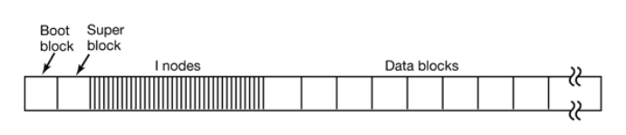

分区的第一个部分是启动区(Boot block)，它主要是为计算机开机服务的。Linux开机启动后，会首先载入MBR，随后MBR从某个硬盘的启动区加载程序。该程序负责进一步的操作系统的加载和启动。为了方便管理，即使某个分区中没有安装操作系统，Linux也会在该分区预留启动区。

启动区之后的是超级区(Super block)。它存储有文件系统的相关信息，包括文件系统的类型，inode的数目，数据块的数目。

随后是多个inodes，它们是实现文件存储的关键。在Linux系统中，一个文件可以分成几个数据块存储，就好像是分散在各地的龙珠一样。为了顺利的收集齐龙珠，我们需要一个“雷达”的指引：该文件对应的inode。每个文件对应一个inode。这个inode中包含多个指针，指向属于该文件各个数据块。当操作系统需要读取文件时，只需要对应inode的"地图"，收集起分散的数据块，就可以收获我们的文件了。

最后一部分，就是真正储存数据的数据块们(data blocks)了。

### inode简介

上面我们看到了存储设备的宏观结构。我们要深入到分区的结构，特别是文件在分区中的存储方式。

文件是文件系统对数据的分割单元。文件系统用目录来组织文件，赋予文件以上下分级的结构。在硬盘上实现这一分级结构的关键，是使用inode来虚拟普通文件和目录文件对象。

在Linux文件管理中，我们知道，一个文件除了自身的数据之外，还有一个附属信息，即文件的元数据(metadata)。这个元数据用于记录文件的许多信息，比如文件大小，拥有人，所属的组，修改日期等等。元数据并不包含在文件的数据中，而是由操作系统维护的。事实上，这个所谓的元数据就包含在inode中。我们可以用$ls -l filename来查看这些元数据。正如我们上面看到的，inode所占据的区域与数据块的区域不同。每个inode有一个唯一的整数编号(inode number)表示。

在保存元数据，inode是“文件”从抽象到具体的关键。正如上一节中提到的，inode储存由一些指针，这些指针指向存储设备中的一些数据块，文件的内容就储存在这些数据块中。当Linux想要打开一个文件时，只需要找到文件对应的inode，然后沿着指针，将所有的数据块收集起来，就可以在内存中组成一个文件的数据了。

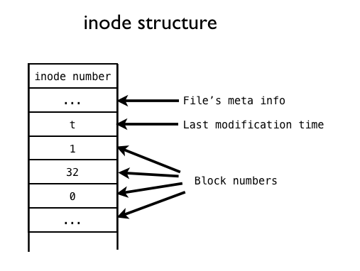

inode并不是组织文件的唯一方式。最简单的组织文件的方法，是把文件依次顺序的放入存储设备，DVD就采取了类似的方式。但如果有删除操作，删除造成的空余空间夹杂在正常文件之间，很难利用和管理。

复杂的方式可以使用链表，每个数据块都有一个指针，指向属于同一文件的下一个数据块。这样的好处是可以利用零散的空余空间，坏处是对文件的操作必须按照线性方式进行。如果想随机存取，那么必须遍历链表，直到目标位置。由于这一遍历不是在内存进行，所以速度很慢。

FAT系统是将上面链表的指针取出，放入到内存的一个数组中。这样，FAT可以根据内存的索引，迅速的找到一个文件。这样做的主要问题是，索引数组的大小与数据块的总数相同。因此，存储设备很大的话，这个索引数组会比较大。

inode既可以充分利用空间，在内存占据空间不与存储设备相关，解决了上面的问题。但inode也有自己的问题。每个inode能够存储的数据块指针总数是固定的。如果一个文件需要的数据块超过这一总数，inode需要额外的空间来存储多出来的指针。

### inode示例 

在Linux中，我们通过解析路径，根据沿途的目录文件来找到某个文件。目录中的条目除了所包含的文件名，还有对应的inode编号。当我们输入$cat /var/test.txt时，Linux将在根目录文件中找到var这个目录文件的inode编号，然后根据inode合成var的数据。随后，根据var中的记录，找到text.txt的inode编号，沿着inode中的指针，收集数据块，合成text.txt的数据。整个过程中，我们参考了三个inode：根目录文件，var目录文件，text.txt文件的inodes。

在Linux下，可以使用$stat filename，来查询某个文件对应的inode编号。

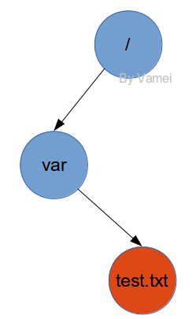


在存储设备中实际上存储为：

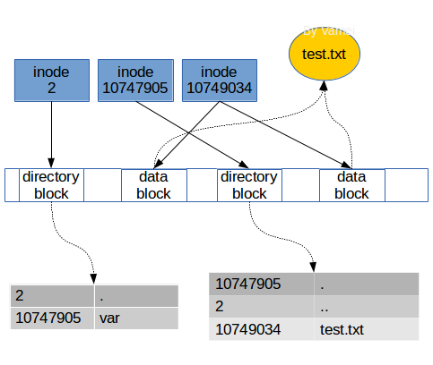

当我们读取一个文件时，实际上是在目录中找到了这个文件的inode编号，然后根据inode的指针，把数据块组合起来，放入内存供进一步的处理。当我们写入一个文件时，是分配一个空白inode给该文件，将其inode编号记入该文件所属的目录，然后选取空白的数据块，让inode的指针指像这些数据块，并放入内存中的数据。

### 文件共享

在Linux的进程中，当我们打开一个文件时，返回的是一个文件描述符。这个文件描述符是一个数组的下标，对应数组元素为一个指针。有趣的是，这个指针并没有直接指向文件的inode，而是指向了一个文件表格，再通过该表格，指向加载到内存中的目标文件的inode。如下图，一个进程打开了两个文件。

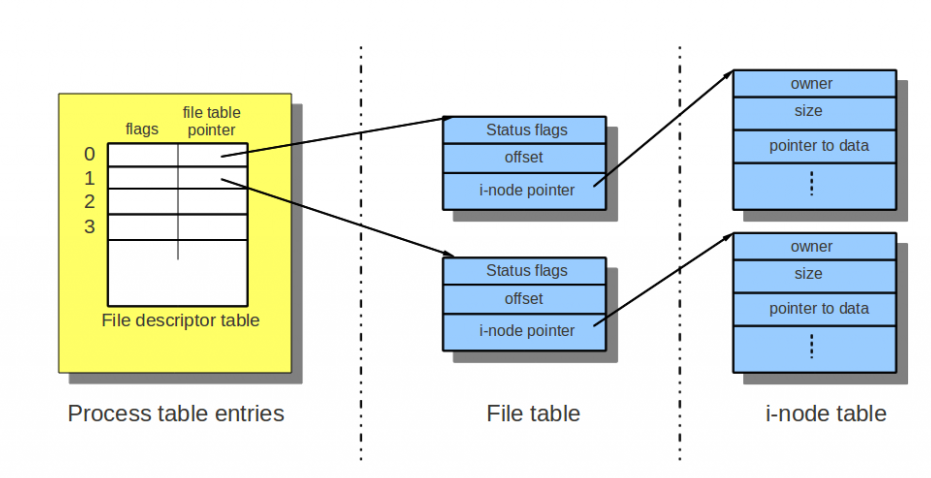

可以看到，每个文件表格中记录了文件打开的状态(status flags)，比如只读，写入等，还记录了每个文件的当前读写位置(offset)。当有两个进程打开同一个文件时，可以有两个文件表格，每个文件表格对应的打开状态和当前位置不同，从而支持一些文件共享的操作，比如同时读取。

要注意的是进程fork之后的情况，子进程将只复制文件描述符的数组，而和父进程共享内核维护的文件表格和inode。此时要特别小心程序的编写。

### 总结

这里概括性的总结了Linux的文件系统。Linux以inode的方式，让数据形成文件。

了解Linux的文件系统，是深入了解操作系Linux原理的重要一步。


## 附录 

+ [Linux 常用命令](http://www.cnblogs.com/vamei/archive/2013/03/03/2871198.html)
+ [每天一个linux命令目录](http://www.cnblogs.com/peida/archive/2012/12/05/2803591.html)

