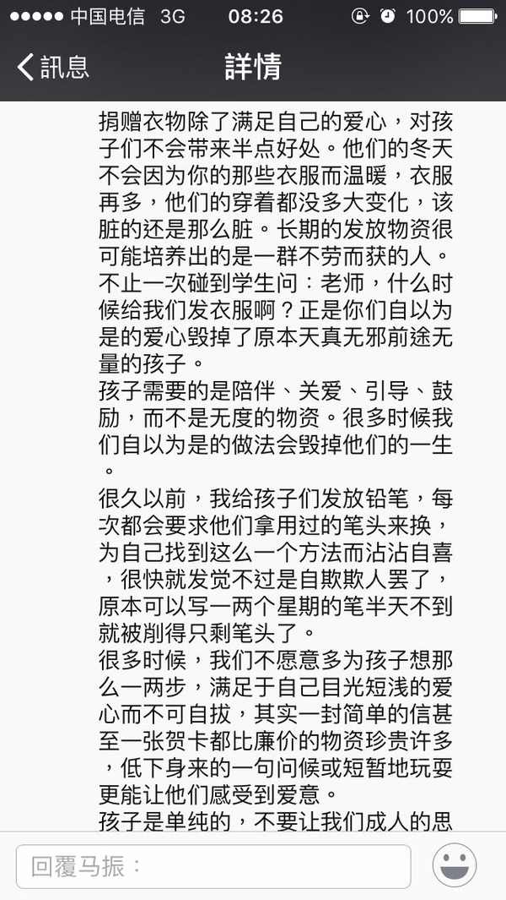

# 旧济会

现在跟你简单说下，希望你在假期没什么事的时候考虑下，并从你专业的角度对这个想法给出操作办法。

我想做一个项目叫“旧济会”，第一步主要是解决旧衣物和织物的捐赠信息化

1. 互联网层面就是跟各大物流的信息接口连接，对每个获赠的地址的收件信息进行统计，及时提醒或或者按照捐赠者的设置，在邮寄量达到设置要求时自动关闭捐赠信息，来避免过量捐赠，这个项目我可以河南团省委及民政部门首先发起，在省内边远贫困地区建立网络，初步形成用户群。
2. 第二步进一步完成网络平台，手机APP及微信公众号，使捐赠更智能，更精准，必要的时候发起众筹；
3. 由于我国是不鼓励旧衣物捐赠的，并禁止旧衣物买卖；明年我会向供销总社申请一个旧衣物处理的许可证，在漯河建立一个旧衣物回收、消毒的试点；省内的旧衣物捐赠，首先通过物流转移到漯河，在做各种消毒处理后，进行真空封装，然后再按平台的精准信息转送到受捐赠的地址。

我想通过这些先建立一个work的用户群，然后再把我机会开发其他应用。

## 来自知乎

我最大的感想，帮助弱势群体，无论是山区少民，还是贫困地区，还是留守儿童，你所需要准备的远比你所准备的要多。而由于信息，路途，官僚，环境等各种因素，哪怕你是好心，哪怕所有一起在做这件事的人都是一心一意的，好心好意的去做的，由于各自的出发点，目的，职责所在，时间和精力的不同，最后依然有可能做不好，或者帮倒忙的，比如像上面所提到的“好心办坏事”。

此外，从我个人的角度做了三个总结：

第一，做公益，我最相信支教学生，其次相信愿意帮忙的基层官员，至于不相信谁我就不说了。

第二，任何捐赠，公益活动，都不能是饮鸩止渴，都应该构想一个可持续性的计划，或者说，做公益与做市场营销、产品经理其实是一码事。应该是：有目标，有针对性，能具体的解决某一个实实在在的需求，能够获得大众认可和支持，并且制定计划，分配职责，按部就班的去完成的，哪怕你不是牵头的，至少是整个计划的一部分，而不是脑袋一热的“好心善意”。

第三，以任何形式无偿付出的东西，比如衣物，比如善款，比如支教，比如书本，其最终目的并不是使用这些事物本身，而是在这个过程中赋予接受者心灵上的震动、推动力，和知识指导。如果一个公益活动做不到这一点，如果一个公益只是把东西一丢了事，那就停下来，好好规划，计划一下这个公益活动。

最后，我说一下接下来，9月底或者10月份，我将和武汉理工大学的几位支教同学一起去广西的玉林，柳州两个地方开展公益衣物的捐赠。我们现在正在探讨除了捐赠衣物之外，作为企业而言，是否还有更好的形式去开展公益活动，不仅能帮助需要帮助的人，更能够对企业自身也有帮助

## 资料一

中国资源综合利用协会最新数据显示，每年我国大约有2600万吨旧衣服被扔进垃圾桶，且这些衣服大多没有被重新加工或是无害烂掉。大量的旧衣服最后进入填埋场、燃烧场，不仅造成了资源的浪费，而且大大加重了环境的负担。为什么会有这么多旧衣物浪费？一面是都市人守着大量旧衣物捐赠无门，另一方面，公益组织由于成本等各种原因，拒绝接收旧衣物。渠道不畅通，导致大量旧衣物浪费。

### 每年2600万吨旧衣物捐赠无门成垃圾

有人捐无人收 九成网友遭遇捐赠尴尬

旧衣捐赠无“门”，是不少都市人的“烦恼”。据《中国环境报》报道，快速淘汰的旧衣服成了一种新的消费垃圾，如何处理废旧衣服成为人们在生活中深感头痛的问题。中国资源综合利用协会最新数据显示，每年我国大约有2600万吨旧衣服被扔进垃圾桶。

有人捐无人收 旧衣物捐赠渠道不畅通爱心受阻

快时尚的流行，物质生活的提高，使人们购买衣服的频次增加，自然淘汰旧衣服的节奏也随之加快。消费者特别是女性更新衣服的速度十分惊人，据调查，80%以上的年轻女性每季都会为自己添置几件新衣，即便她们的衣柜已近乎爆满。对于旧衣服，更多人还是愿意选择捐赠。

然而，目前旧衣捐赠过程存在的问题不少。一是捐赠渠道少，政府目前没有专门机构定期负责，社区、单位也多在特别时期才组织捐赠活动。二是信息不对称，目前虽然有一些NGO组织致力于此，但是在采访中媒体记者发现，对其了解的人并不多。三是对于衣服的特殊要求也增加了捐赠的难度。

超九成网友遭遇过二手衣服捐赠无“门” 红会民政局街道办都不收

调查结果显示，超过九成（91.71%）的网友遭遇过二手衣服捐赠无“门”的情况，其中69.06%的网友表示“遭遇过，无奈就只能把旧衣服扔掉了”，22.65%的网友表示“遭遇过，但我没扔这些衣服，而是通过其他方式处理了”。

广州的方女士几乎每年换季都会添置一大批衣服。近日，她想捐赠30多件闲置衣服，还特意送去干洗。但让她意外的是，当地红十字会表示，捐赠最好是捐款，旧衣服不要。而在民政局和街道办，她得到的答复都是：旧衣服一概不收。无奈之下她只能扔掉。

一些贫困地区的儿童成人仍然缺衣物

虽然旧衣服在城市里少有市场，但我国仍有很多贫困地区的儿童甚至成人缺少衣物，微博上不时会有网友发起倡议，呼吁捐赠。网络调查显示，大量网友表达了希望捐赠旧衣的愿望，只是苦于无处可捐。有志愿者建议，最好的方式是定向捐赠，在网络上找到可靠的受捐地点，将旧衣服洗干净，再到邮局打包邮寄。
 
### 渠道不畅原因复杂 公益组织也无奈

回收旧衣物成本大 受捐助者也挑拣

捐赠旧衣物如此之难，其中原因也没那么简单。公益组织基于各种原因拒收旧衣物，慈善总会街道办等部门只有在大灾大难等特殊时期才接收。另一方面，开展旧衣物回收的组织挤压大量旧衣物发不出去。这些原因都造成了公益组织不愿意接收旧衣物的尴尬局面。

红会拒收原因：处理消毒难 运输成本高

红十字总会工作人员表示，不收旧衣服有苦衷：收过来之后没法处理，消毒、运输成本太高，现在贫困地方缺衣服的很少，而且一般都是批量的给他们运棉衣、夹克，所以现在我们不做这个（收衣服）了。

另外一家机构的工作人员也表示：由于需要投入资金消毒，处理成本高，所以不愿接收旧衣物。“消完毒还要按年龄段整理打包，耗时费力，不如直接购买新衣服，加上现在还常有企业和单位捐赠新衣服。再说，农村条件越来越好了，有这方面需求的人也减少了。

江门市义工联负责整理捐赠衣物的有关工作人员则向记者透露，由于市民捐赠的旧衣物质量参差不齐，有关部门每年都要花费大量的人力物力对其进行重复多次的整理分类，人手紧缺，一般都是从义工联和有关部门临时抽调的。有关部门在接收市民的旧衣物捐赠时，虽然会根据有关要求对衣物进行清洗，但由于缺少专门的清洗消毒设备，衣物并没有进行统一的清洗消毒，很容易就会受潮霉变。

受捐助者原因：免费旧衣没人领对衣物挑挑拣拣 仓库积压10万件

“都是些精挑出来的名牌旧衣，就是没人来领。很多群众宁愿购买5元到20元一件的地摊货。”曾多次下乡参加送衣慰问活动的义工说，旧衣服在发送过程中不受欢迎，经常要委托当地村委会逐户分发。

江门09年暂停接收旧衣物捐赠，主要是因为积压了一批旧衣物发放不出去。有关工作人员还向记者透露，江门很多对口支援的地方和本地重点帮扶的地方都已经明确表示了，除了遭遇大的灾害，暂停接受江门输送的旧衣物。义工联一位长期参加旧衣物整理工作的义工告诉记者，现在，存放捐赠物的仓库中，有些旧衣物都已经存放了三四年，一直都无法发放出去，积压了不少于10万件。

一名资深公益人士表示，除了后续的消毒及整理工作有难度外，各地的风俗习惯亦不尽相同，许多地方不太能够接受别人捐赠的旧衣物。因此，作为公益组织，不便大规模地接收市民旧衣物的捐赠。

广州市红十字会秘书长刘进兴说，现在不比十年前了。受捐助者也会挑挑拣拣，担心皮肤病和传染病。

缺乏统一监管机构和政策支持也是旧衣捐赠渠道不畅的主因

“说到底，目前在旧衣捐赠问题上，我们缺少一个专门的监管机构。”杭州师范大学社会学研究所所长赵定东教授称，只有成立一个专门的机构，才能畅通旧衣捐赠渠道，保证其发挥最大价值。对此，宜昌市社科联原副主席刘开美认为，捐赠本是好事，对于善心一定要善待。不能让爱心流于形式，旧衣捐赠目前确实存在渠道不畅通的问题，而对于国外及国内设置捐赠箱的做法，其看法与赵定东教授相同，要有专门的监管机构负责，妥善处理爱心旧衣。

工友之家的负责人也表示，接收旧衣物捐赠公益组织所面临的诸如成本、人力等方面的困境是自身无法解决的，如果能有政府上层推动，或者一些财力支持，这件事情或许可以做。
 
### 旧衣回收并非毫无进展 几种模式或许可以尝试

设置旧衣回收箱、工友之家模式、捐助人承诺模式

搜狐公益做的一项调查数据显示，在“社会组织在旧衣物回收中如何做更有效”的问题上，38.62%的网友认为应“增强信息的对称性，加强宣传，让更多人知道已有旧衣回收项目的社会组织的联系方式、旧衣捐赠方式”；31.56%的网友认为应“联合政府”；17.83%的网友选择“还是采用传统办法立足社区、学校等，将回收上来的二手衣服转手给相关公司”；12.01%的网友认为应“结合年轻人的生活习惯，充分利用网络建立起畅通的旧衣捐赠渠道”。

公众还是希望能有一些途径来改变这样的现状，其实在及时操作过程中，或许我们可以借鉴一些现有模式。

工友之家“同心互惠”模式：旧衣回收低价卖给打工者 用盈利反哺公益事业

北京朝阳区五环外的皮村，别有天地。这个外来务工人员的聚集点有自己的社区NGO、公益学校、艺术博物馆、青年艺术团，以及一家“同心互惠公益商店”。
　
同心商店主要业务是低价销售二手衣物。同心商店负责人王德志说，从2002年开始，就有来自北京不同高校的大学生社团定期在校内或社团与社团联合举行募捐活动，将募集的衣服通过打工青年艺术团送给当地的外来务工人员。

2006年，第一家同心互惠公益商店在皮村成立。当地N G O组织“工友之家”聘请了几位外来打工的妇女对募集来的衣物整理、分拣，再分别贴上统一的同心互惠商店的标签以及笔注上价格。至于衣物的消毒，同心商店并未作太多考虑，募集回来的衣服在仓库中经过分拣，就会发往商店。商店里一件女式牛仔裤仅售7—8元，男式的厚棉袄和羽绒服的标价在30—45元之间，很受打工者的欢迎。商店第一个月就有了盈余，刚进入第7年，年营业额已经有100万元左右，2012年还略有盈余。

“现在我们跟很多企事业单位合作，我们会在它们的大楼——一栋大楼好几千人----放一个募捐箱，很漂亮的，他们上班的时候把东西放进去，募捐箱满的话就会给我们打电话，我们就会有车去接，这是一种途径。还有一种途径，是我们通过网站，通过电话，通过媒体宣传面向社会公众，他们就给我们打电话，我们有一个专职的人员就是接电话和排日程。”

募集的物品通过库房再统一分配到各间门店，“我们的定价权也是在库房。一是要参考市场，比如说大学生军训完了的迷彩服很受欢迎，它在外面商店大概要卖五六十块，那么在我们这里可能就是十分之一，5块到6块。然后夏季的衣服基本上不会超过10块钱，就是我们要定的一个上限，不能太高。冬季的羽绒服最高也不会超过大概25元。”

上海、北京等地设置旧衣回收箱 绿色回收走起

上海宣布今年将新建500个废旧衣物回收箱。北京目前已经有40处这样的收集箱投入使用，月均回收旧衣物近9万件，这种回收点将在年底增加至100个。

自2010年起，上海市绿化和市容管理局就开始在全市试点旧衣回收，由专业公司统一收集旧衣，居民可以用旧衣服兑换家庭绿色账户积分，兑取各种小礼品。这种方式普遍受到居民的认可。截至2012年底，已建立废旧衣物回收箱1022个。

目前，上海回收旧衣服有两大用途：一些比较完好的棉服、羽绒服等在消毒、整理后，会通过慈善机构捐赠给灾区；同时，那些无法再穿的旧衣服将集中进行纤维化处理，制成无纺布、再生手套、路基布等，一些纯棉面料纤维化后还可以用于加工服装。

旧衣服的回收利用，在保护环境的同时也创造了经济价值。据统计，每吨旧衣服回收利用后，可生产0.99吨无纺布或0.99吨分色棉纱，等于节约了1.1吨纺织原料或0.8吨棉花，同时还节约了生产同等无纺布35%的能源，节约生产同等棉纱20%的能源。[详细]
香港模式：捐赠人卫生曾诺 让民间捐衣更可信

香港政府于2006年起推出“社区旧衣回收箱计划”，在全港小区、休憩处、公园、体育中心和图书馆放置超过200个“社区旧衣回收箱”。该计划虽由香港民政事务总署主导管理，但实际由4个民间团体具体实施，包括采购、安置、维修回收箱，及时清理箱内衣物，定期报告回收数量、利润及用途等。当然，市民也可将旧衣服卖给专业的回收公司。

尽管回收组织对旧衣服要统一消毒处理，但香港市民在捐赠衣服时通常会附一张留言，承诺所捐衣服清洁卫生，没有传染病。如衣服多，还会找律师写一份安全合约。万一受捐者穿上旧衣服发生问题，不可诉诸法律——遵循的是《好撒玛利亚人法》精神，保护做好事者不因过失而被追究责任，从而鼓励对弱势者施以帮助。

一位社区工作人员说，社区1万多居民中有六七十家困难户，他们之所以不乐意穿旧衣服还是怕“不干净”。如果捐赠者写个“卫生承诺”，或社区出个“消毒证明”，保管他们抢着要。
 
### 结束语

旧衣物捐赠在我国目前是存在很多困境，然而我们也看到一些切实可行的解决模式。要打通捐赠人与受助人之间的渠道，不只是公益机构的事，而需要捐助人、受助人、公益组织、政府通力合作，少了任何一方这条通道都无法畅通。

另一方面，我们看到直接向受助人捐赠衣物的模式也许已经不合时宜，而对旧衣物的绿色回收利用是一个潜在的巨大市场，我们不妨学习乐施会的模式，开拓旧衣物二手市场，不能卖的就拿来制作一些物品，所得盈利反过来投入慈善事业。在未来，这种模式也许更可行，更加能够高效利用现有资源做慈善。

## 资料二

导读：我国是世界上纺织品生产和使用大国，相应每年也产生大量的废旧纺织品。如果能将这些二手的纺织服装产品有效利用起来，将是一笔重大的财富。日前，上海成立首家旧衣回收企业，将全面打通二手纺织服装市场产业链。

### 上海市成立首家旧衣回收企业

我国是世界上纺织品生产和使用大国，相应每年也产生大量的废旧纺织品。据相关数据统计，2011年我国废旧纺织品产生总量超过2600万吨，而综合利用量仅为233万吨，综合利用率不足10%。因此加强对废旧纺织品综合利用，对缓解纺织原料短缺、减少环境污染、提升行业竞争力和影响力具有重大的现实意义。　　　　

据预测，十二五期间，我国纺织品的消耗量将以12%以上的速度增长，到十二五末，我国废旧纺织品累计产生量将超过1亿吨。军警退役制服上交量累计达35万吨，废旧纺织品的综合利用面临巨大的压力。　　　　

据了解，我国每年纺织品的消费量约3500万吨，由于资源短缺，每年需要进口大量纺织品及其原材料。相关人士表示，如果废旧纺织品综合利用率能够达到60%，则可节约化学纤维940万吨、天然纤维470万吨，预计每年可以节约原油1880万吨，节约耕地面积1634万亩，占全年棉花耕种面积的46%。　　　　

目前，我国重点利用区域集中在浙江苍南、江苏江阴、河北保定、广州新塘等地区，但产品附加值相对不高，企业规模较小，产业链衔接不够，没有形成产业集聚效应，具有极大的提升和发展空间。　　　　

### 旧衣回收业务前景良好　　　　

上海成立首家旧衣回收企业　　　

我国明确废旧纺织品不能民间交易，但每天都有大量的纺织品被淘汰。根据纺织工业部的相关数据，我国使用的纺织品原料占全球资源总量的52%，中国人每年消耗纺织品原料5000万吨。每年产生的下脚料等废旧纺织品也多达2000万吨。其中40%左右是废旧衣服，即大约800万吨。　　

上海作为时尚之都，服饰的更新换代日益加快。为进一步加大我国废旧纺织产品的利用，日前，上海成立了首家旧衣回收企业。这些旧衣蕴含宝藏每吨报价逾5000元。　　　　

据相关部门整理的部分地区夏季旧衣服报价单上，广东每吨旧衣价格为5500-7300元，浙江为5300-7100元，江苏则是5000-6800元。以上为国内回收价格，实际出口价格将更高。

有业内人士透露，曾经温州一地就有千余纺织品再利用企业，收编为正规军后的规模也有百余家。旧衣回收的市场前景很好。

### 一件旧衣服三步变废为宝

沪上唯一持证回收企业打通产业链

先收运，分拣消毒，再综合利用

据悉，旧衣回收的产业链主要有这三步。不过，由于我国明令禁止民间废旧衣物交易，上海目前仅一家企业拥有开展业务的准生证。昨天记者来到这家同时承担了市政府实施项目的企业，探访一件旧衣服是如何变废为宝的。

### 上游：3000个箱子在吐纳最快五天收一次衣服

在沪上不少小区里，都有一只供居民捐赠废旧衣物的铁皮大熊猫

这就是由上海缘源承担的废旧衣物回收利用循环经济清洁生产专项项目，已列入上海第五轮环保三年行动计划。到年底，回收旧衣服的大熊猫将增至3000个。对于一家仅23人的小企业而言，合理控制收运环节成了一道重要的经济学题目。

该公司负责人杨膺鸿介绍，公司现有三辆收运专车，还有一辆后备用车。每个回收箱最多可收60-80公斤衣物。若一辆卡车满箱，可装25个箱体。不过，箱体里的衣服多少，不是我们可以控制的。他坦言，回收箱放置的位置很有讲究。起初，有些小区将它放在垃圾箱旁，吃衣服的箱体里就会放满各式生活垃圾。

### 中游：分类整理消毒照紫外线吸臭氧

当收运车满载着衣物出发后，就驶向上海缘源位于青浦的工厂

这是回收的中游，也是最关键的一环。

在其约两千平方米的厂房里，成堆的衣物被整齐地堆在一起。有些包裹垒起来，有两三个人高。我们就从这里开始对废旧衣物进行分类、整理。杨膺鸿说。

厂房深处有间小房间。一排排经过分拣的衣物被整齐地挂在衣架上，其中不少成色很新，样子也挺时髦。出于安全考虑，它们在这里经受紫外线照射及臭氧消毒。工业臭氧可以有效杀灭细菌，还能消除衣物上的异味。杨膺鸿解释。

根据规定，只有那些七八成新的衣物，才能被用于慈善救助。因此，工人们首先会分拣出符合民政部门规定、可用于救助帮困的衣物。那些不符合帮困条件的，则进入开松、纺纱，实现循环利用。比如，记者在消毒室里看到了一排毛衣。完成消毒后，它们将作为绒线的原材料，由沪上社区里的爱心妈妈们重新编制新的毛衣，用于救助。

在厂房里，还有一堆堆整洁的夏衣。据悉，这些尚有穿用价值的夏衣，将提供给非洲经济落后的国家。

### 下游：救助或循环利用变劳防用品和服装面料

废旧纺织品其实一样有价值。杨膺鸿说，这就涉及产业链的最后一道关--循环利用。　

他举例，在废旧纺织品中，价值最高的是毛料。目前羊毛的市场价为五万元一吨。由废旧衣服回收处理后变成的毛料，同样可在服装企业通过物化变成纤维，作为羊毛原料，而这只有新料的四成价格。
不过，随着上海产业结构调整，下游的这道循环利用工序无法在上海完成。2012年，由中国循环经济协会发起的废旧纺织品综合利用产业技术创新战略联盟建成，缘源是成员之一，它也在这里找到了可承担下游任务的企业。通过相应的技术支持，缘源工厂里堆着的废旧衣物，最后可变成纱线的劳防手套、各类服装面料，也可作为毡布或汽车内饰。

