# Android Studio 指南

## 快捷键

### The File Structure Popup

`ctrl+f12`

此快捷键可以调出当前文件的大纲，并通过模糊匹配快速跳转至指定的方法。勾选上“show anonymous classes”后其功能相当于Eclipse中的ctrl+o

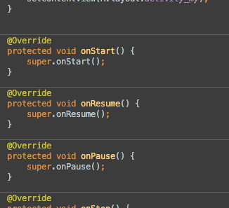

### The Call Hierarchy Popup

`ctrl+alt+h`

查看某个方法的调用路径。

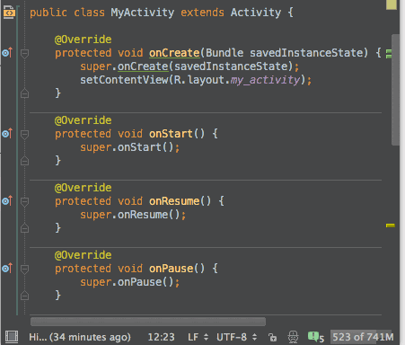

### Quick Definition Lookup

`ctrl+shift+i`

不离开当前文件当前类的情况下快速查看某个方法或者类的实现。通过大概预览下调用的方法，可以避免许多未知的坑

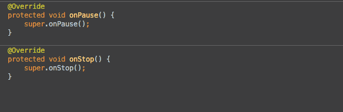

### Bookmarks!

如其名，书签。帮助快速回到指定的位置，实际使用中简直爽得不行。

`f11` 

将当前位置添加到书签中或者从书签中移除。

`shift+f11`
 
显示有哪些书签。

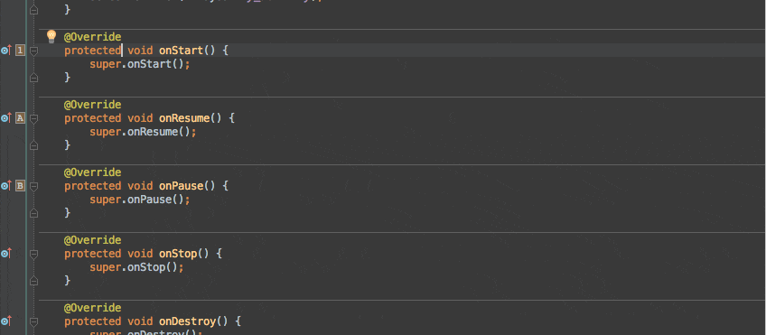

### Find Actions

`ctrl+shift+a `

对于没有设置快捷键或者忘记快捷键的菜单或者动作（Action），可能通过输入其名字快速调用。神技！！！

例如想要编译，只需要输入"release"，则列表框中就会出现"assembleRelease"选项，选择就可以进行编译。

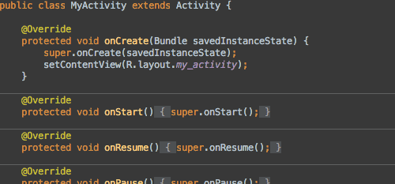

### Move Lines Up/Down

`alt+shift+up/down` 

上下移动行，这个没什么好说的，肯定会用到。

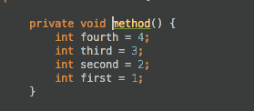

### Lines Edit

`ctrl+y`，`ctrl+x`, `ctrl+d`
 
删除行，删除并复制行，复制行并粘贴，必备。

### VCS Operations Popup

` Alt + ` `(是1左边的那个键) 

此快捷键会显示一个版本管理常用的一个命令，可以通过命令前面的数字或者模糊匹配来快速选择命令。

极大的提高了工作效率，快速提交代码、暂存代码、切分支等操作操作如鱼得水。

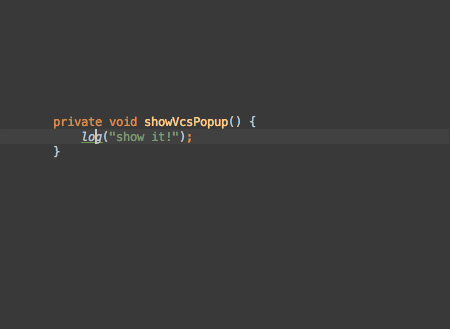

### Hide All Panels

`ctrl+shift+f12`
 
关闭或者恢复其他窗口。在编写代码的时候非常方便的全屏编辑框，可以更加专心的coding...

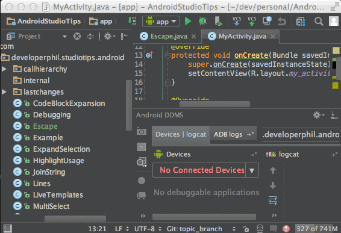

### Parameter Info

`ctrl+p`
 
在调用一些方法的时候免不了会忘记或者不知道此方法需要哪些参数。ctrl+p可以显示出此方法需要的参数。必备技能之一。

### Rename

`shift+f6`
 
重命名变量或者方法名。重构神技。

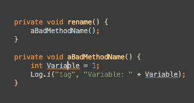

## 条件断点

通过右键断点，可以对一个断点加入条件。只有当满足条件时，才会进入到断点中。调试神技，只对自己关心的情况进行调试，不浪费时间。

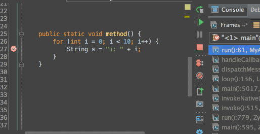

## 进入调试模式

点击Attach Debugger(即绿色小虫旁边那个)可以快速进入调试而不需要重新部署和启动app。

可以选择为此功能设置一个快捷键或者通过前面提到的Find Actions(ctrl+shift+a)输入"attach"进行调用。

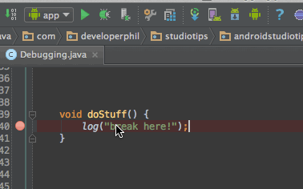

## 快速查看变量的值

按住Alt点击想要查看的变量或者语句。如果想查看更多，则可以按Alt+f8调出Evaluate Expression窗口来自行输入自定义的语句。

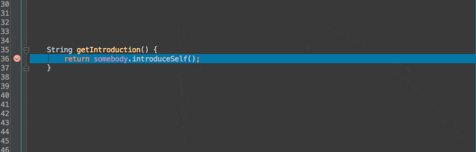

## 分析堆栈信息

Find Actions(ctrl+shift+a)输入"analyze stacktrace"即可查看堆栈信息。

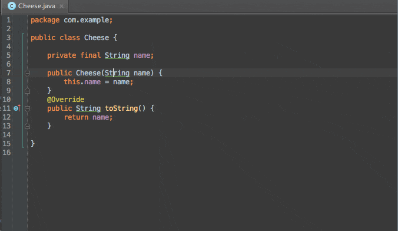

## 分析某个值的来源

Find Actions(ctrl+shift+a)输入"Analyze Data Flow to Here"，可以查看某个变量某个参数其值是如何一路赋值过来的。
对于分析代码非常有用。

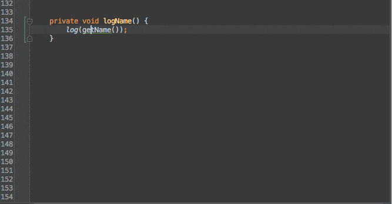

## 多行编辑

强大的神技之一，用过vim的vim-multiple-cursors或者Sublime Text的多行编辑都不会忘记那种快感！ 也许不是平时用得最多的技能，但是却是关键时刻提高效率的工具。

快捷键：Alt+J

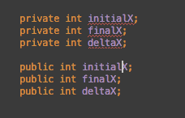

## 列编辑

在vim中叫作块编辑，同样神技！使用方法：按住Alt加鼠标左键拉框即可

PS：发现Ubuntu下不可用，代替方法为按Alt+Shift+Insert之后拖框选择。

但是经过这么操作之后，神技就大打折扣了。估计是与Ubuntu的快捷键冲突了。

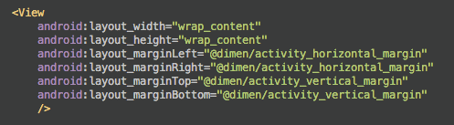

## Enter和Tab在代码提示时的区别

看图!

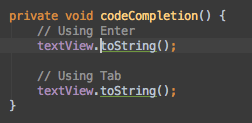

