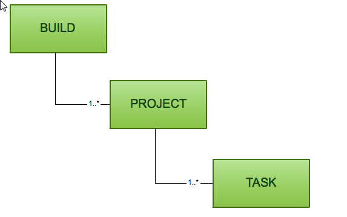
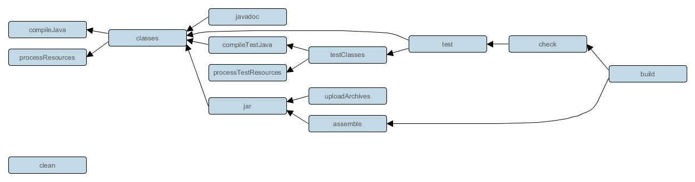

# Gradle 指南

## Gradle是什么？

Gradle是一种依赖管理工具，基于Groovy语言，面向Java应用为主，它抛弃了基于XML的各种繁琐配置，取而代之的是一种基于Groovy的内部领域特定（DSL）语言。它提供灵活的通用构建工具，就像ant。同时完美兼容Maven或Ivy仓库

Gradle的特点：

+ 一个像Ant一样非常灵活的通用构建工具
+ 一种可切换的，像Maven一样基于约定的构建框架，约定优于配置
+ 强大的对于多工程构建的支持
+ 完全支持现有的Maven和lvy仓库
+ 支持传递性依赖管理，而不需要远程仓库或者是pom.xml和ivy.xml文件
+ 非常适合构建Ant tasks和build
+ 支持Groovy构建脚本
+ 非常丰富的域模型来描述你的构建

2009年7月20日发行第一个版本0.7，到现在已经发行了20个大版本，目前最新版本是2.3。从2.0版本开始，Gradle提供了C和C++的支持，使得Gradle的构建、测试和提交工作不仅限于基于JVM的系统。

从2012年6月发布1.0以来，Gradle一直以八周一个新版本的速率稳步升级，从1.0到2.0，Gradle也逐渐成熟。现在越来越多的Java开发者开始使用Gradle进行项目的自动化构建 

## 安装Gradle

安装一个 Java JDK 或者 JRE. 而且 Java 版本必须至少是 6 以上
从 Gradle网站http://www.gradle.org/downloads下载任意一个已经发布的版本，并解压到任意目录

添加一个 GRADLE_HOME 环境变量来指明 Gradle 的安装路径
添加 GRADLE_HOME/bin 到您的 PATH 环境变量中

```
Linux:
export GRADLE_HOME={your gradle path}
export PATH=$PATH:GRADLE_HOME/bin
```

## Gradle的基本组成

项目(Project) 和 任务(tasks)，Gradle 里的任何东西都是基于这两个基础概念。

+ 项目是指我们的构建产物（比如Jar包）或实施产物（将应用程序部署到生产环境）。
+ 任务是指不可分的最小工作单元，执行构建工作（比如编译项目或执行测试）。
+ 每一个构建都是由一个或多个 projects 构成的，每一个 project 是由一个或多个 tasks 构成的，一个 task是指不可分的最小工作单元，执行构建工作（比如编译项目或执行测试）



一个工程的Build，是由多个Project组成，而一个Project又是由task组成的

## Gradle构建系统的组成

任何一个构建系统都是由多个构建文件组成，如Ant是由build.xml组成，Maven是由pom.xml组成，Make是由makefile组成。这些构建脚本定义了一系列的规则来指定项目编译流程。

Gradle的构建系统是由以下几个文件组成

+ build.gradle 我们称这个文件为一个构建脚本，这个脚本定义了一个模块和编译用的tasks，它一般是放在项目的模块中，也可以放在项目的根目录用来作为编译结构全局设置，它是必须的
+ settings.gradle 它描述了哪一个模块需要参与构建。每一个多模块的构建都必须在项目结构的根目录中加入这个设置文件，它也是必须的
+ gradle.properties 用来配置构建属性，这个不是必须的

settings.gradle和gradle.properties的用法都十分简单，这里就不再多加说明，后面会给出示例，看示例就能明白其用法，现在主要对build.gradle的进行说明。

## Hello World

Gradle是基于Groovy语言的构建系统（这里并不会详细解释Groovy语法的使用，有需要请参考Groovy的官方文档 --- [Groovy语法](http://groovy-lang.org/single-page-documentation.html)），所以在构建脚本中可以使用Groovy语言来执行一些任务。

下面编写一个简单的build.gradle文件，定义一个task来打印hello world，如下所示：

```
task hello { //先定义一个hello的task
    doLast { //实现doLast方法
        println 'Hello world!'
    }
}
```

然后在终端中运行gradle hello命令来执行这个task,就会看到以下输入内容：

```
> gradle hello
:hello
Hello world!
```

对于hello这个task，还可以使用更简单的定义方式，如下：

```
task hello << {
    println 'Hello world!'
}
```

`<<` 就等价于 doLast，doLast 是gradle提供访问task任务的一个API，类似的还有 doFirst，当一个task被执行的时候，可以通过 doFirst 和 doLast 向task中动态添加操作。doFirst 和 doLast 会在task本身被执行之后才会被执行。例如：

```
task hello {
    println 'Hello Earth'
}
hello.doFirst {
    println 'Hello Venus'
}
hello.doFirst {
    println 'Hello Mercury'
}
hello.doLast {
    println 'Hello Mars'
}
hello << {
    println 'Hello Jupiter'
}
```

输入如下所示：

```
Hello Earth
:hello
Hello Mercury
Hello Venus
Hello Mars
Hello Jupiter
```

## Task依赖

上面示例展示了如何编写一个hello world的task，在Gradle中各个task并不是孤立的，它们可以是相互依赖的。要让一个task依赖另外一个task，只需要在task定义时加入 dependsOn: 说明即可，被依赖的task会优先依赖者被执行，例如：

```
task hello << {
    println 'Hello world!'
}
task intro(dependsOn: hello) << {
    println "I'm Gradle"
}
```

运行gradle intro命令后可以看到以下输出：

```
> gradle intro
Hello world!
I'm Gradle
```

## Gradle插件

Gradle的设计理念是，所有有用的特性都由Gradle插件提供，例如编写一个Java项目时，需要使用到 Java 插件， 它会将许多任务自动的加入到你项目里。Gradle本身提供了一系列的标准插件，无需多余配置只需要在你的build.gradle文件中加入 `apply plugin: 'java'`

这样就可以引入许多task，只需要使用相应的task命令就可以进行项目构建。例如下列一些task:

+ gradle build：编译整个项目，它会执行代码编译、代码检测和单元测试等
+ gradle assemble：编译并打包你的代码, 但是并不运行代码检测和单元测试
+ gradle clean：删除 build 生成的目录和所有生成的文件
+ gradle check：编译并测试你的代码。其它的插件会加入更多的检查步骤，如使用 checkstyle、pmd、findbugs

Gradle各个task的关系图：



从上图可以看出，我们通常在执行一个build命令时其实是将一些零散的命令批量执行了，我们也可以根据自己的需求执行其中某一个命令。

## 外部依赖

通常, 一个 Java 项目将有许多外部的依赖, 既指向外部的 JAR 文件. 为了在项目里引用这些 JAR 文件, 你需要告诉 Gradle 去哪里找它们. 在 Gradle 中, JAR 文件位于一个仓库中，这里的仓库类似于 maven 的仓库。

首先，指定maven的仓库地址：

```
repositories {
    mavenCentral()
}
```

mavenCentral() 是Gradle内置的一个maven仓库地址，加入maven仓库后，就可以直接加入maven仓库中的外部依赖，如果这个外部依赖不存在，gradle会联网去maven仓库中自动下载它，并将它缓存到本地，下次再使用时会优先从本地缓存中查找该依赖。

```
dependencies {
    compile group: 'commons-collections', name: 'commons-collections', version: '3.2'
    // 简化写法
    // compile 'commons-collections:commons-collections:3.2'
}
```

引用一个外部依赖需要指定使用的group, name 和 version 属性，三者缺一不可。那从哪里得知JAR包的这三个属性呢？我们可以从mvnrepository中搜索到。

## 本地依赖

Gradle也可以从本地目录中引入JAR包依赖，可以单一引入指定的某一JAR包，也可以引入某目录下所有的JAR包

```
dependencies {
    compile files('dir/file.jar')
    compile fileTree(dir: 'libs', include: '*.jar')
}
```

## 项目依赖

往往一个完整的项目由多个子项目构成。在Gradle中，使用文件settings.gradle定义当前项目的子项目。默认情况下，每个子项目的名称对应着当前操作系统目录下的一个子目录。

```
include 'sub-project1', 'sub-project2', 'sub-project3'
```

如sub-project1依赖sub-project2，则在sub-project1的build.gradle中加入以下配置即可：

```
dependencies {
    compile project(':sub-project2')
}
```

## 依赖关系管理

从宏观上说，依赖关系管理分为两个方面。首先，gradle需要知道你要构建或者运行的项目，以便找到它们。我们将这些导入的文件视为项目的依赖。第二，gradle需要构建或者打包你的项目产品。我们将这些导出的文件视为项目的发布。

例如在编译源码时项目需要Hibernate的某些jar包被加入到工程中，而在进行单元测试时还另需要Junit的某些jar被加入。这些被引入的jar包就是项目的依赖。Gradle允许对依赖进行相应的配置，通过不同的配置可以形成不同的依赖效果。例如：

```
apply plugin: 'java'

repositories {
    mavenCentral()
}

dependencies {
    compile group: 'org.hibernate', name: 'hibernate-core', version: '3.6.7.Final'
    testCompile group: 'junit', name: 'junit', version: '4.+'
}
```

在项目编译时期，junit的jar包不会被引入，只有在单元测试时才会被引入。这样，就可以在不同的场景下加入相应的依赖关系，非常的灵活

Java 插件中定义了许多标准的配置，例如如下：

+ compile: 用来编译项目源代码的依赖
+ runtime: 在运行时被生成的类使用的依赖。 默认的, 也包含了compile时的依赖。
+ testCompile: 编译测试代码的依赖。 默认的, 包含runtime时的依赖和compile时的依赖。
+ testRuntime: 运行测试所需要的依赖。 默认的, 包含上面三个依赖。


