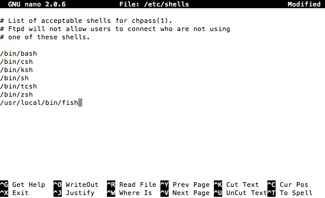

# Mac 命令行相关技巧

## nano 编辑器

+ ctrl 表示 ^
+ F3保存，F2退出

## 切换默认 bash

1. `sudo nano /etc/shells`
2. add `/usr/local/bin/fish` to your list of shells
3. `chsh -s /usr/local/bin/fish`

切换回来大概也就是这样，换对应路径即可

## 批量删除文件

    find . -name "*.Ulysses-Group.plist" -exec rm -Rf {} \;

## 清除不必要的服务

    launchctl list 查看服务列表
    launchctl remove xxxx 删除xxxxx服务的自启动

## 显示隐藏文件夹

	defaults write com.apple.finder AppleShowAllFiles -boolean true ; killall Finder

	defaults write com.apple.finder AppleShowAllFiles -boolean false ; killall Finder

