# 网络协议指南

互联网是为了通信，通信又依赖于协议。我们交谈时，要符合语法和用语规范。机器之间的通话也要符合协议。否则，鸡同鸭讲，无法相互理解。“协议森林”是我的一系列关于网络协议的文章，总结了多个网络协议。

网络协议属于技术，但深受政策与历史的影响。Ethernet, IP, UDP, TCP, HTTP, DNS... 这些协议形成茂密的树林，盘根错节。协议之间有时合作，有时竞争，有时弱肉强食的取代。了解网络分层，是理解这个森林的第一步。而森林的心脏，是存在了三十多年的TCP/IP套装。在变化迅捷的IT领域，TCP/IP历久弥新。这一点也是可以理解的。毕竟，单机技术可以很快更替，网络协议的更换要难很多。它要求整个网络的所有设备的配合。网络协议能持久，网络协议的知识也不会过时。

网络协议的发展伴随着有趣的故事。协议都产生于特定的历史环境。今天看来，一些网络协议显得笨拙，但在当时的条件下，则是聪明的解决方案。所以，在了解网络协议的时候，需要了解该协议的诞生过程和设计目的。

## 综述

### 邮差与邮局

信号的传输总要符合一定的协议(protocol)。比如说长城上放狼烟，是因为人们已经预先设定好狼烟这个物理信号代表了“敌人入侵”这一抽象信号。这样一个“狼烟=敌人入侵”就是一个简单的协议。协议可以更复杂，比如摩尔斯码(Morse Code)，使用短信号和长信号的组合，来代表不同的英文字母。比如SOS(`***---***`,  `*`代表短信号，`-`代表长信号)。这样`***= S, ---=O`就是摩尔斯码规定的协议。然而更进一层，人们会知道SOS是求助信息，原因是我们有`SOS=求救`这个协议存在在脑海里。所以`***---***=SOS=求救`是一个由两个协议组成的分层通信系统。

计算机之间的通信也要遵循不同层次的协议，来实现计算机的通信。

**物理层(physical layer)**

所谓的物理层，是指光纤、电缆或者电磁波等真实存在的物理媒介。这些媒介可以传送物理信号，比如亮度、电压或者振幅。对于数字应用来说，我们只需要两种物理信号来分别表示0和1，比如用高电压表示1，低电压表示0，就构成了简单的物理层协议。针对某种媒介，电脑可以有相应的接口，用来接收物理信号，并解读成为0/1序列。

**连接层(link layer)**

在连接层，信息以帧(frame)为单位传输。所谓的帧，是一段有限的0/1序列。连接层协议的功能就是识别0/1序列中所包含的帧。比如说，根据一定的0/1组合识别出帧的起始和结束。在帧中，有收信地址(Source, SRC)和送信地址(Destination, DST)，还有能够探测错误的校验序列(Frame Check Sequence)。当然，帧中最重要的最重要是所要传输的数据 (payload)。这些数据往往符合更高层协议，供网络的上层使用。与数据相配套，帧中也有数据的类型(Type)信息。连接层协议不关心数据中到底包含什么。帧就像是一个信封，把数据包裹起来。

以太网(Ethernet)和WiFi是现在最常见的连接层协议。通过连接层协议，我们可以建立局域的以太网或者WiFi局域网，并让位于同一局域网络中的两台计算机通信。连接层就像是一个社区的邮差，他认识社区中的每一户人。社区中的每个人都可以将一封信(帧)交给他，让他送给同一社区的另一户人家。

连接层：社区小邮差

**网络层(network layer)**

不同的社区之间该如何通信呢？ 换句话说，如何让WiFi上的一台计算机和以太网上的另一台计算机通信呢？我们需要一个“中间人”。这个“中间人”必须有以下功能: 1. 能从物理层上在两个网络的接收和发送0/1序列，2. 能同时理解两种网络的帧格式。路由器(router)就是为此而产生的“翻译”。一个路由器有多个网卡(NIC，Network Interface Controller)，每个NIC可以接入多个网络，并理解相应的连接层协议。在帧经过路由到达另一个网络的时候，路由会读取帧的信息，并改写以发送到另一个网络。所以路由器就像是在两个社区都有分支的邮局。一个社区的邮差将信送到本社区的邮局分支，而邮局会通过自己在另一个地区的分支将信转交给另一个社区的邮差手中，并由另一个社区的邮差最终送到目的地。

整个通信过程如下:

WiFi上的计算机1 -> 路由WiFi接口 ->  路由以太网接口 -> 以太网上的计算机2

在连接层，我们的一个帧中只能记录SRC和DST两个地址。而上面的过程需要经过四个地址 (计算机1，WiFi接口，以太网接口，计算机2)。显然，仅仅靠连接层协议无法满足我们的需要。由于连接层协议开发在先，我们无法改动连接层协议，只能在连接层的数据(payload)，也就是信纸内部下功夫了。IP协议应运而生。

计算机1，路由器和计算机2都要懂得IP协议。当计算机1写信的时候，会在信纸的开头写上这封信的出发地址和最终到达地址 (而不是在信封上)，而在信封上写上要送往邮局。WiFi网的邮差将信送往邮局。在邮局，信被打开，邮局工作人员看到最终地址，于是将信包装在一个新的信封中，写上出发地为邮局，到达地为计算机2，并交给以太网的邮差，由以太网的邮差送往计算机2。

(IP协议还要求写如诸如校验等信息，交通状况等信息，以保护通信的稳定性。)

在连接层，邮差只负责在本社区送信，所以信封上的地址总是“第一条街第三座房子”或者说“中心十字路口拐角的小房子”这样一些本地人才了解的地址描述，这给邮局的工作带来不便。所以邮局要求，信纸上写的地址必须是一个符合官方规定的“邮编”，也就是IP地址。这个地址为世界上的每一个房子编号(邮编)。当信件送到邮局的时候，邮局根据邮编，就能查到对应的地址描述，从而能顺利改写信封上的信息。

每个邮局一般连接多个社区，而一个社区也可以有多个邮局，分别通往不同的社区。有时候一封信要通过多个邮局转交，才能最终到达目的地，这个过程叫做route。邮局将分离的局域网络连接成了internet，并最终构成了覆盖全球的互联网。

**传输层(transport layer)**

上面的三层协议让不同的计算机之间可以通信。但计算机中实际上有许多个进程，每个进程都可能有通信的需求(参看Linux进程基础和Linux进程间通信)。这就好像一所房子里住了好几个人(进程)，如何让信精确的送到某个人手里呢？遵照之前相同的逻辑，我们需要在信纸上写上新的信息，比如收信人的姓名，才可能让信送到。所以，传输层就是在信纸的空白上写上新的“收信人”信息。每一所房子会配备一个管理员(传输层协议)。管理员从邮差手中接过信，会根据“收信人”，将信送给房子中的某个人。

传输层协议，比如TCP和UDP，使用端口号(port number)来识别收信人(某个进程)。在写信的时候，我们写上目的地的端口。当信到达目的地的管理员手中，他会根据传输层协议，识别端口号，将信送给不同的人。

TCP和UDP协议是两种不同的传输层协议。UDP协议类似于我们的信件交流过程。TCP协议则好像两个情人间的频繁通信。一个小情人要表达的感情太多，以致于连续写了好几封信。而另一方必须将这些信按顺序排列起来，才能看明白全部的意思。TCP协议还有控制网络交通等功能。
 
**应用层(application layer)**

通过上面的几层协议，我们已经可以在任意两个人(进程)之间进行通信。然而每个人实际上从事的是不同的行业。有的人是律师，有的人外交官。比如说律师之间的通信，会用严格的律师术语，以免产生纠纷。再比如外交官之间的通信，必须符合一定的外交格式，以免发生外交误会。再比如间谍通过暗号来传递加密信息。应用层协议是对信件内容进一步的用语规范。应用层的协议包括用于Web浏览的HTTP协议，用于传输文件的FTP协议，用于Email的IMAP等等。

### 总结

总过网络分层，我们从原始的0/1序列抽象出

本地地址(邮差)、邮编(邮局)、收信人(管理员)、收信人行业(用语规范)

这些概念。这些概念最终允许互联网上的分布于两台计算机的两个进程相互通信。

写信人必须按照各层的协议，封装好整个信封 (encapsulation)；而收信人则按照相反的顺序，来拆开这个信封。整个过程是可读信息 -> 二进制 -> 可读信息。计算机只能理解和传输0/1序列，而计算机的用户则总是输入和输出可读信息。网络协议保证了可读信息在整个转换和传输过程中的完整性。

计算机协议本身还有更多的细节需要深入。这篇文章只是从分层的角度描述各个层次所实现的功能。

## 连接层协议

### 小喇叭开始广播 (以太网与WiFi协议)

我们在邮差与邮局中说到，以太网和WiFi是连接层的两种协议。在连接层，信息以帧(frame)为单位传输。帧像信封一样将数据(payload)包裹起来，并注明收信地址和送信地址。连接层实现了“本地社区”的通信。我们先来看看以太网的帧。

#### 以太网的帧格式

帧本身是一段有限的0/1序列。它可以分为头部 | 数据(Payload) | 尾部三部分:

Preamble	SFD	DST	SRC	Type | Payload (Data) | Pad	FCS	Extension

帧按照上面的顺序从头到尾依次被发送/接收。我们下面进一步解释各个区域。

#### 头部

帧的最初7个byte被称为序言(preamble)。它的每个byte都是0xAA(这里是十六进制，也就是二进制的10101010)。通常，我们都会预定好以一定的频率发送0/1序列(比如每秒10bit)。如果接收设备以其他频率接收(比如每秒5bit)，那么就会错漏掉应该接收的0/1信息。但是，由于网卡的不同，发送方和接收方即使预订的频率相同，两者也可能由于物理原因发生偏差。这就好像两个人约好的10点见，结果一个人表快，一个人表慢一样。序言是为了让接收设备调整接收频率，以便与发送设备的频率一致，这个过程就叫做时钟复原(recover the clock)。

(就像在收听广播之前，调整转钮，直到声音清晰。网卡会在接收序言的过程中不断微调自己的接收频率，直到自己“听到”是...1010...)

时钟调整好之后，我们等待帧的起始信号(SFD, start frame delimiter)。SFD是固定的值0xAB。这个0xAB就好像“小喇叭开始广播啦”一样，提醒我们好节目就要上演了。

紧随SFD之后的是6 byte的目的地(DST, destination)和6 byte的发出地(SRC, source)。这就是我们在邮差和邮局中的介绍一样，为信封写上目的地和发出地。要注意，这里写在信封上的是对地址的“本地描述”，也就是MAC地址。MAC地址是物理设备自带的序号，只能在同一个以太网中被识别 (正如邮差只熟悉自己的社区一样)。

头部的最后一个区域是Type，用以说明数据部分的类型。(比如0x0800为IPv4，0x0806为ARP)

#### 数据

数据一般包含有符合更高层协议的数据，比如IP包。连接层协议本身并不在乎数据是什么，它只负责传输。注意，数据尾部可能填充有一串0(PAD区域)。原因是数据需要超过一定的最小长度。

#### 尾部

跟随在数据之后的是校验序列(FCS, Frame Check Sequence)。校验序列是为了检验数据的传输是否发生错误。在物理层，我们通过一些物理信号来表示0/1序列(比如高压/低压，高频率/低频率等)，但这些物理信号可能在传输过程中受到影响，以致于发生错误。如何来发现我们的数据是正确的呢？

一个方法是将数据发送两遍，然后对比一下是否一样。但这样就大大降低了网络的效率。FCS采用了CRC(Cyclic Redundancy Check)算法。这就好像是一家饭店的老板雇佣了一个收银员，但他又担心收银员黑钱。可是每天营业额很大，老板即使坐在旁边看，也不能用记住收到的总数。所以他采取了一个聪明的办法：只记住收到钱的最后一位 (比如收到19元，老板记住9)。当有新的进账(比如13，尾数为3)，他就将新的尾数和旧的尾数相加，再记住和的尾数(也就是2)。当收银员交给老板钱的时候，老板只用看总额的最后一位是否和自己记的最后一位相同，就可以知道收银员是否诚实了。如果说我们的数据是收银的总额的话，我们的FCS就是老板记录的尾数。如果两者不相符，我们就知道数据在传输的过程中出现错误，不能使用。

上面的比喻实际上是用营业总额不断的除以10，获得最终的尾数。CRC算法也相类似。n位CRC算法取一个n bit的因子，比如下面的1011。数据序列结尾增加n-1个0。因子与数据序列的不断进行XOR运算，直到得到n-1位的余数，也就是100。该余数各位取反(011)，然后存储在FCS的位置。

```
11010011101100 000 <--- 数据序列末尾增加3位0
1011               <--- 因子
01100011101100 000 <--- XOR结果
 1011              <--- 因子
00111011101100 000
  1011
00010111101100 000
   1011
00000001101100 000
       1011
00000000110100 000
        1011
00000000011000 000
         1011
00000000001110 000
          1011
00000000000101 000 
           101 1
-----------------
00000000000000 100 <--- 3位余数
```

上面例子用的是4位CRC。在Ethernet中使用的因子为32位的，以达到更好的检测效果。

#### 集线器(Hub) vs. 交换器(Switch)

以太网使用集线器或者交换器将帧从发出地传送到目的地。一台集线器或交换器上有多个端口，每个端口都可以连接一台计算机(或其他设备)。

集线器像一个广播电台。一台电脑将帧发送到集线器，集线器会将帧转发到所有其他的端口。每台计算机检查自己的MAC地址是不是符合DST。如果不是，则保持沉默。集线器是比较早期的以太网设备。它有明显的缺陷：

1) 任意两台电脑的通信在同一个以太网上是公开的。所有连接在同一个集线器上的设备都能收听到别人在传输什么，这样很不安全。可以通过对信息加密提高安全性。

2) 不允许多路同时通信。如果两台电脑同时向集线器发信，集线器会向所有设备发出“冲突”信息，提醒发生冲突。可以在设备上增加冲突检测算法(collision detection)：一旦设备发现有冲突，则随机等待一段时间再重新发送。

交换器克服集线器的缺陷。交换器记录有各个设备的MAC地址。当帧发送到交换器时，交换器会检查DST，然后将帧只发送到对应端口。交换器允许多路同时通信。由于交换器的优越性，交换器基本上取代了集线器。但比较老的以太网还有可能在使用集线器。

#### WiFi

WiFi的工作方式与集线器连接下的以太网类似。一个WiFi设备会向所有的WiFi设备发送帧，其它的WiFi设备检查自己是否符合DST。由于WiFi采取无线电信号，所以很难像交换器一样定向发送，所以WiFi的安全性很值得关注。WiFi采用加密的方法来实现信息的安全性。

(早期的WEP加密方法非常脆弱，建议使用WPA或者WPA2加密方法。隐藏WiFi设备ID的方法不是很有用。)

### 总结

我们深入了连接层协议的一些细节。连接层是物理与逻辑的接口，它的设计兼顾了物理需求(比如时钟复原，CRC)和逻辑需求(比如地址、数据)。由于连接层处于网络逻辑的底层，有许多基于连接层的攻击手法，这需要我们对连接层的工作方式有一定的了解，以设计出更好的网络安全策略。

## 网络层协议

### IP接力赛 (IP, ARP, RIP和BGP协议)

网络层(network layer)是实现互联网的最重要的一层。正是在网络层面上，各个局域网根据IP协议相互连接，最终构成覆盖全球的Internet。更高层的协议，无论是TCP还是UDP，必须通过网络层的IP数据包(datagram)来传递信息。操作系统也会提供该层的socket，从而允许用户直接操作IP包。

IP数据包是符合IP协议的信息(也就是0/1序列)，我们后面简称IP数据包为IP包。IP包分为头部(header)和数据(Data)两部分。数据部分是要传送的信息，头部是为了能够实现传输而附加的信息(这与以太网帧的头部功能相类似,如果对帧感到陌生，可参看小喇叭一文)。

#### IP包的格式

IP协议可以分为IPv4和IPv6两种。IPv6是改进版本，用于在未来取代IPv4协议。出于本文的目的，我们可以暂时忽略两者的区别，只以IPv4为例。下面是IPv4的格式

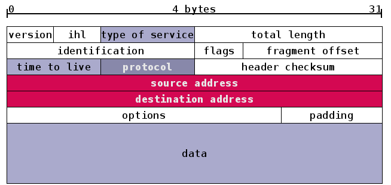

与帧类似，IP包的头部也有多个区域。我们将注意力放在红色的发出地(source address)和目的地(destination address)。它们都是IP地址。IPv4的地址为4 bytes的长度(也就是32位)。我们通常将IPv4的地址分为四个十进制的数，每个数的范围为0-255,比如192.0.0.1就是一个IP地址。填写在IP包头部的是该地址的二进制形式。

IP地址是全球地址，它可以识别"社区"(局域网)和"房子"(主机)。这是通过将IP地址分类实现的。

```
IP class    From          To                Subnet Mask
A           1.0.0.0       126.255.255.255    255.0.0.0
B           128.0.0.0     191.255.255.255    255.255.0.0
C           192.0.0.0     223.255.255.255    255.255.255.0
```

每个IP地址的32位分为前后两部分，第一部分用来区分局域网，第二个部分用来区分该局域网的主机。子网掩码(Subnet Mask)告诉我们这两部分的分界线，比如255.0.0.0(也就是8个1和24个0)表示前8位用于区分局域网，后24位用于区分主机。由于A、B、C分类是已经规定好的，所以当一个IP地址属于B类范围时，我们就知道它的前16位和后16位分别表示局域网和主机。

#### 网卡与路由器

邮差与邮局中说，IP地址是分配给每个房子(计算机)的"邮编"。但这个说法并不精确。IP地址实际上识别的是网卡(NIC, Network Interface Card)。网卡是计算机的一个硬件，它在接收到网路信息之后，将信息交给计算机(处理器/内存)。当计算机需要发送信息的时候，也要通过网卡发送。一台计算机可以有不只一个网卡，比如笔记本就有一个以太网卡和一个WiFi网卡。计算机在接收或者发送信息的时候，要先决定想要通过哪个网卡。

路由器(router)实际上就是一台配备有多个网卡的专用电脑。它让网卡接入到不同的网络中，这样，就构成在邮差与邮局中所说的邮局。比如下图中位于中间位置的路由器有两个网卡，地址分别为199.165.145.17和199.165.146.3。它们分别接入到两个网络：199.165.145和199.165.146。

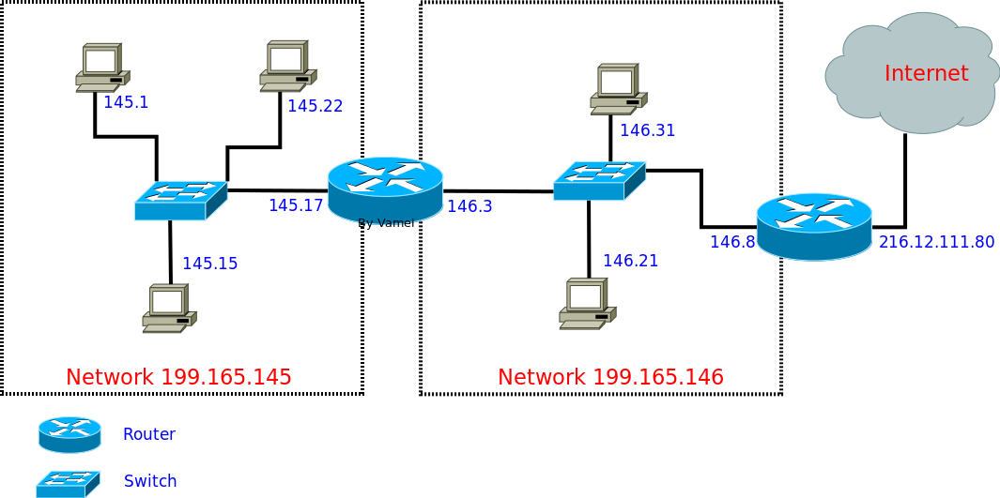

#### IP包接力

IP包的传输要通过路由器的接力。每一个主机和路由中都存有一个路由表(routing table)。路由表根据目的地的IP地址，规定了等待发送的IP包所应该走的路线。就好像下图的路标，如果地址是“东京”，那么请转左；如果地址是“悉尼”，那么请向右。

比如我们从主机145.17生成发送到146.21的IP包：铺开信纸，写好信的开头(剩下数据部分可以是TCP包，可以是UDP包，也可以是任意乱写的字，我们暂时不关心)，注明目的地IP地址(199.165.146.21)和发出地IP地址(199.165.145.17)。主机145.17随后参照自己的routing table，里面有三行记录：

```
145.17 routing table (Genmask为子网掩码,Iface用于说明使用哪个网卡接口)
Destination        Gateway             Genmask             Iface
199.165.145.0      0.0.0.0             255.255.255.0       eth0
0.0.0.0            199.165.145.17      0.0.0.0             eth0
```

这里有两行记录。

第一行表示，如果IP目的地是199.165.145.0这个网络的主机，那么只需要自己在eth0上的网卡直接传送(“本地社区”：直接送达)，不需要前往router(Gateway 0.0.0.0 = “本地送信”)。

第二行表示所有不符合第一行的IP目的地，都应该送往Gateway 199.165.145.17，也就是中间router接入在eth0的网卡IP地址(邮局在eth0的分支)。

我们的IP包目的地为199.165.146.21，不符合第一行，所以按照第二行，发送到中间的router。主机145.17会将IP包放入帧的payload，并在帧的头部写上199.165.145.17对应的MAC地址，这样，就可以按照小喇叭中的方法在局域网中传送了。

中间的router在收到IP包之后(实际上是收到以太协议的帧，然后从帧中的payload读取IP包)，提取目的地IP地址，然后对照自己的routing table：

```
Destination        Gateway             Genmask             Iface
199.165.145.0      0.0.0.0             255.255.255.0       eth0
199.165.146.0      0.0.0.0             255.255.255.0       eth1
0.0.0.0            199.165.146.8       0.0.0.0             eth1
```

从前两行我们看到，由于router横跨eth0和eth1两个网络，它可以直接通过eth0和eth1上的网卡直接传送IP包。

第三行表示，如果是前面两行之外的IP地址，则需要通过eth1，送往199.165.146.8(右边的router)。

我们的目的地符合第二行，所以将IP放入一个新的帧中，

在帧的头部写上199.165.146.21的MAC地址，直接发往主机146.21。

(在Linux下，可以使用`$route -n`来查看routing table)

IP包可以进一步接力，到达更远的主机。IP包从主机出发，根据沿途路由器的routing table指导，在router间接力。IP包最终到达某个router，这个router与目标主机位于一个局域网中，可以直接建立连接层的通信。最后，IP包被送到目标主机。这样一个过程叫做routing(我们就叫IP包接力好了，路由这个词实在是混合了太多的意思)。

整个过程中，IP包不断被主机和路由封装入帧(信封)并拆开，然后借助连接层，在局域网的各个NIC之间传送帧。整个过程中，我们的IP包的内容保持完整，没有发生变化。最终的效果是一个IP包从一个主机传送到另一个主机。利用IP包，我们不需要去操心底层(比如连接层)发生了什么。

#### ARP协议

在上面的过程中，我们实际上假设了，每一台主机和路由都能了解局域网内的IP地址和MAC地址的对应关系，这是实现IP包封装(encapsulation)到帧的基本条件。IP地址与MAC地址的对应是通过ARP协议传播到局域网的每个主机和路由。每一台主机或路由中都有一个ARP cache，用以存储局域网内IP地址和MAC地址如何对应。

ARP协议(ARP介于连接层和网络层之间，ARP包需要包裹在一个帧中)的工作方式如下：主机会发出一个ARP包，该ARP包中包含有自己的IP地址和MAC地址。通过ARP包，主机以广播的形式询问局域网上所有的主机和路由：我是IP地址xxxx，我的MAC地址是xxxx，有人知道199.165.146.4的MAC地址吗？拥有该IP地址的主机会回复发出请求的主机：哦，我知道，这个IP地址属于我的一个NIC，它的MAC地址是xxxxxx。由于发送ARP请求的主机采取的是广播形式，并附带有自己的IP地址和MAC地址，其他的主机和路由会同时检查自己的ARP cache，如果不符合，则更新自己的ARP cache。

这样，经过几次ARP请求之后，ARP cache会达到稳定。如果局域网上设备发生变动，ARP重复上面过程。

(在Linux下，可以使用$arp命令来查看ARP的过程。ARP协议只用于IPv4。IPv6使用Neighbor Discovery Protocol来替代ARP的功能。)

#### Routing Table的生成

我们还有另一个假设，就是每个主机和路由上都已经有了合理的routing table。这个routint table描述了网络的拓扑(topology)结构。如果你了解自己的网络连接，可以手写自己主机的routing table。但是，一个路由器可能有多个出口，所以routing table可能会很长。更重要的是，周围连接的其他路由器可能发生变动(比如新增路由器或者路由器坏掉)，我们就需要routing table能及时将交通导向其他的出口。我们需要一种更加智能的探测周围的网络拓扑结构，并自动生成routing table。

我们以北京地铁为例子。如果从机场前往朝阳门，那么可以采取2号航站楼->>三元桥->>东直门->>朝阳门。2号航站楼和朝阳门分别是出发和目的主机。而三元桥和东直门为中间的两个router。如果三元桥->>东直门段因为维修停运，我们需要更改三元桥的routing table，从而给前往朝阳门的乘客(IP包)指示：请走如下路线三元桥->>芍药居。然后依照芍药居的routing table前往朝阳门(芍药居->>东直门->>朝阳门)。

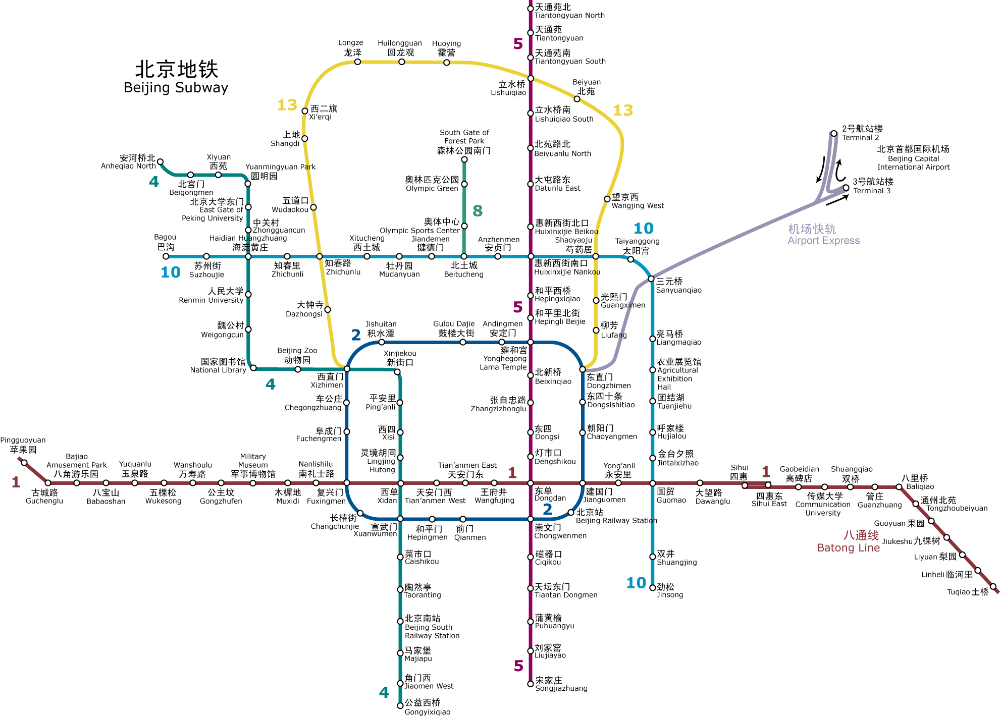

一种用来生成routing table的协议是RIP(Routing Information Protocol)。它通过距离来决定routing table，所以属于distance-vector protocol。对于RIP来说，所谓的距离是从出发地到目的地途径的路由器数目(hop number)。比如上面从机场到朝阳门，按照2号航站楼->>三元桥->>东直门->>朝阳门路线，途径两个路由器，距离为2。我们最初可以手动生成三元桥的routing table。随后，根据RIP协议，三元桥向周围的路由器和主机广播自己前往各个IP的距离(比如到机场=0，团结湖=0，国贸=1，望京西=1，建国门=2)。收到RIP包的路由器和主机根据RIP包和自己到发送RIP包的主机的距离，算出自己前往各个IP的距离。东直门与三元桥的距离为1。东直门收到三元桥的RIP包(到机场的距离为0)，那么东直门途径三元桥前往机场的距离为1+0=1。如果东直门自己的RIP记录都比这个远(比如东直门->>芍药居->>三元桥->>机场 = 2)。那么东直门更改自己的routing table：前往机场的交通都发往三元桥而不是芍药居。如果东直门自身的RIP记录并不差，那么东直门保持routing table不变。上述过程在各个点不断重复RIP广播/计算距离/更新routing table的过程，最终所有的主机和路由器都能生成最合理的路径(merge)。

(RIP的基本逻辑是：如果A距离B为6，而我距离A为1，那么我途径A到B的距离为7)

RIP出于技术上的原因(looping hops)，认为距离超过15的IP不可到达。所以RIP更多用于互联网的一部分(比如整个中国电信的网络)。这样一个互联网的部分往往属于同一个ISP或者有同一个管理机构，所以叫做自治系统(AS,autonomous system)。自治系统内部的主机和路由根据通向外部的边界路由器来和其它的自治系统通信。各个边界路由器之间通过BGP(Border Gateway Protocol)来生成自己前往其它AS的routing table，而自治系统内部则参照边界路由器，使用RIP来决定routing table。BGP的基本工作过程与RIP类似，但在考虑距离的同时，也权衡比如政策、连接性能等其他因素，再决定交通的走向(routing table)。

#### 总结

我们一开始讲述了IP包根据routing table进行接力的过程。为了顺利实现接力，我们又进一步深入到ARP和RIP/BGP。这三个协议都协助了IP传输。ARP让每台电脑和路由器知道自己局域网内IP地址和MAC地址的对应关系，从而顺利实现IP包到帧的封装。RIP协议可以生成自治系统内部合理的routing table。BGP协议可以生成自治系统外部的routing table。

在整个过程中，我们都将注意力放在了IP包大的传输过程中，而故意忽略一些细节。 而上面的IP接力过程适用于IPv6。

### 地址耗尽危机 (IPv4与IPv6地址)

IP地址是IP协议的重要组成部分，它可以识别接入互联网中的任意一台设备。在IP接力中，我们已经看到，IP包的头部写有出发地和目的地的IP地址。IP包上携带的IP地址和路由器相配合，最终允许IP包从互联网的一台电脑传送到另一台。

在IP接力中，我们是以IPv4为例说明IP包的格式的。IPv4和IPv6是先后出现的两个IP协议版本。IPv4的地址就是一个32位的0/1序列，比如11000000 00000000 0000000 00000011。为了方便人类记录和阅读，我们通常将32位0/1分成4段8位序列，并用10进制来表示每一段(这样，一段的范围就是0到255)，段与段之间以.分隔。比如上面的地址可以表示成为192.0.0.3。IPv6地址是128位0/1序列，它也按照8位分割，以16进制来记录每一段(使用16进制而不是10进制，这能让写出来的IPv6地址短一些)，段与段之间以:分隔。

#### IP地址的分配

IP地址的分配是一个政策性的问题。ICANN(the Internet Corporation for Assigned Names and Numbers)是Internet的中心管理机构。ICANN的IANA(Internet Assigned Numbers Authourity)部门负责将IP地址分配给5个区域性的互联网注册机构(RIR，Reginal Internet Registry)，比如APNIC，它负责亚太地区的IP分配。然后RIR将地址进一步分配给当地的ISP(Internet Service Provider)，比如中国电信和中国网通。ISP再根据自己的情况，将IP地址分配给机构或者直接分配给用户，比如将A类地址分配给一个超大型机构，而将C类地址分配给一个网吧。机构可以进一步在局域网内部分配IP地址给各个主机。(A/B/C类地址请参阅IP接力)

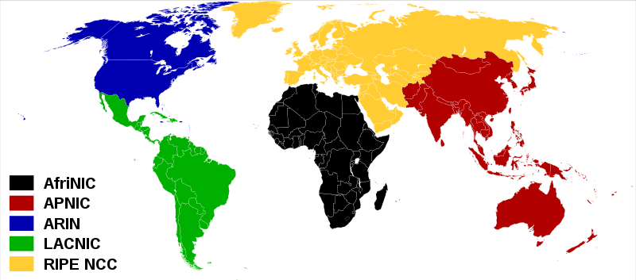

并不是所有的地址都会被分配。一些地址被预留，用于广播、测试、私有网络使用等。这些地址被称为专用地址(special-use address)。你可以查询RFC5735来了解哪些地址是专用地址。

(RFC，Request For Comments。RFC是一系列的技术文档，用于记录Internet相关的技术和协议规定。每一个RFC文件都有一个固定的编号。它们是互联网的一个重要财产。你可以通过 http://www.rfc-editor.org/ 来查找RFC文件)

#### IPv4地址耗尽

由于IPv4协议的地址为32位，所以它可以提供2^32 , 也就是大约40亿个地址。如果地球人每人一个IP地址的话，IPv4地址已经远远不够。更何况，人均持有的入网设备可能要远多于一个

下图显示了各大洲RIR的IPv4地址耗尽日期 (IANA已经将所有的IP分配给各个RIR)：

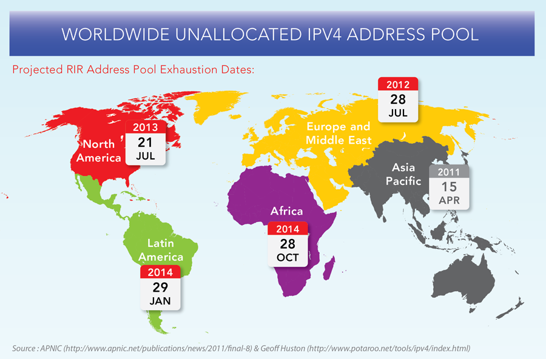

尽管一些技术措施(比如NAT技术，我会在其他文章中深入NAT)减缓了情况的紧急程度，但IPv4地址耗尽的一天终究还是会很快到来。很明显，我们需要更多的IP地址，以满足爆炸式增长的互联网设备对IP地址的需求。

#### 更长=更好

IPv6协议的地址最重要的改进就是：加长。IPv6的地址为128位。准确的说，IPv4有4,294,967,296个地址，而IPv6有

340,282,366,920,938,463,374,607,431,768,211,456

个地址。这是怎样一个概念呢？我们可以大概计算一下

地球表面积大约为510,067,866,000,000平方米。在一平方厘米(大约是指甲盖大小)的面积内，我们可以有6.67x10^16 个IP地址！所以在短期的时间内，我们应该不会看到IPv6被用尽的尴尬。(不排除在未来计算机以分子尺寸出现，那么我们就会有IPv6耗尽危机了)

#### 总结

IPv4地址正在耗尽，而IPv6通过更长的序列提供了更多的IP地址。IPv4向IPv6的迁移正在发生。

阻碍迁移的过程的主要在于IPv4和IPv6格式的不兼容性。老的路由器支持IPv4格式的IP包，但它们无法理解IPv6格式的IP包。所以这一迁移过程必然要伴随者设备的更新。然而，我们的许多互联网资产都是建立在IPv4网络上的，不可能一夜之间停止IPv4网络的服务而整体迁移到IPv6网络中。这一迁移过程注定充满坎坷。

### 我尽力 (IP协议详解)

在粗略了解了IP接力和IP地址后，我们再反过来，看一看IP协议的具体细节和设计哲学。

#### IPv4与IPv6头部的对比

我们已经在IP接力中介绍过，一个IP包分为头部(header)和数据(payload/data)两部分。头部是为了实现IP通信必须的附加信息，数据是IP通信所要传送的信息。

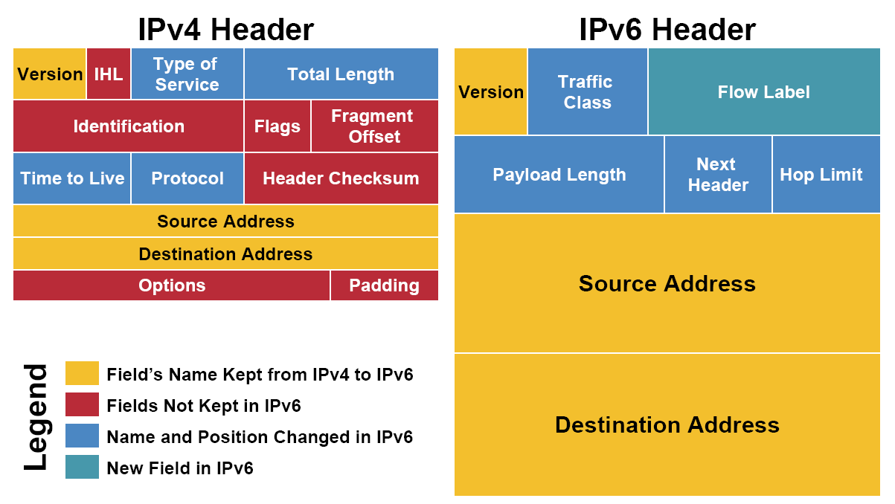

**黄色区域 (同名区域)**

我们看到，三个黄色区域跨越了IPv4和IPv6。Version(4位)用来表明IP协议版本，是IPv4还是IPv6(IPv4, Version=0100; IPv6, Version=0110)。Source Adrresss和Destination Address分别为发出地和目的地的IP地址。
 
**蓝色区域 （名字发生变动的区域）**

Time to Live 存活时间(Hop Limit in IPv6)。Time to Live最初是表示一个IP包的最大存活时间：如果IP包在传输过程中超过Time to Live，那么IP包就作废。后来，IPv4的这个区域记录一个整数(比如30)，表示在IP包接力过程中最多经过30个路由接力，如果超过30个路由接力，那么这个IP包就作废。IP包每经过一个路由器，路由器就给Time to Live减一。当一个路由器发现Time to Live为0时，就不再发送该IP包。IPv6中的Hop Limit区域记录的也是最大路由接力数，与IPv4的功能相同。Time to Live/Hop Limit避免了IP包在互联网中无限接力。

Type of Service 服务类型(Traffic Class in IPv6)。Type of Service最初是用来给IP包分优先级，比如语音通话需要实时性，所以它的IP包应该比Web服务的IP包有更高的优先级。然而，这个最初不错的想法没有被微软采纳。在Windows下生成的IP包都是相同的最高优先级，所以在当时造成Linux和Windows混合网络中，Linux的IP传输会慢于Windows (仅仅是因为Linux更加守规矩！)。后来，Type of Service被实际分为两部分：Differentiated Service Field (DS, 前6位)和Explicit Congestion Notification (ECN, 后2位)，前者依然用来区分服务类型，而后者用于表明IP包途径路由的交通状况。IPv6的Traffic Class也被如此分成两部分。通过IP包提供不同服务的想法，并针对服务进行不同的优化的想法已经产生很久了，但具体做法并没有形成公认的协议。比如ECN区域，它用来表示IP包经过路径的交通状况。如果接收者收到的ECN区域显示路径上的很拥挤，那么接收者应该作出调整。但在实际上，许多接收者都会忽视ECN所包含的信息。交通状况的控制往往由更高层的比如TCP协议实现。

Protocol 协议(Next Header in IPv6)。Protocol用来说明IP包Payload部分所遵循的协议，也就是IP包之上的协议是什么。它说明了IP包封装的是一个怎样的高层协议包(TCP? UDP?)。

Total Length, 以及IPv6中Payload Length的讨论要和IHL区域放在一起，我们即将讨论。

**红色区域 (IPv6中删除的区域)**

我们看一下IPv4和IPv6的长度信息。IPv4头部的长度。在头部的最后，是options。每个options有32位，是选填性质的区域。一个IPv4头部可以完全没有options区域。不考虑options的话，整个IPv4头部有20 bytes(上面每行为4 bytes)。但由于有options的存在，整个头部的总长度是变动的。我们用IHL(Internet Header Length)来记录头部的总长度，用Total Length记录整个IP包的长度。IPv6没有options，它的头部是固定的长度40 bytes，所以IPv6中并不需要IHL区域。Payload Length用来表示IPv6的数据部分的长度。整个IP包为40 bytes + Payload Length。

IPv4中还有一个Header Checksum区域。这个checksum用于校验IP包的头部信息。Checksum与之前在小喇叭中提到的CRC算法并不相同。IPv6则没有checksum区域。IPv6包的校验依赖高层的协议来完成，这样的好处是免去了执行checksum校验所需要的时间，减小了网络延迟 (latency)。

Identification, flags和fragment offset，这三个包都是为碎片化(fragmentation)服务的。碎片化是指一个路由器将接收到的IP包分拆成多个IP包传送，而接收这些“碎片”的路由器或者主机需要将“碎片”重新组合(reassembly)成一个IP包。不同的局域网所支持的最大传输单元(MTU, Maximum Transportation Unit)不同。如果一个IP包的大小超过了局域网支持的MTU，就需要在进入该局域网时碎片化传输(就好像方面面面饼太大了，必须掰碎才能放进碗里)。碎片化会给路由器和网络带来很大的负担。最好在IP包发出之前探测整个路径上的最小MTU，IP包的大小不超过该最小MTU，就可以避免碎片化。IPv6在设计上避免碎片化。每一个IPv6局域网的MTU都必须大于等于1280 bytes。IPv6的默认发送IP包大小为1280 bytes。

**绿色区域 (IPv6新增区域)**

Flow Label是IPv6中新增的区域。它被用来提醒路由器来重复使用之前的接力路径。这样IP包可以自动保持出发时的顺序。这对于流媒体之类的应用有帮助。Flow label的进一步使用还在开发中。

#### “我尽力”

IP协议在产生时是一个松散的网络，这个网络由各个大学的局域网相互连接成的，由一群碰头垢面的Geek维护。所以，IP协议认为自己所处的环境是不可靠(unreliable)的：诸如路由器坏掉、实验室失火、某个PhD踢掉电缆之类的事情随时会发生。

这样的凶险环境下，IP协议提供的传送只能是“我尽力” (best effort)式的。所谓的“我尽力”，其潜台词是，如果事情出错不要怪我，我只是答应了尽力，可没保证什么。所以，如果IP包传输过程中出现错误(比如checksum对不上，比如交通太繁忙，比如超过Time to Live)，根据IP协议，你的IP包会直接被丢掉。Game Over, 不会再有进一步的努力来修正错误。Best effort让IP协议保持很简单的形态。更多的质量控制交给高层协议处理，IP协议只负责有效率的传输。

(多么不负责任的邮递系统)

“效率优先”也体现在IP包的顺序(order)上。即使出发地和目的地保持不变，IP协议也不保证IP包到达的先后顺序。我们已经知道，IP接力是根据routing table决定接力路线的。如果在连续的IP包发送过程中，routing table更新(比如有一条新建的捷径出现)，那么后发出的IP包选择走不一样的接力路线。如果新的路径传输速度更快，那么后发出的IP包有可能先到。这就好像是多车道的公路上，每辆车都在不停变换车道，最终所有的车道都塞满汽车。这样可以让公路利用率达到最大。

IPv6中的Flow Label可以建议路由器将一些IP包保持一样的接力路径。但这只是“建议”，路由器可能会忽略该建议。

#### Header Checksum算法

Header Checksum区域有16位。它是这样获得的，从header取得除checksum之外的0/1序列，比如：

9194 8073 0000 4000 4011 C0A8 0001 C0A8 00C7 (十六进制hex, 这是一个为演示运算过程而设计的header)

按照十六位(也就是4位hex)分割整个序列。将分割后的各个4位hex累积相加。如果有超过16位的进位出现，则将进位加到后16位结果的最后一位：

```
  Binary                Hex

  1001000110010100      9194

+ 1000000001110011      8073

  ----------------

1 0001001000000111     11207

+                1

  ----------------

  0001001000001000      1208
```
  
上面的计算叫做one's complement sum。求得所有十六位数的和，

one's complement sum(4500, 0073, 0000, 4000, 4011, C0A8, 0001, C0A8, 00C7) = 1433

然后，将1433的每一位取反(0->1, 1->0)， 就得到checksum：EBCC

这样，我们的header就是:

9194 8073 0000 4000 4011 EBCC C0A8 0001 C0A8 00C7

IP包的接收方在接收到IP包之后，可以求上面各个16位数的one's complement sum，应该得到FFFF。如果不是FFFF，那么header是不正确的，整个IP包会被丢弃。

(再次提醒，示例所用的IP header不是真实的header，它只是起演示算法的作用)


#### 总结

每个网络协议的形成都有其历史原因。比如IP协议是为了将各个分散的实验室网络连接起来。由于当时的网络很小，所以IPv4(IPv4产生与70年代)的地址总量为40亿。尽管当时被认为是很大的数字，但数字浪潮很快带来了地址耗尽危机。IPv6的主要目的是增加IPv4的地址容量，但同时根据IPv4的经验和新时代的技术进步进行改进，比如避免碎片化，比如取消checksum (由于高层协议TCP的广泛使用)。网络协议技术上并不复杂，更多的考量是政策性的。

IP协议是"Best Effort"式的，IP传输是不可靠的。但这样的设计成就了IP协议的效率。

### 瑞士军刀 (ICMP协议)

到现在为止，我们讲解了网络层中最重要的IP协议(参考协议森林)。IP协议的一个重要补充是是ICMP协议。

#### ICMP协议

ICMP(Internet Control Message Protocol)是介于网络层和传输层的协议。它的主要功能是传输网络诊断信息。

ICMP传输的信息可以分为两类，一类是错误(error)信息，这一类信息可用来诊断网络故障。我们已经知道，IP协议的工作方式是“Best Effort”，如果IP包没有被传送到目的地，或者IP包发生错误，IP协议本身不会做进一步的努力。但上游发送IP包的主机和接力的路由器并不知道下游发生了错误和故障，它们可能继续发送IP包。通过ICMP包，下游的路由器和主机可以将错误信息汇报给上游，从而让上游的路由器和主机进行调整。需要注意的是，ICMP只提供特定类型的错误汇报，它不能帮助IP协议成为“可靠”(reliable)的协议。另一类信息是咨询(Informational)性质的，比如某台计算机询问路径上的每个路由器都是谁，然后各个路由器同样用ICMP包回答。

(ICMP基于IP协议。也就是说，一个ICMP包需要封装在IP包中，然后在互联网传送。ICMP是IP套装的必须部分，也就是说，任何一个支持IP协议的计算机，都要同时实现ICMP。)

ICMP包的结构：


ICMP包都会有Type, Code和Checksum三部分。Type表示ICMP包的大的类型，而Code是一个Type之内细分的小类型。针对不同的错误信息或者咨询信息，会有不同的Type和Code。从上面我们可以看到，ICMP支持的类型非常多，就好像瑞士军刀一样，有各种各样的功能。Checksum与IP协议的header checksum相类似，但与IP协议中checksum只校验头部不同，这里的Checksum所校验的是整个ICMP包(包括头部和数据)。

余下的ICMP包格式根据不同的类型不同。另一方面，ICMP包通常是由某个IP包触发的。这个触发IP包的头部和一部份数据会被包含在ICMP包的数据部分。

ICMP协议是实现ping命令和traceroute命令的基础。这两个工具常用于网络排错。

#### 常见的ICMP包类型

**回音**

回音(Echo)属于咨询信息。ping命令就是利用了该类型的ICMP包。当使用ping命令的时候，将向目标主机发送Echo-询问类型的ICMP包，而目标主机在接收到该ICMP包之后，会回复Echo-回答类型的ICMP包，并将询问ICMP包包含在数据部分。ping命令是我们进行网络排查的一个重要工具。如果一个IP地址可以通过ping命令收到回复，那么其他的网络协议通信方式也很有可能成功。

**源头冷却**

源头冷却(source quench)属于错误信息。如果某个主机快速的向目的地传送数据，而目的地主机没有匹配的处理能力，目的地主机可以向出发主机发出该类型的ICMP包，提醒出发主机放慢发送速度(请温柔一点吧)。

**目的地无法到达**

目的地无法到达(Destination Unreachable)属于错误信息。如果一个路由器接收到一个没办法进一步接力的IP包，它会向出发主机发送该类型的ICMP包。比如当IP包到达最后一个路由器，路由器发现目的地主机down机，就会向出发主机发送目的地无法到达(Destination Unreachable)类型的ICMP包。目的地无法到达还可能有其他的原因，比如不存在接力路径，比如不被接收的端口号等等。

**超时**

超时(Time Exceeded)属于错误信息。IPv4中的Time to Live(TTL)和IPv6中的Hop Limit会随着经过的路由器而递减，当这个区域值减为0时，就认为该IP包超时(Time Exceeded)。Time Exceeded就是TTL减为0时的路由器发给出发主机的ICMP包，通知它发生了超时错误。

traceroute就利用了这种类型的ICMP包。traceroute命令用来发现IP接力路径(route)上的各个路由器。它向目的地发送IP包，第一次的时候，将TTL设置为1，引发第一个路由器的Time Exceeded错误。这样，第一个路由器回复ICMP包，从而让出发主机知道途径的第一个路由器的信息。随后TTL被设置为2、3、4，...，直到到达目的主机。这样，沿途的每个路由器都会向出发主机发送ICMP包来汇报错误。traceroute将ICMP包的信息打印在屏幕上，就是接力路径的信息了。

**重新定向**

重新定向(redirect)属于错误信息。当一个路由器收到一个IP包，对照其routing table，发现自己不应该收到该IP包，它会向出发主机发送重新定向类型的ICMP，提醒出发主机修改自己的routing table。比如下面的网络：


假如145.1发送到145.15的IP包，结果被中间的路由器通过145.17的NIC收到。那么路由器会发现，根据自己的routing table，这个IP包要原路返回。那么router就可以判断出145.1的routing table可能有问题。所以路由器会向145.1发送redirect类型的ICMP包。

**IPv6的Neighbor Discovery**

ARP协议用于发现周边的IP地址和MAC地址的对应。然而，ARP协议只用于IPv4，IPv6并不使用ARP协议。IPv6包通过邻居探索(ND, Neighbor Discovery)来实现ARP的功能。ND的工作方式与ARP类似，但它基于ICMP协议。ICMP包有Neighbor Solicitation和Neighbor Advertisement类型。这两个类型分别对应ARP协议的询问和回复信息。

#### 总结

ICMP协议是IP协议的排错帮手，它可以帮助人们及时发现IP通信中出现的故障。基于ICMP的ping和traceroute也构成了重要的网络诊断工具。然而，需要注意的是，尽管ICMP的设计是出于好的意图，但ICMP却经常被黑客借用进行网络攻击，比如利用伪造的IP包引发大量的ICMP回复，并将这些ICMP包导向受害主机，从而形成DoS攻击。而redirect类型的ICMP包可以引起某个主机更改自己的routing table，所以也被用作攻击工具。许多站点选择忽视某些类型的ICMP包来提高自身的安全性。

## 传输层协议

### 傀儡 (UDP协议)

我们已经讲解了物理层、连接层和网络层。最开始的连接层协议种类繁多(Ethernet、Wifi、ARP等等)。到了网络层，我们只剩下一个IP协议(IPv4和IPv6是替代关系)。进入到传输层(transport layer)，协议的种类又开始繁多起来(比如TCP、UDP、SCTP等)。这就好像下面的大树，根部(连接层)分叉很多，然后统一到一个树干(网络层)，到了树冠(传输层)部分又开始开始分叉，而每个树枝上长出更多的树叶(应用层)。我们在网络层已经看到，通过树干的统一，我们实现了一个覆盖全球的互联网络(Internet)。然而，我们可能出于不同的目的利用这张“网”，随之使用的方式也有所区分。不同的传输层协议(以及更多的应用层协议)正是我们使用“网”的不同方式的体现。


传输层最重要的协议为TCP协议和UDP协议。这两者使用“网”的方式走了两个极端。两个协议的对比非常有趣。TCP协议复杂，但传输可靠。UDP协议简单，但传输不可靠。其他的各个传输层协议在某种程度上都是这两个协议的折中。我们先来看传输层协议中比较简单的UDP协议。

#### UDP协议简介

UDP(User Datagram Protocol)传输与IP传输非常类似。你可以将UDP协议看作IP协议暴露在传输层的一个接口。UDP协议同样以数据包(datagram)的方式传输，它的传输方式也是"Best Effort"的，所以UDP协议也是不可靠的(unreliable)。那么，我们为什么不直接使用IP协议而要额外增加一个UDP协议呢？ 一个重要的原因是IP协议中并没有端口(port)的概念。IP协议进行的是IP地址到IP地址的传输，这意味者两台计算机之间的对话。但每台计算机中需要有多个通信通道，并将多个通信通道分配给不同的进程使用(关于进程，可以参考Linux进程基础)。一个端口就代表了这样的一个通信通道。正如我们在邮局和邮差中提到的收信人的概念一样。UDP协议实现了端口，从而让数据包可以在送到IP地址的基础上，进一步可以送到某个端口。

尽管UDP协议非常简单，但它的产生晚于更加复杂的TCP协议。早期的网络开发者开发出IP协议和TCP协议分别位于网络层和传输层，所有的通信都要先经过TCP封装，再经过IP封装(应用层->TCP->IP)。开发者将TCP/IP视为相互合作的套装。但很快，网络开发者发现，IP协议的功能和TCP协议的功能是相互独立的。对于一些简单的通信，我们只需要“Best Effort”式的IP传输就可以了，而不需要TCP协议复杂的建立连接的方式(特别是在早期网络环境中，如果过多的建立TCP连接，会造成很大的网络负担，而UDP协议可以相对快速的处理这些简单通信)。UDP协议随之被开发出来，作为IP协议在传输层的"傀儡"。这样，网络通信可以通过应用层->UDP->IP的封装方式，绕过TCP协议。由于UDP协议本身异常简单，实际上只为IP传输起到了桥梁的作用。我们将在TCP协议的讲解中看到更多TCP协议和UDP协议的对比。

UDP的数据包同样分为头部(header)和数据(payload)两部分。UDP是传输层(transport layer)协议，这意味着UDP的数据包需要经过IP协议的封装(encapsulation)，然后通过IP协议传输到目的电脑。随后UDP包在目的电脑拆封，并将信息送到相应端口的缓存中。

#### UDP协议的头部

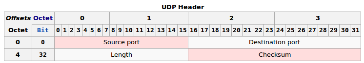

上面的source port和destination port分别为UDP包的出发端口和目的地端口。Length为整个UDP包的长度。

checksum的算法与IP协议的header checksum算法相类似。然而，UDP的checksum所校验的序列包括了整个UDP数据包，以及封装的IP头部的一些信息(主要为出发地IP和目的地IP)。这样，checksum就可以校验IP：端口的正确性了。在IPv4中，checksum可以为0，意味着不使用checksum。IPv6要求必须进行checksum校验。

#### 端口与socket

端口(port)是伴随着传输层诞生的概念。它可以将网络层的IP通信分送到各个通信通道。UDP协议和TCP协议尽管在工作方式上有很大的不同，但它们都建立了从一个端口到另一个端口的通信。


随着我们进入传输层，我们也可以调用操作系统中的API，来构建socket。Socket是操作系统提供的一个编程接口，它用来代表某个网络通信。应用程序通过socket来调用系统内核中处理网络协议的模块，而这些内核模块会负责具体的网络协议的实施。这样，我们可以让内核来接收网络协议的细节，而我们只需要提供所要传输的内容就可以了，内核会帮我们控制格式，并进一步向底层封装。因此，在实际应用中，我们并不需要知道具体怎么构成一个UDP包，而只需要提供相关信息(比如IP地址，比如端口号，比如所要传输的信息)，操作系统内核会在传输之前会根据我们提供的相关信息构成一个合格的UDP包(以及下层的包和帧)。socket是一个比较大的课题，在协议森林系列中不会过多深入。

#### 总结

端口是传输层带来的最重要的概念。我们进一步了解了UDP协议。如果已经掌握了IP协议，那么UDP协议就没有任何困难可言，它只是IP协议暴露在传输层上的接口。

### 不放弃 (TCP协议与流通信)

TCP(Transportation Control Protocol)协议与IP协议是一同产生的。事实上，两者最初是一个协议，后来才被分拆成网络层的IP和传输层的TCP。我们已经在UDP协议中介绍过，UDP协议是IP协议在传输层的“傀儡”，用来实现数据包形式的通信。而TCP协议则实现了“流”形式的通信。

TCP的内容非常丰富。我不能在一篇文章中将TCP讲完。这一篇主要介绍TCP协议的下面几个方面：

1. “流”通信的意义与实现方式
2. 如何实现可靠传输
3. 使用滑窗提高效率

#### “流”通信

TCP协议是传输层协议，实现的是端口到端口(port)的通信。更进一步，TCP协议虚拟了文本流(byte stream)的通信。在Linux文本流中我们谈到，计算机数据的本质是有序的0/1序列 (如果以byte为单位，就叫做文本流)。计算机的功能就是储存和处理文本流。CPU + memory + 存储设备实现了文本流在同一台计算机内部的加工处理。通过一些IO，比如屏幕和键盘，文本流实现了人机交互。而进一步，如果网络通信可在不同计算机之间进行文本流的交互，那么我们就和整个计算机系统的数据处理方式实现了对接。

IP协议和UDP协议采用的是数据包的方式传送，后发出的数据包可能早到，我们并不能保证数据到达的次序。TCP协议确保了数据到达的顺序与文本流顺序相符。当计算机从TCP协议的接口读取数据时，这些数据已经是排列好顺序的“流”了。比如我们有一个大文件要从本地主机发送到远程主机，如果是按照“流”接收到的话，我们可以一边接收，一边将文本流存入文件系统。这样，等到“流”接收完了，硬盘写入操作也已经完成。如果采取UDP的传输方式，我们需要等到所有的数据到达后，进行排序，才能组装成大的文件。这种情况下，我们不得不使用大量的计算机资源来存储已经到达的数据，直到所有数据都达到了，才能开始处理。

“流”的要点是次序(order)，然而实现这一点并不简单。TCP协议是基于IP协议的，所以最终数据传送还是以IP数据包为单位进行的。如果一个文本流很长的话，我们不可能将整个文本流放入到一个IP数据包中，那样有可能会超过MTU。所以，TCP协议封装到IP包的不是整个文本流，而是TCP协议所规定的片段(segment)。与之前的一个IP或者UDP数据包类似，一个TCP片段同样分为头部(header)和数据(payload)两部分 (“片段”这个名字更多是起提醒作用：嘿，这里并不是完整的文本流)。整个文本流按照次序被分成小段，而每一段被放入TCP片段的数据部分。一个TCP片段封装成的IP包不超过整个IP接力路径上的最小MTU，从而避免令人痛苦的碎片化(fragmentation)。

(给文本流分段是在发送主机完成的，而碎片化是在网络中的路由器完成的。路由器要处理许多路的通信，所以相当繁忙。文本流提前在发送主机分好段，可以避免在路由器上执行碎片化，可大大减小网络负担)

TCP片段的头部(header)会存有该片段的序号(sequence number)。这样，接收的计算机就可以知道接收到的片段在原文本流中的顺序了，也可以知道自己下一步需要接收哪个片段以形成流。比如已经接收到了片段1，片段2，片段3，那么接收主机就开始期待片段4。如果接收到不符合顺序的数据包(比如片段8)，接收方的TCP模块可以拒绝接收，从而保证呈现给接收主机的信息是符合次序的“流”。

#### 可靠性

片段编号这个初步的想法并不能解决我们所有的问题。IP协议是不可靠的，所以IP数据包可能在传输过程中发生错误或者丢失。而IP传输是"Best Effort" 式的，如果发生异常情况，我们的IP数据包就会被轻易的丢弃掉。另一方面，如果乱序(out-of-order)片段到达，根据我们上面说的，接收主机不会接收。这样，错误片段、丢失片段和被拒片段的联手破坏之下，接收主机只可能收到一个充满“漏洞”的文本流。

TCP的补救方法是，在每收到一个正确的、符合次序的片段之后，就向发送方(也就是连接的另一段)发送一个特殊的TCP片段，用来知会(ACK，acknowledge)发送方：我已经收到那个片段了。这个特殊的TCP片段叫做ACK回复。如果一个片段序号为L，对应ACK回复有回复号L+1，也就是接收方期待接收的下一个发送片段的序号。如果发送方在一定时间等待之后，还是没有收到ACK回复，那么它推断之前发送的片段一定发生了异常。发送方会重复发送(retransmit)那个出现异常的片段，等待ACK回复，如果还没有收到，那么再重复发送原片段... 直到收到该片段对应的ACK回复(回复号为L+1的ACK)。

当发送方收到ACK回复时，它看到里面的回复号为L+1，也就是发送方下一个应该发送的TCP片段序号。发送方推断出之前的片段已经被正确的接收，随后发出L+1号片段。ACK回复也有可能丢失。对于发送方来说，这和接收方拒绝发送ACK回复是一样的。发送方会重复发送，而接收方接收到已知会过的片段，推断出ACK回复丢失，会重新发送ACK回复。

通过ACK回复和重新发送机制，TCP协议将片段传输变得可靠。尽管底盘是不可靠的IP协议，但TCP协议以一种“不放弃的精神”，不断尝试，最终成功。(技术也可以很励志)

TCP协议和UDP协议走了两个极端。TCP协议复杂但可靠，UDP协议轻便但不可靠。在处理异常的时候，TCP极端负责，而UDP一副无所谓的样子。

#### 滑窗

上面的工作方式中，发送方保持发送->等待ACK->发送->等待ACK...的单线工作方式，这样的工作方式叫做stop-and-wait。stop-and-wait虽然实现了TCP通信的可靠性，但同时牺牲了网络通信的效率。在等待ACK的时间段内，我们的网络都处于闲置(idle)状态。我们希望有一种方式，可以同时发送出多个片段。然而如果同时发出多个片段，那么由于IP包传送是无次序的，有可能会生成乱序片段(out-of-order)，也就是后发出的片段先到达。在stop-and-wait的工作方式下，乱序片段完全被拒绝，这也很不效率。毕竟，乱序片段只是提前到达的片段。我们可以在缓存中先存放它，等到它之前的片段补充完毕，再将它缀在后面。然而，如果一个乱序片段实在是太过提前(太“乱”了)，该片段将长时间占用缓存。我们需要一种折中的方法来解决该问题：利用缓存保留一些“不那么乱”的片段，期望能在段时间内补充上之前的片段(暂不处理，但发送相应的ACK)；对于“乱”的比较厉害的片段，则将它们拒绝(不处理，也不发送对应的ACK)。

滑窗(sliding window)被同时应用于接收方和发送方，以解决以上问题。发送方和接收方各有一个滑窗。当片段位于滑窗中时，表示TCP正在处理该片段。滑窗中可以有多个片段，也就是可以同时处理多个片段。滑窗越大，越大的滑窗同时处理的片段数目越多(当然，计算机也必须分配出更多的缓存供滑窗使用)。

我们假设一个可以容纳三个片段的滑窗，并假设片段从左向右排列。对于发送方来说，滑窗的左侧为已发送并已ACK过的片段序列，滑窗右侧是尚未发送的片段序列。滑窗中的片段(比如片段5，6，7)被发送出去，并等待相应的ACK。如果收到片段5的ACK，滑窗将向右移动。这样，新的片段从右侧进入滑窗内，被发送出去，并进入等待状态。在接收到片段5的ACK之前，滑窗不会移动，即使已经收到了片段6和7的ACK。这样，就保证了滑窗左侧的序列是已经发送的、接收到ACK的、符合顺序的片段序列。

对于接收方来说，滑窗的左侧是已经正确收到并ACK回复过的片段(比如片段1，2，3，4)，也就是正确接收到的文本流。滑窗中是期望接收的片段(比如片段5, 6, 7)。同样，如果片段6，7先到达，那么滑窗不会移动。如果片段5先到达，那么滑窗会向右移动，以等待接收新的片段。如果出现滑窗之外的片段，比如片段9，那么滑窗将拒绝接收。

可以看到，随着滑窗的滑动，越来越多的片段被正确的传送。利用滑窗，我们一定程度上实现了对乱序数据的缓存。但是，过于乱序的数据依然会被拒绝。我们之前说的stop-and-wait的工作方式，相当于发送方和接收方的滑窗都只能容纳一个片段。

我们将在以后看到，TCP协议有实时调整滑窗大小的算法，以实现最优效率。

#### 总结

TCP协议和UDP协议走了两个极端。TCP协议复杂但可靠，UDP协议轻便但不可靠。在处理异常的时候，TCP极端负责，而UDP一副无所谓的样子。在TCP中，分段和编号实现了次序；ACK和重新发送实现了可靠性；sliding window则让上面的机制更加有效率的运行。Never give up，这就是TCP协议的态度。

### 爱的传声筒 (TCP连接)

在TCP协议与"流"通信中，我们概念性的讲解了TCP通信的方式。可以看到，TCP通信最重要的特征是：有序(ordering)和可靠(reliable)。有序是通过将文本流分段并编号实现的。可靠是通过ACK回复和重复发送(retransmission)实现的。这一篇文章将引入TCP连接(connection)的概念。

#### TCP连接

网络层在逻辑上提供了端口的概念。一个IP地址可以有多个端口。一个具体的端口需要IP地址和端口号共同确定(我们记为IP:port的形式)。一个连接为两个IP:port之间建立TCP通信。(一个常用的比喻为：TCP连接就像两个人打电话， IP为总机号码，port为分机号码)

参与连接的如果是两台电脑，那么两台电脑操作系统的TCP模块负责建立连接。每个连接有四个参数(两个IP，两个端口)，来表明“谁在和谁通话”。每台电脑都会记录有这四个参数，以确定是哪一个连接。如果这四个参数完全相同，则为同一连接；如果这四个参数有一个不同，即为不同的连接。这意味着，同一个端口上可以有多个连接。内核中的TCP模块生成连接之后，将连接分配给进程使用。

TCP连接是双向(duplex)的。在TCP协议与"流"通信中，我们所展示的TCP传输是单向的。双向连接实际上就是建立两个方向的TCP传输，所以概念上并不复杂。这时，连接的每一方都需要两个滑窗，以分别处理发送的文本流和接收的文本流。由于连接的双向性，我们也要为两个方向的文本流编号。这两个文本流的编号相互独立。为文本流分段和编号由发送方来处理，回复ACK则由接收的一方进行。

#### TCP片段的头部格式

在深入TCP连接之前，我们需要对TCP片段的头部格式有一些了解。我们知道，TCP片段分为头部和数据。数据部分为TCP真正传输的文本流数据。下面为TCP片段的头部格式：

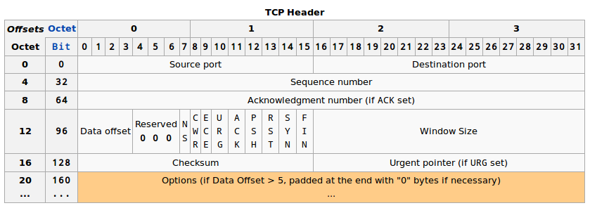

先关注下面几点：

1. 一个TCP头部需要包含出发端口(source port)和目的地端口(destination port)。这些与IP头中的两个IP地址共同确定了连接。
2. 每个TCP片段都有序号(sequence number)。这些序号最终将数据部分的文本片段整理成为文本流。
3. ACK是一位(bit)。只有ACK位设定的时候，回复号(Acknowledgement number)才有效。ACK回复号说明了接收方期待接收的下一个片段，所以ACK回复号为最后接收到的片段序号加1。
	+ 很多时候，ACK回复“附着”在发送的数据片段中。TCP协议是双向的。比如A和B两个电脑。ACK回复是接收方回复给发送方 (比如A发送给B， B回复A)。但同时，B也可以是发送方，B有可能有数据发送给A，所以B就把ACK回复附着在它要发送给A的数据片段的头部。这样可以减少ACK所占用的交通流量。一个片段可以只包含ACK回复。一个纯粹的ACK回复片段不传送文本流，所以不消耗序列号。如果有下一个正常的数据片段，它的序号将与纯粹ACK回复片段的序号相同。
	+ (ACK回复还可以“附着”在SYN片段和FIN片段)
4. ACK后面还有SYN和FIN，它们也各占据一位(bit)。我将在后面说明这两位。

#### 连接的建立

在TCP协议与"流"通信中讨论的TCP传输需要一个前提：TCP连接已经建立。然而，TCP连接从无到有需要一个建立连接的过程。建立连接的最重要目是让连接的双方交换初始序号(ISN, Initial Sequence Number)。根据TCP协议的规定，文本流的第一个片段的序号不能是确定的数字(比如说1)。连接的双方各自随机生成自己的ISN，然后再利用的一定方式让对方了解。这样的规定是出于TCP连接安全考虑：如果以一个确定的数字作为初始的TCP序号，那么其他人很容易猜出接下来的序列号，并按照正确的序号发送“伪装”的TCP片段，以插入到文本流中。

ISN交换是通过SYN片段实现的。SYN片段由头部的SYN位表明，它的序号为发送方的ISN。该片段由连接的一方首先发给给另一方，我们将发送SYN的一方称为客户(client)，而接收SYN的一方称为服务器(server)。我们使用ISN(c)表示client一方的ISN，使用ISN(s)表示server一方的ISN。随后，接收到SYN的server需要回复ACK，并发送出包含有server的ISN的SYN片段。下图为建立连接的过程，也就是经典的TCP三次握手(three-way handshaking)。两条竖直线分别为client和server的时间轴。每个箭头代表了一次TCP片段的单向传输。

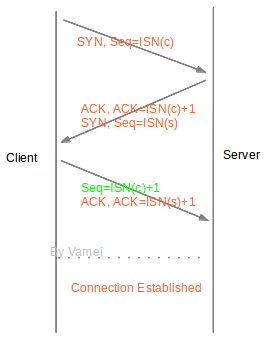

#### 连接的正常终结

一个连接建立之后，连接两端的进程可以利用该连接进行通信。当连接的一方觉得“我讲完了”，它可以终结连接中发送到对方方向的通信。连接最终通过四次握手(four-way handshaking)的方式终结，连接终结使用的是特殊片段FIN(FIN位为1的片段)。

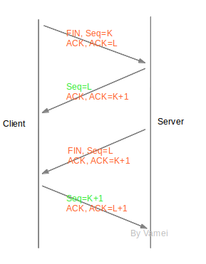

我们可以看到，连接终结的过程中，连接双方也交换了四片信息(两个FIN和两个ACK)。在终结连接的过程中，TCP并没有合并FIN与ACK片段。原因是TCP连接允许单向关闭(half-close)。也就是说，TCP连接关闭了一个方向的传输，成为一个单向连接(half-duplex)。第二个箭头和第三个箭头传递必须分开，才能有空隙在开放的方向上继续传输。如果第二个箭头和第三个箭头合并在一起，那么，随着一方关闭，另一方也要被迫关闭。

第二和第三次握手之间，server可以继续单向的发送片段给client，但client不能发送数据片段给server。

(上面的终结从client先发起，TCP连接终结也可以从server先发起。)

在Client发送出最后的ACK回复，但该ACK可能丢失。Server如果没有收到ACK，将不断重复发送FIN片段。所以Client不能立即关闭，它必须确认Server接收到了该ACK。Client会在发送出ACK之后进入到TIME_WAIT状态。Client会设置一个计时器，等待2MSL的时间。如果在该时间内再次收到FIN，那么Client会重发ACK并再次等待2MSL。所谓的2MSL是两倍的MSL(Maximum Segment Lifetime)。MSL指一个片段在网络中最大的存活时间，2MSL就是一个发送和一个回复所需的最大时间。如果直到2MSL，Client都没有再次收到FIN，那么Client推断ACK已经被成功接收，则结束TCP连接。

#### 总结

TCP是连接导向的协议，与之对应的是像UDP这样的非连接导向的协议。连接能带来更好的传输控制，但也需要更多额外的工作，比如连接的建立和终结。

我们还初步了解了TCP的头部格式。应该注意到，许多时候我们将ACK片段“附着”在其他片段上。相对于纯粹的ACK片段，我们这样做节约了ACK所需的流量。事实上，由于ACK片段所需的ACK位和acknowledge number区域总是存在于TCP的头部，所以附着ACK片段的成本基本上等于0。

### 魔鬼细节 (TCP滑窗管理)

在TCP协议与"流"通信中，我们建立了滑窗(sliding window)的基本概念。通过滑窗与ACK的配合，我们一方面实现了TCP传输的可靠性，另一方面也一定程度上提高了效率。

然而，之前的解释只是概念性的。TCP为了达到更好的传输效率，对上面的工作方式进行了许多改进。The devil is in the details. 我们需要深入到细节，才能看清楚TCP协议的智慧所在。

#### 累计ACK

在TCP连接中，我们通过将ACK回复“附着”在其他数据片段的方式，减少了ACK回复所消耗的流量。但这并不是全部的故事。TCP协议并不是对每个片段都发送ACK回复。TCP协议实际采用的是累计ACK回复(accumulative acknowledgement)。接收方往往利用一个ACK回复来知会连续多个片段的成功接收。通过累计ACK，所需要的ACK回复通常可以降到50%。

如下图所示，橙色为已经接收的片段。方框为滑窗，滑窗可容纳3个片段。

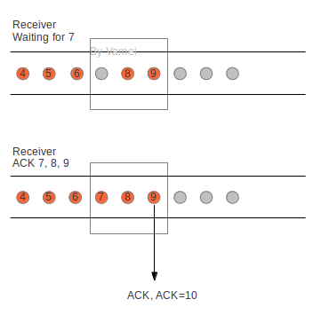

滑窗还没接收到片段7时，已接收到片段8，9。这样就在滑窗中制造了一个“空穴”(hole)。当滑窗最终接收到片段7时，滑窗送出一个回复号为10的ACK回复。发送方收到该回复，会意识到，片段10之前的片段已经按照次序被成功接收。整个过程中节约了片段7和片段8所需的两个ACK回复。

此外，接收方在接收到片断，并应该回复ACK的时候，会故意延迟一些时间。如果在延迟的时间里，有后续的片段到达，就可以利用累计ACK来一起回复了。

#### 滑窗结构

在之前的讨论中，我们以片段为单位，来衡量滑窗的大小的。真实的滑窗是以byte为单位表示大小，但这并不会对我们之前的讨论造成太大的影响。

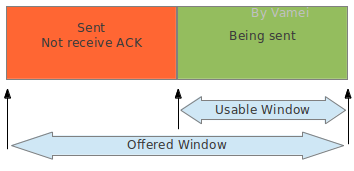

发送方滑窗可以分为下面两个部分。offered window为整个滑窗的大小。

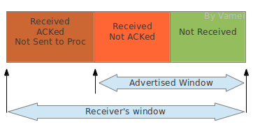

可以看到，接收方的滑窗相对于发送方的滑窗多了一个"Received; ACKed; Not Sent to Proc"的部分。接收方接收到的文本流必须等待进程来读取。如果进程正忙于做别的事情，那么这些文本流即使已经正确接收，还是需要暂时占用接收缓存。当出现上述占用时，滑窗的可用部分(也就是图中advertised window)就会缩水。这意味着接收方的处理能力下降。如果这个时候发送方依然按照之前的速率发送数据给接收方，接收方将无力接收这些数据。

#### 流量控制

TCP协议会根据情况自动改变滑窗大小，以实现流量控制。流量控制(flow control)是指接收方将advertised window的大小通知给发送方，从而指导发送方修改offered window的大小。接收方将该信息放在TCP头部的window size区域：


发送方在收到window size的通知时，会调整自己滑窗的大小，让offered window和advertised window相符。这样，发送窗口变小，文本流发送速率降低，从而减少了接收方的负担。

#### 零窗口

advertised window大小有可能变为0，这意味着接收方的接收能力降为0。发送方收到大小为0的advertised window通知时，停止发送。

当接收方经过处理，再次产生可用的advertised window时，接收方会通过纯粹的ACK回复来通知发送方，让发送方恢复发送。然而，ACK回复的传送并不是可靠的。如果该ACK回复丢失，那么TCP传输将陷入死锁(deadlock)状态。

为此，发送方会在零窗口后，不断探测接收方的窗口。窗口探测(window probe)时，发送方会向接收方发送包含1 byte文本流的TCP片段，并等待ACK回复(该ACK回复包含有window size)。由于有1 byte的数据存在，所以该传输是可靠的，而不用担心ACK回复丢失的问题。如果探测结果显示窗口依然为0，发送方会等待更长的时间，然后再次进行窗口探测，直到TCP传输恢复。

#### 白痴窗口综合症

滑窗机制有可能犯病，比如白痴窗口综合症 (Silly Window Syndrome)。假设这样一种情形：接收方宣布(advertise)一个小的窗口，发送方根据advertised window，发送一个小的片段。接收方的小窗口被填满，经过处理，接收方再宣布一个小的窗口…… 这就是“白痴窗口综合症”：TCP通信的片段中包含的数据量很小。在这样的情况下，TCP通信的片段所含的信息都很小，网络流量主要是TCP片段的头部，从而造成流量的浪费 (由于TCP头部很大，我们希望每个TCP片段中含有比较多的数据)。

如果发送方不断发送小的片段，也会造成“白痴窗口”。为了解决这个问题，需要从两方面入手。TCP中有相关的规定，要求：

1. 接收方宣告的窗口必须达到一定的尺寸，否则等待。
2. 除了一些特殊情况，发送方发送的片段必须达到一定的尺寸，否则等待。特殊情况主要是指需要最小化延迟的TCP应用(比如命令行互动)。

#### 总结

累计ACK减少了TCP传输过程中所需的ACK流量。通过流量管理，TCP连接两端的工作能力可以匹配，从而减少不不要的传输浪费。累计ACK和流量控制都是TCP协议的重要特征。

TCP协议相当复杂，并充斥着各种细节。然而TCP协议又是如此重要的一个协议，引领风骚三十年，可以说是互联网的奇迹。这些细节正是TCP协议成功的原因，并值得我们深入了解。

### 涅槃 (TCP重新发送)

TCP协议是一个可靠的协议。它通过重新发送(retransmission)来实现TCP片段传输的可靠性。简单的说，TCP会不断重复发送TCP片段，直到片段被正确接收。

#### TCP片段丢失


接收方(receiver)可以通过校验TCP片段头部中checksum区域来检验TCP片段是否出错。我们已经接触过了IP协议详解的checksum算法。TCP片段的checksum算法与之类似。IP协议的checksum只校验头部，TCP片段头部的checksum会校验包括IP头部、TCP头部和TCP数据在内的整个序列，确保IP地址、端口号和其他相关信息正确。如果TCP片段出错，接收方可以简单的丢弃改TCP片段，也就相当于TCP片段丢失。

TCP片段包裹在一个IP包中传输。IP包可能在网络中丢失。导致IP包丢失的原因可能有很多，比如IP包经过太多的路由器接力，达到hop limit；比如路由器太过拥挤，导致一些IP包被丢弃；再比如路由表(routing table)没有及时更新，导致IP包无法送达目的地。

下面我们要介绍两种重新发送TCP片段的机制：超时重新发送和快速重新发送。 

#### 超时重新发送

我们之前已经简单介绍过重新发送的机制：当发送方送出一个TCP片段后，将开始计时，等待该TCP片段的ACK回复。如果接收方正确接收到符合次序的片段，接收方会利用ACK片段回复发送方。发送方得到ACK回复后，继续移动窗口，发送接下来的TCP片段。如果直到计时完成，发送方还是没有收到ACK回复，那么发送方推断之前发送的TCP片段丢失，因此重新发送之前的TCP片段。这个计时等待的时间叫做重新发送超时时间(RTO, retransmission timeout)。

发送方应该在等待多长时间之后重新发送呢？这是重新发送的核心问题。上述过程实际上有往返两个方向：1. 发送片段从发送方到接收方的传输，2. ACK片段从接收方到发送方的传输。整个过程实际耗费的时间称做往返时间(RTT, round trip time)。如果RTT是固定的，比如1秒，那么我们可以让RTO等于RTT。但实际上，RTT的上下浮动很大。比如某个时刻，网络中有许多交通，那么RTT就增加。在RTT浮动的情况下，如果我们设置了过小的RTO，那么TCP会等待很短的时间之后重新发送，而实际上之前发送的片段并没有丢失，只是传输速度比较慢而已，这样，网络中就被重复注入TCP片段，从而浪费网络传输资源。另一方面，如果RTO时间过长，那么当TCP片段已经实际丢失的情况下，发送方不能及时重新发送，会造成网络资源的闲置。所以，RTO必须符合当前网络的使用状况。网络状况越好，RTO应该越短；网络状况越差，RTO应该越长。

TCP协议通过统计RTT，来决定合理的RTO。发送方可以测量每一次TCP传输的RTT (从发送出数据片段开始，到接收到ACK片段为止)，这样的每次测量得到的往返时间，叫做采样RTT(srtt, sampling round trip time)。建立连接之后，每次的srtt作为采样样本，计算平均值(mean)和标准差(standard deviation)，并让RTO等于srtt平均值加上四倍的srtt标准差。

RTO = mean + 4 std

(上述算法有多个变种，根据平台不同有所变化)

平均值反映了平均意义上的RTT，平均往返时间越大，RTO越大。另一方面，标准差越大也会影响RTO。标准差代表了RTT样本的离散程度。如果RTT上下剧烈浮动，标准差比较大。RTT浮动大，说明当前网络状况相对不稳定。因此要设置更长的RTO，以应对不稳定的网络状况。

#### 快速重新发送

我们刚才介绍了超时重新发送的机制：发送方送出一个TCP片段，然后开始等待并计时，如果RTO时间之后还没有收到ACK回复，发送方则重新发送。TCP协议有可能在计时完成之前启动重新发送，也就是利用快速重新发送(fast-retransmission)。快速发送机制如果被启动，将打断计时器的等待，直接重新发送TCP片段。

由于IP包的传输是无序的，所以接收方有可能先收到后发出的片段，也就是乱序(out-of-order)片段。乱序片段的序号并不等于最近发出的ACK回复号。已接收的文本流和乱序片段之间将出现空洞(hole)，也就是等待接收的空位。比如已经接收了正常片段5,6,7，此时又接收乱序片段9。这时片段8依然空缺，片段8的位置就是一个空洞。

TCP协议规定，当接收方收到乱序片段的时候，需要重复发送ACK。比如接收到乱序片段9的时候，接收方需要回复ACK。回复号为8 (7+1)。此后接收方如果继续收到乱序片段(序号不是8的片段)，将再次重复发送ACK=8。当发送方收到3个ACK=8的回复时，发送方推断片段8丢失。即使此时片段8的计时器还没有超时，发送方会打断计时，直接重新发送片段8，这就是快速重新发送机制(fast-retransmission)。

快速重新发送机制利用重复的ACK来提示空洞的存在。当重复次数达到阈值时，认为空洞对应的片段在网络中丢失。快速重新发送机制提高了检测丢失片段的效率，往往可以在超时之前探测到丢失片段，并重复发送丢失的片段。

#### 总结

凤凰浴火重生。而TCP协议利用重新发送(retransmission)来实现TCP传输的可靠性。重新发送的基本形式是超时重新发送，根据统计的往返时间来设置超时标准；如果超时，则重新发送TCP片段。另一方面，快速重新发送则通过乱序片段的ACK来更早的推断出片段的丢失。

### 天下为公 (TCP堵塞控制)

在TCP协议中，我们使用连接记录TCP两端的状态，使用编号和分段实现了TCP传输的有序，使用advertised window来实现了发送方和接收方处理能力的匹配，并使用重复发送来实现TCP传输的可靠性。我们只需要将TCP片段包装成IP包，扔到网络中就可以了。TCP协议的相关模块会帮我们处理各种可能出现的问题(比如排序，比如TCP片段丢失等等)。最初的TCP协议就是由上述的几大块构成的。

然而进入上世纪八十年代，网络开始变的繁忙。许多网络中出现了大量的堵塞(congestion)。堵塞类似于现实中的堵车。网络被称为“信息高速公路”。许多汽车(IP包)在网络中行驶，并经过一个一个路口 (路由器)，直到到达目的地。一个路由器如果过度繁忙，会丢弃一些IP包。UDP协议不保证传输的可靠性，所以丢失就丢失了。而TCP协议需要保证传输的可靠性，当包含有TCP片段的IP包丢失时，TCP协议会重复发送TCP片段。于是，更多的“汽车”进入到公路中，原本繁忙的路由器变得更加繁忙，更多的IP包丢失。这样就构成了一个恶性循环。这样的情况被称为堵塞崩溃(congestion collapse)。每个发送方为了保证自己的发送质量，而不顾及公共领域现状，是造成堵塞崩溃的主要原因。当时的网络中高达90%的传输资源可能被堵塞崩溃所浪费。

为了解决这一缺陷，从八十年代开始，TCP协议中开始加入堵塞控制(congestion control)的功能，以避免堵塞崩溃的出现。多个算法被提出并实施，大大改善了网络的交通状况。直到今天，堵塞控制依然是互联网研究的一个活跃领域。

#### 公德

现实中，当我们遇到堵车，可能就会希望兴建立交桥和高架，或者希望有一位交警来疏导交通。而TCP协议的堵塞控制是通过约束自己实现的。当TCP的发送方探测到网络交通拥堵时，会控制自己发送片段的速率，以缓解网络的交通状况，避免堵塞崩溃。简言之，TCP协议规定了发送方需要遵守的“公德”。

我们先来说明堵塞是如何探测的。在TCP重新发送中，我们已经总结了两种推测TCP片段丢失的方法：ACK超时和重复ACK。一旦发送方认为TCP片段丢失，则认为网络中出现堵塞。

另一方面，TCP发送方是如何控制发送速率呢？TCP协议通过控制滑窗(sliding window)大小来控制发送速率。在TCP滑窗管理中，我们已经见到了一个窗口限制，就是advertised window size，以实现TCP流量控制。TCP还会维护一个congestion window size，以根据网络状况来调整滑窗大小。真实滑窗大小取这两个滑窗限制的最小值，从而同时满足两个限制 (流量控制和堵塞控制)

#### Congestion Window

congestion window总是处于两种状态的一个。这两种状态是: 慢起动(slow start)和堵塞避免(congestion avoidance)。

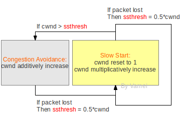

上图是概念性的。实际的实施要比上图复杂，而且根据算法不同会有不同的版本。cwnd代表congestion window size。我们以片段的个数为单位，来表示cwnd的大小 (同样是概念性的)。

Congestion window从slow start的状态开始。Slow start的特点是初始速率低，但速率不断倍增。每次进入到slow start状态时，cwnd都需要重置为初始值1。发送方每接收到一个正确的ACK，就会将congestion window增加1，从而实现速率的倍增(由于累计ACK，速率增长可能会小于倍增)。

当congestion window的大小达到某个阈值ssthresh时，congestion进入到congestion avoidance状态。发送速率会继续增长。发送方在每个窗户所有片段成功传输后，将窗口尺寸增加1(实际上就是每个RTT增加1)。所以在congestion avoidance下，cwnd线性增长，增长速率慢。

如果在congestion avoidance下有片段丢失，重新回到slow start状态，并将ssthresh更新为cwnd的一半。

我们看到，sshthresh是slow start到congestion avoidance的切换点。而片段丢失是congestion avoidance到slow start的切换点。一开始sshthresh的值一般比较大，所以slow start可能在切换成congestion avoidance之前就丢失片段。这种情况下，slow start会重新开始，而ssthresh更新为cwnd的一半。

总的来说，发送速率总是在增长。如果片段丢失，则重置速率为1，并快速增长。增长到一定程度，则进入到慢性增长。快速增长和慢性增长的切换点(sshthred)会随着网络状况(何时出现片段丢失)更新。通过上面的机制，让发送速率处于动态平衡，不断的尝试更大值。初始时增长块，而接近饱和时增长慢。但一旦尝试过度，则迅速重置，以免造成网络负担。

#### 总结

阻塞控制有效的提高了互联网的利用率。阻塞控制的算法多种多样，并且依然不完善。一个常见的问题是cwnd在接近饱和时线性增长，因此对新增的网络带宽不敏感。

互联网利用“公德”来实现效率。“公德”和效率似乎可以并存。

到现在为止，TCP协议的介绍就可以告一段落了。可以回想一下TCP的几大模块：分段与流，滑窗，连接，流量控制，重新发送，堵塞控制。

## 应用层协议

### 9527 (DNS协议)

在周星驰的电影《唐伯虎点秋香》中，周星驰饰演的主角一进入华府，就被强制增加了一个代号9527。从此，华府的人开始称呼主角为9527，而不是他的姓名。

域名(domain name)是IP地址的代号。域名通常是由字符构成的。对于人类来说，字符构成的域名，比如www.yahoo.com，要比纯粹数字构成的IP地址(106.10.170.118)容易记忆。域名解析系统(DNS, domain name system)就负责将域名翻译为对应的IP地址。在DNS的帮助下，我们可以在浏览器的地址栏输入域名，而不是IP地址。这大大减轻了互联网用户的记忆负担。另一方面，处于维护和运营的原因，一些网站可能会变更IP地址。这些网站可以更改DNS中的对应关系，从而保持域名不变，而IP地址更新。由于大部分用户记录的都是域名，这样就可以降低IP变更带来的影响。

从机器和技术的角度上来说，域名并不是必须的。但Internet是由机器和用户共同构成的。鉴于DNS对用户的巨大帮助，DNS已经被当作TCP/IP套装不可或缺的一个组成部分。

#### DNS服务器

域名和IP地址的对应关系存储在DNS服务器(DNS server)中。所谓的DNS服务器，是指在网络中进行域名解析的一些服务器(计算机)。这些服务器都有自己的IP地址，并使用DNS协议(DNS protocol)进行通信。DNS协议主要基于UDP，是应用层协议(这也是我们见到的第一个应用层协议)。

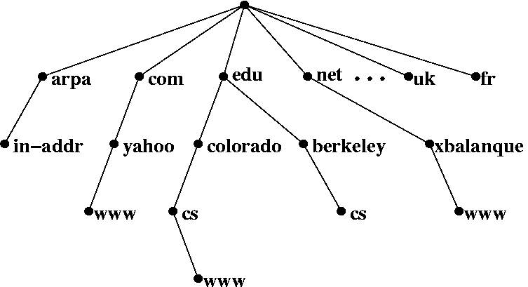

DNS服务器构成一个分级(hierarchical)的树状体系。上图中，每个节点(node)为一个DNS服务器，每个节点都有自己的IP地址。树的顶端为用户电脑出口处的DNS服务器。在Linux下，可以使用cat /etc/resolv.conf，在Windows下，可以使用ipconfig /all，来查询出口DNS服务器。树的末端是真正的域名/IP对应关系记录。一次DNS查询就是从树的顶端节点出发，最终找到相应末端记录的过程。

中间节点根据域名的构成，将DNS查询引导向下一级的服务器。比如说一个域名cs.berkeley.edu，DNS解析会将域名分割为cs, berkeley, edu，然后按照相反的顺序查询(edu, berkeley, cs)。出口DNS首先根据edu，将查询指向下一层的edu节点。然后edu节点根据berkeley，将查询指向下一层的berkeley节点。这台berkeley服务器上存储有cs.berkeley.edu的IP地址。所以，中间节点不断重新定向，并将我们引导到正确的记录。

在整个DNS查询过程中，无论是重新定向还是最终取得对应关系，都是用户计算机和DNS服务器使用DNS协议通信。用户计算机根据DNS服务器的反馈，依次与下一层的DNS服务器建立通信。用户计算机经过递归查询，最终和末端节点通信，并获得IP地址。

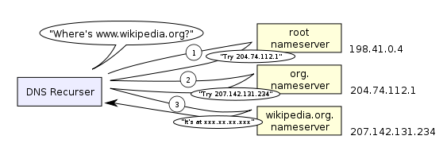
#### 缓存

用户计算机的操作系统中的域名解析模块(DNS Resolver)负责域名解析的相关工作。任何一个应用程序(邮件，浏览器)都可以通过调用该模块来进行域名解析。

并不是每次域名解析都要完整的经历解析过程。DNS Resolver通常有DNS缓存(cache)，用来记录最近使用和查询的域名/IP关系。在进行DNS查询之前，计算机会先查询cache中是否有相关记录。这样，重复使用的域名就不用总要经过整个递归查询过程。

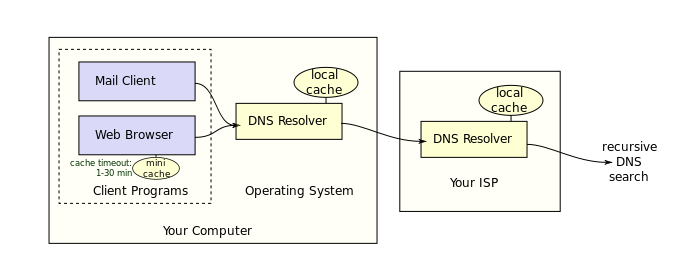

#### 反向DNS

上面的DNS查询均为正向DNS查询：已经知道域名，想要查询对应IP。而反向DNS(reverse DNS)是已经知道IP的前提下，想要查询域名。反向DNS也是采用分层查询方式，对于一个IP地址(比如106.10.170.118)，依次查询in-addr.arpa节点(如果是IPv6，则为ip6.arpa节点)，106节点，10节点，170节点，并在该节点获得106.10.170.118对应的域名。

### 先生，要点单吗? (HTTP协议概览)

我在TCP流通信中说明了，TCP协议实现了数据流的传输。然而，人们更加习惯以文件为单位传输资源，比如文本文件，图像文件，超文本文档(hypertext document)。

超文本文档中包含有超链接，指向其他的资源。超文本文档是万维网(World Wide Web，即www)的基础。

HTTP协议解决文件传输的问题。HTTP是应用层协议，主要建立在TCP协议之上(偶尔也可以UDP为底层)。它随着万维网的发展而流行。HTTP协议目的是，如何在万维网的网络环境下，更好的利用TCP协议，以实现文件，特别是超文本文件的传输。

早期的HTTP协议主要传输静态文件，即真实存储在服务器上的文件。随着万维网的发展，HTTP协议被用于传输“动态文件”，服务器上的程序根据HTTP请求即时生成的动态文件。我们将HTTP的传输对象统称为资源(resource)。

#### 点单

HTTP实现了资源的订购和传送。其工作方式类似于快餐点单。

1. 请求(request): 顾客向服务员提出请求：“来个鸡腿汉堡”。
2. 回复(response):服务员根据情况，回应顾客的请求

根据情况的不同，服务员的回应可能有很多，比如:

+ 服务员准备鸡腿汉堡，将鸡腿汉堡交给顾客。（一切OK）
+ 服务员发现自己只是个甜品站。他让顾客前往正式柜台点单。（重新定向）
+ 服务员告诉顾客鸡腿汉堡没有了。(无法找到)

交易结束后，服务员就将刚才的交易抛到脑后，准备服务下一位顾客。

下面来看一下HTTP是如何具体实现的。

#### 格式

HTTP协议的通信是一次request-responce交流。客户端(guest)向服务器发出请求(request)，服务器(server)回复(response)客户端。

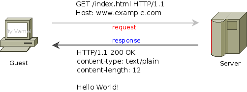

HTTP协议规定了请求和回复的格式:

```
起始行 (start line)
头信息 (headers)

主体(entity body)
```

起始行只有一行。它包含了请求/回复最重要的信息。请求的起始行表示(顾客)“想要什么”。回复的起始行表示(后厨)“发生什么”。

头信息可以有多行。每一行是一对键值对(key-value pair)，比如:

	Content-type: text/plain 

它表示，包含有一个名为Content-type的参数，该参数的值为text/plain。头信息是对起始行的补充。请求的头信息对服务器有指导意义 (好像在菜单上注明: 鸡腿不要辣)。回复的头信息则是提示客户端（比如，在盒子上注明: 小心烫）

主体部分包含了具体的资源。上图的请求中并没有主体，因为我们只是在下单，而不用管后厨送什么东西 (请求是可以有主体内容的)。回复中包含的主体是一段文本文字(Hello World!)。这段文本文字正是顾客所期待的，鸡腿汉堡。

#### 请求

我们深入一些细节。先来看一下请求:

```
GET /index.html HTTP/1.1
Host: www.example.com
```

在起始行中，有三段信息:

GET 方法。用于说明想要服务器执行的操作。
/index.html 资源的路径。这里指向服务器上的index.html文件。
HTTP/1.1 协议的版本。HTTP第一个广泛使用的版本是1.0，当前版本为1.1。
 
早期的HTTP协议只有GET方法。遵从HTTP协议，服务器接收到GET请求后，会将特定资源传送给客户。这类似于客户点单，并获得汉堡的过程。使用GET方法时，是客户向服务器索取资源，所以请求往往没有主体部分。

GET方法也可以用于传输一些不重要的数据。它是通过改写URL的方式实现的。GET的数据利用URL?变量名＝变量值的方法传输。比如向http://127.0.0.1发送一个变量“q”，它的值为“a”。那么，实际的URL为http://127.0.0.1?q=a。服务器收到请求后，就可以知道"q"的值为"a"。

GET方法之外，最常用的是POST方法。它用于从客户端向服务器提交数据。使用POST方法时，URL不再被改写。数据位于http请求的主体。POST方法最用于提交HTML的form数据。服务器往往会对POST方法提交的数据进行一定的处理，比如存入服务器数据库。

样例请求中有一行头信息。该头信息的名字是Host。HTTP的请求必须有Host头信息，用于说明服务器的地址和端口。HTTP协议的默认端口是80，如果在HOST中没有说明端口，那么将默认采取该端口。在该例子中，服务器的域名为www.example.com，端口为80。域名将通过DNS服务器转换为IP地址，从而确定服务器在互联网上的地址。

(参看IP地址与TCP端口)

#### 回复

服务器在接收到请求之后，会根据程序，生成对应于该请求的回复，比如:

```
HTTP/1.1 200 OK
Content-type: text/plain
Content-length: 12

Hello World!
```

回复的起始行同样包含三段信息

+ HTTP/1.1 协议版本
+ 200 状态码(status code)。
+ OK 状态描述

OK是对状态码200的文字描述，它只是为了便于人类的阅读。电脑只关心三位的状态码(status code)，即这里的200。200表示一切OK，资源正常返回。状态码代表了服务器回应动作的类型。

其它常见的状态码还有:

+ 302，重新定向(redirect): 我这里没有你想要的资源，但我知道另一个地方xxx有，你可以去那里找。
+ 404，无法找到(not found): 我找不到你想要的资源，无能为力。

(重新定向时，客户端可以根据302的建议前往xxx寻找资源，也可以忽略该建议。)

Content-type说明了主体所包含的资源的类型。根据类型的不同，客户端可以启动不同的处理程序(比如显示图像文件，播放声音文件等等)。下面是一些常见的资源

+ text/plain 普通文本
+ text/html HTML文本
+ image/jpeg jpeg图片
+ image/gif gif图片
+ Content-length说明了主体部分的长度，以字节(byte)为单位。

回应的主体部分为一段普通文本，即

	Hello World!

#### 无状态

根据早期的HTTP协议，每次request-reponse时，都要重新建立TCP连接。TCP连接每次都重新建立，所以服务器无法知道上次请求和本次请求是否来自于同一个客户端。因此，HTTP通信是无状态(stateless)的。服务器认为每次请求都是一个全新的请求，无论该请求是否来自同一地址。

想象高级餐厅和快餐店。高级餐厅会知道客人所在的位置，如果新增点单，那么服务员知道这和上一单同一桌。而在快餐店中，不好意思，服务员并不记录客人的特征。想再次点单？请重新排队……

随着HTTP协议的发展，HTTP协议允许TCP连接复用，以节省建立连接所耗费的时间。但HTTP协议依然保持无状态的特性。

#### 总结

HTTP协议实现了万维网上的资源传输，采用request-response的工作方式。

GET， POST

无状态

## 综合

### 逆袭 (CIDR与NAT)

IPv4由于最初的设计原因，长度只有32位，所以只提供了大约40亿个地址。这造成了IPv4地址的耗尽危机。随后，IPv6被设计出来，并可以提供足够多的IP地址。但是IPv4与IPv6并不兼容，IPv4向IPv6的迁移并不容易。一些技术，比如说这里要说的CIDR和NAT，相继推广。这些技术可以缓解IPv4的稀缺状态，成就了IPv4一时的逆袭。

#### CIDR

CIDR(Classless Inter Domain Routing)改进了传统的IPv4地址分类。传统的IP分类将IP地址直接对应为默认的分类，从而将Internet分割为网络。CIDR在路由表中增加了子网掩码(subnet masking)，从而可以更细分网络。利用CIDR，我们可以灵活的将某个范围的IP地址分配给某个网络。

1) IP地址分类

在IP接力赛中，我提到，IP地址可以分为如下几类：

```
IP class    From          To                 Subnet Mask
A           1.0.0.0       126.255.255.255    255.0.0.0
B           128.0.0.0     191.255.255.255    255.255.0.0
C           192.0.0.0     223.255.255.255    255.255.255.0
```

这是最初的IPv4地址分类设计。一个IPv4地址总共有32位，可以分为网络(network)和主机(host)两部分。子网掩码(subnet mask)是用于表示哪些位代表了网络部分。比如如下subnet mask 255.0.0.0的二进制表示为：

11111111 00000000 00000000 00000000

它的前八位为1，所以表示IP地址的前八位为网络部分。而后面的24位代指该网络的各个主机。一个A类网络可以有224台主机，也就是16777216。由于IPv4地址已经分好了类，所以当我们拿到一个IP地址，我们就可以通过上面查到它的子网掩码。(B类，216; C类，28)

2) 传统路由表

IP分类的方便了IP包的接力。IP包到达某个路由器后，会根据该路由器的路由表(routing table)，来决定接力的下一站。一个传统的路由表看起来是这样的：

```
Destination        Gateway             Iface
199.165.145.0      0.0.0.0             eth0
199.165.146.0      0.0.0.0             eth1
0.0.0.0            199.165.146.8       eth1
```

该路由表代表的网络拓扑如下：


由于IP分类，我们不需要记录subnet mask。当我们要前往199.165.146.17时，我们已经知道这台主机位于一个C类地址，所以它的子网掩码是255.255.255.0，也就是说199.165.146代表了网络，17代表了主机。

3) CIDR路由表

然而，由于默认分类，造成了网络只能按照A、B、C的方式存在。假设一个网络(比如MIT的网络)分配了一个A类地址，那么该网络将容许16777216个主机。如果该网络无法用完这些IP地址，这些IP地址将无法被其他网络使用。再比如上面的网络，199.165.145必须作为一个整个的网络存在。如果我们只有10台主机，那么将会有200多个IP地址被浪费。CIDR的本质是在路由表中加入子网掩码，并根据该列信息对网络进行分割，而不是根据默认的A，B，C进行分割。比如：

```
Destination        Gateway             Genmask             Iface
199.165.145.254    0.0.0.0             255.255.255.254     eth2
199.165.145.0      0.0.0.0             255.255.255.0       eth0
199.165.146.0      0.0.0.0             255.255.255.0       eth1
0.0.0.0            199.165.146.8       0.0.0.0             eth1
```

根据路由表的第一条记录，

```
199.165.145.254 (IP address) : 11000111 10100101 10010001 11111110
255.255.255.254 (subnet mask): 11111111 11111111 11111111 11111110 (31个1，1个0)
```
 
通过子网掩码可以知道，前31位表示网络，最后一位表示主机。子网掩码总是有连续多个1组成，比如上面的31个1。所以也可记为199.165.145.254/31，来同时表示IP地址和子网掩码。

路由器将原来的199.165.145网络中的一部分分割出来。这一网络可以容纳两台电脑，也就是199.165.145.254和199.165.145.255。这个网络对应网卡是eth2。当有IP包通向这两个IP地址时，会前往eth2，而不是eth0。

网络拓扑如下：

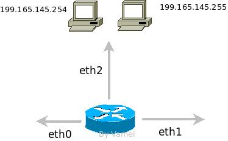

利用CIDR，我们可以将IP地址根据需要进行分割，从而不浪费IP地址。

#### NAT

CIDR虽然可以更加节约IP地址，但它并不能创造新的IP地址。IP地址的耗尽危机并不能因此得到解决。我们来看IPv4的第二袭，NAT(Network Address Translation)。

理论上，每个IP地址代表了Internet上的一个设备。但有一些IP地址被保留，用于一些特殊用途。下面三段IP地址被保留用作私有IP地址：

```
From          To             
10.0.0.0      10.255.255.255
172.16.0.0    172.31.255.255
192.168.0.0   192.168.255.255
```

私有IP地址只用于局域网内部。理论上，我们不应该在互联网上看到来自或者发往私有IP地址的IP包。与私有IP地址对应的是全球IP地址(global IP address)。

NAT是为私有网络(private network)服务的。该网络中的主机使用私有IP地址。当私有网络内部主机和外部Internet通信时，网关(gateway)路由器负责将私有IP地址转换为全球IP地址，这个地址转换过程就是Network Address Translation。网关路由器的NAT功能。最极端情况下，我们可以只分配一个全球IP地址给网关路由器，而私有网络中的设备都使用私有IP地址。由于私有IP地址可以在不同私有网络中重复使用，所以就大大减小了设备对IP地址的需求。

1) 基础NAT

NAT的一种为基础NAT，也成为一对一(one-to-one)NAT。在基础NAT下，网关路由器一一转换一个外部IP地址和一个私有IP地址。网关路由器保存有IP的NAT对应关系，比如：

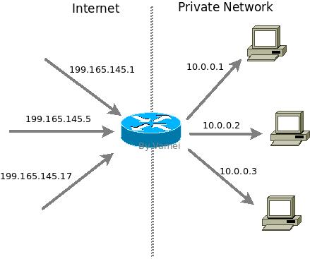

上面网络中，当有IP包要前往199.165.145.1时，网关路由器会将目的地改写为10.0.0.1，并接力给私有网络中的10.0.0.1的电脑。同样，当10.0.0.1的电脑向Internet发送IP包时，它的发送地为10.0.0.1。在到达网关路由器时，会将发送地更改为199.165.145.1。此外，IP头部的checksum，以及更高层协议(比如UDP和TCP)中的校验IP的checksum也会更改。

基础NAT尽管是一对一转换IP地址，它还是可以减小内部网络对IP地址的需求。通常来说，一个局域网中只有少数的设备处于开机状态，并不需要给每个设备对应一个全球IP地址。NAT可以动态的管理全球IP地址，并将全球IP地址对应到开机设备，从而减小内部网络对IP地址的需求。

2) NAPT

NAT还有一种，被成为NAPT (Network Address and Port Translation)。在基础NAT中，高层协议的端口号并不会改动。NAPT下，IP地址和端口号可能同时改动。

我们在UDP和TCP中提到端口(port)的概念。在建立UDP或者TCP通信时，我们实际上是用IP:Port来代表通信的一端(正如打电话时主机:分机号一样)。NAPT就是在网关路由器处建立两个通信通道，一个通往内部网络，一个通往外部网络，然后将网关处的通道端口连接，从而让内部和外部通信。比如：

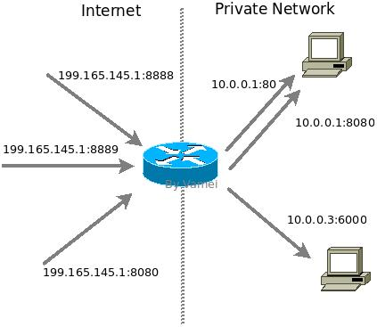

我们看到，通往IP 199.165.145.1建立了三个端口的连接：8888, 8889和8080。它们分别在NAPT处改为通往10.0.0.1:80, 10.0.0.1:8080和10.0.0.3:6000。NAPT记录有外部IP:端口和内部IP:端口的一一对应关系。在IP包经过时，网关路由器会更改IP地址，端口号以及相关的checksum。

利用NAPT我们可以使用一个(或者多个但少量的)外部IP和大量的端口号，来对应多个内部IP以及相应的端口号，从而大大减小了对全球IP地址的需求。

无论是基础NAT还是NAPT，它们的设置都比较复杂，并且从本质上违背了互联网最初的设计理念。但由于IPv4的使用惯性，NAT还是被广泛推广。由于NAT所处的网关服务器是理想的设置防火墙的位置，NAT还往往和防火墙共同建设，以提高私有网络的安全性。

#### 总结

即使是CIDR和NAT广泛使用，IPv4还是在不可避免的耗尽。IPv6正在加紧部署。但上述的两种技术，CIDR和NAT在IPv6中同样被采用，所以了解它们依然是有意义的。

## 附录

### Mac OS X网络诊断命令

下面是一些Mac OS X下常用的网络诊断命令。它们能帮助我们发现网络问题。文中提到的协议和网络通信原理，可参考协议森林。

有些工具，如arping, arp-scan，需要借助HomeBrew安装。

#### 基本工具

网络诊断的第一步，是了解自己的设备，比如有哪些接口，IP地址都是什么。

	ifconfig

显示网络接口(interface)信息。如接口名称，接口类型，接口的IP地址，硬件的MAC地址等。

#### ARP

ARP协议用在局域网(LAN)内部。借用ARP协议，设备可以知道同一局域网内的IP-MAC对应关系。当我们访问一个本地IP地址时，设备根据该对应关系，与对应的MAC地址通信。通过ARP工具，我们可以知道局域网内的通信是否正常。

	arp -a

显示本地存储的IP-MAC对应关系

	sudo arping -I eth0 192.168.1.1

经eth0接口，发送ARP请求，查询IP为192.168.1.1设备的MAC地址

	sudo arp-scan -l

查询整个局域网内的所有IP地址的对应MAC地址

	sudo tcpdump -i en0 arp

监听en0接口的arp协议通信

#### 网络层

网络层是一个广域的互联网，互联网上的设备用IP地址识别。ping是向某个IP地址发送ICMP协议的ECHO_REQUEST请求。收到该请求的设备，将返回ICMP回复。如果ping到某个IP地址，那么说明该IP地址的设备可以经网络层顺利到达。

	ping 192.168.1.1

向IP地址192.168.1.255发送ICMP请求。如果该地址的ICMP没有被禁用，那么在该网上的设备将回复。

	ping 192.168.1.255

向广播(broadcast)地址192.168.1.255发送ICMP请求。如果ICMP没有被禁用，那么在该网上的设备将回复。

需要注意的是，许多设备会禁用ICMP。如果ping不到一个设备，并不一定是网络层故障。

如果两个设备有相同的IP地址，将导致IP冲突。许多网络中是由DHCP协议自动分配IP地址的，这样可以极大的减少IP冲突的可能性。DHCP服务器与设备达成协议，设备将在一定时间内占据某个IP地址，而DHCP服务器不再把该IP地址分配给别人。

	sudo ipconfig set en0 DHCP

更新DHCP租约。设备将释放IP地址，再从DHCP服务器重新获得IP地址。

	sudo ipconfig set en0 INFORM 192.168.0.120

将接口en0设定为静态IP地址。

#### 路由

局域网通过路由器，接入广域的互联网。互联网上的通信往往要经过多个路由器接力。途中路由器的故障，可能导致互联网访问异常。

	netstat -nr

显示路由表。从路由表中，可以找到网关(Gateway)。网关是通向更加广域网络的出口。

	traceroute 74.125.128.99

追踪到达IP目的地的全程路由。

	traceroute -I 74.125.128.99

通过ICMP协议，追踪路由。ICMP协议经常会被禁用，所以会返回"*"的字符串。

	sudo traceroute -T -p 80 74.125.128.99

通过TCP协议，经80端口，追踪路由。TCP协议的默认端口80很少会被禁用。

#### 网络监听

tcpdump是一款网络抓包工具。它可以监听网络接口不同层的通信，并过滤出特定的内容，比如特定协议、特定端口等等。我们上面已经使用tcpdump监听了ARP协议通信。这里我们来看更多的监听方式。

	sudo tcpdump -i en0

监听en0接口的所有通信

	sudo tcpdump -A -i en0 

用ASCII显示en0接口的通信内容

	sudo tcpdump -i en0 'port 8080'

显示en0接口的8080端口的通信

	sudo tcpdump -i eth1 src 192.168.1.200

显示eth1接口，来自192.168.1.200的通信

	sudo tcpdump -i eth1 dst 192.168.1.101 and port 80

显示eth1接口80端口，目的地为192.168.1.101的通信

	sudo tcpdump -w record.pcap -i lo0

将lo0接口的通信存入文件record.pcap

#### 域名解析

DNS是在域名和IP之间进行翻译。DNS故障会导致我们无法通过域名访问某个网址。 

	host www.sina.com.cn

DNS域名解析。返回域名对应的IP地址


