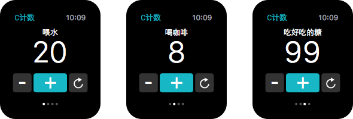
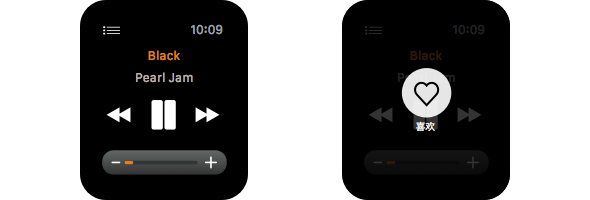
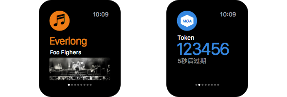
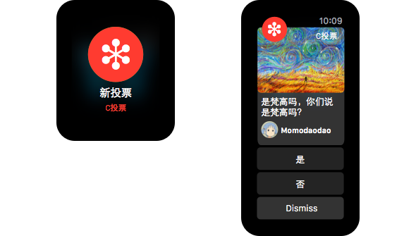

# Apple Watch平台认知与产品设计

时至今日，Apple Watch已然高调进入我们的视野，却仍未正式进入我们的世界，绝大多数人的信息来源仍限于Apple官方的介绍。大家有期许，有探索，也有失望。持负面态度者的普遍看法是，“这些事情在iPhone上都能做…手机屏幕那么大，看起来更爽用起来更舒服…令人心塞的续航能力仅支持5个小时的高强度使用…买它何用…”，而乐观者则普遍相信作为Apple设备生态圈的新生力量，Watch在技术上虽尚未成熟，却具有其他设备难以比拟的优势，并且会像前辈们那样欲扬先抑，在恰当的时间点爆发于消费市场。

失望者从很大程度上讲可以代表多数“普通用户” – 在这里我要用“我们”一词来指代这些“普通用户”，别伤自尊，因为虽然正在读这篇文章的人十之八九是圈子里的同行，但是作为普通的“人”，我们在生活当中多数方面其实只是普通用户，心态上具有共性 – 我们在很多时候真的只是对已知的、熟识的、身心依赖的产品有着看似理性的认同，而对于新产品的认知往往难以脱离现有产品带来的思维框架 – 远一些的例子比如经典的“要马车不要汽车”，近一些的则发生在我们自己身上：在iPhone及iPad问世之初，对其硬件形式的不解与吐槽，对媒体的盲从与附和 – 直到将这些新设备真正置于自己的生活情境当中，才发现虽然原来的手机和笔记本看似可以满足日常需求，但这些新设备带来的完全是另一种思维模式，在这种模式下，你不仅能更简单快捷的完成从前的一些任务，更重要的是，很多新的可能性是从前那些设备所无法提供的 – “think different”谁都会讲，但对于多数人来说，往往是事后，这也很正常。

既然正在读这篇文章的人十之八九是圈子里的同行，那么无论你对Apple Watch持悲观看法，还是乐观预期，我们在这个特定的上下文当中又都不属于“普通用户” – “我们”一词从现在开始将指代如你我这样有责任抛开自己的好恶去思考和理解设备生态进化规律，并基于逐渐清晰的认知，面向新平台为更多的普通用户打造人机互动体验的所有产品、设计和开发人员。

本文共分为三部分，涉及平台认知、产品形态及设计模式三个层面，希望能从宏观上为大家带来一些探索方向及思考框架。

## 理解新平台

对于新的设备平台，对于由新平台和不断迭代进化着的“旧”平台所构成的生态圈，应该怎样从产品和设计的角度去探索和理解？作为从业人员，面对全新的设备类型，我们与普通用户的起点相同而又不同。相同的是，我们当中的绝大多数都没有上手过Apple Watch，更不用说在实际的生活与工作情境当中进行体验，目前所能看到的应用场景仍以Apple官方介绍的为主；不同的是，从专业的角度，我们对于设备和产品有着更加丰富和深入的历史经验，从而有可能更具前瞻性的站在体验模式和人机互动范式的层面来思考新设备有可能扮演的角色。

正如前面所说，人们通常难以摆脱现有的思维框架去了解新产品 – 我们不妨也试着回过头从已知出发来探索未知。回顾iOS设备的发展以及对人们生活产生的影响，我个人认为iPad还是最典型的案例 – 当年，iPhone毕竟是以“手机”这个人人熟知的产品形态去冲击旧市场和旧观念的，而初代iPad对当时多数人来说则是真真切切的“新事物” – 我清楚的记得自己当时的第一反应：“就是个大号iPod Touch罢了”(依然是与已有认知建立关联)，完全看不出这块昂贵的屏幕对我的生活具有怎样的意义。随着看到越来越多持类似观点(甚至更为尖刻更具攻击性)的媒体报道，以及身边很多人的吐槽，我几乎产生了一种莫名的快感和自信 – 直到有一天看到同事在用，忍不住借来把玩一番，便立刻被Flipboard基于这款设备所提供的杂志般简洁精美的大尺寸外观以及自然从容的动效所吸引，从此一发不可收拾并很快从苹果店里抱了一台属于自己的回家(记得在撕下保护膜的瞬间，我家喵突然伸出手去按屏幕，留下了一个脏兮兮的小梅花)。

虽说这次购买行为更多是出于对美妙look的拥有欲，而非真切的看到对自己的实用价值，但随着在生活当中不断的实际使用，包括对层出不穷的各类app的尝试，我慢慢发现每天晚间对iPad的使用时间已经超越了PC和笔记本；几年下来也越来越多的听到类似的声音：“现在晚上在家基本不开电脑了，窝在床上抱着个iPad就够了”。直到如今，在不用做事的晚上，半躺在床上有的没的浏览一下文章资讯、读读书、看看视频一类，这个“大号iPod Touch”依然是不二之选，当然这里也包括近一两年更多依赖的iPad Mini；此外在入了Apple TV之后，若是晚间和喵一起窝在客厅沙发上，便会直接把视频AirPlay到电视上，自己解放出双手来伺候喵或是小酌几口。

用了不少字来描述自己的(也是我所了解到的很多人共有的)经历，并非为了讲故事 – 我想从中提取一些关键词进行分析，希望通过这种方式为大家(包括我自己)就“怎样理解新平台”的问题带来一些浅薄的启发：

+ 实际使用
+ 层出不穷的app
+ 不用做事的晚上
+ 半躺着看资讯、文章、视频
+ iPad Mini
+ Apple TV和AirPlay
+ 解放双手

基于现有认知来打量新事物，与在实际当中体验(真实的使用，而非上手试用)，是两回事。在尚未实际使用之前，作为“专业人士”，不要轻易被片面或偏激的意见所误导，无论这些意见来自“普通用户”还是“专业媒体”。此外，在软硬件界线逐渐模糊的发展趋势下，新设备固然带来了新的硬件特性和技术框架，但还需你我这样的产品、设计和开发人员首先树立起正确的认知并努力打造“层出不穷的app”，挖掘出更多的可能性，才能使新平台的价值更加充分的体现出来，直到“普通用户”能从中获取价值并产生认同。

所谓“做事”，对我个人来说大致包括博客和设计工作两个方面。这些事都要求我更加投入的使用MacBook或是另外连接显示器来完成，通常情况下需要将主要工具(Evernote或Sketch等)与参考、素材方面的资源(经由浏览器或Finder呈现)并列在面前，并通过实体键盘和触控板等输入工具来协同作业。对于这些事，我从不认为iPad可以胜任；在这些情境当中，桌面设备才是最恰当的工具。

生态圈的构建过程是不断为用户的典型需求情境提供典型工具并使这些工具互相贯通以打造无缝体验的过程，抱着“能否以一当十在所有时候解决所有问题”的标准来审视任何单一设备类型的做法早已不合时宜。近年来时不时抛出“平板时代，桌面设备已死”这类无知论调的，也正是当年那些预言iPad必将无所作为的“专业媒体” – 正如他们乐于宣称“微博时代，博客已死”或“朋友圈时代，微博已死” – 时代确实在变迁，但无论是软件还是硬件产品都在围绕“多情境，多目标”而分化和进化，以一当十不如独当一面 – 让特定的形式更专注的在特定情境下满足特定的需求 – 在需要沉淀、创造和阅读内容的时候，博客仍是我们的主要工具；在需要快速传播或获取碎片化个人化信息的时候，微信或微博一类的平台又会成为首选 – 这与在做事时使用MacBook，不做事时使用iPad，有片刻空闲时拿出iPhone与朋友们在微信上交流，忙碌时仅通过Watch与那些最重要的活动保持连接，等等，皆是相同的道理。

这里还有个问题：说起“特定的需求通过特定形式的设备来完成”，没错，我的那些“正事”确实不适合在iPad上完成，但“半躺着看资讯、文章、视频”却是Macbook完全能够hold住的，不是只有在iPad上才能做到；那么iPad的价值在哪里？相比于2010年前后，这个问题在如今对多数人来说都是不言自明的 – 对于那些无论是用笔记本还是iPad都可以做到的事情来说，通过iPad来实现显然更加轻便、快捷、舒适。在多设备时代，“需求”二字已经不再简单的等同于“功能”，“体验”在需求当中的占比比以往任何时候都要大 – 能够帮助用户在特定的情境中以最低的认知及互动成本完成目标的设备，才是我们所说的“特定形式的设备”。

从这一点出发，后面几个关键词就可以贯穿起来了。对于“半躺着看资讯、文章、视频”这类活动，一旦习惯了iPad带来的轻便、快捷、舒适，我们便很难再回到从前靠笔记本来完成的日子了，纵使在那些日子里一切看似都很正常，我们看似并不需要任何新设备。iPad并不是进化的终点，人们总是希望能以更方便更轻松的方式来达成目标 – 入手iPad Mini之后，我的老Pad逐渐退休，抛开性能方面的因素，Mini确实让我感到进一步的便捷，放在床头占用的空间更小，在需要的时候放在包里带出家门也不会像老Pad那样有明显的重量感，同时我的那些休闲娱乐需求也不会敏感到无法承受屏幕尺寸的缩小程度。而当Apple TV和AirPlay进入我的生活之后，从前难以预知的新的可能性也随之而来 – 看视频时，我不必再时刻把那块小屏幕端在胸前，只需将它丢在一旁，而将电视作为它的“增强设备”或“第二屏幕”，同时可以用解放出来的双手去做其他事情，譬如伺候猫、画画草图或是弹弹琴和小酌一类。(需要说明，Apple TV并未正式进入国内市场，需要在DNS等方面进行设置才能访问国内的内容源，一些相对小众的内容通过iOS设备上的视频app更易获取，所以我会时常用到AirPlay而不是直接通过TV获取)

如此分化之后，我需轻松时便得以最大程度的轻松，需专业时便得以最大程度的专业，每一类设备都可以在特定的情境中充分发挥自己的优势，并将自己不善于承担的负载转移给更适合的设备去处理 – 生活确实better了一些。

说了不少“认知”方面的东西，其实已经潜移默化的覆盖到了Apple Watch的主题，特别是最后关于“增强设备”的话题 – 我们不妨由此进入探索Watch产品模式的部分。

## 探索产品形态

Apple Watch的运作离不开iPhone(至少对初号机来说是这样；初号机是怎么回事)，而iPhone的使用则不以任何其他设备作为前提条件(抛开生态圈的因素)。这样的对比确实容易使人对Watch的功能、定位、价值产生疑问。

这种状况和初代Watch在硬件技术方面的局限有很大关系，例如运算能力、存储能力，以及更加基础性的电池续航能力等方面的问题；特别是后者，在现有技术条件下难以达到符合预期的理想状态，所以必须将很多运算和存储方面的负荷转移到iPhone当中，以便在性能表现与续航能力这两者之间找到平衡点。

虽然“硬件技术局限”这个因素会在很大程度上决定产品当前的形式与表现，但以发展的眼光来看，它绝不是制约我们思考产品设计的决定性因素 – 关于科技，人类什么时候能制造出时间机器或星际之门一类的鬼东西，我们无从知晓；但说到“主流计算设备”这种级别的技术，其进化能力无需多言，仅看iOS和Mac OS设备这些年来各方面性能的提升速度便知；把眼光放远到哪怕只有一年甚至半年之后，情况都会有所不同。

重点还是在于新的设备共生关系给产品设计带来的新思维框架。

下面浅谈一下我个人对于所谓“新思维框架”的理解角度，希望能在大家面向Watch思考产品形式的时候提供一种参考；一己之见，也算抛砖引玉。

我倾向于使用代表双向关联的“共生”一词 – 而非“依赖” – 来描述Apple Watch与iPhone之间的关系。在这个关系当中，无论Watch还是iPhone都具有两面性，这是我们未曾面对过的情况。

所谓“两面性”和“共生关系”究竟指什么？我们已经通过Apple的主题演讲及官网介绍了解到了一些典型app及其使用场景，外面也开始出现一些对将来有可能出现的产品形式的探讨(不是指Dribbble上那些天马行空的所谓概念设计)。归纳起来，对于初代Watch来说，应用产品大致可以分为以下两种模式：

+ Watch作为人机互动行为中的主设备，用户在特定的情境中通过Watch完成目标；iPhone作为附属设备，相当于数据的“处理器”和“存储器”，扮演类似管家一样的角色。
+ iPhone作为人机互动行为中的主设备，用户在特定的情境中通过iPhone完成目标；Watch作为附属设备，扮演通讯员一样的角色。

### Watch作为主设备

在这种模式里，从感知和体验的角度，Watch更加独立；虽然从技术实现的角度讲它依然需要和iPhone保持通讯，但对用户来说，主要通过与Watch进行互动便可完成目标任务。

哪些类型的产品适用于这种模式？结合前面在分析“关键词”时的观点，可以粗略得出：对于用户所需要的功能，既能够在Watch上完整实现，也可以在iPhone上完整实现，但在用户所处的特定情境当中，使用Watch来实现的互动成本最为低廉的那些产品。

互动成本是否低廉同时取决于两方面因素，一是设备自身特性，二是产品功能和内容的复杂度。

正如Apple始终强调的，Watch是一款非常个人化的产品，所谓“个人化”不仅包括他们大力宣传的身体状况追踪以及千变万化的表盘设置和腕带搭配等功能，从人机互动的层面来说，更是指它始终附着于用户身体之上，并位于手腕这个抬手即可聚焦视线的地方；相比于始终放在身外(裤袋、包包等地方)的iPhone，这一特性是Watch的天然优势。我们需要更多考虑的是第二个因素，即产品自身在功能和内容方面的复杂度是否适合通过Watch来承载。可以试着从以下几个方面进行考量：

+ 在信息输入方面，除了语音命令和听写以外，你的产品是否还需要更加复杂和专业化的输入方式才可以保证最基本的运作？
+ 在操作方面，除了基本的点击、轻扫和Force Touch以外，你的产品功能是否还需要更多的手势操作来支撑？
+ 在互动流程方面，是否足够简单到能够在几秒钟之内完成一个功能周期？如果功能周期持续时间较长，是否需要用户在此期间保持持续的视觉聚焦及手动操作？
+ 在信息输出方面，内容是否可以精简到通过一屏、或最多不超过两三次轻扫即可完整浏览的空间来展示？

Apple官方有介绍到的内置app譬如日历、Activity、Workout、Siri、遥控器、天气、闹钟、秒表、计时器等，包括第三方的Shazam、Uber、SPG、Green Kitchen等，在我个人看来基本可以属于这一类型，主动发起任务时需要通过首屏图标进入相应的app。必须说明一点，前面对模式进行定义的时候，我们也提到“特定情境”：模式的划分并非泾渭分明，Watch也并不是在所有情况下都能提供成本低廉的交互体验，即使产品符合以上其他几点考量因素，但当用户的需求向着较为特定的方向转移时，“主”、“副”设备的角色很可能会产生互换。

### Watch作为附属设备

属于这种模式的产品，其内容与功能的复杂度已经超越Watch的承担能力，Watch天然具备的那些优势不足以抵消设备形式固有的缺陷，例如狭小的屏幕空间给内容呈现及交互操作带来的极大约束；无论是获取内容还是进行操作，只有iPhone才能提供较为理想的体验。正如iPad难以承担那些对于MacBook来说游刃有余的设计与内容编辑工作，哪怕它再轻便再舒适。

不过与iPad的案例有所不同的是，Watch虽然无法承担主任务，但其自身特性却可以使它成为iPhone的增强设备 – 用户不是在所有情境下都可以方便的通过iPhone来完成那些任务，但至少可以随时随地通过附属设备与那些任务 – 准确的说是那些任务背后的人和信息 – 保持连接。

“保持连接”又分为两种形态，一是用户主动发起连接，二是用户被动接受连接。前者，用户在Watch上通过一两个手势操作便可获取主设备当中的即时信息；后者，当主设备当中有状态更新时，相关信息也会直接通过Watch传达给用户，并由用户根据当前情境判断是否需要切换到主设备上来完成任务，或是直接通过Watch进行相关的轻量互动。我们将在后文中聊到这两类连接各自对应的设计模式。

从属于这类模式的产品在功能与内容方面大致具有怎样的特征？其实同样可以通过在上一个类型当中提到的那四个方面的考量标准来判断，只是答案正好相反。

记得Jonathan Ive说过，在Watch上看《战争与和平》显然是不合适的；且不说iPhone是否适合阅读书籍，但相比于Watch而言，篇幅较长的内容或时间轴跨越幅度较大的碎片化内容确实更适合在iPhone当中获取。从这点来说，我个人其实不是很认同Apple官网展示的Instagram的用法，另外也对Watch上的微信是否应该保留朋友圈持怀疑态度。在我看来通过Watch获取这些平台当中的更新通知即可，或是提供一到三条近期内容，如果用户觉得当前有必要或是较为方便，再转移到iPhone上充分利用大屏空间进行获取。至于视频以及较为复杂的游戏，我个人看来几乎没有讨论价值 – 这类内容和互动形式即便在大屏iOS设备上也属于人机会话时间较长、对电量消耗较大的沉浸型产品 – 如果你有这么多时间可以打发，去使用iPhone或iPad吧，对自己好一点。有可能的例外或许会发生在未来Watch足够强大到可以在增强现实类游戏当中扮演某种角色，这可能是另外的话题了。

对于这类产品模式，iPhone的角色不会随着Watch在硬件能力上的发展而弱化，因为它自身就是最恰当的作业平台；而Watch无论怎样进化，都可以利用“在腕上”的天然优势为这类产品扮演通讯员的角色，同时将主目标行为当中越来越多的附属任务分化出来加以担当。

从对新设备的认知一路聊到产品思维框架，接下来我们将进入本文的第三部分，了解一下有哪些人机互动模式可以帮助我们在新的思维框架下构建不同类型的产品。

## WatchKit app

姑且可以将其理解为我们通常意义上所说的“Apple Watch应用” – 从首屏点击图标进入，就像我们在iPhone上进入app那样。

不过从技术的角度来讲，完整的Watch应用是由两部分构成的：

+ WatchKit app，运行在Watch端。
+ WatchKit extension，运行在iPhone端。

其中，WatchKit app用来在Watch上构建应用界面，而运行在iPhone当中的WatchKit extension则负责动态的更新WatchKit app界面中的数据内容。

WatchKit app和extension都被打包在iPhone应用的安装包当中，用户在手机上安装应用之后，WatchKit app便被部署到配对的Apple Watch当中，首屏出现对应的图标，点击即可进入。这种安装及运行机制正是我们前文提到的“Apple Watch的运作离不开iPhone”的具体体现之一。

WatchKit app支持两种界面导航方式：分页式和层级式。这些都是我们早已在iOS设计当中所熟知的概念了，运用场景也很类似。

对于数据模型比较简单，不同界面之间的数据不存在直接关联的app，采用架构更加扁平化的分页式导航比较合理：

对于那些信息结构或交互流程较为复杂的app来说，层级式导航更加适用：

这两种导航方式本质上是互斥的，不能混搭使用，所以需要在设计阶段根据产品实际情况做出一次性的选择；同时，它们又都支持模态视图的呈现，而模态视图本身是由一个或一系列基于分页式导航的界面所构成，所以在基本的导航结构以外还有更多可能性可以挖掘。

在界面操作方面，轻点(单击)仍然是最主要的交互方式，其他譬如通过纵向轻扫来滚屏，通过横向轻扫在分页式导航框架当中前后浏览界面，从屏幕左边缘向右轻扫来回退到层级式导航框架当中的父级界面等等，也都与iOS设备相仿；不过Apple Watch不支持多指手势，譬如双指放大捏合一类。

此外还有那些全新的交互方式，例如数码表冠，可以提供精准的滚屏功能，并且不会像轻扫手势那样对屏幕造成遮挡，不过到目前也只是向第三方app开放了滚屏接口而已，想在自家产品中利用表冠实现缩放一类功能的话，只能放眼未来了。而Force Touch(也已运用到新的MacBook上了)则可用来唤出与当前界面相关的情境化菜单。

WatchKit app毕竟是Watch应用的主要表现形式，从各类UI控件的使用到布局、字体、配色原则、动效实现等等，有太多需要去了解，本文也不会深入到如此细化的层面。建议各位道上的兄弟姐妹花些时间完整阅读官方的界面设计规范

## Glance

自从 19 世纪手表诞生以来，瞥一眼手腕查看时间，已经成了人们的习惯动作，有了 Apple Watch，这个习惯性的一瞥可以给你更多讯息。我们开发了Glance，这个功能可以将你查看最频繁的讯息提炼出来，使你常用的 app 更加适合在手腕上浏览操作。要查看相关讯息时，你只需用手指向上轻扫一下，就能立即浏览天气预报、查看日历上的下一步安排，或在地图上查找当前位置。你可以通过左右轻扫来翻阅不同的 Glance，或轻点其中一个，即可打开相应的 app 查看详情。

即使没有实际上手，官方的简介也足够帮我们结合有可能的实境进行脑补了。

Glance是WatchKit app的一种可选性附加组件，从屏幕下边缘向上轻扫即可唤出，用于快速查看对应app中的即时信息，类似于iPhone通知中心里的Widget。既然是可选组件，就意味着只有某些特定形式的产品才有必要去使用，譬如对日历应用来说，可以使用Glance来显示用户接下来的安排；航旅方面的应用可以在Glance当中显示用户所要搭乘航班的登机信息；而to-do类产品则可通过Glance帮用户快速查看待办事项。

每个应用最多只能拥有一个Glance视图，所以对于航旅应用来说，无法将用户近期的所有航程各自放到一个Glance里；to-do类产品也不能同时利用多个Glance来展示多个待办清单。所有应用的Glance会以分页的形式排列，在屏幕上左右轻扫即可切换查看，就像我们在Apple的演示当中看到的那样。

在为产品设计Glance视图之前，要对其在样式与行为方面的特性有所了解：

### 样式

每个Glance都相当于一张尺寸固定、容量有限的卡片，其中的内容是无法滚动的。如果你的app当中有太多信息需要即时呈现给用户，那么面对如此狭小且无法扩展的空间，展示哪些，舍弃哪些？优先级的判断尤其重要 – 你要确保将那些与用户查看Glance时的行为目标最为相关的信息以最简短的形式呈现出来。

确定了要呈现哪些信息之后，内容的布局同样要体现出层级。在1.5寸的屏幕空间当中，通过不同的字号、字色及分组关系来呈现出信息的优先级与逻辑关系，这也是对设计师基本功的考量。不过好消息是，Apple官方为我们准备了一整套Glance布局模板用来参考，38mm和42mm两款规格都有包括在内，并提供Sketch格式。

### 行为

Glance不承载任何交互控件，例如按钮、切换、滑块等等；轻点Glance当中的任何地方都会打开相应的app。为了避免这一特性被滥用，设计规范当中特别强调Glance必须向用户提供即时的、有用的信息，不要只是为了给你的应用增加一个快速启动入口而提供Glance视图。

## Notification

由于与你的 iPhone 相连，Apple Watch不仅能告知时间，还能依照你的生活和日程安排，给你贴心的提醒。收到邮件、信息和来电时，你会收到即时通知，以便第一时间选择回应或者忽略。Apple Watch 时刻紧贴你的手腕，因此这种提醒及时而亲密。它会轻触你的手腕，悄悄提醒你下一个会议的时间和地点、当前的交通状况，甚至建议你何时出发。你随时可以向下轻扫进入通知中心，查看你可能错过的内容。

Watch上的Notification类似于iPhone当中的通知。如果你的iPhone应用支持通知功能，那么在Watch端也会天然支持Notification。有消息进来时，系统会通过Taptic引擎的触觉反馈提示到你，如果你抬起手腕查看，系统便会将消息呈现在屏幕上。

Notification分为“普通”与“可交互”两种模式 – 类似于iPhone会在屏幕顶端默认呈现“普通”的通知横幅，下拉后便会将其切换至可交互模式，提供回复一类的操作 – 不过在Watch端，这两种模式分别叫做“Short Look”与“Long Look”

Short Look的界面简单至极，我们无需(也无法)动手设计，形式完全由系统模板定义，包括应用图标、消息标题以及应用名称三个组成部分，全部在一屏当中显示，不支持滚动。整个Short Look只提供最少量的必要信息，以便用户在最短的时间内做出判断；而系统则会根据用户在完成判断之后做出的自然反应来进行下一步动作 – 如果用户认为通知信息在当前对自己不重要，最符合直觉的做法就是将手放下，不去理会，此时Watch会感知到用户的动作，并忽略掉这条信息(仍可在Watch的通知中心当中回顾)；如果用户认为通知信息是重要的，那么一时之间不会把手放下，系统会将这种“保持姿态”的行为判定为“用户产生了了解更多信息的动机”，进而自动将Short Look转换为Long Look模式，以提供更加详细的内容，包括一些相关的互动功能。

从系统收到通知，到呈现Long Look的整个流程，在我个人看来是Apple Watch在人机交互方面相当精彩的一笔 – 充分利用传感器的能力，根据用户的自然行为来判断在什么时候以怎样的形式展示信息，使界面与内容更加情境化的服务于用户当下的动机，而无需用户针对界面或设备本身付出认知及交互成本 – 这才是“智能”的味道。

回过头来继续说Long Look。相比于Short Look，内容形式自然丰富了一些，通常也会更long，所以支持滚屏了呢。虽然内容相对丰富，但仍要遵循系统提供的标准框架：顶部栏由系统提供，用于显示app的图标及名称(可自定义背景色)；最底部的Dismiss按钮同样由系统输出，用来关闭Notification；而这两者之间的区域则可以由app自己来定义，包括内容和互动功能两部分。

其中的内容部分，默认用来呈现完整的通知信息；你可以对其形式进行订制，用来显示一些静态的、辅助性的UI元素(Static Interface，静态化订制)或是更加详细和结构化的信息(Dynamic Interface，动态化订制)，而不止是默认的一段文本内容。

在互动功能部分，你最多可以放置4个定制化的功能按钮。别忽视这里，它们不像我们一直以来习惯的那样给某些弹出层添加“确认”和“取消”按钮那么简单 – 在充分思考了基于怎样的情境以怎样的形式为用户提供有价值的信息之后，我们同样要考虑怎样帮助用户在这里直接完成与信息的互动，避免将操作负荷转移到iPhone当中；如果只做提醒而不提供有用的互动功能，致使用户必须频繁的拿出手机完成所有任务 – 从某种程度上讲这反而是在加重用户的负担，这样的“生态圈”还不如iPhone一个设备来的方便些。

## 产品形态决定设计模式

在本文第二部分(“探索产品形态”)当中，我们从双向共生的角度将产品大致分为了两种模式，包括：

+ Watch是主互动设备，iPhone作为附属。
+ iPhone是主互动设备，Watch作为附属。

第一类产品在Watch端的姿态更加独立。用户通常会保持在Watch当中进行操作，直到完成主要任务；WatchKit app作为产品与用户的主要接口，承载着绝大部分的人机交互。对于这种模式的产品，设计重点将聚焦于WatchKit app本身(甚至可能无需为其配备Glance与Notification) – 基于产品自身在信息架构和任务流程方面的特性，结合将来有可能随着硬件演进而产生的扩展性需求，选择最合理的导航模式，尽量确保用户进入app之后通过最少量的步骤即可来到主交互界面。

在主交互界面，尝试将最核心的操作集约到一屏范围当中；对于那些与当前界面内容相关，但权重次于核心功能的操作，也不要强行追求通过当前屏幕呈现 – 如果空间的局限实在难以突破，我们甚至无需像在手机上那样至少提供一个“更多”作为入口 – 别忘记，我们可以通过Force Touch来“凭空”唤出情境化菜单。从设计的角度讲，Apple在Watch这款“极小屏”设备当中首先推出这项技术是有原因的：当x与y轴所构成的平面难以提供更多空间时，就到z轴上去找；对交互动作来说也是同理 – 为作用于平面的“轻点”手势增加一个纵深维度，新的可能性便随之而来。

而对于第二类产品来说，为Watch与iPhone之间的连接机制塑造即时、简约、高效的体验就成了重中之重。正如前文所述，连接机制分为两类：用户主动发起的，以及被动接受的；对应到设计模式上，则分别由Glance和Notification负责承载。对于这类产品，用户最终需要基于iPhone来实现完整的体验，所以WatchKit app的存在感会相对弱化，对某些产品而言，只提供某种最适于快速访问的内容形式以及最轻量的互动功能即可 – 这些最小化的内容及功能的存在目的是什么？我个人看来，意义就在于当用户主动发起“连接”，希望通过Glance快速了解状态信息，并发现有进一步行动的需求，但当前所处情境未必允许用户通过最适合的平台(iPhone)来完成，那么至少可以退而求其次的在附属设备上快速进行，只要功能和体验方面的削减度是在可承受范围之内。同理，我们在前文中也强调过，作为“被动连接”载体的Notifcation，在互动方面的能力也是不可忽视的，我们要确保通过Long Look视图提供与通知内容最为相关的若干基本操作，使用户在认为有必要对信息进行反馈时可以在Watch上以最小化的方式来完成，而不是无论何时都必须从口袋中掏出iPhone、解锁、找到图标并进入app才能执行。

说到这里，大家或许也会发现，就WatchKit app、Glance和Notification这三者的定位关系来看，一个特定的产品究竟属于哪种模式其实并非绝对；我们在前文当中也有提到，在某些情况下，模式很可能发生互换。理论上的框架最终还是要以特定情境中的特定产品作为依托。对于我们来说，最重要的是确保在任何一个接口模式当中提供最适于快速获取的信息以及最适于在Watch上进行的互动功能；至于用户究竟选择通过Watch完成目标，还是转移到iPhone来获取更完整的体验，则由他根据自己的目标以及所处的特定情境加以判断。

## 结束语

本文到此也该画上一个句号了，但关于Apple Watch产品设计的话题才刚刚进入破土阶段。很快，Watch就会正式进入我们的生活，我们也将有机会在实际当中体验这款新设备。希望届时我能和大家分享更多关于Watch产品设计的实战经验，同时希望与各位就更多的相关话题进行探讨交流。

