# iOS 9 by Turorials

<!-- MarkdownTOC -->

- Chapter 1: Swift 2.0
    - Control Flow
        - 1、repeat
        - 2、guard
    - Error handling
    - The Project
        - 1、String Validation Error
        - 2、Password Requirement Validation
    - Additional Things
        - 1、Going further with Extensions
        - 2、Using defer
        - 3、Pattern Matching
        - 4、Option Sets
        - 5、OS Availability
- Chapter 2: Introducing App Search
    - App search APIs
    - Getting started
    - Searching previously viewed records
        - 1、Implement NSUserActivity
        - 2、Adding more information to search results
        - 3、Opening search results
    - Indexing with Core Spotlight
        - Make the results do something
        - Deleting items from the search index
    - Private vs. public indexing
    - Advanced features
        - 1、Core Spotlight App Extensions
        - 2、Batch indexing
- Chapter 3：Your App on the Web
    - Linking to your app
        - Deep links
        - Universal links
        - Registering your app to handle universal links
        - Registering your server to handle universal links
        - Handling universal links in your app
    - Working with web markup
        - Making your website discoverable
        - Embedding universal links using Smart App Banners
        - Semantic markup using Open Graph
        - Validating your markup
- Chapter 4：App Thinning
    - Measuring your work
        - Slicing up app slicing
        - Lazily (down)loading content
        - Wire things up to use tags
        - How about those tags
        - Make it download faster
    - The many flavors of tagging
        - Initial install tags
    - Purging content
        - Set a resource to be purged
- Chapter 5：Multitasking
    - Preparing your app for multitasking
    - Orientation and size changes
    - Adaptive presentation
    - Other considerations
- Chapter 6：3D Touch
    - UITouch force
    - Peeking and popping
    - Preview actions
    - Home screen quick actions
        - Adding a static shortcut
        - Adding a dynamic shortcut
- Chapter 7：UIStackView & AutoLayout changes
    - Stack views are just better
    - Layout anchors
    - Layout guides
- Chapter 8: Intermediate UIStackView
    - Your first vertical stack view
    - Alignment
    - Top-level stack view
    - Arranged subviews
    - Size class based configuration
    - Animation
- Chapter 9：What's New in Storyboards?
    - Storyboard references
    - Creating your first storyboard reference
    - Storyboards within a team
    - Focusing on a storyboard
    - Views in the scene dock
    - Conditional views using the scene dock
    - Using multiple bar buttons
- Chapter 10: Custom Segues
    - What are segues?
    - A simple segue
    - Your custom segue library
    - Creating a custom segue
        - 1.Subclass UIStoryboardSegue
        - 2.Create the animator
        - 3.Define the animation
        - 4.Set the animator in the segue
        - 5.Use the segue in the storyboard
    - Passing data to animators
    - Working with the view hierarchy
    - Handling embedded view controllers
    - Completing the scale segue dismissal
- Chapter 11: UIKit Dynamics
    - Getting started
    - Behaviors
    - Applying dynamics to a real app
    - Sticky behavior
    - Full photo with a thud
- Chapter 12: Contacts
    - Getting started
    - Displaying a contact
    - Convert friends to CNContacts
    - Showing the contact's information
    - Picking your friends
    - Conforming to CNContactPickerDelegate
    - Saving friends to the user's contacts
    - Asking for permission
    - Saving friends to contacts
    - Checking for existing contacts
- Chapter 13: Testing
    - Code coverage
    - @testable imports and access control
    - UI testing
    - Run your first UI test
        - UI test classes
        - UI testing convenience methods
    - UI recording
- Chapter 14 Location and Mapping
    - Getting started
    - Customizing maps
    - Customizing map pins
    - Customizing annotation callouts
    - Managing callout size
    - Adding a custom callout accessory view
    - Supporting time zones
    - Simulating your location
    - Making a single location request
        - Adding a location manager
    - Requesting transit directions
    - Querying transit times
- 

<!-- /MarkdownTOC -->


## Chapter 1: Swift 2.0

### Control Flow

#### 1、repeat

`do/while` 变成了 `repeat/while`，语义更加明确

```swift
var jamJarBeer = Beer()
repeat {
  jamJarBeer.sip()
} while (!jamJarBeer.isEmpty) // 啤酒不为空就喝到空为止
```

#### 2、guard

这个是条件预判断，也没啥好说的，Swift 的创始人 Chris Lattner 在 WWDC 2015 上说推出新关键字 guard 的原因是： 在 early exit 时觉得用 if let 要缩进太丑了

```swift
struct Beer {
  var percentRemaining = 100
  var isEmpty: Bool { return percentRemaining <= 0 }
  var owner: Patron?
  mutating func sip() {
    guard percentRemaining > 0 else {
      print("Your beer is empty, order another!")
      return
    }
    percentRemaining -= 10
    print("Mmmm \(percentRemaining)% left")
  }
}
```

### Error handling

本质上一个纯粹 Swift 错误（A pure Swift error），可以看做是遵循 ErrorType 协议的 enum。了解到这一点，我们就可以定制自己的 error type。

一般 Error handling 要记住三步：

1.创建自己的 ErrorType

```swift
enum ParseError: ErrorType {
    case MissingAttribute(message: String)
}
```

2.声明一个方法会 throw 错误，然后在实现中 throw 第一步定义的 errorType 枚举对象具体的错误分支（case）

```swift
struct Person: JSONParsable {
    let firstName: String
    let lastName: String
    static func parse(json: [String : AnyObject]) throws
      -> Person {
        guard let firstName = json["first_name"] as? String else {
            let message = "Expected first_name String"
            throw ParseError.MissingAttribute(message: message)
        }
        guard let lastName = json["lastname"] as? String else {
            let message = "Expected lastname String"
            throw ParseError.MissingAttribute(message: message)
        }
        return Person(firstName: firstName, lastName: lastName)
    }
}
```

3.在 do/try/catch 中调用第二步创建的这个方法，并捕获错误

```swift
do {
    let person = try Person.parse(["foo": "bar"])
} catch ParseError.MissingAttribute(let message) {
    print(message)
} catch {
    print("Unexpected ErrorType")
}
```

如果你能保证不出错误，也可以用 try!

```swift
let p1 = try! Person.parse(["foo": "bar"])
```

### The Project

#### 1、String Validation Error

①.字符串验证协议

```swift
// 字符串验证规则
protocol StringValidationRule {
  func validate(string: String) throws -> Bool
  var errorType: StringValidationError { get }
}
```

为了使用多个规则一起用，再定义一个 StringValidator 协议

```swift
protocol StringValidator {
  var validationRules: [StringValidationRule] { get }
  // 这种返回值是一个元组，带 errors 信息，就不用 throw 了
  func validate(string: String) -> (valid: Bool,
    errors: [StringValidationError])
}
```

现在 Protocol Extensions 里可以直接写协议的方法实现了，只要遵循了该协议将自动享受到这些实现，比如在下面的 Protocol Extensions 中实现 `validate` 方法

```swift
extension StringValidator {
  func validate(string: String) -> (valid: Bool,
    errors: [StringValidationError]) {
    var errors = [StringValidationError]()
    for rule in validationRules {
      do {
        try rule.validate(string)
      } catch let error as StringValidationError {
        errors.append(error)
      } catch let error {
        fatalError("Unexpected error type: \(error)")
      }
    }
    return (valid: errors.isEmpty, errors: errors)
  }
}
```

②.具体的验证实例 以 xx 类型字符开头的验证规则，遵循 StringValidationRule 协议

```swift
struct StartsWithCharacterStringValidationRule
  : StringValidationRule {
  let characterSet: NSCharacterSet
  let description: String

  var errorType: StringValidationError {
    return .MustStartWith(set: characterSet,
      description: description)
  }

  func validate(string: String) throws -> Bool {
    if string.startsWithCharacterFromSet(characterSet) {
      return true
    } else {
      throw errorType
    }
  }
}
```

调用看输出

```swift
let letterSet = NSCharacterSet.letterCharacterSet()
let startsWithRule = StartsWithCharacterStringValidationRule(
  characterSet: letterSet,
  description: "letter")
do {
  try startsWithRule.validate("foo")
  try startsWithRule.validate("123")
} catch let error {
  print(error)
}
```

必须以某种字符结尾的验证规则

```swift
struct EndsWithCharacterStringValidationRule
  : StringValidationRule {
  let characterSet: NSCharacterSet
  let description: String
  var errorType: StringValidationError {
    return .MustEndWith(set: characterSet,
      description: description)
}
  func validate(string: String) throws -> Bool {
    if string.endsWithCharacterFromSet(characterSet) {
      return true
    } else {
      throw errorType
    }
  }
}
```

结合上面两条 rules（StartsWithCharacterStringValidationRule，EndsWithCharacterStringValidationRule）创建一个 StartsAndEndsWithStringValidator，验证开头和结尾的字符

```swift
struct StartsAndEndsWithStringValidator: StringValidator {
  let startsWithSet: NSCharacterSet
  let startsWithDescription: String
  let endsWithSet: NSCharacterSet
  let endsWithDescription: String
  var validationRules: [StringValidationRule] {
    return [
      StartsWithCharacterStringValidationRule(
        characterSet: startsWithSet,
        description: startsWithDescription),
      EndsWithCharacterStringValidationRule(
        characterSet: endsWithSet ,
        description: endsWithDescription)
    ]
  }
}
```

> 其实 StringValidator 协议还有个 validate 方法，但是在之前的 extension 方法已经实现了

验证：以字母开头，数字结尾

```swift
let numberSet = NSCharacterSet.decimalDigitCharacterSet()

let startsAndEndsWithValidator =
  StartsAndEndsWithStringValidator(
    startsWithSet: letterSet,
    startsWithDescription: "letter",
    endsWithSet: numberSet,
    endsWithDescription: "number")

startsAndEndsWithValidator.validate("1foo").errors.description
startsAndEndsWithValidator.validate("foo").errors.description
startsAndEndsWithValidator.validate("foo1").valid
```

#### 2、Password Requirement Validation

现在将 StringValidator 投入到实际的工作中，用来验证密码是否符合规范

+ 密码长度至少 8 位
+ 必须包含一个大写字母
+ 必须包含一个小写字母
+ 必须包含一个数字
+ 必须包含一个以下特殊字符：`!@#$%^&*()_-+<>?/[]{}`

首先来创建一条验证字符串长度的 LengthStringValidationRule：

```swift
public struct LengthStringValidationRule
  : StringValidationRule {
  public enum Type {
    case Min(length: Int)
    case Max(length: Int)
  }
  public let type: Type
  public var errorType: StringValidationError { get }
  public init(type: Type)
  public func validate(string: String) throws -> Bool
}
```

接着创建验证包含某些字符的 ContainsCharacterStringValidationRule

```swift
public struct ContainsCharacterStringValidationRule
  : StringValidationRule {
  public enum Type {
    case MustContain
    case CannotContain
    case OnlyContain
    case ContainAtLeast(Int)
  }
  public let characterSet: NSCharacterSet
  public let description: String
  public let type: Type
  public var errorType: StringValidationError { get }
  public init(characterSet: NSCharacterSet,
    description: String,
    type: Type)
  public func validate(string: String) throws -> Bool
}
```
两条 rules 在手，下面我们来验证密码的有效性：

```swift
struct PasswordRequirementStringValidator: StringValidator {
  var validationRules: [StringValidationRule] {
    let upper = NSCharacterSet.uppercaseLetterCharacterSet()
    let lower = NSCharacterSet.lowercaseLetterCharacterSet()
    let number = NSCharacterSet.decimalDigitCharacterSet()
    let special = NSCharacterSet(
      charactersInString: "!@#$%^&*()_-+<>?/\\[]}{")
    return [
      LengthStringValidationRule(type: .Min(length: 8)),
      ContainsCharacterStringValidationRule(
        characterSet:upper ,
        description: "upper case letter",
        type: .ContainAtLeast(1)),
      ContainsCharacterStringValidationRule(
        characterSet: lower,
        description: "lower case letter",
        type: .ContainAtLeast(1)),
      ContainsCharacterStringValidationRule(
        characterSet:number ,
        description: "number",
        type: .ContainAtLeast(1)),
      ContainsCharacterStringValidationRule(
        characterSet:special,
        description: "special character",
        type: .ContainAtLeast(1))
    ]
  }
}
```

验证：

```swift
let passwordValidator = PasswordRequirementStringValidator()
passwordValidator.validate("abc1").errors.description
passwordValidator.validate("abc1!Fjk").errors.description
```

### Additional Things

#### 1、Going further with Extensions

我们可以在某些类型上通过 Extensions 添加一些方法实现，比如在数组类型上添加一个 shuffles 方法，对数组内的元素进行随机排序

```swift
extension MutableCollectionType where Index == Int {
  mutating func shuffleInPlace() {
    let c = self.count
    for i in 0..<(c-1) {
      let j = Int(arc4random_uniform(UInt32(c - i))) + i
      guard i != j else { continue }
      swap(&self[i], &self[j])
     }
  }
}
```

验证：

```swift
// 因为数组遵循 MutableCollectionType 协议
var people = ["Chris", "Ray", "Sam", "Jake", "Charlie"]
people.shuffleInPlace()
```

> Extending functionality to generic type parameters is only available to classes and protocols.

#### 2、Using defer

使用 `defer { ... }` 来确保 defer 紧跟的代码块在离开当前范围之前总是被执行，这里书上举了个 ATM 机的例子：

```swift
struct ATM {
  var log = ""

  mutating func dispenseFunds(amount: Float,
    inout account: Account) throws {

    defer {
      log += "Card for \(account.name) has been returned " +
        "to customer.\n"
      ejectCard()
    }

    log += "====================\n"
    log += "Attempted to dispense \(amount) from " +
      "\(account.name)\n"

    guard account.locked == false else {
      log += "Account Locked\n"
      throw ATMError.AccountLocked
    }

    guard account.balance >= amount else {
      log += "Insufficient Funds\n"
      throw ATMError.InsufficientFunds
    }

    account.balance -= amount
    log += "Dispensed \(amount) from \(account.name)."
    log += " Remaining balance: \(account.balance)\n"
  }

  func ejectCard() {
    // physically eject card
  }
}
```

在 ATM 机这个例子中，多个地方会对账户和取钱金额进行检查，不合适就会出错退出，我们这里用 defer 来保证用户的卡一定会被退回，即 `ejectCard()` 方法一定会被执行

验证一个被锁定的帐号：

```swift
do {
  try atm.dispenseFunds(200.00, account: &billsAccount)
} catch let error {
  print(error)
}
```


虽然帐号被锁了，但卡还是退回来了

#### 3、Pattern Matching

在 swift 2.0 中 for...in 循环和 where 可以一起用

```swift
var namesThatStartWithC = [String]()

for cName in names where cName.hasPrefix("C") {
    namesThatStartWithC.append(cName)
}
```

for...in 和 case 结合同样可以用在枚举集合里了

```swift
var totalDaysLate = 0
// 遍历枚举集合，针对特定 case 过滤出
for case let .Late(daysLate) in authorStatuses {
    totalDaysLate += daysLate
}
```swift

if case 可以直接用来判断某个枚举对象属于哪一分支，不用写switch，更不用 default

```swift
var slapLog = ""
for author in authors {
    if case .Late(let daysLate) = author.status where daysLate > 2 {
        slapLog += "Ray slaps \(author.name) around a bit " +
        "with a large trout.\n"
    }
}
```

#### 4、Option Sets

你现在可以创建自己的 option set，其实就是创建一个遵循 OptionSetType 协议的结构体

```swift
struct RectangleBorderOptions: OptionSetType {
  let rawValue: Int
  init(rawValue: Int) { self.rawValue = rawValue }
  static let Top = RectangleBorderOptions(rawValue: 0)
  static let Right = RectangleBorderOptions(rawValue: 1)
  static let Bottom = RectangleBorderOptions(rawValue: 2)
  static let Left = RectangleBorderOptions(rawValue: 3)
  static let All: RectangleBorderOptions =
    [Top, Right, Bottom, Left]
}
```

#### 5、OS Availability

swift 2.0 可以让编译器帮你检查系统版本了

```swift
guard #available(iOS 9.0, *) else { return }
// do some iOS 9 or higher only thing
```

---

## Chapter 2: Introducing App Search

### App search APIs

App search in iOS 9 包含 三 部分

**NSUserActivity**

在 iOS 8 中，我们使用 NSUserActivity 来延续 activity 从一台设备到另一台设备上。在 iOS 9 上这个特性同样用来增强搜索，理论上讲，如果一个任务可以被表现为一个 NSUserActivity 传递给不同设备，那么也可以被存储在 search index 中，稍后用在同一台设备中。这样可以让你索引 App 的 activities，states 和 navigation poits，允许用户稍后通过 Spotlight 直接来找到这些内容。

比如一个旅行 app 可能会索引用户查看过的 hotels，或者一个新闻 app 会索引用户浏览过的新闻

**Core Spotlight**

最常规的 APP Search 就是 Core Spotlight，iOS 自带的如股票应用，邮件、备忘录都可以通过他来索引，下面我们将让 App 更多的内容可以被索引

你可以将 Core Spotlight 看做是搜索信息的数据库，他提供了更细致的操作，比如哪些内容可以被索引。你可以索引各种格式的内容，从 videos 到 messages，包含更新和移除的

Core Spotlight 是搜索你应用内私有数据的最好方式

**Web markup**

专门针对那种 app 数据来自网站，比如 Amazon，你可以搜索数百万的产品。使用开放标准的 web 内容标记，你可以将其显示在 Spotlight，Safari search results，或者在 app 中生成深链接

### Getting started

现在来看一个简单的应用 Colleagues，类似于一个雇员通讯录，我们下面使其可以在 Spotlight 中搜索应用内容


大概浏览下整个工程：

+ Employee.swift 是雇员 model，数据来自一个本地的 json
+ EmployeeService.swift 和数据库打交道（这里是解析本地这个 json）提供一些查询、获取雇员等操作。这里还有两个 TODO Method，稍后我们会实现：

```swift
extension EmployeeService {
  public func indexAllEmployees() {
  // TODO: Implement this
  }


  public func destroyEmployeeIndexing() {
  // TODO: Implement this
  }
}
```

工程加入了一个 Settings.bundle，允许我们在 iOS 系统中进行 App 的相关设置

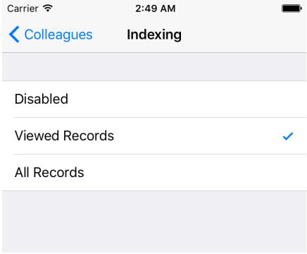


### Searching previously viewed records

先来看下用 NSUserActivity 实现 App search，选择 NSUserActivity 的理由：

+ 它很简单，创建一个实例，设置几个属性。
+ 当你使用 NSUserActivity 来标记用户活动（user activities），iOS 会为频繁访问的内容进行评级，这样搜索出来的结果也会区分优先级
+ 如果需要支持 Handoff 只需一步之遥

#### 1、Implement NSUserActivity

创建一个 `new file` EmployeeSearch.swift 在下面扩展了 Employee，主要添加了 userActivity

```swift
import CoreSpotlight

extension Employee {
     // 用来标识 NSUserActivity 类型
    public static let domainIdentifier = "com.raywenderlich.colleagues.employee"
    // 这个字典为你的 NSUserActivity 提供一个属性，用来标识 activity
    public var userActivityUserInfo: [NSObject: AnyObject] {
        return ["id": objectId]
    }

    public var userActivity: NSUserActivity {
        let activity = NSUserActivity(activityType: Employee.domainIdentifier)
        activity.title = name
        activity.userInfo = userActivityUserInfo
        activity.keywords = [email, department]
         return activity
    }
}
```

挑主要的属性来说说：

+ activityType: 稍后你会用这个标记 NSUserActivity 实例
+ title: 作为搜索结果的名字显示
+ userInfo: 该字典用来存储需要传递内容，比如说存储搜索结果，然后点按搜索结果跳转到 app 相应的内容。
+ keywords: 一组本地化的关键字，方便用户搜索时找到记录

下面在 EmployeeViewController.swift 中设置 employee 的 userActivity 属性，这样每次点开一个 employee，都会记录在 NSUserActivity 里，至于具体的记录细节要根据 Setting 的设定来做决定

```swift
let activity = employee.userActivity

switch Setting.searchIndexingPreference {
case .Disabled:
  activity.eligibleForSearch = false
case .ViewedRecords:
  activity.eligibleForSearch = true
  activity.contentAttributeSet?.relatedUniqueIdentifier = nil
case .AllRecords:
  activity.eligibleForSearch = true
}

userActivity = activity
```

eligibleForSearch 表示 activity 是否被加入设备的索引中。第二个的 `.ViewedRecords` 中的 `relatedUniqueIdentifier` 被设为 nil 是因为并没有对应的 Core Spotlight 来索引他，稍后在 Core Spotlight 章节中会重新设置

`userActivity = activity` 表明要设置当前 EmployeeViewController 实例的 `userActivity` 属性为这个配置好的 activity。

> ViewController 的 userActivity 属性其实继承自 UIResponder

最后，重写同样是继承自 UIResponder 的方法，确保当你选中 search 结果时能够得到必要的信息：

```swift
override func updateUserActivityState(activity: NSUserActivity){
  activity.addUserInfoEntriesFromDictionary(employee.userActivityUserInfo)
}
```

在 UIResponder 的生命周期里，系统会多次调用该方法，你所要做的就是保持 activity 始终为最新状态。在这种情况下，你只需要简单地提供包含 `employee's objectId` 的字典 `employee.userActivityUserInfo`

> 文档中说该方法是用来让子类更新指定的 user activity，通常使用 `addUserInfoEntriesFromDictionary:` 方法来添加一个 state 信息（表示 user's activity）到当前 activity 对象中，其实就是从给定的字典中获取信息然后添加到 activity 的 userInfo 字典中。传递给 userInfo 的信息尽可能地要小，否则需要更多的时间来恢复。经过实际测试，系统索引也是需要时间的。

> 然后，当 state 发生变化时，你需要设置 NSUserActivity 的 needsSave 为 YES，然后 updateUserActivityState： 方法会在合适的时候被调用

在 iOS 系统设置下，将 Colleagues 的索引设置为 Viewed Records ，然后运行 App，在 List 主界面中选择 Brent Reid ，按 Home 键退出，在系统搜索栏中输入 Brent Reid，Bingo！出来结果了


#### 2、Adding more information to search results

现在搜索结果有点单调，NSUserActivity 提供了一个叫做 contentAttributeSet 的集合属性来允许你描述要显示的内容


你已经设置了 title，下面来补充 thumbnailData, supportsPhoneCall, contentDescription

还是在 EmployeeSearch.swift 下面增加一个计算属性 `attributeSet`

```swift
public var attributeSet: CSSearchableItemAttributeSet {
    // kUTTypeContact 表示联系人信息
    let attributeSet = CSSearchableItemAttributeSet(itemContentType: kUTTypeContact as String)
    attributeSet.title = name
    attributeSet.contentDescription = "\(department), \(title)\n\(phone)"
    attributeSet.thumbnailData = UIImageJPEGRepresentation(loadPicture(), 0.9)

    // 为了让电话按钮显示，你必须设置 supportsPhoneCall 为 true 然后提供一个电话号码
    attributeSet.supportsPhoneCall = true
    attributeSet.phoneNumbers = [phone]
    attributeSet.emailAddresses = [email]
    attributeSet.keywords = skills

    return attributeSet
}
```

有了这些细节， Core Spotlight 将会索引每一个然后显示在搜索结果中，也意味着现在可以通过：名字，部门，电话号码，甚至技能来搜索职员了。

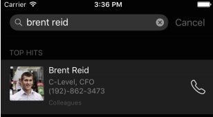


不过现在还不能点击搜索结果跳转到相应的职员界面，我们下面来实现

#### 3、Opening search results

前面已经为 `NSUserActivity` 实例设置了 activityType 和 userInfo 对象，打开 AppDelegate.swift 加入下面方法，告诉 delegate 相关的 data 要持续可用。当用户选择搜索结果时，该方法会被调用：

```swift
func application(application: UIApplication,
    continueUserActivity userActivity: NSUserActivity,
     restorationHandler: ([AnyObject]?) -> Void) -> Bool {
     // 验证然后找出 objectId
     guard userActivity.activityType == Employee.domainIdentifier,
         let objectId = userActivity.userInfo?["id"] as? String else {
         return false
    }
     // 设置 employeeViewController 然后压入 navigationController
    if let nav = window?.rootViewController as? UINavigationController,
         listVC = nav.viewControllers.first as? EmployeeListViewController,
         employee = EmployeeService().employeeWithObjectId(objectId) {

             nav.popToRootViewControllerAnimated(false)

             let employeeViewController = listVC.storyboard?
                 .instantiateViewControllerWithIdentifier("EmployeeView")
                 as! EmployeeViewController

             employeeViewController.employee = employee
             nav.pushViewController(employeeViewController, animated: false)
             return true
        }

    return false
}
```

现在点击搜索结果可以直接跳转到相应的职员页面了。

### Indexing with Core Spotlight

前面我们先学习 NSUserActivity，只是因为简单，现在我们使用 Core Spotlight 来索引全部数据。

在 EmployeeSearch.swift 中添加：

```swift
attributeSet.relatedUniqueIdentifier = objectId
```

这条命令会在 NSUserActivity 和 Core Spotlight 索引对象之间建立某种联系，如果你不做这一步，搜索时会得到重复的结果。

接着创建 `CSSearchableItem` 对象，表示 Core Spotlight 将要索引的对象：

```swift
var searchableItem: CSSearchableItem {
    let item = CSSearchableItem(uniqueIdentifier: objectId,
                                domainIdentifier: Employee.domainIdentifier,
                                    attributeSet: attributeSet)
    return item
}
```

因为我们之前就已经设置了 attributeSet，所以这里就很简单了。

打开 EmployeeService.swift 并 `import CoreSpotlight`，现在我们来实现 `indexAllEmployees()`

```swift
public func indexAllEmployees() {
    // 1. 从数据库中提取所有的 employee 存放到 employees 数组中
    let employees = fetchEmployees()
    // 2. map 遍历为 [CSSearchableItem] 数组
    let searchableItems = employees.map { $0.searchableItem }

    CSSearchableIndex.defaultSearchableIndex()
    // 3. 使用 Core Spotlight 的默认索引，将 searchableItems 数组添加到索引中
         .indexSearchableItems(searchableItems) { error in
        // 4. completionHandler
             if let error = error {
                 print("Error indexing employees: \(error)")
             } else {
                 print("Employees indexed.")
         }
     }
}
```

至此，已经可以所以全部记录了，在设置中将 Indexing 切换为 All Records，运行，搜索：

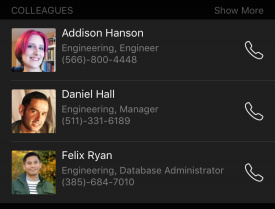


#### Make the results do something

和之前用 NSUserActivity 遇到的问题一样，点击搜索结果并不能跳转到对应的页面，还是到 AppDelegate.swift 里来修正一下：

```swift
import CoreSpotlight

func application(application: UIApplication, continueUserActivity userActivity: NSUserActivity, restorationHandler: ([AnyObject]?) -> Void) -> Bool {

    let objectId: String
    // 如果是由 NSUserActivity 索引的，activityType 应该是 reverse-DNS
    if userActivity.activityType == Employee.domainIdentifier, let activityObjectId = userActivity.userInfo?["id"] as? String {
      objectId = activityObjectId
    // 如果是 Core Spotlight 索引的，activityType 是 CSSearchableItemActionType
    } else if userActivity.activityType == CSSearchableItemActionType, let activityObjectId = userActivity.userInfo?[CSSearchableItemActivityIdentifier] as? String {
      objectId = activityObjectId
    } else {
      return false
    }

    if let nav = window?.rootViewController as? UINavigationController, listVC = nav.viewControllers.first as? EmployeeListViewController, employee = EmployeeService().employeeWithObjectId(objectId) {

      nav.popToRootViewControllerAnimated(false)

      let employeeViewController = listVC.storyboard?.instantiateViewControllerWithIdentifier("EmployeeView") as! EmployeeViewController

      employeeViewController.employee = employee
      nav.pushViewController(employeeViewController, animated: false)
      return false
    }

    return true
  }
```

#### Deleting items from the search index

如果职员被老板开除了，我们删除职员信息的同时记得也要删除索引，这里可以简单的删除所有索引：

```swift
CSSearchableIndex
    .defaultSearchableIndex()
    .deleteAllSearchableItemsWithCompletionHandler { error in

     if let error = error {
         print("Error deleting searching employee items: \(error)")
     } else {
         print("Employees indexing deleted.")
     }
}
```

去系统设置里，将 Indexing 设置为 Disabled，运行观察下效果

除了全部删除我们还可以按组删除和按具体的 item 删除：

+ 按组删除 `deleteSearchableItemsWithDomainIdentifiers(_:completionHandler:)`
+ 按具体 item 删除 `deleteSearchableItemsWithIdentifiers(_:completionHandler:)`

最后要注意是保持 indexes 更新，使用之前介绍的方法来更新要索引的 items

```swift
indexSearchableItems(_:completionHandler:)
```

### Private vs. public indexing

默认的所有 Core Spotlight 索引的内容都是私有的，但你可以标记 NSUserActivity 的属性 eligibleForPublicIndexing 为 true，将其设置为 public。这样就能使内容成为 Apple cloud 索引的一部分。

另外一种使内容公开索引的方式是使用 web 标记，下章介绍。

### Advanced features

Core Spotlight 框架也提供了几个高级特性

#### 1、Core Spotlight App Extensions

Core Spotlight app extension 可以在程序不运行的情况下也能对索引进行维护

Spotlight index extensions 包含一个 CSIndexExtensionRequestHandler 子类（遵循 CSSearchableIndexDelegate 协议）遵循两个方法：

+ `searchableIndex(_: reindexAllSearchableItemsWithAcknowledgementHandler:)`
+ `searchableIndex(_: reindexSearchableItemsWithIdentifiers:
acknowledgementHandler:)`

#### 2、Batch indexing

Core Spotlight 也支持批量更新，这种情况不能使用 defaultSearchableIndex，你需要创建你自己的 CSSearchableIndex 实例

+ 创建 CSSearchableIndex.
+ 标记开始更新 beginIndexBatch()
+ 获取最近更新 fetchLastClientStateWithCompletionHandler()
+ 准备下一次更新的 CSSearchableItem 对象用来索引
+ 使用 indexSearchableItems(_:completionHandler:) 用来索引
+ 结束更新 endIndexBatchWithClientState()

---

## Chapter 3：Your App on the Web

iOS 9 用 universal links 和 web markup 让二者走的更近，他让你提供直接进入你 app 的 deep link，以及可以展示在 Spotlight 和 Safari 搜索框中的 web 内容

### Linking to your app

前面已经熟悉了 deep links，本节介绍一种新技术，开始前，再来回顾下 Deep links

#### Deep links

在 iOS 9 之前，Apps 之间通讯的方式主要是通过注册自定义的 url scheme（在 Info.plist 中使用 CFBundleURLTypes key ）

例如你的一个社交类 App 注册了自定义的 `clownapp://` 或 `clown://`，此时你就能从其他地方构造 `clownapp://home/feed` 这样的结构，一旦链接被打开，iOS 会打开你的 app 并通过 URL 传递一个 URL（通过 `application(_:handleOpenURL:)`）此时，你的 app 就可以对这个 URL 做出解释，并做出相应的回应

Apple 从 iOS 3.0 就开始这么做了，随着时间的推移，也产生了一些问题，这么做有如下缺点：

+ 隐私： `canOpenURL(_:)` 这个方法可用来收集已安装应用程序列表
+ 冲突：如果存在同名的 custom URL scheme 就会有冲突
+ No fallback：如果 iOS 试图打开没有注册的 URL scheme，会静默失败

幸运的是 iOS 9 使用 universal links 解决了这些问题。universal links 使用 基础的 HTTP 和 HTTPS links

#### Universal links

你可以将 `http://clownapp.com/clowns/*` 注册为唯一的 app link，如果用户安装了你的 app，然后在 Safari 或 web 上点击了 `http://clownapp.com/clowns/fizbo` 这个链接，就会跳转到你的 APP 的 Fizbo 的用户界面上，如果没装你的 App，那么 iOS 会跳转到 App 的主页上。你会发现和使用 `openURL(_:)` 基本上没有区别

Universal links 相对 deep links 有如下优势：

唯一

+ 安全：将你的域名与 App 绑定，你要上传一个安全签名文件到 web 服务器上，这样其他的 App 就无法查询你的 App 是否被安装了
+ 简单：universal link 其实就是个简单的 Http 链接，即使用户没装你的 App，或不是 iOS 9 也能通过浏览器打开

#### Registering your app to handle universal links

为了将 website 和 app 绑定，并且证明这就是你的 website，这里会有两种绑定：

+ 你要告诉你的 app 关于你的域名信息
+ 你要告诉你的域名关于你 app 的信息

在此之后，你只需要简单地在 app 中添加一些代码来处理即将到来的链接就好

让你的 APP 了解关于你域名的信息通常在 Capabilities tab 下的 Associated Domains 添加相关域名


这会告诉你的 app 将要响应的域名，确保域名以 `applinks` 开头（只有team agent 或 a team administrator 才能打开 Associated Domains）

#### Registering your server to handle universal links

接下来创建一个从 website 到 app 的连接，你可以在你的 website 上放置一个 JSON 文件，如下：

```json
{
    "applinks": {
        "apps": [],
        "details": [
            {
               "appID": "KFCNEC27GU.com.razeware.RWDevCon",
                "paths": [
                "/videos/*"
                ]
            }
        ]
    }
}
```

> 在服务器上放置一个包含 app 信息的 json，名字必须是 apple-app-site-association，且不能带扩展名，json 也不行。apple-app-site-association 之前被用在 iOS 8 上来实现 web 和 app 之间的 Handoff

这个 `applinks` 部分决定了哪些 apps 可以处理 website 上特定的 `URL paths`，而 details 部分包含了一个字典：

+ appID 由 teamID + bundleID 组成
+ Paths 数组包含了一个你的 app 应该处理的 URLs 白名单，这个 paths 数组还支持 基本的模式匹配，例如 *，？ 等，如 /videos/ */year/201?/videoName

一旦这个 Json 文件准备完毕，你必须上传到 website 的根目录下才能正常工作，而且不能有任何的重定向，而且必须可以通过 Https 访问到

这里还有额外的两点需要考虑下：

1. 由于 Handoff 等特性要照顾 iOS 8，那么可以使用 openssl 来对 apple-app-site- association 进行签名 [链接](https://developer.apple.com/library/ios/documentation/UserExperience/Conceptual/Handoff/AdoptingHandoff/AdoptingHandoff.html)
2. 上传之前先检查下 Json 文件有无语法错误

#### Handling universal links in your app

你的 App 接收到 universal link，你需要做出针对性的回应，简单说就是解析 URL，决定哪些内容需要显示，然后导航到相关的界面上。

```swift
class func sessionByWebPath(path: String,
  context: NSManagedObjectContext) -> Session? {
  let fetch = NSFetchRequest(entityName: "Session")
  fetch.predicate =
    NSPredicate(format: "webPath = %@", path)
  do {
    let results = try context.executeFetchRequest(fetch)
    return results.first as? Session
  } catch let fetchError as NSError {
    print("fetch error: \(fetchError.localizedDescription)")
  }
  return nil
}
```

Session 类有个 webPath 的属性，包含着 `rwdevcon.com` 上 `video` 页面的 `path`。这个方法找出与 path 相匹配的 Session 对象

接着写一个 help 方法，接受一个 video URL ，然后在 UINavigationController 上嵌入一个 AVPlayerViewController 进行播放

```swift
func presentVideoViewController(URL: NSURL) {
  let storyboard = UIStoryboard(name: "Main", bundle: nil)
  let navID = "NavPlayerViewController"
  let navVideoPlayerVC =
    storyboard.instantiateViewControllerWithIdentifier(navID)
    as! UINavigationController
  navVideoPlayerVC.modalPresentationStyle = .FormSheet
  if let videoPlayerVC = navVideoPlayerVC.topViewController
    as? AVPlayerViewController {
    videoPlayerVC.player = AVPlayer(URL: URL)
    let rootViewController = window?.rootViewController
    rootViewController?.presentViewController(
      navVideoPlayerVC, animated: true, completion: nil)
  }
}
```

最后实现如下 `UIApplicationDelegate` 方法，当有来自于注册过的 universal HTTP link call 就会自动被 iOS 调用

```swift
func application(application: UIApplication,
  continueUserActivity
  userActivity: NSUserActivity,
  restorationHandler: ([AnyObject]?) -> Void) -> Bool {
//1 系统用 NSUserActivityTypeBrowsingWeb 表示对应的 universal HTTP links
  if userActivity.activityType ==
    NSUserActivityTypeBrowsingWeb {
    let universalURL = userActivity.webpageURL!
//2 提取出 url 的不同部分
    if let components = NSURLComponents(URL: universalURL,
      resolvingAgainstBaseURL: true),
      let path = components.path {
      if let session = Session.sessionByWebPath(path,
        context: coreDataStack.context) {
        //3 找到 session，然后播放 video
        let videoURL = NSURL(string: session.videoUrl)!
        presentVideoViewController(videoURL)
        return true
      } else {
//4 无法理解就打开网站首页
        let app = UIApplication.sharedApplication()
        let url =
          NSURL(string: "http://www.rwdevcon.com")!
        app.openURL(url)
      }
    }
  }
  return false
}
```

> `application(_:continueUserActivity:restorationHandler:)` 也被用做 iOS 8 的 Handoff，之前的 App Search 我们也用到了这个方法

现在在你的设备上，打开邮件客户端，如果里面有这些链接：


点击第一个，就会打开 app 播放相关视频

而点击第二个则会用 Safari 打开网站主页


> 注意到顶部 banner 下的东东了吗？那叫做 Smart App Banner，稍后会提到

The RWDevCon app 干净利落地处理了他能够识别的 universal links，不能识别的则用 Safari 来打开。除了通过链接来触发，你还可以通过直接载入一个 URL，一个 WKWebView，一个 UIWebView 或使用 openURL(_:) 来触发你的 App 来处理 universal link。

### Working with web markup

Search 包含三种不同的 API：NSUserActivity，CoreSpotlight，web markup。前两种已经介绍过了，现在来看第三种。

你可以使用 web markup 在搜索结果中得到你 app 应用里面的内容。如果你有一个网站，内容与 APP 的内容一致，你可以使用基本的 markup、Smart App Banners、universal links 来标记你的 web pages。

优化你的网站标记，苹果会派机器人去爬你的网站，即使用户没有安装应用，也能搜索相关内容。

#### Making your website discoverable

苹果爬虫不保证什么时候会去爬你的网站，但你可以做下面的事情来保证网站更容易被发现：

1. iTunes Connect 中设置 Support URL 和 Marketing URL 为包含 web markup 的域名
2. 确保这些域名可以访问到你的 web markup
3. 检查 robots.txt，确保苹果的爬虫可以正常工作

#### Embedding universal links using Smart App Banners

一旦苹果的爬虫找到并索引了你的 website，Apple 建议添加 Smart App Banners 到你的网站的索引中

Smart App Banners 最早出现在 iOS 6，他啊可以在网页顶部显示一个 banner，推广你的 App，对于已经安装 App 的用户，这个 banner 可以很容易地提供一个前往 App 指定界面的 deep link

> 如果 iOS 检测到 APP 已安装，banner 会变成 OPEN，否则会显示 View，点击会跳转到 App Store

现在到网站的 Video 目录下，用文本编辑器打开 `talk-ray-wenderlich- teamwork.html`，添加：

```html
<meta name="apple-itunes-app" content="app-id=958625272, app-
argument=http://www.rwdevcon.com/videos/talk-ray-wenderlich-
teamwork.html">
```

属性 name 一定要是 `apple-itunes-app`，这个类型的标记代表 Smart App Banner tag，反过来会告诉 Safari 显示 Smart App Banner

内容属性包含两个重要的参数：

+ app-id：对应着你 App 的 Apple ID，不同于 登录 iCloud 的 Apple ID，这个 ID 是唯一的一串 number，所有 App Store 上的应用都有着唯一的 ID
+ app-argument：包含跳转回 App 的 URL，iOS 9 之前这个参数是自定义的 URL scheme deep link，现在 Apple 推荐使用 HTTP/HTTPS universal links

> Smart App Banners 仅仅支持 Safari

Applebot 仅仅支持两种方式的 mobile links：Twitter Cards 和 Facebook App Links

使用了 Twitter Cards：

```html
<meta name="twitter:app:name:iphone" content="RWDevCon">
<meta name="twitter:app:id:iphone" content="958625272">
<meta name="twitter:app:url:iphone" content="http://www.rwdevcon.com/
videos/talk-ray-wenderlich-teamwork.html">
```

使用了 Facebook's App Links：

```html
<meta property="al:ios:app_name" content="RWDevCon">
<meta property="al:ios:app_store_id" content="958625272">
<meta property="al:ios:url" content="http://www.rwdevcon.com/videos/talk-
ray-wenderlich-teamwork.html">
```

现在打开 Safari，输入 http://www.rwdevcon.com/videos/talk-jake-gundersen- opportunity.html.

你会发现 Smart App Banner 与之前的不太一样，变得更窄了，而且按钮变成了 OPEN，这种特殊的 banner 仅仅会 URL 匹配时才会展示。在其他未匹配状态，banner 还是会变成正常尺寸

> 点击这个 Smart App Banner，Safari 会打开 App 然后播放相关 video，前面的 `application(_:continueUserActivity:restorationHandler:)`方法中已经实现了这一功能

#### Semantic markup using Open Graph

苹果爬虫爬到你的内容并不保证会显示在 Spotlight 的搜索结果中，因为他还会和其他搜索结果内容进行竞争。

Apple 并没有公布具体的评级算法，只是确保你的内容会被考虑。而当用户明显地点击或搜索结果与你的内容高度相关，那么就会优先被 Apple 考虑。

最后，Apple 建议为 markup 添加一些结构化的数据，来使其更好地以富文本的形式显示在 Spotlight 中。在 `/videos/talk-ray-wenderlich-teamwork.html` 上添加下面代码：

```html
<meta property="og:image" content="http://www.rwdevcon.com/assets/images/
videos/talk-ray-wenderlich-teamwork.jpg" />
<meta property="og:image:secure_url" content="https://www.rwdevcon.com/
assets/images/videos/talk-ray-wenderlich-teamwork.jpg" />
<meta property="og:image:type" content="image/jpeg" />
<meta property="og:image:width" content="640" />
<meta property="og:image:height" content="340" />
<meta property="og:video" content="http://www.rwdevcon.com/videos/Ray-
Wenderlich-Teamwork.mp4" />
<meta property="og:video:secure_url" content="https://www.rwdevcon.com/
videos/Ray-Wenderlich-Teamwork.mp4" />
<meta property="og:video:type" content="video/mp4" />
<meta property="og:video:width" content="1280" />
<meta property="og:video:height" content="720" />
<meta property="og:description" content="Learn how teamwork lets you
dream bigger, through the story of an indie iPhone developer who almost
missed out on the greatest opportunity of his life." />
```

这将会使爬虫更好地查找和处理信息，og 代表 Open Graph

> Open Graph 协议可以让网页成为一个“富媒体对象”。用了 Meta Property = og 标签，就是你同意了网页内容可以被其他社会化网站引用等，目前这种协议被 Fackbook 等 SNS 网站所采用。

在你的网站上添加 rich markup 主要目的在于：装饰 Spotlight 的搜索结果，使其展示更多的信息

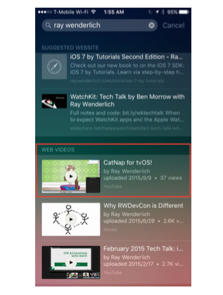


注意 YouTube 是能够获取这些『富文本标记』

#### Validating your markup

你在网站上都做好了 markup 标记，下一步验证是否能被 Apple 正确的支持也很简单。Apple 提供了在线 [验证工具](https://search.developer.apple.com/appsearch-validation-tool)

---

## Chapter 4：App Thinning

Apple 已经推出了很多种尺寸的 iPhone 了，从 iOS 方面，苹果也一直努力地消除这种硬件多元化给开发者带来的困扰，如 iOS 8 推出了 `Adaptive Layout`, `Trait Collections`, `Universal split view controllers`，从此你不再需要为某个特定的设备开发独占 App，而是开发一个通用 App 适配所有设备。

然而这也带来一些挑战，因为要包含所有设备的资源文件，这个通用的 App 所占空间容量都比较大。所以 iOS 9 拿出了新的解决方案：

+ App Slicing 当你将 iOS 9 打包的二进制文件提交到 App Store，Apple 会编译然后为每个特定的设备单独形成一个可执行文件，这样设备真正从商店下载的时候，只会根据特定的设备来下载安装，削减了尺寸。
+ On Demand Resources 应用资源可以在仅被需要时才下载
+ Bitcode bitcode是被编译程序的一种中间形式的代码。包含bitcode配置的程序将会在App store上被编译和链接。bitcode允许苹果在后期重新优化我们程序的二进制文件，而不需要我们重新提交一个新的版本到App store上。

以上这三种技术加起来被称为 App Thinning

### Measuring your work

我们可以通过这种方式来对 App 瘦身过程进行量化

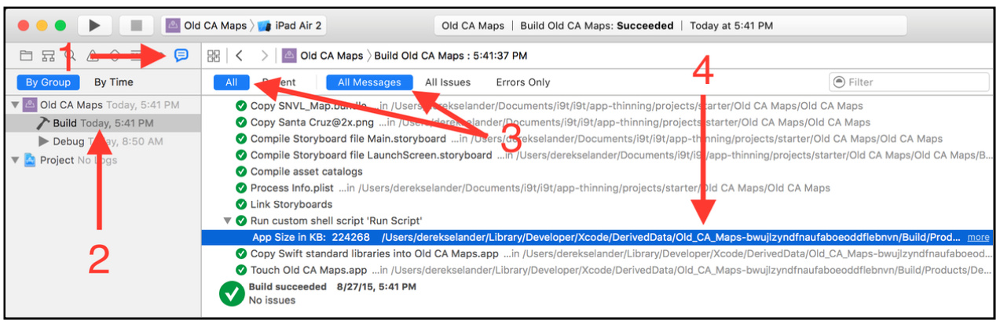

#### Slicing up app slicing

App slicing 可分为两部分：`executable slicing` 和 `resource slicing`。Executable slicing 就是 Apple 将根据不同的设备安装特定的 App，你不需要做太多事情，Apple 已经为你做好了一切。

Being smart with resources
Resource slicing 要求你做的事情也很简单，将所有的资源文件放到 Asset Catalogs 下，并且按照相关特性进行组织，从 Xcode 7 开始，你可以根据 Memory 和 Graphics 来标记资源文件了

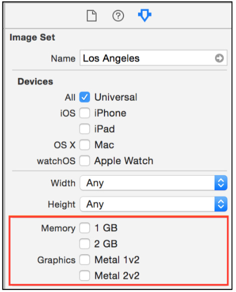


#### Lazily (down)loading content

现在我们通过对资源的『按需使用』来削减内容尺寸（俗称 ODR），ODR 允许你将资源存储在 Apple 的服务器上，之后仅在需要时才会下载使用。

`NSBundleResourceRequest` 负责处理 ODR，通过这个类，可以通过 Tags 来控制内容的下载。对 tags 的使用，Apple 模糊了本地资源和远程资源的界限。

> 使用 ODR 可以包括 images，data，OpenGL shaders，SpriteKit Particles，Watchkit Complications 等

针对 NSBundles 可看做是 data 文件，因此对于 ODR 来说也是支持的。

#### Wire things up to use tags

现在是代码时间，将之前的本地载入资源文件（ NSBundles 文件）改为远程异步载入，修改 `downloadAndDisplayMapOverlay()` 方法

```swift
// 1
guard let bundleTitle =
  mapOverlayData?.bundleTitle else {
return
}
// 2
let bundleResource =
NSBundleResourceRequest(tags: [bundleTitle])
// 3
bundleResource.beginAccessingResourcesWithCompletionHandler {
  [weak self] error in
// 4
  NSOperationQueue.mainQueue().addOperationWithBlock({
// 5
    if error == nil {
      self?.displayOverlayFromBundle(bundleResource.bundle)
    }
  })
}
```

`beginAccessingResourcesWithCompletionHandler(_:)` 会在完成 on-demand 内容下载后，调用 completion block 将资源文件显示到屏幕上。

#### How about those tags

现在我们完成最后一步：标记 tags：

1. 选中我们要标记的资源文件（LA_Map.bundle）
2. 在 File Inspector 中找到 On Demand Resource Tags 部分
3. 填写相应的 Tags


现在运行程序，选中 LA（LA_Map.bundle 被标记过，所以会被存储在云端），此时将从 Apple 的服务器上下载相应的资源文件

#### Make it download faster

LA 这个 bundle 相对来说还比较小，如果你尝试下 San Diego，会发现花很长时间来下载

对于已经通过 ODR 加载过的资源文件，再次显示的时候，ODR 会缓存来保证速度，除非触发了清空条件，否则将会一直缓存这些资源文件

为了避免应用被评为一星，你可以加一个进度条来告诉用户你的 app 正在下载内容，同样是回到 `downloadAndDisplayMapOverlay()` 方法

```swift
guard let bundleTitle =
  mapOverlayData?.bundleTitle else {
  return
}
let bundleResource
  = NSBundleResourceRequest(tags: [bundleTitle])
// 1
bundleResource.loadingPriority
  = NSBundleResourceRequestLoadingPriorityUrgent
// 2
loadingProgressView.observedProgress
  = bundleResource.progress
// 3
loadingProgressView.hidden = false
UIApplication.sharedApplication()
  .networkActivityIndicatorVisible = true

bundleResource.beginAccessingResourcesWithCompletionHandler {
  [weak self] error in
  NSOperationQueue.mainQueue().addOperationWithBlock({
// 4
    self?.loadingProgressView.hidden = true
    UIApplication.sharedApplication()
      .networkActivityIndicatorVisible = false
    if error == nil {
      self?.displayOverlayFromBundle(bundleResource.bundle)
    }
  })
}
```

loadingProgressView 将会随下载进度进行实时更新

### The many flavors of tagging

在真实世界，虽然你加上了进度条来做标记，但用户等待太长时间总归是件非常蛋疼的事情。因此你可以考虑将一些较大的资源文件设为初始数据打包进 IPA ，让他们一起下载安装

#### Initial install tags

选择工程名称 -> Target -> Resource Tags，将 `All` 切换为 `Prefetched`，会发现 ODR 有三种类型的处理方式：

+ Initial Install Tags：这个是资源文件随应用一起打包安装时使用，之后不需要时可以移除，所以也要由 ODR 来管理
+ Prefetched Tag Order：一旦完成下载，按顺序排列
+ Download Only On Demand：按需下载

现在我们可以根据需要，添加相应的资源文件


想要测试实际效果，需要提交到 TestFlight Beta Testing，然后用真实设备下载测试即可。

### Purging content

你可以帮助 iOS 系统在资源文件不再需要时从磁盘清除掉

#### Set a resource to be purged

设置一个 `NSBundleResourceRequest` 类型的属性 `overlayBundleResource` 用来标记下载到的资源文件

```swift
var overlayBundleResource: NSBundleResourceRequest?
```

将这个属性标记的指针指向获取到的资源文件，在资源文件下载显示方法 `downloadAndDisplayMapOverlay()` 中添加一条：

```swift
overlayBundleResource = bundleResource
```

最后在屏幕消失时告诉系统完成了对资源文件的访问

```swift
override func viewDidDisappear(animated: Bool) {
    super.viewDidDisappear(animated)
    overlayBundleResource?.endAccessingResources()
}
```

具体的资源文件是否占用磁盘，可以通过下面的方式进行查看

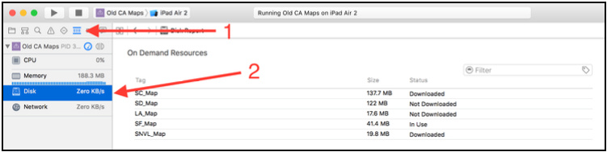

---

## Chapter 5：Multitasking

iOS 9 苹果为 iPad 带来了多任务，允许同时在一个界面上运行两个程序，本章来学习下如何在现有 App 上添加多任务环境

现在 Multitasking 有三种模式：

+ Slide Over 多任务模式：打开一个 App，从 iPad Air 边缘向中心滑动，会出现一个窄边框，此时刚才打开的 App 主界面会变暗（蒙上一层灰色 mask），从边缘拉出来的空间内会出现一个 App 列表（仅限适配过的 App），你可以选择打开某个应用，此时该应用会在边缘空间显示。
+ Split View 多任务模式：当你继续往中心拉，屏幕会被分为两部分，左右两边的 App 会同时显示在屏幕上，也不会有任何一个 App 处于 mask 之下。
+ Picture in Picture 模式：也就是所谓的画中画模式，一般在播放视频时使用

> Split View 模式仅支持 iPad Air 2，Picture in Picture 和 Slide Over 则支持 iPad Air, iPad Air 2, iPad Mini 2, 和 iPad Mini 3。
因为 iPad Air 2 是 2 G 内存，Split View 也是最占内存的

### Preparing your app for multitasking

如果你的 App 是按照如下方式开发的，那么恭喜你。只要你用 iOS 9 的 SDK 重新编译下就自动支持 multitasking 了

+ 使用 size classes, adaptive layout 开发的 universal app
+ 用 SDK 9.X 编译过
+ 支持所有方向
+ 使用 launch storyboard 或 XIB

注意：做到上面这几点也仅仅是支持 multitasking 而已，并不意味完美适配。

### Orientation and size changes

下面看一下本章的 Travelog （该 App 已经做到上述 4 点）在 multitasking 下的表现

首先是单个 App 全屏运行的表现（横屏和竖屏）：

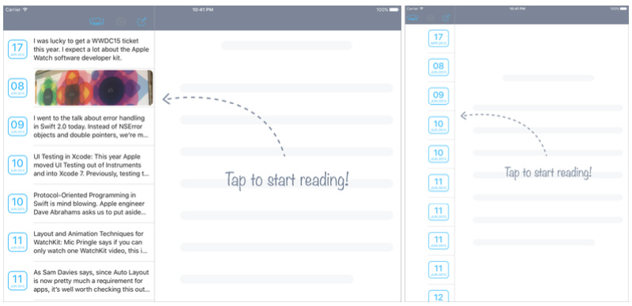

Split View 多任务模式下竖屏的表现：


Split View 多任务模式下横屏的表现：

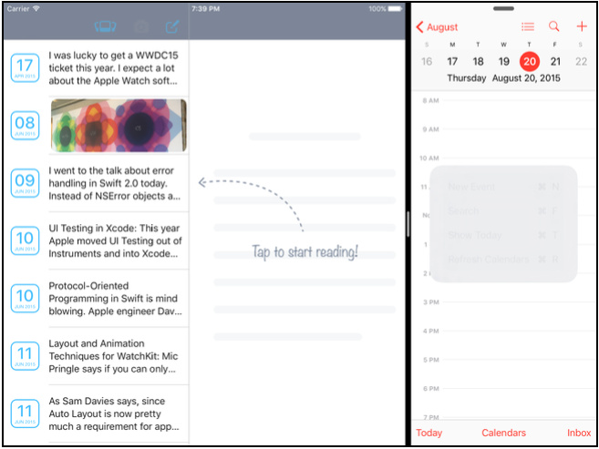

master view 的内容太拥挤了，并且右边的列表栏并未显示任何内容

App 在多任务模式下，部分情况下 bounds 发生变化，也可看做是触发了 size class 的变化，下面是在各种多任务模式下 size class 的具体情形：


(R 代表 Regular 而 C 代表 Compact)

幸好 UIKit 提供了一些更新 layout 的契机，我们可以在下面的方法中更新 layout：

1. `willTransitionToTraitCollection(_:,withTransitionCoordinator:)`
2. `viewWillTransitionToSize(_:,withTransitionCoordinator:)`
3. `traitCollectionDidChange(_:):`

回顾下 Split View 多任务模式 下竖屏的表现，再对比下上图 33% split 的情形，App 的 size class 仍然为 Regular，但整体 width 变窄了，所以 master view 就会略显拥挤

修正办法也很简单，先设置一个 `maximumPrimaryColumnWidth` 属性值

```swift
func updateMaximumPrimaryColumnWidthBasedOnSize(size: CGSize) {
// 如果是小于屏幕宽度或竖屏状况，就设置一个较小的值
  if size.width < UIScreen.mainScreen().bounds.width
    || size.width < size.height {
    maximumPrimaryColumnWidth = 170.0
  } else {
    maximumPrimaryColumnWidth =
      UISplitViewControllerAutomaticDimension
  }
}
```

在第一次载入时更新：

```swift
override func viewDidLoad() {
  super.viewDidLoad()
  updateMaximumPrimaryColumnWidthBasedOnSize(view.bounds.size)
}
```

在 size 发生变化时更新

```swift
override func viewWillTransitionToSize(size: CGSize,
  withTransitionCoordinator coordinator:
  UIViewControllerTransitionCoordinator) {
  super.viewWillTransitionToSize(size,
    withTransitionCoordinator: coordinator)
  updateMaximumPrimaryColumnWidthBasedOnSize(size)
}
```

再次运行，好像变得更糟了


似乎 table view cell 没有随 size 变化而自适应，cell 是自定义的 view，我们打开看一下（`LogCell.swift`）

```swift
static let widthThreshold: CGFloat = 1024.0

override func layoutSubviews() {
    super.layoutSubviews()
    let isTooNarrow = UIScreen.mainScreen().bounds.width < LogCell.widthThreshold
    compactView.hidden = !isTooNarrow
    regularView.hidden = isTooNarrow
  }
```

发现问题所在了吗？UIScreen 的尺寸一般是固定的，并不会响应 App size 的变化。因此我们用 UIWindow.bounds 来替代

```swift
static let widthThreshold: CGFloat = 180.0

override func layoutSubviews() {
  super.layoutSubviews()
  let isTooNarrow = bounds.width <= LogCell.widthThreshold
  // some code ...
}
```

现在就好很多


> UIWindow.bounds 一直会响应 size 的变化，并且他的原点始终为 (0, 0)。在 iOS 9 你可以直接创建 UIWindow 的实例，且不需要通过 `let window = UIWindow()` 来传递一个 frame，系统会自动提供一个和应用 frame 相同的 frame

### Adaptive presentation

点击左上角的 Photo Library bar button

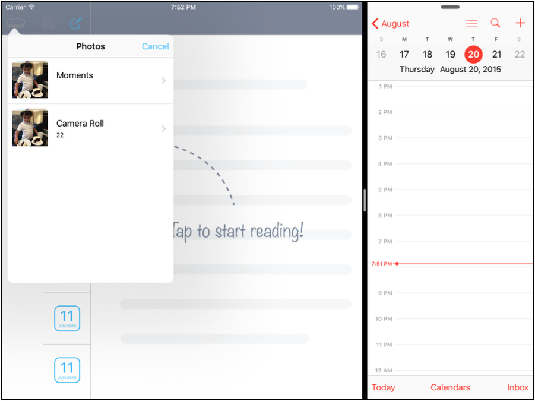

此时将两个 App 之间的分割线继续向左拖动


到了 50% 模式下，popover 没有任何过渡动作自动变成了模态显示，因为在此模式显示下，App 的 size class 由 regular 变成了 compact。但这并不是你想要的，你仅仅想让你的 App 在占屏幕 33% 的情形下才用模态展示照片库（in Slide Over 或 in 33% part）

iOS 8 介绍了 `UIPopoverPresentationController` 管理 popover 显示的内容，你会通过 `UIModalPresentationPopover` 提供的样式来展示。

UIPopoverPresentationControllerDelegate 提供了回调注射方法，你可以提供自定义的样式来展示 popover：

```swift
extension LogsViewController:
  UIPopoverPresentationControllerDelegate {

  func adaptivePresentationStyleForPresentationController(
    controller: UIPresentationController,
    traitCollection: UITraitCollection)
    -> UIModalPresentationStyle {
    //1 检查是否运行在 iPad 上
    guard traitCollection.userInterfaceIdiom == .Pad else {
      return .FullScreen
    }
   //2 检查是否大于 320 即 33%
    if splitViewController?.view.bounds.width > 320 {
      return .None
    } else {
      return .FullScreen
    }
  }
}
```

> 只要大于 33%，一律以正常 popover 展示，只有小于或等于 33%，才会全屏模态展示

最后修改 `presentImagePickerControllerWithSourceType(_:)` 找机会添加 `popoverPresentationController` 的 delete 为 self

```swift
func presentImagePickerControllerWithSourceType(sourceType:
  UIImagePickerControllerSourceType) {
  // some code...
  if sourceType ==
    UIImagePickerControllerSourceType.PhotoLibrary {
    let presenter = controller.popoverPresentationController
    // some code...
    presenter?.delegate = self
}
  // some code...
}
```

最终运行，一切 OK


### Other considerations

除此之外，还应该考虑的有：

+ Keyboard：要考虑多任务模式下，键盘出来后的 layout 设置
+ Designs：设计主要考虑下面几点
	+ Be flexible 考虑在多任务模式下各种 size class 下的表现
	+ Use Auto Layout：使用 Auto Layout
	+ Use size classes：使用 Size Class 适应各种布局
+ Resources：因为多任务的引用，所以最大的情况下，iPad 在 Split View 多任务模式下可以有三个 App 在一个屏幕上同时运行（第一个 App，第二个 App 和画中画 App），因此你需要思考在多任务模式下尽量缩减 App 不必要的内存开销。

---

## Chapter 6：3D Touch

苹果在 iPhone 6s 与 iPhone 6s Plus 上推出了 3D Touch 功能，不同于以往，这次的新 feature 是对开发者开放的，你也可以在自己的 App 上部署 3D Touch，API 层面上的变化主要是下面三点：

+ UITouch 现在有了 `force` 属性，可以识别按压力度了
+ UIViewController 扩展了一系列 API，允许你的 ViewController 以一个预览的方式展示（peek），当用户持续重压屏幕则会全屏展示（pop）
+ UIApplicationShortcutItem 是一个全新增加的类，增加一些可以执行的动作，然后你可以在 iPhone 主界面重压程序图标快捷执行。

### UITouch force

UITouch 有了一个新的属性 `force`，他值的范围（CGFloat）从 0 到 `maximumPossibleForce`（新添加的属性），通常值为 1 表示一个平均的压力水平。

现在你可以实现一个画板 App，画布对按压力度敏感，力度越大笔画越粗，反之越细。

下面的方法实现了划线这一步骤，注意他带三个参数：起点、终点、力度（默认为1，稍后我们会从 UITouch 的 force 属性中获取真实的值）

```swift
extension Canvas {

  private func addLineFromPoint(from: CGPoint, toPoint: CGPoint, withForce force: CGFloat = 1) {

    UIGraphicsBeginImageContextWithOptions(bounds.size, false, 0.0)

    drawing?.drawInRect(bounds)

    let cxt = UIGraphicsGetCurrentContext()
    CGContextMoveToPoint(cxt, from.x, from.y)
    CGContextAddLineToPoint(cxt, toPoint.x, toPoint.y)

    CGContextSetLineCap(cxt, .Round)

    CGContextSetLineWidth(cxt, 2 * force * strokeWidth)

    strokeColor.setStroke()

    CGContextStrokePath(cxt)

    drawing = UIGraphicsGetImageFromCurrentImageContext()

    layer.contents = drawing?.CGImage

    UIGraphicsEndImageContext()

  }
}
```

在 touchesMoved(_:withEvent:) 中判断当前设备是否支持 3D Touch，支持就从 touch 中获取真实的 force，不支持 force 就默认设为 1（前面已经设好了）

```swift
if traitCollection.forceTouchCapability == .Available {
  addLineFromPoint(touch.previousLocationInView(self),
    toPoint: touch.locationInView(self), withForce: touch.force)
} else {
  addLineFromPoint(touch.previousLocationInView(self),
    toPoint: touch.locationInView(self))
}
```

现在你可以随心所欲地画画了


### Peeking and popping

在支持 3D Touch 的设备上，View Controller 是可以识别出不同的压力力度的

1. 用户开始用力按压一个界面，该界面会逐渐以焦点显示，而周围的背景会慢慢模糊掉
2. 当用户继续用力，这个预览界面会显示在屏幕中心，这个就叫做 peek 此时手指离开，预览界面也会消失。当手指向上滑动，这个预览界面会展示几个 action 按钮供你选择
3. 当用户继续重压，整个预览界面就会全屏展示，被称为 pop

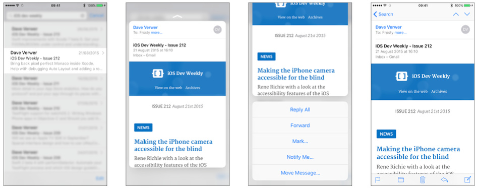

前面我们已经提到，iOS 9 的 View Controller 已经添加了 3D Touch API 支持，下面的代码首先判断了设备是否支持 3D Touch，`registerForPreviewingWithDelegate(_:sourceView:)` 是 iOS 9 新增的 API，见名思义，注册一个 view controller 参与 3D Touch 的预览 `peek` 和 `pop`

```swift
if traitCollection.forceTouchCapability == .Available {
  registerForPreviewingWithDelegate(self, sourceView: view)
}
```

该方法带两个参数，`delegate` 通过实现 `UIViewControllerPreviewingDelegate` 来协调展示 preview VC，`sourceView` 表示需要回应 3D Touch 的 view

> 回顾上图所示，我们在 TableView 上实现按压 cell 弹出 preview，所以我们就在 TableView Controller 上实现这个方法，那么 sourceView 也就是 tableView

既然指定了 self 是 delegate，下面要实现 `UIViewControllerPreviewingDelegate` 方法

```swift
extension DoodlesViewController:
  UIViewControllerPreviewingDelegate {

  func previewingContext(
    previewingContext: UIViewControllerPreviewing,
    viewControllerForLocation location: CGPoint)
    -> UIViewController? {
    // peek!
    return nil
  }

  func previewingContext(
    previewingContext: UIViewControllerPreviewing,
    commitViewController viewControllerToCommit:
    UIViewController) {
    // pop!
  }
}
```

1.第一个 delegate 方法 `previewingContext(_:viewControllerForLocation:)` 带两个参数：

+ location 表示 3D Touch 发生的位置，你根据该参数判断那个 view 被按压
+ previewingContext 是一个 UIViewControllerPreviewing 实例，这个类有两个属性比较有用：
	+ sourceView：就是你之前从 registerForPreviewingWithDelegate(_:sourceView:) 方法中传递进来的 view
	+ sourceRect：表示可以按下去的尺寸，这里为一个 cell 的 frame
这个 delegate 返回一个被 preview 展示的 view controller

2.第二个 delegate 方法 `previewingContext(_:commitViewController:)` 当用户按压力度更大触发 pop 时被调用，该方法同样带两个参数，一个与上面相同，另一个 `viewControllerToCommit` 来自于上面 delegate 方法的返回值，即将要被展示的 VC。当用户持续重压，由 preview 转到全屏展示，也是会显示这个 VC

现在来完善这两个方法：

```swift
extension DoodlesViewController:
  UIViewControllerPreviewingDelegate {

  func previewingContext(
    previewingContext: UIViewControllerPreviewing,
    viewControllerForLocation location: CGPoint)
    -> UIViewController? {

    // 1
    guard let indexPath =
      tableView.indexPathForRowAtPoint(location),
      cell = tableView
        .cellForRowAtIndexPath(indexPath) as? DoodleCell
      else { return nil }

    // 2
    let identifier = "DoodleDetailViewController"
    guard let detailVC = storyboard?
      .instantiateViewControllerWithIdentifier(identifier)
      as? DoodleDetailViewController else { return nil }
    detailVC.doodle = cell.doodle

    // 3 这样当 cell 被持续按压的话，tableView 其余的地方就会变模糊
    previewingContext.sourceRect = cell.frame
    // 4
    return detailVC
  }

  func previewingContext(
    previewingContext: UIViewControllerPreviewing,
    commitViewController viewControllerToCommit:
    UIViewController) {

    showViewController(viewControllerToCommit, sender: self)
  }
}
```

> Preview view controller 通常会显示一个默认的尺寸，但是你可以通过覆盖 `preferredContentSize` 属性来修改

Apple 已经为一些控件实现了 peek 和 pop，比如 UIWebView 和 WKWebView，你只需要将他们的 `allowsLinkPreview` 属性设为 `true` 即可

### Preview actions

前面我们提到在 peek 展示 preview 阶段，用户手指不离开屏幕向上滑动，会显示一些操作按钮。实现起来也很简单，在将会被 preview 展示的 VC （即最终会被 pop 到屏幕上的 VC）上实现  `previewActionItems` 方法

```swift
override func previewActionItems() -> [UIPreviewActionItem] {
  // 1
  let shareAction = UIPreviewAction(title: "Share",
    style: .Default) {
    (previewAction, viewController) in
    if let doodlesVC = self.doodlesViewController,
      activityViewController = self.activityViewController {
      doodlesVC.presentViewController(activityViewController,
        animated: true, completion: nil)
    }
  }

  // 2
  let deleteAction = UIPreviewAction(title: "Delete",
    style: .Destructive) {
    (previewAction, viewController) in
    guard let doodle = self.doodle else { return }
    Doodle.deleteDoodle(doodle)
    if let doodlesViewController = self.doodlesViewController {
      doodlesViewController.tableView.reloadData()
    }
  }
  return [shareAction, deleteAction]
}
```

上面分别用 `UIPreviewAction` 创建了两个 preview action：分享和删除操作

> `UIPreviewAction` 类似于 `UIAlertActions`，你还可以使用 UIPreviewActionGroup 将他们分组，也就是说一个 group 可以包含多个 action，当你点击这个 group ，会打开个子菜单提供一些 actions 供你选择。

因为这个 preview action 方法最终是要由 containerVC（`doodlesViewController`） 来执行，在这里我们仅仅是在 preview VC 中保留了 containerVC 的一个引用（注意是 weak 的），当然你也可以用代理这种设计模式来解耦。

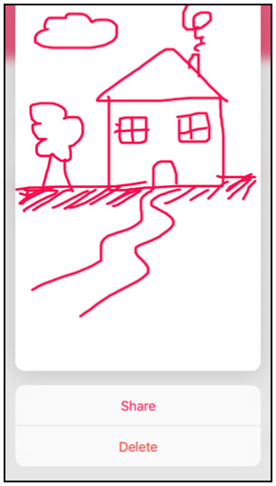

### Home screen quick actions

最后一个关于 3D Touch 的特性是可以在手机主屏，重压 App 图标弹出一个菜单来快速执行一些操作


每个 App 图标可以添加四个 action，每个 action 分成两种类型：

+ Static shortcuts: Static shortcuts 在 Info.plist 中定义，随 App 安装生效
+ Dynamic shortcuts: 在 runtime 时设置，能够被动态添加移除。只有运行一次才会生效

#### Adding a static shortcut

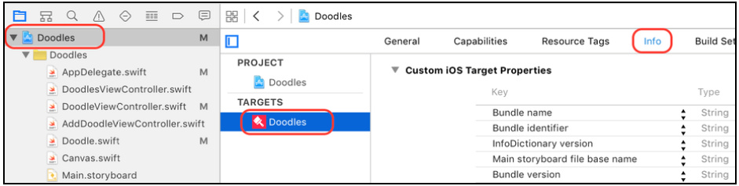

增加一个 key 为 UIApplicationShortcutItems 的 Array，添加一个字典，然后添加下面的 item：


+ UIApplicationShortcutItemTitle: 表示 Action 的标题为 New Doodle
+ UIApplicationShortcutItemType: `com.razeware.Doodles.new` 表示唯一的标识符，稍后代码中会用到
+ UIApplicationShortcutItemIconType: UIApplicationShortcutIconTypeAdd 表示 Action 为 Add，稍后展示的 icon 也为 Add（ + 号）

除了这三个类型的 key 外，通过查看文档还有下面三种 key：

+ UIApplicationShortcutItemSubtitle：定义了子标题
+ UIApplicationShortcutItemIconFile：用来提供自定义的 icon 图像
+ UIApplicationShortcutItemUserInfo：允许你提供自定义的字典，包含你所需要的内容

现在你已经定义了一个 shortcut item，当用户用力按压图标时，iOS 9 会执行一个新的 `UIApplicationDelegate` 方法  `application:performActionForShortcutItem:completionHandler:`

```swift
func application(application: UIApplication,
  performActionForShortcutItem
  shortcutItem: UIApplicationShortcutItem,
  completionHandler: (Bool) -> Void) {

  handleShortcutItem(shortcutItem)
  completionHandler(true)
}
```

我们来实现这个 `handleShortcutItem`

```swift
func handleShortcutItem(
  shortcutItem: UIApplicationShortcutItem) {
  switch shortcutItem.type {
  case "com.razeware.Doodles.new":
    presentNewDoodleViewController()
  default: break
  }
}
```

根据我们之前在 Info.plist 中定义的 `UIApplicationShortcutItemType` 唯一标识符来判断是否执行快捷操作，在这里我们快速新建一个新的 VC

```swift
func presentNewDoodleViewController() {
  let identifier = "NewDoodleNavigationController"
  let doodleViewController = UIStoryboard.mainStoryboard
    .instantiateViewControllerWithIdentifier(identifier)

  window?.rootViewController?
    .presentViewController(doodleViewController, animated: true,
    completion: nil)
}
```

最终效果：

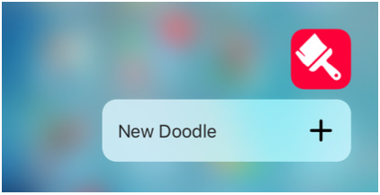


> 当你从 quick action 启动一个应用，application(_:didFinishLaunchingWithOptions:) 依然会被调用，且他的 `launchOptions` 字典中的 `UIApplicationLaunchOptionsShortcutItemKey` 会包含这个 `UIApplicationShortcutItem`

#### Adding a dynamic shortcut

在 Doodle.swift（包含涂鸦的 model） 中增加一个静态方法，所做的事情也很简单，用代码创建一个 `UIApplicationShortcutItem` 且加入应用程序的 `shortcutItems` 数组：

```swift
static func configureDynamicShortcuts() {
  if let mostRecentDoodle = Doodle.sortedDoodles.first {
    let shortcutType = "com.razeware.Doodles.share"
    let shortcutItem = UIApplicationShortcutItem(
      type: shortcutType,
      localizedTitle: "Share Latest Doodle",
      localizedSubtitle: mostRecentDoodle.name,
      icon: UIApplicationShortcutIcon(type: .Share),
      userInfo: nil)
    UIApplication.sharedApplication().shortcutItems =
      [ shortcutItem ]
} else {
    UIApplication.sharedApplication().shortcutItems = []
  }
}
```

接着在 `addDoodle(_:)` 和 `deleteDoodle(_:)` 更新 model 的操作中都执行下 `Doodle.configureDynamicShortcuts()`，这样无论新增或删除一个涂鸦，你都会动态更新 shortcut item

除了更新 model，在 App 启动时也要动态更新下，在 `application(_:didFinishLaunchingWithOptions:)` 添加 `Doodle.configureDynamicShortcuts()`

最后来处理按下 shortItem action 所要执行的操作：

```swift
func handleShortcutItem(
  shortcutItem: UIApplicationShortcutItem) {
  switch shortcutItem.type {
  case "com.razeware.Doodles.new":
    presentNewDoodleViewController()
  case "com.razeware.Doodles.share":
    shareMostRecentDoodle()
  default: break
  }
}

func shareMostRecentDoodle() {
  guard let mostRecentDoodle = Doodle.sortedDoodles.first,
    navigationController = window?.rootViewController as?
    UINavigationController
    else { return }
  let identifier = "DoodleDetailViewController"
  let doodleViewController = UIStoryboard.mainStoryboard
    .instantiateViewControllerWithIdentifier(identifier) as!
    DoodleDetailViewController

  doodleViewController.doodle = mostRecentDoodle
  doodleViewController.shareDoodle = true
  navigationController
    .pushViewController(doodleViewController, animated: true)
}
```

最终结果：

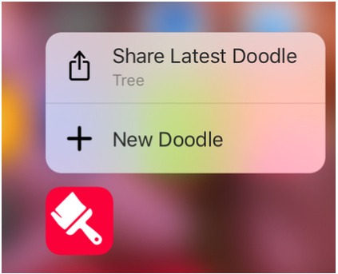

---

## Chapter 7：UIStackView & AutoLayout changes

从 iOS 8 开始，Apple 就一直改进 AutoLayout 的体验，iOS 9 UIKit 团队推出了 UIStackView，让自动化布局变得更加简单

Stack View 提供了一些垂直和水平方向上的布局方式，通过设置这些属性如 alignment，distribution，spacing 你可以定义这些 contained views 之间的距离

> stack view 可看作是一个容器，包含着需要布局的 views

现在来玩第一个 Stack View

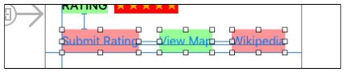

选中这三个 view，然后将他们加入 Stack View

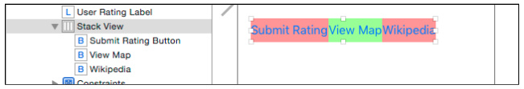

将 view 加入 stackView 会将原有的约束全部清除掉，因此我们需要重新添加约束，不过这一次是在 stackView 上添加

```
Top: 20, Leading: 0, Trailing: 0, Bottom: 0
```

解决了外部，再回到 stack view 内部，内部 view 之前的间距太近了，我们来添加一些 Spacing，方法如下：


照例，运行看下效果：

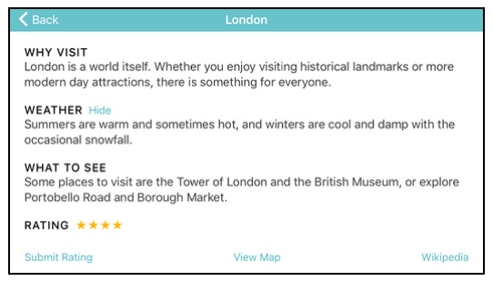

### Stack views are just better

如果你有一堆 views，相互之间都设好约束。如果其中一个 view 被隐藏掉，为了保证显示效果，你需要对约束做一些调整。而现在有了 stack view，你只需要将 view 的 hidden 设为 true，隐藏掉就好了，其余的事情交给 stack view 来处理。

除了在 Auto Layout 上的改进，iOS 9 还放出了两个新玩意： layout anchors 和 layout guides，分别来自 `NSLayoutAnchor` 类和 `UILayoutGuide` 类

### Layout anchors

Layout anchors 提供了一种直观的方式来创建约束，想象下你有两个 labels，`bottomLabel` 和 `topLabel`。你想让 bottomLabel 位于 topLabel 的下方，且二者直接的距离为 8 points。在 iOS 9 之前，你可能要这么写：

```swift
let constraint = NSLayoutConstraint(
  item: topLabel,
  attribute: .Bottom,
  relatedBy: .Equal,
  toItem: bottomLabel,
  attribute: .Top,
  multiplier: 1,
  constant: 8
)
```

而有了 Layout anchors 允许我们这么做

```swift
let constraint = topLabel.bottomAnchor.constraintEqualToAnchor(
    bottomLabel.topAnchor, constant: 8)
```

`constraintEqualToAnchor:constant:` 方法属于类 `NSLayoutAnchor` 的实例方法，这个类还有几个类似的方法：

```swift
- constraintEqualToAnchor:
- constraintGreaterThanOrEqualToAnchor:
- constraintGreaterThanOrEqualToAnchor:constant:
- constraintLessThanOrEqualToAnchor:
- constraintLessThanOrEqualToAnchor:constant:
```

`NSLayoutAnchor` 主要优势在于你不用直接创建 `NSLayoutConstraint`了，而是先选择你要添加约束的对象包括（UIView、NSView、UILayoutGuide），然后用这些对象的 `anchor` 属性通过上面的方法来构建你的约束

再回到上面的例子中，现在 view 有 `layout anchor` 对象（bottomAnchor）来表示  `.Bottom attribute` 了，而 `bottomAnchor` 属于 `NSLayoutYAxisAnchor`，继承自 `NSLayoutAnchor`

`NSLayoutAnchor` 有四个子类以及分别对应了如下 anchor：

+ NSLayoutDimension
	+ heightAnchor
	+ widthAnchor
+ NSLayoutXAxisAnchor
	+ centerXAnchor
	+ leadingAnchor
	+ leftAnchor
	+ rightAnchor
	+ trailingAnchor
+ NSLayoutYAxisAnchor
	+ bottomAnchor
	+ centerYAnchor
	+ topAnchor

如果你查看文档，会发现 `NSLayoutDimension` 多了一些方法，增加了 `multiplier` 和 `Constant`

```swift
func constraintEqualToConstant(_:)
func constraintEqualToAnchor(_:multiplier:)
func constraintEqualToAnchor(_:multiplier:constant:)

func constraint[Less|Greater]ThanOrEqualToConstant(_:)
func constraint[Less|Greater]ThanOrEqualToAnchor(_:multiplier:)
func constraint[Less|Greater]ThanOrEqualToAnchor(
  _:multiplier:constant:)
```

> heightAnchor 和 widthAnchor 都是属于 `NSLayoutDimension`，而文档的意思只有涉及这两种才会用到 `multiplier`

还有注意的一点就是使用这些 `NSLayoutAnchor` 构建约束时，类型必须一致。即 `constraint[Equal|LessThanOrEqual|GreaterThanOrEqual]ToAnchor` 这些方法的两个对象的 anchor 类型必须一致。

+ NSLayoutDimension 只能和 NSLayoutDimension
+ NSLayoutXAxisAnchor 只能和 NSLayoutXAxisAnchor
+ NSLayoutYAxisAnchor 只能和 NSLayoutYAxisAnchor

不一致 OC 会警告


而 Swift 会直接报错


### Layout guides

layout guide 解决了你之前用 dummy view 才能解决的布局问题，将 layout guide 想象成一个隐形的矩形或 view 层级上的框架，你可以利用矩形的边缘来布局，就和你之前加个 dummy view 用法完全一样，你可以在上面添加约束什么的。

这样做的好处就是轻量，没有副作用，之前 dummy view 虽然也是隐形的，但毕竟在 view 层级结构中，还是要参与消息传递过程。

UILayoutGuide 定义的这个矩形区域也能很好的与 Auto Layout 交互

下面来解决一个布局问题

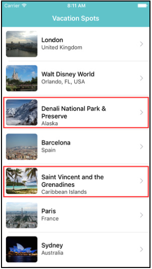

红框圈出的 cell 文字没有居中，原因也很简单，设置了 label 的 top constant 为固定值（15），这个 value 在单行文字正常，多行就有问题了。

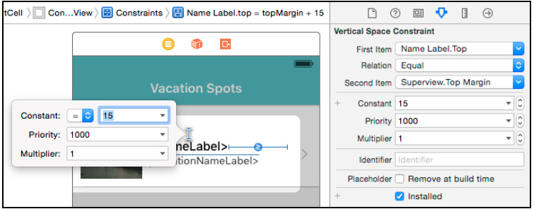

在 iOS 9 之前，你可能会创建一个 dummy container view 来居中，现在则完全可以用 layout guide 来做

目前 layout guide 还只能通过代码添加，在 awakeFromNib(): 中添加如下代码：

```swift
// 1 为 cell 的 contentView 添加 layoutGuide
let layoutGuide = UILayoutGuide()
contentView.addLayoutGuide(layoutGuide)
// 2
let topConstraint = layoutGuide.topAnchor
  .constraintEqualToAnchor(nameLabel.topAnchor)
// 3
let bottomConstraint = layoutGuide.bottomAnchor
  .constraintEqualToAnchor(locationNameLabel.bottomAnchor)
// 4
let centeringConstraint = layoutGuide.centerYAnchor
  .constraintEqualToAnchor(contentView.centerYAnchor)
// 5
NSLayoutConstraint.activateConstraints(
  [topConstraint, bottomConstraint, centeringConstraint])
```

首先为 cell 的 contentView 添加 layoutGuide，其实就相当于给 cell 的 contentView 加了一个隐形的矩形框（尺寸等于 contentView 的 frame），接着利用 layoutGuide 的 Anchor 对象创建需要的约束，最后一步激活这些约束。

> `activateConstraints(_:)` 是从 iOS 8 开始，苹果推荐使用的

再次运行，居中问题似乎解决了


不过仔细一看，之前 cell 的内容确实居中了，不过 下面的 locationNameLabel 被压扁了。还记得之前提到过『label 的 top constant 被设为固定值（15）』吗？我们现在已经通过 layout guide 设置了居中，不再需要这个 `top` 约束了。

直接在 Xcode 中删除的话，会报错缺失约束，这是因为我们通过 layout guide 添加的那些约束只有在运行时才会生效，所以暂时还不能删掉这个 top 约束，还好，Xcode 已经提供了解决方案，在 `top` 约束 的 `Placeholder` 上打上勾即可。

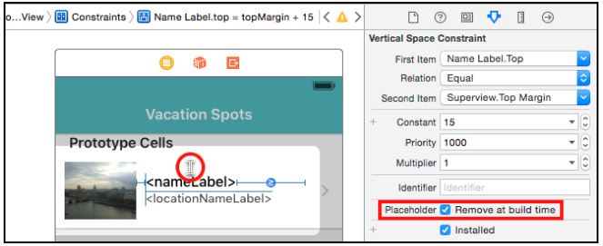

这样，top 约束 会在运行时移除，Xcode 也不会报错了

最后运行，一切 OK

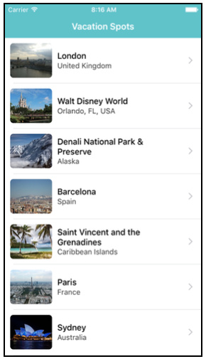

---

## Chapter 8: Intermediate UIStackView

上一章已经学习了 Stack View 的用法，现在我们可以将之前手工添加的约束统一改为 Stack View 的形式了。

### Your first vertical stack view

现在我们来创建一个内部是垂直布局的 stack view，很简单将下面两个 Lable 选中，加入 stack view：

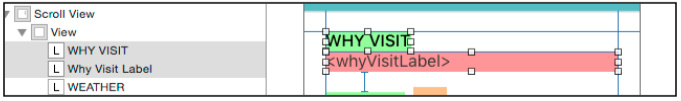

记得对 stack view 与周围的元素添加相应的约束

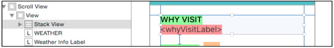

### Alignment

在 Xcode 上设置 aligment 其实对应着枚举对象 `UIStackViewAlignment` 的 `alignment` 属性。分别在垂直和水平方向上对应着不同值：

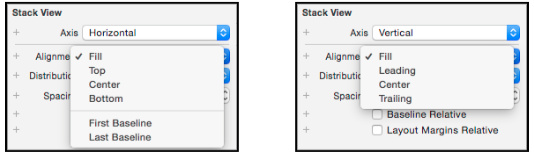

Horizontal axis:

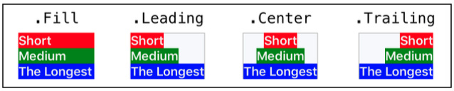

Vertical axis:

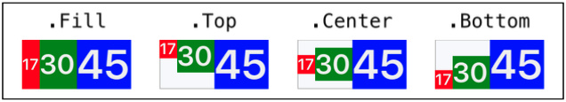

FirstBaseline and LastBaseline:

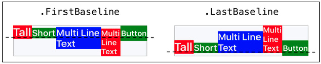

下面我们给 WEATHER 这部分加入 stack view，点击 Hiden，底下的内容会隐藏，同时注意 RATING 星星的变化：


Stack view 按如下方式组织，且与周边元素添加合适的约束。

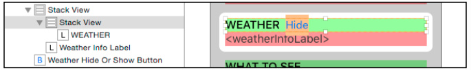

### Top-level stack view

现在我们有了五个 Stack View，并设置他们之间的约束，那么为什么不更进一步，把这五个 Stack View 也嵌入到 Stack View 中，这样我们就不用设置他之间的约束了。


在最外层加一个 Stack View，设置内部元素垂直布局，且间隔为 20。

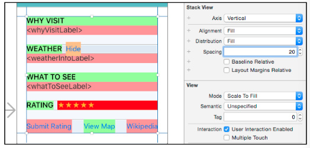

> 注意，把元素添加到 StackView，会清除掉该元素上的所有约束

### Arranged subviews

观察上面的动图，WEATHER 位于 WHAT TO SEE 的下面，而他们现在都在 Stack View 里了，只需要在 Xcode 里简单的拖动一下二者的顺序就好。

`UIStackView` 其实专门有一个属性 `arrangedSubviews` 数组来存储这些 View，而 `arrangedSubviews` 数组的索引也就是 StackView 中 view 的排列顺序。

`UIStackView` 还有一个继承自 UIView 的 subviews 属性，该属性的含义与 UIView 的相同，是指自身层级结构中包含的子 View，而他的索引主要表示在 Z 轴维度上子 View 的排列顺序。

在 StoryBoard 左边栏（outline view），展开一个 StackView 里面的 views 其实都是 arrangedSubviews，而你想要给 StackView 添加一个 subviews，则只能通过代码方式

除了在Storyboard 中拖动 stackView 里的 views，你还可以通过代码的方式来实现：

+ `addArrangedSubview(_:)`
+ `insertArrangedSubview(_:atIndex:)`
+ `removeArrangedSubview(_:)`

> 执行这些操作，仅对布局有影响，并不会改变真正的 view 层级中的 subviews

### Size class based configuration

Stack View 还可以和 Size Class 配合起来满足各种需要，比如我们设置 vertical size class 为 compact 时，缩减 Stack View 内部元素之间的间距（由 20 减到 10）

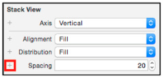

为 Spacing 添加一个 size class（Any Width > Compact Height）

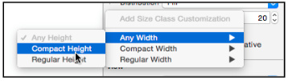

为新 size class 下的 Spacing 设置 10

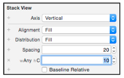

运行一下，横屏过来是不是更紧凑了呢

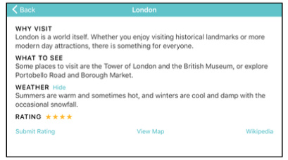

### Animation

还记得我们之前点击 Hidden 按钮的界面动画吗，整个 WEATHER 的详细内容被隐藏掉了，实现起来也很简单：用一个 BOOL 属性 `shouldHideWeatherInfo` 来存储当前是否应当被隐藏，然后根据这个属性来执行一些动画

```swift
if animated {
      UIView.animateWithDuration(0.3,
        delay: 0.0,
        usingSpringWithDamping: 0.6,
        initialSpringVelocity: 10,
        options: [],
        animations: {
          self.weatherInfoLabel.hidden = shouldHideWeatherInfo
        }, completion: { finished in
          UIView.animateWithDuration(0.3) {
            self.ratingStackView.axis =
              shouldHideWeatherInfo ? .Vertical : .Horizontal
          }
        }
      )
    } else {
      weatherInfoLabel.hidden = shouldHideWeatherInfo
      ratingStackView.axis = shouldHideWeatherInfo ? .Vertical : .Horizontal
    }
```

注意，最后在 Completion Block 中（完成动画的时候）将 RATING 这部分对应的 StackView axis 布局做出相应的调整，根据当前的隐藏状态（shouldHideWeatherInfo）来决定 `Vertical` or `Horizontal`（隐藏垂直布局，不隐藏水平布局）

---

## Chapter 9：What's New in Storyboards?

Xcode 7 带来了如下新特性：

+ 将单个 storyboard 分割成多个 storyboards，然后通过 storyboard references 将他们连接起来
+ 使用 scene dock 为 view controller 添加 supplementary views
+ 为 navigation bar 添加多个 buttons

### Storyboard references

之前团队开发一般都避免使用 storyboard，因为最后 merge 的时候着实蛋疼。现在的 Xcode 7 允许每个人维护一个小 storyboard，然后通过 storyboard references 将这些 storyboards 连接起来，一举解决了冲突问题。

### Creating your first storyboard reference

一般可以考虑将一个容器 view controller 单独放到一个新 storyboard 中。

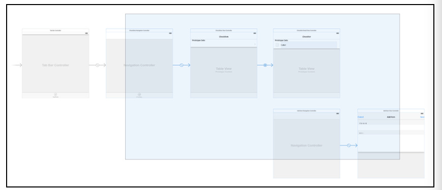

拖选 scene，选择 `Editor\Refactor to Storyboard`，输入 `name`，设置 `Gruop`，保存。

Xcode 做了这么三件事:

+ 将选中的 scenes 放到新的 storyboard 中
+ 将 tab bar controller 的 `view controllers` 指向其他 storyboard
+ 将你带到新的 storyboard

这个新创建的 storyboard 中 scenes 的布局和之前的也是一模一样


原来的 main storyboard 变成了下面的样子


被移走的 scenes 变成了 `storyboard reference`

如果 `Editor\Refactor to Storyboard` 这步没有输入 `name`，Xcode 会自动给你生成一个，还是自己起一个有含义的名字吧

还是在 main storyboard 中，注意被移走的 scenes 留下了一个 `ChecklistsNavigationController` （referenceID），其实这个 ID 对应着将会 segue 的 VC


你也可以移除这个 `referenceID`，这样默认的 segue 指向下一个 storyboard 中的 Initial View Controller（当然你要在该 storyboard 中设置了 Initial View Controller 才行）

### Storyboards within a team

如果你是一个团队成员，tabBar VC 里面的一个 VC 由你的同事完成，现在需要集成起来。步骤也很简单：

在 Main.storyboard 所在目录层级，点击 File\Add Files to 『当前工程目录』，选择你同事完成的文件夹（包含 swift 和 storyboard 文件），再到 Main.storyboard 中创建一个 `storyboard reference `指向这个新创建的文件夹中的 storyboard

### Focusing on a storyboard

如果你有一个很大的工程，导航到达一个场景需要点击很多次，进入很多层级才能实现，此时可以按照功能单元来划分 storyboard，比如下面的，将点击 tableView cell 进入详情页面单独划分到一个 storyboard 中


剩下的操作和上面相同，现在我们回到主程序界面，在 Main Interface 中选择我们刚才创建的 storyboard


这样做的好处是，运行程序会直接从该 storyboard 的起始 VC 运行，也就是 App 一运行就会进入详情页面


> 注意，因为没有从 main.storyboard 以及前面的 storyboard 启动，因此也不会出现 `navigation bar` 或 `tab bar` 还有要注意的一点是，如果当前的 initial VC 需要前面的 segue 提供数据，就会失败

### Views in the scene dock

storyboard 有一个容易被忽视的特性 scene dock，在 storyboard 中选中一个 scene

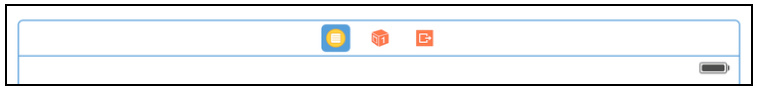

注意到上面三个个小图标了吗？分别对应着：

+ 当前 VC 的引用
+ 第一响应者
+ unwind segues

Xcode 7 现在允许你添加自定义的 view 到这上面（scene dock）去了。添加到 scene dock 上的 view 并不会同时添加到 view controller 的 subviews 数组中去，但是，你可以通过 IBOutlets 连续的方式添加一个引用，方面在运行时使用这个 view。

我们为上面选中 tableView row 添加一个背景颜色，首先拖一个 view 到 `tableView controller` 的 `scene dock` 上。

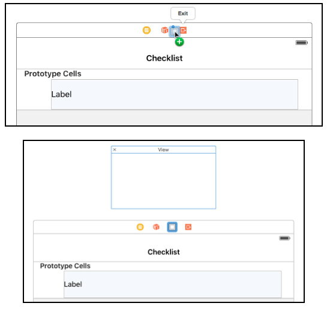

下面改变这个 view 的背景色为橙色，最后通过 Ctrl-drag 从 cell 到 view 拉一条连线，在弹出的菜单中选择 `selectedBackgroundView`，可供选择的还有 `accessoryView`、`backgroundView`、`editingAccessoryView`。运行 OK~

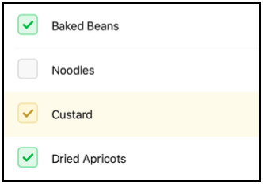

> 并不支持多行选中启用的情形，因为在运行时只有一个 view 实例被创建，然后共享给各个 cell

### Conditional views using the scene dock

如果你需要根据需要动态添加 View，那么就可以使用 scene dock 放置 view 的方式来实现，使用该方式的优势在于这个 view 不会对 view controller 中的 subviews 做出干扰，你可以之后使用代码方式动态将其添加到 view 层级结构中

现在我们来实现点击一行 table view cell，该行会延展其高度得到额外的空间显示 note，再次点击或点击不同的 row 又会恢复回去。

这次依然是拖一个 view 到 scene dock 上，设置 `width：320`，`height：128`。再拉一个 label 到这个 view 上，修改文字颜色（屎黄色🌝）


接着拉一个 `text view` 到新 view 上紧挨着之前的 label 下面


现在可以从 notes view 到 view controller 拖一个 IBOutlet，尽管屏幕上一次会显示多个 cell 实例，但每次只有点击了才会展示 note view，且始终只会展示一个，所以不用太担心只有一个 IBOutlet 会出问题。

现在从 notes view 拉两个 IBOutlet：

+ `notesView`（自身 view）
+ `notesTextView`（text view）

前面学过了 UIStackView，这里确保 Auto Layout 约束了 notes view 的高度，然后添加到 cell 的 stack view 中去，设置 clipsToBounds 是为了在左滑删除时阻止 text view 跑到 cell 外面去

```swift
func addNotesViewToCell(cell: ChecklistItemTableViewCell) {
  notesView.heightAnchor
    .constraintEqualToConstant(notesViewHeight)
    .active = true
  notesView.clipsToBounds = true

  cell.stackView.addArrangedSubview(notesView)
}
```

这里使用 Auto Layout，是因为 `stack view` 的高度源自于他 `arrangedSubviews`，如果你这里不给 notesView 设置个高度，cell 不会在你添加 notes view 时自动增加高度。

下面移除 notes view：

```swift
func removeNotesView() {
  if let stackView = notesView.superview as? UIStackView {
    stackView.removeArrangedSubview(notesView)
    notesView.removeFromSuperview()
  }
}
```

最后实现点击 cell row 出现 notes view 的效果：

```swift
override func tableView(tableView: UITableView,
  didSelectRowAtIndexPath indexPath: NSIndexPath) {
// 1
  guard let cell = tableView.cellForRowAtIndexPath(indexPath)
    as? ChecklistItemTableViewCell else { return }
// 2
  tableView.beginUpdates()
// 3
  if cell.stackView.arrangedSubviews.contains(notesView) {
    removeNotesView()
  } else {
    addNotesViewToCell(cell)
// 4
    notesTextView.text = checklist.items[indexPath.row].notes
  }
// 5
  tableView.endUpdates()
}
```

再次运行（这次注意将 Main Interface 改回 Main），点击任意 cell，你会看到 notes view 跑出来

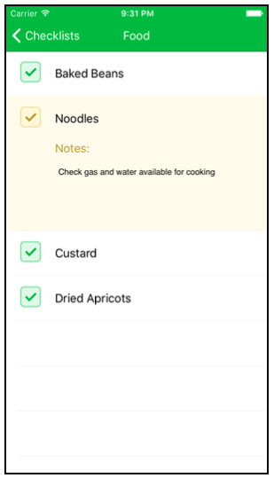


> 这种方式创建的 view 只能由一个 VC 使用，如果 view 需要重用，那么还是用代码整吧

### Using multiple bar buttons

Xcode 7 现在支持在 navigation bar 上直接添加多个 buttons 了


拖一个 bar button item 到 navigation bar 上，xcode 会自动为你创建一个 Left Bar Button Items 和 Right Bar Button Items，现在添加两个 bar button 到 navigation bar 上来


你可以通过 `rightBarButtonItems` 或 `leftBarButtonItems` 来获取

```swift
navigationItem.rightBarButtonItems![1] = editButtonItem()
```

> 注意 leftBarButtonItems 数组中元素的顺序代表从左到右，而 rightBarButtonItems 则相反，代表从右到左，即最右边索引为 0

---

## Chapter 10: Custom Segues

iOS 9 通过自定义 segues 的方式 使 transition animation 和 view controller 在代码部分彻底分离。

还有比较重要的一点变化是 segues 可以在转场过程（modal or popover presentations of scenes）中被保留了（retained），通过 segues 导航到一个新的场景 VC，此时该 segues 已经初始化，之后一直被保留在内存中，直到该场景 VC 被 dismiss 掉，segues 才会被释放。

这意味着你可以将所有转场动画（transition's animation）和自适应（adaptivity）相关代码移入 segue 类，随之带来的好处就是你可以重用这些 segue 了

本章主要内容：

+ 创建一个自定义的 segue
+ 通过 segue 实施一个转场动画
+ 使你自定义的 segue 在 navigation 和 tab controller 中重用

本章我们要来实现一个宠物照看手册，大概是这个样子


打开 Storyboard 瞄一眼

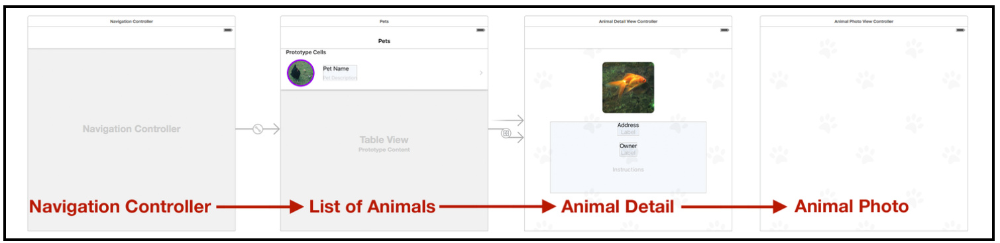

现在还没有任何转场效果，下面我们来添加

### What are segues?

Segue 描述了两个 VC 之间的转换，有四种类型的 segues

+ Show：将一个 VC push 到 navigation controller 上
+ Show Detail：使用 UISplitViewController 时替换一个 detail 场景
+ Present Modally
+ Popover

> 将一个 child VC 嵌入到容器 VC 这种 Relationships 关系虽然也是 segue，但不能自定义

iOS 9 现在可以在上面四种 Segue 类型的基础上加入自定义的选项


### A simple segue

我们先来实现一个简单的 segue，用户点击一张宠物缩略图，model 展示一张大尺寸照片。实现需要分为两个步骤：

+ 设置 segue，`prepareForSegue(_:sender:)` 准备一些 destination VC 需要的数据
+ 执行前往 destination VC 的转场动画，通常使用默认的，但这次我们来定制他

Storyboard 选中 `Animal Detail View Controller` ，往上面的宠物缩略图拖一个 `Tap Gesture Recognizer` ，之后从这个 Tap 手势 Ctrl-drag 拉条线到 `Animal Photo View Controller` 来展示宠物大照片，过渡方式选择 `present modally`

我们命名该 segue 为 PhotoDetail，之后在 `prepareForSegue` 做点准备工作


```swift
override func prepareForSegue(segue: UIStoryboardSegue,
  sender: AnyObject?) {
  if segue.identifier == "PhotoDetail" {
    let controller = segue.destinationViewController
      as! AnimalPhotoViewController
    controller.image = imageView.image
  }
}
```

为了 Dismiss，紧挨上面的方法添加一个 unwind 方法

```swift
@IBAction func unwindToAnimalDetailViewController(
  segue:UIStoryboardSegue) {
  // placeholder for unwind segue
}
```

同样的给 `Animal Photo View Controller` 上的宠物打照片加个 Tap 手势，Ctrl-drag 拉到 `Exit`，选择 `unwindToAnimalDetailViewController:`


运行，点击金鱼小图片，会跳转大图片，再点击大图片，又会回到小图片


现在我们来分析下整个过程，伴随着点击缩略图，一个从 `AnimalDetailViewController` 到 `AnimalPhotoViewController` 的 model segue 初始化，该 segue 保持了 source 和 destination VC 的引用。

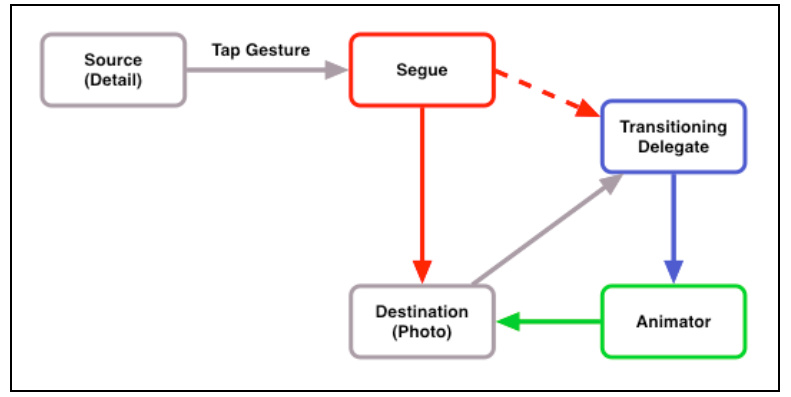

这个 segue 其实在幕后设置了 destination VC 的 `transitioning delegate`，并且根据当前 `size class` 设置了 `presentation`

而 source VC 的 `prepareForSegue(_:sender:)` 主要为 destination VC 准备了所需要的数据

系统过渡到 destination VC 时，destination view controller 会调用他的 transition delegate 来执行动画（默认设置）

以上就是关于 Segue 的一些基本常识

### Your custom segue library

因为 Segue 在整个过渡过程中都是存在的，所以你可以将 UIViewController 中写的过渡代码转移到自定义的 seuges 类中来，segue 可以同时负责 `presentation` 和 `dismissal` 的过渡过程

我们这里已经创建了一个自定义的 seuges 类 DropSegue，在 Storyboard 中的 Segue Class 选择这个自定义类即可


现在运行，你会发现过渡动画效果完全不一样了呢

### Creating a custom segue

看完了上面的，我们来创建一个自己的 segue 来取代 `DropSegue`，这个 segue 的过渡动画采用 Scale transition animation


进行实际操作前，先熟悉下下面几个方法：

+ `UIViewControllerTransitioningDelegate:` 自定义的 segue 部署这个协议来声明一个动画对象用在 presentation 和 dismissal 时
+ `UIViewControllerAnimatedTransitioning:` 上面定义的动画对象部署这个协议来描述动画过程
+ `UIViewControllerContextTransitioning:` 这个 context 包含所有关于 presentingVC 和 presentedVC 以及 views 的细节。你之后会传递给 animator 对象。

在开始前，先来回顾下创建一个 animated segue 的步骤：

1. 创建 `UIStoryboardSegue` 的子类 segue，然后设置为 `destination controller` 的 `transitioning delegate`
2. 创建 presenting 和 dismissing 的 animator classes
3. 定义一个 `animation` 并设置持续时间，将会用在第 2 步的 `animators` 中
4. 构造一个 `segue`，animator 类将会用来 presentation 和 dismissal
5. 最后，在 `storyboard` 中使用这个 `segue`

下面我们逐一来实现

#### 1.Subclass UIStoryboardSegue

创建一个 `UIStoryboardSegue` 的子类 ScaleSegue.swift，用来部署 transitioning delegate 协议，从而指定自定义的转场动画

```swift
class ScaleSegue: UIStoryboardSegue {

  override func perform() {
    // 在执行转场时指定 transitioningDelegate
    destinationViewController.transitioningDelegate = self
    super.perform()
  }
}
```

之前的版本你可能会把 转场动画放进 perform 中，而现在你让 segue 部署 `transitioning delegate` 来解耦

#### 2.Create the animator

现在我们把注意力放在创建一个转场动画上，添加一个 animator class `ScalePresentAnimator` 用来表现一段 modal 动画，dismissal 动画还未设定，先用系统提供的

```swift
class ScalePresentAnimator : NSObject, UIViewControllerAnimatedTransitioning {

}
```

#### 3.Define the animation

实现动画

```swift
class ScalePresentAnimator : NSObject, UIViewControllerAnimatedTransitioning {

  func transitionDuration(
    transitionContext: UIViewControllerContextTransitioning?)
    -> NSTimeInterval {
    return 2.0
  }

  func animateTransition(transitionContext:
    UIViewControllerContextTransitioning) {

    // 1. Get the transition context to- controller and view
    let toViewController = transitionContext
      .viewControllerForKey(
        UITransitionContextToViewControllerKey)!
    let toView = transitionContext
      .viewForKey(UITransitionContextToViewKey)

    // 2. Add the to- view to the transition context
    if let toView = toView {
      transitionContext.containerView()?.addSubview(toView)
    }

    // 3. Set up the initial state for the animation
    toView?.frame = .zero
    toView?.layoutIfNeeded()

    // 4. Perform the animation
    let duration = transitionDuration(transitionContext)
    let finalFrame = transitionContext
      .finalFrameForViewController(toViewController)

    UIView.animateWithDuration(duration, animations: {
      toView?.frame = finalFrame
      toView?.layoutIfNeeded()
    }, completion: {
      finished in
      // 5. Clean up the transition context
      transitionContext.completeTransition(true)
    })
  }
}
```

#### 4.Set the animator in the segue

上面提到以前我们会将动画的实现放在 perform 中，现在我们让 segue 部署 `transitioning delegate` 来解耦

```swift
extension ScaleSegue: UIViewControllerTransitioningDelegate {
  func animationControllerForPresentedController(presented: UIViewController, presentingController presenting: UIViewController, sourceController source: UIViewController) -> UIViewControllerAnimatedTransitioning? {
    return ScalePresentAnimator()
  }

}
```

#### 5.Use the segue in the storyboard

在 Storyboard Segue 选择刚才创建的自定义 segue 就好，Presentation 选择 Form Sheet 是为了在 iPad 上有更好的体验


运行，点击宠物缩略图，无码大图从左上角伸展开来铺满整个屏幕


### Passing data to animators

现在来继续改进，我们希望点击小图后，就在原有位置上小图伸展开来变成大图，而不是从左上角开始出来一个 view。那就需要告诉 animator 对象哪个 view 将会被 scale，最简单的方式是保持一个对 source image view 的引用，但用 Protocols 来实现更好一些

定义一个 Protocol，返回一个可以被 Scale 的 View

```swift
protocol ViewScaleable {
  var scaleView: UIView { get }
}
```

任何使用自定义的 segue 的 VC 都能实现这个 `ViewScaleable` 协议，确定哪个 View 能被 Scale

我们在 `AnimalDetailViewController.swift`（Presenting VC）中实现这一 Protocol

```swift
extension AnimalDetailViewController: ViewScaleable {
  var scaleView: UIView { return imageView }
}
```
表示可以被 Scale 的 view 是 `imageView`，即本例中的金鱼图片

之前的过渡动画没有用到 `fromVC`，而现在从 `fromView` 的位置（即 scaleView）直接展开大图，所以需要在创建 toVC 同时获取到 fromVC

```swift
let fromViewController = transitionContext
  .viewControllerForKey(
    UITransitionContextFromViewControllerKey)!
let fromView = transitionContext
  .viewForKey(UITransitionContextFromViewKey)
```

将之前的从左上角开始 `toView?.frame = .zero` 替代为从 scaleView 的位置开始：

```swift
var startFrame = CGRect.zero
if let fromViewController = fromViewController
  as? ViewScaleable {
    startFrame = fromViewController.scaleView.frame
} else {
  print("Warning: Controller \(fromViewController) does not " +
    "conform to ViewScaleable")
}
toView?.frame = startFrame
```
设置 `toView` 的起始位置为 `scaleView` 的位置

> 因为使用了 ViewScaleable 协议解耦，animator 除了 scaleView 外并不了解关于 source view controller 的信息

再次运行，现在点击是从原始位置放大了


### Working with the view hierarchy

我们之前通过 `transitionContext.viewForKey(_:)` 来获取 toView

```swift
let toView = transitionContext.viewForKey(UITransitionContextToViewKey)
```

或许你会有疑问，为什么不用 PresentedVC（toVC） 的 view 属性直接获取？这是因为 transition context 会基于 size class 处理各种 presentations

在 regular-sized 情形下 modal 视图会以 sheet 的形式展示，并不会铺满整个屏幕。此时我们将屏幕展示的 presentation layer 看做两部分：

+ 暗下去的背景
+ sheet 展示 toVC 的内容

在 compact-sized 情形下 modal 视图会全屏展示，此时没有 presentation layer 存在

结论：在 iPhone 设备上，除了 iPhone 6 Plus 横屏，destination controller（PresentedVC）的 `view` 与 `UITransitionContextToViewKey` 得到的 view 是一致的。而在 iPad 和 iPhone 6 Plus 横屏情形下，destination controller（PresentedVC）被封装在 `presentation layer` 进行展示

from view 也是一样，通过 `transitionContext.viewForKey(UITransitionContextFromViewKey)` 得到的 view 与 source view controller's view 在不同 size class 下也不相同

`compact-sized` 下，二者一样；`regular-sized` 下 `UITransitionContextFromViewKey` 方式得到的 view 会是 nil

最后我们在 `compact-sized` 下也让 fromView 随过渡动画的发生暗淡下去

```swift
UIView.animateWithDuration(duration, animations: {
  toView?.frame = finalFrame
  toView?.layoutIfNeeded()
  fromView?.alpha = 0.0
  }, completion: {
    finished in
    fromView?.alpha = 1.0
    // 5. Clean up the transition context
    transitionContext.completeTransition(true)
})
```

上面 `fromView?.alpha` 仅仅会影响 iPhone，因为在 iPad 上通过 `viewForKey` 得到的 `fromView` 为 nil

### Handling embedded view controllers

在 Main.storyboard 中选中最左边的 Navigation Controller 设回 `Is Initial View Controller`（之前是 `AnimalDetailViewController`）

运行点击缩略图，发现整个过程凌乱了，大图从左上角跑出来了。。。

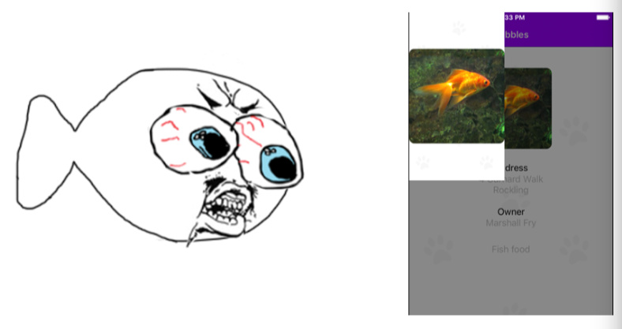


原因很简单，之前 `AnimalDetailViewController` 是 presentingVC，决定哪个 view 可以被 scale，而现在 `AnimalDetailViewController` 被嵌入到 Nav 中，由 Nav 来接管，Nav 并没有实现 `ViewScaleable` 协议，所以不知道哪个 view 会被 scale，也就得不到 fromView 的初始位置。

取到的 `fromViewController` 先做判断，如果是 Nav，再向下取一次 `topViewController`

```swift
var fromViewController = transitionContext
  .viewControllerForKey(
    UITransitionContextFromViewControllerKey)!
if let fromNC = fromViewController as? UINavigationController {
  if let controller = fromNC.topViewController {
    fromViewController = controller
  }
}
```

### Completing the scale segue dismissal

除了注意 fromVC 和 toVC 与之前 Presenting 不同外，还要注意添加到 containerView 中的顺序

```swift
if let fromView = fromView,
  toView = toView {
  transitionContext.containerView()?
    .insertSubview(toView, belowSubview: fromView)
}
```

---

## Chapter 11: UIKit Dynamics

iOS 9 更新了他的物理引擎箱，如增加了重力、磁性领域、非矩形碰撞，和一些额外的附属连接行为。本章的主要着眼点在这些新特性上：

### Getting started

打开 playground，添加下面内容：

```swift
import UIKit
import XCPlayground
let view = UIView(frame: CGRect(x: 0, y: 0,
  width: 600, height: 600))
view.backgroundColor = UIColor.lightTextColor()
XCPShowView("Main View", view: view)
let whiteSquare = UIView(frame: CGRect(x: 100, y: 100,
  width: 100, height: 100))
whiteSquare.backgroundColor = UIColor.whiteColor()
view.addSubview(whiteSquare)
let orangeSquare = UIView(frame: CGRect(x: 400, y: 100,
  width: 100, height: 100))
orangeSquare.backgroundColor = UIColor.orangeColor()
view.addSubview(orangeSquare)
```

添加了两个矩形，一白、一橙

接下来创建 UIDynamicAnimator，该类负责管理所有的物理特性。也可以看做是一种媒介用来协调 `dynamic items`、`subviews`、`dynamic behaviors`、`iOS 物理引擎`。他提供了一个上下文用来计算将要渲染的动画。

```swift
let animator = UIDynamicAnimator(referenceView: view)
```

Dynamic behaviors 封装了某些特定的物理效果，如重力，引力，弹跳效果。Dynamic animators 在动画过程中负责追踪这些 items，你之前传递进去的 referenceView 可以看做是一张施展动画的画布，因此所有要动画的 views 必须是 referenceView 的子类

给橙色矩形加一个自由落体效果

```swift
animator.addBehavior(UIGravityBehavior(items: [orangeSquare]))
```

一运行橙色矩形就掉下去了（出了屏幕），现在来加个底，让他落在底边上

```
let boundaryCollision = UICollisionBehavior(items:
  [whiteSquare, orangeSquare])
boundaryCollision.translatesReferenceBoundsIntoBoundary = true
animator.addBehavior(boundaryCollision)
```

默认的所有 dynamic items 都会有一组行为集合来描述他的重量、下落速度、如何应对碰撞和其他一些物理特性。而这些都是由 `UIDynamicItemBehavior` 来负责描述

我们来设置一下橙色矩形的碰撞效果

```swift
let bounce = UIDynamicItemBehavior(items: [orangeSquare])
bounce.elasticity = 0.6
bounce.density = 200
bounce.resistance = 2
animator.addBehavior(bounce)
```

一个 `dynamic item` 的密度（`density`）和尺寸决定了他的重量，弹力（`Elasticity`）决定了碰撞后的弹跳效果（默认为 0 ），阻力（`Resistance`）也就是摩擦力，可以让 `dynamic item` 在线性运动时停下来

为了更好的观察，开启 debug 模式，现在你能在橙色矩形外看到一个蓝色矩形框（表示碰撞时的边界）

```swift
animator.setValue(true, forKey: "debugEnabled")
```

### Behaviors

下面来学习一下 UIDynamicBehavior 的七个子类

+ UIAttachmentBehavior： 两个 `dynamic items` 连接起来或一个 `dynamic items` 和一个锚点连接在一起
+ UICollisionBehavior： 描述两个 item 接触时产生的效果，可以用来开启 item 边界： `translatesReferenceBoundsIntoBoundary` 设为 ture
+ UIDynamicItemBehavior： dynamic items 的一些物理特性
+ UIFieldBehavior：这个是 iOS 9 新加的，添加了很多物理场行为，包含电场（electric）、磁场（magnetic）、拖拽（dragging）、漩涡（vortex）、辐射（radial）、线性重力（linear gravity）、速率（velocity）、噪声（noise）、涡流（turbulence）、弹簧场（SpringField）
+ UIGravityBehavior：模拟重力效果
+ UIPushBehavior：应用在 `dynamic items` 上的一种力
+ UISnapBehavior：将 `dynamic items` 移动到指定的位置伴随着弹性效果

最后你可以将上面七种行为混合组合使用，简单来说就是先创建一个 parentBehavior（`UIDynamicBehavior`），然后创建上面七个子类中的几个，在通过父类的 addChildBehavior 方法添加到 parentBehavior 中去

来实际例子中玩一下，先给白色矩形加点物理属性：

```swift
let parentBehavior = UIDynamicBehavior()
let viewBehavior = UIDynamicItemBehavior(items: [whiteSquare])
viewBehavior.density = 0.01
viewBehavior.resistance = 10
viewBehavior.friction = 0.0
viewBehavior.allowsRotation = false
parentBehavior.addChildBehavior(viewBehavior)
```

再定义一个弹簧场范围,白色矩形刚好位于其中：

```
let fieldBehavior = UIFieldBehavior.springField()
fieldBehavior.addItem(whiteSquare)
fieldBehavior.position = CGPoint(x: 150, y: 350)
fieldBehavior.region = UIRegion(size: CGSizeMake(500, 500))
parentBehavior.addChildBehavior(fieldBehavior)
```

运行

```swift
animator.addBehavior(parentBehavior)
```

开启了 debug 模式，就是下面展示的效果：


Spring fields 弹簧场可以这么理解，你确定当中某个物体的位置，然后对该物体施加一个力，物体也许会偏离一点点，不过最终会稳定在那一点上，就像被栓了跟弹簧。看得不明显？施加一个向上的力来看看：

```swift
let delayTime = dispatch_time(DISPATCH_TIME_NOW,
  Int64(2 * Double(NSEC_PER_SEC)))
dispatch_after(delayTime, dispatch_get_main_queue()) {
  let pushBehavior = UIPushBehavior(items: [whiteSquare],
    mode: .Instantaneous)
  pushBehavior.pushDirection = CGVector(dx: 0, dy: -1)
  pushBehavior.magnitude = 0.3
  animator.addBehavior(pushBehavior)
}
```

### Applying dynamics to a real app

之前我们都在 playground 里玩，现在我们应用在一个 Real App 上，下面是一个照片浏览应用，主界面 photos 是简单的 collectionView，点进去是一张大图和关于图片的细节信息


我们首先来将目光焦聚在右边大图照片中显示图片细节信息的部分，即照片拍摄的时间、尺寸、和名称。这些信息都显示在一个灰黑色半透明的圆角矩形中。我们来对这个圆角矩形应用一个自定义的 Sticky behavior，即使其变成可拖动的，但无论放置在屏幕的哪个位置，该圆角矩形都会自动慢慢停靠在最上边或最下边的边界上。

### Sticky behavior

```swift
import UIKit

class StickyEdgesBehavior: UIDynamicBehavior {
  private var edgeInset: CGFloat
  private let itemBehavior: UIDynamicItemBehavior
  private let collisionBehavior: UICollisionBehavior
  private let item: UIDynamicItem
  private let fieldBehaviors = [
    UIFieldBehavior.springField(),
    UIFieldBehavior.springField()
  ]

  init(item: UIDynamicItem, edgeInset: CGFloat) {
    self.item = item
    self.edgeInset = edgeInset
    collisionBehavior = UICollisionBehavior(items: [item])
    collisionBehavior.translatesReferenceBoundsIntoBoundary = true
    itemBehavior = UIDynamicItemBehavior(items: [item])
    itemBehavior.density = 0.01
    itemBehavior.resistance = 20
    itemBehavior.friction = 0.0
    itemBehavior.allowsRotation = false
    super.init()
    addChildBehavior(collisionBehavior)
    addChildBehavior(itemBehavior)
    for fieldBehavior in fieldBehaviors {
      fieldBehavior.addItem(item)
      addChildBehavior(fieldBehavior)
    }
  }
}
```

StickyEdgesBehavior 是 `UIDynamicBehavior` 的子类，在这里的作用相当于之前提到的 parentBehavior，我们在该类中设置了 `UIDynamicItemBehavior`、`UICollisionBehavior`、`UIDynamicItem` 以及两个弹簧场 `UIFieldBehavior.springField()`

初始化的时候，我们传入了一个 item（通常是遵循 `UIDynamicItem` 协议的 View）和一个距边界尺寸（edge inset）

```swift
func updateFieldsInBounds(bounds: CGRect) {
//1 确保 bounds 尺寸非零，且提取了长和宽
  guard bounds != CGRect.zero else { return }
  let h = bounds.height
  let w = bounds.width
  let itemHeight = item.bounds.height
//2 更新 field 的中心位置和区域（size）
  func updateRegionForField(field: UIFieldBehavior,
    _ point: CGPoint) {
    let size = CGSize(width: w - 2 * edgeInset,
      height: h - 2 * edgeInset - itemHeight)
    field.position = point
    field.region = UIRegion(size: size)
  }
//3 找出 bounds 上半部分和下半部分的中心点
  let top = CGPoint(x: w / 2, y: edgeInset + itemHeight / 2)
  let bottom = CGPoint(x: w / 2,
    y: h - edgeInset - itemHeight / 2)
//4 更新 fieldBehaviors 中的 UIFieldBehavior.springField()
  updateRegionForField(fieldBehaviors[StickyEdge.Top.rawValue],
    top)
  updateRegionForField(
    fieldBehaviors[StickyEdge.Bottom.rawValue], bottom)
  }
}
```

上面这个方法传入一个 bounds 作为参数，描述了整个弹簧场（UIFieldBehavior.springField()）的范围。在方法内部，又将 bounds 一分为二：划分了上半部分和下半部分两个弹簧场（UIFieldBehavior.springField()）

接下来添加一个计算属性 `isEnabled`，用来在动画过程中关闭 behavior

```swift
var isEnabled = true {
  didSet {
    if isEnabled {
      for fieldBehavior in fieldBehaviors {
        fieldBehavior.addItem(item)
      }
      collisionBehavior.addItem(item)
      itemBehavior.addItem(item)
    } else {
      for fieldBehavior in fieldBehaviors {
        fieldBehavior.removeItem(item)
      }
      collisionBehavior.removeItem(item)
      itemBehavior.removeItem(item)
    }
  }
}
```

最后为 item 增加一个线性速度

```swift
func addLinearVelocity(velocity: CGPoint) {
  itemBehavior.addLinearVelocity(velocity, forItem: item)
}
```

现在 StickyEdgesBehavior 已经定义完毕，我们来使用他。具体方法：回到 FullPhotoViewController.swift，即展示大图的 VC 为 照片细节部分 tagView（黑色矩形框）添加一个手势

添加下面的一些属性：

```swift
private var animator: UIDynamicAnimator!
var stickyBehavior: StickyEdgesBehavior!
private var offset = CGPoint.zero
```

在 viewDidload() 中做些初始配置：

```swift
let gestureRecognizer = UIPanGestureRecognizer(target: self,
  action: "pan:")
tagView.addGestureRecognizer(gestureRecognizer)
animator = UIDynamicAnimator(referenceView: containerView)
stickyBehavior = StickyEdgesBehavior(item: tagView,
  edgeInset: 8)
animator.addBehavior(stickyBehavior)
```

为 tagView 上面添加了一个手势，stickyBehavior 也加在了 tagView 上。接着添加 layoutSubviews 方法，当 main view 的 layout 发生改变时，sticky behavior 会自动调整 bounds（例如旋转发生时）

```swift
override func viewDidLayoutSubviews() {
  super.viewDidLayoutSubviews()
  stickyBehavior.isEnabled = false
  stickyBehavior.updateFieldsInBounds(containerView.bounds)
}
```

最后来实现 `pan:` 手势

```swift
func pan(pan:UIPanGestureRecognizer) {
  var location = pan.locationInView(containerView)
  switch pan.state {
  case .Began:
    let center = tagView.center
    offset.x = location.x - center.x
    offset.y = location.y - center.y
    stickyBehavior.isEnabled = false
  case .Changed:
    let referenceBounds = containerView.bounds
    let referenceWidth = referenceBounds.width
    let referenceHeight = referenceBounds.height
    let itemBounds = tagView.bounds
    let itemHalfWidth = itemBounds.width / 2.0
    let itemHalfHeight = itemBounds.height / 2.0
    location.x -= offset.x
    location.y -= offset.y
    location.x = max(itemHalfWidth, location.x)
    location.x = min(referenceWidth - itemHalfWidth, location.x)
    location.y = max(itemHalfHeight, location.y)
    location.y = min(referenceHeight - itemHalfHeight, location.y)
    tagView.center = location
  case .Cancelled, .Ended:
    let velocity = pan.velocityInView(containerView)
    stickyBehavior.isEnabled = true
    stickyBehavior.addLinearVelocity(velocity)
  default: ()
  }
}
```

当 pan gesture 开始时，sticky behavior 将会被关掉，接着他会记录用户手势移动的偏移量 offset，在 .Changed case 中根据 offset 来实时更新 metadata view 的位置，并保证 metadata view 不会超出 container view 的范围。在手势结束或取消时，再开启 sticky behavior，此时你会发现 metadata view （tagView）会先判断在上下半场哪个半场，然后再根据上下弹簧场的各自特性（上面的向上运动，下面的向下运动）自行移动到相应位置。

最后在 viewDidload 里开启 debug 模式运行看一下：

```swift
animator.setValue(true, forKey: "debugEnabled")
```

### Full photo with a thud

现在回到 collectionView 上的照片集合界面，点击其中任意一张照片，一张大图从天匀速而降，让我们来加入点自由落体和弹性效果。

实现起来也很简单，在 PhotosCollectionViewController.swift 中增加一个 `UIDynamicAnimator`，然后创建一些 `UIDynamicBehavior` 加进去

创建 `UIDynamicAnimator`

```swift
var animator: UIDynamicAnimator!
```

随后在 `viewDidLoad()` 中初始化

```swift
animator = UIDynamicAnimator(referenceView: self.view)
```

创建 UIGravityBehavior、UICollisionBehavior，以及为 item 增加点物理特性（UIDynamicItemBehavior）。最后将这些 behavior 统统添加到 animator 中来

```swift
func showFullImageView(index: Int) {
  //1 将 fullPhotoView 向上移出屏幕
  fullPhotoViewController.photoPair = photoData[index]
  fullPhotoView.center = CGPoint(x: fullPhotoView.center.x,
    y: fullPhotoView.frame.height / -2)
  fullPhotoView.hidden = false

  //2 先清空 animator 再添加 behaviors
  animator.removeAllBehaviors()

  let dynamicItemBehavior = UIDynamicItemBehavior(items:
    [fullPhotoView])
  dynamicItemBehavior.elasticity = 0.2
  dynamicItemBehavior.density = 400
  animator.addBehavior(dynamicItemBehavior)

  let gravityBehavior = UIGravityBehavior(items:
    [fullPhotoView])
  gravityBehavior.magnitude = 5.0
  animator.addBehavior(gravityBehavior)

  let collisionBehavior = UICollisionBehavior(items:
    [fullPhotoView])
  let left = CGPoint(x: 0, y: fullPhotoView.frame.height + 1.5)
  let right = CGPoint(x: fullPhotoView.frame.width,
    y: fullPhotoView.frame.height + 1.5)
  collisionBehavior.addBoundaryWithIdentifier("bottom",
    fromPoint: left, toPoint: right)
  animator.addBehavior(collisionBehavior)

  //3 执行动画，动画完成时添加 barButton（Done）
  UIView.animateWithDuration(0.5, animations:
      { () -> Void in
        self.fullPhotoView.center = self.view.center
      }, completion: {
        (completed: Bool) -> Void in
        let doneButton = UIBarButtonItem(barButtonSystemItem: UIBarButtonSystemItem.Done,
          target: self, action: "dismissFullPhoto:")
        self.navigationItem.rightBarButtonItem = doneButton
      })
}
```

> 注意我们在底部从 left 到 right 创建了一条线 `collisionBehavior.addBoundaryWithIdentifier("bottom",
      fromPoint: left, toPoint: right)` 这条线稍微比 view 的下边界还要偏下一点

---

## Chapter 12: Contacts

在 iOS 9 之前，开发者只能使用 C API 来访问 iOS 设备上的通讯录，随着 iOS 9 的推出，Apple 彻底废除了之前的做法，介绍了两种全新的面向对象的高级框架来管理用户通讯录（Contacts 和 ContactsUI）

本章将展示如何使用这两个框架：

1. 使用 ContactsUI 框架显示和选择联系人
2. 添加联系人到用户的通讯录中
3. 搜索用户通讯录并使用 NSPredicate 来过滤

### Getting started

本章的 Start Demo 也很简单，主界面是一个 `tableView` ，每行 cell 显示一个联系人信息，包括：联系人头像、名字、邮箱地址

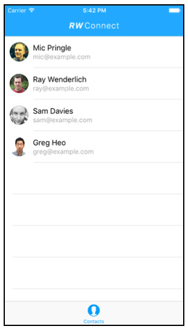

App 初始化的时候会提供几个联系人的信息以供显示，下面来完成我们的第一个任务：使用 `ContactsUI` 框架来显示联系人的详细细节信息。

App 的主要类：

+ FriendsViewController.swift UITableViewController 类
+ Friend.swift Model 类，代表每个联系人
+ FriendCell.swift 管理着每个 cell 的显示效果

### Displaying a contact

第一步为 cell 加一个 `Disclosure Indicator`，新增的标识告诉用户可点击进入详情页面

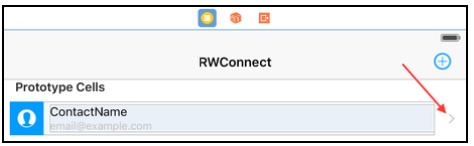

在显示用户详细信息之前，我们需要将 Friend 实例转换成一个 CNContact

### Convert friends to CNContacts

Contacts 框架将每个联系人看做是 `CNContact` 类的一个实例，包含了很多联系人属性，如 `givenName`、`familyName`、`emailAddresses`、`imageData` 等

现在来做转换，在 Friend.swift 中 `import Contacts`，添加一个 `extension`

```swift
extension Friend {
  var contactValue: CNContact {
// 1
    let contact = CNMutableContact()
    // 2
    contact.givenName = firstName
    contact.familyName = lastName
    // 3
    contact.emailAddresses = [
      CNLabeledValue(label: CNLabelWork, value: workEmail)
    ]
// 4
    if let profilePicture = profilePicture {
      let imageData =
        UIImageJPEGRepresentation(profilePicture, 1)
      contact.imageData = imageData
}
// 5
    return contact.copy() as! CNContact
  }
}
```

首先创建了一个 CNMutableContact 实例（CNContact 的可变子类），接着更新了相关属性（从 Friend 结构体之前定义的常量中获取相关属性）。emailAddresses 是一个 `CNLabeledValue` 对象的数组，意味着每个 email 都对应着一个标签 label，有许多这样的标记，暂且这里设定为 `CNLabelWork`。最后我们返回一个不可变的拷贝对象（`CNContact`）

> `CNContact` 是线程安全的，而 `CNMutableContact` 不是

### Showing the contact's information

接着实现点击联系人列表进入详情页面，在 FriendsViewController.swift 中导入

```swift
import Contacts
import ContactsUI
```

添加 `UITableViewDelegate` 方法：

```swift
//MARK: UITableViewDelegate
extension FriendsViewController {
  override func tableView(tableView: UITableView,
    didSelectRowAtIndexPath indexPath: NSIndexPath) {
      tableView.deselectRowAtIndexPath(indexPath,
        animated: true)
      // 1
      let friend = friendsList[indexPath.row]
      let contact = friend.contactValue
      // 2
      let contactViewController =
        CNContactViewController(forUnknownContact: contact)
      contactViewController.navigationItem.title = "Profile"
      contactViewController.hidesBottomBarWhenPushed = true
      // 3
      contactViewController.allowsEditing = false
      contactViewController.allowsActions = false
      // 4
      navigationController?.pushViewController
        (contactViewController, animated: true)
  }
}
```

观察注释 2 ，实例化了一个 `CNContactViewController`，这是 ContactsUI 框架用来展示联系人信息用的。这里用到了 `forUnknownContact` 来初始化是因为该联系人并不存在于 iOS 的通讯录中，随后通过 `contactViewController` 的相关属性对 navigation bar 和 tab bar 做了些配置

运行，选中某个 cell，`ContactsUI` 框架会展示选中联系人的信息：


如果我们要添加更多的好友，可以使用 `ContactsUI` 类中的 `CNContactPickerViewController` 来让用户从联系人中选择添加到 App

### Picking your friends

我们在 SB 中给 `FriendsViewController` 加一个 AddButton（`UIBarButtonItem`）

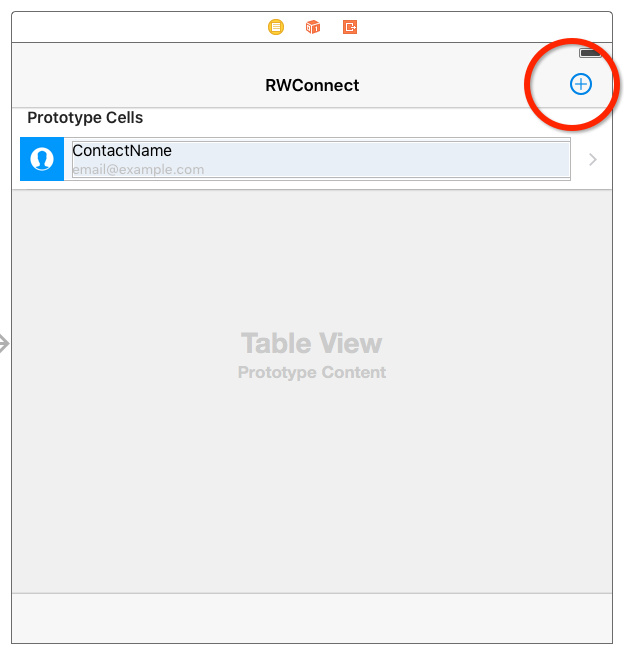

为这个 AddButton 创建一个关联（target-action）的方法

```swift
@IBAction func addFriends(sender: UIBarButtonItem) {
  let contactPicker = CNContactPickerViewController()
  presentViewController(contactPicker, animated: true, completion: nil)
}
```

现在点击 AddButton 会展示一个 `CNContactPickerViewController`，此时如果你选中任意一个联系人，只会将你带到详情页面，并不能将选中的联系人添加回主页面列表


要解决这个问题，需要利用到 `CNContactPickerDelegate`

### Conforming to CNContactPickerDelegate

`CNContactPickerDelegate` 有五个可选方法，目前我们只对 `contactPicker(_:didSelectContacts:)` 感兴趣，当你实现了该方法，`CNContactPickerViewController` 就会知道你想要支持多选中，下面让我们来实现下

```swift
extension FriendsViewController: CNContactPickerDelegate {
  func contactPicker(picker: CNContactPickerViewController,
    didSelectContacts contacts: [CNContact]) {
    // TODO
  }
}
```

最后一个参数 `contacts`，存储着选中的多个联系人信息（`CNContact` 数组）。回顾一下， 在 `FriendsViewController` 中我们使用的数据源是数组：`friendsList`（`[Friend]`）。所以这里转换一下，将 [CNContact] -> [Friend]，我们将这种转换放到 model 中来实现

为 `Friend` 再添加一个初始方法，可通过传入一个 `CNContact` 来初始化一个 `Friend`

```swift
init(contact: CNContact){
  firstName = contact.givenName
  lastName = contact.familyName
  workEmail = contact.emailAddresses.first!.value as! String
  if let imageData = contact.imageData{
    profilePicture = UIImage(data: imageData)
  } else {
    profilePicture = nil
  }
}
```

`contact.emailAddresses.first!` 代表一个 `CNLabeledValue `对象，所以通过 `.value` 来提取具体的值。

有了 [CNContact] -> [Friend] 转换方法，我们来实现这个代理方法：

```swift
extension FriendsViewController: CNContactPickerDelegate {
  func contactPicker(picker: CNContactPickerViewController,
    didSelectContacts contacts: [CNContact]) {
    let newFriends = contacts.map { Friend(contact: $0) }
    for friend in newFriends {
       if !friendsList.contains(friend){
         friendsList.append(friend)
        }
    }
    tableView.reloadData()
  }
}
```

将选中的 `[CNContact]` 转化成 `[Friend]`，再填加到数据源数组 `friendsList` 中

最后别忘了在 addFriends 方法中设置 delegate

```swift
contactPicker.delegate = self
```

运行，现在可以选中多个联系人了


选择完毕后按 Done，添加了几个朋友回到了主界面

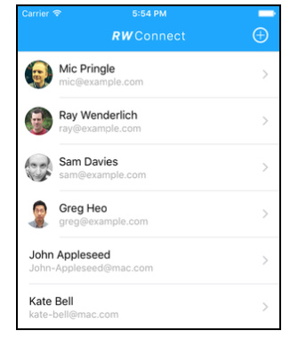

注意这里有个问题！如果你选中的联系人没有 email，那么 App 会崩溃掉，这是因为之前我们在 Friend 的初始化方法 `init(contact:)` 中对 email 地址使用了强制解包，没有 email 的 contact 就会崩溃。

有没有办法只允许用户选择存在 email 的联系人呢？当然可以，在 `presentViewController(_:animated:completion:):` 之前先筛选一下子呗：

```swift
contactPicker.predicateForEnablingContact = NSPredicate(format: "emailAddresses.@count > 0")
```

属性 `predicateForEnablingContact` 让你决定筛选哪些联系人可以被选定，这里我们限定了 email 不为空

现在运行，单击添加按钮，你会看到 email 不存在的联系人都变灰色了（不可选中状态）


现在你可以很自然地从通讯录中创建好友了

### Saving friends to the user's contacts

接下来我们实现：当用户在 table view cell 上向左滑动，会显示一个 Create Contact 操作按钮来将当前对应的联系人添加到系统通讯录中

先来实现 UI 层面上效果，在 FriendsViewController.swift 的 delegate 中添加：

```swift
override func tableView(tableView: UITableView,
  editActionsForRowAtIndexPath indexPath: NSIndexPath)
  -> [UITableViewRowAction]? {
  let createContact = UITableViewRowAction(style: .Normal,
    title: "Create Contact") { rowAction, indexPath in
    tableView.setEditing(false, animated: true)
    // TODO: Add the contact
  }
  createContact.backgroundColor = BlueColor
  return [createContact]
}
```

上面的代码创建了一个名称为 Create Contact 的 row action，背景是蓝色的

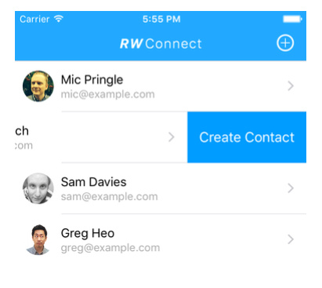

在你访问或修改用户通讯录之前，最重要的事情是记得先向用户申请权限，Contacts 框架里已经内建了权限功能，你不能在没有授权的情况下访问或修改通讯录

> 之前我们使用 CNContactPickerViewController 时并没有向用户鉴权，是因为使用 CNContactPickerViewController 的时候，你的 App 并不直接参与访问或修改通讯录。

### Asking for permission

我们来完善上面的代码，在 TODO 的地方申请通讯录权限：

```swift
override func tableView(tableView: UITableView,
  editActionsForRowAtIndexPath indexPath: NSIndexPath)
  -> [UITableViewRowAction]? {
  let createContact = UITableViewRowAction(style: .Normal,
    title: "Create Contact") { rowAction, indexPath in
    // 将系统默认的左滑删除关掉了
    tableView.setEditing(false, animated: true)
    // 申请通讯录权限
    let contactStore = CNContactStore()
    contactStore.requestAccessForEntityType(CNEntityType.Contacts) {
      userGrantedAccess, _ in
      guard userGrantedAccess else {
        self.presentPermissionErrorAlert()
        return
      }
    }
  }
  createContact.backgroundColor = BlueColor
  return [createContact]
}
```

在上面的代码中，我们首先创建了 `CNContactStore` 的实例，表示用户的通讯录，接着通过 `requestAccessForEntityType(:completion:)` 来向用户申请权限，而用户最终的反馈结果将以 completion handler 闭包的形式通过一个 Bool 参数 `userGrantedAccess` 传回来。最后为了更好的用户体验，当 `userGrantedAccess` 为 NO 的时候，我们会弹一个 Alert 说明理由，并引导用户去 Setting 里重新分配权限。

关于 `presentPermissionErrorAlert` ：

```swift
func presentPermissionErrorAlert() {
  dispatch_async(dispatch_get_main_queue()) {
    let alert =
      UIAlertController(title: "Could Not Save Contact",
        message: "How am I supposed to add the contact if " +
        "you didn't give me permission?",
        preferredStyle: .Alert)

    let openSettingsAction = UIAlertAction(title: "Settings",
      style: .Default, handler: { alert in
        UIApplication.sharedApplication()
          .openURL(
            NSURL(string: UIApplicationOpenSettingsURLString)!)
    })

    let dismissAction = UIAlertAction(title: "OK",
      style: .Cancel, handler: nil)

    alert.addAction(openSettingsAction)
    alert.addAction(dismissAction)
    self.presentViewController(alert, animated: true,
      completion: nil)
  }
}
```

这里我们使用了 `dispatch_async(dispatch_get_main_queue())` 是因为 `requestAccessForEntityType(:completion:)` 的 completion handler 会在后台线程中执行，因此弹窗这种 UI 操作还是要回主线程

弹窗的第一个 UIAlertAction 使用 `UIApplicationOpenSettingsURLString` key 来打开 Settings

运行一下，左滑 cell 选择 Create Contact 创建联系人，弹出


选择 Don't Allow，guard 判断并执行一个弹窗操作，引导用户去 Setting 里授权


按下 Setting，弹窗将会把你呆到 Settings 界面


### Saving friends to contacts

下面处理授权通过的情况下如何将好友保存到通讯录

```swift
func saveFriendToContacts(friend: Friend) {
  // 1
  let contact = friend.contactValue.mutableCopy()
    as! CNMutableContact
  // 2
  let saveRequest = CNSaveRequest()
  // 3
  saveRequest.addContact(contact,
    toContainerWithIdentifier: nil)
  do {
    // 4
    let contactStore = CNContactStore()
    try contactStore.executeSaveRequest(saveRequest)
    // Show Success Alert
    dispatch_async(dispatch_get_main_queue()) {
      let successAlert = UIAlertController(title: "Contacts Saved",
        message: nil, preferredStyle: .Alert)
      successAlert.addAction(UIAlertAction(title: "OK",
        style: .Cancel, handler: nil))
      self.presentViewController(successAlert, animated: true,
        completion: nil)
      }
  } catch {
    // Show Failure Alert
    dispatch_async(dispatch_get_main_queue()) {
      let failureAlert = UIAlertController(
        title: "Could Not Save Contact",
        message: "An unknown error occurred.",
        preferredStyle: .Alert)
      failureAlert.addAction(UIAlertAction(title: "OK",
        style: .Cancel, handler: nil))
      self.presentViewController(failureAlert, animated: true,
        completion: nil)
    }
  }
}
```

因为 `addContact:toContainerWithIdentifier:` 需要一个 `CNMutableContact` 作为参数，所以第一步先做个转换；第二步创建了 `CNSaveRequest` 对象，我们利用该对象来传递增加、更新或删除联系人等操作信息给通讯录（`CNContactStore`）；第三步告诉 `CNSaveRequest` 你想要增加一个联系人到通讯录中；最后执行保存操作

> 无论 `contactStore.executeSaveRequest(saveRequest)` 成功还是失败，都会弹窗提醒用户

回到 `tableView(_:editActionsForRowAtIndexPath:)` 在 guard block 后保存当前索引对应的 friend

```swift
let friend = self.friendsList[indexPath.row]
self.saveFriendToContacts(friend)
```

重置模拟器运行，现在你可以左划 cell 将当前联系人添加到系统通讯录中了

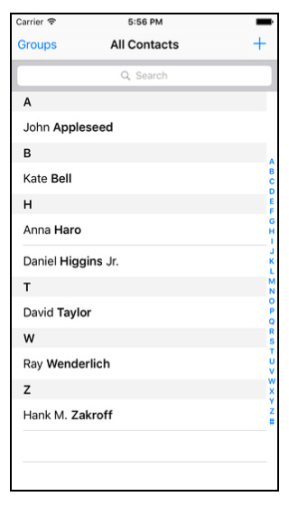

细心的童鞋或许已经发现：可以重复添加联系人到通讯录中，下面来修正：

### Checking for existing contacts

为了去重，我们在保存联系人之前先判断一下，在 `saveFriendToContacts(_:):` 一开始添加

```swift
//1
let contactFormatter = CNContactFormatter()
//2
let contactName = contactFormatter
  .stringFromContact(friend.contactValue)!
//3
let predicateForMatchingName = CNContact
  .predicateForContactsMatchingName(contactName)
//4
let matchingContacts = try! CNContactStore()
  .unifiedContactsMatchingPredicate(predicateForMatchingName,
    keysToFetch: [])
//4
guard matchingContacts.isEmpty else {
  dispatch_async(dispatch_get_main_queue()) {
    let alert = UIAlertController(
      title: "Contact Already Exists", message: nil,
      preferredStyle: .Alert)
    alert.addAction(UIAlertAction(title: "OK", style: .Cancel,
      handler: nil))
    self.presentViewController(alert, animated: true,
      completion: nil)
  }
  return
}
```

1. `CNContactFormatter` 根据本机环境（通讯录）来定义联系人的样式，有点类似于 `NSDateFormatter` 做的事情
2. 使用这种 formatter 来得到一个联系人的姓名
3. 用上面获得的联系人姓名创建一个谓词
4. 利用这个谓词来获取所有匹配姓名的联系人，注意这一步返回的是一个 `[CNContact]` 数组
5. 判断一下，如果有重复的联系人就给用户弹个警告窗，直接返回了

> 在 `unifiedContactsMatchingPredicate(_:keysToFetch:)` 方法中，我们为参数 keysToFetch 传入了一个空数组，因为当时我们并不需要访问或修改获取到的联系人。但是假如要访问获取到的联系人 first name，你就要添加 `CNContactGivenNameKey` 到 `keysToFetch` 数组中去。

---

## Chapter 13: Testing

这几年 Apple 在 iOS 测试上改进不少，越来越简单快捷了：

+ Xcode 5 苹果推出了 XCTest 框架的第一个版本，相较上一版 SenTestingKit 增加了很多现代化的实现
+ Xcode 6 增加了异步 asynchronous 和性能 performance 测试
+ 今年随着 Xcode 7 面世 Apple 又推出了 code coverage reports（测试覆盖率报告）和 UI testing

关于测试我之前专门写过两篇文章详述，具体可以看这里： [Unit Testing for iOS Part Ⅰ](http://chengway.in/unit-testing-for-ios-part-i/)，[Unit Testing for iOS Part Ⅱ](http://chengway.in/unit-testing-for-ios-part-ii/)

本章就挑摘要记录下，不做具体的深入了

### Code coverage

开启代码覆盖率可以让你知道整个工程当前的测试情况，开启很简单：在 Product\Scheme\Edit Scheme... 下选择 Test，勾选 Code Coverage — Gather coverage data 就 OK 了


运行测试，在 Xcode 左侧导航栏切换到 report navigator，点击 test action

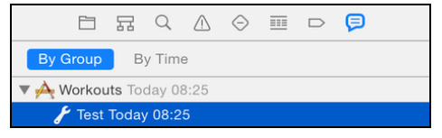

切换到 Coverage tab，你就能看到测试覆盖率报告了


这个报告展示了基于当前文件的方法测试覆盖情况，你甚至可以进入单独的类中去查看单个方法被测试的次数


### @testable imports and access control

通常我们在 test target 中要测试 model 的时候，都要先导入相应的 module，这是因为你的 app 和 test bundle 一般是分离的，但仅仅这样做还不够。

这涉及到了访问控制的概念，通常很多语言都会对从一个代码区块访问另一个代码区块做出限制， Swift 也不例外，在 Swift 中这种访问控制模式基于 modules 和 source files 的概念。

一个 module 是一个独立的代码分发单元，这可以是一个应用或一个框架，在本例子中，所有在 Workouts app 里的源代码是一个 module，而所有在 testing bundle 中代码是另外一个独立的 module；而一个 source file 是 module 中的一个 Swift 源代码文件，比如 Workout.swift

Swift 提供了三种等级的访问控制：

1. Public access 本权限下的实例允许任意 module 的代码访问
2. Internal access 本权限的实例仅允许同一 module 的代码访问
3. Private access 本权限的实例仅允许在当前 source file 中使用

默认的是 internal，所以想要从 test bundle 访问 app 中的实例是不可能的（因为跨了 module），全部设为 Public 又不现实，苹果审时度势在 Swift 2.0 推出了 @testable，可以让 internal 在 test bundle 中访问到

现在你只需要在 DataModelTests.swift 中将

```
import Workouts

替换为：

@testable import Workouts
```

> @testable 对 Private access 不起作用

### UI testing

如果你的工程是用 Xcode 7 之前版本创建的，那么在写 UI test 之前先要添加 `UI testing target`

### Run your first UI test

第一步将我们要测试的 View 先标记出来

```swift
override func viewDidLoad() {
  super.viewDidLoad()
  tableView.accessibilityIdentifier = "Workouts Table"
}
```

然后来写我们的 UI 测试方法

```swift
func testRaysFullBodyWorkout() {
  let app = XCUIApplication()
  // 1 得到所有的 table
  let tableQuery = app.descendantsMatchingType(.Table)
  // 2 找出之前标记为 "WorkoutsTable" 的 table
  let workoutTable = tableQuery["Workouts Table"]
  let cellQuery = workoutTable.childrenMatchingType(.Cell)
  let identifier = "Ray's Full Body Workout"
  let workoutQuery = cellQuery
    .containingType(.StaticText, identifier: identifier)
  let workoutCell = workoutQuery.element
  workoutCell.tap()
  // 3 模拟一些点按操作
  let navBarQuery = app.descendantsMatchingType(.NavigationBar)
  let navBar = navBarQuery[identifier]
  let buttonQuery = navBar.descendantsMatchingType(.Button)
  let backButton = buttonQuery["Workouts"]
  backButton.tap()
}
```

当运行测试的时候，你会发现模拟器会自动启动并模拟整个操作过程。你也许又会问为什么没有 `assertions`，因为如果界面上某个 UI 元素不存在，测试就会失败。所以执行 UI test 其实暗含了 `asserts`

#### UI test classes

在 UI testing 中主要有这三种独立的类

+ XCUIApplication 表示代理当前 App
+ XCUIElement 表示代理当前 UI 元素
+ XCUIElementQuery 用做查询
	+ `descendantsMatchingType(_:)`
	+ `childrenMatchingType(:_)`
	+ `containingType(_:)`

> 记住 `XCUIApplication` 和 `XCUIElement` 都仅仅是 proxies（代理人），并不是真正的 UI 对象

#### UI testing convenience methods

现在添加另一个测试，在具体某一项 Workout 详情页面，滚动到底部，点击 Select & Workout 按钮，此时会弹一个警告框，我们点 OK 来 dismiss 掉，最后返回到之前的 list 界面 同样是在 `viewDidLoad()` 中先标记 detail 页面的 table

```swift
tableView.accessibilityIdentifier = "Workout Detail Table"

func testRaysFullBodyWorkout() {
  let app = XCUIApplication()
  //1
  let identifier = "Ray's Full Body Workout"
  let workoutQuery = app.tables.cells
    .containingType(.StaticText, identifier: identifier)
  workoutQuery.element.tap()
  //2
  app.tables["Workout Detail Table"].swipeUp()
  app.tables.buttons["Select & Workout"].tap()
  app.alerts.buttons["OK"].tap()
  //3
  app.buttons["Workouts"].tap()
}
```

1. 获取到所有 cells，然后根据 identifier 筛选出来对应的 cell，点击进入详情页面
2. 向上滚动 table，找到 Select & Workout 按钮点击，弹出的对话框点 OK
3. 最后点击 navigation bar 上的 Workouts 按钮返回到 list 主页面

运行测试，失败了...


一般有三种方式向下查找到需要的 UI 元素

1. 如果你有一个唯一的标识可以使用下标，`buttonsQuery["OK"]`
2. 使用索引 `tables.cells.elementAtIndex(0)`
3. 如果能确保查询到只有一个元素，可以使用 XCUIElementQuery 的 element 属性

如果使用以上三种方法最后找到多个 `XCUIElement`，那么测试就会失败，这是因为 UI testing framework 不知道你到底想要与哪个 UI 元素进行交互。

而上面的测试失败是因为下面这行找到了两个以 Workouts 命名的按钮

```swift
app.buttons["Workouts"]
```


注意黄圈圈出来的 Button，修正也很简单，指明我们要点击的按钮是导航栏上的 Workouts 就好

```swift
app.navigationBars.buttons["Workouts"].tap()
```

### UI recording

这个比较简单，新建一个空白的测试方法，光标移到方法内部起始位置，点击红色的 Record UI Test 小圆点会启动模拟器，此时你在模拟器上的操作会被 Xcode 记录下来转换成操作代码，也就是上一步写过的那些代码。


---

## Chapter 14 Location and Mapping

尽管 iOS 的地图服务被大家广为诟病，但 Apple 每年都会持续改进，iOS 9 也不例外，MapKit 和 Core Location 迎来一大波更新。

其中最有用的一个改进就是在地图上增加了行程导航，本章将学习这些新特性：

+ 自定义地图外观的新方法
+ 行程导航
+ 估计行程的时间
+ 使用 Core Location 进行单个位置更新

这一章，Café Transit 的示例应用程序是为所有的咖啡爱好者开发的。它可以帮助你寻找那些称赞的咖啡。目前，它只显示附近的的一小撮咖啡馆。而当你完成了这一章，App 会显示大量的有用的信息，包括每个咖啡店，评级，定价信息和开放时间。还会提供到指定咖啡店的行程导航信息，以及告诉你什么时候出发和什么时候到达。

### Getting started

熟悉下 Demo 程序


+ ViewController.swift
	+ setupMap() 设置地图并限定显示区域
	+ addMapData() 从 model 中载入地图注释信息
+ CoffeeShop.swift 咖啡馆的 model 信息，并负责从 plist 载入信息
+ CoffeeShopPinDetailView.swift 和 CoffeeShopPinDetailView.xib 负责表示自定义的注释，该注释将会显示评分、价格信息和营业时间

### Customizing maps

iOS 9 之前你只能通过编程的方式开启/关闭地图上的特定建筑物。iOS 9 介绍了三个新的 Boolen 属性，让你开启/关闭地图上的 compass-罗盘, scale bar-比例尺，traffic-交通流量

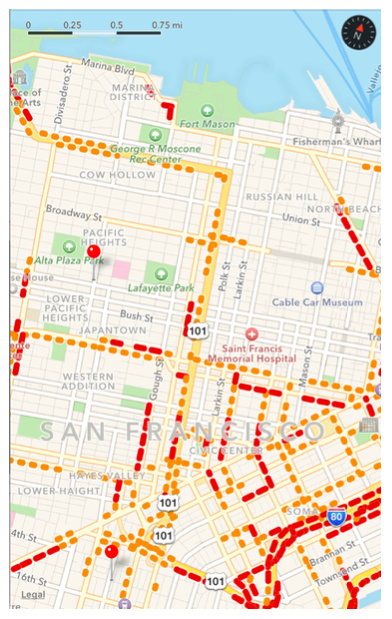


我们可以为 Café Transit 开启比例尺，在 setupMap() 里开启

```swift
mapView.showsScale = true
```


随着对地图的缩放，比例尺也会跟着变化

### Customizing map pins

在 iOS 9 中，苹果用 pinTintColor 替代了 pincolor，新的属性允许你将标记大头针设置成自己喜欢的颜色了（原属性只能设红、绿、紫三种颜色）

我们来将五星评价的餐厅在地图上设为黄色，其余的设为棕色

```swift
if annotation.coffeeshop.rating.value == 5 {
  annotationView!.pinTintColor =
    UIColor(red:1, green:0.79, blue:0, alpha:1)
} else {
  annotationView!.pinTintColor =
    UIColor(red:0.419, green:0.266, blue:0.215, alpha:1)
}
```

### Customizing annotation callouts

咖啡馆在地图上以大头针形式标注，且当你点击大头针 `annotation view` 时，会显示一个标注信息 callout，展示关于该咖啡馆的额外的信息


在 iOS 9 之前，你想要在 annotation view 里添加一个自定义 View 并不是一件容易的事情。但现在 iOS 9 让事情变得简单了。`MKAnnotationView` 现在有一个新属性 `detailCalloutAccessoryView` 来展示这个 callouts，并且该 View 并没什么限制。

### Managing callout size

Callouts 将根据你的自定义视图的大小来调整自己的尺寸。你的自定义 callouts 可以利用下面两种方式：

+ 在你的自定义视图中使用 Auto Layout 来布局
+ 你可以覆盖 intrinsicContentSize 来定制你需要的尺寸

这里用了 CoffeeShopPinDetailView.XIB 来设计自定义的 Callout，在 XIB 中我们使用 `UIStackView` 和 `Auto Layout` 来布局

自定义的 callouts 并不会铺满整个标注信息视图，他会显示一个标题和四周留白：


> 没办法修改标题和四周的留白区域

### Adding a custom callout accessory view

理论学习完了，现在我们来添加自定义的 callout，UI 已经在 `CoffeeShopPinDetailView.xib` 中设计好了


打开 ViewController.swift 在 `mapView(_:viewForAnnotation:)` 里加入下面的方法：

```swift
let detailView = UIView.loadFromNibNamed(identifier) as!
  CoffeeShopPinDetailView
detailView.coffeeShop = annotation.coffeeshop
annotationView!.detailCalloutAccessoryView = detailView
```

首先从 XIB 文件中载入 `CoffeeShopPinDetailView`，然后为其分配当前的 `coffeeshop`，最后设置 view 的 `detailCalloutAccessoryView` 属性即可。


> 点击 Yelp 按钮会打开 Safari 将你带到该咖啡店在 Yelp 的评价主页，但时钟按钮现在还点不了，稍后我们来实现

### Supporting time zones

我们上面添加的 callouts 包含一个标识，指示当前咖啡馆是否正在营业：


```swift
static var timeZone = NSTimeZone(abbreviation: "PST")!

/// Calculates whether a coffee shop is currently open for business
var isOpenNow: Bool {
    let calendar = NSCalendar.currentCalendar()
    let nowComponents = calendar.componentsInTimeZone(CoffeeShop.timeZone, fromDate: NSDate())
    ...
```

isOpenNow 是个计算属性，用来标识当前营业状态。这里使用了 NSDate() 得到当前时间，并转换成咖啡馆所在时区的时间，以此来判断咖啡馆现在是否开始营业了。

很简单不是吗？但我们观察这一句：

```swift
static var timeZone = NSTimeZone(abbreviation: "PST")!
```

这里硬编码了时区 PST，虽然我们的 APP 只包含了三藩的咖啡馆，但如果能根据地理位置自动推断出对应的时区时间岂不是更赞！

iOS 9 为 `MKMapItem` 和 `CLPlacemark` 添加了 `timeZone` 属性，我们利用该属性来得到符合当前地理位置的正确时间。

```swift
static func allCoffeeShops() -> [CoffeeShop] {
    guard let path = NSBundle.mainBundle().pathForResource("sanfrancisco_coffeeshops", ofType: "plist"),
      let array = NSArray(contentsOfFile: path) as? [[String : AnyObject]] else {
        return [CoffeeShop]()
    }

    // 1
    let shops = array.flatMap { CoffeeShop(dictionary: $0) }
      .sort { $0.name < $1.name }
    // 2
    let first = shops.first!
    let location = CLLocation(latitude: first.location.latitude,
      longitude: first.location.longitude)
    // 3
    let geocoder = CLGeocoder()
    geocoder.reverseGeocodeLocation(location) { (placemarks, _) in
      if let placemark = placemarks?.first, timeZone =
      placemark.timeZone {
      self.timeZone = timeZone
      }
    }
    return shops
  }
```

1. 根据 plist 文件得到所有的咖啡馆
2. 找出第一个咖啡馆的地理位置：经纬度
3. 将经纬度转码成地理信息，在回调闭包得到 timeZone ，并设置为咖啡馆（CoffeeShop）的 timeZone

现在运行，你会发现每个咖啡馆会基于旧金山时间来显示是否营业，而不是你当地的时间。

> 在实际项目中，你需要判断每个咖啡馆的地理位置，因为他们可能分布在不同时区

### Simulating your location

我们当前所有的咖啡馆都在旧金山，所以我们也要假装自己在旧金山。比较幸运的是 Xcode 很容易就能做到这一点

点击 CafeTransit scheme 选择 Edit Scheme


勾选 Allow Location Simulation


### Making a single location request

在 iOS 9 之前，得到用户当前位置需要一个相当繁琐的过程，你要创建一个 `CLLocationManager`，实现一些代理方法，然后调用 `startUpdatingLocation()`，然后随着用户位置移动，会反复调用 location manager delegate 方法。如果一旦达到了期望的精度，你需要调用 `stopUpdatingLocation()` 来让 location manager 停止工作，不然你的手机电量会很快耗光。

在 iOS 9 将这些繁琐的过程封装成了一个方法：requestLocation()，他仍然利用了 API 中的 delegate 回调方法，但不需要你手动控制开始结束了。你进需要设置期望的精度，然后 Core Location 会提供给你位置信息。他只调用一次 delegate 并且只返回一个位置。

理论听够了，来看实际例子

#### Adding a location manager

在 ViewController.swift 的类声明下添加两个对象：

```swift
lazy var locationManager = CLLocationManager()
// 用来存储用户位置
var currentUserLocation: CLLocationCoordinate2D?
```

在 `viewDidLoad()` 中设置代理和期望精度：

```swift
locationManager.delegate = self
locationManager.desiredAccuracy = kCLLocationAccuracyHundredMeters
```

下面我们来实现这个 `CLLocationManagerDelegate` 代理

```swift
// MARK:- CLLocationManagerDelegate
extension ViewController: CLLocationManagerDelegate {
  // 查看该 App 是否有权限查看用户位置信息，如果有，请求用户位置
  func locationManager(manager: CLLocationManager,
didChangeAuthorizationStatus status: CLAuthorizationStatus) {
    if (status == CLAuthorizationStatus.AuthorizedAlways ||
        status == CLAuthorizationStatus.AuthorizedWhenInUse) {
      locationManager.requestLocation()
    }
  }
  // 存储返回的第一个位置坐标
  func locationManager(manager: CLLocationManager,
    didUpdateLocations locations: [CLLocation]) {
    currentUserLocation = locations.first?.coordinate
  }
  // 记录错误
  func locationManager(manager: CLLocationManager,
    didFailWithError error: NSError) {
    print("Error finding location: +
      \(error.localizedDescription)")
  }
}
```

现在你需要从其他地方调用 `requestLocation()`

下面在 ViewController.swift 添加一个私有方法用来获取用户位置：

```swift
private func requestUserLocation() {
  // 在地图上显示用户位置
  mapView.showsUserLocation = true
  // 请求之前判断权限，有权限更新位置，无权限先鉴权
  if CLLocationManager.authorizationStatus() == .AuthorizedWhenInUse {
    locationManager.requestLocation()
  } else {
    locationManager.requestWhenInUseAuthorization()
  }
}
```

注意，当你调用 `requestWhenInUseAuthorization()` 请求权限时，必须已经提前在 Info.plist 文件中，为 key：`NSLocationWhenInUseUsageDescription` 设置好了对应的键值。这个键值通常是一个字符串，会随鉴权请求弹窗一起展示给用户。


我们让地图一出现在屏幕上就请求用户位置

```swift
override func viewDidAppear(animated: Bool) {
  super.viewDidAppear(animated)
  requestUserLocation()
}
```

最后我们在 MKMapViewDelegate 中将用户位置传递给选中的 `annotation`（咖啡馆大头针标记），为下一节交通导航路线做准备

```swift
func mapView(mapView: MKMapView,
  didSelectAnnotationView view: MKAnnotationView) {
  if let detailView = view.detailCalloutAccessoryView
    as? CoffeeShopPinDetailView {
    detailView.currentUserLocation = currentUserLocation
  }
}
```

### Requesting transit directions

既然已经得到用户位置，现在让我们来添加前往指定咖啡馆的交通搭乘路线，这次在 CoffeeShopPinDetailView.swift 中添加一个 helper 方法

```swift
func openTransitDirectionsForCoordinates(
  coord:CLLocationCoordinate2D) {
  let placemark = MKPlacemark(coordinate: coord,
    addressDictionary: coffeeShop.addressDictionary) // 1
  let mapItem = MKMapItem(placemark: placemark)  // 2
  let launchOptions = [MKLaunchOptionsDirectionsModeKey:
    MKLaunchOptionsDirectionsModeTransit]  // 3
  mapItem.openInMapsWithLaunchOptions(launchOptions)  // 4
}
```

1. 创建一个 `MKPlacemark` 用来存储你的坐标，`Placemarks` 通常有一个相对应的地址，而 coffee shop model 提供了基本的店名（从通讯录中）
2. 用第一步的 `placemark` 初始化一个 `MKMapItem`（封装地图上某一点的相关信息）
3. 指定导航模式，这里一共有三种可供设置：
	+ `MKLaunchOptionsDirectionsModeDriving` 开车
	+ `MKLaunchOptionsDirectionsModeWalking` 步行
	+ `MKLaunchOptionsDirectionsModeTransit` 搭乘公共交通
4. 以指定的导航模式打开地图，并显示导航线路

我们在 transitTapped() 中调用这个 helper 方法

```swift
@IBAction func transitTapped() {
  openTransitDirectionsForCoordinates(coffeeShop.location)
}
```

运行，在地图上点击标记的咖啡馆大头针，弹出的 callout 视图中点按 train 图标，你就会直接进入公共交通导航界面


### Querying transit times

最后一个新特性是，MapKit 允许你查询公共交通行程信息。`MKETAResponse` 类在 iOS 9 新增了下面一些有用的属性：

```swift
public var expectedTravelTime: NSTimeInterval { get }
@available(iOS 7.0, *)
public var distance: CLLocationDistance { get }
@available(iOS 9.0, *)
public var expectedArrivalDate: NSDate { get }
@available(iOS 9.0, *)
public var expectedDepartureDate: NSDate { get }
@available(iOS 9.0, *)
public var transportType: MKDirectionsTransportType { get }
```

这些属性告诉你旅行的距离，时间以及出发时间和到达时间。

同样在地图上点击标记的咖啡馆大头针，弹出的 callout 视图中点按时钟图标，整个 view 会以动画的形式向上展示预估的出发时间和达到时间，下面让我们来实现这种效果：

还是在 CoffeeShopPinDetailView.swift 中，刚才的 helper 方法下面添加：

```swift
func requestTransitTimes() {
  guard let currentUserLocation = currentUserLocation else {
return
}
// 1
  let request = MKDirectionsRequest()
// 2
  let source = MKMapItem(placemark:
    MKPlacemark(coordinate: currentUserLocation,
    addressDictionary: nil))
  let destination = MKMapItem(placemark:
    MKPlacemark(coordinate: coffeeShop.location,
    addressDictionary: nil))
// 3
  request.source = source
  request.destination = destination
  request.transportType = MKDirectionsTransportType.Transit
// 4
  let directions = MKDirections(request: request)
  directions.calculateETAWithCompletionHandler {
    response, error in
    if let error = error {
      print(error.localizedDescription)
    } else { // 5
      self.updateEstimatedTimeLabels(response)
    }
  }
}
```

1. 一旦确认用户位置，初始化一个 `MKDirectionsRequest` 实例
2. 创建两个 MKMapItem 实例，一个表示用户位置，另一个表示咖啡馆的位置。这里没有用到 addressDictionary 是因为我们只需要经纬度信息。
3. 设置 `MKDirectionsRequest` 对象的源地址和目的地址，交通工具类型
4. 用上面的 `request` 创建一个 `MKDirections` 对象实例，并执行 ETA 计算
5. 最终结果将以闭包形式返回，如果收到一个成功的响应，则根据 response 更新在 view 上更新出发时间和到达时间

最后实现点按时钟图标获取行程时间的方法，依然是在 CoffeeShopPinDetailView.swift：

```swift
@IBAction func timeTapped() {
  if timeStackView.hidden {
    animateView(timeStackView, toHidden: false)
    requestTransitTimes()
  } else {
    animateView(timeStackView, toHidden: true)
  }
}
```

现在，当你按下时钟（clock）图标，时间视图会向上滑出，并向苹果服务器发送计算请求，最终行程的计算结果会自动更新子时间视图上。


---

## Chapter 15：What's New in Xcode?

这章我们来学习一下 Xcode 7 的新变化

### Getting started

本章 demo 叫做 Local Weather，是一个基于你的地理位置显示天气的 APP。你可以在真机上运行一下，下面让我们来探索 Xcode 的新特性。


> 想要看到 energy gauge 只能在真机上运行

### Free provisioning

Xcode 7 最大的变化是允许你免费真机调试了，也就是说不用每年交 99 美金也可以在你的手机上运行你写的程序了，但如果提交上架还是需要加入开发者计划。

使用免费的 Provisioning 在真机上运行看[这里](https://developer.apple.com/library/ios/documentation/IDEs/Conceptual/AppDistributionGuide/LaunchingYourApponDevices/LaunchingYourApponDevices.html)

> 本章天气的 API 来自于 openweathermap.org

### Energy impact gauge

我们来研究一下 Energy Impact


Energy Impact 显示了你 App 的耗电情况


Utilization 部分显示了当前时刻的 energy impact，右边的 average 是平均值

在底部，有四行分别代表 CPU、网络、位置和后台。每个小方格代表 1 秒的状态，如果这 1 秒钟状态是活跃的，则小方格会被灰色填满。

注意，CPU 和 位置状态始终是活跃状态，而网络活跃一段时间会停 4 ~ 5 秒钟，后台状态则是完全不活跃状态。

按下 Home 键将 App 退到后台，此时将会中止网络和位置状态，而后台状态变成活跃，CPU 始终是活跃状态。


观察一下 console，log 表明所有的后台程序将在 10.79 秒后结束，但是后台 energy graph 不会中止


### Code browsing features

新版 Xcode 允许我们接手一个新项目时，能够快速熟悉整个 App 结构

### Interface of Swift classes

Swift 和 Objective-C 的一个显著区别就是没有头文件了，但头文件让我们可以快速熟悉一个类的用途，真的是很方便。Xcode 7 终于让 Swift 也能显示头文件了

随便打开一个 swift 文件 `WeatherViewController.swift` ，打开 assistant editor 点击 assistant editor 菜单，选择 Counterparts (1) ▶ WeatherViewController.swift (Interface)


> 你也可以选择 Generated Interface


私有变量和方法并不会显示出来，还注意到头文件中的注释了吗？只有在源文件中使用 /// 或 /** 才会在 Interface 中显示注释


### Generated Swift interface for Objective-C headers

你也可以为 Objective-C 的头文件生成 Swift 接口。我们找一对用 Objective-C 写的类文件：`RWHTTPManager.h` 和 `RWHTTPManager.m`，`RWHTTPManager` 类用 OC 语法封装了 `NSURLSession`


现在用同样的方法转成 Swift 接口：


是不是很奇幻，用 Swift 生成的新接口貌似更加通俗易懂

这里有两个小 issue，可能是 OC 转 Swift 时编译器还不那么完美：

1.注意转换后 `baseURL` 作为属性是 optional，而作为参数是 non-optional 的。但是 baseURL 显示是必须的。我们在 OC 文件中修正一下，用 `_Nonnull` 替换 `_Nullable`

```swift
@property (nonatomic, strong) NSURL * _Nonnull baseURL;
```

保存，再生成一次 Swift 接口，现在 baseURL 变成 non-optional 的了

```swift
var baseURL: NSURL  
```

2.另外一个 issue 是在 `fetchJSONAtPath` 方法中注意参数 relativePath，在 Swift 接口中也变成可选的了，但是通过文档我们知道这个参数不能为 nil，同样的方法，用 `_Nonnull` 替换 `_Nullable`

#### New documentation features

现在 Xcode 7 中的注释支持 markdown 语法了，NSHipster 有篇文章很棒，看[这里](http://nshipster.com/swift-documentation/)

#### Find call hierarchy

现在查找指定方法在哪里被调用也很方便，选中方法右键或 Control 单击，弹出菜单选择 Find Call Hierarchy 即可


### Decreasing energy impact

回到我们的 App 上来，现在有点费电，下面来修复一下。在开始前，先回顾下整个 App 的工作流程：

1. 请求用户当前位置
2. 一旦获取到用户位置，使用 Http 请求抓取当地天气
3. 收到天气数据后，更新 UI 并且定时 15 秒后再次发送更新请求
4. countdownLabel 显示倒计时，距下次发送请求还有多少时间。计时间隔为 0.1 秒

我们可以搜索 // Step，查看详细的步骤：


回想一下之前在 energy impact 中网络的活跃状态，活跃 10 ~ 11 秒后跟随 3 ~ 5 秒的非活跃状态，这是因为只要发出网络请求，他会持续 10 秒钟，即使已经完成了请求

这会导致每次网络请求都会很耗电，你可能认为 15 秒只发一次请求，只占 7%，对资源消耗并不严重，但这只是理想状态，真实的情况是每 15 秒发一次请求，网络请求会持续 11 秒，时间占用达到了 73%

这是我们第一个要修复的问题

#### Reducing network energy impact

天气虽然变化很快，但 15 秒更新一次的频率显然有点太快了。我们让他再每次启动时更新一次就够了，因为这也符合用户习惯，打开看一眼就关掉了。

注释掉 Step 6 每隔 15 秒更新的代码

```
// Step 6: Set a timer to fetch the weather again in 15 seconds
// networkFetchTimer = NSTimer
//  .scheduledTimerWithTimeInterval(15, ...
```

运行，Energy Impact 结果好了很多


#### Reducing CPU energy impact

每隔 0.1 秒更新一次 view 的倒计时动画是消耗 CPU 的罪魁祸首，让我们停掉他

```
// Step 7: Update the countdown label every 0.1 seconds using a timer
// countdownUpdateTimer = NSTimer.scheduledTimerWithTimeInterval(0.1 ...
```

同时也不需要 `countdownLabelStackView` 显示了

```
// countdownLabelStackView.hidden = false
```

现在又好了很多，不是吗？


#### Reducing location energy impact

我们获取到用户地理位置就不该再继续请求了，iOS 9 提供了新的请求方法 requestLocation() 他成功请求一次用户位置就会停止继续请求

```
// Step 2: Request the location
locationManager.requestLocation()  
```


#### Reducing background energy impact

进入后台，我们通过控制台发现 11 秒后，后台任务已经完成了，但后台线程依然在消耗电池资源。这是因为调用 `beginBackgroundTaskWithExpirationHandler(_:)` 执行后台任务完成后，我们并没有调用 `endBackgroundTask(_:)` 告知系统你的任务已经结束了。

在 `performBackgroundWork()` 方法末尾手动补上就行了

```swift
print("Background work completed in: \(formattedElapsedTime) " +  
  "sec")
UIApplication.sharedApplication().endBackgroundTask(  
  backgroundTaskIdentifier)
```
  
至此，你已经修复了所有的耗电问题


### Core Location instrument

如果你想深挖一下用户位置是如何获取的，iOS 9 的新 Core Location instrument 很可能适合你。运行 App，去 energy gauge 界面，点击 Location 按钮


Instruments 将会打开运行 Core Location instrument


注意第二行 "CLLocationManager changed accuracy to kCLLocationAccuracyBest"，获取到这种精度的位置信息花费了 892.03 ms，天气 App 显然不需要这么细的精度，改成 `kCLLocationAccuracyKilometer` 就足够了

```swift
locationManager.desiredAccuracy = kCLLocationAccuracyKilometer  
```

这次精度调低，获取地理位置的时间也加快了上百倍


### Playground improvements

天气 App 优化到此结束，我们下面来玩一下 Playground，Xcode 7 还是增加了很多新特性

#### Rich playground authoring

现在 playground 支持 Markdown 语法了，你可以用 Markdown 语法写完，然后开启 Render Documentation 渲染


开启渲染


单行注释用  `///` 或 `/**`，多行用 `/*`: 和 `*/`，更多 Markup 格式看[这里](https://developer.apple.com/library/ios/documentation/Xcode/Reference/xcode_markup_formatting_ref/index.html#//apple_ref/doc/uid/TP40016497)

#### Playground pages

现在你可以在 playground 里添加多个页面了，回到 project navigator，点击左下角加号按钮，选择 New Page


添加完毕，将第一个命名为 Home


选中 Page Two，会发现 Previous 和 Next 两个链接（需要关闭 `Render Documentation` 才能看见）

```swift
//: [Previous](@previous)

import Foundation

var str = "Hello, playground"

//: [Next](@next)
```

@next 和 @previous 代表特殊符号，用来链接前后的页面，如果要链接到指定页面，需要提供 page name，如果名字中间有空格用 %20 代替

可以在 Page Two 页面的任意位置添加下面的链接（跳转到 Home）

```swift
//: [Jump to Home](Home)
```

在 Home 页面添加跳转 Page Two 的链接

```swift
//: [Jump to Page Two](Page%20Two)
```

#### Inline results

Inline results 允许你在 playground 里直接看运行结果，比如我们写个 view，在右边的 sidebar 里点击 Show Result，可以直接查看渲染好的 view


在 view 变量下面直接可以看到渲染结果


改变 view layer 的 borderWidth 到 40，渲染结果也跟着更新


#### Sources and resources

现在你可以在 playground 里添加辅助的源文件和资源文件了（分别放在 Sources 文件夹和 Resources 文件夹）将这些支持文件放到相关文件夹里，可以使结构更清晰


每一个 playground page 都有自己的 sources 和 resources 文件夹，且优先于使用自己的支援文件夹里的内容

#### Manually run playgrounds

不想每次在 playground 上做点修改都自动编译运行，机器还卡成狗，现在你可以手动控制允许了


### Other improvements

Storyboards 和 Interface Builder 还有几个改进：

+ Control-dragging 从 View 到另一个 View 加约束的时候，按住 Option 键，将会看到可添加的 constants
+ 现在可以设置一个 view 的 layout margins 和为约束（constraint）设置一个标识（identifier），这样出现在 document outline 中的 constraint 有了更好的可读性。

还有很多新特性需要你自己去挖掘

#### Address sanitizer

Xcode 推出了一个新的工具，会帮助捕获在使用 Objective-C 或 C 时，可能出现的内存损坏错误

你可以去 Product \ Scheme \ Edit Scheme 中开启：Enable Address Sanitizer


> 开启后，Xcode 将添加额外的 instrumentation 来构建你的应用程序，以便于更好地找出内存错误

#### Right-to-left support

iOS 9 的一个重大更新是开始支持从右到左的语言，如果你使用了 Auto Layout，那么几乎不需要你做什么工作就能正常在这种语言环境下使用

Xcode 提供了一个不需要更改语言环境就能测试 view 在从右到左环境下的特性 ，编辑你的 scheme，在 Options 界面下，展开 Application Language，这里有个 Right to Left Pseudolanguage 选项，勾上就能开心地测试了~


iOS 9 by Tutorials 全书到此结束，终于写完了，呼呼~

