# iOS 9 人机界面指南

# （一）UI 设计基础

## 为iOS而设计（Designing for iOS）

iOS 表现了以下三大设计原则：

+ 遵从（Deference）：UI应该有助于用户更好地理解内容并与之交互，并且不会分散用户对内容本身的注意力。
+ 清晰（Clarity）：各种尺寸的文字清晰易读；图标应该精确醒目，去除多余的修饰，突出重点，以功能驱动设计。
+ 深度（Depth）：视觉的层次感和生动的交互动画会赋予UI新的活力，有助于用户更好地理解并让用户在使用过程中感到愉悦。

无论你是重新设计现有的应用，还是重新开发一个新应用，请基于下列方法进行设计考虑：

+ 首先，去除掉UI元素让应用的核心功能突显出来，并明确之间的相关性。
+ 然后，使用iOS的主题来定义UI并进行用户体验设计。完善细节设计，以及适当合理的修饰。
+ 最后，保证你设计的UI可以适配各种设备和各种操作模式，使得用户在不同场景下都可以享受你的应用。

在整个设计过程中，时刻准备着推翻先例，质疑各种假设，并以内容和功能视为重点来驱动每个细节的设计。

### 设计跟随内容 (Defer to Content)

尽管清新美观的UI和流畅的动态效果都是iOS体验的亮点，但内容始终是iOS的核心。

这里有一些方法可以确保你的设计既可以提升功能体验，又可以关注内容本身。

充分利用整个屏幕。系统天气应用是这个方法的绝佳范例：用漂亮的全屏天气图片呈现现在的天气，直观地向用户传递了最重要的信息，同时也留出空间呈现了每个时段的天气数据。

重新考虑（尽量减少）拟物化设计的使用。遮罩、渐变和阴影有时会让UI元素显得很厚重，导致影响到了对内容的关注。相反，应该以内容为核心，让用户界面成为内容的支撑。

用半透明UI元素样式来暗示背后的内容。半透明的控件元素（比如控制中心）可以提供了上下文的使用场景，帮助用户看到更多可用的内容，并可以起到短暂的提示作用。在iOS中，半透明的控件元素只让它遮挡住的地方变得模糊——看上去像蒙着一层米纸——它并没有遮挡屏幕剩余的部分。

### 保证清晰 （Provide Clarity）

确保你的应用始终是以内容为核心的另一个方法是保证清晰度。这里有几种方法可以让最重要的内容和功能清晰可见，且易于交互。

使用大量留白。留白可以使重要的内容和功能更加醒目、更易理解。留白还可以传达一种平静和安宁的心理感受，它可以使一个应用看起来更加聚焦和高效。

让颜色简化UI。使用一个主题色——比如Notes中用了黄色——高亮了重要区块的信息并巧妙地用样式暗示可交互性。同时，也让应用有了一致的视觉主题。内置的应用使用了同系列的系统颜色，这样一来，无论在深色或浅色背景上看起来都很干净，纯粹。

通过使用系统字体确保易读性。iOS的系统字体(San Francisco)使用动态类型(Dynamic Type)来自动调整字间距和行间距，使文本在任何尺寸大小下都清晰易读。无论你是使用系统字体还是自定义字体，一定要采用动态类型，这样一来当用户选择不同字体尺寸时，你的应用才可以及时做出响应。

使用无边框的按钮。默认情况下，所有的栏(bar)上的按钮都是无边框的。在内容区域，通过文案、颜色以及操作指引标题来表明该无边框按钮的可交互性。当它被激活时，按钮可以显示较窄的边框或浅色背景作为操作响应。

### 用深度层次来进行交流 （Use Depth to Communicate）

iOS经常在不同的视图层级上展现内容，用以表达层次结构和位置，这样可以帮助用户了解屏幕上对象之间的关系。

对于支持3D触控的设备，轻压（Peek）、重压（Pop），以及快捷操作（Quick Actions）能让用户在不离开当前界面的情景下预览其他重要内容。

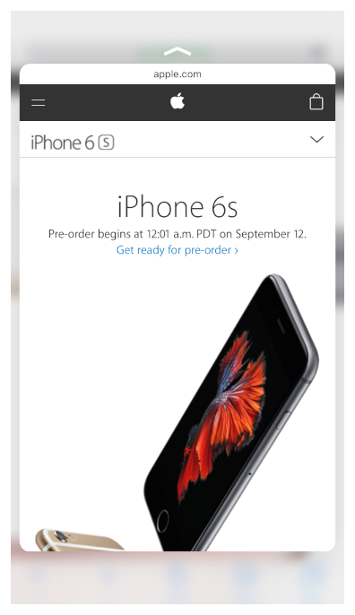

通过使用一个在主屏幕上方的半透明背景浮层，这样文件夹就能清楚地把内容和屏幕上其他内容区分开来。

如图所示，备忘录（Reminders）以不同的层级展示内容条目。用户在使用备忘录里的某个条目时，其他条目会被集中收起在屏幕下方。

日历具有较深的层级，当用户在翻阅年、月、日时，增强的转场动画效果给用户一种层级纵深感。在滚动年份视图时，用户可以即时看到今天的日期以及其他日历任务。

当用户选择了某个月份，年份视图会局部放大该月份，过渡到月份视图。今天的日期依然处于高亮状态，年份会显示在返回按钮处，这样用户可以清楚地知道他们在哪儿，他们从哪里进来以及如何返回。

类似的过渡动画也出现在用户选择某个日期时：月份视图从所选位置分开，将所在的周日期推向内容区顶端并显示以小时为单位的当天时间轴视图。这些交互动画增强了年、月、日之间的层级关系以及用户的感知。

## iOS应用解析 （iOS App Anatomy）

几乎所有的iOS应用都应用了UIKit framework中定义的组件。了解这些基本组件的名称、作用和功能可以帮助你在应用的界面设计过程中做出更好的决策。

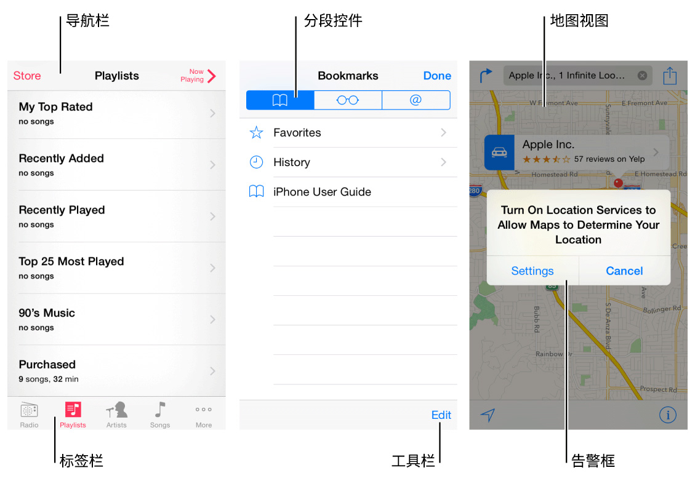

UIKit提供的UI组件可以大致分为以下4种类型：

+ 栏（Bars）：包含了上下文信息来指引用户他们所在的位置，以及控件来帮助用户导航或执行操作。
+ 内容视图（Content Views）：包含了应用的具体内容以及某些操作行为，比如滚动、插入、删除、排序等等。
+ 控件（Controls）：用于执行操作或展示信息。
+ 临时视图（Temporary Views）：短暂出现给予用户重要信息或提供更多的选择和功能。

UIKit除了定义UI组件元素，还定义对象如何实现功能，例如手势识别、绘图、辅助功能和打印支持。

从编程的角度来看，UI组件元素其实是视图的子类，因为它们继承了UIView。视图能绘制屏幕内容并知道用户何时在其范围内触屏。视图的所有类型有：控件（比如按钮和滑块）、内容视图（比如集合视图和表格视图），以及临时视图（如警告提示和动作菜单）。

要在应用中管理一组或者一系列的视图，通常需要使用视图控制器。它能协调视图的内容显示，实现与用户交互的功能并能在不同屏幕内容之间切换。比如，“设置”使用了一个导航控制器来展示其视图层级。

这里有一个关于视图与视图控制器如何结合并呈现iOS应用的UI的例子，如图。

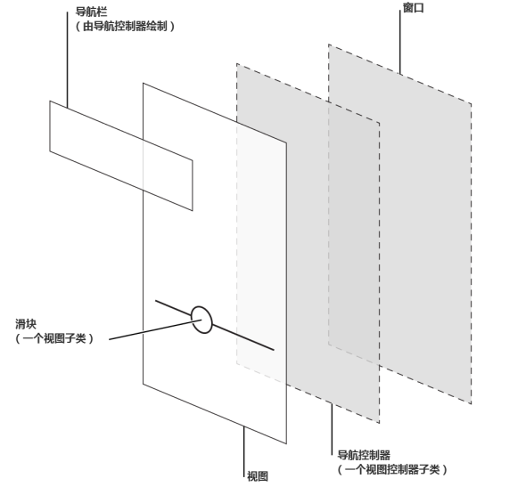

尽管开发者认为真正起到作用的是视图和视图控制器，但一般用户感知到的iOS应用是不同屏幕内容的集合。从这个角度来看，在应用里，屏幕内容一般对应于一个独特的视觉状态或者模式。

注：一个iOS应用程序包含一个窗口。但是，不同于计算机程序中的窗口，iOS窗口没有可见的部分并且不能在屏幕上被移动到另一个位置。很多iOS应用程序只有一个窗口；可以支持外部显示设备器的应用程序可以有不止一个窗口。

在iOS Human Interface Guidelines中，屏幕（screen）这个词和大部分用户理解的一样。作为一个开发者，你也许需要阅读一下其他与[UIscreen](https://developer.apple.com/library/ios/documentation/UIKit/Reference/UIScreen_Class/index.html#//apple_ref/occ/cl/UIScreen)相关的章节，这样你可以更好的了解如何关联外部屏幕。

## 适应性和布局（Adaptivity and Layout）

### 为自适应而开发（Build In Adaptivity）

人们通常希望在他们所有的设备和多种情境中使用自己喜欢的应用程序，比如在不同的设备方向上和iPad的分屏情况下。尺寸类别（ Size classes）和自动布局（Auto Layout）可以通过定义屏幕的布局、视图控制器和视图在环境变化时候应该怎么适应来帮助你实现这个愿望。（显示环境[display environment]的概念指的是设备的整个屏幕或者其中一部分，比如弹出框的区域或者iPad分屏视图中其中一侧的区域。）

iOS在特征集合（trait collection）的定义中包含了显示环境的概念，特征集合囊括了尺寸类别（size class），显示比例（display scale）和用户界面语言（user interface idiom）。你可以使用一个特征集合让你的视图和视图控制器响应显示环境的变化。

iOS定义了两个尺寸类别（size class），常规的（regular）和压缩的（compact）。常规尺寸与拓展的空间紧密相关，压缩尺寸与约束的空间相关。想要定义一种显示环境，你需要定义一种横屏尺寸类别，与一种竖屏尺寸类别。如你所想，一个iOS设备在竖屏模式可以使用一套类别，而横屏模式下可以使用另一套类别。

iOS能随着尺寸类别和显示环境变化而自动生成不同布局。举个例子，当垂直尺寸从压缩变为常规时，导航栏和工具栏会自动变高。

当你靠尺寸类别来驱动布局变化时，你的应用在任何显示环境时都能显示得很好。关于如何在Interface Builder中更好的使用尺寸类别，你可以查阅[Size Classes Design Help](https://developer.apple.com/library/ios/recipes/xcode_help-IB_adaptive_sizes/_index.html#//apple_ref/doc/uid/TP40014436).

注：在一种尺寸类别中，持续使用Auto Layout进行小的布局调整，比如拉伸或压缩内容。更多Auto Layout，参看 [Auto Layout Guide](https://developer.apple.com/library/ios/documentation/UserExperience/Conceptual/AutolayoutPG/index.html).

下面的实例可以帮助你形象展现尺寸类型如何适配不同设备的显示环境。例如：iPad（包括iPad Pro）在长宽和横屏竖屏时都使用常规尺寸类型。换句话说，iPad显示环境一直处于垂直和水平的常规状态。

注：合格的iPad型号支持多任务，你的应用可能需要与其他应用共享同一个屏幕。确保使用Auto Layout，这样你可以在用户使用多任务功能时响应他，比如 分屏模式（Split View）和多任务分屏模式（Slide Over）。

除了使用Auto Layout，当你在iPad Pro上展示可读性的内容时，依靠UIView的 [readableContentGuide](https://developer.apple.com/library/ios/documentation/UIKit/Reference/UIView_Class/index.html#//apple_ref/occ/instp/UIView/readableContentGuide)属性是非常重要的，这样可以拥有让读者舒服的边距。

iPhone的显示环境可根据不同的设备和不同的握持方向而改变。

竖屏时，iPhone6 Plus使用的是压缩宽度和常规高度类型。

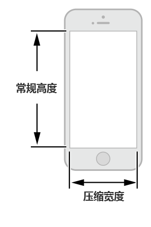

横屏时，iPhone6 Plus使用的是常规宽度和压缩高度类型。

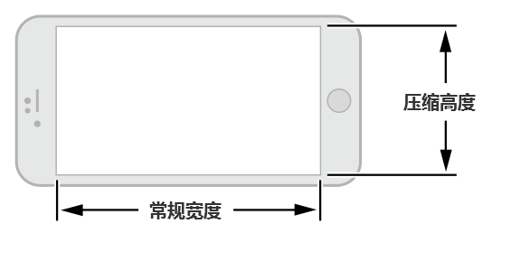

其他iPhone型号，包括iPhone6使用相同的尺寸类型设置。

竖屏时，iPhone 6，iPhone 5 和iPhone 4S使用的是压缩宽度和常规高度。

横屏时，这些设备在宽高上使用的都是压缩类。

### 在不同环境提供良好体验（Provide a Great Experience in Each Environment）

当你使用自适应来开发UI时，你可以保证UI跟随显示环境变化而适当地响应。遵照这些指南，你可以给用户良好的设备响应体验。

在所有环境下都保持对主体内容的专注。这是最高优先级。人们使用应用时，浏览感兴趣的内容并与之发生互动。随着环境变化改变专注点会让用户感觉到迷失方向，让他们感觉对应用失去控制。

避免布局上不必要的变化。在所有环境中保持一致的使用体验，能让人们在旋转设备或在不同设备上运行你的应用时维持稳定的使用模式。例如，如果你在水平的常规模式下使用了网格来显示图像，那么无需在压缩模式下使用列表来展示同样的内容 ，虽然你可能调整了网格的尺寸。

如果你的应用只在一个方向上运行，那么请直接一点。人们希望在各种握持方式下都可以使用你的应用，能满足这个期待是最好的。但是，如果你的应用只在一个方向下运行，那么你应当注意：

+ 避免出现提示人们旋转设备的相关UI元素。让应用在支持的方向下清晰地运行，如果需要用户旋转设备，不要给UI添加不必要的混乱。
+ 支持同一个方向上的变化。例如，如果一个应用只能横屏运行，用户无论用左手或是右手握持时都能触及到home键。如果用户在使用应用时180度旋转设备，那最好应用内容也能及时响应并旋转180度。

如果你的应用将设备方向翻转视为用户输入（的一种指令），那么就按照程序设定的方式来响应设备翻转。举个例子，一个游戏让用户利用设备翻转来移动游戏中的部件，那么这个游戏应用本身（的UI）不能对翻转屏幕产生响应。在这种情况下，你必须关联两个需要变化的方向，并且允许人们在这两个方向切换直到他们开始（了解并执行）应用的主体任务。一旦人们开始执行主要任务，那就开始按程序设定的那样来响应设备的动作。

### 使用布局来沟通（Use Layout to Communicate）

布局包含的不仅仅是一个应用屏幕上的UI元素外观。你的布局，应该告诉用户什么是最重要的，他们的选择是什么，以及事物是如何关联起来的。

强调重要内容或功能，让用户容易集中注意在主要任务上。有几个比较好的办法是在屏幕上半部分放置主要内容——遵循从左到右的习惯——从靠近左侧的屏幕开始：

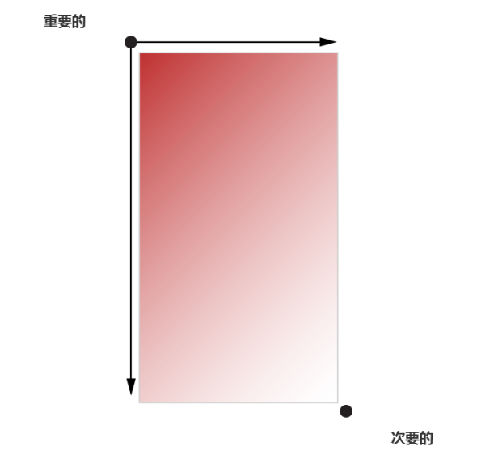

使用不同的视觉化重量和平衡来告诉用户当前屏显元素的主次关系。大型控件吸引眼球，比小的控件更容易在出现时被注意到。而且大型控件也更容易被用户点击，这让它们在应用中尤其有用——就像电话和时钟（上面的按钮）那样——能让用户经常在容易分心的环境下仍然保持正常使用。

使用对齐来让阅读更舒缓，让分组和层次之间更有秩序。对齐让应用看起来整洁而有序，也让用户在滑动整屏内容时更容易定位和专注于重要信息。不同信息组的缩进与对齐让它们之间的关联更清晰，也让用户更容易找到某个控件。

确保用户在内容处于默认尺寸时便可清楚明白它的主要内容与含义。例如，用户应当无需水平滚动就能看到重要的文本，或不用放大就可以看到主体图像。

准备好改变字体大小。用户期望大多数应用都可以响应他们在iOS的设置中设定的字体大小。为了适应一些文本大小的变化，你也许需要调整布局；想要得到更多文本显示相关的信息，请查阅下文“颜色与字体”中相关的内容。

尽量避免UI上不一致的表现。在一般情况下，有着相似功能的控件看起来也应该类似。用户常常认为他们看到的不同总有原因，而且他们倾向于花时间去尝试（译者按：因此为了避免用户做无用的尝试，建议类似的功能外观都保持一样。）

给每个互动的元素充足的空间，从而让用户容易操作这些内容和控件。常用的点按类控件的大小是44 x 44点（points）。

## 启动与停止（Starting and Stopping）

### 即时启动（Start Instantly）

我们通常认为用户不会花超过一两分钟去评价一款新应用。当你可以最大程度地利用这段极短的时间，即时呈现对用户有帮助的内容时，你就能够激发新用户的兴趣并给所有用户一种极棒的体验。

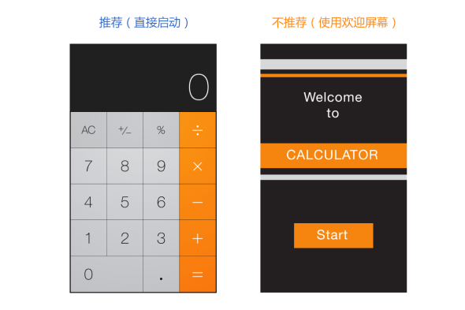

重要：不要在安装过程结束后告诉用户需要重启设备。重启需要花费时间，同时也会让人觉得你的应用不可靠且很难使用。

如果你的应用有内存使用或其它问题，导致不重启就无法流畅运行，你必须声明这些问题。想要了解如何开发一款性能良好的应用，请参阅[Use Memory Efficiently](https://developer.apple.com/library/ios/documentation/iPhone/Conceptual/iPhoneOSProgrammingGuide/PerformanceTips/PerformanceTips.html#//apple_ref/doc/uid/TP40007072-CH7-SW8)。

尽可能避免使用闪屏或者其他启动体验方式。用户能够在启动应用后立即开始使用是最好不过的。

尽可能地，避免让用户做过多设置。而应该如此：

+ 聚焦在80%目标用户的需求上。这样绝大部分用户就无需设置各种选项，因为你的应用已经默认处于他们想要的状态。如果有些功能仅有少部分用户想要，或者是大部分用户只需要使用一次，那就别管它了。
+ 尽可能用其他方式获取更多的用户信息。如果你能得到用户在内置应用或硬件设置中提供的信息，直接从系统中获取，不要让用户再次输入。
+ 如果你必须要求用户设置用户信息，在你的应用中直接提示用户输入。然后尽快保存这些设定（一般来说，保存到你的应用的设置模块中）。这样用户就无需强制跳出应用进入系统设置页面了。如果用户需要更改设置，他们可以在任何时候进入应用的设置模块进行修改。

尽可能让用户晚一点再登录。最理想的状态是，用户在无需登录的情况下就能尽量多地浏览内容并使用部分功能。例如，App Store会在用户确定进行购买商品时，才要求用户进行登录。对于那些强制用户登录后才能进行一切有用操作的应用，用户往往会直接放弃。

如果你的应用必须先登录后使用，那么你应该在登录页面有一些简短的文字，来描述为什么必须先登录，以及这样做会给用户带来什么好处。

谨慎使用新手引导（介绍应用的功能和如何进行操作）。在考虑新手引导之前，你应该努力地完善你的应用，尽可能使应用的功能直观和易于寻找。其实，好的应用不需要新手引导。如果你确实觉得需要新手引导，那么请参考如下的建议，设计一个简洁、有针对性并且不妨碍用户的新手引导。

+ 只提供开始使用应用所必需的信息。好的新手引导应该告诉用户第一步应该做什么，或者简短地演示大部分用户感兴趣的一些功能。如果在能够探索你的应用之前，给用户展示太多信息，让用户记住这些不是当前所必须的内容，会让用户觉得你的应用很难用。如果在某些特定场景下确实需要额外帮助，那么也应该只在用户处于这个场景之后再提供。
+ 使用动画和可交互的方式来吸引用户，并让用户通过实际操作来学习如何使用。对于文字内容的增加应该谨慎，且仅当增加文字对于提升体验有益时才这么做。不要指望用户会阅读大段的文字。例如，可以使用动画而不是文字来描述如何执行一个简单的任务。在引导用户了解较为复杂的任务时，可以通过一些引导浮层来简要说明每一个步骤用户需要做什么。尽可能避免展示应用截图，因为截图不可交互的，用户可能会混淆截图和应用的实际界面。
+ 能够让用户很容易地取消或者跳过新手引导。有些用户看完新手引导之后就不想再看，有些甚至根本就不想看新手引导。请记住用户的选择，不要强迫用户每次打开你的应用都要再选择一次。
+ 不要太早要求用户去给你的应用评分。过早要求用户进行评分可能会适得其反。如果你想获得有价值的反馈和评论，在邀请用户评论之前，请给他们一点时间来使用你的应用，并对你的应用形成印象。例如，你可以等用户访问了一定数量的页面或完成了一定数量的任务之后，再邀请他们进行评价。

一般建议按照屏幕默认的定向方式启动你的应用。尽管如此，如果你的应用只有一种屏幕方向，那么就始终以这个方向启动，让用户在他们自己需要时再改变设备方向。例如，一个游戏或者媒体观看应用只在横屏模式下运行，那么就应该以横屏模式启动，即使设备当前处于竖屏模式。这样的话，如果用户在竖屏模式下打开应用，他们也知道应该把设备转成横屏来进行使用。

注：最好让横屏应用支持两种方向的横屏，即home键在左或在右方都支持。如果设备当前已经处于横向状态，那么就按照当前状态启动应用，除非你有充分的理由不这么做。其他情况时，可以考虑按home键处于右侧的方式启动应用。（想要了解更多关于支持不同设备方向的内容，请参阅前文中Adaptivity and Layout相关章节。）

提供一张与应用首页看上去一样的闪屏。iOS会在启动应用时调用这张图，这样可以让用户觉得启动速度很快，同时，也可以让你的应用有足够的时间去加载内容。具体如何制作闪屏，请查阅Launch Files。

如果可能，不要让用户在初次启动应用时阅读免责声明或者确认用户协议。你可以直接在App Store展示这些内容，使用户在下载前就有所了解。如果在某些情况下你必须展示这些内容，要确保它们与界面保持统一并在产品功能与用户体验之间达成平衡。

在应用重启后，需要恢复到用户退出使用时的状态，让他们可以从中断之处继续使用。无需让用户记住是如何回到此状态的。了解更多关于保持和恢复应用状态的有效方式，请查阅Preserving Your App’s Visual Appearance Across Launches。

### 时刻准备好停止（Always Be Prepared to Stop）

iOS 应用 不存在关闭或退出选项。当用户切换到另一个应用，回到主屏幕或者将设备调至睡眠模式的时候，其实就是停止了当前应用的使用。 当用户切换应用时，iOS的多任务系统会将其放置到后台并将新应用的UI替换上来。在这种情况下，你必须做到以下几点：

随时并尽快保存用户信息。因为在后台的应用随时有可能被终止或退出。

当应用停止的时候保存 尽可能多的当前状态的详细信息。这样使用户可以在回到应用时能从中断之处继续使用。例如，在使用可滚动的数据列表时，退出后保存列表所在的位置。了解更多关于保持和恢复应用状态的有效方式，请查阅[Preserving Your App’s Visual Appearance Across Launches](https://developer.apple.com/library/ios/documentation/iPhone/Conceptual/iPhoneOSProgrammingGuide/StrategiesforImplementingYourApp/StrategiesforImplementingYourApp.html#//apple_ref/doc/uid/TP40007072-CH5-SW2).

有些应用可能需要一直在后台运行。例如，用户可能希望能在使用一个应用的同时还能一直听歌，接着又想用另外一个应用来检查代办项或者玩游戏。关于如何正确处理多任务，请查阅[Multitasking](https://developer.apple.com/library/ios/documentation/UserExperience/Conceptual/MobileHIG/Multitasking.html#//apple_ref/doc/uid/TP40006556-CH38-SW1).

不要强制让应用退出。因为这样会让用户误以为是系统崩溃。如果有问题产生，需要告诉用户具体状况以及如何解决。以下有两个建议，取决于出现的问题有多严重，可以酌情使用：

如果应用中所有的功能当前都不可用，那么应该显示一些内容来解释当前的情形，并建议用户如何进行后续操作。这部分内容给予了用户以反馈，使用户相信你的应用现在没问题。同时这也可以稳定用户情绪，让他们决定是否要采取纠正措施，继续使用应用，还是切换到另一个应用。

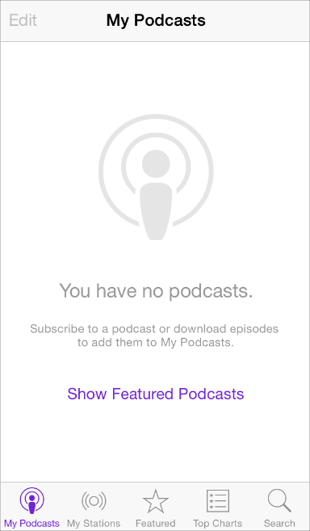

如果只有部分功能不可用，那么只要当用户使用这些功能时显示提示即可。其他情况下，用户就应该能正常使用应用的其他功能。如果你决定使用警告框来进行提示，请确保只在用户尝试使用不可用的功能时再显示。

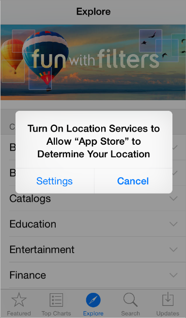

## 导航（Navigation）

除非导航设计不合理，不然用户应该明显察觉不到应用中的导航体验。导航设计应该能够支撑你应用结构和目的却又不分散用户注意力。 广义来说，导航主要有以下几种类型，每个导航都有其适应的应用结构：

+ 分层
+ 扁平
+ 内容或体验驱动

在有层级结构的应用中，用户在每个层级中都要选择一项，直到到达目的层级。如果要切换到另一个目的层级，用户必须回退一些层级，或者直接回到初始层级再次选择。系统设置和邮箱应用在这方面是很好示范，可以参考他们。

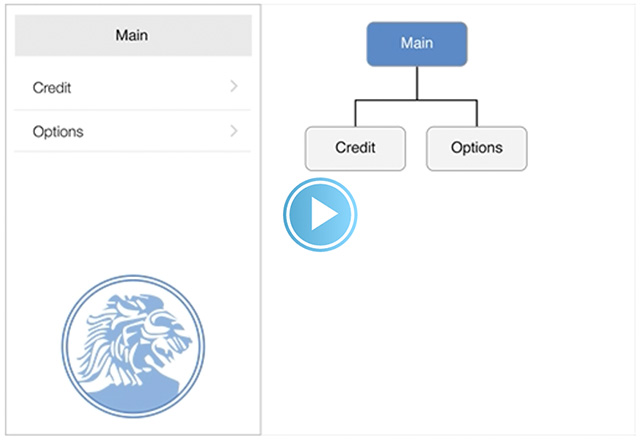

译者注：以上为视频截图，完整视频可[点击观看](https://developer.apple.com/library/ios/documentation/UserExperience/Conceptual/MobileHIG/Art/navigation_hierarchy.m4v)。

在扁平信息架构的应用中，用户可以从首页目录直接切换到另一个，因为所有的分类都可以从主屏直接访问。音乐和App Store是两个使用扁平结构的好例子。

译者注：以上为视频截图，完整视频可[点击观看](https://developer.apple.com/library/ios/documentation/UserExperience/Conceptual/MobileHIG/Art/navigation_flat.m4v)。

在内容或体验驱动的信息架构应用中，导航也会根据内容或体验来设计。例如，在阅读一本电子书时，用户会一页接一页的进行阅读，或者直接从目录中选中某一个指定的页码；同样，在游戏中导航也是体验的重要组成部分。

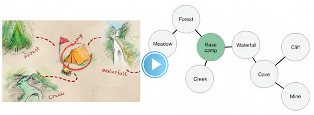

译者注：以上为视频截图，完整视频可[点击观看](https://developer.apple.com/library/ios/documentation/UserExperience/Conceptual/MobileHIG/Art/navigation_contents.m4v)。

在某些情况下，在一个应用中结合多种导航类型会有很好的效果。例如，对于扁平信息结构中某一分类下的内容，用分层导航的方式来显示可能会更好。

应该让用户时刻清楚自己当前在应用中所处的位置，及如何前往目的页面。无论使用哪种适合你的应用结构的导航，最重要的是用户访问内容的路径要有逻辑、可预期和易于追溯。

UIKit定义了一些标准的UI元素，以方便地构建分层或扁平导航，还有一些元素可以构建以内容为中心的导航，例如电子书或者媒体观看类应用。游戏或者其他体验驱动的应用通常需要一些自定义的元素和行为。

使用导航栏（Navigation Bar）帮助用户轻松访问分层内容。导航栏的标题可以显示用户当前所处的层级，而后退按钮可以回到上一层级。想要了解更多内容，请查看[Navigation Bar](https://developer.apple.com/library/ios/documentation/userexperience/conceptual/mobilehig/Bars.html#//apple_ref/doc/uid/TP40006556-CH32-SW3).

使用标签栏（Tab Bar）显示同类型的内容或功能。标签栏很适合于扁平信息结构，可以让用户在分类之间随意切换，而不用在意当前所处的位置。想要了解更多内容，请查看[Tab Bar](https://developer.apple.com/library/ios/documentation/userexperience/conceptual/mobilehig/Bars.html#//apple_ref/doc/uid/TP40006556-CH32-SW52).

在应用中，如果每屏显示的都是同类项或同类页，可以使用页面控件（Page Control）。页面控件的优点是可以直观地告诉用户有多少个项目或页面，以及当前所处位置。想要了解更多内容，请查看[Page Control](https://developer.apple.com/library/ios/documentation/userexperience/conceptual/mobilehig/Controls.html#//apple_ref/doc/uid/TP40006556-CH35-SW6)。

一般来说，最好能给用户提供到达每一屏的唯一路径。如果某屏内容用户需要在不同场景下查看，可以考虑使用临时视图，例如模态视图、动作菜单或警告框。想要了解更多，请查看[Modal View](https://developer.apple.com/library/ios/documentation/userexperience/conceptual/mobilehig/Alerts.html#//apple_ref/doc/uid/TP40006556-CH34-SW3)、[Action Sheet](https://developer.apple.com/library/ios/documentation/userexperience/conceptual/mobilehig/Alerts.html#//apple_ref/doc/uid/TP40006556-CH34-SW36)和[Alert](https://developer.apple.com/library/ios/documentation/userexperience/conceptual/mobilehig/Alerts.html#//apple_ref/doc/uid/TP40006556-CH34-SW2)。

UIKit同时还提供了以下相关控件：

+ [分段控件（Segmented Control）](https://developer.apple.com/library/ios/documentation/UserExperience/Conceptual/MobileHIG/Controls.html#//apple_ref/doc/uid/TP40006556-CH15-SW27)。分段控件让用户在一屏内就可以查到不同分类的内容，而不需要切换到其他屏幕。
+ [工具栏（Toolbar）](https://developer.apple.com/library/ios/documentation/UserExperience/Conceptual/MobileHIG/Bars.html#//apple_ref/doc/uid/TP40006556-CH12-SW4)。尽管工具栏和导航栏或标签栏相似，但是工具栏不具导航作用。相反，工具栏为用户提供了可以控制当前屏幕内容的控件。

（译者注：上文提到的Navigation Bar, Tab Bar, Page Control, Modal View, Action Sheet, Alert, Segmented Control和Toolbar均处在iOS Human Interface Guidelines的第4章 UI Elements部分，翻译将在后续更新中放出，烦请各位耐心等候。）

## 模态情境（Modal Contexts）

模态是一个承载某些连贯操作或内容的优缺点并存的模式。它可以给用户提供一种不脱离主任务的方式去完成一个任务或者获得信息，但是也会临时性的阻止用户对应用的其他部分进行交互操作。

理想情况下，用户可以与iOS 应用进行一种非线性的交互，所以，尽可能的减少你应用中的模态体验是最好的。通常情况，仅在以下情境可以考虑使用模态：

+ 必须引起用户关注的时候
+ 一个独立的任务需要完成或者很明确需要被放弃，为了避免在模棱两可的状态下遗漏用户信息的时候

保证模态任务简单、简短和高度聚焦。你肯定不希望用户使用模态视图时像使用应用中的一个mini应用一样。如果子任务过于复杂，用户会在进入模态情境时忽略了主要任务。在设计一个涉及视觉层次的模态任务时特别要考虑这一点，因为用户有可能迷失并且忘记如何回到之前的操作中去。如果一个模态任务必须包含不同视图的子任务，确保给用户一个独立、清晰的导航路径，并避免迂回。更多关于模态试图的信息请参考[Modal View](https://developer.apple.com/library/ios/documentation/UserExperience/Conceptual/MobileHIG/Alerts.html#//apple_ref/doc/uid/TP40006556-CH14-SW3).

始终提供明显、安全的退出模态任务的途径。确保用户在退出模态视图时可以预期操作的结果。

一个任务需要多层级的模态视图时，确保用户理解点击非最高层级下的完成按钮的结果。点击一个低层级视图上的完成按钮是完成这个视图中任务的一部分，还是整个任务。因为有可能存在这种困惑，所以要尽可能避免在下级视图中添加完成按钮。

保证提醒对话框的内容都是必要且可操作的。提醒对话框会打断用户的体验并且要点击才会消失，所以要让用户感到提醒信息是有用的，打断是有价值的。想要了解更多请参考[Alert](https://developer.apple.com/library/ios/documentation/UserExperience/Conceptual/MobileHIG/Alerts.html#//apple_ref/doc/uid/TP40006556-CH14-SW2).

（译者注：上文提到的Modal View与Alert均处在iOS Human Interface Guidelines的第4章 UI Elements部分，翻译将在后续更新中放出，烦请各位耐心等候。）

尊重用户关于接收通知的偏好设置。用户会设置接收应用通知的形式，确保遵重用户的喜好设置，否则可能会触怒用户，导致其关闭应用中所有的推送通知。

## 交互性与反馈（Interactivity and Feedback）

### 可交互元素吸引用户点击（Interactive Elements Invite Touch）

为了暗示交互性，设计时会使用很多线索，包括点击的反馈、颜色、位置、上下文、表意明确的图标和标签等。并不需要过于修饰元素来向用户展示可交互性。

在支持3D Touch的设备上，当用户按压主屏上的图标时，背景会虚化以此来暗示可以进行更多功能的选择。

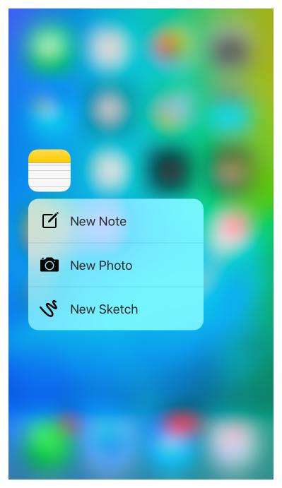

一个关键的颜色可以给用户提供很强的视觉指引，尤其是没有冗余的其它颜色时。为了对比，使用蓝色来标记可交互的元素，同时能提供统一的、易识别的视觉风格。

返回按钮使用多个线索指明其可交互并传达其功能:它出现在导航中，显示了一个指向后方的图标，使用了关键色，并且显示了上一级页面的标题。

一个图标或者标题提供了清晰的名称指引用户点击它。例如，地图中的标题“Flyover Tour”，“Directions to Here”，清晰的说明了用户可做的操作。结合关键色，就可以省去按钮边界或其他多余的修饰。

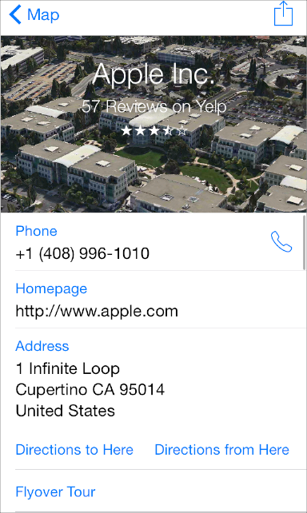

在内容区域，必要时可以给按钮添加边界或背景。位于栏（Bar）、动作列表（Action Sheet）和 警告框（Alert）中的按钮可以不需要边界，因为用户知道在这种区域中大多数选项是可交互的。但是在内容区域，有必要使用边界或背景将按钮从其他内容中区分出来。例如，音乐，时钟，照片，App Store在一些特别的场景中使用这种按钮。

照片管理中给分享按钮增加了边框，从其他解释性文本中区分出来。

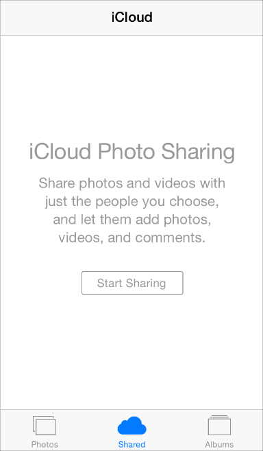

时钟在秒表和计时页面中给按钮增加背景来强调开始和暂停按钮，并且使按钮在易分散注意力的内容中更容易点击。

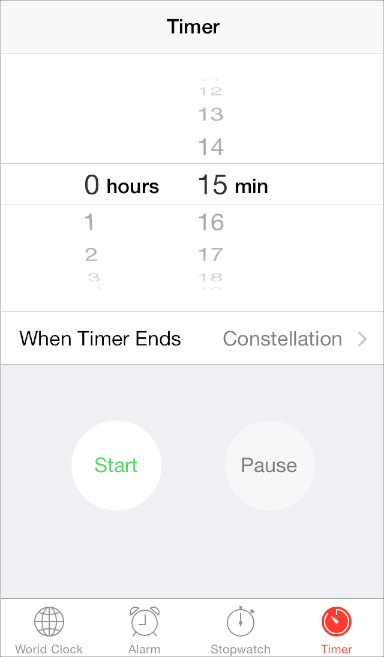

应用商店中使用有边界的按钮，将按钮和整个内容条区分开来，点击整条内容查看详细信息，点击按钮进行下载安装。

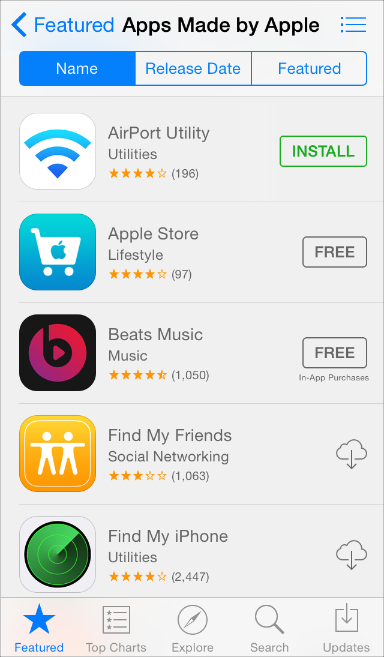

### 用户所知道的标准手势（Users Know the Standard Gestures）

用户使用点击、拖拽、捏合等手势与应用和他们的IOS设备进行交互。使用手势拉近了用户和设备之间的距离，并且增强了直接操纵感。用户通常期待手势在不同应用之间都是通用的。

用户在使用3D Touch时不需要学习额外的手势操作。当用户轻按屏幕并得到反馈时，很容易就能发现3D Touch提供的额外的交互方式。

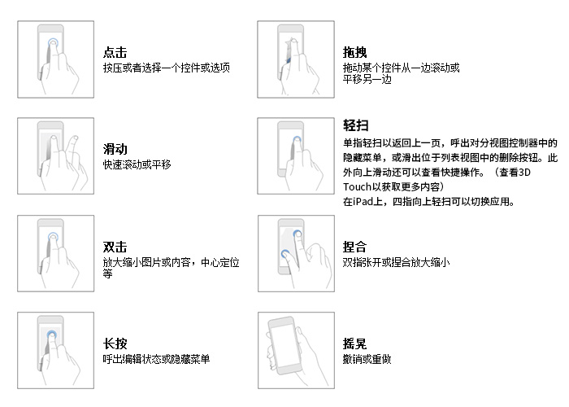

除了用户熟悉的标准手势，iOS还定义了一些系统范围内的操作，例如呼出控制中心（Control Center）或消息中心（Notification Center）。用户可以在任意应用下都使用这些手势。

不要给标准手势赋予不同的行为。除非你的应用是游戏，否则重新定义标准手势会使用户迷惑，且增加使用难度。

不要创建和标准手势功能相似的手势操作。用户已经习惯了标准手势的行为，没有必要让用户额外学习不同的操作手势来达到同样的操作结果。

可以用复杂手势作为完成某任务的快捷方式，但不能是唯一触达方式。最好给用户提供一些简单，直接的方式完成某操作，即使这种方法需要他们额外地多点击一到两次。简单的手势能让用户集中于当前的体验和内容，而不是交互操作本身。

除非是游戏，否则避免定义新的手势。在游戏或其他沉浸式的应用中，操作手势也是有趣体验的一部分。但是在普通应用中，帮助用户达成目标要比操作本身重要的多，所以最好使用标准手势，尽量避免让用户去发觉和记忆新的操作。

在特定的环境中，可以考虑使用多指操作。虽然复杂的操作并不一定适用于所有应用，但对用户会花大量时间使用的应用来说可以丰富体验，例如游戏或创建内容环境。但因为非标准手势可发现性差，要尽量少用，并且不要让这类手势成为完成任务的唯一方式。

### 反馈有助于理解（Feedback Aids Understanding）

反馈帮助用户了解应用当前在做什么，发现接下来可以做什么以及理解他们动作产生的结果。UIKit的操作和视图提供了很多反馈类型。

尽可能将状态或其他的反馈信息整合到UI中。用户不进行操作或不跳出当前内容就能获得需要的信息是最好的。例如，邮箱将当前的状态显示在不影响当前内容的 工具栏上。

避免显示不必要的提醒对话框。对话框是很强的反馈机制，只有在传递非常重要，且可操作的信息时才需要使用它。如果用户常看到很多没有重要信息的对话框，他们很快就会忽略所有对话框提醒。想要了解更多信息，请参考[Alert](https://developer.apple.com/library/ios/documentation/UserExperience/Conceptual/MobileHIG/Alerts.html#//apple_ref/doc/uid/TP40006556-CH14-SW2).（译者注：Alert处在iOS Human Interface Guidelines的第4章 UI Elements部分，翻译将在后续更新中放出，烦请各位耐心等候。）

### 输入信息的方式要简单（Inputting Information Should Be Easy）

不管用户是点击控件还是使用键盘，输入信息都会花费时间和精力。如果在发挥有用的效用前就让用户输入大量信息会减弱用户继续使用的欲望。

让用户更容易的进行选择。例如，使用选择器或者表格代替纯文本，因为大部分用户觉得从列表中进行选择要比打字容易的多。

适时地从iOS中获取信息。设备上存储了大量的用户信息。可以的话，不要让用户提供你可以轻易找到的信息，例如联系人或日历信息。

提供有用的反馈来平衡用户的输入。在使用应用的过程中，付出和回报的概念可以帮助用户感到进程在被推进。

## 动画（Animation）

细微、精美的动画遍布iOS的用户界面，他们使应用的体验更具吸引力，更具动态性。适当的动画可以：

+ 传达状态和提供反馈
+ 增强直接的操纵感
+ 将用户的操作可视化

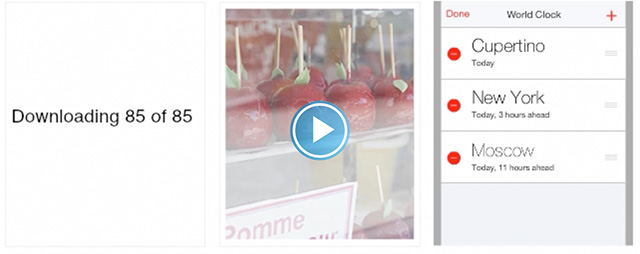

（译者注：以上为视频截图，完整视频请[点击观看](https://developer.apple.com/library/ios/documentation/UserExperience/Conceptual/MobileHIG/Art/animation_intro.m4v)）

谨慎地增加动画，特别是在那些无法提供沉浸式体验的应用中。过多和无理由的动画会阻碍应用的流畅性，降低性能，还会分散用户在操作中的注意力。

尤其是要有目的 地，合理地应用动效和UIKit中的动态控件，并确保对结果进行测试。合理地使用动效可以提升用户的理解程度和愉悦感；应用过度使用动效会给用户带来迷惑和难以掌控的感觉。

如果可以，保持自定义动画和内置动画的一致性。用户习惯于内置iOS应用使用的精细动画。事实上，用户倾向于把视图之间的平滑切换，对设备方向改变的流畅相应和基于物理的滚动效果看做是iOS体验的一部分。除非，你的应用要给用户提供类似游戏应用的沉浸式体验，这种情况下自定义的动画可以区别于内置动画。

使用风格类型一致的动画。自定义动画之间也需要保持一致性，这样可以让用户在使用应用以之前建立的经验为基础。

一般来说，自定义的动画要考虑动画的现实性和可信性。人们乐意接受自由的艺术创作，但是当动效不合理或者违反物理学时，用户会感到困惑。例如，当你从屏幕顶部下滑拖出一个视图的时候，你也要上滑将它收起，因为这么做可以帮助用户记住这个视图从何而来。如果你下滑到屏幕底部关闭这个视图，用户关于从屏幕上方呼起的心理模型就会被打破。

## 品牌推广（Branding）

成功的品牌推广不仅仅包括在应用中添加品牌元素。优秀的应用应该通过创建独特的外观和感觉来为用户提供愉悦、难忘的体验。

在iOS系统之下可以很容易地使用自定义的图标、颜色和字体来创建区别于其他应用的UI。当你进行这些元素的设计时，牢记以下两点：

+ 每个自定义的元素本身都需要具备良好的观感和功能性，但它也应该与应用中其他元素保持一致，无论应用中其他元素是自定义的还是标准的。
+ 为了在iOS中感觉舒适，你的应用虽然不必看起来跟内置的一样，但是需要对它的遵从、清晰度和深度（如欲了解更多，参见1 为iOS而设计（Design for iOS））进行整合。花些时间弄清楚在你的应用中遵从、清晰和深度所代表的意味，并把它们在你的自定义元素中表达出来。

当你需要让用户意识到你的品牌时，你应该遵循以下几点：

以精致优雅不唐突的方式植入品牌元素。用户使用你的应用来完成事务或者进行娱乐，他们不希望被强迫着去观看广告。为了获得最好的用户体验，你可以通过字体、颜色和图像的设计来潜移默化地地提醒用户你的品牌身份。

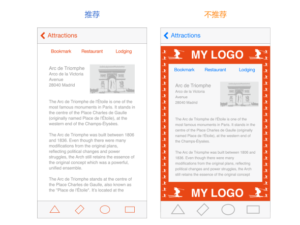

避免远离用户关心的内容。不要像 上图中的反例那样将仅有品牌意义的内容放在屏幕顶部二级栏上持续展示，使正文内容空间被压缩，而是考虑以其他低侵入性的方法无处不在地展示品牌，如使用自定义颜色、字体，或巧妙地定制屏幕的背景。

抵抗住诱惑，不要把你的logo贯穿整个应用。移动设备的屏幕多数相当小，logo的每一次出现都会占据空间，从而将用户与他们想看的内容隔离开。而且，在应用中显示logo并不能像在网页中显示logo那样达到相同的目的：对于用户来说通常会很容易在不知道网页所属的情况下访问一个网页，但却极少有用户会在完全不看一个iOS系统中的应用图标的情况下就打开它。

## 颜色与字体（Color and Typography）

### 色彩有助于增进沟通（Color Enhances Communication）

在iOS系统中，颜色会用于表明交互，传递活性以及提供视觉连续性。内置的应用程序选择使用那些看起来更具个性的、纯粹、干净的颜色，并辅以或亮或暗的背景组合。

如果你要创建多样的自定义颜色，要确保它们能够和谐共存。例如，如果你的应用的基本风格是柔和的色调，你就应该创建一个协调的柔和色调的色板用于整个应用。

注意在不同情境下的颜色对比。例如，如果在导航栏的背景与栏按钮标题之间没有足够的对比，按钮就会很难被用户看到。一个快速但不严谨的方法是通过将设备置于不同的光照环境之中（包括晴朗的室外）来测试设备上的颜色是否具有足够的对比度。

虽然在设备上查看你的应用能够在一定程度上帮助你找到需要调整的地方，但这仍代替不了能产生可靠结果的更科学客观的方法。这种方法涉及到判定前景色和背景色的亮度值是否符合一定的比率。这个比率值可以通过在线对比度计算器或者根据WCAG2.0标准中提供的公式自己计算获得。你应用中理想的颜色对比度应该是4.5:1或更高。

当你使用自定义的栏颜色时，着重考虑半透明的栏和应用内容。当你需要创建能匹配特别颜色的栏颜色时（比如一个已有品牌中的颜色），可能在你获得你想要的结果之前，你需要用各种颜色进行实验。栏的显示将会同时受到iOS系统所提供的半透明栏与藏在栏后面的应用内容的呈现所影响。

API注：使用浅色（tintColor）的属性值给予栏按钮颜色，使用栏浅色（barTintColor）的属性值为栏本身赋色。欲了解更多关于栏属性的内容，可参见[UINavigationBar Class Reference](https://developer.apple.com/library/ios/documentation/UIKit/Reference/UINavigationBar_Class/index.html#//apple_ref/doc/uid/TP40006887)，[UITabBar Class Reference](https://developer.apple.com/library/ios/documentation/UIKit/Reference/UITabBar_Class/index.html#//apple_ref/doc/uid/TP40007521)，[UIToolbar Class Reference](https://developer.apple.com/library/ios/documentation/UIKit/Reference/UIToolbar_Class/index.html#//apple_ref/doc/uid/TP40006927)和 [UISearchBar Class Reference](https://developer.apple.com/library/ios/documentation/UIKit/Reference/UISearchBar_Class/index.html#//apple_ref/doc/uid/TP40007529).

注意颜色的盲区。多数色盲的人很难区分红色与绿色。需要对你的应用进行测试以确保在其中你没有将红色与绿色作为区分两个不同状态或值的唯一方式，一些图像编辑软件或工具能够有效的帮你验证颜色的盲区。通常意义来说，使用多种方式来表征原色的交互性是非常好的（需要了解更多关于在iOS系统中表征交互性的信息，请参阅[Interactive Elements Invite Touch](https://developer.apple.com/library/ios/documentation/UserExperience/Conceptual/MobileHIG/InteractivityInput.html#//apple_ref/doc/uid/TP40006556-CH55-SW4)）。

考虑选择一种基准色颜色来表征交互性与状态。内置的应用里的基准色包括比如备忘录中的黄色，和日历中的红色等等。如果你定义一种用于表征交互和状态的基准色，要确保你的应用中的其他颜色不会与它发生冲突。

避免给可交互和不可交互的元素使用相同的颜色。色彩是表明UI元素交互属性的方式之一。如果可交互和不可交互的元素使用相同的颜色，用户将会难以判断哪些区域是可点的。

色彩可以向用户传达信息，但不一定会以你希望的方式。每个人眼中的色彩是不一样的，不同的文化为色彩赋予的意义也是不相同的。花时间来研究如何使用色彩才可能会被其他国家或者文化接受。你要尽可能确定应用中运用的色彩向用户传达了恰当的信息。

大多数情况下，不能让颜色喧宾夺主，让用户分心。除非色彩是应用的目的和本质所在，通常情况下色彩应该用来从细微细节之处提升用户体验。

### 优秀的排版提供清晰的传达（Great Typography Enables Clear Communication）

Apple为全平台设计了San Francisco字体以提供一种优雅的、一致的排版方式和阅读体验。在iOS 9及未来的版本中，San Francisco 是系统字体。

San Francisco搭配Dynamic Type，可以为您提供：

+ 一系列的字号大小，在任何用户设置，包括可访问性设置下，可获得优质的清晰度和极佳的阅读体验。
+ 自动调整文字的粗细，字母间距以及行高的能力。
+ 为语义上有区别的文本模块指定不同的文本样式，比如正文、脚注或者标题。
+ 文本可以根据用户在字号设置和可访问性设置中指定字体大小的变化作出适当的响应的能力

下载San Francisco可访问[这里](https://developer.apple.com/fonts/).（注意：iOS9中的San Francisco字体取名为SF-UI）。当你在你的app中采用San Francisco时，你可以调整模拟器>设置中的值来测试在不同尺寸下你的app的文本。

注：如果你是用自定义字体，你仍然可以采用Dynamic Type或根据系统的字号设置来规划字体范围。当用户改变设置时，你的应用也必须响应式的配合。如需了解如何使用文字样式并确保当用户改变文字型号设置时你的应用能够获取通知，可以参考[Text Styles](https://developer.apple.com/library/ios/documentation/StringsTextFonts/Conceptual/TextAndWebiPhoneOS/CustomTextProcessing/CustomTextProcessing.html#//apple_ref/doc/uid/TP40009542-CH4-SW65).

San Francisco 有两类尺寸: 文本模式（Text）和 展示模式（Display）。 文本模式适用于小于20点（points）的尺寸，展示模式适用于大于20点（points）的尺寸。当你在你的app中使用San Francisco时，iOS会自动在适当的时机在文本模式和展示模式中切换。

注：如果你使用应用程序如Sketch或Photoshop来生成你的设计，那么当你设置的字体不小于20点的时候，你需要切换到展示模式。iOS会根据字体大小为San Francisco自动调整字间距。（字间距是以用作于修改文字间距）。表格10-1 和 10-2分别是文本模式(Text)和展示模式(Display) 在不同字号下的间距值。

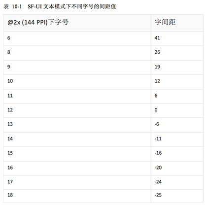

为了突出某些文字或者为了在内容块之间建立视觉关联，你可以依赖由Dynamic Type支持的语义化样式，如标题、正文，你也可以指定字体权重，如 细体或者半粗。使用 Dynamic Type样式使得你的内容能更好地表达含义，但如果你想要对你的设计有更好的把控能力，你可以对特定的文字设置特定的权重。（想要了解更多关于调整字体权重， 可以参阅[UIFont Class Reference](https://developer.apple.com/library/ios/documentation/UIKit/Reference/UIFont_Class/index.html#//apple_ref/doc/uid/TP40006891).）

例如，你可能想要增加某些文字的权重，来帮助用户可视化你的内容的层次结构，或者把用户的注意力吸引到特定的词或短语。另外，你可以通过增加较小文字的权重和减小较大文字的权重，在多个不同字号的、相邻的标签中建立视觉凝聚。字体权重在内容的整体风格和表达中有重要影响，因此你可以选择特定的权重来达到设计目的。

文本尺寸的响应式变化需要优先考虑内容。并不是所有的内容对于用户都是同等重要的。当用户选择更大的文本尺寸时，他们是想要使他们关注的内容更容易阅读；他们并不总是想要屏幕上的每个单词都更大。

例如，当用户选择具备更大易用性的文本尺寸时，邮件将会以更大的尺寸显示邮件的主题和内容，而对于那些没那么重要的信息——如时间和收件人——则采用较小的尺寸。

确保一个自定义字体在不同尺寸下的所有类型都具备可读性。实现这一效果的方法之一是效仿在不同的文本尺寸下iOS系统呈现字体样式的一些方法。例如：

+ 文本永远都不应该小于11点（points），即使是用户选择极小的文本尺寸。相较而言，内容样式使用17点的字号作为大尺寸，这也是默认的文本字号。
+ 通常来说，字号与行距值在每一档的文本尺寸设置中差别为1点。唯一例外的是两种标题的样式，它们在极小、小和中尺寸的设置中均使用相同的字号、行距和字距。
+ 在最小的三种文本尺寸中，字间距相对较大；而在最大的三中文本尺寸中，字间距相对紧凑。
+ 标题和内容的样式使用相同的字体尺寸，同时，为了区分标题与内容样式，标题样式使用更重的值。
+ 导航控制栏的文本使用相同的字号，而内容文本的样式则使用大尺寸的设置（值为17点）。
+ 文本总是使用常规或者中重，一般不适用轻或者加粗。

通常情况下，应用中整体应该使用单一字体。多种字体的混杂会使你的应用看上去支离破碎和草率。相反，使用一种字体和少数样式。根据语义用途，使用UIFont类的API来定义不同文本区域的样式，比如正文或者标题。

## 图标和图形（Icons and Graphics）

### 应用图标（The App Icon）

每个应用都需要一个漂亮的图标。用户常常会在看到应用图标的时候便建立起对应用的第一印象，并以此评判应用的品质、作用以及可靠性。

以下几点是你在设计应用图标时应当记住的。当你确定要开始设计时，请参考[App Icon](https://developer.apple.com/library/ios/documentation/userexperience/conceptual/mobilehig/AppIcons.html#//apple_ref/doc/uid/TP40006556-CH19-SW1)来获取更详细的设计规格与指导。（译者注：App Icon处在iOS Human Interface Guidelines的Icon and Image Design部分，翻译将在后续更新中放出，烦请各位耐心等候。）

+ 应用图标是整个应用品牌的重要组成部分。将图标设计当成一个讲述应用背后的故事，以及与用户建立情感连接的机会。
+ 最好的应用图标是独特的，整洁的，打动人心的，让人印象深刻的。
+ 一个好的应用图标应该在不同的背景以及不同的规格下都同样美观。为了丰富大尺寸图标的质感而添加的细节有可能让图标在小尺寸时变得不清晰。

### 小图标（Small Icons）

iOS提供了一系列小的icon，用以代表各种常见任务与操作，它们常用在标签栏（Tab Bar）、工具栏（Toolbars）与导航栏（Navigation Bar）中。用户通常都已经了解这些内置图标的含义了，因此可以尽可能的多使用它们。

如果需要自定义动作或者内容，你也可以设计自定义图标。设计这些小的线性图标与设计应用图标有很大的区别，请参考[Bar Button Icons](https://developer.apple.com/library/ios/documentation/userexperience/conceptual/mobilehig/BarIcons.html#//apple_ref/doc/uid/TP40006556-CH21-SW1)来了解更多内容。（译者注：Bar Button Icons章节处在iOS Human Interface Guidelines的Icon and Image Design部分，翻译将在后续更新中放出，烦请各位耐心等候）

请注意，你有时候也可以用文字来代替工具栏和导航栏的图标。 就像iOS的日历里面，工具栏上便是使用”今天”,”日历”和”收件箱”来代替图标进行表意的。

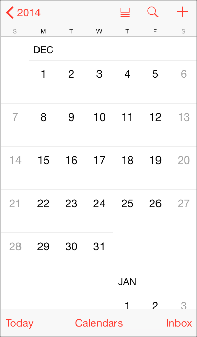

想要决定在工具栏和导航栏中到底是用图标还是文字，可以优先考虑一屏中最多会同时出现多少个图标。 同一屏幕中图标的数量过多可能会让整个应用看起来难以理解。使用图标还是文字还取决于屏幕方向是横向还是纵向，因为水平视图下通常会拥有更多的空间，可以承载更多的文字。

### 图形（Graphics）

iOS应用大多数图形丰富。无论是你需要展示用户的照片，还是需要创建自定义图片，以下这些需求都应该遵守：

+ 支持Retina显示屏。确保你应用中的所有图片资源都提供了高分辨率规格。尤其需要注意的是，iPhone 6 Plus需要提供@3x规格的图片，而所有其他的高分辨率iOS设备都需要提供@2x规格的图片。
+ 显示照片或图片时请使用原始尺寸，并不要将它拉伸到大于100%。你不会希望在你的应用中看到拉伸和变形的图片。可以让用户自己来选择他们是否想要缩放图片。

不要使用从苹果系列产品中复制的图形。这些图形均受版权保护，而且产品的设计可能会频繁改变。

不要将苹果的应用图标，图像或者截图用于你的设计中。所有苹果的设计均受版权保护并且不允许出现在你的UI中，除非它们是 由系统直接提供的。

### 术语和措辞（Terminology and Wording）

你在应用中呈现的每一个字都是与用户进行对话的一部分。把握这样的对话机会，为你的用户提供清晰的表意与愉悦的体验。

设置是面向全体用户的一个基础应用，因此它使用了简明扼要的语言来描述用户可以进行的操作。举个例子，设置→勿扰模式（Do Not Disturb）就没有使用难以理解的复杂技术术语，而是用了简单的语言，给用户描述了里头的一系列操作。

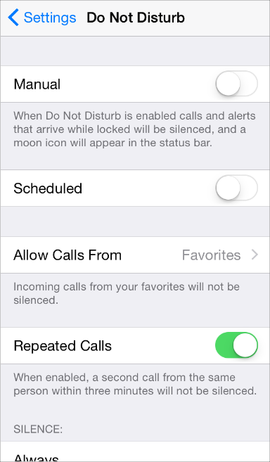

保证你使用的术语是用户能理解的。根据你对用户群的理解来决定在应用中使用什么样的词汇。举个例子，在一款针对小白用户的应用中使用技术术语是不合适的，但对于针对高端用户的应用来说，使用技术术语是很自然的事情。

使用非正式的友好语气，但不需要太过 卑微。避免太正式太僵化，或者太过嘻嘻哈哈，傲慢无礼。请记住，用户可能会反复阅读这些文本，因此有些起初看上去很俏皮的语句，多看几次之后可能会显得烦人。

像新闻编辑一般遣词造句，避免不必要的冗余语句。当你的文案足够简明扼要，用户就可以很轻松地阅读和理解它。确定最重要的信息，精炼它并且突出它，让用户不需要读一大段文字才能了解他们在找什么，以及下一步要做什么。

给控件加上短标签或者容易理解的图标。让用户只扫一眼就能知道这个控件是干什么的。

描述时间时要注意准确性。今天和明天这些词汇确实显得比较友好，但有时候会让用户费解，因为你可能没有办法确定用户当前的时区和时间。举个例子，假如有一项活动会在半夜12点前开始，对于在同一个时区的用户而言，这个活动是在今天开始的，但对于那些在早一点的时区里的用户而言，这个活动在昨天就已经开始了。

为你的应用写一则漂亮的App Store描述，最大程度地把握住这个与潜在用户沟通的绝佳机会。除了准确描述你的应用、强调应用的品质与亮点以外，你还需要：

+ 修正所有的拼写、语法与标点符号错误。这些小错误也许不会影响用户正常使用，但是可能会让他们对应用的整体品质产生负面印象。
+ 尽量少用全大写的词汇。虽然大写单词有时候可以吸引注意力，但是全大写的段落不适合阅读，而且会产生一种朝用户扯着嗓子吼的感觉。
+ 可以描述bug修复情况。如果您的应用新版包含用户一直期待的bug修复，那在你的软件描述中提到这一点就是个很好的做法。

## 与iOS的整合（Integrating with iOS）

与iOS整合，指的是在当前平台上给用户提供一种舒适的、宾至如归般的体验，当然这并不意味着我们要把每一个应用做的和内置应用一模一样。

最好的与iOS整合的方式便是深刻地了解iOS的主题与核心——这一部分在上文为iOS而设计（Designing for iOS）部分中已有详细描述，并寻求出如何在你的应用中融合与表达这种主题。当你这么做的时候，遵循本章中的指引可以帮助你为你的用户提供他们想要的体验。

### 正确使用标准UI元素（Use Standard UI Elements Correctly）

尽可能使用UIkit提供的标准UI元素是一个好主意。多使用标准元素而非自定义元素，你与你的用户都将受益：

+ 标准UI元素会根据iOS官方的更新而自动更新——而自定义元素不会。
+ 标准UI元素对于你自定义外观和行为来说拥有优秀的扩展性。举个例子，iOS中所有的视图（Views，从[UIView](https://developer.apple.com/library/ios/documentation/UIKit/Reference/UIView_Class/index.html#//apple_ref/occ/cl/UIView)中继承的对象）都是 可以使用[TintColor](https://developer.apple.com/library/ios/documentation/UIKit/Reference/UIView_Class/index.html#//apple_ref/occ/instp/UIView/tintColor)属性来定义颜色的，它让应用配色变得很简单。
+ 用户更熟悉和习惯标准的元素，因为他们可以立刻明白你的应用中这些元素的用途。
想要充分地利用标准UI元素的优点，有一些关键点需要特别注意：

严格遵循每个UI元素的[设计规范](http://www.uisdc.com/tag/设计规范)。当你应用中的UI元素的外观与功能都是用户所熟悉的，他们可以很容易地根据先前的经验来使用他们，进而更好地使用你的应用。你可以从这些章节中找到各种UI元素的设计规范：[Bars](https://developer.apple.com/library/ios/documentation/userexperience/conceptual/mobilehig/Bars.html#//apple_ref/doc/uid/TP40006556-CH12-SW1), [Content Views](https://developer.apple.com/library/ios/documentation/userexperience/conceptual/mobilehig/ContentViews.html#//apple_ref/doc/uid/TP40006556-CH13-SW1), [Controls](https://developer.apple.com/library/ios/documentation/userexperience/conceptual/mobilehig/Controls.html#//apple_ref/doc/uid/TP40006556-CH15-SW1), [Temporary Views](https://developer.apple.com/library/ios/documentation/userexperience/conceptual/mobilehig/Alerts.html#//apple_ref/doc/uid/TP40006556-CH14-SW1).

（译者注：上文提到的章节均处在iOS Human Interface Guidelines的第4章，翻译将在后续更新中放出，烦请各位耐心等候。）

不要混用不同版本的iOS里的UI元素。你一定不希望让用户觉得你的UI元素来自于与当前用户的设备版本不同的iOS系统。

大体来说，请避免创造自定义UI元素来表现标准交互行为。先问问你自己为什么一定要创建一个与标准UI元素行为完全相同的自定义元素。如果你只是想改变标准UI元素的外观，可以考虑使用UIKit外观定制API(UIKit appearance customization APIs)，或者给元素填充别的颜色。如果你需要定义一个与标准控件稍有不同的行为，请确保你在改变了这个UI元素的属性和行为之后，这个元素仍然能完成你所希望的操作。如果你需要完全自定义一个行为，最好是设计一个与标准元素完全不相像的自定义元素。

提示：Interface Builder让获取标准UI元素，使用外观定制API（the appearance customization APIs），获取属性，以及在你的应用里使用自定义和系统自带图标变得很简单。想要了解更多Interface Builder的内容，请参阅[Xcode Overview](https://developer.apple.com/library/ios/documentation/ToolsLanguages/Conceptual/Xcode_Overview/index.html#//apple_ref/doc/uid/TP40010215).

不要用系统自带的按钮和图标表达其他含义。iOS提供了多种可用的按钮和图标。请确认你了解它们的准确表意；不要单纯凭借你看到这些图标样式的猜测和理解来解读和使用它们。（你可以在[Toolbar and Navigation Bar Buttons](https://developer.apple.com/library/ios/documentation/userexperience/conceptual/mobilehig/Bars.html#//apple_ref/doc/uid/TP40006556-CH12-SW33)和[Tab Bar Icons](https://developer.apple.com/library/ios/documentation/userexperience/conceptual/mobilehig/Bars.html#//apple_ref/doc/uid/TP40006556-CH12-SW34)中了解到这些按钮和图标的准确含义。）

如果你所需要的功能无法用系统提供的按钮和图标来表现，你也可以设计自定义按钮。自定义按钮的设计可以参考 [Bar Button Icons](https://developer.apple.com/library/ios/documentation/userexperience/conceptual/mobilehig/BarIcons.html#//apple_ref/doc/uid/TP40006556-CH21-SW1).

（译者注：上文提到的章节均处在iOS Human Interface Guidelines的第4章，翻译将在后续更新中放出，烦请各位耐心等候。）

如果你的app是沉浸式体验，那么创造全新的自定义UI是合理的。因为你在创造一个统一的体验环境，让用户在其中能够有所期待并探索如何控制应用。

### 弱化文件和文档处理（Downplay File and Document Handing）

iOS应用可以帮助用户创建和处理文件，但这并不意味着用户需要过分考虑iOS设备的文件系统如何运作。

如果你的应用中支持用户创建和编辑文档，那么提供一个清晰的图形库视图(document library view)让用户能够方便地打开或者新建文档是一个好的做法。理想状况下，这样的图形库视图拥有以下特征：

+ 高度图形化。用户通过屏幕上的缩略图就可以一目了然，快速找出自己想要的文件。
+ 让用户用最少的动作完成自己的任务。比如说，用户可以快速地水平滚动文件列表，然后轻点一下自己想要的文件来打开它。
+ 包含新建文档功能。一个图形库视图应该支持让用户点击一个新建文档的占位图便完成新建文档操作，而不是让用户通过访问别的地方来新建文档。

举个例子，Pages的图形库视图里面，既展示了用户已存在的文档，也加入了便捷的新建文档操作。

提示：你可以使用Quick Look Preview功能来让用户预览你的应用中的文件，哪怕你的应用不能打开这些文件。想要了解如何在你的应用中提供这个功能，请参阅[Quick Look](https://developer.apple.com/library/ios/documentation/UserExperience/Conceptual/MobileHIG/QuickLook.html#//apple_ref/doc/uid/TP40006556-CH43-SW1).

如果你的应用允许用户使用在其他应用中创建的文档，你可以通过模态文档选择视图控制器（modal document picker view controller）来帮助用户触达它们。这个控制器可以提取用户在iCloud中的文档，还可以通过文档提供者扩展（Document Provider extensions）来提取在其它应用中创建和储存的文件。想要了解更多文档提供者扩展的内容，可以参考[Document Provider Extensions](https://developer.apple.com/library/ios/documentation/userexperience/conceptual/mobilehig/AppExtensions.html#//apple_ref/doc/uid/TP40006556-CH67-SW5); 想要了解更多文档提取视图控制器，请参考[Document Picker Programming Guide](https://developer.apple.com/library/ios/documentation/FileManagement/Conceptual/DocumentPickerProgrammingGuide/Introduction/Introduction.html#//apple_ref/doc/uid/TP4001445).

给用户足够的信心，让他们相信除非主动取消或者删除，他们的成果会被随时妥善保存。如果你的应用帮助用户创建于管理文档，不能要求用户每次都能及时保存。无论是打开另一个文档或切换应用的时候，iOS应用都应当承担起帮助用户保存输入内容的责任。

如果你的应用的主要功能不是创造内容，但又允许用户查看或编辑信息，这种情况下你需要询问用户是否要保存修改。在这种场景下，比较好的做法是提供“编辑”按钮，点击后进入编辑状态，同时编辑按钮变成“保存”和“取消”按钮，这种变化可以提示用户当前处于编辑模式。“保存”可以保留修改内容，“取消”则退出编辑模式。

### 必要时提供可配置选项（Be Configurable If Necessary）

某些应用需要用户手动安装或设置选项，但是大部分应用不需要如此。一个好的应用可以让大部分用户快速上手，并通过主界面给用户提供便捷的调整体验的方式。

当你的应用在默认状态下就能满足大部分用户的期望，用户对设置的需求就减少了。如果你需要储存用户的基本资料，可以优先向系统请求和拉取相关信息，而不是上来就让用户自己填写它。如果你一定要提供用户鲜少用到的设置项，请参考[App Programming Guide for iOS](https://developer.apple.com/library/ios/documentation/iPhone/Conceptual/iPhoneOSProgrammingGuide/Introduction/Introduction.html#//apple_ref/doc/uid/TP40007072)中的[The Setting Bundle](https://developer.apple.com/library/ios/documentation/iPhone/Conceptual/iPhoneOSProgrammingGuide/Inter-AppCommunication/Inter-AppCommunication.html#//apple_ref/doc/uid/TP40007072-CH6-SW7)部分来了解如何在代码中定义它们。

尽可能在主UI中提供设置选项。如果这个设置项代表着用户一个基本任务，又或者用户在进行主线任务时有可能频繁改变设置，那么将设置项放在主UI中会很方便。如果用户只是偶尔才会用到设置项，那么可以将其放在独立的视图中。

如果应用内相关设置需要在系统设置中改变，帮助用户直接访问系统设置。尤其是，如果你要用一段文字来描述如何改变这个设置，比如“设置>隐私>定位服务”，倒不如直接放置一个按钮，点击后即可到达设置中的定位服务。想要了解如何实现，请参考 [Settings Launch URL](https://developer.apple.com/library/ios/documentation/UIKit/Reference/UIApplication_Class/index.html#//apple_ref/doc/constant_group/Settings_Launch_URL).

### 充分利用iOS技术（Take Advantage of iOS Technologies）

iOS提供了丰富的技术方式来支持用户完成他们所期望的各种任务和场景。这意味着在绝大多数情况下，将系统提供的技术整合到你的应用中，往往比自定义一种新的技术更为可靠。

某些iOS技术，比如多任务并行（[Multitasking](https://developer.apple.com/library/ios/documentation/userexperience/conceptual/mobilehig/Multitasking.html#//apple_ref/doc/uid/TP40006556-CH38-SW1)）与语音向导（[VoiceOver](https://developer.apple.com/library/ios/documentation/userexperience/conceptual/mobilehig/VoiceOverAccessibility.html#//apple_ref/doc/uid/TP40006556-CH45-SW1)）等等，是所有应用都应该包含的系统级特性。而另外一些技术是否整合到应用中，则取决于应用本身的功能性。比如处理门票和礼品卡的应用（[Wallet](https://developer.apple.com/library/ios/documentation/userexperience/conceptual/mobilehig/Passbook.html#//apple_ref/doc/uid/TP40006556-CH33-SW1)）支持用户在应用内内购（[In-App Purchase](https://developer.apple.com/library/ios/documentation/userexperience/conceptual/mobilehig/InAppPurchase.html#//apple_ref/doc/uid/TP40006556-CH36-SW1)），展示应用内置广告（[iAd Rich Media Ads](https://developer.apple.com/library/ios/documentation/userexperience/conceptual/mobilehig/iAdRichMediaAds.html#//apple_ref/doc/uid/TP40006556-CH41-SW1)）则可以整合 [Game Center](https://developer.apple.com/library/ios/documentation/userexperience/conceptual/mobilehig/GameCenter.html#//apple_ref/doc/uid/TP40006556-CH37-SW1)，同时支持[iCloud](https://developer.apple.com/library/ios/documentation/userexperience/conceptual/mobilehig/iCloud.html#//apple_ref/doc/uid/TP40006556-CH35-SW1).

# （二）设计策略

## 设计原则(Design Principles)

### 美学完整性(Aesthetic Integrity)

美学完整性不评判应用的视觉设计，也不是用来描述应用的风格特征。美学完整性是指在一款应用的视觉表现和交互行为与功能结合后所传达出的整体一致性。

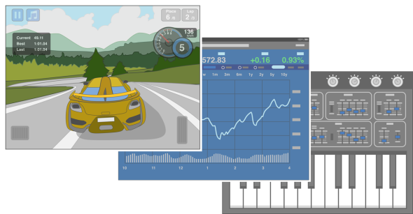

人们关心应用是否提供了应有的功能，但是也会潜移默化甚至是很直接地被应用的视觉表现和交互行为所影响。举个例子，一款协助用户完成任务的应用，可以通过使用精美而又无干扰的装饰性元素、标准的控件和可预期的交互行为很好地帮助用户聚焦在任务本身上。这样，应用就能传达出清晰而一致的信息，使得人们信任它。但是，如果应用使用干扰的、琐碎的或随意的UI来呈现任务，那么人们可能会对其可靠性和可信赖度产生怀疑。

另一方面，在沉浸式应用中—例如游戏—用户期待惊艳的视觉表现，为用户带来乐趣和刺激，并鼓励用户进行探索。用户不是要在游戏中完成严肃的或程序式的任务，他们更期待游戏的视觉表现和交互行为与当前的目的进行整合。

### 一致性(Consistency)

一致性可以让人们在一款应用中的不同部分甚至不同应用间复用使用同样的认知和技能。一款具备一致性的应用不应盲从地复制其他应用，也不应在风格上一成不变。相反，它们专注于让人们觉得舒适的标准和范例，并提供应用内部统一的体验。

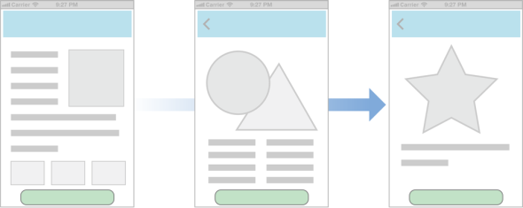

在判断一款iOS应用是否要遵守一致性原则时，请思考如下问题：

+ 应用是否和iOS标准一致？是否正确地使用了系统提供的控件、视图和图标？是否按照用户所预期的方式整合了设备的特性？
+ 应用是否内部统一？文案是否使用了一致的措辞和风格？同样的图标是否表意相同？在不同的位置执行同样的操作时，人们是否能能预期会发生什么？应用中自定义的UI元素是否在外观和行为上保持一致？
+ 应用是否和先前的版本保持一致？条款和意义是否保持不变？基本概念和主要功能是否发生了变化？

### 直接操作(Direct Manipulation)

当人们不再使用一堆控件进行操作，而是直接在屏幕上操作对象时，他们能更集中精力完成任务，也更容易理解这些行为所产生的结果。

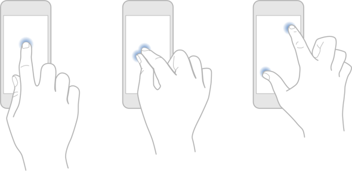

使用多点触摸界面，人们可以通过捏合操作来直接放大和缩小图片或文本内容。在游戏中，玩家可以直接与屏幕上的对象进行交互。例如，游戏中可能会显示密码锁，用户可以通过转动它来打开。

在一款iOS应用中，如下情况中人们应该能够进行直接操作：

+ 旋转或者移动设备来影响屏幕上的对象
+ 使用手势来操作屏幕上的对象
+ 显示即时可视的操作反馈

### 反馈(Feedback)

反馈可以明示人们的行为，呈现操作结果，并更新于任务进程之中。

iOS内置的应用对用户的每个行为都提供了可感知的反馈。当人们点击列表项和控件时，它们会被临时高亮，并会在操作过程中持续一段时间，以此展示控件被执行的过程。

精细的动画会给人们带来有意义的反馈，帮助阐明行为的结果。例如，列表中新增一项时的动画可以从视觉上帮助人们发现列表的变化。

音效同样可以为人们提供有效的反馈，但不应成为唯一的反馈方式，因为人们不一定能听到。

### 隐喻(Metaphors)

当应用中的虚拟对象和交互行为与用户已经熟悉的体验相似时—无论这些体验是来源于真实或数字生活—用户就可以快速地掌握如何来使用这个应用。

当应用使用隐喻来传达某种用法或体验时，最好不要让隐喻突破所依赖的对象或交互行为本身的限制。(译者注：此处可理解为对于隐喻的使用应量力而为，不要过于牵强。)

由于人们实际上是和屏幕进行物理上的交互，所以iOS应用有很大的余地来使用隐喻。iOS中的隐喻包括：

+ 移动分层视图来显示被遮挡的内容
+ 拖曳、轻扫和滑动游戏中的对象
+ 点击开关，滑动滑块，转动选择器
+ 轻扫来翻阅书本或杂志

### 用户控制(User Control)

是人—而不是应用—发起和控制行为。应用可以对用户进行操作建议，对有危害的后果予以警示，但是不应替用户来做决策。好的应用会在用户需要时给予帮助和避免不必要的结果之间作出平衡。

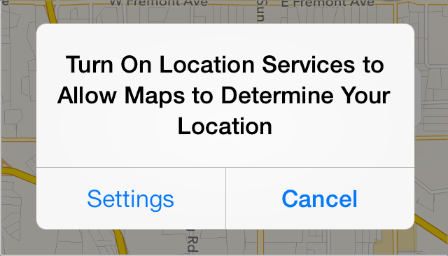

当对应用的交互行为和控件都较为熟悉和可预期时，用户会觉得应用更易上手。那些简单直白的交互行为更容易被用户所理解和记住。

人们会希望在一个操作被执行之前有足够的机会来取消，也希望在执行一个不可逆的操作之前可以有机会来进行确认。最后，人们还会希望能够停止正在执行中的操作。

## 从概念到产品(From Concept to Product)

### 定义应用(Define Your App)

应用的定义是对应用主要功能和目标用户的简明具体的描述。

尽可能早的创建应用的定义可以帮助你将一个想法和功能清单转换为用户想要的条理清晰的产品。在开发过程中，可以使用定义来决定某些功能和行为是否合理。使用以下几个步骤来创建一个可靠的应用定义。

**1.列出所有你认为用户可能喜欢的功能**

可以直接进行头脑风暴。此时，你需要列出所有与产品核心想法有关的任务。不用担心清单太长，因为接下来会进行删减。

假设你一开始的想法是开发一个帮助人们购买食品杂货的应用。你可以思考在进行这项活动时，会涉及到那些相关的任务，这些就是用户可能感兴趣的潜在功能。例如：

+ 创建清单
+ 查找食谱
+ 比较价格
+ 定位商店
+ 给食谱做注释
+ 查找并使用的优惠劵
+ 查看烹饪演示
+ 探索不同的烹调方法
+ 寻找某些食材的替代物

**2.确定目标用户**

现在你需要清楚的将你的应用用户与其他iOS用户区分开来。确定在此情此景下，什么是对你的用户最重要的。在食品杂货例子中，你可能需要问问你的用户：

+ 通常是在家里做饭还是更喜欢现成的食物
+ 是忠实的优惠券用户还是认为优惠券没多大价值
+ 喜欢寻找特别的食材还是喜欢基本食材
+ 严格的按照食谱做菜还是只把食谱当做灵感来源
+ 喜欢少量多次购买还是一次性购买大量食物
+ 希望能保留多个不同目的的购物清单还是只希望记录回家路上需要购买的几个东西
+ 坚持使用固定的品牌还是会使用方便的替代品
+ 习惯于购买固定的一些物品还是会按照食谱来购买

思考过这些问题之后，假设你可以提取出目标用户的三个特征：喜欢按照食谱进行尝试，时常很匆忙，通常情况下比较节俭。

**3.根据目标用户过滤功能清单**

如果在确定了一些用户特征后，你最终得到几个主要功能，恭喜你在做正确的事情：好的iOS应用应该是高度聚焦在能帮用户完成的任务上的。

例如，即使第一步想出的那些可能需要的功能都是有用的，也不一定是第二步定义的目标用户需要的。

当你在目标用户的使用情境下检查功能清单时，就可以判断你的应用应该聚焦在三个主要功能上：创建清单，获得并使用优惠劵，获得食谱。

此时你就可以给出应用定义了，总结该应用为谁做和做什么。食品杂货购买应用的定义可能如下：

“为热爱烹饪且节俭的用户订制的创建购物清单工具。”

**4.不止于此**

应用定义应该贯穿于整个开发过程，使用应用定义确定功能，控件，措辞的合理性。例如：

**当你想要新增一个功能时**，问问自己这对应用的主要目的和目标用户是否非常重要。如果不是，可以置之不理。例如，你已经确定了你的用户对大胆新颖的烹饪方法感兴趣，那么着重展示盒装蛋糕和现成的食物就不太合适。

**当你考虑用户界面的外观和操作时**，问问你自己你的用户更喜欢简单的、流线型的风格，还是有明显主题的风格。以用户目标为指导，理解用户期望通过你的应用完成什么，例如快速找到答案，找到深入而全面的内容或者娱乐。例如，尽管你的食品杂货清单应用需要易于理解和快速上手，但你的用户还是可能倾向于一个有关食物的主题界面。

**当你考虑应该使用怎样的措辞时**，考虑用户在这个领域的专业程度。例如，尽管你的用户可能不是由专业的大厨组成，但你也可以肯定他们希望看到有关食材和技术专用的措辞。

### 为任务量身订制界面(Tailor Customization to the Task)

最好的iOS应用根据清晰的目标和易用性来平衡用户界面的设计。为了达到这种平衡，要确保在设计阶段前期就考虑定制化。因为考虑品牌性，原创性和适销性通常会影响定制化的决策，所以专注于定制化怎样影响用户体验是难的。

开始考虑应用中的任务：用户执行这些任务的频率如何，在什么样的环境下进行？

举个例子，想象一个计算器应用使用的是精心设计的，充满艺术感的风格，并且使用了创新的层级去显示大家熟悉的计算元素。这像艺术品一样的细节渲染和创新层级并不会影响用户去理解怎样点击按钮和查看计算结果。但是对于只是简单的需要完成工作的用户，这种新奇的体验和美丽的界面很快就会失去效用，并且可能成为一种妨碍。

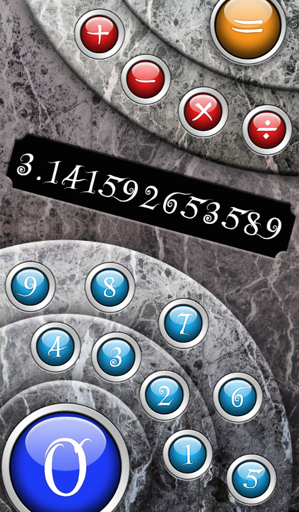

相反，随身录音室应用(GarageBand)可以不展示好看的、逼真的乐器来帮助用户制作音乐，但这样会使应用缺少身临其境的愉悦感。在随身录音室里，界面不只是向用户展示了如何使用，同样使得制作音乐的主任务更容易完成。

当你思考定制化如何增强或减弱用户完成任务的注意力时，记住以下几点：

**定制总要有缘由**。理想情况下，定制化的用户界面能促进用户完成任务并增强他们的体验。你最好尽可能的用任务驱动定制化决策。

**尽量避免增加用户的认知负担**。用户对标准界面元素的外观和行为都已经很熟悉了，所以他们不用停下来思考如何使用它们。当用户面对外观和行为与标准不同的元素时，他们就失去了经验的优势。除非你的独一无二的元素能够使任务更容易完成，否则用户很可能不喜欢被强制学习一些在其他应用都不通用的步骤。

**保持内部的一致性**。你的应用中自定义元素越多，保持这些元素外观和行为的一致性就越重要。如果用户花费时间去学习了你创建的那些不熟悉的控件，那么他们会希望新学到的这些操作能够在整个应用中通用。

**总是以内容为重点**。因为标准元素很熟悉，所以它们不会分散用户在内容上的注意力。当你自定义用户界面时，注意确保界面元素不会抢走用户对内容的注意力。例如，如果你的应用允许用户观看视频，你可能选择设计一个自定义的重播控件。但是不管你用的是自定义还是标准的重播控件，都没有它是否在用户开始观看后隐藏点击屏幕后出现来的重要。

**在对标准控件进行重设计时再三思考**。如果你不只是想自定义标准控件，而是想重设计，确保你的重设计能提供尽可能多的信息。例如，你设计了一个开关控件，它没有可以指明相反状态存在的信息，那么用户很可能意识不到这是个有两个状态的控件。

**一定要彻底测试自定义的界面元素**。在测试过程中，近距离的观察用户是否能预测你的元素如何使用以及是否能容易的与它们交互。例如，如果你创建的控件的可点击区域小于44 x 44像素，用户点击时就会有困难。或者如果你创建了一个视图对点击和滑动的反馈不一样，确保这个视图提供的功能值得用户去额外关注交互的不同。

### 原型 & 迭代(Prototype & Iterate)

在你投入工程资源实现设计之前，最好先创建原型来进行用户测试。即使只有几个同事来帮你测试原型，你也会收获一些关于应用功能和用户体验的新鲜观点。

在设计的早期阶段，你可以使用纸质的原型或者线框图去呈现主要的视图和控件，并且标明每个页面之间的跳转关系。你可以从线框图测试中获得一些有用的反馈，但是线框图的稀疏性有可能会误导用户。因为用户很难想象当线框被实际内容填满时体验会有什么样的变化。

如果你有一个可以在设备上运行的原型，那你可以得到更多有用的反馈。当用户能在设备上与你的原型进行交互时，他们能更容易的发现应用中哪里功能不满足预期，哪里体验过于复杂。

创建可靠原型的最简单的方法是使用基于故事版的Xcode模板创建一个基础应用，然后使用一些类似于占位符的内容来进行填充。(故事版可以涵盖应用中的所有界面，并且包括界面之间的跳转关系。)接着，将这个原型导入到设备中，这样被测者就可以有一个尽可能真实的体验了。

你不需要在原型中提供大量的实际内容或者使每一个控件都可用，但是你确实需要营造足够的情境来保证真实的体验。并且需要在典型用户体验和非典型的边缘情况之间做好平衡。例如，如果你的应用需要处理很长的列表项，你的原型就不能只显示一两个条目。而且在用户测试交互中，只要被测者能够点击屏幕上的一个区域进入到下一个逻辑页面或者完成主任务，那他们就可能提供更有建设性的反馈。

当你使用Xcode应用模板来创建原型时，你可以免费使用很多功能，并且它可以相对容易的进行设计中的响应反馈调节。在你确定设计方案并投入资源进行实现之前，应该对原型进行多次迭代测试。想要开始学习Xcode，请参考[Xcode Overview](https://developer.apple.com/library/ios/documentation/ToolsLanguages/Conceptual/Xcode_Overview/chapters/about.html#//apple_ref/doc/uid/TP40010215).

## 案例学习：从桌面到iOS(Case Study: From Desktop to iOS)

### iPad版Keynote应用(Keynote on iPad)

桌面版的Keynote 应用是一个十分强大而又灵活的应用，可以创建非常优秀的幻灯片。人们喜爱Keynote将简单易用与细粒度的操作结合进而控制无数精确细节的方式，如动画和文本属性等。

iPad版的Keynote提取了桌面版Keynote的核心要素，并通过创造以下的用户体验使它在iPad上更舒适：

+ 专注于用户输入的内容
+ 通过削减功能降低系统的复杂度
+ 提供有用而又令人愉悦的快捷操作
+ 延续桌面版本的体验
+ 利用动人的动画提供良好的反馈与交流

Keynote用户能很快理解如何使用iPad版，是因为它使用了iPad原生的范例，符合了用户对功能上的预期。新用户可以用简单、自然的方式直接操控内容，所以可以很容易学会如何使用iPad版的Keynote.

Keynote从桌面版向iPad版的转变是基于从细节到整体的大量修改和重新设计的。以下是一些明显的修改：

**流线型的工具栏**。工具栏中只有少数的元素，但是它们是用户在创建内容时所需的所有功能和工具的统一入口。

**简化并优先响应用户焦点的检查器**。对于用户所选的需要修改的对象，iPad版的Keynote能自动控制其工具和属性。(译者注：特别是根据当前的操作对象而有限选择某些工具。)通常，人们可以在第一检查器视图中完成他们需要的所有修改操作。如果他们需要修改那些不常用的属性，他们可以下拉另一个检查器视图来进行。

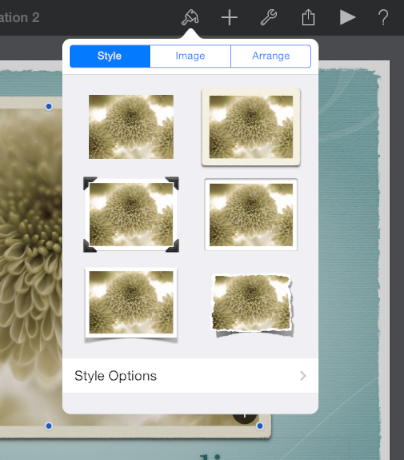

**丰富的预设样式集**。人们可以利用预设的样式很简单地改变对象(如表格或图表)的外观或者感觉。除了颜色之外，每个集中，例如表格的标题和轴区分标识等的预设属性都被设计得与整体的主题和谐一致。

**直接操作内容，丰富有意义的动画**。在iPad版的Keynote中，用户可以拖动滑块到一个新的位置，可以扭动旋转一个对象，也可以轻击图片来选中它。iPad版Keynote的响应动画进一步加强了这种可直接操作的印象。例如，用户在移动某个滑块时它通常会暂停，而当它被放置在一个新的位置时，环绕在周围的滑块将会向外扩散给它留出空间。

### iPhone版邮件应用(Mail on iPhone)

邮件应用是OS X中一款好用而又广受好评的常见应用。它也是一个很强大的程序，可以允许用户撰写、接收、分类和存储邮件，追踪行动和事件，也可以编写备忘录和邀请等。桌面版的邮件应用通过一系列的窗口提供了这些强大的功能。

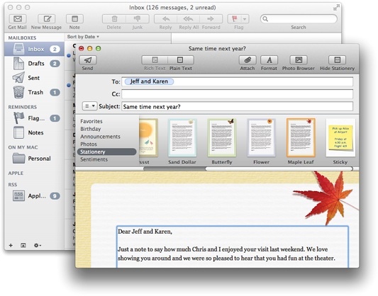

iPhone版的邮件专注于桌面版邮件的核心功能，帮助人们接收、撰写、发送和组织他们的信息。为了塑造移动iPhone版的邮件应用，将这些功能浓缩在为其量身定制的界面之中，做了如下的工作：

+ 将人们的内容前置和居中的合理化呈现
+ 专为处理不同任务而设计的不同视图
+ 易于浏览并符合认知的信息结构
+ 适时提供强大的编辑和组织性工具
+ 用微妙且动人的动画来传达动作和提供反馈

必须明白的是，相对于桌面版的邮件应用来说，iPhone版的邮件应用不是(注：或者说并不需要是)一个更好的应用，而是为移动端用户重新设计的邮件应用。iPhone版的邮件应用专注于桌面版的功能子集并将它们呈现在一个吸引人的精简界面之中，据此为移动端的用户提供了核心的邮件体验。

为了使邮件应用的体验能适应移动场景，iPhone版的邮件应用在几个关键的方面革新了用户界面。

**直接、高度专注的页面**。每个页面显示了邮件应用体验的一个方面：账户列表、邮箱列表、消息列表、消息查看和编辑视图。用户可以在一个屏幕内滑动查看完整的内容。

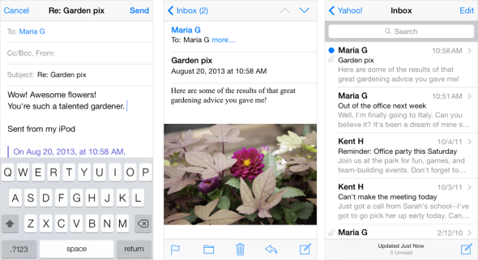

**简单、可预期的导航**。通过每屏的一次点击，用户可以逐层展开综合内容(账户列表)进入具体页面(一封消息)。每个页面会显示一个标题用以指示用户所在的位置，以及一个返回按钮用以更容易地回溯到他们之前的步骤。

**需要时即可获取的、简单的点击性控件**。基本上在任何场景之下，编写邮件和查阅新邮件都是人们首要希望进行的操作，因此iPhone版的邮件应用保证了这两个功能在多个页面中都可以便利地进行。当用户查看一封消息时，就会显示诸如回复、移动和删除等对消息的操作。

**针对不同任务的不同类型的反馈**。当人们删除一封消息时，它会动态地进入垃圾桶图标中。当人们发送一封消息时，可以看到它的发送过程；而当发送结束时，人们可以听到一个特别的声音提示。通过消息列表页面工具栏的副标题，用户通过简单一瞥就可以查看邮箱上次更新的时间。

### iOS系统内的网页内容(Web Content in iOS)

iOS版的Safari应用在iOS设备上提供了出众的移动网页浏览体验。人们喜欢阅读清晰的文字和图片，也希望能通过旋转设备或者捏合和点击屏幕来调整视图。

基于标准建立的网站可以在iOS设备上显示得很好。特别是那些能侦测设备并不需要插件的网站可以同时在iPhone和iPad上都表现得很好，两者之间不会需要太多的修改，即使有也很小。

除此之外，成功的网站应具备以下的特性：

+ 如果页面宽度需要匹配设备宽度，可以设置合适的视窗(viewport)来适应设备
+ 避免CSS中固定的定位，以便当用户缩放或拖动页面时内容无法被移出屏幕
+ 拥有一套基于触控操作的用户界面，而不是依赖基于传统点击操作的交互

有时候，额外的一些修改可以(使页面)更合理。例如，在iOS系统中，很多网页应用会设置合适的视窗(viewport)宽度并通常隐藏Safari的UI。如欲了解如何进行这些修改，参见[Safari Web Content Guide](https://developer.apple.com/library/ios/documentation/AppleApplications/Reference/SafariWebContent/UsingtheViewport/UsingtheViewport.html#//apple_ref/doc/uid/TP40006509)章节中的[Configuring the Viewport](https://developer.apple.com/library/ios/documentation/AppleApplications/Reference/SafariWebContent/ConfiguringWebApplications/ConfiguringWebApplications.html#//apple_ref/doc/uid/TP40002051-CH3)和[Configuring Web Applications](https://developer.apple.com/library/ios/documentation/AppleApplications/Reference/SafariWebContent/ConfiguringWebApplications/ConfiguringWebApplications.html#//apple_ref/doc/uid/TP40002051-CH3).

网站也可以通过其他的方法适配桌面网页到iOS端的Safari浏览器中：

使键盘适应iOS端的Safari. 当键盘和格式辅助信息出现时，iPhone上的Safari应用会将你的网页显示在URL地址下方和键盘与格式辅助信息上方。

使弹出式菜单适应iOS端的Safari.在桌面版的Safari应用中，弹出式菜单会包含很多选项，就如在其他OS X应用中一样。在必要的情况下，菜单展开后可以超出应用窗口的边界以显示其中的所有选项。在iOS版的Safari应用中，弹出式菜单由原生的元素所呈现，这样能提供更好的用户体验。例如，在iPhone上，弹出式菜单会出现在选择器(picker)当中，选择器里会一个用户可选择的选项列表。(欲了解更多选择器控件的内容，可以参见[Picker](https://developer.apple.com/library/ios/documentation/UserExperience/Conceptual/MobileHIG/Controls.html#//apple_ref/doc/uid/TP40006556-CH15-SW23).)

# （三）iOS 技术

## 3D触摸(3D Touch)

3D Touch 给 iOS 9 用户提供了一个新的交互维度。在所支持3DTouch的设备上，人们可以通过按压应用的图标去快速选择应用定制的操作。在应用内，人们可以使用多种按压操作去获取一个项目的预览，可以在独立的视图里打开一个项获取相关操作。(了解更多在你的代码中如何添加3D Touch支持，参阅 Adopting 3D Touch on iPhone .)

### 轻压和重压(Peek and Pop)

轻压让用户可以在不离开他们当前环境的情况下预览一个项和执行相关操作。支持轻压的该项会在轻压后给出一个小矩形视图作为反馈。

在Safari中的一个轻压视图

在Safari轻压中的快速操作

轻压(Peek)：

+ 当用户按压在一个支持轻压的项上时出现轻压，用户手指抬起后会消失
+ 当用户在轻压视图下再更加重一点的按压称之为重压，重压可以查看该项的详细视图
+ 当用户在轻压视图中向上滑动，可以提供与该项相关的快速操作

当用户轻轻按压在屏幕，支持轻压的这个项会展示一个你提供的矩形视图，示意可以进行下一步交互操作。那个视图应该够大，这样才能让用户手指不会混淆内容，这个视图应该足够细节，这样可以让用户选择是否去更加重一点按压从而转换到轻压视图。

重要

你在应用中始终如一提供轻压和重压的体验是至关重要的。如果你在有些地方支持轻压和重压，在某些地方不支持，用户有可能认为你的应用或者他们的设备出现了问题。

使用轻压去为该项提供一个生动的，内容丰富的预览。当轻压能够给用户提供关于该项的足够信息，从而帮助他们扩展当前的任务，这样做是最好的。例如，在用户决定好是在Safari中打开信息中的网页还是分享这个链接给朋友之前，用户可以使用轻压预览信息中URL的页面。在表单视图中，轻压可以给用户提供一个行项的详细内容。

为每个轻压提供重压。虽然一个轻压可以提供给用户所需要的大部分信息，但是你应该可以让用户过渡到重压，从而让用户放开当前正在进行的任务，转移专注力到该项上来。重压的内容应该与用户点击该项后的内容一致。

不要为同样一个项授予轻压和编辑菜单(Edit menu)两个功能。当同一个项的这两个功能都启用的时会很混乱。(获取更多编辑菜单信息，参看 [Edit Menu](https://developer.apple.com/library/ios/documentation/UserExperience/Conceptual/MobileHIG/EditMenu.html#//apple_ref/doc/uid/TP40006556-CH46-SW1).)

在轻压操作里，避免展现类似按钮的界面元素。如果用户抬起手指去点击像按钮的元素，轻压会消失。

如果可能，提供轻压快捷操作。 在轻压里，用户可以向上滑动去显示该项的相关操作。例如，Mail里的轻压快捷操作包括回复全部，转发和删除信息。并不是每个轻压都需要快捷操作，但是如果你已经为该项提供定制的点击并长按的操作，那么最好在轻压里提供相同的操作从而替代点击并长按操作。(注意在网页视图中，轻压快速操作是自动提供的。)

不要将轻压作为唯一开启该项的指定操作的方式。不是每一个设备都支持轻压和重压，一些用户可能选择关掉3D Touch, 因此在你的应用中去寻找其他方式实现轻压的功能是非常重要的。当你的应用在较旧的设备上运行时，可以把轻压的快捷操作映射到一个视图里，让用户通过点击并长按获得。

### 主屏幕快捷操作(Home Screen Quick Actions)

主屏幕快捷操作可以在主屏幕给用户呈现方便的、有用的、应用特定的操作。

Camara的主屏幕快捷操作

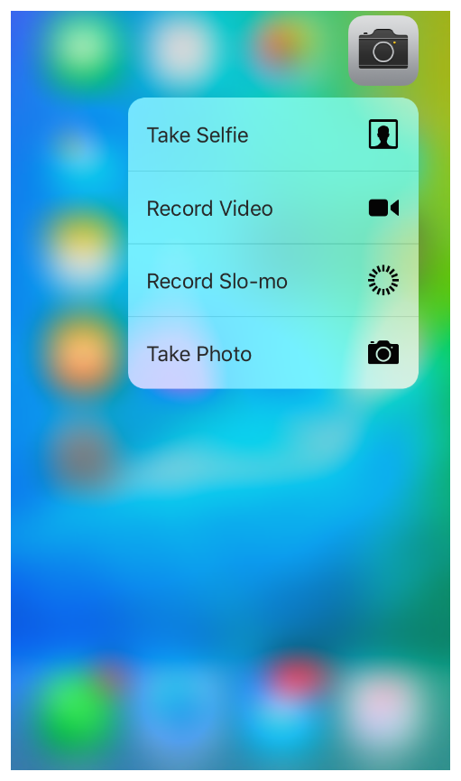

Mail的主屏幕快捷操作

主屏幕快捷操作：

+ 当用户在主屏幕采用比点击且长按更重的按压，按压在应用图片上时，出现屏幕快捷操作
+ 它会显示一个你提供的短标题，一个图标和可选的副标题
+ 它不支持其他定制的内容
+ 它可以随着你应用的更新，更新显示的信息

使用主屏幕快捷操作去开启引人注目的、高价值的任务。例如，Maps可以让用户不需要打开Maps，通过在当前位置附近搜索就可以获得回家的方向。一个应用至少需要把一个有用的任务放在主屏幕快捷操作里；你可以提供最多四个快捷操作。

避免使用主屏幕快捷操作去减少应用里导航的内容。如果用户访问你应用的重要区域非常困难和耗时，那么首先去修改你的应用的导航，这样做是可以让所有用户都获益的。接着，可以去为有用的深层次链接提供主屏幕快捷操作，从而开启这些有用的、创造性的任务。

不要把主屏幕快捷操作作为通知用户的一种方式。iOS用户期望以其他方式接收应用中的信息(更多信息参看 [Notifications](https://developer.apple.com/library/ios/documentation/UserExperience/Conceptual/MobileHIG/NotificationCenter.html#//apple_ref/doc/uid/TP40006556-CH39-SW1))。

为主屏快捷操作提供一个简洁的标题(可有副标题)和一个模板的图标。标题应该直接传达这个操作的结果；例如，“回家的方向”，“新建联系人”，和“新建信息”。你也可以提供一个副标题给用户更多上下文信息。例如，Mail使用一个副标题在主屏快捷操作的重要位置去告诉用户有未读信息。 不要把你的应用名字或者无关的信息放在标题和副标题里，同时要考虑到使用本地化的用语。

保持标题的简洁不会被切断从而帮助用户快速理解操作是非常重要的。如果你提供的副标题一行显示不全，系统会截断；如果你没有副标题，系统会把一行展示不完全的长标题以两行展现。

你可以从很多系统提供的模板图标中选择图标，你也可以创作定制的模板图标。更多关于图标尺寸、内边距和定位的详细引导信息，可以下载[主屏快速操图标模板](https://developer.apple.com/design/downloads/Quick-Action-Guides.zip)。更多关于设计模板图标的信息，参看[Template Icons](https://developer.apple.com/library/ios/documentation/UserExperience/Conceptual/MobileHIG/BarIcons.html#//apple_ref/doc/uid/TP40006556-CH21-SW1)。

系统会自动安排图标在快速操作列表中的位置是在左侧或者在右侧，这依赖于你的应用的图标在用户主屏幕的位置。(摒除图标在列表中的位置，在自左向右的语言中文字总是左对齐。)这里有主屏快捷操作的多种展现方式的例子。 

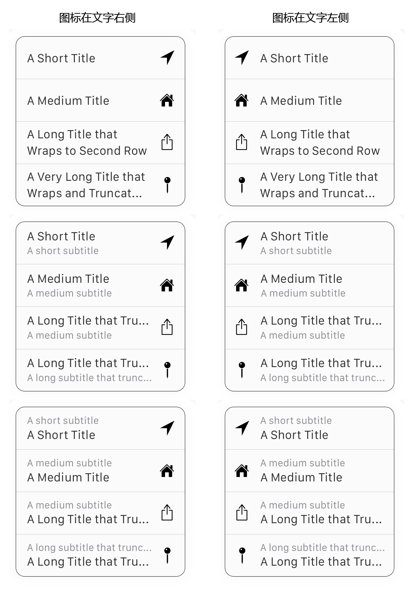

## Live Photos

Live Photos 让用户在丰富的声音和动作环境下，捕捉和再现他们喜爱的回忆。从iOS 9开始，相机(Camera)应用可以捕捉附加的内容(拍照之前和结束后的声音和额外的画面)为传统的、静止的图片增加生活气息。

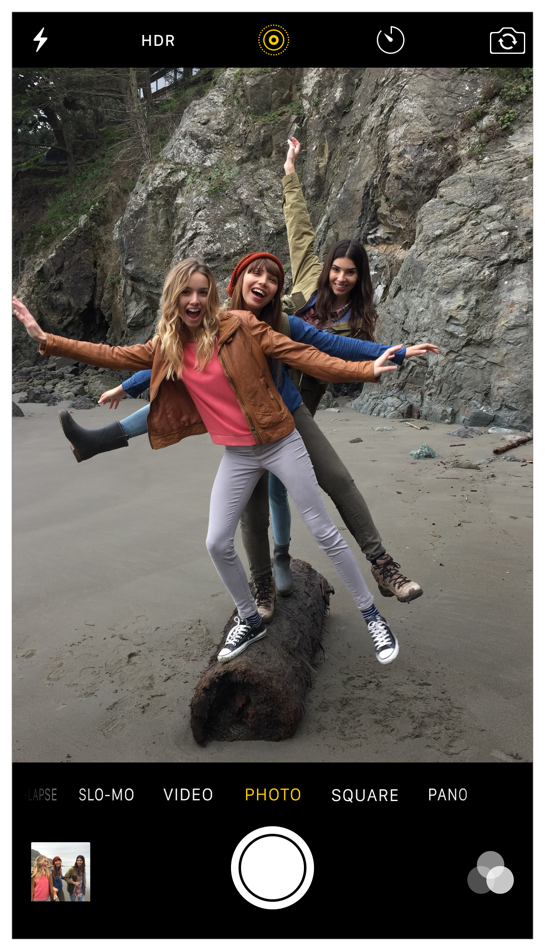

在iOS9.1及之后的版本中，你的应用可以让用户享受和分享Live Photos。这个指引可以帮助你给用户提供更好的体验。

在不支持Live Photo的环境中，把Live Photo像传统照片一样展示。不要在支持Live Photos的环境中，自定一种与Live Photo相似的体验。

不要分开展现Live Photo的附加画面和声音。要让用户在不同的应用中体验Live Photos时，有一致的视觉呈现和交互方式。把Live Photo拆分开展现是一个很坏的体验。

确保用户可以区分Live Photo 和传统静止图片。在用户分享照片时，帮助他们做好区分是特别重要的。最好在用户查看一个LivePhoto的时候，展现一点移动作为提示。万一这个提示没有起到作用，你可以在LivePhoto上展示一个系统提供的标记。LivePhoto不要展现一个像视频里回放按钮的界面元素。 

注意

上图这种情况，不支持像照片应用里全屏浏览滑动切换照片时的显示的

把用户所做的调整应用到Live Photo的所有帧中。如果你的应用可以让用户为照片添加滤镜或者调整，应确保它可以作用于整个LivePhoto中。如果你不支持调整用户想分享的LivePhoto的所有内容，要让他们知道可以以传统照片的方式分享。 让用户在决定分享前，可以预览这个Live Photo的所有内容。如果你的应用UI可以让用户选择照片分享，要为他们提供一个把Live Photo作为传统照片分享的方式。 如果你使用系统提供的标记，应该把它放在每个LivePhoto上同样的位置。标记可以放在一个不会影响用户查看照片的角落。确保在你的应用中采用一致的方式添加标记，这样可以让用户依靠它去识别LivePhoto。iOS有两种方式提供标记：

+ 覆盖。这种覆盖的方式包含一个阴影，适合覆盖在照片上
+ 纯色。这种纯色的方式(无阴影)可以被用来创建一个可调色的图片模板
+ iOS也提供了很多纯色标记，其中，图片上一个删除线代表现在的LivePhoto被当做是一个传统的照片

在用户下载一个Live Photo的时候给他们一个好的体验。尤其重要的是，用户需要知道他们正在下载的是一个LivePhoto，他们需要知道什么时候可以播放它。如果你为一个Live Photo展示一个未播放的进度指示器，确保这个指示器与你的应用中其他的下载体验一致。

## 钱包(Wallet)

Wallet应用是帮助用户查看和管理各种数字化票券的，他们是一些物理个体的数字展现，例如登机牌、优惠券、会员卡、奖励卡和各种票。Wallet也可以让人们添加他们的信用卡、借记卡和储值卡结合Apple Pay使用。你可以在应用中创建一个票券，分发给用户，并且在有更改时进行更新。 

使用PassKit框架可以方便地用自定义内容来收集一个票券和使用户票券库中的票券。(想要学习Passbook技术的核心概念和PassKit接口的使用方法，请参考[Passbook Programming Guide](https://developer.apple.com/library/ios/documentation/userexperience/conceptual/PassKit_PG/Chapters/Introduction.html#//apple_ref/doc/uid/TP40012195)。)以下几点可以帮助你创建一个用户乐意保留并使用的票券。

设计一个在各个设备上呈现很好票券。当你选择一个票券的样式——比如登机牌，优惠券，票据，奖励卡或者通用的票券——你会获得一个特别的布局和一系列区域去处理(更加详细关于不同票券的样式，参看[Pass Style Sets the Overall Visual Appearance](https://developer.apple.com/library/ios/documentation/UserExperience/Conceptual/PassKit_PG/Creating.html#//apple_ref/doc/uid/TP40012195-CH4-SW45))。这个系统在各个设备上合理展示你的票券，所以正确使用票券的区域是非常重要的。例如，在Apple Watch上，条状图(strip)和缩略图(thumbnail)图片是不显示的，所以你不希望把基本的信息放到这些元素里。更多Apple Watch票券的布局，参看[Designing Passes for Apple Watch](https://developer.apple.com/library/ios/documentation/UserExperience/Conceptual/PassKit_PG/Creating.html#//apple_ref/doc/uid/TP40012195-CH4-SW25).

使用合适的票券区域展现文本。在你的票券中使用允许VoiceOver的用户获取票券中的所有信息的区域，保持你的票券外观的一致性。避免将文本嵌入图片或使用自定义的字体也是一个很好的方法，因为不是所有的图标会展示到所有的设备上，这样对用户来说阅读这样的文字会有困难。

避免使用识别一个设备的语言。你不能预料到哪些用户将会查看你的票据的设备，因此你不想使用可能在一个特别设备上不起作用的语言。比如，文字告诉用户“滑动去查看”内容，当这个发生在Apple Watch上将会不起作用。

尽可能，不要只是简单复制已有的物理票券。Wallet 已经建立了有美感的设计，票券也都配合这种设计以看起来更好。所以不要只是复制物理票券的外观，抓住这次机会设计一个符合Wallet 组成和功能的干净简洁的票券样式。

对放在票券正面的信息精挑细选。用户期望扫一眼票券就能快速获得他们需要的信息，所以票券正面的信息应该是整洁且易读的。如果有用户可能会需要的额外信息，将它们放到票券的背面要比挤在正面好得多。注意，Apple Watch上的票券没有背面。

通常情况下，避免使用纯白色背景。通常，一个好看的票券应该使用鲜艳的纯色背景或者使用强烈的，充满活力的图片作为背景。当然，在设计背景时还要确保内容的可读性。

在商标文本区域显示你的公司名称。所有票券的商标文本区域的文字都使用了统一的字体。为了避免和其他票券发生冲突，还是建议您在商标文本区域输入文字，不要使用自定义字体。

使用白色的公司商标。商标图片放置在票券左上角公司名称的旁边。最好提供一个白色的，单色的，不包含文字的商标。如果你想要增强商标的效果，又想要与文字风格匹配的话，可以增加一个在y轴方向上有1像素偏移，有1像素模糊和透明度为35%的黑色阴影效果。

如果可以的话，使用矩形的条形码。类似于PDF417这样的长方形条形码比正方形二维码更适合票券的布局。如下右图所示，正方形的二维码会使两边有空白区域并且会在垂直方向上使上下方内容变得拥挤。 

为性能去优化图片。因为用户通常会通过电子邮件或者Safari接收票券，所以让下载的越快越好是非常重要的。为了提高用户体验，使用能满足视觉效果的最小的图片文件。

在合适的时候更新票券以增强其效用。即使一个票券代表的是一个并不会改变的物理实体，数字的票券也可以通过映射真实世界的一些事件来提供更好的用户体验。例如，当某个航班延误时你可以更新登机牌上的信息，这样用户就能够通过查看电子登机牌来获得当前的信息。

## 苹果的移动支付平台(Apple Pay)

Apple Pay是苹果公司面向iOS移动设备推出的一种简单、安全、个人的移动支付方式。当用户在购买实体商品和服务时时，可以使用Apple Pay快速、安全地提供个人联系方式、收货地址以及付款信息。 

通过用Apple Pay支付，用户无需每次购物都要创建账号或填一遍个人信息。Apple Pay显著加快了支付流程，有助于消除前期的各种信息登记，进而为用户的“无障碍”选购过程提供更好的体验。欲了解更多信息，请参阅 [Apple Pay Programming Guide](https://developer.apple.com/library/ios/ApplePay_Guide/index.html#//apple_ref/doc/uid/TP40014764). Apple Pay的用户界面非常清晰、简洁高效、低调。它包含三个界面元素，各出现在不同的上下文情境中。 

按钮。Apple Pay的按钮用来告诉用户，他们可以在当前的情境下(比如商品页面)完成购买。当用户点击了Apple Pay的按钮，立即显示支付上拉菜单(见下文) 开始帮助用户完成支付流程。用户通过“设置Apple Pay”的选项Apple Pay的相关银行卡信息绑定操作。通过调用PKPaymentButton API口可以找到这两个按钮(想要了解更多信息，请查阅 [PKPaymentButton Class Reference](https://developer.apple.com/library/ios/documentation/PassKit/Reference/PKPaymentButton_Class/index.html#//apple_ref/doc/uid/TP40015149))。有关使用Apple Pay支付按钮的更多详情，请参阅[Identity Guidelines](https://developer.apple.com/apple-pay/Apple-Pay-Identity-Guidelines.pdf). 

Apple Pay支付标识。当用户需要在授权支付之前选择付款方式并敲定其他信息时，他们期望看到Apple Pay的支付标识。Apple Pay的支付标识应该同其他付款方式以相同或类似的格式显示。 

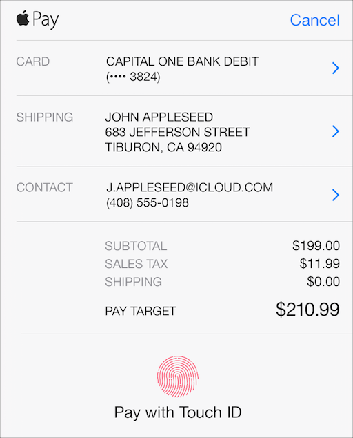

支付上拉菜单。在用户提交订单以及完成相关支付之前，Apple Pay会显示一个包含了联系方式、收货地址以及与结账相关付款信息的支付上拉菜单。尽管用户依然可以在支付上拉菜单里做些微调，比如选择不同的送货方式，但他们不用做出重大改变或输入其他信息。当用户看到该支付上拉菜单，他们应该能够立即完成交易并授权付款。

对于可以使用Apple Pay付费的用户，Apple Pay的用户界面应当始终显示。如果用户的移动设备支持Apple Pay，并且他们已经激活了相关可用的银行卡因此可以通过将Apple Pay设为默认支付方式来满足用户的期望。

如果用户无法使用Apple Pay服务，就不要显示任何Apple Pay的用户界面。如果用户使用的设备不支持Apple Pay，仍强行将其作为一个支付方式选项，可能会对用户造成混淆。但是，如果用户使用的设备是支持Apple Pay，但没有绑定任何信用卡或借记卡，你可以在界面中显示“设置Apple Pay”的按钮。

当用户点击了Apple Pay的按钮，立即显示支付上拉菜单。当用户决定使用Apple Pay来结账时，如果还要迫使用户经历额外步骤，会使支付流程显得复杂，增加不必要的矛盾，并可能会让用户感到沮丧受挫。当用户点击了Apple Pay按钮，不要显示其他警告或模态对话框视图。如果用户可以提供像打折或促销代码之类的信息，请在用户点击Apple Pay按钮之前找到一种方式来接收该信息。

Apple Pay按钮与其他可见的支付按钮应保持相同的尺寸大小或更大。将Apple Pay按钮放置在醒目的位置，可以帮助用户轻松找到它。 

使用Handoff功能帮助用户完成在Apple Watch上发起的购买。 Apple Watch佩戴者可以在商店完成支付，但他们无法完成由Apple Watch第三方应用程序调用的支付行为。当Apple Watch佩戴者发起了由第三方应用程序调用的支付行为，则显示一条消息告诉他们请在iPhone上完成支付。为了更好的用户体验，还可以使用Handoff功能深层链接到你的iOS应用程序上，并立即显示包含预设好的相应付款信息的支付上拉菜单。

有关使用Apple Pay支付按钮以及Apple Pay支付标识的更多信息指南，请参阅 [Apple Pay Identity Guidelines](https://developer.apple.com/apple-pay/Apple-Pay-Identity-Guidelines.pdf).

### 自定义支付上拉菜单 (Customizing the Payment Sheet)

根据完成交易付款所需要了解的信息，以及所要传达给用户关于本次购物的信息，来自定义Apple Pay支付上拉菜单所要显示的内容。

支付上拉菜单仅显示对完成交易付款有必要的信息。如果Apple Pay支付上拉菜单显示了些无关的信息，用户可能会感到困惑或焦虑。举个例子，如果商品是在线交付或通过电子方式完成，需要联系人的电子邮件地址是有意义的，而不是收货地址。在这种情况下，要求收货地址可能给用户产生会有什么东西将意外被派件到家中或公司的错觉，或许还可能导致他们对个人隐私被访问产生不必要的担忧。

支付上拉菜单允许用户可以选择更换送件或取件方式。用户可以从你在支付上拉菜单中设定的几种交付方式中随意选择一种。通过用文本标签控件、报价以及可选的第二行预计到达日期，来具体描述一种收货方式。另外，你还可以设定交付方式为“派件”或“取件”，让用户指定一个可接收快递送货上门或需要运输服务取件的位置。

使用并排项来描述周期性付款和一些购买费用的小计。 并排项包含了一个标签文本和花费数值。并排项被用来：

+ 表明用户授权一个定期付款项目，比如“每月订阅 $19.99”
+ 告知用户关于额外费用，比如“礼品包装 $5.00”和“税费 $4.53”
+ 显示优惠券或折扣信息带来的减价，比如“周五特价 -$2.00”
+ 描述某个项目需要按实际计费，比如运输服务“时间&距离 …”

不要用并排项来显示所要购买的商品的构成清单。

创建并排项标签时，尽可能显示在同一行。并排项标签应该具体、容易理解。如果行条目标签字符数过长，那么很难让你的用户一看就懂。

商户名称需要紧紧跟随在同一行的“Pay”字符后面作为一个整体。确保所使用的商户名称以及相应的开销支出，必须与用户检查自己的信用卡或银行对账单时的数据保持一致。这一点很重要，因为它有助于用户确信他们的开销支出是无误的。如果你的应用程序只是作为中间媒介，而不是最终的商户支付，请明确向用户表明这个具体说明“付款给 最终的商户名称(通过 你的应用程序名称)。

如果总价花费在支付授权时还不明确，请向用户传达有可能会有额外费用的信息。举个例子，一次汽车旅程从支付授权时刻起到驶向最终目的地，它的开销报价可能会受行车距离或时间的影响变化。或者，一个客户可能想要给点小费在商品已派件之后。对于这样的情况，在支付上拉菜单中给予一个非常明确的解释说明是很有必要的。当你使用一个并排项来配置最终总价的更新信息时，总价金额会自动显示为“总价待定”。另外，如果你是预授权支付一个具体金额的订单，确保支付上拉菜单准确地反映了这一信息。

### 简化结账流程(Streamlining the Checkout Process)

Apple Pay使得购物变得快速、简单，对此人们会欣然接受的。更少的步骤和更少的需要用户手动输入的信息，使得整个结账流程更好。

始终使用Apple Pay的最新数据信息。假设用户一直保持Apple Pay个人信息的完整性和时刻更新，那么不要依赖于任何先前收集的信息。即使你以前已收集过用户的联系方式、交付方式和支付信息，也要在结账时获取来自Apple Pay的最新信息。在结账环节，尽量避免用户输入本可以从Apple Pay获取的任何信息。

使用Apple Pay加快购买。对于单个商品项目的购买，让用户只需通过点击商品页面上的Apple Pay支付按钮，即可显示支付上拉菜单并进行即时结算。购买单个商品时，无需采取额外的步骤，也无需将商品添加到购物车，用户喜欢在应用程序中体验到这种便利性。对于多个商品被添加到购物车中会使用相同的交付方式被送到相同地址的情况，一旦用户有意向支付时，会通过显示支付上拉菜单的快速结账流程来支持。

在显示支付上拉菜单前需提前收集好赎回代码或促销代码。因为在Apple Pay支付上拉菜单中没有办法输入这些代码，请务必在显示支付上拉菜单之前收集好相关代码。

如果人们可以将购买的商品派送到不同地方，或以不同的速度发货，请在显示支付上拉菜单之前提前收集好该信息。对于这种极端情况，你需要在显示支付上拉菜单之前得到发货信息，因为在支付上拉菜单中没有办法来指定多种交付方式和地址。一般情况下，在支付上拉菜单中务必收集到交付方式和地址信息。

显示订单确认页面或致谢页面。在交易完成时，通过使用订单确认页，以这种直接的用户体验来显示关于商品能派送到的预计时间以及用户如何跟进订单状态的信息。

如果合适的话，请在你的订单确认页上提到Apple Pay。尽管在你的确认页面上提到Apple Pay不是必要的，如果你愿意选，可以使用其中的一种格式：

+ “Visa ▪▪▪▪1234(Apple Pay)”
+ “用Apple Pay已完成付款”

## 研究型应用程序(Research Apps)

研究型应用程序可以让苹果用户充分利用iOS移动设备的便利性，参与到各种研究性学习中来。通过调用开源代码ResearchKit，使用预设的几种界面视图和转场动画，可以很轻易为你的研究和参与者自定义一个美观易用的研究型应用程序，这些资源都可以在苹果的开源代码ResearchKit项目中调用。要想了解如何使用ResearchKit来为你的研究开发一个研究型应用程序，请查阅[researchkit.org](http://researchkit.org/).

重要

这些规范准则仅供参考之用，并不构成任何法律意见。对于与你的研究型应用程序发展以及任何法律适用的相关建议，你应该向律师咨询。

通常情况下，一个研究型应用程序是由ResearchKit定制化的界面视图以及应用程序本身具体设定的界面视图组成，可归纳为三种主要的体验：

+ 参与者的就位培训(Onboarding)
+ 研究性调查(Study-specific investigation)
+ 管理条目信息(Management items)

设计你的研究型应用程序时务必要遵循以下每个部分的规范准则，将有助于你的用户参与者感到舒服和保持参与感。

### 参与者的就位培训(Onboarding)

就位培训的体验包含了一系列向潜在参与者介绍研究内容以及征询他们同意的环节。完成这些以后，参与者通常不会再重新访问这些就位培训的内容环节：

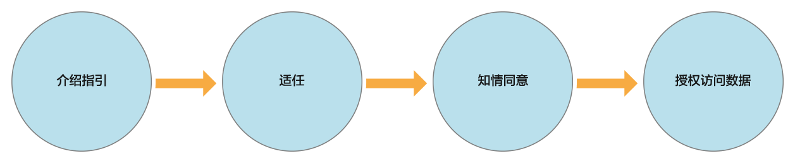

你应该按如图所示的这个顺序呈现就位培训的各个体验环节，也就是按介绍指引、适任、知情同意，以及授权访问数据。

创建一个具有号召性用语的介绍指引。指引环节应该帮助人们了解更多关于你的研究以及告诉他们如何成为一名参与者。指引环节最好也能向那些现有的参与者提供快捷登录的入口以便继续正在进行的研究。

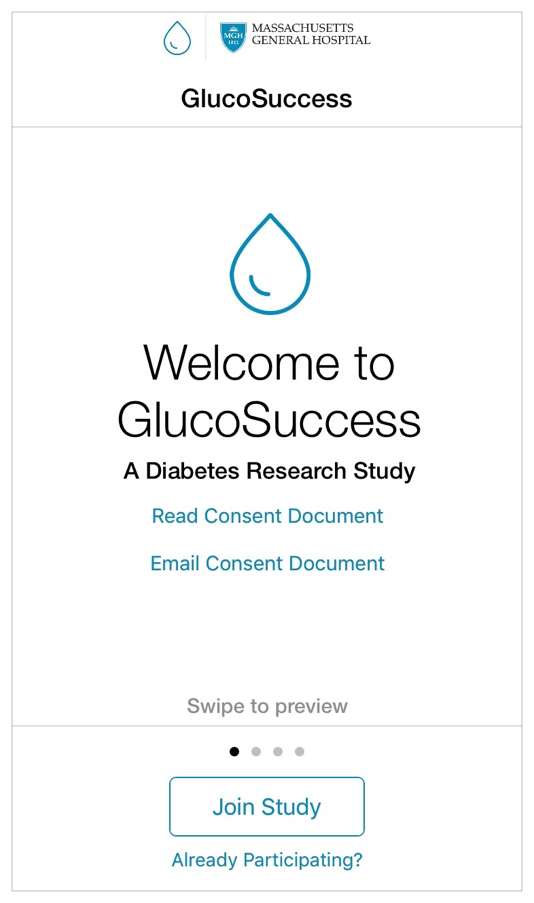

尽快确认招募的用户是否合格。适任环节呈现在指引环节之后、知情同意环节之前(如果参与者并不适合该研究则没有必要让其查看知情同意环节)。请确认所呈现的适任资质要求对于你的研究来说是必要的。请使用简单、直白的语言描述这些要求，并让用户可以很容易就输入相关信息。

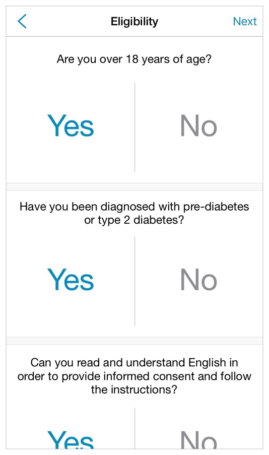

 
在得到参与者的同意之前，确保他们已充分了解你的研究内容。ResearchKit有助于让知情同意流程显得简洁、友好，同时还允许将你同意的任何法律规定或由机构审查委员会和伦理审查委员会所设定的规定纳入其中。(如果你的应用程序涉及到进行人体生物学相关的研究，必须确保你的应用程序符合现有的苹果应用商店规范指南，并获得参与者的许可。)通常情况下，知情同意环节包含了：

+ 说明这项研究是如何工作的
+ 确保参与者了解研究内容以及各自的责任
+ 获得参与者的许可

将冗长的同意书分解成易理解消化的小节。每个小节可以只覆盖研究内容的一个方面，比如数据采集、数据应用、潜在好处、可能的风险、时间承诺、如何撤出等等。每个小节请使用简洁、直白的语言来说明一个高度概括的内容。如果有必要，提供一个查看详情的按钮便于参与者了解该小节更详细的解释。应该让他们在同意参与之前，就查看完全部知情同意内容。 

通过一个小测验来测试参与者的理解情况是有意义的。在获得参与者允许的情况下，你可以选择向每个参与者询问相同的问题。 

你的研究必须获得参与者的同意，如果合适，还可以收集一些联系人信息。参与者同意参与研究后，他们需要提供个人签名以及联系方式，最后会收到一个确认对话框。对于这些信息记录，大多数的研究型应用程序会向参与者电邮一份PDF格式的同意书。

参与者需要对这个确认自愿参与研究的告警对话框给予响应

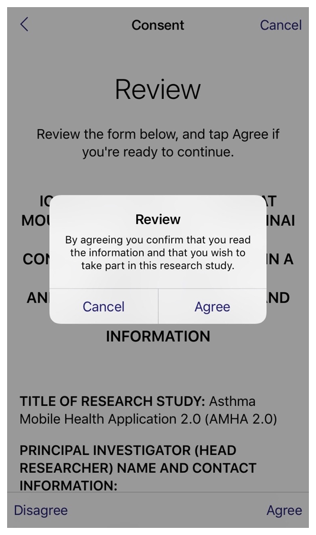

参与者可以提供他们的个人签名在知情同意流程中

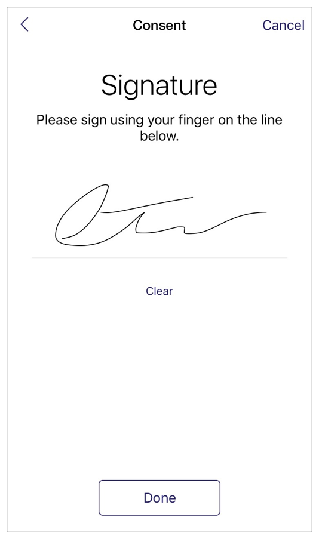

如果你需要访问参与者的设备或数据必须得到他们的许可。必须解释清楚你的研究型应用程序为什么需要访问他们的位置信息、健康应用程序或其他数据，并且确保避免向参与者索要对你研究并非至关重要的数据。同样地，如果你需要向参与者发送通知提醒也要获得参与者的许可。

让参与者准备授权访问数据，比如健康应用程序的数据

让参与者自己选择他们愿意与你共享的数据

### 具体研究的调查(Study-Specific Investigation)

为了从参加者获得数据输入，你的研究可能会使用情况调查、活动任务，或两者的组合。根据你的研究的体系结构，参与者可能会在每个环节多次或仅需完成一次交互即可。

问卷调查的设计应该能让参与者专注参与其中。 ResearchKit可以很容易就呈现多种答案类型的调查问题，比如对错、多选、日期和时间、比例计算，以及开放式文本填写。当你使用ResearchKit的界面视图来创建一项调查，请遵循以下准则，来保证好的用户体验：

+ 告诉参与者总共有多少道问题，以及完成调查预计需要花费的时间
+ 每屏只呈现一道问题
+ 显示给参与者当前调查的进度
+ 调查应该尽可能简短。几个简短的调查往往好于一个冗长的调查
+ 对于需要额外解释的问题，问题描述请用标准字体大小，然后解释文字用略小的字体大小
+ 调查结束时要告知参与者

ResearchKit提供了许多用于调查环节的可自定义界面视图。这里有一些样例。

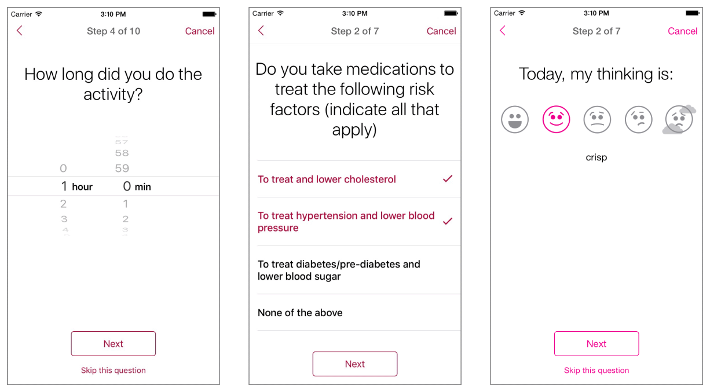

 
使得活动任务容易理解。活动任务需要参与者参与到一次活动中来，比如对着麦克风语音、手指在屏幕上完成点击、行走散步，以及执行一次记忆力测试。请按照以下几点准则来鼓励参与者执行活动任务，并给与他们成功的绝佳机会：

+ 请用简洁易懂的语言来描述如何执行本次任务。
+ 如果任务必须在特定的时间或特定情况下进行，请务必明示。
+ 确保参与者可以分辨出任务何时结束。

以下是ResearchKit所支持的两个活动任务样例。 

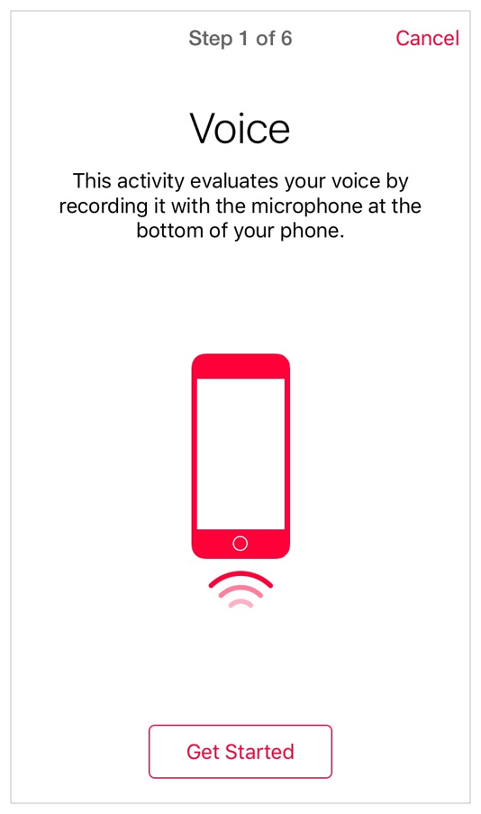

### 管理条目信息(Management Items)

ResearchKit提供了个人档案的界面视图来让参与者可以管理他们的个人信息。此外，创建一个可以激励用户并能让他们追踪他们在研究中的进度的界面视图是个不错的选择。在大多数情况下，参加者应该能够随时访问这两个模块。

使用个人档案来帮助参与者管理个人信息和与你研究相关的数据。个人档案界面视图允许参与者在研究进程期间可以编辑相应数据，比如体重或睡眠习惯，并且可以提醒他们即将到来的活动任务。你同样可以在个人档案中给予参与者一种简单的方式离开该研究、查看知情同意书，以及查看该应用程序的隐私政策。 

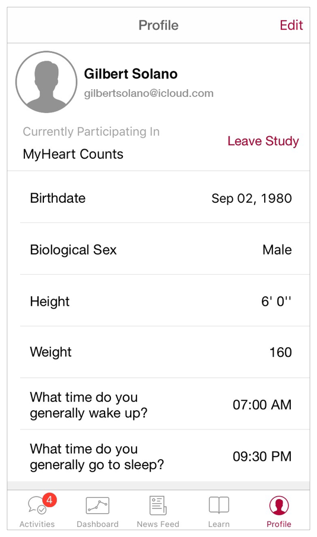

使用仪表盘概览视图来激励参与者，并呈现进度。一个概览视图可以让你与参与者对信息一览无余并鼓励他们继续参与。如果你的研究内容合适的话，你可以使用该概览视图给予参与者丰富的反馈，比如每日进度、每周评估、具体活动的结果，以及同其他参与者的汇总结果进行对比。 

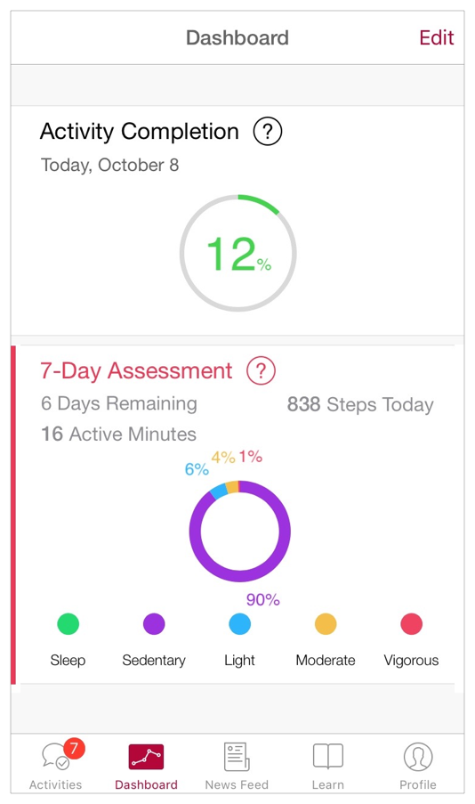

## 应用扩展(App Extensions)

应用扩展可以延伸应用的使用范围。当用户使用其他应用时，应用扩展使得用户仍能使用你应用的核心功能。举个例子，当人们在Safari中浏览网页时，他们可以使用你的分享扩展来发送一张图片或一篇文章到你的社交网站上。或者当使用Photos(照片)应用时，人们可能会使用你的图片编辑扩展来为一张图片加上一个滤镜效果。(在这些场景中，Safari和照片应用承载用户使用扩展的场景，因而被称为宿主应用(host apps)。)

你需要提交包含应用扩展的完整iOS应用到App Store(包含扩展的应用被称为容器应用(containing app))。在你的容器应用中启用扩展之后，人们就可以在使用其他应用时，使用扩展来执行快速任务。例如，在邮件中浏览某个商品时，人们可以不用离开邮件应用就使用你的动作扩展来把商品添加到购物清单中。 表 22-1 列举了可以多个创建的iOS应用扩展类型。

应用扩展类型 | 人们使用扩展来做…
:--: | :--:
今天部件(Today widget) | 在通知中心中获得快速更新或者在今天视图中快速完成任务
分享(Share) | 发送到网站或者和他人分享内容
动作(Action) | 通过另一个应用的上下文信息来操作或查看内容
图片编辑(Photo Editing) | 使用照片应用编辑图片或视频
文档提供者(Document Provider) | 进入和管理文档库
自定义键盘(Custom keyboard)	 | 替换iOS系统键盘

以下指南适用于所有类型的应用扩展，针对特定类型应用扩展的指南请参阅后续章节。(如果想了解如何开发、调试和发布一个扩展，请参阅[App Extension Programming Guide](https://developer.apple.com/library/ios/documentation/General/Conceptual/ExtensibilityPG/index.html#//apple_ref/doc/uid/TP40014214).)

确保是单任务。应用扩展并不是应用的精简版，它帮助用户在有全局目标的上下文中完成狭义范围内的有限任务。例如，动作扩展可以为用户提供一种不同的方式来查看当前内容。

保证用户的交互是有限和流畅的。好的应用扩展应该只需几步点击就可以帮助人们完成任务，这样他们就能尽快回到之前的场景中。例如，分享扩展只需一次点击即可完成一张图片的分享。

将容器应用及其应用扩展的名称保持一致。一个容器应用中如果有多个扩展，需要使用不同的名称，你需要确保用户能够理解你的扩展和应用之间的关系。人们会在很多不同的情况下遇到扩展，如果他们当下没有认出来，那么他们就未必会信任这些扩展。

大部分情况下，复用容器应用的图标。显示用户熟悉的图标是获得用户信任的另一种方式。请注意，对于动作扩展来说，你应该使用单色版本的容器应用图标(详见[分享和动作扩展](https://developer.apple.com/library/ios/documentation/userexperience/conceptual/mobilehig/AppExtensions.html#//apple_ref/doc/uid/TP40006556-CH67-SW3))。

重要：和设计图标和图形一样，不要重复使用iOS的图标和图片，不要为苹果的产品和设计再设计一套图片。

避免在扩展上显示模态视图。很多扩展默认以模态视图来显示，所以应避免再叠加模态视图。尽管有时候用户可能会在扩展上遇到警告框，但是在设计扩展的流程时，应避免出现模态视图。

### 今天部件(Today Widgets)

人们会在通知中心的今天区域中查看今天部件(Today widgets)。因为人们会设置今天区域以显示他们最关注的信息，所以在此进行设计可以有效帮助你的部件在这些用户最重要的信息中占据一席之地。 

设计与通知中心风格一致的外观。当使用通知中心的默认边距和背景时，你的今天部件就会给用户以统一的体验。为获得最佳的结果，你应该重点关注你的内容而不是背景或者其他的，尤其应该避免绘制一片纯色背景。

注意：

iOS会自动在自定义的部件内容上方显示应用的图标和标题(图标会显示在标题前面的空白处)。

将部件内容与标题对齐。当你的部件内容与标题对齐时，人们就可以很简单地浏览今天视图中他们想要的部件。遵守今天视图中的边距规范，并将内容约束在如图的部件内容区内。

一般情况下，使用白色的系统字体来显示文本。在通知中心默认背景下白色文字会看起来较好。对于二级文本，可以使用系统提供的vibrant外观样式(查看[notificationCenterVibrancyEffect](https://developer.apple.com/library/ios/documentation/UIKit/Reference/UIVibrancyEffect/index.html#//apple_ref/occ/clm/UIVibrancyEffect/notificationCenterVibrancyEffect)了解更多)。

提供通知中心式的体验。人们访问通知中心来获取简要的更新或者执行一个非常简单的任务，所以今天部件最好只显示适量的信息和进行有限的互动，特别是：

+ 避免用户在部件中需要滚动或纵向移动来查看全部的信息。部件可以通过纵向扩展来显示更多的信息，但若部件的高度超过通知中心的高度就不是一种好的体验了，因为这样会干扰其他部件的查看
+ 避免使用横向扫动或拖曳，因为这会干扰在通知中心进行导航
+ 尽可能使用户只需一步操作就完成任务或打开你的应用(注意，在今天部件中键盘是不可用的)
+ 优化性能以便人们可以即刻获得有用的信息。可以考虑在本地缓存信息，以便当有更新时就可显示最近信息。人们只希望在今天视图中花很少的时间，如果部件使用内存不当，iOS就可能会终止它

在适当情况下，让人们点击你的今天部件来打开你的应用。因为今天部件提供了专一的体验，所以就能有效引导人们去到你的应用以获取更多信息或功能。最好不要显示“打开应用”按钮，而是应该让你的整个今天部件都可被点击来打开应用。你也可以让用户点击部件中的UI对象，以打开你的应用并跳转到关于此UI对象的视图中。举个例子，日历部件显示了今天的事件，如果用户想要获得某个事件的更多信息，他们可以点击部件中的事件来打开日历应用进行查看。

注意：

虽然从部件打开应用的方式对用户来说还不错，但继续在部件中提供有用且及时的信息依然是很重要的。人们可不一定会欣赏一个功能只是打开应用的今天部件。

如果可能，在今天部件中让人们知道他们需要登录来获取有用的信息。如果你的今天不见需要人们登录查看信息，展示一个信息去鼓励他们登录和解释什么样的内容将会被呈现。例如，如果你的时间部件即将到来的预约是用户登录后展现的，你可能需要让用户“登录我的应用去查看即将到来的预约”。

不要制作一个今天不见需要打开除了你自己应用外的应用。一个模拟iOS主屏的行为的时间部件不会为你的用户提供有用的功能。

### 分享和动作扩展(Share and Action Extensions)

人们通过点击应用中的动作按钮(Action button)来使用分享和动作扩展。在通过动作按钮显示的动作视图控制器(activity view controller)中，动作扩展被列在底部，分享扩展被列在动作扩展之上。人们可以使用更多（More）按钮来管理显示在动作视图控制器中的分享和动作扩展。 

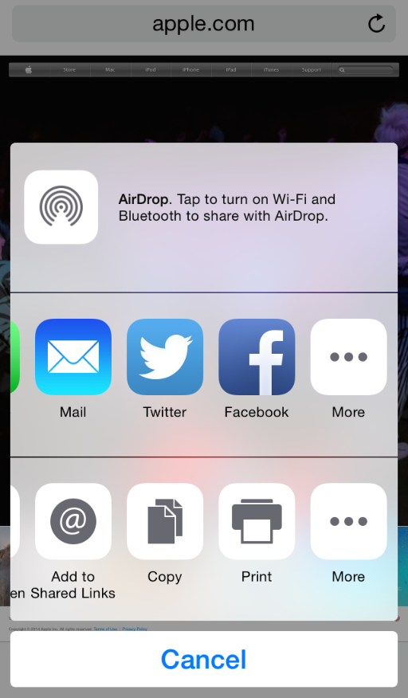

分享或动作扩展通常被认为是在当前用户场景下用来输入内容之用。例如，当在Safari中阅读一篇文章时，用户可能会点击动作按钮并使用一个分享扩展来发送这篇文章到分享网站上，也可能会使用一个动作扩展来查看这篇文章的翻译。

注意：

在动作视图控制器中，iOS只会显示支持当前内容类型的动作扩展。例如，当用户当前内容是视频时，iOS就不会显示支持文本的动作扩展。

尽可能在分享扩展中使用系统提供的UI。系统所提供的撰写视图控制器 (compose view controller) 提供给用户一种一致的体验，并能自动支持一些常用任务，例如预览和确认标准项，同步内容，查看动画，以及完成一封邮件。欲知更多关于使用系统提供的撰写视图控制器，请参见 [App Extension Programming Guide](https://developer.apple.com/library/ios/documentation/General/Conceptual/ExtensibilityPG/index.html#//apple_ref/doc/uid/TP40014214)中的[Share](https://developer.apple.com/library/ios/documentation/General/Conceptual/ExtensibilityPG/ShareSheet.html#//apple_ref/doc/uid/TP40014214-CH12).

如果上传需要一定时间，那就应考虑在分享扩展的容器应用中显示上传进度。无论分享的文件有多大，人们都期待在点击扩展中的发送或分享按钮后，能立即返回他们之前的场景。你需要让进度状态随时更新，但是人们不想每次上传完毕后都收到通知，并且也无法自动重启扩展。在这种场景下，在容器应用中显示上传进度是一种解决方案，这样容器应用就可以在后台处理任务，并在遇到问题时发送通知。

动作扩展使用单色的应用图标。( 不同的是，分享扩展则应该使用其容器应用的彩色应用图标。) 要为动作扩展设计图标时，你可能需要从创建一个应用图标的模版开始着手。如有需要，可以专注图标所特有的元素来进行简化设计。

如果你在容器应用中提供了多个动作扩展，那么最好为他们设计一套图标，且确保这套图标中的每一个看起来都与容器应用的图标是有关联的。

### 图片编辑扩展(Photo Editing Extensions)

当人们在照片(Photos)中查看图片或视频时，可以使用图片编辑扩展。一般来说，图片编辑扩展能帮助用户筛选图片或进行一些其他的图片或视频编辑。在用户确认之后，编辑后的内容就会出现在照片应用中。

照片应用提供了一个模态视图来显示图片编辑扩展的自定义UI。当用户在确认对图片或视频的编辑时选择了取消(你必须要在代码上保证存在这个行为)，照片应用还可以显示一个确认视图。

避免在图片编辑扩展中使用导航栏。如图所示，承载扩展的模态视图已经包含了导航栏，若再增加另一个导航栏，既会占据更多你的界面空间，还会使用户产生困扰。(照片应用默认会以全屏高度来显示你的视图，所以你的内容会出现在内建的导航栏之下。) 

 

如果可以，让用户能够预览编辑结果。尽可能让用户在关闭扩展返回照片应用之前看到他们编辑的成果。

### 文档提供者扩展(Document Provider Extensions)

文档提供者扩展帮助人们在其他各种应用中查阅你的应用所管理的文档。在宿主应用(host app)中，文档采集视图控制器(document picker view controller)会显示你的扩展所提供的UI(想要了解更多有关文档采集视图控制器的内容，请查阅[UIDocumentPickerViewController Class Reference](https://developer.apple.com/library/ios/documentation/UIKit/Reference/UIDocumentPickerViewController_Class/index.html#//apple_ref/doc/uid/TP40014342)).

注意：

文档提供者扩展由两个不同的部分组成：文档采集视图控制器扩展和文件提供者扩展。文档采集视图控制器扩展包括了你的自定义UI，文件提供者扩展实现对文件的访问。为了简单起见，本节所使用的术语文档提供者扩展(Document Provider extension)是为了表述扩展中文档采集视图控制器部分的UI和体验。

避免在文档提供者扩展中使用导航栏。iOS会显示扩展的自定义UI，而自定义UI又包含在文档采集视图控制器中基于导航栏的界面之中。所以，在内建导航栏之下再显示第二个导航栏会使用户感到困惑，并且还会占据原本你的内容区域。(文档采集视图控制器默认会以全屏高度来显示你的视图，所以你的内容会出现在内建的导航栏之下。) 

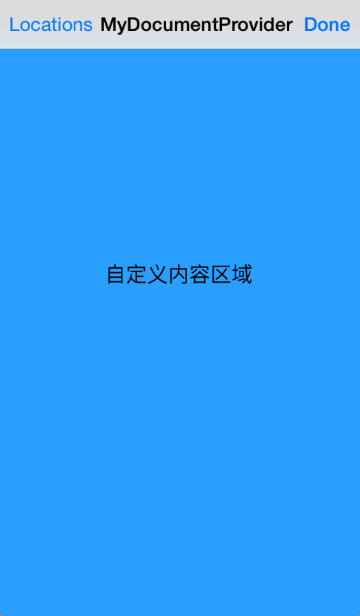

### 自定义输入法(Custom Keyboards)

人们在整个系统中使用带有自定义输入法的输入法扩展来替换iOS的自带输入法。在启用输入法扩展之后，除了受保护的文本区域(例如密码输入区)和手机键盘区(例如联系人中的电话号码区)外，当人们点击任何文本输入区域后就能使用自定义输入法。

为用户提供明显的方式来切换输入法。人们对于iOS的输入法切换按钮很熟悉，他们会期望在你的输入法中也有类似的体验。 

如果可能，在你的容器应用中包括一个教程。如果必要，使用你的自定义键盘的容器应用去给人们讲解如何启用和使用你的键盘。不要把这个信息直接放在键盘本身，因为它可能让人们尝试使用这个键盘时感到困惑。

## HomeKit

通过HomeKit，用户能够方便地在家中使用iOS设备上的智能家居应用来操控家中相关联的设备(无论这些设备制造商是谁)。最好的智能家居应用集成HomeKit和iOS系统来帮助用户：

+ 创建家居环境、房间和区域
+ 添加、寻找和移动家居设备(如灯泡或温度调节装置)
+ 定义能够使一组多个家居设备响应的行为
+ 管理用户 
+ 用Siri来操控他们的家居设施

想要了解如何在你的应用中使用HomeKit，可参阅[HomeKIt Developer Guide](https://developer.apple.com/library/ios/documentation/NetworkingInternet/Conceptual/HomeKitDeveloperGuide/Introduction/Introduction.html#//apple_ref/doc/uid/TP40015050)。下面的指南可以帮助你做出一个容易上手、令人愉悦的智能家居程序。

不要想当然地认为你的设备会是用户所设置的首个设备。你的应用除了能让用户很容易就能创建家居环境、房间和区域，还需要让用户能方便地将你的设备接入之前已经设置好了的区域中。

让添加新设备变得简单。不要强迫用户在添加设备之前注册账号。最好让你的应用能自动发现新的设备并将他们显著地展示在用户界面上。确保所展示的信息足够充分让用户可以轻易辨识出该家居设备。

帮助用户辨认他们正在调节的设备。给用户一个能够帮助他们从物理属性辨认设备的控制器。例如，你可以让用户通过闪一下灯泡来确认他们正在调节的是他们想要调节的那个。

让用户能够通过多种方式来搜寻设备。当天的时间、季节和用户当前的位置会在特定的时刻成为判别某些设备是否重要的影响因素。因此，你的应用应该允许用户能在家中按类型、名称、或者位置的方式来搜寻设备。

为家中已接入的设备提供推荐的操作集。操作集允许用户设定在某种情景下让多个家居设备按照特定的方式行动。例如，一个“离开”操作集可以将房屋内的温度调低、关闭电灯和锁上所有房门。你的应用可以向用户推荐一些已经设定好了的操作集或者让用户创建自定义操作集。当用户能够基于房间或区域去创建自定义操作集时，让用户可以从你推荐的设备列表中进行选择，通常能使用户获得更好的体验。

使用友好的交谈式语言让你的应用平易近人、易于使用。智能家居概念可能会懵到用户，应避免使用他们可能不理解的缩写和技术术语。例如，HomeKit是指代API的专用技术术语，它就不应该在你的应用中使用。

注意：如果你是苹果MFi认证许可商，请访问MFi门户网站查看设备包装的命名及消息通知的规则。

与Siri互动。通过Siri，使用一个简单的陈述句就能控制执行复杂的操作。Siri能够识别操作集、房屋、房间和区域的名称，并且能够理解像“Siri，把前门关了”、“Siri，把楼上的灯关了”和“Siri，把多媒体房的温度调高一点”这样的陈述。遵循以下准则能帮助你为用户提供使用Siri操控设备时的良好体验：

+ 使用Siri能够识别的功能名称，而非设备名称。一个设备可能提供多种功能(例如，一个既有风扇功能又有照明功能的风扇吊灯)，因此，帮助用户区分这些功能是很重要的。最佳方案是让用户在一系列不包含公司名称及型号的限定的名称中进行选择，并且允许他们以后编辑。你所推荐的名称应该使用规范的、容易理解的词语来描述功能，并可选择是否包含家中的位置信息，例如“客厅灯”或者“车库门”。你还可以让用户指定一种控制插座开关的通用口令，例如“Siri，把灯关了”，来控制所有的灯具和其相关的设备
+ 当用户配置操作集的时候，告诉用户如何通过Siri去操控它。举个例子，当“电影”这个操作已经确认配置完毕时，让用户知道他可以通过跟Siri说“Siri，把家调成电影模式”这样的话来激活这个操作。 注意，当用户单独对Siri说出某操作的名称时，同样也能激活那个操作。Siri能够识别系统预置以及用户自定义的操作集，这些已配置的操作集至少包含一项操作

帮助用户设置触发机制。在iOS9中，HomeKit支持触发机制：当满足特定的时间、地点或其他设备的行为的条件时激活操作的方式。比如用户可以设置一个当太阳落山且车库门打开时，就打开厨房灯操作的触发机制。设置一个包含多个项目的条件关系容易使人感到混乱，因此，将你的设置界面做得简单易用至关重要。举例来说，使用与人们平常说话一样的表达方式来展示项目、属性和逻辑，就更容易使人理解。

## 多任务处理(Multitasking)

多任务处理让人们在屏幕上(在合适的iPad模式上)查看多个应用，可以在最近使用的应用之间进行快速切换。在iOS9,中，人们可以使用多任务处理UI(下图所示)去选择最近使用的应用。 

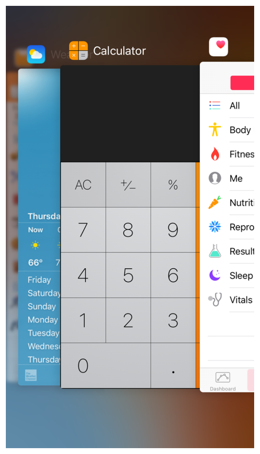

能否在多任务处理中处理好取决于能否在设备中与其他应用和谐共存。从更高的层面来说，这意味着所有的应用都应：

+ 仔细调整资源使用避免占用太多CPU，内存，屏幕空间和其他资源
+ 处理好中断或来自其他应用的声音
+ 停止和重启，即快速平滑地从后台切换到前台
+ 不在前台时应恪守己任

下述指南细则可以帮助你的应用在专注应用切换的多任务处理中取得成功。更多合格的iPad模式下关于多任务环境中运行的信息，参阅 [Adopting Multitasking Enhancements on iPad](https://developer.apple.com/library/ios/documentation/WindowsViews/Conceptual/AdoptingMultitaskingOniPad/index.html#//apple_ref/doc/uid/TP40015145).

准备好被打断，并恢复。多任务处理增加了后台应用中断你的应用的可能性。其他特性，诸如广告出现和更快的应用切换，也会造成更频繁地打断。越快速和越精确地保存应用当前状态，人们就可以越快地重新运行应用，并从之前离开的页面继续使用。你可以通过利用UIKit的状态保存和恢复来为用户提供无缝的重新开始的体验(查看[Preserving Your App’s Visual Appearance Across Launches](https://developer.apple.com/library/ios/documentation/iPhone/Conceptual/iPhoneOSProgrammingGuide/StrategiesforImplementingYourApp/StrategiesforImplementingYourApp.html#//apple_ref/doc/uid/TP40007072-CH5-SW2)了解更多信息)。

确保你的UI可以处理两倍高度的状态栏。两倍高度的状态栏会在诸如通话、录音和共享等过程中出现。在未作处理的应用中，状态栏的额外高度会引起布局问题，如UI被向下挤压或者被遮住。在多任务处理环境中，使两倍高状态栏显示正常是格外重要的，因为它可能会出现在更多的应用当中。

准备好暂停需要人们注意或主动参与的活动。例如，如果你的应用是一款游戏或媒体观看应用，你需要确保你的用户从应用切换走时，不会丢失任何内容或事件。当人们切换回游戏或媒体播放器时，他们希望能继续之前的体验，就好像他们从未离开过应用。

确保音频行为合适。当你的应用正在运行时，多任务处理会使得其他媒体活动更可能地同时进行，也会有更多可能性使你的音频不得不暂停，并恢复处理中断。查看[声音](https://developer.apple.com/library/ios/documentation/userexperience/conceptual/mobilehig/Sound.html#//apple_ref/doc/uid/TP40006556-CH44-SW1)来帮助你确保你的音频能满足人们的期望，并与设备中的其他音频和平共处。

适度使用本地通知。应用可以在特定时间发送本地通知，无论应用是在暂停中还是运行中亦或是根本就没有运行。为了达到最好的用户体验，应避免用过多的通知来骚扰人们，并遵循[通知](https://developer.apple.com/library/ios/documentation/userexperience/conceptual/mobilehig/NotificationCenter.html#//apple_ref/doc/uid/TP40006556-CH39-SW1)中创建通知内容的指南。

必要时，在后台完成用户的任务。当人们开始一个任务时，他们通常会期望即使已经从应用中切换走了任务仍能够完成。如果你的应用在执行用户任务途中，并且这个任务不需要额外的用户交互，那么你就应该在应用挂起之前就在后台完成任务。

## 通知(Notifications)

通知为人们提供即时的重要信息和功能。人们能在多种情况下收到通知，例如在锁屏界面中，或者在使用应用时，或者访问通知中心时。 通知中心有两种视图：通知(Notifications )和今天(Today)。

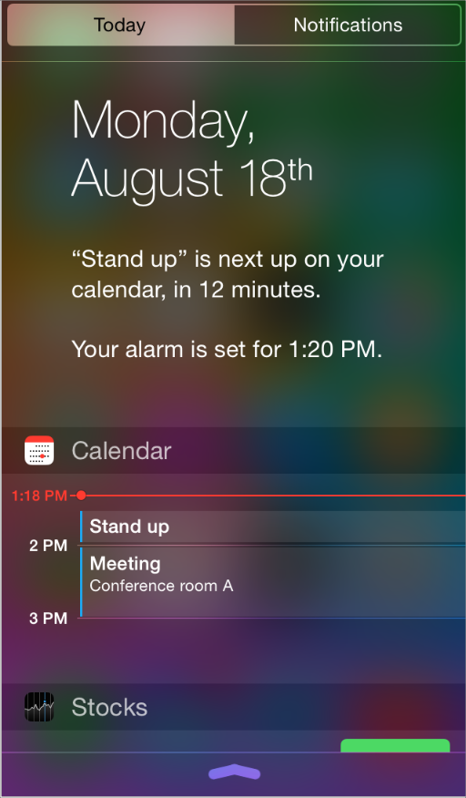

 
今天视图显示了一组可编辑的部件。今天部件是一个应用扩展，显示了少量及时和重要的信息或功能，这些信息或功能则是由用户所关注的应用所提供。举例来说，日历部件只显示了今天的事件。点击日历部件中的一个事件可以唤起日历应用，并打开该事件，用户接下来可以编辑该事件或管理其他的事件。想要了解更多关于设计今天部件的内容，请参见[今天部件](https://developer.apple.com/library/ios/documentation/userexperience/conceptual/mobilehig/AppExtensions.html#//apple_ref/doc/uid/TP40006556-CH67-SW4)。 

通知视图会显示用户感兴趣的应用所发出的最近通知。用户可以在设置(Settings)中来设置是否在通知中心显示该应用的通知。 iOS应用可以使用通知来让人们知道一些有趣的事情是什么时候发生的，例如：

+ 收到一条消息
+ 事件即将发生
+ 有新的数据可下载了
+ 某些状态发生了变化

在iOS8及之后的版本中，应用可以定义用户在通知中的操作。例如，用户可以在待办事项应用的通知中就标记该事项已完成，而无需额外打开应用。 iOS定义了两种类型的通知。

+ 本地通知(local notification)由应用安排待发送，最终通过iOS发送到同一设备中，无论该应用当前是否正在后台运行。例如，日历或待办事项应用可以安排一条本地通知来提醒人们一个即将到来的会议或者日期。
+ 远程通知(remote notification)(也称为推送通知(push notification))是由应用的远程服务器通过苹果推送通知服务来发送的，这类通知最终会被推送到所有安装了该应用的设备。例如，一款在线竞技类的游戏，用户可以和其他玩家竞赛的，可以更新所有玩家的最新状态。

注意：应用扩展可能会要求远程通知必须发送到它的容器应用。在这种场景下，容器应用常常会在后台运行来处理通知。想要了解更多关于应用扩展的内容，请参见[应用扩展](https://developer.apple.com/library/ios/documentation/userexperience/conceptual/mobilehig/AppExtensions.html#//apple_ref/doc/uid/TP40006556-CH67-SW1)。

如果当你的应用正在后台运行时收到了本地或远程的通知，你就应该以你的应用所特有的方式将信息传达给你的用户。 为了确保用户能够自定义他们的通知体验，你应该尽可能多地支持以下的通知类型：

+ 横幅(Banner)
+ 警告框(Alert)
+ 小气泡(Badge)
+ 声音(Sound)

注意：在iOS8及之后的版本中，你必须对所有你想发送给用户的通知类型进行注册。当你第一次进行注册动作时，用户会遇到一个警告框，他们可以在其中操作来决定允许或拒绝所有来自你的应用的通知。不管用户选择的结果是什么，他们应始终能访问应用的设置来更改此项设置，或者设置他们想要接收的通知类型。

横幅(banner)是一个小而透明的视图，会出现在屏幕顶部并在几秒后消失。用户还可以看到在锁屏当中的横幅以及在通知中心中以通知形式出现的横幅。在横幅中，iOS会显示通知的内容和应用的小图标(欲了解更多关于小图标的内容，请参见 [App Icon](https://developer.apple.com/library/ios/documentation/userexperience/conceptual/mobilehig/AppIcons.html#//apple_ref/doc/uid/TP40006556-CH19-SW1))。用户点击横幅来隐藏显示并切换到发送通知的应用。 

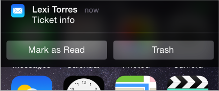

除了默认的点击动作之外，当用户轻扫横幅时,你还可以定义两个动作按钮。点击通知动作按钮来隐藏横幅的显示并启动你的应用(可能是在后台)来执行动作。 

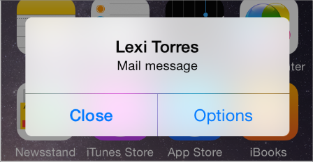

通知警告框是显示在屏幕上的标准警告框视图，需要用户操作后才会隐藏。当用户点击Options按钮后，你需要提供并显示通知消息以及任何一个默认动作，或最多四个特定动作。警告框的背景样式不能做修改。 当用户点击警告框中的一个默认或自定义动作按钮时，iOS会同时隐藏警告框并运行你的应用(可能是在后台)。点击关闭或确定按钮会隐藏警告框而不打开应用。 

小气泡(badge)是一个显示未读通知数量的红色小圆(小气泡显示在应用图标的右上角)。小气泡的大小和颜色不能做修改。 横幅、警告框和小气泡这三种通知都可以使用自定义或系统提供的声音。

在通知中谨慎使用具破坏性的动作。要确定用户有足够的上下文来避免意想不到的后果。为了帮助用户区分你所定义的破坏性动作，iOS会用红色来显示它。有时候，在应用执行破坏性动作之前，应该请求用户进行确认。举个例子，如果在锁屏的横幅(banner)中提供了一个破坏性动作，那么就应确保只有设备的主人才能执行该动作(你需要在代码上实现这一需求)。

为每个动作按钮提供自定义标题。创建一个简短的标题来描述清楚将要发生的动作。例如，游戏可能会使用“Play”作为标题来表明，点击这个按钮会打开应用来进行游戏。确保标题：

+ 使用标题样式的大小写(title-style capitalization)
+ 足够简短，能不被截断地显示在按钮内(也应确保测试各种语言文字的标题显示正常)
不要为同一个事件重复发送通知。用户可以选择处理通知项；通知项在用户未处理前会一直显示。如果为同一事件重复发送通知，通知中心列表中会满是通知，用户就有可能会关闭你的应用的通知。

不要在通知消息中包含你的应用名称。自定义信息会在警告框和横幅中显示，也会在通知中心中以通知的形式显示。你无需在自定义信息中显示你的应用名称，因为iOS会在显示信息的同时自动显示应用名称。 为了使本地或远程通知信息更有作用，你应该：

+ 专注于信息而不是用户的行为。避免告诉人们点击哪个按钮或如何打开你的应用
+ 足够简短，一两行就可以显示完整。较长的信息对于用户来说很难进行快速阅读，也会造成在警告框中需要滚动才能查看完整
+ 使用句式大小写(sentence-style capitalization)，并配以合适的结束语句符号。可能的时候，可以使用一个整句

注意：如有必要，iOS会缩短你的消息以便能在各种通知发送样式下显示；为了最好的效果，你不应主动缩减你的消息。

保持小气泡的内容是最新的。当用户注意到新信息时，即时更新小气泡非常重要，这样用户就不会觉得收到了额外的通知。注意，当小气泡为0时也会移除通知中心中所有对应的通知项。

重要：不要使用小气泡做通知以外的用途。记住，用户能够关闭应用的小气泡，所以你无法确定他们一定能看到小气泡中的内容。

当收到通知时，提供用户可以选择听到的音效。当人们没有在看屏幕的时候，可以通过音效获取他们的注意。例如，日历应用可能会在显示警告框的同时播放一个音效来提醒人们一个即将到来的事件。再如，协作任务管理应用可能会在小气泡更新时播放一个音效来告知某个远程协同的同事已经完成了某个任务。

你可以提供自定义的音效，或者使用内置的警告音。如果你创建了自定义音效，请确保它是简短的、有特色的并且是经由专业制作的。(想要了解更多关于音效的技术需求，请参阅[Local and Remote Notification Programming Guide](https://developer.apple.com/library/ios/documentation/NetworkingInternet/Conceptual/RemoteNotificationsPG/Introduction.html#//apple_ref/doc/uid/TP40008194)中的[Preparing Custom Alert Sounds](https://developer.apple.com/library/ios/documentation/NetworkingInternet/Conceptual/RemoteNotificationsPG/Chapters/IPhoneOSClientImp.html#//apple_ref/doc/uid/TP40008194-CH103-SW6)。)注意，当通知发送后，你无法以编程方式来触发设备的震动，因为用户对于警告框是否伴随震动拥有支配权。

## 社交媒体(Social Media)

人们会期望在任何场景下都可以使用他们喜爱的社交媒体帐号。iOS以人们喜欢的方式将社交媒体的交互与你的应用进行了整合。 

注意：当用户点击动作按钮时，他们会得到一个如上图的动作视图控制器。想要了解更多关于这个视图控制器的内容，请参见[Activity View Controller](https://developer.apple.com/library/ios/documentation/UserExperience/Conceptual/MobileHIG/ContentViews.html#//apple_ref/doc/uid/TP40006556-CH13-SW121)。

动作视图控制器的中间一行显示了用户启用的和系统提供的分享应用扩展。想要了解更多关于设计分享扩展的内容，请参见 [Share and Action Extensions](https://developer.apple.com/library/ios/documentation/UserExperience/Conceptual/MobileHIG/AppExtensions.html#//apple_ref/doc/uid/TP40006556-CH67-SW3)。

考虑在你的应用中为用户提供一种简便的方式来撰写邮件。用户有可能会启用分享扩展以便能在任何地方都可以发送内容。但是你也可以使用系统提供的撰写视图控制器来呈现给用户，他们可以在其中进行编辑操作。你可以在显示给用户进行编辑之前，预先加载具有自定义内容的撰写视图(在你呈现给用户之后，只有用户可以编辑这些自定义内容)。想要了解更多关于社交框架(Social framework)的编程界面，包括[SLComposeViewController](https://developer.apple.com/library/ios/documentation/NetworkingInternet/Reference/SLComposeViewController_Class/index.html#//apple_ref/occ/cl/SLComposeViewController)类，请参见 [Social Framework Reference](https://developer.apple.com/library/ios/documentation/Social/Reference/Social_Framework/index.html#//apple_ref/doc/uid/TP40012233).

如果可能，避免要求用户登录进入一个社交媒体账户。社交框架(Social framework)会和帐号框架(Accounts framework)一起来支持一个单点登录模式，所以你可以获得授权来访问用户的帐号，而无需要求他们来重新授权。如果用户还没有登录进入一个帐号，你可以显示UI来让他们进行登录。

## iCloud

iCloud可以让用户随时随地用不同的设备访问他们想要的内容。将iCloud集成到应用中，用户不用进行同步操作就可以在不同场景下使用不同的设备访问并编辑私人信息。 

为了提供这种体验，你可能需要重新检查你的应用中现有的信息，尤其是用户自建内容的存储、访问和展示方式。想要了解如何使用iCloud，请参考[iCloud Design Guide](https://developer.apple.com/library/ios/documentation/General/Conceptual/iCloudDesignGuide/Chapters/Introduction.html).

iCloud用户体验的一个基本方向是透明性：理想情况下，用户不需要知道他们的信息存储在什么地方，也不需要去思考当前浏览的信息是哪个版本的。以下几点可以帮助你创建用户期望的iCloud体验。

如果可能，让用户方便地在你的应用中启用iCloud。在iOS设备上，用户可以在设置中登录iCloud账户，因此多半用户会期望应用可以自动启用iCloud。但是如果你觉得用户可能需要自主选择是否使用你应用的云服务，你可以在用户第一次进入应用时提供一个简单的选项来进行设置。大多数情况下，这个选项应该为：是否将所有内容上传到云端。

尊重用户的iCloud空间。一定要记住iCloud空间是用户花钱买来的有限资源。你应该使用iCloud来存储用户自己创建和可理解的信息，避免将可再生的应用资源和内容存储在云端。同样要记住，当用户登录了iCloud账户时，你的应用的文件夹内容也会自动备份到云端。所以为了节省用户云端空间，你最好只挑选必要的信息存储于文件夹中。

避免让用户自己选择在iCloud上存储哪些文件。一般地，用户会期望他们在意的所有信息都能够通过iCloud访问到。实际上大多数用户都不需要进行个人文件存储的管理，所以你的应用也可以不用考虑这个问题。为了提供更好的用户体验，你可能想要重新构建处理和展示内容的方式，这样就可以给用户提供更多的文件管理功能。

决定哪种类型的信息需要存储在云端。除了存储用户自建的文件和内容，你还可以存储少量的其他信息在云端，例如用户当前的状态，用户的偏好设置等等。你可以使用iCloud的关键值存储来保存这类信息。例如，用户使用你的应用看了一个杂志，你可以使用iCloud的关键值存储来保存用户浏览到的位置，这样用户在别的设备上重新打开这个杂志时就能从上次离开的地方继续浏览了。

如果你使用iCloud的关键值存储来保存用户的偏好设置，确保用户在每个设备上都是想这样设置的。例如，有些偏好设置在工作环境中比在家里要更好用。在某些情况下，将偏好设置保存在应用服务器上要比保存在云端更合理，这样偏好设置就不会受iCloud的限制。

确保iCloud无法使用时应用的行为是合理的。例如，用户退出iCloud账户，关闭应用的iCloud或者进入飞行模式时，iCloud都是无法使用的。在这些情况下，用户都进行了某些操作来禁止iCloud服务，所以你的应用可以不用再进行提醒。但是，需要告诉用户在打开iCloud之前，当前做的修改在其他设备上都无法看到。

避免给用户创建“本地”文件的选项。不管你的应用是否支持iCloud，都不应该给用户提供因设备而区分的文件系统。相反，你应该希望用户关注通过iCloud访问文件的普适性。

在合适的时候自动更新信息。最好不需要用户来确认他们正在访问的是最新的内容。但是，也需要在用户设备存储空间和带宽限制之间做出平衡。如果你的用户要使用非常大的文件，那么让他们自己选择是否要从云端下载一个更新的文件可能更合适。如果需要这样做的话，可以设计一种方式来指出当前在云端有一个该文件的最新版本。当用户选择更新时，如果下载时间较长最好给用户明显的反馈。

告知用户删除某文件的后果。当用户从有iCloud服务的应用上删除文件的时候，这个文件同样会从用户的iCloud账号和其他设备上删除。所以最好在执行删除操作之前告知用户删除的后果，让用户进行确认。

必要时尽可能早地告知用户冲突问题。使用iCloud编程接口，你需要在不打扰到用户的情况下解决大多数不同版本之间的冲突问题。但在有些情况下，你需要尽可能早地检测出冲突问题来避免用户在错误版本上浪费太多时间。你需要设计一种自然的方式来告诉用户有冲突存在，接着给用户提供方便的方式来区分不同版本以及做出决策。

确保在搜索中包括用户在云端的信息。使用iCloud的用户趋向于认为云端的信息是普遍可访问的，所以他们会期望搜索结果中也有云端的信息。如果你的应用允许用户搜索他们的信息，确保你使用了将搜索扩展到iCloud账户的接口。

