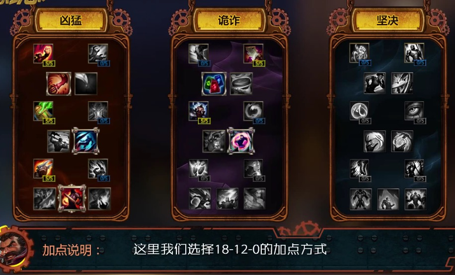
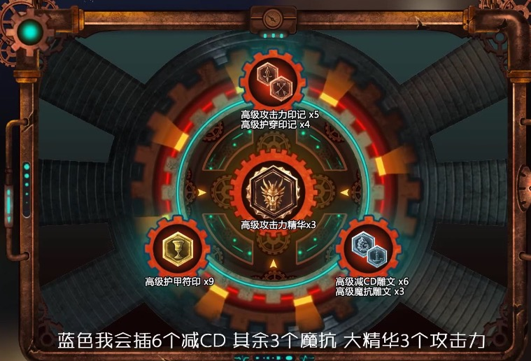

# 英雄联盟 攻略

## 男枪打野

+ 射程短，但有击退效果，可以无伤打野
+ E 技能可以快速填充一个子弹，并取消攻击后摇
+ Q 第二段伤害很高，撞墙会立刻触发
+ R 会有一个后退的距离
+ 不需要攻速，只需要减 CD

### 符文天赋

### 出装

+ 大顺风
	+ 出门：打野刀，充能血瓶，饰品眼
	+ 中期：护甲鞋(魔抗鞋)，战士附魔蓝色打野刀，夺萃之镰，无尽
	+ 后期：大轻语，饮血，春哥
+ 逆风
	+ 出门：打野刀，充能血瓶，饰品眼
	+ 中期：护甲鞋(魔抗鞋)，战士附魔蓝色打野刀，黑切，血手
	+ 后期：大隐魔刀，轻语

### 阵容

+ 队友最好有强控，没有硬控不推荐用男枪，线上
+ 或者露露发条，奶妈娜美，发育为主，团战
+ ADC 配合 EZ，奥巴马，金克丝，女枪

### 实战技巧

+ 蓝方，红开
+ 红方，蓝开；也可以先惩戒打蛤蟆
+ 利用击退效果几乎无伤打野
+ 利用走位拉野
+ 二级学 E，蓝方红开，可以二级抓一波中
+ 连招：AEAQA
+ 蓝开比较难抓人，三狼，红 buff
+ 看兵线来打螃蟹或者反蹲
+ 蓝色小打野刀，战士附魔，利用惩戒来留人
+ 利用 W 逼迫走位
+ 六级以后有蓝色打野刀就可以 solo 小龙
+ 多刷 E，三次之后就比较肉了

