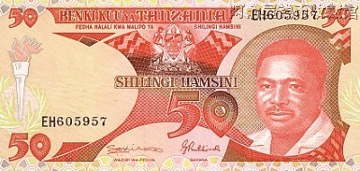
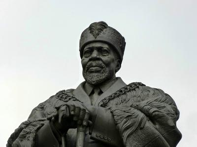
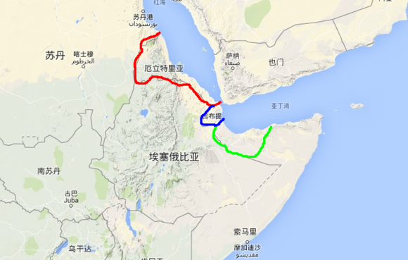
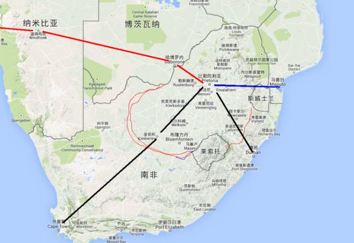
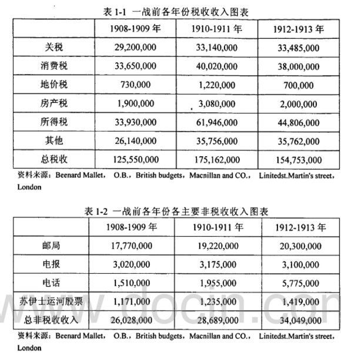
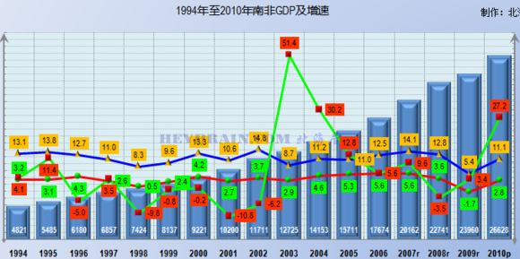

# 【浅说非洲】之【非洲七雄篇】

前言：虽说也拿到了不少关于非洲七雄的资料，但是看的头晕目转啊，数据量实在太大了。而且读起来过于枯燥，本想分享给大家看，可给资料的那些家伙们都声明了禁止上传网络。我会引用极少部分的资料，但是不会使用大规模的数据。毕竟这个帖子不是什么论文，只是大家看着玩儿的一个东西。我以我仅剩不多的节操保证，不夹带私货即可。

## 【非洲七雄经济篇】——坦桑尼亚

坦桑尼亚在中国人的印象里，那可不是一般的好。被称之为东非PLA，各种友好，所以在大部分涉及到军事、经济、政痔的论坛里，几乎都在传播关于东非PLA的事情。

但是我们好像除了对他们是唯一会步坦协同这个概念之外，好像也对坦桑尼亚一无所知。虽然坦桑尼亚目前在中国网友的眼里，是南非州以南除南非外最有存在感的黑人国家。

坦桑尼亚的路可以说是各种蛋碎的走过来的，浅说群有个规矩不能脑补……我对军事了解简直就是军盲级的，所以尽量不涉及军事类的东西。仅说一下关于发展和经济贸易方面的吧。

坦桑尼亚独立之后，至少在六十年代的坦桑尼亚，那可真是黑人世界皇冠上一颗璀璨的明珠。十年的时间，快速的发展着，

坦桑尼亚年轻的政客们看着蒸蒸日上的国家，不由得开始佩服自己的机智，原来我等治理国家的功夫也不亚于诸葛孔明嘛！

但是世界进入了70年的后，非洲各国就开始出现了严重的衰退。整个非洲以南，如果我们把正在发疯的埃及和利比亚也实际的考虑一下的话……整个非洲除了南非，全部都开始得怪病。

坦桑尼亚也不幸染病了，经济开始快速的下滑。到了1985年的时候，坦桑尼亚的通胀和建国时对比的话，已高达1000%，也就是说建国时期的100元的购买力，仅剩下9.8元左右。坦桑尼亚的政客们直接给弄跪，个别不要脸的，没有节操的……表示要不政府破产得了。

经济危机和严重的通胀，导致坦桑尼亚在八十年代的时候甚至无法维系住政府的基本开支，咱就别说啥修桥补路之类的了。

任何国家的腐败滋生，都是国家衰弱中的并发症。当时坦桑尼亚政府发给个别带路党，无节操 人士的工资，说个不好听的话……连养家都不够，因为城市化已经开始了……黑蜀黍们又没办法坐在大树下接枣吃，因为要在城市里找到食物的可能性较低……况且人家那时候也是有身份的政治家了，何至于去不要节操的去捡东西吃嘛。

所以，在85年为分水岭的时候，坦桑尼亚的腐败开始爆发，黑人政治精英充当带路党，给国外资本带路，要不就是往死了的黑钱，反正装自己兜里是王道。整个社会弥漫着一股奇怪的味道

在八十年代，因为行政能力低下的恶果直接在坦桑尼亚爆发。经济的大规模衰退导致刚进行城市化的那些地区开始出现严重的经济病。基本病症为……新城市人口（伪中产）们经济收入开始快速的衰退，根本无法用自己的工资养活自己。

活人是不会被尿憋死的，至少想点办法对吧……所以那时候的坦桑尼亚刚进入中国商人的视线里。坦桑尼亚的城市白领们大多都是具备文化水平的，所以大家都做生意算逑。至少还能活个命……挣点外快。这种风潮在某种程度上影响了行政体系上班的那些”公务员“

于是”公务员“们一拍桌子，你们挣得，老子就挣不得？于是在八十年代，坦桑尼亚个别地区的行政系统甚至出现了崩溃的迹象。

至少在九十年代时，这种行政崩溃的造成的影响都还存在，并且后遗症持续到今天。具体表现为……政府单位是木有人上班的，你以为黑蜀黍晒屌去了？木有%……他们也是勤劳的民族，人家捞外快去了。

天大的事情还能有他捞钱重要？

行政系统的人和都市”白领“们组成的商人组织，甚至一度垄断坦桑尼亚数个城市的食品和生活用品销售。市面上的货物被沽空之，转入地下销售。

那各位可能要问了……难道坦桑尼亚就不管管？管鸡毛，当时已经混到政令不出的程度了。因为整个国家的行政人员都在捞外快，所以很多时候不是官方在放任，而是……臣妾实在是做不到啊！

因为大规模的哄抬物价和兼并资产后，坦桑尼亚各地已经有点摇摇欲坠的赶脚。到了1985年这个分水岭的时候，坦桑尼亚总统尼雷尔同志，还不肯悔改，管他的……人死屌朝天。于是在1985年最惨的时候，坦桑尼亚混到连税收都收不上来的地步。不是不强力……而是老百姓没钱啊。

当然，这个时候西方国家开出来一记良药，至于好不好……这个要吃药的人才知道，反正我们也没法知道。

其实很多人在说一个国家的时候习惯性的会把领导人的能力放在第一位，但是我可以负责任的告诉各位一句……在任何国家，任何时代，领导人只不过是表达国内声音的一个人。能力强而无私的领导人，表达的是大部分人的需要，能力强而有私心的人则是表达极少部分一群人的需求。

所以，尼雷尔总统是一个好总统不假，至少站在中国人的角度上看，这位泛非洲主义的总统是一个很好的人。在中国需要国际政治支持的时候，尼雷尔政府总能推我们一把。

在坦桑尼亚国内，尼雷尔是一个伟大的人，一个有节操的国父，一个不肯对强权低头的强人。我最近几日有幸拜读过尼雷尔总统的著作自由三部曲（分别为《自由与统一》《自由与发展》《自由与社会主义》）三本，虽说粗略的读了一次，敝下愚钝，不敢说读懂了他的思想。但是在文字中能看出，他是一个具有人格和道德，并且充满了浪漫色彩的政治家。

老子在《道》篇中说过一句话；刚强则易折，而国格过弱也不是好事。

当坦桑尼亚，乃至整个南非州陷入了经济危机的时候，塞内加尔和加纳两位杰出的急先锋表示，高举皿煮大旗，跪求世行主导的经济改革。但是，只要懂点政治经济学的人都知道，当外部力量改造内部经济生态的结果一定是经济外流或集中到少数人的手里。

因为，国际歌在历史的深处不断的颂唱着那段歌词——”从来就没有什么救世主，也没有神仙皇帝，要创造人类的幸福，全靠我们自己“

南非州的经济危机进步加剧后，加纳和塞内加尔率先在八十年代初期就接受了世行的经济改造。世行甚至一度”援助“过南非州所有国家（不知道援助内涵的，请返回去爬楼）

结果就是，加纳和塞内加尔的率先改革，也弄的坦桑尼亚心里痒痒的。这种情况就如同……在你饿急眼了，饿的都特码扶着墙走了，有人拿了一个烧鸡过来问你要不要吃一口那种痒法是一样一样的。

所以，坦桑尼亚的姆维尼总统作为改革急先锋，多次和坦桑尼亚的老总统，那个死不肯悔改的家伙提出改革方案。于是……坦桑尼亚总统尼雷尔在内外交困中，提出了辞职。将坦桑尼亚的总统大权交给了继任者穆维尼。

于是在1985年11月，坦桑尼亚接受了世界银行的改造。当时的坦桑尼亚已经开始出现经济快速下滑，并且开始影响到那薄弱的几乎没有的工业，并且开始影响教育等等。

在八十年代末，世行还未宣布失败之前。坦桑尼亚的教育已从入学儿童98.76%下跌到78.2%并且进一步的下跌。值得一说的是，如果入学儿童的教育程度超过90%并且能维持三十年以上的话……这个国家是一定能成就一大批优秀的人才的。可是……从此一发入魂……到底是从天堂摔进了地狱，还是从地狱进了人间。相信坦桑尼亚人会有一个公正的看法。

因为在八十年代末期……那是个悲剧。

死不肯悔改的老总统离开了政治，那道背影也许很单薄，这幅画面也许有一个水墨的题注：风萧萧兮易水寒，壮士一去兮不复返。一个政治强人的交权，不可谓不悲壮……

坦桑尼亚总统离开的背影没人会去关注他，虽然如今的坦桑尼亚依然有以尼雷尔总统命名的地方。但是至少在八十年代末期的时候，他的接替者姆维尼总统开始了疯狂的改革运动。

谁会关心一个老不死的家伙呢？至于尼雷尔这个挡住了大家财路的家伙，大家懂的。在坦桑尼亚，国父的待遇其实和我们的开国者一样，底层的人总在为他呐喊，而总有一群人用各种手段去泼脏水。

国家的发展是不会停止的，没有谁可以在历史舞台上永远的蹦跶下去。百年之后的坦桑尼亚，如何看这两位……显而易见。至少我们这些局外人是很容易看懂的。

因为姆维尼总统接任了坦桑尼亚大权后，开始了疯狂的改革，首先在桑给巴尔开始了他的改革。

他数次修改了坦桑尼亚的《宪法》，高举皿煮大旗，以人民皿煮的论调废除了坦桑尼亚人民法院。然后他多次强调了前总统的毒菜，释放了大批的政治和思想有问题的自由人士。并且在经济上采取开放政策，欢迎坦桑尼亚侨胞们回祖国投资，助他一臂之力。当然，法院没了咋办？没了简单……英国人给他出主意，咱按照海洋法系判例法设置法院，那坦桑尼亚判例法咋办？英国人立即拿出了他们的办事指南……你看啊，我们的法律很皿煮公正，沉淀了几百年有味道，你们照着判就是了……不懂就问大不列颠的教兽们，一定会妥妥的！英国人不害人的妥妥的！

然后坦桑尼亚作为一个工业先行的国家，在姆维尼总统得到的建议中，决定走高大上的旅游贸易业立国，你怕不怕？结果导致了八十年代坦桑尼亚去工业化……

PS： 需要给大家说一点就是，去工业化不是说拆了工厂。而是国家行政不偏向工业，甚至断掉工业的融资渠道，使其自我运行。这会导致盈利能力弱，但是非常重要的基础工业企业倒闭。如中国，至今都养着那些赔本的轴承厂，如果按照市场自由原则，这些厂子早就应该去见阎王了。

姆维尼总统充分的强调人的平等性，认为尼雷尔总统要求的党和行政人员不得开公司属于践踏人权行为。在1990年时坦桑尼亚革命党人中央全会通过《桑给巴尔宣言》，并且修改了《阿鲁沙宣言》——【允许党员在合营或私人企业拥有股份】

并且一不做二不休，毒菜行为要不得。因为在八十年代的坦桑尼亚混乱，国有垄断性企业的低效率成了挡箭牌。坦党一致认为，应该改革国有企业的垄断资格，进行自由市场博弈。不能在自由市场中存活的国企就是渣渣。

于是1990年全会通过了拆除坦桑尼亚国企的政令，也导致了坦桑尼亚农业公司的垄断地位消失，也导致了坦桑尼亚铁路公司的完蛋，也就导致了坦赞铁路至今是个蛋疼事情。

为了发展旅游业，在达累斯萨拉姆等地，兴建了一系列的旅游酒店。金碧辉煌的酒店，牛逼哄哄的……而政客却无视国内发展力不足，基建差的事实。于是坦桑尼亚在九十年代，一般是不停电的……一年停一次，一停停一年。间歇性供电，隔一年一次……服不？

因为失去了国有的支撑后，后遗症持续到今天，至今坦桑尼亚电力发展都是个悲剧。连首都都在停电的地方……任道而重远啊。

有的人可能会问了，中国不是和坦桑尼亚关系很好么？我们为啥不帮助那可怜的尼雷尔一把？1981年，当时坦桑尼亚已经很悲催了，尼雷尔访华……中国援建坦桑尼亚开始，因为尼雷尔和邓大人的思想是比较一致的，认为国家应该走厚积薄发的道路，所谓要想富先修路，要想发财养母猪嘛。所以当时援建的部分大多是基建类的，如修建铁路，港口等等。

而到了八十年代中期，中国也是举步维艰。不是不帮忙啊……我们是差点勒死自己的帮过坦桑尼亚，可是……不肯悔改的尼雷尔，他是一头狮子又如何？架不住2B太多啊……

而在90年的初期的时候，世界银行终于完成了历史使命。光荣伟大的宣布了非洲救助计划破产。我们不敢妄自推论由英法组成的改革急先锋集团到底是什么目的。我们也许只需要看看结果

南非州的改革导致了坦桑尼亚的资本快速超私人的手里聚集，大型富豪和政治集团大肆的侵吞，兼并资产。好似整个坦桑尼亚就是他们家的一样。而当年跳的最凶的那些国家，如加蓬总统及政治集团，通过所谓的改革成果的赚取了整个国家80%的资产到手里，如尼日利亚，肯尼亚等国全部进入了资本重整的时代。当然我们英雄的姆维尼总统，自称要带领坦桑尼亚走向富强的总统大人，也成了坦桑尼亚的一方豪强！至今依然可以对坦桑尼亚指手画脚，甚至连其总统夫人都活跃在政坛之上。

坦桑尼亚的在九十年代快速的进入了一种不正常的状态中，英美为首的国家们，开始疯狂的萃取坦桑尼亚的精华部分。而那年那月的中国……却在埋着头，为坦桑尼亚的基建奋斗。

有的时候顺势而为不失为一种方式，因为南非州的政治腐败已经到了丧心病狂的程度。各国的总统全特码的是投机者，行政班子烂的不行，国家甚至可以不要主权的谋取利益。

坦桑尼亚的希望何在？

虽说后来姆维尼总统被爆出腐败、贪污、滥用职权等等的罪名，但是……他已在事实上成为坦桑之王，谁敢判他？而那帮祸国殃民的家伙，至今活跃在坦桑尼亚的政坛中。

在一大群吸血者的压力下，坦桑尼亚的坚韧程度也是非常好的。这个国家靠着忍受力和地方自治，开始缓慢的用所有坦桑尼亚还没有死去的那些革命者，还活在那片土地上的人的脊梁扛着这个国家。亦如当年我听一个五十多岁的坦桑尼亚黑蜀黍说过一句话——我坚信还有人在为我们的未来而奋斗。我知道这句话出自那位伟大的切.格瓦拉的名言——我们坚信,仍有人为理想活着。但是，此话出自一个坦桑黑蜀黍的嘴里，其沉重感……大家都懂的。

四千三百万坦桑尼亚人，在如此的重压下，扛着坦桑尼亚走过了那最沉重的九十年代。虽然经济增长缓慢到了极点，但是坦桑尼亚仍然在这种压力下持续的发展着。

而至今坦桑尼亚的某些人都说……那是他们的功劳，可那位伟大的先行者还未走远啊！我们的眼睛也没瞎啊！

在2000年之后，中国开始进行世界竞争后，中国商人也开始在坦桑尼亚占据一席之地。参与整个坦桑尼亚所有行业的运行，而中国的大型集团也开始进入……

我们已无法改变这个国家，至少我们也没资格去对人说东道西。坦桑尼亚的路得自己选，我们也只能顺势而为。扛起这个国家发展的是他们的人民，无论大家的看法如何……至少我坚信这一点。

在2000年之后，坦桑尼亚开始逐渐摆脱单一资本控制，多强格局在坦桑尼亚内部出现，主要由英、美、中三国组成，以及次强的南非、法国等国家组成。所以至少在最近的十年，坦桑尼亚还能用制衡手段完成资本的调配，以发展坦桑尼亚。

如今，坦桑尼亚以四千三百万人挣扎出的334亿美元的GDP，支撑起了东非最强的区域势力。至少我不知道是该笑还是该哭……也许对比亚洲，南美……这个真应该哭，可我们在南非州一看……哎……好吧……我还是跪服了算了。

### 特别章节——中国与坦桑尼亚

如坦桑篇的开头，很多熟悉东非的朋友对坦桑尼亚的感情是非常浓厚的，也在浅说群里不断的问我，现在我们援助的如坦桑尼亚到赞比亚的坦赞铁路现在怎么样了？也有熟悉海贸的朋友关系达累斯萨拉姆港的情况，问那个港口如今怎么样了。

其实我相信如果坦桑尼亚人看到中国的普通人如此关心他们，并且关注我们曾经一起携手共建的辉煌，并且一直对那个曾经辉煌的坦桑尼亚念念不忘时......相信他们也有别样的感觉。

毕竟，这个世界依然有人为梦想和友谊而活着！

但是很不幸的是，这条被坦桑尼亚和赞比亚人称为“自由之路”的铁路，如今就是个悲剧。

当年中国援建这条铁路时，在1970年起开始划拨资金修建这条铁路，相当于当时中国GDP的5%的经费用于修建这条铁路。如果大家对5%这个概念没感觉的话，这么说吧……相当于2014年中国拿出2.84万亿人民币援助坦桑尼亚和赞比亚。

大家就知道当时中国援建用了9.88亿人民币下了多么巨大的决心。而在八十年代初期后，坦赞铁路开始爆发运力的时候，整个南非州都陷入了经济衰落期，加上苏联的衰弱开始，导致整个国际局势骤变。

当坦桑尼亚和赞比亚的两位杰出皿煮总统先后逼走了前任后，国家私有化开始。坦赞铁路作为三国资产（中国提供无息贷款和援建，铁路归属权属坦赞两国共有），所以侵吞难度非常大。

但是你以为那些机智的皿煮人士就没办法了吗？坦桑尼亚和赞比亚先后在九十年代初，伴随苏维埃倒下的时刻修改了宪法，并且立法拆分了国立企业的垄断权，并且如坦党全会上，通过了私人入股国营企业法案后。铁路资产的法理性就受到了巨大的挑战，因为法理根基不在了。

九十年代的改革是伴随着剧烈的通货膨胀、资本外流、人才流失而进行了。中方培养的大量技术工人开始往南非等国家流失，而坦桑尼亚从八十年代开始教育水平下滑，连续十余年暴跌，导致技术工人培育严重脱节。

各位想一下，假设一个国家连续十年教育暴跌，援助的铁路技校等连招生都困难。而铁路部门有技术的工程师，高级技工在流失的情况下，你如何去保证铁路运营？

于是在九十年代末期的时候，坦赞铁路开始严重的倒退，列车时速开始降低，从设计速度的80公里每小时暴跌至70公里，内燃机堆积在两国的厂房里几乎无法维修，唯一的办法是等待中国的工程师过去修理一下，其实很多问题都是小问题，但他们已经没有会修列车的大师傅了。车厢数量从七十年代1853列，跌到988列，标准箱的数量从3453箱跌到1158箱。之后中国援助了车厢364列，以止损……结果至今能用的车皮仅不到900列

并且，因为九十年代的腐败，非法倒卖国家资产已经熟悉的不能再顺溜的事情了。把列车上使用的集装箱倒卖给船务公司，卖不出去的就卖给当地人……总之，神也无法阻止了。

而在1995年，坦桑尼亚和赞比亚先后通过了对坦赞铁路局的免税制，导致本来就在亏损的铁路进一步的亏损起来。

因为他们的理由是，铁路不应该成为吸国家血液的东西，人民不应该用血汗钱去养育那赔本的铁路。所以应该国营参与市场竞争，不能给与具有保护倾向的税制维持那本来就一直亏损的铁路。

于是法案通过，铁路局不再具备税制优势，并且扛上了巨大的财政负担。于是坦赞铁路的亏损额进一步的提高。

然后，坦桑尼亚和赞比亚的某些人，“改良”了《坦赞铁路法》，并且修改了坦桑尼亚《雇佣法》。并且多次表示；铁路亏损是因为机构臃肿，管理不善导致了效率低下，最主要原因是因为坦赞铁路是“计划经济时代”的官僚产物。所以无法在自由市场中具备竞争力。

于是铁路系统的技工被国家给开除了，运营系统却莫名其妙的多了上千人进去，到2010年时两千人维持这条铁路。运力进一步的降低，导致铁路已经被少数人的公司给把持。

至少2000年后在坦桑尼亚做生意的商人，是不会选择用铁路运输的。原因嘛……呵呵，车皮是某几个政治精英公司的，要车皮的难度……太难了，而且价格也贵。

于是这条铁路继续破败下去，2000年后却连修缮铁路的铁路道班也快给弄解散了。锈迹斑斑自由之路，破败成了那样……真是让人蛋疼不已。

而到2005年时，私有化中最大的阻力——作为债权人的中国，默认了坦桑尼亚和赞比亚政治精英 推动的私有化法案。

于2005年起《坦赞铁路私有化法案》被赞比亚和坦桑尼亚两国的政治精英所签署，于2006年时两国启动17次谈判，谈判关于私有化后的产权结构问题。主要争执还是，到底把铁路直接分了，还是组建一家公司，双方按照股权入股铁路公司，由铁路公司管理这条铁路。至今依然在掐架，掐的昏天黑地，日月无光……

作为修筑这条铁路的中国……唯一能做的就是冷笑了。

中国在2011年，由商务部副部长钟山，驻坦桑尼亚商务处参赞，中国驻赞比亚商务处参赞，赞比亚，坦桑尼亚等方，于2011年1月签署了关于免除坦赞铁路50%无息贷款的协议。（不懂免贷梗的请去非洲篇看）

标志着法定分赃协议，已快到尾声.....

不知坦桑尼亚的那位先行者，铁路的修筑者——尼雷尔总统和赞比亚总统卡翁达两位会如何去想。也不知道为修筑坦赞铁路而牺牲的66位伟大的中国工人会如何想。

但是，傻X都能知道，坦赞铁路的亏损到底是怎么回事，谁都知道那帮犊子在想什么。可有什么办法呢？

## 【非洲七雄特别篇】--如果我们再坚持一下--赞比亚篇

注：七雄篇排名并非是根据GDP排名和国土排名，重要参考因素为发展指数、国土排名、人口量、GDP总量、军事实力、被外渗透、竞争力优势、地缘等的综合排名。所以赞比亚人口量不足四千万，面积过低，GDP过低，按道理是不能入七雄篇的！因为坦桑篇里，有很多朋友说……如果坦桑尼亚再坚持坚持，熬过那最灰暗的岁月，也许如今的坦桑尼亚就不会这样了。

我不想写什么分析，我也没那个资格，所以仅以另一个坚持过的国家，也和坦桑尼亚情况差不多的国家来说明问题吧。如果……当年的尼雷尔总统再坚持一把，会是什么情况呢？

### 赞比亚的强人:《肯尼思·戴维·卡翁达总统记》——如果我们再坚持一下

赞比亚也是非洲独立浪潮中独立出来的国家，卡翁达总统曾经是一名老师，那一辈的老革命们……我只能说，他们就算有私心，但是他们也是深爱着自己的国家，愿意为国家奋斗和付出一切的人。

赞比亚和中国的关系可以说是源远流长，卡翁达总统和毛主席会面后，在卡翁达总统的回忆录里，提到曾经多次和毛主席，周恩来等伟人保持书信联络。

赞比亚曾经也非常的牛X，卡翁达总统是不结盟运动发起者之一，也曾经担任过不结盟运动的主席，也是倡导第三世界概念的先行者之一，他是赞比亚国父，他是非洲社会主义制先行者之一，他是反任何入侵的强人。并且，卡翁达总统是一个倔牛，只要他认为是对的，他就会用一切办法去推动。

卡翁达总统是第一个提出非洲力量东西分布格局的总统：注（东西分布在之前说过，是以东海岸和西海岸强国分布，而不是如今的北非和南非分布方式），所以他努力的推动东海岸非洲国家经济、工业联合的一个人。在他和坦桑尼亚总统尼雷尔的推动下，在中国的帮助下，成功修建了一条跨国铁路——坦赞铁路。并且，他是一个人权先锋，道义主义的人……人格上没啥弱点（当然也免不了之后某些人泼水），以至于之后的皿煮对手们泼污水，找他的弱点都非常困难。

回到正题，虽然我对卡翁达很有好感，但世界是残酷的……

在独立之后的赞比亚，情况和坦桑尼亚一样，国力也开始逐渐的上升。卡翁达和尼雷尔解决了几个世纪的坦赞纠纷后，两国在70年代开始携手共进。但是和坦桑尼亚一样，或者说和整个南非州一样……七十年代末期开始，席卷非洲的金融风暴开始了，作为发起国的英国和法国人……表示，其实是在帮助非洲建设。

赞比亚的教育率开始和坦桑尼亚一样开始狂暴式的下跌，甚至于赞比亚国内出现“读书无用论”等论调，鼓励黑人不要读书，因为读书就是学习西方思想！总之歪理邪说一大堆，而赞比亚因为也是走厚积薄发道路，加上自己是个内陆国家，所以……

因为是内陆国，没有海运优势。所以导致在七十年代末期和八十年代初期，赞比亚的情况比坦桑尼亚更加严重，经济的快速下滑让赞比亚哀嚎遍地。

而当时赞比亚是以工业立国，所以最初是建立在以铜矿石为主的工业品销售上。八十年代开始后，国际原材料市场暴跌，导致赞比亚雪上加霜。

而此时，赞比亚内部的皿煮人士开始闹腾，其情况和坦桑尼亚一样一样的。（参见坦桑尼亚篇）而赞比亚和坦桑尼亚唯一不同的地方就是……

卡翁达不服输啊，坦桑尼亚总统尼雷尔被迫辞职，但是这位老哥认为，他是一个英雄的革命战士，绝对不会跪下。

在英法为首的世界银行改革开始后，1985年到1989年期间，卡翁达直接拒绝了世界银行的所谓帮助进行经济改造，因为卡翁达认为赞比亚脆弱的经济会因此而被弄崩溃。

于是他提出了“穷国发展道路”，并且在国内号召大家，穷日子就穷点过，一步一步慢慢来。而因为通货膨胀的问题，赞比亚的官员们腐败成风……政令一度无法执行。

于是卡翁达的做法和坦桑尼亚总统尼雷尔简直是判若两人，赞比亚总统卡翁达开始严打全国不做事的官员，简单一句话就是……要捞钱老子就让你下岗。但是……连卡翁达的助手都开始贪污的时候，卡翁达如何用一人之力抗全国呢？

皿煮人士认为，卡翁达的做法是毒菜行为，于是爆发了多次抗议运动。而卡翁达作为一个政治强人，他的态度很简单，有害于国家的话……随便你的谁，你丫敢死，老子就敢埋的节奏。

八十年代的赞比亚去情况和中国简直是一模一样的，连爆发的事件都是一致的。卡翁达坚持不退缩，于是爆发六月政变、十月政变、（和中国某事爆发年份，月份全部一致）卡翁达都处理下去了。

于是在1990年时，直接爆发了军事政变，试图推倒卡翁达。卡翁达也成功的处理下去了……

但是嘛，皿煮人士攻击卡翁达已经到了丧心病狂的地步……各种诽谤在赞比亚国内弥漫。并且大家都在试图瓜分赞比亚的国营资产，所有的一切都已经准备好了，就是卡翁达这个老不死的家伙，在那年他咆哮着喊道：“誓死捍卫赞比亚的自由”

人民依然相信他，相信这个人格高尚的总统。

于是，政治迫害开始，最终……卡翁达以爹妈不是赞比亚人为由，被皿煮人士说他是外国人，从法理上通过了法案，不允许双亲非赞比亚人人士参与大选，成功干掉了卡翁达。

何其的卧槽……居然是以这个手段把卡翁达给干倒的……以XX罪名将他关入了监狱！

卡翁达离开政坛后，如苏维埃倒台时的情况一样一样的……在几个月内赞比亚爆发了严重的通胀，皿煮人士在几个月内瓜分完了国内资产，并且开始联合坦桑尼亚的皿煮人士谈判关于两国共有资产的分配问题。

哎……

你们说，坦桑尼亚的总统尼雷尔再坚持一下会如何。尼雷尔的战友，卡翁达给我们演绎了，再坚持一下的后果。

但是卡翁达的人格魅力至今都在赞比亚回荡着，至少赞比亚黑人依然称呼这位守护过国家的英雄为“父亲”，皿煮人士也不得不给他最高的荣誉——“赞比亚之鹰”

## 【非洲七雄】——尼日利亚

尼日利亚现在已经在GDP上登上了非洲第一的宝座，尼日利亚也是非洲人口大国，但是尼日利亚这个糟心的地方，实在是让人蛋疼。说实话，我并不想写尼日利亚，因为尼日利亚的经济发展何其的我X，军政系统何其蛋疼，政变就跟过家家一样简单

所以铁打的尼日利亚，流水的统治者。哎！

注：尼日利亚篇的篇幅很长，毕竟是非洲强国，所以自备板凳。

尼日利亚曾经是英国的殖民地，而第二次世界大战打完之后。美苏两个超级大国进行世界格局分配后，全球格局发生剧烈的变动，而英国人要再继续殖民非洲，至少从美国倡导的皿煮自由和苏维埃倡导的社会主义均不符合。并且殖民主义的本身在美苏的定义下均为“法西斯”主义，不管他们的逻辑是什么样的。

总之一句话就是， 给老子把肉吐出来。非洲心脏尼日利亚的影响力几乎能直接影响整个非洲大陆，所以尼日利亚在建国之后也成了各方势力角逐的战场。

1947年英国不得不批准尼日利亚新宪法的诞生，标志着尼日利亚到独立之路立下了一个里程碑的事件。

这篇的标题为嘴炮立国，因为尼日利亚的开国者，阿齐克韦是一个资深的美式皿煮人士，曾经留学美国主攻新闻业，俗称妓者。文人立国很多时候有非常多的，不切实际的一些想法，当然这些想法都是非常的高大上的。当然他的行为其实在某种程度上是缓解了英国对尼日利亚独立产生严重抵抗的心理。

阿齐克韦在推动宪法诞生之前，发表了一篇著名的《尼日利亚的政治蓝图》，里面充分的表达了一个蛋疼的政治主张。他认为尼日利亚是个新生的小孩，所以需要英国的扶持，也就提出了著名的十五年计划。

前十年英国和尼日利亚一起管理尼日利亚的黑蜀黍们，后面五年逐渐过渡到尼日利亚手里，然后尼日利亚光荣的独立即可。

这个事情至今都认为是英美搞的阴毛，原因很简单……因为如果尼日利亚骤然独立，那么苏联的势力就会进入。与其是说让尼日利亚从英国手里过渡，还不如理解为尼日利亚这片土地，从英国手中过渡到美国人的手里。而阿奇克韦则是美国人的狗腿子，做权利交接的一个带路党罢了。

所以，在英美默认后，苏联不就不能进入非洲心脏了？不得不佩服白皮们的机智。

于是这位嘴炮货色，参与了尼日利亚宪法的推动，最终在1960年10月1日宣布独立，并成为英联邦成员国。当然这个过程简直就和 小说一样，有兴趣的可以看《尼日利亚独立史》，何其的我X。

我们有时候嘲笑印度阿三的独立是英国施舍的，如果印度是施舍，那么尼日利亚就纯属于逗狗玩儿的建国。又是带路党，又是嘴炮党……

其实就算我不说，大家都知道这些孙子的节操是如何的……之后的事情会如何发展。

阿奇克韦为了平衡尼日利亚大型民族之间的矛盾，果断的卵了一把，并且果断的安抚了各方，于是尼日利亚形成了地区三足鼎立之势。因为西方国家政权三足鼎立不够，国土三足鼎立应该更完美点，于是尼日利亚被分为北区、东区和西区3个行政区。

并且嘴炮党为了彰显皿煮，于是果断的给予了各区政治权利，允许各区拥有立法权，行政权，高度的自治权，有权组建区政府不受尼日利亚干涉。这根本就是美国联邦的翻版……

如果一个国家的国体照抄他国的后果是非常严重的，但是貌似有的人根本就不懂，我们的阿奇克韦大总统为我们展示了，抄袭的后果是非常悲剧的。

因为美国的早期本身也是在推动共和制的，因为美国有天然的地方自治传统，所以才会妥协为联邦制。那属于不得已为之的行为，联邦制的本身就有问题，所以美国到如今大家都还在说再造共和。只是地方经济差异巨大，各州保守势力不愿意进行共和而已。

而阿奇克韦明显不懂这个道理，将一个本来就可以避免内战的国家，弄成了三区高度自治的国家。无疑就是在立国之初就种下了内战的种子。

我在【非洲篇】中说过，当人群膨胀到一定程度后，急需扩展生存空间后……是一定会爆发灭族战争的（各位应该有印象吧），除非几方真的能够鼎立而不破，相互无法兼并才有可能和平。

明显将尼日利亚国体做成这样，属于蛋疼的行为。

于是没多久之后，各种政党多达数十个在三个地区到处开始开花。并且演化出东南西北四个大区，结果就是宪法这个时候不管用了，阿奇克韦成功选举成为东区总理后，结果势力庞大的北区的北方人民大会党获胜,党魁巴勒瓦，直接不尿尼日利亚政府了。因为北区人口较多，并且控制的地区多……也就是说北区直接当曹操了，管特码的……人死屌朝天，爱咋咋地。结果就是阿奇克韦只能带着西区和南区，去找北区……要求重修宪法。

你特码过家家呢？力量庞大到如此地步的北区，肯定是不会鸟那帮孙子了。而巴勒瓦因为控制了尼日利亚，为了获得更大的支持而在行政上偏移自己的族人。尼日利亚本身就是多民族国家，不说平等……你丫玩儿差异化……结果就是全国开始出现……大家都不爽的氛围。

巴勒瓦当了皇帝，直接践踏了那狗屁的宪法……虽然他统治了北区，但毕竟其他地区是不服的，但此君一副爱咋咋地，有本事来咬老子的态度……简直是叔可忍，婶子都不能忍。

于是，尼日利亚内战进入一触即发的境地。

巴勒瓦的行为导致了所有人的不满，于是东区伊博族军人们，直接表示：皇帝就你当得？我家哥哥当不得？

于是在1965年1月，东区发动了军事政变！

只见一黑衣黑皮将军，提AK47，开着吉普车在万军中冲杀入敌阵。手来挡剁手，脚绊剁大腿，一路杀入巴勒瓦家里。手提一口白晃晃的杀猪刀，一刀杀死联邦总理巴勒瓦。

在万人的拥护下，将军身不沾血干掉了巴勒瓦，并且很潇洒的对他的司令伊龙西说道：“哥哥，这第一把交椅兄弟我给你拿下了，今后荣华富贵皆归我等兄弟，哥哥看如何？”

大头领伊龙西在大厅中咆哮道：“今后荣辱与共，你们听大爷的……必定吃香的，喝辣的，大口吃肉，大秤分金银。谁敢BB，我们就宰了谁”

大厅中欢呼声一片！！！

于是军事政变上台的伊龙西上台，进一步的催化了尼日利亚内战的全面爆发。

因为伊龙西上台时，各区都还以为此君是清君侧，杀国贼。没想到孙子直接一脚踢飞了国君阿奇克韦。颇有点董卓的姿势……而阿奇克韦勤王不成反被艹，后悔已经晚了啊。

而更让人没想到的是，伊龙西上台后第一件事情就是……不准结党，那是和他作对。“叛徒”巴勒瓦的北方大区必须削弱，不然劳资不放心，当然……议会解散，大家都听聪明的伊龙西将军的话就是了。

这就让北，南，西等大区全部不爽了啊。尼玛的，各地军政府都表示，凭什么他伊龙西可以当皇帝，我家哥哥就不行？

X，干他，必须干他，不干不是人！

于是数年后……比夫拉战争爆发！尼日利亚混战正式开干！

尼玛，任何时候都是那样……围观的不怕事儿大，在1967年了……居然有人口上亿的国家爆发内战，赶快搬凳子看好戏。

结果就是，英、美、法、俄四大流氓全到齐，附耳给各个势力说：揍丫的，我支持你，凭什么你不能当大哥。于是战争变味了。

比夫拉战争不再是尼日利亚部族、教派和地区矛盾的总爆发。而是大国为了尼日利亚利益，而爆发的石油争夺战。

英国、美国、法国、苏联直接插手尼日利亚的这场内战。

1. 英国。英国为了确保其在整个尼日利亚的传统殖民利益，特别是在东区的石油利益（英国石油供应十分之一来自东区），对军事力量尚好的老大雅库布.戈翁说：“干死他们，我给你帮助，要啥有啥，往死的打就是了，打不过大哥给你撑腰”并且英国慷慨的给戈翁提供军事援助达二千四百万美元（相当于1千万英镑）。
2. 苏联。哎哟尼玛，伊龙西有点不安了的说，因为英国人要支持他地盘的老板打自己……正在惴惴不安的时候，苏联屁颠屁颠的来了，对他说：“不要怕那帮怂B，你就是老大，不服的全部干死，有的人必须收拾收拾”于是苏联也吓了血本，援助六千万美元的物资和资金，成为联邦最大的军火供应者。
3. 美国。美国哪里是等闲之辈，他一直把尼日利亚列为其对非洲“援助”的重点国家之一。鸡贼的美国人，忽悠伊龙西，说自己支持他，各种公开说支持尼日利亚联邦，严格打击反对派。结果另一支手拉着奥朱古说支持分裂尼日利亚，并且很低调的提供了少量经费……七千八百万美元的“人道物资”给了比夫拉共和国叛军的老大。
4. 法国。法国在尼日利亚东部也有大量投资，一开始就支持尼日利亚分裂，于是去找东区的奥朱古说，美国支持你，我特码也支持你。记得打赢了分我点石油啥的就最好了。于是……提供一千五百万美元援助，并且给予奥朱古国际政治支持！拉更多的援助。

于是……苏联支持的伊西龙，美法支持的奥朱古、英国支持的雅库布.戈翁，三足鼎立。万事俱备，只差开干……二战后最大规模的内战即将开演，二战后最大的屠杀也即将开演！！

为了方便大家整理思维，所以我借用中国人熟悉的三国史，再一次介绍一下这三个主要势力吧。

+ 尼日利亚天子危在旦夕，何进以诛十常侍而把持朝堂——巴勒瓦，挟持朝堂祸国殃民！
+ 尼日利亚天子（总统）阿奇克韦，号天下群雄清君侧，复还天下皿煮。
+ 西凉军首领，董卓.伊西龙，率领军队杀入王城，手下杀何进.巴勒瓦，自封国相，把持朝堂。诸路大军不服，大战在即。

苏联支持的董卓.伊西龙

美法支持袁绍.奥朱古

英国支持的曹操.雅库布.戈翁

正所谓——天下大势纷绕绕，黑叔叔弯弓晒大屌，腰间三尺三步枪，大炮摧城解万忧。

三足鼎立。万事俱备，只差开干……五大流氓除中修不到之外，英法美苏全部到齐，搬着凳子赌哪波势力能赢，瓜子花生全特码的备齐了！

战争开打，持续了整整两年，打的是血流成河，打的是尸骨如山。在这场战争中直接死亡人数至少200万人以上，而美国的数据则说战争造成了三百余万的死亡。

并且，这场持续了两年的战争，大多数三方均在以族群的方式对其他族群进行灭绝性屠杀。因屠杀而导致尼日利亚出现大规模的难民潮，导致尼日利亚在战争中出现严重的饥荒。

因为那战乱的年月，尼日利亚已经成为当时地球上最罪恶的深渊，到底死了多少人……没人知道，甚至于后来赢了的雅库布政府也不知道到底死了多少……在内战屠杀中，人命贱如草芥。

战争中，苏联花了那么大一笔钱支持的伊龙西司令，被突袭性斩首。之后战争形成了美法支持的独立分裂阵营的奥朱古和英国支持的雅库布军队作战。

最终，雅库布的军队击溃了奥朱古的军队。奥朱古本人逃往邻国避难。雅库布政权正式开始！

雅库布因为是英国人扶持起来的，而英国人当时最垂涎的就是如何参与世界油价控制。所以尼日利亚当时几乎是能开采的油田全部开采，而雅库布总统本人也不是啥好玩意儿，基本不考虑当地人的态度，不服的干部干死就是了。

因为石油收益，所以在当时尼日利亚已经刚好搭上了六十年代末，七十年代处的石油暴涨期。雅库布政府在那段时间里过的是非常的逍遥自在。

并且雅库布本人并不贪腐，因为他比前任伊龙西.董卓同志，更懂得如何去操纵国家。因为他的背后就是那个最会耍计谋的英国人。通过一系列的手段，将国家的石油财政归属到了支持他的那些石油财阀手里，并且整个国家归于军人政治下。

雅库布当初能成功的主要原因是因为他反对伊龙西的霸道统治，但是在他上任之后，一个字儿都不提什么共和皿煮之类的了。并且也不恢复被伊龙西解散的议会，总之就是……尼日利亚的事情，他说了算就是了。

但是，雅库布.戈翁忘记了他能成功不是因为武力，而是他要“换政于民”这个词可绝对不是什么皿煮，而是恢复最初尼日利亚各地高度自治的一个承诺。

而尼日利亚三大区加后来的东区，全都已经形成了固定套路的军政府。都特码墨迹到了1972年了，雅库布不断的出尔反尔。

于是……四大区中形成了反对雅库布.戈翁的军事领袖，并且更重要的是大家不满意的绝对不是什么尼日利亚不皿煮，因为军政府有个毛的皿煮。虽然他们口口声声说皿煮，其实也就是因为雅库布不肯同意各地高度自治，并且霸占了石油收益给支持他的财阀们。

所以，这种不满的情绪不断的蔓延，最终雅库布的老下属，坚定的战士，默塔拉秘密发动军事政变，把刚胜利了没多久的雅库布给收拾了。

于是，尼日利亚迎来了一个手腕极强的军政府——默塔拉军政府，一个极其短命的军政府！

默塔拉以迅雷不及掩耳盗铃的姿势，迅速干掉了英国人一手扶持起来的雅库布后，自认为自己非常流弊了。所谓不做就不做，要做了就做绝。

上台之后，直接干掉了尼日利亚所有的带路党，免除了一万余公职人员。并且严格的限制了公知们BB的机会，并且他干了最缺德的事情，就是……尼日利亚石油开采权归属尼日利亚政府所有，并且在以法案的形式固定住了石油开采的特别税收，并且固定了资源出口的关税。

这尼玛，何其卧槽！人家英国人花了那么多钱，培养了带路急先锋雅库布.戈翁，为英国挺进非洲，甚至深入法国势力做了那么多的努力。突然尼玛就跳出来个二五仔，还特码叉着腰说……老子一概不认账，所有的东西全部不算了。

这下默塔拉同志就把英国人给得罪了，这个时候美国人屁颠屁颠的来想支持一把默塔拉军政府，试图拉拢他，顺便踹英国两脚。

按道理说，默塔拉这个时候缺乏国际大国的支持，美国人掐指一算……这事儿是特码妥妥的啊。结果谁知道默塔拉这个不知事的家伙，居然直接插手了美国在安哥拉的利益！那简直就是，美国笑嘻嘻的上去了，结果默塔拉一巴掌就抽美国脸上了。

美国在支持比夫拉分裂者奥朱古的时候就赔本了，这下又给打脸了。这真尼玛是不能忍了！

所谓没有永远的朋友，只有永远的利益。于是，英国和美国这两个亏的血本无归的家伙，瞬间就站在了一起！

而作死专业户，默塔拉.阿里巴巴，因为自己是一个穆斯林，所以在中东问题上居然支持阿盟，并且表示……以色列是个贱皮子。必须干丫的。

以色列正在那儿摆姿势呢……莫名其妙就被一个莫名其妙的人给闷了一棍子！于是，美国屁颠屁颠的拉了以色列入伙。总之……一定要干掉默塔拉这个二五仔。

而默塔拉真正作死的地方是，他是尼日利亚建国之后，第一个敢对地方势力动手的最高长官。他是坚定的履行了他的话……归还权利给尼日利亚人民。他知道如果答应了地方势力的所谓自治，无非是把国家给出卖了而已。于是他打碎了所谓的各个大区，直接把尼日利亚拆分、合并成为了十九个州 + 一个首都区。

这下就真的戳了所有人的菊花了……

于是，雅库布的复兴者们也好，还是那些地方势力也罢，包括外部势力……突然之间因为一个人而团结了起来，他就是为尼日利亚未来真正打算过的那个强人——默塔拉。

在1976年2月13日早上八点半……默塔拉乘坐他心爱的奔驰去军营的时候，被雅库布.戈翁的支持者刺杀！用冲锋枪扫射了他的座驾，一代强人就此殒命。

而指使杀死默塔拉的人是一个叫迪姆卡的中校，这个人就是雅库布的跟随者。而英美以均在刺杀事件之前和他有过接触。

事情败露，英国和美国居然支持一个家伙杀死了尼日利亚爱戴的人……结果爆发了大规模的抗英美的行动，并且驱逐了英国和美国的大使馆以及外交官员。并且因为刺杀事件爆发，导致雅库布势力雪上加霜！

这位在尼日利亚近现代中，真正第一个将强国之梦辅助实行的人，就这样被刺杀了。

而他的改革，特别是在能源、关税、商贸、农业等方面的改革，至今依然为尼日利亚谋福利。并且他制定的政策在之后发挥了巨大的作用，以至于后来的皿煮人士们都不敢轻易挑战他的权威。

因为……这个将军，是第一个受到了尼日利亚全体人民爱戴的统治者！至今，尼日利亚人也在缅怀此君！

那位伟大的战士，默塔拉将军被刺杀后，因为英美以做事情不干净，被人给发现了。引发了尼日利亚建国后最大规模的抗英美的浪潮。

于是试图让雅库布重返尼日利亚的那批带路党，最终给悲剧了。奥巴桑乔将军曾经是默塔拉将军的下属，在自己的上司，挚友被刺杀后，他迅速带领军队，横扫了试图军事政变上台，吞并尼日利亚的那群带路党。

当奥巴桑乔，拖着自己的大刀，低沉地说道：“我的大刀早已饥渴难耐了。” 时，那群带路党们突然发现，虽然他们击杀了默塔拉，可草丛里一直躲着打野的奥巴桑乔，已经全身神装了。巴桑乔冲了出来，怒气全满，三刀劈死一个……系统不断的刷屏……蛮王奥巴桑乔，双杀，三杀，五杀！！！超神了！！！！！整个尼日利亚都沸腾了，华丽而风骚的Q和E，最佳时机开启大招……简直就是神一样的选手。

此时奥巴桑乔对着全尼日利亚的军阵狂呼道：“还有谁忠于我们的祖国？还有谁忠于我们的人民？”说实话，一个已经系统刷屏五杀的神级蛮王在那儿狂呼，他的大刀饥渴难耐……谁敢BB一句？

于是，中立方和势力弱小的反对方，均加入了奥巴桑乔的军政府中。

我不知道奥巴桑乔想什么，但根据之后他的行为和做的事情，我相信他在担任了尼日利亚最高统帅的那一刻，一定在低语：“默塔拉将军，你没有完成的事业，我会完成！战士守卫尼日利亚，愿你垂怜我们”

但不得不说，奥巴桑乔和他的老领导默塔拉两位都是真正的战士，因为他们的手段都极其的凶残，这两位是真正的理想主义者， 至少在1976年这个时间段上，他是一个真正守护尼日利亚的英雄。

他上台之后，尼日利亚的各地酋长们，军政府领导们终于迎来了尼日利亚历史中最“黑暗”的岁月。

并且，这哥们儿凶残到啥地步呢……

全国性的土地改革开始，立法颁布《土地使用法》：核心内容就是，全国所有的酋长，军队头子，还是哪里的山大王！记住一点，老子是默塔拉将军的传人，老子是奥巴桑乔！全部把土地叫出来，归属于政府。不服的可以马上造反！

说实话，这个就凶残了啊……尼玛直接一脚把所有土豪的饭碗都给踢了，但是当时尼日利亚全国没一个敢BB，因为奥巴桑乔的战绩实在太凶残。谁敢反抗？

奥巴桑乔完成了全国性的土改后，下一步就是直接规定了《军人逐步脱离政治》办法，并且要求立即执行。全国十九个州（他的前任，被刺杀的默塔拉将军的主要功绩之一）所有州的驻军，地方军事力量，全部不允许兼任，兼职，任命为政府官员。严禁军人干涉政治！反抗者杀无赦！

于是这道命令一下午后，全国军人都傻了……但是，谁也不敢BB一句！

完成土改和军改后，他立即着手了政治改革~解放了当年伊龙西下令不允许结党的命令，表示大家可以组成党派，但是需要在政府备案，不备案的野生党派全部扫灭。于是尼日利亚本地党派开始出现，真正为尼日利亚考虑的那些党派出来了！

完成了土、军、政三个改革，就已经足以让他成为尼日利亚的伟人了。但是他觉得还不够……他更改了国体，重新制定了宪法，充分考虑了尼日利亚的情况后，引用美国宪法制定出了《尼日利亚宪法》从此，分裂尼日利亚属于违宪行为。第一次成功的把尼日利亚从国体上固定为了一个国家，并且成功的解散了所谓的四大势力。

此君至此，已完成了土、军、政、国改革。但是这位牛逼的人觉得还不够……与此同时，他开始走工农路线，狂暴式的改革全国工商业，他运气实在太好，遇到七十年代末期的石油大涨价。尼日利亚手里有钱了，于是在适合灌溉的地区开始狂暴发展农业，为城市化打基础。

并且工业也第一次出现在尼日利亚的土地上，至少在他手里， 尼日利亚已经修建了汽车产线，船舶厂等组装工业。

并且，他的幕僚是一个美国人~我们不知道是好是坏……总之，他重视教育！当年尼日利亚大学仅5所，加上两所职业高等技校，一共7所。在他手里，用石油收益在几年内完成了8所大学的兴建，7所高等技校的兴建。虽然比起中美这种国家，不足道。但是……尼日利亚已经拥有了13所大学，一年至少出产一万大学生。并且有9所高等技校，一年可出产万余优秀技工。

至少，这是个开始。并且他在全国19个州加首都区，每个地区修建初级教育学校（小学），州必须完成额定人物的中等学校（初高中）

并且，用强力的军事手段表示……现在依然是军政时期，完不成任务的都拉出去宰了。

你们觉得完成，土，军，政，国，工，农，教的全部改革需要多长时间？怎么滴也得个二三十年对吧？

但是，这位牛逼人用强力到一人打全国的手段……用了三年就完成了这一切。

然后他为尼日利亚做了最后一件事情，回复了当年被伊龙西解散的议会，改组为了参议院和众议院，成功组建了国会。

于是…全国大会开始，选举开始了！因为他提出了《禁止军人干政原则》他本人不参与总统竞选，于是尼日利亚民族党的沙加里成功当选总统。

这位将军，把所有的一切交给了人民选择的政府。在1979年年底……他出让了帝王级的权利，回归山林当了一个农场主！

他被誉为尼日利亚民主之父（绝对褒义，不是皿煮哈），他被誉为非洲雄鹰！他说他只是站在了默塔拉的肩膀上，他说荣誉归于尼日利亚人民！

谁能料到，民主之父后来被皿煮政府被抓了投到监狱里去了呢……当然这是后话！之后会说皿煮人士为什么会抓捕他！

时间很快啊，那位伟大的默塔拉和奥巴桑乔，成功的建立起了一个现代政治体系的尼日利亚。

有时候我很佩服奥巴桑乔当初的行为，但我也为他悔恨！

奥巴桑乔是一个浪漫主义的战士，他坚信默塔拉告诉他的……相信人民的选择。于是他交出了所有的权利，以为交给了人民，毕竟沙加里是人民选择的。

加沙里是一个诗人，简单的说就是一个嘴炮党！他站在了默塔拉和奥巴桑乔建立起的国家上，为了获得权利几乎丧心病狂的拉拢人。

而到了1980年的时候，全球国际油价暴跌开始，并且英法推动的非洲改革开始，金融侵略开始（你们应该记得前面介绍坦桑尼亚的那个时间段吧）

尼日利亚虽然一直受到外部力量的影响，但是这一次……真的太凶残了。

反对主义者们说加沙里政府腐败……说实话，那些都是事实。但是人民被误导了，他们根本不知道国家突然衰退的原因是什么……他们以为是加沙里政府的贪污腐败。

其实那是欧洲老殖民主义国家对非洲的经济侵略开始，拿起改革非洲的大棒要吃人。我不是说加沙里政府贪腐是正确的，而是……

攻击他们贪腐的那帮狗杂碎，其实更加的凶残。

奥巴桑乔建立起了工业，无论加沙里政府如何的拿回扣，如“阿焦库塔钢铁联合企业”“三角州钢铁”这一类的工业公司，无论如何也是国营企业啊。加沙里再凶，也不敢把这些企业给吞并了。

我只能说……在奥巴桑乔离开之后，加沙里坏……可是后面的狗B们更坏啊。尼日利亚人民的选择无非是吃“耗子药”还是喝“乐果”之间去选择了！于是罢黜加沙里政府的浪潮越来越大，但无奈奥巴桑乔建立的宪法，是类似美国宪法。

就如同奥巴马政府无论多么无能，要罢免总统总需要司法程序对吧？需要弹劾制度对吧？当初尼日利亚新宪法中规定了如何去弹劾总统。

但是有人等不及了，于是布哈里少将，发动了军事政变，践踏了奥巴桑乔军人不得干政的原则。

但是布哈里上台之后，他有一点奥巴桑乔情结……所以在执政期间还算靠谱，他采取财政紧缩策略试图控制尼日利亚当时的通货膨胀，不得不说还是有点用的。因为……在其他国家通货膨胀已经跑到1000%的也不是一个两个（知道我说的哪个国家吧，嘿嘿），在他的手腕下……尼日利亚的通货膨胀控制到了40%，但是说实话……他的威信根本无法和奥巴桑乔相提并论，于是……下面的人该贪腐的就贪腐，该咋就咋滴

没人鸟他……最后，南非州经济快速衰退，尼日利亚高膨胀等等的原因……最终被布哈里这个践踏宪法的人一个人抗下了。于是他被推翻……

尼日利亚终于迎来了一个真正的带路党，真正牛逼的带路党……

布哈里至少在治国的方向上看，也许是对的。但是他没有罢免加沙里政府上去的那帮蛀虫，导致贪腐极其严重。但是他抓捕了很多沉醉在英国拿出的皿煮大法的那帮大学生、教师、新闻工作者，而且直接抓捕……不需要任何的审问就给抓了。

于是攻击布哈里的人越来越多，最终在1985年的时候，世行改革已经逼到门口了。五一劳动节的时候，爆发了反对布哈里的浪潮。

一个叫巴班吉达的的将军认为时机到了……于是发动了著名的尼日利亚宫廷政变，并且获得了人民的支持。因为他也学奥巴桑乔……说会还政于民。

但是，谁特码知道这家伙是个真正牛逼的带路党。在巴班吉达上台后，尼日利亚就陷入了最悲惨的岁月，直接跌落到全球最不发达国家行列中，工业基本已经被摧毁了，尼日利亚城市爆发饥荒（非洲篇尼日利亚农业里说过原因）。

他上台之后，居然通过全民投票以争取对国际货币基金组织和世界银行所灵丹妙药。第二年就提出了他的“经济结构调整计划”（SAP）

并且为了方便大家办事，他以布哈里少将贪腐为由（懂吧），抓捕了布哈里政府中那帮激进主义者，并且投进了监狱里。

他满世界瞎BB，说自己一定会还政于民，大家放心就是了，妥妥的啊~

当时已经到了1985年……苏联已经快死了啊。非洲在西方眼里的战略地位迅速下降，根本不需要防备苏联在非洲的渗透，终于可以对非洲的政治体制指手画脚了，世界银行和国际基金组织自然也跟上了潮流，把政治改革当成了提供援助的必要条件。

政治改革……呵呵呵呵呵。当年奥巴桑乔，直接用的美国的宪法，用的是美国的政治体制。难道还不够民主吗？明显不够……至少对于英法等国家来说，他们要是的皿煮，而不是民主。

——【什么是皿煮？请看巴班吉达的手法】

在世行的妙药下，于是巴班吉达政策如下（各位自己去想这些东西熟悉不熟悉）

1：工农业。放松对农业的管制，全面开放市场，取消价格管制。

2：金融。开设第二外汇市场，实行贸易和支付自由化:，通过尼日利亚货币奈拉贬值来帮助提升出口行业的竞争力，并取消在20世纪70年代戈翁和奥巴桑乔政府设立的对外国投资的限制

3：产业。对部分国营企业实行私有化和紧缩银根

4：教育。伴随着大幅度削减公共服务开支

……不一一列举，有兴趣的可以去仔细看，只说核心部分。

于是，开放了农业管制后，美国的粮食倾销开始，直接摧毁了尼日利亚薄弱的农业。导致农民至今没欲望种地，因为全面开放了市场并且取消了价格管制。导致……欧美国家先大规模的冲击粮食市场导致暴跌，之后大规模的收购导致紧缩。然后在一年内，尼日利亚的粮食价格以倍数暴增。

在金融方便，实行自由贸易化和自由支付，直接绕开了外汇管制。导致国外资本大规模的涌入尼日利亚，导致尼日利亚在那些日子里所有东西都开始暴涨。随后快速的撤资，导致尼日利亚暴跌。逼迫政府进行货币调整，最终政府资产被带路党和狗腿子们全部瓜分完毕。

在产业方面，实行私有化！利润高经营良好的国企直接不给补助了，这叫紧缩银根。随后就是国企亏损开始，于是估价偏低。以极低的价格和货币关系扣拢的话，一个大型的国营公司几乎是白送的价格被带路党们兼并。

以削弱公共开支，降低国家负担为名。直接导致教育、基建全部崩溃。尼日利亚在奥巴桑乔时期，教育率飙升至92%左右，在巴班吉达执政后最低点跌入20%左右。也就是说每100个适龄孩子里，只有20个有机会读书。

奥巴桑乔……你在农庄可好？尼日利亚已悲剧，有事请烧纸！

有报告称从1983年到1993年，巴班吉达家族侵吞的财产高达122亿美元，而与此同时，尼日利亚这个西非的石油大国，已经成为世界上最贫穷的国家之一。但是，明显巴班吉达家族对这个还不够的……

他们拆分了奥巴桑乔和默塔拉那些先行者所有的宝藏到自己的兜里，拆分了尼日利亚石油、钢铁、医疗、农业、港口……所有的产业。只要能挣钱的，大家都狂欢就是了。

巴班吉达开始紧缩，后来说尼日利亚已经不适合紧缩了，于是开始狂暴是的通货膨胀。要知道在布哈里时代也仅仅是40%的膨胀率。而巴班吉达时代……那就是钞票基本不值钱的地步了。

至今，没任何一个机构能统计在那些岁月里尼日利亚膨胀率到了什么地步。我看到的数据居然是抽象数据……比如，个别地区膨胀到老百姓都不用货币了，而是用金银或者以物易物的方式交易。

巴班吉达吞并的资产远远不止122亿，他的狗腿子们，如阿比奥拉酋长，是巴班吉达的资深狗腿子，生意涉及船运、金融、传媒、农业、航空、油田开采、通讯等领域。利用自己在军队里的关系取得了巨大的商业利益，在巴班吉达执政的8年，获取了将近9亿美元的收益。

这仅仅是一例而已……巴班吉达的吞并让很多政府，军队的大佬们从穷B变成了富豪。所以执政八年几乎没啥人反对他……

噢，你说人民？人民算个屁，至少对于这帮子人来说，人民算啥？值几个钱？

你说为什么黑叔叔不反抗？那我问你，1991年俄罗斯私有化开始之后，请问俄罗斯为什么不反抗呢？俄罗斯那么严重的通货膨胀，为什么俄罗斯人不反抗呢？寡头吞并了国有资产，为什么没人反对呢？

尼日利亚，在奥巴桑乔的手里，看到了希望……而在经历了巴班吉达的黑色八年后……什么希望都没了。

整个国家陷入一片漆黑，而欧美国家却赚的盆满钵满……可以说那是个带路党的黄金时代，想咋干就咋干。反正法律已经无法阻止他们了……

巴班吉达在尼日利亚疯狂的洗劫国家的时候，他在某种意义上还是个公平的人，至少他对跟随他的那些将军、政客们非常公平，只要跟着他走的人，都成为了尼日利亚的富豪。而尼日利亚上空的乌云已经笼罩了八年之久，随着英法的所谓的非洲改革失败后 。巴班吉达的统治，也变得比较悲剧了，国内的抗议浪潮越来越严重，因为巴班吉达当初上台的时候是对所有人都承诺过，他会和奥巴桑乔一样，把权利给人民。

可权利就是魔鬼，拿到权利还能放出去的，除了奥巴桑乔这样的战神级人物，估计没多少人能对权利如此的看淡，至少巴班吉达有点舍不得。

但抗议的浪潮必须解决，在1993年的时候，巴班吉达培养了一大批忠诚于自己的势力。他的人已经从国会到军队，从各个行业到一个小镇都有他的人之后，他开始高调了起来。

在1993年8月宣布准备辞职，并且要把权利交给民选的过渡政府肖内坎；肖内坎个是无党派人士，至少对于巴班吉达家族来说，这家伙不过就是一个稻草人而已。

肖内坎在任上的八个月，基本就等于当了一把巴班吉达的磨脚布，然后就被扔在了一边。因为巴班吉达任然是尼日利亚的实际控制者。

1994年，巴班吉达手下那位据说有点和“苏菲索亚”性格差不多的将军，阿巴查接管了政权。阿巴差的性格极其的容易暴怒，被称为尼日利亚的狮子！

但是，阿巴查不过是巴班吉达家族的一个代言人而已，是巴班吉达统治集团的一份子。他上台之后，已经不能用横征暴敛来形容了，他直接操控成品油价格……来获得利润，发改委算个啥，几毛几毛的涨。这位兄弟涨价是……第一次170%，第二次230%，最终折合原始油价上涨700%。粮食价格上，他采取了层级销售，也就是说国外的粮食必须卖给他指定的公司，这些公司做粮食生意，卖出毒品的利润，动辄就是百分之几百的价格来算利润。

经过了巴班吉达八年又遭遇阿巴查的横征暴敛后，尼日利亚无论是商人还是老百姓都扛不住了，于是尼日利亚人终于想起了那位非洲雄鹰，尼日利亚战神——奥巴桑乔。

民间呼吁奥巴桑乔出山，重新选举的声音越来越大。此时的奥巴桑乔已不问政事，在农庄里喂猪，养花草，有时候出国拜访各国的政要，过的是闲云野居的生活。虽然他已离开了军队，但这位兄弟始终心里依然是个军人，他始终认为军人不应该干涉政治。

但是奥巴桑乔的农庄各界贤达踏破门槛的程度去请他出山，尼日利亚各界认为只要奥巴桑乔出山，就必定能够成为尼日利亚的总统。

并且带领尼日利亚走向辉煌，至少尼日利亚人非常的怀念奥巴桑乔执政的三年。那雷霆一般的手段！以及身居高位不带走一片云彩的高尚。

如果奥巴桑乔出山，后果是什么？对于巴班吉达家族来说，那简直就是……哎哟尼玛，要死人的事儿啊。这位战神哥不动则已，一动弹绝对是要死人的。

因为巴班吉达和他的狗腿子阿巴查都是军人，他们知道奥巴桑乔在军队里的威武，也知道他在人民里的威望。一旦纵虎出笼，以战神哥的性格，很可能把他们全部干死。

所谓以小人之心度君子之腹莫过于此。于是阿巴查命令下属，带着亲卫（一般军人不敢去抓奥巴桑乔），去农庄逮捕这个试图军事政变的家伙，并且逮捕了奥巴桑乔当初的副官和下属们。

奥巴桑乔被皿煮人士给逮捕了！！！！！！！！

尼玛，尼日利亚民主之父，被皿煮人士抓捕了！理由是奥巴桑乔要发动军事政变！！！！这个简直就是莫须有了啊。

我们这里分析一下，假设奥巴桑乔有这个心，敢问当初他为什么要还政于人民？如果他是沽名钓誉，那为什么他要离开军队去当一个山村野夫？离开军队的奥巴桑乔还能发动军事政变，那简直是见鬼了！

但是……对于阿巴查和巴班吉达来说……这叫虽无显迹，意有之。！说你丫要叛变你就是要叛变！

于是1995年6月奥巴桑乔和他的副手和追随者，全部入狱！

在没了尼日利亚战神奥巴桑乔的威胁后……巴班吉达家族、阿巴查家族开始了疯狂的鲸吞。别问他们贪污了多少钱，有兴趣的可以去百度一下……丧心病狂。

他们已经把尼日利亚的所有一切当做他们家的东西了，尼日利亚的石油收益可以明确到15%归阿巴查将军所有，而归巴班吉达家族的至今都是个谜！

石油收益是外汇部分，所以赚来的钱都是美元。钱都归了他们这帮人！

而尼日利亚发行的货币，那完全就是他们家的钱！阿巴查一个电话就可以从银行里拿走一车一车的钱，巴班吉达家族甚至可以不需要银行存款证明，就可以直接打开金库拿钱走。完全就是钱都是他们家的私产的样子。

甚至于，疯狂到买专机是按多少架计算，尼日利亚海港边有阿巴查的私人会所……有邮轮。你说怎么滴也是个两三艘吧！那也好意思见人？将军阁下的游轮是几十艘起步的！你说玩儿跑车？人家都可以开超跑4S店的节奏了。

情妇遍布全球，只要是他喜欢的……就没有勾搭不上的！纵欲到极致，腐败到极点，于是也有人反抗他们。

他们处理的办法已经简单到什么地步了呢……有任何人反抗，杀了就是了！根本连审判的样子都不用做，没人是他们的对手了！军队死死的被他们控制着……整个尼日利亚只要有一点点他们认为的反抗，他们就会宰了这群人。

行政低效到几乎没有行政的地步，税收他们已经看不上了。因为尼日利亚在那些日子里，税收也没啥用……反正收不到税，阿巴查和巴班吉达家族印钱就是了，人家玩儿铸币税，用铸币税来抽全国的所有税种。

你说你懂经济学？这样会造成通货膨胀？膨胀了有啥，管他们屁事啊。人民的死活关他们啥事？

一个本可能成为制衡整个非洲大陆的尼日利亚……此时已变成了人间地狱，犯罪纵横，行政低下，一旦旱季延长就可能会饿死人，首都拉各斯甚至不如六十年代。外贸几乎都快处于中断的程度，教育低下的学校都被废弃了！

整个国家已死气沉沉，似乎看不到了希望！

时间很快就到了1998年，阿巴查将军的死……至今众说纷纭！我这里采用一个尼日利亚黑蜀黍朋友的说法吧，虽然不靠谱，但是这个是我知道的所有资料中，最符合逻辑性的一个说法。

什么至今流传的凶的的“伟哥死”、“马上风”等等……我是不怎么相信的。我们用黑蜀黍的说法吧！

这个说法是：

阿巴查将军在上台之后，权利不断的扩大后，就开始有点看不起他的老上级巴班吉达了！他认为巴班吉达就是个摆设，如今的尼日利亚谁不给他阿巴查几分面子？

但是巴班吉达的势力太过于深厚，而阿巴查要培养自己的势力就一定会和巴班吉达有冲突。不管是石油收益也罢，森林资源也罢。那些东西早就分赃了的！而阿巴查要培养自己的人，就要给下面的人利益。而巴班吉达已经分配好了……这属于蛋疼的事情。

所以，阿巴查机智的一想，尼玛……何不如干掉巴班吉达不就行了？自己又是和巴班吉达的手下，又是尼日利亚最高统治者，只要干掉巴班吉达，顺手栽赃给战神哥。不就结了？于是狗咬狗开始！

如果换一个国家，甚至换一个人我肯定不会信这种路边新闻。但是……就阿巴查的之前的那些极端行为上看，包括他抓捕战神哥所用的罪名。我真相信他是干得出这种事情的。

咳咳，黑蜀黍说……

但是巴班吉达多聪明，早就安排人在阿巴查周围。阿巴查的保镖里就有巴班吉达的人，在阿巴查动了要干掉大哥的心的时候……巴班吉达知道了……然后，果断人道毁灭了这位“机智”的将军。

阿巴查死的很急促，死的很离奇。第二天就被埋了，没葬礼，没解释……就那么死了！

阿巴查死后……组建临时政府开始……阿布巴卡尔担任临时军政府的首脑。而尼日利亚人开始狂暴了，受不了了，要求释放奥巴桑乔！并且要求快速的恢复选举。

这个局面，说实话……不管是谁，都扛不住的。于是临时政府不得已，释放了呗关押了三年的奥巴桑乔，并且承诺换政于民！

1999年5月29日，被关押了三年的战神哥，奥巴桑乔……被释放了。释放的时候，无数的政要，军人，老百姓都在欢呼，相信被关押了三年的奥巴桑乔此时看到明媚的阳光，欢呼的人群……心里一定不是激动，而是无奈！

最终，在多国领导人，国内政要，将军，有名望的家伙们的劝说下，他回应了人民的呼声，以人民民主党提名参选人的名义，参加了总统大选。以高票当选了尼日利亚总统！

如果我们看一个故事的话……好像奥巴桑乔的故事已经非常的完美了，如果我们把尼日利亚篇在这里划上一个句号。也许就是一个励志的故事……

奥巴桑乔在1999年当选总统后，开始清查那个狗咬狗中被狗要死的阿巴查将军的贪腐案件……案件巨大的已经没法整了……因为战神哥追回的赃款就有十几亿美元……追不回的就不知道多少了。

那各位都一定会说……请问，那个狗咬狗里，咬胜利了的巴班吉达呢？有没有被战神哥法办了？

哎……战神哥如果还年轻，他估计一怒就会杀了巴班吉达全家。可是，岁月带给人的不仅仅是苍老，还有那束了手脚的所谓经验。

战神哥变得更加的稳重，也就失去了当年的勇武。失去了带着军队冲入叛军中的那份英姿，也失去了为守护尼日利亚时的热血。此时的奥巴桑乔，必须考虑尼日利亚所有人了，不能像以前一样喊着：“我的大刀已饥渴难耐”从草丛里钻出来就砍他个五杀，超神什么的！

巴班吉达家族的势力太大，大到战神哥都没办法的地步。战神哥在1999年上台后，开始恢复经济，把那个已经被那群狗货糟蹋的不成样子的国家，去救尼日利亚起来。

到了2007年，他已连续担任两届尼日利亚总统。这个牛逼的人，把尼日利亚从非洲最穷的国家，从年GDP358.71亿美元，用两届时间成功拉到了2080.65亿美元。

从358到2080，在图标里看的话……那就是个惊人的直线在上升！

奥巴桑乔执政后，用了五年时间，超越了埃及的GDP！他的继任者亚拉杜瓦是和他一个政党的，从图表里可以看出。

奥巴桑乔在2007年离任后，国内经济突然降低。原因有08金融风暴的原因，当然也有他离职后导致的投资信心不足。

他的接替者，亚拉杜瓦在经济治理上非常的成功。并且亚拉杜瓦是尼日利亚第一个公开自己财政的官员，在尼日利亚类似于中国历史上的包拯吧！

值得一说的是……此君是奥巴桑乔多年的副手……当选总统后三年，任期没到就死于任上。

在亚拉杜瓦病重期间，人民党的一位杰出能人，亚拉杜瓦的副手！接替尼日利亚总统及最高军事长官！

在奥巴桑乔集团的治理下，尼日利亚的经济规模以PPP计算，已超过南非。以传统GDP计算，超越南非也就这两年的事情了。在奥巴桑乔的带领下，尼日利亚已成为非洲第一经济强国，第一军事强国，第一人口大国！

【“我只是站在战士肩膀上的雄鹰，一切荣誉归于尼日利亚人民”——奥卢塞贡·奥巴桑乔】

### 尼日利亚现状

尼日利亚现为非洲发展指数最高国家，非洲人口大国，非洲经济第一强国，非洲唯一开始发展工业的国家，非洲唯一一个教育率在攀升的国家。

如今的尼日利亚，治安情况比十几年前已经是天壤之别，经济状况也在不断的改善。但总体上依然是个贫穷的发展中国家。

对中国的关系上，在奥巴桑乔的推动下，2005年，中尼两国元首就双方建立战略伙伴关系。尼日利亚在从2005年到2014年，快速攀升为中国在非洲第四大贸易伙伴。中国也是尼日利亚最大的工程承包商。并且在2006年签订中尼石油供应协议，尼日利亚石油目前也销往中国。

中国目前在尼日利亚主要的承揽的工程大多是基建类的，如铁路工程、发电站、石油开发、电网系统、通讯系统等。

而尼日利亚与欧洲，因八十年代的问题有历史宿怨，奥巴桑乔因巴黎七国集团的逼迫，让奥巴桑乔在执政的前五年，几乎是勒着裤腰带清偿了巴黎七国的贷款。

目前，尼日利亚的主要强国伙伴为中美两国。

在政治方面，反对者目前依然是巴班吉达家族组成的政治集团，如今依然在弹劾人民党的亚拉杜瓦总统的副手，现任的尼日利亚总统古德勒克·乔纳森。

并且巴班吉达本人，也在2011年前后，组建政党参选尼日利亚总统一职，如今尼日利亚的骚乱和反对，大多都来自于巴班吉达家族。

## 【非洲七雄】——肯尼亚篇

肯尼亚，位于南非州的人口大国之一。位于非洲东海岸，主要邻居南部是坦桑尼亚，北部是埃塞俄比亚。肯尼亚人口四千三百万人，但是GDP仅为441亿美元（2013年GDP），按照PPP计算肯尼亚已进非洲前列。这个国家依旧是一个贫困的国家。充满了传奇色彩的国家，也是一个逗比之国，冲突林立的国家，如果你看了尼日利亚篇觉得简直就是穿越文，那么肯尼亚的故事，也许会让你有别样的滋味在其中。

肯尼亚非常的自豪和骄傲，因为肯尼亚据说是人类的发源地，人家有史前人类的头盖骨！你怕不怕？但是无论肯尼亚的古代史多么的流弊，但毕竟日子过在当下。

肯尼亚曾经位于印度洋西岸，这里刚好是两条洋流对冲的地方，所以索马里到肯尼亚一线的海岸，那简直是坐着都能吃饱的节奏，海洋里的鱼类多的丧心病狂。并且因为他们位于东非大裂谷的东部，靠近海洋，所以降雨量也算比较靠谱。国家以热带稀树草原为主，雨林较少（和尼日利亚，刚果比的话）。但是肯尼亚依然是一个物产丰富的国家，不然也无法养育出四千万人的人口。

肯尼亚曾经是葡萄牙的殖民地，葡萄牙人在肯尼亚建了一座著名的蒙巴萨要塞。蒙巴萨成了肯尼亚现代制度的起源，虽说现在蒙巴萨仅仅是肯尼亚的第二大城市，一个海滨旅游城市。但是肯尼亚的近代史却和这座海滨城市挂在了一起。

后来葡萄牙开始衰落之后，英国人，你绝对没有眼瞎。英国人这个十处打了十一处都有他的搅屎棍，带着他的舰队来了印度洋的西岸，准备搞定肯尼亚。

而葡萄牙的国力当时开始衰弱，于是德国和英国瓜分了这片土地，坦桑尼亚一地归德国所有，肯尼亚则归英国所有（后来英国人把坦桑尼亚一起搞定了）。于是非洲东岸的保护地计划，被实施了。

你觉得是悲剧吗？其实当时的肯尼亚，文明程度较低，除了北部靠近埃塞俄比亚的那一片有近代民族外，其实大部分的民族都处于梦寐状态。

简单的说就是三无民族；无国家观、无现代观、无发展观的民族。他们对英国人来这片土地，一点都不感冒，因为英国人的到来，黑奴贩运也就开始了。但是肯尼亚人没赶脚好吧，因为当时这片土地是没有国家观念的~抓了邻居王二麻子，对于任何人来说……就是个屁事。

但是时代总是在一步步的往前走，到了一战期间时，肯尼亚也就觉醒了。但是熟悉近代史的人都知道，一战的英国虽说已经开始落魄，但是还是比较流弊的。到了二战时期，非洲独立狂潮开始，美苏分全球开始之后，英国也被迫的退出非洲，让非洲开始独立！肯尼亚就是独立浪潮中的一员。

于是，他们迎来了他们的国父——肯雅塔同志！

时代变了，英国人也没辙了，美苏的大棒槌不断的敲击着非洲。英国人实在是有点顶不住了。而非洲最大部落的年轻才俊，早在二战前就开始了他的求学之路——肯雅塔。非洲高原的雄狮！

这位国父在肯尼亚的威望非常高，以至于以他命名的地方多如狗的节奏。肯尼亚国际机场叫肯雅塔，肯尼亚的大学叫肯雅塔……等等，不一一列举。

我说过尽量不以我的视角看问题，但是我很想说一句……不以武装革命推倒殖民者的立国方式，其实就是嘴炮立国。因为非武装立国必留下无穷无尽的后患……

在五十年代末期时候，肯尼亚的独立运动越来越凶残。黑蜀黍们组建了“义和团”对肯尼亚之神“恩该”立下誓言，要夺回属于肯尼亚的土地，房屋，所有的一切。于是擅长射箭的肯尼亚最大部族——基库尤族为首的“叛军”组成了一个浩浩荡荡的弓箭大部队。准备去打英国人了……

英国人当时很蛋疼好吧……尼玛，二战后的英国，再不济也不至于被你们一帮拿着弓箭的家伙给干死了。所以英国当时的态度很简单……别闹了，有事聊聊就是了。

但是基库尤族为首的部族以不对话为主，坚持信恩该（肯尼亚之神）得永生，刀枪不入，水火不侵，坚持要和英国人死磕。发起了著名的反殖民运动“茅茅”运动。他们携带着带毒的弓箭，牛逼的梭镖，到处暗杀一切皮肤是白色的英国人。并且连埃塞俄比亚人也躺枪了（埃塞俄比亚有阿拉伯裔，白皮肤）。

你吃着火锅儿唱着歌，刚出城……几个黑叔叔拿着梭镖就给你一发。你特码蛋疼不蛋疼……你刚要还手吧，黑叔叔嗖的一下就不见了。

要知道肯尼亚人是非常流弊的，特别是运动上……据说基库尤族可以用双腿追死羚羊！一大群黑蜀黍换着追羚羊，不让羚羊休息，活生生把羚羊给追死为止。

人家作为追羚羊的男人，英国人基本是没辙的，一梭镖过来，打了就跑……要不躲在一个角落里，一弓箭……射了就跑……箭头带毒，射中必挂。连狮子挨一箭，屁股都要烂光……何况区区人类。

这种无组织的，无几率的，满地乱跑的~英国人很蛋疼好吧……要决战都找不到对手的节奏。茅茅运动简直是低打高的先进案例。用弓箭都可以打的你手足无措。

于是很简单的一个道理……打贼要打王。那么基库尤族的老大是谁呢？我们找他们谈判不就行了——英国人机智的想。

很不幸，基库尤族人是分部落的，也就是说……带头的可能有几十个甚至上百个，但是没有一个是真正的老大。连对话都找不到人……我X

于是，在英国留学过，访问过欧洲十几个国家，真正懂得西方力量和现代政治学的牛逼基库尤族人——肯雅塔，成为了英国和肯尼亚土著之间的话事人。

其实当时肯尼亚人虽说在反抗，他们也知道子弹那玩意儿很吓人的。他们想和英国人聊，可也不知道找谁聊，或者……应该如何聊。

所以，几十个部落一致推举肯雅塔为他们的带头人，和英国对话。

如果你是肯雅塔，你一瞬间成了一个国家，一个民族的带头人。而你的手下全特码的是相信刀枪不入，拿着弓箭长矛的黑叔叔……你咋谈？

于是，肯雅塔大呼一声坑爹啊……无奈的去参与谈判，和英国商量如何平息骚乱。虽说黑叔叔自认为很流弊，可肯雅塔知道，再流弊的黑人……一枪也是要被撂倒的，虽说当时靠近埃塞俄比亚的黑人已经会使用步枪了，可是……英国人有大炮啊，有坦克啊……一发炮弹过来全灭……

所以，力量太弱了……于是肯雅塔只能用温和态度和英国大爷商量关于民族自治的问题，英国人也特码的坑爹……他们真的以为肯雅塔就是带头人！！！

肯雅塔躺着中枪，英国人直接抓捕了肯雅塔，扔进了监狱……哎哟……尼玛，这明显和说好的不一样啊！人家肯雅塔只不过是个话事人而已，至于把人扔去捡肥皂？

于是1952年，那是一个悲催的年份！肯雅塔和去谈判的部落领袖们，默默其妙就被送去捡肥皂了！

但英国人没意识到，这个行为无疑是让肯雅塔从一个话事人的身份，通过这次牢狱之灾，在国际社会中……成功树立起了他就是肯尼亚老大的印象！

1954年是个悲剧的一年，但福兮祸所伏，祸兮福所倚！肯雅塔和他的小伙伴们，被英国人给骗去捡肥皂，在某种意义上，也算是一个好事了。因为国际社会从此认为，肯雅塔就是肯尼亚的老大。在被监禁在图尔卡纳湖监狱的岁月里。

此时这个叫肯雅塔的老人，已年过六旬，算是资格的老头了。被关押了7年后，时间很快就到了非洲独立狂潮时期，六十年代了。于是在1961年，肯尼亚要求释放肯雅塔和他的小伙伴的声音越来越凶，而当时的国际社会，以美苏为主的国家都在痛斥英国的不地道行为。于是，英国当局决定释放肯雅塔出狱。

肯雅塔当时已六十多岁了，在非洲各国领导人里，他算是资格最老的人，而且又被英国人关押了数年有丰富的斗争经验。并且年轻时游历十几个国家，让他有了非常雄厚的阅历和知识。

当时非洲其他国家领导人，在他面前就是个小屁孩。所以各国领导人甚至和肯尼亚人民一样，叫他“摩琦”，在肯尼亚土话里，这个称呼类似于……一个部落的领导人，类似于父亲但是高于父亲的称号，我们也翻译为“长者“

简单的说就是，一次捡肥皂之旅，不但让肯雅塔成了肯尼亚的事实领导者，还成了非洲所有领导者的爹一级的老者。拥有极高的声望！于是同年他当选为”肯尼亚非洲民族联盟主席“，简称为”肯盟“为肯尼亚第一大政党的主席。

于是哥们儿高调的去和英国人谈判，但是这次学聪明了！坚决不会再去监狱捡肥皂，此时肯尼亚已经具备了一定的战斗力，虽说当时部队也是步枪+弓箭+梭镖。什么大炮这些需要数学知识的武器还不会用，但是至少不再是土著级军队了！

英国当时已经无法继续殖民非洲了，但是走之前再尽量多的捞好处是必须的……所以给出了一系列的谈判要求，比如肯尼亚要加入英联邦，比如要求组建靠近英国的法律，等等……

没拳头就没力量，但是英国的巨大让步还是让肯雅塔激动了一把。于是英国开始撤离肯尼亚，肯尼亚政府组建了起来，肯雅塔担任了政府最高领袖——总理。次年，1964年！肯尼亚大选完毕，肯雅塔高票当选肯尼亚第一届总统，成为肯尼亚国父！

当时他成为总统的时候，已年近七十高龄！终于晋级为给别人发肥皂的选手了！

因为不发肥皂不行啊……刚才给大家说过，肯尼亚的部落太多了，各自为战的节奏。当时除了他的基库尤部族外，还有四十多个部族！尼玛，各种掐架

虽说肯雅塔成为了基库尤部族的最高领袖，控制至少21%的肯尼亚人（基库尤部族是人口最多的一个部落），但是其他四十多个，因为他的威望而选择了他成为总统……但是并不影响相互掐架啊。

部族战斗那是千年的传统，相互之间谁也不服谁……大家在看非洲篇的时候还记得拿弓箭打仗的那些黑叔叔吧……捂脸……他们就是肯尼亚黑人。

当时打的更凶，虽说每次都死不了几个人。但是掐架多了影响生产啊！于是肯雅塔决定……必须调节矛盾，于是开始狂暴发展基库尤部族为主领导的肯尼亚政府军。

用了将近十来年的时间，一边打一边拉，喂一口糖给丫一棒子，要不就是给丫一棒子给一口糖。各种办法用光……最终才使得肯尼亚全国的派系斗争平息了下来。

而此时的肯雅塔，已进入了垂暮之年！他已快是八旬之身在治国了……

一个昏暗的早晨，肯雅塔看着尼日利亚这块他挚爱的土地，离开了人世！

他的一生对肯尼亚几乎有决定性的影响，他让肯尼亚独立了，也让肯尼亚团结了起来，让一个部落文明走入了近现代化国家。但是……因为他的性格比较平和，很多事情都是和稀泥完成的……也给肯尼亚的未来埋下了一些不安全的因素。

但无论如何，他的十五年，给了肯尼亚一个团结的国家！

肯尼亚的国父，肯雅塔结束了他十五年的统治。其实肯尼亚之后的悲剧，和肯雅塔是有绝对关系的，原因很简单。

当时南非州已经进入了发展速度最快的60—80年代，肯尼亚独立时间刚好是在1964年左右。肯雅塔的政治比较温和，执政手腕也不错，但是……他在位的时间刚好把肯尼亚的黄金发展期给错过了。并且在肯尼亚国内形成了阶级固化。

他当选总统时就已是一个古稀老人，他不是非洲其他国家的那些年轻的政治家。上帝不会因为他脸大就多给他一些生命。所以，在70年的后，也就是他当选总统后的五年，在1970年的时候。他的身体就已经非常不好了，很多政务都需要助手来打理。

而他的得力助手中，最强劲的一个就是莫伊！肯雅塔的执政在应该是更倾向于保守式政治，也就的对外开放度低，并且崇尚稳定性政体。所以莫伊在担任他的主要臂膀期间，非常的得肯雅塔的信任和赏识。

其实莫伊在1972年的时候，就已经开始行使总统权利。那位已经垂垂老矣的肯雅塔，后来连走路都吃力了，谈什么政治。而莫伊作为肯盟的党魁，他当时的威信几乎全部来源于肯雅塔。

于是此君在1974年时，推举肯雅塔为肯盟的终生主席。原因太简单了，因为他的政治权利是来源于肯雅塔，而肯雅塔当时已经是快八十的人了，肯雅塔当选为党派终生主席，就等于莫伊成了终生主席。因为肯雅塔必须依靠莫伊来治理肯尼亚。

而1974年刚好是肯尼亚总统选举年，莫伊的声望根本不足以选举总统。而肯雅塔年迈的已经走不动道的节奏了。于是莫伊决定让肯雅塔再选一次……于是肯雅塔第二次当选了总统，任期到1979年！（肯尼亚总统任期为五年）

于是莫伊继续行使着总统的权利，在肯雅塔离开人世后，莫伊作为总统副手，在肯雅塔死后，于1978年开始了他的统治！

肯雅塔，最终祸害了肯尼亚。因为肯尼亚迎来了一个极端保守主义和毒菜主义者的到来，整个国家到了极其悲剧的境地。

莫伊在1978年行使代总统权力后，开始筹备第二年的总统大选。因为按肯尼亚宪法，1979年就要选举总统了。于是莫伊这个保守者认为，开放对于肯尼亚这个弱小的国家来说是害大于利的，而其他的党派竞选者们大多都是希望能走改革主义。

因为在肯雅塔时期，虽然搭上了非洲发展的顺风车，每年都均速5.7%左右的速度发展，但是底子太薄了。而当时英法又在鼓吹皿煮大法好，世界银行改革大棒就在门外。

于是莫伊做了他最不应该做的事情……政治刺杀竞争对手，以赢得次年的总统大选。

最终，他用各种办法基本干掉了能和他竞争的对手后，以绝对高票当选了肯尼亚总统。因为人民根本连选择的机会都没有了！

他当选总统后，肯尼亚就拉下了国门，几乎不愿意和任何国家接触。莫伊抵触英、法，也抵触美、俄。一句话就是……谁也别打扰他，他只想做一个安静的美男子！！！

并且因为莫伊的铁血统治和家族式的统治，整个肯尼亚都在一片阴霾。

西方国家说莫伊是个毒菜者，但是在我看来，这孙子根本就不算毒菜。他是把肯尼亚当他们家的私产了！在所有社会结构中，最稳定模式是什么？

答案是；最低等的农耕游牧结构是最稳定的！因为在没有外部冲击的情况下，这种结构的社会是最稳定的社会，但是这种社会也是发展力最弱的社会。

而莫伊为了稳定，不惜选择肯尼亚为最低级的社会结构。于是肯尼亚在他担任肯雅塔副手后开始，就错过了世界发展的主流，整个肯尼亚，都在按照一个人的设想去做。

也许你们会问，那莫伊和卡翁达、奥巴桑乔这些人比有何区别？区别就在于，奥巴桑乔并不是毒菜者，区别在于卡翁达不是毒菜者。因为他们会听取社会多方的建议来决定政策……

也就是说，制定出一个合理的沟通机制，在有利于国家的组织机构为蓝本下的广泛民主治理。这点类似于中国的人、政、党三者为基本蓝本下的广泛民主治理。是内部民主方式的管理，排斥此蓝本外的所有逗比。所以国家能稳定并且发展起来。

但是莫伊的毒菜是，以他自己为蓝本为基础下的封闭式治理。这是就是毒菜和民主以及皿煮之间的区别，我说的更详细点吧

就是独裁政治，内部民主，民粹政治之间的区别。如奥巴桑乔、如中国、如美国都是内部民主国家。而民粹则是受外部渗透严重的民粹化国家和地区，如菲律宾，台湾，莫桑比克，日本等。而个人毒菜，封闭治理的就是如莫伊治理下的肯尼亚、如中非帝国一类的绝对独裁。

所以，请注意区分！内部民主和皿煮和绝对毒菜之间的区别，不要认为毒菜就是好的。莫伊立即给你玩儿一把啥是独裁。

于是肯尼亚拒绝了英法的皿煮药汤，用刺杀等方式终结了内部民主。总之……听他一个人的就是了！

整个肯尼亚，在二十四年的岁月里几乎没有任何的波澜……静的让人可怕，经济不发展，社会结构不断的塌陷。并且教育什么的就别提了，莫伊没兴趣。

任何行为在没有莫伊的允许下进行，哪怕是好的也是错的。

比如莫伊总统本人是个自然爱好者，他保护肯尼亚的野生动物。按道理来说……这种人应该和环保人士是一伙的吧？不……只要没得到他的允许，你就是做和他一样的事情都是错的。比如肯尼亚著名的女性：旺加里·玛塔伊，做绿带活动。

简单的说就是栽树，因为热带草原气候容易出现戈壁~特别是靠近索马里和埃塞俄比亚一线，所以绿化没错吧？不……那是错的，所以旺加里·玛塔伊栽树，莫伊直接让军警过去把树全部推平。

我无法用我的语言来形容这种死气沉沉的社会……你哪怕就是用弓箭对射也好啊……至少我有个说的，可是……在这种治理下，没啥说的。

因为连总统选举，莫伊都可以用各种手段扫平他的对手……次次都一样，有啥可说的。

莫伊成功统治肯尼亚24年，以至于肯尼亚的发展在他统治期间……没有受到如莫桑比克，坦桑尼亚。赞比亚一类的冲击，也没有如尼日利亚那样的战争。总之……就是一潭死水。

但是这一切并不影响莫伊家族搞自己的小九九，莫伊的统治类似于古代封建王朝的统治。对外进出口什么的，搞皇权专营就是了……是不是很机智呢？

于是莫伊家族的企业们，就专营了肯尼亚的进出口，矿产开发等。虽说我不是很信某解密，但是某解密给的数据也是触目惊心，莫伊家族贪腐规模是以数十亿美元为单位的。

但是又如何？谁能法办他？貌似莫伊大爷一人就法办了全国……莫伊的统治一直维持到了他自己都八十岁高龄的程度！

他担心啊，担心自己过世后，万一有人秋后算账咋办，儿子儿孙还要活命啊。

但是肯尼亚人更担心的是，这大爷万一把”皇位“传给他儿子，那就更悲剧了。因为当时肯盟分裂了！参与过肯盟创始的大人物之一的齐贝吉，有脱离肯盟自建党派的可能性（后来证明这个猜想是正确的，因为齐贝吉后来建立了肯尼亚彩虹同盟会）

于是莫伊找来了当时肯尼亚他动不了的几个巨头，一个就是后来的彩虹同盟的老大，肯尼亚第三任总统齐贝吉，一个是国父肯雅塔的儿子乌胡鲁·肯雅塔两位为首的主要可能会在他死后算总账的肯尼亚政治家。

而无论是乌胡鲁·肯雅塔还齐贝吉，他们也担心莫伊把肯尼亚变成皇权式国家。双方对谈之后，莫伊同意不再参选总统，结束24年的统治。但是齐贝吉和乌胡鲁·肯雅塔要给予莫伊家族”最高刑事豁免权“保证不秋后算账。

这种低级的政治交易，就这样发生了……我们不知道是该笑还是该哭。

莫伊的统治结束后，肯尼亚全国到处都在爆发各种揭露莫伊家族腐败的丑闻，以至于2003年的国际版头条都被肯尼亚给霸占了……但是，肯尼亚下一位总统，齐贝吉不敢动莫伊家族。

无论腐败的事实有多么证据确凿，没人敢动。二十四年的统治下的根基，不是一人之力可以拔起来的。就如同尼日利亚的巴班吉达，仅仅八年的统治就让战神奥巴桑乔都束手无策，何况二十四年的统治！

现实中的故事总是残酷的，我们就用孩童的好坏来看肯尼亚吧，用好人和坏人来看：

”好人不一定会赢，如同那位有理想的肯雅塔是个好人，可是被坏人利用了。坏人就算是按电影逻辑最终也会受到惩罚，可是莫伊家族没人敢动。而肯尼亚的接替者，齐贝亚按道理应该扮演好人角色，可是齐贝亚也不是个好人……”听到这里，你也许会摔屌了！操。就不能好好来故事了？那齐贝亚当选后，总会有好人了吧。要不肯尼亚凭什么进七雄？对不起哦……乌胡鲁·肯雅塔也不是个好东西……

现实就是这样……我们有啥办法

在莫伊终于下台之后，彩虹同盟的老大齐贝亚当选了总统！肯尼亚终于稍微好了点，而当时的肯尼亚！一个人口当时三千五百万的大国，你们猜他的国民生产总值是是多少？

很不幸啊……莫伊离开后的肯尼亚，全国GDP一共只有131亿美元，你绝对没有眼瞎。肯尼亚GDP仅为131亿美元，一个人口三千五百万左右人口的国家，生产总值甚至不如一家公司！

齐贝亚上台后，疯狂的发展经济~但是，底子弱的已经不能看了，而且齐贝亚本人也不是啥好鸟。上任之后也学者莫伊一起玩儿贪腐……

但是整个肯尼亚总算有了一点生机，至少在GDP上看……增速还算可以。

但我们知道一个常识就是，GDP规模越小的话，增速就应该越快。规模越大增速就越小。因为增量和存量关系很容易理解的。

肯尼亚在此君手里，增速勉强进5%，最好的一年6%。看起来不错了对吧。

那也仅仅是因为他推行了经济体制改革，简单的说就是……吃皿煮大膏药，导致外资进入吞并肯尼亚薄弱的国家，至少经济账上看着好看了点。

肯尼亚要啥没啥，土地还有点的~渔场还是有点的。大不了出让给国外企业，假装还是有点发展成果的！所以，增速账看起来好看，但是……这种增速和尼日利亚奥巴桑乔的增速是两个概念。

在莫伊时代，至少莫伊还知道自己要造点枪支弹药啥的。在他统治的三十年（肯雅塔辅政期+合法执政）他还建设了一个工业体系。而在齐贝亚上台后，工业体系也卖给人算逑……

典型的带路党增速式，而肯雅塔的儿子在2013年当选了总统！齐贝亚选择了皿煮大膏药，而小肯雅塔到底如何，目前不知道。但是……我确定的是，肯尼亚在未来五年一定会被开除出非洲七雄序列。

因为在莫伊时代，虽然死气沉沉，但是肯尼亚至少有一个门类比较齐全的工业，也是东非工业最发达的国家。工业产值占国内生产总值的16.2%。能够自己生产军需用品。

现在嘛……被齐贝亚一起卖球！卖给齐贝亚的背后势力，顺手自己再买点完事儿！

绝望的国度，莫过于此！！！！！！肯尼亚篇本想用一个结束语：愿神祝福这块土地，但想了想还是算逑！

肯尼亚在莫伊手里死气沉沉的要死了，毒菜到丧心病狂，穷兵黩武以至于成东非强国。接替着又个是嘴炮皿煮党……算了吧

还是让祝福给其他国家吧

## 【非洲七雄】——埃塞俄比亚篇

写埃塞俄比亚之前，想了很久……从哪里开始写起。埃塞俄比亚是南非州部分，一个非常独特的国家，拥有非常长的历史，并且埃塞俄比亚因为地理原因，是白人和黑人的交汇地。

根据之前的篇幅，觉得还是按节奏先介绍这个国家的发展轨迹吧！

在第二次世界大战期间，意大利这个呆子试图重拾罗马的光荣，重新控制地中海沿岸。而埃塞俄比亚中枪的主要原因……居然是一条运河，对……你木有眼瞎，就是那条沟通东西大洋的重要运河“苏伊士运河”。而控制苏伊士运河的关键，有两条必须做到……

其一；控制埃及地区，并且控制运河。其二：必须控制曼德海峡。

而控制厄立特里亚，就必须控制埃塞俄比亚……于是埃塞俄比亚因为地理原因，果断躺了意大利的枪。很多熟悉二战史的人总是在津津乐道的说关于意埃战争期间的搞笑事。一句话就是……意大利打埃塞，用飞机大炮都打不过长矛弓箭的黑叔叔。

这个段子是历史发明家“袁腾飞”先生发明的，并且广泛流传于网络。相信被毒害的少年应该不少。

而事实是当时的埃塞俄比亚帝国，绝对不是一个拿长矛弓箭战斗的国家，他们当时已经是进入准现代级的一个非洲国家。第一次意大利埃塞俄比亚战争中，埃塞俄比亚军队已经拥有和意大利相当的火力水平。

并且，第一次意埃战争中，是1895年。当时并没有坦克的出现，坦克的出现是在之后的1916年第一次世界大战中，英德索姆河战役中被实际应用。而第一架用于军事用途的侦察机出现在第一次世界大战的1915年期间。

所以，第一次意埃战争中……意大利拥有的优势为火炮优势，而双方的火器（枪支）基本都是一个水平线上的。并且埃塞俄比亚拥有另一个优势，就是骑兵队伍。在机枪没有摆上战场之前，携带步枪的骑兵是非常强大的存在。

所以，历史发明家们把第一次和第二次意埃战争混为一谈是无耻的行为........倒不是为意大利洗地，而是埃塞俄比亚实在冤枉……他们真的不是拿长矛弓箭戳飞机坦克的啊！！！！

第一次意埃战争中，意大利在阿杜瓦战役中失败，1896年这让埃塞人胜利了，成功的确立了现代埃塞俄比亚的疆域（虽然后来又悲剧了）。

在1935年，也就是第一次意埃战争后的39年，意大利入侵埃塞俄比亚！打响了意埃第二次战争。而三十九年后的意大利，已经不仅仅具备火炮优势了……这次意大利带来的有坦克，飞机，化学武器！而埃塞俄比亚军队也在发展，战争几乎没有僵持的情况下，意大利果断使用化学武器毒杀了埃塞军队……
埃塞俄比亚国王流亡海外，埃塞俄比亚沦为意大利殖民地！

所以，意大利战斗力确实很搞笑……绝对不是世界一流的战斗力，但也不至于连拿长矛的黑叔叔都打不过啊！

其二，埃塞俄比亚是阿拉伯人和黑人混居的国家，不算黑叔叔啊。

其三，埃塞俄比亚帝国也不是一个落后的连枪都没有的国家啊。

其四；第一次意埃战争也没有坦克飞机啊

何来什么意呆子带着飞机坦克去打埃塞黑叔叔，居然还被打败了！！！我记得袁腾飞还说；弓箭射飞机……埃塞俄比亚一枪托砸你脑袋上……让你丫的脑补！

意大利第一次打不过埃塞俄比亚，原因无他……当时意大利虽说国力上碾压埃塞俄比亚，但是属劳师远征。而第二次埃塞俄比亚扛不住意大利，原因是意大利国力依然碾压埃塞俄比亚，军事装备技术在经历了第一次世界大战后空前的发展，提高了全球强国远征能力（美帝还能跨洋进攻了呢）

意呆子墨索里尼，掀起了第二次意埃战争。当工业技术的发展弥补了军事受地理跨距约束后，意大利以碾压埃塞俄比亚的国力优势，压向了这个国家。第二次意埃战争，毫无悬念……埃塞俄比亚被一次打跪，埃塞俄比亚皇帝塞拉西被迫流亡。

其实很多时候大家都说意大利进攻埃塞俄比亚是不道德的法西斯式进攻。但是意大利进攻造成的更严重的影响并非是战争的本质，而是意大利作为轴心国，成功的将塞拉西逼迫到了盟军阵营中。

如果没有意大利进攻埃塞俄比亚，也许塞拉西皇族的统治会提前至少三十年被终结。而意大利在某种意义上是为塞拉西皇帝续了政权命。

所以，福兮祸所伏，祸兮福所倚。这位皇帝居然靠着第二次世界大战而成功续命，让人唏嘘不已。

埃塞俄比亚皇帝倒入盟军阵营后不久，德国进攻波兰，标志着第二次世界大战正式拉开帷幕。而意大利因为进攻埃及、埃塞均获得成功，就成功的控制了红海至苏伊士运河一线。

而日本进攻美国导致美国人加入了二战，于是北非战场正式被开启。美英联军在北非驰骋，意大利虽然是个强国，但是美国是一个更强的超级强国。于是意大利被现世现报，前脚用国力优势欺负埃塞俄比亚，后脚就被美英以同样的方式给欺负了。

北非战场，我相信熟悉二战史的人都知道。意呆子被吊打，希特勒调沙漠之狐隆美尔稳定北非战局。于是巴顿和蒙哥马利两路盟军进攻轴心国。结局是隆美尔被击溃，盟军占领了北非，并进攻了意大利本土。

因为二战胜利后，美苏划分全球不再是曾经的殖民地方式。于是独立潮出现，埃塞俄比亚皇帝塞拉西，在名义上是属于第二次世界大战战胜国身份，于是……他回到了埃塞俄比亚，继续用独裁的方式统治埃塞俄比亚。

但是塞拉西的埃塞俄比亚，在第一次和第二次意埃战争中，英国都是极其重要的角色。所以埃塞俄比亚在某种程度上是依靠英国人的。

但是因为二战的世界格局被重新划分，英国面临墙倒众人推，破鼓万人捶的地步。有英属非洲问题、印度问题已、中东问题……总之英国当时的事情太多了，并且国力无法支持渗透控制他国。

于是美国人给了一个颜色，塞拉西就很腼腆的当了美国人的儿子。全面投入美国的怀抱。此时投入美国怀抱的还有阿拉伯等国家。英国势力在红海沿岸快速消退。

并且埃塞俄比亚是撒哈拉沙漠以南非洲最强国家之一（和南非差不多水平线），所以得到了美国二战后的复兴计划的支持，美国仅为埃塞俄比亚一国就投资了十余个经济项目涉及款项数亿美元。并且援助了1.5亿美元的军事设备及物资。这笔钱现在看起来没啥，但是在当时……这是一笔巨大的款项，因为美国援助南非州部分，埃塞占全部投资的一半。足以看出这笔钱有多大规模。（大家回忆下尼日利亚内战时各国援助规模就知道这个钱有多少了）

虽说现在无数人都在黑塞拉西，但是不得不说美国的援助款到了之后。塞拉西也是很认真的做了埃塞俄比亚的恢复和重建工作的，埃塞的钢铁工业、重型工业都是在那时候完成的。

在美国的帮助下，埃塞俄比亚当时一跃成为撒哈拉以南非洲第一军事强国，发展速度最快的国家。并且当时的埃塞俄比亚军事实力足以和埃及军队一战的水平。

于是……开始了他的作死之旅，真正的作死之旅。

因为塞拉西急着对美国人表达自己坚决跟着爹走的心，简单的说就是……塞拉西要纳投名状！！！

如何纳投名状？如何才能让美国真正的相信塞拉西的埃塞俄比亚愿意跟随美国呢？

于是真是老天爷眷顾，塞拉西的祈祷被回应了。在埃塞俄比亚人眼里，那个非常非常遥远的东方……一个叫朝鲜的地方，爆发了战争！一个叫朝鲜的国家攻击了美国的小弟韩国……于是美国正在全球召集小伙伴一起打朝鲜。

当时的信息沟通是有问题的，埃塞俄比亚的塞拉西终于迎来了机会。但是……战争的速度太快了，塞拉西并不知道当时中国以志愿军的方式入朝了。他本以为派点军队过去给美国爹摇旗呐喊，又能捞好处，又能得便宜！反正朝鲜那国家……在美国叫人帮忙揍人之前，似乎没人注意到金大胖这个人。

于是塞拉西在军方的强烈要求下，埃塞俄比亚派遣出了军队，在1951年整装出发，于同年7月抵达朝鲜。加入了联合国军队！当时埃塞俄比亚军队一到朝鲜就发觉情况不对……

因为1950年10月中国志愿军跨越鸭绿江后，联合国军从鸭绿江被打，跑平壤被打，一路往后跑！于1951年1月进攻到了汉城……埃塞俄比亚军队到达的时候，联合国军刚反攻汉城仅几个月。

于是……塞拉西觉得有点不对劲......这个和说好的不一样啊......明明过来欺负小朋友，怎么美国爹都被打了！！！于是，埃塞俄比亚军队一直在朝鲜消极避战......因为能把美军打的撤退几百公里，并且战线僵持的军队……至少在当时的全球各国的世界观里……这种国家几乎不存在。因为埃塞俄比亚是见识过美国人暴打意大利和德国人的！！！

居然出现一个比德军更疯狂的军队，能按住美爹一顿打。双方打的势均力敌……三观被彻底击碎。

但是去了是干嘛的？不是去长吁短叹的，是去纳投名状来着……

于是在朝鲜半岛的埃塞俄比亚军队磨洋工磨了快一年后，1952年10月，朝鲜战争最疯狂的——上甘岭战役爆发。中朝联军对打联合国军，打的魂飞魄丧。当时的美国兵员已经开始短缺，于是……瞅了一眼在后方嘚瑟的埃塞俄比亚军队……

好吧，联合国的军粮也不是白吃的……下一回合，埃塞俄比亚军队上！进攻上甘岭！！！！

这尼玛是要了亲命啊，你美国人都进攻不下来，让埃塞俄比亚军队上。但是因为军事指挥权归美国所有，这次是不上都不行了……

于是埃塞俄比亚来了一碗汉城水，对着天皇的宅邸鞠躬，最后看了一眼怀里那星条旗，高呼着乌拉……板载……冲向了上甘岭。

中国军队当时并不知道是埃塞俄比亚军队和棒子思密达冲上来了，按美军进攻的待遇还击……埃塞俄比亚热身都没做出来，姿势都没摆好……

一巴掌就给打碎在了上甘岭的山坡上……1271名埃塞俄比亚军队，一战伤亡656人！留下了120具尸体在阵地上……悲剧……尼玛过去纳投名状，一巴掌就给打脸上了……

哎……这让埃塞俄比亚情何以堪。当然埃塞方后来强辩他们的入朝军队不止美国公布的1271这个数字，并且他们战死在朝鲜的军人也不止美国公布的数据。随着塞拉西后来灰飞烟灭后，这事儿就永久成悬案了。到底埃塞俄比亚出兵多少……天知道。

但是埃塞俄比亚虽然被中国给揍出了翔，但是收益明显是大的！因为在次年1953年，埃塞俄比亚同美国签订了《共同防御条约》，埃塞俄比亚成功加入了美国干儿子大队伍，成为了南非州最大的干儿子。并且美军在埃塞俄比亚修建了军事基地！

这些幸福来的太过于突然了，幸福的塞拉西都有点眩晕，站不住脚了。因为美国支持的国家，至少在当时……就意味着江山永固了！

于是塞拉西开始疯狂的作死……认为自己也可以维护世界和平了，要为南非州和平做贡献了。到处作死。因为朝鲜战争，埃塞俄比亚成功树立起了中苏两个大国为敌人。

而他的执政，在全球都开始改革的时候。塞拉西为了稳定国内的情况，居然走了分封制国家。也就是说，他跟着美帝混，居然玩儿出了封建制！！！你绝对没有眼瞎，60年的的埃塞俄比亚居然倒退回了封建制。

之后国内反抗四起，甚至于他出门办个事，他的皇太子都在发动叛乱。全国的工农也开始反抗，烽烟四起！

在1971年时，埃塞在苏联的渗透下~赤色分子越来越多……于是，塞拉西觉得应该去找大哥们认个怂了，求放过……

> 请允许我脑补一段台词……
> 塞拉西：以前的事，真心是个误会啊
> 毛：呵呵，回去买棺材吧！

门格斯图在当时的埃塞俄比亚，绝对算是军队里的屌丝！因为当时他的军衔仅是一名少校，但是他是一个苏联渗透人员里，抱负最强的一个。

他成功的抢先抓捕老皇帝，又灭了老皇帝的贵族，又自己杀死了老皇帝后。

    系统刷屏：
    门格斯图服务器首杀：击杀埃塞之王——塞拉西
    门格斯图获得南非州服务器成就——埃塞之王的击杀者
    门格斯图获得头衔——弑君者

于是这个军衔仅仅为少校的门格斯图，丧心病狂的狠到啥地步……组建”埃塞临时协调委员会“后，召集了埃塞俄比亚的主要旧贵族及军方人士。

成功开了一次名叫”鸿门宴“的聚会，并且击杀贵族、军官六十余人。将协调委员会内部任何和他有竞争关系的人，全部杀死！

于是，这位弑君者2年内，在协调委员会内部……终于成为了埃塞俄比亚的实际控制者。

1977年，门格斯图实行了极端军事集权。组建了埃塞俄比亚军政府的雏形，整个国家再一次开始运作。

他就是个苏联培养出的共谍，所以……他试图将埃塞俄比亚变成社会主义国家，所有的策略均是学习苏维埃和中国两国。

政策如下：

1. 全国性的土地改革开始，当时已经没啥人敢对抗门格斯图了。
2. 老皇帝当年引进欧美资本组建的合资企业，全部收归国有。
3. 全国开始进行工业化改革，并且得到了苏联的援助
4. 全国范围内进行教育改革
5. 更改国体，组建苏联模式的政治结构，并且机智的设置了政治局、组织部等共产主义国家才有的机构。
6. 更改埃塞俄比亚宪法
7. 实行商业收拢原则，国营化开始。

西方国家评论门格斯图是一个凶残的魔鬼，美国人恨这个杀了自己干儿子的人入骨的地步，把他的行动称之为：”红色恐怖运动“，但是埃塞俄比亚能够进非洲七雄的主要原因，就是这个弑君者的改革！

军事管制持续的岁月里，埃塞俄比亚是南非洲唯一一个持续性增长的国家。并且完全走实体增长模式，所以GDP上并不好看（如苏联），但是实体财富增长速度是以爆发状态疯狂增长。

埃塞俄比亚开始能够自己制造枪支弹药，并且能够生产汽车，大工业体系并不适合埃塞俄比亚，但是埃塞俄比亚依然引进了重工业。并且苏联援助源源不断，让国家的发展并没有受到制约。

埃塞俄比亚的公路网建设完成，港口翻修全部建设完成。于是埃塞俄比亚开始长肌肉了，如一头狂暴的雄狮，屹立在红海海岸！于是埃塞俄比亚和南也门，在曼德海峡的两岸，形成了一道钳子一般，死死的遏住了海峡。

西方当时还在争夺苏伊士运河，而苏联却退求其次，成功掀翻了西方国家扶持的也门和埃塞俄比亚，一次捏断了印度洋和地中海沟通的通道。

最后提醒大家一次，曼德海峡仅二十余公里的宽度！

门格斯图作为苏联的保安，做的非常的靠谱。在今天的厄立特里亚的阿萨布一线（曼德海峡）部署岸炮，南也门也部署了岸炮。所有出入苏伊士运河的船只，全部受埃塞俄比亚的威胁！

说个不好听的话，只要埃塞俄比亚不爽了……或者……更准确的说，苏联不爽了。那红海被封锁的时间，就看埃塞俄比亚岸防们到炮位的速度而已。

于是……门格斯图成为了西方世界里最拉仇恨的一个人……匹夫无罪怀璧其罪！谁让埃塞俄比亚是曼德海峡的沿岸国家呢？

无论西方国家如何评论这个人，无论埃塞目前的皿煮人士们如何评论门格斯图。都无法否认埃塞俄比亚军队现代化、军事工业的建立全部是由这个”疯狂的红色恐怖分子“完成的。

如前文所说，埃塞俄比亚是唯一一个躲过了南非州经济衰退的国家。在八十年代时，整个南非州一片哀嚎的时候，埃塞俄比亚用十年时间（从1975——1985）基本完成了工业立国，相当于完成了两个五年计划！

生产力的进步，让埃塞俄比亚有物资进行改造。比如修建水渠灌溉，修建路网加快国内经济交流。并且工业带来的生产力逐步解放也让埃塞俄比亚的物质生活进一步的提高。

但是……任何故事最讨厌的两个字……但是啊

时间到了1985年，苏联发生了巨变……苏联的总书记变成了戈尔巴乔夫！于是苏联红海战略全被打乱，埃塞俄比亚和南也门的援助开始收缩，一年后，埃塞俄比亚的工业援助被中断。

埃塞俄比亚被戈尔巴乔夫抛弃了！苏联红海战略被中止........

整个埃塞俄比亚一瞬间就傻了，门格斯图意识到，埃塞俄比亚估计是要完蛋了，于是他快速的改革政体，于次年当选了埃塞俄比亚总统。开始着手自立计划……

当时全球共产主义国家都高估了苏联，包括中国在内全部高估了苏联。因为戈尔巴乔夫提出的苏联改革计划后，所有人都认为苏联再不济都能挺到1995年！

所以，门格斯图的计划是用十年时间完成埃塞俄比亚的战略转型。必须亲西方了，因为苏联已经走战略退缩了。

而当时的西方国家基本都不鸟所有的社会主义阵营国家，因为英美等西方国家心里明镜一样的清楚，苏联顶不住了。既然苏联顶不住，为什么要和埃塞俄比亚谈？

苏联一死，埃塞俄比亚这些国家全部如探囊取物一般容易。

门格斯图做了最后的努力，和英国人谈判。英国人拒绝接触……于是门格斯图被迫和美国人谈判，结果是美国提出了一个埃塞俄比亚无法接受的要求！

美国的要求是——埃塞俄比亚必须接受厄立特里亚革命阵线的自治要求！

门格斯图根本无法接受这个要求，因为……

大家看地图就知道，吉布提曾经是法属殖民地，封死了埃塞俄比亚到亚丁湾的出口。绿色部分是索马里当年和埃塞俄比亚的争议地段。并且在1977年，门格斯图和索马里爆发了著名的欧佳登战争！

吉布提和索马里北部埃塞俄比亚已经不用想了，最后的底线是厄立特里亚地区。因为这个地方一旦丢了……埃塞俄比亚将成为内陆国家！

所以，美国的要求门格斯图根本无法接受！因为一旦门格斯图接受这个要求，他会成为埃塞俄比亚历史上最大的罪人。

于是1987年，最后的机会失去了……

1990年3月11日，苏联解体开始……立陶宛独立！整个苏联开始狂暴式的解体。而埃塞俄比亚的皿煮人士们开始活动了……并且厄立特里亚反抗军开始疯狂的在埃塞俄比亚发动叛乱

整个国家陷入了内外交困的境地……厄立特里亚满世界造反，索马里也开始进攻埃塞俄比亚。国内的的皿煮人士开始疯狂的攻击门格斯图.......

1991年1月，挺了一年的门格斯图站在埃塞首都”亚的斯亚贝巴“的总统府窗台上，看着涌入的皿煮人士高呼着他下台

门格斯图做了最后的努力后，发现皿煮人士根本不和他谈任何问题。于是四个月后，1991年5月皿煮人士占领了埃塞俄比亚首都！

门格斯图只能跑路……门格斯图的离开，标志着埃塞俄比亚从南非州军事最强国家，跌落深渊！对了，上以上门格斯图的照片

我真心想说……非洲真是相由心生！

门格斯图总统逃亡后，埃塞俄比亚皿煮革命阵线的梅莱斯·泽纳维、内加索·吉达达 为首的皿煮主义人士，组建了埃塞俄比亚过渡政府。

在1993年，埃塞俄比亚皿煮政府……支持了厄立特里亚的自治要求，但是厄立特里亚已经不想自治了，而是要求独立。

皿煮人士嘛，怎么能毒菜呢……于是厄立特里亚在吉达达，泽纳维等人的操作下……成功独立。并且与西方国家商量关于索马里问题上，直接丢了今索马里西部地区。

整个埃塞俄比亚如用手术刀一般的修了一次，丢失全部海岸。成功成为了一个内陆国家！！！

割让土地，不断的割让土地……直到法国，英国，美国组成的西方国家顾问团认为，埃塞俄比亚的毒菜不再对世界有影响后，放了埃塞俄比亚一马。

因为1993年起，埃塞俄比亚永久性和亚丁湾、红海、曼德海峡无关。永久性失去了战略制衡能力，并且失去国境线上所有的关隘！

而1991年之后，埃塞俄比亚皿煮了之后的事，呵呵呵呵呵就是了！

私有化全面开启，门格斯图建设的国有企业全被瓜分完毕，埃塞俄比亚全国的矿产被瓜分完毕，金融业全部被瓜分，并且……当年门格斯图推行土地国有化，在埃塞俄比亚建设了无数的集体农场。

这些农场全部被私有化！这些事情都不想说了，说的心都是拔凉拔凉的。整个埃塞俄比亚的大分裂，不仅仅是国土被分裂，整个国家的经济结构全部被分了。

而西方国家鼓吹的埃塞俄比亚在皿煮之后发展多快，我只想说一句……和埃塞人比亚人民有一毛钱关系？寡头们瓜分了整个国家，国家利润就是他们的利润，和人民有一毛钱关系？

埃塞俄比亚……永久坠入深渊，永生永世不得翻身了！

这也许是埃塞俄比亚永恒的诅咒！虽然门格斯图留下的军工体系和现代化军队让埃塞俄比亚至今能制衡地区，但是……索马里，吉布提、厄立特里亚全部是有爹的人，埃塞俄比亚一个都惹不起！而西部的苏丹，南部的肯尼亚……埃塞没办法了。

一个困兽而已。

也许你会说，美帝不会永久强盛下去，埃塞俄比亚的春天一定会来。但是我可以负责的说一句，无论是欧盟崛起还是中国崛起。敢制衡红海的国家，一定会被超强国家给弄灭……

分家容易合并难啊……

埃塞俄比亚皿煮人士，埃塞分裂的主要推手：梅莱斯·泽纳维

在西方世界里，此君享有极高的声誉！！！呵呵呵呵呵，冷笑！

特别一提：

埃塞俄比亚因为历史原因，所以是黑白混合国家。撒哈拉以南国家里，埃塞俄比亚是出产美女最多的国家

## 【非洲七雄】——南非篇

南非是非洲曾经GDP最高的国家，也是非洲唯一一个进入了发达国家序列的国家。这个国家曾经一度制衡南半球，又从拥有大洲制衡力衰落到发展中国家。我们很多人对南非仅限于好望角和曼德拉，对南非的到底为何变成了现在这样的二流国家，几乎是一头雾水。所以，南非篇会是非洲七雄篇中篇幅最长的，（会超过尼日利亚篇幅）并且可能会颠覆一些常识性的认识和认知。建议慎重阅读南非篇！

南非的崛起，我们不得不从曾经的大航海时代开始，才能构建一个完整的南非脉络，了解整个南非。

早在1487年，葡萄牙航海家迪亚士，尊葡萄牙国王若奥二世寻找东方黄金之地的命令，第一次南下至今天的南非。当迪亚士第一次路过好望角时，这里刚好处于两条大洋流分割的地方，所以惊涛骇浪，非常的凶猛。被命名为风暴角，而后来若奥二世认为，只要过了这个风暴频繁的海角，就一定能找到传说中满是黄金的东方。将风暴角命名为好望角！

而熟悉大航海时代的人应该很清楚，此时欧洲已开始群雄并起。葡萄牙人对南非的了解度，其实并不足够，他们对南非也并没有如同象牙海岸、奴隶海岸等地有兴趣。

1652年，海上马车夫荷兰人崛起，带着改进过的船只到达了南非。并在今天的开普敦建立起了一个繁荣的小港口，这个地方就是今天著名的开普敦。荷兰人具有很好的商业天分，所以荷兰人意识到东西方的贸易会越来越大，而开普敦是一个天然的凹字形港口，外围的罗本岛刚好隔开了洋流，于是开普敦在荷兰人手里开始慢慢的发展了起来。

开普敦在荷兰人的手里不断的繁荣起来，而到1780年左右，英国已开始具备制衡全球的能力。就这么短短的一百余年，英国人连续击败海上强国西班牙、荷兰、在1763年的英法七年战争中击败法国，于是英国人开始横着走了。荷兰人经营了一百多年的开普敦，当时已经是一个繁荣的港口城市，并且仅依靠补给来往船只就已经可以获得丰厚的利润。

而在1805年之时，英国已控制了印度的大部分地区。当时并没有苏伊士运河（此运河修建于1869年），在英国人看来，印度到英国之间必须经过的一个重要地区就是南非地区。所以开普敦无论从英国的地缘政治上看，还是从抢夺后的经济利益上看，或者从可能会升级和那个已经苟延残喘的荷兰之间的矛盾上看。进攻南非，都已经是瓜熟蒂落的事情。

于是，大英帝国觉得必须对开普敦动手了，但是英国有一个传统就是他一旦看上什么东西，会假装和当地人进行友好的磋商，试图兵不血刃的拿下一个地方，如果不给英国面子。英国就会毒打这个国家/地区，在1790年之后，英国人终于腾出手了，于是很绅士的对荷兰人说：“女王陛下看上开普敦了，识相的就交出棒棒糖，不然我就毒打你”但是荷兰人明显是一个小倔小子，居然不给面子。于是，英国人直接动手，把荷兰人给打哭了！1806年荷兰人被迫交出了开普敦，英国人用各种手段逼迫荷兰人，比如收重税，释放黑奴等在当时剥夺财产极强的方式来逼迫荷兰人，于是荷兰人被迫往南非内陆地区迁移，但是……荷兰人的内迁，真是应了一句话，塞翁失马焉知非福！

荷兰人在丢失了开普敦后，被迫内迁至德兰士瓦（就是今天豪登省、林波波省与普马兰加省），在那个时代的法则是——挨打了别哭，找个比你还弱的打就是了。荷兰人擦干眼泪，直接吊打了南非生活了千百年的桑人部落，黑叔叔当时战争手段极其低下，一般是用弓箭打仗。荷兰人二话不说，看到抓了当奴隶，如果不当奴隶的……就直接开枪打死。

不得不说，荷兰人的拼搏精神还是比较凶的，当时法国也被英国人给揍了。所以法国人和荷兰人当时至少在感情上是很有共鸣的，根据我看的史料，当时的法国人和荷兰人坐到一起，只要一谈到英国人，那就是立即变成好盆友的节奏，因为荷兰人一把辛酸泪，法国人更是道不完的苦水，两个挨打货很容易引起共鸣，聚到一起画圈圈诅咒下英国人是妥妥的。

所以，在迁徙开拓期，荷兰人和法国人站在一起用了几十年时间，居然变成了一个民族，他们自称布尔人。并且，辛苦的杀黑叔叔终于换来了一个庞片像模像样的大土地。于是1852年，手提人头的布尔人在英国人的同意下，建立起了德兰士瓦共和国（也称南非共和国）和奥兰治自治邦，两个殖民地国家。

当时布尔人占领的地方，说实话……英国人是看不起的，因为这些地方比较苦寒，大片大片的稀树草地，乱世丛生，简单的说就是……南温带那鸟不拉屎的破地方，谁特码稀罕。而布尔人当时就只能干点放羊的事情，没事儿就到处瞎转悠，毕竟放羊嘛！

英国人叼着牙签坐在开普敦收过路费，结果惊天的消息很快传来！！

放羊的小屁孩布尔人雅各布斯在奥兰治那边捡到了一个钻石，有鸽子蛋那么大的钻石！！没过多久，另一个德兰士瓦发现了大金矿，一块金子就有烟灰缸那么大！！！

消息传到了英国人耳朵里，英国绅士表示，那群放羊的小杂碎能找到啥像样的宝贝，呵呵，劳资不信！！

结果奥兰治和德兰士瓦的放羊娃们跟打了鸡血一样，似乎是在进行寻宝大赛一般，没多久一个金伯利那边的一个小女孩，捡到了一个拳头那么大的钻石，后来送到了伦敦鉴定！！哎哟我操啊，世界上真的有那么大的钻石啊！！这颗钻石就是南非史上的标志性事件——南非之星钻石，金伯利钻石的代表作。

这颗偌大的钻石，当时的实际成交价大致是在22.5万英镑，大致相当于今天的200万英镑左右的价值，相当于人民币2000万左右！

英国人脑子一下就充血了啊！！钻石和黄金！！英国也顾不得绅士不绅士了，鞋子都没穿，扔了茶杯撒丫子就奔过去了，嘴里还大喊着：“我的，都他妈是我的，我代表女王陛下命令你们这群放羊的小杂碎！放下钻石，劳资不打哭你！”

奥兰治和德兰士瓦如同受惊了的小盆友……看着撒丫子飞奔而来的英国人，几乎不知该咋办了。真的是福兮祸所伏啊！！刚被人撵到内陆，还没高兴两天英国人就来了！

英国人很严肃的表示；咳咳……女王陛下又看上德兰士瓦和奥兰治了，你们这帮所谓的布尔人，老老实实把东西交出来！

荷兰人在开普敦被欺负够了，如今和法国后裔一起公开叫嚣英国人，老子就是不给，有本事放学别走，后山见！！！

而比英国人跑的更快的那些小商贩们，开普敦做生意的屌丝们，土豪们……全疯了。整个南非的白人脑子里都是两个词——钻石、黄金。不得了了啊，尼玛开普敦全城都跑了，还管那么多干嘛啊~

小屁孩放羊都捡到几十万磅，还做个鸡毛的生意啊！所有人都在喊乌拉，板载！冲入了布尔人的地方去挖金子，挖钻石。

英国人很着急啊，尼玛……战争迫在眉睫，再不行动屌丝们都要把钻石和金子抢光了！

什么人的行动比军队更快？答案——商人

德兰士瓦的消息很快就传遍了全世界，商人们都打鸡血了！什么加拿大找金子的，美国找金子的，什么印度挖钻石的，什么想赚钱的。全都疯了……开普敦港瞬间挤满了来自全球各地的挖宝贝的人，这些人的眼睛里全都是金黄色的，还会发出噌~~噌~~噌~~的金币声。

于是这些商人带着短短的时间就带来了几百、然后是上千、然后就是上万人涌入了德兰士瓦和奥兰治，全都在疯狂的抢金子和钻石。奥兰治河流里，只要是能站着人的地方，通通站满人!德兰士瓦那边，只要能挖洞的地方都全挖洞，尼玛啥都不管了！

布尔人一瞬间就给弄的哑口无言了，因为……世界上最可怕的不是军队，而是穷疯了的矿工和想发财的商人。上万武装挖金子大队满世界转悠……布尔人要满世界管自己的土地上出现的人，人手严重不够了，到处都在疯狂的挖掘。

咋弄？金伯利这个小地盘，以前是鸟不拉屎的地方，仅仅三四年时间，金伯利就聚集了接近五万人在这里！各种钻石买卖开干！

白人的到来让当地的黑人需求瞬间暴增，于是当地的土人们的力量快速增加。反正黑蜀黍酋长们的节操是基本没有的，卖黑人给白人，再从白人手里买点武器。于是这对德兰士瓦的控制产生了巨大的风险，因为布尔人虽说打了几十年，好不容易干了一块地下来，现在黑蜀黍也要欺负人了！！尼玛，这简直是叔能忍，婶婶也不能忍啊。于是布尔人博格斯决定，先干他丫的。结果……好吧，没干下来，出师不利。但是这对布尔人来说就有点不爽了，尼玛英国人在磨刀，商人们在抢地盘，黑叔叔要造反。选你个贼货上去，又不能保护我们的利益，那要你何用？还不如和英国人分赃算逑，至少还能获得一点利益。

于是布尔人内部各种不爽了，肯定的嘛，有的要投靠英国人，有的就肯定会不爽。

英国人还没准备就绪，因为战争这事儿还是需要点准备时间的。听到布尔人说想投靠英国，英国笑的花枝乱颤，啥都好说……只要能管德兰士瓦，顺便管一下奥兰治……那就好了。

结果英国人没笑多久……黑蜀黍造反了~祖鲁部落造反了我去……英国人立即过去吊打祖鲁部落，结果发生了南非史里最扯淡的一幕，英国军队被黑蜀黍给揍了！！这个消息很快传遍南非各地，所有人都震惊了。但是所有人的反应都不是祖鲁人打仗凶，而是第一反应全部是……英国人被打了，哈哈哈哈哈哈，英国人黑蜀黍都打不赢，哈哈哈哈哈！

于是布尔人也不想慎重了，因为……英国人明显不行了嘛，黑蜀黍都打不过。我布尔人还是黑蜀黍屠杀专业户呢！啊哈哈哈哈

于是，第一次为黄金钻石的战争开打。

英国人很不好意思的说……尼玛，刚才姿势不对，被黑蜀黍打了，这次我准备好……，“了”字都还没说出来，布尔人一巴掌打英国人脸上，英国人当时就被打扑街了，被布尔人俘虏200英国士兵。

这下所有人都忍不住了，全都笑疯了。如果说英国人被黑蜀黍揍了是不凑巧，这次被布尔人一巴掌打脸上，还特码打扑街了。明显就证明英国人是可以随便打的嘛，哈哈哈哈哈哈。

布尔人打了英国，其实当时布尔人的心态类似于......小屁孩第一次打了流氓一样的心态，打的时候爽，但是事后是非常害怕的。

于是准备找英国人谈一下，认个怂~毕竟布尔人的老家荷兰人和法国人是不管他们的，布尔人算是私生子，没后劲。

英国脸色都黑了，尼玛……必须毒打这群孙子，不然大英帝国的脸都丢光了，必须打！于是，英国人派出了一位将军，叫克里！准备毒打一下布尔人，找会面子。不然南非各地今后的威信全没了，要是传扬到世界各地，那还得了。

于是克里将军带着他的人，准备去揍布尔人。

结果英国遇到了一个悲剧的事情，这里必须给大家说一下当时的历史背景，1881马尤巴战役前后，世界军事体系发生重大改革。

知道19世纪史的人都知道，这段时间发明了后膛枪......这种枪支是普鲁士人发明的，带有膛线，并且已发明子弹，所以可以从后装填子弹。这种枪后来被叫做膛线枪、来福枪、或毛瑟枪。是一种变革武器。

英国人当时已进行了升级个改革，1874年后开始大量换装性能可靠的后膛Martini Henry步枪。布尔人虽说当时枪支也更新的快了一些，但是这些并不重要。

重要的恐怕是战争方式的改变，从这个时代开始了。散兵线，炮步组合变得越来越重要。而克里将军当时带着他的军队，过去的时候。

布尔人在居高临下，还特码的挖战壕。英国人的战术思路还没有革新，于是一个个排队上去了，类似于当年火绳枪时代排队枪毙一样。

结果布尔人趴在地上，躲在战壕里，满世界的打英国人。克里将军一看……节奏完全不对啊。

英国人一战被打跪……这下彻底没面子了。被黑蜀黍吊打了就算了，布尔人抽了一耳光，去报仇又被打跪。彻底没面子了……克里将军也在这场战役里被一发入魂，给打死在了山岗上。

英国人这下真的坐不住了，伦敦得知了克里战死的消息后，立即要进行战争动员，表示英国人的舰队已饥渴难耐，必须灭了布尔人，不然大英帝国的面子何在？大英帝国的尊严何在？尼玛，简直是不能忍了！

英国人自古就有搅屎棍的天赋，英国战争部准备动员，议会和英国维多利亚女王陛下们都准备要干布尔人的时候，搅屎棍出来大喝一声：“主不可以怒而兴师 将不可以愠而致战”整个辩论的核心内容就是这个，说这话的人就是英国著名的威廉.格雷斯顿（此君四次但仍英国首相，牛的横着走）

而布尔人也收到风声，说英国战争部要动员了，当时因为信息落后，所以造谣的人也非常多。今天的消息是英国人的战舰已经抵达开普敦，明天就是英军几十万人要来剿灭布尔人。英国当时的国际地位类似于今天的美国，世界极强序列的国家。所以布尔人害怕也不是没有道理的。布尔人揍了英国两次，也很想谈一把。

于是，威廉.格雷斯顿派出了他手里最能搅屎的将军，著名的方旗骑士——伍德将军前来搅屎。

最后双方搅屎完毕后，布尔人也是很怵英国人的，英国人也不想再继续动武增加开支。所以……双方决定，布尔人认同布尔人的国家德兰士瓦的宗主权，英国不干涉布尔人的治理权。

搅屎完毕后，骑士大人回了英国本土，顺利交差。

但是格雷斯顿的这次谈判，直接奠定了荷兰人和法国人的后裔——布尔人在南非的主导优势，这也是后来的南非白人政治的开端。

布尔人也终于松了一口气，但殊不知……宗主权未转移的本身就是有问题的，这也为第二次战争埋下伏笔。

那你也许要问了，那英国人不是想抢钻石和黄金吗？怎么认怂了......其实说实话，英国人的智商和布尔人的智商就根本不是一个层次的，水平至少有两层楼那么高。

布尔人在获得了自治后，分割了土地，并且准备开矿挖金子钻石。虽说地下到处都是金子和钻石，但是……前期资金总是要的吧？

英国人机智的在开普敦设立了融资渠道，这个意义非常重大，奠定了后来南非南半球金融中心的地位。英国人在开普敦设置了黄金交易中心和钻石交易中心，以及融资用的股市。布尔人以及矿主们反正都缺钱，借谁的不是借，卖谁又不是卖呢？于是英国人机智的用这种初级的金融手段，入股了当时南非大部分的矿业公司股份，并窜倒他们到伦敦交易所上市。这个金融体系的诞生，几乎让后来的布尔人痛不欲生，因为英国和南非的经济一体化构成就始于这个时候。

布尔人开矿融资渠道在开普敦，而公司做大后则到伦敦那边继续融资。于是公司变成了英国和布尔人共同拥有的公司，而出产的黄金、钻石等产品，在开普敦的交易市场进行。你也许不会觉得这有什么问题，但是英国人每一次使用金融讹诈都会成功，左右手游戏玩儿的丧心病狂。一会儿股票涨价了又跌了，一会儿钻石涨了又跌了，一会儿黄金期指有问题了，玩儿的那叫一个嗨皮。

后来，一个叫乔治的人，在南非的兰德盆地（今天约翰内斯堡南部地区）的一个弧形山脉中，发现了一个巨大的金矿群！

这条弧形山脉中共有N个超级金矿存在，如南非的兰德金矿、金礁石金矿等等……后来陆陆续续发现的超级金矿总数是63个矿区......那这个超级金矿有多大呢？呵呵，金脉总长度是263公里左右....两个侧翼再加个一百公里左右，也就是说这条围住德兰士瓦的金矿脉是一个超级矿脉。而这条矿脉中诞生了南非的两个大城市、一个就是约翰内斯堡、一个就是比勒陀利亚。

这个超级金矿到底有多大呢？这么说吧，目前全球60%的黄金在这个矿脉中。你说一年能挖多少？少说也挖个几十斤金子？尼玛……起步价五百吨起，还不打折。知道一吨黄金多少钱吗？

超级金矿的从白水岭金矿到兰德金矿到金礁石金矿……在五百公里的范围内，不断的被发现。并且当时还有人发现纯金矿脉……就是一条天然90K纯度的黄金，夹在岩石中，把岩石砸开直接取金子即可。

这尼玛完全不能忍了.......说实话，就这个金矿放在今天都能引的人心猿意马，还别说十九世纪全球都穷的时代了。金子让人疯狂啊.....原来英国人此时才突然反应过来，什么钻石，什么奥兰治的金沙，全都是鬼扯。全球著名的金矿如果放在兰德盆地那些著名的金矿面前，就是一堆石头而已！！

当时的布尔人已疯，好多金子啊……结果好运不长。地表金矿挖了之后，他们发现……越往下岩石就越多，金子都藏在石头里。

你也许会机智的说，砸开石头不就得到金子了……是啊，他们也是这么想的。可那年头，碎石机都很初级，所以需要进行大规模融资，矿业公司才能买的起机器砸开石头，拿到金子。

而布尔人当时开始和博茨瓦纳一线的德国人联络，也开始和在莫桑比克的葡萄牙人联络。目的只有一个……重型工业必须摆脱开普敦的控制。如果所有设备、矿产、金子都往开普敦上船，那对于德兰士瓦来说风险略高不说，今后可能还会被英国勒索。因为当时奥兰治和德兰士瓦都没有出海口，算是半内陆地了。开普敦殖民地（英国）直接垄断了德兰士瓦和奥兰治的进出口贸易，英国仗着自己拳头大，算是强买强卖了。

当时德国人提出的方案是从约翰内斯堡到哈博罗内（博兹瓦纳德国殖民地）修一条铁路过去，再出去到鲸湾地区，但是当时鲸湾被英国人控制了，德国人意思是先干再说。而葡萄牙人则很“真诚”的说，不如直接修到莫桑比克完事儿，大家合伙干。

英国人本来就很不爽了，眼红的都不行了……当时的张伯伦等人正在商议如何抢特码的一把。布尔人不要B脸，不但拿了这么大的金矿不和英国人分红，还尼玛准备不和英国人做生意了！！！

皮痒了，必须毒打了！！！！不打是不行了！！！

在南非第二次布尔战争开始之前，当时正值1900年前夕，此时的英国更需要处理来自全球各地的危机。虽说南非问题非常的紧张了，而第一次世界大战的帷幕正在缓缓拉开。德国的快速崛起打破了欧洲大陆的平衡，沙俄、奥斯曼都没一个是省油的灯。快速崛起的美国，在工业实力上已经具备挑战英国的能力，并且开始快速的推进以美元为基础的贸易体系。而在英国人眼里那遥远的东方，日本虽说还是个小崽子，但是日本快速崛起也让人有隐隐的不安。

全球都处于一种一触即发的大战状态，大战前的萌芽期和资本主义的对抗已经开始了。英国不得不先暂时放放南非问题。

而当时的南非因为铁路问题，贸易问题，关税问题，德兰士瓦的自治问题等均和英国有严重的冲突。并且因为那次规模根本不是很大的第一次布尔战争，让德兰士瓦有点飘飘然的感觉。

在1890年左右开始快速崛起垄断性的巨头，以快速积累的资本鼓捣本来就脆弱的市场，以此获得了巨大的利益。如在钻石领域，在此期间戴.比尔斯集团快速崛起，在第一次世界大战后吞并金伯利和卡利南钻矿区，成为全球级垄断钻石公司。亦如Angro-America公司，如南非最大的矿产公司，伊斯科公司。也有快速崛起的如富斯科集团，当然还有在后来的金属冶炼领域里的强者Elusafu（Alusaf）公司等等。

但值得一说的是，商人无国界.....他们只管利润有多少，因为在英美国家商人的概念里；他缴了税款，你就应该保护他们的利益。

而德兰士瓦的收缩和对抗政策，无疑是挑战了那些巨头们的生意，极大的拉高的生意的运营负荷。这些巨头们准备让德兰士瓦低头，就必须依靠英国的力量，所以如戴.比尔斯的创始人罗德斯，伊斯科公司的创始人等等，开始组建游说集团，准备说服英国加重对南非问题的注意力。

英国人何曾不想吞下德兰士瓦，那毕竟是茫茫多的金子和钻石。要知道，当时的英镑是金本位制货币，黄金库存越多则英镑发行能力就越大，也就越能制约全球各国。但是国际局势就是那样，英国人不是怂了，而是根本没法打……德兰士瓦的布尔人们一样有自己的企业，商人们赚取了不少的利益，试图让德兰士瓦保护自己的生意。

英国决定缓缓，但是商人们可不这么认为......资本原始积累阶段，缓一年就意味着对手的力量更强大，一旦对手拿到了大部分的份额后，他们就没啥东山再起之日了。

所以，这帮犊子们见英国是不见兔子不撒鹰，于是私自开始进行开普敦殖民地的北上运动，开始吞并布尔人的地区。用各种手段让布尔人认同开普敦统治，而不是德兰士瓦的统治。

这无疑严重的刺激了德兰士瓦，这尼玛……要打就打，居然玩儿碎碎念，挖墙脚。这果断是不能忍的。

于是，在贸易、关税、土地……等等的对抗开始快速升温。英国想揍德兰士瓦找场子，无奈时机不对。而德兰士瓦想敲打一下开普敦殖民地的傻X们不要这么干，无奈力量还弱不能动手。

但是……总有人会让他们给打起来......所谓围观群众永远不怕事大！德兰士瓦不敢动手，不就是力量弱嘛……

来，我们推他一把！！

而之前说过，在博茨瓦纳、纳米比亚都是德国的殖民地，所以德国人也很想南下一把耍耍。至少势力南下，和布尔人们搞好关系，也是能大赚一笔的。而比利时本身就是珠宝大国，所以也很想参合一把那让人垂涎欲滴的钻石生意。在詹森远征之前，西方至少有11个国家以各种方式在围观架秧子~代表的就有，德、俄、美、法、比、意等国家……总之，反正只要能说上话的都跑去BB一顿，连奥匈帝国那傻X，都跑去颤巍巍的来了一脚，表示支持布尔人的国家，要皿煮，要自由，坚决不要给英国佬低头。大哥们都会帮你的！

在国际支持越来越多的情况下，布尔人的老大克鲁格就有点飘飘然的感觉了。在战争史上，是詹森先行动了，可在贸易史上，却是克鲁格先动的手。仗着有一帮大佬们支持，于是……布尔人决定给英国佬点颜色看看，直接建立起了严格的关税壁垒，甚至敢收开普敦那些大鳄鱼们矿场惩罚性税收！并且针锋相对的罗德斯的戴.比尔斯的矿场进行惩罚性的税收。所有从开普敦铁路过来的货物，都尼玛的收税！

这就有点不友好了，第一次布尔战争后双方是说好了的，大家是友好邻居，不要打架，有钱一起赚，有问题一起商量。现在居然这么干！

英国议会更支持不开战，所以……开普敦就直接掀了桌子，尼玛……感情罚款不是罚你的钱是吧，老子不干了！在开普敦殖民地老大，钻石巨头担任了开普敦殖民地总理，英国驻开普敦的大臣就是后来著名的张伯伦。罗德斯虽说心里不满，但是他依然觉得不爽……于是和南非矿业公司的一商量，决定试试英国和德兰士瓦的态度。詹森同志生意受损，扩张不了一肚子鬼火。

于是组织了几百个条子，准备去德兰士瓦抓捕克鲁格！！后来史书一致记载为詹森远征，其实英美的手段基本是一样一样的，对方不听话，抓过来判刑！给他们点颜色瞧瞧

后来英国的大徒弟，美国……不就是用一模一样的手段抓了巴拿马诺列加将军么？不用一模一样的手段抓了萨达姆弄到美国去判刑么........

詹森的行动，与其说是远征，不如说他是代表英国殖民地去抓捕那个不听话的克鲁格！在当时的英国人眼里，普天之下全部是英国的，不服的就揍，揍不过的就继续揍，反正必须受到月亮的惩罚是妥妥的。

詹森带着一大票警察去德兰士瓦抓人……过去就特码的扑街了。本以为是带着王师，飘扬着大不列颠的旗帜，谁敢不服？蛮夷见王师旗帜按节奏应该是无一不投降，无一不下跪。再不济也不敢咋滴……

当时英国人玩儿这一手很漂亮，确实没啥人敢直接对英国的执法力量动手。但是布尔人……看詹森来了，想都没想啊……一巴掌就给抽脸上了，直接把詹森给抽扑街！

这个就夭寿了！布尔人居然又一次打了王师！

詹森远征被一巴掌打躺，全球一片欢呼……哎哟我X，要干架了……快来看啊，要干架了！下注的下注，发电报支持的支持，当年的美国人甚至看出这事儿了，甚至于给布尔人发了援助清单！德国人表示必须支持布尔人的自由！

布尔人胆子也雄壮了起来……那台词几乎就是：“看，老子有一票小伙伴，有本事就来单挑！”

英国人的鬼火嗖的一下就起来了……老虎不发威，你真特码的是要开染坊了！

德国干涉了南非事务，一大票孙子都来支持布尔人，连八竿子都打不着的俄国居然也支持布尔人。这直接让英国人觉得……再不处理，怕是控制不住了。于是英国决定快速调集军队，然后和布尔人谈谈。

结果英国还没说啥……布尔人很嘚瑟的对英国说……立即停止增兵，限你丫的48小时内回复，不然劳资砍死你！！！张伯伦一看这电报，尼玛……都不好意思交给英国看了，这尼玛纯属于挑战英国的国际霸权。真尼玛的把自己当根葱了。

但布尔人此时背后站着11个国家，尼玛各种嘚瑟，那架势就如同孙悟空一般，要打十个了！

英国当时虽说是有点困兽犹斗的感觉了，但是英国依然是王霸之主啊。如同今天的美国，是有点感觉力不从心了，你惹他一个试试看？秒秒钟揍死你丫的。

布尔人居然直接对英国宣战了！！！因为他有很多小伙伴。

第二次布尔战争拉开了帷幕........原因有殖民地的冲突，更深层的原因是资本主义国家殖民地扩张运动带来的必然冲突！

战争过程很简单……我军盲一个，就不详细叙述战争了！

战争开始后，布尔人具备了先手优势……在塔拉纳山战役中，抓住英国人就是啪啪啪几耳光。

英国人败退后，英国人一肚子的鬼火……尼玛的，以多打少是吧，老子叫人去！

1899年10月30日莱迪史密斯会战开始……布尔人此时早已经忘了他的对手是英国人，因为他打英国的脸已经打顺手了……当然，莱迪史密斯会战也不例外，布尔人抓住英国又特码的一顿暴打……

脸打的啪啪啪的……如果算上第一次布尔战争，英国人对布尔人的作战，已经三连跪了。英国人自己都有点不好意思了……哎哟尼玛，又被打了！

但是英国战争部发飙了，接连的失利让英国人有点感觉挂不住脸了，如果英国不能镇住南非一个弹丸之地，那英国的其他殖民地很有可能会反弹。于是战争部决定……日子不过了，MB……死磕到底。于是基奇纳勋爵发表演说，表示战争必须进行到底！

英国人认真了……仅仅两个月之后，英国调集了二十余万军队！人数基本是布尔人的三倍，反正就是……高富帅出笼了，之前挨打是因为英国人姿势不对！

英国这下一出手就要了亲命了啊……抓住布尔人就是一顿暴打啊……打的那叫一个惨绝人寰。布尔人的军队从八万多人，因为各种原因减员到了两万多。倒是英国人的军队还在增加。

第三次战役开始后，英国直接一脚把布尔人的老巢给踹飞了……英国人火大了去了。

装逼不成反被X……英国人暴走，直接攻下了奥兰治自由邦、德兰士瓦。这个时候，天真的布尔人居然想和英国人谈判……

英国的方式也很简单……全部抓到集中营去捡肥皂，所有参与了和王师对抗的全部干死！直接肉体消灭所有反抗份子

不得不说……这是个悲剧

但是第二次布尔战争的影响对南非也好，对英国也罢……甚至于对一战开打后的影响都非常的深重而长远。

英国人为这次战争支付了2.2亿英镑的战争费用，其损失超过清朝的甲午海战失利。总计动员正规军35万人，开普敦殖民地军队15万人，总计五十万人。战死两万多人……

在经过了祖鲁战争、第一次布尔战争、第二次布尔战争等一系列的殖民地反抗战争后，英国人终于第一次勉勉强强的统治了南非。

至少英国人用2.2亿英镑的军费开支，证明了大英帝国还是比较牛逼的。十一个国家坑他，愣没坑死下去。但是这笔开支对于英国来说，研究近现代史的学者都高度一致的认为，第二次布尔战争是葬送英国的关键战争。为什么？

大家可能对当时的英镑概念并不很清楚，我专门去找一个对近现代史还算靠谱的家伙了解了一下当年的一英镑是什么价值。

在布尔战争之前的英镑，是金本位制的货币。一个英镑的纯金含量为7.32238克。也就是说，一个英镑的本身黄金价值就是相当于今天的一千六百块钱的价值。

但是在那时候的一个英镑已经具备现代货币的要素，他代表的本质是说；一个英镑=一磅白银的购买力。而7.3克黄金相当于是金本位的保本金，另一部分的购买力是英帝国作为信誉支撑。

一磅在当时是20个先令，一个先令的代表着有20克白银的购买力，下面分便士等等就不一一列举了。也就是说在布尔战争时期，一英镑的购买力大致相当于四百克白银。在白银还具备货币属性的时候，那可是很大的一笔钱。一英镑按大致相当于四百克白银。

相当于同时期的清朝的12两左右的银子。

也就是说，英国为了支付布尔战争的军费，换算成为我们比较熟悉的单位的话。大致支付了26亿两白银的军费开支。

英国在当时确实很富裕……可地主家也禁不起这么造啊。

当时的清朝对外的总赔款，包括《北京条约》后来的《马关条约》《南京条约》等等的所有不平等协议的赔款总额为13亿2632千零3847两白银。

英国一次布尔战争打出去的白银总额，相当于清朝所有战争赔款总额的两倍。英国在布尔战争之后，进行过一系列的税制I改革后才将政府的财政收入提高了起来，在布尔战争后的十年，英国的财政收入才达到1.51亿英镑。而在布尔战争时期，一次相当于打出去了英国五年左右的财政收入。

这么说只是让大家更加清楚这笔资金到底用了多少钱

最后，付一张英国进行改革之后的税收表格.

上图是第一次世界大战前夕，也就是布尔战争结束后英国税务改革结束之后的总收入表。在1909年的总收入是1.52亿英镑。

要知道，在布尔战争时期的收入仅仅为四千万到五千万英镑的政府总收益。

英国和清朝的唯一区别就是，英国出了大血，但是英国战胜了，所以回血速度比较快。而清朝战败了，受损就无法回血。但是在同一个时期中，清朝和英国都是世界级受损对象。

清朝的战争赔款+军费开支总和肯定是超过英国，但是他的回收速度过慢了，所以英国活了下来，清朝进了坟墓。

英国人在布尔战争之后，好不容易喘了一口气，准备休息休息.......因为英国受损的太严重了，如一个浑身血污的战士坐在那儿休息恢复体力。

这个时候的世界强国没一个敢惹英国……至少在布尔战争结束后修养的那些岁月里，英国的力量严重受损，不惹英国……发展实力总是可以的吧？反正英国正在休息，无力干涉其他事务。

所以当时的德国、沙俄、奥匈、法国等后进的大陆国家，准备在布尔战争中埋了英国的列强们都在蠢蠢欲动，疯狂的发展自己的军事能力。

很多人说第一次世界大战的时候总说英国干预的太晚了，如果英国干预的早一些，也许大战不会爆发。可问题是，当时的英国正在从巨大的战争开支中恢复啊。当年布尔战争支付的2.2亿英镑军费可是借来的钱啊，发战争债券，国债等方式借来的，连本带利可不止2.2亿了。英国必须恢复……所以如何去干预欧洲大陆？

于是，第一次世界大战在不久之后爆发了，英国那记仇的小表砸在黑本本上记了一笔一笔又一笔的黑账，准备要报复回来！

1909年英国议会一琢磨，这个长久的下去今后布尔人还是要造反，于是就颁布了著名的《南非联邦法案》

确定了英国人和布尔人联合统治非洲人的合作关系，规定了对白人和黑人的区别待遇。1910年英国将开普、纳塔尔、德兰士瓦、奥兰治 4个自治州组成南非联邦。

英国人在布尔战争中受损太严重了，而且布尔人背后要埋了英国的那十一个国家在布尔人战败后，依然有支持布尔人的意思。

倒不是鼓吹英国的政治手段，但英国人明显比清朝更懂得如何维持住用尸山血海、真金白银填出来的胜利和利益。所以《南非联邦法案》的本质是英国为了防止出现第三次，甚至第四次布尔战争，干脆让布尔人上桌分赃完事儿，大家组成一个利益联合体，今后砸我家的就是砸你家的不就结了？

布尔人对这个消息几乎有点不相信，尼玛……十年前被打的魂飞魄散不说，又设置集中营专门坑杀布尔人，如今英国姥爷咋莫名奇妙的对布尔人这么好了？至少在底层的广大布尔人表示，幸福来的太突然有点……有点受不了了的说。

在英国把南非组成了联邦后仅仅四年，1914年……第一次世界大战爆发，德国汉斯作死了！！！

英国在财政上改革还没有彻底完成，无法干预……但是并不代表英国人是吃素的，英国也很快加入了协约国阵营中，表示一定要捏死德国、奥匈、保加利亚、奥斯曼土耳其组成的同盟国。

德国在布尔战争时期支持布尔人造英国人的反，英国表示……你丫的这下总遭报应了吧，老子新账旧账一起算了。于是英国人这下就暴走了，从南非联邦在1915年7月出兵抢占了德国殖民地纳米比亚，数月后出兵抢占了如今在博茨瓦纳西部地区。至此南非洲部分，英国殖民地已经连成一片

之后南非联邦和英国组成的协约国联军（名义上还是嘛，虽然他们是一伙的了），北上和赞比亚的殖民地英国武装力量回合，在1917年占领了德国殖民地坦桑尼亚。

标志着英国以南非为代表的势力贯穿了整个非洲

之所以需要说这一段，请稍微记一下……后来的南非之所以能成为[非洲联盟]的核心领袖的最主要原因就是来源于这一个时间段，后来的黑人曼德拉领导的南非能祸害整个“非盟”的主要根源就是这个时期形成的。

这里我们做一个小结；

因为英国推出的《南非联邦法案》的诞生，标志着大英帝国为首的南非联邦和布尔人达成了利益一致化。深度的影响了后来的南非发展；

其一：1909年——1917年这期间，英国人和南非联邦完成了贯穿非洲大陆的殖民地计划。

其二；因为法案的通过，南非金融中心转移到了布尔人的地区的比勒陀利亚市和约翰内斯堡地区，此处之后成为全球最大的黄金贸易结算地，全球最大的钻石交易地，全球最大的矿产期货交割地，南半球最大的金融中心，南半球最大的股票交易市场。

这奠定了南非后来成为发达国家的根基！（这一点要记住哟，不然后来我说曼德拉如何毁掉这一切的时候，大家一头雾水，不知道发生了什么事）

其三；英联邦贯穿非洲的两个重要码头出现，南部的开普敦后来成为了非洲的政治核心之一，这也是为什么南非会有三首都的最重要原因……因为开普敦是非洲的国际交流中心，不仅仅是南非的立法首都，更是非洲的立法首都和协议的签署地。

能形成这个格局的主要原因就是第一次世界大战后，英国殖民地贯穿非洲形成了政治辐射，让之后的南非在非洲事务上拥有无可比拟的政治优势的最重要来源。

上一张图，让大家清楚的看一下英国殖民地贯穿非洲后的状态。

熟悉第一次世界大战的朋友都清楚，英国实际上是战胜国，但是却是实质的战败国。第一次世界大战后，东欧出现了苏联，而在北美的屌丝美利坚居然变成了高富帅。法德依然在磨刀霍霍，德国做梦都还想干一票大的。第一次世界大战不过是暂时的停火协议而已。

南非当时作为英国旗下的自治联邦，所以拥有一定的独立权。英国旗下的两个可能成为大国的地区，印度和南非之间。南非拥有的条件是印度无法拥有的，当时的印度还处于一种混沌状态。而南非则以布尔人为首，形成了南非化白人国家。

所以英国在制衡南非上，从一战前的第二次布尔战争后的绝对制衡到走向合作。一战一结束之后，情况就开始变成了对等关系。

倒不是英国的节操很好，原因是……地主家真的快没余粮了。南非在布尔战争后和英国的合作取得了很大程度的渠道便利。

因为在一战前的十几年里，英南合作中，南非的约翰内斯堡、开普敦等地，形成了内循环。重工业制造开始暴走，南非当时是整个南半球唯一拥有工业产业链条的国家，从矿产到冶炼到设备制造到金融以及国际贸易……南非几乎是一条龙全部具备了。

这里不得不说英国商人们真的是一点点节操都没有的，充分的论证了马克思说的……“资本家是没有祖国”的这句话。

南非当时已经是南半球最大的金融中心、最大的矿产交易中心、最大的贸易中心、最大的工业中心……在南半球唯一可以和南非竞争的是澳大利亚，但是澳大利亚是一个农业国家，在南非面前基本就是小盆友的节奏。在资本实力上和国际渠道资源实力上都不具备和南非抗衡的实力。

于是英国的资本开始从伦敦外逃，如在布尔战争时期获得了大量利益的戴.比尔斯集团，在一战结束后成功吸收了英国的资本和美国的资本。兼并了金伯利、兰德、卡利南钻矿区等地区的钻石矿产开发。就是那么一瞬间，南非的如戴.比尔斯等公司，已经成为全球钻石行业的龙头老大。在二战前，仅钻石、宝石类的交易中，南非以戴.比尔斯为首的公司几乎占了全球四成的交易，并且前景看好。

并且英国人因为欧洲市场在一战后的疲惫，开始找生意，投资在了南非的商人越来越多。英国的资本流失到了不可控的地步，至少在他们胜利的那一刻开始……于是南非诞生了如伊斯科公司等矿产巨头，生产茫茫多的矿物，并且形成了南半球的矿石交易中心。并且也就催生了如Elusafu（Alusaf）公司等等。

巨头并列的时代来临了，开普敦、约翰内斯堡等地的金融业不再是一战前的洒洒水而已了。南非股票市场吸引的不仅仅是南半球的投资人，更吸引着欧美国家的资本往南非流动。为南非脱离英国打下了坚实的基础。

在布尔战争前的那些屌丝公司，布尔人当年为几千英镑都愁的不行的时代已经过去了。资本市场甚至有时候会出现过热的情况，并且因为一战时期英国脑子抽了……去进攻了德国的殖民地，导致整个非洲东岸从地中海到南非全部贯穿。无疑是给南非控制非洲大陆贸易提供了极其良好的条件。

南非的工业产品、轻工业产品快速崛起的最重要原因就是，他们几乎可以倾销整个非洲大陆。这种后遗症到今天都依然存在……比如我们在刚果做生意的话，如果你要进一些重型工业配件，最佳选择依然是去南非进货。就是到了今天，南非依然是在用自己的工业实力掠夺非洲……因为一个简单的轴承，中国可能就几十块人民币，南非进货的话，最少得三倍的价格。如果不服……可以从中国去运，跨越印度洋运货……到岸后成本也就差不多了。

南非有了南半球的金融市场，有英美的投资，有非洲市场，请问……他们还凭什么要和英国混在一起？

在二战前夕，南非布尔人的政治家们就已经开始对非洲英国殖民地进行渗透，而充当敢死队的往往都是英国人的资本家们。

因为这帮犊子已经不认同英国了，就如同当年去了美国的英国后裔们，为了利益可以组建美利坚和英国开战是一个道理。

这世界，为了钱爹妈都不认的人是大有人在。至少这些白皮们抛弃英国，给英国眼睛里撒沙子是非常非常在行的。

巨头时代的来临让南非布尔人为主的南非，有了巨大的 财政收入。一战后英、法、德等老牌强国还在治愈战争创伤，而南非则已经开始发展。

这是一个体量的问题，英国太大了......就如同一百万对于一个游击队来说可以整一个大新闻，而一百万对于一支军队来说，仅仅可以拿来改善下部队的伙食。南非的增量对比英、法、德等国家，不足称道，但是对于南非来说……这就是巨款，可以办很多很多事情。比如和在南非的英国人合伙挖坑埋了英国！

欧洲的持续性对抗，让英国不得不专心于去搅苏联、德国、法国等的屎。无暇南顾非洲事务，至少在二战快爆发的岁月里，南非可以说是如鱼得水一般的顺利。

因为法国这犊子在欧洲问题上，可能都回被德国抄了老家，依然不遗余力的在渗透英国殖民地。当时的德国兴登堡已经下台，德国纳粹已经上台，只要眼睛没瞎了的，应该都能看出德国人要干嘛……可法国依然花着巨量的资本，在非洲瞎搞……

英国便机智的把非洲事务委托给了驻殖民地的英国官员和南非的布尔人来协同处理，英国专心去搅欧洲的屎。后果不用说……我们毕竟是在说曾经的事情，大家都知道。

但我这里需要说一下就是，因为英国无暇顾及非洲问题，南非开始横到啥地步呢……从南非开始往北，渗透了莫桑比克、坦桑尼亚、赞比亚、肯尼亚、苏丹、等国家并且还积极的在贸易上渗透法国殖民地。

为二战后非洲国家的疯狂独立运动埋下种子，至少大部分的英联邦国家的反骨仔几乎都出自南非。南非的手甚至伸向了世界其他地方的英国殖民地……

比如著名的印度国父——圣雄甘地，曾经也在南非那啥那啥。去了南非之后，甘地就变了。大家都懂……呵呵呵呵，哈哈哈哈。

南非的布尔人用自己的优势找白人们聊，这叫上层革命。而祖鲁政治家们利用肤色优势，和黑人的逗逼运动组织们聊，没有组织创造组织也要上。

二战还未开打，这个埋了英国的大坑就已经挖好了。英国知道前面有个坑……有鸡毛办法。

亦如二战开打后，印度独立运动组织，以尼赫鲁、甘地、真纳等人发起的印度独立运动，英国就是知道是个坑……也得跳。不跳能咋地？英国没实力去压制了……

所以……前面有个坑……英国人也要跳，搅屎专业户终于被他的手下挖了个大粪坑……还很绅士的说……请先生高贵的跳下去吧。

英国噗咚一声……就跳进了粪坑，从一流强国变成了如今的准二流国家。所以天道昭昭，报应不爽啊。

圣经说：善剑者，必死刀剑之下

我也想说一句：善搅屎者，必死在粪坑之中

"孩子，你出生的那天，整个非洲的大陆都在低语着这个名字——南非！孩子，我骄傲地看着你一天天长大，成为正义的化身。你要记住， 我们一直都是以搅屎与引战统治这个世界。我也相信，你会在谨慎地使用自己强大的搅屎力量。但是，真正的胜利，是不要节操的搅屎。总有一天，我的生命将抵达终点。而你，将加冕为搅屎王。"

英国念了一段小诗后，南非的布尔人、英国人、祖鲁人等等的二代搅屎棍们欢呼着！南非抽出了神剑霜之哀伤，走入了圣殿......在英国的耳边低语着：“我会承袭您的遗愿，统治非洲这片大陆”冰冷的剑，缓缓的刺破了英国的铠甲、冰冷的剑锋切开了温暖的肌肤、一股热血缓慢的顺着血槽流淌着，鲜血......滴撒在了圣殿的地板上，英国的看着挚爱的儿子，眼里满是疑惑和惶恐。

圣殿外，印度、莫桑比克、赞比亚、坦桑尼亚……等等都爆发欢呼着！！！

城堡外，德国纳粹已经开始行动了......二战爆发！！！

南非因为在非洲的行动和二战中的行动，已经把法国和英国得罪的死死的了。但至少在干死英国和法国的问题上，苏联和美国是和南非站在一起的。

这点不由得让南非有点春风得意的意思，美苏两个大巨头同时站在身后的赶脚……大家都懂的。

但是嘛.....非洲到底是谁的非洲？无论是美国的杜鲁门、艾森豪威尔或者是苏联的斯大林、赫鲁晓夫。无论他们的执政观点如何，至少有一个问题上美苏是保持了高度一致的！

他们的观点很简单——非洲是谁的也不可能是南非这个穷屌丝的。

美苏的逻辑很简单，哪怕美国和苏联抢夺非洲，那南非的体量也根本不具备和上争夺非洲的那张桌子。这是利益分配中的天然敌对，南非无论和美国和苏联谈任何问题，这个底线一旦设置了，南非和美国成为敌人就是必然，和苏联成为敌人也是必须的。

当时中国虽说还不是常任理事国，蒋介石依然名义上是中国的合法政府。蒋介石的政策依然是跟随美国政策。而中国TG则态度更加的简单，中国入联合国……就必须拉拢一大堆小国家支持中国。而南非先下手了的话，中国在国际舞台上能否得到非洲小兄弟的支持，就特码的要看南非的眼色。

所以，中国无论是台湾的蒋介石，还是在大陆的毛主席，均不可能支持南非。换句话说，不敌对南非，南非就烧高香了。所以，二战成就了南非，但也因为二战的战后格局出现巨头对抗，也就埋葬了南非。

五大流氓全部敌对南非，南非的王者之路……太遥远漫长。但是至少在五十年代到七十年代期间，南非还有一丝丝的机会，如果南非能扛住五大流氓的压力，那么南非就100%可以进入常任理事国。

因为我们都知道，进大流氓组织首要条件就是，要么在战争中打垮大流氓。要么在对抗中同时战胜五大流氓的围攻并且保持不败之地。南非真的有可能做到这一点……

于是，五大流氓动手了……你绝对没看错，五个流氓同时对南非动手。

南非因为历史原因，所以是天然的族群分离居住国家。布尔人住在德兰士瓦和奥兰治地区，祖鲁黑人住在他们的地盘里，英后裔住在开普敦地区……大家一直都是那么住着的（你们可以回忆一下南非篇前面说的）。并且他们是联邦，所以人口流动限制是基于国情的。

南非的祖鲁黑人也好，还是布尔人也罢，都认为这是天经地义的问题。大家在政治上保持高度一致就是了。

但是五大流氓不这么认为；

首先，英国挨了几刀子之后，用其人之道还治其人之身，指责南非——南非政治不皿煮。

其次，美国人直接则当时刚好在进行美国国内的人种平等运动，所以直接说南非——进行种族隔离是不人道的行为，是畜生行为。

而苏联则结合自己的优势，直接攻击南非——南非进行阶级压迫是反人类的，无产阶级应该联合起来推了南非。

而法国则直接不要脸的说到——南非试图挑战国际秩序，南非可能存在新纳粹主义

而中国则结合地气的说到——南非事实干涉非洲小国的内政，手伸的太长必须砍断。

于是南非最后的希望就是联合非洲国家，成立非盟对抗五大流氓，并且联合印度的不结盟运动组织，获得第三世界联盟国家的承认。

南非的行为几乎就是再造一个联合国，直接挑战五大流氓的地位。

当然，南非在工业上也开始狂暴式暴走，核工业开始行动了……南非布尔人认为，只要南非拥有了核武，那么南非至少在武力上是南半球第一强国。并且在南非多地开始兴建船厂，试图挑战美国在大西洋和印度洋的制衡权，并且改革的曾经的募兵制，建立常备军队……

南非的一系列动作，几乎都是强国之路的必备手段。南非已经有了硬实力，因为黄金开采在那时候南非已经是全球之王，工业南半球第一，金融业南半球王者，军事能力南半球最强。

至少……美苏均不敢在这个时候从北半球跨越过去从常规战争中去攻击南非。因为……南非不是阿根廷，那犊子太凶了点。

那么有什么办法灭南非？

南非无论从利益上还是从政治上，甚至是从合作上，几乎都无法和五大流氓找到共同点。所以，二代搅屎棍很快就遭到了报应。

五大流氓联合围攻南非，而南非真的是被围的死死的了.......

南非的政治强人之一........约翰内斯·格哈杜斯·斯揣敦，当时担任南非总理。他森森的意识到了南非要崛起，在南半球占据领导人国家地位，加入大流氓国际俱乐部的唯一选择就是和五大流氓直接开干。

在1954年他上台之后，就开始了疯狂的南非强国之路。整个南非的工业、经济均开始了狂暴发展，几乎是透支性的发展（就因为这个原因，法国说他们是新纳粹主义）

而全球围攻南非，导致南非的皿煮运动开始，当时的曼德拉还很年轻，果断的加入了皿煮阵营，要求皿煮，反抗毒菜。约翰内斯发现，周围全是闹事的……

南非的外交可以说：至今看依然是最优选择。约翰内斯认为：南非强国之路如同走钢丝，所以只能在夹缝中成长，当时美苏对抗已经开始，全球选队已经开始了。

南非和苏联一个在北半球的最北端，一个在南半球的最南端，所以在地缘上根本不怕苏联。而美国则同时制霸印度洋和大西洋。而南非加入苏联阵营或者加入美国阵营都会直接影响南半球的格局，这个砝码足够重。

南非用于换取的条件是，美国要支持南非脱离英国的控制。最起码在政治、外交领域，最后一根绳子必须解开。美国并没有同意约翰内斯堡的想法，而是一种模棱两可的暗示，你可以这么做（如同当年萨达姆打科威特一样，不赞同但是也不反对，暗示之）

于是南非和苏联直接断交，并且开始推动脱离英国控制的一系列方针。

于是英国人直接祭出了皿煮大法，在奥兰治、约翰内斯堡等地均爆发了大规模的抗议示威运动，值得一说的是……这些人居然是黑叔叔为主。而他们的带头人就是著名的曼德拉同志。

约翰内斯则反应非常的激烈，直接用狂暴式的选举改革，直接剥夺了有色人种的选举权，并且进行了著名的“叛国罪扩大运动”并且推行了南非的“栅栏法案”对有色人种进行隔离。

内乱很快被压下去了，而约翰内斯则希望直接一脚踹飞英国......结果是，约翰内斯在1958，莫名其妙就死了，至今是南非近代史中最奇葩的一页。死亡的争议性很大，但是结合他的下一任遭遇的事情，我坚信约翰内斯是被刺杀的。

之后他的接替者亨德里克·弗伦施·维沃尔德成为南非的施政者，当时苏联已经绝交，南非和美国的关系可以说是若即若离。但是南非很好的利用了若即若离的这种状态……

不得不说，此时的布尔人已经是很强的政治家们了，不再是布尔战争中的放羊人那么愚蠢了。他们利用美国的态度，进一步的发展经济，至少在1960年时，南非的实体经济产业全球范围内，如果考虑到中国当时正在进行大工业建设，考虑到德国正在废墟中重建，日本正在复兴的话……

南非的实体能力，仅次于美苏英法四强，在工业体系和经济上都强于正在挣扎崛起的中国、德国、日本等国。并且此时的南非，金融市场已经开始和英国伦敦交易所鼎立状态，整个南半球已经没国家可以挑战南非的地位了。国民经济收入已经达到次发达国家行列。

但是……南非虽然很强，但是他的人口毕竟少了点。如果仅仅是非洲争霸，南非是当之无愧的王者，争夺全球利益，南非的重量太轻了。

维沃尔德直接进行了抄底政策，在1961年直接脱离英国进行了独立公投。这事儿之所以敢做，是因为另一个英国的大儿子，印度也进行了驱逐英国政客在印的行动。印度和南非的抱团，无疑是成功的……

因为印度当时是不结盟运动组织的领袖国家，在第三世界国家里拥有无与伦比的声望。但是南非没想到的是，仅仅一年之后，1962年中印战争爆发。中国一脚把印度从神坛上踹飞，印度在一瞬间从王霸地位变成了王八。而中国则在第三世界国家几乎替代了印度的影响力。

南非一瞬间失去了国际支撑，而维沃尔德乘着南非独立，推行了《黑人家园计划》也称为班图斯坦法案。

这个法案很简单，就是……既然你们不想和白人一起过日子，那就他大爷的不过了，我们分开住。这是班图斯坦法案的出发点，在南非划拨了很多的土地，让黑人们去住那些地方。

于是黑人一瞬间就不爽了，因为黑人认为……南非是大家的南非，凭什么白人占了开普敦，奥兰治，德兰士瓦等工业发达地区？凭什么不一起住？

而白人则认为，尼玛的……这是布尔人用命换来的产业，所有工业，城市都是布尔人用尸山血海填起来的成果，是布尔人用数代人的辛苦劳动建设出来的成果。

凭什么要分给你黑人一起享受？

所以，南非白人支持班图斯坦法案的理由，从感性角度上想……谁都会这么想，人家的祖宗产业凭什么分给黑人？但是从理智的角度上看，这无疑是在分裂南非。

于是班图斯坦法案出来之后，南非的黑人居住地斯威士兰、索莱托在1966年后相继独立。而南非的有色人种和非法人口（偷渡人口）则更加的疯狂，越闹越凶。

而维沃尔德则在1966年遇刺身亡……被杀死了......

但是布尔人依然坚持一个原则，就是……既然不愿意一起住，就他妈的别一起住。要分钱？凭什么？你脸大？

再说，布尔人开发南非的时候，南非也没啥黑人……现代南非的黑人都是随着布尔战争前淘金热跑来的黑人劳工，本质上是打工仔。所以布尔人认为，第一他们不是开发者，第二他们不是原住民，所以……凭什么要分利益给他们？

而黑人则不管，反正老子就是要，不给就是不皿煮。南非的各种组织开始出现，到处都是扛着皿煮大旗的人.......

而西方人眼里的南非，当时是绝对的毒菜的，因为居然不给黑人兄弟分钱。必须是毒菜政权，全球围攻南非。但是班图斯坦法案后，南非也进行了黑人地区投资和扶持。

布尔人的逻辑很简单，既然你想要……你就应该努力，勤奋的去做事情。你没钱我可以扶持你，并且把兰德盆地东部和北部地区的金矿产区也分了一部分出去。

布尔人的历史就是从放羊的衰仔们成为了高富帅，是靠辛苦劳动起家的。所以……我想大家能基本窥视一下布尔人的心态到底是什么样子的了……

南非布尔人的想法很简单，就是南非设计成一个世界，分成布尔人国家数个、有色人种国家数个，班图黑人国家数个。然后由N个国家组成南非联邦，在南非设置议会，分别给予南非各个成员国家席位。达到公平自治的原则。

并且，对于非发达地区“国家”由南非中央以财政的方式扶持反哺非发达的黑人班图地区。这样才能保证发达的布尔地区不会被劣质人口冲击的同时并保证有源源不断的财力推动非发达地区前进。

这个政策是不是有点眼熟呢？

对，我们中国就是这么干的。发达的省区上缴国税的总量会比较多，然后中央拿到国税后再投资到相对落后的省区。在中国，这叫——西部大开发。

当然，美国也做过一样的事情，东海岸和西部海岸较发达，可以上缴更多的联邦税收，于是联邦再投资给中部和北部欠发达的州，这叫做罗斯福新政。

当然，苏联也做过一样的事情，东欧地区较为发达，所以利润更多。苏联中央得到了大笔的资金后，再投资给新西伯利亚地区、哈萨克、远东等落后地区，这叫斯大林经济改革。

并且，在这些关键阶段，中国进行了户籍制限制“劣质人口涌入发达地区冲击经济结构”（此劣质非彼劣质，不要不舒服哈），而美国进行了人口控制栓死各州人口流动，防止中部，北部州冲击两岸。苏联则一样进行了人口控制，防止低发达地区冲击相对发达地区。

那么我们就会想了……南非的让步，比中国，美国，苏联让步更大，甚至允许非发达地区组建南非内的国家。为什么他们就是毒菜，就是不皿煮了呢？

匹夫何罪？怀璧其罪啊！

同样的道理，至今欧美国家依然攻击中国的户籍制度，认为户籍制度是国家进行人口歧视，中国的公蛛们，什么母猪们不也一样拿着吼吗？说什么西部地区的人没法享受国家发展红利，户籍制度是歧视外地人，让外地人无法分享发展红利，如何如何……

而且，这一套很多人都非常的信哟.....打开微博，诸君看看攻击差异化发展的人有多少？

而南非的想法，从长远上看……是非常的合理的。至少从感情上布尔人能接受，在利益上黑人也可以获得利益（布尔人甚至分了兰德盆地北部地区和东部地区的金矿给黑人）

而曼德拉等人为首的所谓皿煮人士们，他们可不想下矿坑挖金子……哪怕南非的金矿是全球最好的金矿。他们更希望布尔人冒着生命危险挖来的金子，分一半给他们。

记住，还要洗干净，双手奉上。不然就是布尔人歧视了黑人！就是不皿煮

所以……国际舆论的主流，我表示……呵呵就是了。

我只知道，就连我们这样的蛮族，藏族人的祖宗都告诉我们——致富需要靠勤劳的双手。嘉绒藏族有这么句话——挣钱如同针挑土，败家如同水冲沙。富家磨断三代手，败家只在一朝夕。连我们这些蛮族都知道，要富裕，需要自己的劳动，自己的辛苦勤劳去创造。

没有什么是别人应该给你的，难道我们说过……国家只会挖我们的矿产，让沿海地区过那么好的生活，而我们在吃风吗？

所以……对于五大流氓攻击南非的事情，仁者见仁，智者见智。

随着南非的施政者，连续两位被刺杀之后，五大流氓的胆子就越来越大了。而南非则恰到好处的直接和苏联断交，导致苏联和南非的矛盾升级到了极点。并且六十年代之后，中苏交恶后……中国天然的站在了南非的一边。

于是世界格局在南非洲部分变成了……世界级的对抗赛。

如果记忆力好的吧友应该记得前面我写一战南非的时候，大家记得南非和英国吞并了德国殖民地吧？到了1966年的时候，纳米比亚，安哥拉南部地区依然是南非的实控区。纳米比亚当时还是南非的一个省。

这个过程掐了很久，简单的说就是……葡萄牙为首的国家认为，安哥拉应该独立，而古巴支持纳米比亚。也就是说……小弟们直接和南非动手了。

南非边境战争，涵盖很多战争……比如纳米比亚独立战争，安哥拉内战等等。引发的规模基本相当于一次世界大战，所有流氓全部参加。

因为我们中国人很少关注非洲，所以对这场战争几乎没人了解……我简单概述一下吧，有兴趣的可以去看看哟。

对垒方为：

苏联、葡萄牙、安哥拉人民解放运动组织、古巴、朝鲜、纳米比亚人民解放运动组织（西南非人运）等为一方。

而另一方则是；南非、美国、中国、安哥拉联盟（简称安盟），刚果扎伊尔等。

背后的国家和组织，双方都有一大群，比如尼日利亚当时支持苏联方，得罪了美国人，比如肯尼亚也是跟随了苏联。而南非方背后则有埃塞、坦桑等等……

因为涉及到几场战争，就不详细说了……我挨着说一次吧，尽量简短的说.

五大流氓对南非问题的高度一致就不说了，但是在南非洲争夺上，中美则站在了一起。不是因为中美要合伙，而是中美天然的认为……谁来苏联都不可以来。而苏联则理由非常充分，MB的……南非居然敢和苏联断交。

而葡萄牙支持安哥拉，但是葡萄牙是北约国家之一。为了利益，你绝对没有眼睛瞎了……葡萄牙可以为了利益和美国站到对立面去。

在联合国掐架的过程中，苏联支持的安哥拉人民解放运动组织，纳米比亚人民解放运动组织占了上风。简单的说就是……五大流氓里，之前所有国家都是嘴炮，以夷制夷，但苏联直接抄手就上了。

在纳米比亚问题上，南非的想法很简单……直接出兵即可，因为纳米比亚本来就是他的省区。并且试图保住安哥拉的利益.....于是古巴直接在1966年一年出兵安哥拉一万余人，后升级到直接参战兵力五万人，苏联进行了超过尼日利亚内战的援助规模，支持纳米比亚和安哥拉继续和南非对打。

而南非则出动军队规模超过了布尔战争规模，并且攻破纳米比亚，和古巴参战。中国则不但进行了军事援助和物资援助，并且派遣教官支持安哥拉联盟，培养和古巴对打的黑人军队。美国则通过了克拉克法案对南非及安哥拉联盟进行物资和军事支援。

这场战争从1966年，南非执政者被刺杀之后爆发一直持续到了2002年。战争爆发的高潮是在七十年代，战争中……地雷被滥用，基本可以做到纳米比亚和安哥拉人民一人挨一发地雷。双方投入的军事装备，特别是中国援助出去的各种冲锋枪，数量多到了南非洲部分连买菜大妈都有一支的程度。而美国则援助了大规模的粮食，军需物资等等。

而中国援助安盟，导致了中国直接因为安哥拉和纳米比亚战争中，以及坦桑尼亚战争中，中国直接对南非洲有了影响力。

而南非，则悲剧了……世界级的对抗赛里，南非根本扛不住。南非旷日持久的战争中，让南非的国力迅速被拖住，并且南非陷入了用发展增量维持战争的地步。

也就导致了进入了七十年代时候，日本，德国等国家开始快速超越南非。南非的经济实力均消耗在了南非边境战争中。

南非的战争压力越来越大，南非只得同意了苏美中法英五大流氓的调停。南非同意从纳米比亚撤军，并且同意纳米比亚独立，作为交换条件，古巴军队必须限期撤离安哥拉。

这个条件得到了中美英法四大流氓的同意，因为南非就是死死的咬住了苏联，让苏联滚蛋。四大流氓自然支持，于是纽约条约之后，古巴军队从安哥拉撤离。失去了军队支撑的安哥拉，虽然名义上独立了出来，但是……中美渗透了安哥拉，成为安哥拉的实际最大获利者。而纳米比亚则很自然的成了四大流氓共同的 财产。

苏联在这场战争中，名义上胜利了！因为古巴军队让安哥拉独立了，并且纳米比亚也独立了。但是因为南非的要求，古巴军队撤离了安哥拉，导致胜利成果被中美窃取。

苏联赢着赢着就输了……

南非是真的输了……

外忧内患，安内还是安外？这是个自古以来就屌爆了的话题……

【战争的后果】

1. 造成安哥拉约100万人在内战中丧生，三分之一人口流离失所；至今安哥拉全国地雷总数埋下了约1200万颗，地雷大多是未签署《反地雷公约》的中美两国提供，如此规模的地雷，相当于安哥拉1200万人口中人均一颗地雷。
2. 纳米比亚独立战争中造成二十余万人丧生，二分之一人口流离失所，至今纳米比亚地雷总数依然有数百万枚之多，主要集中在北部和安哥拉的边境中，至今每年都会炸死，炸伤平民。战争中，相当于纳米比亚十分之一人口死于战争和无政府主义下的仇杀。
3. 古巴参战人数大致在五万余人，造成数千人的伤亡。苏联援助的资金，物资全部泡汤。
4. 南非进行了十余年的高烈度战争，造成因战争伤亡数万人之多，并且因为战争造成的外忧导致内乱进一步升级。南非丧失了成为大流氓的最后机会，并且布尔人为首的南非白人国家，因为战争导致的内政压力和国际压力骤增，导致南非种族对抗进一步升级。至少在实质上，南非布尔白人国家亡国了......

与此同时，南非经过了旷日持久的战争之后，南非的发展增量被吃空的同时。南非的因为战争问题，导致国内的投资开始出现缓慢的下降。因为金融是国家健康的金丝雀，他们非常的敏感。

但是布尔人依然在做最后的努力，但是南非的最后一位施政者，一个法国后裔；彼得·威廉·博塔，在八十年代上台了，当时因为南非边境战争中，南非和苏联成了实际的最大输家之后。英法对非洲大陆的世行运动改革开始了，南非感到压力极其巨大。

于是，博塔认为.....南非需要核武来保证自己的存活。于是在博塔上台之后，南非核武制造计划，几乎成了公开的秘密。

这直接践踏了《核不扩散条约》南非试图直接用核武计划踹进大流氓组织的大门。核武计划到底有多凶……中国进行核武几乎之后，原子弹爆炸成功之后，中国遭受了美苏为首的全球封锁。那么……南非虽说是一个准发达国家，他的身体能扛得住封锁吗？

五大流氓一致认为，应该对南非进行经济封锁。但是南非的情况有点特殊，因为南非经济和英国和美国有千丝万缕的关系......直接封锁南非可能会让英美也遭受重创。那么封锁力度上就根本和对同样进行了核武计划的中国，根本不是一个级别的了。

苏联在1984年之后，苏联败像已漏。于是南非最后一次机会来了，真的是最后一次机会……四大流氓都围攻苏联去了.....南非的博塔则在这个时候犹豫不决了。

于是他依然走了温和政策，对班图斯坦法案进行了柔和处理，也进一步保障了有色人种的权利。但是……四大流氓虽说关注点不在南非，但是……丢下了炸死南非的一颗种子。

英美要求释放南非的“政治犯”南非，而博塔则认为西方国家在干涉南非的内政。誓死不退……结果再1989年，坚持了几年的博塔中风了。于是接任者戴克拉克，据说是一位英裔血统的犹太人总统。直接改了博塔的政策……

同意了皿煮世界的要求，释放政治犯

于是，南非在核武仅差几年就成功的关键时刻。戴克拉克把能干死南非的曼德拉放了出来！

1990年，曼德拉出狱。与此同时戴克拉克游说议会，同意了南非撤出安哥拉，纳米比亚独立。

南非……跪了！

说曼德拉之前，我先说一下他获得的荣誉吧！

曼德拉是全球政治家里，唯一一个被全球所有国家认同的一个政治家，无论是英国、美国、俄罗斯、中国、法国为首的五大流氓，还是八强国，以及如古巴、委内瑞拉、日本、朝鲜、等等的一票小强们。都高度评价的一个人。

曼德拉是唯一一个突破的意识形态，唯一一个能让资本主义阵营和社会主义阵营，君主封建制阵营等等国家都认同的一个人。

曼德拉一生中，重要的荣誉总计获得一百余个。如诺贝尔和平奖啊一类的多的数都数不过来。

并且，曼德拉还是北京大学荣誉博士学位获得者，是剑桥大学的荣誉教授、是美国哈佛大学的荣誉博士，是俄国莫斯科大学的荣誉教授，是法国巴黎几所大学的终生名誉教授。他甚至被查韦斯等“毒菜”者都称之为是一个伟大的人。他甚至在阿拉伯世界里也有无上的光荣。

他突破了宗教，意识形态，国家，人种……所有人都高度评价一个人，把所有的荣耀都堆了给一个人。

甚至连中国的乐队，比昂乐队都写过一首著名的《光辉岁月》来歌颂曼德拉。几乎全球所有国家的世界史里，一旦说到非洲都会说到……曼德拉，各种歌颂。

总之……看了南非篇前面的部分后，或者我在非洲上篇中写到的非洲工业问题后，可能……大家会觉得，尼玛咋有点点异样感呢？

全球所有人都歌颂的人，连耶稣都做不到啊。他如何做到的呢？

好了.......对曼德拉这位“英雄”有好感的人，请不要继续往下看了，可能会损三观。我不会随意的玷污任何一个人，但也不会因为一个人的“伟大”而忽略事实。

曼德拉在1990年2月11日，南非当局在国内外舆论压力下，被迫宣布无条件释放曼德拉！主要的压力是来自，南非边界战争后，南非的外部压力已经大的南非都点撑不住了，并且南非已经启动了核武计划。五大流氓集体强压南非，外部压力大的几乎可以压碎任何国家的程度。

甚至于当时的南非，因为核武计划甚至已经开始出现外交孤立。而南非的国内，黑人运动组织遍布全国各地，他们受全球各种人权基金的支持，满世界的闹……流血冲突不断的上演。

并且，在八十年代末期的时候，苏联出现了裂缝，四大流氓围攻苏联去也……所以，留下了最后一颗种子。要求南非施放”非法关押“的政治犯。南非的执政者戴克拉克，顶不住压力，决定施放政治犯……于是遭受了叛国罪处罚的那些人里，其中一个人……受到了空前的欢迎。出狱的当日，欢迎他的人就多达12万人之多。

这个人就是曼德拉，曼德拉11日出狱后，迫不及待的开始了他的巡演之路。人权、皿煮、自由是他演讲的核心。而除了当时正在被肢解的苏联没有参与之外，四大流氓均从不同的角度对曼德拉进行了支援。

于是曼德拉在一个月之后，成为了南非政局里最有力量的一个。当时的南非因为核武、南非边境战争等问题，陷入了国际孤立。而国际上，则对曼德拉的评价空前一致的高。

南非是一个金融、工业为先锋的国家，所以孤立会导致南非的经济受到重挫。在南非内部，至少很多人都希望能有一个窗口，而此时曼德拉几乎就是那个样板货。

至少，曼德拉出狱的时候，整个西方甚至于中国都报道了这件事情。政治能量就这样出来了。

1994年4月曼德拉当选南非总统。于是……他废除了《班图斯坦法案》，当然后来西方国家说那是《种族隔离法案》，至于班图斯坦法案到底是什么……倒是没人去了解了。

总之，曼德拉废除了这个条款之后，黑人解放了！！！！！同年八月，曼德拉表示为了世界和平，放弃南非核武计划，并且在联合国的监督下，拆除了核武！并交予联合国五大流氓。

这一瞬间……抽风中的俄罗斯不算。至少中美英法四个老流氓都吓尿了……哎哟尼玛，大流氓围攻南非这么多年，甚至打热战争的方式逼迫南非，南非都不服！

曼德拉两个月就拆了核武！！！！美国都表示不可思议了，激动的只能去抱曼德拉了。

于是全球赞美曼德拉到达第二个新高潮，曼德拉自己也是很享受这样的殊荣。于是西方记者在1991年9月的时候采访曼德拉，问曼德拉如何处理在南非的无国籍黑人（主要都是附近国家偷渡的黑人）。曼德拉则呵呵一笑……表示，发表了著名的演说：“自由的精神”，核心内容就是：“人生而追求自由，自由的国家不会不欢迎追求自由的人民。”于是次日，布尔人政府死都不肯承认，并且一直都在驱逐的无国籍黑户们，在那一刻……全部加入了南非，并且法案并没有表示什么时候结束。

于是莫桑比克、坦桑尼亚、纳米比亚、博茨瓦纳等国家试图偷渡南非的黑人们都惊了……哎哟我去，这尼玛还有这种好事情。一窝蜂去了南非，当然他们都获得了国籍。

于是“自由的精神”成为了曼德拉的标志性演讲之一，收录在他写的《争取世界自由宣言》中。

于是，曼德拉更吓人的是……他击碎了布尔人在第一次布尔战争中就为南非铸就的贸易壁垒，击碎了第二次布尔人战争中铸就的金融壁垒。

1995………南非的末日来临了

1995年开始之后，在监狱里蹲了几十年的曼德拉……突然就会治理国家了。这种神话如果放在普通人身上，估计所有人都会说……吃了几十年的牢饭，智商上还没问题就非常的好了，至少还要几年融入社会吧。但是……曼德拉这位神奇的人，人家出来就会执政了。

出狱后三年几乎夸下了所有的海口，当选总统后就废除了《班图斯坦法案》废除了“南非核武计划”。然后，他表示他要治国了.......

当时的南非，遏制住了非洲大陆的贸易，几乎是碾压级的贸易级别。但是外国资本、货物进入南非则需要支付昂贵的关税。所以四大流氓一直都说南非进行贸易壁垒。

于是曼德拉很简单的说……那我们就进行自由贸易吧！！！

中国当时正在全世界找市场，尼玛……南非突然就来这么一手，而且还是一个准发达国家。中国尼玛兴奋的连鞋子都没穿，啊……温州人、潮汕人那帮“奸商”兴奋到啥地步呢，连远洋渔船都拿来装货往南非倾销。这尼玛千载难逢的机会，抓不住的就是白痴。美国人更兴奋，赶快调集大轮船几万吨几万吨的往南非倾销货物。

中美均是制造业大国，在1995年之前，中国和南非的贸易几乎忽略不计的程度。南非的工业较发达，甚至还对中国进行技术封锁，而曼德拉来了之后，中国在南非的贸易规模……是呈几何级的速度增长。这种增长持续到了曼德拉下台。并且，南非成为了中国对非贸易中最大的贸易国。

中美两个制造业大国倾销南非，导致的后果就是......南非本土制造业日益艰难。很多布尔人商人，逼的没办法，只能卖了厂子，移居澳大利亚，新西兰等国家。而他们的厂房……中美抢的头破血流，反正是落井下石嘛，白捡的谁都喜欢。

而德国当时已经合并几年了，德国一看……哎哟尼玛，这尼玛能忍？德国火急火燎的冲过去，分了最后一杯羹。南非制造业几乎被中美德挤的连喘息的机会都没有。

布尔商人们开始离开南非，因为制造业有点混不下去了。

专业放贷款的英美法表示......这个，南非以前不皿煮啊，居然进行金融壁垒封锁，而我们西方都是自由市场！！

曼德拉也不想想，人家欧美自由是有限度的自由好吧。曼德拉大手一挥……没问题，开放金融业。

这尼玛就是纯肉了啊，咬一口算一口啊。

欧美资本集团快速冲击南非，中国也不干落后，中信托冲的连裤子都没了……一手托着工商银行，把工商银行的尿都要拖出来了。各种参股南非的银行、金融企业

举个栗子

腾讯公司50%的股份是南非米拉德国际控股集团公司控股（简称MIH集团），而MIH集团是Naspers Limitedj集团（简称NL）的全资子公司。NL公司是南非标准银行控股。而南非标准银行20%股份是中国工商银行控股。并且另一部分股份是CTI公司参股37%NL集团CTI金融集团公司则是中信托控股，并且在SLC公司的有中远洋公司参股。所以，你懂就行

希望不是很绕，大家能看懂就行。因为开放了金融业……如前面说的，中信托冲的连裤子都没了……一手托着工商银行，把工商银行的尿都要拖出来了。尼玛，千载难逢的机会啊……赶快上啊。

于是中国国资控制的南非金融企业（如银行，金融公司，证券公司，控股公司等）多达数百家。仅次于英美控制的规模……

整个南非的金融业瞬间被击垮，毕竟……四大流氓都冲上去了啊。尼玛的，白上白不上了

制造业和金融业都被击垮，布尔人用战争捍卫了的本土制造业，一年就没了。布尔人用百年时间淬炼出的南非金融……几个月就没了。这分赃的速度……可以说能进入商业经典案例。让大家看看什么是效率。

而南非本土的制造业主表示，这日子特码的没法过了。要求南非提高关税，保护民族企业。曼德拉一想，特码也对……但是中美德三个制造业强国表示，哎哟……还是商量商量吧。

也就是这个关键时期，国际环保组织们上门了。表示南非已经是杠杠的发达国家了，应该注意保护环境，环境污染对人的坏处等等（这套说辞大家都听的太多了，我就不说了）

然后，拿出了案例本来……让曼德拉看欧美国家的青山绿水。然后曼德拉被刺激了，发表演说去也……表示人民就应该生活在蓝天白云之间，青山绿水之中，皿煮的政府应该给人民谋取福利。

南非群众一片欢呼……于是南非的去工业化开始。

这里需要说一下什么是去工业化；

去工业化并不是说拆了厂子，而是国家行政上不再优待制造业，比如税收、贷款等均不会对制造业进行减免，补偿等，让制造业参与完全程度的自由市场竞争。以达到消除高污染，高密集产业的目的。这是一种高风险的治理模式，一旦失控的后果就是……如美国的匹兹堡，南非的约翰内斯堡、美国的底特律、埃及的开罗等等……一旦失控制造业就会毁灭。

解说完毕……后继续吧

然后，南非不但没有降低制造业的税率，并且为了治理环境对制造业征收了专项税收。南非还有竞争力的制造业瞬间感到亚历山大了……哎哟尼玛，这是要死啊。

与此同时，四大流氓组团和曼德拉商议关于南非融入国际的事项。中国立即跳出来现身说法，表示中国现在也正在进行招商引资，而且真真的拿出我们对招商引资的优惠条例。

美国眼睛斜着表示，就是啊……南非应该学中国。并且法国滔滔不绝的说起了关于美国罗斯福新政时期对国外资本的优惠政策。

几招下去，曼德拉政府同意了关于外资优惠条例，一直持续到了2010年才结束。于是……内部制造业加税了，而外资们减税了……

傻逼都知道会发生什么事情。

于是，南非制造业进一步破产潮开始了，各种企业被低估……直接抢夺私人企业。四大流氓抢的连节操都不要了……连日本、韩国这些小烧包们都加入了抢劫大军中。布尔商人们……黯然伤魂的看着这样悲催的局面，却无能为力。

而与此同时，全球歌颂曼德拉第三次新高潮开始了！！并且世界银行很有节操的拿出了南非GDP增长表出来，南非的GDP嗖嗖的涨啊

并且，几个大流氓均高度的评价了南非在皿煮之后的GDP增速是空前的良好。特别是曼德拉执政之后的经济增长，那是非常值得全球各国学习的。

中国也不要节操的表示，各国应该学习曼德拉，开放贸易，开放金融……至于中国自己嘛……那是我国自由国情在此，不一样，不一样，23333333

为此，四大流氓还给巴西和印度吹过曼德拉，得亏巴西和印度没上当，哈哈哈！

南非因为制造业萧条之后，国内失业人口暴增。文化水平较低的黑人找工作更加的艰难了，各地并未爆发抗议，而是爆发了请愿组织。

动不动就是十几万黑人，要求找到工作，并且说白人在歧视黑人，不给他们工作。

曼德拉又陷入了深思，发表演讲：自由的意志。核心内容就是，自由的人民应该在自由的国家活的下去，如果这个国家不自由，歧视有色人种，那么这个国家就如何如何……

然后曼德拉要求了全国最后还残存的那批企业，必须招收一定比例的黑人进工厂工作。

曼德拉看了一眼大西洋彼岸的美国，陷入了深思……于是他机智了一把。为了消化失业人口，决定开放公共服务部门，不但要求私企招收黑人。

还要如医院、军队、市政、政府等招收一定比例的黑人。

值得一说的是，南非在布尔政府时期。南非的医学也是很发达的，全球第一例心脏抑制手术就在南非成功，并且南非的药物开发在那时候也是全球名列前茅的。可以说医院也是一流的医院。

而现在……曼德拉居然要大字都不咋认识的黑人去医院当护士，当护工。这尼玛就要亲命了啊。

更缺德的是，黑人知识分子说布尔白人们在考试上歧视黑人，所以他们拿不到行医执照。于是……居然降低了行医执照的考试程序。

这样黑人不就可以当医生了嘛……

哎哟尼玛，在九十年代末期，南非的医疗业简直是坐过山车一样冲入低估。医疗至死的案例多的丧心病狂，一瞬间……一个和能和中美英法PK的医疗系统，一瞬间就变成了屠宰场。以至于现在去南非经商的商人们，如果有了大病，就得赶快回国，要么赶快飞澳大利亚。有谁还记得曾经的南非，是全球第一个可以进行心脏移植的国家？

而在市政上，黑人不断的涌入……不是说黑人执政能力差，而是他们不认识字啊……不认识字的人去执政，你特码是在逗大爷？可这事儿真的发生了……

南非政府的执政能力快速下滑，各种不靠谱的行为层出不穷。

甚至，在期货交易市场中，居然要求有一定比例的黑人！！！！这尼玛能忍啊，大宗矿产交割需要多丰富的行业经验？曼德拉可不管那么多，反正黑人兄弟要有工作……你们看着办。

南非指数瞬间被玩儿坏……因为入市审查一瞬间就变得比较容易了。在布尔人执政时期，南非入市的手续，难度基本和沪深两市的入市手续差不多，各种审查，报表……

而曼德拉玩儿了那么一手之后，连俄罗斯都惊了……哎哟尼玛，还有人比俄罗斯还能作死。五大流氓齐上阵，各种空壳公司出现在南非股市里，大庄家们翻手为云，覆手为雨……简直丧心病狂的无敌了。

南非指数在九十年代也就成了最垃圾的投资市场代名词，股票市场快速转移到了悉尼……后来尼日利亚的奥巴桑乔执政后，甚至有一部分还转移到了尼日利亚去。

但是制造业被击溃之后，曼德拉想了这么缺德的招数……都无法保证充分就业……那么，咱对公共安全上下手吧。

于是，文盲们加入了南非的警察组织……

结果就是南非的执法力度瞬间下滑，曾经的南非治安好的可以半夜光屁股满街走而不被捡肥皂。而曼德拉弄了文盲警察之后......对于那些文盲来说，执法腐败好像不是个啥大事。如今南非的强暴案啊多的丧心病狂，有兴趣的可以搜搜……其数据比印度还丧病。

南非布尔人当年为了赚一点航运过路费，修建了很多的码头……为路过的那些无法通过苏伊士运河的大轮船进行补给……而曼德拉，居然把航运业都玩儿毁了......马达加斯加这个被人遗忘的地方，居然都分了南非的羹。玩儿起了大型轮船补给……

至此为止……

五大流氓已经感动的特码的连话都说不利索了，只能给自由斗士鼓掌了。因为曼德拉真的很高尚，苏联解体的时候还有那些寡头们抢自己的资产。

而曼德拉则完全把南非贡献给了全世界，亲手拆了一个有可能进入常任理事国的强国。

1. 制造业被基本击垮，如今南非制造已经很少了
2. 金融业全部被击溃，南非金融业几乎没有能存活下来的
3. 贸易壁垒被击溃，南非充斥了美德中制造的产品
4. 公共领域被击溃导致国家的公众设施至今都是二十多年前的
5. 政府机构被击垮，导致了行政效率低下
6. 企业融资通道被玩儿坏，如股票市场被玩儿到了澳大利亚，尼日利亚等地
7. 钻石加工业被玩儿坏，如今转移到了印度
8. 黄金开采被玩儿坏，如今是英美控制南非矿产
9. 核工业被彻底拆没，五大流氓鼓掌手都要拍断了。
10. 教育业被彻底玩儿成了残废，南非初级教育到中级教育，如今已经是垃圾。高等教育已坏。
11. 军工业被玩儿坏，南非从能制造飞机，到如今连个垃圾的遥感航模都要进口。
12. 船运业被玩儿残，分流到了马达加斯加等地。并且港口如今是四大流氓参股控制

太多，不一一列举了。

而南非，却依然保持着高速的GDP增长，曼德拉依然在被全球歌颂。

以上的都是南非国内的，那么……我们从国际局势上看呢？比如非洲联盟等问题上看曼德拉......

在曼德拉完成了玩儿残南非之后，大家如果还记得的话……尼日利亚的战神奥巴桑乔出山了。于是……至少奥巴桑乔觉得，曼德拉还是一个为自由而战的斗士。虽然这两位已经很多年没见过了，战神哥刚刚出山不久，知道南非的巨变，但是奥巴桑乔认为还可以改变。

于是……非洲三巨头坐在了一起，利比亚的卡扎菲、南非曼德拉、尼日利亚奥巴桑乔、他们分别代表着人口第一，经济规模第一，国际政治能力第一。准备重新拿出非盟。

卡扎菲理所当然的成为了非盟的轮值主席，并且卡扎菲祭出了一整套的方案，准备对非洲进行改革。奥巴桑乔并未发言，但是至少曼德拉是很支持卡扎菲的。

卡扎菲说，英国和法国控制了非洲的通讯业。所以非洲应该有自己的卫星……然后曼德拉屁颠屁颠的跑去把中国拉来了……中国简直都他妈的不敢相信，你信不信？

要知道尼日利亚的奥巴桑乔和中国的关系当时还刚刚起步阶段，奥巴桑乔和美国关系更好。那么卡扎菲提议的卫星计划，为啥就落到中国人的兜里了？

因为曼德拉力荐非盟的第一颗卫星由中国制造！！！！这尼玛，中国航天部门激动的搓着手跑去非洲谈关于卫星发射问题……并且，这枚卫星由尼日利亚运营，利比亚借给了奥巴桑乔一些钱，如喀麦隆、刚果等在同一个维度的国家也对尼日利亚进行了注资。这是非洲的第一颗卫星啊！！

卡扎菲瞬间就内伤了……尼玛，是话没说对么？卡扎菲好像是说要重启南非宇航业啊.....咋莫名其妙中国就插了一杠子。

于是中国又对尼日利亚进行了一番歌颂。

卡扎菲内伤……得，要办工业……先搞金融。搞金融一定要和南非谈……因为南非有钱嘛。弄非盟数个银行，卡扎菲在三十多个国家面前说的滔滔不绝。

然后难题出来了……非洲国家都穷，南非也扛不住……那么注资怎么办呢？尼日利亚和利比亚希望能拉拢阿盟，以印度为首的不结盟国家注资，甚至可以的话……还可以拉拢一下比如以巴西为首的南美国家进来。反正一句话就是……不要五大流氓干涉到非盟。

然后……曼德拉拉来了中国、英国……中国和英国被这突然到来的幸福都冲昏了头脑，尼玛虽然没曼德拉也能搞进去，可直接给了门票算啥事儿。于是美国开始闹……我也要啊，好吧……有请美国。法国表示……尼玛，能忘了我？好吧……有请法国。俄罗斯提着伏特加表示……我呢？看不起大爷？好吧……有请俄罗斯。埃及表示，我也是非洲国家啊……我呢？好吧，有请埃及……然后奥斯曼土耳其表示……我以前也是非洲国家啊，好吧有请土耳其……意大利一看就急眼了……我曾经也是地中海大国啊，算半个非洲国家吧？好吧，有请意大利。

干毛……非盟数个核心银行，挤满了全世界的资本。非洲三十多个国家各种笑，钱太多了……可特码和你们有一毛钱关系？

而中国这个根本不可能有门票的国家，居然一脚踹开了三十多个国家的大门，并且以此为基础，中国银行进入非洲四十多个国家，几乎覆盖全非洲。并且非洲发展银行，非洲开发银行等……中国都分了一杯羹。

卡扎菲吐血之……神一样的队友是伤不起的

吐血吧

曼德拉又一次被全世界歌颂！！！！

尼玛的，连挪威都歌颂了曼德拉一把……话说……挪威那国家能干到非洲去……我特码也是醉了。

曼德拉，真英雄是也

把南非败的差不多了，把卡扎菲一生的心血……几年内败了他大爷的精光。如果卡扎菲泉下有知，不知道卡扎菲做何感想

而奥巴桑乔一看事情有点不对……果断表示……老子不玩儿了，你们继续……于是如今的非盟，南非当扛把子……还说要弄非元。五大流氓把俄罗斯开除了之后表示……一致支持非盟搞非元.,......

曼德拉在玩儿残废了南非，又顺手玩儿死了非盟之后。

整个非洲的大地，终于如曼德拉所期望的一样，再也没有了一丝丝的曙光。奥巴桑乔归隐了，卡扎菲死了……而曼德拉这位牛逼的人也在2013年终于离开了人世......

他死的时候........91个国家元首、政府领导人以及国际组织的代表参加曼德拉的追悼会和葬礼。

其中包括四大流氓及秘书：

中国国家副主席李源潮、美国总统奥巴马、、法国总统奥朗德、美国前总统卡特、美国前总统布什、美国前总统克林顿、英国前首相梅杰、布莱尔和布朗、英国首相卡梅伦、英国王子威廉和查尔斯、法国总统奥朗德、前总统萨科齐、德国总统高克、意大利总理莱塔、等、欧洲理事会主席范龙佩、联合国秘书长潘基文、加拿大总理哈珀、阿富汗总统卡尔扎伊、巴勒斯坦总统阿巴斯、巴西总统罗塞夫、印度总统穆克吉……等等，以及非洲五十余个国家政府首脑及国家首脑全部参加。

他被全球歌颂……因为他亲手埋葬了南非。

他被五大流氓歌颂，因为他亲手埋了非盟

他是中国人民的好盆友，一位好共产党员。他是美国人民的伙伴，优秀的美国公民。他是尼日利亚的好盆友，他是澳大利亚人民的忠实议员、他是印度国大党的好党员，他也是英国工党的好党员，他是法国人民的挚爱。他是俄罗斯的朋友。他甚至是南非的死敌古巴的忠实朋友。

————你的功绩永世长存，你的名字全球知晓。
