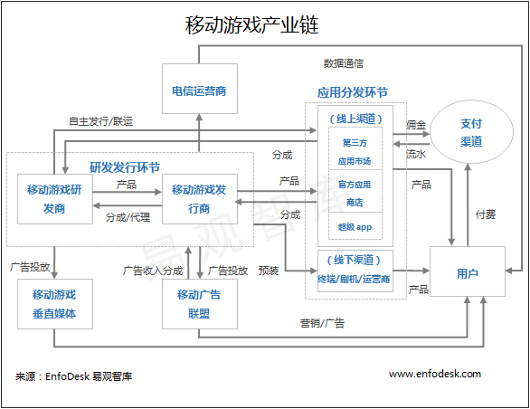

# Global Operation Talent 资料收集

<!-- MarkdownTOC -->

- 商务拓展 BD
    - 关键词
    - 能力
    - 游戏上线前如何做用户研究？
    - 最近有个手机游戏想上线，不知道各个渠道合作需要注意些什么？
    - 商务公司的手机游戏上线需要做哪些准备？
    - 对用户来说，「免费」的定价模式真的好吗？
    - 赚钱的逻辑是什么？
    - 是手游发行商的发行量大，还是几大渠道的发行量大呢？
    - 国家为什么对网游和对主机游戏是两种态度？
    - 外国人对游戏的喜好与中国人有哪些不同？
    - 为什么最近好多游戏公司都倒闭了？
    - 国内为什么很少有沙盒网游？
    - 腾讯为什么做不出现象级游戏产品？
    - 如何评价《三体》作者刘慈欣担任腾讯移动游戏想象力架构师？
    - 为啥《魔兽争霸 3》火到最近几年才开始衰落？
    - 如何看待手机网络游戏的前景？
    - 为什么美国科技公司里的印度人可以打破「玻璃天花板」？
    - 当面试官问「你有什么要问我的吗」时，应该问什么？
    - 如何迅速地了解互联网（特别是游戏）行业的知识？
    - 网络游戏通常是怎么让玩家形成目标感的？
    - 如何看待目前手游“遍地开花，却又遍地哀嚎”的现象？
    - 刀塔传奇好在哪？
    - 不付费的狂热网游玩家对游戏厂商有什么意义？
    - 没有数据支持，如何预测一款手机游戏在上市后的表现？
    - 手游商务的职业前景？
    - 销售和 BD 最大的共性和区别在哪里？
    - 作为互联网BD该掌握什么知识
    - 如何就移动游戏的发展历史分析现状和未来？
    - 以后手游会不会向更复杂的战斗操作发展？
    - 游戏运营为什么要打折？该如何打折？
    - 屌丝游戏策划怎么去理解土豪们的消费习惯？
    - 网络游戏中的物价是如何被制定和稳定的？
    - 手机游戏不吸量，这个问题该怎么看，怎么解决？
    - 从事游戏策划工作的核心竞争力应该是什么？
    - 从游戏设计的角度上讲，游戏内购买道具有哪些讲究，游戏内怎样的设计用户会买账？
    - 游戏联运常见的纠纷有哪些？
    - 未来 5 到 10 年，中国游戏行业的发展乐观吗？
    - 一名好的游戏运营需要具备哪些素质和技能？
    - 产品经理最常有的误区都有哪些？
    - 《神雕侠侣》完美手游，完全是按端游的思路来做，居然在畅销榜上还一直排的靠前，求解？
    - 如何能在商务谈判中做到不卑不亢？
    - BD 的主要工作方向是什么样的？
- 行为科学
    - 智商高的人会缺少人情味儿吗？
    - 贫穷对人的哪些影响是已经被客观证实了？
- 营销管理
    - 渠道为王如何理解？这里渠道是指直达目标客户的通道吗？
    - 市场营销有哪些常识？
    - 产品经理如何进行市场调研？
    - 麦当劳的单品有时贵于组合定价，这是为什么？
    - 作为活动策划如何往品牌策划活着营销策划去发展?

<!-- /MarkdownTOC -->

## 商务拓展 BD

### 关键词

+ 行业发展规划
+ 游戏整体战略
+ 互联网品牌合作的互动模式
+ 用英语介绍一下自己
+ 自己最成功的地方
+ 对网络游戏的了解
+ 合作方案
+ 客户关系维护
+ 互联网前沿动向
+ 手机游戏发行出版商业模式
+ 腾讯产品与服务
+ 识别评估捕捉商业合作机会
+ 渠道、发行商、开发商
+ 内容的购买，IP 的授权与发行
+ 给发行、运营业务提供深入分析支持
+ 游戏上线流程

### 能力

+ 应变能力
+ 组织能力
+ 调研能力
+ 逻辑思考能力
+ 沟通能力
+ 协调能力
+ 规划能力
+ 全局分析能力
+ 人际关系处理能力
+ 语言流畅
+ 有自信
+ 展现创新创意（尤其是场景题目，注意出奇制胜）

### 游戏上线前如何做用户研究？

做用户研究有三个重要时间段：

1，游戏开发之前。你要确定一个用户群体，轻中重，上线习惯，有没有IP，男还是女。大公司会买第三方行业数据，比如你看艾瑞今年的报告说现在卡牌是潮流，我们做卡牌吧，不行不行，开发要一年，一年以后也许是ARPG开始流行了……。当然我们知道大部分游戏制作人是按自己喜好来的，IP是盗版的，游戏玩法多半是抄的，这个部分纠结就不那么多了。

2，游戏上线推广之前。我们游戏做好了，从已经参加测试的玩家里我们大致得到了一些数据，喜欢我们的游戏的人大半是死宅男还是小女孩，每天玩多久，一般卡在第几关流失，有多少人反馈想付费。问卷有点用，但别迷信问卷，大部分人答非所问。这样我们就模模糊糊知道大概该投什么样的渠道了，经费少啊，好钢用在刀刃上吧。当然，大渠道和一线媒体是必投的，所以无视调研吧。

3，游戏上线一段时间以后。现在终于推了100万用户了，每天产生的数据让我们清楚的认识到我们做的游戏有多烂，赶紧改吧，希望用户全部流失光之前能改得好一点，我们还要做漂亮数据去外放联运呢。这个时候用户调研的结果一般是“你们这帮黑心孙子，就知道收费！”和“你们的游戏怎么这么大、卡、难看、妹子少……啊？”。作为用户研究研究出什么来了？

### 最近有个手机游戏想上线，不知道各个渠道合作需要注意些什么？

你不得不了解的：渠道之间的那些事

今天要给大家说一说，渠道到底适不适合做游戏产品发行，或者独代发行。在说这个话题之前，我也想来说说前不久一个让业界备受关注的事情，那就是9月12号《植物大战僵尸2》安卓版发布，这么一款，明星产品，不仅是备受玩家期待，各个渠道们也是异常的关注。因为这是一个能够证明渠道对于游戏分发的能力的时候。所以各个渠道在这款游戏的分发上面都各显神通。我们都知道12号《PVZ2》的首发是由三大运营商及五大发行平台：中国移动，中国联通，中国电信，腾讯，百度，91无线，UCweb和360。预计上线首日下载将破千万。这几个渠道在争取首发资格的时候，也都做了很多努力。具了解，宝开的首发是有要求的，就是在规定的时间要达到一定量的下载数，这个数是要写进合同里面的。具知情人透露，91无线给的要求是7日下周300万，这个数字明显是偏少的，宝开的人表示，这个是因为他们和91有其他的战略级的合作，所以数字给予了降低。360相对来说肯定是一个非常大的下载量的要求。而且据说《pvz2》上湖南台的天天向上，也是周鸿祎亲自出面帮忙牵线搭桥搞定的。可以看出360对这次首发的重视程度。

安卓版首发当日可谓是各个渠道都给足了支持，下载量也超出了宝开的预期。从这次首发，我们可以看到，竞争最大的就属360与百度系的百度手机助手和91无线之间的竞争了。但是似乎百度系的下载量没有360的高。之前也有很多媒体报道360的下载是多么的惊人，是多么的强势，花钱卖广告为游戏做宣传。这些我这里就不多数了。我想说的是360这帮人，执行力真是牛逼，无论是前期的广告铺垫，还是活动宣传，到上线当天的各个宣传点的覆盖，都是第一时间传达到用户面前，在11点开启下载之前的两分钟，360官方微信就发出首发的消息，在首发之后，360手机助手的通知栏广告赫然的写着：植物大战僵尸2全球首发，这个速度，这个传达覆盖面，下载量不高都难，第一个小时就突破100万，这个分发能力，不得不佩服（虽然略显流氓，手机管家拦截别人的通知栏广告，自己却干着最大的通知栏广告）。

OK，360的分发能力大家都有看到，相信很多厂商都想去抱大腿，希望360能够也像照顾《植物大战僵尸2》那样照顾下自己的产品，也让自己饱受关爱，享受下量大带来的快感。可是，真的能够如你所愿吗？我在开头就提出了一个疑问，渠道做发行和独代合适吗？我们都知道360一直以来要求都很高，对于产品上线，一般都要求在360首发，实在不行也要联合首发。但是问题就来了，在360首发，别的渠道愿意吗，渠道是不能看着你们产品在别的渠道首发，不在自己这里上线的，等首发过了之后在来要求上线，这个时候，渠道给你的一般就是五个字：收录不推荐。渠道之间是有竞争的，所以现在行业出现了一个现象就是凡事一款产品和某个渠道走的近，在某个渠道单独测试或者首发，其他的渠道都会联合抵制这款产品，这款产品要想在这些渠道获得好的用户量是非常难的了。所以各位厂商们，在游戏要上线的时候，要想好了，不要因为一个渠道给了你点好处，忽悠你在他们那里首发，你就觉得受到宠爱了，可能你在前期获得了某渠道的大力支持，但是等这个渠道的用户量开始下滑，已经不能满足你对于用户量增长的需求的时候，再去找别的渠道，这个时候是没有渠道会待见你的（不要因为一颗参天大树，放弃整片森林）。不过那些小渠道还是会很乐意和你们合作的。

那话就说回来了，产品在渠道首发会受到其他渠道的排挤，那么假如一个渠道自己做了一款产品或者独代发行一款产品的话，效果会怎么样呢？那我们就拿几个失败的独代发行的例子给大家看看，渠道独代效果会如何。

首先说下UC独代发行的《混沌与秩序》这款游戏在去年还是被很多渠道关注的游戏，很多玩家都期待能够玩上国服版本，渠道也希望能够上线这款游戏，但是后来得知被UC代理之后，渠道表示很失望，玩家也好像不是很喜欢，而且正真喜欢玩的很多玩家都去玩海外版的，渠道也都没有推过这款产品，这款产品就这样在UC自己的渠道进行了一段推广。后来也就慢慢的淡出人们的视野。结果，好产品被渠道独代，变成了失败产品（游戏设备要求高也是不能忽视的原因）。UC独代的产品在这款之后接着又代理了几款产品，表示都不是很理想。抢先一步代理了一个海贼题材的游戏《热血海贼王》，可是就是因为是UC代理的原因，好像其他渠道都不给支持，这款产品也就变的只有在UC自己的渠道上很热，其他渠道冷冷清清。后来上线的另一款没有渠道背景的游戏《梦想海贼王》获得很多渠道支持和喜爱（尤其360和小米），一跃成为千万级手游。这对于《热血海贼王》来说不免可惜啊（同样是海贼题材，比它还早，游戏质量又不是很差）。

第二个要说的是当乐独代的《遇仙》，这款产品是广州钧钛开发的，因为这个公司和当乐也算是合作很久，钧钛有位员工是从当乐出去的，所以两家关系算是不错，就在有这款产品之后开启了合作。渠道做独代，肯定是不愿意被其他渠道知道的，所以当乐就拿出了一个幌子，说是米乐独代的《遇仙》然后在各个渠道去推广（其实米乐也是当乐的一个子公司）。上线之初算是红红火火，各种渠道找人，找资源，还花钱买广告位，也是希望这款产品能够火起来。可是毕竟是渠道独代的产品，其他渠道不可能把你的产品放在很重要的位置，一段时间过后，也就扔着不管了。据知情人透露，好像因为内部种种原因，《遇仙》项目组的两个负责人纷纷离职，留下一个烂摊子没人管，结果没有办法全部交由米乐负责，当乐也就不管这事了。《遇仙》这个产品算是失败了。最近当乐又代理了一个新游戏，gameloft的《对决》。同样是出自gameloft，《混沌与秩序》失败了，不知道这个《对决》在当乐手里是否能够火起来。不过这次当乐依旧没有敢对外大势宣传说是当乐独代的，还是悄没声的在测试。

话说另一个渠道独代产品之后，生怕别人不知道的要数百度多酷了，百度多酷也玩起了独代，在代理了《斗斗堂》之后，是各种PR软文，生怕别人不知道它做独代了。可是小编想说的是，你代了一款不是很好的产品，就产品质量上渠道就不会给你很大的支持，又何况你也是渠道，注定这款游戏将会死在你的手里。这个游戏类型早在去年就已经出现了，之前的《弹弹岛战记》、《叮叮堂》都未获得很大成功，这个时候再推出这个类型的游戏，还会有多少玩家会玩呢。真是替《斗斗堂》厂商惋惜啊，百度多酷代理这款游戏，可不会像对《大侠传》那样去帮你做宣传，因为这个是百度多酷，而不是大百度……

另一个渠道做产品不得不提的也是百度系的91,91没有做独代，因为网龙自身的研发能力，所以也出了几款游戏。一直想和其他渠道合作，可惜的是其他渠道不买账，要不是不合作，要么就是算数收录，没有推荐，要不就是一直拖延，所以几款产品算是没有一个数据表现好的。后来没办法，开始将产品独代出去。这里要提一下，不知道搜狐畅游是脑子不好，还是怎么地，居然代理《妖界》ios版本，还借好声音的资源来推广，结果好像很不理性。因为这款产品一直就没有渠道买账，倒是在91自己渠道数据还算凑活。不知道91是怎么忽悠畅游做独代的，要知道《妖界》的安卓版可是免费代理给一个刚建立的公司拿出去推了。不过也难怪，畅游在手机游戏上一直没有出来什么产品，人家急着想拿出一块产品出来，乱了方寸也是可以理解的。

最后要说的就是分发能力非常强的360了，360一直以来都说自己是做发行的，专注于发行，服务好开发商，坚决不做游戏，2013年7月在360游久举办的“星耀360”，360副总裁也这么强调说自己不做游戏。好像厂商都相信360是一个公平的，值得依赖的渠道。但是他们在说那个话的时候，就已经在打自己的嘴巴了。在当晚的活动上代琳携带《刀塔女神》亮相。《刀塔女神》则是北京游龙腾公司推出的手机游戏，如此一来，这家公司就与360有着撇不清的关系。说不做游戏，背地里投资成立游戏公司去做游戏发行，可真算的上是无耻。即使你做游戏又怎么样呢，没人能拦你，也没人敢说你。可是却还很高尚的说自己坚决不做游戏。

做游戏可以，成立公司做发行，这些360干的这些事情，已经让其他渠道忍无可忍了。不仅是威逼利诱游戏厂商在360做首发，而且还投资公司做发行。渠道们看不下去了，要采取行动了。具知情人透露，百度和腾讯以及其他渠道已经开始联合抵制360这种流氓行为。你或许会问怎么抵制，它做它自己的，你怎么抵制，百度和腾讯以及其他渠道，联合起来，一致表示只要是360独代，或者投资，或者是和360走的近的游戏，这些渠道都不会给好脸色，最多是收录上架，坚决不推荐。具知情人透露，百度就已经发出内部邮件，明确表示《刀塔女神》属于360投资公司产品，只做上架，不做任何推广。这样一来，即使你产品好，即使在360上面给了很大的支持，其他渠道不推广，一样会面临用户量不足的瓶颈，对于一个游戏来说，源源不断的新增用户才是最重要的。所以被渠道封杀的滋味可不好受，前面可是有血淋淋的例子摆在那呢。

各位厂商们，以后要发行上线游戏的时候要想清楚怎么做了，找独代也要考虑清楚是否找渠道独代，即使能够给你它自有渠道的很多用户，但是那个毕竟不能满足所有需求。建议还是要找发行能力比较强的专注做发行的公司比较好。例如：北纬通信、昆仑万维、中国手游、掌趣科技等等。

今天写这些也只是想探讨下，渠道是否适合去做产品发行和独代，以及渠道之间的那些竞争关系。举了几个例子来说明，并不是为了要说那个渠道好，那个渠道坏。最终是要给各个厂商一个建议，渠道关系要做到一碗水端平，不要和某个渠道走的过于亲近，这样会遭受别的渠道的嫉妒的，渠道嫉妒起来可就没你好受的了。还有就是也要告诉各个渠道，不要妄想代理产品会比联运赚钱，要想想你合不合适去做。我觉得目前渠道做代理做的比较好的一种方式，就是当乐成立的公司云游游，做代理发行。没有当乐的这个包袱，只要做到各个渠道关系维护好，没有偏薄，那么做起发行来，也不会受到其他渠道的排挤，相对也会好一些。所以各位厂商们，游戏上线发行，要怎么做，想清楚了

### 商务公司的手机游戏上线需要做哪些准备？

1. 制定PR方案
2. 准备PR，联系PR媒体，规划PR发布日程
3. 制定游戏测试方案（包括上线地区选择，衡量游戏品质的各项指标，ARPU,ARPPU,付费率，留存1日，7日，30日， LTV等等）
4. 反馈游戏品质，做游戏调优
5. 制定游戏上线方案6. 联系游戏推广渠道：

+ 限免？
+ 买积分墙量冲榜？
+ 买CPA/CPC,广告位？

### 对用户来说，「免费」的定价模式真的好吗？

我对免费与收费服务的区别和界限困惑过很久，然后看到了一句令我茅塞顿开的话：

如果商家为你提供免费服务，那你就不是他们的客户，而是他们的产品。

看明白了这句话，再看那些免费服务，就豁然开朗了：

谷歌和百度做搜索服务，使用搜索服务的几亿人就成了一个成功的产品，广告主花钱实际是在购买这个巨大“产品”面前的曝光率；

电视台做各种各样的节目争夺收视率，观众就是产品，用节目吸引人气并划分出观众的年龄、性别、爱好，然后同样将这些分门别类的观众卖给合适的厂家，让厂家在他们面前展示自己的商品；

但是如果你收看付费频道，那你就成了客户，首先不必被广告困扰，其次，电视台对你的态度从“吸引、分类”变成了“服务、满足”；

网游的免费玩家，只需要给他们一些很初级的乐趣就可以，然后通过对乐趣的限制，吸引他们中的一小部分升级为付费玩家（客户）。而大部分始终免费的玩家，实际是被打包成一个巨大的“陪太子读书”的团体，供付费玩家们杀戮、领导、指挥；而且，付费少些的人同样要陪付费更多的大太子们读书；

对大型商场而言，顾客不是直接客户，商铺租户才是，顾客实际是他们提供给各商铺的产品，招揽到适合商铺类型的顾客才是他们的目的。所以，找准商场定位、招揽合适的商家进驻、针对定位进行宣传、甚至免费冷气、班车、座椅、公厕这种小事，都是为了尽可能给商铺提供更多客源。

回到题目中来。免费是好事吗？这个无所谓好坏，免费是种商业模式，关键看免费的目的是什么。

如果希望免费用户升级为真正的付费客户，那就会提供有限的免费服务，同时采取各种方法筛选出愿意付费的用户，并吸引他们升级；

如果免费用户只是纯粹的产品，真正的客户是另一群人，那就会通过免费服务尽可能多地吸引“真正客户们”想要的人，筛选掉无用的；

如果两者兼有，就要分别考虑，如何能达到两者的平衡；如果营销方式有误，可能会赔了夫人又折兵。

所以说，某个免费服务好用还是不好用，大部分情况下取决于商家希望你们这些用户怎么做：

+ 如果觉得不好用，但付费就能变得好用，那就是商家希望你付费；
+ 如果觉得不好用，你选择离开，那就是说你属于商家希望筛掉的那部分用户：不愿花钱，同时也没有作为产品卖给真正客户的价值；
+ 如果又免费又好用，那你和商家其实是各取所需的双赢关系，也正是他们期望的。

### 赚钱的逻辑是什么？

想在中国赚大钱，有一些基本的规律和共通的观念，按照重要性排列大致有：

1 政治敏锐

从70年代末开始到80年代初，搞投机倒把的个体户是第一批发财者，而这些人往往是被主流国营经济拒之门外，被逼无奈才出去闯的。

到了80年代中后期，发财的人又从体制外回到体制内。依托村或者集体社，利用自身在原有社体制内的声望或者职务（村长，支部书记），集资办起了加工厂的人成为第二批暴富者，这一波机会和体制转型有着千丝万缕的联系，以苏南模式（华西村）最为典型。

90年代早期的价格双轨制改革和90年代后期的国退民进。不知道有多少人利用国有资本变卖的机遇，抓住了廉价买卖产权的机会。2000年开始到2005年。加入世贸又给出口加工业带来历史性的机遇，货代、纺织品出口都养肥了大把没有文化的沿海小老板。2005年的时候随便开个什么矿，之后的商品大牛市会让你的钱多到用麻袋装。

至于商品房改革、股权分置改革、资本市场的发展更是和每个家庭的财富息息相关。以前老有人说看新闻联播致富这个梗，其实是有一定道理的。大

的暴富机会，中国在过去20年出现了不下十次，最大的机遇几乎全都和政治格局变化息息相关。其基本特点是一波流。一波三五年让你赚个饱，但这波赚完还想继续赚，几乎不可能。煤矿、进出口加工，这才几年而已，现在已经在生存线上挣扎。

2 从无到有

在中国，要预测社会未来的走向，一个最简单、最基本的思路就是：“中国在走美国的老路”。

这也就是所谓的CTC（“Copy to China”）的基础。可以说是中国最近20年所有新兴行业的一条发展主线。这条主线之清晰、之连贯，和前面所说的靠政治趋势赚钱的一波流的短暂易逝形成了鲜明对比。从90年代末期到2000年初的中国第一次互联网泡沫开始，一直到最近这3年的第二次互联网泡沫，几乎所有成功的，体量在百亿美元以上的新兴企业，其产品最初的雏形，都是一个“中国版的美国XX”。

解决稀缺是一切生意的根本宗旨。赚钱这回事，其根本意义，是“为他人解决问题”，而所谓利润，无非是为他人（社会）解决某一问题的酬劳。而从无到有，从0到1的事情，从满足稀缺性需求的角度，要远比从1到10的事情值得去做。从经济学角度来讲，最紧缺的东西才是最有价值的，故而得到的回报也不可同日而语。BAT这些搬运工起家的巨头，解决的都是从无到有的局面，之后那些跟风的早已在格局上输了，只能吃几口残羹冷炙而已。

3 ROE

思维如果从财务上来解释这一点，那就是`ROE（股本回报率）= 利润率*周转率*财务杠杆比率`。

注意这三者是乘数关系，所以利润为负的情况下，你的失败也会被这个放大器给放大。但即便如此，所有赚了大钱的人，几乎没有不用到杠杆的，敢下注本来就是企业家精神的一部分。

我在之前的回答里说过，穷人是手里有多少资源才敢做大事情，富人是先想到要做多大事才开始考虑要如何筹措资源。熟练运用财务杠杆的前提，就是敢于去动“本不属于自己”的资源的意识，或者说的再直白一些，敢去借别人手里的资源来为我所用。

巴菲特扣除杠杆的收益率不过13%左右。被自己有限的资源所限制，说明自己无法掌控资源的流向，依然只是资源的奴隶。

再谈一下周转率。即使是低利润，只要有高周转率一样可以在短期内获得发展。比如很多人排队的绿茶和外婆家，菜价便宜但翻台率高。当利润很微的时候，提高周转率依然可以提升ROE。

卖珠宝和卖烤串哪个赚钱呢？很难定论。珠宝的单品利润算下来可能比较高，但周转率太低。反之，烤串利润率低但周转率要大大增高。假设同样的资金投入卖珠宝和卖烤串，并且假设珠宝3个月一个资金回笼的周期（从生产到物流到销售），烤串一天一个周期（从生产到销售），那么在假设两者都可以销售出去的情况下，也许卖烤串比卖珠宝更赚。

此外，中间型行业和智力型行业通常有望达到更高的ROE，主要是因为资产较轻的关系。

4 了解自己

没错，研究自己比研究他人，研究金钱更重要。我们最大的问题，就是对自己的了解远远没有自己以为的多。

能赚钱不代表自己就能从钱中获得享受，对金钱的态度其实是一件特别个人化的事情。大部分人也许可以做到正确衡量各种资源的时间价值、却往往对自己的时间成本毫不在意，对自己的收益偏好毫无概念。

这种能力需要建立在深刻了解自己的身体和心理的基础之上；同样的资金、时间，由于掌握信息的差异，对自己来说，用在哪里最值得，用在哪里对当下、对未来的效用最大，都是需要反复摸索和实践的。穷人往往把“钱”看的太“值钱”，把“钱”以外的资源，例如自己的时间，看得太不值钱。很多人喜欢把赚钱、理财、投资混为一谈，其实这是三件性质完全不同的事情，所需要点亮的技能树也不尽相同。就我的观察，会赚钱的人不一定会理财；会理财和会投资也是完全两码事，会投资的人你若让他凭自己做生意，很可能亏的一塌糊涂。自己到底最适合做哪一样，也需要摸索。

很多人对创业有着各种不切实际的幻想，明明是个不够自律、厌恶繁琐的人，非要去做生产型企业，殊不知这可以算是最繁琐的一种商业模式，从原料供应，采购，生产，库存，物流，销售，每一个环节都不能出错，毛利润率又低，必须钻到每一个细节中去扣成本，可以说一步走错满盘皆属。对自己不了解，花下去的人生成本是无法挽回的。

5 防骗意识

这里的“骗子”是广义的，泛指一切出于零和动机打你主意的、想从你这里榨取资源的人。防骗意识的培养，应该贯穿在人生的始终。

投资本身，首先一定是一件反常识的事情，不然有钱人不会在人口比例中占少数。对于投资，其零和性要比赚钱大得多，所以有时候不止要看到趋势，还要评估周围其他人是否也看到了这个趋势，更要考虑到周围人是否知道自己知道对方知道。

如果说赚钱还是人和外物之间的事，那投资就一定是人和其他人之间的游戏，更加复杂诡异，不仅要防马路上的骗子、短信里的骗子，更要防资本市场的骗子，伪装成“创业家”的骗子、伪装成“好企业”的骗子、伪装成“合伙人”、“好朋友”的骗子、伪装成“情人”、“伴侣”的骗子、甚至是伪装成“养老金”、“社会福利保障”的骗子。

怎么阅读财务报告，怎样判断信息的真实性，知道怎么查一个生意伙伴的诚信水平；这些东西之重要，可以说分分钟能让你半生心血付之东流。但可惜这些东西对于普通人家的孩子，极少有地方系统的学习，只能靠自己一笔一笔“学费”去交。

过去我们小时候学校所提供的教育和家庭教育，对于以上怎样和钱打交道的知识可谓一片空白。大部分中国的家长和老师自己也不懂这些东西。既然自己一辈子也没活明白，那就更不用说教会下一代了。这样导致的社会差距只会进一步扩大。

### 是手游发行商的发行量大，还是几大渠道的发行量大呢？

CP——发行商（代理商）——渠道——用户

是现在常见的移动产品供应环节，不限于游戏，很多其他移动应用也有类似的生态链。

我的理解是题主的问题中出现了（假想中的）数字冲突即一个市场里面明明有几个”占比超过一半的巨头了“，怎么还有一些加起来也超过一半的家伙呢？

这明显是把关系摆错了的缘故，发行商提供产品给渠道，渠道进行用户下载的分发是常见的关系，两者在不同层级上，各自统计的数字对象虽然都是同一批“用户”，但各自算各自的盘子，两回事。

我也比喻一下：”好莱坞七大电影公司的进口影片票房占我国电影比例的60%“——这和“我国电影院线巨头中影 ，万达，上海联合，北京新影联（不是加起来也过一半了吗）的票房”相比到底谁多啊性质基本一样。

根本就不在一个维度上，所以无论如何，他们都既没有可比性，出现数字“冲突”也毫不矛盾

### 国家为什么对网游和对主机游戏是两种态度？

主要是政府机关反应慢，也不怎么学习，对行业不了解，所以管理起来乱七八糟。

早年单机游戏跟着pc电脑兴起的时候，没禁，这要感谢邓小平。那时候家庭买pc的也少，主要是在网吧玩。早年的网吧叫电脑房，也没法上网的，清一色386。上网都得去高级咖啡厅，1小时20－50不等。那时候电脑房打什么呢？打大富翁和沙丘2，因为可以联局域网。当然也有自己打仙剑奇侠传和大菠萝的。随着网络的发达，人们才玩上了红色警戒、cs和星际争霸。但那都还是以局域联网的单机游戏为主。网络游戏兴起就是从这个时候开始，从最早的黑暗之光、uo中文版，然后才是传奇、龙族。

那时候政府一直觉得网络游戏和单机游戏都是一样的，单机游戏也能连局域网，他们分不清楚互联网和局域网，常常新闻里乱讲，被我们耻笑。后来蓝极速网吧纵火一案，烧死了不少人，导致网吧全面从严管理，收紧牌照发放。但这个时候家用pc也慢慢普及了，家庭带宽也从用猫慢慢爬变成了adsl，网络游戏才走进了家庭。

电脑房兴起的初期，80年代，邓小平说电脑要从娃娃抓起，任天堂的卡带游戏机就以“廉价家庭电脑”的名义在国内卖的如火如荼，国人知道马里奥和魂斗罗都是那时候被熏陶的。更早一点，还有雅达利的摇杆机。这其实都是家用机，但没有被禁止销售，有正规的商店。这种卡带机价格还算便宜，容易仿制，后来就有了我们知道的小霸王学习机。国内生产商不但仿制游戏机，还盗版卡带，当年什么64合一，全是盗版。

那时候国内民众对游戏机的意见比较大（当然其实现在也一样），说玩这个是不务正业，玩物丧志。政府官员们终于搞清楚了原来这个游戏机真的不是用来学习的，跟电脑是完全两个概念。2000年6月，为了防止青少年沉迷游戏，国务院办公厅转发文化部等7部门《关于开展电子游戏经营场所专项治理的意见》，开始了针对国内游戏机市场的治理工作。在该《意见》中，规定“自本意见发布之日起，面向国内的电子游戏设备及其零、附件生产、销售即行停止。任何企业、个人不得再从事面向国内的电子游戏设备及其零、附件的生产、销售活动。”但这个法规也没提pc游戏。

后来我们所谓的游戏房，全部都是没有牌照的非法黑店，里面的n64、ps、土星，都是走私进来的。一般这种店分里外两层，外面一层是电脑房、网吧，里面一层是家用机，警察来查的时候，把里面锁起来假装普通黑网吧。那时候如果你是黑网吧，可能电脑不会被全部查收，只要交罚金保证不再干就可以。但如果你是黑游戏房，所有设备全部没收，还要拘留几天。在这种高压状况下，我们玩到了幽游白书，实况足球。我有个同学，警察来的时候他从三楼跳下去了，左脚骨折。所以我们真的是用生命在玩游戏啊。

最早做网络游戏的不是盛大，应该是黑暗之光、万王之王等等，但靠做网络游戏赚大钱直接变成行业第一的确实是盛大，靠传奇赚到钱以后，其它人眼红，也去海外引进各种网络游戏，这才有了行业的百花齐放。但这时候网络游戏也被监管部门盯上了，当时出来一个“网瘾说”，各种专家吵得不可开交，国家出台了一个规定，叫八句箴言，现在在所有的网络游戏网站的底部还能看到，跟八荣八耻一个路数。同期还出台了一个规定，要求所有游戏对没有身份认证的未成年人做一个功能，玩三个小时以后收益递减。你们知道那时候大部分公司的游戏都是从韩国、日本、美国引进的，能汉化就不错了，还要求加这种奇葩功能，很多开发公司都不乐意，有各种各样的规避的方法，从业的人都很清楚，这事儿就变成了一个笑谈。

盛大等网络游戏企业赚到钱以后，政府关系做得特别好，每年交很多税，国家觉得这个东西这么赚钱可以搞大，地方政府觉得这是招商引资建科技园区的重点保护对象，每年给网络游戏企业大量拨款扶持，可谓牛了大逼了。什么网瘾，什么游戏玩物丧志，在金钱面前都被忘记了。

### 外国人对游戏的喜好与中国人有哪些不同？

这问题很大，其实也有很简单的回答办法。

在游戏界，最重要的差别是性别，最不重要的差别是国籍。中国的游戏机玩家，几乎可以视为半个日本人。

中国游戏机玩家与日本游戏机玩家的区别，绝对小于大阪人和东京人的区别。而中国的电脑游戏玩家，几乎可以视为半个美国人，而且还是白人男性。

中国的网络游戏玩家，可能是韩国人，可能是日本人，可能是美国人，可能是欧洲人，看你哪年入道了。

中国的手游玩家，就是单纯的地球人——大家智商一样的低，骗钱一样的容易，对游戏一样毫无鉴赏力，只是容忍度更高一点。

在中国游戏史的绝大多数时间，有什么你就玩什么，玩什么你就有什么口味，对游戏公司来说，中国玩家是一群没有存在价值的人。

直到有一天，宝开中国横空出世，中国玩家连人都当不成了，变成了人肉取款机。

### 为什么最近好多游戏公司都倒闭了？

以为游戏谁都会做

“大陆手游行业有个奇葩现象：产业链上离最终用户越近的，与用户真正需求相差越远，越外行。渠道纯外行，发行方越大其执行运营越爱装不外行，开发商越要迎合前两者就越容易外行。（值得一提的是，一些只能靠实力的中小发行，其运营还是很接地气，很实用主义，无论懂不懂游戏，至少是懂行的。）

但跟任何行业一样，离用户越近的话语权越大。于是直接结果就是：行业规模做不大。如果不是靠着欧美日本还有正常的游戏产业，让国内还有得抄，这行业早停止成长了。

即便是现在，畅销靠前的产品居然又回到十多年前的经典端游互斗。

一堆安卓渠道，离用户最近，手里握着几乎所有安卓用户，但不带情绪的说，接触的大多数渠道运营都是纯外行，纯得不带一点杂质。

也许有些个体，但就整个渠道运营的做事方式，堪称根本不懂游戏。其奇葩思路比如：次日留存达标，才有可能评级高；那要不大家全去做斗地主？或者都去偷经典游戏IP，反正用户如果看到名字叫帝国时代进游戏真的是帝国时代，或者名叫口袋妖怪进游戏真的跟掌机上的一样，那保证次日留存高。

次留只是做大众App还有SNG这类面向所有用户的游戏才应关注的数据。渠道太外行，但又想找一些标准来掩饰自己外行。

等渠道什么时候进化了，能明白“让所有不同喜好类型的用户都能很容易找到自己想玩的”才是自己的工作，才是做平台的气度，也最符合用户和自己的利益，这行业可能才有点曙光。

虽然这道理如此简单，App Store诞生第一天就是这样在做，而且还在持续提高这方面的体验，不惜重金收购做相关算法的公司。说到底，如果一定要给产品评级，哪怕只用LTV一个标准来衡量也靠谱多了。

做游戏，无非就是给对应的用户群提供其喜欢的体验，然后得到收入。现在行业规模看起来还是一直在扩张，是受益于手持设备游戏在欧美形成产业的一开始，天然就有供应链短的特征，不像大型游戏市场，发行方话语权不大，主要的渠道方苹果又很清楚自己的身份。

于是整个行业看起来有点像PC单机游戏的蒙昧时期，各种各样的玩法类型尝试层出不穷，尝试成功的又能迅速得到用户的回报，然后开发商又更有动力去创新迎合用户，形成了正循环。

国内厂商的山寨天赋与这样蓬勃发展的环境天然契合，不自觉的让国内的用户也基本形成了“手机上总能找到好玩的”这个印象，只要这个印象还能维持，这个行业就至少还能保证基本的发展。

可惜国内的渠道话语权越来越大，而且又搞不清自己到底是干什么的，搞不清自己的层次，不明白自己是厚德载物的大球场，而不是裁判员这类可有可无换谁都行的事物。

现在这些安卓渠道，只会导致这个行业把自己的目标用户范围越限越窄。当一个普通用户打开手机，想找个游戏玩，从这些渠道的排行榜上一路尝试几十个都想睡的时候... 呵呵。”

---

那么，我就简单复盘一下整个中国手游市场的历史。尽可能遵照时间线索来走，但是因为很多东西不好说太明白，数据能给的也不多，大家多包涵吧。

不过相信想要简单了解这个行业的，还是能找到很多干货的，我保证。

一、移动普及，CP开荒

整个手游市场的崛起，与ios，Android的普及密不可分，分水岭大约是2012年。中国的游戏市场的信心产品大约出现在2012年~2013年，代表作品我记忆中的是三款，《捕鱼达人》、《我叫MT》、《君王2》。

当时，3000万月流是一个非常惊世骇俗的数字，当时，上述三款游戏都是到达了这个水平。而事到如今，3000万流水，对于许多游戏来说，不过是个及格线。相比起实业，游戏市场的轻资产，低成本，高回报，周期短的特点，会让投机资本非常冲动。

同时，投机者的入局也伴随着一批怀揣着一夜暴富梦想的从业者趋之若鹜。加之最终赚到钱的人不少，赚的钱也确实够刺激，让更多的目光和资金集中到了手游这块蛋糕上。

当时北上广深各种游交会上，形形色色的老板，带着热钱拿产品，闭着眼睛投项目，一投就是10个，1打。在这样一个循环中，越来越多拥有创业梦（经济自由梦）的人或团队跳出来单干。

整个市场进入高速增长期。

二、渠道、CP，协同发展

从《我叫MT》的成功开始，卡牌这一类型的手游开始备受青睐。卡牌游戏这一手游类型，是非常符合当时手机游戏的属性的：碎片化，玩法简化，乐趣核心化。

就在这时，手握大量移动端用户却苦于无法快速，大量变现的渠道商，腾讯、360、百度之流，顺势而为，与CP协同，一起做多手游市场。渠道手握用户，唯一的目标是让流量变现，而CP的目标就是做出游戏，让渠道把量导入游戏，并且快速变现。

早期，国内市场的卡牌游戏本身制作成本低，变现能力强，目标用户范围广等先天优势导致当时的卡牌类型的产品井喷。

由于中国Android市场格局的混乱，渠道商之争也成了一大奇观。正是因为渠道的存在，中国手游市场的发展才这么迅速。大量闲散用户被聚拢于各类移动端应用上，且用户未能被满足的多样性的娱乐化需求长期存在，愈演愈烈，最终产生化学反应，一举引爆市场。

这个档口，有用户的都在找产品，看产品，买产品；没有用户的都想要平台化。市场逐利本就无可厚非，前期是的爆发式增长缺不了渠道的贡献，但是随着而来的问题也足够让人头疼。

三、渠道的独木桥，迟缓的巨人们

从拼玩法到拼IP，从微创新到像素级抄袭，整个行业都陷入了为了赚快钱，赚大钱而无视一切道德底线的魔障中。

投机的盛宴开席之后，列席在座的各位慢慢发现，桌子有限，椅子有限，菜也有限，想要上桌吃饭，吃什么饭都要看渠道的颜色。

但是，因为产品的井喷，渠道商亟需一套行之有效的评价体系来筛选出吸量能力更强，变现效率更高的产品。渠道内部的KPI，给CP的数据压力，使整个市场的风向悄然转向。

渠道商摇身一变成甲方，玩法越来越多，分成比例越来越高，对产品的话语权越来越大，对数据的要求也越来越精细。CP们开始感受到了巨大的压力。

镜头的另一边是早期占山为王们的端游大厂们：腾讯、盛大、网易、巨人、完美、畅游。端游市场从2013年开始增速放缓明显，市场基本见顶，从2013年到2015年，无数的大作都折戟沉沙。

《最终幻想》、《剑灵》即便在早期交出了堪称完美的PCU，DAU数据，但是背后的运营和推广等费也都是天文数字。端游市场想要依靠新游戏来冲击瓶颈看来是不太可能了，且风险太大。

这风险来自于高昂游戏制作成本，高昂的运营与推广费用，以及不断萎缩的用户体量。腾讯的《怪物猎人》差点停摆了，《斗战神》的研运费用高的离谱，现在的流水能收回成本尚有压力，想要赚大钱已然不可能。

《天涯明月刀》还没上，但是从目前的数据和用户反馈来看，估计也是难，更加离谱研运费用和传统MMORPG的内核，基本上走不出什么锦绣前程了。

所谓的大厂们一般都不会第一时间进入未知的市场，这一点是有原因的。一方面，大厂们自诩为大厂，自然不会为了追逐“蝇头小利”而迅速自贬身价去做手游，毕竟做主机的看不起做端游的，端游看不起手游是人之常情，而且本身那几款老游戏的收入都不错，毛利又高，研运一体不需要和谁去分钱。

另一方面，大厂的船大，不好调头。战略做出来之后，第一时间跟进的就是各种调查，这种调研，然后投入人力物力。千万不要觉得小CP和大厂的人力物力是一个水平的。大厂都是有自己的办公楼的，动辄几十层楼，几幢房子，几个海外分公司，若干办事处。几年下来为了吸引人才，不断提高的员工福利都制约着大厂们的步伐。

反观小CP们，大家都是为了梦想，为了期权而来的，大家都来博大，都像打了鸡血一样，勒紧裤腰带，自带干粮，加班加点。一边是3W/月的人力成本，一边是一群热血上涌的激进青年。这一仗，没得打。

四、进击的大厂，渠道的困境

在当时来看，大厂们的跟进速度确实慢了。不少人都觉得错过了黄金期，大厂们一步落后步步落后。但是现在看来，事情并非如此。

大厂中的战略人才是最多的，小CP战略全靠高层拍脑袋，那么最后得出的结果肯定不一样。一个是深思熟虑过的，另一个是博傻。思考不一定会成功，博傻不一定会失败，但是谁都不能用行动上的努力去掩盖战略上的懒惰，市场很现实。

大厂与小CP的优劣对比我就不细说了，简单说几句。小CP优势也就是大厂的劣势，追热点换方向快，各项成本支出低。

大厂的优势也就是小CP的劣势，现金流稳定而充裕，有更好更坚实的行业关系（市场，宣发，渠道等），优质IP储量充足。

大家都知道所谓的企业基因对于一个企业的重要性，在游戏圈一样适用。腾讯拥有微信这个平台怪物的事情先按下不表，其他的几家大厂擅长什么，能做好什么基本上都看得出个大概的。

大厂要将自己的优势发挥到最大，博创新肯定不是什么好方向，多少个创新产品能出一个COC？Threes？怒鸟？这种依靠核心博大的玩法大厂玩起来不顺手。

大厂们要玩就得玩拼积累，拼钱的项目。然后我们看到了大量重度游戏的粉墨登场。

上面几个回答都提到了渠道与CP的分成问题，实际上这个问题并不是表面上这么简单的。在业内发行和CP之间有很多玩法，大家为了保证自己的利益最大化都想尽了办法。因为小CP势弱，所以发行和渠道在业内制订了一套他们屈从于他们的规则。

从次留，三留到七留；从月流水到周流水到日流水，甚至细化到首日流水；PCU，DAU，WAU，MAU，ARPU，ARPPU，LTV，付费率等一大堆数据中，不难看出，评价产品好坏的东西都被一一量化成了固定的规则。

大家脑补一下，卡牌和MMORPG手游的留存数据水平是存在极大差异的，MMORPG瞄准的用户更集中，可能几个大R的充值就能盘活一个服务器，但是卡牌不行。你可以要求一个卡牌游戏的次留在50%以上，但是你不能用这个要求去要求MMORPG，这是不合理的。

但是很多渠道把CP的产品放到测试区之后，就用这种规则去套，让后开始监修，提各种方案。当初《我叫MT2》在拿给腾讯之后的第一次测试数据尚且不错，然后腾讯开始监修，第二次发现怎么数据下滑了？开始找原因，继续改，第三次，又下滑了。测来测去没有第一次高，最后由于档期的原因，硬着头皮上了，好在平台撑着，数据还是很好看。

卓越尚且如此，可想而知，小CP所受的待遇会是如何。而且小CP是最拖不起的，一拖两拖可能就彻底没得玩了，甚至不给你上的可能性都非常大。我们再回头看渠道和渠道之间的战争。

渠道看似风光实际上如人饮水冷暖自知，百度开始拉公会入住，疯狂打充值返利价格战之后，其他渠道不得不选择跟进，UC如果不是背后有阿里巴巴撑着，今年交出的成绩单直接可以选择GG了。

优质用户的体量占总体比重是非常小的，现在渠道不光要比总量，还要比优质用户量，这一仗最多再打半年也就分出胜负了。最后的寡头会吃上好饭，但是在此之前，一切都未成定论。

五、天下无不散之宴席

其实到今年上半年，小CP的生存空间就已经岌岌可危了。大厂们积极入场，布局各类细分市场，无论做的好与坏，他们至少做到了一件事情：提高了成本。这个成本来自于市场，来自于用户。

经历了2年的手游产品的洗礼，很多用户从不玩游戏到玩游戏，从不付费到付费，客观上市场和用户都在被教育，被养成。

我一直说，中国的游戏市场上的用户是普遍缺乏“教育”的，这里的教育就是主机时代的教育。欧美日主机市场的繁荣有目共睹，用户的付费习惯也非常好，文化根基很深，但是中国却完全不同，这就是落后，但这不是一成不变的，只是需要时间而已。

在这个过程中，大部分用户已经基本找到了自己的喜好，也同时被垃圾游戏洗过一遍了。很多CP不愿意信所谓用户还能被洗完的论调。我们就拿点数据说话。

中国被使用次数最多的IP是三国，而目前，渠道给出来的数据，三国IP的吸量能力自带debuff，-20%。这是什么意思？如果你没有IP，能带来100W用户，一旦你改成三国IP，就来80W，还有20W压根不看你。

好的IP，能把吸能能力提升5倍以上，渠道饥渴，用户饥渴。用户成本越来越高，用户获取的难度也急剧增加。话分两头，各表一枝。试问，渠道商在面对小CP和大厂时，更倾向于选择哪个？

从我的个人经历来看，许多小CP的产品是真的扯淡，一天看几十个瞎扯淡的项目的感受你们是没有体会过，完成度差，美术粗糙，玩法过时，向你宣贯的概念基本都是飞在天上的。

看到一个稍微正常一点的要价又够你喝一壶。真正能看的游戏真的不多，你们现在在市场上能看到的游戏无论多差，都是佼佼者了。选产品的过程真的无异于大海捞针。但是反观大厂，风险控制都很不错，用户调研，CE遍布整个研发阶段中。

虽然这不代表产品就不会失败，但是失败率低啊，无论怎么说，卖相还是很好的。总体来说，市场朝向小CP的门已经越关越小了，野蛮生长的开荒时代已经远去，没有尽早确立行业地位，占上山头的CP们成功的概率更低了。

这一切归结成两个字就是门槛。

六、尾巴

小CP的日子会越来越难过，我敬佩每一个坚守在岗位上的同行朋友们，祝愿每一个行业内的朋友都能有好的发展。

### 国内为什么很少有沙盒网游？

这个问题比较大，我得分几点来回答。

总的来说，国内没有什么优秀的沙盒游戏主要源自以下1点足矣：研发困难，用户受众小。

世界上第一款沙盒游戏《Elite》诞生，沙盒游戏经历了很多版本。由主张剧情的《莎木》到主张自由度的《GTA》系列，到现在大火的《我的世界》和《泰拉瑞亚》从建造者的角度来诠释沙盒的典型作品。

不过以上都只能算是单机游戏或者联网游戏，还没有到网游的概念。我心目的中的优秀的网游沙盒游戏只有《Eve》。

回头来说题主的问题，国内为什么很少有沙盒类网游？

其实到国外也很少有…《EVE》现在存在境地的尴尬就是铁证。如果你把所有的网游拿出来一个说是”叫好不叫座“的典型游戏，那就是《EVE》没跑了…

说到运营，《EVE》在国内可是下了很大功夫的，沙盒游戏为了体现自己的世界感的概念，必须让玩家的数据达到一个绝对的多，这样才可以体现沙盒最核心的世界感的概念。

要知道《EVE》在海外可就只有一个服务器！而为了国内玩家的交流、国人特色的审核制度，特意造了一个“大陆服”出来让中国玩家独自游玩。

为什么说这样是很下功夫的呢？沙盒游戏因为数据是增进式的记载，所以数据的存储上会有几何体系的增高，在国内这种有可能会出现大用户井喷的情况下，做出这种选择如果出现失误那将是毁灭性的的。

但是就是这么下本的运营方案还是不能阻挡《EVE》在国内的失败，现在虽然还在运营状态，但是EVE的用户数、知晓度都没有一般的网游要高。

毕竟《EVE》是海外代理进大陆的游戏，我们国内的研发公司为什么没有人开发呢？国内的开发者都喜欢跟风，什么火了咱们做什么。

答主是做游戏发行的，去年《刀塔传奇》火了，于是我雨后春笋一样的看到了最起码300款类刀塔传奇的游戏出现…最后索性我们在游戏分类上多加了一列：刀塔传奇类游戏。

既然大厂出品的《EVE》在国内都境地如此尴尬，那么我为什么要做一款没有“吸金”能力的游戏呢？我经常和我的CP说一句话“我们是做游戏的，不是做慈善的。”

意思是，当你在游戏立项的时候就要想清楚你如何做最后一步的运营和成本回收。

如果我要重回制作人的岗位继续开发游戏，我绝对不会选一个沙盒游戏做为立项的游戏类型，因为，成本回收太困难了…

首先是技术难度，《我的世界》的随机地图生成都知道吧？这在网游上简直是恐怖的难度，首先你涉及到了“地边”的制作。

只要做有地图得游戏的研发，都会涉及到一个“地边编辑器”的开发工作，我的世界好几百种物体块的组合直接就会让一般用户的机器卡死在“loading…”环节，连游戏都进不去的游戏，有什么成本回收的价值？

然后我们来说运营。我现在作为发行看这个可能看的更深，一个游戏好玩不好玩很重要，但是更重要的是成本的回收。

我合同一签就给你几百万上千万，然后你的游戏没有运营能力，不吸金不吸量，那我还不如把我的版权金投入到股市里去呢！

而沙盒游戏如何运营？运营活动如何设计？怎么做产品投放？我真的没有什么头绪。所以，我本身都不会代理，和我一样想的人会有更多的。好了，说了这么多，我感觉不是国内玩家不玩沙盒，我们还是应该在开发者和发行者的角度多考虑这种有点尴尬的游戏类型。

倒是企鹅要推出的RPG《上古世纪》据说是半沙盒化的游戏，还跟《我的世界》合作了，这点倒是挺脑洞大开的，而沙盒是否能从RPG这个角度切入并立足国内玩家市场，还是一样挂掉，还存有疑虑，等着看吧~

反正从日前网上爆出来的Facebook国服玩家被国外玩家挑衅的新闻看，国外玩家不看好= =，看我们中国人是否能自强了…..

### 腾讯为什么做不出现象级游戏产品？

观点一：现象级游戏需要颠覆式创新，但这不是腾讯的基因。

腾讯早期做游戏的方式更接近于一个商人。步步为营，往往等到市场验证一个玩法有利可图时才“微创新”跟进：比如说当年泡泡堂火了以后，腾讯发现洛克人式玩法有赚头，于是“微创新”跟进了QQ堂。

比如说当年劲舞团风靡大江南北后，腾讯发现这类游戏和自己的QQ用户基因类似，于是跟进了QQ炫舞。

可以看到早期的腾讯非常擅长跟进一个已经成熟的游戏模式，然后在这个游戏模式上把游戏改编得更适合自己QQ上的用户，最后再把游戏卖出一个还不错的价钱。

——这些游戏很大一部分都获得了成功，所以如果一款游戏只需要称得上“好”，那么腾讯可能是全中国拥有最多“好”的游戏产品的公司。毕竟他们一有经济实力，二有用户基础，三有丰富的人才储备：腾讯的技术，美术，策划可能都是中国最好的。

这一切都保证了腾讯不会做出“太差”的产品，至少是工业合格水平线上的产品。

然而想把一款产品做到“现象级”，光是好还没用，还得有颠覆式创新，还得是一个游戏玩法的引领者。比如说2006年的《征途》，虽然绝对称不上是好游戏，但是它开创的时间免费，道具收费的游戏模式一时无二。而“史玉柱”式成长线强竞争类游戏也成为后续许多游戏争相模仿的对象。

再比如说2004到2005年的《魔兽世界》，等于是创造了一个真正的世界。它把一切都打磨到极致，用了许许多多那个时代世界玩家想都没想过的新想法，新技术，把当时的所有游戏都远远地甩在了身后。

或者一提到回合制MMPRPG，我们就会想到《大话西游》，《梦幻西游》。

所有这些称得上“现象级”的游戏，无一不是国内同类型游戏中第一个大成功的。至于后来者往往要接受自己的用户已经被之前的游戏“洗”过一遍的事实，当然成为不了“现象级”产品。

因为操作习惯，刻板印象的存在，一般人对于相似的事物都有一个先入为主的概念，对于后来者接受程度不会很高。比如说先玩了《DOTA2》的往往接受不了《LOL》，先入了《英雄无敌》坑的，往往对《星际争霸》也没有那么热爱。

所以“微创新”的玩法，要么等上一代产品的余热过去，扩大整个市场份额；要么就只能成为一个还不错，而不是特别好的产品。

在这方面，腾讯在产品层面非常牛逼的设计，以及一直擅长的“微创新”反而成为了它的一个阻碍。在早期，它不愿意，也没有必要冒大的风险去进行颠覆式创新。

观点二 在做原创“好玩”的游戏上，其实并没有太多经验。

2.1 “打磨产品”。

2007年之后，腾讯互娱调转船头，把重点从“微创新”转移向了打磨已有的产品。

比如都知道“3亿鼠标的枪战梦想”穿越火线是腾讯代理的韩国产品，但是可能很多人不知道当时CF的开发公司Smile Gate只是韩国的一个小作坊，而CF在韩国也一直不温不火，甚至在2012年停止运营，退出市场。更多的人不知道的是，腾讯对买回来的CF进行了一系列适应中国的深度开发，然后用快速的版本迭代，不断优化的操作体验，最后征服了“3亿鼠标”（一说3亿小学生）。CF成功了。

擅长复制别人的成功的腾讯自然也擅长复制自己的成功。

山寨能赚钱的时候，他们一年能推出10多个山寨游戏大作。

把外国游戏本土化，进行精细化运营能赚钱的时候，腾讯自然不会放弃这个赚钱的机会。

再之后，地下城与勇士，英雄联盟无一不复制着“穿越火线”的道路——签回来，进行一系列针对中国针对腾讯市场的改良，然后通过快速的版本迭代适应用户。

从此腾讯用自己超强的产品能力，超越盛大，一举成为中国，乃至世界最赚钱的游戏公司。

2.2 腾讯在创新上其实并没有太多经验

一个游戏是不是好玩，当然和画面，音效，程序难度，剧情包的大小分不开。3A级大作，还原战场的真实体验固然好玩，但是我从来不认为《战地4》就比最初代的《雷电》或者《超级马里奥》来得更为有趣。

毕竟一款游戏，最重要的还是它的玩法。

这也就解释了为什么有“千万级CG+陈奕迅唱主题曲+悟空传西游记顶级IP”的《斗战神》没有办法大火。同样也解释了为什么北极光工作室倾整个上海腾讯之力弄出来的《天涯明月刀》现在处于半死不活的状态。——这两款游戏，玩三天之后就会感到自己没什么东西好玩了。

诚然，天涯明月刀的画面美轮美奂，天刀出来的美术一直被业内膜拜。诚然，《斗战神》的战斗打击感凭良心说比《梦幻西游》不知道高到哪里去了。

然并卵，玩法上没有非常出彩的点时，在整个端游市场不景气的当今，根本没有出头之路。毕竟无论什么游戏，最重要的还是好玩。

而腾讯在做颠覆式创新玩法上，至少现在还看不出有什么高明之处，可能和完美世界差不多，比不上网易，和世界顶尖的那些大厂更是不同同日而语。

可能他们能最好地迎合群众，做出群众想要的，有最好用户体验的产品。然而用户其实自己都不知道自己想要什么。他们常常一边说着

观点三 腾讯是一家很大的，有很多团队的上市公司

天涯明月刀失败后，除了六大支柱外，腾讯已经全面转向手机游戏。

所以这里只说手机游戏：腾讯资源丰富，而且可能比中国其他所有渠道加起来都要丰富。

微信的月活跃用户有奖金6亿，QQ的数据不遑多让——而且微信覆盖青中年群体，而QQ覆盖青少年群体。分工明确，几乎包揽了全中国所有网民。

所以任何手机游戏，只要在微信上弹出一个小红点，就是几百万用户。如果还能借助微信,qq来一次好友排名，那就是社交链。

如果同时能上微信，手机qq。那绝对一天之内上免费榜，有的时候还能登顶。可以说，腾讯是中国最大的渠道，没有之一。

而腾讯又是一个体量超级大的，内部生态超级复杂的公司、且不说七个事业群之间的勾心斗角，就说互娱方面，八个自研工作室里上百个团队，而这八个工作室里没日没夜地在进行着各式各样的项目。

各大工作室之间有着许许多多数不清也道不明的利害关系。

偏偏腾讯还上市了，上市公司的特点又决定了它会也只能追求商业上的利益。复杂的生态环境，配上全中国最牛逼的渠道。

所以腾讯可能是全中国乃至全世界最特别的游戏公司之一—公司内部的竞争远远强于和外部市场别的游戏的竞争，这种竞争势必会引入一个标准，用来分配腾讯超强的内部资源。

这个标准会是好玩吗？如果真的是好玩，那又谁说了算呢。这个标准会是创新吗？创新有个卵用？作为一家游戏支撑起超过半数收入的上市公司，它评判游戏的标准只会也只能是赚不赚钱。

游戏是一开始就能赚钱还是慢慢赚钱。游戏是埋了很多赚钱的坑还是玩家玩了就会嗷嗷嗷往游戏里撒钱。

所以公司内部常常会出现偶尔有小的闪光点为明星产品让路的情况——即使那些产品深度挖掘以后有有大作为，即使让路以后那些产品可能会就此一蹶不振，腾讯自然也毫不在意。

所谓一将功成万骨枯，换我我肯定也这么做。这样情况下，各项目leader会把游戏往什么方向做，可能不用我说各位也能体会吧。

最后总结一下吧：

腾讯是中国乃至世界上体量最大的游戏商业公司。他们有国内最好的人才，最棒的技术，能打磨出最适合中国人的产品——但是至少暂时仅限于此。

他们能做出很好玩的游戏，毫无疑问。但是要让他们做出题主口中的“现象级游戏”。暂时很难。毕竟在那里，商业是远远大于游戏的。毕竟他们不敢打玩家的脸。

### 如何评价《三体》作者刘慈欣担任腾讯移动游戏想象力架构师？

你们呀，毕竟是图样。刘慈欣根本你不是你们YY的那种寂寞高手、神坛上的大师好吧，多看看他的写作历程、公开访谈你们就不难发现：这次和腾讯合作游戏，还有跟三体电影合作等等，都不是你们臆想的被商业公司忽悠了，或者是刘大师穷困潦倒为了赚钱糊口出卖自己灵魂之类的……刘慈欣和这些商业公司合作娱乐产品，都是有明确的目的的，这一点他也从未讳言，甚至经常强调，可惜你们就是听不到，或者你们的清高让你们不愿意听到。

他的目的就是，通过各种媒介——包括你们认为烂俗的腾讯游戏和可能会烂俗的电影——来推介科幻文化，不只是小说。

包括我在内的三体粉丝都认为跟孔二狗这样的娱乐人物合作三体电影，只会把三体毁掉、让粉丝又一次蒙羞……可是大刘根本不在乎你们所坚持的清高。

还什么“中国科幻已死”，你们酸不酸啊……跟腾讯合作就玷污了纯洁的科幻？

大刘看到的比你们远，早在多年前中国电影尚未井喷，中国人还在对着好莱坞大片流口水的时候，大刘就已经考虑到并且不断提醒科幻作者要重视电影，如果你知道了这个，自然也就明白了为什么大刘卖改编权卖的那么痛快，甚至亲自参与到一部有99%可能会是烂片的电影中。

对他来说，雷霆战机是不是垃圾不重要，三体电影是不是烂片不重要，重要的是科幻的影响力，要通过娱乐业来扩大。而不是像你们这样为了作品质量、甚至为了自己爱好不被更多的人拉低逼格，而坚持让科幻像今天这样小众。

即使代价是让这些作品变味，他也不在乎。他坚持认为只要通过不断推广，只要这些电影、游戏卖的好，影响力够大，并且还有科幻元素，这就是成功的。如果能有一代孩子沐浴在科幻作品中成长，等他们长大，出现更优秀的科幻作品是顺理成章的。

不管你们认不认同，他都在这样做。他是工程师，是小说作家，是娱乐产业人，唯独不是你们臆想的清高孤傲的学者。

他的执拗让我想到了章北海，不顾世人毁誉坚定推进自己的目标。塞翁失马，焉知非福。谁对谁错，我也不是很确定。

但毕竟大刘才是这些卓越的想象力的主人，我们只能等待这些电影和游戏的推出。当然，如果能是高质量的作品肯定更好，所以我对乡村教师电影的期待远高于三体电影。

### 为啥《魔兽争霸 3》火到最近几年才开始衰落？

做了将近10年的职业选手，打war3职业的过程中也是见证里CS和星际1的衰弱，觉得很多原因还是相通的。

我觉得最主要的是两个方面的内容，一个是游戏本身的画面，一个是游戏的运营模式

电子竞技和传统体育最大的差别就在于它的载体是电子游戏，这是一个更新换代非常快的领域，传统体育比如100年前的足球和现在的足球看起来差别也不会特别大，但电子游戏就不同了，每年都会有很多画面更好的游戏出来，更何况5年10年的跨度。比如星际争霸1确实很经典，但是如果现在的玩家看着这样的画面应该也没太多欲望去接触的，魔兽争霸3也是一样，也许现在看还可以，再过几年看光靠游戏画面也很难吸引到新玩家了。

然后最重要的还是游戏的运营模式吧，这也是直接决定了游戏的生命周期。在以前比如星际1也好、CS也好，还是魔兽争霸3，都是采取单机游戏售卖的方式，然后支持局域网对战和战网，从而达到竞技的目的，游戏公司赚钱靠的就是卖一份份游戏，所以在开发完成后也很难有持续的动力去更新，增加新的内容来延长游戏的生命周期，魔兽争霸3如果是经历过的玩家应该也知道从1.20的版本开始基本没大改动，只是平衡性的调整，最后一次加新英雄更是1.17的事情了，虽然游戏到后期的平衡性会越来越好，但打法也就会趋于稳定甚至说有些乏味吧，大家都知道什么打什么该怎么打，地图也打来打去就是这么几张。

从11年开始虽然我依然是职业选手，但其实已经不需要保持太高的练习量，因为战术本身已经很完善了，没太多可以挖掘的，保持大赛前密集的训练即可。在观众层面，也会看到这几年也没太多新的战术，只是更好的操作和细节了，游戏末期有实力争夺冠军的也就是几个熟悉的选手。

而现在的电竞游戏，最明显的比如DOTA2和英雄联盟，他们的运营模式上并不是靠卖游戏本身赚钱，而是一些增值的服务，比如英雄、皮肤、赛事门票等等，只要保持玩家的活跃度，游戏公司自然就有钱赚，也就有动力不断的去更新游戏的版本，改善固化的战术体系，不断有新的元素吸引玩家的眼球，推动比赛的观赏性，在这样的模式下，游戏的生命周期就会被极大的延长。

就电竞层面上还要个很大的因素就是比赛吧，也是由于上面提到的运营方式的不同，过去的比赛大部分是由第三方的赛事机构来主导的，比如WCG停办之后，魔兽争霸3的关注度自然就下降了，但现在因为游戏的盈利模式变化，赛事主要是由厂商来主导，不论是DOTA2的TI还是英雄联盟的S系列赛（中国的赛区就是LPL），上千万美金的杯赛、还有长期的联赛，这样的机制来保证顶级选手之间的比赛数量，提高游戏的关注度，自然游戏的运营也会持久很多。还有一个比较深刻的感受，在魔兽争霸3辉煌的年代里，高水平的比赛过多了，比如某某厂商随便举办一个商业杯的比赛，就能邀请到全世界上几乎所有知名的魔兽争霸3的职业选手过来参加。导致小比赛中重量级明星之间的对抗过多，从而让大家都觉得就今天这场比赛看不看都无所谓了。不像现在的LOL或者DOTA他们都会很好的保持好一年很少的几次世界级之间的对抗，赛事的关注度也会极大提高，当然这也是游戏厂商主导赛事的结果。

我也一直很希望魔兽争霸3可以有新的版本更新，比如有新的英雄、兵种，可以让我来开发新的战术，让比赛更有趣，可以和曾经的那些对手们一直较量下去，但可惜也能想想，魔兽争霸3的衰弱还是大趋势了。

### 如何看待手机网络游戏的前景？

手机联机游戏正在走页游的路子，从市场规模和游戏题材都很相似，其实几款热门的手机游戏都可以从页游中找到影子，而手机pc双载体的游戏也越来越多。就现状而言

1：当前月收入千万的手机游戏，有多于5款，比较有名的有忘仙，神仙道，捕鱼达人2，QQ御剑，龙之力量个人认为应该是有这个规模的，此外还有一些三国题材的七七八八（题材大同小异，名字真心记不住）。

2：增速远超过当年页游爆发的时候（话说页游增速真心不慢）

3：收入点和盈利模式越来越与页游趋同。（服务端架构与策略依然是王道，操作感和单人可玩性被无限弱化），开始很多服务端工程师转手机开发，我就劝他们，未来手机游戏的王道依然是服务端，今天应该有人领悟了吧。

4：跨平台（手机+pad+pc）越发成为主流

5：支付手段越发便捷，在安卓还需要一点时间，但是趋势可见。

6：目前主要障碍依然是上网费和网速，（中移动的狗屎3G影响了普及率）。所以重度联网对战暂时很难普及。

未来

1：重度联机游戏会随4G网络，资费下降及wifi普及化而爆发。

2：3年内有望达到或超过页游市场。

3：3年后将无法分辨页游和手游，统一化，跨平台化是趋势。

4：明年可见月收入4000万+的手机游戏（貌似保守，之前判断3000万+显著保守）

5：明年平台化和联运将成为常态（陈昊芝，360，91 目前领先，李开复系可能会冒出一到两个联运平台，多盟待看，百度继续摇摆）

6：明年收费模式会有一些突破。

7：明年安卓的吸金魅力会被广泛认可（非陷阱收费模式），ios平台不在一枝独秀。

### 为什么美国科技公司里的印度人可以打破「玻璃天花板」？

问一个最基本的问题，如果你是一家大公司的Boss，你现在需要提拔一个高管，你最看重的是什么？ 他技术有多好？他工作能力有多强？他学问有多深？ 仔细想想。

其实答案特别简单，最看重的是，他到底能帮你多大的忙。那么，怎样才算是帮忙？

当公司到了这样一个规模，有几千人乃至几万人，技术专家一把把的，优秀人才一堆堆的，这时候对于高管来说，最重要的是什么？ 协调与沟通，反馈与应对反馈。 你要知道老板想要什么，你要知道中层想要什么，你要知道怎么让他们的目标一致，你要扮演这个角色。

那是不是印度人就比中国人有优势呢？

我没跟印度人打过交道，但我知道，很多中国的技术高手，根本不会这个。

当然，中国不是没有这方面的牛人，善于沟通，善于表达，善于穿针引线，但是这样的牛人，还需要窝在硅谷赚工资么？回国创业，路子熟，市场大， 人脉广，资金多，知道么，现在中国的风投给创业项目估值比美国还疯狂，不止一个创业者这么说，印度有这个环境么？

很多打工的童鞋，特别不喜欢那种爱秀爱表现的家伙，但是有一天你当上boss你才会明白，爱秀爱表现，至少能让领导知道你在干嘛，你的团队在干嘛。你真以为boss天天盯着每个人的工作去分析谁更优秀？拜托，你知道boss要处理多少事情？

### 当面试官问「你有什么要问我的吗」时，应该问什么？

提出正确的问题，本身就是一种能力你去一个公司有没有做过一些功课？

对这个公司的业务和产品是否有足够的了解？

如果你能提出深入的问题，比如说

“我看到去年你们市场份额还落后于竞争对手谁谁5个点，而今年却领先了10个点，我注意到你们有一个代言广告最近很火，请问是不是这个原因？或者有其他原因么”。

你有自己的调研，有自己的思考，有自己的判断，但是对一些不明确的细节仍然希望得到有价值的答案，面试官肯定会高看你一眼。

技术面试我也希望对方提出一些技术上有价值的问题，比如说“

我注意到你们网站最近推出了一个什么推送功能非常火，从百度指数/alexa排名 也能看出来这个量级还是蛮大的，我好奇你们使用了什么数据结构来支持这个功能，用了几台服务器，峰值每秒请求大概多少？”

+ 您作为领导，看到的在这个职位上做的很出色的员工都有什么特质？
+ 公司对我这个职位的期望是什么？
+ 这个职位未来几年的职业发展是怎样的？
+ 为了胜任这个岗位我还需要学习哪些技术知识？

### 如何迅速地了解互联网（特别是游戏）行业的知识？

1、如何了解用户群看appannie, distimo 排行榜单，找到热门游戏后，分别去看百度指数，谷歌趋势，如果是中国的，去看百度知道，百度贴吧的讨论，如果是英文的，去google 或其他讨论组看玩家讨论，或看facebook粉丝页的玩家交互。看的时候带思考，不同国家的排行榜有什么不同点和相同点，免费榜单和畅销榜单有什么不同的特性，思考用户的兴趣在哪里，其中你雇主的机会在哪里？如果你能习惯经常性看榜单，你对不同国家游戏的流行趋势和流行风格就会有一个基本的认识，至少提到某个国家，你能快速说出比较靠前的运营商有谁，发行的游戏有哪些，而玩家喜欢的类型是什么，喜欢的风格是什么

2、如何了解行业竞争从榜单寻找运营商的名称，去搜索相关背景，如果你善于搜索，不难找到幕后的公司是哪一家，上市的去分析财报，未上市的寻找投资和相关新闻信息。财报数据是了解行业和竞争关系非常重要的一个途径，同样，带问题去看，财报不能解决你所有的疑问，但是可以让你有整体的概念，然后通过搜索将疑问一一解决。

3、剩下的问题如果你做到了前两步，并且善于搜索和提问，那么你至少已经超过了相当比例的竞争者，但和从业的资深人士来说，你还是无法完整了解更多细节，这时候，把你在前两步过程中遇到的细节问题拉到知乎，至少会是一个好问题。

### 网络游戏通常是怎么让玩家形成目标感的？

维持游戏动力，工作量从大到小：设计精妙的关卡>高自由度设计>普通关卡>策略研究>随机性>数字游戏

国产网游的所谓技巧都是围绕在如何尽可能在减少游戏性开发量的情况下维持玩家的追求动力。

玩LOL的时候，有这套理论支撑吗？没有。所以并没有放之四海而皆准的方法。游戏行业的循环就是等待高游戏性的范式出现，其思想精髓滋养若干年，并伴随游戏性减弱（必然的边际效应）和心里控制的强化（数字游戏），直到新的范式出现。

奇技淫巧在互相学习中不断以新的表现旧的机制重现，但真正让人成瘾的范式才是难以预见的，需要设计师真正下功夫，天才的创造或者碰上一些运气。在新鲜的范式之下，只需要常规的难度曲线设计，根本不需要像小白鼠实验一般种种掌控玩家心理的诡计。

### 如何看待目前手游“遍地开花，却又遍地哀嚎”的现象？

著作权归作者所有。
商业转载请联系作者获得授权，非商业转载请注明出处。
作者：孙志超
链接：https://www.zhihu.com/question/26474247/answer/32908803
来源：知乎

遍地开花->资本过于泛滥

遍地哀嚎->高估成功几率

都是再正常不过的事情。

这一年来不断重复的故事是——

> 我：你这个demo没特点，品质也一般，不如做点新东西吧。
X：创业不敢冒风险啊。

半年后……

> X：没钱啊，快挂了。
我：我也没办法啊。

> 我：你确定要签给这个不靠谱的代理?
X：别人都没答复啊，再说公司也没钱了。

半年后……

> X：那个产品还压着不推，断粮了，我们核心成员出来了，找你融资。
我：新方向不太靠谱啊。………………

与此同时，也有很多产品一般的公司活得很好，因为除了“做产品”之外他们有很多别的路子、方法或是实力，只不过你并不清楚内情。哀嚎的都是玩票的。真正想清楚了的创业者不至于遇到点挫折就大喊大叫。

那为什么那么多没想清楚就撸袖子开干的呢？因为人性。每天你都可以看到不同的分享、不同的经验、不同的新闻，每一个都好像是新的趋势，但观察趋势，靠的不是新闻，因为那都是妨碍思考的垃圾。

现实可以从三个不同的层次来展开：事件、趋势和体系。事件层面是最容易被观察，所以最容易吸引到我们的注意力。什么是事件呢？谁上市了、谁并购了、谁产品数据好、谁流水过千万，或是在公司里最经常思考的“谁搞砸了”。

重点是，我们都会习惯将这些事情看似毫不相干的“个别事件”看待。这带来两个缺点：一是我们需要有能力吸收海量信息（你又不是媒体，哪来的时间）；二是单从事件层面理解问题往往都是非常低效和偏颇的。我们很容易变成救火队长，却无暇思考火种其实是从哪里出现，为何出现。

于是，好的行业分析师（媒体上也没几个好的）会从不同的角度去拆解资料，解读出“有意义的”趋势。趋势是从一堆事件中找寻有趣或有意义的连续性发生事件。趋势的形成，往往来自背后的势力。既然是有力于其中，故它也不容易被一、两件“个别事件”所左右。因此能够了解趋势，并顺势而行，然后“顺手发财”，是很重要的。

能够发现趋势，尤其是其他人看不到的趋势，会对自己有“着先机”之利。但对于金融行业而言，无论他们有多少的“趋势分析”，都改变不了急功近利，从事件层面作反应的习惯。所以，资本过度投入，盲目乐观，合情合理。然而，即便随手都有一堆趋势图表分析，但多数人骨子里的心智模式仍没有改变。

我们习惯了从过量的资讯中做过敏的反应，大起而大落。要清醒地认知这个世界，我们需要更抽离一点看这个世界，需要知道事情发生的意义，才不致跟着其他人作没有意义的东奔西跑，比如说——“我们做个手游去”，或者“我们投个手游去”。

### 刀塔传奇好在哪？

分析市场成功产品的所谓“优点”是游戏行业明知蠢仍不断重复的事情之一。智龙迷城火了，长篇的分析；MT火了，数值被研究了个透；COC火了，每个细节设计的优劣都像床上的女人一样被摸了个遍。刀塔传奇火了，据说很多公司都写了数十页的分析报告。如果真想了解刀塔传奇的优点，找大公司的朋友，应该都是能要出一份的。

所有成功产品的共性不过是：研发能力的积累和敢为天下先。多数人不想面对也不愿面对，剩下的撇下一句：老板想知道而已。在没有充足的研发经验和产品感觉的时候，学习所谓产品优点，都是拔苗助长。请问谁是学会中文语法之后才开始学讲话的？越是敢于尝试，不要去担心细节，反而更能轻松地进入游戏制作的领域。

一般认为，国内的网游包括两类，一类是“数值YY向”，一类是“操作体验向”。前者以把无法作为单机游戏来体验的内容成功网游化为目的，后者旨在探索传统单机游戏的“网游化”。后者问世较早，大致与中国网游业的发生、发展亦步亦趋；数值向游戏则在自动化游戏成型之后逐步兴起，经历了页游的蓬勃发展，形成了一套相对成熟、稳定的范式，最终成为国内极为擅长的类型。

出现手游以后，有很多精研页游风格产品的团队转投过去，用自认为的“成熟”开发积累来做“精品”。这一类游戏，陆续也看过很多。说实话，看后心里有些不是滋味。抛开完善完整的成长体验和付费空间，这样的游戏体验，看了让人痛心。它分明是在告诉你，游戏行业前辈们辛辛苦苦攒下的那点游戏美感和互动体验的经验，基本已成一阙绝响。

刀塔传奇的魅力究竟来自何处呢？以我一己拙见，它来自制作者发自内心的对传统游戏理念的认同感。刀塔传奇的确仍可归到数值向的卡牌游戏当中，但它至少保留了传统游戏重视细节的原则，没有无条件的急功近利，也没有像很多资历较深的开发者自欺欺人，去分析拼装所谓“优点”，或是按照程式去追求虚无缥缈的“打击感”之流。让静态的战斗过程，获得了一种动态的观赏体验，能做好就不错了。至于在成长体验和付费体验上和其他产品做出的区隔，与其说是灵感的发酵，不如说是因为没有页游团队那么丰富的背景知识和复杂架构，在有限时间内做出的简洁逻辑，配合运营方过去经验的配合，所形成的中间结果。

其实，在游戏种类高度发展的今天，不论出现怎样的游戏体验都不足为奇。重要的是，刀塔传奇并未落入创意滥用的陷阱，而是对传统游戏开发本身怀有一份敬畏，一方面在2D骨骼技术上花了很长时间打磨和调整，达到了当时国内最高的水准，另一方面在技术运用上又保持了节制，没有特意炫技而去追求超越策划需求的层面。此外，在游戏内容设计方面，没有一味强调创业或贪图大而全，而是像早年的游戏制作者，更关心玩家对产品的喜好程度，而没有刻意去规划产品初始所谓的逻辑循环严谨。以我所见，这并非人所皆能的事。

很多团队，要么技术实力太强，缺乏对游戏的感受力；要么技术很一般（有时候人其实很强，但态度不端正），对技术的把握、运用不当，或者对提高游戏品质所需的技术特性知之不多、理解不深，则很可能做出来一个品质平庸的产品。

因为手游火爆而加入的开发团队，绝大多数不是在贸然创新，就是死守过去已知的成功模式。跟风者的理由总是：虽不好，但至少过得去，如果改变，谁也不想要承担那“可能会失败的风险”。大家总是一窝蜂做同一件事，看到某一个模式成功了，就疯狂复制模仿与抄袭，因为这样可以避免失败的风险，他们只想快速看到效果。

当我们只充满了竞争意识，你能想到的只是：“怎么办？这么多团队快把我压死了，我必须赢过他们”所以最快的方法就是通过抄袭与竞争赢过他，或至少跟他旗鼓相当，但假设今天你就定位自己想靠自己的想法做出成绩，你就有可能走创新， 去跟别人做出市场差异。当然很多人会觉得，我花那么多时间与金钱投入研发，到最后还不是被别人抄光光，说不定可能还做得比我好？白费工夫实在不值得，但就算后来出现便宜百倍的复制A货，Prada到现在还是屹立不摇啊。

卡牌游戏的这几个市场高峰，各自逻辑是有差别的。大掌门和放开那三国都是经过认真地分析和建构，继承页游模式并利用内容开发及调整的能力和速度优势。MT和刀塔传奇都是基于已有的成功模式，在核心战斗体验上做优化和变化。真正的游戏制作者，看重的是“让玩家去游戏，去尽情体验，然后觉得开心，觉得有趣，这样就够了。”有模式做基础，无非是已经有可以让玩家留下的模式做底版；没有模式，就自己去做，尽可能借用已有的原型、当原型固化的时候就改动一些，这些是很朴素的想法。做的人也不知道能取得怎样的成绩，所以并不会特别去在意其他开发团队，只是想到现在所能做到的最好的东西，然后把它执行出来就是了。活在当下，然后专注在当下最想作的事，这是所有成功产品背后团队的一致特征。

大家其实都会一直想说现在要做什么才能活，现在要做什么才能赢。其实大家应该想的是，现在缺什么。没有做春秋大梦，纯粹在意让自己拥有更优秀的开发能力和让玩家拥有更好心情的，才是常默默成就大事的人。至于成功之后产品是否走向了丧心病狂的课金之路，有时候是为了在这一浮躁市场上追求更长远成功不得已的选择，并不一定是制作者最初的出发点。

### 不付费的狂热网游玩家对游戏厂商有什么意义？

关于互联网免费模式，“长尾教父”克里斯 ·安德森的书《免费》已经阐释全面。

至于网络游戏，无非是通过零成本增加消费者使用欲望，减少了使用风险 ，加上口碑效应 ，逐步吸引和建立庞大的基础用户群 ，然后部分潜在的付费用户 ，往往不满足“免费模式”提供有限服务 ，对额外增值服务有潜在的需求 ，因此愿意通过付费的形式享受产品的增值服务。

承载的带宽和服务器费用远不如增长的收入多，总的来说互联网的边际成本接近0。

### 没有数据支持，如何预测一款手机游戏在上市后的表现？

如果真的训练出了和玩家口味一致的本领，理论上应该能判断游戏的好坏，仅此而已。但成绩能否预测，和市场格局是否稳定有关。

现在的端游，基本可以预测个八九不离十。页游，除非黑天鹅出现，基本也能预估出峰值流水的范围区域，根据开发商和产品档次。手游，几乎没有可预测性。其原因在于

1，渠道的寡头化，比垄断还难预测。

2，产品的平庸化，其实产品之间没有想像那么大的差距。让我细细道来。相对于渠道以固定用户为基本盘，cp处于一种较为弱势的地位。市场上大部分产品均非一线作品，很多产品晚几个月上线可能就火不了，这能叫什么好产品？产品档次（这个档次不是仅仅指美术）拉不开差距，使cp缺乏与发行博弈的砝码，受同档期竞品情况影响极大。

其次，由于发行方也可以涉足游戏的制作与投资，进一步削弱了单纯从事游戏制作的cp们的话语权。这令众多小cp成为予取予夺的砧板鱼肉，在是否会被重点推广运营方面全无谈判的余地。

正因如此，渠道和发行是控制着国产游戏命脉的一道符咒。当下cp、发行与渠道的冲突只是一轮瓜分财富的商战，甚至仅仅是一场寡头们之间的战争，对于产品的进步助益不大。

一个不容置疑的现实是，国内在投资计划、经营方法、盈利模式与选品策略上均存在严重的雷同现象，发行往往唯数据马首是瞻，几乎无视游戏的可塑价值，在同代理同类型产品同期的数据中表现略差，几乎就很难翻身。由于发行商们看重可预测性以及绝对控制，所以会尽量避免大胆的产品革新。

在高集中度的情况下，大公司尽管可以不惜重金探索和发展新的产品形态，但由于在大型企业中，决策必须经过相关部门的层层过滤，涉及太多的人，其内部就存在着各种制约；所以新产品异常成功的冒头只能出现在新的或小的组织中，比如刀塔传奇。“创新”有三种定义。“创新”通常被定义为技术、产品设计、产品特征上的变化。“创新”的另一种定义指在主题、价值、表达方式、或是关注点上的变化。另外还有第三种“创新”称之为产品的更新换代。这种创新并不是变化的，而是娱乐产品生产的重要组成部分，甚至还代表着一种内在固有的不稳定性。

游戏是否能取得巨大成功中的不确定性的本质来自于创新过程的本身以及组织环境（企业如何完成它的目标）和组织结构之间的关系。由于消费者的偏好不同，产品主题、内容、风格的变化可能遭遇到商业利益的阻碍和运营部门的限制，而且产品更新换代的压力使得发行方需要不断地与cp就产品的内容、规则进行协商。

一款游戏是由初期的质量和持续运营的质量来共同决定最终成绩，而后者又由开发团队的开发实力、发行方的运营能力、双方的配合程度综合决定，更带来了诸多变数。面对渠道可推广产品量的缺乏、难以驾驭的cp，都要求发行方合理地将cp与渠道需求、市场需求串联起来，在渠道和用户之间传递信息和想法。这种中间管理制度充满了不确定性。

一言以蔽之：“渠道挑选好发行，而发行挑选好产品。”此外，市场分割——将玩家由年龄、阶层或生活习惯等为依据划分成若干较小的市场——的作用也不容忽视。市场分割的程度与产品的多样性紧密相关。比如盛大产品、娱乐节目冠名产品、起点大神自推产品等所采用运营推广模式带来的差异。所有文化创意产品都具有需求的不确定性，因为其重在精神需求，对这类产品的市场需求就比较难以预测。

因为游戏不是生活必需消费品，玩家选择玩一款游戏的因素太多。此外，游戏玩家的“质量弹性”并没有那么刚性，也是难以预测的原因之一。通常美剧观众对于类似美剧的需求较高且是相对刚性的，而相反，普通人对于流行音乐存在着更多的“质量弹性”。主机游戏玩家和国产手游玩家也有类似的区别。想一想那些获取A级产品成绩的B级产品，比如一些蹭ip和渠道自营的产品…产品的多样化和创新的程度与受众有关。

而相反，产品的单调化则更多的和市场结构和企业的组织环境有关，而不是和大众的对于同质产品的高需求有关。说到底，手游目前能判断的只是产品当前的完成质量和接受度，最终成绩基本无法预料，除非是已经成功合作过的cp与发行方。

至于投资，如果是天使阶段，看不到产品，又是帮不上团队太多资源的情况，基本就是蒙的。再怎么觉得自己成功的投资人，多投几个，保准失手。区别不在于单个案例的成败，介入时间、数量、阶段、持有时间等等才是他们之间的区别。

### 手游商务的职业前景？

商务是个很牛B的词。不然国家不会有商务部。电子商务也不会出现这么多上市公司。

大家口中说的商务，指的是BD，商务拓展。但现在很多小公司的商务，其实都是业务员或者攻关（公关），基本的素质都不具备。手游BD最初是源于SP时代，职责定位是拓展业务，也就是与运营商联络的专员，但后来在实际操作中逐渐完全沦落为一个纯粹做公关关系的角色。

最基本的，作为商务人员至少应该具备

第一，知识。个人在一个领域所掌握的信息综合，相关知识能够满足工作需要。

第二，技能。了解基本的实战操作，才能和对方交流相关细节。如果是海外业务，则至少需要能使用一种或多种外语交流能力，较强的跨文化交流能力，对公司技术和产品熟悉并能够熟练对外介绍。

第三，社会角色。个人呈现给社会的形象，如个人形象好，有良好的职业素养，是公司产品的“形象代言人”。

第四，个人特点。个人以一定的方式产生行为的性情和气质，如性格外向开朗，有敏锐的市场洞察力，开拓能力。

这里面，作为海外商务，对经验的要求更加高，因为跨文化交际会遇到大量的问题。举个小例子，在与以色列、瑞典人( 他们的文化具有相对的分散权力或者“小权利差距”概念) 一道工作过程中，和法国、比利时这些文化中的商人相比，我们可以期待更大程度上接受多人一起参与的交际管理模式，而后者习惯于根据权力决定模式，一般很少使用多人一起参与的管理模式。另外，业务的熟悉程度也至为关键。很多IT企业，商务负责人几乎是CEO的发言人，对公司的战略部署，技术的优势，并购的策略等方面几乎是了如指掌。

目前手游行业中的商务职位，虽然没有SP时代扭曲，但依然不是完全健康的。CP在整个产业链条中的弱势地位，以及渠道的垄断性优势，决定了他们之间关系的非正常。相反，开发工具、业务服务、基础硬件等正常的商业合作方面，更接近传统BD职能。现在很多CP和渠道的商务，对游戏一窍不通，只会喝酒、KTV，收集一堆信息，拿回来交给上面决策。这不就是一个跑单的销售么？

一个理论上优秀的BD应该及时掌握行业动态，拥有出色的内部协调能力、提前计划能力和高效执行力，学会研究并预测竞争环境，计划并提供各种方案。至于未来职业发展背景，投资、战略、咨询、管理都可以，看自己的兴趣和特长；或者找到最大的平台去做商务总监或VP，也很圆满。

作为起步，先学会合同相关的法律知识，让自己具备商议合同的素质；了解不同文化中的价值观差别，洞悉适当与不当，愚蠢和聪明，对和错之间的微妙边界，掌握各种场合和各种对象的沟通特点和谈判方式；学习实际业务流程及产生的各种合作流程，具备把看似繁杂的业务过程用真实或模拟案例进行展现，并与实际操作环节相沟通的素质；时刻关注市场形式及相关政策的变化，具备对未来判断和双赢的运作思路。有了这些，才算是真正的商务，才有真正的职业发展

一、手游商务做了一年两年三年的手游商务应该在哪些方面继续提升自己

第一年-----你应该学会基础知识和人脉搭建

菜鸟欢迎你入行，这是个红海，准确的说是血海，既然来了，就努力混出名堂吧。

1、基础知识，业内的各个角色都是做什么的（cp、渠道、发行等等）、现在手游的主要合作模式（cpa、cps、cpt等等）、一些基本的术语（次留、7留、SDK、联运、push、arpu值等等）。

2、人脉搭建，跟所有能联系上的渠道取得联系。建立自己业内的小圈子，大家可以在一起探讨和分享资源、数据。

第二年-----你应该学会投放、产品、运营、品宣、收集

没办法，行业竞争太激烈第二年你就要粗略的学会这些东西。

1、投放策略，联合首发，选择适合的渠道，在推广之后的问题反馈和迭代。

2、产品迭代，产品已经完成之后根据数据的反馈，商务应该有自己的判断，不吸量就改名字和ICON，付费率低就增大首充展示，等等。

3、运营游戏，要适时的做活动，来提高游戏在外的吸量程度和内部的充值金额。

4、品牌宣传，游戏上线前后都不能放松的一个点，大篇的软文散漫天，让产品的受众并适时的看到并且找到下载位置。

5、收集信息，竞品的渠道数据，竞品推广策略、方式，明星产品的上线时间等等。

第三年-----你应该能判断市场的现状制定总体推广策略

三年了，差不多算是这个行业的老鸟了（手游行业崛起一共也没几年），第二年的东西要全部掌握起来，融会贯通的时候到了。

1、制定总体推广战略，PR炒作---首发---数据反馈---迭代---何时铺第二批渠道，这里面一系列的机制要建立完善，应该由商务总监主导。

2、资源配置，资源的获得、投放预算、如何投放，预期数据都要心里有底、手中有粮。

3、对产品与市场的判断，手里的有几款不同类型的游戏，在有限的预算和时间内如何配比。

二、手游商务和其他互联网公司商务有何区别，二者是否可以互换角色？

1、互联网产品主要是解决问题，所以商务更注重去寻找遇到这样问题的目标用户，更注重投放的人群和方式，并且玩法多样性（安兔兔没花钱推广能到上亿用户，在手游里是不敢想像的）。

2、手游主要是提供消遣，任何人都可以需要消遣（虽然重度手游不适合消遣，但没法做到应用那么精准），所以投放会比较宽泛，注重投放的频率和回报，玩法较应用来说不那么丰富。

3、在初级上是可以互换的，但是中级和高级二者不在同一产品纬度，人脉圈也不一致，不好互换了。

三、CP、发行、渠道的商务是否能互通？比如做了两年CP对接渠道的商务能否转到渠道做商务？

1、CP和发行其实做的基本是一件事，可以互换。渠道商务不同，它对接的是CP，主修的技能是对接，除了人脉圈不一致，没有什么太特别的（这里谈论的是纯渠道商务不包含测试、运营），也可以互换，不过一般像样点的渠道还是喜欢有渠道商务经验的人，而不是CP商务转型的。

### 销售和 BD 最大的共性和区别在哪里？

互联网ＢＤ主要是在公司业务范畴内寻找潜在合作伙伴，在双方交叉领域寻找能够产生价值的机会点，同时协调内部资源(产品、运营、开发等)为业务增长出力；互联网ＢＤ更多的是需要行业知识，在客户关系方面比大客户销售有弱化。

### 作为互联网BD该掌握什么知识

工作中接触过很多很多商务，站在合作方的角度有这么几点想法哈：

1. 基础技能
    - 会与人打交道
    - 对公司的产品有良好的认知
2. 高阶技能
    - 谈判技巧
    - 对本司的产品理念以及行业的发展方向有自己的理解

基础的第一条其实是挺废话的，但恰恰是很多人都不具备的技能。而且不是看书就可以学会的东西，只能在工作中成长起来，这种时候跟对一个好的领导非常重要啦。

### 如何就移动游戏的发展历史分析现状和未来？

发展史没有太多可说的，百度即可，从功能机到智能机，从单机到网游，很清晰。

发展阻碍，目前没有什么致命的，毕竟是市场发展阶段，远未到顶。欧美市场上，比较糟糕的现象有：太多复古游戏，从机制到图像；时间cd机制，欧美游戏真的太喜欢建设了；移植PC的游戏效果，利用iphone搞大作；电影同名游戏，生命周期不持久。日本市场相对还比较健康。韩国逐渐走向集团垄断化。中国的问题永远就一条，山寨和跟风举世无双。

未来趋势，我也不知道。不过可以看一看端游的发展历史，或许会有些启发。

先来看欧美，UO是创造 MMORPG 这个词的游戏，基本上就是从图形化 MUD 衍生而来。随后因为 Meridian 59 以及 1999 年的 EQ 而迈入 3D MMORPG，WoW 虽然推出时间为 2005 年，但其实早在 2000 年就已经在开发，整个游戏的观念不脱 EQ 那一套，以故事的主轴推进游戏世界，并且主打角色的 build up、raid 中大量的团队互动以及 PvE 的概念。先不提 PvP ，不然 DAoC 或者 SB 之类讲不完，算是不同的类型。

WoW 持续融会了许多游戏的优点，例如一开始 raid 组成就不像 EQ 最多 72 人，2003 – 2004 年间其实是 EQ 的高峰期，但也因为 hardcore raid 而使玩家疲倦，毕竟 24 小时 call raid、不断地 farm flag 等等虽然很好玩，但也很累人。WoW 一开始就把 raid 缩小到 40 人的规模其实是有其根本的。还有就是把职业、技能都简单化，即便有天赋系统但也限缩了范围跟点数值，大幅的改善 UI 和任务系统，也有效的降低玩家门坎。因此挟带着 暴雪和魔兽争霸系列的高人气，推出后屹立至今仍然有大量的玩家。但是很明显的，玩家的变动其实很快。在这段期间内，有太多太多的轻量游戏推出，虽然剧情无脑、玩法简单，但游戏对于多数人而言毕竟是打发时间，hardcore 的内容体验过一次就够了。所以很快的，WoW 很明显地从 2009 年，也差不多是推出后四年左右，人气大幅下滑，跟 EQ 在 2004 年推出 Plane of Time 后的历程差不多。更小规模的 raid (25 人、10 人) 风行，而且从巫妖王之后，暴雪能吃的本钱也差不多吃光了，自然流失的速度愈来愈快。中间其实 EQ2 曾经一度跟 WoW 对打，不过毕竟硬件需求高，加上多数玩家对于 EQ 系列不是那么熟稔却几乎都玩过暴雪的游戏，自然之后不成敌手。否则 EQ2 更进一步的把 raid 一开始就缩小到 24 人，可比当年 WoW 只缩到 40 人要直接多了。

在这期间，有一股宣称是次世代 MMO 的气势不断逼近，也就是主打沙盒模式。Sandbox 的概念就是让玩家能够在少部的条件限制下，能够参与整个游戏世界，诸如自行盖房造镇、影响游戏大事件走向等等。这类型游戏很多，但多半一一败下阵来，包含 Warhammer 的区域任务啦，又或者之后被提升改造的 Rift ，还是呼声很高但是没多久就不行的 Mortal 等等。Guild Wars 2 在任务方面似乎也宣称有极高的自由度，但国内如何尚不知道，国外人气也了了。(其余类型如: Vanguard、Age of Conan、LoTRO、DDO 等众多失败产品不及备载)

于是，亚洲的商城风开始流行，而以上那些不管成功存活还是失败作，纷纷转型，开始从商城捞钱，不管是完全免费或半免费，各种类型让玩家挑选。主流游戏中的 EQ2 首先搞了个 Station Cash 代币，并且在商城中贩卖外观装与坐骑，而后 Sony 宣称搞这商城是一件非常成功而且带入大量收益的新商业模式。进一步跟着 LoTRO 的脚步连游戏都全免费了 (当然有重重游戏内容限制)。经过这十多年，玩家胃口已经被养大了，视野也被拓宽了。打 raid? 我早在 EQ 或 WoW 就打过 uber raid 了。玩 PvP 或 RvR? DAoC、SB、WoW、Guild War 1 & 2、Warhammer、Rift 都有。Sandbox? 除了盖房子、成立国家、主导游戏大事件外，还能玩什么？所以，WoW 渐渐地的被LoL取代。LoL这种游戏历程快、进入门坎低、兼具个人及团队合作、华丽的招式以及多变的角色的游戏，正好符合了现在多数玩家的快餐口味。 LoL 简单，但要玩的好却需要磨练技巧以及不断地研究。它具有一些简单的背景故事，却也没有重要到影响游戏的发展。而开发商的成本呢？它不需要大量的人力去一直创造大量的游戏内容，反之只要专注于新英雄的开发，而且每个新英雄又能收钱。WoW 出个 5.0 要花了多少时间和成本？而LoL 出新英雄要多少成本？

所以做到后来，mmorpg要想成功，可能要具备：

1. 至少 60 分的游戏机制，也就是以上那些游戏包含的，新游戏至少都要有。
2. 有深度的故事，但又不会太繁琐让玩家搞不清楚在干嘛。
3. 可简单可复杂的系统，有效的包容从重度到轻度的玩家。
4. 一个亮点，这个亮点是上面那些游戏都没想到，但又能够让玩家疯狂投入的。
5. 有钱有名的厂商。

而在等待的同时，LoL 之流的免费游戏只会更屹立不倒。

再来看韩国的发展史，前两年，TERA 的开发费用达到了韩国游戏界之冠，高达400亿韩币。我们回过头来看，明明几年前只要研发费用超过百亿就是神级大作了，如今百亿研发费用不过就是个标准值罢了，那么在TERA以前的百亿大作那些作品现在状况如何呢？

Arch Lord作为NHN（Hangame）投入游戏事业的开端，自然有其无法取代的指标性存在，更是韩国有史以来首款开发费用突破百亿的大作。该游戏揉合了韩国RPG的一贯的动作性、欧美游戏的丰富剧情及战略要素，为当年由天堂II与 WoW 割据的韩国市场中投下了一记强烈的炸弹。然而，公测进行没多久便发生了极为严重的道具复制事件，瞬间把Arch Lord从天堂给打入了地狱，NHN完全无法挽救颓势，在9个月后，也就是同年12月08日宣布了游戏全面免费化的消息。从此以后Arch Lord为了迎合消费者的喜好而推出了一系列的更新与改版，之后NHN Games与Webzen（网禅）也进行了整并。

Arch Lord发布当年，还有三款备受期待的重量级作品等待问世，相对于当时NHN并没有太多营运MMORPG的经验，Zera、SUN、 Granado Espada这三款作品在有着先天上令人羡慕且无法匹敌的优势存在。这三款作品秉持着要超越其他作品的精神，各自都拥有着独特的长处，像Granado Espada 专属的一人控三角（MCC）玩法至今仍无相似的竞品出现，Zera 则拥有极具战术性的玩家攻坚玩法，封测时在日本获得一片好评，SUN 的特点则是华丽的画面加上暗黑破坏神般的开房机制，此一设计当时堪称罕见且前卫。但市场的动向总是难以捉摸，这几款游戏相较于市场与玩家对它们的期待来说，表现其实是相当令人不满意的，同时也让研发商们看见了现实的残酷。

另外这三大巨头的分别殒落更是扰乱了韩国网游市场的一江春水，许多厂商在此时被购并或整合，市场因此陷入大乱，更严重的是玩家与厂商也对于所谓重金打造出来的巨作产生了不信任感。从这个时期产生了一个小小且相当微妙的转变，对于韩国人来说，三巨头这个称号将不再是一种赞赏，而是一种责任感，它们要有办法扛起韩国网络游戏这项荣耀的光环才行。于是，对于意志力坚强的韩国人来说，游戏市场很快就又注入了一股活水，这次为人们带来希望的是 Ragnarok 2 与 Priston Tale 2 两款重量级作品，某种程度来说它们就像是兄弟一般的存在，首先是讯息曝光的时间点十分相近，接着他们都是超人气游戏的后续作品，最后他们都是使用 Unreal引擎所开发的次世代游戏。

可是有件讽刺的事情发生了。这两款游戏就连衰退的进程都几乎一模一样，甫一进行公开测试就开始大幅衰退，骂声不断，完完全全就是一对难兄难弟。这是继三巨头殒落时期以来韩国游戏吸引到最 多玩家的一次测试活动，对韩国网民来说，复苏的曙光似乎就在眼前了，但看到贫弱的游戏内容、没有经验的营运商与不稳定的服务器以后，发现一款游戏失败的三大要素全给凑齐了，破灭的结局似乎也就在不远之处。因此这两款备受世人瞩目的超强续作就此沉没在历史的洪流之中。

接下来，AION 对韩国人来说是有特别意义的，因为它打破了过去四年来的魔咒。NC Soft的股票价格时至今日已成长了十倍。而且不只有NC的员工以它为荣，它已成为韩国游戏业界的标竿与典范，为业界带来了全新的希望与愿景。在这之后，便是前面说到的Tera 了。

我们都说韩国游戏是泡菜，但定下心神来想想，他们开创了多少网络游戏的新玩法？即使这些玩法在家用主机上都已普遍可见，可是将之网游并普及化的却是这个国家。

最后，看我们国家的情况，是页游和手游抢走了端游的饭碗吗？显然不是，而恰恰是因为我们既不追求革命性的大作，也不追求游戏体验的提升，我们只注重“商业模式”，而这个东西，终有一天也会被欧美日韩的厂商们学去。

那么，我们的未来在哪里？就看开发者们的选择了。

### 以后手游会不会向更复杂的战斗操作发展？

无论是用户认知，还是用户习惯，都不是一朝一夕可以改变的事情。比如说智能电视，吹上天的趋势和前几年每年都自称手机游戏元年差不多，但没有好的产品、公司来推动，不可能立刻变天。智能电视要想真正成为第三屏，需要有杀手级互动应用，例如唱歌、游戏等，而现在主流的依然是新闻电影等被动应用。与此同时，没有统一的周边硬件（每家的遥控器都不同）、输入太麻烦、接口设计复杂、传统的使用习惯（坐在电视前是轻松的应用），以及缺少前面说到的杀手级“互动”应用，都是市场尚未到位的原因。

产品设计该引导还是顺从用户习惯的问题，是个哲学问题。

一般情况下推出产品都会采取“推动”战略，即了解消费者喜欢什么，然后满足他们的需求。苹果则采取的是“牵引”战略：假设消费者不知道他们想要什么，但却在寻找一些新奇而令人振奋的东西。但可以发现，成功的产品往往是在降低用户的学习成本，而不是反过来增加。消费者通常主要看产品的价值，在真正有价值的设计面前，一切就都不是问题，不管是会影响用户体验还是会影响用户使用习惯，都会被新的产品引导到新的习惯养成上，关键是如何评定这个价值所在。在很多情况下，企业只是不断升级过时的设备，但苹果希望每一款新产品都能够传递独特的价值，并借此获得成功。

任何产品都有核心功能，手机游戏在操作上的简化，可以减少用户的操作不适应程度（触屏无论是反馈性还是准确性和键鼠相比都极为糟糕），可以适应多样的使用环境（颠簸的车上、只有一只手空闲等）。所以，在不影响游戏性的基础上，操作简化有价值，这种情况下用户习惯是可以被引导的，用户也乐于接受这样的设定，这是产品价值体现。

我们可以在技术上创新，在业务模式上改变，但不要轻易和用户的习惯开战。用户习惯不是可以讲道理的东西，也不是用理性的思辨可以想清楚并讲清楚的东西。游戏公司并不能强迫用户形成联网游戏或者离线游戏、长时或者碎片的使用习惯，更不可能强迫玩家形成电脑为主或手机为主的习惯。而玩家除了对某些“仅此一家，别无分店”的东西作被动选择外（dota、cod、ff13、暴雪的大部分游戏等），他们会在眼花缭乱的各种产品中作切身的体会与选择，最后挑选出最适合自己的一种或几种，而形成自己的使用习惯和口味。比如，这样一种游戏习惯：出门，用手机玩单机游戏、卡牌游戏，避免等车、坐车、等人时的无聊；回到家，用手机继续玩白天的游戏或是更强联网、更耗电的重度手游，或者在ipad打炉石、在电脑上玩暗黑3和LoL。

应该培养什么样的操作习惯？可能游戏公司说了不算，用户自己说了也不算，而是在博弈中双方作自主选择。开发者要做的事，就是要分析玩家的接受程度、习惯变化、需求趋势等，然后以此为依据改进、完善自己的产品，而不是强迫玩家形成符合自己喜好的使用习惯。

习惯的力量是很惊人的。在刀塔传奇之前，有没有带操作的卡牌游戏？只能用海量来形容，但玩家买单得很少，因为大部分产品中玩家没有体会到操作的必要性和趣味性。大家可以试着拿出一张纸币扔在路上，然后往前走，我想大家都能想象得出，会走得很不自然，打消掉把钱捡回来的冲动不是件容易的事情。为什么会这样呢？因为我们没有扔钱的经历，所以做这一步就很难。但实际生活种，请朋友吃饭的时候多点了一个菜浪费掉稀疏平常，更多无意中的浪费不可胜举。唯一不同的，只是没有人有扔纸币的习惯。

但借助习惯的力量，同样会有强大的效果。大家都有随手丢传单的习惯，但有一家中介，他们把真实的场景、地点、电话号码、网址什么的组合在一起，冲印成真实的照片，比传单的成本自然要高，但是效果出奇地好。为什么承载同样功能的传单和照片，命运却如此迥异？原因很简单：仅仅是因为大家养成了扔传单的习惯，但还没有养成扔照片的习惯。这也是很多RPG融合休闲游戏操作的原因，因为复杂的操作在休闲游戏中是常规，但在RPG中不是。

操作节奏和频度到底有没有上限，这没有答案。电脑键盘上的字母排列，和使用概率完全无关，反而是打字机时期降低损坏概率（降低速度）的手段，但后来大家都这么用，也就确定下来了。我们这个数字时代的很多东西也是这样，起初并没有什么现成的规则和明显的优势可言，因为一切都在探索中，只要大家习惯了，就会顺理成章。

柳永这样描述睡梦醒后的感觉：多情自古伤离别，更那堪，冷落清秋节。今宵酒醒何处？杨柳岸，晓风残月。如今一觉醒来，你都不知道到底是住在7天、如家，还是汉庭，这正是因为没有人敢轻易地对用户体验进行改造。用户体验诚然重要，但也是诸多创新中最难有所成就的。海底捞总经理袁华强讲过一个故事：在海底捞郑州店开张不久，一位客人需要排队等位，问服务员需要等多久，服务员回答：大约十分钟。十五分钟过后，客户没有等到位，就让服务员把店长叫来，当袁华强来到客人面前，客人并不言语，只是突然啐了口痰，并打了袁一记耳光，然后转身离去。这个段子可以充分看出餐厅的用户体验有着很大的发展空间，但为什么从1994年创立到2005年进入高速发展阶段，海底捞花了这么久的时间？袁这样解释：我们在等待员工的成长。 在自动战斗为主的手游中加入操作，既然有那么多先行者，为何会在刀塔传奇上表现出突出成绩？这伴随了玩家开始追求游戏体验些许新意的时机，也来源于开发团队的认真打磨，再加上运营商的大资金推广运作，如果出现得太早或太晚都会有大的变数。用户体验的创新，绝不止于设计者的反复优化，不止于运营方的数据反馈，它还包括研发和运营团队的态度和执行能力。追求用户体验的过程，本质上也是一个经营“团队”的过程。

以我观点来看，现在的手游，和PC游戏相比，依然是小三的地位，还没有资格自视太高。作为一个小三，必须要温柔体贴，善解人意。本来玩手机游戏的玩家，要么是没有玩PC游戏的条件（类比屌丝），要么是玩腻了PC游戏（十年之痒），再要么是想玩PC游戏却没有时间（类比工作狂）。小三既然是自动送上门，就应该绝口不提对方有正室的事实，尽可能让他放松，让他觉得世界上只有你们两个人。在手游没有转正之前，千万要守住本分，不要贸然给对方压力，否则霸占的下场，小三一定比大奶惨的。（以上三观不正之处，请忽略）

创业有一个定律，假如你想做的是A，做出来却成了B，最后在C上赚钱了，到头来在D上大成功。探究什么样的产品是趋势，是产业分析者指点江山时的谈资，但对于实际在战场上厮杀的兄弟们，不过是自欺欺人的借口罢了。

### 游戏运营为什么要打折？该如何打折？

游戏运营永远不鼓励“打折”。运营当中很多操作都要灵活应变，唯独这一条是真理。

游戏运营和商场完全不同，倒更像是饭馆。有人会每天去商场买衣服比较价格么？

可以打折，但永远是常规打折，而不是打折活动。肯德基，优惠券、分时特惠、套餐特惠、加点特惠，这些是长期存在的打折。像全翅桶这一种，是很少出现的促销形式，而且它的打折力度也并不大。

如果定价不合理，进行调整，这很正常，不属于打折。但假如你在游戏正常运营过程中不断对整体均价进行下调，很快玩家就会等待下一次下调，而在非打折期，消费被极大压抑。于是饮鸩止渴，游戏内容以更快的速度、更低廉的价格被卖出，生命周期被缩短。在月末、季末，为完成KPI开闸放水，而平时，一定要张弛有度。

如果你对游戏生命周期并不看好，这是另一回事了。

在通常情形下，永远不要让真“打折”的频率超过一个月一次。

### 屌丝游戏策划怎么去理解土豪们的消费习惯？

1、没有所谓土豪的消费习惯，有一上来就充值几十万的土豪，也有进游戏初期行为很正常但持续付费能力超强的土豪。

2、有自称屌丝的土豪，但很少有土豪自称土豪。

3、猜测用户动机是很幼稚的东西，只要抓住核心需求目的，至于动机是什么，不太需要去猜测。就像下面这个段子：七十岁的富翁娶一妙龄女郎为妻。问之诀窍，老汉一笑：我谎报了年龄。问：你说自已50岁？答：不，我说我90了。——男方年龄超过一定程度，女方对爱情的需求显然远低于金钱的追求。对游戏而言，用户有钱或者没钱，都是由产品内付费需求来驱动，没有本质差异。需要加上其他用户属性才会产生差别。换言之，你可以给没文化的有钱人设计对应的游戏，但不可能设计出一款所谓只针对有钱人的游戏。

4、游戏设计者只能为游戏类型的目标受众入手，不可能从泛泛的目标受众入手。即使你非常熟悉土豪的心理，思考“能为这群人做点什么呢？”但是，锁定受众很简单，但锁定受众到厘清需求的路还很长。任何一个群体（由众多单个个体组成）都有很多需求。当你信誓旦旦地准备为一个群体服务的时候，你所面临的情况很可能是核心定位不清。这个群体既有A需求，也有B需求，你到底要满足哪一个？这也是很多土豪亲身来做游戏往往不成功的原因。本质上，游戏是一种屌丝产品。

5、举个实例, 傲剑系页游中大R比例比普通页游会多出3-5倍，中大R的消费通常会占比消费的70%以上。为什么会这样？因为坐骑作为其主消费点，除了在成长属性上的提升外，坐骑的外型展示，以及在前期的成长引导都做的很到位。前期只主推这一个消费点给玩家并做一系列的操作引导。玩家对实力提升渠道选择非常清晰。中后期再逐步引入提升天赋、装备等成长线来持续刺激大R用户付费。大额的付费用户在第一周就能清楚的出现效果，这也就是用户愿意付费的原因。所以，是产品引导用户，而不是用户引导产品。

6、抛开产品设计不说，真正做到换位思考，并不是靠站在对方的角度，需要的是用别人的思维去思考，而不是换个位置用你自己的思维去理解别人。比如你朋友是gay，不找对象，家庭压力很大，你出一堆类似蒙混过关的主义都是没用的。这些都是你的思维模式的延伸，而不是对方的思维模式。你体会不到基感，不管怎样换位思考都不会解决问题。就像前段时间很多人说马云来做游戏不诚信，但马云说不定认为他坚持着最大的诚信，在国内没有规则的商业社会这是他能做到的极限，一切都要服从于做大企业，对得起客户、员工和股东。当然，也可能有别的考虑。总之你我并不了解马云，简单评议都很容易陷入自己的思维误区。要理解他人，需要心智保持开放，能容纳不同的价值观和思维方式，甚至尝试用你不接受的思维来思考。3维的人对于2维的人所谓的换位思考，只能表示沉默，因为不在同一个思维层次的人，本质上是不存在换位思考的。

### 网络游戏中的物价是如何被制定和稳定的？

这个问题很有意思。以往很多问题都是问游戏策划怎么给商品定价。但自由交易市场的的价格如何被玩家制定，是个纯经济学的话题，和游戏本身没有关联。

以经济学研究者的视角，网络游戏是一个很好的实验性质的经济体，完全信息透明、低交易成本、无贴现、没有商品质量区别，所以完全不需要用到齐次函数或包络定理来分析定价。基本上，一个游戏刚上线，价格便能迅速确定下来的原因在于游戏工作室（或拥有类似技能的个人）的存在，他们对于游戏内物品价格非常敏感。一方面，他们玩了众多游戏，对游戏体系结构和玩家需求了解至深；另一方面，他们有充足的人力和时间投入游戏来迅速了解该游戏最快速的产出方式、会成为硬通货的物品并寻找到稳定的获利途径。

本质而言，游戏内虚拟币或硬通货的价格是最容易确定的，其他商品的价格通常会通过与硬通货的产出效率进行对比来计算。此外能影响的因素只有两项：一项是供需关系，假如游戏活动对某项物品有需求，那么该物品的价格会提示，同样假设游戏内的生活物资产出速度固定，那么土豪进场必然迅速拉升价格；另一项是生产者之间的竞争关系，假如有一个大工作室想垄断市场，可能会采用倾销或者垄断商品的方式来控制价格，达到让其他竞争者短期没有利润而退场的作用。

那么，如何制定硬通货的价格？就取决于生产成本，房租、水电、电脑成本、人力成本。而人力成本的巨大差别就导致了wow美服金价和国服金价的差别由来。而暗黑3因为账户价值的区别（封号成本，这个wow太大了），打金难度的区别（farm的难度和bot的难度），国内外差别并没有那么大。

除此之外，商人角色的存在进一步加速价格稳定的步伐。因为商人的获利来源就在于：寻找市场上低于真实价值的商品，迅速购入后按合理价格售出，并且一旦发现有求购者出价过高时争取第一时间做单。而菜鸟逐渐发现规律以后就学会了参考他人价格定价。从而迅速统一了市场价格。

### 手机游戏不吸量，这个问题该怎么看，怎么解决？

归纳是人类超强的本领之一，但也是最容易被误用的。就像各种不同模型预测地震准确率的研究大家不关心，反而都愿意去相信地震云。为什么呢？因为人的理智往往干不过情绪。就像炒股的股民大部分都赔本，因为进场前：看到长阴长阳线或是亏损较多就容易冲动进场，知道行情经常交替出现但是总是想寻找近期的规律或模式；进场后：一旦连续出现亏损后会有强烈怀疑之前定下的规则，而且总喜欢比较，别人赚的多或没跑赢市场就心理不平衡。

产品吸量包含很多角度，而且每个环节都会不断发生变化。当你只能用换图标、名字来吸量的时候，说明你的市场推广部分为零。百万亚瑟王这名字陌生到眼瞎，但海陆空轰炸的营销之下，会有人不主动关注吗？大量的开场活动、软文、b站上的宣传，来引发二次元圈的关注。硬广、软广无一不覆盖。

三国志15是靠这个名字火的吗？只能说是这个名字起到的作用比正常情况下这一环节（游戏名）能起到的效果大得多。这正说明了名字这个环节并非那么重要。有人会说天天打飞机的例子。我想说，恰恰小型的休闲游戏都很依赖于自增长，事件营销、借势沾光效果明显。

火影XXX是因为ip火的吗？那挂掉的一堆如何解释呢？所有事情都不是一个参数来影响，但大多数人都喜欢用一个参数来归纳，因为它听起来刺激，理解起来轻松。

拿页游的弹窗广告为例，前年主流是老婆不在家和波霸，去年上半年是蹂躏她和暗黑西游记，到下半年则是长动画和假ip。形式在不断发展和变化。为什么呢？因为变化才是常态，不变只是暂态呀。

所以产品吸量，最大的前提是市场推广做到位或者自有平台的导量推广，这就回到了是否在开发公司、发行公司或渠道方面具有战略位置，是否是重点产品，然后就是发行、渠道是否强力、产品方是否有后台、合作是否让利、产品质量是否够好等；然后是针对渠道做充分的准备，比如活动准备、运营支持、广告投放等，这就是要看运营团队是否给力；最后才是产品包装。ip/名字>图标，ip或名字如果有一方面特别出色会有奇效，图标则只能提升少许。取名方面的小建议是一定要通俗，让用户一看就知道你是什么。世界上永远有两种人，一种人喜欢你，一种人不喜欢你，最怕的是，别人不知道你是什么。

故上兵伐谋，其次伐交，其次伐兵，其下攻城……

### 从事游戏策划工作的核心竞争力应该是什么？

核心竞争力就是别人替代不了的独有的优势，这个我留到后面再说。先说竞争力本身。跑赢别人之前，先得跑赢自己。下面几条是策划需要了解的基本几条，如果做不到，终究会被这一岗位本身所淘汰。

1. 态度比能力更重要；
2. 细节决定成败；
3. 如果错了，不要寻找借口；
4. 多学习；
5. 多思考；
6. 没有完美的个人，只有完美的团队；
7. 反应一定要快速；
8. 尽可能超出合作方的期望；
9. 关注项目进度表，并及时沟通；
10. 不要丢掉基本的职业道德。

但我亲眼所见很多努力做到这些的策划，也没有得到很好的职场发展。为何？我举个实例：看过我知乎回答的人，应该都清楚我刚做策划的前几年是个理论派，略有点走火入魔。05年我给罗诚（我从《倩女幽魂》离职之后该项目主策划，当时还不在网易）写过一封Email，内容如下：

我是网易的游戏策划，你应该不认识我，不过无妨。一直以来在工作之外，我对于游戏理论保持着浓厚兴趣，也曾在amazon上买了上百本game design的书籍。上次看到你的文章，想与你交流，但是一直未记起发邮件之事。今天忽然想起，故发一个email来问候一下。我很支持你对理论的分析，但我以这一年来研究理论的心得给你提点小意见：

1）不要生搬硬套，我不管是研读经济、哲学、社会学、心理学方面的书籍的时候，都做到了在学术刊物发表一篇以上文章，但是从来不曾把其理论直接应用于游戏领域，只是得其研究思路上的精髓。得其意而忘其形。不妨读读西方的游戏理论，看多了，就看出他们分析问题的门道，结果倒往往是次要。

2）国内外理论研究的差距。这部分我很有话讲。先要谈到东西方文化思维的区别，游戏业的半边天在北美，老外治学精神值得敬畏，比较起日本游戏制作人门罗深邃，西方人在分享业艺上的法门和精神素质，科学得来很开放。美国佬搞E3效仿日本业界的TGS。却不见日本学美国搞一年一度，不分门派公开分享研究成果的GDC。不是我说日本人小气，但日人办展览确有点排外思维之嫌。参加TGS，你必须是CESA这个工会会员，要成为会员，你先要获得会员和委员推荐。未免变成半私人派对，跟谁都可以参加的E3相比，TGS相对把日本业界列为优先核心。有些人说看光看TGS就知道MICROSOFT的初代XBOX为什么在日本市场会死得那么难看，其实不无道理。从影响力来说，E3和TGS俱属业界之果，作为TRAD SHOW，它们都是从个别产品出发，在一致的时空，不同公司的摊位，作集体发表，影响的对象是销售下游、媒体和公众。GDC却以论点，观点和趋势的研究出发，以个人或所属工作室为单位，在不同时间不同会议厅，举行集发表与互动于一身的专题探讨会议。有些议题的分享，会在次年造成技术与创意的革新，或引伸接力色彩浓厚的衍生研究。参与者不分大师菜鸟，只要你懂英语就可以参加，重点在于你有什么可以分享，而非你的身份地位。

我去过一次花道（插花）课堂，我就是日语中所谓的初心者，什么该剪，什么该留，根本不知道。先辈（美女乙）说这不叫造型，这叫"心眼摄影术"，你能先看见了，才下手，才叫达人。姐姐们说，奥义在，如何剪掉越多，叫人看见更多。所以你要以最大化那个心象投射为目的的去最小化它的存在实象。东方美学的深度在于规则不容说破，不能用机器GENERATE和RENDER，越RANDOM GEN越下乘。东方手工到了今天有价，洋鬼子越来越搞懂看通。看"块魂"这款冷门游戏在GDC被各种研究分题解剖切割，我认为这个隐伏多时的整合革命快要临盆。

国外的游戏业发展了多少年？而我们多少年？国外在我们这个年头上别提理论了，产品也是相当落伍。国内业界要形成自己的理论，还要等待积累。就单机游戏而言，国外的游戏理论远超过国内，不客气地说，短期没有什么能够追上。至于网游领域，国外也刚刚起步，而且对于不同的玩家类型和市场情况，也产生诸多差异。当然，我不认为全球的MMO GAME DESIGN是因地域而发展的科学，既然西方也在发展，人家的理论也会膨胀，难道中国这边无论如何都会跟人家错开，甚至永远在回避吗？

但是现实是很残酷的，浮躁的业界对于产品的鉴别仅仅靠市场反应。赚得钵满，万人跟风；玩家冷眼，不屑一顾。种种误解、公司策划都决定整个游戏业界内部、国内外业界在理论方面的交流相当贫乏。而市面上诸多"原创"理论书籍，要么是旁观者缺乏说服力的空洞理论，要么是一些设计者赚个名声的抄袭之作。浮躁的产业、浮躁的设计者、繁重的工作压力、项目受到的制约……林林总总，都限制着国内游戏理论的建立。业内最有希望承担这项事业的公司——盛大，拥有全套微软设备的可用性实验室，前暴雪员工希望加盟的资金巨无霸，却很如此令人遗憾，对研发的极度不重视令人发指，不论是家族企业的原因或是运营出身的背景。而天晴的知识保密、网易的务实轻理论、金山的炒作第一、蜗牛的研发转运营，使得希望更加渺茫。你有理论研究的爱好，值得鼓励，但切不要闭门造车，否则恐怕一事无成。

游戏理论，究到深处，跳出一句话——西方人玩游戏是要跳出本来之外，但因为都完全跳出去了，所以真实就是那个想象的底；东方人玩游戏是要求一种东西的满溢，这些感觉以生活做底，所以拿来玩的，是事实本身。这其实是寻常路数的出世入世二元论。业界有许多人努力搞公开分享共同研究了几年，很多好东西大家都分之拆之融会贯通过，很多相对的日美游戏特别怎么怎么样的特征，已经慢慢褪色。游戏设计的血脉经过实战的磨合、实验的杂交，学术梳理过后在创作沙盘上进行演化。平台供货商步入界面革命时代，发行商彻底遵奉玩家至上主义，我们在迎接一个重建玩家经验的工程复兴。

但愿多些人一起多说、多分享。

罗诚的回复：

你好！非常高兴认识你！其实正像你所说的，我对于游戏理论的探索目前也还只是处于表面理解，生搬硬套的阶段。我是学美术的，这个阶段大概就算是临摹吧！临摹多了说不定有一天就形成完整的理论了。

西方治学态度的确和东方不同。别说日本，中国也是如此，否则就不会有那么多武林门派了。各门派都想保住自己的秘密，以此保持领先。

其实西方的游戏理论已经相对完善了，中国要超越他们，本身意义也不大，能搬过来用的就先搬过来用了。但是至少对于MMORPG来说，很多西方理论并不适合中国市场，搬过来也不能用。我比较感兴趣的就是这一部分东西。我最近大半年来一直在酝酿写一篇关于这个问题的文章，一直觉得没有酝酿够。不过最近开始想动笔了，不是酝酿好了，而是觉得这么拖下去没有底，不如写了再说，就算写的不完善，甚至写错了，以后还可以再去完善，再去改进。

嗯，可能细心的人会发现罗诚是学美术的。不过罗诚对于游戏理论的利用成为了他的竞争力，因为后来碰到了丁磊，有了好的倾听对象。而我后来逐渐发现这些理论毫无用武之处，并且在拒绝了国外游戏公司的offer之后，彻底对这些理论失去兴趣。加上没有大佬作为听众，这些东西完全没有成为我的竞争力。在国内，策划最大的竞争力，本质上就是尽一切可能做出能赚钱的产品，至于如何达到这一点，仁者见仁，各显神通。

罗诚是个好策划，我这番话没有任何贬损或话外之音，只是为了说明一件事：只要你能满足到对方的需求，就一定有竞争力。

顺便说下，关于游戏策划如何提高，好些年以前我问过陈星汉。他如下回复的我的Email

对于游戏设计师的培养，在美国也才刚刚起步。我所在的EA今年才刚刚开始制定游戏设计师培养计划。目前为止唯一可以真正提升你游戏设计眼光和能力的地方是学校和自身。

注意，不包括网络社区，无论是论坛还是知乎。这一点，我的看法完全相同。下面我再举另一个例子——云风是业内尽知的技术高手，但云风后来所在的杭州技术研究小组并没有做出成绩。杭研小组成立于 05 年 6 月，目标是做一个 3d 战略 MMO，前所未有的游戏类型。云风自己做的策划框架，另外找了两个专职策划。引擎和客户端的程序 2 人（包括云风），服务器的框架和逻辑实现（包括云风），还有 1 人做工具。程序序部分经过了多次比较大的改动。这个项目除了产出了deep blue引擎以外没有任何实质产品。另外一个卡牌项目，开始 于 05 年 7 月，由于一直没有物色到好的客户端程序，过了一年才招聘到一名有经验的程序，项目才正式运转起来。

云风的风格是精英小团队，没有任何确定的项目开发周期表，也没有固定的招聘计划。基本上任何项目，看上去都会遥遥无期。那么云风的竞争力何在？是因为风魂引擎为网易做出的贡献吗？显然这只是在公司内，而不是真正的核心竞争力。云风真正的竞争力在于：1、深厚的技术底子（公司内项目出问题经常会搬其做救兵）；2、宽广的视野（不光是程序相关的各个领域，甚至对策划也有自己的理解）；3、单纯（只想做出好产品，此外毫无杂念）。尤其第三条，对于很多急功近利或者单纯捞钱的老板而言，是件杯具，但对于有同样志向的投资人或老板而言，则可以完全放心地把事情交给他。

上面说的这些，只是为了说明另一件事：当你在某些领域积累或特质发挥到极致的时候，就一定有竞争力。

最后，是花絮时间。如文首所述，我并不是一个好策划，但在策划方面我有一个小小的竞争力，就是——因为我既了解复杂的理论，又上过实战前线，所以我能写出某些“装逼”的东西，即有些用又没那么有用但不管如何显得很高端的东西。虽然，这一竞争力基本上没有用武之地。

### 从游戏设计的角度上讲，游戏内购买道具有哪些讲究，游戏内怎样的设计用户会买账？

PC上要么像神仙道那样不设置专门商城，在各个系统内直接设置收费点。要么做商城，标准的页游商城已经是目前证明效果最好的，特点是：1、放一个大美女，最好还能送个秋波、说两句暧昧；2、分门别类，明了清晰，促销、限购、抢购放在前面。

让玩家买账，就两方面：让玩家出手、出手后不骂娘继续出手。

前者，绝对不要担心玩家会觉得黑。在如何不让玩家厌烦的情况下，尽可能反复地勾引玩家，就是王道。首先是很和谐地引导玩家消耗赠送给他的付费道具，让玩家了解到一个东西有价值且花完了以后需要买，然后首充要花大力气引导啊，首充门槛越低越好啊，千万别以为首充是为了让人付了费不流失。根本不是这么回事啊啊啊，现在的玩家花了钱也是说跑就跑的。首充是为了让他觉得赚，同时偷偷地塞坑给他。大家都有在路边被塞传单的经验，那必然是随手扔了。但如果是一块钱换的，至少丢之前会看一眼吧。就是这个道理。当然了，如果是页游，更加嚣张，会不断刷公告，几毛钱就某土豪就获得了价值XXXX的牛X玩意，后方加一个快捷链接。别嫌低级，它就是管用。

出手以后再出手，对土豪完全不在话下。但对于小屌丝，通常更关注商城的打折促销，至于手段，没什么新意，看看双12和双11就知道了，几乎到了上穷碧落下黄泉的地步了……只要对玩家而言真的有大量价值，玩家就不会骂黑。但如果游戏本身太垃圾，不花钱玩不下去，那就是设计本身的事情，和付费无关了。

假设你是个理性玩家，对以上种种推销和促销手段熟视无睹，心里想着“姐是老中医……”页游还有一个牛X做法，就是直接做个支线任务挂在主界面上，花点小钱就给一个可长期保值的高价值物品，时时刻刻召唤着你。即使你抗住了诱惑，随着玩游戏时间越长、越深入，会发现那东西确实太值了，不去买它而又继续玩着游戏，自己岂不是傻X。自然，很多人，都不肯能承认这一点。

有人会说手游上为什么没有类似的做法。因为手游太重视界面可用性了。如此小的可视区域不适合大部分传统交互设计，就像你用过COC的界面之后再去看纯页游转的手游，是不是感觉有马在脑海中跑？兼顾流畅性和便利度，就不能过于强势地推送。常规的设计，更偏向于神仙道这种融入式设计或者是付费商城与游戏内商城平滑过渡。即使是单辟出商城页面，也是简单明了尽可能降低玩家选择难度和视觉负担为要义。

### 游戏联运常见的纠纷有哪些？

+ 未考虑游戏名称的变更
+ 所有涉及金额的条款逻辑覆盖不全（如小于、大于、或、且等关系）
+ 第三方的介入（如某方私下授意他方做损害另一方的行为，并且没有明显两者有关联的证据）
+ 签订合同的某一方为影子公司
+ 一方解体或变更法人之后的责任追索问题
+ 利润相关的定义不明确（如流水、毛利、收入等名字）
+ 核算方式基于甲乙方以外的平台规则，但未明确该规则变化产生的影响
+ 测试阶段定义不清晰（如对于商业化运营的定义）
+ 运营数据定义不统一（如对留存、arpu等算法未明确定义）
+ 版本概念不明确（如升级版、资料片、补丁等名词）
+ 违约责任的范围及包含内容
+ 审批手续的时间和风险
+ 客服等支持部门的违约
+ 子平台/渠道的权限划分
+ 税率算法
+ 解约条款模糊
+ 运营事故划分和定义
+ 知识产权的适用范围定义和衡量标准

### 未来 5 到 10 年，中国游戏行业的发展乐观吗？

一切行业的发展都依赖于大环境。中国的经济何去何从、社会分化是否激化、社会保障是否完善、教育是否进行改革、政体制度是否调整、监管干预是否突变……太多因素会影响到行业真正的空间，社会的力量总是凌驾在产业之上。

但假如什么都没有变化，更没有什么好担心的。美国的游戏市场规模预计到2016年达到830亿美元。以我们的人口基数，还没到顶。唯一可能出现的变化只是回报率的下降，随之带来市场增长率的下降，就像美国游戏产业近年的CAGR（符合年增长率）为8.5%，比高峰阶段要下降不少。

游戏行业作为创意产业，客户打压并不存在，玩家并没有议价能力，只有玩或者不玩的权力。开发门槛随着技术引擎的完善和资源的丰富在降低，人力成本的提高会打压中小厂商，但这是一个自有竞争的市场，没有不合理规则的干预，自然会形成平衡。只要有好的产品能不断涌现，竞争就是合理的。至于可替代产品，作为总体产业，是否替代不重要；对于细分产业才存在替代性。就像苹果替代微软的操作系统，但游戏依然存在。

端游会下滑是不争的趋势，但没有那么快。很多夕阳产业的例子告诉我们，会留下几家非常大的公司独占份额，这几家公司规模可能比当初还要大。尤其，端游还谈不上是夕阳产业，除非以后的小孩开始不用电脑。

其实最值得担忧的是国内厂商与国外厂商相比的竞争力。端游、页游，双方完全不在一个平台。国外的端游魔兽世界占了大半，页游则只有facebook游戏。国人擅长的免费模式，欧美经过数年的洗礼已经领悟大半；全球化方面，在移动游戏上，天生起跑线相同。移动游戏的技术方面，客户端引擎完全一样，服务器技术方面虽然欧美偏向弱联网，国内强联网的积累更多。但只要有利可图的行当，技术提升都不是瓶颈。并且，外企在国内独立开发的模式正在逐步开花结果，国外正规的开发流程加上国内自主的策划适应性，打造出的产品有很强的多市场适应性，之后尝试纯本土化产品也不是不可能。就像日用品行业，不管你用的产品是不是看上去像国货，但背后其实都是外企。

所以，游戏行业的明天，根本不值得担忧。别用中国玩家的特殊性来为研发的功利性找借口，这才是宏观层面需要考虑的。至于微观层面，我的建议是——管他娘的，赚钱了再说。因为你不去做，做的便是别人。有没有未来也是别人的事，你是肯定没有未来的。

### 一名好的游戏运营需要具备哪些素质和技能？

我们先从老生常谈的运营基础概念说起。

运营，包含“运”和“营”：

运：即是维护，维持产品的正常运作；

营：则是经营，主动设法创造和增加盈利。

任何行业领域的运营概念，都包含三个元素：产品，用户，渠道。

没有产品的运营，那是纯忽悠；而没有渠道的运营，产品不会有什么影响力；而没有用户，产品就一点意义也没了。而目标是稳定的三角，支撑起产品、渠道、用户三者良好的循环发展。

任何一个服务型产品，都该以用户为出发点。理解用户需求，实现用户需求。透过用户看运营，运营其实就是怎样更快的给用户找到它想要的答案。

而运营的目标一般无外乎三个：

1. 营收：运营要找到商业模式，或者为现有的产品扩大营收。
2. 扩大用户群：让更多的人知道，产品将更成功。
3. 用户活跃度：沉默用户是没有多少商业价值的，只有活跃用户才有。

在游戏领域，广义运营概念就是指在网络游戏产品的整个生命过程，不断用管理的手段去维持和辅助游戏的研发到商业运行等环节，并辅助各环节工作目的实现的管理工作。狭义的运营概念则特指网络游戏的商业运行准备阶段和正式运行阶段中，依靠管理的手段去维持和辅助游戏的技术运行，不断吸引用户并创造盈利的工作。

看上去，影视行业和网络游戏有许多相近的特点，但在用户参与程度、付费特征、虚拟经济、产品的变化发展空间等问题上对比，可以超过网络游戏产品的传统产品非常之少。

所以说网络游戏的市场成败，很大程度上并不取决于产品自身。运营服务就是网络游戏产品本身不可分割的一个部分，网络游戏和运营服务的相加才等于我们提供给用户的真正产品。

那么运营需要做什么呢？

首先是运营规划，逐级的目标制定和分解细化。规划的正确建立在对于产品，市场和用户的深刻理解之上，规划的有效则建立在正确的分解工作以及有效执行上。

每个项目的实施和运营的结果都是开发商，运营商，渠道商和玩家用户们的一次群体博弈，不同的博弈者都会从自己的利益需求出发来做出抉择，但是游戏的繁荣是符合每一方最长远利益共赢的最优结果；

这种博弈将在游戏运营的各个环节中体现，不仅体现在项目制定，也同时体现在日常运作中。博弈的成功保障都来自于运营者对于游戏产品，市场动态，用户心理和各方利益观点的自身经验积累。所以，运营需要的技能方面知识并没有什么难度，很多人都具备。

**真正难的是了解产品、了解用户、了解研发商需求、了解公司需求**。这句话弄明白了，其他的都不用再看了。

总之，好的游戏运营工作需要做到完善和全面的规划、利用一切资源、谨慎制定策略但是不放弃创新、把握机会、做好细节、贴近玩家、不断提高执行力、重视经验的积累。

额外需要说明的是，客户端游戏的运营模式要比页游复杂。除了版本发布和更新发布、线上/线下活动、线上推广以外，还需要做较多的竞品分析、地面推广、商务合作、市场调查等项目。但相比起来在数据分析和用户引流方面 ，页游要更加完善。

### 产品经理最常有的误区都有哪些？

虽然这个问题应该是指软件或者网站，但游戏也是产品一种，闲扯两句。游戏与软件略有不同，主要是对创意的需求，其非常重视新机制、新内容、新玩法。但恰恰好，在游戏设计领域，有个很多人曾经掉进去过的陷阱，就是“过于重视或过于轻视创意”。

“某某我早就想到了，但是先被某某游戏做出来了”、“这个照抄的产品也这么成果，创意根本是没价值的。”总会有人这么说。

在游戏行业待得久一点的人，几乎都自己听过或是曾经自己有过这样的想法。事实上，大多数的游戏从业人员都喜欢玩游戏，而许多游戏的创意或是想法都是从其他的游戏衍生而来。因此你想得到，别人也想得到，而差别就在谁先把想到的东西做出来。

游戏业总是有这样的争议，到底一款游戏是创意重要还是执行力重要。做山寨输光裤子的非常认可前者，而靠山寨盆丰钵满的人则认为后者不可辩驳。但事实上两者一样重要，因为少了创意空有执行力；或是少了执行力空有创意，两者的状况都无法做出好游戏。当然，若是两者真的要挑一个更重要的话，我觉得依然是执行。

魔兽世界的制作人Allen Brack说过一句话，“点子并不重要，最重要的是执行力。”这句话至少一千个老板说过，还有一句类似的话，即“如果，你现在有两个选择：一个是一流的点子、由普通的团队来执行；另一个是普通的点子、但由一流的团队来执行。你会选择何者？”对于这个问题，Michael Morhaime（暴雪总裁）的答案是后者，“因为一流的团队，才能磨出点子的真价值。”即使它是二流的点子。

一位叫Aaiya的玩家在暴雪论坛上替她那个想成为游戏设计师的8岁儿子询问如何实现自己的职业梦想时，WOW首席系统设计师Ghost crawler破天荒地写了一篇长篇的回复，里面很重要的一段：“游戏设计的黑幕之一是，好想法是廉价的。没有人会因为有一个关于职业技能或突袭战斗或甚至一款游戏的好想法就被雇用。被雇用的人是因为他们能够把这些想法继续拓展下去、预见问题、想出解决方案，等等，甚至在原来的想法已经光辉不再时把艰难的执行工作进行下去。”

虽然以上不断强调执行力的重要性远大于创意，不过现实上当我们要开始设计一款游戏的时候，还是必须要从游戏的创意开始。而所有游戏的形成，可能都是由一个小小的点子开始展开的。在某些公司中，喜欢用所谓的头脑风暴的方式来发散，但这种把大家聚在一起尝试通过大家提出各自想法来成型的方式在游戏设计上并不实际。所谓的头脑风暴的效果，可能远不及两名游戏策划站在茶水间扯淡想出来的成果（甚至可能不及制作人蹲马桶时想到的)。

许多游戏制作者的创意都是来自其他游戏。而现实中，许多创意更是经常在我们玩某某游戏时冒出来的。这些从其他游戏所衍生出来的创意，在某个程度上大多包含了原始游戏的某些部分，然后再加上设计者个人对于原始游戏所想到的改良/修正/调整等等想法。

要从不同的游戏中吸收经验并转化為自己的创意，最重要的一件事就是要带着脑子玩游戏。这里所谓的玩游戏，并不是一般玩家玩游戏时只关心爽不爽，而是要用脑子去思考为什么别人会这样设计？如果今天这个游戏是自己来做的话，会做怎样的修改？

很多公司在面试游戏策划的时候，喜欢问面试者有玩过什么游戏，哪款游戏最喜欢；哪游戏最不喜欢。然后再请面试者针对他最喜欢的游戏，提出他个人认为设计得最好以及最不好的地方，并且提出如果今天要由他来进行修改的话怎样修改。每个人对游戏的想法都是不同的，因此对于游戏修改的想法自然也会不同。这样的问题并没有标准答案，而是考察这位面试者对于游戏设计有没有自己的想法。如果一个人号称玩过很多游戏，但是他却说不出他最喜欢的游戏有什么优缺点(这个优缺点不是指情绪性的感想)，那么就算他玩过再多的游戏也没有一点用。

回到正题，任何游戏设计的开始都是从一个点子开始，而通常这个点子会是未来这个游戏最重要的特点。在游戏设计上，我们会称这个为“卖点”或是“亮点”。卖点这个词有人会觉得铜臭味太重。但游戏是娱乐业，是商业行为，如果消费者不买帐，这样的游戏只是做来自己爽的。独立游戏开发者和在游戏公司的游戏开发者最大的差别，就是一个做的是自己认为会被消费者接受的游戏；而另一个做的是老板认为会被消费者接受的游戏。

今年手机游戏很热，有好几个游戏策划都跟我提起前两年曾经建议过公司做卡牌游戏，“但是XXX没有接受我的提案，你看，错过了赚大钱的机会。”大致事情的过程就是他之前在公司内部提出应该要做一款游戏，不过却没有被公司的主管或是老板接受。结果今年市场上出现了很类似的游戏，有着相当不错的成绩。于是他们认为如果当初公司听他的建议去做了那样的一款游戏，那么现在赚钱的就会是他，而不会是市面那款游戏了。

基本上这种话，在游戏这行待得时间越少的游戏策划越常说（如果你发现一个工作多年的策划也说，则需要考察考察其真实能力了）。事实上，除了极少数创意外，大多数游戏策划们想到的点子其实大家都想得到，而且其中有不少的点子其实都是受到某某游戏的“启发”。你想得到的东西，其实很多人也都想得到，当大家都想得到类似的创意时，比的就不只是创意而是执行的能力。

我向其中一位仔细了解过当时的情况，即当时某甲的公司是为何做的决定。听完之后，发现整个事情并不是某甲所想的那样。的确，某甲所提的那个案子的点子的确是很像目前市面上已经很红的那款游戏，不过某甲对於这样一款游戏开发所需要的成本以及详细的游戏内其没有太详细的规划。虽然说提案的点子的确很像，不过这样的点子要成為一款游戏却还缺了很多东西。

首先是成本的部份，某甲对这款游戏重心部份的美术评估完全不准，他认为的每个单位成本和目前市场上的行情或是依实际工时来估算的成本差了几倍。而某甲认为这样的游戏只需要少量的开发人力，三到六个月就可以开发完成的时间估算，更是大大的不科学。

除了开发成本以及周期上估算的失误外，某甲在提案的时候也没有提出另人信服的盈利点以及营收预估，仅仅用其他市场上产品的情况来说明是不够的。所以这个提案其实是有问题的。从游戏开发的成本、开发的时程某甲都算得太过乐观（事实上根本就是过于天真），而某甲又无法明确的提出这款游戏开发经费要如何回收，因此该他的上司没有接受他的提案很自然。

游戏的开发从某个程度来说有点像拍电影，并不是有个好点子（剧本）就能决定一切。很多没有从事过游戏开发这工作，或是刚进入游戏业的新手，总是以为只要有好点子就代表了一切，这样的想法其实是很天真又很不现实的。现实的状况是点子人人会想，但是谁先做出来、谁先把这个点子表现得更好，就有更多成功的机会。如果只是会抱怨说自己早就想到了某某某，但是却被其他人先作出来，也只能怪自己执行的能力和效率比较差，怪不了其他人。有人常抱怨自己是没有遇上伯乐的千里马，但说不定只是你自己这么认为。

### 《神雕侠侣》完美手游，完全是按端游的思路来做，居然在畅销榜上还一直排的靠前，求解？

著作权归作者所有。
商业转载请联系作者获得授权，非商业转载请注明出处。
作者：孙志超
链接：https://www.zhihu.com/question/21638138/answer/18845938
来源：知乎

我认为首先提问题需要专业一点。完美是上市公司，不需要骗风投也不需要赶着卖了变现，自消费这种无意义的事情完全不可能。至于刷榜，有没有我不方便说，但这不重要。我个人一向觉得刷榜作为推广渠道之一无可厚非，但像某些公司非常高调且不顾产品质量一味洗用户则不太恭维。

神雕侠侣手游版继承了端游的内容也做了调整，所以不能和简单一款新产品相比。先不管用户接受度，首先产品质量在国内同等水准就已经屈指可数。

至于产品设计方面，虽然我了解过程，但更适合回答问题的理应是开发者自己。但他们可能没有上知乎的爱好，冒着三人成虎的曲解风险，简要回答一下：

神雕侠侣手游版的设计和端游相比，其区别主要就是两点：玩法碎片化，功能操作简化。这方面也借鉴了页游思路。但实际上还是有很多玩家玩得很重度，这方面他们后续正在持续做减负的工作。

因为游戏类型是正统RPG，所以神雕手游重点关注的是从QQ御剑、世界OL、忘仙等RPG游戏来的用户，他们的每日时间规划到在4~6小时甚至更多。所以实际上他们做的第一步就是重点面向这些核心用户。这方面和页游尽可能吸纳用户群的思路不太一样。神雕最初也想做扫荡，但看到秦美人手游版效果不好，最后还是坚持了传统的手游路线。不过最初神雕立项时，设备和网络状况都不是现在的状况，有相当大的风险。不过现在来看，没有和玩家接受度过于冲突，所以算有点运气。（对方的原话）

当时神雕想做的时候是借鉴御剑的模式，每个玩法单次时间都很短，弱组队，但是总在线时间不低。不过后来上线后发现其实玩家也能容忍较长的在线时间。所以在上线之后主要是往增加玩家的手动时间（但是其实还是以自动战斗为主），削减无聊挂机时间的方向调整。虽然玩家在线时间长，但和端游一样，依然是集中在某些固定时间段，比如晚上8点到凌晨1点、中午11点到13点等。所以神雕的思路是集中把每日玩法搞定，剩下时间让玩家挂机，或者玩一些简单的单人玩法。

下面要点来了。

我听到之后感触很深的一条解释：端游的玩法放在手游上，只要操控方式在手机上不是特别反人类，肯定都比现在手游上RPG的玩法要有趣得多。而这些玩法对于有端游MMO开发经验积累的团队而言，没有开发难度可言。

所以，端游的研发团队做手游，从纯设计上来说根本就不难。深入玩几个市场接受度高的手游，知道大体的区别就可以。关键在于移植的过程。从仅仅一个手机上能跑的游戏变成纯粹的手游，大部分都不是设计的活，但是都需要策划去推动。这时候一个富有开发经验和战斗力的团队就显得格外重要，而不是依靠什么产品方面的改良。另外一个层面也有必要提一下，即运营推广。作为一款重度向的产品，如果玩家流失过快，服务器热度下降，整体氛围都会受到影响。而神雕的推广并非百万亚瑟王那种一波流，到目前为止花费的市场费用还不到亚瑟王的三分之一。从百度指数上也可以对比看出，不到亚瑟王的三分之一。但神雕的推广是持续不间断的，不断往服务器内导量。可以去数一数服务器的个数，就能了解到每个服务器内导入了多少用户。这种端游化运营模式和现在很多手游的不断开服洗用户模式截然不同。无论用户对游戏在线时长有多高容忍度，如果当初选择联运，早已被短视的渠道们毁了。另外，完美手游产品的市场推广运作都是由前178经理的副总张云帆主管，其经验和资源极为丰富，虽然市场费用消耗不多，但效益惊人，造就了很高的曝光度。

最后一句话。如果你并非运营人员，却整天只关心抄袭产品、调整留存、提升arpu、洗用户、拉渠道等，那么你已经离游戏本质越来越远。当你选择鱼肉玩家的时候，玩家也正在鱼肉你。

### 如何能在商务谈判中做到不卑不亢？

几位都提到了提前准备，如何准备我觉得可以展开讲一讲：

一、收集信息

很多企业家甚至是业界大佬在交易敲定不久就会后悔：要是早知道XXX就好了！双方信息不对称常常是一方在谈判中处于下风的原因，因为掌握信息多的一方可以bluff。所以在谈判前要尽可能收集关于谈判对手的资料，通过背景研究分析对方的核心利益点和弱点，以及参与者的谈判风格，越是大牌的对手可收集的信息越多。

二、换位思考

光“了解”对方还不够，还需要“理解”对方，这就需要站到对方的角度思考，put yourself in others' shoes。可以参考的是，投资家和创业者的角色常常是可以转换的，如红杉的沈南鹏曾是创业者，优酷的古永锵曾是投资家，这种在两方都干过的人谈判的时候特别厉害，对于对方的心理摸得很透。一般的谈判者当然缺乏这样的经历，但也要下功夫琢磨，如果自己是对方，在谈判中会关注哪些要点，提哪些问题，在什么地方有可能让步，商业以外还受什么因素影响。我曾帮客户担任“陪练”，在谈判前通宵达旦的演练，事实证明，越是处于弱势的谈判，越需要充分的准备。

谈判就像买东西一样，有很多种场景，有时就是路边摊一锤子买卖，有时会反复在一家买东西，针对不同的场景也要准备不同的策略。

### BD 的主要工作方向是什么样的？

BD，即Business Development，我们通常将其称为业务拓展或商务拓展。具体的工作内容就是寻求本行业（或本公司的业务）与其他行业或公司合作以追求双方双赢的结果。通常，都是寻求通过其与他行业或本行业内的大型企业合作，快速扩大自己公司的业务。例如，酒店预订业与电信行业（114订酒店、机票等）的合作就是一个BD的经典案例。其他的例子还有某行业内大公司与某家银行推出联名信用卡等，利于双方共同发展客户及扩大自己的业务规模。

BD业务一般具有以下几个特征：

1. 一般而言，成功的BD项目是双方都有利的，否则，就成了一方帮助另一方了。
2. 做BD各种需要对自己的业务相当精通和熟练，知道自己告诉的业务发展的关键是什么，否则不可能发现BD机会。
3. 具备钻研精神。一般而言，复制别人已有的模式不能算成功的BD项目。多了解自己的行业特点，同时还要了解相关的行业发展特点，认真钻研，方可以发现BD机会。
4. 要拥有丰富的行业人脉，这是能够做好BD的重要条件之一。
5. 在企业里，对BD团队的配置基本上是“老带少”型。由经验丰富、行业人脉广泛的leader带领团队（经常称这种人为Hunter），团队其他成员（具体做工作的）则负责完善项目中的各个具体细节（又称他们为Farmer）。

BD工作没有完善的定义，各行业、各企业的做法也不尽统一。但大体上，BD工作的基本原则就是上述这些。

归纳起来，BD工作不外乎是：

1. 清楚自己想要什么
2. 清楚合作方想要什么
3. 找到一个巧妙的结合方案满足双方的需求并获得认可
4. 协调资源把方案落地。

具体说说：

1 清楚自己想要什么，这一点看似大白话，但是在具体实操中，存在太多不清楚自己想要什么的状况，这一个问题往往出自他的老板，没有把目标清晰得告知下属；

2  清楚合作方想要什么，注意，合作方口头表达的需求往往和真实需求还有出入，一个出色的BD人员能够通过各种渠道了解行业现状和公司业务情况来得知合作方需求提出的背景，从而把握合作方的真实需求；

3 找到一个巧妙的方案满足双方的需求，这一点需要BD人员有良好的方案设计能力，要么体现在利益分配上，要么体现在合作产品设计上，这体现了BD的平时自我学习的功力

4 协调资源把方案落地，对于市场导向的公司来说，不是难事，但是对于技术导向而流程又长的公司来说，BD人员恐怕要在公司内部有个好人缘才便于事情推动。好BD一定是个多面手。

## 行为科学

### 智商高的人会缺少人情味儿吗？

这并不意味着他是没有感情的，而是，他生命中重要的决策从不建立在感情之上

理解抽象的事物更需要智力。所以高智商的人在形成性格的时候更偏向直觉与思维。这种性格类型的人在思考或者决策的时候更理性更抽象更逻辑，而忽视了对方的感受忽视了人际关系的互惠，更在意规则与公平。所以会给人缺少人情味的感觉。

### 贫穷对人的哪些影响是已经被客观证实了？

贫穷会导致个体明显风险厌恶。穷人会有更高的焦虑程度和更低的幸福感。虽然曾经有研究显示高收入下幸福和收入相关性很弱，但他们用更新的数据发现：幸福和收入是严格正相关的。最后，在贫困状态下个体更可能按照习惯来行动，而非按照目标来决策。

低收入在很多时候都和更低的出生体重联系在一起

贫穷降低了人们的判断力、贫穷是人更厌恶风险、贫穷使人更没有耐心

## 营销管理

### 渠道为王如何理解？这里渠道是指直达目标客户的通道吗？

可以将渠道理解为“把产品送达目标客户手中”的通道，相对应于传播的“把产品与企业送到目标客户心中”以及品牌的“让产品与企业在目标客户心中扎根开花结果”。

“渠道为王”的本质，是一种民企对抗外企与国企“品牌为王”的竞争性营销战略，它的提出有着深厚的背景：

+ KA（如沃尔玛、国美、红星美凯龙等）的零售商品牌边缘化了制造商品牌；
+ 国内消费文化受传统文化影响较深；且许多产业已经进入成熟期，产业集中后的产品大多物美价廉而无根本上的差异化。这就使最终消费者不能也无法只依赖品牌购买产品。
+ 当前网购人群的“淘宝消费”倾向（PRAV，即只以实现高附加值为傲而无视其他），也让线上品牌的塑造举步维艰。
+ 营销话语权在财大气粗的国企与外企手中（500强、国际知名品牌、国家专营等等）；过来人都知道并不是民企想做什么就做什么，而是人家看不上或做不了什么你才有机会。国企与跨国公司一不屑打价格战，二不爱进低线市场，三不敢做低价产品；这就是留给民企的选择。

从背景分析不难看出，外部环境与内部环境因素共同作用下，民企选择“渠道为王”作为自己的营销战略在外企与国企的夹缝中生存，有其必然性与充分必要性。

就如同抗日战争时期的用游击战对抗阵地战，解放战争期间的用运动战对抗阵地战，“渠道为王”是一种极其高明的不对称竞争。

外企与国企的营销力量是十分强大的，国家品牌背书+百年历史+文化优势+规模优势+集中的产业格局+掌控产业链+制定游戏规则……

民企的营销力量是十分弱小的，白手起家+几年历史+小规模+产业格局分散+产业链低端+文化劣势……

国内渠道又是极其复杂的，多元消费文化+二元结构市场+区域市场不平衡+产业市场不平衡……

于是在天时与人和上本无胜算的民企凭借“渠道为王”，理解并运用得天独厚的地利，用单要素极致化破解系统化，将国企与外企玩弄于股掌之间。

从史玉柱的江阴饱和轰炸，到康佳的百县千乡工程，到“怕上火”的王老吉，到再到一个又一个淘品牌的崛起，无不从实践上证明与丰富了渠道为王竞争战略。来到暴雨中的狭桶间，兵强马壮如金川义元也注定功败湮灭，只是宿命因果。

过程表达式：普通产品－主导产品－声誉产品－产品声誉－品牌声誉－企业声誉

渠道为王的核心是产品，关键是通过作为核心竞争力的销售能力将产品在各渠道全面铺开。

一般方法：

1. 真正的市场导向，通过消费者洞察找准消费者的需求与欲望，围绕消费者需求与欲望开发产品；
2. 严控产品成本与质量；
3. 将销售能力提升到企业战略层级，全员营销，一切为销售服务，铸造战无不胜的销售铁军；
4. 以“销售网络网络”代替“市场开发”，并根据市场成长速度和企业利润把握分销的深度（ 深度分销就是管理到线上与线下终端，中度分销就是管理到二批，浅度分销就是管理到一级代理），切实做好渠道商的开发与管理。

### 市场营销有哪些常识？

1、理论框架是用来指导思考，而不是框定思考。拿着datas和facts套入理论框架，得出来的只能是无效的分析和策划方案。大学里营销专业的学生一做案例分析就是SWOT，十个分析有五个的解决方案都是一样的。怎么可能呢？理论是帮你梳理信息，帮你在复杂的事实面前提供思考方向的。

2、永远记住具体问题具体分析。比如在快消领域，传统本土品牌奉守“渠道为王”的扩张有些道理，因为他们在与外资品牌的竞争上处于明显的劣势，所以对他们来说走渠道市场利润更大（如娃哈哈、康师傅的二三线产品），而外资品牌则占领终端市场。而现在由于互联网的冲击和城镇化进程，传统的“渠道为王”已经不适用了，甚至连渠道的形态也发生了变化，再按传统那一套迅速铺货的方法，还能适用吗？

3、系统的思考，忌片面的看问题。前些年小米一炮打响的时候，饥饿营销炒的如火如荼。一问小米为什么成功，回答就是饥饿营销。一学期只要是做案例分析，必有人讲小米成功是因为饥饿营销。这就是十分片面了，单靠收紧出货量，造成市场供不应求，就能让一个企业成功？饥饿营销只是它营销的一个环节，虽然重要，但如果没有对产品的雕琢，对核心Geek的培养，对品牌的公关宣传，光靠一个饥饿营销真的会有用？都说饭少长胃口，你要是本来就没胃口，饭再少的话也只是换别家吃。再比如前几天看到一个问题“文案有什么价值？几句广告语就能赚那么多钱？”。下面的答案都清一色在讲文案的好处。说的很对，好的文案的确价值连城，但它的价值是建立在产品和一系列营销活动上的，文案的作用是画龙点睛，离开了龙谈眼睛，不是搞siao吗？4、失败的案例远比成功的案例有价值，多分析失败原因，忌照搬成功的经验。最重要的是掌握规律。大学有一门课叫营销模拟，是上机实验课。学生在一款模拟软件中建立自己的公司，以利润和市场份额为指标，设定产品、产量、价格、广告投入等来与其他公司竞争。在这个简化的市场中，规律是很好找的，价格高，需求少，价格低，需求多；广告投入多，卖的多，投入少，卖的少。现实的商业虽然复杂得多，但道理是一样的，看成功或失败的案例，最重要的是寻找规律。然而什么是规律呢？“渠道为王”不是规律，把竞争对手挤出消费者的选择空间才是。

### 产品经理如何进行市场调研？

我总共总结了6种方法：

1. 知乎&Quora：听听专家的意见
2. Alexa/Compete/Google Trend：看看靠谱的数据
3. Archive.org：学习历史博古通今
4. Twitter.com/Facebook.com/Weibo.com：听听用户的声音
5. 百度指数：挖掘网站采用的营销和公关策略
6. 研究目标网站本身的关键信息

1 知乎&Quora：听听专家的意见

相关链接：

+ 知乎：http://www.zhihu.com
+ Quora：http://www.quora.com

知识是最重要的，数据只能帮助我们作分析。但是，如果你当前的认知是错误的，给你再多的数据都是无用的。好在，知乎和Quora上面有很多牛人、产品经理和创业者可以帮我们分析问题。比如你想知道“ABC网站的产品定位”，如果是国外网站就去Quora，国内网站就去知乎，其他人的思想一定会让你大呼过瘾的。知乎上给每一个有名气的网站都建立了一个独立的Tag。你点进去Tag就可以看到业内专家们对该内容作出的评论。如果没有你需要的内容，你也可以自己发问哦。相信会有人给你满意的答案的。调研一个网站，上知乎是我推荐必做的第一个功课

2 Alexa/Compete/Google Trend：看看靠谱的数据

相关链接：

+ Alexa：http://www.alexa.com
+ Compete：http://www.compete.com
+ Google Trend：http://www.google.com/trends

这两个网站是网站分析必须掌握的最佳工具，他可以帮助你：查看网站当前排名查看网站历史排名、流量曲线查看网站SEO关键词查看网站流量来源该网站用户离开网页之后去哪个网站上该网站的主要人群当然，还有很多数据可以从Alexa获得，但是需要注意的是，这个网站的信息不是很准确。他只是一个基于概率统计的结果，并不能准确反应实际情况。不同网站的准确率是不同的，具体原因自己去研究Alexa排名的原理。如果你用的是Chrome，推荐安装Alexa推出的插件，安装之后，不仅仅你上任何网站他可以帮你显示各种排名信息。你搜索google的结果中，他也会把每一个结果的网站排名全部显示出来，可谓妙不可言。比如，下图是我们用安装了Alexa插件的chrome浏览器在google搜索“团购导航”的结果：Google Trend的功能类似，不再赘述。

3 Archive.org：学习历史博古通今相关链接：

http://Archive.org：
http://www.archive.org

这个网站存档了互联网上所有网站的一些时间的页面快照。剖析一个网站，不仅仅要研究他现在的样子，更要去研究这个网站以前是什么样子的？这样，我们才能从这些网站一步一步的进化中领悟到一些有深度的信息。比如，我们都知道蘑菇街和美丽说的设计是非常美观的，而且从内容上来看，有一些偏媒体性质，社交的特性被淡化掉了。那它以前的样子呢？让我们一起来进入回顾蘑菇街的历史：http://wayback.archive.org/web/20110301000000*/http://mogujie.com：显然以前的设计的更偏社区，现在的样子更偏媒体。可以明显看到蘑菇街转型的过程。有兴趣的同学也可以去看看美丽说的历史，也有类似的成长过程。由此，我们根据这个可以大概分析的出来，导购类网站社交路线不是很好走，要不他们为什么要转型呢？看看历史，可以避免我们走不必要的弯路。

4 Twitter.com/Facebook.com/Weibo.com：听听用户的声音

相关链接：

+ http://www.twitter.com
+ http://www.facebook.com
+ http://www.weibo.com

Twitter、facebook、新浪微博都是非常好的官方媒体发布信息的地方。上去看看这些网站的官方账号，你会看到很多有用的信息。此外，尤其重要的就是twitter和新浪微博。我们可以在上面得到非常重要的用户对网站的评价、和宝贵的用户行为。甚至有时候可以估算出大概的用户数量。尤其一些网站是支持用新浪微博和facebook账号登陆的应用或者网站，更容易估算，以美图秀秀为例，总共有106万用户使用美图秀秀的时候绑定了新浪微博。假设每5个美图秀秀的用户就有一个人绑定了新浪微博账号，可以大概估算出美图秀秀的网站用户数量是500万。当然，这个比例不一定靠谱，不同应用的比例是不同的，在估算的时候还需要视具体情况而定。

5 百度指数：挖掘网站采用的营销和公关策略

相关链接：

百度指数：http://index.baidu.com

比如，link：美丽说的百度指数

通常情况下，网站名称搜索频率和网站访问量是成正比的（简单解释一下，有20%左右的人是不记网址也不会把网址放到收藏夹中的，每次访问美丽说，都是直接百度搜索美丽说，然后点击第一个链接过去的。所以，从概率上讲，网站名搜索量适合网站PV成一定正比关系的）。所以，左边的搜索指数上我们可以大概看出来网站的流量走势。右边是互联网资讯站发布的相关新闻，贴心的是，百度指数在一些关键的波动拐点上都列出彼时发布的相关新闻，这些新闻有很多都是网站的公关和营销行为。比如：美丽说和海豚推出XXX。美丽说推出XXX客户端。也许，能从这些新闻和左边的趋势图对比起来看，发现一些有意思的信息呢。

6 研究网站的关键信息

1. 看网站的“about us”“FAQ”，尤其是国外的网站，这部分都写的很用心，能在一定程度上看到作者的初衷，对自己产品的定位等。
2. 看产品的广告（促销活动等）和用户激励措施，可以最直接地知道他们重视的是哪块儿。
3. 看产品的用户社区，能够最方便地看出他们的用户为什么用这个产品，他们喜欢产品的什么地方，他们关注哪些功能。

### 麦当劳的单品有时贵于组合定价，这是为什么？

那些高定价的单品并不是为了让你真的掏钱去买而摆在那里的，它们存在的唯一意义就是给你一种暗示：购买套餐是非常划算的行为。在这种暗示之下，消费者对产品的真实价值认知被扰乱，而在一种占了便宜的心态下提高了对套餐的购买欲望，从而把问题从“我是不是应该购买？”转变成了“我更应该购买哪一种？”。实际上，肯德基推广新套餐的目标就在于此。

这种定价策略在生活中非常普遍，比如水果公司在发布iphone 5s的时候同时推出了iphone 5c，由于5c缺乏亮点的设计和比较坑爹的价格，很多消费者从直觉上就认为买5c不如买5s，从而提高了对5s的购买欲望，使用的是一个原理。

在产品组合当中，不是所有的产品项目都一定必须要盈利，策略性地为某些产品设计战略作用，从而提高产品组合的整体利润，是定价策略中非常实用的技巧。

### 作为活动策划如何往品牌策划活着营销策划去发展?

如果你是一个优秀的活动策划，你肯定会考虑你的活动无论是创意还是形式，如何更好地匹配品牌的形象、品牌的调性，以及品牌近期的诉求点。根据这些来策划活动，同时关注活动对于公众的吸引力，以及对品牌价值的提升。因为部分很“一般”的活动策划都是拿一套方案，类似的展具，换个LOGO去骗百家客户。并没有太多针对性的创意、想法存在。

如果你能考虑到品牌的东西，你就有了接下来发展的基础。那接下来你需要了解和活动并肩的其他营销手段是怎么思考的，比如多和公关、广告、数字、媒介购买的人沟通，甚至去加入他们的行列去了解每一个传播门类。

当你掌握了营销/传播的全局思考的时候，你就会有了营销的意识。这时候，建议你考虑更换职业的甲方市场部，因为现在乙方的分工还是细化的，每一家成熟的甲方有广告公司、创意公司、公关公司、活动公司、媒介购买公司等等，在任何一个乙方都不能满足你掌控全局的渴望。因此甲方市场部是一个选择。

最后，你希望给你的品牌制定发展战略，你在甲方有了足够对品牌的了解，又掌握了丰富的营销实战经验。同时也有了一定的经济基础去学习个MBA、EMBA的课程，学完了就差不多可以上升到品牌战略高度了。

