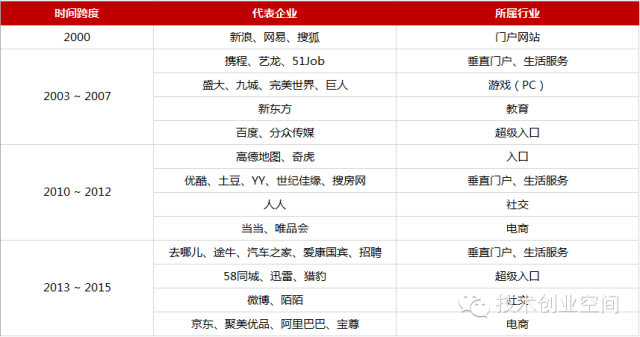
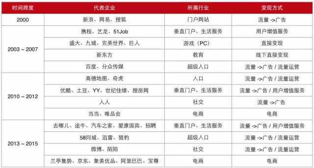

# 技术创业空间 合集

## 互联网创业的赴美上市之路（一）—— 历史回顾

在这个全民创业的时代，把企业做上市或许是每位创业者都梦寐以求的。现在，国内的创业者已经有了越来越多的上市选择，比如近期异常火爆的新三板。而在过去，能够成功登陆美国纳斯达克几乎成为了一个创业企业走向成功的重要标志。今天，我们就来帮助大家一起梳理一下过去20年间中国创业企业的赴美上市之路。

中国的创业企业，尤其是互联网创业企业的赴美上市之路随着资本市场情况的变化，产生过数波上市的浪潮，每一波浪潮的代表企业都不同，下图是笔者总结的自2000年以来，中国互联网代表企业的上市时间表，在这张时间表上，我们能够比较清晰地看到2000年以来的四波浪潮：

互联网企业的第一波上市潮，以门户为代表的三剑客（新浪、网易、搜狐）的上市为标志。在上世纪90年代末，互联网兴起的主要表现形式就是网站。那么衡量一个网站是否成功的标志是什么呢？是访问量！所以，门户网站作为综合性的内容载体，很容易成为访问聚集地，我们俗称：「入口」。也就是从这个时候起，「入口」开始成为互联网发展所围绕的最重要的概念，后面我们可以看到围绕着「入口」这个概念，衍生出各种各样的创业企业和商业模式。

抢占「入口」成为互联网发展这个阶段最重要的商业模式，而「入口」的概念也深度影响了之后互联网发展过程中的每个阶段。

互联网企业的第二波上市潮，集中于2003年到2007年之间。而在这一期间，我们可以看到上市的公司行业类型开始逐渐增多。率先登场的，是2003年底的携程，成为了国内旅游行业最大的垂直门户。之后，盛大在2004年中叶上市，陈天桥一度成为中国首富。

2004年另外2家上市的公司是艺龙和51Job，它们分别代表了旅游和招聘这2个领域的垂直门户。到此为止，「入口」这个概念在门户网站上开始往垂直领域发展，同时迸发出很多各领域的创业企业，而这些看似杂乱无章的垂直纵深，实际上是围绕着人们的日常生活服务（衣食住行）需求逐步展开的。所以，2006年新东方的上市，标志着围绕日常生活的各个领域的创业公司获得了空前的成功。

还有这期间上市的巨人、九城等游戏公司——游戏这种娱乐方式也是我们日常生活的重要组成部分之一——以其强大的变现能力，迅速成为中国互联网创业的一股重要力量。当然，有人往细分领域挖，就有人往纵深挖。百度就是典型的把访问入口做成超级入口的公司，由于搜索是人们访问互联网最大的刚需之一，百度的成功，标志着在PC端超级入口的概念已经发挥到了极致。

第二波上市潮，是把互联网带入日常生活服务的重大成功，「入口」的概念也开始往垂直和纵深这两个不同的方向发展。

互联网企业的第三波上市潮，集中于2010年到2012年之间。在这期间，我们看到垂直门户开始百花齐放，进入到更多的生活分类中：世纪佳缘是基于婚恋的，搜房是基于房地产的，优酷是视频行业的绝对老大。

与此同时，工具类「入口」横向杀出，奇虎和高德地图的上市让所有的人明白了原来互联网不仅仅是网站，对于访问量的追求变成了一场占领用户日活的游戏。

在这一波浪潮中，还涌现出了一家社交类的公司人人。人人上市的当天，股价就上涨接近40%，市值超越新浪、搜狐、盛大等前辈，而社交作为一种新型的互联网模式（区别于以入口为核心的流量变现，社交更多需要通过为用户提供增值服务来变现），当年也受到了资本的强烈追捧。而当当网的率先上市和之后唯品会的上市，则拉开了后续电商上市的序幕。

第三波上市潮，是一个承上启下的阶段。我们看到了互联网开始渗透到日常生活的每一个领域，互联网从一味追求访问量发展到追求用户的日活。与此同时，社交和电商正在以越来越快的速度向我们袭来。

互联网企业的第四波上市潮，起于2013年。我们看到的是互联网发展到了一个全新的阶段：寡头产生（百度、阿里巴巴、腾讯），并购丛生（上市公司与非上市公司，非上市公司与非上市公司频频并购）。

从行业领域看，电商在这个阶段大放异彩，不仅有垂直电商（聚美优品），也有自营电商的巨头（京东），更有超级无敌的平台型电商（阿里巴巴）。

同时，社交类的创业公司开始崭露头角，微博这个曾经异常火爆的社交产品在此期间上市，而陌陌作为第一家专营移动互联网社交的产品也成功登陆纳斯达克。

奇虎的思路，猎豹和迅雷脱颖而出，在国内互联网公司中占有一席之地。垂直生活服务领域也涌现出了一些上市公司，但更多的独角兽还没有上市就已经具备了互联网巨头的潜质。

第四波上市潮，可以说是一场资本盛宴，我们发现中国也能够涌现出十亿美金、百亿美金、甚至千亿美金的互联网公司。移动互联网的蓬勃发展也深深影响到了每一家上市公司。

以上我们回顾了过去20年间中国互联网企业的四波上市浪潮，后续我们将深入分析这些成功上市企业的商业模式，以及能够给未来创业者带来的启发。

## 互联网创业的赴美上市之路（二）—— 商业模式

大家好，我是downpour。在上周的那篇《互联网创业的赴美上市之路（一） —— 历史回顾》发布后，不少朋友问我：这都是过去的事了，和我们现在这些技术人员有什么关系呢？

其实技术人员创业，有天然的优势：技术人员靠近互联网科技的最前沿，只要有好的创意，把创意实现是技术人员最擅长的。但同时，技术人员创业也不可避免地会陷入到一些技术之外的困境：对商业模式的把握不够，对企业的管理没有经验，对市场营销这块完全不懂。

所以，作为上一篇文章的延伸，今天我们就来帮助大家一起梳理一下这些已经创业成功的公司，它们在商业模式上究竟有什么共性的地方，这些共性的地方，也一定可以为广大的技术创业者提供非常有价值的借鉴。

### 流量 / 电商 / 社交

创业，首先要选好行业。如果我们不考虑更加垂直的细分行业，所有公司最终都会落到三个领域：

+ 以流量运营为核心的公司
+ 以电商为核心的公司
+ 以社交为核心的公司

我们现在看到的中国互联网三巨头：百度、阿里巴巴、腾讯，正好也是从这三个不同的领域走出来的互联网巨头。

当然，不同的领域，做法和门槛截然不同。所以对于技术创业者来说，最重要的是：尽可能不要在创业早期尝试跨领域。如果我们回顾一下历史就会发现，腾讯做电商一定做不好，拍拍就败得很彻底，直到收购了京东才逐步有了和阿里抗衡的资本。而同样，阿里巴巴做社交也是一败涂地，来往几乎没有人去使用它。

在赴美上市的这些公司中，它们通常都选好一个领域，然后在这个领域中避开巨头的骚扰，形成一定创新，从而能够从斜刺里杀出一条血路。比如说奇虎360，最初是通过360安全卫士占领了大量的电脑桌面入口从而获得了成功。再比如说去哪儿，通过比价从而完成了对旅游入口的再次抢夺。

所以，对于创业者来说，考虑好团队的基因，并在一个领域中形成微创新，这将是迈向成功的第一步。

### 直接变现 / 流量变现 / 服务变现

任何的商业模式最终都必须有非常明确的变现方式，笔者为大家总结了一下赴美上市的公司的主要变现方式：

我们可以看到，这些变现方式中，出现最多的字眼还是「流量」。只是不同的公司对于流量的变现渠道不同而已。

传统的门户网站，包括垂直的门户网站，主要是向用户系统的输出内容，所以往往这类公司通常都是将流量通过广告进行变现。

而像百度这样的超级入口，它在经历了流量通过广告变现的第一阶段之后，逐渐延伸出各种各样的流量运营变现的方式，我们俗称「卖流量」。这种「卖流量」的效应，在PC时代显得尤为重要，因为在一个网站的早期，百度关键字几乎就是最有效的推广方式。这也就是百度成为超级入口并不断发展其它模式，而其它的网站却始终只能围绕广告变现的根本原因（比如优酷的视频广告，时间越来越长）。

在这几种变现方式中，直接变现（用户直接买单）是变现能力最强的一种方式。比如游戏就是非常典型的直接变现，所以当年的PC时代，几乎每个公司都靠卖点卡，卖游戏道具赚得盆满钵满。而这种变现的方式，在巨头介入之后变了味，在腾讯发现了它可以利用自身强大的用户体系直接通过游戏变现时，它几乎没费什么劲，就打败了绝大多数的竞争对手，把游戏直接变现做到极致。

通过用户增值服务变现，互联网发展到第二阶段（不仅仅追求访问流量，而是要追求用户粘性）的主要变现方式，而这种变现方式主要倚赖的场景是电商。比如世纪佳缘，直接满足了用户的婚恋需求，用户买单的意愿也极为强烈。这种通过用户增值服务变现的方式，逐步形成了一个词汇：粉丝经济。而粉丝经济，在移动互联网时代，逐步散发出越来越强大的生命力。

对于我们创业者来说，变现方式是一定要考虑的问题。在当前互联网环境中，往往更多考虑的是烧钱圈地，而圈来的用户和流量，究竟能不能变现，这才是最重要的课题。一味烧钱，最终创业也只有死路一条。

### 工具 / 平台 / 生态系统

近年来有一个观点十分流行：

+ 如果一个互联网产品是一个工具，那么它是一个十亿美金的生意；
+ 如果一个互联网产品是一个平台，那么它是一个百亿美金的生意；
+ 如果一个互联网产品能够打造生态系统，那么它是一个千亿美金的生意。

对于生意的规模判定可以再商榷，但我们可以顺着这个思路看清楚一个创业企业的发展道路：从工具开始，逐步做成平台，最后发展成为生态系统。

以腾讯为例，腾讯早期是一个非常典型的工具：解决大家的基本社交需求。在打造社交产品的过程中，利用其用户体系往其它的领域导入流量，从而形成了一个异常庞大的用户增值服务平台，再通过大量的资本并购，形成了一个跨众多行业的生态系统。

目前由于互联网巨头的产生，使得新型的创业企业要成为生态系统的可能性已经大大降低。记得过去很多创业者在寻求融资的过程中往往会被问到的问题是：如果你这个产品被腾讯抄了去怎么办？或许在过去，这个问题还真的有点头疼，而现在这已经不能成为一个问题了，因为腾讯根本不用抄，直接把你买了就好了。

正因为如此，对于创业者而言，就需要更加明确自己的创业项目定位，究竟是做一个工具，还是做一个平台。作为一个工具，你的目标用户市场有多大？作为一个平台，你的市场规模又有多大？如果我们仔细分析那些成功在纳斯达克上市的公司，往往目标用户是全网用户，市场规模至少是千亿美金以上的生意。所以，明确自己创业项目的定位和目标，是技术创业者提高创业成功率最重要的环节之一。

如果你的生意是一个垂直领域，市场规模也没有那么大，或许独立上市的机会并不那么大，但是做得足够好，被巨头并购的概率也很大。事实上，我们可以看到像腾讯这样的互联网巨头在做并购的时候是有着非常明确的版图逻辑的：

在微信钱包的这张九宫图中，我们看到的滴滴打车、京东、大众点评、美丽说，几乎就是各个领域的佼佼者，它们都有腾讯的入股，成为腾讯这个生态系统中细分领域的版图支撑者。

综上，我们为大家大致总结了互联网创业公司的主要的一些商业模式、变现方式和目标定位，希望对各位技术创业者有所启迪。也欢迎大家通过微信留言反馈给我们您感兴趣的创业话题，我们共同探讨

## 互联网创业的赴美上市之路（三）—— 聚焦当下

大家好，我是downpour。之前的《互联网创业赴美上市系列》中，我们分别回顾了在过去20年间最优秀的中国互联网企业的上市之路以及它们所倚赖的商业模式。

其实一个企业能够从零做起一直到上市，真的一点也不容易。尤其是互联网和移动互联网飞速发展的今天，创业方向和商业模式的选择、创业时机的选择、团队的拼劲和执行力，正所谓天时地利人和，缺一不可。

今天我们就来聚焦当下，和大家一起探讨一下当今互联网和移动互联网创业究竟有哪些新的机遇和新的方向，希望对大家捕捉到下一波「风口」有所启示。

### 规模和效率

选择互联网和移动互联网创业，不仅是因为它们是这个时代最前沿的行业，更加重要的一个原因不外乎两点：

+ 互联网和移动互联网能够产生数倍甚至数十倍于传统行业的商业规模
+ 互联网和移动互联网能够成倍地提升传统行业的生产效率

所以，规模和效率是互联网和移动互联网创业所要考虑的最核心的问题。对于我们创业者来说，一旦踏上了创业之路，首先就要问自己两个问题：第一，我这个生意是一个多大的生意？第二，我这个生意能不能提升人们的生产效率？

我们以最近两年的一个明星项目滴滴打车为例：打车的市场规模有多大？出行是人们的日常刚需，每次用车都会产生消费。作为「衣食住行」中的一个重要组成部分，「行」的需求从市场规模来看，无疑是没有天花板的，至少是一个万亿级的市场。那么，滴滴打车这款软件能不能提升效率呢？太能了！早期对于出租车司机和乘客而言，这几乎就是一个利器啊。

市场规模足够大，外加提升了生产效率。于是滴滴打车迅速发展，不到2年时间就发展成一个独角兽项目（通常我们把市值10亿美金以上的公司都称之为独角兽）。

如果你的创业项目提升了100万人的效率，那么你是一个不错的工具；如果你的创业项目提升了1000万人的效率，那么你是一个不错的平台；如果你的创业项目提升了1亿人的效率，那么你有望成为生态系统。

在滴滴打车之后，有些试图模仿滴滴打车的商业模式，打造基于LBS的品牌的项目则未必一定成功。笔者曾经看到一个项目，试图通过App利用LBS找到离你最近的快递员，从而加快用户发快递的速度。其实，发快递相对于打车而言，是一个低频的行为，不是人们日常生活中的刚需行为，这就直接导致了对市场规模的评估大打折扣。同时，现在发快递通过打电话只需要30秒，根本无需通过打开一个手机App来提升效率。事实上，发快递这事儿本身根本也不可能再通过移动互联网提升什么效率了。

所以，对于广大创业者而言，一定要对自己的创业项目有足够的前期调研和分析。市场规模和提升效率，也是很多投资机构在评估项目中最常考虑的几个指标，非常值得广大创业者认真思考。

### 移动互联网的变革

这一波的互联网浪潮，在移动互联网降临之后，焕发出了新的生命力。从提升效率的角度来说，移动设备为互联网带来的是突破时间和空间的巨大进步。所以随着智能手机的普及和上网速度越来越快，移动互联网领域的创业在2011年以后一下子爆发了。

从创业者的角度来说，移动互联网创业的第一波红利主要在两个方面：

+ 发挥移动设备特有的优势，深入各个生活服务领域
+ 将原来在PC上可以实现的东西，用移动设备实现得更好

在第一个方面，围绕着衣食住行，我们可以看到率先走出的著名项目就有：滴滴打车（行）、饿了么（食）等等，他们都迅速发展成为了独角兽。而随着时间的推移，移动互联网对于生活服务的改造开始蔓延到所有领域，比如去年到今年非常火的爱屋吉屋和房多多（住），以及各种层出不穷的电商产品如小红书等等。

第二个方面，比较典型的例子就是阿里最近疯狂推荐的「钉钉」，已经成为独角兽的「有赞商城」等等。在社交领域，微博赶上了PC时代最后的一班车，转移动的时候也较为积极，微信则成为了社交领域当之无愧的巨无霸，陌陌则成为了第一家纯移动互联网的社交工具，已在美国挂牌上市。

移动互联网的早期是一场圈地运动，创业者的主要创业路数是找到一个特定的生活服务领域，然后使用移动互联网来改造这个领域从而获得成功。

与此同时，移动互联网却悄悄地给我们带来了互联网的一项重要变革：那就是是流量入口的迁移。

我们知道，在传统的PC互联网时代，你要获取流量，最有效的途径是：通过百度购买搜索关键字进行推广，当用户搜索了某些关键字时，你的网站会呈现在百度的前几条或者单列出来作为百度推广。百度作为最大的搜索入口，靠倒卖流量成为了PC时代流量变现的王者。同样的模式也被其他很多入口级的巨头所复制。所以，PC时代的流量，只要舍得花钱，可以短期买到很大的量而不会遭遇瓶颈。

到了移动互联网时代，用户的上网行为发生了变化。之前在PC时代，我们访问网站首先都是通过浏览器，我们无需知道一个网站的域名，只需要在百度上使用中文进行搜索，就直接帮你导航到了对应的网站。可到了移动时代，浏览器的使用频率大大降低：用户要购物，打开淘宝的App；要打车，打开滴滴打车App；所以PC时代那种搜索为王的路数，在移动时代开始不管用。

此时，移动互联网的流量入口就从搜索，首先迁移到了各种App的分发平台。由于国内Android分发市场的不统一，所以那些移动互联网早期做Android分发平台的都享受到了红利期，比如我们熟悉的91手机助手，最终被百度收购（百度还是舍不得入口啊）。当然，除了分发平台，针对手机App推广也涌现出各种各样的流量分发渠道。

不过，这种流量渠道随着时间的推移，开始变得越来越弱。笔者非常钦慕的一位产品经理（网名「纯银」）最近就抱怨过这个问题：

今年以来，随着流量分发渠道本身的增长停滞，用户行为固化这个大趋势（分发能力下降），以及更多的广告主进场，僧多粥少，App推广的流量获取成本已经升到恐怖的地步。我悲观地说一句，这个变化将会摧毁互联网创业潮。什么资本的寒冬，都比不过流量分发的寒冬，最后只有流量亲爹的亲儿子得以存活。

为什么会出现这样的状况呢？因为随着时间的推移，移动互联网产生了超级App。所谓超级App，就是占用了用户95%以上使用时间的那些App。目前来看，就是微信。由于一个用户每天80%以上的时间在使用微信，导致了即使一个App被下载到了手机，这个App的使用时间也被极大压缩了。

在这种情况下，创业团队真的要认真思考一下当下的创业窘境。我们的创业方向是不是真的要通过一款App来完成？在我们把App做出来之后，如何推广？如何保证日活？甚至在创业早期，通过微信渠道完成对商业模式的试错，或许是一个比较有效的方式。

### 寡头的形成与抱团取暖

进入到2015年，最值得我们注意的几条新闻是几桩合并案例：58同城与赶集合并；滴滴与快的合并；美团与大众点评合并。每一桩合并案，背后的故事都精彩纷呈。

比如58与赶集的合并，一方面做大了市场，另一方面也满足了58作为上市公司做市值管理的需求。

而滴滴与快的的合并，则预示着出行行业巨无霸的诞生，实际上也阻断了出行领域其他创业项目的发展路径（这里可以多说几句，在合并之后，滴滴快的在原有业务的基础上，迅速在拼车、代驾等领域进行布局。所以我们看到在拼车、代驾这些领域之前走得很好的一些项目，现在的日子都不怎么好过）。

美团与大众点评的合并，也同样是行业第一与第二的合并，使得团购领域（实际上这两家也是千团大战存活下来的）和O2O领域的同业竞争消除，未来怎么走还有待市场验证。

由于互联网最近几年爆发式的增长，导致了这些公司中的绝大多数实际上是靠着烧钱野蛮增长的。在这一场补贴大战中，用户的确获得了实际的好处，而时间久了，竞争会导致企业的财务状况每况愈下。所以，我们不得不说这些并购案实际上是在抱团取暖。

这种并购，实际上并不始于2015年，而是始于BAT互联网寡头的形成。在上两篇文章中，我们曾经说过互联网寡头的形成必然会带来的是这些寡头加速布局所有互联网领域的过程。实际上，在滴滴快的合并之前，腾讯和阿里就已经分别进驻，美团和点评也是一样。正如之前的分析：互联网发展到现在，互联网巨头根本用不着抄你，直接把你买了就行！

那么，对于我们创业者来说，互联网寡头的形成，既是机遇，也是挑战。对于互联网巨头来说，只要你的创业项目在它们的互联网版图之内，它们愿意花重金来并购，所以创业项目除了独立上市之外，多了一条退出的渠道。

与此同时，创业项目的选择就尤为关键。当然，还有很多领域是互联网巨头并没有涉及，或者这些互联网巨头做得并不专业的地方。这些行业领域或许就成为了值得我们创业者去发现，去挖掘，去深耕的创业方向。

创业在互联网寡头形成之后，也有了新的退出渠道，关注巨头的发展方向，甚至关注独角兽的发展方向，对于创业者尤为关键。

## 一位技术创业者的血泪总结

编者前言：

洪亮毕业于上海交大软件学院，计算机科班出身，编程能力极其强悍，各种技术信手拈来。在移动互联网的创业大潮下，也投身创业，几年内连续做了两个创业项目：为老年人服务的家庭SNS社区「爸妈家」；为汽车爱好者开发的密室逃脱类游戏「车内逃脱」。遗憾的是这两个创业项目都失败了。

如今洪亮正在追随汽车之家的创始人李想，开启了新的创业之路，即家用电动车创业项目：「车和家」。目前「车和家」正在招聘IT系统管理员、PHP全栈工程师、Web前端工程师，以及装修工程监理，有兴趣的朋友可以考虑一下，简历投递到：「jobs@chehejia.com」

成功者的「成功学」往往不可复制，而失败的创业经验却是最宝贵的财富，洪亮的创业反思，是一个技术背景出身的创业者最容易面临的问题，对于技术创业者来说，这些经验尤为珍贵。

我们团队第一个项目是为中老年人服务的家庭SNS社区，虽然失败得一踏涂地，但我非常愿意把自己的伤疤揭开，跟大家分享当时我们的经验教训。

首先我想说的是，无论是做老人手机、老人社区、甚至是智能助听器，必须时刻记得，创业不能被热情和理想冲昏头脑，永远是一门生意。无论你做的事多伟大、多么令人感动，你是在运作一门生意，不是慈善，盈利模式是面向中老年人产品的首要问题，这个问题不解决，产品做的好就是先烈，做的不好就是炮灰。

互联网的老人领域是片蓝海，这是我们做「爸妈家」之前靠想象得出的结论。进入后我们发现，这哪是蓝海，这就是一荒漠，很多正常世界里的思维和规则都不管用了。

因为老人这个群体跟年轻人的生活习惯和使用习惯差异很大，此外老人之间的差异也很大，这是由这一辈人的历史背景决定的。我举个简单的例子，有的老人能把QQ玩的很熟、还能上摄影论坛展现自己的作品，而有的却压根不识字，你说你这产品怎么做？

所以，后来我们总结为何失败时，我们认为自己在三件大事上做的太差、甚至就没认真做，而却在诸如用户体验、产品图标等小事上反复用力，导致团队做了大量无用功，失败从一开始就注定了。如果当时我们不急于出产品，而是先把三件大事想明白，可能结果就很不一样了。这三件大事是：用户定位、客户定位、刚需。

### 用户定位（老人分为很多很多种）

我们当时觉得，这还不简单，一句话，面向中老年人，完了。后来我们才发现自己有多么傻。中老年人群体内部存在巨大差异，用户定位必须非常仔细小心地调研才能下结论，要根据各项参数，选出对自己来说群体最大、产品推广最容易的那类人才行。我随便说些参数，比如大致年龄、性别、婚姻状态、退休状态、健康状态、儿女生活状态、家庭富裕程度、文化程度、IT产品和互联网使用基础、网络依赖程度、家庭各项花销比例等。

假如你现在问我面向中老年人产品的用户定位，我不会再说40-70岁之间的中老年人这种幼稚的话。我会说，50岁以上、身体健康、已经退休或半退休、业余时间很多、儿女平时不在身边、家庭财务状况不错、乐于接受新鲜事物、日均上网时间超过1小时、乐于学习、乐于与人交流、会拼音能打字、还会在浏览器里上传图片的阿姨大妈们。你别管这么筛下来这个群体最终会有多少人，至少你得先这么筛一遍，否则你做产品的时候会处处碰壁。

一会儿你会想「这个图标的表义他们能理解吗？」，一会儿你又会去想「这个上传按钮恐怕他们不会用啊」，那你就会陷入无止境的互联网基础技术改造漩涡里，你会去想改造浏览器、改造操作系统、甚至改造键盘和鼠标。对，你会发现所有的技术都在跟你的用户作对，因为你的用户是一张白纸，什么都不会，而现在所有的技术实现对他们来说又太复杂了，年轻人想都不用想的操作可他们就是不会用，好不容易教会了他们也会忘，最后谢天谢地他们终于学会了，嗯，然后他们电脑中毒了。

对，你别笑，就是中毒了，依然打不开你的网站，你说你怎么办？所以，第一步必须先把用户定位非常精准的明确，这样不仅能让团队目标更加清晰，也能避免后续很多自己给自己使绊的地方。

### 客户定位（决定买单的人不止一类）

也就是你的收入从哪里来。卖设备、卖广告、卖空间，你爱卖啥都行，但是必须想清楚掏钱的人是谁，这也是做中老年领域最有挑战和最有技巧的地方。你是让老人自己掏钱呢，还是让子女掏钱呢？如果说前一步用户定位直接影响的是产品战略，那这一步的定位就是营销策略。

比如你做老人手机，面向儿女宣传，希望儿女买来送给父母，那就必然要走各种节日路线，就跟脑白金是一个套路，你能达到脑白金洗脑程度的60%，你这手机肯定就有销路了。

但这样一来，你的宣传就不能是技术化语言，因为所有你向儿女们宣传的功能点最终都要由儿女向父母转述：「妈，我给你换个手机吧，现在有个XX手机可好，能XXX，还能YYY，还能ZZZ」。35岁的儿女送60岁的父母东西，恐怕不会像35岁的父母送10岁小孩东西一样直接把东西买来当成礼物和惊喜，儿女买之前一般都是会征求父母意见的，你觉得上面那个问题父母会怎么作答呢？

我想无非是这么几种：

+ 我现在这手机挺好，不用给我买新的，新的我也用不惯，你留着钱多吃点好的，别老加班吃外卖，注意身体。
+ 这手机这么好？多少钱，一定很贵吧？
+ 买啥手机啊，别买，我们这开卡就送手机，我现在这个就是送的，存500话费就给，每月还返钱，不满意还能找他拿回去加点钱换个更好的，别买，不值。
+ 你啥时候买iPhone 5？你买iPhone 5了能把你那iPhone 4淘汰下来给我用不？我好跟老王下棋的时候显摆显摆，嘿嘿！
+ 好，你买吧，你买啥我就用啥……

这5种答案里，出现第5种的可能性绝对要远远小于前4种。老年人是非常不愿意改变现状的，改变对他们来说意味着重新学习、重新适应、重新开始，所以不要怪他们不愿意尝试新鲜事物，当你也活过了生命的四分之三、经历了半个多世纪工业时代的风吹雨打，你最想做的事也不大可能是在数码世界里整天折腾。

所以，客户定位决定营销策略，而营销策略是整个产品的一部分，千万不要把营销策略想象成是产品出来后怎么推广的问题，不是，它是产品的一部分，完整的、不可分割的一部分，甚至直接决定产品该是什么样。如果我非要做老人手机，我不会自己做硬件卖手机，我会专做ROM甚至iPhone改造，专门面对儿女淘汰下来的智能手机，让儿女刷了ROM后留给父母用，让父母不花一分钱就能享受智能手机带来的种种便利，父母怎能不安然接受？

### 刚需（产品功能真是人家需要的吗？）

刚需这个词无论强调几万遍都不过分，是否能抓住刚需就看之前你对用户定位的精细程度了，只要用户定位到位，抓住这类用户的刚需并不难，剩下的就是你怎么发挥IT和互联网的特长去帮助他们解决这些需求了。刚需永远是非常明显的问题，能不能发现只跟你是否足够了解用户有关，跟你的智商无关，你坐在办公室里绞尽脑汁想出来的刚需那绝对不会是刚需。

我举个不恰当的例子，我是骑自行车上下班的，冬天冻手，我必然要买手套，我可能腿也冷，要买保暖用的护膝。如果你是个开车上下班的，真皮座椅电加热，恐怕你坐办公室里是很难想出有自行车毛绒把套这个细分市场的，即便你想了很久终于一拍大腿大喊一声我想出来了这点子真是太好了我是天才啊哈哈哈，结果也是出门随便找个修自行车的铺子一看，人家已经满大街在卖了。

我们做IT和互联网的很容易被自己的热情和技术能力所感动，但你的热情和技术能力在用户需求面前很可能是微不足道的，甚至是不对路的，你能做什么一点都不重要，重要的是用户需要你做什么。我们最后为什么放弃「爸妈家」了？不是我们没能力继续把爸妈家改造好，而是我们发现，真的想为中老年用户做些事情的话，与其做数码产品或是社区网站什么的，还不如开个能把别人父母当作自己父母一样照顾的体检中心更有意义，而且还能挣不少钱。

技术创业者最悲哀的就是把自己想象出来的需求当做刚需推给用户，这也是我们之前犯的错误。

## 技术合伙人，如何保护自己的利益？

大家好，我是Carol。我最近在知乎上看到这样一个事情，一名11年研发经验的技术人加入了一家创业公司， 不到两个月的时间，遭遇了种种奇葩问题：没有正式offer，不签订劳动合同，承诺的股权也没有拿到，研发被突然叫停，整个团队被裁且不给补偿。

作为一个技术合伙人，你碰到了这样的公司这样的事情，你该怎么办? 

当事公司也做出了回应：“被“技术合伙人”销毁删除代码数据、关停服务器，撕逼反咬是一种什么样的体验？ ”

在全民创业时代，加入一家创业公司，成为一名小股东，应该怎样保护自己的利益呢？

小股东要保障自己的权益，即便有股权协议，真的还是非常困难，原因就在于小股东的身份定位是很尴尬的，其身份介于股东和打工者之间，作为股东的话语权是很低的：

小股东，特别是不足10%的小股东，如果对自身的定位没有清晰的认知，不自量力的以股东的身份要求大股东进行公司信息的完全披露，可能会引起大股东强烈的反感，他会觉得：我给你工资和股份，激励你好好干，不是让你来对我指手画脚的；

但是如果完全放弃股东应该争取的利益，安心当一个打工者，不和大股东产生冲突，对于公司方方面面的运作完全不知情，羞于启齿去了解，在信息不对称的情况下，你的利益很难得到保障，大股东侵害你的利益太容易了，通过几次复杂的公司股权架构变更，就可以掏空你的股份。

作为小股东，怎样尽量保障自己的利益，我总结下来有以下几点，仅供参考：

1、契约意识要强

当然不仅仅是股权协议了，包括所有可能涉及你利益方面的东西，都应该用法律得以保障，如果协议本身条款有问题，必须一根轴坚持下来，不要因为对方觉得你轴，你就不好意思，你就妥协。将来遇到争议，一个不起眼的条款可能就要你的命。

题外话：我为什么一直喋喋不休的说我认同上海人，认同上海文化，就是因为上海人在整个中国人群体里面，契约意识是最强的，相对让你更放心一些。你和上海人打交道，在这种事情上较真，别人会觉得很正常，不会觉得你很奇怪。

2、想尽各种办法了解公司方方面面的信息

如果你光以股东身份施压大股东给你披露公司情况，那你就太傻了。且不说大股东可能有选择披露，如果大股东想对付你，更不可能配合你披露。但是只要你在公司就职，你自然有各种各样的渠道去搜集和了解这些信息，平常就要有意识竖起耳朵打探各种消息，和那些你需要了解消息的同事（例如财务，人事）经常吃饭，外出活动，在不经意的只言片语之间，你就可以拼出公司足够的信息。而当你时刻掌握公司的最新动态，你就可以预判出来很多事情，未雨绸缪，早作打算。

3、牢牢把握自己在公司的存在感

小股东从某种意义上来说就是给大股东打工的，必须摆正自己的位置，不要以为光靠股份就可以保证自己的利益。大股东是因为看到你给公司带来的价值才觉得给你这个股份值得的，如果到了哪一天，你在公司的存在感低于你持有的股份比例的时候，大股东就会觉得你拿这么多股份亏了。人品好一点的，可能和你商量回购股份；人品差的，就会想办法掏空你的股份。

所以，你在公司的存在感决定了你的安全程度，当你掌握了公司核心部门，核心业务的时候，老板想的可能是给你更多期权激励；如果你在公司已经逐渐有被边缘化趋势的时候，你要么夺回公司核心业务控制权；要么潇洒一点，放弃鸡肋，自己早点抽身而出，在大家还没有撕破脸皮的时候好聚好散，将股份变现一部分，给自己一个交待。

4、人品真的很重要

尽管你在加入这家公司的时候，未必了解大股东的人品，但是相处一两年下来，必然是有深刻认识的，如果你这个时候发现大股东人品有瑕疵，真的及早抽身而退吧。这种事情没有例外，如果人品有瑕疵，100%你迟早被坑，早点撤，趁没有撕破脸皮，能给自己争取多少利益就争取多少利益。真撕破脸皮的时候，你根本就没有任何利益能够轻易争取到了。

5、永远给自己留一条退路

不管你将来是否打算独立创业，永远不要放弃自己独立创业的能力。当你始终拥有独立创业能力的时候，碰到以上需要抉择的时刻，你很容易就做出选择了，而不是明知道有问题，还是欺骗自己待下去，不积极主动改善自己的处境，坐看自己一步一步被人玩死。

反过来说，作为大股东，如果要避免冲突，应该注意以下几点：

1、授予小股东股份，不能是干股，小股东必须拿出现金购买股份。干股是很不好的东西，哪怕以比较低的估值，让小股东购买股份。一方面拿出自己的钱买股份，会更加珍惜创业机会；另一方面大股东心理也比较平衡，今后不容易产生小股东白拿股份的不爽感觉。

2、授予小股东股份，以vesting方式，分3-5年授予，避免一开始脑子一热给了很多，以后后悔了想收回，小股东不同意，然后丑恶的事情就开始了。

3、如果觉得小股东不称职，早点解决，别拖延，早点开诚布公谈一下，根据公司当前估值，拿现金回购，给人家一个满意的交待，大家好聚好散，今后还是好朋友。

4、做一个好人品的创业者，当你创业成功的时候，别太吝啬给曾经的兄弟们一点喝汤的机会

## 对号卡位：你是不是创业公司需要的CTO？

大家好，我是 Carol。上周五发布的《技术合伙人，如何保护自己的利益？》我们做了一个调查，想了解有多少技术创业者遇到过类似的问题。结果发现在参与投票的一百多位开发者中，70% 以上有利益受损的经历。

那么问题仅仅出在公司身上吗？其实也不尽然。我们觉得有必要做一个系列专题，帮助技术人员充分认识自己，扬长避短；能够鉴别靠谱的创业公司和项目，做好加入创业公司的准备，规避可能的风险，实现个人和公司的双赢。

今天是这个系列的第二篇分享。它也源于我在知乎上看到的一个问题：作为非技术背景的创始人，你希望找到一位什么样的 CTO？众多非技术出身的创业者和技术创业者都发表了自己对于合格 CTO 的期望和看法。

那么，作为技术合伙人，你是否很清楚地知道要如何做好 CTO 这个角色？

的：

创业者 CEO 是没有门槛的，谁都可以今天辞职，明天宣布自己创业当 CEO了，各行各业的人才都可以当 CEO，CEO 的供给是井喷的，但是 CTO 是有门槛的，只有研发岗位才能培养 CTO，而且一个合格的 CTO 成长周期非常长，CTO 的供给是非常少的。更何况，在我眼中，很多所谓的创业公司 CTO 本身也是不合格的，仅仅因为创业公司急需研发负责人，于是高薪聘请，滥竽充数而已。

那么一个真正优秀的 CTO 应该具备哪些能力或者说素质呢？我以前也帮创业公司的 CEO 写过 CTO 招聘描述，我觉得 CTO 需要具备如下五方面的素质：

一、技术视野良好，架构设计能力出色

CTO 要有良好的技术视野，不需要各种技术自己都样样精通，但是必须要所有涉猎，有所了解，对各种技术领域的发展趋势，主流非主流技术的应用场景要非常了解。知道在什么场景应用什么技术，公司业务发展到什么规模应该预先做哪些技术储备。产品架构的设计要有足够的弹性，既能够保证当前开发的高效率，又能够对未来产品架构的演进留出扩展的余地。

二、动手能力要强，学习能力出色

CTO 并不需要自己亲自动手写代码，但是如有必要，自己可以随时动手参与第一线的编码工作，CTO 不能长期远离一线工作，自废武功，纸上谈兵。否则，长此以往，会对技术的判断产生严重的失误。另外，CTO 自己也应该是一个学习能力非常出色的人，毕竟 IT 行业的技术更新换代速度非常快，如果没有快速学习能力，是没有资格做好 CTO 的。

三、管理研发团队过硬，能建立团队研发文化

CTO 不能仅仅自己是一个技术高手，CTO 的责任是负责整个公司的产品实现，所以 CTO 要善于管理研发团队，掌控好研发工作进度，能够在规划好的时间内，步步为营，好整以暇的完成公司产品的研发工作。老是 delay 项目进度，或者老是玩命加班才能完成项目进度只能说明 CTO 的管理项目能力不足。

此外 CTO 还要擅长培养研发梯队力量，建立研发团队内部具有向心力的，开放性的，交流学习型组织文化。让研发团队具备自我学习能力，自我培养能力，自我建设能力。这样的研发团队工作极度默契，战斗力极强，而且员工归属感很强，流失率很低。即使有关键岗位员工流失，只要研发梯队建设良好，也有足够的人才顶上。

能够做到这一步的 CTO，手里打造了这样一支队伍，自己就会非常轻松，好整以暇。所以天天加班的 CTO 绝对不是一个好 CTO。

四、具备良好的产品意识，以及跨部门跨背景的沟通能力

CTO 不仅要懂技术，还要对互联网产品有良好的感觉，从产品的逻辑性，可实现角度提出产品改进和完善的总体性设想。因为产品经理或者业务人员设想的产品，很可能是逻辑上不严密存在实现矛盾的，导致产品真正开发出来以后，处处都是漏洞，这就要依靠 CTO，用自己专业的能力去理解互联网产品，推演产品的实现逻辑，从总体上修正和完善产品设想。

此外 CTO 还需要极强的沟通能力，要能够和不同背景的人有良好的沟通能力，能够用对方的思维方式和话语体系来描述他不理解的专业问题。技术人员比较普遍遇到的问题是，喜欢用专业术语向外行解释专业问题，导致外行人员云里雾里，不知所云，放弃沟通的欲望。

其实凡是专业性比较强的行业都存在类似的问题，比方说你作为一个病人和医生沟通自己的病情，也容易遇到类似的问题。因此就要求 CTO 具有类似产品经理的思维能力，能够瞬间把自己变成一个小白用户，学会用小白的思维去看待问题，学会用小白能够理解的方式来告诉他，教育他。

五、敢于对 CEO 说“不”

只要不是技术出身的 CEO，必然对研发是门外汉，很可能对产品也是门外汉。一个对产品研发的门外汉 CEO 对 CTO 说，我今天拍脑袋想出来一个产品需求，你必须给我做，不准备说不！CTO 刚一脑门汗说好我拼了命去做。明天CEO 又一拍脑门，说我昨天想的不对，我今天另外改了一个产品需求，你来给我做这个。

以上这种情况罕见吗？非常常见，创业公司每天都在发生。就是我自己，这么懂研发的人，知道什么能够实现什么不能实现，仍然今天一个想法，觉得可以这样做，明天我就对自己说不，否定掉这个想法，然后冒出来另外一个想法。我身体里的 CTO 经常站出来对 CEO 说，你这个想法不靠谱，你那个想法资源不够，经常在脑子里面自我推演，然后自己否掉很多想法。

因此，CEO 不是每个想法都靠谱的，CTO 有责任站在更加专业的角度去帮助 CEO 纠正，推演，完善想法。一个不敢对 CEO 说不的 CTO，这个公司肯定要走很长很长的弯路的。当然，如果 CTO 不是公司股东合伙人，或者即使是股东合伙人，但是只有极少的股份，对 CTO 说“不”是有风险的。可能在某些CEO眼中，所谓的 CTO 就是一个下属，根本没有资格对自己说“不”。

然而我觉得，如果 CTO 自身是一个沟通能力极强的人，就不应该畏惧 CEO，应该勇敢的说“不”，应该承担自己作为 CTO 的责任。

以上就是我对一个优秀的 CTO 的定义，简单概括就是：CTO 要懂技术，有前瞻性，视野好，管理能力出色，会培养人，能够建立团队文化，沟通能力优秀，还要懂产品，最后还要有胆色，真是不容易，所以优秀的 CTO 才会缺

## 技术人如何甄别靠谱的创业公司？

大家好，我是Robbin。中国最近几年已经进入了创业的狂潮期，这种狂潮让身处互联网行业的我都感觉很惊讶。昨天西乔来拜访，谈到了国内的创业潮，特别是北京的创业潮，即便在今天资本冷却的寒冬期，其狂热程度也远超硅谷。

我曾经想，应该给创业潮泼点冷水才对，然而有一次和朋友聊天，才意识到「创业潮」是中国当下时代背景造就的，这就像上世纪九十年代的「出国潮」、「下海潮」一样。为什么现在全民创业，为什么人人踊跃想去创业？绝对不仅仅因为政府的宣传和鼓励，深层次的原因在于：

在当今中国社会阶级逐级固化、贫富严重分化的情况下，对年轻人来说，「创业」是为数不多的能够改变自己命运的机会。

「创业」就像是古代的「科举」一步登天、改变命运的机会。所以我想，与其劝说别人不去创业，不如多分享一些创业的经验和教训，反而能够给想要创业和正在创业的朋友帮助更大。

很多技术人员，想要加入一家有前途的创业公司，成为联合创始人CTO，或者成为技术骨干，遇到的第一个头疼的问题就是：到底这家创业公司靠谱不靠谱？ 我会不会一脚踩进火坑，误入歧途。

能不能找到一家有前途的创业公司，这件事情有很大的运气成分。我有一位朋友，很早就是技术牛人，在阿里巴巴十八罗汉还在湖畔花园创业的时候，他哥哥是阿里的电脑供应商，因此结识了阿里，阿里邀请他加入创业，但是他没去，他选择出国，去了美国雅虎。如今我们笑称，他错过了成为阿里巴巴十八罗汉的机会。

当然这种情况比较罕见，更多的情况是技术牛人抱着成为下一个阿里巴巴十八罗汉的梦想一脚踩进坑里的。那么我们是不是只能靠天吃饭碰运气了？有前途的创业公司要碰上需要好的运气，但是我们也可以尽量避开一些有明显问题的创业公司。

### 看行业

在创业竞争如此激烈的今天，选择往往比努力更重要 选错了行业是非常致命的，可能你非常努力，但是项目就是举步维艰。什么样的行业不好呢？

已经高度竞争同质化的领域，例如O2O，在线旅游行业，交通出行领域。

我一位朋友的创业公司做拼车创业项目，已经拿到了B轮融资，本来发展势头不错。但是滴滴和快滴一通血拼，跟着合并，整个行业竞争格局已定，只能被迫调整创业方向。不是你不努力，实在是竞争太激烈。

过于细分的垂直领域，未来的成长空间非常有限。例如极客帮天使投资的蒋涛就现身说法，建议创业者不要做开发者的社区。

总之，如果选择创业公司，最好选择市场空间非常广阔，未来成长潜力大，同时行业竞争激烈程度没有达到白热化的方向。例如互联网金融、文化产业、医疗行业、SAAS企业服务市场等等。

### 看创始人

一家创业公司最终能够取得的成就，完全取决于创始人自身能够达到的上限。创始人决定了公司的未来、决定了公司的企业文化。判断创业公司是否靠谱，本质上就是看创始人是否靠谱。

如果你和创始人不熟悉，也没有接触过，最好的办法就是用互联网搜集创始人的信息，搜集各个信息渠道对创始人的评价。你还应该自己翻阅创始人自己发表过的所有网络言论：新浪微博、博客、微信朋友圈等等信息。综合起来你就会对创始人有一个基本的判断。

也有创始人就是不喜欢写东西，或者喜欢隐藏自己，从不对外发表看法的。这种情况只能面对面交流去感知。

我觉得一个好的创始人应该同时具备三种品质：

+ 正直：正直的人值得你合作和追随
+ 坦诚：也就是不装逼。坦诚的人才能和你长期合作下去，即使出现矛盾也能够即使解决
+ 无畏：碰到任何困难不退缩，为了达到目的能够想尽办法去解决，无畏的人才能带领公司扫除障碍走向成功

### 看核心团队

创业公司失败，有超过80%的原因是创始核心团队内讧造成的，因此创业核心团队的稳定对于公司长期的保持成功非常关键，这一点我对美团印象异常深刻。

前不久去美团参观，发现美团的创业核心团队到现在都没有人离开，都在公司奋斗。美团前几年空降了一个高管COO阿甘，据说和核心团队产生了激烈的磨合冲突，即便在这种情况下仍然保持团结一致，非常难得。

如果你作为一个CTO进入创业公司，可能会被授予少量的股权。这个时候要注意看公司的股权结构，如果公司的股权结构不合理，一定会埋下核心团队内讧的导火索，迟早有一天会爆发。当然，一些好的投资人也会帮助创业公司调整股权结构，消除不利因素。（股权结构怎样算合理，怎样算不合理，「技术创业空间」将来会专门撰文科普）

### 看气味是否相投

如果一家创业公司选择的行业赛道不错，创始人靠谱，核心团队稳定结构合理，往往是个好公司，然而并不是一家好的创业公司一定适合你，要看气味是否相投。

什么叫做「气味相投」，就是公司创始人和核心团队做事情的方式，是不是你愿意接受和习惯的方式，能不能比较和谐的共事，在对事情的判断和价值观方面，能否保持比较高的相互认同度：

+ 比方说，创始人是个喜欢刷单的人，可你不能接受数据造假；
+ 比方说，创始人习惯严格的官僚上下层级管理，可你喜欢扁平式管理；
+ 比方说，创始人想要严格刻板的公司规章制度，可你希望营造轻松自由的氛围。

有些牛人去互联网公司，因为「气味不投」闹得不愉快也是比比皆是，在新浪微博和知乎双方发生撕逼大战的也不鲜见，这里就不一一举例了。

### 看个人价值是否能够发挥

如果公司和你气味也相投，最后你要关注的问题就是个人价值能够发挥出来。有时候公司是好，你也很喜欢公司，可是你待了一段时间以后发现：你英雄无用武之地。可能是你的特长并不是公司需要；也可能公司的组织架构限制了你的发挥，也可能是某些其它原因。

如果个人价值无法发挥出来给公司创造价值，从长远来说，也不太可能和公司长期走下去。

如果你能找到一家创业公司符合以上所有的方面，那么我会鼓励你勇敢投入创业吧。

### 看融资阶段

有的观点认为：选择创业公司应该挑选拿到B轮的创业公司。理由是拿到B轮的公司通常已经从数据上验证了自己的商业模式，不太可能死掉了，会比较安全。

这种观点有一定的合理性，如果你拖家带口，有比较大的经济压力，必须在兼顾收入和创业理想之间平衡的话。你也可以考虑一下创业公司的融资阶段，专门挑选已经拿到B轮或者C轮的创业公司加入。

但是我想强调的是：并不是所有拿了B轮C轮的创业公司真的都是安全的。特别是在融资泡沫期运气好，拿了巨额融资的公司，很可能业务就是一塌糊涂的，根本没有前途可言。

因此只有当你按照我上面建议的方式选择了真正好的，并且适合自己的创业公司之后，才应该去考虑融资阶段的问题。特别是如果你没有经济压力，希望获得最大程度的创业收益，加入早期创业公司未尝不是一个好的选择。

## 大龄程序员怎样渡过中年危机？

在我还是25岁的时候，我和很多程序员一样，其实有同样的担心，老了以后怎么办？写代码难道还能写到30岁？

当我30岁的时候，我发现自己创业去了，虽然非常苦逼，但是苦中作乐，还挺有挑战的。当然创业是没有退路的，创业要是失败了，估计更加没人要了。所以还是先想创业的事吧，35岁的大龄程序员问题还是5年以后再说。

一晃我就35岁了，创业公司卖给CSDN了，我在CSDN当CTO了。话说这个CTO其实也很苦逼，操心的事太多，每天各种杂事，压根没空想中年危机的话题。

然后我马上就40岁了，不算有钱，但养活自己完全没问题，想着趁自己还能蹦跶几年，再做点什么吧，就到丁香园了。

现在回想25岁的时候，当初的担忧真的是杞人忧天了。我现在写代码也完全没问题，偶尔也会写点代码练练手，自娱自乐一下。但是从2010年我34岁开始，工作上我已经不适合写代码了。不是我不愿意亲自写代码，我反而觉得写代码很有成就感，而是我不写代码对公司的价值更大，我需要把时间和精力放在规划产品方向、决策技术架构、培养团队，提升公司战斗力上。

### 那些70后的程序员都消失了吗？

如果你现在去一家互联网公司看看，你会发现程序员的主力都是90后了，80后都很少，至于70后几乎绝迹。那么一个有趣的话题是：「70后的程序员都消失了吗？」

其实没有消失，而是70后的程序员已经成为各个互联网公司，各个IT公司的高层了。那么你会问：「一个公司就几个高层职位，哪有那么多职位给70后呢？」

答案是：「20年前根本就没有多少IT公司，70后的程序员也没有现在动辄几百万的规模」。这20年来，整个IT和互联网行业扩大了100倍都不止，创造了海量的就业机会，无论是高层还是一线岗位。

那么还有70后程序员奋战在coding第一线的吗？当然有！比我还大一岁的高春辉，中国互联网的活化石啊。老高身为一家公司的老板，仍然不肯放下coding的乐趣，至今坚持亲自写代码。

所以看起来，到了40岁，无论自己写不写代码，似乎都不至于年老色衰，程序员这个职业的保鲜期似乎没有娱乐圈短。作为一个年轻程序员的你来说，应该怎样延长自己的保鲜期呢？

### 20-27岁：技术积累阶段

假设本科22岁毕业，那么工作的前5年对你来说是打基础的阶段。在这5年时间里面，你要积累足够的代码量，打磨自己的技术实力，成为某一个技术细分领域的牛人。

而我自己当年在这个阶段的努力程度是如饥似渴的，春节都不回家，蹲在出租房里面啃技术文档。刚参加工作的时候，曾经连续一个月在公司打地铺睡觉。

### 28-35岁：形成思维方法论和知识体系的阶段

当你积累足够的代码量，例如超过10万行代码以后，你应该形成了自己的思维方法论和自己独立的学习技巧，任何新的技术在你眼中都能迅速的看到技术的本质，快速吸收成为你的知识体系的一部分。

到了这个阶段，你会发现你所完全不了解的新技术新知识是非常少的，新技术对你来说也不过是几天时间就把玩的很好的玩具，学习越来越轻松，掌握的知识储备越来越多。

你开始逐渐的不再满足于纯技术领域的探索，而是思考更多的问题：如何将技术转化为生产力；什么技术在什么样的场合能够发挥最大的价值；技术团队应该怎样构建；在一家公司里面，我怎样才能将自己的技术能力最大化的发挥出来？

在这个阶段，积累技术对你来说简直是小菜一碟，你更需要磨练的是思考能力，形成自己的思维方法和知识体系，这将是你帮助你一生的武器。

### 35岁以后：了解自己，把自己变现的阶段

毋须讳言的是，35岁以后你的一线coding能力一定是下降的，你写代码绝对不如25岁的程序员快，效率高。但是这不重要，因为编程只是你整个武器库当中相对最不重要的了，你的经验，你的视野，你的架构能力，你的管理能力，你分析和解决问题的能力已经远远不局限于技术这个领域。

30-35岁这个阶段，最关键的是了解自己。知道自己擅长什么，自己的优势在哪里，怎样才能够最大化自己的价值，同时也知道自己有什么缺陷，怎样避开做自己不擅长的事情，不勉强自己，不让自己处于对自己不利的环境，这是人生的智慧。

一个人能够客观的认识自己是非常困难的，很多人终其一生都没有活明白，既不知道怎样发挥自己的天赋，也拒绝承认自己的缺陷。在35岁以后，要接受一个不完美的自己，知道怎样扬长避短，最大化个人价值。能够做到这一步的程序员，人到中年完全不是程序员生涯的终结，反而会走向个人事业的巅峰。

### 一些后话

在这篇文章当中，我没有提到很多具体的技术人员选择发展道路的问题，例如：

+ 成长为核心业务的核心骨干
+ 成长为技术管理层
+ 转型业务专家，转型做业务咨询顾问
+ 转型产品经理，产品总监，走产品线

这些都可以，都是一些具体的职业发展道路的选择问题。然而无论选择，只要你始终保持开放的学习心态，不断积累知识和经验，构建个人的知识体系，磨练自己的思考能力，并且时常自省，中年对你来说完全不是危机，而是巅峰。

## 初创团队股权分配那点事儿

### 创始人

通常一个初创团队都会有几个联合创始人，联合创始人往往都会参与到公司的日常运作中。其中有一个人对整个公司负责，是公司的CEO，负责技术的是CTO，负责市场和运营的是COO。由于初创的时候并没有其他合伙人或者投资人的介入，公司的股权就是由这些联合创始人持有。在这个时候，我们必须要记住一点：最差的股权结构是联合创始人均分股权，最好的股权结构是CEO能够占到80%甚至以上的股权。

虽然大家都是联合创始人，但每个人对企业的贡献是不可能完全一样的，如果股权均分，就意味着CEO和其他合伙人承担了同等的职责，这样一旦在公司的重大决策上联合创始人产生分歧，就会造成大家都说服不了对方的状况，公司陷入僵局。大家一起创业，早期可能更多是一种情怀，但更多还包括了对经济利益的追求。如果项目没做成，股权的价值还体现不出来，但如果项目越走越好，每个创业者的心态必然会发生变化，这时候，CEO说了不算的公司就会暴露出各种各样的不确定因素。

那么，CEO如何处理联合创始人在整个项目的过程中贡献很大，但股权比例较少的情况呢？通常的建议都是在早期，CEO和其他联合创始人约定一些带条件的股权代持方案或者股权激励的机制。如果联合创始人确实能和公司走到最后，并做出了重大贡献，那么CEO可以兑现他所代持的那部分股权利益。

同样的，如果一个团队在早期股权结构就不合理，已经采用了均分模式，到了后期发展遇到了股权上的纠葛，又该如何处理呢？通常在这种情况下，都会建议CEO对其他的股东进行一定的股份内部回购，重新保证CEO的控股地位（回购的方案有很多，这个通常要进行一定的设计）。我们所熟知的餐饮品牌「海底捞」，就完成了最初从4个人（2对夫妻），到2个人（太太退出），再到最后其中一位股东转让18%的股权给CEO的过程。

### 合伙人

除了联合创始人之外，由于公司的不断发展，公司会引进新的人才。这些人才在公司发展的不同阶段都会对公司产生重大的贡献。但由于股权的设定通常都比较早期，甚至在公司发展的过程中，已经引入了几轮的投资人。那么对于这些合伙人级别的人才，如何进行股权激励呢？

通常的方案都是充分使用好期权池。期权池是将部分股份提前留出，用于激励员工（包括创始人自己、高管、骨干、普通员工），期权与股权不同，股权代表所有权，期权代表的则是在特定的时间、以特定的价格购买特定所有权的权利，它可被视作是员工与公司之间关于股权买卖的一份合同。

如果公司早期团队的构成较弱，建议在公司引入天使投资人之前就设定好期权池，通常比例在10%到15%之间（硅谷的惯例是预留公司全部股份的10%-20%作为期权池）。如果公司早期团队就比较强，那么可以适当降低期权池所占的比例。

在引进新的投资人（投资机构）时，投资人或者投资机构一般会要求期权池在它进入前就设立完毕，并达到一定比例。由于每轮融资，所有股东都会同比稀释，所以期权池的比例也会随着融资而减少，因此一般在每一轮融资时会对期权池进行调整（通常都是扩大），以不断吸引新的人才的加入。

董事会在期权池规定的限额内决定给哪些员工发放以及发放多少期权，并决定行权价格。通常对公司发展越重要、贡献越大的人分配数额越多；与之对应的是行权价格，越早加入公司，行权价格越低。

也就是说，一般后续加入创业团队的（非创始团队）人才，都不会直接授予股权，而是采用期权的方式来激励。

### 贵人

在创业的过程中，我们往往会碰到一些「贵人」。这些「贵人」能够给公司带来的通常是某个发展阶段最重要的资源。比如说，某资深律师，他在为公司服务的过程中，对公司业务发展起到了很大的作用，当他提出想占有一定的股权，该如何处理？再比如，某个老板，他手握了大量的线下资源，拥有大量的用户，可大大加快公司业务发展的速度，也提出想入点股，是否应该让他进来呢？

我们认为，这里面创始团队的管理层应该牢牢把握住三个非常基本的原则：

第一，无论一个人对公司的贡献有多少，对于兼职人员，一定不能授予股权。尽可能使用现金兑付的方式来匹配他的贡献。

第二，如果实在需要一个人在公司占有一定比例的股份，那么尽可能要对方按照公司一定的内部估值进行现金购买。

第三，绝对不要寄希望于对某些人授予小比例的股权进驻的权利，就指望他能够对公司的发展产生巨大的帮助。所以，这种「贵人」入股的方式，在万不得已的时候不要同意。

上述的这三个原则，说到底的核心目的是为了使得股权结构趋于简单化，不仅仅是股东的人数要尽量少（创始人千万不能一高兴就随便把股权放出去了，所谓请神容易送神难，人越多未来产生纠纷的概率就越大），更加不能使用股权去进行任何利益的兑付。

笔者就接触过一个项目，在项目的早期就引入了全国最强的一个线下业务的公司作为股东，希望借助他的力量来加速公司业务的发展。可是给到这个公司的股权比例过大，而这个股东在之后的公司发展过程中也并没有起到决定性作用，反而由于股权比例的问题导致了这个项目在后续的融资上碰到了很大的阻碍。

### 投资人

现在的互联网项目，绝大多数都会试图引入投资人（投资机构）来发展壮大。通常投资人或者投资机构看好一个创业项目，才愿意使用现金来兑换一定比例的股权。那么创业公司在引入投资人的时候应该注意什么呢？

首先，了解自己的投资人。最好能够比较清楚自己的投资人过去的投资案例，在哪些领域进行过布局，对于项目和公司未来发展的诉求是什么。

其次，在有多家投资机构共同看好的时候，尽可能选择名气和基金规模较大的投资机构。因为项目要继续发展下去，可能引入的机构投资者不止一家，而创投圈本来就很小，站在投资机构的角度，如果我要投一个项目，通常都要和这个项目上一轮的投资人打交道。而这个时候，熟人总比生人好。

另外，CEO需要合理考量每一轮引入投资人时，自己的股权稀释比例。如果过度追求融资额而不考虑股权比例，最终会导致管理层失去对公司的控制。在这个方面，京东就是比较好的典范，京东经过了多轮的融资，甚至到了上市的时候，CEO刘强东还保持了很大一部分的股权。而这方面的反面教材是拉手网，拉手网在C轮融资时，所有投资机构的股权比例相加已经超过管理层。最终管理层被赶出局，在团购大战中落败也是情理之中。

### 总结

综合上面所说的，我们大约可以总结出几条初创团队股权设置的原则：

1）团队CEO必须在长时间内保持对股权的绝对优势

2）在早期就设置好期权池，尽可能使用期权池来完成对后进重要角色的激励

3）整个团队的股东数量尽可能保持少数

4）谨慎选择投资人，并对每一轮的股权稀释比例进行一定的规划

## 你为什么想创业？

我从1994年上大学，一直到2006年创业之前，一直过的很迷茫。

在大学时代我总带着点优越感，觉得自己志存高远，不大瞧得起身边的同学，尤其是那些貌似不务正业的同学，从来没想过要融入同学当中，但是又不知道自己的志向是什么，也不清楚自己究竟喜欢干什么，适合干什么，完全没有方向感。我后来特别羡慕的一类人是年纪轻轻从大学时代就已经非常清楚自己今后该干什么，目标异常清晰，方向感超强，一毕业就开始了自己的事业。

到大学毕业前我仍然不知道自己将来究竟想干什么，看到别人都想留学考托福GRE，于是也跟着彻夜排队报考托福GRE；听人说搞金融有前途总行研究生院牛逼，也狠狠啃过许多西方经济学教材；看同学报考北大也跟着考了一次。但每件事情都没有坚持下来，要么主动放弃，要么彻底失败。我准备考研的时候也曾非常投入的备考，但有一天突然就失去了考研的兴趣。总之，在面临择业和未来发展道路的问题上，一贯有点自命不凡的我遇到了前所未有的尴尬和挫折。

一天我无意中看到一篇关于网景公司的报道，介绍了网景的发家史：SGI创始人之一吉姆克拉克看到了Mosaic浏览器的潜力，于是找到编写Mosaic的主要作者伊利诺伊大学的研究生马克安德森，两人创办了网景，开发了第一代流行的商用浏览器软件Navigator。公司成立16个月后成功上市，市值达到了30亿美元，24岁的马克安德森成了亿万富翁，并且亲手开启了伟大的互联网时代。

这个传奇般的故事彻底唬住了我当时幼稚的心，再梦幻的人生也不过如此了：年纪轻轻成了亿万富翁，改变了整个世界。当时正是第一次互联网泡沫时期，传奇的故事每天都在上演，我不由得神往这个充满奇迹的行业。我明白进入IT行业要从程序员开始做起，尽管我不是计算机专业毕业，大学时候的主要时间还放在啃经济学教材上，但仍然凭着一点点计算机基础和自学精神开始了程序员生涯。

那几年可能是我平生最刻苦但也乐在其中的阶段：曾经连续两三周在公司地板打地铺过夜；曾经大年三十晚上还在钻研技术；曾经很穷但是嚷着砸锅卖血也要装宽带上网。因为公司小，样样都得自己来，我身兼了前端PHP，后端Java，Oracle DBA和Linux系统运维全部技术工种，水平进步很快。我很庆幸自己误打误撞选择了互联网行业做技术，因为我发现自己发自内心深处的喜爱技术和互联网，喜爱充满了挑战的工作，喜爱在没有太多人为约束的情况下尽情的挖掘自身的潜力和创造力，更喜爱在高手如云的互联网行业激发自己的好胜心。

这个故事最后并不是喜剧收场。因为互联网泡沫破灭，公司经营每况愈下，投资方渐渐接管公司，各种龌龊事情横生，普通员工的很多利益没有保障，我最终身心俱疲的选择了离开。那个时候我怀着对互联网公司的失望，一门心思投奔了外企，并且拿到了非常满意的待遇，但这却是我职业生涯的噩梦。

我是国有大型企业的职工子弟出身，从小耳濡目染了官僚主义的各种龌龊，在那个环境下厂长随便一句话可以决定一个职工的一生。所以我从来都对国有企业深恶痛绝，极其反感官僚主义，厌恶和鄙视拉帮结派，投机钻营和溜须拍马的人，向往氛围自由和能够尽情发挥个人才能的工作环境。

但是当我到外企后发现这个环境并不适合我：就像小说《杜拉拉升职记》一样的公司氛围，每个人如同螺丝钉一般精确的完成自己的工作，不能越雷池一步；私底下团队之间暗自较劲打小报告，台面上彼此亲密无间；公司等级制度森严，总监清一色外籍人士。我不喜欢这种刻意营造出来的有点虚伪的企业文化；不喜欢每天没干出点什么成绩，却邮件来邮件去互相吹嘘得天花乱坠；更不喜欢这种严丝合缝，完全被桎梏起来工作方式，感觉自己有力无处使，完全被废掉了；职业天花板是清晰可见的，我直接汇报的老板已经是总监级的香港人了。

我仿佛一下看到了自己今后几十年以至退休的样子，这种混吃等死的感觉太可怕了。我希望未来有无限的憧憬和可能性，充满不确定性的未来才是我最希望追求的生活方式，才有可能通过自己的努力去改变未来，创造自己的人生。我开始明白自己想过什么样的人生了，那就是不断开拓进取，永远挑战自己，无拘无束充满自由的创造未来。

我离开外企以后恰逢SARS爆发，休息了比较长的时间，期间做了几个项目，边做项目边总结个人的经验，开始混技术社区，为了宣传开源创办了JavaEye论坛。虽然我已经明白了自己真正的梦想是互联网创业，梦寐以求的是像马克安德森那样创业上市改变世界，但很清楚自己几斤几两，也很清楚靠JavaEye这个论坛创业想象空间太小，所以我给自己的定位是“抱大腿创业”，寻找有背景有实力的创业团队加盟，成为参与创业者。在随后的两年多时间里，我仍然在互联网公司工作，但已经心向创业，而且在2005年注册了自己的公司。

但遗憾的是我从来没有抱上过够粗的大腿，2003年底和2006年初我短暂的参与了两次失败的创业，在2006年第二次参与创业失败以后处境变得非常尴尬，站在了人生的十字路口上：我已经30岁买房结婚还房贷了，到了必须向社会现实、向一个普通的人生妥协的时候了， 最理智的选择就是去一家大型互联网公司做一个资深的架构师拿高薪养老，更何况零起步的草根创业对已经30岁的我来说显得风险太高，创业成本太大。

我当时心里非常纠结，退一步凭借自己的技术能力和社区声望谋求在大型互联网公司做一个资深架构师易如反掌，但我不甘心这辈子只能这样渡过，不甘心放弃自己心中的理想，也非常明白自己并不适合在大公司里面做循规蹈矩的事情，所以这个看似不错的选择对我来说从来都不是一个特别值得考虑的退路。最后我决定无论如何都要自己创业一次，否则只怕自己会终生遗憾。

在2006年正式创业的时候，我总结了自己12年的迷茫期，认为自己磕磕绊绊这么多年在于在性格上存在三大缺陷：一、优柔寡断，我很早就看好互联网创业，却犹犹豫豫很多年，没有坚决果断的抛掉一切去创业；二、缺乏坚持，摇摆不定，我虽然一心想创业却在不同的职业发展道路上来回摇摆，没能坚持一件事情做到底；三、不够勤奋，我从小成绩优秀，学习从不费力，缺乏需要非常勤奋投入才能做成事情的锻炼，没有养成勤奋的习惯，到了社会上才发现要取得成功无不需要加倍的努力才行。简单的说，就是我欠缺的是：勤奋、果断和坚持。

从2006年8月开始创业到2010年5月正式完成被并购，在将近4年的草根创业过程中我吃了无数的苦，承受了无数的压力，遭遇了无数的挫折和打击，经历了无数的喜剧和悲剧，但是我这次没有想过自己创业会失败，而是坚信自己能够成功。因为我明白自己之所以迷茫很多年，之所以达不到自己心目中成功的标准，就在于没有坚持做好一件事情，如果放弃创业，就等于放弃人生，终将一事无成，我必须证明自己是一个可以把事情做成的人；更何况创业虽然艰苦，但这是自己真心喜欢过的生活，我非常享受不断挑战自己，面临并且克服一个又一个困难的过程。

将近四年的创业经历带给我最大的收获不是物质财富，而是彻底改造了自己的性格，让自己脱胎换骨。创业是长期在极限状态下坚持工作，性格的缺陷会被无限的放大，极小的失误都可能导致创业失败。这迫使你必须用冷酷的态度来深刻解剖自己，认识自己的优势和缺陷是什么，有针对性的改变自己。这是一个痛苦的过程，但是你不这样做就被判了死刑，为了公司的生存和给自己和员工发工资，必须强迫自己改变。

我渐渐发现，年龄越大，自我修炼越重要。乔布斯也说过：“在人生的头30年里，你养成习惯；30岁后，习惯塑造你”。30岁之前不容易看出来性格缺陷带来的问题，但是到30岁以后，凡不能成事的人，我稍有接触，都可以从其性格找到明显的原因。所以深刻的认识自己的缺点，持之以恒的改正和提高自己，人生的路才能越走越宽。我创业这几年，有针对性的改变了自己性格上的三大缺陷：做事不再优柔寡断，而是雷厉风行；不再摇摆不定，而是一旦选定方向就能够坚持到底，绝不动摇绝不妥协；学会了胸怀理想，但是脚踏实地，当年曾经一起创业的伙伴对我的评价也是绝对的敬业和勤奋。

## 互联网创业，技术可以外包吗？

目前这种全行业缺CTO的情况，主要是由于近两年全民创业的火爆，创业项目实在太多，供求关系严重失衡造成的。之前robbin曾经评论过：创业这件事儿，CEO是没有门槛的，可CTO不行。一个合格的CTO的成长周期非常长，并且就算一个技术人员的技术资历和经验足够，他还得具备很多软素质。这些素质robbin曾经专门撰文阐述（感兴趣的同学可以回复公众号 006 获取robbin的文章：《 对号卡位：你是不是创业公司需要的CTO？》）。

可是现在创业的实际情况是发展速度太快了，一个好的商业模式或者一个在风口上的项目，基本上一年左右就发展成估值几个亿的项目，两年左右就有成为独角兽的可能。如果一个创业项目早期在技术环节被卡住，就会严重影响它的发展速度。

这也就是很多创业团队在早期选择技术外包的原因。技术外包在一定程度上可以通过花钱「堆人」的方式来保证项目的推进速度。简单来说，要完成一个项目，10个人要花3个月时间，那么我就找20个人，虽说没办法把时间缩短一半，但减少1个月还是有希望的。

项目的推进速度保证了，至少有两大好处：第一，用比较低的成本来试错，观察创业方向；第二，有了demo就可以大大加快融资的速度。所以从这两个角度来说，选择外包方式是有一定道理的。滴滴打车就是很好的例子，它的第一个版本就是一个外包团队的作品。虽然bug多多，但至少能够帮助创始人跑通demo，顺利融到了资金。

不过，相信有很多人看到今天我这个标题都会嗤之以鼻：一个互联网的初创企业，如果技术都不掌握在自己的手里，长期的发展怎么办？这当然不仅仅是很多CEO的担心，也是很多投资机构的担心。甚至有很多投资机构非常看重一个初创团队的完整性，如果一个团队连找CTO的本事都没有，那么这个团队未来能够走多远也会打上一个巨大的问号。

其实在笔者看来，随着时代的不断发展，在创业早期，如果项目本身并非技术驱动，甚至可以完全不需要CTO。这里主要考虑了几大理由：

第一，随着时代的进步，基于互联网的很多商业模式已经被成功的产品化。各种云厂商在基础构建上已经做得非常完善（例如，云存储方面有七牛、服务商方面有阿里云、UCloud等），各种工具和服务提供商满大街都是（例如，短信服务的云片网、用于统计的TalkingData和友盟等），各种基本的商业模式已经形成了很成熟的产品系列（比如，微信上的电商既可以选择微店，也可以用有赞商城，功能非常齐全）。所以，在创业项目的早期，可以完全倚赖这些产品来渡过项目的「试错」阶段和demo阶段，并且成本极低。

第二，就算你的创业项目无法使用现有的产品构建，必须自主定制开发。在项目的早期阶段选择外包团队，也能够极大降低创业成本。毕竟目前一个全职的开发人员，已经被市场炒得贼贵贼贵的。现在要招到一个靠谱的程序员，不仅仅要花大价钱，还得求爷爷告奶奶希望他不要被其他更大的互联网公司挖走。而一旦一个技术人员全职加入，他的成本就是你每个月的固定开支，以一个小型团队正常六到八人的规模，项目的早期资金有一大半会花在技术团队上。

第三，一个团队早期应该把更多的精力放在拓展业务上。笔者曾经见过很多的创业项目，在项目的最初始阶段就开始关心什么并发量，系统撑不撑得住的问题。以笔者十多年的技术经历，这些问题对于现在的创业项目来说，基本上都是伪问题，早期根本不会发生这样的瓶颈。

当然，上述理由成立的前提条件，是初创团队必须认清项目的本质。也就是说，必须准确判断你的创业项目究竟是不是「技术驱动型」的项目。那么，什么是技术驱动型的项目呢？笔者总结了下列三种情况：

+ 创业项目本身属于技术领域创业
+ 创业项目的业务模型需要高度定制化，无法通过现有产品的构建来完成
+ 创业项目虽然可以通过已有产品构建，但后期需要大量的技术维护成本

这三种情况，笔者认为都不能将技术外包。比如第一种情况，失去了技术支持，创业项目本身就不成立了。第二种情况和第三种情况比较类似，如果早期选择外包，虽然保证了速度，但是质量一定会大打折扣，那么就算后续你想再自己招一个技术团队来接手，恐怕也只能推倒重来，或者维护成本极高。

笔者目前也正带着一个不大的技术团队，专门帮助一些早期的创业项目做技术孵化。所以上面的一些观点，也是最近这2年实践下来的一些思考，希望对广大创业者有所帮助。

## 打工一定不如自己创业吗？

在2002-2003年的时候，就有朋友问我要不要去阿里巴巴。我一听阿里巴巴，就说：「什么？就是那个疯狂加班、工资很低、口碑极差、整天到处忽悠做外贸的、十分不靠谱的网站？不感兴趣。」

话说又到了2007年，阿里巴巴接受雅虎10亿美元入股名声大噪之后，举办第一届网侠大会，我作为演讲人主讲了两个Topic，一个是关于Java架构，一个是Ruby的REST的主题。这届网侠大会上见到了老朋友，当时还在Red Hat的Ben Wang，以及还在北京创业的章文嵩博士。

会议期间见到了几个在阿里工作的前同事，问我对阿里是否感兴趣。我当时正在自己创业，一口回绝。网侠大会过后不久，我发现Ben Wang去了阿里，花名菲青，一开始负责淘宝开放平台，后来历任淘宝技术副总裁，阿里云总裁，菜鸟网络CTO；而章文嵩大家都知道，淘宝正明，现在阿里云CTO。

假如我在2002年就去了阿里巴巴，甚至2007年去了阿里巴巴，今天会怎么样？很大的可能性是赚够了钱退休了，个人财富至少是现在的很多很多倍。

又话说今年，也就是2015年我在丁香园担任技术副总裁，但是早在2008年我就和丁香园的创始人李天天和CEO张进认识了。2008年的时候，我仍然在自己创业，丁香园当时技术过于薄弱，天天带着技术人员来上海请教我，后来我还去过杭州给技术人员上课。

但在2008年天天和张进邀请我加盟丁香园的时候，我一口回绝了，我自己还在创业呢，无意加盟其他创业团队。不过7年以后，我自己的公司卖掉之后，想着自己还打算做点什么，兜兜转转又加盟丁香园了。只不过此时天天和张进的个人财富我只能仰视了。

以上是我真实的人生经历，我选择了一条相对更难，赚钱更少的人生道路。如果回到十几年前，我会怎么做？我想，因为我个人的性格原因，仍然可能选择自己干，但是个人也确实反思过一个问题：

打工一定不如自己创业吗？打工某种意义上来说，是不是也是「创业」？

自己独立创业现在很受推崇，也确实有些牛人，看准了良好的机遇，快速实现了自己的人生理想，同时也发家致富了。但是独立创业是一条更难走的路：你需要付出比别人艰苦得多的努力，扛住极大的压力，冒着公司随时可能倒闭的风险。最后，如果你的运气不够好的话，你赚到的钱也未必有你加盟一家市场前景广阔的互联网公司更大。

这就好比，你自己种地，自己浇水，自己施肥，自己和面，自己烤制，最终做了一个又小又难吃的小蛋糕，付出不一定和收获成正比。也许还不如你加入一家面包店，每天轻轻松松烤出很多很好吃的大蛋糕和面包，个人发挥的价值更大。

是否一定要选择「自己独立创业」，这是值得每个人思考的问题。

打工本质上也是某种形式的创业：你在一个公司的平台上，借助公司平台的资源和视野，让个人价值得到最大化的发挥。你自己就是一个创业项目，你所追求的就是个人价值和公司目标的一致性，让个人价值在公司提供的平台上得到放大。

当然，如果你发现了一个更广阔的市场，而你所在行业的公司无法给你提供发挥个人价值的平台，我也鼓励你勇敢的去创业。但是大多数的人，应该首先去考虑选择一个能够发挥自己最大价值的平台，而不总是企图自己创造一个平台。

有些人可能觉得：我打工就是看老板脸色，我创业就不用看别人脸色了。其实这种想法挺幼稚，创业者要看的脸色多了：员工可能嫌弃你待遇低；客户可能嫌弃你公司没名气；投资人可能嫌弃你项目不好；就是去工商税务办点事，公务员都能给你甩脸色。

总之，「创业」从广义上来说，不是只有非要「自己独立创业」不可，加盟一家创业公司，成为创始骨干；加入一家飞速成长的互联网公司，成为技术大拿，都是某种形式的创业，最终目的还是找准个人定位，最大化发挥个人价值。也许某一天，公司平台不能发挥你的价值，你再选择独立创业，也不是不可能的事情。

## 怎样以创业者的心态「打工」

先来讲个关于「搜索引擎9238」的故事吧。网络知名ID「搜索引擎9238」熟悉互联网历史的人都知道是百度前产品副总裁俞军。俞军2001年加入百度，2009年离职后退休，是百度搜索引擎产品的真正灵魂，是百度贴吧的创造者，奠定了百度的产品经理文化。

俞军是上海人，因为对搜索引擎成狂，跑到了北京去找搜索相关的工作，他著名的求职简历如下：

长期想踏入搜索引擎业，无奈欲投无门，心下甚急，故有此文。如有公司想做最好的中文搜索，诚意乞一参与机会。本人热爱搜索成痴，只要是做搜索，不计较地域（无论天南海北，刀山火海），不计较职位（无论高低贵贱一线二线，与搜索相关即可），不计较薪水（可维持个人当地衣食住行即是底线），不计较工作强度（反正已习惯了每日14小时工作制）。

传言俞军入职百度担任产品经理的月薪5000元，工作废寝忘食，经常半夜用睡袋在公司睡觉，为了优化中文搜索产品，每天搜索上千个词汇。

俞军薪资也不高，为什么要这么拼命的工作？你觉得他是在给李彦宏打工吗？根本不是，在俞军看来，李彦宏提供了一个难得的做中文搜索的平台，可以在百度实现自己的抱负了。俞军是在以一个创业者的心态在百度打工。而这样的工作态度，工作方式，也使他能够真正有所成就。并不是每个人都明白这个道理，所以很少有人能成为俞军。

caoz（公众号：caoz的梦呓）是俞军的关门弟子，他就经常讲，打工要有创业心态：

为什么这么说，是不是打工者最后都要去创业？ 当然不是，但是你要想的是，公司提供了一个环境，一个可以让你实现理想的环境。有人说了，你所在的公司不能提供这样的环境，那就找一个那样的环境！有人说了，找不到这样的公司，其实不是没有，而是你忽视了，因为你在找工作的时候，优先排列的是工资，福利待遇，级别，工作地点，公司品牌等等，而没有任何自己梦想在里面，看看俞军当年的求职简历吧，一个成功者是怎么找工作的。

看完俞军的故事，不知道你有没有明白怎样以创业者的心态来对待自己的每份工作？

### 你的「职业生涯」就是以你名字命名的公司

即使你在打工，其实你也是在创业。只不过你创业的主体不是一家公司或者项目，而是「你自己」，以你名字命名的职业生涯。你应该像呵护一个创业公司那样呵护自己的职业生涯，不断的提高自身的知识、经验、视野、能力，以及在行业当中的影响力和人脉。

在这方面最成功的人之一就是李开复，在他创办创新工场之前，他虽然在SGI，苹果，微软和Google打工，但其实他一直在创业，他的创业项目就叫做「李开复」。所以当他创办创新工场的时候才能够一呼百应。

### 公司就是你的客户，你的价值要通过公司变现

创业者虽然没有老板管着你，但是你要对员工负责，对客户负责，对投资人负责，也要对政府机构负责。事实上，管着你的人不但没有少，反而更多了。有更多人时不时对你要求这要求那，所以打工从某种意义上来说，是难度更低的创业。

而你打工的公司就是你价值变现的平台。你对待自己公司的态度就应该像一个创业者对待自己的客户一样去思考：我究竟应该怎样搞定客户（公司），我应该给客户（公司）提供怎样的价值，让客户（公司）认可我，从而买单（支付薪水）。

一旦当你转变成为这种思维方式，你会发现自己看到了很多以前看不到的东西：

+ 你不再对公司的缺陷和不足去抱怨，你会欣喜的发现：这些都是你变现自身价值的机会；
+ 你不再对薪资斤斤计较，因为你明白只要自身价值体现出来，即使老板不加薪，就业市场也会给你许许多多重新定价的机会；
+ 你不再对完成自己分内的工作知足，你还想做更多的事情，承担更大的责任，接触更多的公司工作岗位，这些都是你学习和了解行业的大好的机会；

### 对工作热情就是对自己梦想负责

你的工作热情并不来自于公司给你提升薪水，而是来自于自我创业的驱动。你明白如果不想成为自己梦想的Loser，就要用积极主动的态度去工作，更加努力的经验自己名字命名的公司（职业生涯）。

所以，当你真正以一个创业者的心态，而不是一个打工者的心态工作的时候，你会很惊讶的发现：很多事情都豁然开朗了。创业的形式并不是只有辞职注册公司招聘员工这一条路。我们每一个人，即使在自己微不足道的工作岗位上，都可以成为一个真正的「创业者」，经营着自己的创业项目：「个人职业生涯」。

也许有些人找到了独立创业的时机，最终选择了独立创业，而大多数人终生都没有选择「形式上的创业」，然而只要你以创业者的心态工作，你本身也会成为一个真正的创业者。

## 初创团队如何招募靠谱的技术团队

说到招募，实际上更多的是如何「识人」。如果作为一个创业者，本身并不是技术出身，其实很难判定坐在你对面的人究竟技术的水平到了一个什么程度，这里面实在是有太多的运气成分。所以，在招募技术团队之前，我认为一个CEO需要考虑三个方面的东西：

+ 技术合伙人（CTO）
+ 技术团队的组织结构
+ 技术团队的长期定位

这三大块，其实也能够很大程度上反映出一个CEO的高度。笔者曾经接触过很多初创团队，有的团队是对寻找技术合伙人有很大的难度；有的团队是在设置技术团队的组成结构时过度追求数量而忽略了角色定位；有的则是在技术团队已经招募完成之后，在一夜之间土崩瓦解。因此，这三个方面可谓缺一不可，而每个方面又有一些小的Tips，我们逐一来分析。

### 技术合伙人（CTO）

技术合伙人当然是整个团队的灵魂。不过非技术出身的CEO要找到一个好的CTO，目前看到最为有效的方式还是朋友的推荐。当然，这里就有很大的运气成分。所以，有非常多的CEO的路数是选择相信经验和经历。比如，如果一个技术人员是从BAT出来的，基本上CEO都会一下子放心很多。

实际上这是大错特错的！就笔者目前的经验来看，BAT出来的技术人员没有一个能做好技术合伙人（请BAT的同学使劲喷我）。理由很简单，BAT现在的规模已经很大，通常就算是BAT出来的，他们之前在BAT也不过是一颗螺丝钉。在技术的大局观和很多技术的细节上，并不如许多实战派。

这里就引出另外一个问题：技术合伙人（CTO）究竟要不要深入到写代码的一线工作中去？我的回答是：对于初创团队来说，这不仅是必须的，而且要作为一个最为重要的衡量标准。因为现在的技术发展日新月异，不要说是半年，就算是3个月不写代码，已经跟不上许多前沿技术的发展了。一个技术合伙人的技术高度有限，整个团队就会被定格在某一个高度。

技术合伙人必须深入一线，也是初创团队的基本要求。初创团队人手本来就不多，缺少一个写代码的，就缺少一份核心力量。当然，技术合伙人除了编写核心代码之外，还有很多软素质，这个在本公众号已经反复给大家提及，大家可以翻阅之前的文章（回复公众号 006 获取robbin的文章：《 对号卡位：你是不是创业公司需要的CTO？》）。

技术合伙人需要拥有的另外一个必须具备的素质就是他对于产品的理解能力。我们往往可以发现，一个好的技术合伙人不仅仅是一个好的CTO，同时更是一个好的产品经理。

当然，在全行业都缺技术合伙人的背景下，找靠谱人是最困难的。但是我认为作为一个CEO，应该非常清晰地认识到：技术合伙人是一个宁缺毋滥的职位，千万不要因为融资的需要或者时间的紧迫而屈就某些庸才，这对项目是极大的伤害。

### 技术团队的组织架构

其实一个好的技术团队，并不是以人多取胜的。有的时候，反而一个精干的团队可以做出很多庞大团队做不出的事情来。所以，我认为一个技术团队的组织架构的设置就非常重要。

当前的互联网和移动互联网创业背景下，一个比较合适的技术团队的构成大约是这样：技术合伙人（1人）、产品经理（1人）、前端工程师（1到2人）、后端工程师（1人）、运维工程师（1人）、移动端工程师（1到2人）。

即使在项目早期，也不鼓励大量的全栈工程师。因为角色的明确无论在短期还是在长期都会极大提升工作效率。当然，这里面角色和人员并不是绝对一一对应的。比如，我就比较喜欢将前端工程师和移动端工程师混用；而我自己则是技术负责人兼任产品经理。

从技术团队的组成结构上来看，我认为现阶段创业必须尤其注重前端工程师和运维工程师的招募和挖掘。因为从技术的角度，前端的技术革新是最快的，往往1个月就会有翻天覆地的更新和变化，一个好的前端人员能够使得一个团队省去很多不必要的瓶颈。而从运营的角度，运维是最常和系统打交道的人，需要负责系统的日常监控和维护工作，所以这个角色在项目上线之后尤为重要。

### 技术团队的长期定位

这个话题很深，可以引出很多东西，但在这里我只讲一个浅显的道理：其实每个技术人员对自己的职业规划是有一定想法的。尤其在一个创业型公司，如果长期来看，公司对于技术团队的定位永远是背后的支持者，那么这个技术团队总有一天会出大问题。

因为对于互联网创业，只要是线上出了任何的问题，其实背黑锅的永远是技术团队。笔者见过不少商务、运营、执行团队互相扯皮，最后把责任全部推卸给技术团队的例子。甚至有很多销售为了业绩，胡乱使用技术系统，钻技术系统空子的事儿。

对于CEO来说，必须给予技术团队足够的尊重并且考虑技术人员的长期发展，甚至考虑到部分技术人员的转型需求。这些都是管理上的细节，因为技术人员和销售其实是两种截然不同基因的人，激励的方式也截然不同。如果处理不当，技术团队的流失率会非常恐怖。

也许有些人找到了独立创业的时机，最终选择了独立创业，而大多数人终生都没有选择「形式上的创业」，然而只要你以创业者的心态工作，你本身也会成为一个真正的创业者。

## 初创团队招人第二弹 —— 技术职位对对碰

在上一篇文章《初创团队如何招募靠谱的技术团队？》（请关注我们的微信公众号itstarter，回复「013」即可查看）中，我抛出了一个「BAT出来的技术人员没有一个能做好技术合伙人」的观点，引起了不小的争议。有两种反应比较多——第一种反应是：这也太片面了！BAT出来做技术合伙人成功的例子多了去了！第二种反应是：这二货是谁？咋能放出这种语无伦次，哗众取宠的言论？

对于上面的第一种反应，我想说的是：其实那篇文章主要是写给那些非技术出身的CEO看的，技术人员（尤其是BAT出身的技术人员）请随便喷！而对于很多初创团队来说，技术合伙人需要的是全面的素质，并不能仅仅因为他出身BAT就额外给到很多加分；对于第二种反应，我的回应就2个字：呵呵。

回到今天的话题，现在初创团队招募技术人员的过程，通常就是首先找一个技术合伙人，然后把组建团队的工作就交给他了，CEO复试基本上只是看看人的面相，聊聊人生和价值观而已。不过，我们知道其实招募一个合适的技术合伙人并不是一件容易的事情，所以有时候为了保证项目进度，即使CEO不是技术出身，也不得不亲自上阵，面试一些技术人员。在这种情况下，如何能够辨别一个特定职位的面试者到底合适不合适呢？今天我们就来一起探讨一下这个话题。

### 招聘职位：产品经理

一个好的产品经理对于整个创业项目异常重要。现在有个普遍的观点是：产品经理越年轻越好，因为据说只有年轻人才能把握趋势和未来，也只有年轻人才能设计出年轻人想要的产品。当然，这个观点在某些特定场景的互联网和移动互联网项目上确实成立，不过也不尽然。

一个好的产品经理，引用教科书上的观点，至少需要有三种素质：第一，产品架构的设计能力；第二，产品的长期规划能力；第三，产品细节的创新能力。

不过对于要亲自上阵进行招聘的CEO来说，这些所谓的能力实在太虚了，如何在半个小时左右的面试中快速识别一个产品经理的好坏呢？通常在以下几个角度来设置问题会比较实用：

+ 考察产品经理的年龄和工作经验
+ 考察产品经理对于行业的理解
+ 考察产品经理过去的工作产出物
+ 考察产品经理手机里的App数量和关注的公众号数量

在这其中，年龄和工作经验是首要条件。有些移动互联网产品，本来就以年轻人作为主要受众，这种情况下很难想象一个70后的产品经理能够设计出适合95后使用的App。不过产品经理也不是越年轻越好的，比如说一些典型的电商类应用、面向企业或者垂直特定行业的互联网产品，找一个在这个领域工作时间较长，经验较为丰富的产品经理更为合适。

产品经理对于行业的理解也很重要。通常来说，一个做电商出身的产品经理，如果跨界去做社交，就会显现出巨大的劣势。同理，一个游戏策划出身的产品经理，可能通常做不好电商类应用。当然，这不绝对，所以CEO在考察的时候需要设置一些行业问题，这样才能考察产品经理的大局观。

对产品经理过去工作产出物的考察，主要是看看他在过去的工作中的生产效率以及和其它部门的配合程度。通常产品经理会选择合适的工具，并能够清晰地向程序员和其他部门描述和呈现需求，这也是对产品经理的工作实战要求。有些产品经理，他居然只会写Word文档来表达需求，那我相信他与其他部门的配合效率一定很低。

最后一点，是我个人的一种特定的考察产品经理素质的方式。一个好的产品经理，不仅需要具备各种综合性的素质，更重要的是他能够更多地去使用和体会别家产品的优劣势。可以说，绝大多数产品经理在细节的设计上，不仅会参考同类产品的表现形式和逻辑，其它非同类产品的设计思想也会给到产品经理以极大的灵感。如果一个应聘者几乎都不去研究竞争对手的情况，手机里面只有不超过10款App，试问他如何能够设计出好的产品呢？

### 招聘职位：前端工程师

前端工程师现在已经越来越成为整个技术团队中举足轻重的角色。这里面的原因很多，其中一个重要的原因是：到目前为止，Web还是互联网创业的主要呈现载体。我们说的互联网或者移动互联网创业，绝大多数还都要和浏览器进行搏斗，所以前端工程师的地位就举足轻重了。

要招募到一个好的前端工程师，有的时候可能要比招到一个好的技术合伙人更难。这绝对不是危言耸听，而是现在摆在每个初创团队面前的现实问题。这主要也和整个前端的发展历程有很大的关系。

在传统的PC互联网时代，其实前端工程师并不如现在受到重视。因为在那个年代，前端工程师、UI/UE设计师之间的界定相对模糊。在早期有很多后端程序员兼任了绝大多数前端工程师的工作，仅仅把页面美化部分交给了UI/UE设计师。直到后来，大家发现前端工程师不仅仅是「切页面」，而是要完成越来越多的页面级逻辑的编写工作，所以这个工种才被独立出来。

到了移动互联网时代，其实对于前端开发有过很大的误解。笔者就经常听到有不少人在谈论移动互联网的Web开发，就是那种所谓的H5程序员。其实这个很可悲，因为把前端开发和H5开发混淆起来，对前端程序员来说是极大的侮辱。前端程序员说：老子不只是写页面的！

这里面有两点，我认为一定要阐述清楚。因为理解了这两点，对招聘是大有好处的。

第一，在互联网转向移动互联网的过程中，实际上那些PC时代的前端开发人员在过去的积累，到了移动端之后绝大部分失效了。为什么这么说呢？因为移动端的开发，屏幕的大小适配绝对不是主要的工作，最大的工作量在于需要处理大量的移动端在表现形式上的迁移（最典型的例子：PC端非常好用的HTML标签「select」，在移动端的表现就非常差，导致我们不得不用一个页面组件来代替它）。

所以，移动端的前端工程师和PC端的前端工程师基本上就可以认为是2个不同的工种了。我通常会问面试移动端前端的应聘者：在PC上写前端和在移动端写前端，最大的区别是什么？如果他只能回答我最大的区别在于做好适配，那么这位应聘者的水平一定不怎么高。

第二，移动端开发实际上在过去的4年中，一直处于缓慢发展的过程中，很多相对成熟的技术框架也是直到最近才开始能够大规模地普及和使用。我们知道，虽然HTML5和CSS3的很多特性很早就已经被广大前端工程师所掌握，但实际上手机的操作系统（尤其是Android系统，吐槽一下）和浏览器内核对于很多特性的支持是非常缓慢的。早期写移动端的很多页面，要实现一个效果，实在是要费了老大劲才能够同时兼容iOS和Android的各种不同版本。

这样来看，前端工程师的编程模型，在过去的两年中是发生了翻天覆地的变化。所以说，一个十年工作经验的前端和一个两年工作经验的前端，他们在移动端编程这件事情上，起点其实差不多。我的结论是：前端还真不是一个讲资历的工种，却是一个需要花费大量时间紧跟时代发展的工种。所以，我从不招80后的前端，90后相比不仅年富力强，他显然也更能够追上发展的潮流。

### 招聘职位：后端工程师

后端工程师的情况，和前端工程师可能正好相反。后端工程师是一个比较需要工作经验积累的一个工种。这里主要的原因是：后端在十几年来经过几轮的发展，无论是从编程语言、运行环境还是可扩展性上，都已经发展地非常成熟。所以，在这种情况下，如何写出高质量可维护的代码，就是衡量后端工程师的主要标准。一般来说，工作年限稍长的，都会在这一点上占有优势，这些优势主要是经验上的。

后端工程师招聘的核心，其实是在于技术方向的选择（也就是我们通常说的编程语言的选择）。当然，这主要取决于技术合伙人对于此事的态度。所以在这里，笔者能够给到的只是几条通用型的建议。

第一，编程语言的选择需要考虑到整个团队的长期发展和可替代原则。也就是说，我极力不推荐在初创团队的早期使用非大众类的编程语言，比如现在很火爆的Node.js，过去曾经很火爆的Ruby on Rails等。因为至少在未来可预见的时间范围内，一旦团队的核心人员发生离职，很难快速找到合适的替代者。相反，像PHP，Java之类的编程语言，现在还是比较容易招得到的。

第二，从长期角度来说，尽可能保持团队在技术路线的统一性。这里指的是，如果你已经选择了Java作为主要的编程语言，当然可以再选择Python或者PHP作为辅助，但千万不要引入超过三种以上的编程语言，这对项目的长期发展不利。尤其是Java系的，就不要再搀和.Net架构的东西，这方面是有深刻教训的。

第三，适当地将后端人员进行分类。尤其是开发基础架构的和开发业务的最好能够有效分离，这对整个团队的长期成长有帮助。

### 招聘职位：运维工程师

对于运维工程师，我认为最重要的一点是这个岗位的独立性。有很多CEO甚至对这个职位究竟是干啥的都不清楚。所以运维工程师在很多时候都被边缘化，甚至直接就被统称为「IT人员」。

这种被统称的滋味实在是不好受。我在这里想要强调的是，其实一个运维工程师的重要性，绝对不亚于任何一个工种。因为他们才是每天和系统打交道，第一时间进行系统的监控和系统参数调整，保证系统正常运行的人。甚至我一直以来有一个观点：一个好的运维工程师，应该是对开发架构有着很明确指导意见的人。

不过对于初创团队来说，或许运维工程师在刚刚组建技术团队的时候不那么重要，不过一旦产品上线，运维就开始显示出他越来越重要的地位。因而也是初创团队需要提前进行人才储备的一个工种。

一个好的运维工程师，几乎和一个好的前端工程师一样难招！因为运维工程师所需要的素质不仅仅是对操作系统、数据库、程序运行环境需要了如指掌，更加需要有非常惊人的韧劲和体力。笔者有几个要好的朋友做运维，通常都在很年轻的时候就被加班摧残成了一个大叔……

这样一来，我们衡量一个运维工程师的标准就变成：年富力强，工作经验丰富，最好能够有过BAT或者其他互联网公司的工作经验。

## 坦诚的力量

作为一个领导，带领一支团队，我觉得最重要的是领导本人必须做到坦诚的态度，只有对团队坦诚，才能和团队之间形成信任，只有和团队形成了信任，才能成为一支默契的团队。因此坦诚是管理者最基本的要求，坦诚的氛围也是对团队最基本的要求。

杰克 · 韦尔奇说过：什么是信任？当一个领导真诚、坦率、言出必行的时候，信任就出现了，事情就是这么简单。为什么坦诚精神能行得通？很简单，因为坦诚有化繁为简的力量！

坦诚很大程度上取决于上级或者周边环境，但是如果你要想自己成就一番事业，你自己要做到卓越，那么你自己必须从开始就坦诚，无论上级或同事是否坦诚。 换言之，越到管理的高层位置，越需要坦诚，但是坦诚却是一个需要长期培养的习惯，不是「呼之即来，挥之即去」的动作。

一个团队领导如果践行坦诚，那么他的团队就会形成坦诚的风气，即使坦诚在整个公司并不盛行。如果一个公司的领导践行坦诚，虽然可能是一项艰难而费时的工作，但是坚持下去，那么若干年后，坦诚就会在这个公司蔚然成风。一个公司如果要践行坦诚，在招聘管理人员时必须要考察候选人是否正直坦诚。

提到鼓舞士气，人们会想起那些慷慨激昂的演说，但这属于临门一脚、亮点式的激励。长期的激励就像生活中的柴米油盐一样平凡，它来自于领导者真诚待人、诚信做事和坦诚沟通，获取下属的信任，你才能真正地长期地激励他们。

坦诚的习惯对于每个管理者都是最基本的要求，只有管理者坦诚，才能获得团队的信任，作秀式的演讲和奖励并不能够真正获得团队的心，还是需要在工作中脚踏实地一点一滴去做好最平凡普通的事情。

我很重视那些看似很普通的管理工作，例如新员工入职培训，每个月绩效考核、评价和谈话，每周周会，每项工作任务的检查，每个员工请假调休遇到的困难等等。虽然每天处理这些事情我也觉得很烦琐，有时候也会很厌倦，但是可能在管理者只是举手之劳的事情，却会对员工造成长久的困扰。我曾经遇到过员工因为很小的事情长久憋在心里，最后愤而辞职的真实案例，其实如果当时他把事情告诉我，我一句话就可以解决。只有员工对领导真正信任，才愿意消除戒备心理，敞开心扉，而作为领导如果不能急员工之所急，就很难得到员工的信任。

苹果创始人乔布斯是一个对自己、对别人坦诚的可怕的人，坦诚得残酷，直面事情最真实的一面。这一点从《乔布斯传》最后乔布斯的自白可以清晰地看到，只有坦诚才能做出正确的决定，才能避免做错误的事情，才能避免做无用功，而不是明知不行也要去做对公司不负责任的事情：

我不认为我对别人很苛刻，但如果谁把什么事搞砸了，我会当面跟他说。诚实是我的责任。我知道我在说什么，而且事实证明通常我是对的。那是我试图创建的文化。我们相互间诚实到残酷的地步，任何人都可以跟我说，他们认为我就是一堆狗屎，我也可以这样说他们。我们有过一些激烈的争吵，互相吼叫，那可以说是我最美好的一段时光。我在别人面前说「罗恩，那个商店看起来像坨屎」的时候没什么不良感觉。或者我会说「天啊，我们真他妈把这个工艺搞砸了」，就当着负责人的面。这就是我们的规矩：你就得超级诚实。也许有更好的方式，像个绅士俱乐部一样，大家都戴着领带，说着上等人的敬语，满嘴华丽委婉的词汇，但是我对此不太在行，因为我是来自加利福尼亚的中产阶级。

我有时候对别人很严厉，可能没有必要那么严厉。我还记得里德六岁时，他回到家，而我那天刚解雇了一个人，我当时就在想，一个人要怎样告诉他的家人和幼子他失业了。很不好受。但是必须有人去做这样的事。我认为确保团队的优秀始终是我的责任，如果我不去做这件事，没有人会去做。

从乔布斯的话当中，我领悟到一个道理：一个公司的企业文化往往是由老板的性格决定的，即老板是什么性格，公司就会形成什么性格，公司的企业文化其实就是老板性格的外在化。坦诚公平的老板，公司就会形成公开透明的良性的氛围；追求产品细节到极致的老板，公司就会形成精益求精的文化；喜欢耍手腕和拉帮结派的老板，公司就会形成拉帮结派内斗的状况。所以老板自己就必须做到坦诚和透明，老板自己不坦诚，做事情不透明不公开的结果就是公司无法形成良好的氛围，各种八卦和流言就会在员工当中流传，伤害公司的战斗力。

总结来说，坦诚对于领导者自身、对团队的好处有：

让你直面自身的缺陷，有针对性地改变自己，解决团队的问题
其实每个人心里都有自我保护意识，都不愿意太赤裸裸的面对自己的缺点，同样对团队来说也一样，领导者往往不愿意正视团队的问题，不愿意承认自己的问题。但只有自己敞开心扉，放低自己的姿态，残酷地承认自己的问题，承认团队的问题，才有可能谈得上改进。

坦诚才能让问题真正暴露出来，才谈得上去解决它
我觉得乔布斯那段话是特别好的阐述，必须对自己赤裸裸甚至是粗暴地坦诚，真正让问题彻底暴露出来。而我们可能习惯的状况是：尽管存在着尖锐的问题，但是更倾向于回避和怀柔，不鼓励对问题进行最直接的处理，不是直面残酷的现实，当问题最终暴露出来的时候，可能就为时已晚了，或者需要花更大的代价去解决它。

坦诚可以造就一个互相信任的团队氛围

坦诚是创建一个良好的企业文化的必要条件

这两点前面已经解释的很充分了。

那么为什么做到坦诚往往是困难的呢？

人性当中难以直面自身的弱点，有自我保护心理，不愿意揭露自己的缺陷，心理上习惯性地绕过，难以对自己坦诚和自省。
必须承认每个人包括我自己都有这种自我保护心理，当面对批评和指责的时候，第一反应就是反驳。所以我们更需要时时提醒自己，当面对批评和指责的时候，能不能先冷静下来，仔细听听别人的意见。

对自己的决策往往不愿意承认失败，所以不坦诚，对于领导者来说，承认决策的失败是一件尴尬和损害威信的事情。
越是有成就的人越难以承认自己的失败，有时候往往为了掩盖自己的失误会做出更多错误的决策。我们需要做的是放下身段，把自己放在一个谦卑的位置上stay foolish，接受自己的错误，接受残酷的现实，接受自己是个loser，这样才有可能纠正错误。

坦诚意味着更多的问题会被暴露出来，这迫使你不得不立刻面对和处理很多你现在暂时并不想面对的问题。
有时候你可能已经意识到问题了，但是你害怕所有的问题一下全部被暴露出来，因为这意味着你不得不立刻处理所有的问题，而你现在还没有准备好处理这些麻烦。所以有的时候尽管你意识到并且想处理问题，仍然倾向于掩盖问题，但我个人的经验表明这样做是错误的：只要问题出现了，往往会以最坏的结果爆发出来，任何掩盖或者试图拖延问题的行为最终都会导致更加糟糕的后果，所以我们能做的只有勇敢的捅破脓包，如果有问题，就一次性爆发，一次性处理吧。

对别人坦诚意味着你不得不做出一些让别人感觉不舒服的事情，让别人不喜欢的事情，包括：指出别人存在的问题，解雇表现不好的员工，这些都需要勇气，很多时候这样做还会意味着你自身面临着很大的风险，在中国提倡和为贵的文化氛围下，做到这一点尤其困难的。

作为一个管理者，如何让自己做到坦诚？

身体力行：以身作则，要求自己是一个坦诚的人，要有勇气，直面自己的问题，不害怕向下属暴露自己的缺点，敢于承认自己的问题和决策失误。

勇气：对待同事要有勇气，敢于指出他们的问题，对于表现不好的员工要敢于批评和管理，例如为什么不给你加薪，不奖励等等，为什么解雇你。这些谈话和冲突往往让人感到不舒服，我也承认每次解雇员工我都是硬着头皮的，但是你必须有这样的勇气，坦诚不仅仅要对那些表现良好的人，还要对那些表现糟糕的人。如果对自己没有勇气的话，根本做不到坦诚。

公开和透明的做事情方式：做任何事情和决定，让所有人知道为什么你要这么做，理由是什么，堂堂正正，不藏着掖着，很多管理者喜欢秘密地做事情，但这样做会让公司流言四起。没有公开透明的态度，团队根本无法形成良好的氛围。

公正：处事公正，或者尽量要求自己公正。尽管你不可能做到绝对的公正，但是至少应该要求自己尽量公正，同时你应该让所有人知道你的评判标准是什么，这个评判标准是合理的，公开的，在这个标准下做出的决定都是大家心服口服的。这样即使那些认为得不到你公正对待的人，也会明明白白知道他们为什么得不到你的奖励，他们即使离职，也不会对你心怀怨恨。

坦诚的态度在很多时候会让别人感觉不舒服，其实乔布斯粗暴的坦诚态度也备受争议，但我觉得，如果你是一个结果导向的人，还是应该尽量坚持坦诚的态度，否则最终的结果可能远远偏离你的目标。

## 去跨国公司还是去创业公司？

很多人梦想去大公司，认为小公司缺点很多，典型的看法：

小公司真他妈的操蛋

1. 感觉干活就是在抢任务，无规划无文化 
2. 由于小公司这个平台，竞争力不行，所以利润就来源于你对员工的剥削程度 
3. 无任何安全感 
4. 积累不了任何经验和资历 

还不如在大公司划水，所以在大公司划水的兄弟们，一路划好，千万不要轻易上创业公司的贼船！

你可以去外企试试看，不过等你去了外企以后，也许你会发现，你还是怀念在小公司工作的日子，特别是对于喜欢钻研技术的人来说，去外企很可能不合适。毕竟外企的生存文化完全不一样，外企混得好，你必须懂潜规则，必须适应外企政治。小公司也不见得有多么差，也要看运气，找到一个好老板对技术人员未尝不是很幸运的事情。

话说回来，利润微薄的小公司也不见得是老板无能老板非要剥削员工，你不明白在中国的经济环境下，创业公司面临的环境是九死一生的。小公司如果利润微薄的话，就等于是给员工打工，给国家创造就业机会而已。 你说的一些小公司的问题固然有，不过大公司也有大公司的问题，这个是中国经济环境和社会环境造成的，和公司规模关系不大。

我自己的职业轨迹就是「小公司 -> 外企 -> 上市网络公司 -> 独立咨询 -> 创业」这条路发展过来的，到现在我最怀念的还是一开始那家小公司，十几个人，虽然管理混乱，老板能力不足，公司业绩也不好，我什么事情都要负责，但是我们同事之间的感情很好，就像一家人一样没有隔阂。

我当初也像你现在一样，这抱怨那抱怨，非要跳槽去外企不可，但后来真去了外企以后发现自己真不适合外企的文化，那里就是搞人和搞政治的地方，不适合在技术上有真才实学的人待。

我在外企干的时候性格并不张扬，但是感觉被束缚得很厉害，浑身有劲无处使，把你按在一个框框里面，每天把屁大点的事情当圣旨来干，还得装出一副我干了多么伟大的事业，做出多么伟大的贡献，team多么支持我，同事多么融洽的嘴脸，然后天天写report和Email装点自己的业绩。 外企说白了就是这么回事，你要真会来事，擅长写report，那你肯定如鱼得水，boss赏识你，升迁机会多多。但是干久了你就只剩下干这些事情的能力了，你的技术完全废掉了。为什么外企的人待久了就不愿意出来了？因为他们已经废了，出来干不了技术这活了，只能吃外企这口饭了。我自己当初也是不想这辈子就这么废掉，而且我也不喜欢搞那些事情，所以就出来了。

外企出来的人都有个特点：屁大点事情当成圣旨一样的事情去干，干完以后写一堆report邀功。从积极的一面去看，这叫做职业素养好，有高度的敬业精神；从消极的一面看，这些人做不了实打实的技术骨干，在外企，难的技术活要么老外做了，要么外包出去做了。

小公司出来的人正好相反：往往有技术能力，可以担当大任，但是职业素养差，做事情细节做不好，脾气大，挑剔，难伺候。

这两种人要我来看，都不能用，嘿嘿，一个是没真正的能力，一个是没正确的做事情的态度。真正两者都具备的人，那才是真正的「人才」，这种人才那是可遇而不可求。

小公司里面只要你自己积极主动有责任心，公司能提供的所有机会都是你的，自己再勤奋好学一些，技术能力很快就锻炼出来了。我在第一家小公司的时候，从开始什么都不会到后来所有技术全部大拿，就是靠自己的勤奋，公司所有技术方面的事情，无论是网络，系统管理，数据库还是设计、架构和开发，样样都是靠我。我的能力就是在这段时间锻炼出来的。

后来去了外企很失望又离开外企，心想只能去重视技术的IT类上市公司了，但去了以后被排挤得很厉害，我那个时候的技术能力已经出类拔萃了，我的boss和boss的boss在技术方面都被我甩开很远，有我在他们很不舒服，下面的员工都还很仰慕我，所以我只能走。

这样一来，我的就业选择就很少了，只能去当人家公司的CTO才行，但当时一直没有遇到合适的机会。因为做JavaEye的缘故在行业也比较有名气了，索性就自己做独立咨询顾问了，再后来成立公司创业，就死心塌地自己干了。

我一直很怀念当初在小公司工作的岁月，小公司的第一任务就是赚钱保证公司能发工资不死掉，所以什么管理，什么福利确实很难跟上，这些问题都是要吃饱肚子才可能去解决的问题。当时并不理解这些问题，但现在回过头去看，都明白了。所以对小公司这些方面的问题没有必要太挑剔，关键是看公司的氛围好不好，看工作机会多不多，是不是能够做自己感兴趣的事情，并且能有很多挑战性的问题等着你去解决。 其实一旦小公司跨越了收入艰难的阶段，特别是迅速成长期的小公司，对技术人员来说是梦寐以求的工作环境。不要忘记了，几年以前，百度，盛大，阿里和腾讯可还都是小公司。

## 大公司体制内创新的困境

前Google资深工程师，IT畅销书《浪潮之巅》的作者吴军历数了IT行业公司的兴衰发展史，提出了一个令人印象深刻的「基因决定论」，即由于公司基因的影响，当一家大公司想要转型占领新的领域，做出颠覆性创新产品的时候，往往会败得很惨，例如：摩托罗拉，诺基亚，英特尔，微软，尽管在所在的行业占据了无可争议的垄断地位，但是当时代发生变化，行业发生转型以后，都不同程度地衰落了，大公司体制内创新的困境已经成为常态。杰克 · 韦尔奇在谈到这个问题的时候，曾经说过：「管理一条产值为五万美元的新生产线的第一年，要比管理一个销售额为五亿美元的企业的第二十年更为困难」。他在《Winning》这本书里具体提到三条原因：

1、公司对创新项目的投入不足，特别是业务人员投入不足
2、公司对创新项目的前景和重要性宣传太少，反而保持秘而不宣
3、公司限制了创新项目的自主权

所以一般大公司体制内立项的新项目失败的概率是非常高的。我和各大互联网公司的朋友聊天，也听到很多私下的爆料，感叹在大公司里面推动产品创新之艰难。尤其是在互联网行业，往往大公司做创新产品做不过创业公司，大公司里面做失败的产品可以说是累累白骨，前网易相册产品总监纯银同学曾经写过一篇博客，谈到这个问题：《大平台的局限》（可点击文章末尾的「原文链接」查看），分析相当深刻。我对这个问题也有一些补充性思考：

一、大公司严密的制度性约束扼杀了创新的可能性

大公司的人事制度，财务制度，公司文化，业绩考核方方面面往往是非常严格的，例如详细到公司考勤，请假，调休，财务报销，请款流程，人员招聘，小到公司运维规定能不能看视频网站，能不能安装QQ聊天软件，严格的甚至还有不能上网的等等。这些详细的，繁苛的制度以及公司文化对于管理一家几百上千人的公司可能是非常必要的，但是这样的环境往往会扼杀创新的团队和员工。

案例1：某个负担公司创新项目使命的部门给员工开出了超高的薪资和豪华的办公室，有洗澡间，有卧室，有免费的饮料水果，有家庭影院等等。但唯独考勤制度极其严格，每天早晚打卡按手印，如果迟到要扣工资，招聘流程极其漫长，入职一个人往往要好几个月。某牛人抱着希望而去，但深受考勤之苦，经常迟到，因为工资非常高，考勤罚款也不过九牛一毛，但作为一个对自己要求很高的人，整天被罚款感觉非常糟糕，不到一年离开了。另一牛人做项目需要配置一个UI人员，但是入职流程长达半年，等到黄花菜都凉了，最后等UI入职的时候，该牛人已经无法忍受而辞职了。

分析这个案例，严格的考勤错了吗？谨慎的招聘错了吗？对大公司来说都没错，这些都是应该的，但是对于创新型团队这样的制度则是毁灭性的。

案例2：还是说说考勤，某工程师特别有责任心，恰逢公司项目比较忙，周末加班了很多次，累积了很多天的调休假，但是一直没空休假。这一忙就是好几个月，直到有一天人事部门提醒他，你的调休快要过期了，你再不使用，就全部作废。工程师怒了，心想，我给公司加班加点干活，连休假都不舍得，结果到最后要废掉我的带薪假，我TMD啥都不管了，从接到通知的第二天开始休了一周多假，期间的工作当然是只能搁置。

分析这个案例，人事的制度错了吗？似乎没错，调休假不能没有使用期限吧，但是结果呢？让一贯有责任心的工程师不得不暂时放弃自己的责任心。如果团队当中的每个人都不得不精打细算自己的行为，以便于在严格的制度下实现自身利益最大化，你如何能够要求这样的团队做出创新和突破？

案例3：某个主管手下有一名优秀的设计师，一天设计师来请假，想请假两个月进行长途旅游。主管一想，虽然请长假有点不舍，但是这个人是优秀人才啊，也在我手下任劳任怨干了一年了；再说搞设计的请假旅游充电很合理啊，这样才能不断有设计灵感啊；况且最近工作不忙。人家乔布斯的Pixar制作《玩具总动员》的时候，创作人员没灵感了，老乔硬是给创作组放了半年的带薪长假，让他们找灵感，咱做不到半年带薪假，但批准两个月停薪假期还是没问题的嘛。

但是报到人事部门给挡回来了，人事部门不批。主管说，公司其它部门也有请长假的，他能批为什么我不能批。人事说，以后都不准了，不能开此例，否则大家都效仿如何办？唯一通融办法就是让设计师自己辞职，等两个月回来后重新录用。主管无奈，只能做设计师的思想工作，告诉他只能这样办了，唯一的损失就是年终奖会少发，因为会按照新入职员工计算工龄。设计师同意了，办理了离职手续。虽然办了离职手续，但毕竟不是真的离职，只是变相的休假两个月，主管想保留设计师所有公司帐号权限和公司邮箱，便于工作联系。但被人事拒绝了，人事部门提出：此人已经办理离职，法律上和公司没有任何关系了，用公司帐号做出了不利于公司的事情怎么办？所以关闭了所有权限，删除了所有帐号和邮箱。这样做也等于彻底断了设计师再回公司的可能性了。

分析这个案例，人事做错了吗？站在维护公司制度的立场上，站在防止公司出现法律纠纷的立场上，人事没错，但是结果就是一个优秀设计师的流失。

案例4：再说说报销制度，越是大公司报销制度越严格。有的公司研发部门有购书的预算，但是员工从来不报销，理由就是报销太麻烦，还不如自己买书；有的公司市内出差要详细填写从那里去那里，办理了什么事情，填写不出来？那对不起不能报销；有的公司因为业务需要购买海外在线服务，员工用自己信用卡支付了，到了财务报销被卡住了，你没有发票啊，对不起不能报销，想报销自己去找发票冲抵吧。这些其实还不算什么，某公司内部使用的ERP系统财务模块报销，报销工作流有几十步流程，让所有人崩溃，很多人干脆放弃报销；最夸张的例子是某公司高层，因为实在厌烦公司报销流程，干脆所有差旅费用全部自掏腰包，不讨那没趣的事情，团队聚餐、给团队买各种开发测试机都是自掏腰包。

分析这些个案例，财务做错了吗？绝对没错。公司财务制度不严谨，一定会出大问题。但是在这样严格的财务制度下，创业创新团队怎么生存？他们因为惧怕报销流程而尽量避免应该去做的市场出差工作，因为惧怕报销流程而尽量避免采购应该体验的海外在线服务，研发测试机器。而那个一直自掏腰包的公司高层，其做法也是备受争议的，何况他能这样做的前提也是因为具备了足够的经济实力做保障，你能要求拿普通薪水的员工做到这些吗？

凡此种种，类似这样的案例简直数不胜数，每个大公司里面每天都在上演。每个制度都有其合理性，甚至必要性。但是创新型团队是无法在大公司文化下生存下来的。因为大公司的制度会事实上淘汰那些有创新渴望，却无法严丝合缝符合制度化要求的员工。当你对员工的要求是制度化的时候，你只能得到适应制度化工作模式的员工，而无法得到适应创新要求的员工；而当你行使着制度化的管理方式，却要求这些适应制度化管理的员工做出创新项目的时候，其实是南辕北辙的。

总之，大公司做创新项目，最喜欢砸人砸钱，最忽视的就是创新文化制度的建设，没有适合创新团队的生存土壤，光靠砸钱砸人，永远做不出来颠覆性创新产品，创新需要适合创新的土壤。

二、在大公司，工作的专注度永远是稀缺资源

我以前自己创业的时候，只需要做好一个产品，追求一个目标，我那个时候工作并不忙，每天有大把的时间思考怎样把产品打磨好，怎样把社区运营好，做事情的专注度非常高，而高度专注和长久的坚持才是把事情做成功最基本的条件。后来我在CSDN（中小型公司）负责六十个人的部门，每天事情多的忙不过来，要分管网站产品，研发，社区运营，系统运维，以及网站客服和内容审核等职能团队，每天处理部门人事、行政、管理、业务、绩效、招聘等等事情就要至少忙半天，此外还有公司管理层会议，部门内部各职能团队任务讨论，产品会议，间或客户或者合作伙伴上门拜访还要出台接待，还要配合其他部门工作，部门协调，凡此种种，占据了工作时间的90%以上。现在回想当年自己创业每天挥霍大把的时间琢磨产品上怎么雕花，简直就是奢侈的浪费啊。

而在大型公司里面的那些产品经理和工程师们，比我可怜的更多了，某公司产品经理戏称公司文化就是会议文化，每天各个部门拉到一起从早到晚开会，从上班开到下班，工程师想写点代码都得晚餐以后开始写。个人的工作时间能被用在创新产品上是非常稀缺的，在这种情况下，怎么可能做出创新产品呢？

三、大公司做创新项目资源往往严重投入不足

这个观点看似有点矛盾，我前面不是刚说大公司最喜欢干的事情就是砸钱砸人吗？怎么叫做资源严重投入不足呢？其实我前面提到纯银的博客文章里面已经做了很详细的说明了，这里只想补充说明几句：一个项目的成功所需要动用的资源，不是简单的砸钱和砸人的问题，而是需要所有相关职能部门紧密配合起来为共同的目标而努力投入资源。光你自己这个项目组砸几个产品设计，砸几个研发，砸几个运营那不叫资源投入，你总不能自己配市场人员，自己配销售人员吧，项目的成功最终也需要依赖其他部门的资源配合。我有一个简单的论断：跨部门调用资源永远是低效率的，凡是体制内创新，如果不是老板亲自调动各个部门资源配合，绝对不能指望跨部门资源配合产生创新型产品，如果团队内部不能配置足够的资源，就无法产生成功的创新型产品。

基于以上三点原因，大公司的体制内创新往往是非常困难的，中外公司，概莫能外。当然，体制内创新并非没有成功案例，乔布斯的苹果公司就是最典型的大公司体制创新的典范，我个人即便不从产品创新角度，仅从管理的角度也非常佩服乔布斯，因为乔布斯的苹果公司挑战并且超越了很多大公司的管理极限。苹果公司之所以能够一次又一次的不断复制着体制内创新的奇迹，是因为苹果公司本质上是一家大型创业公司，而这一点是其他公司难以达到的状态。

大公司体制内创新也并非一定会失败，就拿我们国内互联网行业来说，就不乏成功的典范，例如：搜狐的搜狗输入法和现在的搜狗公司，新浪微博，腾讯微信，淘宝早期孵化过程。我们观察这些成功案例有一个共同的相似点：都经历了长期的体制外孵化或者成长期。搜狐时代的搜狗输入法叫好不叫座，分拆搜狗公司以后，实现了真正的腾飞；新浪的微博最早是广州团队做的产品，具备影响力以后才搬到北京总部；腾讯的微信则是远离深圳总部的广州研究院做出来的产品；而淘宝早期秘密成立团队在湖畔花园重新创业则被写成了神话。

四、老板开始耽于安逸

在互联网行业，产业发生变化和转型的速度非常快，强如SUN，Nokia这样的行业霸主衰落也不过是短短几年就完蛋了，当老板的任何时候都不能有松懈的心态，必须「战战兢兢，如履薄冰」。如果老板自己都认为公司已经很成功了，不想再像从前一样那么拼那么累了，整个公司就会松懈下来，得过且过。

一旦老板自己不再投入，就会失去对一线产品和业务的敏感度，就无法独立做出产品决策，必须依赖下属；一旦老板不再投入，就无法对员工实际工作成果做出准确判断，就无法再以员工付出多少作为评定标准，而是看员工是否听话和迎合。当老板必须依赖迎合自己的下属来做决策的时候，下属只会报喜不报忧，公司的业务运转不再以市场为导向；而创业心态的员工是无法在公司生存下来的，只能被迫离职。

所以老板自己没有创业心态，如何要求员工有创业心态呢？如何要求有创新气质的团队在公司当中孵化出来呢？乔布斯和马化腾本人都是很拼命的老板，老乔更是拼到临死前一天还招呼库克开会。因此必须从老板本人开始，以创业的心态开拓创新业务，才有可能做出创新型产品。

杰克 · 韦尔奇对于大公司体制内创新提出了自己的看法：

1、首先做大笔投入，把最好，最有进取心，最有活力的人放到新业务的领导岗位上。创新团队必须有车库创业精神。
2、夸大宣传创新项目的潜力和重要性，创新项目的报告层次必须高很多，甚至直接向CEO负责，在CEO的日程表上占据特殊的位置。
3、给予自由度，允许犯错误；让创新项目自己成熟起来。

我觉得针对我看到的很多国内互联网大公司的情况，要想做到体制内创新，需要做出许多改变：

一、制度性松绑，搞「经济特区」制度

中国的改革开放成功是从海南，深圳等经济特区开始的。设立经济特区，进行政策搞活，最终盘活了整个中国的经济。在大公司进行体制内创新也是一样，要整个公司制度性转变是不可能的，但是我们可以搞「经济特区」制度，对创新团队进行制度性松绑，例如：取消经济特区的上下班打卡考勤制度，实行弹性工作制；给经济特区独立的人事权限，可以自由招聘，自己设定请假调休制度；宽松的财务报销制度；取消严格的绩效考核制度，代替以整个团队的项目目标等等。总之，必须给「经济特区」特殊的政策，彻底的制度松绑，否则就无法培养出来适应创新要求的团队。

二、体制外孵化

很多成功的项目都是体制外孵化的结果，只有远离体制，才能获得充分的自由和制度的松绑，才能创造最好的创新环境。特别是作为体制外孵化，团队成员的工作专注度是高度集中的，不会受到各种事务性事情和部门工作协调，以及各种不必要会议的干扰，对产品的专注才有可能成功。

三、独立的，更优厚的激励制度

针对创新团队，不能采用和整个公司一致的奖金激励制度，那只不过是常规性工作达标的奖励。针对创新项目，必须有别于公司整体奖金制度之外的奖励机制，让团队成员感受到更加强烈的动力和追求项目成功的渴望。如果没有独立的奖励制度，和整个公司一视同仁，那么很多人会想，我就算拼了命做出来了成功的创新项目，最终还是和其他部门按部就班循规蹈矩的员工拿一样的奖金，那我凭什么要玩命呢？所以必须把项目的成功和优厚的奖金挂钩起来，和其他部门区别开来，才能激励创新团队员工比一般的员工更加努力。

四、精兵强将，挑选适合创新的人才

可以这么说，大多数大公司的员工都不是合适做创新项目的人才。创新项目要成功，必须招聘真正适合创新，有创业精神，渴望成功，渴望证明自己的员工，组建这样的团队，才有可能成功。而不是一味简单地砸钱砸人就万事大吉了。

五、不遗余力的支持和很高的容忍度，适当的隔离

创新团队需要不断的试错，需要时间来积累和孵化项目，因此作为老板来说，必须不遗余力地支持创新团队，就像杰克 · 韦尔奇说的那样，极力鼓吹团队，给团队很高的容忍度。除此之外，还需要适当的隔离，就像天使投资人对待投资的团队那样，不能事事干预，给团队充分的自由度。

## 大平台的局限  

这篇文章算是二稿。初稿使的是惯用的卖弄笔法，写到尽兴时去查了查资料，哦草，错了好多。闷闷不乐。后来就不敢再鬼扯，老老实实干巴巴地讲观点。

做产品的人都喜欢大平台，好像男人都喜欢大胸脯女郎，但是胸脯大了多半要过度下垂，大平台也有它的局限性。

1、技术支持的局限

看上去平台大，技术部门也大，技术水平也就高，这通常不假；但是艳羡者往往忽略一点：人多则项目必多，一排排分摊下来，很少有项目能得到充足的技术支持。

在一家小公司，往往有七八个美工程序员围着一个核心项目转圈，换到大公司，很可能只有两三个美工程序员，两三个产品策划就要去应战一款中型产品，千辛万苦做完一个版本，技术人员调去另一个项目，维护都找不见人影，遑论升级。而频繁调动也导致程序员对项目缺乏归属感，难得投入心血。结果反而是大平台的产品响应速度慢，人力配置薄弱，配合态度冷淡。

创业公司的产品半年能出4版，大平台上同等规模的产品半年出2版已经谢天谢地，甚至于一年只有改一个新版本的机会，还谈什么快速反应。策划案一堆大半年，人早就拖疲了，做点什么都得经历一系列的提单、等待、催促、扯皮，何来激情？拖着拖着就成了石化状态。

2、不能坚持的局限

有些时候方向可能是对的，但第一步未必踏正，甚至于第二步也未必踏得端正。有些时候方向和步伐都是对的，但产品偏偏就是慢热型，要捂个半年一年的才能开花结果，开始时的价值很难量化地去评估。那么，如果你待在一个大平台上，如果你负责的项目并不是老总看好并钦点的战略性产品，三鞠躬，你完了。

对于大平台而言，绝大部分的项目都是不见兔子不撒鹰。你做点成绩出来，就再给点资源；再做点成绩出来，又再给点资源。要是成绩达不到预期效果，已有的美工、技术、策划一批批地撤走，甚至于项目直接就给盖了。而这个预期效果往往是你当初为了争取立项，夸口说“我能”的一个理想目标。

缺程序员，缺设计师，缺产品经理，大平台什么都缺，就是不缺项目。蹦着跳着要上项目的人黑压压一片，谁都打算傍着这平台飞升。谁知道谁会成功？反正你不会是被信任的那一个。每一步都必须踏得特别踏实，特别安全，每个阶段都要拿出点数字来给上司看。基本上就是不允许犯错，特别起步的时候，错了就完了，你就算哭着喊着 “老板再爱我一次这项目真的有搞头”，谁知道你真悟假悟啊，谁知道这项目是宝藏还是陷阱？技术资源快点乖乖吐出来，吐干净，后面排队的人欢天喜地就扛着程序员和服务器放鞭炮去了，庆祝新项目开张。

3、推广资源的局限之一

有一个普遍的误解，认为平台大，推广资源也多，隔岸观火的时候往往盯着大平台上的推广位流口水，白亮的一线。事实却不完全如此。正如之前提到过的，人多则项目多，排排坐分果果，你能分到多少？

更重要的原因是，平台大，推广力度必然猛烈，但推广资源却未必有很多。真正有效的推广资源是在大流量的网页，用户经常路过的位置，放上稳定、醒目、清晰的产品入口。所谓“稳定”的含义，第一是产品入口常年放在那里，不要频繁变更；第二是用户对这个入口链接有稳定的理解，能形成访问习惯，通常将各种延伸产品的入口堆在一起，形成产品服务口岸。

如果能满足以上的要求，那么所谓大平台的有效推广位其实是相当有限的，寸土寸金，更加经不起瓜分。QQ和MSN就是个典型例子，最后只好削弱推广效果，采用缩小产品入口和自定义产品入口的方式，在单位面积上搭载更多的产品，同时还要保证主营产品的用户体验，不至于把整个平台搞得过于杂乱——即便如此QQ面板还是跟个赶集期间的农贸市场一样，一看就闹心。

4、推广资源的局限之二

有人来挖我的时候，经常要自夸平台资源：我们这项目背靠着XX平台，用户数有XXXX万，在这个基础上做产品那简直是无往不利。鬼扯，老子才不相信。

其实这个错误我以前也犯过，以为平台用户数是决定性的推广因素，其实不然。新产品所提供的功能应用，如果与平台老用户的固有访问目的是有契合度的，这时的平台用户数才是有价值的，不掺水分的。

拿QQ举例子，QQ用户有两个典型的应用心态，一个是好友间互相联系，另一个是无聊时的交友与娱乐，与之高度关联的产品，如QQ空间，QQ游戏，全都大获成功；但腾讯高度重视的“拍拍”就进展很慢。C2C产品建立在资源检索与利益交换的基础上，与QQ用户的应用心态基本不沾边，即便QQ状态图标里加入了拍拍提示又怎么样呢？我的商品又不图卖给好友。这完全不足以复制QQ空间的暴发式崛起。

大平台上的新产品是否得到有效的推广，基本取决于新产品是否与平台主营产品之间形成有效关联，而不是简单的人多力量大。如果这种关联性不强，那么用户宁肯再输入一个熟悉的产品域名，也很难适应在经常访问的平台上去点入口链接。其中的奥妙就是，用户看见一个产品入口，并不等同于他“理解”和“适应”这个产品入口。在建立一个应用习惯的时候，用户对入口的理解一定会受到搭载平台的影响。或者印象更加深刻，或者直接过滤。

这个观点其实也有例外，如果某个平台本身的用户印象是开阔而不呆板的，同时它的美誉度又是极高的，那么它推出任何一款产品都会广受关注，撩拨好奇，典型的例子就是百度，Google。说来说去似乎也只有这两个例子？几乎可以忽略不计。

我一直认为产品中蕴含的感性超过了理性，微妙的用户感受远不是教条式的数据分析所能涵盖的。管他大平台也好，小平台也好，对用户来说，搭载平台和拓展产品之间需要存在某种情感上的关联，这样新产品才能友好地融入既有的平台中去。

大平台上面有甜头也有苦头，像是个围城。围城外面的人纷纷想冲进去抢钱抢粮抢娘们，围城里面的人待上几年，总觉得有力使不出来，约束太多，很多就冲出去搞创业，追求更专注的技术支持，更坚决的投入态度，更多的耐心和坚持，更灵活的推广资源利用。没进过围城的人看到创业公司白骨累累，岂不知大平台内部的项目同样是白骨累累。唉，天底下哪里有如此轻描淡写的“成功”二字。

## 外企之殇（一） —— 经营模式

很多读者一看到我这个ID已经有点头疼了，因为我这个人经常发布一些「耸人听闻」的观点。前两天刚放出了一个观点：「BAT出来的人没一个能做好技术合伙人」，把广大BAT的技术人员得罪了个遍；之后又大放厥词说：「我从不招80后前端」，直接把骂我「傻X，二货，不懂技术」的范围扩大到了整个80后前端界。今天，我的矛头指向的是外企，外企的同学也不要嘴下留情，可以使劲喷我哈！

要谈外企，首先我们要对国外的很多企业在中国设立的分支机构做一个大致的分类：

+ 以IT外包为主要业务的大型研发中心
+ 大型IT公司在中国设立的研发中心
+ 大型传统公司在中国设立的IT部门（研发支持中心）

说起来，其实我也是一名外企的老兵。我个人恰巧曾经在上述这三类不同性质的外企总计工作过八年以上，对于不同类型的外企的实际情况，我想我还是比较有发言权的。在我看来，这些外企或多或少在国内都有水土不服的实际情况存在，这里面折射出来的问题，非常值得我们思考。

说到外企在中国设立分支机构，其实在十多年前就已经是非常普遍的现象了。在我的印象中，相对较早就在上海的张江软件园扎根的就有花旗、毕博、群硕等。早期外企在国内设置研发中心，我想主要是基于两个方面的考虑：

+ 国内相对便宜的人力成本
+ 国内企业级ERP市场的蓬勃发展

事实上，上述两点在 2002 年到 2007 年的五年之中也确实是这些外企的立足之本。凭借着超一流的福利待遇（带薪休假、班车接送、各种保险和补充保险），这些外企机构迅速膨胀，大约两年的时间就直接发展到了500人规模的中型企业。

在 2002 年到 2007 年之间，国内的互联网发展还处于相对早期，那时候最大的市场是企业级ERP市场。所以当时这些以IT外包业务为主的大型研发中心往往背靠着很多战略咨询机构，以很高的价格拿到了很多大型国企的大单。比如，一个「中石油」就几乎可以养活一家公司，一个「上海通用」就几乎可以养活一整个部门。

这样的好日子持续了五年，而这五年也是IBM，Oracle这样的外企在中国最好的五年。因为其实外企的经营思路，基本上是往国内的大型企业倒卖各类产品，从硬件到软件，从产品到定制化开发，无所不用其极。所以，从经营模式上讲，其实外企的员工，和这些成熟的产品、这些冷冰冰的设备并没有什么分别。当年我经常听到的是我的老板和客户在争论一个项目到底需要多少个junior的developer，多少个senior的developer，多少个Tech Leader，多少个Project Manager。

当然，生意只有靠这样才能量化成钱。不过它们忽略了一个很重要的因素：程序员并不是标准化的工具，每个程序员在项目中的生产效率和作用是截然不同的，而这些其实更多时候并不由这个程序员的级别决定。比如，我在 2006 年的时候还是一个junior developer，却产出了团队里一大半的核心代码。

这就会造成一个很大的问题：很多外企员工不仅仅在技术发展上遭遇瓶颈，在职业发展上也会遭遇很多困难（比如为一个升职名额搞得人心惶惶）。而事实上，那些职位比你高的人，不仅水平不如你，还老是在技术或者管理上对你指手画脚，进而造成外企的人员流失率都非常大。

一个好的企业，核心因素其实是人，由战斗力强的一群人构成部门，每个部门就都很强悍，那么公司整体才会好。试想一个部门，每半年几乎就换一整批人，这样的公司怎么能够可持续发展呢？

不过人员的问题在外企高管看来其实并不是什么大事，因为只要市场好，有单子，找会写代码的牲口还不容易么？所以，我们经常会看到一个部门因为一个项目而招了很多人，做了快一年以后，项目结束，人员闲置。

在市场好的时候，闲置的人员可以匀到其它的项目组去。可等到市场不好的时候，闲置的人员就成为了公司的一道风景线。有人说，为什么不启动裁员呢？奇葩的事儿来了：第一，有很多项目处于前期商务阶段，说不定明天就能拿下一个千万级的大项目；第二，女生可以选择怀孕。我就曾经在餐厅见到过一个二十人的部门有六个孕妇围在一起吃饭。

如果我们反过来想一想这个问题，其实就会发现，外企的这些问题，很多都源于它在中国的经营思路。对于很多外企来说，认为之前它们在欧美能够获得成功，其实靠的就是完整的管理组织架构。所以，只要把这套东西完全在中国复制一把，就能成功。

可惜，它们漏算了一点：市场会发生变化。大约在 2007 年之后，企业市场发生了巨变。记得我当时还在外企，我的直观感受就是我成为了闲置的人。企业级市场急转直下，原来的很多项目，预算大幅度减少；很多项目，直接还没开就关闭了（所以 2008 年金融危机，想想其实应该还是有一些前兆的）。不仅如此，实际碰到的情况是国内开始涌现出一批软件企业，正在以对折的价格和外企竞争。这种恶性竞争带来的后果就是：外企的业务极度萎缩，而小公司其实也混得不好，因为这样的价格抢来的单子，也根本不挣钱了。

以上的这些问题，基本上都是直接针对IT外包类公司的。而大型IT公司或者大型传统公司在国内设立的分支机构，它们通常其实并没有什么发展上的压力，所以在国内能够长期扎根。但是它们的槽点也很多

