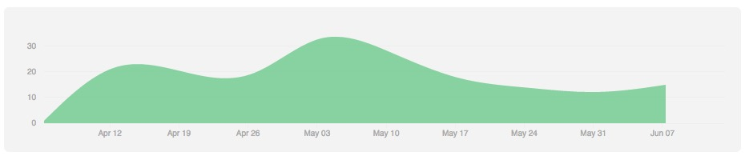

# 第186块砖

二月份的某一天，很偶然在一本书里看到了极简主义这个词语。真应了那句歌词『只因为在人群中多看了你一眼』，接下来的四个月里，我都在不知疲倦地搬砖，把砖头从印象笔记中，搬到自己开发的APP中。至于为什么，可以从之前的《把你的笔记用起来》一文中找到答案。

要知道我的印象笔记里有差不多2300篇笔记，要把这么大量的文本，转换成几乎是纯文本的 markdown 格式，劳神费力。虽然已经尽可能写代码自动化，但是知识的提取过程，只能用自己的脑袋完成。

上面的图很有意思，每次提交一次『作业』，相当于搬了一块砖，也就是完成了一小部分的迁移工作，一天里提交的次数越多，那一天对应的色块颜色就越深。没有搬砖的日子，自然就是白色了。然后最高的连续搬砖记录是 55 天，从4月5日到5月29日。很多时候当你心血来潮想要做一件事情，最困难的不在于一开始的几天，而是之后的每一天。

日子变化快快，每天事情多多，现在感觉很重要的任务，过两个月可能早已经抛到脑后了，其实能有一件事情能一直坚持去做，本身就是很有意思的事情。无论是读书、写作、骑行还是恋爱。即使现在已经远离了当初的状态，想想那些年的自己，也很有趣。

这一两个月是彻底告别旧生活旧环境的过渡时期，能够在启程前做好最后的收尾工作，也是很开心。

其实生活一直是倒计时，只是天数一长，我们就一点不紧张。可是无论如何，能把每天的砖搬好，总有一天能盖出个像样的东西吧。
