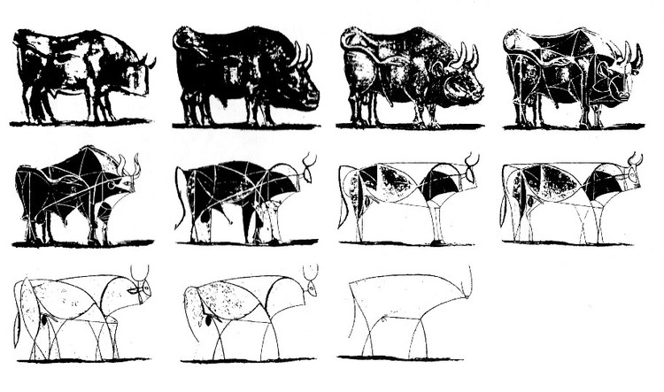
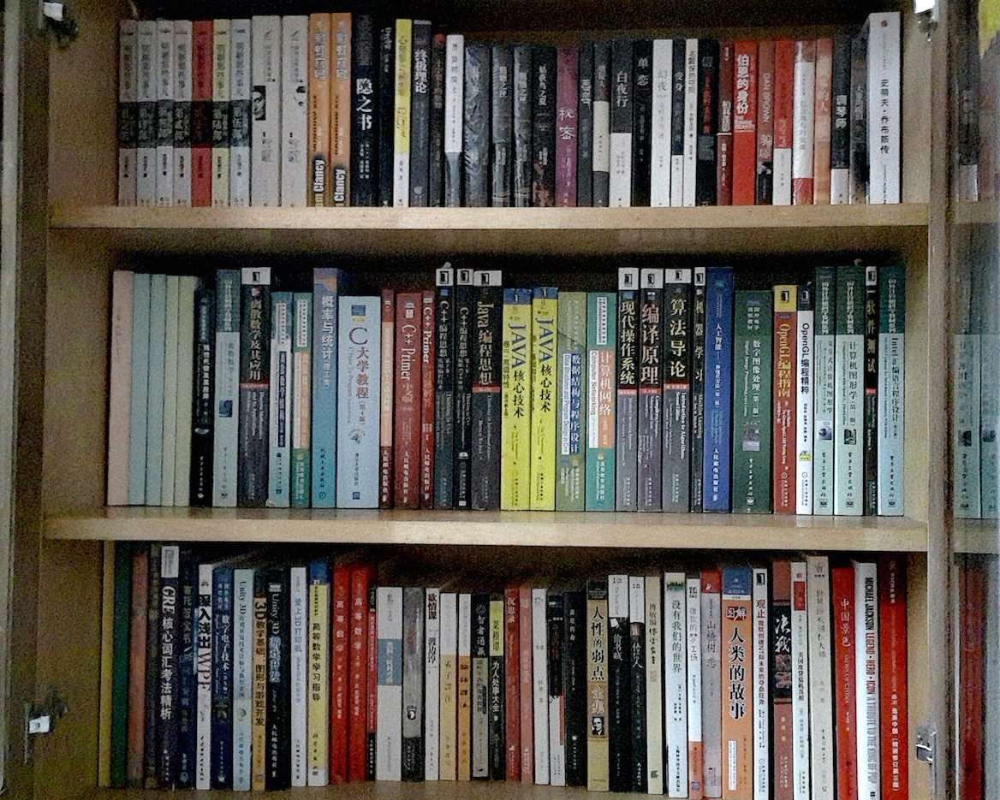
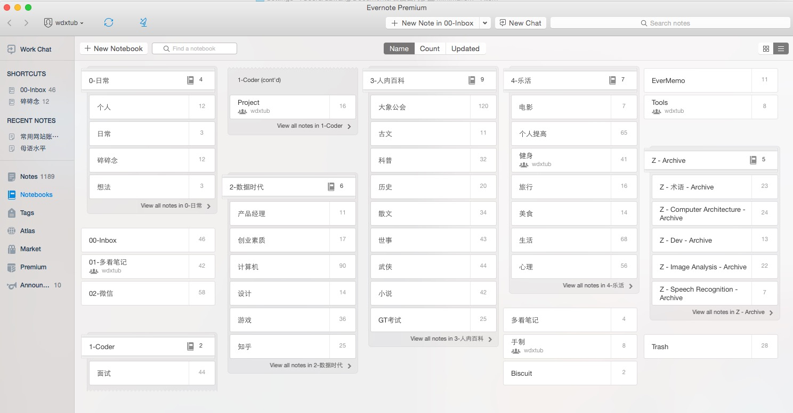
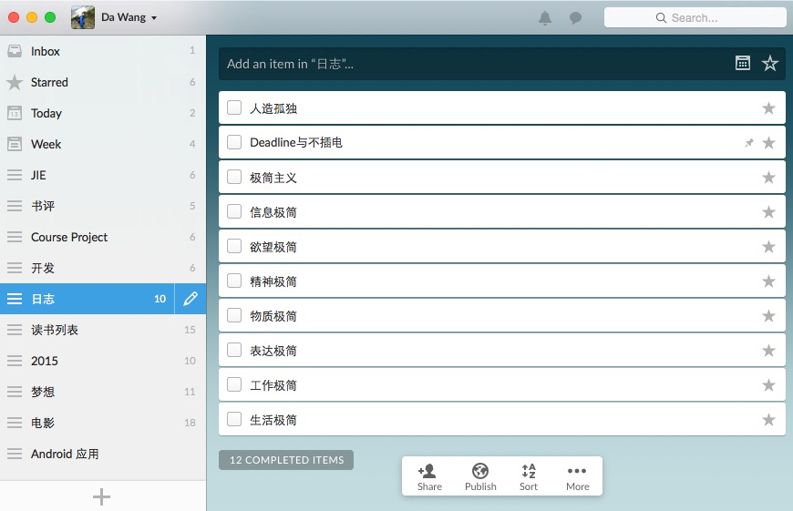
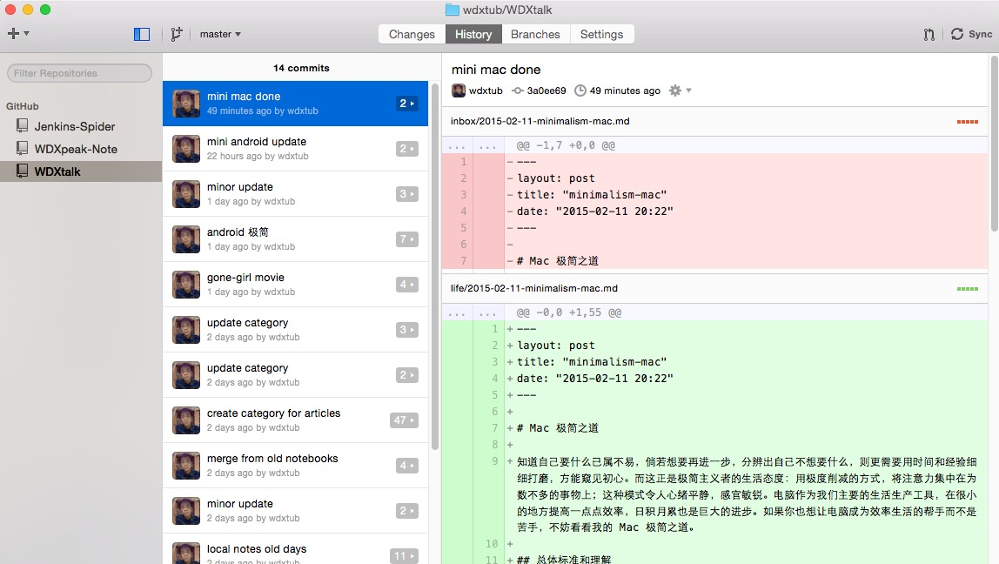

# 信息极简之道

知道自己要什么已属不易，倘若想要再进一步，分辨出自己不想要什么，则更需要用时间和经验细细打磨，方能窥见初心。而这正是极简主义者的生活态度：用极度削减的方式，将注意力集中在为数不多的事物上；这种模式令人心绪平静，感官敏锐。身处信息时代，二进制的汪洋大海淹没你我，看不完的新闻，收藏不完的干货。把下载当占有，把占有当学习，不知道为什么，只知道在哪里。如果你也觉得这种状况令人懊恼，不妨看看我的信息极简之道。

## 缘起

大约从初中时代起，我就非常喜欢做笔记，也许是因为脑子笨，所以固执地把书写当作记忆。昨天收拾房间，还翻出来了当年厚厚的一摞子笔记。最近我才意识到，这样记笔记，其实是勤快地偷懒。表面上看起来做了很多工作，也觉得自己很努力，可是知识没有真正学进去。

没有学进去的原因很多，最主要的就一条：没有融会贯通结合到自己的知识结构中，因此这些信息只是从书本上被我搬运到了笔记本上，放弃了思考打碎重组这个费时费力动脑的过程，自然只停留在纸面上。对时间最大的浪费就是花着感动自己的百倍精力却只能带来零星的输出，然后把原因归结于自己太笨继而放弃抵抗。

任何时候改变都不晚，我终于可以停下脚步，看看走过与将要去的路。我的心向往着连接与极简，就像毕加索的画作，把具体的信息抽象成知识，必然是需要一番苦工的，然而我想试试看。

## 形意

这个春节假期，一回到家就开始整理东西，想要走上极简之路，断舍离就是一个不错的开端。卖掉囤积的杂志，整理笔记与票据，清理书籍与书柜，房间焕然一新，心境亦是如此。

探索不是碰运气，更像是排除法，干扰项逐渐减少的过程，就是接近真实的过程。如果不知道自己想做什么，就认真去做点什么，任何事情都可以，然后就发现自己真真想要什么。可是如果一开始就在纠结，不确定这个东西是自己想做的就不去做，就永远得不到答案。

得到答案之后，往往会意识到，这个东西，不就是闹钟经常一闪而过却总是被忽略的念头吗，只是平时被熙攘生活掩盖，我们没留心罢了。反而是极简了之后，真实才得以显露。兜兜转转回到原点，看起来有些虚度生命，可是正是那一圈的旅程，让你成为现在的你。

## 术业

我的信息极简之道，依赖于以下这七个组件：

1. Markdown：让写作回归写作，极简写作的语言
2. Atom：知识转化的阵地，文件管理
3. Evernote：信息收集，粗略分类
4. Wunderlist：待办事项，任务驱动
5. Github：记录每个脚步
6. Lofter：分享，找寻同路人
7. WKK：wdx's knowledge kit，个人知识管理工具(秘密开发中)

前六个组件两两配合，用及其灵活的方式覆盖各种生活工作场景，再加上自己开发的工具包，配合自己的思考与拆分，无缝对接各个组件，最终搭建起来整个知识体系，把无关信息去掉，极简浓缩出知识。

上图是 Markdown+Atom，写作的时候我不再需要关注排版和编号，只需要按照非常简单的语法规则，就能够生成非常美观的文章。文章和资料先进入 inbox 文件夹，完成后放入不同的类别中。

这里是我的印象笔记，这里汇总了不同来源的笔记：从 kindle 中导出的书摘，在微信里保存的优秀文章，从浏览器中截取的关键信息。印象笔记就像是我的快递分拣中心，来自天南地北的各种笔记汇聚起来，先进行粗略分类，然后等待统一处理。

接着是 Wunderlist，根据不同的事项，列出要做的事情，可以设定截止日期与同学共享列表方便协作等等功能，每一段时间的工作学习都有明确的目标，避免了碌碌无为的瞎忙(泄露了之后要写的文章列表)。

然后是 Github，这个对于不写代码的同学来说可能有点陌生，一句话来说就是这个软件可以跟踪记录文章或者知识库的每一步变动，也可以督促自己，每天都要做点什么。

Lofter 就不必多说，写作就是又一次思考的过程，还能跟大家分享自己的想法，只有不断进行输入输出的循环，才能有更高效率的输出与输入。

## 凝定

具体的工作流程是这么样的呢，大概分为以下几个步骤：

1. 阅读(kindle，手机，网页等等) - 了解信息
2. 保存到印象笔记中 - 第一次筛选与思考
3. 定期给笔记分门别类 - 第二次筛选与思考
4. 整理信息，用自己的话去复述，加入自己的想法 - 第三次筛选与思考
5. 写成日志或者主题文章，利用 Github 和 Lofter 进行记录与分享- 第四次筛选与思考

通过这样一次又一次的筛选与思考，自然过滤掉了大部分无用的信息，剩下的极简部分会成为自己知识体系的一部分，与其他知识连接并产生化学反应。

写到这里，大家可能会奇怪，看起来整个结构已经很完整了，还有 WKK(就是我自己开发的知识管理工具) 什么事情吗？

有，而且关系很大。极简的第一要义是精炼，第二要义就是连接，连接使得一个东西不仅仅是其本身，更成为了另一个更大系统的一部分。正所谓道生一，一生二，二生三，三生万物，有限的元素孤立时依然是有限的，但是连接起来，则有无限的可能。

连接，就是 WKK 要做的事情。那么有什么是需要连接的么？

1. 各种移动设备：kindle、手机、平板，如果能随时随地访问自己的知识库，那该多好！
2. 各种知识点与主题：不同学科、领域、专业间的交叉索引，不再局限于一招一式，而从更大的角度思考，那该多好！
3. 再有野心一点，如果能把数字世界和现实世界连接起来，那该多好！

收集，整理，连接，转化成为自己的知识，这就是我的信息极简之道。

（信息从哪里来，怎么找到有价值的第一手资料，就留在接下来的文章中介绍。）
