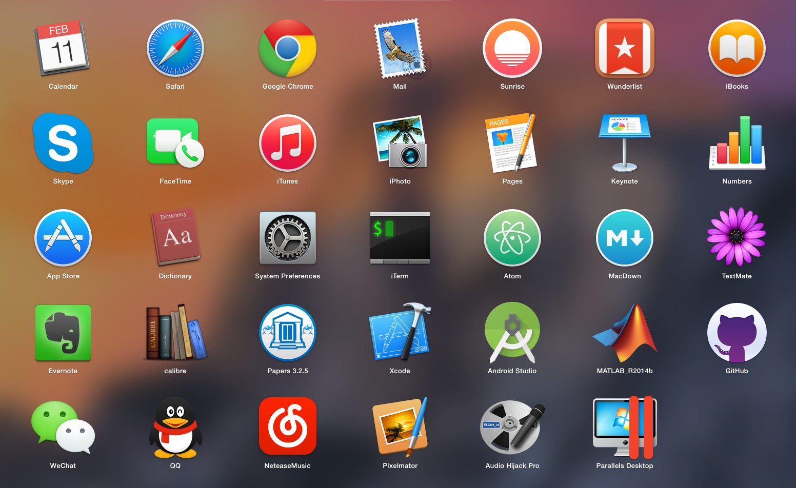

# Mac 极简之道

知道自己要什么已属不易，倘若想要再进一步，分辨出自己不想要什么，则更需要用时间和经验细细打磨，方能窥见初心。而这正是极简主义者的生活态度：用极度削减的方式，将注意力集中在为数不多的事物上；这种模式令人心绪平静，感官敏锐。电脑作为我们主要的生活生产工具，在很小的地方提高一点点效率，日积月累也是巨大的进步。如果你也想让电脑成为效率生活的帮手而不是苦手，不妨看看我的 Mac 极简之道。

## 总体标准和理解

不同人有不同的需求，只有围绕着自己的真实需求去极简，才是有效的，可以提高生活品质的极简。对于电脑应用来说，我希望它是能切实增加我的生活品质的和提高工作效率的，所以设定了一个严苛的打分系统，分数不够，就删掉：

1. 这个应用所提供的功能是我非常需要的吗？(5分)
2. 电脑上还有没有同类应用？相比而言有优势吗？(1分)
3. 这个应用是否足够开放？我基本都能用得上？(2分)
4. 这个应用能否排进我心中应用的TOP20？(2分)
5. 是否曾经有类似的应用，安装了却很少用？（有的话扣2分）

这个标准和手机 APP 选择略有不同，毕竟很多时候电脑还要作为生产环境，这样一来选择就不是很大。假如整个团队都用的是某个开发环境，那么即使你再不喜欢，也还是得用。但是在这之外，同样有很多选择。

同类应用只保留最适合自己的；选开放的标准而非封闭；精心发掘每个应用的潜力；让应用和应用高效配合起来。这几条作为核心思想，指导着我做出极简的选择。这样说还是很模糊，举个例子，如何选择笔记和知识管理应用。

现在市场上的各类笔记应用多如牛毛，而笔记在我的知识系统中的定位主要是收集，这两个条件加在一起，大概的匹配条件就是：全平台支持+多种收集工具+层级可共享笔记本+易于导出。这样一来，能入选的就只有印象笔记了，无论是网页文章和还是微信文章，都能快捷一键保存，新增加的协作功能也很方便和同学朋友共享。

但是，但是，Evernote 不思进取的编辑器和不大开放的笔记格式，注定了它只能成为一个收集器，而非知识管理的利器。至于知识管理的大杀器是什么，允许我在这里卖个关子，将在后续“信息极简之道”中进行详细地说明。

仔细想想自己到底要什么，然后把那些觉得自己可能会用到但是从来没有用到过的应用删掉吧，我们的生活绝不需要如此复杂，简单，再简单，才能更清楚地渗透进自己的内心。

## 非系统应用列表及简介 Jan 12 2015

1. Chrome：我找不到用其他浏览器的理由，网银是什么，IE 我不用
2. Sunrise Calendar：把 iOS 和 Android 的日历连起来，又叫马儿跑，又叫马儿不吃草
3. Wunderlist：就是奇妙清单，用了几年，除了有时候服务器抽风，基本没得黑
4. Skype：和导师聊人生，似乎没有其他选择
5. iTerm：一个终端，一扇新世界的门
6. Atom：Github 开源编辑器，剧透一下，这是知识管理的核心组件
7. MacDown：开源 Markdown 编辑器，平时写个小文章做个网页什么的，就是它了
8. TextMate：至今用不惯 Vim 和 Emacs，那么 TextMate 就是我的 mate
9. Evernote：前面提过，信息中转站
10. Calibre：功能多到让你吃惊的图书管理器，这就是不需要读新闻的原因，因为你可以做自己的报纸
11. Papers：写论文什么的...都是泪
12. Xcode：IDE，也没有什么选择余地是不是
13. Android Studio: 重新给了我一个写 android 应用的理由
14. Matlab：写论文，做实验，都是泪
15. Github：版本控制，同样也是知识管理的核心组件
16. 微信：为什么我都不怎么用 qq 了
17. QQ：有的时候，还是要用来传个文件什么的
18. 网易云音乐：iTunes 什么鬼，这才是我喜欢的
19. Pixelmator：PS 不会用，这个小巧，够用
20. Audio Hijack：录音的，导师英语一激动就说得快，不录下来就听个一知半解
21. Parallels Desktop：windows 和 linux 就在这个平行世界里跑
