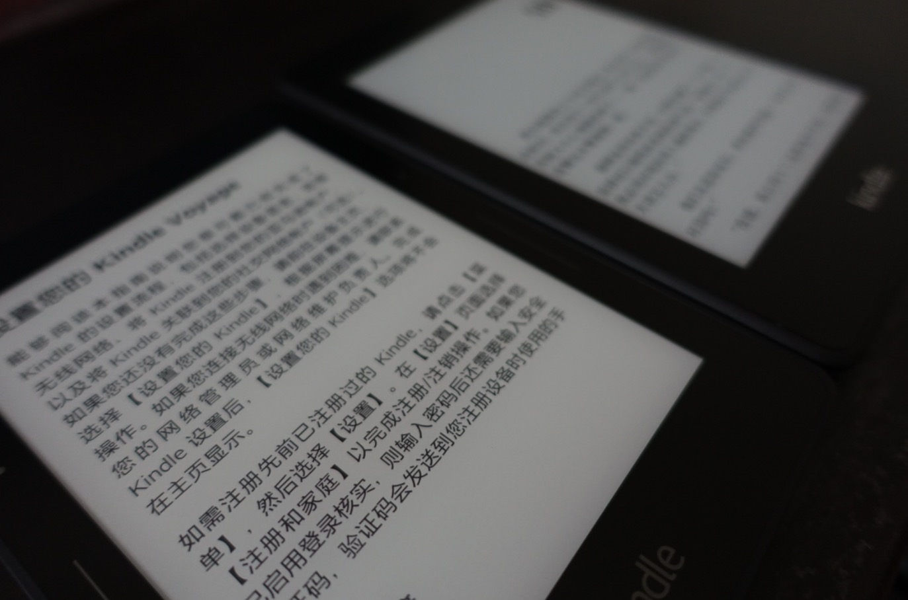

# 未知航行

最初知道 Voyage 这个词，我还在学新概念，一下就记住了 Titanic's Maiden Voyage。不过今天，新的航行开始了，Kindle Voyage 入手，航程未知，航向未知。可是我倒是相信，乘天地，游无穷，只要是在往更美好的地方航行，就没必要为自己设限。

跟人聊天的时候，常常发现自己似乎跟时代脱节了。我歌？不看；跑男？不看；电视剧？不看；电影？偶尔看看经典；很多大家觉得有意思的东西我并不感兴趣。几点睡？11点；几点起？6点；即使在同一个时区，和不少人仍旧有时差。是我太古板，还是时代变化太快？

被问起自己的生活时，我的回答似乎总是很难引出话题，因为实在是太简单了：看书，写作，学习，运动。这些都是只有真正懂的人，才会明白个中趣味的爱好。可能我不知道现在最流行的歌手是谁，但是我啥书都看过一点，如果你对书店感兴趣，我倒是可以一个一个书架聊一整天。可能我不知道最新的节目哪个明星有什么有趣的表现，但是我喜欢体验各种各样的生活聆听各种各样的故事，如果你对生活本身感兴趣，我倒是有不少有意思的故事可以分享。可能我不知道最近TVB又上了什么新电视剧，但是我知道很多我们日常离不开的东西背后的道理，如果你想知道诸如为什么有的耳机几十有的耳机几万，为什么电脑非要用0和1来表示这类乱七八糟的问题，我倒是可以从最开始一点一点让你明白。可能我没有看过最新最火的电影，但是我像阿甘一样喜欢跑步，偶尔骑行，常常健身，如果你想更加了解自己的极限，我倒是可以陪你跑一整天。

虽然有时候找不到话题挺尴尬，但是对于现在的生活，是满意的。不会过分依赖外界的刺激，本心就是一个自给自足的系统，知道自己想要什么，知道自己需要怎么做，知道自己应该做什么，对我而言就是最好的状态。

当我看得越多，并没有因为纷杂熙攘的世界迷失自己，反而更加清晰了自己要走的道路。很少踌躇和犹豫，全力以赴去做当下最应该做的事情。

说来有趣，当你一心想要追逐未知，踏上未知航行的时候，其实所谓终点是已知的。不论那个地方在哪里，你都应当知道，抵达时，已经是更好的自己。

这就是我所理解的未知航行。
