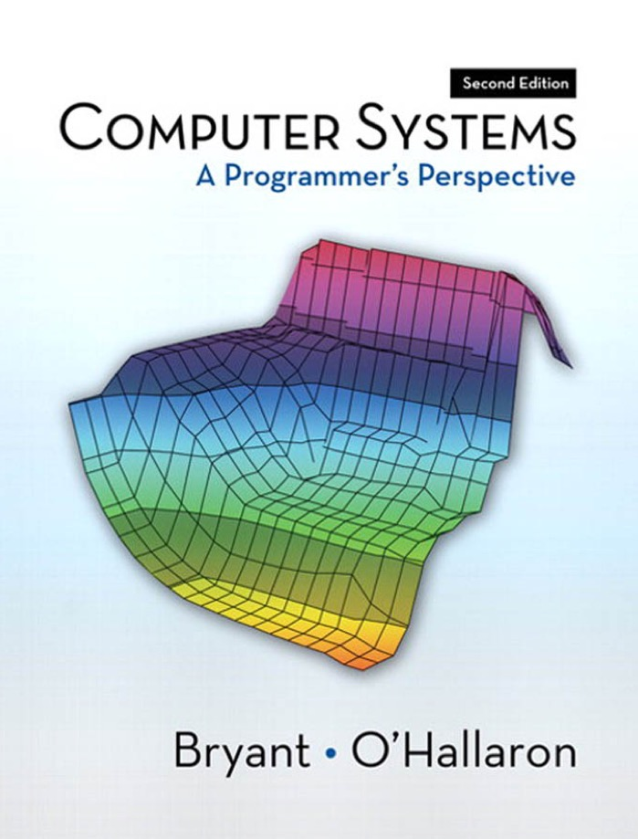

# 【深入理解计算机系统】软硬之间

这本书是CMU 15-213 课程的配套教材，神奇的是，正好和 CMU 的邮编相同，于是就有了这句话：15-213: The Class That Gives CMU Its Zip! 正如这本书的书名 <Computer System: A Programmer's Perspective> 一样，实用够用是这本书的最大特点。重点得当，基本需要了解的知识点到为止绝不拖泥带水，如果感兴趣的话，同样提供进阶路线。这种灵活且自适应的课本，不是大神写不出，没有耐心啃不完。

并不打算对具体的技术细节做过多纠缠，就来说说读后感吧。第一个让我感触非常深的是对“对待软件严肃认真的人，应该制造自己专属的硬件”这句话的再认识，对于软件工程来说，现在也许是最好的年代，操作系统和开发平台为我们隐藏了足够多的细节，开发调试部署似乎都成为了非常硬件无关的工作。回顾整个科技的发展史，都是一层一层，当下层基础逐渐完美的时候，所有的工作会交给机器本身完成。这样的规律一再重复，当我抱怨着在 GPU 上编程是如此反人类的时候，也许几十年前，程序员是在抱怨 CPU 的反人类。

所以这也就是为什么说掌握了历史的人就能掌握未来，所谓螺旋上升，亦是如此。这两个学期学的课大多是偏硬件的，从原来彻底的硬件白痴，到现在甚至知道 CPU 里关键算法的工作原理，虽然看起来写出来的代码还是差不多，可是写的时候进行思考的角度完全不一样了。就好像从看山是山转变成看山不是山一样，估计还要一番努力，才能最终达到看山还是山的境界吧。

从前不能相信为什么说计算机可能是人类制造的最复杂的东西，当我一点一点走近去观察的时候，才发现一点一滴都凝结着无数人的聪明才智。很多时候都会惊叹，这么天才的构想，简直像是穿越回来了一样；但是同样也会意识到不同时代的人终究难以摆脱其局限性，可是木已成舟，只能带着镣铐跳舞，但依然能做出精彩绝伦的演出。

这样一想，软件和硬件真的就好像足球和健身。了解硬件，是为了知道硬件能做什么擅长什么，知道它的极限在哪里；坚持健身，是为了知道自己能跑多快能跳多高，知道自己的极限在哪里。有了硬件，就可以结合软件，磨练技艺，最大程度地扬长避短，写出真正有用的软件；有了身体，就可以结合具体位置，百炼成钢，有的放矢地更进一步，成为比较靠谱的足球爱好者。

更重要的是，核心力量(也就是腰腹)是最难练，但是最重要的。就像我们的内功，外行不懂，但是内行一看就知道，你下了多少苦功。所以不能说最近流行什么，就一拍脑袋追上去，而是要花更多时间去学习那些最本质最核心的东西，基础打牢了，才有可能走的更远。

现在想想，当初因为想做游戏而入行，误打误撞确发现这真的是非常令我着迷的东西。精巧的设计，优雅的流程，人性化的功能，只有用艺术的态度去做一件事情的时候，才能真正做出让别人赞叹的东西。

我想，很多时候我们觉得一个东西没用，更多情况可能是我们自己还没有有用到可以认识到个中千丝万缕的联系。当热爱带你走过一开始最艰难的一段路之后，剩下的就是充满惊喜的探索发现之旅了。

不过说真的，看这种大部头真的是劳神费力。整本书七百多页，看了三四个月，折腾了一百多页的笔记，有需要的[点击这里](http://pan.baidu.com/s/1dDcXeOp)
