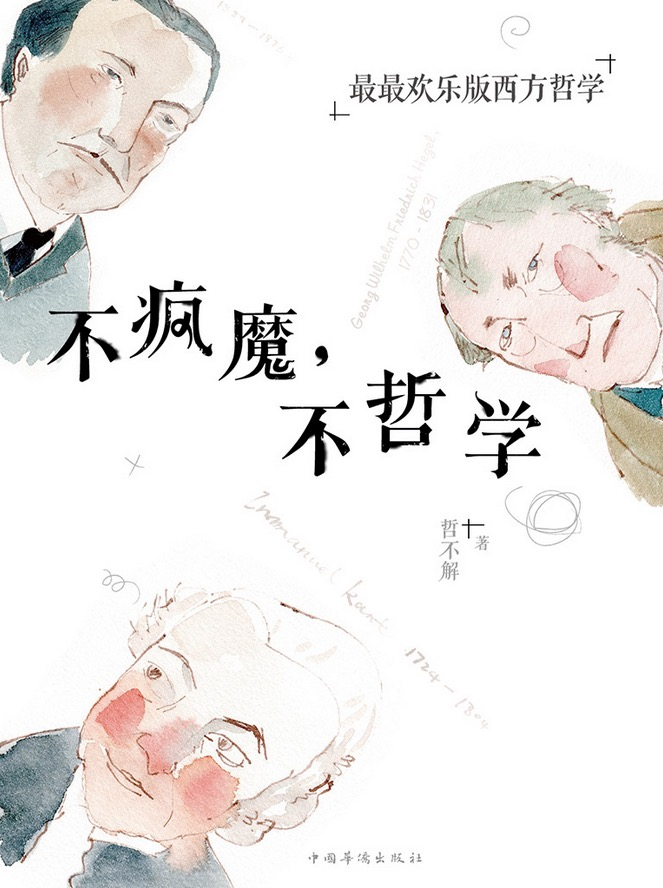

# 【不疯魔，不哲学】两次转向

哲学是天才的游戏，书中随便抓一个名字，放到任何人面前都是一座高山。我虽然没有勇气像愚公一样硬碰硬移山，但是在山脚下看看宣传小册子，还是可以的。从古希腊三贤到康德尼采和维特根斯坦，想要理解他们构建的精神世界几乎是不可能的，可是肤浅的人也有肤浅的活法，哲学本身内容不谈太多(因为我也确实谈不了)，但是西方哲学发展史上的两次转向却很有趣，正好最近在做的研究也算沾边，就来献丑了。

东方哲学的源头是儒家精神和道家精神，而西方的源头同样有俩：希腊精神和希伯来精神。希腊精神注重理性“逻各斯”，理想的人都是理性的人，产生了西方世界的艺术与科学；而希伯来文明注重超然性和献身性，强调信仰和拯救，他们理想的人都是信仰的人，缔造了西方的宗教和道德伦理。

整个发展过程，和人们对世界的认识水平有着极大的关系。人类文明早期，哲学家们关心的问题是“世界的本质是什么”，有的人说是水，有的人说是火，还有的人说是其他什么东西，总体来说都归结为“本体论哲学”。然后笛卡尔出现了，作为新时代的旗手，开启了第一次转向，大家逐渐认识到，世界本质是什么这个问题太大，在这之前，我们至少先要弄清楚“人们如何正确获得认识”，不然永远没办法得出正确的结论，随着启蒙运动与近代科学的飞速发展，终于走出了中世纪黑暗阴霾，开始大踏步向前了。各个学科欣欣向荣，虽然教会的力量依然强大，可是燎原之火，岂能轻易扑灭。然后维特根斯坦出现了，这个 bug 一样的存在，宣告了哲学的没落，顺带让哲学再次转向，想要弄清楚我们如何正确获得知识，就要先研究好“我们该如何表达出知识”，也就是即第一次“认识论转向”之后，第二次“语言转向”。

经过两次转向，终于感觉有点接地气了，至少计算机科学家觉得可以插一脚了，从哲学范畴的本体论演变出来的计算机科学的本体论，开启了一个轰轰烈烈的人工智能时代。

有点意思是不是，更有意思的是，对于我们普通人来说，了解哲学可能是预知未来的最简单方式。为什么这么说，我们来看看这两次转向出现的节点对应的世界。最开始的本体论哲学，引导的科学和社会发展和其核心问题“世界的本质是什么”有着极大的关系，因为不能解释的东西太多，所以延续着一开始的图腾崇拜，宗教产生了。宗教配上权力最终成为了束缚，人类在缓慢向前了一千六百年后，科学精神终于迎来了可能没那么残酷的土壤，正是在这个时候，笛卡尔站了出来，引导了第一转向，大家开始关心“如何正确获得认识”。笛卡尔躺在床上顺带用解析几何把原本分开的代数和几何联系在了一起，这一波科学狂潮带领人类建立了科学体系，去求索正确获得认识的方法。

经历了两三百年的发展，维特根斯坦，作为三百六十行行行他都是状元的代表人物，最终开始研究哲学，带来了第二次转向——“如何表达知识”。毕竟科学体系已经基本确立，能搞搞破坏的通常都是大人物了(例如爱因斯坦)。搭配上计算机的出现，如何表达知识自然成为了新的方向。

是不是看出了什么东西，哲学通常引导着时代潮流，但是会有个几十年时差，毕竟普通人没办法在同一个时代理解 godlike 的天才们。可是我们知道了这个，就可以从原来的哲学中找到现在发展的趋势了。

我们等了几千年，等来了笛卡尔；又再等了三百年，等来了维特根斯坦，你说下次上帝亲自动手造出超越时代的天才，还要多久？
