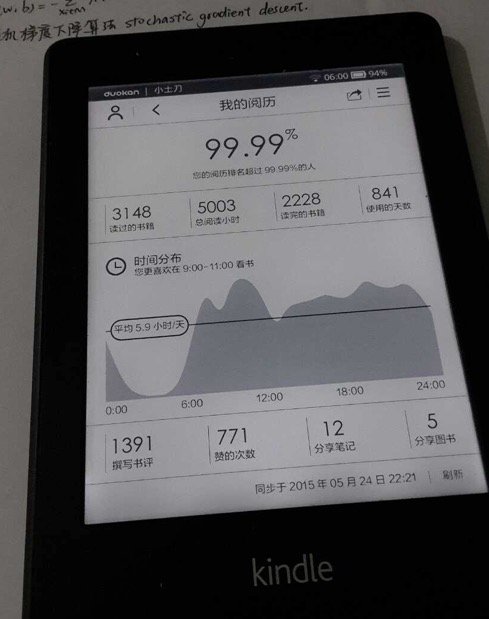

# 写在五千小时

八百四十一天之后，我的阅历终于来到了五千小时。这个数字其实一点都不准确，或者说，读书本来就不应该用数字来计算，各式各样的统计数字不过是副作用，真正的疗效是脱离自身的限制，成为自己的旁观者，也就是所谓的『灵魂出窍』吧。

从四千到五千大概用了七个月时间，毕竟开学之后，学习内容增多，阅读时间无止境被压缩。但是好在慢慢开始拥有了辨别能力，有了自己读书的节奏了，什么书可以快，什么书应该慢，怎么快怎么慢，都只有在阅读和思考中不断跟自己磨合，才能找到答案。

总体来说，这段时间略读和预测内容的能力有了长足的进步，对于数学、社会学还有其他领域也有了更广泛的涉猎，能够以更加开放的心态，去感知这个世界，书本不再是唯一的来源，可以作为内核，兼收并蓄各种各样的信息了。通过纵深和主题阅读，开始产生跨学科的化学反应了。并且通过清理关注删除应用，慢慢走向极简主义，用信息收敛的方式专注于生活本身。更重要的是，意识到书屋虽好，不可久居，一定要走出来，多去交流沟通，再回去，周而复始。

也就是说，通过阅读来看见自己，看见他人，继而了解自己，确定方向，然后无畏前行，定期审视，最终达到触类旁通，有信心解决各式各样的问题。这里有一个很重要的要点，就是要勇于尝试，从失败中学习，既是挫折教育。不过玻璃心可能还是要谨慎一点，别被打趴了起不来了，那就有悖初衷了。

就好像各种修行都是为了等待顿悟的瞬间，一点一滴的积累，也就是在不断靠近临界点，一旦超越，你还是你，却已不是从前的你。

我们生活在无比主观的世界里，现在能用超然物外的方式去观察自己，一定不要错过这个机会。

附：《[写在四千小时](http://www.wdxtub.com/post/1a7a1d_2a86b85)》《[写在三千小时](http://www.wdxtub.com/post/1a7a1d_1405fa6)》《[写在两千小时](http://www.wdxtub.com/post/1a7a1d_cc3dc7)》《[写在一千小时](http://www.wdxtub.com/post/1a7a1d_838d83)》
