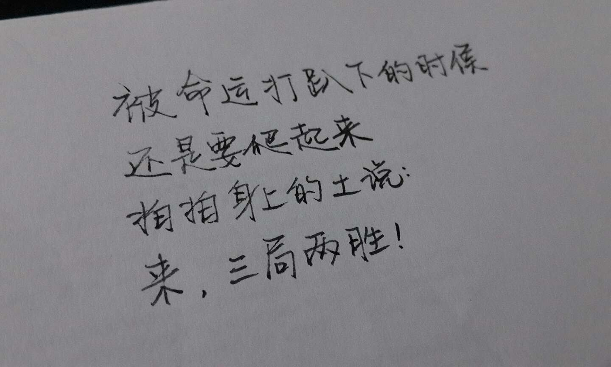

# 书读多了

金克木老先生的《书读完了》是我一直不敢翻开的一本书，即使是现在，每当我翻看过去的读书笔记，又或者重读原书的时候，都会有许多不一样的收获，很难想象怎么才算是“书读完了”。开始读书和写作的这两年里，我真正感受到了某种超越时间和空间的自由，更重要的是，我知道了所谓自由，是一页页读出来一篇篇写出来的。

既然今天是世界读书日，我们就来说说读书吧。首先要强调的是，这里的书，是不包括绝大部分网络连载作品的。要聊的，是那些真正有内容的书。跟别人聊起书，我总有种不知从何说起的感觉，因为看得太多太杂。就拿去年来说，在[阅读DNA](www.yuedudna.com)上生成的口味是这样的

除了最大的字体能看出来我是干啥的之外，其他稍微小一点的标签，就是百花齐放了。越长大，好奇心越强，比方说前一阵子吴清源老先生去世，虽然在知乎上看了很多靠谱的回答，但是还是想自己去看看老人的一生，于是就找来《中的精神》，果然有不一样的感悟。又比如说前一阵子新加坡国父李光耀去世，又去找来了他的书，看看书，总是要比短短的微博和二手的知乎要更有意思，但也更累一些。

生活本身就是积累，会有爆发的时刻，可是质变的前提是量变，这个道理大家都懂。世界这么大，总会有些让你在意的东西，那就拿出实际行动来，真正去研究研究，而不是叶公好龙。

+ 读书最重要的获得并不是读好书，最糟糕的也不是读烂书，而是开始能够分辨什么是好书什么是烂书，书里哪里写得好哪里写得不好
+ 这种分辨力并不是一蹴而就的，而是一点一点积累出来的，推而广之，可以应用到生活中，对于不同的人和事，有自己的判断
+ 所谓读书的方法其实是不大存在的，只要是有逻辑和反馈的方法，只要坚持下来效果肯定都不会差，完全不用纠结怎么读，读就是了
+ 推广来说，甚至最佳书单也是不大存在的，只要是适合的书，就是好书
+ 电子读书笔记在我看来是非常有效率的，手抄太慢，画线容易找不回来，从这个角度看，一台电子阅读设备几乎是必须的
+ 借用李笑来老师的一句话：所有学习上的成功，都只靠两件事——策略和坚持，而坚持本身就是最重要的策略。

和读书一脉相承的是写作，写作这个事儿，真的不是看几本书写几篇文章就能找到节奏的。所谓节奏，就是自己的风格，对于一个作家来说，可能最开始的几年里写的所有东西都只是为了找到自己的风格。像我这种业余爱好者，更是路漫漫其修远兮。可是我似乎又有点运气，搬来lofter的第六个月，我的日志和博客，被官方微博和博客推荐了。一直以来写博客对我来说都只是单机游戏，从来没有想过自己的文字和想法可以影响到那么多人。忽然一天上线发现有几百个评论和推荐，真是感觉路都不会走了。

[为什么要写博客(13.10.17)](http://www.wdxtub.com/post/1a7a1d_a2010f)、[为什么要读研究生(13.10.26)](http://www.wdxtub.com/post/1a7a1d_a533fe)和[为什么要早起(13.11.30)](http://www.wdxtub.com/post/1a7a1d_b35d56)作为“为什么”系列最受欢迎的三篇，即使自己现在来看，也算的上话糙理不糙了。打动我的不是那些冰冷的热度，而是能看到素不相识的朋友的留言，说自己也打算开始写作、早起和找寻自己的方向。

这让我觉得，只要愿意敞开心扉，总不会太孤单。我的努力会带动更多的人努力，大家都努力多一些，这个世界就会更好一些。时间一点一点过去，原来熟悉的 ID 慢慢也消失不见了，我想他们一定是找到了自己的方向，在拼命努力吧。而我还是会一如既往地写下去，愿意为更好的明天，尽一份微薄之力。

关于写作，因为自己也还是个门外汉，唯一一条可能有用的经验就是：写作对于自己来说最大的价值，在构思完成之后就已经结束了，而只有当写完之后，对于他人的价值才能开始。

这就是今年读书日的一些絮絮叨叨了，请跟着我一起看书吧！
