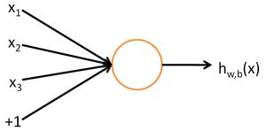
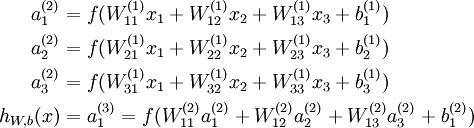
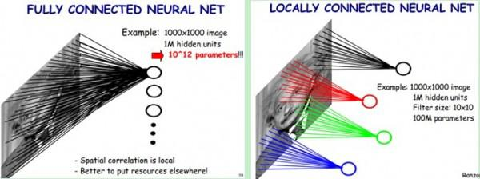
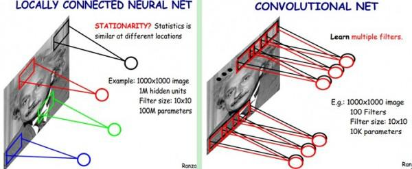
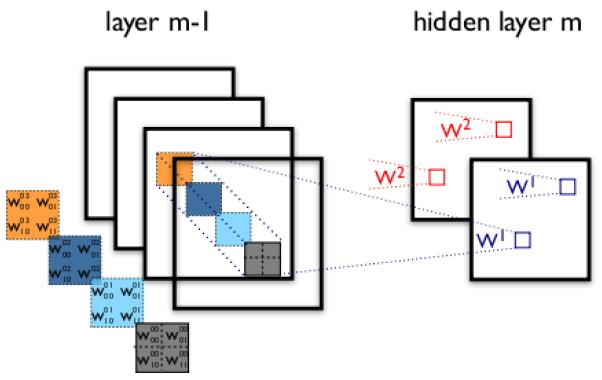
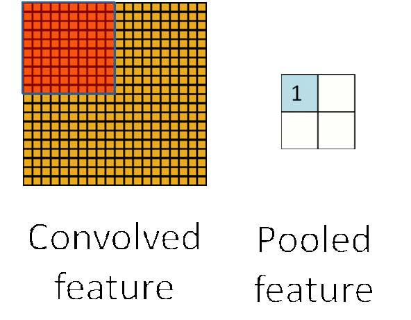
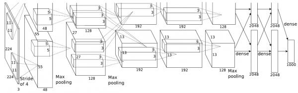

# 卷积神经网络 CNN 指南

Deep Learning是全部深度学习算法的总称，CNN是深度学习算法在图像处理领域的一个应用。

第一点，在学习Deep learning和CNN之前，总以为它们是很了不得的知识，总以为它们能解决很多问题，学习了之后，才知道它们不过与其他机器学习算法如svm等相似，仍然可以把它当做一个分类器，仍然可以像使用一个黑盒子那样使用它。

第二点，Deep Learning强大的地方就是可以利用网络中间某一层的输出当做是数据的另一种表达，从而可以将其认为是经过网络学习到的特征。基于该特征，可以进行进一步的相似度比较等。

第三点，Deep Learning算法能够有效的关键其实是大规模的数据，这一点原因在于每个DL都有众多的参数，少量数据无法将参数训练充分。

卷积神经网络简介（Convolutional Neural Networks，简称CNN）

卷积神经网络是近年发展起来，并引起广泛重视的一种高效识别方法。20世纪60年代，Hubel和Wiesel在研究猫脑皮层中用于局部敏感和方向选择的神经元时发现其独特的网络结构可以有效地降低反馈神经网络的复杂性，继而提出了卷积神经网络（Convolutional Neural Networks-简称CNN）。现在，CNN已经成为众多科学领域的研究热点之一，特别是在模式分类领域，由于该网络避免了对图像的复杂前期预处理，可以直接输入原始图像，因而得到了更为广泛的应用。 K.Fukushima在1980年提出的新识别机是卷积神经网络的第一个实现网络。随后，更多的科研工作者对该网络进行了改进。其中，具有代表性的研究成果是Alexander和Taylor提出的“改进认知机”，该方法综合了各种改进方法的优点并避免了耗时的误差反向传播。

一般地，CNN的基本结构包括两层，其一为特征提取层，每个神经元的输入与前一层的局部接受域相连，并提取该局部的特征。一旦该局部特征被提取后，它与其它特征间的位置关系也随之确定下来；其二是特征映射层，网络的每个计算层由多个特征映射组成，每个特征映射是一个平面，平面上所有神经元的权值相等。特征映射结构采用影响函数核小的sigmoid函数作为卷积网络的激活函数，使得特征映射具有位移不变性。此外，由于一个映射面上的神经元共享权值，因而减少了网络自由参数的个数。卷积神经网络中的每一个卷积层都紧跟着一个用来求局部平均与二次提取的计算层，这种特有的两次特征提取结构减小了特征分辨率。

CNN主要用来识别位移、缩放及其他形式扭曲不变性的二维图形。由于CNN的特征检测层通过训练数据进行学习，所以在使用CNN时，避免了显示的特征抽取，而隐式地从训练数据中进行学习；再者由于同一特征映射面上的神经元权值相同，所以网络可以并行学习，这也是卷积网络相对于神经元彼此相连网络的一大优势。卷积神经网络以其局部权值共享的特殊结构在语音识别和图像处理方面有着独特的优越性，其布局更接近于实际的生物神经网络，权值共享降低了网络的复杂性，特别是多维输入向量的图像可以直接输入网络这一特点避免了特征提取和分类过程中数据重建的复杂度。

## 神经网络

首先介绍神经网络，这一步的详细可以参考资源1。简要介绍下。神经网络的每个单元如下：

其对应的公式如下：

其中，该单元也可以被称作是Logistic回归模型。当将多个单元组合起来并具有分层结构时，就形成了神经网络模型。下图展示了一个具有一个隐含层的神经网络。

其对应的公式如下：

比较类似的，可以拓展到有2,3,4,5，…个隐含层。

神经网络的训练方法也同Logistic类似，不过由于其多层性，还需要利用链式求导法则对隐含层的节点进行求导，即梯度下降+链式求导法则，专业名称为反向传播。关于训练算法，本文暂不涉及。

## 卷积神经网络

在图像处理中，往往把图像表示为像素的向量，比如一个1000×1000的图像，可以表示为一个1000000的向量。在上一节中提到的神经网络中，如果隐含层数目与输入层一样，即也是1000000时，那么输入层到隐含层的参数数据为1000000×1000000=10^12，这样就太多了，基本没法训练。所以图像处理要想练成神经网络大法，必先减少参数加快速度。就跟辟邪剑谱似的，普通人练得很挫，一旦自宫后内力变强剑法变快，就变的很牛了。

### 局部感知

卷积神经网络有两种神器可以降低参数数目，第一种神器叫做局部感知野。一般认为人对外界的认知是从局部到全局的，而图像的空间联系也是局部的像素联系较为紧密，而距离较远的像素相关性则较弱。因而，每个神经元其实没有必要对全局图像进行感知，只需要对局部进行感知，然后在更高层将局部的信息综合起来就得到了全局的信息。网络部分连通的思想，也是受启发于生物学里面的视觉系统结构。视觉皮层的神经元就是局部接受信息的（即这些神经元只响应某些特定区域的刺激）。如下图所示：左图为全连接，右图为局部连接。

在上右图中，假如每个神经元只和10×10个像素值相连，那么权值数据为1000000×100个参数，减少为原来的千分之一。而那10×10个像素值对应的10×10个参数，其实就相当于卷积操作。

### 参数共享

但其实这样的话参数仍然过多，那么就启动第二级神器，即权值共享。在上面的局部连接中，每个神经元都对应100个参数，一共1000000个神经元，如果这1000000个神经元的100个参数都是相等的，那么参数数目就变为100了。

怎么理解权值共享呢？我们可以这100个参数（也就是卷积操作）看成是提取特征的方式，该方式与位置无关。这其中隐含的原理则是：图像的一部分的统计特性与其他部分是一样的。这也意味着我们在这一部分学习的特征也能用在另一部分上，所以对于这个图像上的所有位置，我们都能使用同样的学习特征。

更直观一些，当从一个大尺寸图像中随机选取一小块，比如说 8×8 作为样本，并且从这个小块样本中学习到了一些特征，这时我们可以把从这个 8×8 样本中学习到的特征作为探测器，应用到这个图像的任意地方中去。特别是，我们可以用从 8×8 样本中所学习到的特征跟原本的大尺寸图像作卷积，从而对这个大尺寸图像上的任一位置获得一个不同特征的激活值。

如下图所示，展示了一个3x3的卷积核在5x5的图像上做卷积的过程。每个卷积都是一种特征提取方式，就像一个筛子，将图像中符合条件（激活值越大越符合条件）的部分筛选出来。

### 多卷积核

上面所述只有100个参数时，表明只有1个100*100的卷积核，显然，特征提取是不充分的，我们可以添加多个卷积核，比如32个卷积核，可以学习32种特征。在有多个卷积核时，如下图所示：

上图右，不同颜色表明不同的卷积核。每个卷积核都会将图像生成为另一幅图像。比如两个卷积核就可以将生成两幅图像，这两幅图像可以看做是一张图像的不同的通道。如下图所示，下图有个小错误，即将w1改为w0，w2改为w1即可。下文中仍以w1和w2称呼它们。

下图展示了在四个通道上的卷积操作，有两个卷积核，生成两个通道。其中需要注意的是，四个通道上每个通道对应一个卷积核，先将w2忽略，只看w1，那么在w1的某位置（i,j）处的值，是由四个通道上（i,j）处的卷积结果相加然后再取激活函数值得到的。

所以，在上图由4个通道卷积得到2个通道的过程中，参数的数目为4×2×2×2个，其中4表示4个通道，第一个2表示生成2个通道，最后的2×2表示卷积核大小。

### Down-pooling

在通过卷积获得了特征 (features) 之后，下一步我们希望利用这些特征去做分类。理论上讲，人们可以用所有提取得到的特征去训练分类器，例如 softmax 分类器，但这样做面临计算量的挑战。例如：对于一个 96X96 像素的图像，假设我们已经学习得到了400个定义在8X8输入上的特征，每一个特征和图像卷积都会得到一个 (96 − 8 + 1) × (96 − 8 + 1) = 7921 维的卷积特征，由于有 400 个特征，所以每个样例 (example) 都会得到一个 892 × 400 = 3,168,400 维的卷积特征向量。学习一个拥有超过 3 百万特征输入的分类器十分不便，并且容易出现过拟合 (over-fitting)。

为了解决这个问题，首先回忆一下，我们之所以决定使用卷积后的特征是因为图像具有一种“静态性”的属性，这也就意味着在一个图像区域有用的特征极有可能在另一个区域同样适用。因此，为了描述大的图像，一个很自然的想法就是对不同位置的特征进行聚合统计，例如，人们可以计算图像一个区域上的某个特定特征的平均值 (或最大值)。这些概要统计特征不仅具有低得多的维度 (相比使用所有提取得到的特征)，同时还会改善结果(不容易过拟合)。这种聚合的操作就叫做池化 (pooling)，有时也称为平均池化或者最大池化 (取决于计算池化的方法)。

至此，卷积神经网络的基本结构和原理已经阐述完毕。

### 多层卷积

在实际应用中，往往使用多层卷积，然后再使用全连接层进行训练，多层卷积的目的是一层卷积学到的特征往往是局部的，层数越高，学到的特征就越全局化。

## ImageNet-2010网络结构

ImageNet LSVRC是一个图片分类的比赛，其训练集包括127W+张图片，验证集有5W张图片，测试集有15W张图片。本文截取2010年Alex Krizhevsky的CNN结构进行说明，该结构在2010年取得冠军，top-5错误率为15.3%。值得一提的是，在今年的ImageNet LSVRC比赛中，取得冠军的GoogNet已经达到了top-5错误率6.67%。可见，深度学习的提升空间还很巨大。

下图即为Alex的CNN结构图。需要注意的是，该模型采用了2-GPU并行结构，即第1、2、4、5卷积层都是将模型参数分为2部分进行训练的。在这里，更进一步，并行结构分为数据并行与模型并行。数据并行是指在不同的GPU上，模型结构相同，但将训练数据进行切分，分别训练得到不同的模型，然后再将模型进行融合。而模型并行则是，将若干层的模型参数进行切分，不同的GPU上使用相同的数据进行训练，得到的结果直接连接作为下一层的输入。

上图模型的基本参数为：

输入：224×224大小的图片，3通道

第一层卷积：5×5大小的卷积核96个，每个GPU上48个。

第一层max-pooling：2×2的核。

第二层卷积：3×3卷积核256个，每个GPU上128个。

第二层max-pooling：2×2的核。

第三层卷积：与上一层是全连接，3*3的卷积核384个。分到两个GPU上个192个。

第四层卷积：3×3的卷积核384个，两个GPU各192个。该层与上一层连接没有经过pooling层。

第五层卷积：3×3的卷积核256个，两个GPU上个128个。

第五层max-pooling：2×2的核。

第一层全连接：4096维，将第五层max-pooling的输出连接成为一个一维向量，作为该层的输入。

第二层全连接：4096维

Softmax层：输出为1000，输出的每一维都是图片属于该类别的概率。

## DeepID网络结构

DeepID网络结构是香港中文大学的Sun Yi开发出来用来学习人脸特征的卷积神经网络。每张输入的人脸被表示为160维的向量，学习到的向量经过其他模型进行分类，在人脸验证试验上得到了97.45%的正确率，更进一步的，原作者改进了CNN，又得到了99.15%的正确率。

如下图所示，该结构与ImageNet的具体参数类似，所以只解释一下不同的部分吧。

上图中的结构，在最后只有一层全连接层，然后就是softmax层了。论文中就是以该全连接层作为图像的表示。在全连接层，以第四层卷积和第三层max-pooling的输出作为全连接层的输入，这样可以学习到局部的和全局的特征。
