# 凸优化教程

## 思考凸集和凸函数

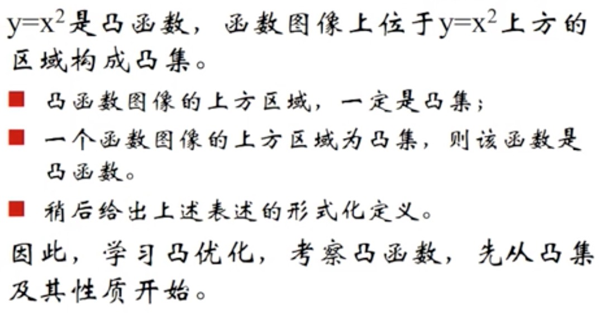

## 凸集

集合 C 内任意两点间的线段均在集合 C 内，则称集合 C 为凸集

**一些例子**

## 超平面和半空间

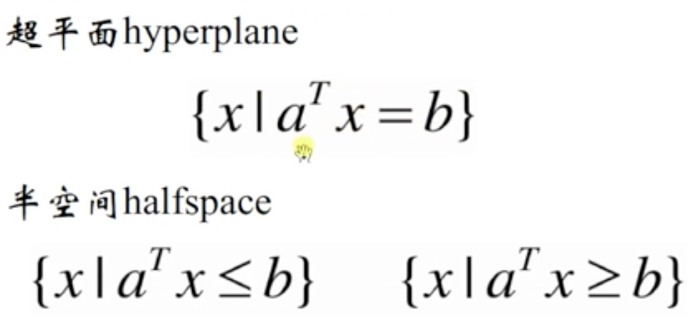

## 多面体

一个例子

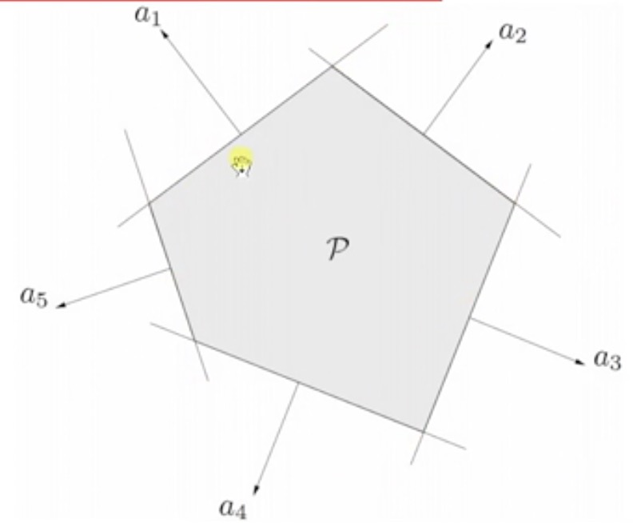

## 保持凸性的运算

**集合交运算：半空间的交**

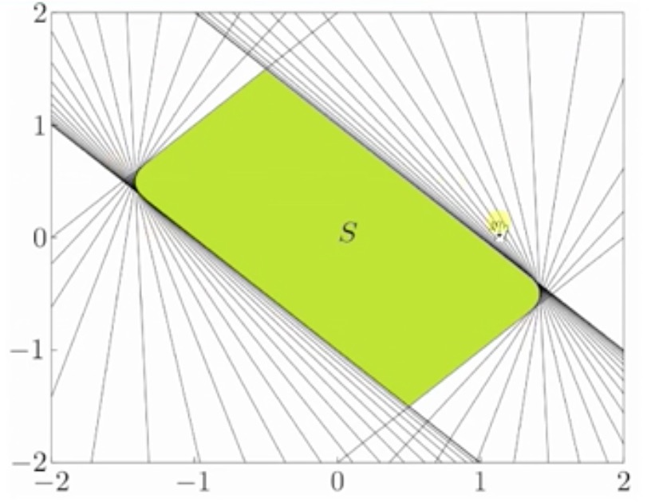

**仿射变换**

**透视变换**

凸集的透视变换仍然是凸集

**投射函数(线性分式函数)**

Ax+b - 仿射函数

## 分割超平面

一个例子

**分割超平面的构造**

## 支撑超平面

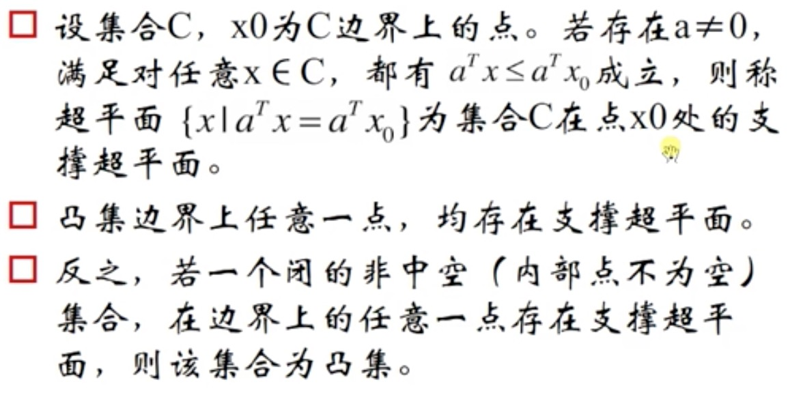

**思考**

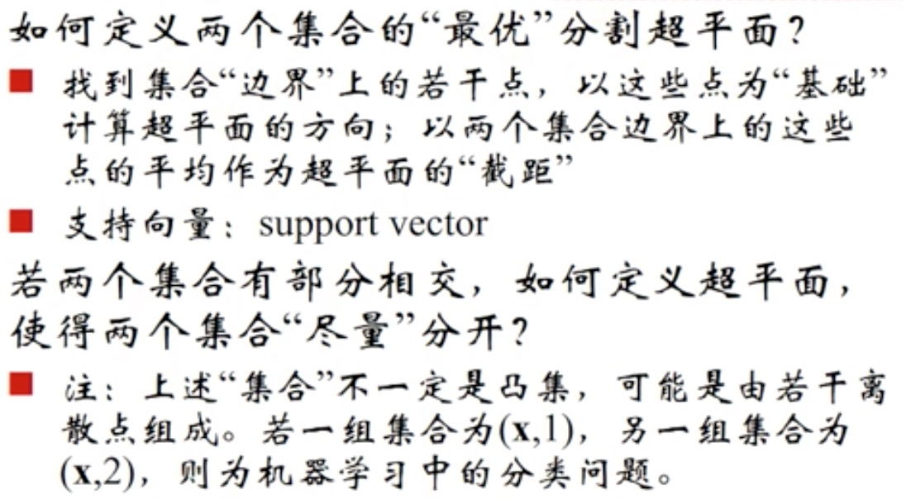

## 凸函数

### 一阶可微

即函数的增长(下降)速度要快于(慢于)以当前点的梯度为方向的直线。

**进一步思考**

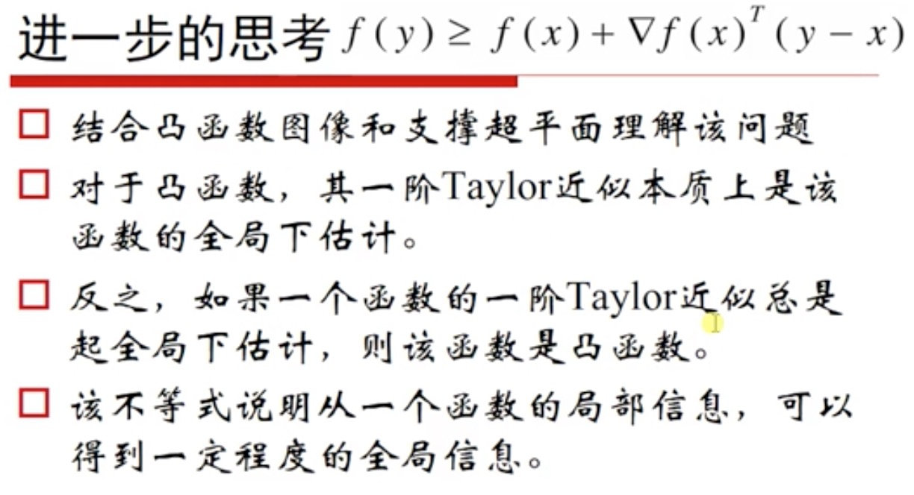

### 二阶可微

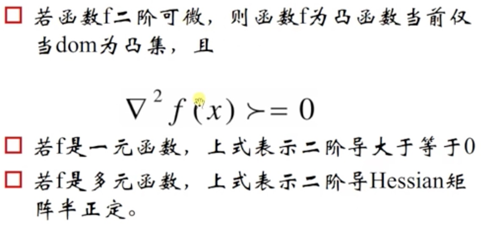

**凸函数举例**

## 上境图 epigraph

一个函数是凸函数，当且仅当其上境图是凸集(可以根据定义证明)

进一步，一个函数是凹函数，当且仅当其亚图(hypograph)是凸集

## Jensen 不等式

**若 f 是凸函数**

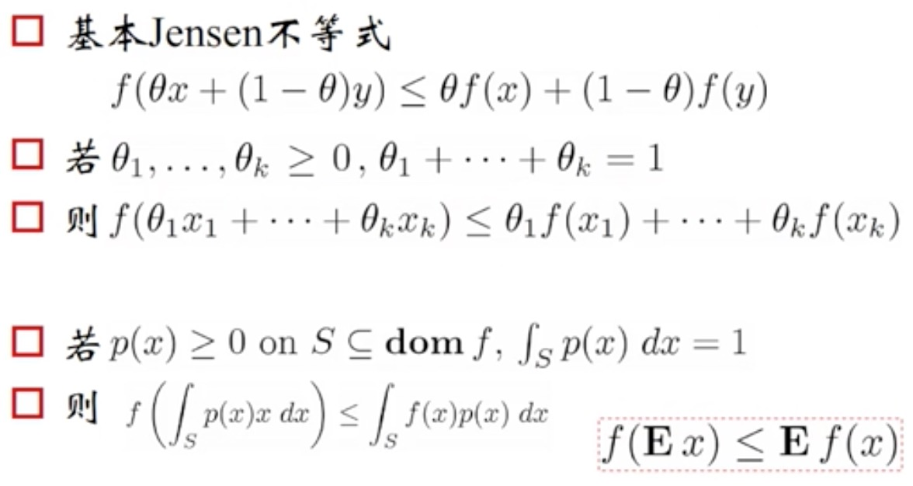

**Jensen 不等式几乎是所有不等式的基础**

## 保持函数凸性的算子

### 凸函数的逐点最大值

凸函数的逐点最大值仍然是凸函数

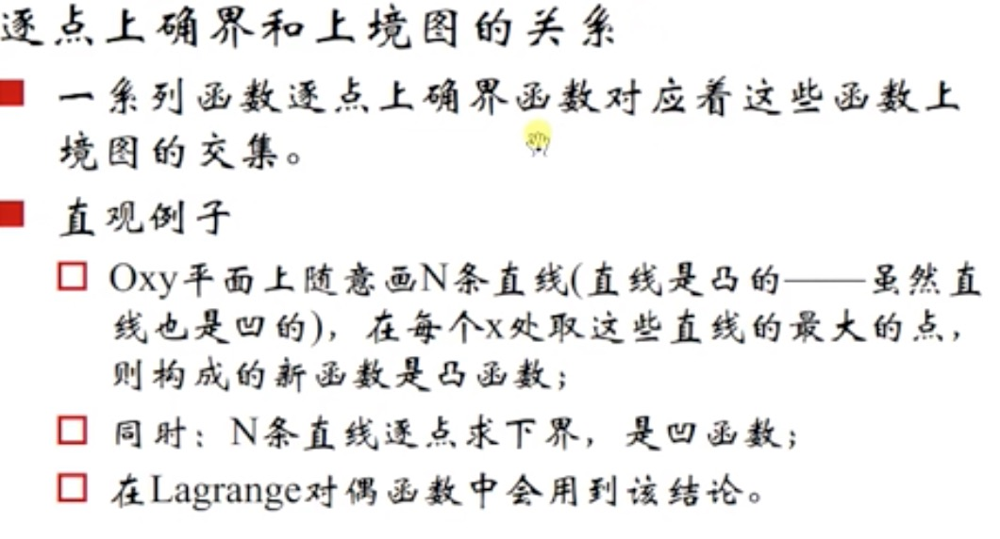

## 凸优化

优化问题的基本形式

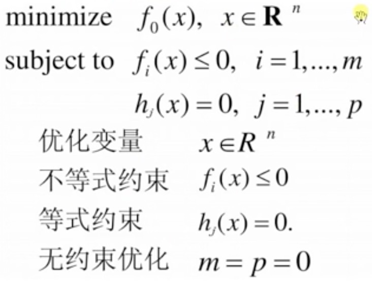

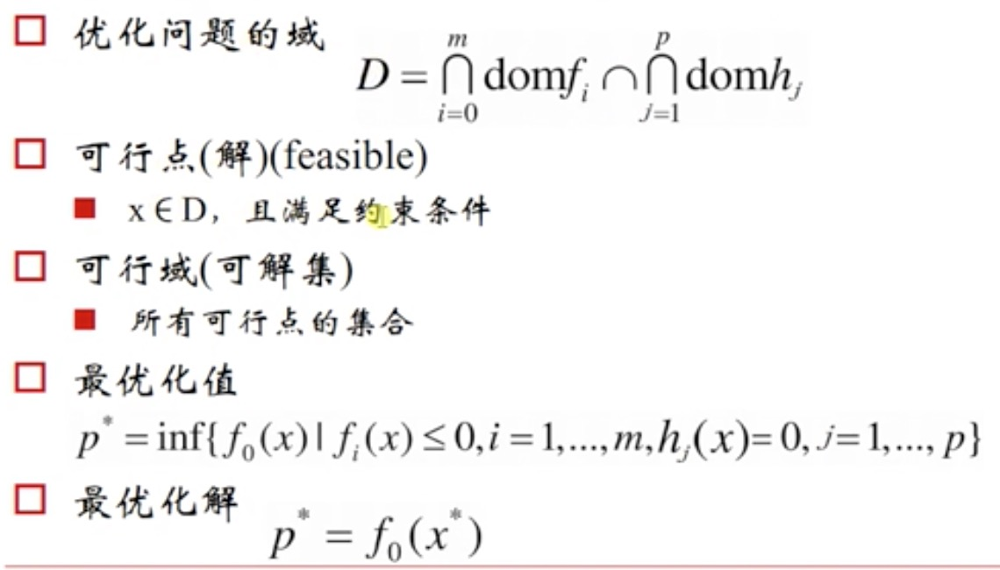

inf-下确界 sup-上确界

## 凸优化问题的基本形式

要求还是比较严格的

## 对偶问题

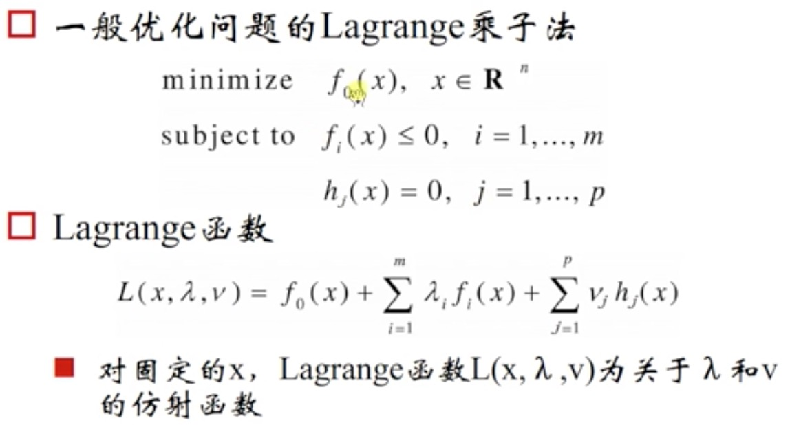

## Lagrange 对偶函数(dual function)

通过 Lagrange 方法我们可以把一个一般的优化问题转换成凸优化问题

左侧为原函数，右侧为对偶函数

左侧的虚线函数是约束条件

## 鞍点解释

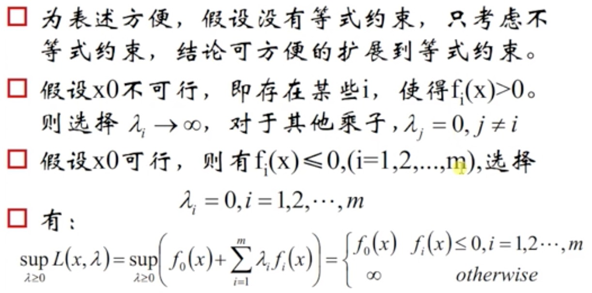

不可行即不满足约束条件 fi(x) <= 0

## 鞍点：最优点

## 例子：线性方程的最小二乘问题

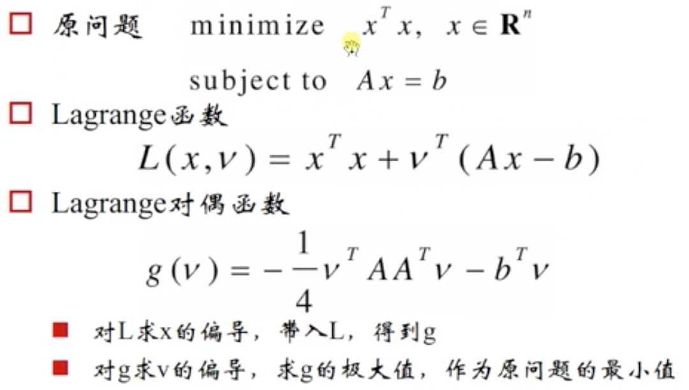

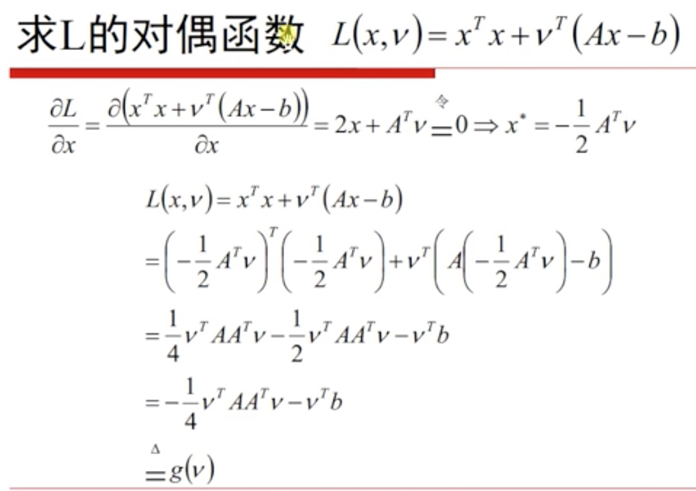

先对 x 求偏导，令其为 0，得到 x 和 v 的关系，然后把用 v 来表示的 `x*` 带入 L 中，即得到 g，也就是对偶函数。

然后再求对偶函数的极大值，g 关于 v 求导数，令其为零，求得 v，然后把 v 的表达式代入 `x*`，就得到了最优解

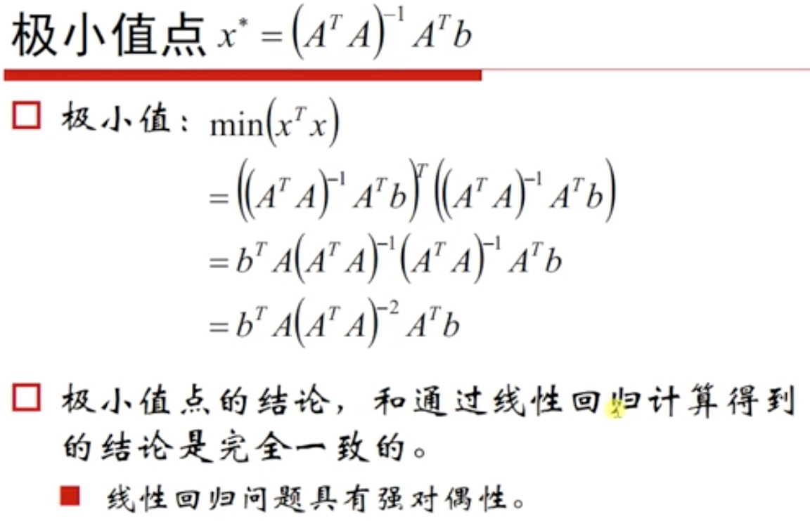

## 强对偶条件

这里 hi(x) = 0, fi(x) <= 0

为了取等号，fi(x) 和 hi(x) 都需要等于 0

