# HMM 最佳学习范例

## 一 介绍（Introduction）

我们通常都习惯寻找一个事物在一段时间里的变化模式（规律）。这些模式发生在很多领域，比如计算机中的指令序列，句子中的词语顺序和口语单词中的音素序列等等，事实上任何领域中的一系列事件都有可能产生有用的模式。

考虑一个简单的例子，有人试图通过一片海藻推断天气——民间传说告诉我们‘湿透的’海藻意味着潮湿阴雨，而‘干燥的’海藻则意味着阳光灿烂。如果它处于一个中间状态（‘有湿气’），我们就无法确定天气如何。然而，天气的状态并没有受限于海藻的状态，所以我们可以在观察的基础上预测天气是雨天或晴天的可能性。另一个有用的线索是前一天的天气状态（或者，至少是它的可能状态）——通过综合昨天的天气及相应观察到的海藻状态，我们有可能更好的预测今天的天气。

这是本教程中我们将考虑的一个典型的系统类型。

首先，我们将介绍产生概率模式的系统，如晴天及雨天间的天气波动。

然后，我们将会看到这样一个系统，我们希望预测的状态并不是观察到的——其底层系统是隐藏的。在上面的例子中，观察到的序列将是海藻而隐藏的系统将是实际的天气。

最后，我们会利用已经建立的模型解决一些实际的问题。对于上述例子，我们想知道：

1. 给出一个星期每天的海藻观察状态，之后的天气将会是什么?
2. 给定一个海藻的观察状态序列，预测一下此时是冬季还是夏季？直观地，如果一段时间内海藻都是干燥的，那么这段时间很可能是夏季，反之，如果一段时间内海藻都是潮湿的，那么这段时间可能是冬季。

## 二 生成模式（Generating Patterns）

### 1、确定性模式（Deterministic Patterns）

考虑一套交通信号灯，灯的颜色变化序列依次是红色-红色/黄色-绿色-黄色-红色。这个序列可以作为一个状态机器，交通信号灯的不同状态都紧跟着上一个状态。


注意每一个状态都是唯一的依赖于前一个状态，所以，如果交通灯为绿色，那么下一个颜色状态将始终是黄色——也就是说，该系统是确定性的。确定性系统相对比较容易理解和分析，因为状态间的转移是完全已知的。

### 2、非确定性模式（Non-deterministic patterns）

为了使天气那个例子更符合实际，加入第三个状态——多云。与交通信号灯例子不同，我们并不期望这三个天气状态之间的变化是确定性的，但是我们依然希望对这个系统建模以便生成一个天气变化模式（规律）。

一种做法是假设模型的当前状态仅仅依赖于前面的几个状态，这被称为马尔科夫假设，它极大地简化了问题。显然，这可能是一种粗糙的假设，并且因此可能将一些非常重要的信息丢失。

当考虑天气问题时，马尔科夫假设假定今天的天气只能通过过去几天已知的天气情况进行预测——而对于其他因素，譬如风力、气压等则没有考虑。在这个例子以及其他相似的例子中，这样的假设显然是不现实的。然而，由于这样经过简化的系统可以用来分析，我们常常接受这样的知识假设，虽然它产生的某些信息不完全准确。

  

一个马尔科夫过程是状态间的转移仅依赖于前n个状态的过程。这个过程被称之为n阶马尔科夫模型，其中n是影响下一个状态选择的（前）n个状态。最简单的马尔科夫过程是一阶模型，它的状态选择仅与前一个状态有关。这里要注意它与确定性系统并不相同，因为下一个状态的选择由相应的概率决定，并不是确定性的。

下图是天气例子中状态间所有可能的一阶状态转移情况：


对于有 M 个状态的一阶马尔科夫模型，共有 $M^2$ 个状态转移，因为任何一个状态都有可能是所有状态的下一个转移状态。每一个状态转移都有一个概率值，称为状态转移概率——这是从一个状态转移到另一个状态的概率。所有的 $M^2$ 个概率可以用一个状态转移矩阵表示。注意这些概率并不随时间变化而不同——这是一个非常重要（但常常不符合实际）的假设。

下面的状态转移矩阵显示的是天气例子中可能的状态转移概率：


也就是说，如果昨天是晴天，那么今天是晴天的概率为0.5，是多云的概率为0.375。注意，每一行的概率之和为1。

要初始化这样一个系统，我们需要确定起始日天气的（或可能的）情况，定义其为一个初始概率向量，称为pi向量。

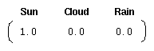

也就是说，第一天为晴天的概率为1。

现在我们定义一个一阶马尔科夫过程如下：

+ 状态：三个状态——晴天，多云，雨天。
+ pi向量：定义系统初始化时每一个状态的概率。
+ 状态转移矩阵：给定前一天天气情况下的当前天气概率。

任何一个可以用这种方式描述的系统都是一个马尔科夫过程。

### 3、总结

我们尝试识别时间变化中的模式，并且为了达到这个目我们试图对这个过程建模以便产生这样的模式。我们使用了离散时间点、离散状态以及做了马尔科夫假设。在采用了这些假设之后，系统产生了这个被描述为马尔科夫过程的模式，它包含了一个pi向量（初始概率）和一个状态转移矩阵。关于假设，重要的一点是状态转移矩阵并不随时间的改变而改变——这个矩阵在整个系统的生命周期中是固定不变的。

## 三、隐藏模式（Hidden Patterns）

### 1、马尔科夫过程的局限性

在某些情况下，我们希望找到的模式用马尔科夫过程描述还显得不充分。回顾一下天气那个例子，一个隐士也许不能够直接获取到天气的观察情况，但是他有一些水藻。民间传说告诉我们水藻的状态与天气状态有一定的概率关系——天气和水藻的状态是紧密相关的。在这个例子中我们有两组状态，观察的状态（水藻的状态）和隐藏的状态（天气的状态）。我们希望为隐士设计一种算法，在不能够直接观察天气的情况下，通过水藻和马尔科夫假设来预测天气。

一个更实际的问题是语音识别，我们听到的声音是来自于声带、喉咙大小、舌头位置以及其他一些东西的组合结果。所有这些因素相互作用产生一个单词的声音，一套语音识别系统检测的声音就是来自于个人发音时身体内部物理变化所引起的不断改变的声音。

一些语音识别装置工作的原理是将内部的语音产出看作是隐藏的状态，而将声音结果作为一系列观察的状态，这些由语音过程生成并且最好的近似了实际（隐藏）的状态。在这两个例子中，需要着重指出的是，隐藏状态的数目与观察状态的数目可以是不同的。一个包含三个状态的天气系统（晴天、多云、雨天）中，可以观察到4个等级的海藻湿润情况（干、稍干、潮湿、湿润）；纯粹的语音可以由80个音素描述，而身体的发音系统会产生出不同数目的声音，或者比80多，或者比80少。

在这种情况下，观察到的状态序列与隐藏过程有一定的概率关系。我们使用隐马尔科夫模型对这样的过程建模，这个模型包含了一个底层隐藏的随时间改变的马尔科夫过程，以及一个与隐藏状态某种程度相关的可观察到的状态集合。

### 2、隐马尔科夫模型（Hidden Markov Models）

下图显示的是天气例子中的隐藏状态和观察状态。假设隐藏状态（实际的天气）由一个简单的一阶马尔科夫过程描述，那么它们之间都相互连接。


　　
隐藏状态和观察状态之间的连接表示：在给定的马尔科夫过程中，一个特定的隐藏状态生成特定的观察状态的概率。这很清晰的表示了‘进入’一个观察状态的所有概率之和为1，在上面这个例子中就是Pr(Obs|Sun), Pr(Obs|Cloud) 及 Pr(Obs|Rain)之和。这里 Obs 指的是观察到的数据

除了定义了马尔科夫过程的概率关系，我们还有另一个矩阵，定义为混淆矩阵（confusion matrix），它包含了给定一个隐藏状态后得到的观察状态的概率。对于天气例子，混淆矩阵是：


注意矩阵的每一行之和是1

### 3、总结（Summary）

我们已经看到在一些过程中一个观察序列与一个底层马尔科夫过程是概率相关的。在这些例子中，观察状态的数目可以和隐藏状态的数码不同。

我们使用一个隐马尔科夫模型（HMM）对这些例子建模。这个模型包含两组状态集合和三组概率集合：

+ 隐藏状态：一个系统的（真实）状态，可以由一个马尔科夫过程进行描述（例如，天气）。
+ 观察状态：在这个过程中‘可视’的状态（例如，海藻的湿度）。
+ pi向量：包含了（隐）模型在时间t=1时一个特殊的隐藏状态的概率（初始概率）。
+ 状态转移矩阵：包含了一个隐藏状态到另一个隐藏状态的概率
+ 混淆矩阵：包含了给定隐马尔科夫模型的某一个特殊的隐藏状态，观察到的某个观察状态的概率。

因此一个隐马尔科夫模型是在一个标准的马尔科夫过程中引入一组观察状态，以及其与隐藏状态间的一些概率关系。

## 四、隐马尔科夫模型（Hidden Markov Models）

### 1、定义（Definition of a hidden Markov model）

一个隐马尔科夫模型是一个三元组$(\Pi, A, B)$。

+ $\Pi=(\pi_i)$：初始化概率向量；
+ $A=(a_{ij})$：状态转移矩阵；$Pr(x_{i_t} | x_{j_{t-1}})$
+ $B=(b_{ij})$：混淆矩阵；$Pr(y_i | x_j)$

在状态转移矩阵及混淆矩阵中的每一个概率都是时间无关的——也就是说，当系统演化时这些矩阵并不随时间改变。实际上，这是马尔科夫模型关于真实世界最不现实的一个假设。

### 2、应用（Uses associated with HMMs）

一旦一个系统可以作为HMM被描述，就可以用来解决三个基本问题。其中前两个是模式识别的问题：给定HMM求一个观察序列的概率（评估）；搜索最有可能生成一个观察序列的隐藏状态序列（解码）。第三个问题是给定观察序列生成一个HMM（学习）。

#### a) 评估（Evaluation）

考虑这样的问题，我们有一些描述不同系统的隐马尔科夫模型（也就是一些$(\Pi, A, B)$三元组的集合）及一个观察序列。我们想知道哪一个HMM最有可能产生了这个给定的观察序列。例如，对于海藻来说，我们也许会有一个“夏季”模型和一个“冬季”模型，因为不同季节之间的情况是不同的——我们也许想根据海藻湿度的观察序列来确定当前的季节。

我们使用前向算法（forward algorithm）来计算给定隐马尔科夫模型（HMM）后的一个观察序列的概率，并因此选择最合适的隐马尔科夫模型(HMM)。

在语音识别中这种类型的问题发生在当一大堆数目的马尔科夫模型被使用，并且每一个模型都对一个特殊的单词进行建模时。一个观察序列从一个发音单词中形成，并且通过寻找对于此观察序列最有可能的隐马尔科夫模型（HMM）识别这个单词。

#### b) 解码（Decoding）

给定观察序列搜索最可能的隐藏状态序列。

另一个相关问题，也是最感兴趣的一个，就是搜索生成输出序列的隐藏状态序列。在许多情况下我们对于模型中的隐藏状态更感兴趣，因为它们代表了一些更有价值的东西，而这些东西通常不能直接观察到。

考虑海藻和天气这个例子，一个盲人隐士只能感觉到海藻的状态，但是他更想知道天气的情况，天气状态在这里就是隐藏状态。

我们使用Viterbi 算法（Viterbi algorithm）确定（搜索）已知观察序列及HMM下最可能的隐藏状态序列。

Viterbi算法（Viterbi algorithm）的另一广泛应用是自然语言处理中的词性标注。在词性标注中，句子中的单词是观察状态，词性（语法类别）是隐藏状态（注意对于许多单词，如wind，fish拥有不止一个词性）。对于每句话中的单词，通过搜索其最可能的隐藏状态，我们就可以在给定的上下文中找到每个单词最可能的词性标注。

#### c）学习（Learning）

根据观察序列生成隐马尔科夫模型。

第三个问题，也是与HMM相关的问题中最难的，根据一个观察序列（来自于已知的集合），以及与其有关的一个隐藏状态集，估计一个最合适的隐马尔科夫模型（HMM），也就是确定对已知序列描述的最合适的$(\Pi, A, B)$三元组。

当矩阵A和B不能够直接被（估计）测量时，前向-后向算法（forward-backward algorithm）被用来进行学习（参数估计），这也是实际应用中常见的情况。

### 3、总结（Summary）

由一个向量和两个矩阵$(\Pi, A, B)$描述的隐马尔科夫模型对于实际系统有着巨大的价值，虽然经常只是一种近似，但它们却是经得起分析的。隐马尔科夫模型通常解决的问题包括：

1. 对于一个观察序列匹配最可能的系统——评估，使用前向算法（forward algorithm）解决；
2. 对于已生成的一个观察序列，确定最可能的隐藏状态序列——解码，使用Viterbi 算法（Viterbi algorithm）解决；
3. 对于已生成的观察序列，决定最可能的模型参数——学习，使用前向-后向算法（forward-backward algorithm）解决。

## 五、前向算法（Forward Algorithm）

计算观察序列的概率（Finding the probability of an observed sequence）

### 1、穷举搜索（ Exhaustive search for solution）

给定隐马尔科夫模型，也就是在模型参数$(\Pi, A, B)$已知的情况下，我们想找到观察序列的概率。还是考虑天气这个例子，我们有一个用来描述天气及与它密切相关的海藻湿度状态的隐马尔科夫模型(HMM)，另外我们还有一个海藻的湿度状态观察序列。假设连续3天海藻湿度的观察结果是（干燥、湿润、湿透）——而这三天每一天都可能是晴天、多云或下雨，对于观察序列以及隐藏的状态，可以将其视为网格：

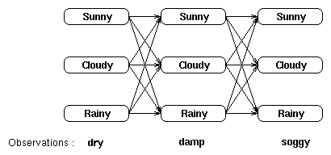

网格中的每一列都显示了可能的的天气状态，并且每一列中的每个状态都与相邻列中的每一个状态相连。而其状态间的转移都由状态转移矩阵提供一个概率。在每一列下面都是某个时间点上的观察状态，给定任一个隐藏状态所得到的观察状态的概率由混淆矩阵提供。

可以看出，一种计算观察序列概率的方法是找到每一个可能的隐藏状态，并且将这些隐藏状态下的观察序列概率相加。对于上面那个（天气）例子，将有3^3 = 27种不同的天气序列可能性，因此，观察序列的概率是：

Pr(dry,damp,soggy | HMM) = Pr(dry,damp,soggy | sunny,sunny,sunny) + Pr(dry,damp,soggy | sunny,sunny ,cloudy) + Pr(dry,damp,soggy | sunny,sunny ,rainy) + . . . . Pr(dry,damp,soggy | rainy,rainy ,rainy)

用这种方式计算观察序列概率极为昂贵，特别对于大的模型或较长的序列，因此我们可以利用这些概率的时间不变性来减少问题的复杂度。

### 2、使用递归降低问题复杂度

给定一个隐马尔科夫模型（HMM），我们将考虑递归地计算一个观察序列的概率。我们首先定义局部概率（partial probability）,它是到达网格中的某个中间状态时的概率。然后，我们将介绍如何在t=1和t=n(>1)时计算这些局部概率。

假设一个T-长观察序列是：

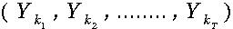

#### 2a.局部概率(alpha‘s)

考虑下面这个网格，它显示的是天气状态及对于观察序列干燥，湿润及湿透的一阶状态转移情况：


我们可以将计算到达网格中某个中间状态的概率作为所有到达这个状态的可能路径的概率求和问题。

例如，t=2时位于“多云”状态的局部概率通过如下路径计算得出：


我们定义t时刻位于状态j的局部概率为at(j)——这个局部概率计算如下：
　　
$$\alpha_t(j)= Pr( 观察状态\;|\;隐藏状态_j ) \times Pr(t时刻所有指向j状态的路径）$$

对于最后的观察状态，其局部概率包括了通过所有可能的路径到达这些状态的概率——例如，对于上述网格，最终的局部概率通过如下路径计算得出：

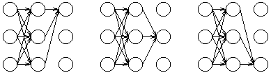

由此可见，对于这些最终局部概率求和等价于对于网格中所有可能的路径概率求和，也就求出了给定隐马尔科夫模型(HMM)后的观察序列概率。

第3节给出了一个计算这些概率的动态示例。

#### 2b.计算t=1时的局部概率alpha‘s

我们按如下公式计算局部概率：

$$\alpha_t(j)= Pr( 观察状态\;|\;隐藏状态_j ) \times Pr(t时刻所有指向j状态的路径）$$

特别当t=1时，没有任何指向当前状态的路径。故t=1时位于当前状态的概率是初始概率，即Pr(state|t=1)=P(state)，因此，t=1时的局部概率等于当前状态的初始概率乘以相关的观察概率：

$$\alpha_1(j)=\pi(j)·b_{jk_i}$$

所以初始时刻状态j的局部概率依赖于此状态的初始概率及相应时刻我们所见的观察概率。

#### 2c.计算t>1时的局部概率alpha‘s

我们再次回顾局部概率的计算公式如下：

$$\alpha_t(j)= Pr( 观察状态\;|\;隐藏状态_j ) \times Pr(t时刻所有指向j状态的路径）$$

我们可以假设（递归地），乘号左边项“Pr( 观察状态 | 隐藏状态j )”已经有了，现在考虑其右边项“Pr(t时刻所有指向j状态的路径）”。

为了计算到达某个状态的所有路径的概率，我们可以计算到达此状态的每条路径的概率并对它们求和，例如：


计算alpha所需要的路径数目随着观察序列的增加而指数级递增，但是t-1时刻alpha‘s给出了所有到达此状态的前一路径概率，因此，我们可以通过t-1时刻的局部概率定义t时刻的alpha‘s，即：

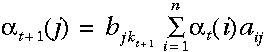

故我们所计算的这个概率等于相应的观察概率（亦即，t+1时在状态j所观察到的符号的概率）与该时刻到达此状态的概率总和——这来自于上一步每一个局部概率的计算结果与相应的状态转移概率乘积后再相加——的乘积。

注意我们已经有了一个仅利用t时刻局部概率计算t+1时刻局部概率的表达式。

现在我们就可以递归地计算给定隐马尔科夫模型(HMM)后一个观察序列的概率了——即通过t=1时刻的局部概率alpha‘s计算t=2时刻的alpha‘s，通过t=2时刻的alpha‘s计算t=3时刻的alpha‘s等等直到t=T。给定隐马尔科夫模型(HMM)的观察序列的概率就等于t=T时刻的局部概率之和。

#### 2d.降低计算复杂度

我们可以比较通过穷举搜索（评估）和通过递归前向算法计算观察序列概率的时间复杂度。

我们有一个长度为T的观察序列O以及一个含有n个隐藏状态的隐马尔科夫模型l=(pi,A,B)。

穷举搜索将包括计算所有可能的序列：
　　　


公式

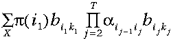

对我们所观察到的概率求和——注意其复杂度与T成指数级关系。相反的，使用前向算法我们可以利用上一步计算的信息，相应地，其时间复杂度与T成线性关系。

注：穷举搜索的时间复杂度是2TN^T，前向算法的时间复杂度是N^2T，其中T指的是观察序列长度，N指的是隐藏状态数目。

### 3.总结

我们的目标是计算给定隐马尔科夫模型HMM下的观察序列的概率——Pr(observations |lamda)。

我们首先通过计算局部概率（alpha‘s）降低计算整个概率的复杂度，局部概率表示的是t时刻到达某个状态s的概率。

t=1时，可以利用初始概率(来自于P向量）和观察概率Pr(observation|state)（来自于混淆矩阵）计算局部概率；而t>1时的局部概率可以利用t-时的局部概率计算。

因此，这个问题是递归定义的，观察序列的概率就是通过依次计算t=1,2,…,T时的局部概率，并且对于t=T时所有局部概率alpha‘s相加得到的。

注意，用这种方式计算观察序列概率的时间复杂度远远小于计算所有序列的概率并对其相加（穷举搜索）的时间复杂度。

我们使用前向算法计算T长观察序列的概率:

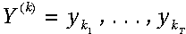

其中y的每一个是观察集合之一。局部（中间）概率(alpha‘s)是递归计算的，首先通过计算t=1时刻所有状态的局部概率alpha：


然后在每个时间点，t=2，… ，T时，对于每个状态的局部概率，由下式计算局部概率alpha:

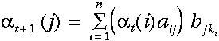

也就是当前状态相应的观察概率与所有到达该状态的路径概率之积，其递归地利用了上一个时间点已经计算好的一些值。

最后，给定HMM,lamda,观察序列的概率等于T时刻所有局部概率之和：


再重复说明一下，每一个局部概率（t > 2 时）都由前一时刻的结果计算得出。

对于“天气”那个例子，下面的图表显示了t = 2为状态为多云时局部概率alpha的计算过程。这是相应的观察概率b与前一时刻的局部概率与状态转移概率a相乘后的总和再求积的结果：

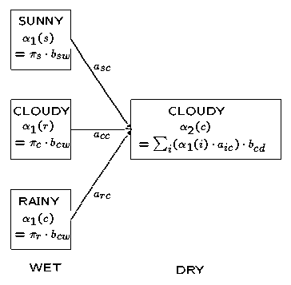

（注：本图及维特比算法4中的相似图存在问题，具体请见文后评论，非常感谢读者YaseenTA的指正）Rainy状态 α1( r )= πr *brw 就是括号里面(r)还有cw应该是rw。Cloudy 应该是α1( c )= 而不是 α1( r )=

### 总结（Summary）

我们使用前向算法来计算给定隐马尔科夫模型（HMM）后的一个观察序列的概率。它在计算中利用递归避免对网格所有路径进行穷举计算。

给定这种算法，可以直接用来确定对于已知的一个观察序列，在一些隐马尔科夫模型（HMMs）中哪一个HMM最好的描述了它——先用前向算法评估每一个（HMM），再选取其中概率最高的一个。

## 六、维特比算法（Viterbi Algorithm）

寻找最可能的隐藏状态序列(Finding most probable sequence of hidden states)

对于一个特殊的隐马尔科夫模型(HMM)及一个相应的观察序列，我们常常希望能找到生成此序列最可能的隐藏状态序列。

### 1.穷举搜索

我们使用下面这张网格图片来形象化的说明隐藏状态和观察状态之间的关系：


我们可以通过列出所有可能的隐藏状态序列并且计算对于每个组合相应的观察序列的概率来找到最可能的隐藏状态序列。最可能的隐藏状态序列是使下面这个概率最大的组合：

Pr（观察序列|隐藏状态的组合）

例如，对于网格中所显示的观察序列，最可能的隐藏状态序列是下面这些概率中最大概率所对应的那个隐藏状态序列：
　　
Pr(dry,damp,soggy | sunny,sunny,sunny), Pr(dry,damp,soggy | sunny,sunny,cloudy), Pr(dry,damp,soggy | sunny,sunny,rainy), . . . .Pr(dry,damp,soggy | rainy,rainy,rainy)

这种方法是可行的，但是通过穷举计算每一个组合的概率找到最可能的序列是极为昂贵的。与前向算法类似，我们可以利用这些概率的时间不变性来降低计算复杂度。

### 2.使用递归降低复杂度

给定一个观察序列和一个隐马尔科夫模型（HMM），我们将考虑递归地寻找最有可能的隐藏状态序列。我们首先定义局部概率delta,它是到达网格中的某个特殊的中间状态时的概率。然后，我们将介绍如何在t=1和t=n(>1)时计算这些局部概率。

这些局部概率与前向算法中所计算的局部概率是不同的，因为它们表示的是时刻t时到达某个状态最可能的路径的概率，而不是所有路径概率的总和。
　　　　
#### 2a.局部概率delta‘s和局部最佳途径

考虑下面这个网格，它显示的是天气状态及对于观察序列干燥，湿润及湿透的一阶状态转移情况：


对于网格中的每一个中间及终止状态，都有一个到达该状态的最可能路径。举例来说，在t=3时刻的3个状态中的每一个都有一个到达此状态的最可能路径，或许是这样的：


我们称这些路径局部最佳路径(partial best paths)。其中每个局部最佳路径都有一个相关联的概率，即局部概率或delta。与前向算法中的局部概率不同，delta是到达该状态（最可能）的一条路径的概率。

因而delta(i,t)是t时刻到达状态i的所有序列概率中最大的概率，而局部最佳路径是得到此最大概率的隐藏状态序列。对于每一个可能的i和t值来说，这一类概率（及局部路径）均存在。

特别地，在t=T时每一个状态都有一个局部概率和一个局部最佳路径。这样我们就可以通过选择此时刻包含最大局部概率的状态及其相应的局部最佳路径来确定全局最佳路径（最佳隐藏状态序列）。

#### 2b.计算t=1时刻的局部概率delta‘s

我们计算的局部概率delta是作为最可能到达我们当前位置的路径的概率（已知的特殊知识如观察概率及前一个状态的概率）。当t=1的时候，到达某状态的最可能路径明显是不存在的；但是，我们使用t=1时的所处状态的初始概率及相应的观察状态k1的观察概率计算局部概率delta；即


——与前向算法类似，这个结果是通过初始概率和相应的观察概率相乘得出的。

#### 2c.计算t>1时刻的局部概率delta‘s

现在我们来展示如何利用t-1时刻的局部概率delta计算t时刻的局部概率delta。

考虑如下的网格：


我们考虑计算t时刻到达状态X的最可能的路径；这条到达状态X的路径将通过t-1时刻的状态A，B或C中的某一个。

因此，最可能的到达状态X的路径将是下面这些路径的某一个

```
　　　　　　　（状态序列），…，A，X
　　　　　　　（状态序列），…，B，X
或　　　　　　（状态序列），…，C，X
```

我们想找到路径末端是AX,BX或CX并且拥有最大概率的路径。

回顾一下马尔科夫假设：给定一个状态序列，一个状态发生的概率只依赖于前n个状态。特别地，在一阶马尔可夫假设下，状态X在一个状态序列后发生的概率只取决于之前的一个状态，即

Pr (到达状态A最可能的路径) · Pr (X | A) · Pr (观察状态 | X)

与此相同，路径末端是AX的最可能的路径将是到达A的最可能路径再紧跟X。相似地，这条路径的概率将是：

Pr (到达状态A最可能的路径) · Pr (X | A) · Pr (观察状态 | X)

因此，到达状态X的最可能路径概率是：


其中第一项是t-1时刻的局部概率delta，第二项是状态转移概率以及第三项是观察概率。

泛化上述公式，就是在t时刻，观察状态是kt，到达隐藏状态i的最佳局部路径的概率是：


这里，我们假设前一个状态的知识（局部概率）是已知的，同时利用了状态转移概率和相应的观察概率之积。然后，我们就可以在其中选择最大的概率了（局部概率delta）。

#### 2d.反向指针，phi‘s

考虑下面这个网格


在每一个中间及终止状态我们都知道了局部概率，delta(i,t)。然而我们的目标是在给定一个观察序列的情况下寻找网格中最可能的隐藏状态序列——因此，我们需要一些方法来记住网格中的局部最佳路径。

回顾一下我们是如何计算局部概率的，计算t时刻的delta‘s我们仅仅需要知道t-1时刻的delta‘s。在这个局部概率计算之后，就有可能记录前一时刻哪个状态生成了delta(i,t)——也就是说，在t-1时刻系统必须处于某个状态，该状态导致了系统在t时刻到达状态i是最优的。这种记录（记忆）是通过对每一个状态赋予一个反向指针phi完成的，这个指针指向最优的引发当前状态的前一时刻的某个状态。

形式上，我们可以写成如下的公式

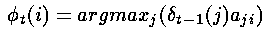

其中argmax运算符是用来计算使括号中表达式的值最大的索引j的。

请注意这个表达式是通过前一个时间步骤的局部概率delta‘s和转移概率计算的，并不包括观察概率（与计算局部概率delta‘s本身不同）。这是因为我们希望这些phi‘s能回答这个问题“如果我在这里，最可能通过哪条路径到达下一个状态？”——这个问题与隐藏状态有关，因此与观察概率有关的混淆（矩阵）因子是可以被忽略的。

#### 2e.维特比算法的优点

使用Viterbi算法对观察序列进行解码有两个重要的优点：

1. 通过使用递归减少计算复杂度——这一点和前向算法使用递归减少计算复杂度是完全类似的。
2. 维特比算法有一个非常有用的性质，就是对于观察序列的整个上下文进行了最好的解释（考虑）。事实上，寻找最可能的隐藏状态序列不止这一种方法，其他替代方法也可以，譬如，可以这样确定如下的隐藏状态序列：


其中


这里，采用了“自左向右”的决策方式进行一种近似的判断，其对于每个隐藏状态的判断是建立在前一个步骤的判断的基础之上（而第一步从隐藏状态的初始向量pi开始）。

这种做法，如果在整个观察序列的中部发生“噪音干扰”时，其最终的结果将与正确的答案严重偏离。

相反，维特比算法在确定最可能的终止状态前将考虑整个观察序列，然后通过phi指针“回溯”以确定某个隐藏状态是否是最可能的隐藏状态序列中的一员。这是非常有用的，因为这样就可以孤立序列中的“噪音”，而这些“噪音”在实时数据中是很常见的。

### 3.小结

维特比算法提供了一种有效的计算方法来分析隐马尔科夫模型的观察序列，并捕获最可能的隐藏状态序列。它利用递归减少计算量，并使用整个序列的上下文来做判断，从而对包含“噪音”的序列也能进行良好的分析。

在使用时，维特比算法对于网格中的每一个单元(cell)都计算一个局部概率，同时包括一个反向指针用来指示最可能的到达该单元的路径。当完成整个计算过程后，首先在终止时刻找到最可能的状态，然后通过反向指针回溯到t=1时刻，这样回溯路径上的状态序列就是最可能的隐藏状态序列了。

---

### 1、维特比算法的形式化定义

维特比算法可以形式化的概括为：

对于每一个i，i = 1，… ，n，令：

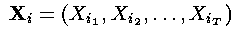

——这一步是通过隐藏状态的初始概率和相应的观察概率之积计算了t=1时刻的局部概率。

对于t=2，…，T和i=1，…，n,令：


——这样就确定了到达下一个状态的最可能路径，并对如何到达下一个状态做了记录。具体来说首先通过考察所有的转移概率与上一步获得的最大的局部概率之积，然后记录下其中最大的一个，同时也包含了上一步触发此概率的状态。

令：

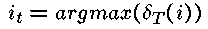

——这样就确定了系统完成时(t=T)最可能的隐藏状态。

对于t=T-1，…，1 令：

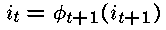

——这样就可以按最可能的状态路径在整个网格回溯。回溯完成时，对于观察序列来说，序列i1 … iT就是生成此观察序列的最可能的隐藏状态序列。

### 2.计算单独的delta‘s和phi‘s

维特比算法中的局部概率delta‘s的计算与前向算法中的局部概率alpha‘s的很相似。下面这幅图表显示了delta‘s和phi‘s的计算细节，可以对比一下前向算法3中的计算局部概率alpha‘s的那幅图表：


（注：本图及维特比算法4中的相似图存在问题，具体请见文后评论，非常感谢读者YaseenTA的指正）Rainy状态 α1( r )= πr *brw 就是括号里面(r)还有cw应该是rw。Cloudy 应该是α1( c )= 而不是 α1( r )=

唯一不同的是前向算法中计算局部概率alpha‘s时的求和符号（Sigma）在维特比算法中计算局部概率delta‘s时被替换为max——这一个重要的不同也说明了在维特比算法中我们选择的是到达当前状态的最可能路径，而不是总的概率。我们在维特比算法中维护了一个“反向指针”记录了到达当前状态的最佳路径，即在计算phi‘s时通过argmax运算符获得。

### 总结(Summary)

对于一个特定的隐马尔科夫模型，维特比算法被用来寻找生成一个观察序列的最可能的隐藏状态序列。我们利用概率的时间不变性，通过避免计算网格中每一条路径的概率来降低问题的复杂度。维特比算法对于每一个状态(t>1)都保存了一个反向指针(phi)，并在每一个状态中存储了一个局部概率(delta)。

局部概率delta是由反向指针指示的路径到达某个状态的概率。

当t=T时，维特比算法所到达的这些终止状态的局部概率delta‘s是按照最优（最可能）的路径到达该状态的概率。因此，选择其中最大的一个，并回溯找出所隐藏的状态路径，就是这个问题的最好答案。

关于维特比算法，需要着重强调的一点是它不是简单的对于某个给定的时间点选择最可能的隐藏状态，而是基于全局序列做决策——因此，如果在观察序列中有一个“非寻常”的事件发生，对于维特比算法的结果也影响不大。

这在语音处理中是特别有价值的，譬如当某个单词发音的一个中间音素出现失真或丢失的情况时，该单词也可以被识别出来。

## 七、前向-后向算法(Forward-backward algorithm)

根据观察序列生成隐马尔科夫模型(Generating a HMM from a sequence of obersvations)

与HMM模型相关的“有用”的问题是评估（前向算法）和解码（维特比算法）——它们一个被用来测量一个模型的相对适用性，另一个被用来推测模型隐藏的部分在做什么（“到底发生了”什么）。可以看出它们都依赖于隐马尔科夫模型（HMM）参数这一先验知识——状态转移矩阵，混淆（观察）矩阵，以及pi向量（初始化概率向量）。

然而，在许多实际问题的情况下这些参数都不能直接计算的，而要需要进行估计——这就是隐马尔科夫模型中的学习问题。前向-后向算法就可以以一个观察序列为基础来进行这样的估计，而这个观察序列来自于一个给定的集合，它所代表的是一个隐马尔科夫模型中的一个已知的隐藏集合。

一个例子可能是一个庞大的语音处理数据库，其底层的语音可能由一个马尔可夫过程基于已知的音素建模的，而其可以观察的部分可能由可识别的状态（可能通过一些矢量数据表示）建模的，但是没有（直接）的方式来获取隐马尔科夫模型（HMM）参数。

前向-后向算法并非特别难以理解，但自然地比前向算法和维特比算法更复杂。由于这个原因，这里就不详细讲解前向-后向算法了（任何有关HMM模型的参考文献都会提供这方面的资料的）。

总之，前向-后向算法首先对于隐马尔科夫模型的参数进行一个初始的估计（这很可能是完全错误的），然后通过对于给定的数据评估这些参数的的价值并减少它们所引起的错误来重新修订这些HMM参数。从这个意义上讲，它是以一种梯度下降的形式寻找一种错误测度的最小值。

之所以称其为前向-后向算法，主要是因为对于网格中的每一个状态，它既计算到达此状态的“前向”概率（给定当前模型的近似估计），又计算生成此模型最终状态的“后向”概率（给定当前模型的近似估计）。 这些都可以通过利用递归进行有利地计算，就像我们已经看到的。可以通过利用近似的HMM模型参数来提高这些中间概率进行调整，而这些调整又形成了前向-后向算法迭代的基础。

