# 机器学习中的重要概念

这里主要包括机器学习中的一些基本方法和概念的介绍。

<!-- MarkdownTOC -->

- 判别模型、生成模型与朴素贝叶斯方法
  - 高斯判别分析(Gaussian dicriminant analysis)
  - 朴素贝叶斯模型
  - 拉普拉斯平滑
- 回归算法与分类算法
  - 线性回归(Linear Regression)
  - Logistic 回归（拓展到一般回归）
  - 问题引入
  - 学习过程
  - 线性回归
  - 梯度下降法
  - 最小二乘法
  - 选用误差函数为平方和的概率解释
  - 带权重的线性回归
  - 分类和logistic回归
  - 牛顿法来解最大似然估计
  - 一般线性模型
  - Softmax回归
- K-Means(K 均值算法)
- 混合高斯模型(Mixtures of Gaussians)
- The EM Algorithm
  - Jenson
  - EM 算法
  - 重新审视混合高斯模型
  - 总结
- PCA 主成分分析
  - PCA 计算过程
  - PCA 理论基础
    - 最大方差理论
  - 总结与讨论
- 10折交叉验证
- 极大似然估计
- 熵
- 后验概率
- 集成方法
- SVD(singular value decomposition) 奇异值分解
- SVM(Support Vector Machines) 支持向量机：
- 决策树
- K-近邻算法（KNN）
- 树回归

<!-- /MarkdownTOC -->

## 判别模型、生成模型与朴素贝叶斯方法

回归模型是判别模型，也就是根据特征值来求结果的概率。形式化表示为p(y|x;theta)，在参数 theta 确定的情况下，求解条件概率 p(y|x)。通俗的解释为在给定特征后预测结果出现的概率。

比如说要确定一只羊是山羊还是绵羊，用判别模型的方法是先从历史数据中学习到模型，然后通过提取这只羊的特征来预测出这只羊是山羊的概率，是绵羊的概率。换一种思路，我们可以根据山羊的特征首先学习出一个山羊模型，然后根据绵羊的特征学习出一个绵羊模型。然后从这只羊中提取特征，放到山羊模型中看概率是多少，再放到绵羊模型中看概率是多少，哪个大就是哪个。形式化表示为求p(x|y)（也包括p(y))，y是模型结果，x是特征。

利用贝叶斯公式发现两个模型的统一性：

由于我们关注的是y的离散值结果中哪个概率大（比如山羊概率和绵羊概率哪个大），而并不是关心具体的概率，因此上式改写为：

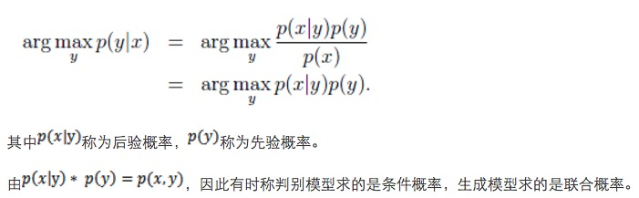

常见的判别模型有线性回归、对数回归、线性判别分析、支持向量机、boosting、条件随机场、神经网络等。

常见的生产模型有隐马尔科夫模型、朴素贝叶斯模型、高斯混合模型、LDA、Restricted Boltzmann Machine等。

### 高斯判别分析(Gaussian dicriminant analysis)

1）多值正态分布

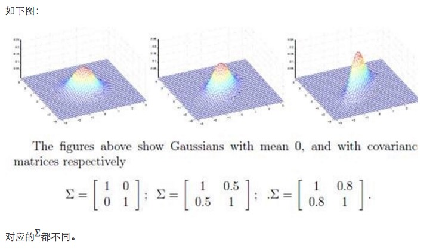

2）模型分析与应用

如果输入特征x是连续型随机变量，那么可以使用高斯判别分析模型来确定p(x|y)。

模型如下：

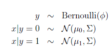

输出结果服从伯努利分布，在给定模型下特征符合多值高斯分布。通俗地讲，在山羊模型下，它的胡须长度，角大小，毛长度等连续型变量符合高斯分布，他们组成的特征向量符合多值高斯分布。

这样，可以给出概率密度函数：

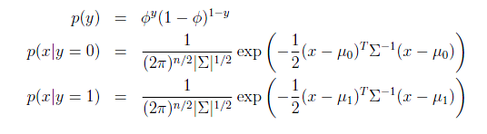

最大似然估计如下：

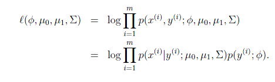

注意这里的参数有两个`u`(mu)，表示在不同的结果模型下，特征均值不同，但我们假设协方差相同。反映在图上就是不同模型中心位置不同，但形状相同。这样就可以用直线来进行分隔判别。

求导后，得到参数估计公式：

如前面所述，在图上表示为：

直线两边的y值不同，但协方差矩阵相同，因此形状相同。`u`(mu) 不同，因此位置不同。

3）高斯判别分析（GDA）与logistic回归的关系

将GDA用条件概率方式来表述的话，如下：

这个形式就是logistic回归的形式。

也就是说如果p(x|y)符合多元高斯分布，那么p(y|x)符合logistic回归模型。反之，不成立。为什么反过来不成立呢？因为GDA有着更强的假设条件和约束。

如果认定训练数据满足多元高斯分布，那么GDA能够在训练集上是最好的模型。然而，我们往往事先不知道训练数据满足什么样的分布，不能做很强的假设。Logistic回归的条件假设要弱于GDA，因此更多的时候采用logistic回归的方法。

这个时候如果采用GDA，那么效果会比较差，因为训练数据特征的分布不是多元高斯分布，而是泊松分布。

这也是logistic回归用的更多的原因。

### 朴素贝叶斯模型

在GDA中，我们要求特征向量x是连续实数向量。如果x是离散值的话，可以考虑采用朴素贝叶斯的分类方法。

假如要分类垃圾邮件和正常邮件。分类邮件是文本分类的一种应用。

假设采用最简单的特征描述方法，首先找一部英语词典，将里面的单词全部列出来。然后将每封邮件表示成一个向量，向量中每一维都是字典中的一个词的0/1值，1表示该词在邮件中出现，0表示未出现。

比如一封邮件中出现了“a”和“buy”，没有出现“aardvark”、“aardwolf”和“zygmurgy”，那么可以形式化表示为：

假设字典中总共有5000个词，那么x是5000维的。这时候如果要建立多项式分布模型（二项分布的扩展）。

多项式分布（multinomial distribution）

某随机实验如果有k个可能结局A1，A2，…，Ak，它们的概率分布分别是p1，p2，…，pk，那么在N次采样的总结果中，A1出现n1次，A2出现n2次，…，Ak出现nk次的这种事件的出现概率P有下面公式：（Xi代表出现ni次）

对应到上面的问题上来，把每封邮件当做一次随机试验，那么结果的可能性有 2^5000 种。意味着pi有2^5000个，参数太多，不可能用来建模。

换种思路，我们要求的是p(y|x)，根据生成模型定义我们可以求p(x|y)和p(y)。假设x中的特征是条件独立的。这个称作朴素贝叶斯假设。如果一封邮件是垃圾邮件（y=1），且这封邮件出现词“buy”与这封邮件是否出现“price”无关，那么“buy”和“price”之间是条件独立的。

形式化表示为，（如果给定Z的情况下，X和Y条件独立）

这个与NLP中的n元语法模型有点类似，这里相当于unigram。

这里我们发现朴素贝叶斯假设是约束性很强的假设，“buy”从通常上讲与“price”是有关系，我们这里假设的是条件独立。（注意条件独立和独立是不一样的）

建立形式化的模型表示：

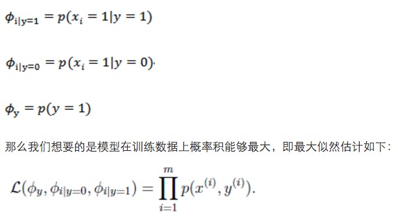

注意这里是联合概率分布积最大，说明朴素贝叶斯是生成模型。

求解得：

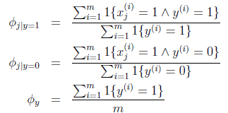

最后一个式子是表示y=1的样本数占全部样本数的比例，前两个表示在y=1或0的样本中，特征Xj=1的比例。

然而我们要求的是

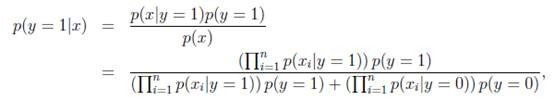

实际是求出分子即可，分母对y=1和y=0都一样。

当然，朴素贝叶斯方法可以扩展到x和y都有多个离散值的情况。对于特征是连续值的情况，我们也可以采用分段的方法来将连续值转化为离散值。具体怎么转化能够最优，我们可以采用信息增益的度量方法来确定（参见Mitchell的《机器学习》决策树那一章）。

比如房子大小可以如下划分成离散值：

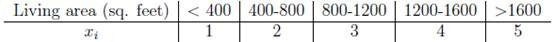

---

+ 优点：在数据较少的情况下仍然有效，可以处理多类别问题。
+ 缺点：对于输入数据的准备方式较为敏感。
+ 适用的数据类型：标称型数据。
+ 算法类型：分类算法

简述：朴素贝叶斯是贝叶斯理论的一部分，贝叶斯决策理论的核心思想，即选择具有高概率的决策。朴素贝叶斯之所以冠以朴素开头，是因为其在贝叶斯理论的基础上做出了两点假设：

1. 每个特征之间相互独立。
2. 每个特征同等重要。

贝叶斯准则是构建在条件概率的基础之上的，其公式如下：

P(H|X）=P(X|H)P(H)/P(X)

ps：P(H|X）是根据X参数值判断其属于类别H的概率，称为后验概率。P(H)是直接判断某个样本属于H的概率，称为先验概率。P(X|H)是在类别H中观测到X的概率（后验概率），P(X)是在数据库中观测到X的概率。可见贝叶斯准则是基于条件概率并且和观测到样本的先验概率和后验概率是分不开的。

总结：对于分类而言，使用概率有事要比使用硬规则更为有效。贝叶斯概率及贝叶斯准则提供了一种利用已知值来估计未知概率的有效方法。可以通过特征之间的条件独立性假设，降低对数据量的需求。尽管条件独立性的假设并不正确，但是朴素贝叶斯仍然是一种有效的分类器。

### 拉普拉斯平滑

朴素贝叶斯方法有个致命的缺点就是对数据稀疏问题过于敏感。

比如前面提到的邮件分类，现在新来了一封邮件，邮件标题是“NIPS call for papers”。我们使用更大的网络词典（词的数目由5000变为35000）来分类，假设NIPS这个词在字典中的位置是35000。然而NIPS这个词没有在训练数据中出现过，这封邮件第一次出现了NIPS。那我们算概率的时候如下：

由于NIPS在以前的不管是垃圾邮件还是正常邮件都没出现过，那么结果只能是0了。

显然最终的条件概率也是0。

原因就是我们的特征概率条件独立，使用的是相乘的方式来得到结果。

为了解决这个问题，我们打算给未出现特征值，赋予一个“小”的值而不是0。

具体平滑方法如下：

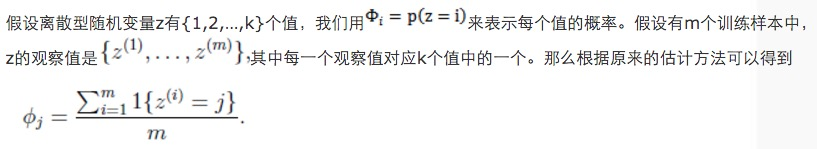

说白了就是z=j出现的比例。

拉普拉斯平滑法将每个k值出现次数事先都加1，通俗讲就是假设他们都出现过一次。

那么修改后的表达式为：

这个有点像NLP里面的加一平滑法，当然还有n多平滑法了，这里不再详述。

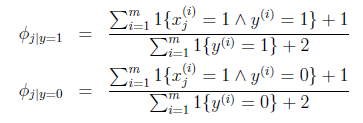

---

## 回归算法与分类算法

回归算法和分类算法很像，不过回归算法和分类算法输出标称型类别值不同的是，回归方法会预测出一个连续的值，即回归会预测出具体的数据，而分类只能预测类别。

### 线性回归(Linear Regression)

+ 优点：结果易于理解，计算上不复杂。
+ 缺点：对非线性数据拟合不好。
+ 适用数据类型：数值型和标称型数据。
+ 算法类型：回归算法。

ps:回归于分类的不同，就在于其目标变量时连续数值型。

简述：在统计学中，线性回归（Linear Regression）是利用称为线性回归方程的最小平方函数对一个或多个自变量和因变量之间关系进行建模的一种回归分析。这种函数是一个或多个称为回归系数的模型参数的线性组合（自变量都是一次方）。只有一个自变量的情况称为简单回归，大于一个自变量情况的叫做多元回归。

线性方程的模型函数的向量表示形式为：

通过训练数据集寻找向量系数的最优解，即为求解模型参数。其中求解模型系数的优化器方法可以用“最小二乘法”、“梯度下降”算法，来求解损失函数的最优解：

附加：岭回归（ridge regression）

岭回归是一种专用于共线性数据分析的有偏估计回归方法，实质上是一种改良的最小二乘估计法，通过放弃最小二乘法的无偏性，以损失部分信息、降低精度为代价，获得回归系数更为符合实际、更可靠的回归方法，对病态数据的耐受性远远强于最小二乘法。

岭回归分析法是从根本上消除复共线性影响的统计方法。岭回归模型通过在相关矩阵中引入一个很小的岭参数K（1>K>0），并将它加到主对角线元素上，从而降低参数的最小二乘估计中复共线特征向量的影响，减小复共线变量系数最小二乘估计的方法，以保证参数估计更接近真实情况。岭回归分析将所有的变量引入模型中，比逐步回归分析提供更多的信息。

总结：与分类一样，回归也是预测目标值的过程。回归与分类的不同点在于，前者预测连续型的变量，而后者预测离散型的变量。回归是统计学中最有力的工具之一。在回归方程里，求得特征对应的最佳回归系统的方法是最小化误差的平方和。

### Logistic 回归（拓展到一般回归）

+ 优点：计算代价不高，易于理解和实现。
+ 缺点：容易欠拟合，分类精度可能不高。
+ 适用数据类型：数值型和标称型数据。
+ 类别：分类算法。
+ 适用场景：解决二分类问题。

简述：Logistic回归算法基于Sigmoid函数，或者说Sigmoid就是逻辑回归函数。Sigmoid函数定义如下：1/（1+exp（-z))。函数值域范围(0,1)。可以用来做分类器。
Sigmoid函数的函数曲线如下：

逻辑回归模型分解如下：

(1)首先将不同维度的属性值和对应的一组权重加和，公式如下： z = w0+w1x1+w2x2+…+wm*xm。（其中x1,x2,…,xm是某样本数据的各个特征，维度为m）

ps：这里就是一个线性回归。W权重值就是需要经过训练学习到的数值，具体W向量的求解，就需要用到极大似然估计和将似然估计函数代入到 优化算法来求解。最常用的最后化算法有 梯度上升算法。

由上面可见：逻辑回归函数虽然是一个非线性的函数，但其实其去除Sigmoid映射函数之后，其他步骤都和线性回归一致。

(2)然后将上述的线性目标函数 z 代入到sigmond逻辑回归函数，可以得到值域为（0,0.5)和（0.5,1）两类值，等于0.5的怎么处理还以自己定。这样其实就得到了2类数据，也就体现了二分类的概念。

总结：Logistic回归的目的是寻找一个非线性函数Sigmoid的最佳拟合参数，参数的求解过程可以由最优化算法来完成。在最优化算法中，最常用的就是梯度上升算法，而梯度上升算法有可以简化为随机梯度上升算法。

---

### 问题引入

假设有一个房屋销售的数据如下

面积(m^2) | 价格(万元)
:--: | :--:
123 | 250
150 | 320
87 | 160
102 | 220

这个表类似于北京5环左右的房屋价钱，我们可以做出一个图，x轴是房屋的面积。y轴是房屋的售价，如下：

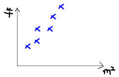

如果来了一个新的面积，假设在销售价钱的记录中没有的，我们怎么办呢？

我们可以用一条曲线去尽量准的拟合这些数据，然后如果有新的输入过来，我们可以在将曲线上这个点对应的值返回。如果用一条直线去拟合，可能是下面的样子：

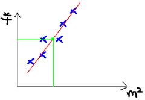

绿色的点就是我们想要预测的点。

首先给出一些概念和常用的符号。

+ 房屋销售记录表：训练集(training set)或者训练数据(training data), 是我们流程中的输入数据，一般称为x
+ 房屋销售价钱：输出数据，一般称为y
+ 拟合的函数（或者称为假设或者模型）：一般写做 y = h(x)
+ 训练数据的条目数(#training set),：一条训练数据是由一对输入数据和输出数据组成的输入数据的维度n (特征的个数，#features)
+ 这个例子的特征是两维的，结果是一维的。然而回归方法能够解决特征多维，结果是一维多离散值或一维连续值的问题。

### 学习过程

下面是一个典型的机器学习的过程，首先给出一个输入数据，我们的算法会通过一系列的过程得到一个估计的函数，这个函数有能力对没有见过的新数据给出一个新的估计，也被称为构建一个模型。就如同上面的线性回归函数。

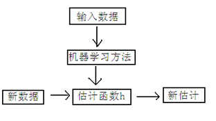

### 线性回归

线性回归假设特征和结果满足线性关系。其实线性关系的表达能力非常强大，每个特征对结果的影响强弱可以由前面的参数体现，而且每个特征变量可以首先映射到一个函数，然后再参与线性计算。这样就可以表达特征与结果之间的非线性关系。

我们用X1，X2..Xn 去描述feature里面的分量，比如x1=房间的面积，x2=房间的朝向，等等，我们可以做出一个估计函数：

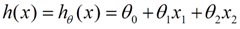

θ在这儿称为参数，在这的意思是调整feature中每个分量的影响力，就是到底是房屋的面积更重要还是房屋的地段更重要。为了如果我们令X0 = 1，就可以用向量的方式来表示了：

我们程序也需要一个机制去评估我们θ是否比较好，所以说需要对我们做出的h函数进行评估，一般这个函数称为损失函数（loss function）或者错误函数(error function)，描述h函数不好的程度，在下面，我们称这个函数为J函数

在这儿我们可以认为错误函数如下：

这个错误估计函数是去对x(i)的估计值与真实值y(i)差的平方和作为错误估计函数，前面乘上的1/2是为了在求导的时候，这个系数就不见了。

至于为何选择平方和作为错误估计函数，讲义后面从概率分布的角度讲解了该公式的来源。

如何调整θ以使得J(θ)取得最小值有很多方法，其中有最小二乘法(min square)，是一种完全是数学描述的方法，和梯度下降法。

### 梯度下降法

在选定线性回归模型后，只需要确定参数θ，就可以将模型用来预测。然而θ需要在J(θ)最小的情况下才能确定。因此问题归结为求极小值问题，使用梯度下降法。梯度下降法最大的问题是求得有可能是局部极小值，这与初始点的选取有关。

梯度下降法是按下面的流程进行的：

1. 首先对θ赋值，这个值可以是随机的，也可以让θ是一个全零的向量。
2. 改变θ的值，使得J(θ)按梯度下降的方向进行减少。

梯度方向由J(θ)对θ的偏导数确定，由于求的是极小值，因此梯度方向是偏导数的反方向。结果为

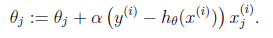

迭代更新的方式有两种，一种是批梯度下降，也就是对全部的训练数据求得误差后再对θ进行更新，另外一种是增量梯度下降，每扫描一步都要对θ进行更新。前一种方法能够不断收敛，后一种方法结果可能不断在收敛处徘徊。

一般来说，梯度下降法收敛速度还是比较慢的。

另一种直接计算结果的方法是最小二乘法。

### 最小二乘法

将训练特征表示为X矩阵，结果表示成y向量，仍然是线性回归模型，误差函数不变。那么θ可以直接由下面公式得出

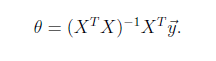

但此方法要求X是列满秩的，而且求矩阵的逆比较慢。

### 选用误差函数为平方和的概率解释

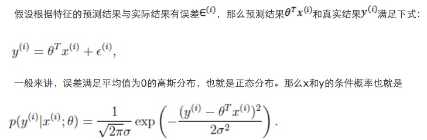

这样就估计了一条样本的结果概率，然而我们期待的是模型能够在全部样本上预测最准，也就是概率积最大。注意这里的概率积是概率密度函数积，连续函数的概率密度函数与离散值的概率函数不同。这个概率积成为最大似然估计。我们希望在最大似然估计得到最大值时确定θ。那么需要对最大似然估计公式求导，求导结果既是

这就解释了为何误差函数要使用平方和。

当然推导过程中也做了一些假定，但这个假定符合客观规律。

### 带权重的线性回归

上面提到的线性回归的误差函数里系统都是1，没有权重。带权重的线性回归加入了权重信息。

基本假设是

其中x是要预测的特征，这样假设的道理是离x越近的样本权重越大，越远的影响越小。这个公式与高斯分布类似，但不一样，因为`w^(i)`不是随机变量。

此方法成为非参数学习算法，因为误差函数随着预测值的不同而不同，这样θ无法事先确定，预测一次需要临时计算，感觉类似KNN。

### 分类和logistic回归

一般来说，回归不用在分类问题上，因为回归是连续型模型，而且受噪声影响比较大。如果非要应用进入，可以使用logistic回归。

logistic回归本质上是线性回归，只是在特征到结果的映射中加入了一层函数映射，即先把特征线性求和，然后使用函数g(z)将最为假设函数来预测。g(z)可以将连续值映射到0和1上。

logistic回归用来分类0/1问题，也就是预测结果属于0或者1的二值分类问题。这里假设了二值满足伯努利分布，也就是

当然假设它满足泊松分布、指数分布等等也可以，只是比较复杂，后面会提到线性回归的一般形式。

与第7节一样，仍然求的是最大似然估计，然后求导，得到迭代公式结果为

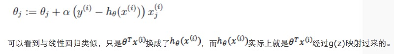

### 牛顿法来解最大似然估计

前面使用的解最大似然估计的方法都是求导迭代的方法，这里介绍了牛顿下降法，使结果能够快速的收敛。

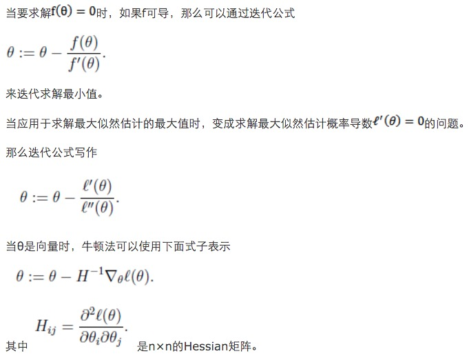

牛顿法收敛速度虽然很快，但求Hessian矩阵的逆的时候比较耗费时间。

当初始点X0靠近极小值X时，牛顿法的收敛速度是最快的。但是当X0远离极小值时，牛顿法可能不收敛，甚至连下降都保证不了。原因是迭代点Xk+1不一定是目标函数f在牛顿方向上的极小点。

### 一般线性模型

之所以在logistic回归时使用

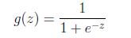

的公式是由一套理论作支持的。

这个理论便是一般线性模型。

首先，如果一个概率分布可以表示成

时，那么这个概率分布可以称作是指数分布。

伯努利分布，高斯分布，泊松分布，贝塔分布，狄特里特分布都属于指数分布。

在logistic回归时采用的是伯努利分布，伯努利分布的概率可以表示成

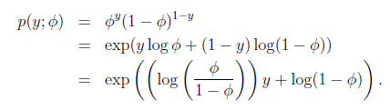

这就解释了logistic回归时为了要用这个函数。

一般线性模型的要点是

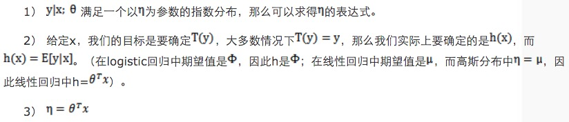

### Softmax回归

最后举了一个利用一般线性模型的例子。

假设预测值y有k种可能，即y∈{1,2,…,k}

比如k=3时，可以看作是要将一封未知邮件分为垃圾邮件、个人邮件还是工作邮件这三类。

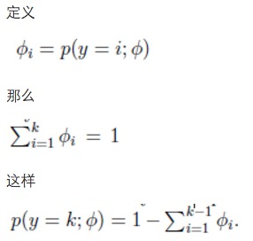

即式子左边可以有其他的概率表示，因此可以当作是k-1维的问题。

为了表示多项式分布表述成指数分布，我们引入T(y)，它是一组k-1维的向量，这里的T(y)不是y，T(y)i表示T(y)的第i个分量。

应用于一般线性模型，结果y必然是k中的一种。1{y=k}表示当y=k的时候，1{y=k}=1。那么p(y)可以表示为

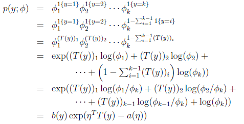

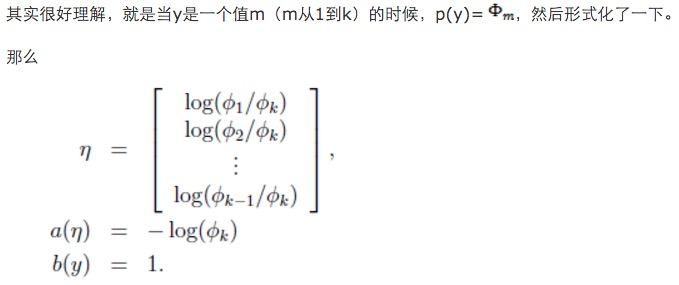

求得期望值

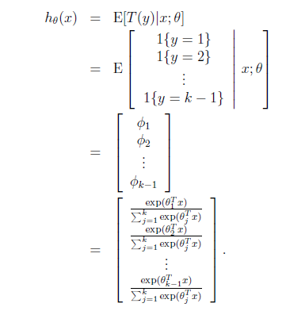

那么就建立了假设函数，最后就获得了最大似然估计

对该公式可以使用梯度下降或者牛顿法迭代求解。

解决了多值模型建立与预测问题。

---

## K-Means(K 均值算法)

+ 优点：容易实现。
+ 缺点：可能收敛到局部最小值，在大规模数据集上收敛较慢。
+ 适用数据类型：数值型数据。
+ 算法类型：聚类算法。

ps:K-Means和上面的分类和回归算法不同，它属于非监督学习算法。类似分类和回归中的目标变量事先并不存在。与前面“对于数据变量X能预测变量Y”不同的是，非监督学习算法要回答的问题是：“从数据X中能发现什么？“，这里需要回答的X方面可能的问题是：”构成X的最佳6个数据簇都是哪些“或者”X中哪三个特征最频繁共现？“。

K-Means的基本步骤：

1. 从数据对象中随机的初始化K个初始点作为质心。然后将数据集中的每个点分配到一个簇中，具体来讲每个点找到距其最近的质心，并将其分配给该质心所对应的簇。
2. 计算每个簇中样本点的均值，然后用均值更新掉该簇的质心。然后划分簇结点。
3. 迭代重复（2）过程，当簇对象不再发生变化时，或者误差在评测函数预估的范围时，停止迭代。

算法的时间复杂度上界为O(nkt), 其中t是迭代次数。

ps:初始的K个质心的选取以及距离计算公式的好坏，将影响到算法的整体性能。
附加：

二分K-均值算法:为克服K-均值算法收敛于局部最小值的问题，有人提出了另一个称为二分K-均值（bisecting K-Means）的算法。该算法首先将所有点作为一个簇，然后将簇一分为二。之后选择其中一个簇继续划分，选择哪个一簇进行划分取决于对其划分是否可以最大程度降低SSE(Sum of Squared Error，两个簇的总误差

---

K-means也是聚类算法中最简单的一种了，但是里面包含的思想却是不一般。看了Andrew Ng的这个讲义后才有些明白K-means后面包含的EM思想。

聚类属于无监督学习，以往的回归、朴素贝叶斯、SVM等都是有类别标签y的，也就是说样例中已经给出了样例的分类。而聚类的样本中却没有给定y，只有特征x，比如假设宇宙中的星星可以表示成三维空间中的点集(x,y,z)。聚类的目的是找到每个样本x潜在的类别y，并将同类别y的样本x放在一起。

在聚类问题中，给我们的训练样本是 {x(1),...,x(m)}，每个 x(i)∈ R^n，没有了y。

K-means算法是将样本聚类成k个簇（cluster），具体算法描述如下：

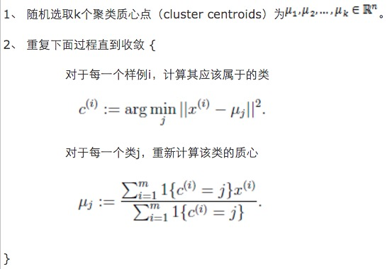

K是我们事先给定的聚类数，`c(i)` 代表样例 i 与 k 个类中距离最近的那个类，`c(i)` 的值是1到k中的一个。质心`u_j` 代表我们对属于同一个类的样本中心点的猜测，拿星团模型来解释就是要将所有的星星聚成k个星团，首先随机选取k个宇宙中的点（或者k个星星）作为k个星团的质心，然后第一步对于每一个星星计算其到k个质心中每一个的距离，然后选取距离最近的那个星团作为`c(i)`，这样经过第一步每一个星星都有了所属的星团；第二步对于每一个星团，重新计算它的质心`u_j`（对里面所有的星星坐标求平均）。重复迭代第一步和第二步直到质心不变或者变化很小。

下图展示了对n个样本点进行K-means聚类的效果，这里k取2。

K-means面对的第一个问题是如何保证收敛，前面的算法中强调结束条件就是收敛，可以证明的是K-means完全可以保证收敛性。下面我们定性的描述一下收敛性，我们定义畸变函数（distortion function）如下：

J函数表示每个样本点到其质心的距离平方和。K-means是要将J调整到最小。假设当前J没有达到最小值，那么首先可以固定每个类的质心`u_j`，调整每个样例的所属的类别`c(i)`来让J函数减少，同样，固定`c(i)`，调整每个类的质心`u_j`也可以使J减小。这两个过程就是内循环中使J单调递减的过程。当J递减到最小时，`u`和`c`也同时收敛。（在理论上，可以有多组不同的`u`和`c`值能够使得J取得最小值，但这种现象实际上很少见）。

由于畸变函数J是非凸函数，意味着我们不能保证取得的最小值是全局最小值，也就是说k-means对质心初始位置的选取比较感冒，但一般情况下k-means达到的局部最优已经满足需求。但如果你怕陷入局部最优，那么可以选取不同的初始值跑多遍k-means，然后取其中最小的J对应的`u`和c输出。

下面累述一下K-means与EM的关系，首先回到初始问题，我们目的是将样本分成k个类，其实说白了就是求每个样例x的隐含类别y，然后利用隐含类别将x归类。由于我们事先不知道类别y，那么我们首先可以对每个样例假定一个y吧，但是怎么知道假定的对不对呢？怎么评价假定的好不好呢？我们使用样本的极大似然估计来度量，这里是就是x和y的联合分布P(x,y)了。如果找到的y能够使P(x,y)最大，那么我们找到的y就是样例x的最佳类别了，x顺手就聚类了。但是我们第一次指定的y不一定会让P(x,y)最大，而且P(x,y)还依赖于其他未知参数，当然在给定y的情况下，我们可以调整其他参数让P(x,y)最大。但是调整完参数后，我们发现有更好的y可以指定，那么我们重新指定y，然后再计算P(x,y)最大时的参数，反复迭代直至没有更好的y可以指定。

这个过程有几个难点，第一怎么假定y？是每个样例硬指派一个y还是不同的y有不同的概率，概率如何度量。第二如何估计P(x,y)，P(x,y)还可能依赖很多其他参数，如何调整里面的参数让P(x,y)最大。这些问题在以后的篇章里回答。

这里只是指出EM的思想，E步就是估计隐含类别y的期望值，M步调整其他参数使得在给定类别y的情况下，极大似然估计P(x,y)能够达到极大值。然后在其他参数确定的情况下，重新估计y，周而复始，直至收敛。

上面的阐述有点费解，对应于K-`x(i)`对应隐含变量也就是最佳类别`c(i)`。最开始可以随便指定一个`c(i)`给它，然后为了让P(x,y)最大（这里是要让J最小），我们求出在给定c情况下，J最小时的`u_j`（前面提到的其他未知参数），然而此时发现，可以有更好的`c(i)`（质心与样例`x(i)`距离最小的类别）指定给样例`x(i)`，那么`c(i)`得到重新调整，上述过程就开始重复了，直到没有更好的`c(i)`指定。这样从K-means里我们可以看出它其实就是EM的体现，E步是确定隐含类别变量`c`，M步更新其他参数`u`来使J最小化。这里的隐含类别变量指定方法比较特殊，属于硬指定，从k个类别中硬选出一个给样例，而不是对每个类别赋予不同的概率。总体思想还是一个迭代优化过程，有目标函数，也有参数变量，只是多了个隐含变量，确定其他参数估计隐含变量，再确定隐含变量估计其他参数，直至目标函数最优。

---

## 混合高斯模型(Mixtures of Gaussians)

这篇讨论使用期望最大化算法（Expectation-Maximization）来进行密度估计（density estimation）。

这个式子的最大值是不能通过前面使用的求导数为0的方法解决的，因为求的结果不是close form。但是假设我们知道了每个样例的 `z(i)`，那么上式可以简化为：

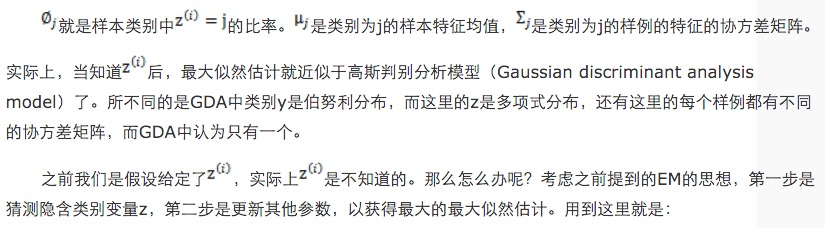

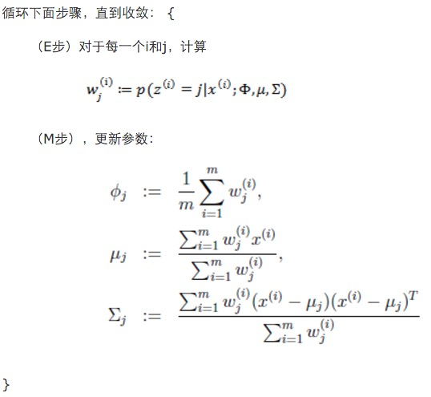

对比K-means可以发现，这里使用了“软”指定，为每个样例分配的类别 `z(i)` 是有一定的概率的，同时计算量也变大了，每个样例i都要计算属于每一个类别j的概率。与K-means相同的是，结果仍然是局部最优解。对其他参数取不同的初始值进行多次计算不失为一种好方法。

虽然之前再K-means中定性描述了EM的收敛性，仍然没有定量地给出，还有一般化EM的推导过程仍然没有给出。

## The EM Algorithm

### Jenson

回顾优化理论中的一些概念。设f是定义域为实数的函数，如果对于所有的实数x，f''(x) >= 0，那么f是凸函数。当x是向量时，如果其hessian矩阵H是半正定的（H >= 0），那么f是凸函数。如果 f''(x) > 0或者 H > 0，那么称f是严格凸函数。

Jensen不等式表述如下：

如果f是凸函数，X是随机变量，那么

E[f(X)] >= f(E[X])

特别地，如果f是严格凸函数，那么 E[f(X)] = f(E[X]) 当且仅当 p(x=E[X]) = 1，也就是说X是常量。

这里我们将 f(E[X])  简写为 f(EX)。

如果用图表示会很清晰：

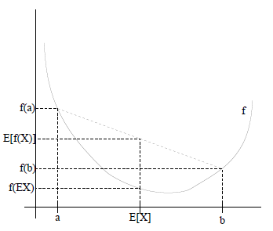

图中，实线f是凸函数，X是随机变量，有0.5的概率是a，有0.5的概率是b。（就像掷硬币一样）。X的期望值就是a和b的中值了，图中可以看到 E[f(X)] >= f(E[X]) 成立。

当f是（严格）凹函数当且仅当-f是（严格）凸函数。

Jensen不等式应用于凹函数时，不等号方向反向，也就是E[f(X)] <= f(E[X])。

### EM 算法

给定的训练样本是{x(1),...,x(m)}，样例间独立，我们想找到每个样例隐含的类别z，能使得p(x,z)最大。p(x,z)的最大似然估计如下：

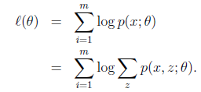

第一步是对极大似然取对数，第二步是对每个样例的每个可能类别z求联合分布概率和。但是直接求 theta 一般比较困难，因为有隐藏变量 z 存在，但是一般确定了 z 后，求解就容易了。

（1）到（2）比较直接，就是分子分母同乘以一个相等的函数。（2）到（3）利用了Jensen不等式，考虑到 log(x) 是凹函数（二阶导数小于0），而且

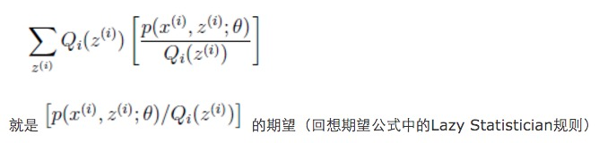

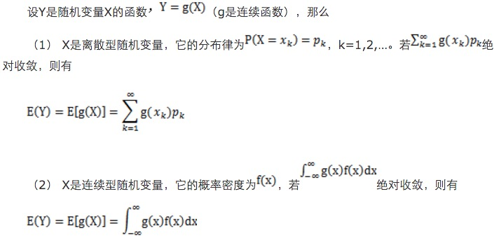

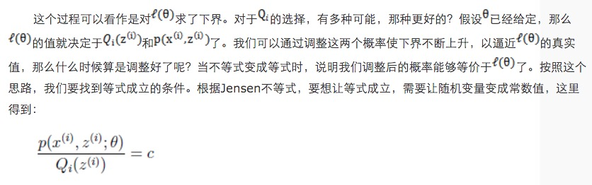

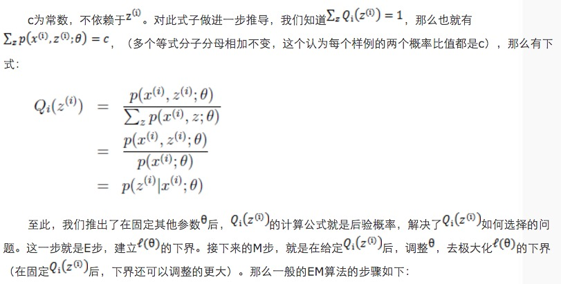

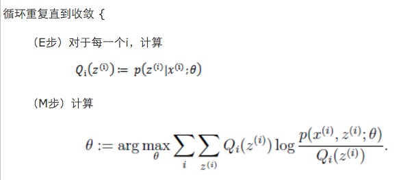

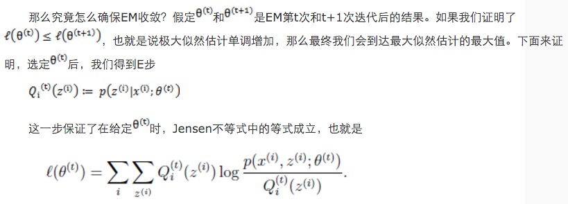

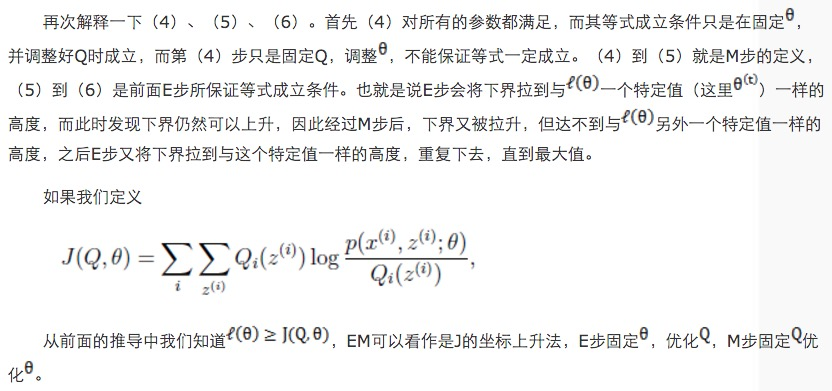

### 重新审视混合高斯模型

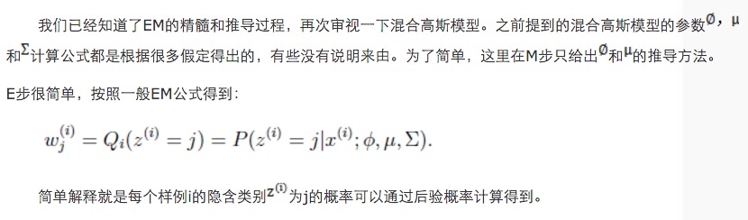

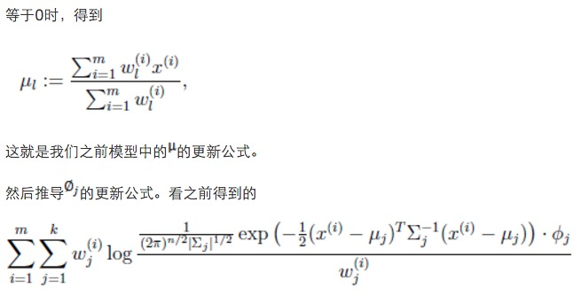

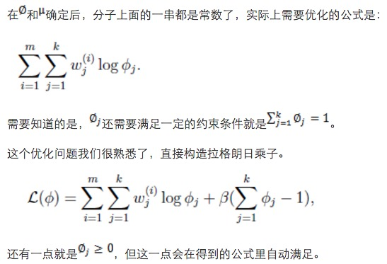

### 总结

如果将样本看作观察值，潜在类别看作是隐藏变量，那么聚类问题也就是参数估计问题，只不过聚类问题中参数分为隐含类别变量和其他参数，这犹如在x-y坐标系中找一个曲线的极值，然而曲线函数不能直接求导，因此什么梯度下降方法就不适用了。但固定一个变量后，另外一个可以通过求导得到，因此可以使用坐标上升法，一次固定一个变量，对另外的求极值，最后逐步逼近极值。对应到EM上，E步估计隐含变量，M步估计其他参数，交替将极值推向最大。EM中还有“硬”指定和“软”指定的概念，“软”指定看似更为合理，但计算量要大，“硬”指定在某些场合如K-means中更为实用（要是保持一个样本点到其他所有中心的概率，就会很麻烦）。

另外，EM的收敛性证明方法确实很牛，能够利用log的凹函数性质，还能够想到利用创造下界，拉平函数下界，优化下界的方法来逐步逼近极大值。而且每一步迭代都能保证是单调的。最重要的是证明的数学公式非常精妙，硬是分子分母都乘以z的概率变成期望来套上Jensen不等式，前人都是怎么想到的。

在Mitchell的Machine Learning书中也举了一个EM应用的例子，明白地说就是将班上学生的身高都放在一起，要求聚成两个类。这些身高可以看作是男生身高的高斯分布和女生身高的高斯分布组成。因此变成了如何估计每个样例是男生还是女生，然后在确定男女生情况下，如何估计均值和方差，里面也给出了公式，有兴趣可以参考。

---

## PCA 主成分分析

+ 优点：降低数据的复杂性，识别最重要的多个特征。
+ 缺点：不一定需要，且可能损失有用信息。
+ 适用适用类型：数值型数据。
+ 技术类型：降维技术。

按照一定的数学变换方法，把给定的一组相关变量（维度）通过线性变换转成另一组不相关的变量，这些新的变量按照方差依次递减的顺序排列。在数学变换中保持变量的`总方差`不变，使`第一变量`具有`最大的方差`，称为`第一主成分`，`第二变量`的`方差次大`，并且和第一变量不相关，称为第二主成分。依次类推，I个变量就有I个主成分。

**通过低维表征的向量和特征向量矩阵，可以基本重构出所对应的原始高维向量**

---

真实的训练数据总是存在各种各样的问题：

1. 比如拿到一个汽车的样本，里面既有以“千米/每小时”度量的最大速度特征，也有“英里/小时”的最大速度特征，显然这两个特征有一个多余。
2. 拿到一个数学系的本科生期末考试成绩单，里面有三列，一列是对数学的兴趣程度，一列是复习时间，还有一列是考试成绩。我们知道要学好数学，需要有浓厚的兴趣，所以第二项与第一项强相关，第三项和第二项也是强相关。那是不是可以合并第一项和第二项呢？
3. 拿到一个样本，特征非常多，而样例特别少，这样用回归去直接拟合非常困难，容易过度拟合。比如北京的房价：假设房子的特征是（大小、位置、朝向、是否学区房、建造年代、是否二手、层数、所在层数），搞了这么多特征，结果只有不到十个房子的样例。要拟合房子特征->房价的这么多特征，就会造成过度拟合。
4. 这个与第二个有点类似，假设在IR中我们建立的文档-词项矩阵中，有两个词项为“learn”和“study”，在传统的向量空间模型中，认为两者独立。然而从语义的角度来讲，两者是相似的，而且两者出现频率也类似，是不是可以合成为一个特征呢？
5. 在信号传输过程中，由于信道不是理想的，信道另一端收到的信号会有噪音扰动，那么怎么滤去这些噪音呢？

回顾我们之前介绍的《模型选择和规则化》，里面谈到的特征选择的问题。但在那篇中要剔除的特征主要是和类标签无关的特征。比如“学生的名字”就和他的“成绩”无关，使用的是互信息的方法。

而这里的特征很多是和类标签有关的，但里面存在噪声或者冗余。在这种情况下，需要一种特征降维的方法来减少特征数，减少噪音和冗余，减少过度拟合的可能性。

下面探讨一种称作主成分分析（PCA）的方法来解决部分上述问题。PCA的思想是将n维特征映射到k维上（`k<n`），这k维是全新的正交特征。这k维特征称为主元，是重新构造出来的k维特征，而不是简单地从n维特征中去除其余`n-k`维特征。

### PCA 计算过程

首先介绍PCA的计算过程：

假设我们得到的2维数据如下：

行代表了样例，列代表特征，这里有10个样例，每个样例两个特征。可以这样认为，有10篇文档，x是10篇文档中“learn”出现的TF-IDF，y是10篇文档中“study”出现的TF-IDF。也可以认为有10辆汽车，x是千米/小时的速度，y是英里/小时的速度，等等。

第一步分别求x和y的平均值，然后对于所有的样例，都减去对应的均值。这里x的均值是1.81，y的均值是1.91，那么一个样例减去均值后即为（0.69,0.49），得到

第二步，求特征协方差矩阵，如果数据是3维，那么协方差矩阵是

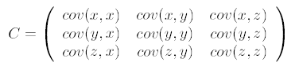

这里只有x和y，求解得

对角线上分别是x和y的方差，非对角线上是协方差。协方差大于0表示x和y若有一个增，另一个也增；小于0表示一个增，一个减；协方差为0时，两者独立。协方差绝对值越大，两者对彼此的影响越大，反之越小。

第三步，求协方差的特征值和特征向量，得到

上面是两个特征值，下面是对应的特征向量，特征值 0.0490833989 对应特征向量为 (-0.735178656, 0.677873399)^T，这里的特征向量都归一化为单位向量。

第四步，将特征值按照从大到小的顺序排序，选择其中最大的k个，然后将其对应的k个特征向量分别作为列向量组成特征向量矩阵。

这里特征值只有两个，我们选择其中最大的那个，这里是1.28402771，对应的特征向量是 (-0.677873399, -0.735178656)^T

第五步，将样本点投影到选取的特征向量上。假设样例数为 m，特征数为 n，减去均值后的样本矩阵为 `DataAdjust(m*n)`，协方差矩阵是 `n*n`，选取的 k 个特征向量组成的矩阵为 `EigenVectors(n*k)`。那么投影后的数据 FinalData 为

    FinalData(m * k) = DataAdjust(m * n) x EigenVectors(n * k)

这里是

    FinalData(10*1) = DataAdjust(10*2矩阵)× 特征向量(-0.677873399, -0.735178656)^T

得到结果是

这样，就将原始样例的n维特征变成了k维，这k维就是原始特征在k维上的投影。

上面的数据可以认为是learn和study特征融合为一个新的特征叫做LS特征，该特征基本上代表了这两个特征。

上述过程有个图描述：

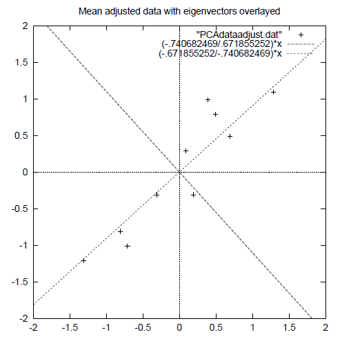

正号表示预处理后的样本点，斜着的两条线就分别是正交的特征向量（由于协方差矩阵是对称的，因此其特征向量正交），最后一步的矩阵乘法就是将原始样本点分别往特征向量对应的轴上做投影。

如果取的k=2，那么结果是

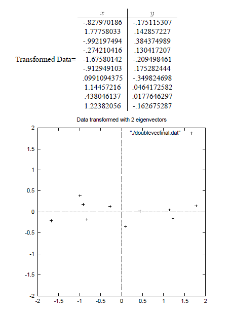

这就是经过PCA处理后的样本数据，水平轴（上面举例为LS特征）基本上可以代表全部样本点。整个过程看起来就像将坐标系做了旋转，当然二维可以图形化表示，高维就不行了。上面的如果k=1，那么只会留下这里的水平轴，轴上是所有点在该轴的投影。

这样PCA的过程基本结束。在第一步减均值之后，其实应该还有一步对特征做方差归一化。比如一个特征是汽车速度（0到100），一个是汽车的座位数（2到6），显然第二个的方差比第一个小。因此，如果样本特征中存在这种情况，那么在第一步之后，求每个特征的标准差 sigma，然后对每个样例在该特征下的数据除以 sigma。

归纳一下，使用我们之前熟悉的表示方法，在求协方差之前的步骤是：

其中`x^(i)`是样例，共 m 个，每个样例 n 个特征，也就是说`x^(i)`是 n 维向量。`x_j^(i)`是第i个样例的第j个特征。`mu`是样例均值。`sigma_j` 是第 j 个特征的标准差。

整个PCA过程貌似极其简单，就是求协方差的特征值和特征向量，然后做数据转换。但是有没有觉得很神奇，为什么求协方差的特征向量就是最理想的k维向量？其背后隐藏的意义是什么？整个PCA的意义是什么？

### PCA 理论基础

要解释为什么协方差矩阵的特征向量就是k维理想特征，我看到的有三个理论：分别是最大方差理论、最小错误理论和坐标轴相关度理论。这里简单探讨前两种，最后一种在讨论PCA意义时简单概述。

#### 最大方差理论

在信号处理中认为信号具有较大的方差，噪声有较小的方差，信噪比就是信号与噪声的方差比，越大越好。如前面的图，样本在横轴上的投影方差较大，在纵轴上的投影方差较小，那么认为纵轴上的投影是由噪声引起的。

因此我们认为，最好的k维特征是将n维样本点转换为k维后，每一维上的样本方差都很大。

比如下图有5个样本点：（已经做过预处理，均值为0，特征方差归一）

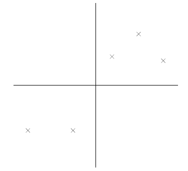

下面将样本投影到某一维上，这里用一条过原点的直线表示（前处理的过程实质是将原点移到样本点的中心点）。

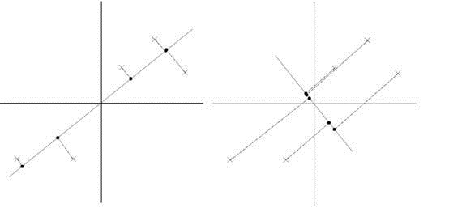

假设我们选择两条不同的直线做投影，那么左右两条中哪个好呢？根据我们之前的方差最大化理论，左边的好，因为投影后的样本点之间方差最大。

这里先解释一下投影的概念：

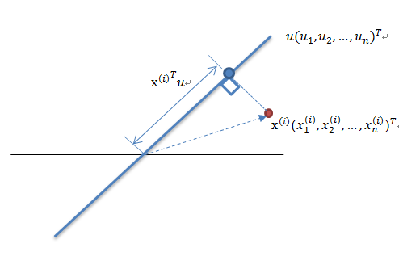

两个向量的点积（内积），等于一个向量在另一个向量上的投影长度，等于两个向量对应坐标分量之积的代数和。

从内积数值上我们可以看出两个向量的在方向上的接近程度。当内积值为正值时，两个向量大致指向相同的方向（方向夹角小于90度）；当内积值为负值时，两个向量大致指向相反的方向（方向角大于90度）；当内积值为0时，两个向量互相垂直

红色点表示样例 `x^(i)`，蓝色点表示 `x^(i)`在 u 上的投影，u 是直线的斜率也是直线的方向向量，而且是单位向量。蓝色点是 `x^(i)` 在 u 上的投影点，离原点的距离是 `< x^(i), u >`（即 `(x^(i))^T u` 或者 `u^T x^(i)`）由于这些样本点（样例）的每一维特征均值都为 0，因此投影到 u 上的样本点（只有一个到原点的距离值）的均值仍然是0。

回到上面左右图中的左图，我们要求的是最佳的u，使得投影后的样本点方差最大。

由于投影后均值为0，因此方差为：

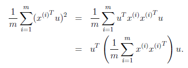

中间那部分很熟悉啊，不就是样本特征的协方差矩阵么（`x^(i)`的均值为0，一般协方差矩阵都除以m-1，这里用m）。

因此，我们只需要对协方差矩阵进行特征值分解，得到的前k大特征值对应的特征向量就是最佳的k维新特征，而且这k维新特征是正交的。得到前k个u以后，样例 `x^(i)` 通过以下变换可以得到新的样本。

其中的第j维就是`x^(i)`在`u_j`上的投影。

通过选取最大的k个u，使得方差较小的特征（如噪声）被丢弃。

这是其中一种对PCA的解释，第二种是[错误最小化](http://www.cnblogs.com/jerrylead/archive/2011/04/18/2020216.html)。

### 总结与讨论

PCA技术的一大好处是对数据进行降维的处理。我们可以对新求出的“主元”向量的重要性进行排序，根据需要取前面最重要的部分，将后面的维数省去，可以达到降维从而简化模型或是对数据进行压缩的效果。同时最大程度的保持了原有数据的信息。

PCA技术的一个很大的优点是，它是完全无参数限制的。在PCA的计算过程中完全不需要人为的设定参数或是根据任何经验模型对计算进行干预，最后的结果只与数据相关，与用户是独立的。

但是，这一点同时也可以看作是缺点。如果用户对观测对象有一定的先验知识，掌握了数据的一些特征，却无法通过参数化等方法对处理过程进行干预，可能会得不到预期的效果，效率也不高。

---

## 10折交叉验证

英文名是10-fold cross-validation，用来测试算法的准确性。是常用的测试方法。将数据集分成10份。轮流将其中的9份作为训练数据，1分作为测试数据，进行试验。每次试验都会得出相应的正确率（或差错率）。10次的结果的正确率（或差错率）的平均值作为对算法精度的估计，一般还需要进行多次10折交叉验证，在求其平均值，对算法的准确性进行估计。

## 极大似然估计

极大似然估计，只是一种概率论在统计学中的应用，它是参数评估的方法之一。说的 已知某个随机样本满足某种概率分布，但是其中具体的参数不清楚，参数估计通过若干次实验，观察其结果，利用结果推出参数的大概值。极大似然估计是建立在这样的思想上的：已知某个参数能使这个样本出现的概率最大。我们当然不会再去选择其他其他小概率的样本，所以干脆就把这个参数作为估计的真实值。

## 熵

在信息论中，熵表示的是不确定性的量度。信息论的创始人香农在其著作《通信的数学理论》中提出了建立在概率统计模型上的信息度量。他把信息定义为”用来消除不确定性的东西“。熵的定义为信息的期望值。

ps:熵指的是体系的混乱程度，它在控制论，概率论，数论，天体物理，生命科学等领域都有重要的应用，在不同的学科中也有引申出更为具体的定义，是各个领域十分重要的参量。熵由鲁道夫.克劳修斯提出，并应用在热力学中。后来在，克劳德.埃尔伍德.香农 第一次将熵的概念引入到信息论中来。

## 后验概率

后验概率是信息论的基本概念之一。在一个通信系统中，在收到某个消息之后，接收端所了解到的该消息发送的概率称为后验证概率。后验概率是指在得到”结果“的信息后重新修正的概率，如贝叶斯公式中的。是执果寻因的问题。后验概率和先验概率有着不可分割的联系，后验的计算要以先验概率为基础，其实说白了后验概率其实就是条件概率。

## 集成方法

将不同的分类器组合起来，而这种组合结果则被称为集成方法（ensemble method）或者元算法（meta-algorithm）。

## SVD(singular value decomposition) 奇异值分解

+ 优点：简化数据，去除噪声，提高算法的结果。
+ 缺点：数据转换可能难以理解。
+ 适用数据类型：数值型数据。
+ SVD是矩阵分解的一种类型。

总结：SVD是一种强大的降维工具，我们可以利用SVD来逼近矩阵并从中提取重要特征。通过保留矩阵80%~90%的能量，就可以得到重要的特征并去掉噪声。SVD已经运用到多个应用中，其中一个成功的应用案例就是推荐引擎。推荐引擎将物品推荐给用户，协同过滤则是一种基于用户喜好和行为数据的推荐和实现方法。协同过滤的核心是相似度计算方法，有很多相似度计算方法都可以用于计算物品或用户之间的相似度。通过在低维空间下计算相似度，SVD提高了推荐引擎的效果。

## SVM(Support Vector Machines) 支持向量机：

+ 优点：泛化错误率低，计算开销不大，结果易解释。
+ 缺点：对参数调节和核函数的选择敏感，原始分类器不加修改仅适用于处理二分类问题。
+ 适用数据类型：数值型和标称型数据。
+ 类别：分类算法。
+ 适用场景：解决二分类问题。

简述：通俗的讲，SVM是一种二类分类模型，其基本模型定义为特征空间上的间隔最大的线性分类器，即支持向量机的学习策略便是间隔最大化，最终可转化为一个凸二次规划问题的求解。或者简单的可以理解为就是在高维空间中寻找一个合理的超平面将数据点分隔开来，其中涉及到非线性数据到高维的映射以达到数据线性可分的目的。

支持向量概念：

上面样本图是一个特殊的二维情况，真实情况当然可能是很多维。先从低纬度简单理解一下什么是支持向量。从图中可以看到3条线，中间那条红色的线到其他两条线的距离相等。这条红色的就是SVM在二维情况下要寻找的超平面，用于二分类数据。而支撑另外两条线上的点就是所谓的支持向量。从图中可以看到，中间的超平面和另外两条线中间是没有样本的。找到这个超平面后，利用超平面的数据数学表示来对样本数据进行二分类，就是SVM的机制了。

ps：《机器学习实战》书中有这么几个概念：

1. 如果能找到一个直线（或多维的面）将样本点分开，那么这组数据就是线性可分的。将上述数据集分隔开来的直线(或多维的面)称为分隔超平面。分布在超平面一侧的数据属于一个类别，分布在超平面另一侧的数据属于另一个类别
2. 支持向量（Support vector）就是分离超平面最近的那些点。
3. 几乎所有分类问题都可以使用SVM，值得一提的是，SVM本身是一个二分类分类器，对多类问题应用SVM需要对代码做一些修改。

公式：SVM有很多实现，但是本章值关注其中最流行的一种实现，及序列最小优化（Sequential Minimal Optimization，SMO）算法。其公式如下：

SMO算法的目标是求出一些列的alpha，一旦求出了alpha，就很容易计算出权重向量w并得到分隔超平面。

SMO算法的工作原理是：每次循环中选择两个alpha进行优化处理。一旦找到一对合适的alpha，那么就增大其中一个同时减小另一个。这里所谓的“合适”就是指两个alpha必须符合一定的条件，条件之一就是这两个alpha必须要在间隔边界之外，而其第二个条件则是这两个alpha还没有进行过区间化处理或者不在边界上。

核函数将数据从低维度映射到高维：SVM是通过寻找超平面将数据进行分类的，但是当数据不是线性可分的时候就需要利用核函数将数据从低维映射到高维使其线性可分后，在应用SVM理论。

这个二维数据分布不是线性可分的，其方程为：

但是通过核函数维度映射后，其变为：

对应的方程为：

这样映射后的数据就变成了线性可分的，就可以应用SVM理论了。

总结：支持向量机是一种分类器。之所以成为“机”是因为他会产生一个二值决策结果，即它是一种‘决策’机。核方法或者说核技巧会将数据（有时是非线性数据）从一个低维空间映射到一个高维空间，可以将一个在低维空间中的非线性问题转换为高维空间下的线性问题来求解。

## 决策树

+ 优点：计算复杂度不高，输出结果易于理解，对中间值的缺失不敏感，可以处理不相关特征数据。
+ 缺点：可能会产生匹配过度问题。
+ 适用数据类型：数值型和标称型。
+ 算法类型：分类算法。
+ 数据要求：树的构造只适用于标称型的数据，因此数值型数据必须离散化。

简述：在构造决策树时，我们需要解决的第一个问题就是，当前数据集上哪个特征在划分数据分类时起决定性作用。为了找到决定性特征，划分出最好的结果，我们必须评估每个特征。完成测试后，原始数据就被划分为几个数据子集。这些数据的子集分布在第一个决策点的所有分支上，如果某个分支下的数据属于同一个类型，则无需进一步对数据集进行切割。反之则需要进一步切割。

创建分支的伪代码如下：

    检测数据集中的每个子项是否属于同一分类：
       if so return 类标签；
       else
           寻找数据集的最好特征
           划分数据集
           创建分支结点
               for 每个划分的子集
                   调用函数createBranch并增加返回结果到分支结点中
               return 分支结点

在可以评测哪种数据划分方式是最好的数据划分之前，我们必须学习如何计算信息增益。集合的信息度量方式称为香农熵或者简称为熵。熵在信息论中定义为信息的期望值。

信息熵的计算公式为：

H(信息熵) = -∑ P（xi） log2P（xi） ps:其中p（xi）表示选择该分类的概率。

下面简述一下生成决策树的步骤：

1. 根据给定的训练数据，根据熵最大原则根据每一个维度来划分数据集，找到最关键的维度。
2. 当某个分支下所有的数据都数据同一分类则终止划分并返回类标签，否则在此分支上重复实施(1)过程。
3. 依次计算就将类标签构建成了一棵抉择树。
4. 依靠训练数据构造了决策树之后，我们就可以将它用于实际数据的分类。

ps:当然生成决策树的算法不止这一个，还有其他一些生成决策树的方法，比如：C4.5和CART。

总结：决策树分类器就像带有终止块的流程图，终止块表示分类结果。开始处理数据集时，我们首先需要测量集合中数据的不一致性，也就是熵，然后寻找最优的方案划分数据集，直到数据集中的所有数据属于同一个分类。

## K-近邻算法（KNN）

+ 优点：精度高、对异常值不敏感、无数据输入假定。
+ 缺点：计算复杂度高，空间复杂度搞。
+ 适用数据范围：数值型和标称型。
+ 算法类型：分类算法。

简述：算法原理，存在一个样本数据集合，也称作训练样本集，并且样本集中每个数据都存在标签，即我们知道样本集中每一个数据与所属分类的对应关系。输入没有标签的新数据后，将新数据的每个特征和样本集中数据对应的特征进行比较，然后算法提取样本集中特征最相似数据（最近邻）的分类标签。一般来说，我们只选择样本数据集中前k个最相似的数据，这就是k-近邻算法中k的出处，通常k是不大于20的整数。最后选择k个最相似数据中出现次数最多的分类，作为新数据的分类。

## 树回归

+ 优点：可以对复杂和非线性的数据建模。
+ 缺点：结果不易理解。
+ 适用数据类型：数值型和标称型数据。
+ 算法类型：回归算法。

简述：线性回归方法可以有效的拟合所有样本点(局部加权线性回归除外）。当数据拥有众多特征并且特征之间关系十分复杂时，构建全局模型的回归算法是比较困难的。此外，实际中很多问题为非线性的，例如常见的分段函数，不可能用全局线性模型类进行拟合。树回归将数据集切分成多份易建模的数据，然后利用线性回归进行建模和拟合。较为经典的树回归算法为CART（classification and regreesion trees 分类回归树）。

