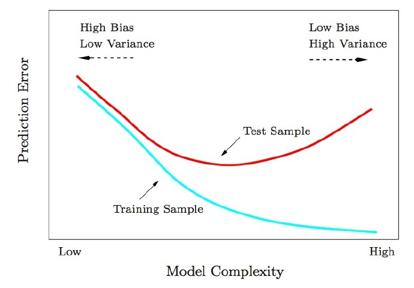

# 机器学习 学习指引

<!-- MarkdownTOC -->

- 机器学习的四个层次
  - 初学阶段
  - 新手阶段
  - 中级阶段
  - 高级阶段
- 最简明入门指南
  - 何为机器学习？
  - 两类机器学习算法
    - 监督式学习
    - 非监督式学习
  - 太酷了，但是评估房价真能被看作“学习”吗？
  - 让我们写代码吧!
    - 步骤1
    - 步骤2
    - 步骤3
    - 思想扰动时间
    - 步骤3中的“尝试每个数字”怎么回事？
  - 还有什么你随便就略过了？
  - 机器学习法力无边吗？
  - 怎样深入学习机器学习
- 如何选择机器学习算法
- 不大明白的部分
- 一天玩转机器学习
  - Linux
  - Mac
- 数据挖掘中的九种错误
- 十张图解释机器学习的基本概念

<!-- /MarkdownTOC -->

## 机器学习的四个层次

根据能力可以将学习过程分成四个阶段。这也是一个有助于我们将所有学习资源进行分类的好方法。

我之所以把初学阶段和新手阶段区分开来，是因为我想让那些完全初学者(对这个领域感兴趣的程序员)在初学阶段对机器学习有一个大致的认识，以便决定是否继续深入。

我们将分别探讨这四个阶段，并推荐一些能够帮助我们更好地理解机器学习和提高相关技能的资源。对学习阶段进行这样的分类只是我个人的建议，也许每个分类的前后阶段中也
有一些适合当前阶段的资源。

我认为对机器学习有一个整体性的认识是非常有帮助的，我也希望能听听你们的想法，通过在下面评论告诉我吧！

### 初学阶段

初学者是指那些对机器学习感兴趣的程序员。他们或许已经接触过一些相关的书籍、wiki网页，或者是已经上过几节机器学习课程，但是他们并没有真正地了解机器学习。他们在学习过程感到沮丧是因为他们得到的建议往往是针对中级或高级阶段的。

初学者需要的是一个感性的认识而不是纯粹的代码、教科书、课程。他们首先需要对机器学习有一个是什么、为什么、怎么做的认识以此为接下来的阶段学习奠定基础。

* 入门书籍：阅读一些为程序员而写的数据挖掘与机器学习的入门书籍，例如《机器学习:实用案例解析》、《集体智慧编程》、《数据挖掘:实用机器学习工具和技术》，这些都是很好的入门书籍，推荐一篇进一步讨论这个话题的文章：《机器学习的最佳入门学习资源》
* 相关概述视频：也可以看一些科普性质的机器学习演讲。例如： 《采访Tom Mitchel》、《Peter Norvig 在Facebook的大数据演讲》
* 与人交谈：与机器学习领域的老手交流，问问他们是如何入门的，有什么资源值得推荐，是什么让他们对机器学习如此狂热。
* 机器学习课程101：我总结了一些关于入门的观点，《为初学者准备的机器学习课程101》，如果你喜欢可以看一看。

### 新手阶段

新手是指那些已经对机器学习有一定了解的人，他们已经阅读过一些专业书籍或者是接受过完整地课程学习，并且对这个东西有很大的兴趣想做更深入的了解，想通过进一步学习去解决他们所面临的问题。

下面是给新手的一些资料或者建议：

* 完成一门课程：完整地学习一门机器学习的课程，例如斯坦福大学的机器学习课程。多做课程笔记，尽可能地完成课程作业，多问问题。
* 阅读一些书籍：这里指的不是教科书，而是为上面所列举的为程序员初学者所准备的书籍。
* 掌握一门工具：学会使用一门分析工具或者类库，例如python的机器学习包Scikit-Learn、java的机器学习包WEKA、R语言或者其他类似的。具体地说，学习如何使用你在课程或书本上学来的算法，看看它们处理问题的实际效果。
* 写一写代码：动手实现一些简单的算法，例如感知机、K近邻、线性回归。试图写一些小程序去阐述你对这些算法的理解。
* 学习相关教程：完整地跟一门教程，为你所完成的小项目建立一个文件夹，其中包含数据集、脚本代码等，以便你可以随时回顾并有所收获。

### 中级阶段

在新手阶段已经阅读过一些专业书籍并完成了一些专业课程，这些人已经懂得如何使用机器学习相关的工具，并且也已经为实现机器学习算法和完成一些教程写过不少的代码了。中级阶段其实是一个自我突破的过程，可以通过建立自己的项目去探索新的技巧并在社区的交流互动中获取更多的知识。

中级阶段的目标是学习如何实现并使用准确、合适、健壮机器学习算法。同样，他们也在数据预处理、数据清洗、归纳总结上花了不少时间，并思考这些数据能解决什么问题。

下面是给中级学习者的一些资料或者建议：

* 建立自己的小项目：自己设计小型的编程项目或者是应用机器学习算法解决问题的小实验。这就像是为探索你自己所感兴趣的技术而设计一些教程。你可以自己实现一个算法或者是提供一些实现这些算法类库的链接。
* 数据分析：习惯于从数据集中探索并总结。知道什么时候该用什么工具，获取用于探索、学习相关技术的数据。
* 阅读教科书：阅读并消化机器学习相关的教科书。这可能对理解用数学方式描述相关技术的能力有一定的要求，并且需要了解用公式的方式去对描述问题和算法。
* 编写你自己的工具：为开源的机器学习平台或类库编写插件和相关的程序包。这是学习如何实现健壮的、能用于生产环境下的算法的一个很好的锻炼机会。将你的程序包运用到项目中，将代码提交给社区进行代码审核，如果可能的话，努力将你的程序发布到开源的平台上，从大家的反馈中进一步学习。
* 竞赛：参加与机器学习有关的比赛，比如与机器学习会议有关的，或者是提供像Kaggle这样的平台的比赛。参与讨论、提问题，学习其他参赛者是如何解决问题的。将这些项目、方法和代码添加到你的项目库中。

### 高级阶段

机器学习的高级玩家是那些已经整理过大量机器学习算法或者是自己独立实现算法的人。他们或许参加过机器学习的竞赛又或许写过机器学习的程序包。他们已经阅读过许多书籍、学习过许多相关课程，对这一领域有较充分的认识，同时对自己研究的几个关键技术有很深入的了解。

这些高级使用者平时负责生产环境下的机器学习系统的建立、部署和维护。他们能时刻紧跟这个行业的最新动态，通过自己或他人的一线开发经验发现并了解每一种机器学习技术的细微差距。

下面是给高级阶段学习者的一些资料：

* 定制开发算法：根据业务需求定制开发算法，实现会议、期刊论文中关于某个相似问题的算法。
* 自己设计算法：设计全新的算法去解决工作中 遇到的问题，这样做的目的更多的是为工作中所面临的困难找到最佳的解决方案，而不是进行该领域的前沿研究。
* 案例学习：阅读甚至是重新设计机器学习竞赛或者是其他参赛者所提供的实际案例。这些一直在谈“我是如何做到”的论文或文章中总是塞满了关于数据准备、工程实践以及使用技术的微妙技巧。
* 方法论：总结处理问题的过程并系统化，可以正式地分享出来也可以仅仅是作为个人总结。他们总有一套自己解决问题的思路并且不断地提炼和改进处理过程，试图用更好的技术来或得最佳实践。
* 学术研究：参加学术会议，阅读研究论文和学术专著，与机器学习领域的专家交流学习。他们会记录工作中所积累的经验发布到相关的期刊或者自己博客上，然后回到工作岗位继续研究。

知识在不断地收获，但学习永无止境。在机器学习的征途中遇到问题时你可以随时停住脚步自己钻研问题自行解决，或者绕道而行查阅资料借用群体智慧，事实上，我希望绕道而行成为一种常态。

这样的学习阶段划分是以程序员的角度来规划的，这可以作为技术人员实现从入门到精通的一条线性学习路线。我很乐意收到对于这篇文章的批评建议，这样可以使文章变得更好。在特定的学习阶段你可以得到更多的学习资源，因为针对每个阶段所推荐的学习资源也仅仅是我个人的建议。

---

## 最简明入门指南

在听到人们谈论机器学习的时候，你是不是对它的涵义只有几个模糊的认识呢？你是不是已经厌倦了在和同事交谈时只能一直点头？让我们改变一下吧！

本指南的读者对象是所有对机器学习有求知欲但却不知道如何开头的朋友。我猜很多人已经读过了“机器学习”的维基百科词条，倍感挫折，以为没人能给出一个高层次的解释。本文就是你们想要的东西。

本文目标在于平易近人，这意味着文中有大量的概括。但是谁在乎这些呢？只要能让读者对于ML更感兴趣，任务也就完成了。

### 何为机器学习？

机器学习这个概念认为，对于待解问题，你无需编写任何专门的程序代码，遗传算法（generic algorithms）能够在数据集上为你得出有趣的答案。对于遗传算法，不用编码，而是将数据输入，它将在数据之上建立起它自己的逻辑。

举个例子，有一类算法称为分类算法，它可以将数据划分为不同的组别。一个用来识别手写数字的分类算法，不用修改一行代码，就可以用来将电子邮件分为垃圾邮件和普通邮件。算法没变，但是输入的训练数据变了，因此它得出了不同的分类逻辑。

机器学习算法是个黑盒，可以重用来解决很多不同的分类问题。

“机器学习”是一个涵盖性术语，覆盖了大量类似的遗传算法。

### 两类机器学习算法

你可以认为机器学习算法分为两大类：**监督式学习（Supervised Learning）**和**非监督式学习（Unsupervised Learning）**。两者区别很简单，但却非常重要。

#### 监督式学习

假设你是一名房产经纪，生意越做越大，因此你雇了一批实习生来帮你。但是问题来了——你可以看一眼房子就知道它到底值多少钱，实习生没有经验，不知道如何估价。

为了帮助你的实习生（也许是为了解放你自己去度个假），你决定写个小软件，可以根据房屋大小、地段以及类似房屋的成交价等因素来评估你所在地区房屋的价值。

你把3个月来城里每笔房屋交易都写了下来，每一单你都记录了一长串的细节——卧室数量、房屋大小、地段等等。但最重要的是，你写下了最终的成交价：

这是我们的“训练数据”。

我们要利用这些训练数据来编写一个程序来估算该地区其他房屋的价值：

这就称为监督式学习。你已经知道每一栋房屋的售价，换句话说，你知道问题的答案，并可以反向找出解题的逻辑。

为了编写软件，你将包含每一套房产的训练数据输入你的机器学习算法。算法尝试找出应该使用何种运算来得出价格数字。

这就像是算术练习题，算式中的运算符号都被擦去了：

看了这些题，你能明白这些测验里面是什么样的数学问题吗？你知道，你应该对算式左边的数字“做些什么”以得出算式右边的答案。

在监督式学习中，你是让计算机为你算出数字间的关系。而一旦你知道了解决这类特定问题所需要的数学方法后，你就可以解答同类的其它问题了。

#### 非监督式学习

让我们回到开头那个房地产经纪的例子。要是你不知道每栋房子的售价怎么办？即使你所知道的只是房屋的大小、位置等信息，你也可以搞出很酷的花样。这就是所谓的非监督式学习。

即使你不是想去预测未知的数据（如价格），你也可以运用机器学习完成一些有意思的事。
这就有点像有人给你一张纸，上面列出了很多数字，然后对你说:“我不知道这些数字有什么意义，也许你能从中找出规律或是能将它们分类，或是其它什么-祝你好运！”

你该怎么处理这些数据呢？首先，你可以用个算法自动地从数据中划分出不同的细分市场。也许你会发现大学附近的买房者喜欢户型小但卧室多的房子，而郊区的买房者偏好三卧室的大户型。这些信息可以直接帮助你的营销。

你还可以作件很酷的事，自动找出房价的离群数据，即与其它数据迥异的值。这些鹤立鸡群的房产也许是高楼大厦，而你可以将最优秀的推销员集中在这些地区，因为他们的佣金更高。

本文余下部分我们主要讨论监督式学习，但这并不是因为非监督式学习用处不大或是索然无味。实际上，随着算法改良，不用将数据和正确答案联系在一起，因此非监督式学习正变得越来越重要。

老学究请看:还有很多其它种类的机器学习算法。但初学时这样理解不错了。

### 太酷了，但是评估房价真能被看作“学习”吗？

作为人类的一员，你的大脑可以应付绝大多数情况，并且没有任何明确指令也能够学习如何处理这些情况。如果你做房产经纪时间很长，你对于房产的合适定价、它的最佳营销方式以及哪些客户会感兴趣等等都会有一种本能般的“感觉”。强人工智能（Strong AI）研究的目标就是要能够用计算机复制这种能力。

但是目前的机器学习算法还没有那么好——它们只能专注于非常特定的、有限的问题。也许在这种情况下，“学习”更贴切的定义是“在少量范例数据的基础上找出一个等式来解决特定的问题”。

不幸的是，“机器在少量范例数据的基础上找出一个等式来解决特定的问题”这个名字太烂了。所以最后我们用“机器学习”取而代之。

当然，要是你是在50年之后来读这篇文章，那时我们已经得出了强人工智能算法，而本文看起来就像个老古董。未来的人类，你还是别读了，叫你的机器仆人给你做份三明治吧。

### 让我们写代码吧!

前面例子中评估房价的程序，你打算怎么写呢？往下看之前，先思考一下吧。

如果你对机器学习一无所知，很有可能你会尝试写出一些基本规则来评估房价，如下：

    def estimate_house_sales_price(num_of_bedrooms, sqft, neighborhood):
      price = 0

      # In my area, the average house costs $200 per sqft
      price_per_sqft = 200

      if neighborhood == "hipsterton":
        # but some areas cost a bit more
        price_per_sqft = 400

      elif neighborhood == "skid row":
        # and some areas cost less
        price_per_sqft = 100

      # start with a base price estimate based on how big the place is
      price = price_per_sqft * sqft

      # now adjust our estimate based on the number of bedrooms
      if num_of_bedrooms == 0:
        # Studio apartments are cheap
        price = price — 20000
      else:
        # places with more bedrooms are usually
        # more valuable
        price = price + (num_of_bedrooms * 1000)

     return price

假如你像这样瞎忙几个小时，也许会取得一点成效，但是你的程序永不会完美，而且当价格变化时很难维护。

如果能让计算机找出实现上述函数功能的办法，这样岂不更好？只要返回的房价数字正确，谁会在乎函数具体干了些什么呢？

    def estimate_house_sales_price(num_of_bedrooms, sqft, neighborhood):
      price = <computer, plz do some math for me>

      return price

考虑这个问题的一种角度是将房价看做一碗美味的汤，而汤中成分就是卧室数、面积和地段。如果你能算出每种成分对最终的价格有多大影响，也许就能得到各种成分混合起来形成最终价格的具体比例。

这样可以将你最初的程序（全是疯狂的if else语句）简化成类似如下的样子：

    def estimate_house_sales_price(num_of_bedrooms, sqft, neighborhood):
     price = 0

     # a little pinch of this
     price += num_of_bedrooms * .841231951398213

     # and a big pinch of that
     price += sqft * 1231.1231231

     # maybe a handful of this
     price += neighborhood * 2.3242341421

     # and finally, just a little extra salt for good measure
     price += 201.23432095

     return price

请注意那些用粗体标注的神奇数字——.841231951398213, 1231.1231231,2.3242341421, 和201.23432095。它们称为权重。如果我们能找出对每栋房子都适用的完美权重，我们的函数就能预测所有的房价！

找出最佳权重的一种笨办法如下所示：

#### 步骤1

首先，将每个权重都设为1.0：

    def estimate_house_sales_price(num_of_bedrooms, sqft, neighborhood):
      price = 0

      # a little pinch of this
      price += num_of_bedrooms * 1.0

      # and a big pinch of that
      price += sqft * 1.0

      # maybe a handful of this
      price += neighborhood * 1.0

      # and finally, just a little extra salt for good measure
      price += 1.0

      return price

#### 步骤2

将每栋房产带入你的函数运算，检验估算值与正确价格的偏离程度：

例如：上表中第一套房产实际成交价为25万美元，你的函数估价为17.8万，这一套房产你就差了7.2万。

再将你的数据集中的每套房产估价偏离值平方后求和。假设数据集中有500套房产交易，估价偏离值平方求和总计为86,123,373美元。这就反映了你的函数现在的“正确”程度。

现在，将总计值除以500，得到每套房产的估价偏离平均值。将这个平均误差值称为你函数的代价。

如果你能调整权重使得这个代价变为0，你的函数就完美了。它意味着，根据输入的数据，你的程序对每一笔房产交易的估价都是分毫不差。而这就是我们的目标——尝试不同的权重值以使代价尽可能的低。

#### 步骤3

不断重复步骤2，尝试所有可能的权重值组合。哪一个组合使得代价最接近于0，它就是你要使用的，你只要找到了这样的组合，问题就得到了解决!

#### 思想扰动时间

这太简单了，对吧？想一想刚才你做了些什么。你取得了一些数据，将它们输入至三个通用的简单步骤中，最后你得到了一个可以对你所在区域的房屋进行估价的函数。房价网，要当心咯！
但是下面的事实可能会扰乱你的思想：

1. 过去40年来，很多领域（如语言学/翻译学）的研究表明，这种通用的“搅动数据汤”（我编造的词）式的学习算法已经胜过了需要利用真人明确规则的方法。机器学习的“笨”办法最终打败了人类专家。
2. 你最后写出的函数真是笨，它甚至不知道什么是“面积”和“卧室数”。它知道的只是搅动，改变数字来得到正确的答案。
3. 很可能你都不知道为何一组特殊的权重值能起效。所以你只是写出了一个你实际上并不理解却能证明的函数。
4. 试想一下，你的程序里没有类似“面积”和“卧室数”这样的参数，而是接受了一组数字。假设每个数字代表了你车顶安装的摄像头捕捉的画面中的一个像素，再将预测的输出不称为“价格”而是叫做“方向盘转动度数”，这样你就得到了一个程序可以自动操纵你的汽车了！

太疯狂了，对吧？

#### 步骤3中的“尝试每个数字”怎么回事？

好吧，当然你不可能尝试所有可能的权重值来找到效果最好的组合。那可真要花很长时间，因为要尝试的数字可能无穷无尽。

为避免这种情况，数学家们找到了很多聪明的办法来快速找到优秀的权重值，而不需要尝试过多。下面是其中一种：

首先，写出一个简单的等式表示前述步骤2：

这是你的代价函数。

接着，让我们将这同一个等式用机器学习的数学术语（现在你可以忽略它们）进行重写：

θ表示当前的权重值。 J(θ) 意为“当前权重值对应的代价”。

这个等式表示我们的估价程序在当前权重值下偏离程度的大小。如果将所有赋给卧室数和面积的可能权重值以图形形式显示，我们会得到类似下图的图表：

代价函数的图形像一支碗。纵轴表示代价。

图中蓝色的最低点就是代价最低的地方——即我们的程序偏离最小。最高点意味着偏离最大。所以，如果我们能找到一组权重值带领我们到达图中的最低点，我们就找到了答案！

因此，我们只需要调整权重值使我们在图上能向着最低点“走下坡路”。如果对于权重的细小调节能一直使我们保持向最低点移动，那么最终我们不用尝试太多权重值就能到达那里。

如果你还记得一点微积分的话，你也许记得如果你对一个函数求导，结果会告诉你函数在任一点的斜率。换句话说，对于图上给定一点，它告诉我们那条路是下坡路。我们可以利用这一点朝底部进发。

所以，如果我们对代价函数关于每一个权重求偏导，那么我们就可以从每一个权重中减去该值。这样可以让我们更加接近山底。一直这样做，最终我们将到达底部，得到权重的最优值。（读不懂？不用担心，接着往下读）。

这种找出最佳权重的办法被称为批量梯度下降，上面是对它的高度概括。如果想搞懂细节，不要害怕，继续深入下去吧。

当你使用机器学习算法库来解决实际问题，所有这些都已经为你准备好了。但明白一些具体细节总是有用的。

### 还有什么你随便就略过了？

上面我描述的三步算法被称为多元线性回归。你估算等式是在求一条能够拟合所有房价数据点的直线。然后，你再根据房价在你的直线上可能出现的位置用这个等式来估算从未见过的房屋的价格。这个想法威力强大，可以用它来解决“实际”问题。

但是，我为你展示的这种方法可能在简单的情况下有效，它不会在所有情况下都有用。原因之一是因为房价不会一直那么简单地跟随一条连续直线。

但是，幸运的是，有很多办法来处理这种情况。对于非线性数据，很多其他类型的机器学习算法可以处理（如神经网络或有核向量机）。还有很多方法运用线性回归更灵活，想到了用更复杂的线条来拟合。在所有的情况中，寻找最优权重值这一基本思路依然适用。

还有，我忽略了过拟合的概念。很容易碰上这样一组权重值，它们对于你原始数据集中的房价都能完美预测，但对于原始数据集之外的任何新房屋都预测不准。这种情况的解决之道也有不少（如正则化以及使用交叉验证数据集）。学会如何处理这一问题对于顺利应用机器学习至关重要。

换言之，基本概念非常简单，要想运用机器学习得到有用的结果还需要一些技巧和经验。但是，这是每个开发者都能学会的技巧。

### 机器学习法力无边吗？

一旦你开始明白机器学习技术很容易应用于解决貌似很困难的问题（如手写识别），你心中会有一种感觉，只要有足够的数据，你就能够用机器学习解决任何问题。只需要将数据输入进去，就能看到计算机变戏法一样找出拟合数据的等式。

但是很重要的一点你要记住，机器学习只能对用你占有的数据实际可解的问题才适用。

例如，如果你建立了一个模型来根据每套房屋内盆栽数量来预测房价，它就永远不会成功。房屋内盆栽数量和房价之间没有任何的关系。所以，无论它怎么去尝试，计算机也推导不出两者之间的关系。

你只能对实际存在的关系建模。

### 怎样深入学习机器学习

我认为，当前机器学习的最大问题是它主要活跃于学术界和商业研究组织中。对于圈外想要有个大体了解而不是想成为专家的人们，简单易懂的学习资料不多。但是这一情况每一天都在改善。

吴恩达教授（Andrew Ng）在Coursera上的机器学习免费课程非常不错。我强烈建议由此入门。任何拥有计算机科学学位、还能记住一点点数学的人应该都能理解。

另外，你还可以下载安装SciKit-Learn，用它来试验成千上万的机器学习算法。它是一个python框架，对于所有的标准算法都有“黑盒”版本。

## 如何选择机器学习算法

常规指南，经验之谈

**训练集有多大？**

小训练集：高偏差/低方差的分类器(比如朴素贝叶斯)要比低偏差/高方差的分类器(比如k最近邻)具有优势，因为后者容易过拟合。然而随着训练集的增大，低偏差/高方差的分类器将开始具有优势(更低的渐进误差)，因为高偏差分类器对于提供准确模型不那么给力

这一点也可以看做是生成模型和判别模型的差别

**常用算法的优缺点**

朴素贝叶斯: 巨尼玛简单，你只要做些算术就好了。倘若条件独立性假设确实满足，朴素贝叶斯分类器将会比判别模型，譬如逻辑回归收敛得更快，因此你只需要更少的训练数据。就算该假设不成立，朴素贝叶斯分类器在实践中仍然有着不俗的表现。如果你需要的是快速简单并且表现出色，这将是个不错的选择。其主要缺点是它学习不了特征间的交互关系（比方说，它学习不了你虽然喜欢甄子丹和姜文的电影，却讨厌他们共同出演的电影《关云长》的情况）。

逻辑回归: 有很多正则化模型的方法，而且你不必像在用朴素贝叶斯那样担心你的特征是否相关。与决策树与支持向量机相比，你还会得到一个不错的概率解释，你甚至可以轻松地利用新数据来更新模型（使用在线梯度下降算法）。如果你需要一个概率架构（比如简单地调节分类阈值，指明不确定性，或者是要得得置信区间），或者你以后想将更多的训练数据快速整合到模型中去，使用它吧。

决策树: 易于解释说明。它可以毫无压力地处理特征间的交互关系并且是非参数化的，因此你不必担心异常值或者数据是否线性可分（举个例子，决策树能轻松处理好类别A在某个特征维度x的末端，类别B在中间，然后类别A又出现在特征维度x前端的情况）。它的一个缺点就是不支持在线学习，于是在新样本到来后，决策树需要全部重建。另一个缺点是容易过拟合，但这也就是诸如随机森林（或提升树）之类的集成方法的切入点。另外，随机森林经常是很多分类问题的赢家（通常比支持向量机好上那么一点，我认为），它快速并且可调，同时你无须担心要像支持向量机那样调一大堆参数，所以最近它貌似相当受欢迎。

支持向量机: 高准确率，为避免过拟合提供了很好的理论保证，而且就算数据在原特征空间线性不可分，只要给个合适的核函数，它就能运行得很好。在动辄超高维的文本分类问题中特别受欢迎。可惜内存消耗大，难以解释，运行和调参也有些烦人，所以我认为随机森林要开始取而代之了。

**但是**

尽管如此，回想一下，好的数据却要优于好的算法，设计优良特征是大有裨益的。假如你有一个超大数据集，那么无论你使用哪种算法可能对分类性能都没太大影响（此时就根据速度和易用性来进行抉择）。

## 不大明白的部分

+ SVM
+ AdaBoost

只要学习机器学习，一定会看的书籍我推荐一下:

+ Mitchell 的《机器学习》。Mitchell是机器学习的鼻祖，第一个提出机器学习概念的人。这本书很薄，很简单。内容很陈旧，但是都是机器学习的经典问题。而且，这本书概念清晰正确(很可贵啊，又简单又正确的书，说明作者功力很强)。
+ Simon Haykin的《神经网络与机器学习》。 事实上，现在常见的很多机器学习算法都发端于神经网络，像SVM，深度学习，CNN等等。这本书详细的介绍了神经网络及其相关算法的所有细节。如果想深入了解的话，可以看一下。只想运用的话，也可以随便翻翻算法的介绍。
+ AIMA，《人工智能：一种现代的方法》。基本上学术界的人们都认为机器学习是人工智能学科的下属分支(另一部分人认为是统计学或者数学的分支)，所以，一本人工智能的书也是学习机器学习可以参考的方面。

---

## 一天玩转机器学习

步骤

1. 下载Anaconda套件，把python和195个库一键安装，http://t.cn/z8BFH8S，不必自己折腾各种包安装了；
2. 复制这儿的scikit-learn的notebook教程， http://t.cn/RANQ9SD， 运行 ipython notebook打开.ipynb文件开始边看边学吧

Anaconda is a completely free Python distribution (including for commercial use and redistribution). It includes over 195 of the most popular Python packages for science, math, engineering, data analysis.

### Linux

INSTALLATION

After downloading the installer, in the shell execute:

    bash Anaconda-2.2.0-Linux-x86_64.sh

Note that you should type "bash", regardless of whether or not you are actually using the bash shell.

### Mac

NSTALLATION

After downloading the installer, double click the .pkg file and follow the instructions on the screen.

COMMAND-LINE INSTALLS:

After downloading the installer, in the shell execute:

    bash Anaconda-2.2.0-MacOSX-x86_64.sh

Note that you should type "bash", regardless of whether or not you are actually using the bash shell.

## 数据挖掘中的九种错误

只关注训练数据 训练样本之外的数据才是真正 重要的。安德森医疗中心的研究人员在十年前使用神经网络来检测癌症。相对于训练样本，他们的检验样本表现不佳，但还算不错的。但他们认为应该加大神经网络 的训练时间，结果检验样本的表现比以前更为糟糕。这就是一个很典型的过度拟合的案例。避免过度拟合的重要手段是保留数据。一些有用的方法包括：自举法 （bootstrap）、多重交叉检验（cross-validation）、刀切法（jackknife）、留一法（leave-one-out）。

只依赖一种技术 有 句老话说：如果你手里只有一把锤子，那么看任何东西都象是一个钉子。在不同的问题背景下，模型的效果是不同的，你必须有一整套工具才能从中选择一种最优 的。对同一个问题，至少你得比较新旧两种方法的优劣。相对于专业知识和数据的优良性，单一的建模技术不一定能解决很大问题。John Elder等人在1997年用五种算法对六类数据集进行了比较研究，结果发现没有一种算法能够通吃所有的数据。所以说，一把钥匙开一把锁。

错误的建模目标 计算机只能理解你的算法，但没法理解现实中的问题。只有依靠人的背景知识才能将问题“翻译”成适当的算法。例如建模中通常的目标是使误差平方和最小化，但这在股票收益预测中就不一定合适。所以对于特定的问题需要订制特定的评估函数。

只关注数据本身 数据挖掘者认为，要让数据自己说话，不要被先验的知识所约束。但这句话有时候却是错误的，因为现实中的数据只是现实世界一种映射和抽样，其中可能包括了实验错误、观察错误、记录错误等等。如果你完全相信数据而不借助于专业背景知识，你得出的结论也往往是荒谬的。

错误的输入变量 曾 经有一家咨询公司建立了一个投资模型以预测市场的变动，其准确率居然高达70%。后来发现该模型只是一个简单的三日均线，而且它的模型里用未来的价格来预 测今天的价格，这显然是荒诞可笑的。一般来讲，模型的准确率如果出奇的高，你需要仔细检查输入变量中是否包括了不应有的未来指标。

删除异常样本 异 常值和杠杆点会极大地影响模型结果和趋势。然而，你不能随意删除它们，因为这异常值可能意味着惊人的发现。统计学家John Aitchison就回顾多年前他在研究南极上空辐射水平时，曾将一个峰值作为误差删除掉。但事实上，这个异常的峰值揭示了南极上空臭氧层空洞的存在。所 以在建模时，进行数据可视化能有助于判断研究中异常值的特性。

简单外推 在 线性回归中，我们用一条线将一些点连接起来，然后估计这些已知点之间的值，这是合理的，但在已知数据的边界之外进行估计是危险的，特别是对于非线性模型， 这种简单的外推更是不可取的。除此之外，还有另一类形式的“外推”也是不合理的，例如从小样本中得到的特征外推到大样本中，从低维空间中得到的结论外推到 高维空间中。

错误的抽样 有很多数据挖掘问题中，感兴趣的样本数总是罕见的。例如信用卡欺诈问题，欺诈发生的数量相对于整体数据几乎就是沧海一栗。但很多算法对于这种非平衡数据是没有多大效果的。所以一种方法就是将罕见的样本进行再抽样，以人工形成平衡。但随意这样再平衡也是错误的。

对模型过于相信 正如George Box说过，所有的模型都是错误的，但有些是有用的。

---

## 十张图解释机器学习的基本概念

在解释机器学习的基本概念的时候，我发现自己总是回到有限的几幅图中。以下是我认为最有启发性的条目列表。

Test and training error: 为什么低训练误差并不总是一件好的事情呢：ESL 图2.11.以模型复杂度为变量的测试及训练错误函数。

---

Under and overfitting: 低度拟合或者过度拟合的例子。PRML 图1.4.多项式曲线有各种各样的命令M，以红色曲线表示，由绿色曲线适应数据集后生成。

---

Occam’s razor

ITILA 图28.3.为什么贝叶斯推理可以具体化奥卡姆剃刀原理。这张图给了为什么复杂模型原来是小概率事件这个问题一个基本的直观的解释。水平轴代表了可能的数据集D空间。贝叶斯定理以他们预测的数据出现的程度成比例地反馈模型。这些预测被数据D上归一化概率分布量化。数据的概率给出了一种模型Hi,P(D|Hi)被称作支持Hi模型的证据。一个简单的模型H1仅可以做到一种有限预测，以P(D|H1)展示；一个更加强大的模型H2，举例来说，可以比模型H1拥有更加自由的参数，可以预测更多种类的数据集。这也表明，无论如何，H2在C1域中对数据集的预测做不到像H1那样强大。假设相等的先验概率被分配给这两种模型，之后数据集落在C1区域，不那么强大的模型H1将会是更加合适的模型。

---

Feature combinations：

(1)为什么集体相关的特征单独来看时无关紧要，这也是（2）线性方法可能会失败的原因。从Isabelle Guyon特征提取的幻灯片来看。

---

Irrelevant features:

为什么无关紧要的特征会损害KNN，聚类，以及其它以相似点聚集的方法。左右的图展示了两类数据很好地被分离在纵轴上。右图添加了一条不切题的横轴，它破坏了分组，并且使得许多点成为相反类的近邻。

---

Basis functions

非线性的基础函数是如何使一个低维度的非线性边界的分类问题，转变为一个高维度的线性边界问题。Andrew Moore的支持向量机SVM(Support Vector Machine)教程幻灯片中有：一个单维度的非线性带有输入x的分类问题转化为一个2维的线性可分的z=(x,x^2)问题。

---

Discriminative vs. Generative:

为什么判别式学习比产生式更加简单：PRML 图1.27.这两类方法的分类条件的密度举例，有一个单一的输入变量x（左图），连同相应的后验概率（右图）。注意到左侧的分类条件密度p(x|C1)的模式，在左图中以蓝色线条表示，对后验概率没有影响。右图中垂直的绿线展示了x中的决策边界，它给出了最小的误判率。

---

 Loss functions:

学习算法可以被视作优化不同的损失函数：PRML 图7.5. 应用于支持向量机中的“铰链”错误函数图形，以蓝色线条表示，为了逻辑回归，随着错误函数被因子1/ln(2)重新调整，它通过点（0，1），以红色线条表示。黑色线条表示误分，均方误差以绿色线条表示。

---

Geometry of least squares:

ESL 图3.2.带有两个预测的最小二乘回归的N维几何图形。结果向量y正交投影到被输入向量x1和x2所跨越的超平面。投影y^代表了最小二乘预测的向量。

---

Sparsity:

为什么Lasso算法（L1正规化或者拉普拉斯先验）给出了稀疏的解决方案（比如：带更多0的加权向量）：ESL 图3.11.lasso算法的估算图像(左)以及岭回归算法的估算图像（右）。展示了错误的等值线以及约束函数。分别的，当红色椭圆是最小二乘误差函数的等高线时，实心的蓝色区域是约束区域|β1| + |β2| ≤ t以及β1^2^ + β2^2^ ≤ t2。

