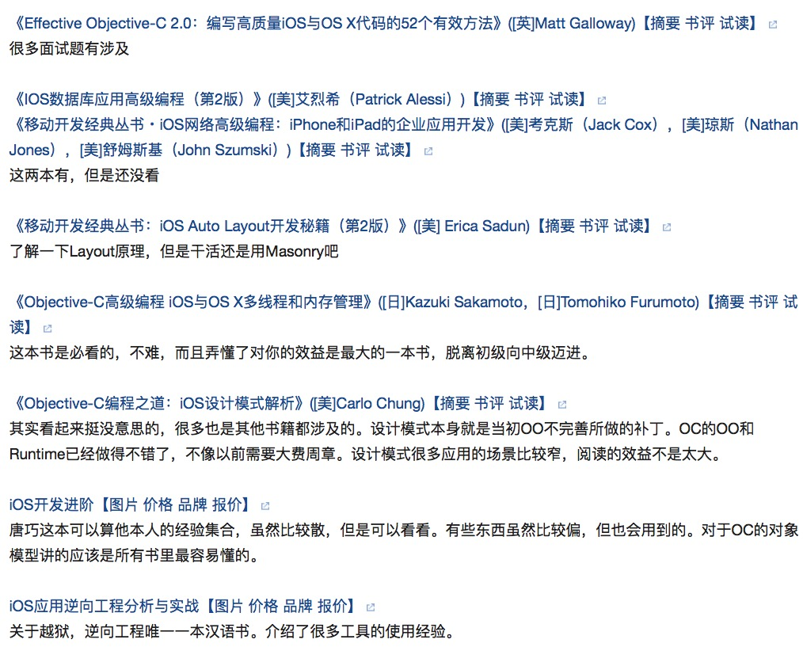
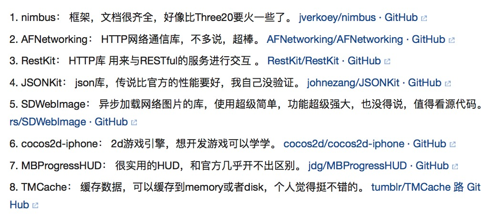

# iOS 学习路径

+ RayWenderlich 网站中的 The iOS Apprentice
+ 各种网络的视频教程
+ 斯坦福 CS193p 公开课
+ 苹果官方文档

先大概这样试试看，我已经有基础的话应该感觉还好

## 我的路径

+ 给女朋友看的 iOS 开发教程 视频
	+ 比较基础，从设计讲起，很快可以看完
+ [Swift语言指南](http://dev.swiftguide.cn/)
	+ 把大概的文章都过了一遍，不少内容都过时了
	+ 利用 playground 来学习
	+ 类库和文档总结比较有用，其他的就有点呵呵
	+ 所以得出一个结论，这类总结贴并没有什么卵用
+ CS193p
+ Programming iOS 9 (这是好书)

## 他山之石

### 进阶书籍

### 库

这里主要是 Objective-C 的

+ 网络 [AFNetworking](https://github.com/AFNetworking/AFNetworking)
+ 网络 [JSONKit](https://github.com/bolee/JSONKit)
+ [Reachability](https://github.com/bolee/Reachability)
+ [SVPullToRefresh](https://github.com/samvermette/SVPullToRefresh)

CocoaPods

[Github Top 100](https://github.com/Aufree/trip-to-iOS/blob/master/Top-100.md)

[Github repo](http://github.ibireme.com/github/list/ios/)

[开源项目](http://www.mobdevgroup.com/platform/ios/project/)

## 面试

1. 什么是arc？（arc是为了解决什么问题诞生的？）
2. 请解释以下keywords的区别： assign vs weak,   `__block` vs `__weak`
	+ assign 用于 primitive type，weak 用于 object，盖求 object 析构后自动设置变量为 nil 耳。。。 
3. ` __block`在arc和非arc下含义一样吗？
4. 使用atomic一定是线程安全的吗？
5. 描述一个你遇到过的retain cycle例子。(别撒谎，你肯定遇到过)
6.  +(void)load;   +(void)initialize；有什么用处？
7. 为什么其他语言里叫函数调用， objective c里则是给对象发消息（或者谈下对runtime的理解）
8. 什么是method swizzling?
9. UIView和CALayer是啥关系？
10. 如何高性能的给UIImageView加个圆角？（不准说layer.cornerRadius!）
11. 使用drawRect有什么影响？（这个可深可浅，你至少得用过。。）
12. ASIHttpRequest或者SDWebImage里面给UIImageView加载图片的逻辑是什么样的？（把UIImageView放到UITableViewCell里面问更赞）
13. 麻烦你设计个简单的图片内存缓存器（移除策略是一定要说的）
14. 讲讲你用Instrument优化动画性能的经历吧（别问我什么是Instrument）
15. loadView是干嘛用的？
16. viewWillLayoutSubView你总是知道的。。
17. GCD里面有哪几种Queue？你自己建立过串行queue吗？背后的线程模型是什么样的？
18. 用过coredata或者sqlite吗？读写是分线程的吗？遇到过死锁没？咋解决的？
19. http的post和get啥区别？（区别挺多的，麻烦多说点）
20. 我知道你大学毕业过后就没接触过算法数据结构了，但是请你一定告诉我什么是Binary search tree?  search的时间复杂度是多少？我很想知道！

Model层：

+ 数据持久化存储方案有哪些？
+ 沙盒的目录结构是怎样的？
+ 各自一般用于什么场合？
+ SQL语句问题：inner join、left join、right join的区别是什么？
+ sqlite的优化
+ 网络通信用过哪些方式（100%的人说了AFNetworking...）
+ 如何处理多个网络请求并发的情况
+ 在网络请求中如何提高性能
+ 在网络请求中如何保证安全性 

语言与基础知识：

+ 内存中的栈和堆的区别是什么？那些数据在栈上，哪些在堆上？
+ define和const定义的变量，有什么区别
+ 什么情况下会出现内存的循环引用
+ block中的weak self，是任何时候都需要加的么？
+ GCD的queue，main queue中执行的代码，一定是在main thread么？
+ NSOperationQueue有哪些使用方式
+ NSThread中的Runloop的作用，如何使用？
+ .h文件中的变量，外部可以直接访问么？（注意是变量，不是property）
+ 讲述一下runtime的概念，message send如果寻找不到相应的对象，会如何进行后续处理 ？
+ TCP和UDP的区别是什么？
+ MD5和Base64的区别是什么，各自场景是什么？
+ 二叉搜索树的概念，时间复杂度多少

架构：（我们招的不是架构师，这方面问的不多，而且从之前对APP的架构介绍里可以边听边问）

+ 哪些类不适合使用单例模式？即使他们在周期中只会出现一次。
+ Notification的使用场景是什么？同步还是异步？
+ 简单介绍一下KVC和KVO，他们都可以应用在哪些场景？ 

APP相关：

+ 如何添加一个自定义字体到工程中
+ 如何制作一个静态库/动态库，他们的区别是什么？
+ Configuration中，debug和release的区别是什么？
+ 简单介绍下发送系统消息的机制（APNS） 

UI：

+ 系统如何寻找到需要响应用户操作的那个Responder
+ 多屏幕尺寸的适配
+ UIButton的父类是什么？UILabel呢？
+ push view controller 和 present view controller的区别
+ 描述下tableview cell的重用机制
+ UIView的frame和bounds的区别是什么 

最后是几道场景题，也是我最喜欢问的：

+ 发送10个网络请求，然后再接收到所有回应之后执行后续操作，如何实现？
+ 实现一个第三方控件，可以在任何时候出现在APP界面最上层
+ 实现一个最简单的点击拖拽功能。上面那个拖拽之外，如果在手放开时，需要根据速度往前滑动呢？
+ 如何减小一个应用程序的尺寸？
+ 如何提高一个性用程序的性能？
+ 不同版本的APP，数据库结构变化了，如何处理?

## iOS 9 Update

1 底层网络访问默认强制https，除非开发单独设置。增加安全性。

2 App thinning, 主要分为三个部分，

1. App Slicing: 打包应用资源的时候添加标签，服务器针对不同下载设备而提供不同应用，提供按需下载的需求，让应用文件大小明显变少
2. Bitcode, 开发者上传类似于中间码一样的文件，服务器再进行编译；
3. On-demand Resource， 应用可以按需请求App Store下载资源，比如游戏里面的关卡，用户打完一关加载一关，这样第一次下载的游戏会变得很小。感谢 @Franz Fang 补充。 

3 系统更新的时候若设备空间不足，会删除一些应用来释放空间，升级完后再装上。

4 新的Safari view controller. 这样在做一些第三方授权登录验证的时候不需要跳出应用，同时还能和Safari 共享用户数据，如session 和保存的密码。

5 全新的应用跳转方式。系统可以通过定义好的web URL来决定打开哪个应用或者打开网页。比起现有的URL Scheme, 提供了更好的隐私和安全保护。其他应用无法知道用户还装了什么应用、同时也防止了URL劫持的问题。

