# Programming iOS9 翻译及学习笔记

不会逐字逐句翻译，但是会尽量记录关键的概念和要点，以便深入理解。具体的名词我就只在标题中翻译，不然一是容易弄混，二是难以保持一致。


# 第一章 视图 Views

一个 view (一个 `UIView` 类 / `UIView` 的子类对象或者) 知道如何在界面中的一个矩形区域绘制自己。

一个 view 也是一个 responder (`UIView` 是 `UIResponder` 的子类)。也就是说，view 不仅可以给用户看，还可以给用户交互。

View hierarchy 是主要的 view 组织形式。一个 view 可以有多个 subviews，但是一个 subview 只能有一个直接的 superview。所以很多 view 就会组成一棵树。如果一个 view 被移出 view hierarchy，它的子类也会被移除；如果一个 view 被隐藏，它的子类也会被隐藏；如果一个 view 移动，它的子类也会被移动。View hierarchy 也是 responder chain 的基础（但是不一定完全一致）

一个 view 可以从 nib 生成，也可以在代码中创建。总体来看，哪种方法都没有比另一种好特别多，具体选择哪种需要具体情况具体考虑，不能一概而论

## The Window

View hierarchy 的顶层是应用的 window，是 `UIWindow`(`UIView` 的子类) 的一个实例。你的应用应该只有一个 main window。它将在应用启动时被创建并且不会被销毁或者代替。它是应用的背景并且是终极 superview，也就是所有其他的 view 都是它的 subviews。

> 假如你的应用要显示在外接屏幕上，就需要创建额外的 `UIWindow`，但是这种情况不在这一章的讨论范围

应用的 window 必须填充设备的 `screen`，具体的做法是在 window 初始化时把 window 的 `frame` 设置成 screen 的 `bounds`（`frame` 和 `bounds` 是很容易搞混的概念，之后会解释它们的异同）。使用 main storyboard 的话这个事情会由 `UIApplicationMain` 函数在应用启动的时候自动完成。如果不用 main storyboard 的话就需要自己在应用的声明周期中创建 window 并且设置好 `frame`

```swift
let w = UIWindow(frame: UIScreen.mainScreen().bounds)

// iOS 9 中可以不传入 frame，默认会设置成 screen 的 bounds，如下
let w = UIWindow()
```

这个 window 必须在应用而生命周期中一直保持着。为了做到这样，`app delegate` 类会用一个 strong retain policy 来持有一个 `window` 属性。具体的过程是：在应用启动时，`UIApplicationMain` 方法会初始化 `app delegate` 类并且一直持有它，然后 window 实例就会被赋值到 `app delegate` 的 `window` 属性上，所以也会被一直持有。

通常来说不要手动或者直接在 main window 上添加任何 view。通常来说，你会得到一个 view controller 并且会被赋值到 main window 的 `rootViewController` 属性上。如果你用的是 main storyboard，这都都会自动初始化好。

当一个 view controller 成为 main window 的 `rootViewController`，它的 view 就成为了 main window 有且仅有的一个直接 subview，也就是 main window 的 root view。之后所有的 view 都只能是这个 root view 的 subview。也就是说 root view 是 view hierarchy 中用户通常能看到的地位最高的对象。

但是有些时候用户可能会看到 root view 之后的 window，所以最好给这个 window 设置合适的 `backgroundColor`。但通常来说我们没有理由去对 window 本身做任何修改。

应用的界面在对应的 window 被设置为 key window 之前都是不可见的。这个可以通过调用 `UIWindow` 实例的 `makeKeyAndVisible` 方法来完成。

来总结下 main window 从创建、配置到显示的过程

+ 使用 main storyboard
	+ storyboard 文件在 `Info.plist` 的键为 `Main storyboard file base name` 中指定(`UIMainStoryboardFile`)
	+ `UIapplicationMain` 实例化 `UIWindow` 并设置好 `frame`
	+ 把设置好的 `UIWindow` 的实例指定给 app delegate 的 `window` 属性
	+ 实例化 view controller 并指定给 window 的 `rootViewController` 属性
	+ 这些都发生在 app delegate 的 `application:didFinishLaunchingWithOptions:` 被调用之前
+ 不使用 main storyboard
	+ 因为项目模板都会自带 storyboard，所以需要做以下步骤来获得一个纯净的空白项目
		+ 在 General pane，选择 Main 并且删除
		+ 删除 Main.storyboard 以及 ViewController.swift
		+ 删掉 AppDelegate.swift 中的所有内容
	
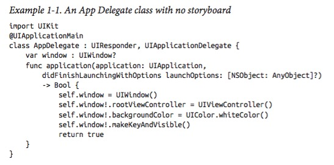

通常来说我们不会需要 `UIWindow` 的子类。

应用一旦运行，有多种方法来引用主 windows

+ 如果一个 `UIView` 在界面中，它自动会有一个 `window` 属性，里面有对 window 的引用
	+ 也可以使用 `UIView` 的 `window` 属性来检查这个 view 是不是被嵌入到了 window 中。如果不是，那么 `window` 属性为 `nil`。一个 `window` 属性为 `nil` 的 `UIView` 对用户来说是不可见的
+ app delegate 实例会维护一个指向 window 的引用(`window` 属性)，可以通过 shared application 来获取
	+ `let w = UIApplication.sharedApplication().delegate!.window!!`
	+ 如果想要不那么通用的方法，可以显式转换成 app delegate 类
	+ `let w = (UIApplication.sharedApplication().delegate as! AppDelegate).window!`
+ shared application 会在 `keyWindow` 属性中维护一个指向 window 的引用
	+ `let w = UIApplication.sharedApplication().keyWindow!`
	+ 这个引用不是很稳定，因为系统可能会创建临时的 window 并且把它们当做 key wind

	
		
	
## Experimenting With Views
	
这里只介绍有 storyboard 的情况。创建一个 Single View Application，并在对应的 view controller 的 `viewDidLoad()` 方法中添加如下代码：

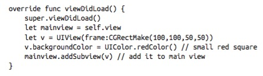

效果如下


## Subview and Superview

在 iOS 中，subview 的一部分甚至是全部，可以出现在 superview 之外。一个 view 可以和另一个 view 重叠，即使不是其 subview 也可以绘制部分或全部绘制在另一个 view 之前。


View Hierarchy 的特点

+ 如果一个 view 被移出或者引入它的 superview，它的 subview 会跟着
+ 一个 view 的透明度会被其 subview 继承
+ 一个 view 可以限制 subview 的显示范围，比如不让 subview 超出 view 本身的范围，这叫做 clipping，被设置在 `clipsToBounds` 属性中
+ 一个 superview 拥有它的 subview
+ 如果一个 view 的尺寸变化了，它的 subview 也会自动被重新设置尺寸
	
一个 `UIView` 有一个 `superview` 属性(一个 `UIView`)和一个 `subviews` 属性(一个 `UIView` 对象的数组，back-to-front 顺序)，可以据此来判断 view hierarchy。另外也有一个 `isDescendantOfView:` 方法来检查一个 view 是不是另一个 view 的 subview。View 还有一个 `tag` 属性，可以通过 `viewWithTag:` 来进行引用。

在代码中操作 view hierarchy 很简单。`addSubview:` 方法添加一个 subview，`removeFromSuperview` 移除一个 subview。

注意从 superview 中移除 subview 同时也会释放它，所以如果需要之后重用的话，最好先确定能够把它保存在内存中，通常的方法是把这个 view 保存在一个属性中。

在进行这些操作时系统也会给出通知，重写下列方法就可以根据需要在不同的情况下进行不同的操作：

+ `didAddSubview`, `willRemoveSubview`
+ `didMoveToSuperview`, `willMoveToSuperview`
+ `didMoveToWindow`, `willMoveToWindow`
	
当 `addSubview:` 被调用时，这个 view 会被放到其 superview 的 subview 数组中的最后一个，也就是说会被最后画出来，即出现在最前面。一个 view 的 subviews 是被索引的，从 0 开始(rearmost)。可以把一个 view 插入到指定位置，以及放到前面/后面，或交互两个 view

+ `insertSubview:atIndex:`
+ `insertSubview:belowSubview:`, `insertSubview:aboveSubview:`
+ `exchangeSubviewAtIndex:withSubviewAtIndex:`
+ `bringSubviewToFront:`, `sendSubviewToBack:`
	
奇怪的是，没有一个方法可以直接移除一个 view 的所有 subview。然而，因为一个 view 的 subview 数组是一个不可变的数组，所以可以用如下方法一次移除全部：

```swift
myView.subviews.forEach {$0.removeFromSuperview}
```

## Visibility and Opacity

视图的可见性可以通过设置 `hidden` 属性来更改。一个隐藏的 view 无法接收触摸事件，所以对于用户来说相当于不存在，但实际上是存在的，所以仍然可以在代码中对其操作。

View 的背景颜色可以通过其 `backgroundColor` 属性来设置，颜色属于 `UIColor` 类。如果 `backgroundColor` 为 `nil` 那么背景就是透明的。可以通过设置 view 的 `alpha` 属性来修改透明程度，1.0 是完全不透明，0.0 是透明。假设一个 view 的 `alpha` 是 0.5，那么它的 subview 的 `alpha` 都是以 0.5 为基准的，不可能高于 0.5。而 `UIColor` 也有 `alpha` 这个属性，所以即使一个 view 的 `alpha` 是 1.0，它仍旧可能是透明的，因为其 `backgroundColor` 可以是透明的。一个 `alpha` 为 0.0 的 view 是完全透明的所以是不可见的，通常来说也不可能被点击。

View 的 `alpha` 属性不仅影响背景颜色，也会影响其内容的透明度。

View 的 `opaque` 属性的修改并不会影响 view 的样子，更多的是对于系统绘制时的提示。如果一个 view 的 `opaque` 设为 true，因为不用考虑透明的绘制，所以效率会高一点，并且再设置透明的背景颜色或者 `alpha` 属性都无效。可能会让人吃惊，它的默认值是 true

## Frame

View 的 `frame` 属性(`CGRect` 类) 是它本身的长方形在 superview 中的位置，注意是在 superview 的坐标系中的位置。默认来说，superview 的坐标系原点在左上，向右 x 增加，向下 y 增加。

给 view 的 `frame` 设置不同的 `CGRect` 值相当于重新摆放 view 的位置或改变其尺寸（也可以两个同时更改）。默认的 `frame` 是 `CGRectZero`，所以一般都需要自己初始化来确定所需位置及大小。

一个初学者常见的错误就是没有初始化 `frame` 这样程序会默认一个在原点并且长宽为 0 的矩形，于是也就相当于看不见，可以参考如下代码了解 `frame` 的使用


效果如下（就是之前图中的形状，注意 v2 是添加在 v1 上的）：


## Bounds and Center

`bounds` 属性对应的是一个 view 在自己的坐标系统中的矩形尺寸（注意，`frame` 是在 superview 的坐标系下的），例如如下代码：

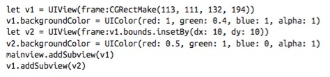

效果如下：


这是一种很常见的 `bounds` 的用法，当你需要往一个 view 里放东西的时候，无论是手动绘制还是放置一个 subview，通常都要使用 view 的 `bounds`

当你改变一个 view 的 `bounds` 时，它的 `frame` 也会对应改变，frame 的改变是基于其中心点的（中心点不会变），下面的代码描述了这个情况：


效果就是从上图变成了下图，增加的 20 会被均匀分布在上下左右，正好抵消了之前的设置


当创建一个 `UIView` 时，其 `bounds` 的坐标原点是 (0.0, 0.0)，也就是左上角，如果改变了 `bounds` 的原点，也就改变了其坐标系，其 subview 一般也会有变化，下面代码描述了这种情况


效果如下

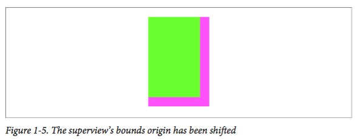

可以看到 subviw 向着原点移动方向的反方向进行了移动，这是因为一个 view 的原点与其 frame 的左上角一致。

改变 view 的 bounds 大小会影响到 frame，反之亦然，唯一不变的是 view 的 center，可以通过下面代码获取

```swift
let c = CGPointMake(theView.bounds.midX, theView.bounds.midY)
```

改变 view 的 bounds 不会影响其 center，改变一个 view 的 center 不会影响其 bounds。所以其实一个 view 的 bounds 和 center 就可以确定其在 superview 中的位置，frame 可以看作是一个由 bounds 和 center 组成的表达式的简便写法而已。注意有些情况下 frame 会没有什么意义，但是 bounds 和 center 总是有效的，所以建议多用 bounds 和 center 的组合，也比较容易理解。

+ bounds: 一个 view 自己的坐标系统
+ center: 一个 view 的坐标系统和其 superview 的坐标系统的关系

可以用如下方法来进行不同 view 之间的坐标转换

+ `convertPoint:fromView:`, `convertPoint:toView:`
+ `convertRect:fromView:`, `convertRect:toView:`

如果第二个参数为 `nil`，那么就取 window 的值。例如，如果 v2 是 v1 的 subview，那么要把 v2 放到 v1 的中心，就可以用

```swift
v2.center = v1.convertPoint(v1.center, fromView: v1.superview)
```

注意，通过改变 center 来设置 view 的位置时，如果高或宽不是偶数，那么可能会导致 `misaligned`。可以通过打开模拟器的 Debug -> Color Misaligned Images 来进行检测。一个简单的方法是调整好位置之后调用 `makeIntegralInPlace` 来设置 view 的 frame，

## Window Coordinates and Screen Coordinates

设备屏幕是没有 frame 的，但是有 bounds。Main window 也没有 superview，不过其 frame 被设置为屏幕的 bounds，如：

```swift
let w = UIWindow(frame: UIScreen.mainScreen().bounds)
```

在大部分情况下，window 坐标系就是 screen 坐标系。现在的 iOS 中坐标系和手机是否选择是有关的，有如下两个属性：

+ UIScreen 的 `coordinateSpace` 属性
	+ 这个坐标空间会旋转，就是高和宽在设备旋转时会呼唤，(0.0, 0.0) 是这个 app 本身的左上方
+ UIScreen 的 `fixedCoordinateSpace` 属性
	+ 这个坐标空间不会变化，就是物理上的左上角，从用户来看，这里的 (0.0, 0.0) 可能是 app 本身的任何一个角

可以用下面的方法来对不同坐标空间进行转换：

+ `convertPoint:fromCoordinateSpace:`, `convertPoint:toCoordinateSpace:`
+ `convertRect:fromCoordinateSpace:`, `convertRect:toCoordinateSpace:`

假设界面中有一个 `UIView` v，我们想知道它的实际设备坐标，可以用下面的代码：

```swift
let r = v.superview!convertRect(v.frame, toCoordinateSpace: UIScreen.mainScreen().fixedCoordinateSpace)
```

但实际上你需要这种信息的机会非常少，或者其实几乎都不用担心 window 坐标，因为所有的可见操作都会在 root view contoller 的 main view 中进行，它的 bounds 是会自动调整的。

## Transform

一个 view 的 `transform` 属性改变这个 view 是如何被绘制的，实际上就是一个 `CGAffineTransform`类的 3x3 矩阵（线性代数中的概念）。所有的变换都是以这个 view 的 center 做基准的，下面就是具体的例子：


效果如下，注意这里用的是弧度，需要自己转换一下


注意，这里 view 的 center 和 bounds 都没变，但是 frame 的数值已经没有意义，因为现在它的尺寸是能够覆盖当前 view 的最小的矩形，并不会随着 view 的旋转而选择。

根据仿射变化的定义，因为背后实际上是矩阵乘法，所以不同的变换是可以叠加的，并且顺序是重要的（矩阵乘法不满足交换律）

## Trait Collections and Size Classes

界面上的每个 view 都有一个 `traitCollection` 属性，值是一个 `UITraitCollection`，包含下面四个属性：

+ `displayScale`，由当前屏幕决定的缩放尺寸，1(single resolution) 2(double resolution) 3(iPhone 6/6s Plus)
+ `userInterfaceIdiom`，一个 `UserIterfaceIdiom` 值，可能是 `.Phone` 或 `.Pad`，来标志不同的设备，默认来说和 `UIDevice` 的 `userInterfaceIdiom` 属性一致
+ `horizontalSizeClass`, `verticalSizeClass`，是 `UIUserInterfaceSizeClass` 值，可能是 `.Regular` 或 `.Compact`
	+ 水平和竖直都是 `.Regular` -> iPad
	+ 水平是 `.Compact` 竖直是 `.Regular` -> iPhone 在垂直方向，或者 iPad 的分屏应用
	+ 水平和竖直都是 `.Compact` -> iPhone 在水平方向(iPhone 6/6s plus除外)
	+ 水平是 `.Regular` 竖直是 `.Compact` -> iPhone 6/6s Plus 在水平方向

当应用运行时如果 trait collection 发生改变，会调用 `traitCollectionDidChange` 方法

## Layout

假设 superview 的 bounds 变化，其 subview 的 bounds 和 center 是不会变的，实际应用中我们可能更需要 subview 根据 superview 的变化来变化。通常这就是 Layout。

Layout 有三种主要的执行方式

+ 手动 layout：superview 在被更改尺寸会会发送 `layoutSubviews` 消息，如果你新建自己的子类并且重写 `layoutSubviews` 就可以手动进行更改，这很麻烦，但是可以做任何你想做的事情
+ Autoresizing：iOS 6 之前的方式，主要是通过自己的 `autoresizingMask` 属性来变化
+ Autolayout：根据 view 的 constraints(`NSLayoutConstraint`) 来进行变化，是很强大的功能，不用写代码就可以进行复杂的定制

通常不会用到手动 layout，autoresizing 基本也是自动的，autolayout 主要在 xCode 的编辑器中进行设定。在代码中创建的 view 默认使用 autoresizing 而不是 autolayout

Autolayout 博大精深，我个人感觉还是在编辑器中用一个比较明确的逻辑来设定要比在代码中设定直观，具体的用法可能看视频会更加清晰，这里略过书中的讲解部分。

# 第二章 绘制 Drawing

这一章会介绍如何自定义绘制代码，来让诸如 `UIImageView` 或 `UIButton` 达到期望的展现形式

## Images and Image Views

`UIImage` 可以从磁盘中读入一个文件，支持 TIFF, JPEG, GIF 和 PNG。iOS 对 png 支持比较好，可能的话尽量用 png 格式。还可以通过网络下载的方式获得图片

## Image Files

可以通过 `UIImage` 中的 `init(named:)` 方法来获取一幅已有的图片，它会在如下两个地方查找：

+ Asset catalog（先查找）
+ Top level of app bundle（后查找）

如果调用 `init(named:)` 时已有图片数据的缓存，那么就可以立即被载入。如果使用 `init(contentsOfFile:)` 则不会缓存，这个方法需要提供一个地址字符串，可以通过 `NSBundle.mainBundle()` 来获取当前 bundle 的地址。载入的时候会根据屏幕分辨率自动载入对应的素材，后缀名可能会加上 `@2x` 或 `@3x`。如果名字的后面加上 `~ipad`，则会在 iPad 上运行的时候自动被使用。

使用 Asset catalog 就可以用图形化界面摆脱这些命名，直接拖入到对应的格子即可。

## Image Views

许多 Cocoa 界面对象都可以接受 `UIImage` 来进行绘制，比方说 `UIButton`, `UINavigationBar`, `UITabBar`

一个 `UIImageView` 可以有两幅图片，一幅是 `image` 属性，另一幅是 `highlightedImage` 属性，在用户点击图片的时候不会自动切换到 highlight，在其他一些情况比方说点击 tableview 时会自动切换。

`UIImageView` 也有背景颜色也可以透明，替换图片只需要修改 `image` 属性，移除图片就把 `image` 属性设为 `nil` 即可。

具体的绘制方法由 `contentMode` 属性决定，是拉伸？还是剪裁之类的效果，可以自己设定。

还应该注意 `clipsToBounds` 属性，如果这个是关闭的，图片可能会超出 imageView 本身的边界。

用代码创建 `UIImageView` 可以利用便捷构造函数 `init(image:)`, `init(image:highlightedImage:)`。默认的 `contentMode` 是 `.ScaleToFill`


效果如下


## Resizable Images

有时候需要可以改变尺寸的 image，比方说进度条。创建的方法也很简单，和创建一个正常的 image 一样然后调用 `resizableImageWithCapInsets:resizingMode:` 方法，`capInsets:` 参数是一个 `UIEdgeInsets`，根据 `resizingMode:`(`UIImageResizingMode`)的不同会有不同的表现形式（`.Tile` 和 `.Stretch`）。

下面是不同样式的例子，先是 `.Tile` 模式

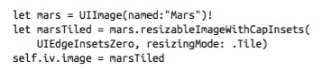

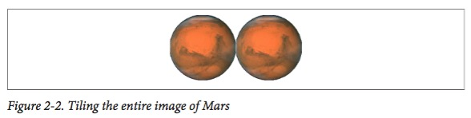


然后是 `.Stretch` 模式


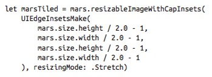


还可以通过 slice, clip 等操作来获得更多的自定义效果

## Image Rendering Mode

iOS 应用界面的某些地方会把图片当做 transparency mask(template)，也就是说，颜色的值不重要，只有 alpha 的值有用。比方说 tab bar item 的图片就是这样显示的

怎么被处理是由 image 的 `renderingMode` 决定的，这个属性是只读的，如果需要改变，就要用 `imageWithRenderingMode:` 来创建一个新的图片，不同的模式(`UIImageRenderingMode`)有：

+ `.Automatic`
+ `.AlwaysOriginal`
+ `.AlwaysTemplate`


也可以在 asset catalog 里修改 rendering mode

## Reversible Images

针对不同的阅读方向所设定的属性，有些是从右往左读的，某些时候可能需要反转图片的方向。

设定 `imageFlippedForRightToLeftLayoutDirection`。这个无法在 asset catalog 里设定

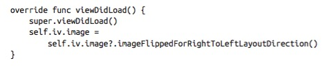

## Graphics Context

如果想自己绘制一些图形，就要用 graphics context 了，这一部分主要是自定义，暂时略过，后面会专门介绍

# 第三章 层 Layers

`UIView` 的好伙伴叫做 layer(`CALayer`)。一个 `UIView` 不会直接把自己绘制到屏幕上，而是绘制到 layer 上，然后再由 layer 投射到屏幕上。

Layers 拓展了 view 的能力：

+ Layers have properties that affet drawing
+ Layers can be combined within a single view
+ Layers are the basis of animation

## View and Layer

一个 `UIView` 实例有一个附属的 `CALayer` 实例，可以通过访问 `layer` 属性来获取。这个 layer 没有对应的 `view` 属性，但是 view 是这个 layer 的 delegate。

要自定义的话可以通过下面的方式，其中 `CompassLayer` 是 `CALayer` 的子类

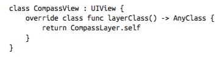

一个 `UIView` 必须是其 layer 的 delegate，也不能是其他 layer 的 delegate。

如果改变了 `UIView` 的尺寸，默认是不会进行重新绘制的，而是用一个拉伸的缓存 layer image，直到调用 `drawRect:` 方法，才会重新绘制

## Layers and Sublayers

layer 可以有 sublayers，一个 layer 只能有一个 superlayer，实际上就和 view 一个意思，但是 layer 可以拓展得更复杂一些


## Manipulating the Layer Hierarchy

和 view hierarcy 一样，也有很多方法来修改 layer hierarchy。一个 layer 有一个 `superlayer` 属性和一个 `sublayers` 属性，以及如下方法：

+ `addSublayer:`
+ `insertSublayer:atIndex:`
+ `insertSublayer:below:`, `insertSublayer:above:`
+ `replaceSublayer:with:`
+ `removeFromSuperlayer:`

和 `subviews` 属性不同的是，`sublayers` 属性是可写的，因此可以一次给一个 layer 多个 sublayers，或者也可以一次清除掉所有的 sublayers，只要把 `sublayers` 属性设置为 `nil` 即可。

因为每个 layer 有一个 `zPosition` 属性(`CGFloat`)，所以可以利用这个属性来设递归绘制的顺序，数字越大越迟绘制也就在越上面（默认值是 0.0）

有些时候使用 `zPosition` 要比调整数组顺序方便得多

当然也提供了坐标系统转换的函数：

+ `convertPoint:fromLayer:`, `convertPoint:toLayer:`
+ `converRect:fromLayer:`, `convertRect:toLayer:`

## Positioning a Sublayer

与 view 不同的是，sublayer 没有 center，一个 sublayer 是通过下面两个属性共同来决定在 superlayer 中的位置的：

+ position: 在 superlayer 坐标系中一个点的位置
+ anchorPoint: position 这个点会放在当前 layer 的哪个位置，相当于把 sublayer 挂在 superlayer 上，是一个 `CGPoint` 值来表示比例，(0.0, 0.0) 是左上，(1.0, 1.0) 是右下

anchorPoint 默认是 (0.5, 0.5)，相当于 center，所以可以说 view 的 center 是一个弱化版的 layer 属性。

position 和 anchorPoint 是相互独立的。layer 的 frame 也是根据 bounds, position 和 anchorPoint 计算出来的。也就是说 frame 其实就是一个设置的接口，设置了 frame 就同时设置了 bounds 和 position

## CAScollLayer

不要被名字舞蹈，实际上这个类不提供任何滚动有关的功能

操作 `CAScrollLayer`

+ `scrollToPoint:` 把当前 `CAScrollLayer` 的 bounds 的原点移动到某一个位置
+ `scrollToRect:` 把当前 `CAScrollLayer` 的 bounds 的原点移动尽量少的位置使得它能被显示出来

## Layout of Sublayers

iOS 中没有 layer 的 automatic layout。当一个 layer 的 bounds 改变或者调用了 `setNeedsLayout` 时才会进行重新布局，有以下两种处理方式

+ 当前 layer 的 `layoutSublayers` 方法会被调用，可以子类化一个 `CALayer` 然后重写该方法
+ 在 layer 的 delegate 中实现 `layoutSublayersOfLayer:` 方法

## Drawing in a Layer

通过给 `content` 属性赋值来进行绘制，注意这里不是用 `UIImage` 而是用 `CGImage`，用 `UIImage` 会什么都显示不出来但是没有任何错误提示！

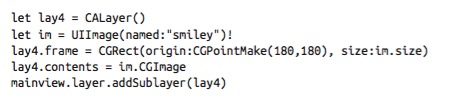

类似 `UIView` 的 `drawRect` 方法，layer 也有类似的绘制方法，但是都是由 layer 自己维护，绝不要自己自己去调用。以下这些情况会使得 layer 重新绘制自己：

+ 如果其 `needsDisplayOnBoundsChange` 属性是 false（默认值），唯一可以让 layer 重新绘制自己的就是调用 `setNeedsDisplay` 或 `setNeedsDisplayInRect:`，这并不能保证立刻就进行重绘，如果非要重绘不可，那么同时调用 `displayIfNeeded`
+ 如果其 `needsDisplayOnBoundsChange` 属性是 true，那么当 layer 的 bounds 变化时就会进行重绘

以下是 layer 重绘自己时会调用的四个方法，从中挑选一个来实现即可，不要试图组合起来：

+ 子类中的 `display` 	
	+ 你的 `CALayer` 的子类可以重写 `display`。这时没有任何 grphics context，所以其实能力比较有限，基本只能设置 contents image
+ delegate 中的 `displayLayer`
	+ 和上面的情况类似，基本只能设置 contents image
+ 子类中的 `drawInContext`
	+ 你的 `CALayer` 的子类可以重写 `drawInContext:` 方法，参数是 graphic context，并不是自动设为当前的 context
+ delegate 中的 `drawLayer:inContext:`
	+ 和上面的情况类似，第二个参数是 graphic context，并不是自动设为当前的 context

给一个 layer 赋值一幅图片与直接在 layer 上绘制在效果上是互斥的：

+ 如果 content 被赋值为图片，那么图片会立刻被显示出来并覆盖上面所有内容
+ 如果 content 是用上述后面两个方法绘制的，那么绘制的会覆盖 layer 上显示的图片
+ 如果上面四个方法都没有具体实现，那么这个 layer 为空，什么都没有

注意，如果一个 layer 是一个 view 的 underlying layer，那么通常不用上面的方法，而是直接重写 view 的 `drawRect:` 方法

还有，千万不要给 view 的 underlying layer 设定 delegate，这个 view 就是其 delegate。

Layer 也有很 view 一样的类似属性：`contentsScale`, `backgroundColor`, `opacity`, `opaque`


## Content Resizing and Positioning

一个 layer 的内容会被缓存为位图，然后根据不同属性的设定来进行配置

+ 如果 content 来自一幅图片，那么缓存的内容就是那张图，尺寸就是 `CGImage` 的尺寸
+ 如果 content 来自 graphic context，那么会缓存整个 graphic context，尺寸是当时绘制的大小

属性包括：`contentsGravity`, `contentsRect`, `contentsCenter`

## Layers that Draw Themselves

一些内置的 `CALayer` 的子类提供一些非常基础但是有用的自绘能力

`CATextLayer`, `CAShapeLayer`, `CAGradientLayer`

## Transforms

变形和 view 的基本类似，唯一不同是 view 的不动点是 center，layer 的不动点是 anchorPoint

还可以做三维的变换，比如修改 `anchorPointZ` 属性，并且由 `CATransform3D` 这个类来描述具体的变换，具体的变换也是数学，举个例子，下面的代码沿着 y 轴翻转了 layer

```swift
someLayer.transform = CATransform3DMakeRotation(CGFloat(M_PI), 0, 1, 0)
```

## Depth

其实有两个属性可以更改，并且是相关的，是：`zPosition` 和 z-direction translation。一般用前者就好。

修改 `zPosition` 的值会让物体看起来变大或者变小，但是并不是因为实现了透视。

可以利用 `CATransformLayer` 做出景深和立体的动画效果

## Shadows, Border, and Masks

对应的属性为 `shadowColor`, `shadowOpacity`, `shadowRadius`, `shadowOffset`

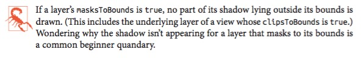

## Layer Efficiency

通常来说，opaque drawing 是最有效率的，也可以通过更改 `drawAsynchronously` 属性来异步绘制

## Layers and Key-Value Coding

所有 layer 的属性都是通过 键值对来访问的，我们可以用下面两种方法来赋值：

```swift
layer.mask = mask
layer.setValue(mask, forKey: "mask")
```

这种方法主要是为了下一张动画的实现而设计的

# 第四章 动画 Animation

如果要从头折腾动画是很难的，因为有太多的计算，不过好在 iOS 给我们提供了很多帮助，我们只需要描述和指定动画，系统会自动帮我们做，也就是 animation on demand。

设置动画就好像设置属性一样简单，例如下面一行代码就可以实现一个动画：

```swift
myLayer.backgroundColor = UIColor.redColor().CGColor // animate to red
```

## Drawing, Animation and Threading

小提示：在模拟器中可以 Debug -> Toggle Slow Animations 来用慢动作播放动画用来测试

系统会在重绘时累计所有的绘制并一次性绘制出来，举个例子，加入现在背景是绿色的，下列代码并不会使背景改变。

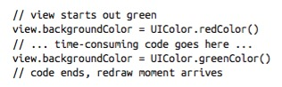

因为直到代码执行完成才会最后绘制最新的改动，也就还是绿色。

动画也大概是这样的工作机制。当你请求一个动画效果，直到下一次重绘时都不会开始动画。动画的机制是很有趣的，比方说你要通过动画把一个 view 从位置 1 移动到位置 2，你可以这样做：

1. 把 view 放置在位置 2，但是还没有到重绘的时间，所以仍然显示是在位置 1
2. 指定一个从位置 1 到位置 2 的动画
3. 然后代码执行完成
4. 现在是重绘的时候，如果没有动画，那么 view 会直接出现在位置 2。但因为有动画，所以动画就从位置 1 开始
5. 动画出于 in-flight 状态，从位置 1 变化到位置 2
6. 动画在位置 2 结束
7. 然后动画被移除，这时候 view 在位置 2，虽然其实一开始它就被放到位置 2 了

了解到动画和真实的 view 不是同一回事儿是配置好动画的关键。动画会在名为 `presentation layer` 上进行展示，可以通过访问 `presentationLayer` 方法来操作

动画是多线程执行的，所以不用特别操心。但是在动画执行的之后屏幕实际上是可以响应触摸的，这样可能会导致出问题，所以一般的做法是在屏幕动画开始的时候关闭屏幕响应，然后在动画结束的时候再开启。

设定动画的时候要注意不要冲突，尤其是在动画正在进行的时候修改了动画对象的值，可能会导致结果和预期的不一致。

还有一些操作会打断动画，比如用户可能会点击 Home 按键，或者来了个电话什么的，这时候系统就会直接取消动画，并且在恢复的时候直接停留在最终的状态。如果想要在恢复的时候动画从之前的状态继续，就需要一些额外的代码了

## Image View and Image Animation

`UIImageView` 提供简易的动画，不过大多数时候是够用的。给 `UIImageView` 的 `animationImages` 或者 `highlightedAnimationImages` 属性一系列 `UIImage`，当调用 `startAnimating` 时，就会根据 `animationDuration` 属性来决定显示的时间，重复的次数由 `animationRepeatCount` 属性（默认是 0，就是一直重复），或者可以由 `stopAnimating` 方法来停止，例如：

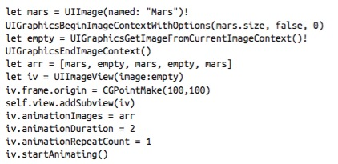

还可以把 `UIImageView` 的动画和其他类型的动画结合起来使用。

`UIImage` 也有类似的动画方法：

+ `animatedImageWithImages:duration:`
+ `animatedImageNamed:duration:`
+ `animatedResizableImageNamed:capInsets:resizingMode:duration:`


## View Animation

所有的动画，归根到底都是 layer 动画。但是在少数情况下，你可以直接让 `UIView` 动起来，比如：`alpha`, `bounds`, `center`, `frame`, `transform` 或者(如果有实现的话) `drawRect:`, `backgroundColor`。具体的实现方式是通过一个 block 来定制动画，像下面这样：


所有在 block 之内的都会依次进行动画，所以可以直接设定俩：

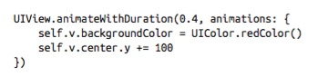

不仅可以让自己动，也可以让其他 view 动：


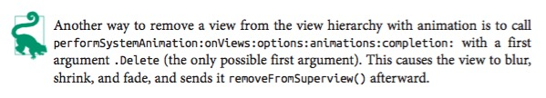


## View Animation Options

完整的动画函数是：

`animateWithDuration:delay:options:animations:completion:`

这里提一下 `options` 中可能的选项(`UIViewAnimationOptions`)

+ Animation curve: 控制动画速率的曲线
	+ `.CurveEaseInOut` 默认
	+ `.CurveEaseIn`
	+ `.CurveEaseOut`
	+ `.CurveLinear` 恒定的速度
+ `.Repeat` 控制重复
+ `.Autoreverse` 动画会反过来再播一次，注意一般来说也需要对 view 做对应的修改保证动画效果一致性

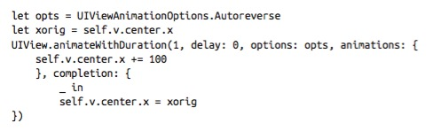

## Canceling a View Animation

假设我们有这样一个动画


如果我们有一个按钮是取消这个动画的，可以用这个代码：

```swift
self.v.layer.removeAllAnimations()
```

但是这样会比较突兀，比较好的方式是在用户想要取消动画时，快速完成动画，像这样：


但假设我们想要取消像下面这个不断重复的动画呢：


可以使用 `.BeginFromCurrentState` 来保证动画的连贯性

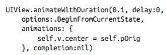

## Custom Animatable View Properties

也可以自定自己的属性来交给系统做动画，只要按照如下方法即可：

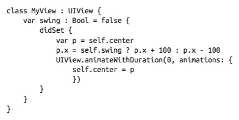

调用的时候是这样


## Springing View Animation

Springing view animation 有一个非常快的 ease-in 和一个非常慢的 ease-out


## Keyframe View Animation

可以在动画中加入关键帧，控制动画的整体效果。具体的插值计算是由 `CaculationMode`(`UIKeyframeAnimationOptions`) 来决定的

## Transitions

Transition 是用来强调 view 的内容的变化的动画，用下面两个方法之一来调用：

+ `transitionWithView:duration:options:animations:completion:`
+ `transitionFromView:toView:duratoin:options:completion:`

动画类型在 `options` 里设定，有下面这些 bitmask

+ `.TransitionFlipFromLeft`, `.TransitionFlipFromRight`
+ `.TransitoinCurlUp`, `.TransitionCurlDown`
+ `.TransitionFlipFromBottom`, `.TransitionFlipFromTop`
+ `.TransitionCrossDissolve`

具体可以这样用：

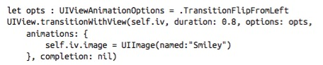

也可以让自定义的类有 transition 效果


## Implicit Layer Animation

layer 的动画是默认开启的，但是不会在 view 的 underlying layer 生效，并且只对已经在界面上的内容生效

## Animation Transactions

一系列动画会被组成一个 transaction 然后交由 animation server 处理。在这里可以关闭 implicit animation


## _resources Timing Functions

`CA_resourcesTimingFunction`，用来控制动画曲线

+ `kCA_resourcesTimingFunctionLinear`
+ `kCA_resourcesTimingFunctionEaseIn`
+ `kCA_resourcesTimingFunctionEaseOut`
+ `kCA_resourcesTimingFunctionEaseInEaseOut`
+ `kCA_resourcesTimingFunctionDefault`

不同定制的效果类似下图


代码就是


## Core Animation

是 iOS 动画技术的基础。

+ Core Animation 可以在 view 的 underlying layer 上工作，所以是 the only way to apply full-on layer property animation to a view
+ Permits fine control over the inter_resourceste values and timing of an animation
+ Allows animations to be grouped into complex combinations


这一部分也有很多细致的内容，会专门来写

## UIKit Dynamics

可以给 UI 添加真实的物理效果，比如重力，碰撞，反弹等等。不应该把 UIKit 当做一个游戏引擎。依赖于 `CADisplayLink`，所有的计算和 frame 都在主线程进行，并且动画是实时的。

要实现一个 UIKit dynamics 需要配置下面三个东西：

+ 一个 dynamic animator：`UIDynamicAnimator` 的实例，是一个物理规则 
+ 一个 behavior：`UIDynamicBehavor` 是描述 view 如何行动的规则，一般来说可以直接用内置的如 `UIGravityBehavior` 或者 `UICollisionBehavior`。配置好 behavior 就可以添加到 animator 上，例如使用 `addBehavior:`, `behaviors`, `removeBehavior:`, `removeAllBehaviors:`。可以随时进行修改，即使动画还在进行也没问题
+ 一个 item：是任何实现了 `UIDynamicItem` protocol 的对象。iOS 9 中还可以利用 `UIDynamicItemGroup` 来组合多个 item。

具体可以这样用：

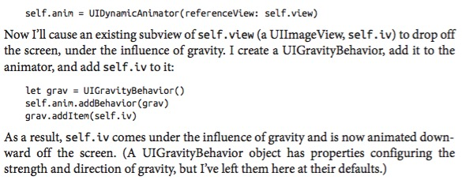

当一个对象移出屏幕时，我们还需要负责销毁，不然会有很大的浪费。我们可以在 action 中检测自己是否还在屏幕中，可以用如下代码进行：

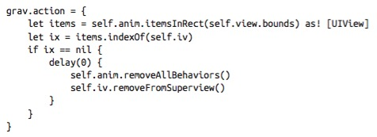

注意这里的 `delay(0)` 保证了确实销毁了不需要的对象。除了重力还可以添加碰撞，这里就用下面代码做示范：


## Custom Behavior

也可以根据自己的需要自定义 behavior，比方说可以组合一个自己的有 gravity, collision 和 bounce 的 behavoir

## Animator and Behaviors

`UIDynamicAnimator` 还有如下的方法和属性

+ `delegate`
+ `running`
+ `elapsedTime`
+ `updateTimeUsingCurrentState`


其他具体的属性参与苹果文档，这里只列出提纲

+ `UIDynamicItemBehavior`
+ `UIGravityBehavior`
+ `UIFieldBehavior`
+ `UIPushBehavior`
+ `UICollisionBehavior`
+ `UISnapBehavior`
+ `UIAttachmentBehavior`

## Motion Effects

可以利用这个来处理用户倾斜手机等姿势，这里略


# 第五章 触摸 Touches

Touch 会用一个 `UITouch` 实例对象来表示，这个对象会被封装在 `UIEvent` 中。不过通常来说我们并不需要直接去操心这些，很多东西系统都已经封装好了，我们只需要重写对应的方法即可。

但是了解 touch 本身还是很有用的，尤其是需要自定义一个 view 的时候。

## Touch Events and Views

从没有手指触碰开始，到手指离开，这之间的所有触摸和手指的移动组成了一个单独的 multitouch sequence。

在这个过程中，系统会告知你的 app 不同的状态，也就是 `UIEvent`。事实上，每个给你的 app 的 report 一定都是同一个 multitouch sequence 的同一个 `UIEvent` 实例。

每个 `UIEvent` 包含一个或多个 `UITouch` 对象。每个 `UITouch` 对象对应一个手指。一旦一个 `UITouch` 实例被创建后，在整个 multitouch sequence 中都用得是同一个实例。

系统只在如下四种情况发送 `UIEvent`:

+ `.Began`
+ `.Moved`
+ `.Stationanry`
+ `.Ended`

这四种状态可以描述所有的情况，顾名也可以思义这里就不解释。当然还有另外一种 `.Cancelled` 状态，发生在 multitouch sequence 被打断的情况，例如用户按了 home 键，来了个通知等等。

当一个 `UITouch` 发生时(`.Began`)，会把当前有效的 `UIView` 绑定到这个 touch 的 `view` 属性上，并且在整个 multitouch sequence 都不会改变

同一个 `UIEvent` 可以发送给多个 view，会把消息发送给其所有的 `UITouch` 所关联的 view。


## Receiving Touches

一个 `UIResponder`，也就是一个 `UIView` 有四个方法，对应触摸的四个阶段：

+ `touchesBegan:withEvent:`
+ `touchesMoved:withEvent:`
+ `touchesEnded:withEvent:`
+ `touchesCancelled:withEvent:`

一个 `UITouch` 有一些非常有用的方法和属性：

+ `locationInView:`, `previousLocationInView:`
	+ 在这个 touch 关联的 view 中当前和之前的触摸坐标，通常来说这个 view 是 self 或 self.superview。之前的位置基本上只在状态为 `.Moved` 时有用
+ `timestamp`: 用这个来了解触摸事件的持续时间
+ `tapCount`: 在同一个地方点击的次数
+ `view`: touch 所关联的 view
+ `majorRadius`, `majorRadiusTolerance`: 点击的范围和可以容忍的范围

`UIEvent` 有一些额外的属性

+ `type`: 这个会一直是 `UIEventType.Touches`
+ `timestamp`: 当事件发生时

所以我们说一个 view 接收了一个 touch，实际上指的是它不停收到包含 `UITouch` 的 `UIEvent`

## Restricting Touches

可以在 `UIApplication` 的 `beginIgnoringInteractionEvents` 中完全关闭触摸事件。通常来说我们在动画中就会这么做，当然要恢复需要 `endIgnoringInteractionEvents`。

一些 `UIView` 的属性对传输 touch 也有影响，比如

+ `userInteractionEnabled` 为 false 则不会接收 touch 事件，会直接落到下面的 view
+ `alpha` 为 0.0 的时候则不会接收 touch 事件，会直接落到下面的 view
+ `hidden` 为 true 的时候则不会接收 touch 事件，会直接落到下面的 view
+ `multipleTouchEnabled` 为 false 的时候则不会接收多于一个 touch，如果收到多个那么在处理完第一个之前都不会管其他的
+ `exclusiveTouch` 这个不能在 nib 编辑器中设置，指的是这个 view 只有在同一个 window 中的其他 view 都没有 touch 才能接收 touch，并且接收了之后其他 view 不能接收 touch

## Interpreting Touches

通常来说不用自己折腾 touch，用 gesture recognizer 可以完成大部分工作。为了处理 touch 基本上要用状态机的模式来编程，这会让整个架构变得非常 tricky

通过如下代码可以使得一个 view 跟着手指的移动来移动

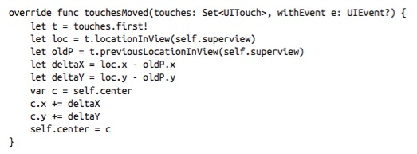

通过如下代码可以加上一些限制，使得 view 只能水平或者竖直移动


就需要在不同的方法中维护不同的属性了，即使只是加了这么一个限制代码已经很长，可读性也很差了，如果还想要区分长按和短按，单击和双击甚至是三击，肯定是一团乱

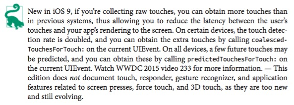

## Gesture Recognizer

`UIGestureRecognizer` 可以检查一个 multitouch sequence 是否为某个手势，但是并不是 `UIResponder`。每个 gesture recognizer 维护本身的状态，和其他的无关。当一个 gesture
recognizer 检测到了一个 gesture 时，就会发送一个(例如点击, discrete)或多个(例如移动, continuous)消息。

`UIGestureRecognizer` 本身是 abstract 的，但是内置了一些实现好的子类：

+ `UITapGestureRecognizer` discrete
	+ 可配置 `numberOfTapsRequired`, `numberOfTouchesRequired`
+ `UIPinchGestureRecognizer` continuous
	+ 可配置 `scale`, `velocity`
+ `UIRotationGestureRecognizer` continuous
	+ 可配置 `rotation`, `velocity`
+ `UISwipeGestureRecognizer` discrete
	+ 可配置 `direction`, `numberOfTouchesRequired` 
	+ `UIScreenEdgePanGestureRecognizer` 一个子类，检测从边缘开始的动作
+ `UILongPressGestureRecognizer` continuous
	+ 可配置 `numberOfTapsRequired`, `numberOfTouchesRequired`, `minimumPressDuration`, `allowableMovement`

通常来说直接在界面编辑器中拖进去，然后连接到代码是比较方便的做法

## Touch Delivery

下面是一个 touch 如何被转递给 view 和 gesture recognizer 的标准流程：

+ 进行 hit-test 判断那个 view 被触摸。然后这个 view 就会一直被关联到这个 touch 上，在这一层实现了触摸的定制，比方说 `userInteractionEnabled`, `hidden`, `alpha` 等等
+ 当 touch 的状况改变时，应用调用自己的 `sendEvent:`，进而调用 window 的 `sendEvent:`，window 通过调用下面的方法来调用合适的 touch 方法：
	+ 当 touch 第一次出现时，会考虑 `multipleTouchEnabled` 和 `exclusiveTouch`，如果满足条件，则：
		+ 该 touch 被传递给对应的 view 的 gesture recognizer
		+ 该 touch 被传递给对应的 view
	+ 如果一个 gesture 被检测出来，对于和这个 gesture recognizer 有关的 touch
		+ `touchesCancelled:forEvent:` 会被调用，touch 不再传递给对应的 view
		+ 如果这个 touch 还跟其他 gesture recognizer 有管理，其他的都直接设置为 fail
	+ 如果一个 gesture recognizer 失败了，那么 touch 不会再传递给它，但是它们还回呗传递给对应的 view
	+ 如果一个 touch 将要被传递给一个 view，但是这个 view 没有合适的处理 touch 的方法，responder 会顺着 responder chain 找到一个合适的并传递到那里

在这个标准流程中的每个部分几乎都可以进行一定程度的自定义。具体的不再介绍，可以看苹果的文档。

---

# 第六章 视图控制器 View Controllers

一个 view controller 管理一个单独的 view，称为 main view。

main view 没有指向 view controller 的指针，但是 view controller 是一个 `UIResponder`，在 responder chain 上是 view 的上一级，也就是 view 的 `nextResponder`

## View Controller Responsibilities

一个 view controller 必须有一个 view，也会提供 view 出现和消失时候的动画。大部分效果都有内置，但是如果你想要自己折腾的话，都是可以自由定制的。

View controller 可以自动保存和恢复状态，这个特性保证了你的 app 即使在被关闭后也可以从用户最后看到的界面重新开始。

最强大的 view controller 是 root view controller，它负责 root view，也就是在 view hierarchy 最顶端的那个。root view 作为 main window 的唯一直接 subview，是所有其他界面的 superview，并且被指定到 window 的 `rootViewController` 属性上。

root view controller 主要负责两个重要的决定：

+ 界面的旋转
+ status bar 的控制

## View Controller Hierarchy

在 iOS 中，不同的 controller 之间可以有两种坐标关系：

+ Parentage(包含)
	+ 一个 view controller 可以包含另一个 view controller
	+ 导航界面就是一个很好的例子
+ Presentation(modal views)
	+ 一个 view controller 展示另一个 view controller
	+ 可以是替换或者是添加，可以是完整或者是局部
	+ iOS4 及之前主要叫 modal view，现在更多叫 presented view，不过 modal view 的叫法还会出现在部分文档中

通常来说 view hierarchy 是自动的，不需要我们去手动操作。

举个例子，在下图中，我们可以看到两个界面元素


+ 导航栏，包含 logo
+ 故事列表，是一个 `UITableView`


+ 这个 app 的 root view controller 是 `UINavigationController`，`UINavigationController` 的 view 是这个 window 唯一的直接 subview，也就是 root view。导航栏是 root view 的 subview。
+ `UINavigationController` 包含第二个 `UIViewController`，是一个父子关系。这个子 controller 的 view 占据了屏幕的剩余部分，就是一个 `UITableView`。当用户点击这个 tableview 时，会有另一个 `UIViewController` 来取代这个 `UITableView`，但是导航栏会还在原地

这个例子中所有的都是 automatic 的，所以再举一个例子包含 manual 的部分


这是一个显示拉丁单词信息的 app，然后下面有一个工具栏，具体的 view hierarchy 如下


因为有很多拉丁单词，所以这里用 `UIPageViewController` 来进行展示，但是工具栏本身不应该在 `UIPageViewController` 的 view 中，所以

+ app 的 root view controller 是自定义的 `UIViewController` 子类，包含工具栏以及一个 `UIPageViewController` 的 view。这个自定的 view controller  的 view 可以通过成为 window 的 rootViewController` 来自动成为 root view 的 subview。
+ 这里需要手动把 `UIPageViewController` 添加到 `RootViewController` 的 view 中
+ 最后 `UIPageViewController` 自动显示 `CardController` 的 view。

这个 app 还有另一个模式，就是随机抽取并展示单词，虽然界面很像但是行为是完全不一样的


为了实现这个，我创建了另一个 `UIViewController` 的子类，叫做 `DrillViewController`，不同的是，这个 view controller 是被 `RootViewController` 给 present 的。


## View Controller Creation

创建 view controller 的实例和其他实例一样，新建并初始化

```swift
let llc = LessonListController(terms: self.data)
let nav = UINavigationController(rootViewController: llc)
```

一个 view controller 被创建后必须被保持以保证不被回收，这个会在 view controller 被添加进 view controller hierarchy 的时候完成。

被赋值到 `rootViewController` 属性的 view controller 会被对应的 window 保持，被当做子 view controller 的会被其父 view controller 保持，被 present 的 view controller 会由 present 它的 view controller 保持。

如果一个 view 是从 storyboard 中实例化的，会自动被保持，其机制也就是和上面描述的一致。

## How a View Controller Gets Its View

当一个 view controller 刚被实例化的时候，它是没有 view 的。View controller 是一个小且轻量的对象；View 因为包括了界面元素，会占据内存，是相对重的对象。因此，一个 view controller 会把获得 view 的时间尽量推迟，也就是在访问其 `view` 属性的时候，才 lazy initialize 之。

在处理一个新的 view controller 时，如果不需要用到 `view` 属性，就尽量不要引用，这样就避免触发创建一个新的 view。如何在不加载 view 的前提下知道一个 view controller 有没有对应的 view 呢？调用 `isViewLoaded` 方法。在 iOS 9 中，可以在不引用 view 的同时对 view 进行一些操作，使用 `viewIfLoaded`。我们可以使用 `loadViewIfNeeded` 显式加载 view，而不是把加载 view 作为其他操作的 side effect。

一旦一个 view controller 有了其对应的 view，`viewDidLoad` 方法就会被调用，这个方法是在代码中修改 view 的内容的最佳时机，比如说添加 subview，调整界面元素等等。

在 `viewDidLoad` 被调用之前，view controller 必须获取它的 view。如果你想要对 view 做一些自定义操作的话，就必须理解 view controller 是怎么获得 view 的。

整个过程不难，但是很精妙，因为有多种可能，例如

+ View 可能由 view controller 中的代码手动创建
+ View 可能自动被创建为一个空的通用的 view
+ View 可能在其独立的 nib 文件创建
+ View 可能由其 view controller 的 nib 文件创建

### Manual View

要手动提供 view 的话，需要实现 `loadView` 方法，创建一个 `UIView` 的实例，然后赋值给 `self.view`。在这里一定不能调用 `super`

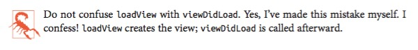

举个例子，如果我们完全在代码中对视图进行初始化，需要这么做：

1. 需要一个 `UIViewController` 的子类，创建一个 Cocoa Touch Class
2. 命名为 `RootViewController`，父类是 `UIViewController`，取消勾选创建 xib 文件
3. 保存文件

在 `RootViewController.swift` 中，我们需要实现 `loadView`，并且加一些东西显示上去：

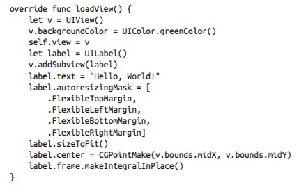

这个时候我们还没有把 RootViewController 添加到 view hierarchy 中（事实上我们还没有 view hierarchy），所以在 `AppDelegate.swift` 中修改 `application:didFinishLaunchingWithOptions:`，创建一个 RootViewController 实例并且设置为 window 的 `rootViewController`:

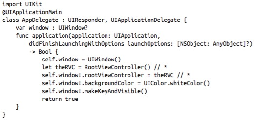

运行 app 就可以看到对应的结果了。

我们创建 view controller 的 view 时，没有给定 frame，因为这个事情由其他人做了，在这里是由 window 完成，因为 window 将把这个 view 作为其 subview。要注意 view controller 的 view 的尺寸可能会变。

### Generic Automatic View

上个例子有一个不好地方是，创建 view 和配置 view 放在了一起，理论上来说，最好把配置的过程放在 `viewDidLoad` 中，如下所示

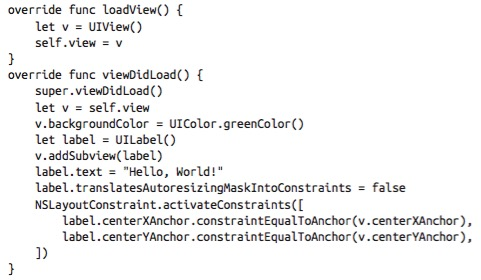

如果我们这么写代码的话，其实连 `loadView` 方法都不需要自己重写。如果没有手动提供 view 的话， `UIViewController` 的默认实现是会自动生成一个通用的 `UIView` 的（其实就跟 `loadView` 方法中做的事情一样）。如果我们不想要默认的 `UIView` 而是我们自定的 `UIView` 子类的话，就需要在 `loadView` 方法中手动创建。

### View in a Separate Nib

也可以通过 nib 文件来创建 view，这样的好处是可以可视化进行编辑。

载入 nib 文件时，view controller 已经被创建，会成为 nib 的所有者。nib 载入的时候，view controller 通过 nib-loading 机制来获取它的 view。

我们先从 `.xib` 文件弄起，之后再用 storyboard（这样有助于理解）

在 `.xib` 文件中，nib 的所有者由 File's Owner 代理对象表示。因此，需要进行如下两个设置：

+ File's Owner 类必须设置为 `UIViewController` 的子类
+ File's Owner 代理现在有一个 outlet，对应于 `UIViewController` 的 `view` 属性。这个 outlet 必须与 view 连接

先删除 `loadView` 和 `viewDidLoad` 中的代码，因为这次我们要在 nib 文件中创建，然后进行如下步骤：

1. 选择 File -> New -> File and specify iOS -> User Interface -> View. 这是一个包含 `UIView` 对象的 nib 文件。点击下一步
2. 重命名为 `MyNib.xib`，放到合适的地方，点击创建
3. 编辑 `MyNib.xib`
	+ 把 File's Owner 类设置为 `RootViewController`
	+ 把 File's Owner 的 `view` 的 outlet 连接到这个 view 对象 
4. 用编辑器对 view 做一些修改

接下来就是载入 nib 文件了，回到 `AppDelegate.swift` 中，在我们创建 `RootViewController` 实例的方法中把原来的：

```swift
let theRVC = RootViewController()
self.window!.rootViewController = the RVC
```

替换成

```swift
let the RVC = RootViewController(nibName:"MyNib", bundle:nil)
self.window!.rootViewController = the RVC
```

给 bundle 赋值为 nil 等于是指定 main bundle，通常来说这样就可以。

还有一个技巧，默认的 init 函数在初始化的时候会查找同名的 nib，并进行载入，所以我们可以把 `MyNib.xib` 名字改为 `RootViewController.xib` 然后用下面的代码就可以自动载入对应的 nib

```swift
let the RVC = RootViewController()
self.window!.rootViewController = the RVC
```

这又带来了一个问题，nib 并不是一个 controller，但是名字里却有 controller，所以可以把名字改为 `RootView.xib`，运行之后可以发现仍然是能够正确载入的。

如果在之前创建 `UIViewController` 的子类的时候勾选了创建对应的 xib 文件，那么会自动生成并且连接好需要连接的东西。

另外，如果命名为 `RootViewController~ipad.xib`，那么在用 ipad 打开时，会自动读取这个文件，是一个很方便的做法。

现在我们可以总结一下 view controller 如何获得一个 view：

1. 当 view controller 第一次需要使用 view 时，会调用 `loadView`
2. 如果重写了 `loadView`，就可以在代码中创建 `view`，不要调用 `super`。如果这样么做的话，创建完成
3. 如果没有重写 `loadView`，就会使用默认的实现，也就是载入 view controller 相关联的 nib。这也就是为什么我们重写 `loadView` 时不能调用 super，调用的话就会既从代码创建，又从 nib 创建了
4. 如果之前的步骤都没有成功，也就是既没有重写 `loadView` 也没有对应的 nib 文件，就会创建一个通用的 `UIView`

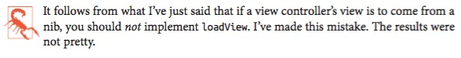

### Nib-Instantiated View Controller

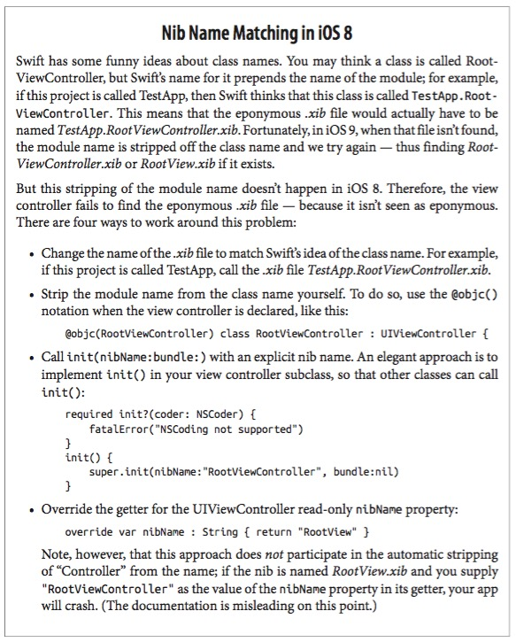

我们同样可以从 nib 文件读取 view controller，举例如下：

1. File -> New -> File and specify iOS -> User Interface -> Empty，点击下一步
2. 命名为 `Main.xib`，保存到合适位置，点击下一步
3. 编辑 `Main.xib`，拉一个 plain vanilla View Controller 对象到画布中
4. 可以看到这个 view controller 中有一个 view 对象，选择并删除它（不要担心，之后会详细说明）

然后在 `AppDelegate.swift` 用代码载入这个 view controller：

```swift
let arr = UINib(nibName: "Main", bundle: nil).instantiatedWithOwner(nil, options: nil)
self.window!.rootViewController = arr[0] as? UIViewController
```

然后就可以对这个 view controller 进行操作了。

我们同样也可以对 view controller 中的 view 指定另外的 nib 文件（Attributes inspector中），这个等于调用 `init(nibName:bundle:)`

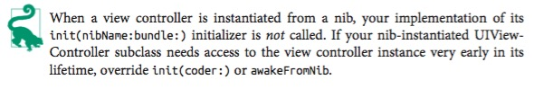

### Storyboard-Instantiated View Controller

Storyboard 等于是把之前的 nib 文件用可视化的形式展示了出来，实际上是一个 nib 文件的 bundle，每个 view 可以对应单独的 nib 文件，并且在需要的时候进行初始化。

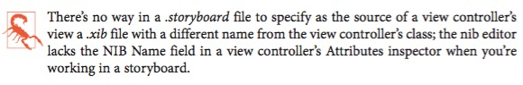

Xcode 的 app 模板有一个 `Main.storyboard`，在 `Info.plist` 的 `UIMainStoryboardFile` 中指定。当应用启动时，`UIApplicationMain` 通过调用 `UIStoryboard` 的构造器 `init(name:bundle:)` 来实例化最初的 view controller（`instantiatedInitialiViewController`）并且指定为 `rootViewController`。

添加 segue 之后，在跳转的时候会自动初始化目标 view controller。

在 Xcode 7 中，对于对于多个 storyboard 的调用方便很多，可以根据功能和分工来使用多个 storyboard 并在主 storyboard 中进行引用，方便团队协作。

有了一个 storyboard 实例后，view controller 可以通过以下四种方式之一来进行实例化：

+ 至多一个 view controller 可以被设置为最开始的 view controller，调用 `instantiateInitialViewController` 会返回这个实例
+ 一个 view controller 可以有一个字符串标识符，叫做 storyboard id（Identity inspector 中），也可以调用 `instantiateViewControllerWithIdentifier:`，会返回这个实例
+ 父类被实例化时，子类也会自动被实例化，比如 `UINavigationController`
+ 如果是 segue 的目标 view controller，会在触发是进行实例化

## View Resizing

一般在 view controller 中进行 view 的尺寸的对应调整。

在 Nib 编辑器中编辑都是给定的尺寸，如果不做调整，在不同设备会有不同的效果。

### Bars and Underlapping

通常来说，界面上还有有其他一些元素，需要在设计时进行考虑：

+ root view 会被放置在状态栏的下面，状态栏是透明的
+ root view 会被放在诸如导航栏、工具栏、tab bar 的下面，注意不要被这些元素遮挡

这些界面元素可能出现，也就是说高度随时可能改变，这里主要使用 view controller 的 layout guides（`topLayoutGuide` 和 `bottomLayoutGuide`）

最方便的做法就是结合 autolayout 和 constrains，iOS 9 中有一些新的属性：

+ topLayoutGuide 的 `bottomAnchor`
+ bottomLayoutGuide 的 `topAnchor` 

如果需要进行布局计算，可以通过 main view 的 `length` 属性，注意，在 `viewDidLoad` 中这个属性不可用，最早可以使用是在 `viewWillLayoutSubviews` 方法中，在 iOS 9，可以使用 `heightAnchor` 属性

**状态栏可见性**

可以通过重写下面方法来进行定制

+ `preferredStatusBarStyle`
	+ 可以选择 `UIStatusBarStyle` 的 `.Default` 或者 `.LightContent`，也就是深色文字和浅色文字，注意选择对比度高能看清的即可
+ `prefersStatusBarHidden`
	+ 返回 true 则状态栏不可见，调用 super 则是默认的设置
+ `childViewControllerForStatusBarStyle`
+ `chileViewControllerForStatusBarHidden`
	+ 用 delegate 来改动 child view 的状态栏
	+ 例如 tab view controller 中根据不同的 tab 来进行改动

这些方法都不需要自己去调用，如果想要改动立即生效，在 view controller 调用 `setNeedsStatusBarApplearanceUpdate`，如果这个是在 animation block 中调用的话，还可以设定动画方式 `preferredStatusBarUpdateAnimation`，可选的值有 `.Fade`, `.Slide`, `.None`

改动可见性会使得高度有 20 points 的变化，这也是会让界面忽然出现改变，不想这样的话，在同一个 animation block 中调用 `layoutIfNeeded` 方法，这样就会有比较自然的动画效果：

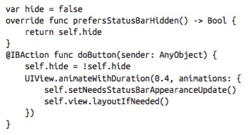

如果你的 view controller 的上一级是 navigation controller 或者 tab bar controller，可以通过一些属性来知道 top bar 和 bottom bar 的状态

+ `edgesForExtendedLayout`
	+ `UIRectEdge`，模式是 `.All`，表示当前 view controller 会在半透明的top bar 或者半透明的 bottom bar 之下，其他的选择有 `.None` 表示不会在 top/bottom bar 之下以；`.Top`，表示只在 top bar 之下；`.Bottom`，表示只在 bottom bar 之下
+ `extendedLayoutIncludesOpaqueBars`
	+ 如果是 ture，即使 top/bottom bar 是不透明的也会应用上面设置的规则

### Resizing Events

下面这些方法主要跟旋转有关，以及 iOS 9 中新增的 iPad 多任务处理有关

+ `willTransitionToTraitCollection:withTransitionCoordinator:`
	+ 当 app 要产生 trait collection 变化的时候（size classes 将要改变）
	+ 在启动时或者 view controller 的 view 第一次被嵌入到界面中时不会调用
	+ 如果重写这个方法，记得调用 `super`
	+ `UIViewController` 通过 `UIContentContainer` 协议以接收这个事件
+ `viewWillTransitionToSize:withTransitionCoordinator:`
	+ 新的尺寸是第一个参数，旧的尺寸仍旧可用 `self.view.bounds.size`
	+ 在启动时或者 view controller 的 view 第一次被嵌入到界面中时不会调用
	+ 如果重写这个方法，记得调用 `super`
	+ `UIViewController` 通过 `UIContentContainer` 协议以接收这个事件
+ `traitCollectionDidChange:`
	+ 在 trait collection 改变之后发送。参数是老的 trait collection，新的 trait collection `self.traitCollection`
	+ 在启动时或者 view controller 的 view 第一次被嵌入到界面中时会调用，并且参数为 nil
	+ `UIViewController` 通过 `UITraitEnvironment` 协议以接收这个事件

`UIViewController` 还回收到它的 view 的一些事件：

+ `updateViewConstraints`
	+ 要更新 constraints
	+ 启动时会被调用
	+ 如果重写，记得调用 `super`
+ `viewWillLayoutSubviews`
+ `viewDidLayoutSubviews`
	+ 在 view 接收 `layoutSubview` 方法之前之后发送
	+ 启动时会被调用

这些事件发送的顺序是：

+ `willTransitionToTraitCollection:withTransitionCoordinator:`
+ `viewWillTransitionToSize:withTransitionCoordinator:`
+ `updateViewConstraints`
+ `traitCollectionDidChange:`
+ `viewWillLayoutSubviews`
+ `viewDidLayoutSubviews`

不能保证每个方法都只会发送一次

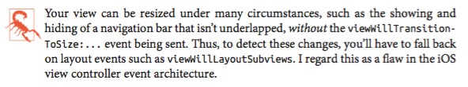


### Rotation

iOS 7 及之前，旋转都是一个幻觉，实际上是 window 没有变化。iOS 8 及之后才算是真正的『旋转』。旋转的过程如下：

+ 状态栏方向改变
	+ 目前的方向可以通过 `UIApplication` 的 `statusBarOrientation` 获取
	+ `UIInterfaceOrientation` 的可能值有
		+ `.Portrait`
		+ `.PortraitUpsideDown`
		+ `.LandscapeLeft`
		+ `.landscapeRight`
	+ 两个便捷方法 `UIInterfaceOrientationIsLandscae` 和 `UIInterfaceOrientationIsPortrait` 接收一个 `UIInterfaceOrientation` 并返回一个布尔值
+ view controller 的 view 的尺寸改变
	+ 通常通过 `viewWillTransitionToSize:withTransitionCoordinator:` 来了解方向的改变
	+ 对于 iPhone 来说主要专注 90 度旋转，那么主要是 `willTransitionToTraitCollection:withTransitionCoordinator:`

有两个旋转的互补使用方法：

+ Compensatory rotation
+ Forced rotation

这里主要是用于处理 90 度旋转的情况，因为可能需要做一定的界面改动

**Permitting compensatory rotation**

默认来说，对于 iPhone 支持除了 Upsidedown 的其他三种方式，iPad 则是全部支持。如果需要做一些改动，有以下三种改动的层级：

+ 应用本身
	+ 在 `Info.plist` 的 `UISupportedInterfaceOrientations` 设置
	+ 在 app target 的 general bar 中设置
+ 在 App Delegate 中
	+ 这个设置会覆盖 `Info.plist` 的设置，也就是说可以动态修改, bitmask
	+ `application:supportedInterfaceOrientationForWindow:` 会在每次设备旋转是至少调用一次
+ 最顶层的 view controller，也就是 root view controller 或者某个全屏 view controller
	+ 实现 `supportedInterfaceOrientations`, bitmask
	+ 也可以实现 `shouldAutorotate`

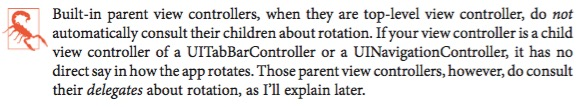

上面哥提到的 bitmask 是 `UIinterfaceOrientationMask`，可以是下面的一个或者多个组合

+ `.Portrait`
+ `.LandscapeLeft`
+ `.LandscapeRight`
+ `.ProtraitUpsideDown`
+ `.Landscape` (Left 和 Right 的组合)
+ `.All` 四种
+ `.AllButUpsideDown` 三种

例如：

```swift
override func supportedInterfaceOrientations() -> UIInterfaceOrientationMask {
	return .Portrait
}
```

想要知道当前的方向

```swift
let orientation = UIDevice.currentDevice().orientation
```

可能的返回值有：`.Unknown`, `.Portrait` 以及其他的选项。全局便捷方法 `UIDeviceOrientationIsPortrait` 和 `UIDeviceOrientationIsLandscape` 接收一个 `UIDeviceOrientation` 变量并返回一个布尔值。

当你接收到一个旋转相关的事件时，设备的方向已经改变了

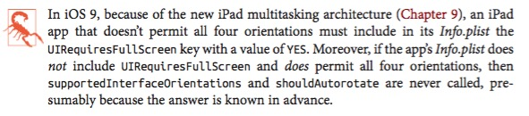

**Initial orientation**

在 iPad 上没有特定的初始化方向，理论上来说会以当前设备最可能随处的方向来启动。

在 iPhone 上，以 iOS 9 来说，如果在 `Info.plist` 中方向设为`UIInterfaceOrientationPortrait`，初始方向就是竖直。用户启动 app 时会先以竖直显示然后切换到水平。

如果没有指定竖直，那么就会直接以水平显示，具体的顺序可以自己安排。

如果指定了竖直，但是 root view controller 不支持竖直，那么 app 会在具体布局之前先以竖直载入然后旋转到水平。

**Initial layout** 

如果你有一些设置初始布局的代码，要放到哪里呢？虽然具体的顺序跟设备当前的方向有关，但是以下是肯定的：

+ `viewDidLoad`
	+ 通常在这里操作，因为方便，会尽可能早只调用一次
	+ 虽然 view 已经载入，但是并没有被插入到界面中，所以还没有对应的尺寸
	+ 如果不依赖与具体的尺寸（比如说 autolayout），那么可以在这里操作
+ `traitCollectionDidChange`
+ `viewWillLayoutSubviews`

如果想要在屏幕中央插入一个小黑方块，下面代码是错误的：

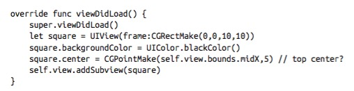

因为这时候 `self.view` 可能还没有对应的尺寸，如果加入 autoresizing 可能会好一些：

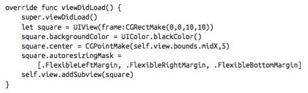

当然如果用 autolayout 是最好的

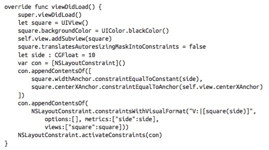

即使 view 的尺寸会变化，但是我们添加的 constraints 会保证小黑方块出现在我们想要的位置。

如果我们打算在 `traitCollectionDidChange` 或者 `viewWillLayoutSubviews` 进行设置，需要处理的问题是这两个方法可能会被调用不止一次，解决方法是设定一个布尔值用作开关：

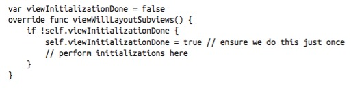

**Responding to rotation**

切换方向是不但可能需要改变尺寸，可能还需要增加或者删除一些 view。我们可以利用 autolayout 来实现（通过设定不同的 trait collection）

## Presented View Controller

原来叫做 modal view controller，是用一个完整界面取代另一个的最简单方式（但是原来的 view 还在，只是这个 view 跳出来覆盖了而已，只有当当前 view 消失后，原本的 view 才出现）

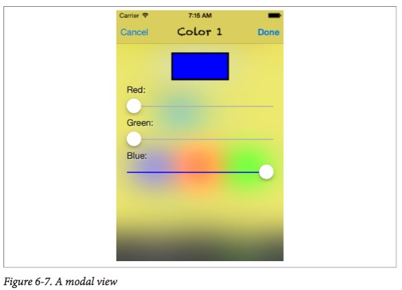

现在 presented view controller 有了更多的可能：（这两个都是原先在 iPad 上，后来 iPhone 也可以使用的特性）

+ 可以只取代界面中的一个 subview
+ 可以只部分覆盖当前的界面，当前的界面不会被移除

### Presenting a View

最重要的让 view 出现和消失的两个方法是：

+ `presentViewController:animated:completion:`
+ `dismissViewControllerAnimated:completion:`

可以在这里设置动画已经切换完成后需要指定的代码。

presenting view controller（就是被要出现的 presented view 遮挡住的 view 的 controller）不一定是那个你需要发送 `presentViewController:animated:completion:` 的 controller。

我们先来看看 view controller 在 presenting 一个 view controller 时可能的三个角色：

+ Presented view controller
	+ 指定的第一个参数
+ Original presenter
	+ 接收 `presentViewController:animated:completion:` 方法的 view controller，也叫做 source
+ Presenting view controller
	+ 被遮住的那个 view 的 controller

这三个对象任何一个都可以接收 `dismissViewControllerAnimated:completion:` 方法，runtime 会找到对应的 `presentingViewController`。

一个 view controller 至多可以有一个 `presentedViewController`。如果你对一个 `presentedViewController` 不为 nil 的 view controller 发送 `presentViewController:animated:completion:`，什么事情都不会发生，completion 中的代码也不会执行。

但是一个 presented view controller 本身也可以 present 一个 view controller，所以这就可以弄出一个链条了。

如果你对一个 `presentedViewController` 为 nil 的 view controller 发送 `dismissViewControllerAnimated:completion:`，什么事情都不会发生，completion 中的代码也不会执行。

我们可以在 storyboard 中方便地完成连接，只要用 modal segue 连接两个 view controller 即可，这里我们不用这个方式，因为 modal segue 会自动调用 `presentViewController:animated:completion:`，我们来试试看自己调用。

我们先创建一个 Single View Application（通过模板），然后我们加第二个 view controller 进去：

1. File -> New -> File and specify iOS -> Source -> Cocoa Touch Class。点击下一步
2. 命名为 `SecondViewController`，确定是 `UIViewController` 的子类，勾选 xib 的框（这样我们可以在 nib 中设计界面，当然也可以用 storyboard，但是这里是要学东西，所以就不用 storyboard 自动处理）。点击下一步
3. 确保放在了合适的位置。点击创建
4. 编辑 `SecondViewController.xib`，随便加点什么东西让它和之前的不一样
5. 现在需要一个方式来激活这个 view，在第一个 view 中加一个按钮，连接一个叫 `doPresent` 的 aciton 到 `ViewController.swift` 中（这个就是模板自己生成的）
6. `doPresent` 的代码如下：

```swift
@IBAction func doPresent(sender:AnyObject?) {
	let svc = SecondeViewController(nibName: "SecondeViewController", bundle: nil)
	self.presentViewController(svc, animated:true, completion: nil)
}
```

运行就可以发现一切正常，但是现在我们没有办法退回去，所以在 `SecondViewController.xib` 中加一个按钮，然后连接一个 action 到 `SecondViewController.swift` 中：

```swift
@IBAction func doDismiss(sender:AnyObject?){
	self.presentingViewController!.dismissViewControllerAnimated(true, completion: nil)
}
```

### Communication With a Presented View Controller

从 original presenter 向 presented view controller 发消息比较简单，因为有一个指向它的引用，比方说 presented vew controller 有一个 `data` 属性，那么就可以这样传值：

```swift
IBAction func doPresent(sender:AnyObject?){
	let svc = SecondView(nibName:"SecondViewController", bundle: nil)
	svc.data = "This is very important data!"
	self.presentViewController(svc, snimated: true, completion: nil)
}
```

但是从 presented view controll 传值到 original presenter 就比较有趣，因为我们需要知道 originalpresenter 是什么，但是我们并没有指向它的引用。再进一步，presented view controller 需要知道由 original presenter 实现的某些方法的签名，这样它就可以调用并且传递信息。通常的做法是通过代理：

1. presented view controller 定义一个协议，声明一个方法，这个方法会在其 dismiss 之前被调用
2. original presenter 接收这个协议，并且实现对应的方法
3. presented view controller 提供一个方法能够获取到实现对应方法的对象
4. 这样当 original presenter 创建和配置 presented view controller 的时候也就把自己的引用通知给了它

看起来很复杂，看一个例子就明白了。

我们先修改 `SecondViewController.swift`:

```swift
protocol SecondViewControllerDelegate : class {
	func acceptData(data: AnyObject!)
}
class SecondViewController : UIViewController {
	var data : AnyObject?
	weak var delegate : SecondViewControllerDelegate?
	@IBAction func doDismiss(sender:AnyObject?){
		self.delegate?.acceptData("Even more important data!")
	}
}
```

现在我们回到 `ViewController.swift`，要做的是声明 `SecondViewControllerDelegate` 然后把自己设置为 SecondViewController 的代理。当代理方法被调用时，ViewController 就能接收到数据，之后 dismiss SecondViewController:

```swift
class ViewController : UIViewController, SecondViewControllerDelegate {
	@IBAction func doPresent(sender:AnyObject?){
		let svc = SecondViewController(nibName: "SecondViewController", bundle: nil)
		svc.data = "This is very important data!"
		svc.delegate = self
		self.presentViewController(svc, animated:true, completion:nil)
	}
	func acceptData(data:AnyObject!){
		// do something with data here
		self.dismissViewControllerAnimated(true, completion: nil)
	}
}
```

如果不想一切都让 ViewController 操心，而让 SecondViewController 自己负责消失，并且自动回传数据的话，可以利用 `viewWillDisappear` 来进行，代码改成这样：

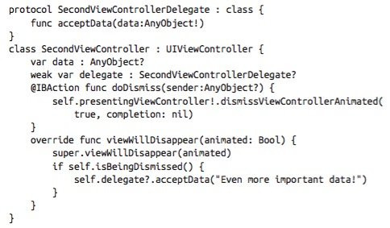

如果是用 storyboard，那么又会有一点不一样，在 original presenter（segue 开始的那个 view controller）中实现 `prepareForSegue:sender:`，在这个方法中可以传递数据。dismiss 的时候用 presented view controller 自己的 `prepareForSegue:sender:` 方法来传递数据，这个后面会详细说。

### Presented View Animation

除了内置的一些简单动画，也可以自己提供动画效果。

内置动画在 presented view controller 的 `modalTransitionStyle` 属性中设定，可选的有值有（`UIModalTransitionStyle`）:

+ `.CoverVertical` 默认
	+ 从底向上滑出
+ `.FlipHorizontal`
	+ 像一张纸的两面一样，这种情况下用户可以看到 window（一瞥），合理设置好背景颜色
+ `.CrossDissolve`
	+ 渐显效果
+ `.PartialCurl`
	+ 翻页一样的效果，但是第一个 view 还会保留在左上角

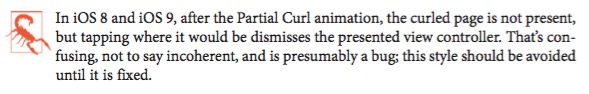

### Presentation Styles

除了全屏覆盖，还有一些其他的内置选项，或者，也可以自己进行设置

在 presented view controller 的 `modalPresentationStyle` 属性中设定，可选的有值有（`UIModalPresentationStyle`）:

+ `.FullScreen`
	+ 默认，界面全部替换
+ `.OverFullScreen`
	+ 和之前的类似，但是不会被替换，如果之后的界面有一定透明，可以看到之前的界面
+ `.PageSheet`
	+ 在 iPad 和 iPhone 6/6s Plus 上会窄一点，后面的部分会变暗，在其他设备上和全屏一致
+ `.FormSheet`
	+ 与`.PageSheet` 类似，更小更窄一些，在 iPad 和 iPhone 6/6s Plus 上会窄一点，后面的部分会变暗，在其他设备上和全屏一致
+ `.CurrentContext`
	+ presenting view controller 可以是任何 view controller，比如 child view controller，presented view controller 只会取代这个子视图，也就是屏幕一部分的位置
+ `.OverCurrentContext`
	+ 与 `.CurrentContext` 类似，但是不是取代，原来的还在，如果之后的界面有一定透明，可以看到之前的界面

### Adapative Presentation

在使用 `.PageSheet` 和 `.FormSheet` 的时候，有另外一个机会来指定 `modalPresentationStyle` 甚至连 view controller 都可以指定不一样的，这就叫做 adaptive presentation。

### Rotation of a Presented View

当 presented view controller 被展示的时候，就处于最顶层，那么 `supportedInterfaceOrientations` 同样是有效的，如果这个时候所支持的方向和设备目前的方向不一致，可以强行改变屏幕的方向（也是官方唯一准许的强制旋转的方式）

重写 `preferredInterfaceOrientationForPresentation` 方法来指定初始方向：

```swift
override func preferredInterfaceOrientationForPresentation() -> UIInterfaceOrientation {
	return .LandscapeLeft
}
```

## Tab Bar Controller

tab bar 是一个独立的界面对象，但是一般都和 tab bar controller 一起用（`UITabBarController`, `UIViewController` 的子类）。

如果需要在不子类化 `UITabBarController` 的前提下控制方向，实现下面的方法：

+ `tabBarControllerSupportedInterfaceOrientations:`
+ `tabBarControllerPreferredInterfaceOrientationForPresentation:`

关于状态栏，tab bar controller 实现了 `childViewControllerForStatusBarStyle` 和 `childViewControllerForStatusBarHidden` 方法，所以会根据当前正在显示的 child view controller 来决定状态栏

### Tab Bar Items

属于 `UITabBarItem`，继承自 `UIBarItem`（一个抽象类，提供一些重要属性如 `title`, `image`, `enabled`）

有两种方法可以创建 tab bar item:

+ 用系统自带的：使用 `init(tabBarSystemItem:tag:)` 来实例化 child view controller 的 `tabBarItem`。注意，标题是不能改动的
+ 自己搞：使用 `init(title:image:tag:)` 来实例化 child view controller 的 `tabBarItem`，也可以自定点击的效果 `init(title:image:selectedImage:)`

图片的尺寸是 30x30 PNG 格式，如果尺寸大会自动缩小，注意图片只用作 mask，所以颜色什么的都不会显示，唯一能改的是 `tintColor`，也可以给 tab bar item 一个角标。

### Configuring a Tab Bar Controller

基本的配置很简单，把 view controller 设为其 children 即可。把这些 view controllers 放到一个数组里然后把 `UITabBarController` 的 `viewControllers` 属性赋值为这个数组。数组里的每个 view controller 的 `parentViewController` 都是这个 tab bar controller。一个简单的例子：

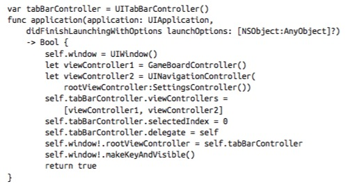

显示的顺序和数组中 view controller 的顺序一致。在把这个数组赋值给 tab bar controller 的 `viewControllers` 属性时 `tabBarItem` 就已经就绪了。

注意，调用 `viewDidLoad` 的时候还不能操作 `tabBarItem` 所以通常是在对应的 child view controller 中的初始化函数进行配置：

```swift
init() {
	super.init(nibName:nil, bundle:nil)
	// tab bar configuration
	self.tabBarItem.image = UIImage(named: "game.png")
	self.title = "Game"
}
```

一开始会选择第一个 child view controller，可以通过 `selectedViewController` 或者 `selectedIndex` 来知道现在在第几个 tab 中。

可以自定义 tab 切换时的动画。

在 storyboard 中可以很方便的进行设置，也可以直接使用项目模板来进行创建

## Navigation Controller

类似与堆栈，`UINavigationItem`。导航栏是一个独立的界面对象，但是通常来说和 navagation controller 一起用。

在堆栈 push 和 pop 的时候可以自定动画。

也可以包含一个工具栏，参考 Mail 应用。

关于旋转和状态栏的机制和 tab bar controller 很像，都是交由现在在展示的 view controller 

### Bar Button Items

有两种方式可以创建：

+ 基本的按钮
	+ 类似于一个简单的按钮
+ 自定义 view

`UIBarItem` 不是 `UIView` 的子类，一个简单的 bar 按钮没有 frame，也没有 `UIView` 的触摸处理。但是自定义 view 则是 `UIView`

具体来看看三种创建方式

+ 用系统的：`init(barButtonSystemItem:target:action:)`
+ 创建简单 bar 按钮：`init(title:style:target:action:)` 或者 `init(image:style:target:action:)`
+ 自定义 view: `init(customeView:)`

### Navigation Items and Toolbar Items

虽然 navigation 的堆栈是自动维护的，但是对于每个 child view controller，还是需要自己配置如下的 `UINavigationItem` 属性

+ `title` / `titleView`
+ `prompt`：字符串
+ `rightBarButtonItem` / `rightBarButtonItems`
+ `backBarButtonItem`：可以隐藏，也可以进行自定义（换成图片什么的）
+ `leftBarButtonItem` / `leftBarButtonItems`

### Configuring a Navigation Controller

配置的过程实际上就是操作堆栈的过程，这个堆栈是一个叫 `viewControllers` 的数组属性，虽然实际上很少需要直接对其操作。

最常见的操作方式就是 push 和 pop。初始化的时候一般用 `init(rootViewController:)`，例如

```swift
let fvc = FirstViewController()
let nav = UINavigationController(rootViewController:fvc)
```

添加的时候就是 push

```swift
let svc = SecondViewController()
self.navigationController!.pushViewController(svc, animated: true)
```

通常来说不需要担心返回的事情，会自动调用 `popViewControllerAnimated:`，当然也可以显式调用

还有另一种方式可以 push 一个 vieww controller 到 navigation controller 的堆栈中，这个方法不要 navigation controller 的引用，使用 `showViewController:sender:`

想要直接设置整个堆栈，用 `setViewControllers:animated:` 方法。想要删除位于中间的 view controller，直接操作堆栈是唯一的方法。

在堆栈顶的叫做 `topViewController`，view 被显示的 view controller 叫做 `visibleViewController`。通常来说这两个属性的值是相同的，但是不要忘了之前的 presented view controller，这可能导致不一样。

不同的 view controller 间传递数据和前面的 original presenter 和 presented view controller 相互间传递数据的机制是一样的，这里不再赘述。

在 child view controller 中想要配置 `navigatoinItem` 的话最好不要在 `loadView` 或者 `viewDidLoad` 中进行，最好是重写 `init(nibName:bundle:)` 或者 `init(coder:)` 或者 `awakeFromNib`。

可以通过 `navigationBar` 属性来访问导航栏，可以通过 `setNavigationBarHidden:animated:` 设置隐藏，下方的工具栏也可以通过 `setToolbarHidden:animated:` 来显示或隐藏。

navigation controller 可以自动隐藏或显示导航栏和工具栏，通过一些属性进行配置

+ 点击时
	+ `hidesBarsOnTap` 对应 navigation controller 的 `barHideOnTapGestureRecognizer`
+ 横扫时
	+ `hidesBarsOnSwipe` 上滑隐藏，下滑显示，对应 navigation controller 的 `barHideOnSwipeGestureRecognizer`
+ 在水平时
	+ `hidesBarsWhenVerticallyCompact`，如果开启了点击显示，这时点击会再次显示导航栏
+ 用户输入时
	+ `hidesBarsWhenKeyboardAppears`，键盘显示的时候导航栏自动隐藏

这些基本都可以在 Attributes inspector 中进行设置。

可以利用 Master-Detail 模板来开始，或者自己手动嵌入 Navigation Controller

## Custom Transition

可以自定义大部分的动画，如：

+ tab 切换的效果
+ stack 的 push 和 pop 的效果
+ presented 和 dismiss 的效果

具体的会单开一篇来介绍和演示，这里略过

## Page View Controller

`UIPageViewController` 可以通过手势来切换下一个或者上一个 child view controller

### Preparing a Page View Controller

使用 designated 构造器来初始化

`init(transitionStyle:navigationOrientation:options:)`

其中参数的含义是

+ `transitionStyle:` 决定动画效果 `UIPageViewControllerTransitionStyle`
	+ `.PageCurl`
	+ `.Scroll` 滚动
+ `navagationOrientation:` 决定方向 `UIPageViewControllerNavigationOrientation`
	+ `.Horizontal`
	+ `.Vertical`
+ `options:` 一个字典，根据不同的动画效果有不同的参数
	+ `UIPageViewControllerOptionSpineLocationKey` 翻页效果，翻页位置
		+ `.Min` (左或上)
		+ `.Mid` (中间，会显示两页)
		+ `.Max` (右或下)
	+ `UIPageViewControllerOptionInterPageSpacingKey` 滚动效果，页面的间隔，默认是 0

用下面的方法来指定 child view controllers

`setViewControllers:direction:animated:completion:`

下面是参数的含义

+ `viewControllers` 数组，每个元素是 1 个 view controller，用 `.Mid` 的话，每个元素是 2 个 view controller
+ 	`direction:`
	+ `.Forward`
	+ `.Backward` 
+ `animated:`, `completion:`
	+ 布尔值和完成之后要执行的操

还需要指定 `dataSource`，属于 `UIPageViewControllerDataSource` 协议，一个简单的例子：

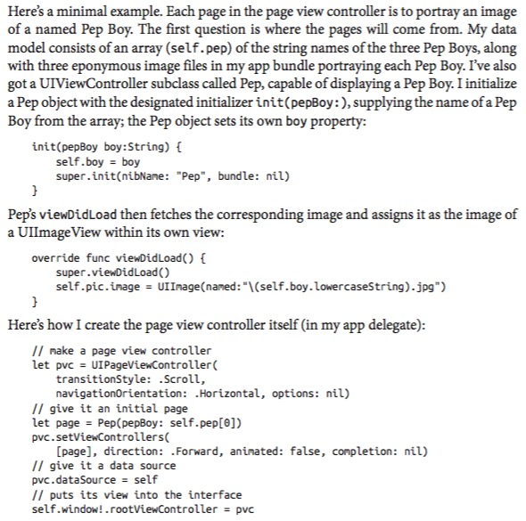

### Page View Controller Navigation

切换页面的时候，下面的数据源方法会被调用

+ `pageViewController:viewControllerAfterViewController:`
+ `pageViewController:viewControllerBeforeViewController:`
	
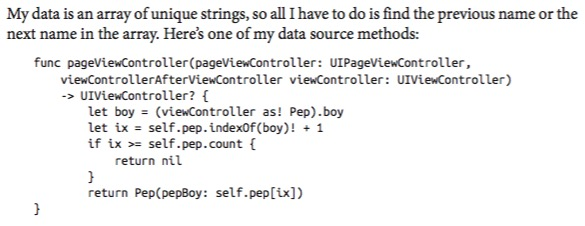

**Page indicator**

用滚动模式的话会自动有一个页面指示器，为此还需要多实现两个方法

```swift
func presentationCountForPageViewController(pageViewController: UIPageViewController) -> Int {
	return self.pep.count
}
func presentationIndexForPageViewController(pvc: UIPageViewController) -> Int {
	let page = pvc.viewControllers![0] as! Pep
	let boy = page.boy
	return self.pip.indexOf(boy)!
}
```

通常来说还需要设置一下颜色，因为默认的颜色是白点透明背景，但是因为不能直接访问，所以用 proxy 来做

```swift
let proxy = UIPageControl.appearance()
proxy.pageIndicatorTintColor = UIColor.redColor().colorWithAlphaComponent(0.6)
proxy.currentPageIndicatorTintColor = UIColor.redColor()
proxy.backgroundColor = UIColor.yellowColor()
```

**Navigation gestures**

drap 和 tap 可以设定不同的行为，例如可以设定要点击两次才能翻页

```swift
for g in pvc.gestureRecognizers {
	if let g = g as? UITapGestureRecognizer {
		g.numberOfTapsRequired = 2
	}
}
```

在 storyboard 中可以设置大部分的内容，但是初始化 child view controllers 需要在代码中执行

## Container View Controllers

`UITabBarController`, `UINavigationController`, `UIPageViewController` 是内置的三种 parent view controllers，它们都有 child view controllers。如果我们想要自己也做一个类似的，要怎么做呢？

使用 container view controller。

### Adding and Removing Children

包含一个 `childViewControllers` 数组，一个 child view controller 需要在某些时刻接收特定的事件：

+ 当它成为 child view controller 时
+ 当它的 view 被加入界面或者从界面中移除的时候
+ 当它不再是 child view controller 时

具体的会单开一篇来介绍和演示，这里略过

## Storyboards

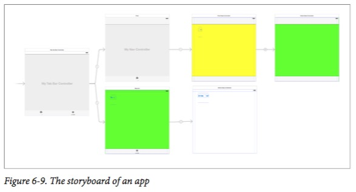


基本的情况介绍主要就是拖动界面和设置对应的内容，以及 segue 相关的内容，还有 storyboard reference 的内容，比较基础，这里略过。

### Unwind Segues

segue 可以完成一半的工作，因为有 push segue 但是没有 pop segue；有 present modally segue 但是没有 dismiss segue。

注意不能再多连一条相反方向的 segue，这样会创建一个新的 view controller 而不是返回到原来的。

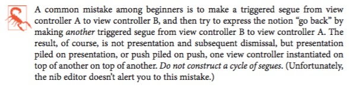

这个时候就是用 unwind segue 的地方了。

```swift
@IBAction func unwind(seg:UIStoryboardSegue!){
	// ...
}
```

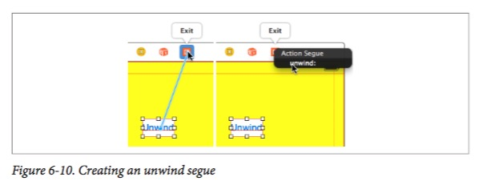

## View Controller Lifetime Events

可以通过重写这些方法，来在对的时间做对的事情：

+ `viewDidLoad`
	+ 这时 view controller 已经得到了它的 view，但是 size 还没有设置好
+ `willTransistionToTraitCollection:withTransitionCoordinator:`
+ `viewWillTransitionToSize:withTransitionCoordinator:`
+ `traitCollectionDidChange:`
	+ 前两个方法实现的时候需要调用 `super`，这是调整尺寸的地方
+ `updateViewConstraints`
+ `viewWillLayoutSubviews`
+ `viewDidLayoutSubviews`
	+ 实现第一个方法的时候需要调用 `super`
+ `willMoveToParentViewController:`
+ `didMoveToParentViewController:`
	+ 被作为 child view controller 添加或移除
+ `viewWillAppear:`
+ `viewDidAppear:`
+ `viewWillDisappear:`
+ `viewDidDisappear:`

具体的顺序大概是这样（这里是一个 UIViewController 被 push 到 navigation controller 的堆栈中）：

+ `willMoveToParentViewController:`
+ `viewWillAppear:`
+ `updateViewConstraints`
+ `traitCollectionDidChange:`
+ `viewWillLayoutSubviews`
+ `viewDidLayoutSubviews`
+ `viewDidAppear:`
+ `didMoveToParentViewController:`

当被 pop 走的时候，会收到这些消息：

+ `willMoveToParentViewController:` 参数为 nil
+ `viewWillDisappear:`
+ `updateViewConstraints`
+ `viewWillLayoutSubviews`
+ `viewDidLayoutSubviews`
+ `viewDidDisappear:`
+ `didMoveToParentViewController:` 参数为 nil

注意具体调用的次数不是一定的，所以不要让代码依赖于『每个方法按顺序执行各一次』这个假定
	
## View Controller Memory Management

一个避免使用太多内存的策略是，如果有资源暂时不用，就先释放掉。当内存过低时，view controller 会接收 `didReceiveMemoryWarning` 消息。

一个比较好的方法是 lazy loading，也就是只有需要用的时候才载入。

更底层的方法是把数据保存在磁盘中（例如 Cache 文件夹里）

要测试低内存的情况，选择 Hardware -> Simulate Memory Warning。

相当于调用以下方法（注意这个是隐藏 api，苹果不给用的）

`UIApplication.shareApplication().performSelector("_performMemoryWarning")`

## State Restoration

这里简要介绍一下如何测试

1. 正常启动应用
2. 某个时刻点击 home 按键
3. 回到 Xcode，点击 Stop
4. 重新运行这个 app，看看有没有从上次结束的时候开始运行

具体的会单开一篇来介绍和演示，这里略过


# 第 7 章 滚动视图 Scroll Views

`UIScrollView` 是这样一个 view，其内容比 bounds 要大，用户需要通过滚动和拖拽来查看所有内容，当然，我们也可以利用代码进行定位。

通常来说，其 `clipsToBounds` 属性会被设置为 true，这样在 scroll view 中的部分是可见的，以外的是不可见的。

scroll view 还支持以下功能：

+ 如何根据用户的手势来改变 bounds 的原点
+ 提供滚动指示器
+ 


