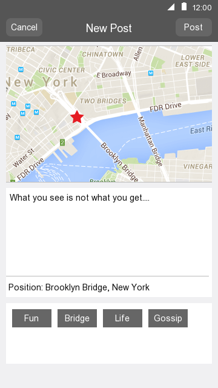

# Page Flow Doc V0.1

## 1 Main Page

Functions for this page:

1. Search different locations
2. Tag different spots
3. Find the current position
4. See other people's posts 

There are 3 different flow for uses:

1. "New Post" Button: Go to "2 New Post"
2. "Me" Button: Go to "3 About Me"
3. "Near By" Tab: Go to "4 Near By"

## 2 New Post

Functions for this page:

1. Input text for the post
2. Create tags for the post
3. Tag position for the post

There are 2 different page flow:

1. "Post" Button: create new post and come back to "1 Main Page"
2. "Cancel" Button: cancel editing and come back to "1 Main Page" 

## 3 About Me

Functions for this page:

1. View personal profile
2. Edit personal profile
3. View posts history

There are 2 different page flows:

1. Click the "Back" Button: Return to "1 Main Page"
2. Click different post: Go to "5 Post Detail"

## 4 Near By

Functions for this page:

1. View Nearby post from different user
2. Realtime mode to see what's going on 

There are 3 different page flows:

1. Click the "Back" Button: return to "1 Main Page"
2. Click the Avatar of different user: Go to "3 About Me"(For that user)
3. Click the Post: Go to "5 Post Detail"

## 5 Post Detail

Function of this page:

1. Comment on the current post
2. View Post detail

There are 2 different page flows:

1. Click the Avatar: Go to "3 About Me"(For that user)
2. Click the "Back" Button: return to the previous page

