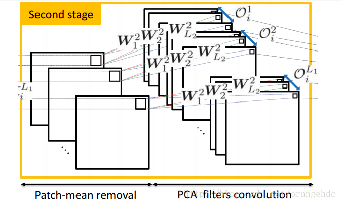

# 图像分类相关研究收集

<!-- MarkdownTOC -->

- 【拯救世界】 MNIST, CIFAR-10, CIFAR-100, STL-10, SVHN目前最佳分类结果(技术)汇总
- MATLAB and Octave Functions for Computer Vision and Image Processing
- PCANet, Simple Deep Learning Baseline for Image Classification
- 特征提取
- ImageNet winners after 2012
- 论文+代码:面向图像分类的多列深度网络(MCDNN)
- ECCV-2010 Tutorial: Feature Learning for Image Classification

<!-- /MarkdownTOC -->

可以考虑先用 l0 smoothing 处理之后再进行特征提取

## 【拯救世界】 MNIST, CIFAR-10, CIFAR-100, STL-10, SVHN目前最佳分类结果(技术)汇总

[地址](http://rodrigob.github.io/are_we_there_yet/build/classification_datasets_results.html)

## MATLAB and Octave Functions for Computer Vision and Image Processing

http://www.peterkovesi.com/matlabfns/

要好好研究

## PCANet, Simple Deep Learning Baseline for Image Classification

http://my.oschina.net/Ldpe2G/blog/275922

之前看过一句话，未来领域类专家需求将越来越少，而相应的数据挖掘专家需求将不断增加，这时因为深度学习的核心在于其自适应的特征提取。PCANet是一个基于CNN的简化Deep Learning模型。之所以读它是因为它是基于PCA(SVD)的，其卷积核从图像信号的某种SVD分解得到的，而这也是张量列分解的核心之一。与CNN相比，该网络卷积核是直接通过PCA计算得到的，而不是像CNN一样通过反馈迭代得到的。

从上图可以看到，PCANet的训练分为三个步骤(stage)，前两个stage很相似，都是去平均，然后PCA取主成分并卷积，最后一步是二值化和直方图量化。下面按步骤介绍PCANet的训练过程：

一、特征提取

1、First stage:

1)、选取一个k1×k2的窗口(通常为3×3、5×5、7×7)来滑动选取图片的局部特征。每张m×n大小的图片Ii经过滑动窗口提取局部特征之后，就变成了(m−k1+1)⋅(n−k2+1)个k1k2大小的patch(注：在论文中patch个数是mn，代码中是(m-k1+1)(n-k2+1), 为方便书写，以下都写为mn),将其写成k1k2×mn列的矩阵Bi，每一列代表一个局部特征patch。相应的滑动选取公式为：

xij=Vec(Ii(j1:j1+k1−1,j2:j2+k2−1))
其中j=j1+(j2−1)∗(m−k1+1).

2)、将以上矩阵按列进行去平均，便完成了对单张图片的特征提取操作。

3、对所有N张图片执行以上操作，将特征并排在一起，得到一个新的数据矩阵X，每一列含有k1k2个元素，一共有Nmn列。

4、对这个X矩阵做PCA，取前L1个特征向量，作为该步骤的filter。

5、把这L1个特征向量的每一列（每一列含有k1k2个元素）重排列为一个patch，这样就得到了L1个k1×k2的卷积核{Wil}L1l=1。

6、然后就是对每一张图片，都用这L1个卷积核做一次卷积。Ili=Ii⋆Wil

---

2、 Second stage：

步骤同first stage，此时输入图片数为N*L1张，通过PCA得到L2个卷积核，输出NL1L2张图片.

---

Hashing: 二值化

首先是对Second stage的每个卷积的结果做二值化，每一组得到L2张二值图片，对这L2张二值图片进行十进制编码，得到一张新的十进制图片，元素取值范围为[0, 2L1−1]

Histogram：直方图统计

对每L1张图片做histBlock到vector的变换，假设对原图128×48的图选取32×32的histBlock，overlap系数0.5，原图有14个histBlock，将histBlock变换为vector，得到1024×14的矩阵。对这个1024×14的矩阵做直方图统计，因为选了256个区间，所以得到的Bhist矩阵大小为256×14。最后将这个矩阵转化为$28672(L1=8，28672=256\times 14\times 8）维的vector，这样就完成了一张图片的PCANet的特征提取。

二、分类器训练

将列向量放到训练好的SVM中进行分类

三、论文及代码下载：

论文：http://arxiv.org/abs/1404.3606v2

matlab代码：https://github.com/alanhuang1990/PCANET

c++代码：https://github.com/Ldpe2G/PCANet

## 特征提取

相关资源

+ [目标检测的图像特征提取之（一）HOG特征](http://blog.csdn.net/zouxy09/article/details/7929348)
+ [目标检测的图像特征提取之（二）LBP特征](http://blog.csdn.net/zouxy09/article/details/7929531)
+ [目标检测的图像特征提取之（三）Haar特征](http://blog.csdn.net/zouxy09/article/details/7929570)

+ 
+ 

HOG, LBP, Haar, SIFT, SURF

特征提取是计算机视觉和图像处理中的一个概念。它指的是使用计算机提取图像信息，决定每个图像的点是否属于一个图像特征。特征提取的结果是把图像上的点分为不同的子集，这些子集往往属于孤立的点、连续的曲线或者连续的区域。

**特征的定义**

至今为止特征没有万能和精确的定义。特征的精确定义往往由问题或者应用类型决定。特征是一个数字图像中“有趣”的部分，它是许多计算机图像分析算法的起点。因此一个算法是否成功往往由它使用和定义的特征决定。因此特征提取最重要的一个特性是“可重复性”：同一场景的不同图像所提取的特征应该是相同的。

特征提取是图象处理中的一个初级运算，也就是说它是对一个图像进行的第一个运算处理。它检查每个像素来确定该像素是否代表一个特征。假如它是一个更大的算法的一部分，那么这个算法一般只检查图像的特征区域。作为特征提取的一个前提运算，输入图像一般通过高斯模糊核在尺度空间中被平滑。此后通过局部导数运算来计算图像的一个或多个特征。

有时，假如特征提取需要许多的计算时间，而可以使用的时间有限制，一个高层次算法可以用来控制特征提取阶层，这样仅图像的部分被用来寻找特征。

由于许多计算机图像算法使用特征提取作为其初级计算步骤，因此有大量特征提取算法被发展，其提取的特征各种各样，它们的计算复杂性和可重复性也非常不同。

**边缘**

边缘是组成两个图像区域之间边界（或边缘）的像素。一般一个边缘的形状可以是任意的，还可能包括交叉点。在实践中边缘一般被定义为图像中拥有大的梯度的点组成的子集。一些常用的算法还会把梯度高的点联系起来来构成一个更完善的边缘的描写。这些算法也可能对边缘提出一些限制。局部地看边缘是一维结构。

**角**

角是图像中点似的特征，在局部它有两维结构。早期的算法首先进行边缘检测，然后分析边缘的走向来寻找边缘突然转向（角）。后来发展的算法不再需要边缘检测这个步骤，而是可以直接在图像梯度中寻找高度曲率。后来发现这样有时可以在图像中本来没有角的地方发现具有同角一样的特征的区域。

**区域**

与角不同的是区域描写一个图像中的一个区域性的结构，但是区域也可能仅由一个像素组成，因此许多区域检测也可以用来监测角。一个区域监测器检测图像中一个对于角监测器来说太平滑的区域。区域检测可以被想象为把一张图像缩小，然后在缩小的图像上进行角检测。

**脊**

长条形的物体被称为脊。在实践中脊可以被看作是代表对称轴的一维曲线，此外局部针对于每个脊像素有一个脊宽度。从灰梯度图像中提取脊要比提取边缘、角和区域困难。在空中摄影中往往使用脊检测来分辨道路，在医学图像中它被用来分辨血管。

**特征抽取**

特征被检测后它可以从图像中被抽取出来。这个过程可能需要许多图像处理的计算机。其结果被称为特征描述或者特征向量。

常用的图像特征有颜色特征、纹理特征、形状特征、空间关系特征。

**一 颜色特征**

（一）特点：颜色特征是一种全局特征,描述了图像或图像区域所对应的景物的表面性质。一般颜色特征是基于像素点的特征，此时所有属于图像或图像区域的像素都有各自的贡献。由于颜色对图像或图像区域的方向、大小等变化不敏感，所以颜色特征不能很好地捕捉图像中对象的局部特征。另外，仅使用颜色特征查询时，如果数据库很大，常会将许多不需要的图像也检索出来。颜色直方图是最常用的表达颜色特征的方法，其优点是不受图像旋转和平移变化的影响，进一步借助归一化还可不受图像尺度变化的影响，基缺点是没有表达出颜色空间分布的信息。

（二）常用的特征提取与匹配方法

（1） 颜色直方图

其优点在于：它能简单描述一幅图像中颜色的全局分布，即不同色彩在整幅图像中所占的比例，特别适用于描述那些难以自动分割的图像和不需要考虑物体空间位置的图像。其缺点在于：它无法描述图像中颜色的局部分布及每种色彩所处的空间位置，即无法描述图像中的某一具体的对象或物体。

最常用的颜色空间：RGB颜色空间、HSV颜色空间。

颜色直方图特征匹配方法：直方图相交法、距离法、中心距法、参考颜色表法、累加颜色直方图法。

（2） 颜色集

颜色直方图法是一种全局颜色特征提取与匹配方法，无法区分局部颜色信息。颜色集是对颜色直方图的一种近似首先将图像从 RGB颜色空间转化成视觉均衡的颜色空间（如 HSV 空间），并将颜色空间量化成若干个柄。然后，用色彩自动分割技术将图像分为若干区域，每个区域用量化颜色空间的某个颜色分量来索引，从而将图像表达为一个二进制的颜色索引集。在图像匹配中，比较不同图像颜色集之间的距离和色彩区域的空间关系

（3） 颜色矩

这种方法的数学基础在于：图像中任何的颜色分布均可以用它的矩来表示。此外，由于颜色分布信息主要集中在低阶矩中，因此，仅采用颜色的一阶矩（mean）、二阶矩（variance）和三阶矩（skewness）就足以表达图像的颜色分布。

（4） 颜色聚合向量

其核心思想是：将属于直方图每一个柄的像素分成两部分，如果该柄内的某些像素所占据的连续区域的面积大于给定的阈值，则该区域内的像素作为聚合像素，否则作为非聚合像素。

（5） 颜色相关图

**二 纹理特征**

（一）特点：纹理特征也是一种全局特征，它也描述了图像或图像区域所对应景物的表面性质。但由于纹理只是一种物体表面的特性，并不能完全反映出物体的本质属性，所以仅仅利用纹理特征是无法获得高层次图像内容的。与颜色特征不同，纹理特征不是基于像素点的特征，它需要在包含多个像素点的区域中进行统计计算。在模式匹配中，这种区域性的特征具有较大的优越性，不会由于局部的偏差而无法匹配成功。作为一种统计特征，纹理特征常具有旋转不变性，并且对于噪声有较强的抵抗能力。但是，纹理特征也有其缺点，一个很明显的缺点是当图像的分辨率变化的时候，所计算出来的纹理可能会有较大偏差。另外，由于有可能受到光照、反射情况的影响，从2-D图像中反映出来的纹理不一定是3-D物体表面真实的纹理。

例如，水中的倒影，光滑的金属面互相反射造成的影响等都会导致纹理的变化。由于这些不是物体本身的特性，因而将纹理信息应用于检索时，有时这些虚假的纹理会对检索造成“误导”。

在检索具有粗细、疏密等方面较大差别的纹理图像时，利用纹理特征是一种有效的方法。但当纹理之间的粗细、疏密等易于分辨的信息之间相差不大的时候，通常的纹理特征很难准确地反映出人的视觉感觉不同的纹理之间的差别。

（二）常用的特征提取与匹配方法

纹理特征描述方法分类

（1）统计方法统计方法的典型代表是一种称为灰度共生矩阵的纹理特征分析方法Gotlieb 和 Kreyszig 等人在研究共生矩阵中各种统计特征基础上，通过实验，得出灰度共生矩阵的四个关键特征：能量、惯量、熵和相关性。统计方法中另一种典型方法，则是从图像的自相关函数（即图像的能量谱函数）提取纹理特征，即通过对图像的能量谱函数的计算，提取纹理的粗细度及方向性等特征参数

（2）几何法

所谓几何法，是建立在纹理基元（基本的纹理元素）理论基础上的一种纹理特征分析方法。纹理基元理论认为，复杂的纹理可以由若干简单的纹理基元以一定的有规律的形式重复排列构成。在几何法中，比较有影响的算法有两种：Voronio 棋盘格特征法和结构法。

（3）模型法

模型法以图像的构造模型为基础，采用模型的参数作为纹理特征。典型的方法是随机场模型法，如马尔可夫（Markov）随机场（MRF）模型法和 Gibbs 随机场模型法

（4）信号处理法

纹理特征的提取与匹配主要有：灰度共生矩阵、Tamura 纹理特征、自回归纹理模型、小波变换等。

灰度共生矩阵特征提取与匹配主要依赖于能量、惯量、熵和相关性四个参数。Tamura 纹理特征基于人类对纹理的视觉感知心理学研究，提出6种属性，即：粗糙度、对比度、方向度、线像度、规整度和粗略度。自回归纹理模型（simultaneous auto-regressive, SAR）是马尔可夫随机场（MRF）模型的一种应用实例。

**三 形状特征**

（一）特点：各种基于形状特征的检索方法都可以比较有效地利用图像中感兴趣的目标来进行检索，但它们也有一些共同的问题，包括：①目前基于形状的检索方法还缺乏比较完善的数学模型；②如果目标有变形时检索结果往往不太可靠；③许多形状特征仅描述了目标局部的性质，要全面描述目标常对计算时间和存储量有较高的要求；④许多形状特征所反映的目标形状信息与人的直观感觉不完全一致，或者说，特征空间的相似性与人视觉系统感受到的相似性有差别。另外，从 2-D 图像中表现的 3-D 物体实际上只是物体在空间某一平面的投影，从 2-D 图像中反映出来的形状常不是 3-D 物体真实的形状，由于视点的变化，可能会产生各种失真。

（二）常用的特征提取与匹配方法

通常情况下，形状特征有两类表示方法，一类是轮廓特征，另一类是区域特征。图像的轮廓特征主要针对物体的外边界，而图像的区域特征则关系到整个形状区域。

几种典型的形状特征描述方法：

（1）边界特征法该方法通过对边界特征的描述来获取图像的形状参数。其中Hough 变换检测平行直线方法和边界方向直方图方法是经典方法。Hough 变换是利用图像全局特性而将边缘像素连接起来组成区域封闭边界的一种方法，其基本思想是点—线的对偶性；边界方向直方图法首先微分图像求得图像边缘，然后，做出关于边缘大小和方向的直方图，通常的方法是构造图像灰度梯度方向矩阵。

（2）傅里叶形状描述符法

傅里叶形状描述符(Fourier shape deors)基本思想是用物体边界的傅里叶变换作为形状描述，利用区域边界的封闭性和周期性，将二维问题转化为一维问题。

由边界点导出三种形状表达，分别是曲率函数、质心距离、复坐标函数。

（3）几何参数法

形状的表达和匹配采用更为简单的区域特征描述方法，例如采用有关形状定量测度（如矩、面积、周长等）的形状参数法（shape factor）。在 QBIC 系统中，便是利用圆度、偏心率、主轴方向和代数不变矩等几何参数，进行基于形状特征的图像检索。

需要说明的是，形状参数的提取，必须以图像处理及图像分割为前提，参数的准确性必然受到分割效果的影响，对分割效果很差的图像，形状参数甚至无法提取。

（4）形状不变矩法

利用目标所占区域的矩作为形状描述参数。

（5）其它方法

近年来，在形状的表示和匹配方面的工作还包括有限元法（Finite Element Method 或 FEM）、旋转函数（Turning ）和小波描述符（Wavelet Deor）等方法。

基于小波和相对矩的形状特征提取与匹配

该方法先用小波变换模极大值得到多尺度边缘图像，然后计算每一尺度的 7个不变矩，再转化为 10 个相对矩，将所有尺度上的相对矩作为图像特征向量，从而统一了区域和封闭、不封闭结构。

**四 空间关系特征**

（一）特点：所谓空间关系，是指图像中分割出来的多个目标之间的相互的空间位置或相对方向关系，这些关系也可分为连接/邻接关系、交叠/重叠关系和包含/包容关系等。通常空间位置信息可以分为两类：相对空间位置信息和绝对空间位置信息。前一种关系强调的是目标之间的相对情况，如上下左右关系等，后一种关系强调的是目标之间的距离大小以及方位。显而易见，由绝对空间位置可推出相对空间位置，但表达相对空间位置信息常比较简单。

空间关系特征的使用可加强对图像内容的描述区分能力，但空间关系特征常对图像或目标的旋转、反转、尺度变化等比较敏感。另外，实际应用中，仅仅利用空间信息往往是不够的，不能有效准确地表达场景信息。为了检索，除使用空间关系特征外，还需要其它特征来配合。

（二）常用的特征提取与匹配方法

提取图像空间关系特征可以有两种方法：一种方法是首先对图像进行自动分割，划分出图像中所包含的对象或颜色区域，然后根据这些区域提取图像特征，并建立索引；另一种方法则简单地将图像均匀地划分为若干规则子块，然后对每个图像子块提取特征，并建立索引。
姿态估计问题就是：确定某一三维目标物体的方位指向问题。姿态估计在机器人视觉、动作跟踪和单照相机定标等很多领域都有应用。

在不同领域用于姿态估计的传感器是不一样的，在这里主要讲基于视觉的姿态估计。

基于视觉的姿态估计根据使用的摄像机数目又可分为单目视觉姿态估计和多目视觉姿态估计。根据算法的不同又可分为基于模型的姿态估计和基于学习的姿态估计。

一 基于模型的姿态估计方法

基于模型的方法通常利用物体的几何关系或者物体的特征点来估计。其基本思想是利用某种几何模型或结构来表示物体的结构和形状，并通过提取某些物体特征，在模型和图像之间建立起对应关系，然后通过几何或者其它方法实现物体空间姿态的估计。这里所使用的模型既可能是简单的几何形体，如平面、圆柱，也可能是某种几何结构，也可能是通过激光扫描或其它方法获得的三维模型。

基于模型的姿态估计方法是通过比对真实图像和合成图像，进行相似度计算更新物体姿态。目前基于模型的方法为了避免在全局状态空间中进行优化搜索，一般都将优化问题先降解成多个局部特征的匹配问题，非常依赖于局部特征的准确检测。当噪声较大无法提取准确的局部特征的时候，该方法的鲁棒性受到很大影响。

二 基于学习的姿态估计方法

基于学习的方法借助于机器学习(machine learning)方法，从事先获取的不同姿态下的训练样本中学习二维观测与三维姿态之间的对应关系，并将学习得到的决策规则或回归函数应用于样本，所得结果作为对样本的姿态估计。基于学习的方法一般采用全局观测特征，不需检测或识别物体的局部特征，具有较好的鲁棒性。其缺点是由于无法获取在高维空间中进行连续估计所需要的密集采样，因此无法保证姿态估计的精度与连续性。

基于学习的姿态估计方法源于姿态识别方法的思想。姿态识别需要预先定义多个姿态类别，每个类别包含了一定的姿态范围；然后为每个姿态类别标注若干训练样本，通过模式分类的方法训练姿态分类器以实现姿态识别。

这一类方法并不需要对物体进行建模，一般通过图像的全局特征进行匹配分析，可以有效的避免局部特征方法在复杂姿态和遮挡关系情况下出现的特征匹配歧义性问题。然而姿态识别方法只能将姿态划分到事先定义的几个姿态类别中，并不能对姿态进行连续的精确的估计。

基于学习的方法一般采用全局观测特征，可以保证算法具有较好的鲁棒性。然而这一类方法的姿态估计精度很大程度依赖于训练的充分程度。要想比较精确地得到二维观测与三维姿态之间的对应关系，就必须获取足够密集的样本来学习决策规则和回归函数。而一般来说所需要样本的数量是随状态空间的维度指数级增加的，对于高维状态空间，事实上不可能获取进行精确估计所需要的密集采样。因此，无法得到密集采样而难以保证估计的精度与连续性，是基于学习的姿态估计方法无法克服的根本困难。

和姿态识别等典型的模式分类问题不同的是，姿态估计输出的是一个高维的姿态向量，而不是某个类别的类标。因此这一类方法需要学习的是一个从高维观测向量到高维姿态向量的映射，目前这在机器学习领域中还是一个非常困难的问题。

特征是描述模式的最佳方式，且我们通常认为特征的各个维度能够从不同的角度描述模式，在理想情况下，维度之间是互补完备的。

特征提取的主要目的是降维。特征抽取的主要思想是将原始样本投影到一个低维特征空间，得到最能反应样本本质或进行样本区分的低维样本特征。

一般图像特征可以分为四类：直观性特征、灰度统计特征、变换系数特征与代数特征。

直观性特征主要指几何特征，几何特征比较稳定，受人脸的姿态变化与光照条件等因素的影响小，但不易抽取，而且测量精度不高，与图像处理技术密切相关。

代数特征是基于统计学习方法抽取的特征。代数特征具有较高的识别精度，代数特征抽取方法又可以分为两类：一种是线性投影特征抽取方法；另外一种是非线性特征抽取方法。

习惯上，将基于主分量分析和Fisher线性鉴别分析所获得的特征抽取方法，统称为线性投影分析。

基于线性投影分析的特征抽取方法，其基本思想是根据一定的性能目标来寻找一线性变换，把原始信号数据压缩到一个低维子空间，使数据在子空间中的分布更加紧凑，为数据的更好描述提供手段，同时计算的复杂度得到大大降低。在线性投影分析中，以主分量分析（PCA，或称K-L变换）和Fisher线性鉴别分析（LDA）最具代表性，围绕这两种方法所形成的特征抽取算法，已成为模式识别领域中最为经典和广泛使用的方法。

线性投影分析法的主要缺点为：需要对大量的已有样本进行学习，且对定位、光照与物体非线性形变敏感，因而采集条件对识别性能影响较大。

非线性特征抽取方法也是研究的热点之一。“核技巧”最早应用在SVM中，KPCA和KFA是“核技巧”的推广应用。

核投影方法的基本思想是将原样本空间中的样本通过某种形式的非线性映射，变换到一个高维甚至无穷维的空间，并借助于核技巧在新的空间中应用线性的分析方法求解。由于新空间中的线性方向也对应原样本空间的非线性方向，所以基于核的投影分析得出的投影方向也对应原样本空间的非线性方向。

核投影方法也有一些弱点：几何意义不明确，无法知道样本在非显式映射后变成了什么分布模式；核函数中参数的选取没有相应选择标准，大多数只能采取经验参数选取；不适合训练样本很多的情况，原因是经过核映射后，样本的维数等于训练样本的个数，如果训练样本数目很大，核映射后的向量维数将会很高，并将遇到计算量上的难题。

就应用领域来说，KPCA远没有PCA应用的广泛。如果作为一般性的降维KPCA确实比PCA效果好，特别是特征空间不是一般的欧式空间的时候更为明显。PCA可以通过大量的自然图片学习一个子空间，但是KPCA做不到。

变换系数特征指先对图像进行Fourier变换、小波变换等，得到的系数后作为特征进行识别

## ImageNet winners after 2012

2012

+ 0.15 - Supervision (AlexNet) - ~ 60954656 params
+ 0.26 - ISI (ensemble of features)
+ 0.27 - LEAR (Fisher Vectors)

2013

+ 0.117 - Clarifai ([paper](http://www.matthewzeiler.com/pubs/arxive2013/eccv2014.pdf))
+ 0.129 - NUS (very parametric but interesting method based on test and train data affinities)
+ 0.135 - ZF ([paper](http://www.matthewzeiler.com/pubs/arxive2013/eccv2014.pdf))

2014

+ 0.06 - GoogLeNet (Inception Modules) -  ~ 11176896 params
+ 0.07 - VGGnet (Go deeper and deeper)
+ 0.08 - SPPnet  (A retrospective addition from early vision)

## 论文+代码:面向图像分类的多列深度网络(MCDNN)

《Multi-column Deep Neural Networks for Image Classification》D Cireşan, U Meier, J Schmidhuber (CVPR2012)  [Code(Theano)](https://github.com/ilyakava/ciresan)

## ECCV-2010 Tutorial: Feature Learning for Image Classification

http://ufldl.stanford.edu/eccv10-tutorial/

**Organizers**

+ Kai Yu (NEC Laboratories America, kyu@sv.nec-labs.com),
+ Andrew Ng (Stanford University, ang@cs.stanford.edu)

**Course Material and Software**

The quality of visual features is crucial for a wide range of computer vision topics, e.g., scene classification, object recognition, and object detection, which are very popular in recent computer vision venues. All these image classification tasks have traditionally relied on hand-crafted features to try to capture the essence of different visual patterns. Fundamentally, a long-term goal in AI research is to build intelligent systems that can automatically learn meaningful feature representations from a massive amount of image data. We believe a comprehensive coverage of the latest advances on image feature learning will be of broad interest to ECCV attendees.

The primary objective of this tutorial is to introduce a paradigm of feature learning from unlabeled images, with an emphasis on applications to supervised image classification. We provide a comprehensive coverage of recently developed algorithms for learning powerful sparse nonlinear features, and showcase their superior performance on a number of challenging image classification benchmarks, including Caltech101, PASCAL, and the recent large-scale problem ImageNet. Furthermore, we describe deep learning and a variety of deep learning algorithms, which learn rich feature hierarchies from unlabeled data and can capture complex invariance in visual patterns.

