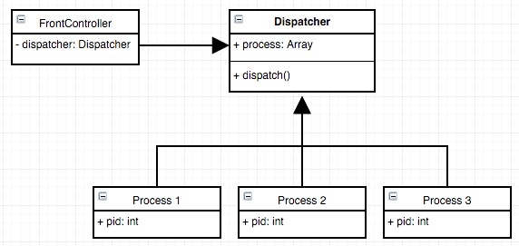
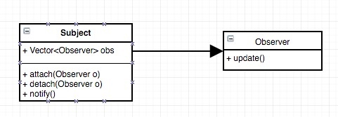
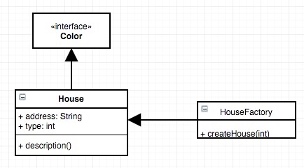

# HW 12

Da Wang (dawang)

> Consider this scenario. The business decision process of a company involves several decision makers.Each position has can have its own set of rules which orders they can approve. In more detail, each executive can respond to a purchase request within a certain price range. Beyond the range, the executive needs to hand it off to her superior. A director can approve a purchase order within `$10K`; a VP can approve within `$25K`; and a President can approve within `$100K`. Beyond that, an executive meeting has to be called to make the decision. To solve this scenario, which design pattern would you like to use? Develop a program to implement this scenario associated with test code.

We can use Chain of Responsibility Pattern. Here is the code.

```java
// DecisionMaker.java
public abstract class DecisionMaker{
    public static int director = 10000;
    public static int vp = 25000;
    public static int president = 100000
    
    protected int price;
    protected string title;
    // next element in the chain
    protected DecisionMaker nextDM;
    
    public void setNextDM(DecisionMaker dm){
        this.nextDM = dm;        
    }
    
    public void makeDecision(int price){
        if (this.price > 0 && price <= this.price){
            System.out.println(title + "can make the decision for price "  + price);
        } else if (nextDM != null){
            System.out.println("Handle to higher level decision maker");
        }
    }
}

// DirectorDM.java
public class DirectorDM extends DecisionMaker{
    public DirectorDM(int price){
        this.price = price;
    }
}

// VPDM.java
public class VPDM extends DecisionMaker{
    public VPDM(int price){
        this.price = price;
    }
}

// PresidentDM.java
public class PresidentDM extends DecisionMaker{
    public PresidentDM(int price){
        this.price = price;
    }
}

// ExecutiveMeetingDM
public class ExecutiveMeetingDM extends DecisionMaker {
    public ExecutiveMeetingDM(int price){
        this.price = price;
    }
}

// DMDemo.java
public class DMDemo {
    private static DecisionMaker getChainOfDMs() {
        DecisionMaker director = new DirectorDM(10000);
        DecisionMaker vp = new VPDM(25000);
        DecisionMaker president = new PresidentDM(100000);
        // -1 means infinitive
        DecisionMaker exemeet = new ExecutiveMeetingDM(-1);
        
        director.setNextDM(vp);
        vp.setNextDM(president);
        prsident.setNextDM(exemeet);
        
        return director;
    }
    
    public static void main(String[] args){
        DecisionMaker dmChain = getChainofDMs();
        
        dmChain.makeDecision(5000);
        dmChain.makeDecision(12000);
        dmChain.makeDecision(32000);
        dmChain.makeDecision(302000);
    }
}
```

> At an airport, typically there is an airport control tower. All airplanes talk to the control tower instead of having plane-to-plane communication. The control tower looks after which airplane can take off and land. In order to implement such a scenario, which design pattern would you suggest to use? Briefly implement your idea associated with test code.

We can use Mediator Pattern. Here is the code.

```java
// Tower.java
public class Tower {
    public static void handleRequest(Plane plane){
        System.out.println("[" + plane.toString() + "] Requested.");
    }
}

// Plane.java
public class Plane {
    private String company;
    private String code;
    
    public Plane(String c, String co){
        company = c;
        code = co;
    }
    
    public sendRequest(){
        Tower.handleRequest(this);
    }
    
    @Override
    public String toSring(){
        return company + "-" + code;
    }
}

// Airport.java
public class Airport {
    public static void main(String[] args) {
        Plane p1 = new Plane("AA", "1000");
        Plane p2 = new Plane("Delta", "2000");
        
        p1.sendRequest();
        p2.sendRequest();
    }
}
```

> Which design pattern is suitable to enable the round-robin CPU scheduling strategy? A CPU typically serves multiple applications simultaneously. Applications will be loaded to memory in a waiting queue. When it is its turn, it will be loaded to CPU to execute. After a common time unit, the application will be swapped out of the CPU and wait for its next turn, and the next application in the queue will be loaded into the CPU to execute. In order for an application to be resumed execution from the last time it was paused, it is important that its context be stored before being moved out of CPU and be recovered before it is loaded into CPU once again. Which design pattern is suitable to realize this context switch scenario? Draw class diagram and write pseudo code.

We can use Front Controller Pattern. Here is the class diagram and pseudo code.



```java

// add new process
process.add(p);

// dispatch
while (1) {
    curProcess = process[index];
    .. set timer
    curProcess.run();
    .. timer end
    curProcess.pause();
    index = (index + 1) % process.size();
}
```

> Company is trying to implement a message bus between services, supporting different types of multi-casting and broadcasting communication scenarios. A service can broadcast a message to all services registered in the message bus. In addition, services can form interest groups, and a service can send messages to its group member services. Which design pattern is suitable to design such a message bus? Draw class diagram and write pseudo code.

We can use Observer Pattern. Here is the class diagram and pseudo code.



```java
Subject s = new Subject();
s.attach(ob1);
s.attach(ob2);
// send message
s.notify();
```

> In the real world you usually find buildings in a community look similar. For example, the buildings appear in the same shape and structures, but each has specific color. It is reasonable to think they share a basic house plan, while have variations. Which design pattern is reflected here? Draw class diagram and write pseudo code.

We can use Flyweight Pattern. Here is the class diagram and pseudo code.



```java
house1 = HouseFactory.createHouse(1);
house1.setColor("blue");

house2 = HouseFactory.createHouse(2);
house2.setColor("green");
```

> Describe a real-life example that illustrates an application of the state design pattern.

Compiler Lexical Analyzer

> Describe a real-life example that illustrates an application of the visitor design pattern.

Json Parser

> Describe a real-life example that illustrates an application of the command design pattern.

Bash

