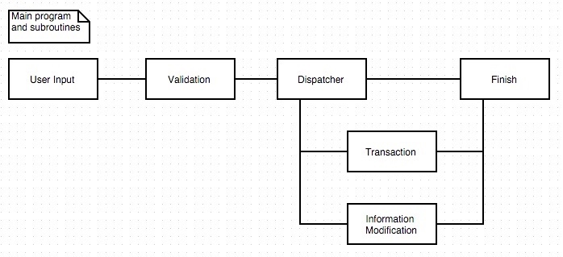
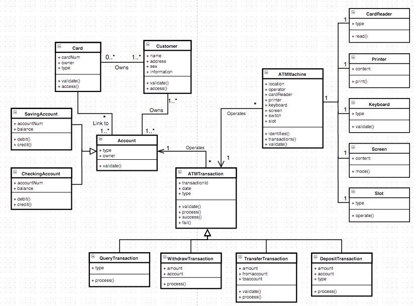
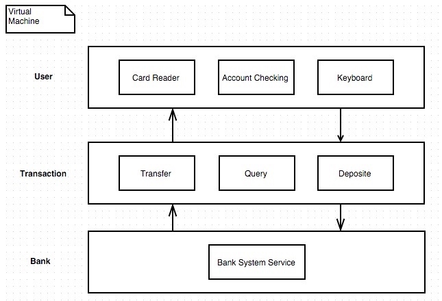
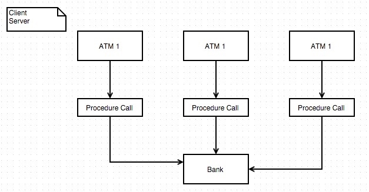
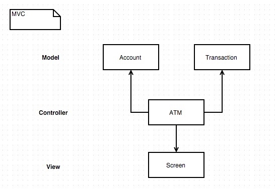
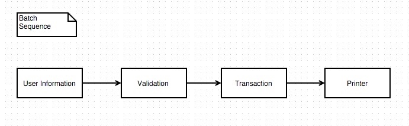
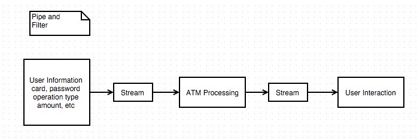
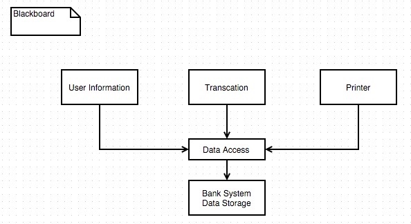
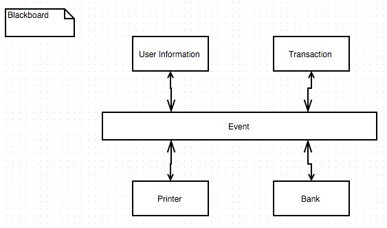

# 18653 HW 2.2

+ Name: Da Wang
+ Andrew ID: dawang

I've tried different styles the the ATM Design as followed:

## Main program and sub routines

This style is quite similar with the design of programming, using sequence, branch and loops to construct the logic of the whole system. Based on different transaction, combing the common steps, using a dispatcher to control the program to jump to sub routines then jump back:

## Object Oriented 

The OO design is just like what I've done in HW1, each object can perform several tasks without any assistance: 

## Virtual machines

This is a typical style of layering. Different layers communicate with each other by different API: 

## Client Server

This is also a layered model with the seperation of client and server. Client needs to perform some basic validation and computation, the server use its powerful hardware system to make sure everything works well. This is one of the natural architecture for ATM machines.

## MVC

This model is not that suitable for ATM machine. Because of the limited states and contents, the main focus of the system should be stability and security:

## Batch Sequence

This style is similar as the first style. The only difference is that it is based on the dataflow, not the control flow:

## Pipe and filter

This style is not proper for the interaction of ATM as each operation needs the confirmation from the user. This style requires the user to input all the content in the first place:

## Blackboard

This style is similar to the client-server style, with a unified data access api to control the flow and data. One possible design is:

## Rule Based & MapReduce

These two styles are not suitable for ATM machine, because:

+ Using inferring engine may cause unexpected behavior
+ MapReduce is a distributed porgramming model which is kind of useless for ATM machine.

## Interpreter & Mobile Code

The main focus of interpreter and mobile code is flexibility, which is the least concern for ATM machine.

## Peer to peer

One side of the model should be the ATM machine, and the other side will be the Bank Server. Which make the style almost identical to client-server style.

## C2

The main idea is using events to connect different components:

## CORBA

This style is focusing on combining different platform, programming language togethor. ATM system needs stability and a simple structure will be much better.

